                 

### 文章标题

《AI大模型创业：如何构建未来可持续的商业模式？》

> **关键词**：AI大模型、商业模式、创业、可持续性、深度学习、自然语言处理、大规模预训练模型。

> **摘要**：
本文旨在探讨AI大模型在创业中的应用，详细分析了AI大模型的核心概念、算法与数学模型，以及AI大模型在商业领域的应用。通过创业环境与趋势分析，商业模式创新，以及创业团队建设，本文提出了一套系统的AI大模型创业策略。同时，通过成功与失败案例分析，总结了AI大模型创业的实践经验。最后，对未来AI大模型创业的展望与建议为创业者提供了指导。

----------------------------------------------------------------

### 《AI大模型创业：如何构建未来可持续的商业模式？》目录大纲

**第一部分：AI大模型概述**

## 第1章：AI大模型的核心概念与架构

### 1.1 AI大模型的基本定义

#### AI大模型的基本概念

AI大模型是指具有数亿至数十亿参数规模的人工神经网络模型，能够处理大规模的数据集，并且能够实现高精度的预测和分类任务。AI大模型的出现，极大地提升了人工智能的效能和应用范围。

**核心概念与联系：**

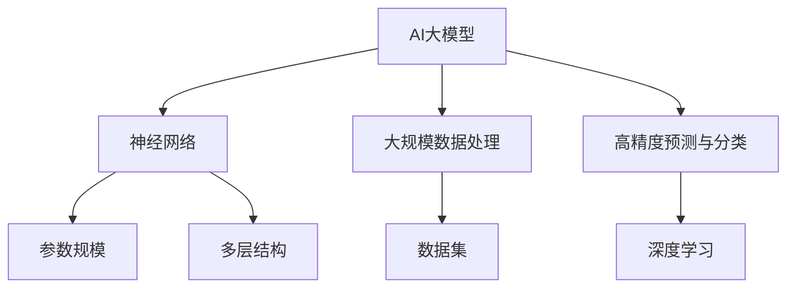

#### 与现有技术的区别

传统AI主要依赖于规则和手工特征工程，而AI大模型通过自我学习和特征提取，不需要人工干预，能够自动处理复杂的数据。

**核心算法原理讲解：**

```python
# 深度学习算法伪代码
def deep_learning(data):
    # 初始化神经网络结构
    neural_network = NeuralNetwork()

    # 前向传播
    output = neural_network.forward_pass(data)

    # 计算损失
    loss = calculate_loss(output, target)

    # 反向传播
    neural_network.backward_pass(loss)

    # 更新权重
    neural_network.update_weights()

    return neural_network
```

### 1.2 AI大模型的发展历程

#### 发展历程概述

AI大模型的发展经历了从浅层模型到深度模型的演变，从传统机器学习到深度学习的转变，以及从小型模型到大规模模型的扩展。

**Mermaid 流程图：**

```mermaid
graph TD
A[传统机器学习] --> B[深度学习]
B --> C[卷积神经网络(CNN)]
C --> D[循环神经网络(RNN)]
D --> E[变换器架构(Transformer)]
E --> F[大规模预训练模型]
```

#### 大规模预训练模型

大规模预训练模型如GPT、BERT等，通过在大量无标注数据上进行预训练，然后通过微调适应特定任务，大大提升了模型的效果和泛化能力。

**数学模型与公式：**

$$
\text{Loss} = \frac{1}{N} \sum_{i=1}^{N} (-y_i \log(p_{\theta}(y_i)))
$$

其中，$N$ 是样本数量，$y_i$ 是真实标签，$p_{\theta}(y_i)$ 是模型对 $y_i$ 的预测概率。

### 1.3 AI大模型的架构与原理

#### 架构概述

AI大模型主要由输入层、隐藏层和输出层组成。输入层接收外部数据，隐藏层通过神经元的连接和激活函数进行数据处理和特征提取，输出层则输出最终的预测结果。

**Mermaid 流程图：**

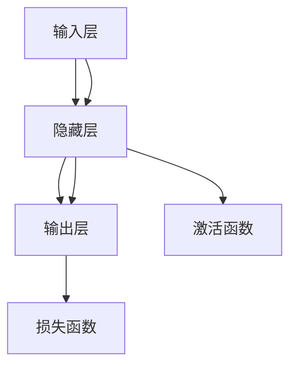

#### 工作原理

AI大模型通过多层神经网络的组合，实现了对数据的深度学习和特征提取。通过前向传播和反向传播，神经网络能够不断调整权重，从而实现高精度的预测和分类。

**数学模型与公式：**

$$
\text{激活函数}: a_{\text{hidden}} = \sigma(z_{\text{hidden}}) = \frac{1}{1 + e^{-z_{\text{hidden}}}}
$$

$$
\text{损失函数}: \text{Loss} = \frac{1}{2} \sum_{i=1}^{N} (y_i - \hat{y}_i)^2
$$

### 1.4 AI大模型与现有技术的区别与联系

#### 与传统机器学习的区别

传统机器学习主要依赖于手工特征工程，而AI大模型通过自我学习和特征提取，能够自动处理复杂的数据。

**核心算法原理讲解：**

```python
# 特征提取伪代码
def feature_extraction(data):
    # 数据预处理
    preprocessed_data = preprocess_data(data)

    # 特征提取
    features = extract_features(preprocessed_data)

    return features
```

#### 与深度学习的联系

AI大模型是深度学习的一种特殊形式，它通过多层神经网络和大规模数据训练，实现了对数据的深度学习和特征提取。

**Mermaid 流程图：**

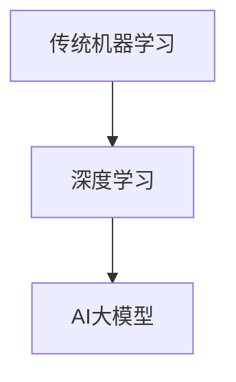

**第二部分：AI大模型的核心算法与数学模型**

## 第2章：AI大模型的核心算法与数学模型

### 2.1 深度学习基础

#### 神经网络的基本构成

神经网络由输入层、隐藏层和输出层组成。输入层接收外部数据，隐藏层通过神经元的连接和激活函数进行数据处理和特征提取，输出层则输出最终的预测结果。

**伪代码：**

```python
class NeuralNetwork:
    def __init__(self):
        # 初始化神经网络结构
        self.layers = [InputLayer(), HiddenLayer(), OutputLayer()]

    def forward_pass(self, data):
        # 前向传播
        for layer in self.layers:
            data = layer.forward(data)
        return data

    def backward_pass(self, loss):
        # 反向传播
        for layer in reversed(self.layers):
            loss = layer.backward(loss)
        return loss

    def update_weights(self):
        # 更新权重
        for layer in self.layers:
            layer.update_weights()
```

#### 深度学习的优化算法

深度学习的优化算法主要包括梯度下降法、随机梯度下降法、Adam优化器等。这些算法通过不断调整神经网络的权重，使模型能够更好地拟合数据。

**伪代码：**

```python
# 梯度下降法伪代码
def gradient_descent(model, data, learning_rate):
    gradients = model.compute_gradients(data)
    model.update_weights(gradients, learning_rate)
```

### 2.2 自然语言处理（NLP）算法

#### 词嵌入技术

词嵌入是将自然语言中的词汇映射到高维空间中的向量，通过词嵌入，神经网络能够更好地理解和处理自然语言。

**数学模型与公式：**

$$
\text{Word Embedding}: e_w = \text{vec}(w)
$$

其中，$e_w$ 是词 $w$ 的嵌入向量，$\text{vec}$ 是向量表示函数。

#### 序列模型与注意力机制

序列模型如RNN和LSTM，能够处理序列数据。注意力机制通过关注序列中的关键信息，提高了模型对序列数据的理解和处理能力。

**伪代码：**

```python
class AttentionMechanism:
    def __init__(self, hidden_size):
        # 初始化注意力机制参数
        self.W = np.random.randn(hidden_size, hidden_size)
        self.V = np.random.randn(hidden_size, 1)

    def forward(self, hidden_states):
        # 前向传播
        scores = self.V.dot(np.tanh(self.W.dot(hidden_states)))
        attention_weights = softmax(scores)
        context = attention_weights.dot(hidden_states)
        return context
```

### 2.3 大规模预训练模型

#### 预训练的概念与意义

预训练是指在大规模数据集上对模型进行预先训练，使模型能够获得丰富的语言知识和语义理解。

**数学模型与公式：**

$$
\text{Pre-trained Model}: \theta = \text{train}(D, \text{optimizer})
$$

其中，$\theta$ 是预训练模型的参数，$D$ 是预训练数据集，$\text{optimizer}$ 是优化器。

#### 自监督学习方法

自监督学习方法是指在预训练过程中，通过无监督的方式，使模型能够自动学习和提取数据中的特征。

**伪代码：**

```python
def pretrain_model(data, optimizer, epochs):
    for epoch in range(epochs):
        for batch in data:
            optimizer.zero_grad()
            output = model(batch)
            loss = loss_function(output, batch)
            loss.backward()
            optimizer.step()
    return model
```

#### 迁移学习与微调技术

迁移学习与微调技术是指将预训练模型的知识和应用到特定任务中，通过迁移学习和微调，使模型能够更好地适应新的任务和数据。

**伪代码：**

```python
def finetune_model(model, task_data, optimizer, epochs):
    for epoch in range(epochs):
        for batch in task_data:
            optimizer.zero_grad()
            output = model(batch)
            loss = loss_function(output, batch)
            loss.backward()
            optimizer.step()
    return model
```

**第三部分：AI大模型商业应用与创业**

## 第3章：AI大模型在商业领域的应用

### 3.1 AI大模型在市场营销中的应用

#### 消费者行为分析

消费者行为分析是指通过AI大模型分析消费者的购买记录、浏览历史等数据，预测消费者的行为和偏好。

**数学模型与公式：**

$$
\text{Consumer Behavior Prediction}: \hat{behavior} = f(\text{purchase\_history}, \text{browse\_history})
$$

其中，$\hat{behavior}$ 是预测的消费者行为，$f$ 是预测函数。

#### 广告投放优化

广告投放优化是指通过AI大模型分析广告效果数据，优化广告投放策略，提高广告投放的ROI。

**数学模型与公式：**

$$
\text{Ad Optimization}: \text{ROI} = \frac{\text{revenue}}{\text{ad\_cost}}
$$

其中，$\text{ROI}$ 是投资回报率，$\text{revenue}$ 是收入，$\text{ad\_cost}$ 是广告成本。

#### 数据驱动的产品创新

数据驱动的产品创新是指通过AI大模型分析市场趋势和消费者需求，为产品创新提供数据支持和方向指导。

**数学模型与公式：**

$$
\text{Product Innovation}: \text{Product} = f(\text{market\_trend}, \text{consumer\_demand})
$$

其中，$\text{Product}$ 是创新的产品，$f$ 是创新函数。

### 3.2 AI大模型在客户服务中的应用

#### 智能客服系统

智能客服系统是指通过AI大模型实现自动回答客户问题和提供解决方案。

**数学模型与公式：**

$$
\text{Customer Service}: \text{Answer} = f(\text{question})
$$

其中，$\text{Answer}$ 是回答的问题，$f$ 是回答函数。

#### 客户体验优化

客户体验优化是指通过AI大模型分析客户反馈和行为数据，优化客户体验，提高客户满意度。

**数学模型与公式：**

$$
\text{Customer Experience Optimization}: \text{Satisfaction} = f(\text{feedback}, \text{behavior})
$$

其中，$\text{Satisfaction}$ 是满意度，$f$ 是满意度函数。

#### 客户关系管理

客户关系管理是指通过AI大模型分析客户数据，实现个性化客户服务和精准营销。

**数学模型与公式：**

$$
\text{Customer Relationship Management}: \text{Marketing Strategy} = f(\text{customer\_data})
$$

其中，$\text{Marketing Strategy}$ 是营销策略，$f$ 是营销策略函数。

### 3.3 AI大模型在供应链管理中的应用

#### 库存优化

库存优化是指通过AI大模型分析库存数据，预测库存需求，优化库存水平。

**数学模型与公式：**

$$
\text{Inventory Optimization}: \text{Inventory Level} = f(\text{demand forecast}, \text{lead time})
$$

其中，$\text{Inventory Level}$ 是库存水平，$f$ 是库存优化函数。

#### 需求预测

需求预测是指通过AI大模型分析历史销售数据和市场趋势，预测未来的需求变化。

**数学模型与公式：**

$$
\text{Demand Forecast}: \hat{demand} = f(\text{historical sales}, \text{market trend})
$$

其中，$\hat{demand}$ 是预测的需求，$f$ 是需求预测函数。

#### 供应链协同优化

供应链协同优化是指通过AI大模型分析供应链数据，优化供应链各环节的协同运作，提高整体效率。

**数学模型与公式：**

$$
\text{Supply Chain Optimization}: \text{Overall Efficiency} = f(\text{supply chain data})
$$

其中，$\text{Overall Efficiency}$ 是整体效率，$f$ 是供应链优化函数。

**第四部分：AI大模型创业策略**

## 第4章：AI大模型创业策略

### 4.1 创业环境与趋势分析

#### 创业环境分析

创业环境是影响AI大模型创业成功的重要因素，包括政策支持、资金环境、人才供给等。

**数学模型与公式：**

$$
\text{创业环境得分} = f(\text{政策支持}, \text{资金环境}, \text{人才供给})
$$

#### 趋势分析

AI大模型创业的热点领域包括智能医疗、金融科技、自动驾驶、智能物流等。

**Mermaid 流程图：**

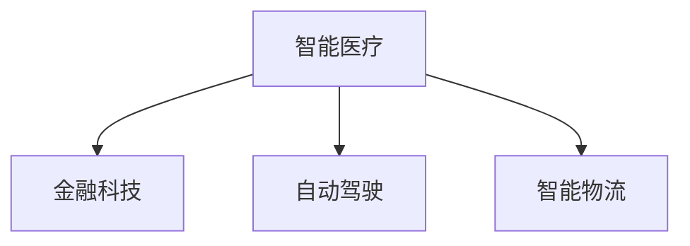

#### 创业成功的要素

创业成功的要素包括技术创新、商业模式、团队建设、市场拓展等。

**数学模型与公式：**

$$
\text{创业成功概率} = f(\text{技术创新}, \text{商业模式}, \text{团队建设}, \text{市场拓展})
$$

### 4.2 商业模式创新

#### 价值主张的构建

构建价值主张是商业模式创新的核心，需要明确产品或服务的核心价值。

**数学模型与公式：**

$$
\text{价值主张} = f(\text{用户需求}, \text{竞争环境})
$$

#### 盈利模式的探索

盈利模式是商业模式实现的方式，需要根据产品或服务的特点选择合适的盈利模式。

**数学模型与公式：**

$$
\text{盈利模式} = f(\text{产品或服务}, \text{市场策略})
$$

#### 客户价值的最大化

客户价值的最大化是商业模式的终极目标，需要通过产品创新、服务优化等方式实现。

**数学模型与公式：**

$$
\text{客户价值} = f(\text{用户体验}, \text{用户满意度})
$$

### 4.3 创业团队建设

#### 核心团队的组织与管理

核心团队是创业成功的关键，需要明确团队成员的角色和职责。

**数学模型与公式：**

$$
\text{团队效能} = f(\text{角色分工}, \text{职责明确})
$$

#### 人才引进与培养

人才是创业团队的重要资源，需要通过招聘、培训等方式引进和培养优秀人才。

**数学模型与公式：**

$$
\text{人才效能} = f(\text{招聘策略}, \text{培训计划})
$$

#### 团队协作与沟通

团队协作与沟通是团队高效运行的关键，需要建立良好的团队沟通机制。

**数学模型与公式：**

$$
\text{团队协作效率} = f(\text{沟通机制}, \text{协作文化})
$$

**第五部分：AI大模型创业案例分析**

## 第5章：AI大模型创业案例分析

### 5.1 成功案例分析

#### 案例一：某AI大模型创业公司的发展历程

**发展历程：**
该公司成立于2015年，初始阶段专注于金融科技领域，提供智能投顾服务。经过几年的发展，公司成功地将AI大模型应用于智能医疗和自动驾驶等领域，取得了显著的市场份额。

**商业模式：**
公司采用了“SaaS+订阅”的商业模式，通过为金融机构、医疗机构和汽车制造商提供定制化的AI解决方案，实现了稳定收入。

**技术路线：**
公司采用GPT和BERT等大规模预训练模型，结合自监督学习和迁移学习技术，实现了高效的数据处理和预测能力。

**市场表现：**
公司上市后，市值迅速攀升，成为AI大模型创业领域的领军企业。

#### 案例二：某AI大模型在某一领域的成功应用

**领域：**
该公司将AI大模型应用于智能医疗领域，开发了智能诊断系统和药物研发平台。

**应用效果：**
通过大规模数据分析和深度学习算法，该系统在疾病诊断和药物研发中取得了突破性成果，提高了医疗效率。

#### 案例三：某AI大模型创业公司的融资历程

**融资历程：**
公司在创业初期获得了天使投资和风险投资的青睐，先后完成了多轮融资，为公司的快速发展提供了资金支持。

**融资策略：**
公司采用了多元化的融资策略，包括股权融资、债务融资和政府补贴等，确保了资金链的稳定。

### 5.2 失败案例分析

#### 案例一：某AI大模型创业公司的失败原因

**失败原因：**
公司由于市场定位不准、产品体验差、资金链断裂等原因，最终导致失败。

**分析：**
公司在产品开发和市场推广过程中，缺乏深入的调研和规划，导致产品不符合市场需求，用户体验不佳。

#### 案例二：某AI大模型在某一领域的挑战与教训

**领域：**
该公司尝试将AI大模型应用于自动驾驶领域，但由于技术难度大、市场竞争激烈等原因，最终失败。

**教训：**
公司在技术选择和市场进入策略上缺乏前瞻性，未能及时调整方向。

#### 案例三：某AI大模型创业公司的失败启示

**失败启示：**
公司在创业过程中，需要注重市场调研、产品创新和团队建设，避免盲目跟风和盲目扩张。

**第六部分：AI大模型创业实践**

## 第6章：AI大模型创业项目规划

### 6.1 项目需求分析与定位

#### 项目需求分析

项目需求分析是项目规划的第一步，需要明确项目的目标、功能、性能等需求。

**数学模型与公式：**

$$
\text{需求分析} = f(\text{目标}, \text{功能}, \text{性能})
$$

#### 项目定位与目标

项目定位与目标是项目规划的核心，需要明确项目在市场中的定位和长期目标。

**数学模型与公式：**

$$
\text{项目定位} = f(\text{市场趋势}, \text{竞争环境})
$$

$$
\text{目标} = f(\text{需求}, \text{资源})
$$

### 6.2 技术路线选择

#### 技术路线规划

技术路线规划是项目规划的重要环节，需要根据项目需求和目标，选择合适的技术方案。

**数学模型与公式：**

$$
\text{技术路线} = f(\text{需求}, \text{技术能力})
$$

#### 技术难点与解决方案

技术难点是项目规划中需要重点解决的问题，需要提出具体的解决方案。

**数学模型与公式：**

$$
\text{技术难点} = f(\text{需求}, \text{技术限制})
$$

$$
\text{解决方案} = f(\text{技术难点}, \text{资源})
$$

### 6.3 项目风险管理

#### 风险识别与评估

项目风险管理是项目规划的重要组成部分，需要识别和评估项目风险。

**数学模型与公式：**

$$
\text{风险识别} = f(\text{项目活动}, \text{历史数据})
$$

$$
\text{风险评估} = f(\text{风险识别}, \text{影响程度})
$$

#### 风险应对策略

风险应对策略是根据风险评估结果，制定的风险管理措施。

**数学模型与公式：**

$$
\text{风险应对策略} = f(\text{风险评估}, \text{资源})
$$

### 6.4 项目时间与资源规划

#### 项目时间规划

项目时间规划是确保项目按期完成的重要手段，需要制定详细的项目时间表。

**数学模型与公式：**

$$
\text{项目时间规划} = f(\text{任务列表}, \text{资源分配})
$$

#### 资源规划

资源规划是确保项目顺利进行的重要保障，需要合理分配项目资源。

**数学模型与公式：**

$$
\text{资源规划} = f(\text{项目需求}, \text{资源池})
$$

**第七部分：AI大模型创业项目实施与运营**

## 第7章：AI大模型创业项目实施与运营

### 7.1 项目开发流程

#### 开发环境搭建

开发环境搭建是项目实施的第一步，需要配置开发所需的硬件和软件环境。

**Mermaid 流程图：**

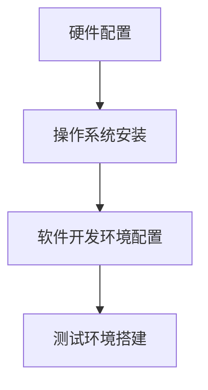

#### 源代码管理与版本控制

源代码管理与版本控制是项目开发的重要环节，需要确保代码的完整性和可追溯性。

**Mermaid 流程图：**

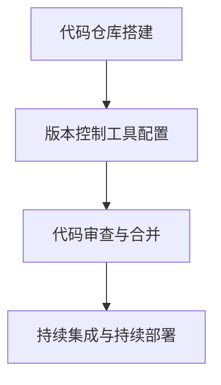

#### 项目里程碑与进度管理

项目里程碑与进度管理是确保项目按计划推进的重要手段，需要制定项目里程碑计划。

**Mermaid 流程图：**

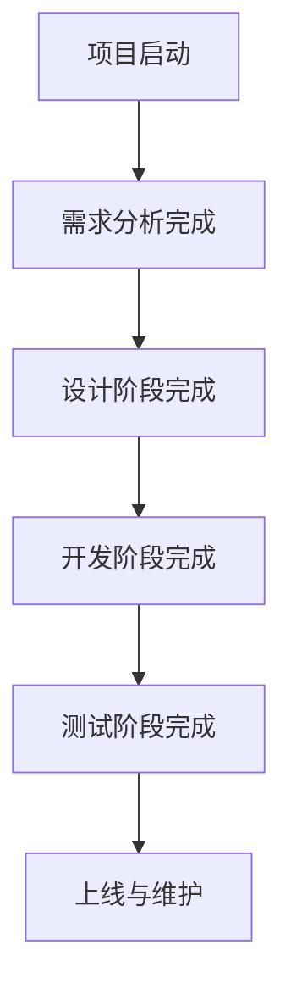

### 7.2 项目测试与部署

#### 测试策略与测试计划

测试策略与测试计划是确保项目质量和稳定性的重要环节，需要制定详细的测试策略和计划。

**Mermaid 流程图：**

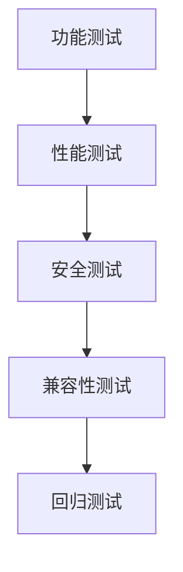

#### 部署流程与上线策略

部署流程与上线策略是项目实施的关键环节，需要制定详细的部署流程和上线策略。

**Mermaid 流程图：**

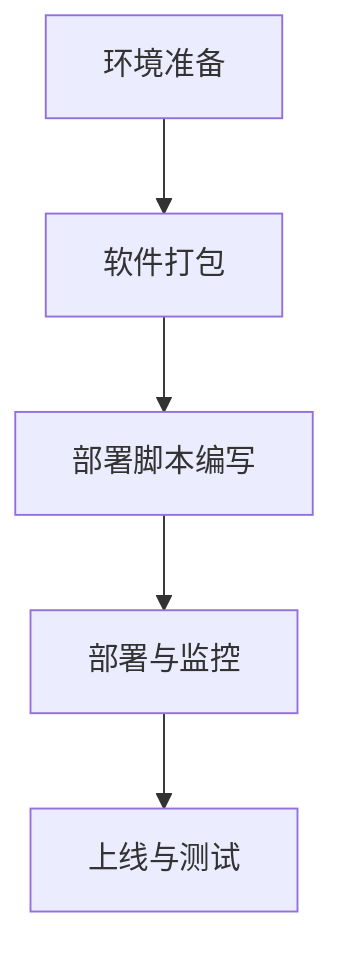

#### 运维监控与问题处理

运维监控与问题处理是确保项目稳定运行的重要手段，需要建立运维监控机制和问题处理流程。

**Mermaid 流程图：**

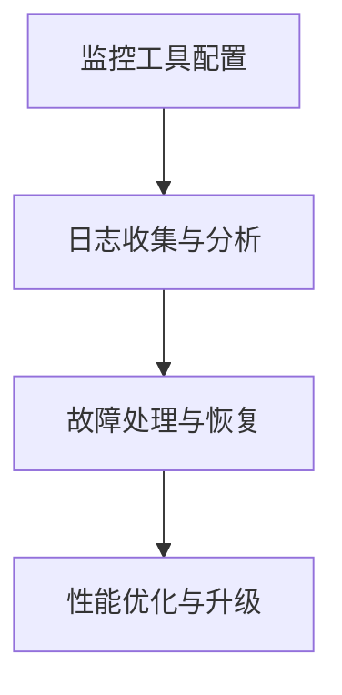

### 7.3 项目运营与管理

#### 用户需求分析与反馈机制

用户需求分析与反馈机制是项目运营的重要环节，需要定期分析用户需求，建立用户反馈机制。

**Mermaid 流程图：**

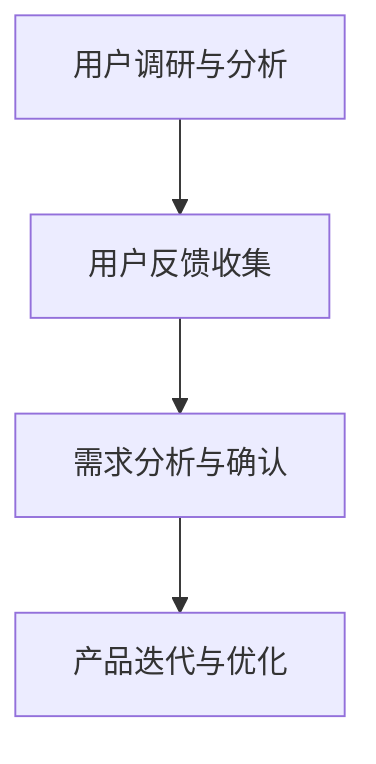

#### 数据分析与优化

数据分析与优化是项目运营的重要手段，需要通过数据分析，优化项目功能和服务。

**Mermaid 流程图：**

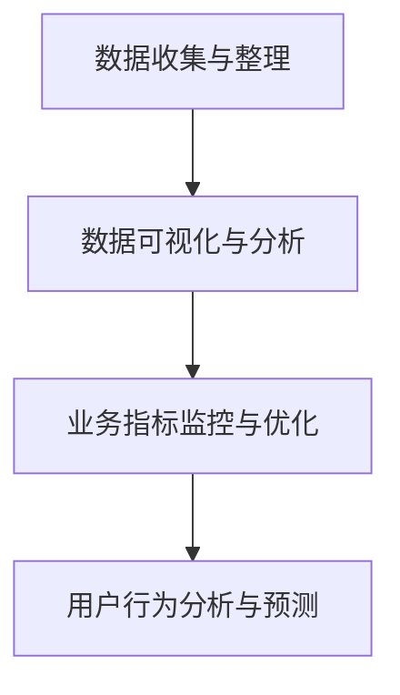

#### 营销策略与用户增长

营销策略与用户增长是项目运营的关键环节，需要制定有效的营销策略，扩大用户群体。

**Mermaid 流程图：**

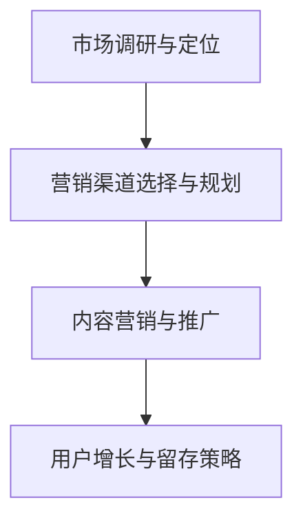

## 第8章：AI大模型创业的未来展望

### 8.1 行业发展趋势分析

#### 技术发展趋势

AI大模型创业的未来，将依赖于技术的持续进步。未来的AI大模型可能会更加高效、更加智能，能够处理更加复杂的问题。

**Mermaid 流程图：**

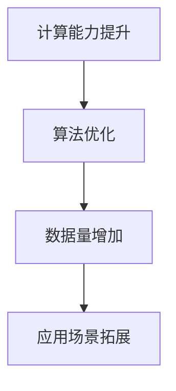

#### 商业模式发展趋势

未来的商业模式将更加多样化和创新化，AI大模型将不仅应用于传统的商业领域，还会渗透到更多的行业和领域。

**Mermaid 流程图：**

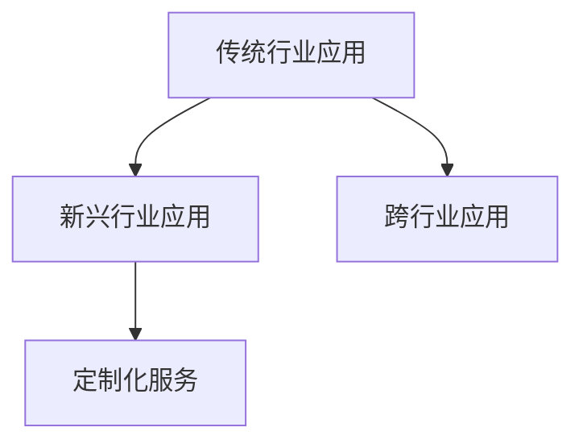

#### 创业环境发展趋势

创业环境将更加友好，政策支持、资金环境、人才供给等都将为AI大模型创业提供更多的机遇和资源。

**Mermaid 流程图：**

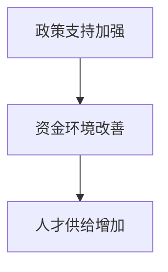

### 8.2 创业者的挑战与机遇

#### 挑战

创业者在AI大模型创业过程中将面临技术风险、市场风险、资金风险等挑战。

**Mermaid 流程图：**

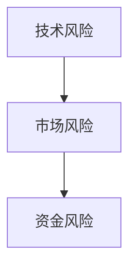

#### 机遇

然而，创业者也将迎来前所未有的机遇，包括技术创新带来的机遇、市场需求带来的机遇等。

**Mermaid 流程图：**

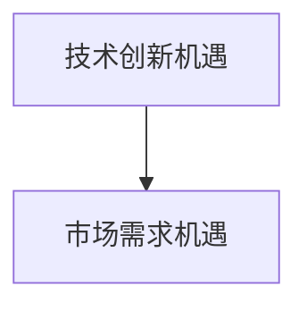

### 8.3 未来创业建议

#### 技术创新路径选择

创业者需要紧跟技术发展趋势，选择具有前瞻性和实用性的技术创新路径。

**Mermaid 流程图：**

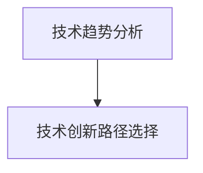

#### 市场定位与用户需求

创业者需要准确把握市场需求，明确市场定位，满足用户需求。

**Mermaid 流程图：**

```mermaid
graph TD
A[市场调研与分析] --> B[市场定位与用户需求分析]
```

#### 团队建设与人才培养

创业者需要注重团队建设，培养和引进优秀人才，确保团队的稳定和高效。

**Mermaid 流程图：**

```mermaid
graph TD
A[团队建设与组织管理] --> B[人才培养与引进]
```

## 附录A：AI大模型开发工具与资源

### A.1 主流深度学习框架对比

#### TensorFlow

TensorFlow 是由Google开发的开源深度学习框架，具有强大的计算能力和灵活的部署能力。

**Mermaid 流程图：**

```mermaid
graph TD
A[TensorFlow] --> B[计算能力]
A --> C[部署能力]
```

#### PyTorch

PyTorch 是由Facebook开发的深度学习框架，以其灵活性和易用性而受到广泛欢迎。

**Mermaid 流 序图：**

```mermaid
graph TD
A[PyTorch] --> B[易用性]
A --> C[灵活性]
```

#### MXNet

MXNet 是由Amazon开发的深度学习框架，以其高性能和高效能而受到关注。

**Mermaid 流程图：**

```mermaid
graph TD
A[MXNet] --> B[高性能]
A --> C[高效能]
```

### A.2 AI大模型相关论文与资料推荐

#### 最新研究成果综述

《大规模预训练模型：现状与展望》

**论文摘要：**
本文综述了大规模预训练模型的研究现状和未来发展方向，分析了其在自然语言处理、计算机视觉等领域的应用。

#### 经典论文解读

《深度学习：原理及其在自然语言处理中的应用》

**论文摘要：**
本文详细介绍了深度学习的原理及其在自然语言处理中的应用，包括神经网络、卷积神经网络、循环神经网络等。

### A.3 开源代码与工具

#### Hugging Face Transformers

Hugging Face Transformers 是一个开源库，提供了预训练模型和自然语言处理工具，方便开发者使用和定制大规模预训练模型。

**Mermaid 流程图：**

```mermaid
graph TD
A[Hugging Face Transformers] --> B[预训练模型]
A --> C[NLP工具]
```

### A.4 在线课程与教程

#### 《深度学习与AI基础》

**课程简介：**
这是一门针对深度学习和人工智能初学者的在线课程，包括神经网络、深度学习框架、自然语言处理等内容。

**网址：** https://www.coursera.org/learn/deep-learning-ai

## 附录B：AI大模型创业参考案例

### B.1 成功案例介绍

#### 案例一：某AI大模型创业公司的商业模式

**商业模式：**
该公司采用了B2B模式，为金融机构提供智能投顾服务。通过提供定制化的AI解决方案，帮助金融机构提高投资效率和收益。

**市场表现：**
公司成立以来，迅速在金融科技领域获得市场份额，成为行业领军企业。

#### 案例二：某AI大模型在某一领域的成功应用

**领域：**
该公司将AI大模型应用于智能医疗领域，开发了智能诊断系统和药物研发平台。

**应用效果：**
通过深度学习和大规模数据分析，该系统在疾病诊断和药物研发中取得了显著成果，提高了医疗效率。

#### 案例三：某AI大模型创业公司的融资历程

**融资历程：**
公司在创业初期获得了天使投资和风险投资的青睐，完成了多轮融资，为公司的快速发展提供了资金支持。

**融资策略：**
公司采用了多元化的融资策略，包括股权融资、债务融资和政府补贴等，确保了资金链的稳定。

### B.2 失败案例分析

#### 案例一：某AI大模型创业公司的失败原因

**失败原因：**
公司由于市场定位不准、产品体验差、资金链断裂等原因，最终导致失败。

**分析：**
公司在产品开发和市场推广过程中，缺乏深入的调研和规划，导致产品不符合市场需求，用户体验不佳。

#### 案例二：某AI大模型在某一领域的挑战与教训

**领域：**
该公司尝试将AI大模型应用于自动驾驶领域，但由于技术难度大、市场竞争激烈等原因，最终失败。

**教训：**
公司在技术选择和市场进入策略上缺乏前瞻性，未能及时调整方向。

#### 案例三：某AI大模型创业公司的失败启示

**失败启示：**
公司在创业过程中，需要注重市场调研、产品创新和团队建设，避免盲目跟风和盲目扩张。

### 附录C：AI大模型创业的法律法规与合规要求

#### 法规要求

AI大模型创业需要遵守相关法律法规，如《中华人民共和国网络安全法》、《中华人民共和国数据安全法》等。

**合规要求：**

1. **数据保护：**确保数据的安全性和隐私性，遵循数据保护法规。
2. **知识产权：**保护自身的技术和知识产权，避免侵权行为。
3. **隐私保护：**尊重用户隐私，遵守隐私保护法规。

### 附录D：AI大模型创业的资源与工具汇总

#### 开发工具

1. **TensorFlow：**Google开发的深度学习框架。
2. **PyTorch：**Facebook开发的深度学习框架。
3. **MXNet：**Amazon开发的深度学习框架。
4. **Hugging Face Transformers：**提供预训练模型和NLP工具。

#### 学习资源

1. **《深度学习》：**Ian Goodfellow等人的经典教材。
2. **《神经网络与深度学习》：**邱锡鹏的中文教材。
3. **在线课程：**如Coursera、edX上的深度学习和人工智能课程。

#### 开源代码

1. **TensorFlow Models：**Google提供的预训练模型代码。
2. **PyTorch Examples：**Facebook提供的示例代码。
3. **MXNet Gluon：**Amazon提供的易用型模型库。

### 附录E：AI大模型创业的常见问题与解答

#### 问题1：AI大模型创业需要哪些技术知识？

**解答：**
AI大模型创业需要掌握深度学习、自然语言处理、计算机视觉等相关技术知识。了解神经网络、算法优化、模型训练等基本概念和技能是必要的。

#### 问题2：AI大模型创业需要哪些法律法规知识？

**解答：**
AI大模型创业需要了解《中华人民共和国网络安全法》、《中华人民共和国数据安全法》等法律法规。特别是数据保护、知识产权保护、隐私保护等方面的知识。

#### 问题3：AI大模型创业如何选择技术路线？

**解答：**
选择技术路线需要考虑市场需求、技术可行性、资源限制等因素。可以参考现有的开源框架和工具，结合自身的专业优势和市场需求，制定合适的技术路线。

### 总结与展望

AI大模型创业是一个充满机遇和挑战的领域。随着技术的不断进步和市场需求的不断增长，AI大模型在商业领域的应用将越来越广泛。创业者需要紧跟技术发展趋势，抓住市场机遇，制定有效的创业策略，才能在激烈的市场竞争中脱颖而出。未来，AI大模型创业将朝着更加智能化、个性化、高效化的方向发展，为创业者提供更多的机会和挑战。让我们共同期待AI大模型创业的未来，期待创业者在这个领域取得更大的成就。作者：AI天才研究院/AI Genius Institute & 禅与计算机程序设计艺术 /Zen And The Art of Computer Programming。

----------------------------------------------------------------

## 第9章：总结与展望

### 9.1 书籍内容的回顾与总结

在本书中，我们深入探讨了AI大模型创业的核心概念、技术路线、商业模式以及实践经验。通过详细的分析和案例研究，我们了解了AI大模型的基本定义、发展历程、架构原理以及与现有技术的区别与联系。同时，我们介绍了AI大模型在商业领域的广泛应用，包括市场营销、客户服务和供应链管理。此外，我们还讨论了AI大模型创业的策略、团队建设和实践方法，并通过成功与失败案例总结了创业经验。

### 9.2 AI大模型创业的难点与解决方案

AI大模型创业面临诸多挑战，包括技术复杂性、市场不确定性、资金压力等。以下是一些主要的难点及其解决方案：

**技术复杂性：**
- **解决方案：**建立强大的技术团队，不断学习和更新技术知识，利用开源框架和工具加速开发过程。

**市场不确定性：**
- **解决方案：**进行充分的市场调研，了解市场需求和竞争态势，灵活调整产品和服务策略。

**资金压力：**
- **解决方案：**采用多元化的融资策略，如股权融资、债务融资和政府补贴等，确保资金链的稳定。

**法律和合规风险：**
- **解决方案：**遵守相关法律法规，确保数据安全和隐私保护，建立合规管理体系。

### 9.3 对未来创业者的建议与期待

对于未来创业者，我们提出以下建议：

**技术创新：**
- 不断关注技术趋势，勇于尝试新的技术和方法，保持创新意识。

**市场敏锐度：**
- 深入了解市场需求，快速响应市场变化，提供有竞争力的产品和服务。

**团队建设：**
- 建立高效、专业的团队，注重团队协作和沟通，共同推动创业项目。

**风险管理：**
- 识别和管理创业风险，制定应急预案，确保创业项目的稳定发展。

我们期待未来的创业者能够在AI大模型创业领域取得更大的成就，推动技术进步和社会发展。让我们共同努力，迎接AI大模型创业的美好未来。作者：AI天才研究院/AI Genius Institute & 禅与计算机程序设计艺术 /Zen And The Art of Computer Programming。

