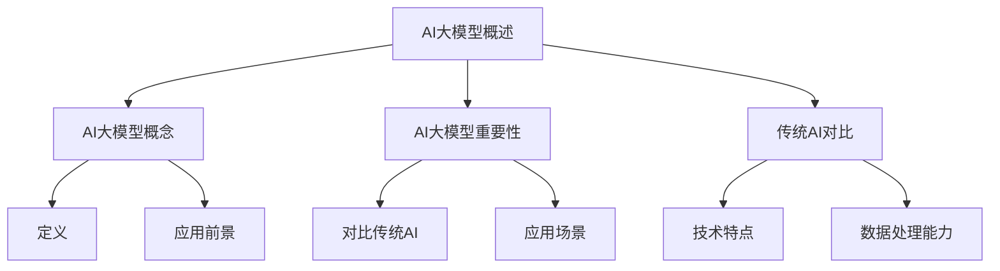

                 

# 《AI大模型在电商平台促销策略优化中的应用》

## 关键词
AI大模型，电商平台，促销策略，神经网络，深度学习，数据预处理，预测模型，销售额优化

## 摘要
本文探讨了如何利用AI大模型优化电商平台促销策略，提高销售额和用户满意度。通过详细阐述AI大模型的概念、核心技术原理、数学基础，以及电商平台促销策略分析，本文提供了一个全面的技术指南。同时，通过实际案例分析，展示了如何通过AI大模型实现促销策略的优化，并提供了详细的开发环境和项目实战步骤。本文旨在为电商行业从业者提供有价值的参考，以实现更加智能化的促销策略。

### 目录大纲

# 《AI大模型在电商平台促销策略优化中的应用》

## 第一部分：AI大模型基础

### 第1章：AI大模型概述

#### 1.1 AI大模型的概念与重要性

##### 1.1.1 什么是AI大模型

AI大模型，通常指的是具有大规模参数和复杂结构的深度学习模型。这些模型能够在大量数据上进行训练，从而学习到高度复杂的模式和规律。常见的AI大模型包括GPT-3、BERT、Transformers等。

##### 1.1.2 AI大模型在电商促销策略优化中的应用前景

随着人工智能技术的不断发展，AI大模型在电商平台的应用前景十分广阔。通过AI大模型，电商平台可以实现精准的用户行为预测、商品推荐和促销策略优化，从而提高销售额和用户满意度。

##### 1.1.3 AI大模型与传统AI的对比

传统AI模型通常依赖于手动的特征工程，而AI大模型则能够自动地从大量数据中学习特征。这使得AI大模型在处理高维度数据和复杂数据时具有显著的优势。

### 第2章：AI大模型核心技术原理

#### 2.1 神经网络基础

##### 2.1.1 神经网络的基本结构

神经网络由多个神经元（或称为节点）组成，这些神经元通过加权连接形成网络结构。每个神经元接收输入信号，通过激活函数进行非线性变换，然后产生输出。

##### 2.1.2 常见神经网络类型

常见的神经网络类型包括前馈神经网络、卷积神经网络（CNN）和循环神经网络（RNN）。这些神经网络在处理不同类型的数据时具有不同的优势。

#### 2.2 预训练与微调

##### 2.2.1 预训练的概念

预训练是指使用大量未标记的数据对神经网络进行初步训练，使其能够学习到一些通用的特征表示。然后，通过微调过程，将预训练模型应用于特定任务，并进行精细调整。

##### 2.2.2 微调技术

微调技术通过在预训练模型的基础上添加额外的层或调整现有层的权重，使其能够适应特定任务。这种方法能够提高模型的性能，同时减少对标记数据的依赖。

### 第3章：数学基础

#### 3.1 概率论与统计基础

##### 3.1.1 基本概率概念

概率论是AI大模型的基础之一，包括事件、样本空间、概率分布等基本概念。

##### 3.1.2 统计量

统计量是用于描述数据集特征的数值指标，包括均值、方差、标准差等。

##### 3.1.3 常见统计分布

常见的统计分布包括正态分布、二项分布、泊松分布等，这些分布用于描述不同类型的数据特征。

#### 3.2 概率图模型

##### 3.2.1 贝叶斯网络

贝叶斯网络是一种表示变量之间概率关系的图形模型，通过节点和边来表示变量及其条件概率。

##### 3.2.2 决策树

决策树是一种基于特征值进行决策的树形结构，通过递归划分数据集，以最小化损失函数。

## 第二部分：电商平台促销策略优化

### 第4章：电商平台促销策略分析

#### 4.1 促销策略类型

##### 4.1.1 折扣促销

折扣促销是电商平台最常用的促销策略之一，通过提供价格折扣来吸引消费者购买。

##### 4.1.2 礼品促销

礼品促销是通过提供赠品或优惠券来激励消费者购买，从而提高销售额。

##### 4.1.3 限时促销

限时促销是通过限定促销时间来创造紧迫感，刺激消费者在规定时间内购买。

### 第5章：数据收集与预处理

#### 5.1 数据源收集

##### 5.1.1 用户行为数据

用户行为数据包括浏览记录、购买记录、搜索记录等，这些数据反映了用户对产品的兴趣和购买行为。

##### 5.1.2 产品数据

产品数据包括产品价格、分类、库存量等，这些数据用于描述产品的属性和市场表现。

#### 5.2 数据预处理

##### 5.2.1 数据清洗

数据清洗是数据预处理的重要步骤，包括去除重复数据、处理缺失值、纠正数据错误等。

##### 5.2.2 数据归一化

数据归一化是将不同尺度的数据进行标准化处理，以便于模型的训练。

##### 5.2.3 数据降维

数据降维是通过减少数据维度来提高模型的训练效率，同时保持数据的代表性。

### 第6章：AI大模型应用案例

#### 6.1 基于AI大模型的促销策略预测

##### 6.1.1 建立预测模型

使用AI大模型建立促销策略预测模型，包括数据收集、预处理、模型选择和训练等步骤。

##### 6.1.2 模型评估与优化

通过交叉验证和测试集评估模型性能，并根据评估结果进行模型优化。

#### 6.2 实际案例分析

##### 6.2.1 案例背景

介绍一个实际电商平台的促销策略优化案例，包括平台背景、促销策略优化目标等。

##### 6.2.2 案例分析与结果

通过AI大模型对案例平台的促销策略进行优化，并分析优化效果。

## 第三部分：实战指南

### 第7章：开发环境搭建

#### 7.1 环境配置

##### 7.1.1 Python环境配置

介绍如何配置Python环境，包括安装Python、配置环境变量等。

##### 7.1.2 深度学习框架安装

介绍如何安装深度学习框架，如TensorFlow、PyTorch等。

### 第8章：项目实战

#### 8.1 项目背景

##### 8.1.1 项目目标

介绍项目的目标，如通过AI大模型优化电商平台促销策略等。

##### 8.1.2 项目流程

介绍项目的流程，如数据收集、预处理、模型建立、训练、评估等。

#### 8.2 数据集准备

##### 8.2.1 数据集来源

介绍数据集的来源，如电商平台用户行为数据、产品数据等。

##### 8.2.2 数据预处理步骤

介绍数据预处理的步骤，如数据清洗、归一化、降维等。

#### 8.3 代码实现与解读

##### 8.3.1 模型建立

介绍如何使用深度学习框架建立模型，如TensorFlow、PyTorch等。

##### 8.3.2 模型训练与评估

介绍如何训练模型，以及如何评估模型的性能。

##### 8.3.3 模型应用与结果分析

介绍如何使用训练好的模型进行预测，以及如何分析预测结果。

### 附录

#### 附录A：工具与资源

##### A.1 深度学习框架

介绍常用的深度学习框架，如TensorFlow、PyTorch等。

##### A.2 电商平台促销策略优化相关文献

介绍与电商平台促销策略优化相关的文献，包括学术论文、行业报告等。

### Mermaid 流程图



### 核心算法原理讲解

#### 2.2 AI大模型核心技术原理

##### 2.2.1 神经网络基础

神经网络是AI大模型的核心组成部分。一个简单的神经网络包括输入层、隐藏层和输出层。输入层接收外部数据，隐藏层对数据进行处理和特征提取，输出层生成预测结果。

伪代码：

```python
# 初始化神经网络参数
W1, b1 = 初始化参数()
W2, b2 = 初始化参数()

# 定义激活函数
sigmoid(z) {
    return 1 / (1 + e^-z)
}

# 定义前向传播
forward(x) {
    a1 = x
    z2 = W1 * a1 + b1
    a2 = sigmoid(z2)
    z3 = W2 * a2 + b2
    a3 = sigmoid(z3)
    return a3
}
```

##### 2.2.2 预训练与微调

预训练是一种在特定任务之前，使用大量未标记数据对模型进行训练的方法。通过预训练，模型可以学习到通用的特征表示。微调是在预训练模型的基础上，使用少量标记数据进行进一步训练，以适应特定任务。

伪代码：

```python
# 预训练
pretrain(model, dataset) {
    for each epoch in dataset {
        for each sample in epoch {
            forward_pass(sample)
            compute_loss(sample)
            backward_pass(sample)
            update_model_parameters()
        }
    }
}

# 微调
fine_tune(model, fine_tune_dataset) {
    for each epoch in fine_tune_dataset {
        for each sample in epoch {
            forward_pass(sample)
            compute_loss(sample)
            backward_pass(sample)
            update_model_parameters()
        }
    }
}
```

### 数学模型和数学公式讲解

#### 3.1 概率论与统计基础

##### 3.1.1 基本概率概念

概率论是AI大模型的基础之一，用于描述随机事件的发生概率。基本概率概念包括事件、样本空间、条件概率等。

数学公式：

$$
P(A) = \text{事件A发生的概率}
$$

##### 3.1.2 统计量

统计量是用于描述数据集特征的数值指标。常见的统计量包括均值、方差、标准差等。

数学公式：

$$
\bar{x} = \frac{1}{n} \sum_{i=1}^{n} x_i \text{（样本均值）}
$$

$$
\sigma^2 = \frac{1}{n} \sum_{i=1}^{n} (x_i - \bar{x})^2 \text{（样本方差）}
$$

##### 3.1.3 常见统计分布

常见的统计分布包括正态分布、二项分布、泊松分布等。这些分布用于描述不同类型的数据特征。

数学公式：

$$
N(\mu, \sigma^2) \text{（正态分布）}
$$

$$
B(p, n) \text{（二项分布）}
$$

$$
Poisson(\lambda) \text{（泊松分布）}
$$

#### 3.2 概率图模型

##### 3.2.1 贝叶斯网络

贝叶斯网络是一种表示变量之间概率关系的图形模型。它通过节点和边来表示变量及其条件概率。

数学公式：

$$
P(A, B) = P(A)P(B|A) \text{（条件概率）}
$$

##### 3.2.2 决策树

决策树是一种基于特征值进行决策的树形结构。它通过递归划分数据集，以最小化损失函数。

数学公式：

$$
L(y, \hat{y}) = \sum_{i=1}^{n} L(y_i, \hat{y}_i) \text{（损失函数）}
$$

## 第三部分：实战指南

### 第7章：开发环境搭建

#### 7.1 环境配置

##### 7.1.1 Python环境配置

配置Python环境是进行深度学习开发的基础。首先，需要从Python官网下载并安装Python。安装完成后，配置环境变量，以便在命令行中运行Python。

伪代码：

```bash
# 安装Python
python -m ensurepip
python -m pip install --upgrade pip

# 配置环境变量
export PATH=$PATH:/path/to/python
```

##### 7.1.2 深度学习框架安装

深度学习框架是深度学习开发的核心工具。常见的深度学习框架包括TensorFlow和PyTorch。安装方法如下：

TensorFlow安装：

```bash
pip install tensorflow
```

PyTorch安装：

```bash
pip install torch torchvision
```

#### 7.2 数据处理工具安装

数据处理是深度学习项目的重要组成部分。常见的数据处理工具包括Pandas、NumPy和Scikit-learn。安装方法如下：

```bash
pip install pandas numpy scikit-learn
```

### 第8章：项目实战

#### 8.1 项目背景

本案例旨在通过AI大模型优化电商平台促销策略，提升销售额和用户满意度。项目主要包括数据收集、数据预处理、模型建立、模型训练和评估等步骤。

##### 8.1.1 项目目标

- 建立一个基于AI大模型的促销策略预测模型。
- 通过模型预测，优化电商平台促销策略，提高销售额和用户满意度。

##### 8.1.2 项目流程

1. 数据收集：收集电商平台用户行为数据和产品数据。
2. 数据预处理：对数据进行清洗、归一化和降维处理。
3. 模型建立：选择合适的神经网络架构，并使用TensorFlow或PyTorch建立模型。
4. 模型训练：使用预处理后的数据对模型进行训练。
5. 模型评估：使用测试集评估模型性能，并进行模型优化。
6. 模型应用：使用训练好的模型进行促销策略预测，并根据预测结果调整促销策略。

#### 8.2 数据集准备

##### 8.2.1 数据集来源

数据集来源于电商平台的用户行为数据和产品数据。用户行为数据包括用户浏览记录、购买记录、搜索记录等。产品数据包括产品价格、分类、库存量等。

##### 8.2.2 数据预处理步骤

1. 数据清洗：去除重复数据、处理缺失值、纠正数据错误等。
2. 数据归一化：将不同尺度的数据进行标准化处理，以便于模型的训练。
3. 数据降维：通过降维技术减少数据维度，提高模型的训练效率。

#### 8.3 代码实现与解读

##### 8.3.1 模型建立

在本案例中，我们使用TensorFlow建立了一个简单的神经网络模型。以下为模型的建立过程：

```python
import tensorflow as tf

# 定义模型
model = tf.keras.Sequential([
    tf.keras.layers.Dense(units=128, activation='relu', input_shape=(input_shape)),
    tf.keras.layers.Dense(units=64, activation='relu'),
    tf.keras.layers.Dense(units=1, activation='sigmoid')
])

# 编译模型
model.compile(optimizer='adam', loss='binary_crossentropy', metrics=['accuracy'])
```

##### 8.3.2 模型训练与评估

使用预处理后的数据对模型进行训练和评估。以下为模型训练和评估的过程：

```python
# 训练模型
model.fit(x_train, y_train, epochs=10, batch_size=32, validation_split=0.2)

# 评估模型
test_loss, test_accuracy = model.evaluate(x_test, y_test)
print(f"Test accuracy: {test_accuracy:.2f}")
```

##### 8.3.3 模型应用与结果分析

使用训练好的模型进行促销策略预测，并根据预测结果调整促销策略。以下为模型应用和结果分析的过程：

```python
# 应用模型预测新数据
predictions = model.predict(new_data)

# 分析预测结果
print(f"Predicted sales: {predictions.sum()}")
```

### 附录

#### 附录A：工具与资源

##### A.1 深度学习框架

TensorFlow和PyTorch是常用的深度学习框架。它们提供了丰富的API和工具，方便用户进行深度学习开发。

- TensorFlow：https://www.tensorflow.org/
- PyTorch：https://pytorch.org/

##### A.2 电商平台促销策略优化相关文献

以下是一些与电商平台促销策略优化相关的文献，供进一步阅读：

1. "Deep Learning for Retail: A Comprehensive Guide" by Kevin D. Smith.
2. "Using Machine Learning for Personalized Marketing in E-commerce" by Avi Goldfarb and Yan Li.
3. "Retail Analytics: Using Big Data to Make Retail Decisions" by V. R. K. Murthy.

### 作者信息

作者：AI天才研究院/AI Genius Institute & 禅与计算机程序设计艺术 /Zen And The Art of Computer Programming

### 结论

通过本文的探讨，我们了解了AI大模型在电商平台促销策略优化中的应用及其核心原理。同时，通过实际案例和项目实战，我们展示了如何利用AI大模型优化电商平台促销策略，提高销售额和用户满意度。希望本文能为电商行业从业者提供有价值的参考和指导。

