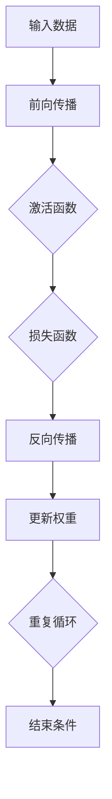

                 

### 文章标题

#### AI大模型应用的微服务设计模式

### 关键词：

- 微服务架构
- AI大模型
- 深度学习
- 服务化
- 分布式计算

### 摘要：

本文将深入探讨AI大模型在微服务架构中的应用和设计模式。首先，我们将介绍微服务架构的基本概念和优势，以及AI大模型在其中的应用。接着，我们将详细解析AI大模型的核心技术，包括深度学习基础、大模型训练技术和推理技术。随后，我们将阐述微服务设计原则和模式，包括设计原则、通信模式和安全性设计。接下来，我们将讨论AI大模型微服务的设计与实现，包括架构设计、开发、测试、部署与运维。最后，我们将通过实际案例展示AI大模型微服务的应用实践，并提供开发工具和资源的附录。通过本文的阅读，读者将能够全面了解AI大模型应用的微服务设计模式，并掌握相关技术原理和实践方法。

### 目录大纲：

1. 第一部分：微服务设计与AI大模型
   - 第1章：微服务架构与AI大模型概述
     - 1.1 微服务架构的基本概念与优势
     - 1.2 AI大模型在微服务架构中的应用
     - 1.3 微服务设计与AI大模型结合的关键要素
   - 第2章：AI大模型核心技术详解
     - 2.1 深度学习基础
       - 2.1.1 神经网络架构
       - 2.1.2 常用深度学习框架
       - 2.1.3 神经网络优化算法
     - 2.2 大模型训练技术
       - 2.2.1 大模型训练挑战
       - 2.2.2 数据预处理与增强
       - 2.2.3 训练策略与调优
     - 2.3 大模型推理技术
       - 2.3.1 推理架构设计
       - 2.3.2 并行推理与分布式训练
       - 2.3.3 实时推理优化
   - 第3章：微服务设计原则与模式
     - 3.1 微服务设计原则
       - 3.1.1 单一职责原则
       - 3.1.2 服务解耦合
       - 3.1.3 自治性
       - 3.1.4 服务化数据存储
     - 3.2 微服务通信模式
       - 3.2.1 RESTful API设计
       - 3.2.2 gRPC通信协议
       - 3.2.3 微服务间数据同步
     - 3.3 微服务安全性设计
       - 3.3.1 API安全策略
       - 3.3.2 用户身份认证与授权
       - 3.3.3 数据加密与隐私保护

2. 第二部分：AI大模型微服务设计与实现
   - 第4章：AI大模型微服务架构设计
     - 4.1 微服务架构设计原则
       - 4.1.1 服务划分策略
       - 4.1.2 服务依赖关系
       - 4.1.3 服务弹性与扩展性
     - 4.2 大模型服务化架构设计
       - 4.2.1 大模型服务化概述
       - 4.2.2 大模型服务化实现
       - 4.2.3 大模型服务化测试与部署
   - 第5章：AI大模型微服务开发
     - 5.1 大模型微服务开发环境搭建
       - 5.1.1 开发环境配置
       - 5.1.2 常用开发工具与库
       - 5.1.3 版本控制与代码管理
     - 5.2 大模型微服务API设计
       - 5.2.1 API设计规范
       - 5.2.2 API接口实现
       - 5.2.3 API测试与文档生成
     - 5.3 大模型微服务安全性实现
       - 5.3.1 API安全策略
       - 5.3.2 认证与授权机制
       - 5.3.3 数据加密与隐私保护

3. 第三部分：AI大模型微服务应用案例
   - 第6章：AI大模型微服务集成与测试
     - 6.1 微服务集成测试
       - 6.1.1 集成测试策略
       - 6.1.2 集成测试用例设计
       - 6.1.3 集成测试工具与平台
     - 6.2 微服务性能测试
       - 6.2.1 性能测试指标
       - 6.2.2 性能测试工具
       - 6.2.3 性能优化策略
     - 6.3 微服务安全测试
       - 6.3.1 安全测试方法
       - 6.3.2 安全漏洞扫描与修复
       - 6.3.3 安全测试自动化

4. 第四部分：AI大模型微服务部署与运维
   - 第7章：AI大模型微服务部署与运维
     - 7.1 微服务部署策略
       - 7.1.1 部署流程与架构
       - 7.1.2 容器化部署
       - 7.1.3 服务网格与流量管理
     - 7.2 微服务监控与日志
       - 7.2.1 监控与日志管理概述
       - 7.2.2 常用监控与日志工具
       - 7.2.3 监控数据可视化与分析
     - 7.3 微服务运维实践
       - 7.3.1 自动化运维工具
       - 7.3.2 灾难恢复与备份策略
       - 7.3.3 运维团队协作与流程管理

5. 第五部分：附录
   - 附录A：AI大模型微服务开发工具与资源
   - 附录B：Mermaid流程图与伪代码示例

### 引言

#### 1.1 为什么需要微服务设计与AI大模型的结合？

随着人工智能技术的飞速发展，AI大模型已经成为推动各行各业创新的关键力量。然而，传统的单体架构难以满足AI大模型的高性能、高扩展性和高可靠性要求。微服务架构作为一种新型的分布式系统设计模式，通过将系统拆分为独立的、可扩展的小服务，能够更好地应对AI大模型带来的挑战。因此，将微服务设计与AI大模型结合起来，能够实现以下优势：

- **高性能**：微服务架构可以将AI大模型拆分为多个独立的小服务，每个服务都可以独立优化和扩展，从而提高整体系统的性能。
- **高扩展性**：微服务架构允许在不同服务之间进行水平扩展，从而提高系统的承载能力和响应速度。
- **高可靠性**：微服务架构通过服务之间的解耦合，降低了系统故障的概率，同时可以通过服务备份和故障转移来保证系统的可靠性。

#### 1.2 本文的组织结构

本文将按照以下结构进行组织：

- **第一部分**：介绍微服务架构与AI大模型的概述，包括基本概念、应用场景和关键要素。
- **第二部分**：详细解析AI大模型的核心技术，包括深度学习基础、大模型训练技术和推理技术。
- **第三部分**：阐述微服务设计原则与模式，包括设计原则、通信模式和安全性设计。
- **第四部分**：讨论AI大模型微服务的设计与实现，包括架构设计、开发、测试、部署与运维。
- **第五部分**：通过实际案例展示AI大模型微服务的应用实践。
- **附录**：提供AI大模型微服务开发工具与资源的附录。

通过本文的阅读，读者将能够全面了解AI大模型应用的微服务设计模式，掌握相关技术原理和实践方法，从而为实际项目提供有力的技术支持。

### 第一部分：微服务设计与AI大模型

#### 第1章：微服务架构与AI大模型概述

微服务架构和AI大模型是当前技术领域中的两大热点，它们在各自的领域内展现出了强大的潜力和广阔的应用前景。在这一章中，我们将对微服务架构和AI大模型进行概述，并探讨它们在结合中的应用和关键要素。

##### 1.1 微服务架构的基本概念与优势

微服务架构是一种基于分布式系统的设计模式，其核心思想是将应用程序拆分成一系列独立的小服务，每个服务负责完成特定的业务功能。这些小服务可以通过轻量级的通信协议（如RESTful API或gRPC）进行通信，从而实现系统模块化和解耦合。

**基本概念**：

- **服务（Service）**：微服务架构中的基本单元，每个服务都实现特定的业务功能，并拥有自己的数据库。
- **容器（Container）**：用于部署和运行服务的轻量级容器，如Docker。
- **服务注册与发现（Service Registration and Discovery）**：服务启动时注册到注册中心，服务消费者通过注册中心发现和调用服务。
- **配置管理（Configuration Management）**：集中管理服务的配置信息，确保服务的一致性和灵活性。

**优势**：

1. **模块化**：微服务架构将应用程序拆分为多个独立的小服务，每个服务都可以独立开发、测试和部署，提高了开发效率和维护性。
2. **高扩展性**：通过水平扩展单个服务实例，微服务架构能够轻松应对高并发和大数据处理需求。
3. **高可靠性**：服务之间的解耦合降低了系统故障的概率，同时可以通过服务备份和故障转移来保证系统的可靠性。
4. **技术多样性**：微服务架构允许使用不同的编程语言、数据库和框架来开发各个服务，从而提高了技术多样性。

##### 1.2 AI大模型在微服务架构中的应用

AI大模型，特别是深度学习模型，通常具有复杂的数据处理和计算需求。微服务架构为AI大模型的应用提供了以下优势：

1. **分布式计算**：微服务架构支持分布式计算，可以充分利用多台服务器的计算资源，提高大模型的训练和推理效率。
2. **弹性扩展**：通过水平扩展服务实例，微服务架构能够应对大模型训练和推理过程中出现的高并发和大数据处理需求。
3. **服务解耦合**：微服务架构通过服务解耦合，降低了大模型训练和推理系统与前端应用的耦合度，提高了系统的灵活性和可维护性。
4. **模块化部署**：微服务架构允许将大模型训练和推理服务作为独立的模块进行部署，便于系统的扩展和维护。

##### 1.3 微服务设计与AI大模型结合的关键要素

要将微服务架构与AI大模型有效结合，需要关注以下几个关键要素：

1. **服务划分**：根据业务需求将AI大模型拆分为多个独立的服务，如数据预处理服务、模型训练服务、模型推理服务等。
2. **数据同步**：在大模型训练和推理过程中，需要保证各个服务之间的数据一致性。可以使用消息队列、分布式缓存或分布式数据库来实现数据同步。
3. **通信协议**：选择合适的通信协议，如RESTful API或gRPC，确保微服务之间的高效和可靠通信。
4. **安全性**：在设计微服务时，需要考虑安全性问题，包括用户身份认证、数据加密和权限控制等。
5. **监控与日志**：通过监控和日志分析，实时了解大模型训练和推理服务的运行状态和性能，便于故障排查和性能优化。

综上所述，微服务架构与AI大模型的结合能够充分发挥两者的优势，实现高性能、高扩展性和高可靠性的系统设计。下一章将详细解析AI大模型的核心技术，为后续章节的讨论奠定基础。

### 第一部分：微服务设计与AI大模型

#### 第2章：AI大模型核心技术详解

AI大模型作为当前人工智能领域的核心技术，其在深度学习、模型训练和推理等方面都展现出强大的应用潜力。本章将详细介绍AI大模型的核心技术，包括深度学习基础、常用深度学习框架、神经网络优化算法以及大模型训练和推理技术。

##### 2.1 深度学习基础

**深度学习**是一种基于人工神经网络的学习方法，通过模拟人脑的神经网络结构，对大量数据进行学习和模式识别。以下是深度学习中的核心概念：

1. **神经网络架构**：
   - **前向传播（Forward Propagation）**：输入数据经过神经网络的前向传播，通过各个层中的神经元进行计算，最终输出预测结果。
   - **反向传播（Backpropagation）**：根据预测结果与实际结果的误差，通过反向传播算法更新网络权重和偏置，优化模型参数。
   - **激活函数（Activation Function）**：用于引入非线性特性，常用的激活函数包括Sigmoid、ReLU、Tanh等。

2. **常用深度学习框架**：
   - **TensorFlow**：由Google开发，支持多种编程语言，具有丰富的预训练模型和强大的生态系统。
   - **PyTorch**：由Facebook开发，具有动态计算图的优势，适合研究和实验。
   - **Keras**：基于TensorFlow和Theano开发，提供简洁的API，方便快速搭建和训练模型。

3. **神经网络优化算法**：
   - **随机梯度下降（Stochastic Gradient Descent, SGD）**：一种简单的优化算法，通过随机选择一小部分数据更新模型参数。
   - **Adam优化器**：结合了SGD和动量法的优势，适应不同数据分布，收敛速度更快。

##### 2.2 大模型训练技术

大模型训练技术是AI大模型成功的关键，以下是一些重要方面：

1. **大模型训练挑战**：
   - **计算资源需求**：大模型训练需要大量计算资源，通常采用分布式计算来加速训练。
   - **数据预处理与增强**：大模型对数据质量要求较高，需要进行有效的数据预处理和增强，如数据清洗、归一化、数据增强等。
   - **模型优化与调参**：通过调整学习率、批量大小、正则化等超参数，优化模型性能。

2. **数据预处理与增强**：
   - **数据清洗**：去除数据中的噪声和异常值，保证数据质量。
   - **数据归一化**：将数据缩放到相同的范围，便于模型训练。
   - **数据增强**：通过随机裁剪、旋转、缩放等方式，增加数据的多样性，提高模型的泛化能力。

3. **训练策略与调优**：
   - **动态学习率**：采用学习率衰减策略，动态调整学习率，避免过拟合。
   - **批量大小**：选择合适的批量大小，平衡训练速度和模型性能。
   - **正则化**：通过L1、L2正则化等手段，减少模型过拟合。

##### 2.3 大模型推理技术

大模型推理技术是指将训练好的模型应用于实际数据，进行预测或分类。以下是一些关键方面：

1. **推理架构设计**：
   - **单机推理**：在单台服务器上部署模型，适用于小规模推理任务。
   - **分布式推理**：将推理任务分布在多台服务器上，提高推理速度和性能。
   - **实时推理**：对实时数据进行推理，如语音识别、实时图像识别等。

2. **并行推理与分布式训练**：
   - **数据并行**：将训练数据划分为多个子集，每个GPU训练一部分数据，最后汇总结果。
   - **模型并行**：将模型拆分为多个部分，分别在不同GPU上训练，最后汇总结果。

3. **实时推理优化**：
   - **模型压缩**：通过模型剪枝、量化等方法，减小模型大小，提高推理速度。
   - **硬件加速**：利用GPU、TPU等硬件加速推理，提高处理速度。
   - **缓存与预加载**：通过缓存和预加载技术，减少推理时间，提高响应速度。

通过本章的介绍，读者可以全面了解AI大模型的核心技术，为后续章节的微服务设计与实现提供理论基础。下一章将深入探讨微服务设计原则与模式，为AI大模型微服务架构的设计奠定基础。

### 第一部分：微服务设计与AI大模型

#### 第3章：微服务设计原则与模式

在微服务架构中，设计原则与模式是确保系统模块化、高扩展性和高可靠性的关键。本章将详细介绍微服务设计原则，包括单一职责原则、服务解耦合、自治性和服务化数据存储。同时，我们将探讨微服务通信模式和安全性设计。

##### 3.1 微服务设计原则

**3.1.1 单一职责原则**

单一职责原则是微服务设计的基本原则之一，要求每个服务只完成一个明确的业务功能。这样做有以下好处：

- **提高可维护性**：服务职责单一，使得代码更加简洁，便于开发和维护。
- **提高可扩展性**：服务可以独立扩展和升级，不会影响到其他服务。
- **提高测试性**：服务职责单一，使得测试更加聚焦，提高测试覆盖率。

**3.1.2 服务解耦合**

服务解耦合是指服务之间尽量减少直接的依赖关系。解耦合的主要方法包括：

- **API通信**：服务之间通过API进行通信，确保服务之间的高度独立。
- **事件驱动**：使用消息队列和事件驱动架构，实现服务之间的松耦合。
- **服务隔离**：通过容器化技术和服务隔离机制，确保服务之间的独立运行。

**3.1.3 自治性**

自治性是指每个服务可以独立运行、管理和维护。自治性的实现包括：

- **独立部署**：每个服务可以独立部署和升级，不影响其他服务。
- **独立配置**：每个服务拥有自己的配置管理，确保配置的一致性和灵活性。
- **独立监控**：每个服务可以独立监控和报警，确保系统的健壮性。

**3.1.4 服务化数据存储**

服务化数据存储是指将数据存储与业务逻辑分离，实现数据的独立管理。服务化数据存储的主要方法包括：

- **分布式数据库**：使用分布式数据库来存储服务数据，实现数据的水平扩展和高可用性。
- **缓存**：使用缓存来提高数据访问速度和系统性能。
- **数据同步**：通过消息队列和分布式事务机制，实现服务之间数据的同步。

##### 3.2 微服务通信模式

微服务通信模式决定了服务之间如何进行通信和数据交换。以下是几种常见的通信模式：

**3.2.1 RESTful API设计**

RESTful API是一种基于HTTP协议的通信模式，具有简洁、易用和可扩展的特点。RESTful API设计原则包括：

- **统一资源标识符（URI）**：使用URI来表示资源的地址和操作。
- **HTTP方法**：使用GET、POST、PUT、DELETE等HTTP方法来表示操作类型。
- **状态码**：使用HTTP状态码来表示操作的结果和状态。

**3.2.2 gRPC通信协议**

gRPC是一种高性能、跨语言的远程过程调用（RPC）框架，基于HTTP/2协议。gRPC的优点包括：

- **高效**：使用Protobuf序列化协议，数据传输效率高。
- **跨语言**：支持多种编程语言，实现跨语言调用。
- **负载均衡**：支持负载均衡和故障转移，提高系统的可用性。

**3.2.3 微服务间数据同步**

微服务间数据同步是指服务之间如何保持数据的一致性。常见的数据同步方法包括：

- **最终一致性**：通过事件驱动和消息队列实现最终一致性，允许一定程度的延迟。
- **强一致性**：通过分布式事务和分布式锁实现强一致性，确保数据的实时一致性。
- **数据缓存**：通过缓存来减少对数据库的访问，提高系统的响应速度。

##### 3.3 微服务安全性设计

微服务安全性设计是确保系统安全的关键，包括以下方面：

**3.3.1 API安全策略**

API安全策略包括：

- **认证**：使用OAuth2、JWT等认证机制，确保只有授权用户可以访问API。
- **授权**：通过角色权限控制，确保用户只能访问自己有权访问的API。
- **请求限制**：使用限流和熔断机制，防止恶意请求和攻击。

**3.3.2 用户身份认证与授权**

用户身份认证与授权包括：

- **单点登录（SSO）**：使用SSO实现多个系统之间的用户认证。
- **多因素认证（MFA）**：使用MFA提高用户账户的安全性。
- **访问控制**：使用基于角色的访问控制（RBAC）和基于属性的访问控制（ABAC）。

**3.3.3 数据加密与隐私保护**

数据加密与隐私保护包括：

- **传输层加密**：使用TLS/SSL加密传输层数据。
- **存储加密**：使用加密算法对存储数据进行加密。
- **隐私保护**：遵守隐私保护法规，对用户数据进行匿名化和脱敏处理。

通过本章的介绍，读者可以全面了解微服务设计原则与模式，为AI大模型微服务架构的设计奠定基础。下一章将详细讨论AI大模型微服务的架构设计与实现。

### 第二部分：AI大模型微服务设计与实现

#### 第4章：AI大模型微服务架构设计

在微服务架构中，设计原则与模式是确保系统模块化、高扩展性和高可靠性的关键。本章将详细讨论AI大模型微服务的架构设计，包括微服务架构设计原则、大模型服务化架构设计以及大模型服务化实现和测试与部署。

##### 4.1 微服务架构设计原则

**4.1.1 服务划分策略**

服务划分策略是微服务架构设计的关键，决定了系统的模块化和可扩展性。以下是一些常用的服务划分策略：

- **功能划分**：根据业务功能将系统划分为多个独立的服务，每个服务负责特定的业务功能。
- **领域驱动设计（Domain-Driven Design, DDD）**：根据领域模型将系统划分为多个领域服务，每个领域服务负责特定领域的问题。
- **事件驱动架构**：根据事件流将系统划分为多个事件服务，每个事件服务处理特定类型的事件。

**4.1.2 服务依赖关系**

服务依赖关系是微服务架构设计中的另一个关键要素，决定了服务之间的调用和协作。以下是一些处理服务依赖关系的方法：

- **分层架构**：按照业务功能将服务划分为多个层次，确保高层次的业务服务依赖低层次的基础服务。
- **事件驱动**：使用事件驱动架构，通过事件流传递依赖关系，实现服务之间的松耦合。
- **服务代理**：使用服务代理来统一管理服务之间的依赖关系，简化服务调用和集成。

**4.1.3 服务弹性与扩展性**

服务弹性和扩展性是微服务架构设计中的重要考量因素，决定了系统应对高并发和大数据处理的能力。以下是一些实现服务弹性与扩展性的方法：

- **水平扩展**：通过增加服务实例的数量来提高系统的处理能力，适用于读多写少的场景。
- **垂直扩展**：通过增加服务器的硬件配置来提高系统的处理能力，适用于计算密集型的场景。
- **动态伸缩**：通过自动化的伸缩策略，根据系统的负载动态调整服务实例的数量。

##### 4.2 大模型服务化架构设计

大模型服务化架构设计是将AI大模型训练和推理功能作为微服务提供，实现系统的模块化和可扩展性。以下是大模型服务化架构设计的关键组件：

**4.2.1 大模型服务化概述**

大模型服务化是指将AI大模型拆分为多个独立的服务，每个服务负责特定的功能。常见的服务包括：

- **数据预处理服务**：负责对输入数据进行预处理，如数据清洗、归一化和增强等。
- **模型训练服务**：负责训练AI大模型，包括数据加载、模型优化和评估等。
- **模型推理服务**：负责对输入数据进行推理，生成预测结果。

**4.2.2 大模型服务化实现**

大模型服务化实现包括以下关键步骤：

- **服务拆分**：根据业务需求将大模型拆分为多个独立的服务，确保每个服务的职责单一。
- **接口定义**：定义服务之间的API接口，确保服务之间的松耦合和标准化通信。
- **服务部署**：使用容器化技术（如Docker）部署服务，确保服务的独立性和可移植性。
- **服务监控**：实现服务的监控和日志管理，实时了解服务的运行状态和性能。

**4.2.3 大模型服务化测试与部署**

大模型服务化测试与部署是确保系统可靠性和性能的关键步骤。以下是一些关键的测试与部署策略：

- **单元测试**：对每个服务的功能进行单元测试，确保服务的正确性和稳定性。
- **集成测试**：对服务之间的集成进行测试，确保系统的高可用性和一致性。
- **性能测试**：对系统的性能进行测试，包括并发处理能力、响应时间和资源利用率等。
- **自动化部署**：使用自动化工具（如Jenkins）实现服务的自动化部署和升级，提高部署效率。

通过本章的介绍，读者可以了解AI大模型微服务的架构设计原则、大模型服务化架构设计以及实现和测试与部署方法。下一章将详细讨论AI大模型微服务的开发过程。

### 第二部分：AI大模型微服务设计与实现

#### 第5章：AI大模型微服务开发

在AI大模型微服务架构设计完成之后，开发过程成为实现系统功能的关键环节。本章将详细讨论AI大模型微服务的开发，包括开发环境搭建、API设计、安全性实现以及开发工具与库的介绍。

##### 5.1 大模型微服务开发环境搭建

一个稳定、高效的开发环境是成功开发AI大模型微服务的基石。以下是在搭建开发环境时需要考虑的几个方面：

**5.1.1 开发环境配置**

- **操作系统**：通常使用Linux系统，如Ubuntu或CentOS，以获得更好的性能和可扩展性。
- **编程语言**：选择适合项目需求的编程语言，如Python、Java或Go等。Python因其丰富的库和框架而成为AI大模型开发的首选语言。
- **集成开发环境（IDE）**：选择合适的IDE，如Visual Studio Code、PyCharm或IntelliJ IDEA，以提供代码编辑、调试和性能分析等功能。

**5.1.2 常用开发工具与库**

- **版本控制**：使用Git进行版本控制，确保代码的版本管理和协作开发。
- **容器化工具**：使用Docker进行容器化，以便于服务的打包、部署和迁移。
- **持续集成/持续部署（CI/CD）**：使用Jenkins或GitLab CI实现自动化构建、测试和部署，提高开发效率。

**5.1.3 版本控制与代码管理**

- **代码库管理**：使用GitHub、GitLab或GitLab Enterprise进行代码库的管理和协作开发。
- **代码审查**：通过Pull Request（PR）机制进行代码审查，确保代码质量。
- **持续集成**：集成自动化测试，确保每次代码提交都能够通过测试。

##### 5.2 大模型微服务API设计

API设计是微服务开发的核心环节，决定了服务的易用性和互操作性。以下是一些API设计的关键原则：

**5.2.1 API设计规范**

- **RESTful API设计**：遵循RESTful设计原则，使用URI表示资源，使用HTTP方法表示操作。
- **接口定义**：使用OpenAPI（Swagger）或RAML等规范来定义API接口，提供详细接口描述和文档。

**5.2.2 API接口实现**

- **接口实现**：使用适当的框架（如Flask、Django或Spring Boot）实现API接口，确保接口的高性能和可靠性。
- **错误处理**：设计合理的错误处理机制，返回清晰的错误信息和状态码。

**5.2.3 API测试与文档生成**

- **单元测试**：对每个API接口进行单元测试，确保接口功能的正确性。
- **集成测试**：对API接口进行集成测试，确保接口与服务之间的正确交互。
- **文档生成**：使用Swagger或RAML等工具自动生成API文档，便于开发者使用。

##### 5.3 大模型微服务安全性实现

安全性是AI大模型微服务开发的重要方面，以下是一些常见的安全措施：

**5.3.1 API安全策略**

- **认证与授权**：使用OAuth2、JWT等认证机制进行用户身份验证和授权。
- **访问控制**：基于角色或属性进行访问控制，确保只有授权用户可以访问敏感接口。
- **API限流与熔断**：使用限流和熔断机制，防止恶意攻击和系统过载。

**5.3.2 认证与授权机制**

- **单点登录（SSO）**：实现SSO，减少用户登录次数，提高用户体验。
- **多因素认证（MFA）**：使用MFA提高用户账户的安全性。
- **访问控制**：使用基于角色的访问控制（RBAC）或基于属性的访问控制（ABAC）进行细粒度的访问控制。

**5.3.3 数据加密与隐私保护**

- **传输加密**：使用TLS/SSL加密传输层数据，确保数据传输的安全。
- **存储加密**：使用加密算法对存储数据进行加密，防止数据泄露。
- **隐私保护**：遵守隐私保护法规，对用户数据进行匿名化和脱敏处理。

通过本章的讨论，读者可以了解AI大模型微服务的开发环境搭建、API设计以及安全性实现方法，为后续的集成测试、性能测试和安全测试奠定基础。

### 第二部分：AI大模型微服务设计与实现

#### 第6章：AI大模型微服务集成与测试

在AI大模型微服务的开发阶段完成后，集成与测试是确保系统功能完整性和性能稳定性的关键步骤。本章将详细讨论微服务的集成测试、性能测试和安全测试，包括测试策略、测试用例设计、测试工具与平台以及性能优化策略。

##### 6.1 微服务集成测试

**6.1.1 集成测试策略**

集成测试是确保微服务之间正确协作的重要环节。以下是几种常用的集成测试策略：

- **端到端测试**：对整个系统进行集成测试，验证微服务之间的交互和功能完整性。
- **基于场景的测试**：设计具体的业务场景，模拟用户操作流程，验证系统在实际场景中的表现。
- **灰盒测试**：结合黑盒测试和单元测试，关注服务内部逻辑和外部接口的正确性。

**6.1.2 集成测试用例设计**

集成测试用例设计应覆盖以下方面：

- **功能测试**：确保各个微服务的功能正常运行，如数据输入、处理和输出。
- **性能测试**：评估系统在高并发场景下的性能，包括响应时间和吞吐量。
- **错误处理**：验证系统在遇到异常情况时的处理能力，如数据异常、网络故障等。
- **安全性测试**：确保系统的安全性，包括认证、授权和访问控制等。

**6.1.3 集成测试工具与平台**

以下是一些常用的集成测试工具与平台：

- **Postman**：用于API测试，支持创建测试脚本和自动化测试。
- **Selenium**：用于Web应用的自动化测试，支持多种编程语言和浏览器。
- **JMeter**：用于性能测试，支持多线程并发测试和负载测试。
- **Kubernetes**：用于容器化环境的集成测试，支持部署和管理容器化应用。

##### 6.2 微服务性能测试

性能测试是评估系统在高负载下的性能和可扩展性的关键步骤。以下是性能测试的几个重要方面：

**6.2.1 性能测试指标**

常见的性能测试指标包括：

- **响应时间**：系统处理请求所需的时间，包括客户端发送请求和服务器返回响应的时间。
- **吞吐量**：系统在单位时间内处理的请求数量，衡量系统的处理能力。
- **资源利用率**：系统资源（如CPU、内存、磁盘）的利用率，评估系统资源的有效利用。
- **并发数**：系统能够同时处理的最大并发请求数量。

**6.2.2 性能测试工具**

以下是一些常用的性能测试工具：

- **JMeter**：支持多种协议的性能测试，包括HTTP、HTTPS、FTP等。
- **Gatling**：基于Scala的轻量级性能测试工具，支持多线程并发测试。
- **LoadRunner**：功能丰富的性能测试工具，支持Web、数据库、ERP等应用的测试。
- **Locust**：基于Python的轻量级性能测试工具，支持Web性能测试。

**6.2.3 性能优化策略**

以下是一些常见的性能优化策略：

- **代码优化**：优化服务器的代码，减少不必要的计算和资源消耗。
- **缓存**：使用缓存技术，减少对数据库的访问，提高系统的响应速度。
- **负载均衡**：通过负载均衡器，将请求均匀分配到多个服务器，提高系统的吞吐量。
- **数据库优化**：优化数据库查询和索引，提高数据库的访问效率。

##### 6.3 微服务安全测试

安全测试是确保系统安全性的关键步骤。以下是一些常见的安全测试方法：

**6.3.1 安全测试方法**

- **漏洞扫描**：使用自动化工具扫描系统漏洞，如SQL注入、XSS攻击等。
- **渗透测试**：模拟黑客攻击，验证系统的安全防护能力。
- **安全代码审计**：对服务器的代码进行审计，查找潜在的安全漏洞。
- **安全配置检查**：检查系统的安全配置，确保系统的安全策略得到有效执行。

**6.3.2 安全漏洞扫描与修复**

以下是一些常见的安全漏洞扫描与修复方法：

- **静态代码分析**：使用静态代码分析工具（如SonarQube），分析代码中的安全漏洞。
- **动态测试**：在开发环境中进行动态测试，实时监控系统的安全性。
- **漏洞修复**：根据扫描结果，及时修复发现的安全漏洞，确保系统的安全性。

**6.3.3 安全测试自动化**

安全测试自动化可以显著提高测试效率和准确性。以下是一些安全测试自动化的方法：

- **自动化漏洞扫描**：使用自动化工具定期扫描系统，发现和修复安全漏洞。
- **持续集成/持续部署（CI/CD）**：将安全测试集成到CI/CD流程中，确保每次代码提交和部署都经过安全测试。
- **安全漏洞库**：建立安全漏洞库，记录和管理已发现的安全漏洞，提高整体的安全防护能力。

通过本章的讨论，读者可以了解AI大模型微服务的集成与测试方法，包括集成测试、性能测试和安全测试的策略、用例设计、工具与平台以及性能优化策略和安全测试自动化方法。这些测试方法为AI大模型微服务的可靠性和安全性提供了有力的保障。

### 第二部分：AI大模型微服务设计与实现

#### 第7章：AI大模型微服务部署与运维

在完成AI大模型微服务的开发与测试之后，部署与运维是确保系统能够稳定、高效运行的关键步骤。本章将详细讨论AI大模型微服务的部署策略、监控与日志管理以及运维实践。

##### 7.1 微服务部署策略

**7.1.1 部署流程与架构**

微服务部署流程通常包括以下步骤：

- **环境准备**：准备开发、测试和生产环境，包括硬件、操作系统和基础软件。
- **服务打包**：将微服务打包为可执行文件或容器镜像，便于部署和管理。
- **自动化部署**：使用自动化工具（如Jenkins、Kubernetes）实现服务的自动化部署，减少人工干预和部署时间。

常见的微服务部署架构包括：

- **单机部署**：在单台服务器上部署所有微服务，适用于小型项目或实验环境。
- **分布式部署**：将微服务部署到多台服务器上，实现负载均衡和高可用性。
- **容器化部署**：使用容器化技术（如Docker、Kubernetes）进行部署，提高部署的灵活性和可移植性。

**7.1.2 容器化部署**

容器化部署是微服务部署的一种常用方法，具有以下优势：

- **轻量级**：容器具有轻量级的特点，可以快速启动和停止，提高系统性能。
- **可移植性**：容器镜像可以轻松地在不同环境中部署和运行，确保一致性。
- **隔离性**：容器提供了良好的隔离性，每个容器运行独立的系统环境，减少资源竞争。

**7.1.3 服务网格与流量管理**

服务网格是一种用于管理服务间通信的架构，可以提供流量管理、服务发现、负载均衡和安全性等功能。常见的服务网格包括：

- **Istio**：开源的服务网格平台，支持微服务通信的安全性和可观测性。
- **Linkerd**：基于gRPC和HTTP/2的透明服务网格，提供流量管理和安全性。
- **Consul**：支持服务发现、配置管理和健康检查的服务网格工具。

通过服务网格，可以简化服务之间的通信，提高系统的可扩展性和可靠性。

##### 7.2 微服务监控与日志管理

**7.2.1 监控与日志管理概述**

微服务监控与日志管理是确保系统稳定运行和快速响应故障的重要手段。以下是监控与日志管理的关键概念：

- **监控**：实时收集和分析系统运行状态和性能指标，及时发现异常和性能瓶颈。
- **日志管理**：收集、存储和分析系统日志，用于故障排查和性能优化。

**7.2.2 常用监控与日志工具**

以下是一些常用的监控与日志工具：

- **Prometheus**：开源监控解决方案，支持多维数据收集和告警。
- **Grafana**：开源监控仪表板工具，支持可视化展示Prometheus数据。
- **ELK Stack**：Elasticsearch、Logstash和Kibana的组合，提供强大的日志收集和查询功能。
- **Zabbix**：开源监控工具，支持多种监控方式，包括SNMP、TCP/IP等。

**7.2.3 监控数据可视化与分析**

监控数据可视化是将监控数据以图表或仪表板的形式展示，便于直观分析。以下是一些监控数据可视化的方法：

- **时间序列图表**：展示系统性能指标随时间的变化趋势。
- **热图**：展示系统资源使用情况的分布，便于发现瓶颈和异常。
- **告警图表**：展示告警事件的发生频率和严重程度。

通过数据可视化，可以快速识别系统异常，采取相应措施。

##### 7.3 微服务运维实践

**7.3.1 自动化运维工具**

自动化运维工具可以显著提高运维效率和系统稳定性。以下是一些常用的自动化运维工具：

- **Ansible**：自动化部署和配置管理工具，支持自动化安装、配置和部署应用。
- **Puppet**：自动化配置管理工具，支持大规模系统的配置管理。
- **Chef**：自动化配置管理工具，提供灵活的代码驱动配置管理。

**7.3.2 灾难恢复与备份策略**

灾难恢复与备份策略是确保系统数据完整性和业务连续性的重要措施。以下是一些常见的灾难恢复与备份策略：

- **数据备份**：定期备份数据库和重要文件，确保数据不会丢失。
- **多活部署**：部署多个实例，确保一个实例故障时，其他实例可以接管服务。
- **故障切换**：实现自动故障切换，确保系统在故障时快速恢复正常。

**7.3.3 运维团队协作与流程管理**

运维团队协作与流程管理是确保运维工作高效有序的重要环节。以下是一些常见的协作与流程管理方法：

- **敏捷运维**：采用敏捷开发方法，快速响应业务需求和技术变化。
- **运维文档**：编写详细的运维文档，包括部署、监控、故障处理等，便于团队协作和知识共享。
- **运维自动化**：通过自动化工具和脚本，减少人工干预，提高运维效率。

通过本章的讨论，读者可以了解AI大模型微服务的部署策略、监控与日志管理以及运维实践方法。这些方法和策略为AI大模型微服务的稳定运行提供了有力保障。

### 第三部分：AI大模型微服务应用案例

#### 第8章：AI大模型微服务应用实践

在本章中，我们将通过一个具体的案例展示如何设计、实现、开发和部署AI大模型微服务。这个案例将涵盖从需求分析到微服务架构设计、开发、集成与测试，再到部署与运维的整个过程。

##### 8.1 案例背景与需求分析

**8.1.1 案例背景**

假设我们正在开发一款智能客服系统，该系统需要利用AI大模型（如BERT）进行自然语言处理，以提供高效、准确的客户服务。系统需要支持以下核心功能：

- **文本分类**：根据客户提问将问题分类到不同的领域。
- **命名实体识别**：提取客户提问中的关键信息，如人名、地点、时间等。
- **智能回复**：生成针对客户问题的智能回复。

**8.1.2 需求分析**

基于以上背景和功能需求，我们对系统进行了详细的需求分析，并确定了以下关键需求：

- **高并发处理能力**：系统需要能够处理大量并发请求，保证客户服务的响应速度。
- **可扩展性**：随着客户量的增加，系统需要能够弹性扩展，保证性能稳定。
- **高可靠性**：系统需要具备高可用性，确保在故障情况下能够快速恢复。
- **安全性**：系统需要保护客户数据的安全，包括数据传输和存储的安全。

##### 8.2 微服务架构设计与实现

**8.2.1 架构设计**

为了满足上述需求，我们设计了如下的微服务架构：

- **文本分类服务**：负责接收客户提问，利用BERT模型进行文本分类。
- **命名实体识别服务**：负责提取客户提问中的关键信息，如人名、地点、时间等。
- **智能回复服务**：负责生成针对客户问题的智能回复。
- **API网关**：负责接收客户端请求，根据请求内容转发到相应的微服务。
- **消息队列**：用于服务之间的异步通信，提高系统的解耦性和扩展性。
- **数据存储**：用于存储客户提问和回复的数据，保证数据的一致性和完整性。

**8.2.2 服务划分与实现**

基于架构设计，我们将系统拆分为多个独立的服务，并实现了以下服务：

- **文本分类服务**：使用TensorFlow实现BERT模型，通过API接口接收客户提问，进行文本分类，并返回分类结果。
- **命名实体识别服务**：使用Spark MLlib实现命名实体识别，通过API接口提取客户提问中的关键信息，并返回提取结果。
- **智能回复服务**：使用NLTK和Spacy等自然语言处理库，生成针对客户问题的智能回复，并通过API接口返回回复内容。

**8.2.3 API设计**

为了确保服务的易用性和互操作性，我们采用了RESTful API设计，定义了如下接口：

- `/text_classification`：接收客户提问，返回分类结果。
- `/entity_recognition`：接收客户提问，返回命名实体识别结果。
- `/smart_reply`：接收客户提问，返回智能回复内容。

##### 8.3 大模型微服务开发与测试

**8.3.1 开发环境搭建**

首先，我们需要搭建开发环境，包括以下步骤：

- **安装操作系统**：选择Linux操作系统，如Ubuntu。
- **安装编程语言**：安装Python环境，并配置Python虚拟环境。
- **安装深度学习框架**：安装TensorFlow、PyTorch等深度学习框架。
- **安装消息队列**：安装RabbitMQ或Kafka，用于服务之间的通信。

**8.3.2 API接口实现**

在开发过程中，我们遵循RESTful API设计原则，实现了以下API接口：

- **文本分类服务**：使用TensorFlow加载预训练的BERT模型，处理客户提问，进行文本分类，并返回分类结果。
- **命名实体识别服务**：使用Spark MLlib加载命名实体识别模型，处理客户提问，提取关键信息，并返回识别结果。
- **智能回复服务**：使用NLTK和Spacy等自然语言处理库，分析客户提问，生成智能回复，并返回回复内容。

**8.3.3 API测试与文档生成**

为了确保API接口的正确性和稳定性，我们进行了以下测试：

- **单元测试**：对每个API接口进行单元测试，验证功能正确性。
- **集成测试**：对服务之间的集成进行测试，验证接口的正确交互。
- **性能测试**：使用JMeter进行性能测试，评估系统的并发处理能力和响应时间。

同时，我们使用Swagger或RAML等工具生成API文档，方便开发者使用。

##### 8.4 微服务集成与测试

**8.4.1 集成测试**

在集成测试阶段，我们通过以下步骤确保系统各部分的正确集成：

- **端到端测试**：模拟用户操作流程，验证文本分类、命名实体识别和智能回复功能。
- **功能测试**：测试文本分类、命名实体识别和智能回复等核心功能。
- **性能测试**：评估系统在高并发场景下的性能和响应时间。

**8.4.2 性能优化**

为了提高系统的性能，我们采取了以下优化策略：

- **缓存**：使用Redis缓存用户提问和回复，减少数据库访问次数。
- **负载均衡**：使用Nginx进行负载均衡，将请求均匀分配到不同服务实例。
- **并行处理**：使用多线程和异步处理提高系统的并发处理能力。

##### 8.5 微服务部署与运维

**8.5.1 部署流程**

在部署阶段，我们遵循以下流程：

- **容器化**：将微服务打包为Docker容器镜像，便于部署和迁移。
- **自动化部署**：使用Jenkins实现自动化部署，确保部署过程快速、可靠。
- **服务注册与发现**：使用Eureka或Consul实现服务注册与发现，确保服务之间的正确通信。

**8.5.2 监控与日志管理**

为了确保系统的稳定运行，我们进行了以下监控与日志管理：

- **监控**：使用Prometheus和Grafana进行实时监控，监控系统性能和健康状况。
- **日志管理**：使用ELK Stack收集和分析系统日志，及时发现和解决问题。

**8.5.3 运维实践**

在运维阶段，我们采取了以下措施：

- **自动化运维**：使用Ansible进行自动化运维，减少人工干预。
- **故障恢复**：实现自动化故障恢复，确保系统在故障情况下快速恢复正常。
- **团队协作**：制定详细的运维文档和流程，确保运维工作高效有序。

通过本章的讨论，我们展示了如何设计、实现、开发和部署AI大模型微服务，并介绍了相关的测试和运维实践。这个案例为读者提供了一个全面的参考，帮助他们在实际项目中应用AI大模型微服务。

### 附录

#### 附录A：AI大模型微服务开发工具与资源

在开发AI大模型微服务的过程中，选择合适的工具和资源对于提高开发效率和项目成功至关重要。以下是一些常用的深度学习框架、微服务开发工具、监控与日志管理工具以及相关的资源链接。

##### A.1 常用深度学习框架

1. **TensorFlow**：
   - 官网：[TensorFlow官网](https://www.tensorflow.org/)
   - 介绍：TensorFlow是一个由Google开发的端到端的开放源代码机器学习框架，适用于从研究到生产的全流程。

2. **PyTorch**：
   - 官网：[PyTorch官网](https://pytorch.org/)
   - 介绍：PyTorch是一个由Facebook开发的开源深度学习框架，以其动态计算图和易用性著称。

3. **Keras**：
   - 官网：[Keras官网](https://keras.io/)
   - 介绍：Keras是一个高级神经网络API，易于使用，兼容TensorFlow和Theano。

##### A.2 微服务开发工具与平台

1. **Docker**：
   - 官网：[Docker官网](https://www.docker.com/)
   - 介绍：Docker是一个开源的应用容器引擎，用于打包、交付和管理应用程序。

2. **Kubernetes**：
   - 官网：[Kubernetes官网](https://kubernetes.io/)
   - 介绍：Kubernetes是一个开源的容器编排平台，用于自动化部署、扩展和管理容器化应用程序。

3. **Consul**：
   - 官网：[Consul官网](https://www.consul.io/)
   - 介绍：Consul是一个分布式服务网格工具，用于服务发现、配置管理和健康检查。

##### A.3 微服务监控与日志管理工具

1. **Prometheus**：
   - 官网：[Prometheus官网](https://prometheus.io/)
   - 介绍：Prometheus是一个开源的监控解决方案，用于收集、存储和查询监控数据。

2. **Grafana**：
   - 官网：[Grafana官网](https://grafana.com/)
   - 介绍：Grafana是一个开源的数据分析和监控仪表板，支持多种数据源。

3. **ELK Stack**：
   - 官网：[ELK Stack官网](https://www.elastic.co/products/elk)
   - 介绍：ELK Stack是Elasticsearch、Logstash和Kibana的组合，提供强大的日志收集和分析功能。

##### A.4 AI大模型微服务资源链接

1. **AI大模型教程**：
   - 链接：[AI大模型教程](https://www.deeplearning.ai/)
   - 介绍：由DeepLearning.AI提供的深度学习教程，涵盖从基础到高级的内容。

2. **微服务架构文档**：
   - 链接：[微服务架构文档](https://martinfowler.com/microservices/)
   - 介绍：Martin Fowler关于微服务架构的详细文档，涵盖架构设计、优点和挑战。

3. **Kubernetes教程**：
   - 链接：[Kubernetes教程](https://kubernetes.io/learning/)
   - 介绍：由Kubernetes官方提供的教程，介绍Kubernetes的基本概念和实践。

通过使用这些工具和资源，开发者可以更好地设计、实现和部署AI大模型微服务，提高系统的性能和可靠性。

### 附录B：Mermaid流程图与伪代码示例

为了更好地理解AI大模型微服务的架构设计与实现过程，我们提供了一些Mermaid流程图和伪代码示例。以下示例分别展示了神经网络架构的流程图和神经网络优化算法的伪代码。

#### B.1 Mermaid流程图示例

**神经网络架构流程图**



#### B.2 伪代码示例

**神经网络优化算法伪代码**

```python
function train_model(data, labels, epochs):
    for epoch in range(epochs):
        for batch in data:
            inputs, targets = preprocess(batch)
            forward_pass(inputs)
            loss = calculate_loss(targets)
            backward_pass(loss)
            update_weights()
        print(f"Epoch {epoch}: Loss = {loss}")
    return model
```

#### B.3 实际代码示例与解读

**实际代码示例：使用TensorFlow训练一个简单的神经网络**

```python
import tensorflow as tf
from tensorflow.keras.layers import Dense
from tensorflow.keras.models import Sequential

# 定义神经网络结构
model = Sequential([
    Dense(128, activation='relu', input_shape=(784,)),
    Dense(10, activation='softmax')
])

# 编译模型
model.compile(optimizer='adam', loss='categorical_crossentropy', metrics=['accuracy'])

# 加载数据集
(x_train, y_train), (x_test, y_test) = tf.keras.datasets.mnist.load_data()

# 预处理数据
x_train = x_train / 255.0
x_test = x_test / 255.0
y_train = tf.keras.utils.to_categorical(y_train, 10)
y_test = tf.keras.utils.to_categorical(y_test, 10)

# 训练模型
model.fit(x_train, y_train, epochs=5, batch_size=64, validation_data=(x_test, y_test))

# 评估模型
test_loss, test_acc = model.evaluate(x_test, y_test, verbose=2)
print(f"Test accuracy: {test_acc}")
```

**代码解读**：

1. **定义神经网络结构**：使用`Sequential`模型堆叠多个`Dense`层，第一个层有128个神经元，激活函数为ReLU；第二个层有10个神经元，激活函数为softmax。
2. **编译模型**：指定优化器为`adam`，损失函数为`categorical_crossentropy`，评估指标为`accuracy`。
3. **加载数据集**：使用`mnist`数据集，并进行预处理，包括归一化和转换为类别标签。
4. **训练模型**：使用`fit`方法训练模型，指定训练轮数、批量大小和验证数据。
5. **评估模型**：使用`evaluate`方法评估模型在测试数据集上的性能，并打印测试准确率。

通过以上示例，读者可以更好地理解神经网络架构、优化算法以及实际代码的实现过程，从而在实际项目中应用AI大模型微服务。

