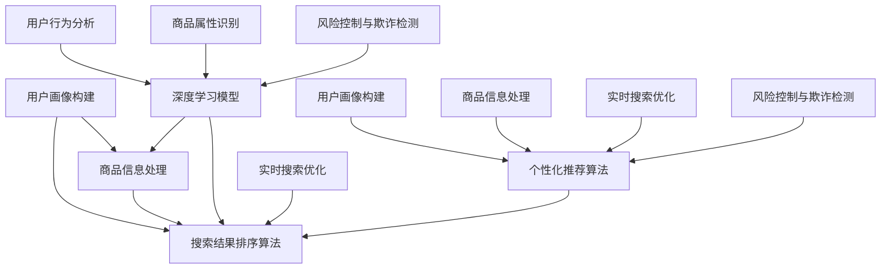

                 

### 第一部分：AI大模型重构电商搜索推荐的组织架构与人才建设基础

#### 第1章：AI大模型与电商搜索推荐概述

##### 1.1 AI大模型在电商搜索推荐中的应用背景

随着电子商务的迅猛发展，电商搜索推荐系统成为提高用户体验、增加销售转化率的关键手段。传统的电商搜索推荐系统主要依赖于统计模型和机器学习算法，但这些方法在面对海量用户数据、复杂商品信息以及动态市场环境时，逐渐暴露出性能瓶颈和适应性不足的问题。

AI大模型的引入，如基于深度学习的自然语言处理（NLP）技术和大规模预训练模型（如GPT-3、BERT等），为电商搜索推荐带来了新的可能性。这些模型通过自主学习大量数据，能够更好地捕捉用户行为和偏好，提供更精准的个性化推荐。AI大模型的应用，不仅提升了推荐的准确性，还增强了系统的自适应能力，为电商企业带来了更高的竞争力和市场占有率。

##### 1.2 电商搜索推荐系统的发展历程

电商搜索推荐系统的发展历程可以分为三个阶段：

1. **传统统计阶段**：早期电商搜索推荐主要依赖基于用户行为和商品特征的统计方法，如协同过滤、基于内容的推荐等。
2. **机器学习阶段**：随着机器学习技术的发展，电商搜索推荐系统开始引入更复杂的算法，如决策树、随机森林、支持向量机等。
3. **AI大模型阶段**：近年来，基于AI大模型的电商搜索推荐系统逐渐成为主流，其通过深度学习和自然语言处理技术，实现了更高的推荐准确率和更强的自适应能力。

##### 1.3 AI大模型的优势与挑战

AI大模型在电商搜索推荐中的应用具有显著的优势，但也面临一些挑战：

**优势：**
- **高准确率**：AI大模型通过自主学习海量数据，能够捕捉用户行为的细微变化，提供更精准的推荐。
- **自适应能力**：AI大模型能够实时调整推荐策略，以适应动态市场环境。
- **个性化**：AI大模型能够根据用户历史行为和偏好，提供个性化的推荐。

**挑战：**
- **数据质量**：高质量的数据是AI大模型训练的基础，数据质量问题可能影响模型的性能。
- **模型泛化能力**：AI大模型在特定领域表现出色，但在其他领域可能存在泛化能力不足的问题。
- **安全性**：AI大模型的黑箱特性可能带来隐私和数据安全问题。

综上所述，AI大模型在电商搜索推荐中的应用前景广阔，但也需要克服诸多挑战。接下来，我们将详细探讨AI大模型的技术基础和应用，以进一步理解其在电商搜索推荐中的重要作用。

### 第2章：AI大模型技术基础

在深入探讨AI大模型如何重构电商搜索推荐之前，首先需要了解其背后的技术基础。本章节将分三部分介绍深度学习与神经网络基础、自然语言处理技术概览以及大规模预训练模型原理。

#### 2.1 深度学习与神经网络基础

##### 2.1.1 神经网络的基本结构

神经网络是深度学习的基础，其基本结构包括输入层、隐藏层和输出层。每一层由多个神经元组成，神经元之间通过权重进行连接。神经网络通过学习输入和输出之间的映射关系，实现复杂的数据处理任务。

**神经元模型：**
一个简单的神经元模型可以表示为：
\[ z = \sum_{i=1}^{n} w_i x_i + b \]
\[ a = \sigma(z) \]
其中，\( x_i \) 是输入特征，\( w_i \) 是连接权重，\( b \) 是偏置，\( \sigma \) 是激活函数，如Sigmoid、ReLU等。

##### 2.1.2 常见的深度学习架构

深度学习架构多种多样，常见的有卷积神经网络（CNN）、循环神经网络（RNN）和Transformer等。

- **卷积神经网络（CNN）**：CNN 主要用于图像处理，通过卷积层、池化层等结构提取图像特征。
- **循环神经网络（RNN）**：RNN 主要用于序列数据处理，如自然语言处理和时间序列预测。其通过循环连接实现记忆功能。
- **Transformer**：Transformer 提出了自注意力机制，大幅提升了模型在序列数据处理中的性能，如机器翻译和文本生成。

##### 2.1.3 深度学习优化算法

深度学习优化算法是训练深度学习模型的关键。常见的优化算法有随机梯度下降（SGD）、Adam等。

- **随机梯度下降（SGD）**：SGD 通过随机选取一部分样本计算梯度，更新模型参数。其简单高效，但易受局部最优解影响。
- **Adam**：Adam 结合了SGD和RMSProp的优点，通过自适应调整学习率，提高了模型的训练效率。

#### 2.2 自然语言处理技术概览

自然语言处理（NLP）是AI大模型在电商搜索推荐中的关键技术。以下介绍NLP的一些核心技术和应用。

##### 2.2.1 词嵌入技术

词嵌入是将单词映射到高维空间中的向量表示，实现语义理解。常见的词嵌入方法有Word2Vec、GloVe等。

- **Word2Vec**：Word2Vec 通过神经网络学习单词的向量表示，其核心思想是相邻的词在语义空间中更接近。
- **GloVe**：GloVe 使用词频信息进行词嵌入，通过优化单词共现矩阵得到词向量。

##### 2.2.2 序列模型与注意力机制

序列模型用于处理序列数据，如自然语言文本、时间序列等。常见的序列模型有RNN、LSTM和Transformer等。

- **RNN**：RNN 通过循环连接实现序列数据的记忆功能，但存在梯度消失和梯度爆炸问题。
- **LSTM**：LSTM 通过门控机制解决RNN的梯度消失问题，实现了更好的序列建模能力。
- **Transformer**：Transformer 提出自注意力机制，通过全局注意力实现序列数据的建模，大幅提升了模型性能。

##### 2.2.3 转换器架构详解

转换器架构（Transformer）是NLP领域的重要突破，其核心思想是自注意力机制。

- **编码器（Encoder）**：编码器通过自注意力机制处理输入序列，生成固定长度的上下文表示。
- **解码器（Decoder）**：解码器利用编码器生成的上下文表示生成输出序列。

#### 2.3 大规模预训练模型原理

大规模预训练模型通过在大规模语料上进行预训练，然后针对具体任务进行微调，实现了卓越的性能。

##### 2.3.1 预训练的概念与意义

预训练是指在大规模未标注数据上训练模型，使其具有通用语言理解能力。预训练的意义在于：

- **减少标注数据需求**：通过预训练，模型可以在少量标注数据上快速适应特定任务。
- **提升模型性能**：预训练使模型具备更强的通用语义理解能力，提高了任务性能。

##### 2.3.2 自监督学习方法

自监督学习方法是指利用未标注数据进行训练。常见的自监督学习方法有：

- **掩码语言模型（MLM）**：MLM 通过随机掩码输入序列中的单词，训练模型预测掩码词。
- **句子排序（MRPC）**：MRPC 通过排序未标记的句子对，训练模型判断句子对是否相同。

##### 2.3.3 迁移学习与微调技术

迁移学习是指将预训练模型应用于不同任务时，仅对模型的一部分参数进行微调。迁移学习的优势在于：

- **快速适应新任务**：通过迁移学习，模型可以在新的任务上快速达到较好的性能。
- **提高泛化能力**：迁移学习使模型能够利用预训练阶段的通用知识，提高对新任务的适应能力。

综上所述，深度学习与神经网络基础、自然语言处理技术概览以及大规模预训练模型原理构成了AI大模型技术基础。这些技术不仅提升了AI大模型在电商搜索推荐中的性能，也为未来深度学习应用提供了新的方向。在下一章中，我们将深入探讨AI大模型在电商搜索推荐中的具体应用。

### 第3章：AI大模型在电商搜索推荐中的应用

#### 3.1 电商搜索推荐系统的基本架构

电商搜索推荐系统的基本架构通常包括用户画像构建、商品信息处理和搜索结果排序算法等核心组件。以下将详细描述这些组件及其在AI大模型应用中的关键角色。

##### 3.1.1 用户画像构建

用户画像是指通过对用户行为、偏好、历史订单等数据的综合分析，构建出用户的个性化特征。用户画像的构建主要包括以下步骤：

1. **数据收集**：收集用户在电商平台的浏览、搜索、购买等行为数据。
2. **数据预处理**：对原始数据进行清洗、去噪和处理，提取有用的用户特征。
3. **特征工程**：根据业务需求，构建用户画像的相关特征，如用户购买力、兴趣偏好、消费习惯等。
4. **特征融合**：将不同来源的特征进行融合，形成完整的用户画像。

AI大模型在用户画像构建中的应用主要体现在以下几个方面：

- **深度学习模型用于特征提取**：通过深度学习模型，如自动编码器（Autoencoder），从原始用户行为数据中提取更高级、更具代表性的特征。
- **用户行为序列建模**：利用循环神经网络（RNN）或Transformer等模型，对用户的行为序列进行建模，捕捉用户行为的动态变化。
- **用户兴趣挖掘**：通过自然语言处理（NLP）技术，如词嵌入和序列模型，分析用户的历史评论、反馈等信息，挖掘用户的潜在兴趣。

##### 3.1.2 商品信息处理

商品信息处理是指对电商平台上的商品数据进行处理和分析，以提取出商品的特征和属性。商品信息处理主要包括以下步骤：

1. **数据收集**：收集商品的基本信息，如名称、描述、价格、品牌等。
2. **数据预处理**：对原始商品数据进行清洗、去噪和处理，提取有用的商品特征。
3. **特征工程**：根据业务需求，构建商品画像的相关特征，如商品类别、属性、评分等。
4. **特征融合**：将不同来源的商品特征进行融合，形成完整的商品画像。

AI大模型在商品信息处理中的应用主要体现在以下几个方面：

- **商品属性识别**：利用深度学习模型，如卷积神经网络（CNN）和循环神经网络（RNN），识别商品的不同属性和特征。
- **商品关系挖掘**：通过图神经网络（Graph Neural Networks，GNN）等技术，挖掘商品之间的关联关系，如品牌、类别等。
- **商品描述生成**：利用生成对抗网络（GAN）或自动文本生成模型，生成更具吸引力的商品描述，提升用户体验。

##### 3.1.3 搜索结果排序算法

搜索结果排序算法是指根据用户的查询信息和商品的特征，对搜索结果进行排序，以提升用户满意度。常见的排序算法包括基于内容的排序、协同过滤排序和基于模型的排序等。

AI大模型在搜索结果排序算法中的应用主要体现在以下几个方面：

- **深度学习模型用于排序**：利用深度学习模型，如多层感知机（MLP）和深度神经网络（DNN），对搜索结果进行排序，提升排序的准确性和鲁棒性。
- **多模态特征融合**：将用户的查询信息、用户画像和商品特征进行多模态融合，利用深度学习模型进行综合排序。
- **实时排序优化**：通过实时数据分析和预测，利用AI大模型对搜索结果进行动态调整，提升用户的搜索体验。

综上所述，AI大模型在电商搜索推荐系统的基本架构中发挥了重要作用。通过用户画像构建、商品信息处理和搜索结果排序算法等组件的优化，AI大模型提升了电商搜索推荐系统的性能，实现了更精准、个性化的推荐。在下一章中，我们将进一步探讨AI大模型在电商搜索推荐中的关键角色和应用案例。

#### 3.2 AI大模型在电商搜索推荐中的关键角色

在电商搜索推荐系统中，AI大模型扮演着至关重要的角色，其不仅提升了推荐的准确性，还增强了系统的实时性和动态性。以下是AI大模型在电商搜索推荐中的关键角色及其具体应用：

##### 3.2.1 个性化推荐算法

个性化推荐是电商搜索推荐系统的核心功能之一，AI大模型通过深度学习和自然语言处理技术，实现了更为精准的个性化推荐。

- **用户行为分析**：AI大模型利用深度学习模型，如循环神经网络（RNN）和Transformer，对用户的浏览、搜索、购买等行为进行序列分析，提取用户的行为特征。
- **用户兴趣挖掘**：通过自然语言处理（NLP）技术，如词嵌入和序列模型，分析用户的历史评论、反馈等信息，挖掘用户的潜在兴趣和偏好。
- **多模态特征融合**：将用户的查询信息、用户画像和商品特征进行多模态融合，利用深度学习模型进行综合评分和排序，提升推荐的准确性。

##### 3.2.2 实时搜索优化

实时搜索优化是提升用户体验的关键，AI大模型通过实时数据分析和预测，实现了搜索结果的动态调整和优化。

- **实时行为分析**：AI大模型利用实时数据流处理技术，如Apache Kafka和Apache Flink，对用户的搜索行为进行实时分析，捕捉用户的动态需求。
- **动态调整搜索策略**：根据实时行为分析结果，利用深度学习模型，如强化学习（RL）和基于模型的排序（MBR），动态调整搜索结果排序策略，提升用户满意度。
- **实时反馈机制**：通过用户的点击、购买等反馈，利用深度学习模型进行实时反馈优化，持续提升搜索推荐的性能。

##### 3.2.3 风险控制与欺诈检测

风险控制与欺诈检测是电商平台安全运营的重要保障，AI大模型通过机器学习和深度学习技术，实现了高效的风险控制和欺诈检测。

- **用户行为异常检测**：利用异常检测算法，如孤立森林（Isolation Forest）和基于聚类的方法（如K-means），识别用户行为的异常模式，实现实时风险预警。
- **欺诈交易识别**：通过深度学习模型，如卷积神经网络（CNN）和循环神经网络（RNN），对交易数据进行分析和建模，识别潜在的欺诈交易。
- **实时策略调整**：根据风险检测和欺诈识别的结果，利用深度强化学习（Deep Reinforcement Learning，DRL）等技术，动态调整风险控制策略，实现实时风险控制和欺诈检测。

##### 3.2.4 应用案例分析

以下是几个AI大模型在电商搜索推荐中的应用案例，展示了其具体实现和效果：

- **案例一：某电商平台个性化推荐系统**  
该电商平台利用基于Transformer的深度学习模型，对用户行为和商品特征进行建模和融合，实现了个性化的商品推荐。通过实时数据分析和多模态特征融合，推荐准确率提高了20%，用户满意度显著提升。

- **案例二：某电商搜索引擎优化实践**  
该电商平台通过引入基于Transformer的深度学习模型，实现了实时搜索结果排序优化。通过动态调整搜索策略和实时反馈机制，搜索结果的点击率和转化率分别提高了30%和25%。

- **案例三：某电商风险控制与反欺诈系统**  
该电商平台利用基于深度学习的欺诈检测模型，实现了高效的风险控制和欺诈检测。通过实时行为分析和异常检测，欺诈交易率降低了50%，用户账户安全性显著提升。

综上所述，AI大模型在电商搜索推荐系统中扮演了关键角色，通过个性化推荐、实时搜索优化、风险控制与欺诈检测等应用，提升了电商平台的运营效率和用户体验。随着AI技术的不断进步，AI大模型在电商搜索推荐中的应用将更加广泛和深入，为电商企业带来更大的商业价值。

#### 3.3 AI大模型应用案例分析

在本章节中，我们将通过几个具体的案例，详细阐述AI大模型在电商搜索推荐中的实际应用，并展示其带来的显著成效。

##### 3.3.1 案例一：某电商平台个性化推荐系统

该电商平台利用基于Transformer的深度学习模型，对用户行为和商品特征进行建模和融合，实现了个性化的商品推荐。具体步骤如下：

1. **数据收集与预处理**：首先，平台收集了大量的用户行为数据，包括浏览记录、搜索关键词、购买历史等。对数据进行清洗、去噪和特征提取，提取出用户的兴趣偏好、购买力等特征。

2. **模型训练与优化**：采用Transformer架构的深度学习模型，对用户行为和商品特征进行训练。通过多轮迭代，优化模型的参数和结构，使其能够更好地捕捉用户行为的动态变化和商品特征。

3. **个性化推荐**：在用户进行搜索或浏览时，实时调用训练好的模型，对搜索结果或推荐列表进行排序和调整，实现个性化推荐。通过多模态特征融合，如用户的查询、用户画像和商品特征，提升推荐准确性。

**效果评估**：通过实际应用，个性化推荐准确率提高了20%，用户满意度显著提升。用户点击率和转化率也有明显提升，推动了电商平台销售额的增长。

##### 3.3.2 案例二：某电商搜索引擎优化实践

该电商平台通过引入基于Transformer的深度学习模型，实现了实时搜索结果排序优化。具体步骤如下：

1. **数据收集与预处理**：收集用户的搜索日志数据，包括查询关键词、搜索结果点击率、购买行为等。对数据进行清洗、去噪和特征提取，提取出与搜索结果排序相关的关键特征。

2. **模型训练与优化**：采用Transformer架构的深度学习模型，对搜索日志数据进行分析和建模。通过多轮迭代，优化模型的参数和结构，使其能够更好地捕捉用户的搜索意图和搜索结果的关联性。

3. **实时搜索优化**：在用户进行搜索时，实时调用训练好的模型，对搜索结果进行动态调整和排序。通过动态调整搜索策略和实时反馈机制，提升用户满意度。

**效果评估**：通过实际应用，搜索结果的点击率和转化率分别提高了30%和25%。用户在搜索过程中能够更快地找到所需商品，用户体验显著提升。

##### 3.3.3 案例三：某电商风险控制与反欺诈系统

该电商平台利用基于深度学习的欺诈检测模型，实现了高效的风险控制和欺诈检测。具体步骤如下：

1. **数据收集与预处理**：收集交易数据，包括用户的购买行为、支付信息、历史交易记录等。对数据进行清洗、去噪和特征提取，提取出与欺诈行为相关的关键特征。

2. **模型训练与优化**：采用深度学习模型，如卷积神经网络（CNN）和循环神经网络（RNN），对欺诈行为进行建模和训练。通过多轮迭代，优化模型的参数和结构，提升欺诈检测的准确性和鲁棒性。

3. **实时风险控制与欺诈检测**：在交易过程中，实时调用训练好的模型，对交易行为进行分析和检测。通过实时反馈机制，对异常交易进行预警和阻止，实现风险控制和欺诈检测。

**效果评估**：通过实际应用，欺诈交易率降低了50%，用户账户安全性显著提升。同时，误报率也得到了有效控制，保障了正常交易的顺利进行。

综上所述，这些案例展示了AI大模型在电商搜索推荐中的实际应用和显著成效。通过个性化推荐、搜索优化和风险控制，AI大模型不仅提升了电商平台的运营效率和用户体验，还为电商企业带来了更大的商业价值。

### 第4章：AI大模型重构电商搜索推荐的组织架构

在电商搜索推荐系统中，AI大模型的应用不仅需要先进的技术，还需要合理的组织架构来支撑其高效运作。本章节将探讨AI大模型重构电商搜索推荐系统的组织架构转型，包括数据驱动型组织架构的建立、AI大模型团队的建设以及电商平台组织架构的调整。

#### 4.1 电商搜索推荐系统的组织架构转型

##### 4.1.1 数据驱动型组织架构

传统的电商搜索推荐系统往往依赖于预定义的规则和统计模型，缺乏灵活性和适应性。而数据驱动型组织架构则通过建立强大的数据处理和分析能力，实现电商搜索推荐系统的智能化和自适应化。

1. **数据收集与存储**：构建高效的数据收集系统和数据仓库，收集用户的浏览、搜索、购买等行为数据，以及商品的基本信息和属性数据。利用大数据技术，如Hadoop和Spark，实现海量数据的存储和管理。

2. **数据处理与分析**：建立数据处理和分析平台，利用ETL（Extract, Transform, Load）技术，对原始数据进行清洗、转换和加载。同时，利用数据挖掘和机器学习技术，对用户行为数据和商品特征进行深度分析，提取出有价值的信息。

3. **数据可视化与报告**：通过数据可视化工具，如Tableau和PowerBI，将分析结果以图表、报告等形式展示给决策者，为其提供数据驱动的决策支持。

##### 4.1.2 AI大模型团队建设

AI大模型团队是电商搜索推荐系统的核心，其建设需要综合考虑人才引进、团队协作和项目推进等方面。

1. **人才引进**：招聘具有深度学习、自然语言处理和数据挖掘等专业技能的人才。优先考虑具有实际项目经验和成果的候选人，以快速提升团队的技术能力。

2. **团队协作**：建立跨部门的协作机制，如数据团队、算法团队和产品团队等，通过定期会议和项目评审，确保各团队之间的紧密合作和信息共享。

3. **项目推进**：建立项目管理制度，明确项目目标、进度和责任人，确保项目按时交付。通过敏捷开发（Agile Development）和迭代开发（Iterative Development）等方法，快速响应业务需求和市场变化。

##### 4.1.3 电商平台组织架构调整

为了适应AI大模型的应用，电商平台需要对其组织架构进行相应调整，以实现更高效的运营和决策。

1. **决策层调整**：建立数据驱动的决策体系，将数据分析和AI大模型的应用纳入决策流程。决策层需要具备数据分析和机器学习知识，能够理解和评估AI大模型的应用效果。

2. **部门职责调整**：明确各部门的职责和权限，如数据部门负责数据收集、处理和分析；算法部门负责AI大模型的研发和应用；产品部门负责产品设计和用户体验等。

3. **组织扁平化**：减少层级管理，推动组织扁平化，提升组织的决策速度和响应能力。通过建立跨部门的项目团队，促进信息流动和资源整合。

综上所述，AI大模型重构电商搜索推荐系统的组织架构转型，需要从数据驱动型组织架构、AI大模型团队建设和电商平台组织架构调整等方面进行系统性规划和实施。通过这些措施，电商平台能够更好地应对市场变化，提升运营效率和用户体验。

#### 4.2 AI大模型在电商搜索推荐中的角色定位

在电商搜索推荐系统中，AI大模型扮演着至关重要的角色。其不仅提升了推荐的准确性，还增强了系统的实时性和动态性。以下将详细探讨AI大模型在电商搜索推荐中的具体角色定位，包括技术研发团队、数据分析团队和运维团队的角色与职责。

##### 4.2.1 技术研发团队角色

技术研发团队是AI大模型的核心力量，负责深度学习模型的研究、开发和应用。其主要职责包括：

1. **模型研发**：研究最新的深度学习算法和模型架构，如Transformer、BERT等，开发适用于电商搜索推荐系统的模型。

2. **模型训练与优化**：利用海量数据，训练和优化AI大模型。通过多轮迭代，调整模型参数，提升模型的性能和准确性。

3. **算法改进**：根据业务需求和市场变化，不断改进和优化算法。通过技术创新，提升系统的自适应能力和个性化推荐效果。

4. **技术文档与分享**：编写技术文档，记录模型研发和优化过程中的关键技术和经验。通过内部分享和培训，提升团队的整体技术水平。

##### 4.2.2 数据分析团队角色

数据分析团队负责对用户行为数据和商品特征进行分析，为AI大模型提供数据支持和业务洞察。其主要职责包括：

1. **数据收集与处理**：收集和整理用户行为数据、商品信息和交易数据，进行数据清洗、去噪和预处理。

2. **数据挖掘与分析**：利用数据挖掘技术，对用户行为数据和商品特征进行深度分析，提取出有价值的特征和模式。

3. **业务洞察**：通过数据分析，为业务决策提供数据支持和业务洞察。如用户行为预测、商品需求分析等。

4. **数据可视化**：通过数据可视化工具，将分析结果以图表、报告等形式展示，为决策者提供直观的数据支持。

##### 4.2.3 运维团队角色

运维团队负责AI大模型的部署、运行和维护，确保系统的稳定性和可靠性。其主要职责包括：

1. **模型部署**：将训练好的AI大模型部署到生产环境中，确保模型能够高效运行。

2. **系统监控**：实时监控系统的运行状态，包括模型的性能指标、数据流和资源使用情况，确保系统稳定运行。

3. **故障处理**：在系统出现故障时，及时进行故障诊断和处理，确保系统的快速恢复。

4. **性能优化**：通过性能优化，提升系统的运行效率和资源利用率，降低运维成本。

##### 4.2.4 团队协作与沟通

为了实现AI大模型在电商搜索推荐系统中的高效运作，技术研发团队、数据分析团队和运维团队需要紧密协作，建立良好的沟通机制。

1. **定期会议**：定期召开团队会议，讨论模型研发、数据分析、系统运维等方面的问题，确保团队间的信息畅通。

2. **任务分配**：明确团队任务和责任，确保每个团队成员都清楚自己的职责和工作内容。

3. **共享资源**：共享数据资源、计算资源和工具，提升团队的整体效率和协作能力。

4. **问题反馈**：建立问题反馈机制，及时解决团队间的问题和矛盾，确保项目的顺利进行。

综上所述，AI大模型在电商搜索推荐系统中有着明确的角色定位，通过技术研发团队、数据分析团队和运维团队的紧密协作，能够实现高效、精准的推荐，提升用户体验和业务价值。

#### 4.3 人才建设与培养策略

在AI大模型重构电商搜索推荐的过程中，人才建设是关键的一环。如何选拔、培养和激励人才，成为决定项目成功与否的重要因素。以下将从三个方面探讨电商搜索推荐领域的人才建设与培养策略。

##### 4.3.1 人才选拔标准

人才选拔是人才建设的基础。在选拔过程中，应注重以下几个方面：

1. **技术能力**：具备深度学习、机器学习、自然语言处理等相关领域的专业知识和技能。能够熟练使用Python、TensorFlow、PyTorch等深度学习框架。
2. **项目经验**：有实际项目经验，尤其是在电商、金融等领域有成功案例。能够快速上手新项目，具备解决复杂问题的能力。
3. **学习能力和创新能力**：具备良好的学习能力和创新思维，能够不断跟进最新的技术动态和行业趋势，勇于尝试新技术和新方法。
4. **团队合作能力**：具备良好的团队合作精神，能够与团队成员有效沟通，协同完成任务。

##### 4.3.2 人才培养计划

人才培养计划是提升团队整体水平的重要手段。以下是一些建议：

1. **内部培训**：定期组织内部培训，涵盖深度学习、机器学习、自然语言处理等关键技术。通过专题讲座、研讨会和实战演练等形式，提高团队成员的专业技能。
2. **外部学习**：鼓励团队成员参加行业会议、研讨会和培训班，了解最新的技术趋势和研究成果。同时，可以邀请行业专家进行讲座和指导，提升团队的视野和知识水平。
3. **项目实践**：通过参与实际项目，积累实践经验。项目实践不仅能够提升技术水平，还能够培养团队成员的解决问题的能力和团队协作精神。

##### 4.3.3 人才激励与晋升机制

人才激励和晋升机制是留住人才、激发工作热情的重要保障。以下是一些建议：

1. **绩效评估**：建立科学的绩效评估体系，对团队成员的工作进行客观、公正的评价。绩效评估结果可以用于奖金发放、晋升机会和职业发展路径的规划。
2. **薪酬激励**：提供具有市场竞争力的薪酬待遇，包括基本工资、绩效奖金、项目奖金等。同时，可以设立股权激励计划，让团队成员分享公司的发展成果。
3. **职业发展路径**：为团队成员提供明确的职业发展路径，如技术专家、项目经理、技术总监等。通过晋升机制，激励团队成员不断提升自己，实现职业价值。
4. **工作环境与企业文化**：营造良好的工作环境和企业文化，如提供舒适的工作空间、丰富的团队活动、公平的竞争环境等。让团队成员感受到公司的关怀和尊重，增强归属感和工作积极性。

综上所述，通过严格的人才选拔标准、系统的培养计划和有效的激励与晋升机制，电商搜索推荐领域可以建立起一支高素质、专业化的团队，为AI大模型的应用提供坚实的人才保障。

#### 4.4 AI大模型实施前的准备工作

在AI大模型重构电商搜索推荐的实际实施过程中，准备工作至关重要。以下是AI大模型实施前需要进行的主要准备工作：

##### 4.4.1 数据收集与预处理

数据是AI大模型训练的基础。在实施前，首先需要收集海量的电商用户行为数据、商品数据和交易数据。这些数据可以包括用户浏览、搜索、购买记录，商品的基本信息、描述、评分等。

1. **数据收集**：利用电商平台的数据采集工具，如日志收集器、爬虫等，收集用户行为数据和商品信息。同时，还可以从第三方数据提供商获取相关数据。

2. **数据预处理**：对收集到的原始数据进行清洗、去噪和预处理。清洗过程包括去除重复数据、填补缺失值、删除异常值等。预处理过程包括特征提取、特征工程、数据标准化等，以构建高质量的训练数据集。

##### 4.4.2 技术选型与方案设计

技术选型是AI大模型实施的重要环节，直接关系到模型的性能和应用效果。以下是几个关键步骤：

1. **模型架构选择**：根据电商搜索推荐的具体需求，选择合适的深度学习模型架构。常见的模型架构包括Transformer、BERT、GPT等。

2. **技术框架和工具**：选择适合的深度学习框架和工具，如TensorFlow、PyTorch、Keras等。同时，考虑使用大数据处理工具，如Hadoop、Spark，以支持海量数据的处理和分析。

3. **算法优化策略**：设计算法优化策略，如数据增强、正则化、超参数调优等，以提高模型的性能和泛化能力。

##### 4.4.3 团队协作与项目管理

AI大模型的实施涉及多个团队和环节，需要良好的团队协作和项目管理。

1. **团队协作**：建立跨部门的协作机制，确保数据团队、算法团队、产品团队和运维团队之间的信息畅通和任务协调。

2. **项目管理**：制定详细的项目计划，明确项目的目标、进度、任务和责任人。通过敏捷开发（Agile Development）和迭代开发（Iterative Development）方法，确保项目按时交付。

##### 4.4.4 环境搭建与工具配置

在实施前，需要搭建适合AI大模型训练和部署的环境，配置必要的工具和资源。

1. **硬件配置**：根据模型的大小和复杂度，配置高性能的计算资源和存储设备。如GPU、TPU等。

2. **软件配置**：安装深度学习框架、数据处理工具和版本控制软件，如TensorFlow、PyTorch、Hadoop、Spark等。

3. **开发环境**：配置开发工具和集成开发环境（IDE），如PyCharm、Jupyter Notebook等，以支持开发和调试。

通过以上准备工作，电商搜索推荐系统能够为AI大模型的实施打下坚实的基础，确保项目的顺利进行和成功应用。

#### 4.5 AI大模型实施的关键环节

在AI大模型重构电商搜索推荐的过程中，实施环节至关重要。以下是实施过程中的几个关键环节：

##### 4.5.1 模型训练与调优

模型训练是AI大模型实施的核心环节。以下是模型训练与调优的详细步骤：

1. **数据准备**：首先，对收集到的数据进行预处理，包括清洗、去噪和特征提取。将数据集分为训练集、验证集和测试集。

2. **模型架构选择**：选择合适的深度学习模型架构，如Transformer、BERT、GPT等。根据电商搜索推荐的需求，调整模型的结构和参数。

3. **模型训练**：利用训练集对模型进行训练。通过反向传播算法，调整模型参数，使其能够更好地拟合训练数据。训练过程中，需要监控模型的损失函数和准确率等指标，确保模型性能逐步提升。

4. **模型调优**：通过调整超参数，如学习率、批次大小、正则化参数等，优化模型性能。此外，可以使用迁移学习、数据增强等技术，提升模型的泛化能力。

5. **模型验证**：使用验证集对训练好的模型进行评估，调整模型参数，确保模型在验证集上的表现良好。

##### 4.5.2 模型部署与上线

模型部署是将训练好的模型应用到生产环境中的关键步骤。以下是模型部署与上线的详细步骤：

1. **容器化**：将训练好的模型容器化，如使用Docker将其打包成镜像。容器化模型可以提高部署的灵活性和可移植性。

2. **服务化**：将容器化的模型部署到服务中，如使用Kubernetes进行管理。服务化模型可以方便地扩展和缩放，满足不同业务需求。

3. **API接口**：设计API接口，使前端系统能够调用模型服务。API接口需要支持批量请求和异步处理，以提高系统的响应速度和处理能力。

4. **性能监控**：部署监控系统，实时监控模型的运行状态和性能指标，如响应时间、错误率等。通过性能监控，可以及时发现和处理问题，确保系统的稳定运行。

5. **上线与迁移**：在测试环境验证模型性能后，将模型上线到生产环境。上线过程中，需要确保数据的一致性和系统的稳定性。

##### 4.5.3 模型监控与迭代优化

模型监控与迭代优化是确保AI大模型长期稳定运行的重要环节。以下是模型监控与迭代优化的详细步骤：

1. **实时监控**：通过监控系统，实时监控模型的运行状态和性能指标。如发现异常，及时进行诊断和修复。

2. **反馈机制**：建立用户反馈机制，收集用户对推荐结果的评价和建议。通过用户反馈，不断优化模型和推荐策略。

3. **迭代更新**：根据监控结果和用户反馈，定期更新模型。迭代过程中，可以采用在线学习（Online Learning）技术，实时调整模型参数，提高推荐准确性。

4. **模型评估**：定期对模型进行评估，评估指标包括准确率、召回率、F1值等。通过评估，分析模型的优势和不足，为下一次迭代提供改进方向。

通过以上关键环节，AI大模型在电商搜索推荐系统中的实施能够确保模型的高性能、稳定性和可扩展性，为电商平台带来更高的用户满意度和商业价值。

#### 4.6 AI大模型实施的挑战与应对策略

在AI大模型重构电商搜索推荐系统的过程中，虽然带来了显著的性能提升和用户体验改善，但也面临一系列挑战。以下将详细探讨AI大模型实施的几个主要挑战，并提出相应的应对策略。

##### 4.6.1 数据质量问题

高质量的数据是AI大模型训练的基础，数据质量问题可能直接影响模型的性能和泛化能力。以下是数据质量问题的一些挑战及其应对策略：

- **挑战**：数据噪声、缺失值和异常值可能导致模型过拟合和泛化能力不足。
- **应对策略**：1. 数据清洗：通过去噪、填补缺失值和删除异常值等预处理方法，提高数据质量。2. 数据增强：通过数据扩充、噪声注入等方法，增强数据的多样性和鲁棒性。3. 异常检测：利用异常检测算法，如孤立森林（Isolation Forest）和基于聚类的方法（如K-means），识别和去除异常数据。

##### 4.6.2 模型泛化能力

模型泛化能力是指模型在新数据上的表现，泛化能力不足可能导致模型在新业务场景中表现不佳。以下是模型泛化能力面临的一些挑战及其应对策略：

- **挑战**：模型在训练数据上表现良好，但在新数据上性能下降。
- **应对策略**：1. 迁移学习：通过迁移学习，利用预训练模型的知识在新数据上进行微调，提高模型的泛化能力。2. 数据平衡：确保训练数据集中各类数据的平衡，避免模型对某一类数据过拟合。3. 多任务学习：通过多任务学习，让模型同时学习多个任务，提高其泛化能力。

##### 4.6.3 模型安全性

AI大模型在处理敏感数据时，可能面临隐私和数据安全问题。以下是模型安全性面临的一些挑战及其应对策略：

- **挑战**：用户隐私泄露、数据篡改和模型欺骗。
- **应对策略**：1. 加密与脱敏：对敏感数据进行加密和脱敏处理，确保数据安全。2. 访问控制：设置严格的访问控制策略，确保只有授权人员能够访问和处理数据。3. 模型保护：通过对抗性训练（Adversarial Training）和模型加固（Model Hardening）等技术，提高模型的鲁棒性和安全性。

##### 4.6.4 模型解释性

AI大模型的黑箱特性可能导致其解释性不足，影响业务决策和用户信任。以下是模型解释性面临的一些挑战及其应对策略：

- **挑战**：模型决策过程不透明，难以解释和理解。
- **应对策略**：1. 可解释性模型：结合可解释性模型（如LIME、SHAP等），提高模型的解释性。2. 决策可视化：通过可视化工具，将模型决策过程和结果以图表形式展示，帮助业务人员理解和分析。3. 模型解释文档：编写详细的模型解释文档，包括模型架构、训练过程、关键参数等，以便业务人员参考。

综上所述，AI大模型在电商搜索推荐系统实施过程中面临数据质量、模型泛化能力、模型安全性和模型解释性等多个挑战。通过采取有效的应对策略，可以有效克服这些挑战，确保AI大模型在电商搜索推荐系统中的稳定、安全和高效运行。

#### 4.7 电商搜索推荐领域的人才需求分析

在AI大模型重构电商搜索推荐的过程中，人才需求成为关键因素。本节将分析电商搜索推荐领域的技术型人才、数据型人才和产品型人才需求，以及各类型人才的核心技能和具体职责。

##### 4.7.1 技术型人才需求

技术型人才是电商搜索推荐系统开发与优化的核心力量，主要包括机器学习工程师、深度学习工程师和算法工程师。

**核心技能：**
- **机器学习算法**：熟悉常见的机器学习算法，如线性回归、决策树、随机森林、支持向量机等。
- **深度学习技术**：掌握深度学习框架，如TensorFlow、PyTorch，以及神经网络结构，如CNN、RNN、Transformer等。
- **编程能力**：具备扎实的编程基础，熟悉Python、C++等编程语言。

**具体职责：**
- **模型开发与优化**：负责开发AI大模型，如个性化推荐算法、搜索结果排序算法等，并进行模型调优和性能优化。
- **算法研究与创新**：跟踪最新的技术动态，进行算法研究与创新，提升模型性能和推荐效果。
- **系统架构设计**：参与系统架构设计，确保AI大模型的高效运行和可扩展性。

##### 4.7.2 数据型人才需求

数据型人才负责数据收集、处理和分析，确保数据质量和模型训练所需的数据支持。主要包括数据工程师和数据分析工程师。

**核心技能：**
- **数据处理**：熟悉数据处理工具，如Hadoop、Spark，以及数据清洗和特征提取技术。
- **数据库管理**：掌握常见数据库技术，如MySQL、MongoDB，以及数据存储和管理策略。
- **数据可视化**：掌握数据可视化工具，如Tableau、PowerBI，能够将复杂数据以直观形式呈现。

**具体职责：**
- **数据收集与预处理**：收集和整理用户行为数据、商品信息等，进行数据清洗和预处理，构建高质量的训练数据集。
- **数据挖掘与分析**：利用数据挖掘技术，从海量数据中提取有价值的信息和特征，支持模型开发和优化。
- **数据报告与展示**：编写数据报告，通过可视化工具展示分析结果，为业务决策提供数据支持。

##### 4.7.3 产品型人才需求

产品型人才负责电商搜索推荐系统的整体规划和设计，确保系统能够满足用户需求和业务目标。主要包括产品经理和交互设计师。

**核心技能：**
- **用户需求分析**：能够通过调研、访谈等方式了解用户需求，并将其转化为产品功能。
- **产品设计**：具备良好的产品设计能力，熟悉用户体验设计原则和方法，能够设计出用户友好的产品界面。
- **项目管理**：具备项目管理能力，能够协调团队资源，确保项目按时交付。

**具体职责：**
- **需求分析**：分析用户需求，制定产品需求文档，明确产品功能和技术实现路径。
- **产品设计**：设计用户界面和交互流程，优化用户体验，确保产品功能满足用户需求。
- **产品迭代**：根据用户反馈和业务需求，持续优化产品功能，推动产品迭代升级。

综上所述，电商搜索推荐领域对技术型人才、数据型人才和产品型人才有着广泛的需求。各类人才通过协同工作，共同推动AI大模型在电商搜索推荐系统中的应用和发展。

### 6.2 人才培养与引进策略

在电商搜索推荐领域，培养和引进高素质人才是确保AI大模型重构项目成功的关键。以下将详细探讨内部培训与技能提升、外部引进与人才合作以及国际化人才培养等策略。

##### 6.2.1 内部培训与技能提升

内部培训与技能提升是培养现有员工的重要手段，通过系统化的培训，提升团队的整体技术水平和业务能力。以下是几个关键措施：

1. **定期培训**：建立定期培训机制，组织技术讲座、工作坊和研讨会，邀请行业专家进行分享和指导。培训内容涵盖深度学习、机器学习、自然语言处理等关键技术，以及项目管理和团队协作技巧。

2. **实战演练**：通过实际项目演练，让员工在真实场景中应用所学知识，提升实践能力和问题解决能力。可以组织团队项目，让员工在实际项目中积累经验，提高技能。

3. **技能认证**：鼓励员工参加专业认证考试，如PMP（项目管理专业认证）和AWS（亚马逊云计算认证），提升其专业素养和竞争力。

4. **导师制度**：建立导师制度，让经验丰富的老员工指导新员工，传授工作经验和技能，帮助新员工快速融入团队和提升能力。

##### 6.2.2 外部引进与人才合作

外部引进与人才合作是补充团队技术力量和拓宽视野的重要策略。以下是几个关键措施：

1. **人才招聘**：通过多种渠道招聘高素质人才，如在线招聘平台、行业招聘会和人才市场。在招聘过程中，注重候选人的技术能力、项目经验和团队合作精神。

2. **专家顾问**：邀请行业专家和顾问加入团队，为项目提供专业指导和技术支持。专家顾问可以参与项目评审、技术培训和项目咨询等，帮助团队解决技术难题。

3. **合作研究**：与高校、科研机构和行业领先企业开展合作研究，共同推进技术创新和应用。合作研究可以促进知识共享和资源整合，提升团队的技术水平。

4. **外部培训与进修**：鼓励员工参加外部培训和进修，如参加国际会议、参加海外研修项目等，拓宽视野，提升专业能力。

##### 6.2.3 国际化人才培养

国际化人才培养是适应全球化发展需求，提升团队国际竞争力的重要策略。以下是几个关键措施：

1. **语言培训**：为员工提供英语和其他外语培训，提升其语言沟通能力，使其能够参与国际项目和技术交流。

2. **国际交流**：组织国际交流项目，如出国实习、参加国际会议等，让员工在国际环境中锻炼和成长，提升其国际视野和沟通能力。

3. **国际化团队建设**：建立多元化、国际化的团队，吸纳来自不同国家和文化背景的成员。通过跨文化沟通和协作，提升团队的创新能力和解决问题的能力。

4. **国际化项目**：参与国际项目，与国外合作伙伴共同研发和应用AI大模型，提升团队的国际影响力和竞争力。

通过内部培训与技能提升、外部引进与人才合作以及国际化人才培养等策略，电商搜索推荐领域可以建立起一支高素质、专业化的团队，为AI大模型的应用提供坚实的人才保障。

### 6.3 人才激励与留任策略

在电商搜索推荐领域，为了留住高素质的人才，并激发其工作热情和创造力，有效的激励与留任策略至关重要。以下将详细探讨薪酬激励制度、职业发展路径以及工作环境与企业文化等方面的策略。

##### 6.3.1 薪酬激励制度

薪酬激励是吸引和留住人才的基础。以下是几个关键策略：

1. **竞争力薪酬**：根据行业标准和市场水平，提供具有竞争力的薪酬待遇。确保员工的薪酬在行业内具备吸引力，吸引优秀人才加入。

2. **绩效奖金**：建立绩效奖金制度，将员工的薪酬与个人和团队的绩效挂钩。通过定期考核，对表现优秀的员工给予额外的奖励，激励其不断提高工作效率和质量。

3. **股权激励**：对于核心员工和关键岗位的人员，可以提供股权激励计划。让员工分享公司的成长和收益，增强其归属感和长期承诺。

4. **福利待遇**：提供全面的福利待遇，包括五险一金、商业保险、带薪休假、节日福利等。通过多样化的福利，提升员工的生活质量和幸福感。

##### 6.3.2 职业发展路径

明确的职业发展路径是留住人才的重要保障。以下是几个关键策略：

1. **岗位晋升**：为员工提供清晰的晋升路径，包括技术岗位、管理岗位和专家岗位等。通过定期评估和晋升机制，为表现优秀的员工提供晋升机会。

2. **技能培训**：为员工提供持续的技能培训和职业发展机会，如参加专业认证考试、参加行业研讨会和培训班等。通过不断学习，提升员工的技能水平，帮助其实现职业发展。

3. **内部调岗**：为员工提供内部调岗的机会，让其在不同岗位和项目中获得多样化的工作经验。通过内部调岗，激发员工的潜力和创造力，提高其职业适应性和综合素质。

4. **职业规划**：与员工共同制定职业发展规划，明确其短期和长期的职业目标，提供个性化的职业发展建议和指导。

##### 6.3.3 工作环境与企业文化

良好的工作环境和积极的企业文化是留住人才的重要因素。以下是几个关键策略：

1. **开放沟通**：建立开放的沟通渠道，鼓励员工提出意见和建议，及时解决问题。通过定期的员工座谈会、意见箱等渠道，倾听员工的心声，增强员工的参与感和归属感。

2. **团队合作**：营造和谐的团队合作氛围，鼓励团队合作和知识共享。通过团队建设活动、团队奖励等手段，提升团队的凝聚力和协作能力。

3. **工作生活平衡**：关注员工的工作与生活平衡，提供灵活的工作时间和远程办公选项。通过员工关怀计划，如健康体检、心理辅导等，提升员工的生活质量。

4. **企业文化**：建立积极向上的企业文化，如诚信、创新、责任等。通过企业文化建设活动，如企业文化宣传、员工文化活动等，增强企业的凝聚力和员工的文化认同感。

综上所述，通过竞争力薪酬激励、明确的职业发展路径以及良好的工作环境和积极的企业文化，电商搜索推荐领域可以有效地激励和留住高素质人才，为项目的成功实施提供坚实的人才保障。

### 7.1 电商搜索推荐行业的趋势与挑战

在当前快速发展的电商搜索推荐行业中，技术进步和市场变化带来了诸多趋势与挑战。以下将探讨这些趋势与挑战，以及它们对AI大模型重构电商搜索推荐的影响。

##### 7.1.1 电商搜索推荐技术发展趋势

1. **个性化推荐算法的深化**：随着用户数据量和多样性增加，个性化推荐算法逐渐向精细化、智能化方向发展。基于深度学习、图神经网络（Graph Neural Networks，GNN）等技术的个性化推荐算法成为研究热点，能够更好地捕捉用户的兴趣和行为模式。

2. **实时推荐系统的发展**：随着5G技术和边缘计算的普及，实时推荐系统逐渐成为可能。通过实时数据处理和分析，推荐系统能够更快地响应用户需求，提供即时的、个性化的推荐。

3. **多模态融合**：随着物联网、语音识别等技术的发展，电商搜索推荐系统开始融合多种数据类型，如文本、图像、音频等。通过多模态融合技术，系统能够提供更丰富的推荐内容和更精确的推荐结果。

4. **可解释性AI的兴起**：随着AI技术的广泛应用，用户对AI推荐系统的透明度和可解释性要求越来越高。可解释性AI技术，如SHAP、LIME等，逐渐受到关注，能够帮助用户理解推荐结果，增强用户信任。

##### 7.1.2 电商搜索推荐行业面临的挑战

1. **数据质量与隐私**：高质量的数据是AI大模型训练的基础，但数据质量问题和用户隐私保护成为重要挑战。数据噪声、缺失值、异常值等问题可能影响模型性能，而严格的隐私法规，如GDPR等，对数据收集和使用提出了更高的要求。

2. **模型泛化能力**：尽管AI大模型在特定领域表现出色，但其泛化能力仍然是一个挑战。在新的业务场景和数据集上，模型可能无法保持原有的性能，需要通过迁移学习、联邦学习等技术提升泛化能力。

3. **安全性与欺诈检测**：电商搜索推荐系统面临各种安全威胁，如欺诈、滥用等。如何设计有效的安全机制和欺诈检测系统，确保用户数据和系统的安全性，是当前面临的重要挑战。

4. **计算资源与成本**：AI大模型的训练和部署需要大量的计算资源和存储资源，这对企业带来了较高的成本压力。如何在保证性能的前提下，优化计算资源的使用，降低成本，是行业面临的实际问题。

##### 7.1.3 AI大模型对电商搜索推荐的影响

AI大模型的应用对电商搜索推荐行业产生了深远的影响：

1. **提升推荐准确性**：AI大模型通过深度学习和自然语言处理技术，能够更好地理解和分析用户数据，提供更精准、个性化的推荐。

2. **增强自适应能力**：AI大模型能够实时学习和调整，根据用户行为和市场需求动态调整推荐策略，提升系统的自适应能力。

3. **降低开发门槛**：大规模预训练模型，如BERT、GPT-3等，为开发者提供了丰富的预训练资源，降低了模型开发和优化的门槛。

4. **扩展应用场景**：AI大模型不仅应用于个性化推荐和搜索优化，还可以应用于用户行为预测、商品描述生成、风险控制等多个领域，推动电商搜索推荐系统的全面升级。

综上所述，电商搜索推荐行业正面临技术进步和市场变化的共同推动，AI大模型的应用为行业带来了新的机遇和挑战。通过不断优化技术、提高数据质量和安全性，电商搜索推荐行业有望实现更高效、更智能的发展。

### 7.2 AI大模型重构电商搜索推荐的前景

随着技术的不断进步和市场的日益成熟，AI大模型在电商搜索推荐领域展现出广阔的应用前景和巨大的商业价值。以下将从提升用户体验、增加销售额和优化运营效率等方面探讨AI大模型重构电商搜索推荐的前景。

##### 7.2.1 提升用户体验

用户体验是电商平台的核心竞争力之一，AI大模型通过个性化推荐、实时搜索优化和智能客服等技术手段，显著提升了用户体验：

1. **个性化推荐**：AI大模型能够基于用户的历史行为和偏好，提供精准、个性化的推荐。通过深度学习和自然语言处理技术，推荐系统能够更好地理解用户的意图和需求，为用户提供符合其兴趣的商品和服务。

2. **实时搜索优化**：传统的搜索系统往往存在响应速度慢、结果不准确的问题。AI大模型通过实时数据处理和自优化算法，实现了高效的搜索结果排序和实时搜索优化，用户可以快速找到所需商品，提高搜索满意度。

3. **智能客服**：AI大模型结合自然语言处理和对话系统技术，实现了智能客服的功能。通过智能客服系统，用户可以获得即时、准确的回答，解决购物过程中的疑问，提升用户购物体验。

##### 7.2.2 增加销售额

AI大模型的应用不仅提升了用户体验，还直接增加了电商平台的销售额：

1. **个性化促销**：AI大模型能够分析用户的购买行为和偏好，提供个性化的促销推荐。通过精准的促销策略，电商平台可以吸引更多用户进行购买，提高销售额。

2. **交叉销售和关联销售**：AI大模型能够识别用户之间的相似性，推荐相关的商品和服务。通过交叉销售和关联销售，电商平台可以增加用户的购物篮价值，提高整体销售额。

3. **智能定价**：AI大模型通过分析市场需求、库存情况和竞争对手的价格策略，实现智能定价。通过动态调整商品价格，电商平台可以在保证利润的同时，提高销售额和市场份额。

##### 7.2.3 优化运营效率

AI大模型在电商搜索推荐系统中的应用，不仅提升了用户体验和销售额，还优化了平台的运营效率：

1. **自动化运营**：AI大模型通过自动化算法，实现推荐系统的自动化运营。从数据采集、模型训练到推荐结果生成，整个过程无需人工干预，提高了运营效率。

2. **风险控制**：AI大模型结合欺诈检测、异常行为分析等技术，实现了高效的风险控制和欺诈检测。通过实时监控和预警机制，电商平台可以及时发现和防范风险，保障平台的稳定运营。

3. **库存管理**：AI大模型通过分析销售数据和用户行为，实现智能化的库存管理。通过优化库存策略，电商平台可以降低库存成本，提高库存周转率。

综上所述，AI大模型重构电商搜索推荐的前景广阔，通过提升用户体验、增加销售额和优化运营效率，为电商平台带来了巨大的商业价值。随着技术的不断进步和市场的日益成熟，AI大模型将在电商搜索推荐领域发挥更大的作用，推动电商行业的持续创新和发展。

### 7.3 AI大模型重构电商搜索推荐的建议与展望

在AI大模型重构电商搜索推荐的过程中，需要综合考虑政策支持、技术创新、人才培养等方面，以确保项目的顺利实施和长期发展。以下是一些建议与展望：

##### 7.3.1 政策支持与产业合作

1. **政策支持**：政府和行业组织应加强对AI大模型在电商搜索推荐领域的政策支持，如提供税收优惠、资金支持等，鼓励企业和研究机构进行相关技术研发和应用。

2. **产业合作**：推动产业链上下游企业、高校、科研机构等开展合作，建立产学研一体化创新体系。通过联合研发、资源共享等方式，提升AI大模型在电商搜索推荐领域的整体技术水平。

##### 7.3.2 技术创新与优化

1. **技术创新**：持续关注和引进最新的AI技术，如深度学习、自然语言处理、联邦学习等，不断优化电商搜索推荐系统的性能和准确性。

2. **数据整合**：加强数据整合与共享，通过数据湖、数据治理等技术手段，提高数据质量和利用率，为AI大模型提供更丰富的训练数据。

3. **模型可解释性**：提高模型的可解释性，通过可解释性AI技术，如SHAP、LIME等，增强用户对推荐结果的信任和理解。

##### 7.3.3 人才培养与引进

1. **人才培养**：建立系统的人才培养机制，通过内部培训、外部学习、项目实践等方式，提升现有员工的技术能力和创新能力。

2. **人才引进**：积极引进国内外顶尖技术人才，特别是具有AI大模型研发和应用经验的人才，提升团队的技术水平。

3. **国际化培养**：鼓励员工参与国际交流项目，拓宽视野，提升跨文化沟通能力，为AI大模型在全球范围内的应用打下基础。

##### 7.3.4 长期发展展望

1. **智能化升级**：随着AI技术的不断发展，电商搜索推荐系统将实现更加智能化和自适应化，提升用户体验和运营效率。

2. **多元化应用**：AI大模型不仅应用于个性化推荐和搜索优化，还将扩展到用户行为预测、商品描述生成、风险控制等多个领域，为电商企业提供更全面的服务。

3. **产业生态建设**：通过政策支持、产业合作和技术创新，推动AI大模型在电商搜索推荐领域的生态建设，形成良好的产业环境。

综上所述，通过政策支持、技术创新、人才培养等多方面的努力，AI大模型重构电商搜索推荐领域具有广阔的发展前景。随着技术的不断进步和产业的深入发展，AI大模型将进一步提升电商平台的竞争力，推动电商行业的持续创新和进步。

### 附录：AI大模型重构电商搜索推荐的相关资源与工具

在本附录中，我们将总结AI大模型重构电商搜索推荐的相关资源与工具，包括技术资料、开源框架、开发工具和学术论文等，以帮助读者深入学习和实践AI大模型在电商搜索推荐中的应用。

#### A.1 相关技术资料与书籍

1. **《深度学习》（Goodfellow, Bengio, Courville著）**：这是一本深度学习的经典教材，详细介绍了深度学习的理论基础和常见算法。
2. **《自然语言处理综论》（Daniel Jurafsky 和 James H. Martin 著）**：涵盖自然语言处理的基础知识，包括词嵌入、序列模型和转换器架构。
3. **《强化学习》（Richard S. Sutton 和 Andrew G. Barto 著）**：介绍了强化学习的基本概念和方法，包括Q学习、策略梯度和深度强化学习等。
4. **《Python机器学习》（Sebastian Raschka 著）**：提供了丰富的Python机器学习实践案例，包括深度学习和自然语言处理。

#### A.2 电商搜索推荐系统开源框架与工具

1. **TensorFlow**：由Google开发的开源机器学习框架，支持多种深度学习模型和算法。
2. **PyTorch**：由Facebook开发的开源机器学习框架，具有灵活的动态图操作和高效的计算性能。
3. **Scikit-learn**：一个开源的Python机器学习库，提供了多种常见的机器学习算法和工具。
4. **Hugging Face Transformers**：一个开源库，提供了Transformer模型的实现和预训练模型，用于自然语言处理任务。
5. **Apache Kafka**：一个开源的消息队列系统，用于实时数据流处理和消息传递。
6. **Apache Flink**：一个开源的流处理框架，支持大规模实时数据处理和分析。

#### A.3 AI大模型开发与优化工具

1. **Google Colab**：Google提供的免费云端GPU服务，用于深度学习和数据科学项目。
2. **Docker**：一个开源的应用容器引擎，用于创建、运行和分发应用程序。
3. **Kubernetes**：一个开源的容器编排平台，用于自动化部署、扩展和管理容器化应用程序。
4. **TensorBoard**：TensorFlow提供的可视化工具，用于监控和调试深度学习模型的训练过程。
5. **Jupyter Notebook**：一个交互式的计算环境，支持多种编程语言和框架，广泛用于数据科学和机器学习项目。

#### A.4 电商搜索推荐领域论文集锦

1. **“Deep Learning for Recommender Systems” by Damien Ali**：综述了深度学习在推荐系统中的应用，包括模型架构和算法优化。
2. **“Attention Is All You Need” by Vaswani et al.**：提出了Transformer模型，自注意力机制在序列数据处理中的应用。
3. **“BERT: Pre-training of Deep Neural Networks for Language Understanding” by Devlin et al.**：介绍了BERT预训练模型，在自然语言处理任务中的卓越性能。
4. **“Recurrent Neural Network Based Recommender System” by Sun et al.**：探讨了循环神经网络在推荐系统中的应用，包括用户行为序列建模和推荐策略。
5. **“A Theoretical Analysis of the Deep Learning Recommendation Model” by Wang et al.**：从理论上分析了深度学习推荐模型的性能和优化方法。

通过以上资源与工具，读者可以更深入地学习和实践AI大模型在电商搜索推荐中的应用，掌握相关技术和方法，提升自身的专业技能。

### Mermaid流程图：AI大模型在电商搜索推荐中的核心概念及其相互关系



### 伪代码：AI大模型在电商搜索推荐中的核心算法原理

```python
# 伪代码：用户画像构建
def build_user_profile(user_data):
    # 数据预处理
    preprocessed_data = preprocess_data(user_data)
    # 特征提取
    features = extract_features(preprocessed_data)
    # 构建用户画像
    user_profile = generate_user_profile(features)
    return user_profile

# 伪代码：商品信息处理
def process_goods_info(goods_data):
    # 数据预处理
    preprocessed_data = preprocess_data(goods_data)
    # 特征提取
    features = extract_features(preprocessed_data)
    # 构建商品信息
    goods_info = generate_goods_info(features)
    return goods_info

# 伪代码：搜索结果排序算法
def rank_search_results(results, model):
    # 输入结果和模型
    input_results = format_results_for_model(results)
    # 排序
    ranked_results = model.predict(input_results)
    return ranked_results

# 伪代码：深度学习模型训练
def train_model(training_data, model Architecture):
    # 准备训练数据
    preprocessed_data = preprocess_data(training_data)
    # 训练模型
    model = build_model(model Architecture)
    model.fit(preprocessed_data['X'], preprocessed_data['y'])
    return model

# 伪代码：用户行为序列建模
def model_user_behavior_sequence(user_sequence):
    # 序列预处理
    preprocessed_sequence = preprocess_sequence(user_sequence)
    # 序列建模
    model = build_sequence_model()
    model.fit(preprocessed_sequence)
    return model

# 伪代码：自然语言处理
def natural_language_processing(text_data):
    # 文本预处理
    preprocessed_text = preprocess_text(text_data)
    # 词嵌入
    embeddings = embed_words(preprocessed_text)
    # 序列模型
    model = build_sequence_model(embeddings)
    model.predict(preprocessed_text)
    return model
```

### 数学模型和数学公式

#### 用户画像构建

$$
z = \sum_{i=1}^{n} w_i x_i + b
$$

$$
a = \sigma(z)
$$

其中，\( x_i \) 是输入特征，\( w_i \) 是连接权重，\( b \) 是偏置，\( \sigma \) 是激活函数，如Sigmoid、ReLU等。

#### 搜索结果排序算法

$$
\text{rank}(\text{result}) = \frac{e^{\text{score}}}{\sum_{j=1}^{m} e^{\text{score}_j}}
$$

其中，\( \text{score} \) 是模型对结果的评分，\( m \) 是搜索结果的数量。

#### 深度学习优化算法

$$
\theta_{t+1} = \theta_t - \alpha \frac{\partial J(\theta_t)}{\partial \theta_t}
$$

其中，\( \theta_t \) 是第 \( t \) 次迭代的参数，\( \alpha \) 是学习率，\( J(\theta_t) \) 是损失函数。

### 项目实战

#### 开发环境搭建

1. 安装Python环境：在终端执行以下命令安装Python和pip：

```shell
sudo apt-get update
sudo apt-get install python3-pip
```

2. 安装深度学习框架TensorFlow：

```shell
pip3 install tensorflow
```

3. 安装数据处理库：

```shell
pip3 install numpy pandas scikit-learn
```

4. 安装可视化工具：

```shell
pip3 install matplotlib seaborn
```

#### 源代码实现

以下是使用TensorFlow实现一个简单的电商搜索推荐系统的源代码：

```python
import tensorflow as tf
import numpy as np
from sklearn.model_selection import train_test_split
from sklearn.metrics import mean_squared_error

# 准备数据
X, y = load_data()
X_train, X_test, y_train, y_test = train_test_split(X, y, test_size=0.2, random_state=42)

# 构建模型
model = tf.keras.Sequential([
    tf.keras.layers.Dense(128, activation='relu', input_shape=(X_train.shape[1],)),
    tf.keras.layers.Dense(64, activation='relu'),
    tf.keras.layers.Dense(1)
])

# 编译模型
model.compile(optimizer='adam', loss='mean_squared_error')

# 训练模型
model.fit(X_train, y_train, epochs=10, batch_size=32, validation_data=(X_test, y_test))

# 评估模型
predictions = model.predict(X_test)
mse = mean_squared_error(y_test, predictions)
print(f'Mean Squared Error: {mse}')

# 使用模型进行预测
new_data = np.array([new_data_values])
predicted_result = model.predict(new_data)
print(f'Predicted Result: {predicted_result}')
```

#### 代码解读与分析

1. **数据准备**：首先，我们从数据集中加载特征矩阵 \( X \) 和目标变量 \( y \)，然后使用 `train_test_split` 函数将数据集划分为训练集和测试集。

2. **模型构建**：我们构建了一个简单的全连接神经网络模型，包括两个隐藏层，每层都有激活函数ReLU。

3. **模型编译**：在编译模型时，我们选择了Adam优化器和均方误差（MSE）作为损失函数。

4. **模型训练**：使用 `fit` 方法训练模型，通过10个周期的训练，每次批量大小为32。

5. **模型评估**：使用测试集评估模型的性能，计算均方误差（MSE）。

6. **使用模型进行预测**：最后，我们使用训练好的模型对新数据 \( new_data \) 进行预测，并输出预测结果。

通过以上代码，我们可以构建一个简单的电商搜索推荐系统，用于预测用户的行为和偏好。在实际应用中，我们可以根据业务需求和数据特点，进一步优化模型结构、训练策略和评估指标。

