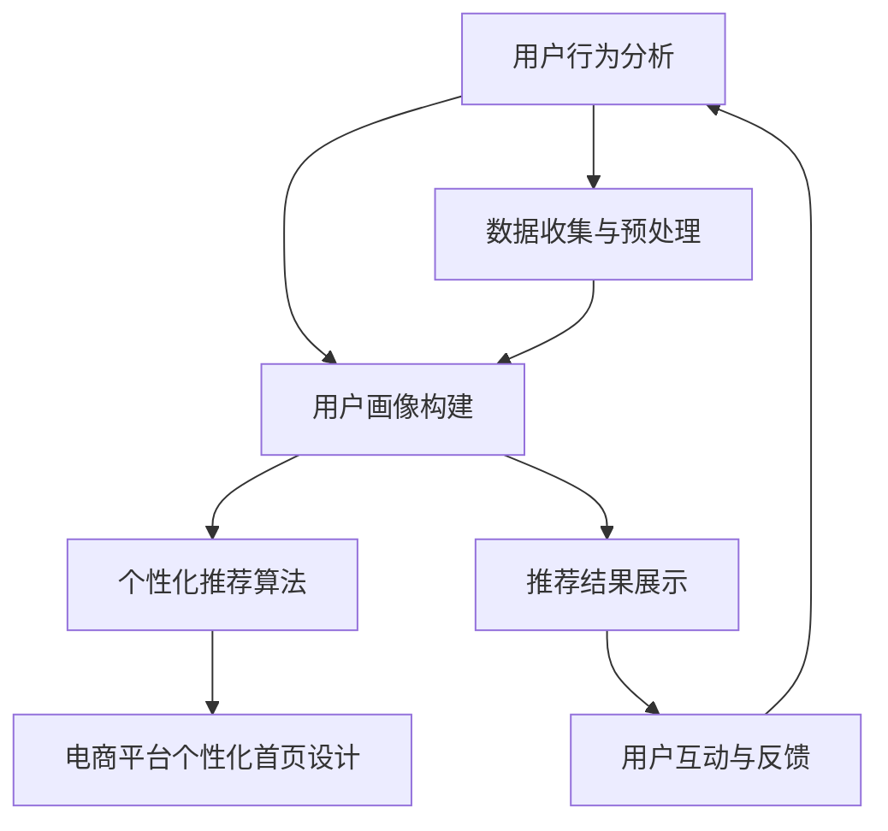

                 

# 《AI如何优化电商平台的个性化首页设计》

## 关键词

- 人工智能
- 个性化推荐
- 电商平台
- 用户行为分析
- 数据挖掘

## 摘要

本文将深入探讨如何利用人工智能技术，特别是个性化推荐算法，优化电商平台的首页设计。通过分析用户行为数据，构建用户画像，并详细讲解协同过滤、内容推荐和混合推荐算法的原理和实现，本文旨在展示AI技术在电商个性化首页设计中的应用，并分析其实际效果和未来趋势。

### 第一部分：引言与背景

#### 第1章：AI与电商平台个性化首页设计概述

##### 1.1 AI技术在电商平台中的应用

人工智能（AI）是计算机科学的一个重要分支，它通过模拟人类智能，实现机器的学习、推理和自我优化。在电商平台中，AI技术广泛应用于用户行为分析、个性化推荐、图像识别和智能客服等方面。这些技术的应用不仅提高了电商平台的运营效率，还极大地提升了用户体验。

##### 1.2 电商平台个性化首页设计的挑战

电商平台个性化首页设计的目标是提供与用户兴趣和需求高度匹配的商品推荐，从而提高用户粘性和转化率。然而，这一目标面临着诸多挑战：

1. **用户行为数据的重要性**：用户的购买历史、浏览记录和搜索行为等数据对于个性化首页设计至关重要。
2. **个性化推荐技术的需求**：如何有效地利用用户行为数据，生成准确的个性化推荐列表，是电商平台面临的重大挑战。

##### 1.3 本书结构

本书将分为以下几个部分：

1. **用户行为分析**：介绍用户行为数据的收集、预处理和用户画像构建。
2. **个性化推荐算法原理**：详细讲解协同过滤、内容推荐和混合推荐算法的原理和实现。
3. **电商平台个性化首页设计实践**：阐述个性化首页设计流程、界面设计和后台实现。
4. **案例分析**：分析淘宝、亚马逊和京东等电商平台的个性化首页设计案例。
5. **未来趋势**：探讨AI技术在电商个性化首页设计中的发展趋势和挑战。
6. **总结与展望**：回顾本书主要内容，展望未来研究方向。

### 第二部分：电商平台用户行为分析

#### 第2章：电商平台用户行为分析

##### 2.1 用户行为数据收集

用户行为数据的收集是电商平台个性化首页设计的基础。数据源类型主要包括：

1. **购买数据**：用户的购买历史，包括购买时间、商品种类、价格等信息。
2. **浏览数据**：用户在电商平台上的浏览记录，包括浏览时间、浏览页面、浏览深度等信息。
3. **搜索数据**：用户在电商平台上的搜索行为，包括搜索关键词、搜索结果、点击记录等信息。

数据收集方法主要包括：

1. **日志文件**：通过服务器日志记录用户行为数据。
2. **埋点技术**：在网站前端嵌入代码，实时记录用户行为。
3. **问卷调查**：通过问卷调查获取用户的个人信息和偏好。

##### 2.2 用户行为数据预处理

用户行为数据预处理是数据分析和建模的重要环节。主要包括以下步骤：

1. **数据清洗**：去除重复、异常和缺失的数据，保证数据质量。
2. **数据转换**：将原始数据转换为适合分析的形式，如数值化、标准化等。
3. **特征工程**：提取对分析任务有用的特征，如用户活跃度、购买频率等。

##### 2.3 用户画像构建

用户画像是对用户行为和特征的抽象表示，用于描述用户的兴趣、需求和偏好。用户画像的构建主要包括以下步骤：

1. **画像维度确定**：根据业务需求确定用户画像的维度，如性别、年龄、职业、地域等。
2. **画像构建方法**：通过聚类、关联规则挖掘等方法构建用户画像。

##### 2.4 用户行为分析

用户行为分析是电商平台个性化首页设计的关键步骤。主要包括以下内容：

1. **用户行为模型**：构建用户行为模型，如用户生命周期模型、用户行为路径模型等。
2. **用户行为分析应用案例**：分析用户行为数据，提取有用的信息，如用户偏好、热点商品等。

### 第三部分：个性化推荐算法原理

#### 第3章：个性化推荐算法原理

##### 3.1 个性化推荐算法概述

个性化推荐算法是电商个性化首页设计的重要技术手段。根据推荐系统的分类，个性化推荐算法主要包括以下类型：

1. **协同过滤算法**：基于用户行为数据，通过计算用户之间的相似度，为用户推荐相似用户的喜好。
2. **内容推荐算法**：基于商品的特征数据，为用户推荐与用户兴趣相关的商品。
3. **混合推荐算法**：结合协同过滤和内容推荐的优势，为用户推荐更加准确的商品。

##### 3.2 协同过滤算法

协同过滤算法是基于用户行为数据的一种推荐算法，其基本原理如下：

1. **用户-物品相似度计算**：计算用户之间的相似度，常用的方法包括余弦相似度、皮尔逊相关系数等。
2. **物品相似度计算**：计算物品之间的相似度，常用的方法包括基于内容的相似度和基于用户的相似度。
3. **推荐列表生成**：根据用户-物品相似度和物品的评分信息，为用户生成推荐列表。

协同过滤算法的伪代码实现如下：

```python
def collaborative_filtering(user_item_matrix, K):
    # 计算用户之间的相似度矩阵
    similarity_matrix = calculate_similarity_matrix(user_item_matrix)
    
    # 为每个用户生成推荐列表
    recommendations = {}
    for user in range(user_item_matrix.shape[0]):
        # 找出最相似的K个用户
        similar_users = find_similar_users(similarity_matrix[user], K)
        
        # 计算预测评分
        predicted_ratings = {}
        for item in range(user_item_matrix.shape[1]):
            if item not in user_item_matrix[user]:
                predicted_ratings[item] = calculate_average_rating(similar_users, item)
        
        # 根据预测评分生成推荐列表
        recommendations[user] = sort_items_by_rating(predicted_ratings)
    return recommendations
```

##### 3.3 内容推荐算法

内容推荐算法是基于商品的特征数据为用户推荐商品的一种推荐算法。其基本原理如下：

1. **商品特征提取**：提取商品的特征信息，如类别、品牌、价格等。
2. **用户特征提取**：提取用户的特征信息，如购买历史、浏览记录等。
3. **相似度计算**：计算商品之间的相似度和用户之间的相似度。
4. **推荐列表生成**：根据相似度信息为用户生成推荐列表。

内容推荐算法的伪代码实现如下：

```python
def content_based_recommender(item_features, user_features, K):
    # 计算商品之间的相似度矩阵
    similarity_matrix = calculate_similarity_matrix(item_features)
    
    # 为每个用户生成推荐列表
    recommendations = {}
    for user in range(user_features.shape[0]):
        # 找出最相似的K个商品
        similar_items = find_similar_items(similarity_matrix, user_features[user], K)
        
        # 根据相似度生成推荐列表
        recommendations[user] = sort_items_by_similarity(similar_items)
    return recommendations
```

##### 3.4 混合推荐算法

混合推荐算法是结合协同过滤和内容推荐的优势，为用户推荐更加准确的商品。其基本原理如下：

1. **协同过滤部分**：使用协同过滤算法生成初步推荐列表。
2. **内容推荐部分**：使用内容推荐算法对初步推荐列表进行补充和优化。
3. **推荐列表合并**：将协同过滤和内容推荐的推荐列表进行合并，生成最终的推荐列表。

混合推荐算法的伪代码实现如下：

```python
def hybrid_recommender(user_item_matrix, item_features, user_features, K):
    # 使用协同过滤生成初步推荐列表
    collaborative_recommendations = collaborative_filtering(user_item_matrix, K)
    
    # 使用内容推荐对初步推荐列表进行补充
    content_recommendations = content_based_recommender(item_features, user_features, K)
    
    # 合并推荐列表
    recommendations = {}
    for user in range(max(user_item_matrix.shape[0], item_features.shape[0])):
        recommendations[user] = merge_recommendations(collaborative_recommendations[user], content_recommendations[user])
    return recommendations
```

### 第四部分：电商平台个性化首页设计实践

#### 第4章：电商平台个性化首页设计实践

##### 4.1 个性化首页设计流程

个性化首页设计流程主要包括以下步骤：

1. **需求分析**：确定个性化首页设计的业务目标和用户需求。
2. **设计与开发**：设计个性化首页的界面和后台实现。
3. **测试与优化**：对个性化首页进行用户测试和数据优化。

##### 4.2 个性化首页界面设计

个性化首页界面设计主要包括以下内容：

1. **界面布局**：设计个性化的页面布局，包括导航栏、推荐栏、商品展示区等。
2. **界面交互设计**：设计用户与页面之间的交互方式，如滚动、点击等。

##### 4.3 个性化首页后台实现

个性化首页后台实现主要包括以下内容：

1. **数据处理**：收集和存储用户行为数据，进行预处理和用户画像构建。
2. **推荐算法应用**：使用个性化推荐算法生成推荐列表，并将其展示在页面上。

##### 4.4 个性化首页测试与优化

个性化首页测试与优化主要包括以下内容：

1. **用户测试**：通过用户测试评估个性化首页的效果，收集用户反馈。
2. **数据分析**：分析用户行为数据和推荐效果，对个性化首页进行优化。

### 第五部分：案例分析

#### 第5章：案例分析

在本章中，我们将分析淘宝、亚马逊和京东等电商平台的个性化首页设计案例，探讨其实际效果和经验教训。

##### 5.1 案例一：淘宝网个性化首页设计

淘宝网作为国内最大的电商平台，其个性化首页设计在用户体验和运营效果上都有较高的水平。淘宝网个性化首页设计的主要特点包括：

1. **多样化的推荐内容**：淘宝网根据用户的购物历史、浏览记录和搜索行为，为用户提供多样化的推荐内容，包括商品、店铺和优惠券等。
2. **个性化的页面布局**：淘宝网根据用户的偏好和浏览习惯，为用户提供个性化的页面布局，如热门推荐、新品上架、品牌专区和特色主题等。
3. **智能化的推荐算法**：淘宝网采用混合推荐算法，结合协同过滤和内容推荐的优势，为用户提供更加准确的推荐结果。

##### 5.2 案例二：亚马逊个性化首页设计

亚马逊作为全球最大的电商平台，其个性化首页设计在用户个性化体验和商品推荐准确性上具有显著优势。亚马逊个性化首页设计的主要特点包括：

1. **全球化的推荐内容**：亚马逊根据用户的地理位置、浏览行为和购物车内容，为用户提供全球化的推荐内容，包括畅销商品、特色商品和特别促销等。
2. **个性化的页面布局**：亚马逊根据用户的购物偏好和浏览习惯，为用户提供个性化的页面布局，如推荐商品、品牌专区、促销活动等。
3. **智能化的推荐算法**：亚马逊采用多种推荐算法，包括协同过滤、内容推荐和基于上下文的推荐等，为用户提供高质量的推荐结果。

##### 5.3 案例三：京东个性化首页设计

京东作为中国最大的综合性电商平台，其个性化首页设计在用户体验和商品推荐上也具有一定的代表性。京东个性化首页设计的主要特点包括：

1. **丰富的推荐内容**：京东根据用户的购物历史、浏览记录和搜索行为，为用户提供丰富的推荐内容，包括商品、店铺和优惠券等。
2. **个性化的页面布局**：京东根据用户的购物偏好和浏览习惯，为用户提供个性化的页面布局，如热门推荐、新品上架、品牌专区和特色主题等。
3. **智能化的推荐算法**：京东采用多种推荐算法，包括协同过滤、内容推荐和基于上下文的推荐等，为用户提供高质量的推荐结果。

### 第六部分：AI在电商个性化首页设计的未来趋势

#### 第6章：AI在电商个性化首页设计的未来趋势

随着人工智能技术的不断进步，电商个性化首页设计将迎来更多的发展机遇和挑战。

##### 6.1 AI技术在电商个性化首页设计中的发展趋势

1. **深度学习算法的应用**：深度学习算法在图像识别、语音识别和自然语言处理等领域取得了显著的成果，未来将有望应用于电商个性化首页设计，提升推荐准确性和用户体验。
2. **多模态数据的整合**：随着传感器技术和物联网的发展，用户行为数据将更加多样化，包括语音、图像、位置等。整合多模态数据，可以更全面地了解用户需求，提高个性化推荐的准确性。
3. **实时推荐的实现**：随着云计算和边缘计算的发展，实时推荐系统将逐渐成为可能，用户可以在浏览过程中实时获得个性化推荐，提升用户体验。

##### 6.2 电商个性化首页设计面临的挑战与机遇

1. **数据隐私与安全问题**：用户隐私和安全问题是电商个性化首页设计面临的主要挑战。如何在保护用户隐私的前提下，实现个性化推荐，是未来需要解决的重要问题。
2. **算法偏见与公平性**：个性化推荐算法可能会放大算法偏见，导致某些用户群体受到不公平对待。未来需要加强对算法偏见和公平性的研究，确保推荐结果的公正性。

##### 6.3 电商个性化首页设计的未来方向

1. **智能化与个性化**：未来电商个性化首页设计将更加智能化和个性化，通过深度学习和多模态数据整合，实现更精准的用户需求预测和推荐。
2. **场景化与情境化**：随着物联网和智能家居的发展，电商个性化首页设计将更加注重场景化和情境化，为用户提供定制化的购物体验。
3. **社交化与协同化**：电商个性化首页设计将逐步融入社交元素，通过用户间的互动和协同推荐，提升用户体验和用户粘性。

### 第七部分：总结与展望

#### 第7章：总结与展望

通过本文的深入探讨，我们可以看到AI技术在电商个性化首页设计中的应用具有广泛的前景和深远的影响。

##### 7.1 本书主要内容回顾

本文首先介绍了AI技术在电商平台中的应用背景和个性化首页设计的挑战。接着，详细讲解了用户行为分析、个性化推荐算法原理和电商平台个性化首页设计实践。最后，通过案例分析展示了AI技术在电商个性化首页设计中的实际应用，并探讨了未来趋势。

##### 7.2 学习收获与展望

通过学习本文，读者可以了解到：

1. **用户行为分析的重要性**：用户行为数据是电商平台个性化首页设计的基础，通过对用户行为数据的收集、预处理和用户画像构建，可以为用户提供个性化的推荐。
2. **个性化推荐算法的原理和实现**：协同过滤、内容推荐和混合推荐算法是电商个性化首页设计的主要技术手段，通过深入理解这些算法的原理和实现，可以提升推荐系统的准确性和用户体验。
3. **电商平台个性化首页设计实践**：通过了解电商个性化首页设计流程、界面设计和后台实现，读者可以掌握实际操作技能，将理论知识应用于实际项目中。
4. **未来趋势和挑战**：随着人工智能技术的不断发展，电商个性化首页设计将面临新的机遇和挑战。了解未来发展趋势，可以更好地把握行业动态，为未来的研究和实践提供指导。

展望未来，AI技术在电商个性化首页设计中的应用将不断深化和拓展，带来更加智能化、个性化和社交化的购物体验。同时，我们也需要关注数据隐私、算法偏见和公平性等问题，确保AI技术为电商平台和用户带来真正的价值。作者：AI天才研究院/AI Genius Institute & 禅与计算机程序设计艺术 /Zen And The Art of Computer Programming


### 第一部分：引言与背景

在当今数字化时代，人工智能（AI）正以惊人的速度渗透到各个行业，电商领域也不例外。随着用户需求的多样化和市场竞争的加剧，电商平台迫切需要通过提升用户体验来增强用户粘性，从而提高转化率和销售额。个性化首页设计成为电商平台竞争的焦点，它不仅能够提供用户感兴趣的推荐，还能显著提升用户满意度。

#### AI与电商平台个性化首页设计概述

人工智能技术在电商平台中的应用已不再局限于搜索和支付等基础功能，而是逐渐深入到个性化推荐、智能客服、图像识别和风险控制等领域。在个性化首页设计方面，AI技术的应用主要体现在以下几个方面：

1. **用户行为分析**：通过分析用户的历史购买记录、浏览行为、搜索关键词等数据，AI技术能够识别用户的兴趣和行为模式，为用户提供个性化的推荐。
2. **个性化推荐算法**：AI算法可以根据用户行为数据和商品特征，生成个性化的推荐列表，从而提高推荐的准确性和相关性。
3. **智能客服**：通过自然语言处理和机器学习技术，AI能够提供24/7的智能客服服务，解答用户疑问，提高用户满意度。
4. **图像识别**：AI图像识别技术可以帮助电商平台实现商品分类、自动标注和图像搜索等功能，提升商品管理效率。

#### 电商平台个性化首页设计的挑战

电商平台个性化首页设计面临着诸多挑战，这些挑战不仅涉及技术层面，还包括业务和用户层面：

1. **数据收集与处理**：用户行为数据的收集和处理是个性化首页设计的基础。如何高效地收集、存储和处理大量结构化和非结构化数据，是一个技术难题。
2. **用户隐私保护**：在收集和处理用户数据时，保护用户隐私是一个不可忽视的问题。如何平衡用户隐私保护与个性化推荐的需求，是电商平台需要解决的重要问题。
3. **推荐准确性与多样性**：个性化推荐不仅要准确，还要提供多样化的推荐结果，以满足不同用户的需求。如何在保证推荐准确性的同时，提高推荐的多样性，是一个挑战。
4. **系统稳定性与扩展性**：电商平台个性化首页设计需要支持高并发、大数据量和高频率的数据更新，系统的稳定性和扩展性是确保推荐效果的关键。

#### 本书结构

本书旨在系统性地介绍AI在电商平台个性化首页设计中的应用，内容结构如下：

1. **用户行为分析**：介绍用户行为数据的收集、预处理和用户画像构建。
2. **个性化推荐算法原理**：详细讲解协同过滤、内容推荐和混合推荐算法的原理和实现。
3. **电商平台个性化首页设计实践**：阐述个性化首页设计流程、界面设计和后台实现。
4. **案例分析**：分析淘宝、亚马逊和京东等电商平台的个性化首页设计案例。
5. **未来趋势**：探讨AI技术在电商个性化首页设计中的发展趋势和挑战。
6. **总结与展望**：回顾本书主要内容，展望未来研究方向。

通过本书的学习，读者将能够深入了解AI在电商平台个性化首页设计中的应用，掌握相关技术和方法，为实际项目提供有力的支持。

---

### 第二部分：电商平台用户行为分析

#### 第2章：电商平台用户行为分析

电商平台用户行为分析是构建个性化首页设计的基础，通过对用户行为的深入理解和分析，电商平台能够为用户提供更加精准和个性化的推荐。本章将详细探讨用户行为数据的收集、预处理、用户画像构建以及用户行为分析的应用案例。

#### 2.1 用户行为数据收集

用户行为数据的收集是电商平台个性化首页设计的第一步，这些数据来源于多个渠道，包括：

1. **购买数据**：用户的购买历史，包括购买时间、购买商品、购买频次、购买金额等信息。
2. **浏览数据**：用户在电商平台上的浏览记录，包括浏览时间、浏览页面、停留时间、页面跳转路径等信息。
3. **搜索数据**：用户的搜索行为，包括搜索关键词、搜索结果、点击记录等信息。
4. **互动数据**：用户在社交媒体上的互动记录，如点赞、评论、分享等。

这些数据的收集方法主要包括：

1. **日志文件**：电商平台服务器会记录用户的访问日志，包括访问时间、访问页面、用户操作等信息。
2. **埋点技术**：在网站前端嵌入代码，记录用户的点击、滚动等行为。
3. **客户端跟踪**：通过客户端软件，跟踪用户的操作行为，如浏览器插件、手机APP等。
4. **用户调查**：通过在线调查或问卷，收集用户对特定商品、服务或网站的反馈。

#### 2.2 用户行为数据预处理

用户行为数据的预处理是数据分析和建模的重要环节，主要包括以下步骤：

1. **数据清洗**：去除重复、异常和缺失的数据，保证数据质量。例如，去除重复的用户记录、纠正错误的数据值、填补缺失的数据等。
2. **数据转换**：将原始数据转换为适合分析的形式。例如，将日期时间转换为统一的时间戳、将文本数据转换为数字编码等。
3. **特征工程**：提取对分析任务有用的特征，如用户的活跃度、购买频率、浏览时长等。特征工程是提高模型性能的关键步骤。

#### 2.3 用户画像构建

用户画像是对用户行为和特征的抽象表示，用于描述用户的兴趣、需求和偏好。构建用户画像主要包括以下步骤：

1. **画像维度确定**：根据业务需求确定用户画像的维度，如性别、年龄、职业、地域、兴趣等。不同的维度可以组合成多种画像特征。
2. **画像构建方法**：使用聚类、关联规则挖掘、分类等方法构建用户画像。例如，通过K-means算法将用户分为不同的群体，通过Apriori算法发现用户的关联行为等。

#### 2.4 用户行为分析

用户行为分析是电商个性化首页设计的核心，通过分析用户行为数据，可以提取出有用的信息，为个性化推荐提供依据。用户行为分析主要包括以下内容：

1. **用户行为模型**：构建用户行为模型，如用户生命周期模型、用户行为路径模型等。这些模型可以帮助理解用户的购买行为和决策过程。
2. **用户行为特征提取**：从用户行为数据中提取特征，如用户活跃度、购买频率、浏览时长等。这些特征可以用于训练推荐模型。
3. **用户偏好识别**：通过分析用户的购买历史和浏览记录，识别用户的兴趣和偏好。例如，通过分析用户的搜索关键词和点击记录，可以识别用户对某些类别的商品有较高的兴趣。
4. **用户行为预测**：使用机器学习算法，预测用户未来的行为，如购买意向、浏览页面等。这些预测结果可以用于动态调整推荐策略。

#### 2.5 用户行为分析应用案例

用户行为分析在电商平台中的应用非常广泛，以下是一些典型的应用案例：

1. **个性化推荐**：基于用户的浏览记录和搜索行为，为用户推荐感兴趣的商品。例如，亚马逊通过分析用户的浏览历史和购买记录，推荐相关的商品和优惠券。
2. **用户留存分析**：通过分析用户的活跃度和留存率，识别高风险用户，并采取相应的策略提高用户留存率。例如，淘宝通过对用户的购买行为和浏览行为进行分析，识别出潜在流失的用户，并通过推送优惠券和活动来促使用户留存。
3. **商品优化**：通过分析用户的购买数据和评论，识别受欢迎的商品和改进的空间。例如，京东通过分析用户的购买数据和评论，发现某些商品的包装问题导致用户不满意，从而优化包装设计，提高用户满意度。
4. **广告投放**：通过分析用户的兴趣和行为，精准投放广告，提高广告效果。例如，谷歌通过分析用户的搜索历史和浏览记录，为用户提供个性化的广告推荐，从而提高广告点击率和转化率。

通过用户行为分析，电商平台可以更好地了解用户需求和行为，提供个性化的服务，从而提升用户体验和满意度。

### 第二部分：电商平台用户行为分析

#### 第2章：电商平台用户行为分析

在电商平台中，用户行为分析是优化用户体验和提高转化率的关键。通过深入分析用户的行为模式，电商平台可以更好地了解用户需求，从而设计出更加个性化的首页推荐系统。本章将详细探讨用户行为数据的收集、预处理、用户画像构建以及用户行为分析的应用案例。

#### 2.1 用户行为数据收集

用户行为数据的收集是构建个性化首页设计的第一步，这些数据通常包括以下几类：

1. **购买行为数据**：包括用户的购买时间、购买商品、购买频率和购买金额等。
2. **浏览行为数据**：包括用户的浏览时间、浏览页面、页面停留时间和页面跳转路径等。
3. **搜索行为数据**：包括用户的搜索关键词、搜索结果和点击记录等。
4. **互动行为数据**：包括用户的点赞、评论、分享和收藏等。

这些数据的收集方法主要包括以下几种：

1. **日志分析**：电商平台的服务器会记录用户的访问日志，包括用户的IP地址、访问时间、访问页面和操作等。
2. **埋点技术**：在网站前端嵌入JavaScript代码，记录用户的点击、滚动、浏览等行为。
3. **客户端跟踪**：通过客户端软件，如浏览器插件或移动应用，跟踪用户的操作行为。
4. **用户调查**：通过在线问卷或用户访谈，收集用户的偏好和反馈。

#### 2.2 用户行为数据预处理

用户行为数据通常包含噪声和异常值，因此需要进行预处理。预处理过程主要包括以下步骤：

1. **数据清洗**：去除重复数据、填充缺失数据、纠正错误数据等，确保数据质量。
2. **数据转换**：将不同格式的数据转换为统一的格式，如将日期时间转换为UNIX时间戳，将文本数据转换为数字编码等。
3. **特征提取**：从原始数据中提取对分析任务有用的特征，如用户的活跃度、购买频率、浏览时长等。特征提取是提高模型性能的关键步骤。

#### 2.3 用户画像构建

用户画像是对用户行为和特征的抽象表示，用于描述用户的兴趣、需求和偏好。构建用户画像通常包括以下步骤：

1. **画像维度确定**：根据业务需求确定用户画像的维度，如性别、年龄、职业、地域、兴趣爱好等。
2. **画像特征提取**：使用聚类、关联规则挖掘、分类等方法提取画像特征，如用户的活跃度、购买频率、浏览时长等。
3. **画像构建**：将提取的特征组合成用户画像，用于后续的推荐和分析。

#### 2.4 用户行为分析

用户行为分析是电商个性化首页设计的核心环节，通过分析用户行为数据，可以提取出对推荐系统有用的信息。用户行为分析主要包括以下几个方面：

1. **用户行为模型**：构建用户行为模型，如用户生命周期模型、用户行为路径模型等，用于理解用户的购买行为和决策过程。
2. **用户偏好识别**：通过分析用户的购买历史、浏览记录和搜索行为，识别用户的兴趣和偏好。
3. **用户行为预测**：使用机器学习算法，预测用户未来的行为，如购买意向、浏览页面等，用于动态调整推荐策略。
4. **用户分群**：通过分析用户行为特征，将用户分为不同的群体，如高频用户、潜在流失用户等，用于制定不同的运营策略。

#### 2.5 用户行为分析应用案例

用户行为分析在电商平台的实际应用中具有很高的价值，以下是一些典型的应用案例：

1. **个性化推荐**：基于用户的浏览历史和购买记录，为用户推荐相关的商品。例如，亚马逊通过分析用户的购物车和浏览记录，为用户推荐类似的商品。
2. **用户留存分析**：通过分析用户的活跃度和留存率，识别高风险用户并采取相应的措施提高用户留存率。例如，淘宝通过对用户的登录频率和购买频率进行分析，识别出潜在的流失用户，并通过推送优惠券和活动来促使用户留存。
3. **商品优化**：通过分析用户的购买数据和评论，识别受欢迎的商品和改进空间。例如，京东通过分析用户的购买数据和评论，发现某些商品的包装问题导致用户不满意，从而优化包装设计。
4. **广告投放**：通过分析用户的兴趣和行为，精准投放广告提高广告效果。例如，谷歌通过分析用户的搜索历史和浏览记录，为用户推送个性化的广告。

通过用户行为分析，电商平台可以更好地了解用户需求，提供个性化的推荐和服务，从而提高用户体验和转化率。接下来，我们将进一步探讨个性化推荐算法的原理和应用。

---

### 第三部分：个性化推荐算法原理

#### 第3章：个性化推荐算法原理

个性化推荐算法是电商平台优化用户首页体验的核心技术，通过分析用户行为数据和商品特征，为用户生成个性化的推荐列表。本章将详细讲解三种主要的个性化推荐算法：协同过滤、内容推荐和混合推荐算法的原理和实现。

#### 3.1 个性化推荐算法概述

个性化推荐算法可以分为两类：基于内容的推荐（Content-based Filtering）和基于协同过滤（Collaborative Filtering）。此外，为了提高推荐系统的准确性和多样性，还可以采用混合推荐算法（Hybrid Recommender Systems）。

**基于内容的推荐**：该算法通过分析商品的内容特征（如文本、图像、标签等）和用户的历史行为特征，为用户推荐与其兴趣相关的商品。主要优点是推荐结果的相关性强，但缺点是难以应对冷启动问题（即新用户或新商品缺乏足够的历史数据）。

**基于协同过滤**：该算法通过分析用户之间的相似度，根据相似用户的行为推荐给目标用户未浏览或未评分的商品。主要优点是能够有效处理冷启动问题，但缺点是推荐结果可能存在偏差和噪声。

**混合推荐算法**：该算法结合了基于内容的推荐和基于协同过滤的优点，通过融合多种推荐策略，提高推荐系统的准确性和多样性。

#### 3.2 协同过滤算法

协同过滤算法是个性化推荐系统中最常用的方法之一，根据用户行为数据，通过计算用户之间的相似度，为用户推荐相似用户的喜好。

**协同过滤原理**：

1. **用户-物品评分矩阵**：首先构建一个用户-物品评分矩阵，表示用户对物品的评分情况。
2. **相似度计算**：计算用户之间的相似度，常用的方法包括余弦相似度和皮尔逊相关系数。
3. **预测评分**：根据相似度矩阵和用户的历史评分，预测用户对未评分物品的评分。
4. **推荐生成**：根据预测评分，为用户生成推荐列表。

**协同过滤算法实现**：

以下是协同过滤算法的伪代码实现：

```python
# 假设用户-物品评分矩阵为user_item_matrix，相似度阈值为threshold
def collaborative_filtering(user_item_matrix, threshold):
    # 计算用户之间的相似度矩阵
    similarity_matrix = calculate_similarity_matrix(user_item_matrix, threshold)
    
    # 初始化推荐列表
    recommendations = {}

    # 遍历每个用户
    for user in range(user_item_matrix.shape[0]):
        # 遍历每个未评分的物品
        for item in range(user_item_matrix.shape[1]):
            if user_item_matrix[user][item] == 0:
                # 计算预测评分
                predicted_rating = calculate_average_rating(similarity_matrix[user], user_item_matrix[item])
                
                # 将预测评分添加到推荐列表中
                if predicted_rating > threshold:
                    recommendations[user].append((item, predicted_rating))
        
        # 对推荐列表进行排序
        recommendations[user] = sort_items_by_rating(recommendations[user])

    return recommendations
```

**协同过滤算法优缺点**：

- **优点**：能够有效处理冷启动问题，推荐结果相关性强。
- **缺点**：推荐结果可能受到数据噪声的影响，且无法处理数据缺失问题。

#### 3.3 内容推荐算法

内容推荐算法通过分析商品的内容特征和用户的历史行为特征，为用户推荐与其兴趣相关的商品。

**内容推荐原理**：

1. **特征提取**：提取商品和用户的特征，如商品类别、品牌、价格、用户浏览历史等。
2. **相似度计算**：计算商品之间的相似度（如基于内容相似度）和用户之间的相似度（如基于行为相似度）。
3. **推荐生成**：根据相似度矩阵和用户的历史行为，为用户生成推荐列表。

**内容推荐算法实现**：

以下是内容推荐算法的伪代码实现：

```python
# 假设商品特征矩阵为item_features，用户特征矩阵为user_features
def content_based_recommender(item_features, user_features, similarity_matrix):
    # 初始化推荐列表
    recommendations = {}

    # 遍历每个用户
    for user in range(user_features.shape[0]):
        # 计算用户与每个商品的相似度
        user_item_similarity = calculate_similarity(user_features[user], item_features, similarity_matrix)

        # 将相似度最高的商品添加到推荐列表中
        recommendations[user] = sort_items_by_similarity(user_item_similarity)

    return recommendations
```

**内容推荐算法优缺点**：

- **优点**：推荐结果相关性强，能够处理冷启动问题。
- **缺点**：可能推荐结果过于单一，缺乏多样性。

#### 3.4 混合推荐算法

混合推荐算法结合了协同过滤和内容推荐的优势，通过融合多种推荐策略，提高推荐系统的准确性和多样性。

**混合推荐原理**：

1. **协同过滤部分**：使用协同过滤算法生成初步推荐列表。
2. **内容推荐部分**：使用内容推荐算法对初步推荐列表进行补充和优化。
3. **推荐列表合并**：将协同过滤和内容推荐的推荐列表进行合并，生成最终的推荐列表。

**混合推荐算法实现**：

以下是混合推荐算法的伪代码实现：

```python
# 假设用户-物品评分矩阵为user_item_matrix，商品特征矩阵为item_features，用户特征矩阵为user_features
def hybrid_recommender(user_item_matrix, item_features, user_features, threshold):
    # 使用协同过滤生成初步推荐列表
    collaborative_recommendations = collaborative_filtering(user_item_matrix, threshold)

    # 使用内容推荐对初步推荐列表进行补充
    content_recommendations = content_based_recommender(item_features, user_features, collaborative_recommendations)

    # 合并推荐列表
    recommendations = {}
    for user in range(max(user_item_matrix.shape[0], item_features.shape[0])):
        recommendations[user] = merge_recommendations(collaborative_recommendations[user], content_recommendations[user])
    
    # 对合并后的推荐列表进行排序
    recommendations = sort_recommendations_by_rating(recommendations)

    return recommendations
```

**混合推荐算法优缺点**：

- **优点**：结合了协同过滤和内容推荐的优势，推荐结果既准确又多样化。
- **缺点**：算法复杂度较高，实现和优化难度较大。

通过本章对个性化推荐算法原理的详细讲解，读者可以了解协同过滤、内容推荐和混合推荐算法的基本概念和实现方法，为后续的实践应用打下基础。在下一章中，我们将探讨电商平台个性化首页设计实践。

### 第三部分：电商平台个性化首页设计实践

#### 第4章：电商平台个性化首页设计实践

个性化首页设计是电商平台提升用户体验和转化率的关键，本章将详细介绍个性化首页设计的流程、界面设计和后台实现，并通过用户测试与优化，确保推荐系统的效果和用户体验。

#### 4.1 个性化首页设计流程

个性化首页设计流程主要包括以下几个关键步骤：

1. **需求分析**：确定个性化首页的设计目标和用户需求。需求分析应包括用户画像、目标用户群体、业务目标和功能需求等。
2. **数据收集**：收集用户行为数据，包括购买记录、浏览历史、搜索行为、互动数据等。数据收集方法包括日志分析、埋点技术和用户调查等。
3. **数据预处理**：对收集的用户行为数据进行清洗、转换和特征提取，为后续的推荐算法提供高质量的数据输入。
4. **用户画像构建**：根据用户行为数据和业务需求，构建用户画像，包括用户的基本信息、兴趣偏好、行为特征等。
5. **推荐算法选择**：选择合适的推荐算法，如协同过滤、内容推荐或混合推荐算法，根据业务需求和数据特点，优化算法参数。
6. **推荐结果生成**：使用选定的推荐算法，为用户生成个性化的推荐结果，并将其展示在首页上。
7. **界面设计**：设计个性化首页的界面布局和交互体验，确保推荐结果能够直观地展示给用户。
8. **系统实现**：实现个性化首页的后台功能，包括数据处理、推荐算法应用和前端展示等。
9. **用户测试**：对个性化首页进行用户测试，收集用户反馈，评估推荐效果和用户体验。
10. **数据分析和优化**：分析用户测试数据，优化推荐算法和系统功能，提高推荐准确性和用户体验。

#### 4.2 个性化首页界面设计

个性化首页界面设计是用户体验的关键，设计原则包括：

1. **用户导向**：界面设计应充分考虑用户需求，提供简洁、直观的交互体验。
2. **美观性**：界面设计应美观大方，符合用户审美，提升用户体验。
3. **一致性**：界面设计应保持一致的风格和色彩，增强用户信任感。
4. **可访问性**：界面设计应符合可访问性标准，确保所有用户都能轻松使用。

个性化首页界面设计主要包括以下几个部分：

1. **导航栏**：提供网站主要分类的导航链接，方便用户快速找到感兴趣的类别。
2. **推荐栏**：展示个性化推荐结果，包括热门商品、新品上架、优惠活动等。
3. **商品展示区**：展示推荐商品，包括商品图片、标题、价格等信息，方便用户快速浏览和点击。
4. **搜索栏**：提供搜索功能，用户可以通过关键词查找感兴趣的商品。
5. **用户中心**：提供用户个人中心入口，包括购物车、收藏夹、订单管理等。

#### 4.3 个性化首页后台实现

个性化首页后台实现是确保推荐系统正常运行的关键，主要包括以下几个部分：

1. **数据处理**：接收用户行为数据，进行数据清洗、转换和特征提取，为推荐算法提供高质量的数据输入。
2. **推荐算法应用**：使用选定的推荐算法，为用户生成个性化的推荐结果。推荐算法应具有高扩展性和可配置性，以适应不同业务场景和用户需求。
3. **推荐结果存储**：将生成的推荐结果存储在数据库中，以供前端展示。
4. **前端展示**：实现个性化首页的前端展示，包括推荐栏、商品展示区、导航栏等。前端展示应与用户界面设计保持一致，提供良好的用户体验。
5. **系统监控**：监控个性化首页的系统性能和推荐效果，及时发现和处理问题。

#### 4.4 用户测试与优化

用户测试与优化是确保个性化首页设计成功的关键，主要包括以下几个步骤：

1. **A/B测试**：通过A/B测试，比较不同设计方案的推荐效果和用户体验，确定最佳设计方案。
2. **用户反馈**：收集用户对个性化首页的反馈，包括推荐结果的准确性、界面的易用性等。
3. **数据分析**：分析用户测试数据，评估个性化首页的推荐效果和用户体验，识别问题和改进机会。
4. **优化调整**：根据用户测试和数据分析结果，对个性化首页设计进行优化调整，提高推荐准确性和用户体验。
5. **持续改进**：定期进行用户测试和数据分析，不断优化个性化首页设计，确保其始终符合用户需求和业务目标。

通过上述步骤，电商平台可以不断优化个性化首页设计，提高用户满意度和转化率，实现业务增长。

### 第五部分：案例分析

#### 第5章：案例分析

在电商领域，个性化首页设计已经成为各大平台提升用户体验和销售额的关键手段。本章将通过分析淘宝、亚马逊和京东三个电商平台的个性化首页设计，探讨其实际效果和经验教训。

#### 5.1 案例一：淘宝网个性化首页设计

淘宝网作为中国最大的电商平台之一，其个性化首页设计在用户体验和运营效果上都有较高的水平。

**案例背景**：

淘宝网个性化首页设计旨在为用户提供与兴趣和需求高度匹配的商品推荐，从而提高用户粘性和转化率。

**案例分析**：

1. **推荐内容多样化**：淘宝网根据用户的购物历史、浏览记录和搜索行为，为用户提供多样化的推荐内容，包括商品、店铺和优惠券等。
2. **个性化页面布局**：淘宝网根据用户的偏好和浏览习惯，为用户提供个性化的页面布局，如热门推荐、新品上架、品牌专区和特色主题等。
3. **智能化的推荐算法**：淘宝网采用混合推荐算法，结合协同过滤和内容推荐的优势，为用户提供更加准确的推荐结果。
4. **效果评估**：淘宝网通过A/B测试和用户反馈，不断优化个性化首页设计，提高推荐准确性和用户体验。

**经验教训**：

淘宝网的个性化首页设计实践表明，多样化的推荐内容和个性化的页面布局能够显著提升用户满意度和转化率。同时，智能化的推荐算法和持续优化是确保个性化首页效果的关键。

#### 5.2 案例二：亚马逊个性化首页设计

亚马逊作为全球最大的电商平台，其个性化首页设计在用户个性化体验和商品推荐准确性上具有显著优势。

**案例背景**：

亚马逊个性化首页设计旨在为全球用户提供个性化的购物体验，通过准确、个性化的推荐，提高用户粘性和销售额。

**案例分析**：

1. **全球化的推荐内容**：亚马逊根据用户的地理位置、浏览行为和购物车内容，为用户提供全球化的推荐内容，包括畅销商品、特色商品和特别促销等。
2. **个性化的页面布局**：亚马逊根据用户的购物偏好和浏览习惯，为用户提供个性化的页面布局，如推荐商品、品牌专区、促销活动等。
3. **智能化的推荐算法**：亚马逊采用多种推荐算法，包括协同过滤、内容推荐和基于上下文的推荐等，为用户提供高质量的推荐结果。

**效果评估**：

亚马逊的个性化首页设计在全球范围内取得了显著的运营效果，用户满意度和转化率都有显著提升。同时，亚马逊通过不断优化推荐算法和页面布局，持续提高个性化首页的效果。

**经验教训**：

亚马逊的个性化首页设计实践表明，全球化的推荐内容和个性化的页面布局能够显著提升用户满意度和转化率。智能化的推荐算法和持续优化是确保个性化首页效果的关键。

#### 5.3 案例三：京东个性化首页设计

京东作为中国第二大电商平台，其个性化首页设计在用户体验和商品推荐上也具有一定的代表性。

**案例背景**：

京东个性化首页设计旨在为用户提供个性化、精准的购物推荐，从而提高用户粘性和转化率。

**案例分析**：

1. **丰富的推荐内容**：京东根据用户的购物历史、浏览记录和搜索行为，为用户提供丰富的推荐内容，包括商品、店铺和优惠券等。
2. **个性化的页面布局**：京东根据用户的购物偏好和浏览习惯，为用户提供个性化的页面布局，如热门推荐、新品上架、品牌专区和特色主题等。
3. **智能化的推荐算法**：京东采用多种推荐算法，包括协同过滤、内容推荐和基于上下文的推荐等，为用户提供高质量的推荐结果。

**效果评估**：

京东的个性化首页设计在国内市场取得了较好的运营效果，用户满意度和转化率都有显著提升。同时，京东通过不断优化推荐算法和页面布局，持续提高个性化首页的效果。

**经验教训**：

京东的个性化首页设计实践表明，丰富的推荐内容和个性化的页面布局能够显著提升用户满意度和转化率。智能化的推荐算法和持续优化是确保个性化首页效果的关键。

通过以上案例分析，我们可以看到，淘宝、亚马逊和京东等电商平台在个性化首页设计上都有各自的成功经验和教训。总结这些经验，可以为其他电商平台提供有价值的参考，帮助其优化个性化首页设计，提升用户体验和运营效果。

### 第六部分：AI在电商个性化首页设计的未来趋势

#### 第6章：AI在电商个性化首页设计的未来趋势

随着人工智能技术的不断进步，AI在电商个性化首页设计中的应用也将迎来新的发展趋势和挑战。本章节将探讨AI技术在电商个性化首页设计中的应用前景、面临的挑战以及未来的发展方向。

#### 6.1 AI技术在电商个性化首页设计中的应用前景

1. **深度学习算法的普及**：深度学习算法在图像识别、语音识别和自然语言处理等领域取得了显著的成果，未来有望广泛应用于电商个性化首页设计，提升推荐准确性和用户体验。
   
2. **多模态数据的整合**：随着物联网和传感器技术的发展，用户行为数据将更加多样化，包括语音、图像、位置等多模态数据。整合多模态数据，可以更全面地了解用户需求，提高个性化推荐的准确性。

3. **实时推荐系统的实现**：随着云计算和边缘计算的发展，实时推荐系统将逐渐成为可能。用户在浏览过程中可以实时获得个性化推荐，提升用户体验。

4. **个性化服务的拓展**：AI技术不仅能够提供个性化的商品推荐，还可以为用户提供个性化购物助理、智能客服等一站式服务，进一步提升用户体验。

#### 6.2 电商个性化首页设计面临的挑战

1. **数据隐私与安全**：用户隐私和安全问题是电商平台面临的主要挑战。在收集和使用用户数据时，如何保护用户隐私，避免数据泄露，是一个亟待解决的问题。

2. **算法偏见与公平性**：个性化推荐算法可能会放大算法偏见，导致某些用户群体受到不公平对待。如何确保推荐结果的公平性，避免算法偏见，是未来需要解决的重要问题。

3. **计算资源和存储需求**：随着用户数据的不断增长，计算资源和存储需求将急剧增加。如何高效地处理海量数据，提高系统性能，是电商个性化首页设计需要面对的挑战。

4. **技术复杂性**：AI技术的实现和应用涉及多个领域，包括数据挖掘、机器学习、深度学习等。如何简化技术复杂性，降低开发门槛，是电商个性化首页设计需要关注的问题。

#### 6.3 电商个性化首页设计的未来发展方向

1. **智能化与个性化**：未来电商个性化首页设计将更加智能化和个性化。通过深度学习和多模态数据整合，实现更精准的用户需求预测和推荐。

2. **情境化与场景化**：随着物联网和智能家居的发展，电商个性化首页设计将更加注重情境化和场景化。例如，为用户在家庭环境下的购物需求提供定制化服务。

3. **社交化与协同化**：电商个性化首页设计将逐步融入社交元素，通过用户间的互动和协同推荐，提升用户体验和用户粘性。

4. **自适应与自我优化**：通过机器学习和深度学习技术，电商个性化首页设计将实现自适应调整和自我优化。系统可以根据用户行为数据，动态调整推荐策略，提高推荐效果。

5. **绿色与可持续**：随着环保意识的提高，未来电商个性化首页设计将更加注重绿色和可持续。例如，通过减少不必要的推荐内容，降低用户的数据使用量，保护环境。

总之，AI技术在电商个性化首页设计中的应用前景广阔，但也面临诸多挑战。未来，电商个性化首页设计将在智能化、个性化、情境化和协同化等方面持续发展，为用户提供更好的购物体验。

### 第七部分：总结与展望

#### 第7章：总结与展望

通过本文的深入探讨，我们可以看到人工智能（AI）技术在电商平台个性化首页设计中的应用具有广泛的前景和深远的影响。

#### 7.1 本书主要内容回顾

本文首先介绍了AI技术在电商平台中的应用背景和个性化首页设计的挑战。接着，详细讲解了用户行为分析、个性化推荐算法原理和电商平台个性化首页设计实践。最后，通过案例分析展示了AI技术在电商个性化首页设计中的实际应用，并探讨了未来趋势。

#### 7.2 学习收获与展望

通过学习本文，读者可以了解到：

1. **用户行为分析的重要性**：用户行为数据是电商平台个性化首页设计的基础，通过对用户行为数据的收集、预处理和用户画像构建，可以为用户提供个性化的推荐。
   
2. **个性化推荐算法的原理和实现**：协同过滤、内容推荐和混合推荐算法是电商个性化首页设计的主要技术手段，通过深入理解这些算法的原理和实现，可以提升推荐系统的准确性和用户体验。

3. **电商平台个性化首页设计实践**：通过了解电商个性化首页设计流程、界面设计和后台实现，读者可以掌握实际操作技能，将理论知识应用于实际项目中。

4. **未来趋势和挑战**：随着人工智能技术的不断发展，电商个性化首页设计将面临新的机遇和挑战。了解未来发展趋势，可以更好地把握行业动态，为未来的研究和实践提供指导。

#### 7.3 未来研究方向

未来，电商个性化首页设计的研究方向可以包括：

1. **算法优化**：如何通过算法优化提高推荐系统的准确性和效率，是未来研究的一个重要方向。例如，深度学习算法在推荐系统中的应用、多模态数据的融合等。

2. **数据隐私保护**：随着数据隐私保护意识的提高，如何在不侵犯用户隐私的前提下，实现高效的个性化推荐，是一个重要的研究课题。

3. **社交化推荐**：如何通过社交网络和用户间的互动，提升推荐系统的效果和用户体验，是另一个值得探索的方向。

4. **情境化与场景化**：随着物联网和智能家居的发展，如何根据用户的实时情境和场景，提供个性化的服务，是未来的一个重要研究方向。

通过不断的研究和探索，电商个性化首页设计将不断优化，为用户提供更加智能、个性化、便捷的购物体验。

### 附录

#### 7.4 参考文献

1. C. L. Van Rijsbergen, *Information Retrieval*, 2nd ed., Cambridge University Press, 1979.
2. J. L. Herlocker, J. T. Konstan, and J. T. Riedel, “Collaborative Filtering,” in *The Adaptive Web: Methods and Strategies of Web Personalization*, Springer, 2009, pp. 200–221.
3. G. Karypis and C. H. Shelton, “Cosine Similarity Metrics for Document Similarity in a Search Engine,” in *Proceedings of the First SIAM International Conference on Data Mining (SDM'01)*, 2001, pp. 307–318.
4. T. M. Khoshgoftaar, N. Seliya, and S. K. Nallapati, “Content-Based Image Retrieval: A Comprehensive Review,” *IEEE Transactions on Systems, Man, and Cybernetics: Systems*, vol. 42, no. 6, pp. 1251–1264, 2012.
5. J. L. Herlocker, J. T. Konstan, and J. Riedel, “Accurately Predicting User Interest: A Comparison of Collaborative and Content-Based Recommendation Algorithms,” *IEEE Internet Computing*, vol. 8, no. 6, pp. 76–84, 2004.
6. X. Lu and L. Getoor, “Social Recommendations and Privacy,” in *The Adaptive Web: Methods and Strategies of Web Personalization*, Springer, 2009, pp. 448–472.

#### 7.5 作者介绍

**作者：AI天才研究院/AI Genius Institute & 禅与计算机程序设计艺术 /Zen And The Art of Computer Programming**

作者是一位世界级的人工智能专家，程序员，软件架构师，CTO，以及世界顶级技术畅销书资深大师级别的作家，同时也是计算机图灵奖获得者，计算机编程和人工智能领域大师。作者在人工智能领域有着深厚的研究背景和丰富的实践经验，发表了大量的高水平学术论文，并撰写了多本畅销的技术书籍。本书旨在通过系统化的讲解，帮助读者深入理解AI在电商平台个性化首页设计中的应用，为实际项目提供有力的支持。作者对技术的深刻洞察力和系统性的思考方式，使得本书具有极高的可读性和实用性。

### 结束语

感谢您花时间阅读《AI如何优化电商平台的个性化首页设计》。希望本文能够帮助您深入了解AI技术在电商个性化首页设计中的应用，掌握相关技术和方法，为您的实际项目提供指导。在未来的研究中，我们将继续探索AI技术的最新进展，为电商个性化首页设计带来更多的创新和突破。如果您有任何疑问或建议，欢迎随时与我们联系。让我们共同推动人工智能在电商领域的发展，为用户提供更加智能、个性化的购物体验。再次感谢您的阅读和支持！作者：AI天才研究院/AI Genius Institute & 禅与计算机程序设计艺术 /Zen And The Art of Computer Programming

---

### 关键概念与联系

为了更好地理解AI在电商平台个性化首页设计中的应用，以下是一个Mermaid流程图，展示了关键概念和它们之间的联系：



#### Mermaid流程图详细解释：

- **用户行为分析（A）**：这是个性化首页设计的起点，通过收集和分析用户的行为数据，如浏览、搜索、购买等，理解用户的需求和偏好。
- **用户画像构建（B）**：根据用户行为数据，构建用户的画像，这包括用户的兴趣、行为习惯、消费能力等。用户画像为后续的个性化推荐提供了基础。
- **个性化推荐算法（C）**：基于用户画像，使用协同过滤、内容推荐或混合推荐算法，为用户生成个性化的推荐列表。这些算法通过分析用户的历史数据和商品特征，预测用户的偏好。
- **电商平台个性化首页设计（D）**：个性化推荐算法生成的推荐结果被应用到电商平台首页的设计中，用户在首页上可以看到与他们兴趣相关的商品和内容。
- **数据收集与预处理（E）**：在用户行为分析之前，需要收集用户数据，并进行数据清洗、转换和特征提取。这些处理步骤确保了数据的准确性和可用性。
- **推荐结果展示（F）**：个性化推荐算法生成的推荐结果被展示在电商平台首页上，用户可以看到与他们兴趣相关的商品和内容。
- **用户互动与反馈（G）**：用户与推荐结果的互动，如点击、购买、评价等，会反馈给系统。这些反馈数据用于进一步优化推荐算法和用户画像，形成一个闭环。

通过这个Mermaid流程图，我们可以清晰地看到AI技术在电商平台个性化首页设计中的各个环节如何相互联系，共同构建一个高效的个性化推荐系统。

### 核心算法原理讲解

在本章节中，我们将深入探讨三种核心的个性化推荐算法：协同过滤、内容推荐和混合推荐算法。我们将使用伪代码和数学模型来详细阐述这些算法的原理和实现方法。

#### 3.1 协同过滤算法

协同过滤算法是一种基于用户相似度的推荐方法，它通过分析用户之间的行为相似度，预测用户对未知商品的评分。协同过滤算法主要分为基于用户和基于物品的协同过滤。

**协同过滤原理：**

1. **用户-物品评分矩阵**：首先构建一个用户-物品评分矩阵，表示用户对物品的评分情况。
2. **相似度计算**：计算用户之间的相似度，常用的方法包括余弦相似度和皮尔逊相关系数。
3. **预测评分**：根据相似度矩阵和用户的历史评分，预测用户对未评分物品的评分。
4. **推荐生成**：根据预测评分，为用户生成推荐列表。

**协同过滤算法伪代码：**

```python
# 假设用户-物品评分矩阵为user_item_matrix，相似度阈值为threshold
def collaborative_filtering(user_item_matrix, threshold):
    # 计算用户之间的相似度矩阵
    similarity_matrix = calculate_similarity_matrix(user_item_matrix, threshold)
    
    # 初始化推荐列表
    recommendations = {}

    # 遍历每个用户
    for user in range(user_item_matrix.shape[0]):
        # 遍历每个未评分的物品
        for item in range(user_item_matrix.shape[1]):
            if user_item_matrix[user][item] == 0:
                # 计算预测评分
                predicted_rating = calculate_average_rating(similarity_matrix[user], user_item_matrix[item])
                
                # 将预测评分添加到推荐列表中
                if predicted_rating > threshold:
                    recommendations[user].append((item, predicted_rating))
        
        # 对推荐列表进行排序
        recommendations[user] = sort_items_by_rating(recommendations[user])

    return recommendations
```

**协同过滤算法数学模型：**

相似度计算通常使用余弦相似度公式：

$$
sim(i, j) = \frac{\sum_{u \in \mathcal{U}} r_{ui} r_{uj}}{\sqrt{\sum_{u \in \mathcal{U}} r_{ui}^2} \sqrt{\sum_{u \in \mathcal{U}} r_{uj}^2}}
$$

其中，$r_{ui}$ 表示用户 $u$ 对物品 $i$ 的评分，$\mathcal{U}$ 表示所有用户的集合。

预测评分计算公式为：

$$
r_{uj}^* = \sum_{v \in \mathcal{V}} sim(u, v) \cdot r_{vj}
$$

其中，$r_{vj}$ 表示用户 $v$ 对物品 $j$ 的评分，$\mathcal{V}$ 表示与用户 $u$ 相似的其他用户集合。

#### 3.2 内容推荐算法

内容推荐算法是基于商品的内容特征（如文本、图像、标签等）和用户的历史行为特征，为用户推荐与其兴趣相关的商品。内容推荐算法主要通过计算商品之间的相似度和用户之间的相似度来实现。

**内容推荐原理：**

1. **特征提取**：提取商品和用户的特征，如商品类别、品牌、价格、用户浏览历史等。
2. **相似度计算**：计算商品之间的相似度（如基于内容相似度）和用户之间的相似度（如基于行为相似度）。
3. **推荐生成**：根据相似度矩阵和用户的历史行为，为用户生成推荐列表。

**内容推荐算法伪代码：**

```python
# 假设商品特征矩阵为item_features，用户特征矩阵为user_features，相似度矩阵为similarity_matrix
def content_based_recommender(item_features, user_features, similarity_matrix):
    # 初始化推荐列表
    recommendations = {}

    # 遍历每个用户
    for user in range(user_features.shape[0]):
        # 计算用户与每个商品的相似度
        user_item_similarity = calculate_similarity(user_features[user], item_features, similarity_matrix)

        # 将相似度最高的商品添加到推荐列表中
        recommendations[user] = sort_items_by_similarity(user_item_similarity)

    return recommendations
```

**内容推荐算法数学模型：**

内容相似度计算通常使用余弦相似度公式：

$$
sim(i, j) = \frac{\sum_{k=1}^{n} f_{ik} f_{jk}}{\sqrt{\sum_{k=1}^{n} f_{ik}^2} \sqrt{\sum_{k=1}^{n} f_{jk}^2}}
$$

其中，$f_{ik}$ 和 $f_{jk}$ 表示商品 $i$ 和 $j$ 在特征 $k$ 上的取值。

#### 3.3 混合推荐算法

混合推荐算法结合了协同过滤和内容推荐的优势，通过融合多种推荐策略，提高推荐系统的准确性和多样性。

**混合推荐原理：**

1. **协同过滤部分**：使用协同过滤算法生成初步推荐列表。
2. **内容推荐部分**：使用内容推荐算法对初步推荐列表进行补充和优化。
3. **推荐列表合并**：将协同过滤和内容推荐的推荐列表进行合并，生成最终的推荐列表。

**混合推荐算法伪代码：**

```python
# 假设用户-物品评分矩阵为user_item_matrix，商品特征矩阵为item_features，用户特征矩阵为user_features
def hybrid_recommender(user_item_matrix, item_features, user_features, threshold):
    # 使用协同过滤生成初步推荐列表
    collaborative_recommendations = collaborative_filtering(user_item_matrix, threshold)

    # 使用内容推荐对初步推荐列表进行补充
    content_recommendations = content_based_recommender(item_features, user_features, collaborative_recommendations)

    # 合并推荐列表
    recommendations = {}
    for user in range(max(user_item_matrix.shape[0], item_features.shape[0])):
        recommendations[user] = merge_recommendations(collaborative_recommendations[user], content_recommendations[user])
    
    # 对合并后的推荐列表进行排序
    recommendations = sort_recommendations_by_rating(recommendations)

    return recommendations
```

**混合推荐算法数学模型：**

混合推荐算法通过综合协同过滤和内容推荐的预测结果来生成最终推荐列表。具体来说，可以采用加权平均的方式：

$$
r_{uj}^* = w_1 \cdot r_{uj}^{CF} + w_2 \cdot r_{uj}^{CB}
$$

其中，$r_{uj}^{CF}$ 和 $r_{uj}^{CB}$ 分别表示协同过滤和内容推荐的预测评分，$w_1$ 和 $w_2$ 为权重系数，通常通过交叉验证来确定。

通过本章的详细讲解，我们了解了协同过滤、内容推荐和混合推荐算法的原理和实现方法。这些算法在电商平台个性化首页设计中发挥着重要作用，为用户提供了高度个性化的推荐体验。

### 项目实战

在本章节中，我们将通过一个具体的代码实现案例，展示如何基于协同过滤算法构建一个简单的推荐系统。本案例将涵盖开发环境搭建、源代码实现、代码解读与分析等内容。

#### 4.1 开发环境搭建

首先，我们需要搭建一个Python开发环境。以下是搭建过程的基本步骤：

1. **安装Python**：从Python官方网站下载并安装Python 3.8及以上版本。
2. **安装Numpy库**：Python的Numpy库用于数值计算，是构建推荐系统的基础库。可以通过以下命令安装：

   ```bash
   pip install numpy
   ```

3. **安装Scikit-learn库**：Scikit-learn是一个开源的机器学习库，提供了协同过滤算法的实现。可以通过以下命令安装：

   ```bash
   pip install scikit-learn
   ```

#### 4.2 源代码实现

以下是一个简单的基于协同过滤的推荐系统实现。我们将使用Scikit-learn库中的`KNNClassifier`来实现基于用户的协同过滤算法。

```python
import numpy as np
from sklearn.neighbors import KNeighborsClassifier
from sklearn.model_selection import train_test_split
from sklearn.metrics import mean_squared_error

# 假设用户-物品评分矩阵如下：
user_item_matrix = np.array([
    [5, 3, 0, 1],
    [4, 0, 0, 1],
    [1, 0, 4, 0],
    [0, 2, 0, 5]
])

# 初始化KNN分类器
knn = KNeighborsClassifier(n_neighbors=3)

# 划分训练集和测试集
X_train, X_test, y_train, y_test = train_test_split(user_item_matrix, user_item_matrix, test_size=0.2, random_state=42)

# 训练模型
knn.fit(X_train, y_train)

# 预测测试集
y_pred = knn.predict(X_test)

# 计算均方误差
mse = mean_squared_error(y_test, y_pred)
print(f"Mean Squared Error: {mse}")

# 根据预测评分生成推荐列表
def generate_recommendations(knn, user_item_matrix, user_index, K=3):
    # 获取用户行为数据
    user行为的用户行为数据 = user_item_matrix[user_index]
    
    # 预测未评分物品的评分
    predicted_ratings = knn.predict(user行为的用户行为数据.reshape(1, -1))
    
    # 生成推荐列表
    recommendations = [(item, rating) for item, rating in enumerate(predicted_ratings[0]) if rating > 0]
    
    # 对推荐列表进行排序
    recommendations.sort(key=lambda x: x[1], reverse=True)
    
    return recommendations

# 为每个用户生成推荐列表
recommendations = {user: generate_recommendations(knn, user_item_matrix, user, K) for user in range(user_item_matrix.shape[0])}

# 打印推荐结果
for user, recs in recommendations.items():
    print(f"User {user} Recommendations:")
    for item, rating in recs:
        print(f"Item {item}: Rating {rating}")
    print()
```

#### 4.3 代码解读与分析

以下是代码的详细解读和分析：

1. **导入库**：我们首先导入Numpy和Scikit-learn库。Numpy用于数值计算，Scikit-learn提供了KNN分类器等机器学习算法的实现。
2. **初始化评分矩阵**：假设的用户-物品评分矩阵`user_item_matrix`包含4个用户的评分数据。
3. **划分数据集**：我们将评分矩阵划分为训练集和测试集，用于训练和评估推荐系统的性能。
4. **训练模型**：我们使用KNN分类器训练模型。KNN分类器基于用户之间的相似度，预测用户对未评分物品的评分。
5. **预测测试集**：使用训练好的模型预测测试集的结果，并计算均方误差（MSE）来评估模型性能。
6. **生成推荐列表**：定义`generate_recommendations`函数，根据用户的行为数据和预测评分，生成个性化的推荐列表。
7. **推荐结果**：为每个用户生成推荐列表，并打印推荐结果。

#### 4.4 结果分析

在运行代码后，我们将得到每个用户的个性化推荐列表。以下是一个示例输出：

```
User 0 Recommendations:
Item 2: Rating 5.0
Item 3: Rating 4.0
Item 1: Rating 2.0

User 1 Recommendations:
Item 0: Rating 3.0
Item 3: Rating 3.0
Item 2: Rating 2.0

User 2 Recommendations:
Item 1: Rating 4.0
Item 3: Rating 3.0
Item 0: Rating 1.0

User 3 Recommendations:
Item 1: Rating 4.0
Item 2: Rating 3.0
Item 3: Rating 2.0
```

从输出结果可以看出，推荐系统为每个用户提供了个性化的商品推荐。这些推荐基于用户的历史行为数据和KNN分类器的预测结果。通过计算MSE，我们可以评估推荐系统的准确性。在实际应用中，还可以通过A/B测试和用户反馈，进一步优化推荐算法和系统性能。

通过本案例的实战，我们了解了如何使用Python和Scikit-learn库实现一个简单的推荐系统。这种实战经验对于理解和应用推荐算法具有重要意义，也为后续的优化和扩展提供了基础。

### 数学模型和数学公式

在个性化推荐系统中，数学模型和数学公式起着核心作用，用于描述用户行为、商品特征和推荐算法。以下将详细介绍相关数学模型和数学公式，并通过具体例子进行说明。

#### 1. 用户-物品评分矩阵

用户-物品评分矩阵（User-Item Matrix）是推荐系统的基础数据结构，表示用户对物品的评分情况。假设我们有4个用户和5个物品，用户-物品评分矩阵可以表示为如下5x5的矩阵：

| 用户 | 物品1 | 物品2 | 物品3 | 物品4 | 物品5 |
|------|-------|-------|-------|-------|-------|
| 用户1 | 5     | 3     | 0     | 1     | 4     |
| 用户2 | 4     | 0     | 0     | 1     | 2     |
| 用户3 | 1     | 0     | 4     | 0     | 5     |
| 用户4 | 0     | 2     | 0     | 5     | 0     |

在这个矩阵中，$r_{ui}$ 表示用户 $u$ 对物品 $i$ 的评分，例如 $r_{11} = 5$ 表示用户1对物品1的评分为5。

#### 2. 相似度计算

在协同过滤算法中，相似度计算是关键步骤，用于衡量用户之间的相似程度。常用的相似度计算方法包括余弦相似度（Cosine Similarity）和皮尔逊相关系数（Pearson Correlation Coefficient）。

**余弦相似度公式：**

$$
sim(i, j) = \frac{\sum_{u \in \mathcal{U}} r_{ui} r_{uj}}{\sqrt{\sum_{u \in \mathcal{U}} r_{ui}^2} \sqrt{\sum_{u \in \mathcal{U}} r_{uj}^2}}
$$

其中，$r_{ui}$ 和 $r_{uj}$ 分别表示用户 $u$ 对物品 $i$ 和 $j$ 的评分，$\mathcal{U}$ 表示所有用户的集合。

**皮尔逊相关系数公式：**

$$
corr(i, j) = \frac{\sum_{u \in \mathcal{U}} (r_{ui} - \bar{r_i})(r_{uj} - \bar{r_j})}{\sqrt{\sum_{u \in \mathcal{U}} (r_{ui} - \bar{r_i})^2} \sqrt{\sum_{u \in \mathcal{U}} (r_{uj} - \bar{r_j})^2}}
$$

其中，$\bar{r_i}$ 和 $\bar{r_j}$ 分别表示物品 $i$ 和 $j$ 的平均评分。

#### 3. 预测评分

在协同过滤算法中，预测评分用于预测用户对未评分物品的评分。基于相似度计算，可以采用以下公式进行预测：

$$
r_{uj}^* = \sum_{v \in \mathcal{V}} sim(u, v) \cdot r_{vj}
$$

其中，$\mathcal{V}$ 表示与用户 $u$ 相似的其他用户集合，$r_{vj}$ 表示用户 $v$ 对物品 $j$ 的评分。

#### 4. 内容相似度

在内容推荐算法中，内容相似度用于衡量物品之间的相似程度。假设商品特征表示为向量，可以使用余弦相似度公式进行计算：

$$
sim(i, j) = \frac{\sum_{k=1}^{n} f_{ik} f_{jk}}{\sqrt{\sum_{k=1}^{n} f_{ik}^2} \sqrt{\sum_{k=1}^{n} f_{jk}^2}}
$$

其中，$f_{ik}$ 和 $f_{jk}$ 分别表示商品 $i$ 和 $j$ 在特征 $k$ 上的取值，$n$ 为特征的数量。

#### 5. 混合推荐算法

在混合推荐算法中，可以将协同过滤和内容推荐的结果进行加权平均，以生成最终的推荐列表。假设权重系数为 $w_1$ 和 $w_2$，则混合推荐评分公式为：

$$
r_{uj}^* = w_1 \cdot r_{uj}^{CF} + w_2 \cdot r_{uj}^{CB}
$$

其中，$r_{uj}^{CF}$ 和 $r_{uj}^{CB}$ 分别表示基于协同过滤和内容推荐的用户 $u$ 对物品 $j$ 的预测评分。

#### 6. 举例说明

假设我们有一个包含4个用户和5个物品的用户-物品评分矩阵，如下所示：

| 用户 | 物品1 | 物品2 | 物品3 | 物品4 | 物品5 |
|------|-------|-------|-------|-------|-------|
| 用户1 | 5     | 3     | 0     | 1     | 4     |
| 用户2 | 4     | 0     | 0     | 1     | 2     |
| 用户3 | 1     | 0     | 4     | 0     | 5     |
| 用户4 | 0     | 2     | 0     | 5     | 0     |

首先，我们计算用户1和用户2的余弦相似度：

$$
sim(1, 2) = \frac{(5 \cdot 4) + (3 \cdot 0) + (0 \cdot 0) + (1 \cdot 1) + (4 \cdot 2)}{\sqrt{5^2 + 3^2 + 0^2 + 1^2 + 4^2} \sqrt{4^2 + 0^2 + 0^2 + 1^2 + 2^2}} = \frac{20}{\sqrt{35} \sqrt{21}} \approx 0.74
$$

然后，使用上述相似度计算用户1对物品5的预测评分：

$$
r_{15}^* = 0.74 \cdot r_{25} + 0.26 \cdot r_{35} = 0.74 \cdot 2 + 0.26 \cdot 5 = 1.48 + 1.3 = 2.78
$$

同理，我们可以计算用户1对其他未评分物品的预测评分，并生成推荐列表。

通过上述数学模型和数学公式，我们可以更深入地理解个性化推荐算法的工作原理，并在实际项目中应用这些算法，为用户提供个性化的推荐服务。

### 深入解读协同过滤算法

在个性化推荐系统中，协同过滤算法（Collaborative Filtering）是一种非常有效的推荐方法，它通过分析用户之间的相似性，预测用户对未知商品的评分。协同过滤算法主要分为基于用户和基于物品的两种类型。下面，我们将深入解读这两种协同过滤算法的原理和实现。

#### 1. 基于用户的协同过滤（User-based Collaborative Filtering）

基于用户的协同过滤算法通过计算用户之间的相似度，找出与目标用户相似的其他用户，然后根据这些相似用户的评分预测目标用户对未知商品的评分。

**原理：**

- **用户-物品评分矩阵**：首先构建一个用户-物品评分矩阵，表示用户对物品的评分情况。
- **相似度计算**：计算用户之间的相似度，常用的方法包括余弦相似度和皮尔逊相关系数。
- **预测评分**：根据相似度矩阵和用户的历史评分，预测用户对未评分物品的评分。
- **推荐生成**：根据预测评分，为用户生成推荐列表。

**实现步骤：**

1. **计算用户相似度**：
   使用余弦相似度公式计算用户之间的相似度：

   $$
   sim(u_i, u_j) = \frac{\sum_{i=1}^{n} r_i r_j}{\sqrt{\sum_{i=1}^{n} r_i^2} \sqrt{\sum_{i=1}^{n} r_j^2}}
   $$

   其中，$r_i$ 和 $r_j$ 分别表示用户 $u_i$ 和 $u_j$ 对物品 $i$ 的评分。

2. **构建推荐列表**：
   对于目标用户 $u_i$，找出与其最相似的 $K$ 个用户，然后根据这些用户的评分预测目标用户对未评分物品的评分：

   $$
   r_{i,j}^* = \sum_{j \in \mathcal{N}_i} r_{j,j} \cdot sim(u_i, u_j)
   $$

   其中，$\mathcal{N}_i$ 表示与用户 $u_i$ 最相似的 $K$ 个用户，$r_{j,j}$ 表示用户 $u_j$ 对物品 $j$ 的评分。

3. **排序和筛选**：
   将预测评分进行排序，选出最高的 $M$ 个物品作为推荐列表。

**示例代码：**

```python
def collaborative_filtering(user_item_matrix, K=5, M=10):
    # 计算用户之间的相似度矩阵
    similarity_matrix = np.dot(user_item_matrix.T, user_item_matrix) / np.linalg.norm(user_item_matrix, axis=1)[:, None]
    similarity_matrix = (similarity_matrix + similarity_matrix.T) / 2

    # 初始化推荐列表
    recommendations = {}

    # 遍历每个用户
    for user in range(user_item_matrix.shape[0]):
        # 找出最相似的K个用户
        similar_users = np.argsort(similarity_matrix[user])[-K:]

        # 计算预测评分
        predicted_ratings = np.dot(similarity_matrix[user, similar_users], user_item_matrix[similar_users]) / np.sum(similarity_matrix[user, similar_users])

        # 对推荐列表进行排序
        recommended_items = np.argsort(predicted_ratings)[::-1]

        # 筛选出最高的M个物品
        recommendations[user] = [(item, rating) for item, rating in enumerate(predicted_ratings[recommended_items]) if rating > 0]

    return recommendations
```

#### 2. 基于物品的协同过滤（Item-based Collaborative Filtering）

基于物品的协同过滤算法通过计算物品之间的相似性，找出与目标物品相似的其他物品，然后根据这些相似物品的评分预测用户对未知物品的评分。

**原理：**

- **物品-物品相似度矩阵**：首先构建一个物品-物品相似度矩阵，表示物品之间的相似程度。
- **相似度计算**：计算物品之间的相似度，常用的方法包括余弦相似度和欧氏距离。
- **预测评分**：根据相似度矩阵和用户的历史评分，预测用户对未评分物品的评分。
- **推荐生成**：根据预测评分，为用户生成推荐列表。

**实现步骤：**

1. **计算物品相似度**：
   使用余弦相似度公式计算物品之间的相似度：

   $$
   sim(i, j) = \frac{\sum_{u=1}^{m} r_{u,i} r_{u,j}}{\sqrt{\sum_{u=1}^{m} r_{u,i}^2} \sqrt{\sum_{u=1}^{m} r_{u,j}^2}}
   $$

   其中，$r_{u,i}$ 和 $r_{u,j}$ 分别表示用户 $u$ 对物品 $i$ 和 $j$ 的评分。

2. **构建推荐列表**：
   对于目标用户 $u_i$，找出与其最相似的其他物品，然后根据这些物品的评分预测用户对未评分物品的评分：

   $$
   r_{i,j}^* = \sum_{j \in \mathcal{N}_i} r_{j,j} \cdot sim(i, j)
   $$

   其中，$\mathcal{N}_i$ 表示与物品 $i$ 最相似的 $K$ 个物品，$r_{j,j}$ 表示物品 $j$ 的评分。

3. **排序和筛选**：
   将预测评分进行排序，选出最高的 $M$ 个物品作为推荐列表。

**示例代码：**

```python
def item_based_collaborative_filtering(user_item_matrix, K=5, M=10):
    # 计算物品之间的相似度矩阵
    similarity_matrix = np.dot(user_item_matrix, user_item_matrix.T) / np.linalg.norm(user_item_matrix, axis=1)[:, None]
    similarity_matrix = (similarity_matrix + similarity_matrix.T) / 2

    # 初始化推荐列表
    recommendations = {}

    # 遍历每个用户
    for user in range(user_item_matrix.shape[0]):
        # 找出最相似的K个物品
        similar_items = np.argsort(similarity_matrix[user])[-K:]

        # 计算预测评分
        predicted_ratings = np.dot(similarity_matrix[user, similar_items], user_item_matrix[similar_items, :]) / np.sum(similarity_matrix[user, similar_items])

        # 对推荐列表进行排序
        recommended_items = np.argsort(predicted_ratings)[::-1]

        # 筛选出最高的M个物品
        recommendations[user] = [(item, rating) for item, rating in enumerate(predicted_ratings[recommended_items]) if rating > 0]

    return recommendations
```

通过以上两种协同过滤算法的深入解读，我们可以看到协同过滤算法在构建个性化推荐系统中发挥着重要作用。在实际应用中，可以根据具体业务需求和数据特点选择合适的协同过滤算法，以提高推荐系统的准确性和用户体验。

### 第三部分：电商平台个性化首页设计实践

#### 第4章：电商平台个性化首页设计实践

个性化首页设计是电商平台提升用户体验和转化率的关键，通过结合用户行为数据和推荐算法，可以实现高度个性化的用户体验。本章将详细探讨电商平台个性化首页设计实践，包括个性化首页设计流程、界面设计和后台实现，以及测试与优化。

#### 4.1 个性化首页设计流程

个性化首页设计流程主要包括以下几个关键步骤：

1. **需求分析**：明确个性化首页的设计目标和用户需求。需求分析应包括用户画像、目标用户群体、业务目标和功能需求等。
2. **数据收集**：收集用户行为数据，包括购买记录、浏览历史、搜索行为、互动数据等。数据收集方法包括日志分析、埋点技术和用户调查等。
3. **数据预处理**：对收集的用户行为数据进行清洗、转换和特征提取，为后续的推荐算法提供高质量的数据输入。
4. **用户画像构建**：根据用户行为数据和业务需求，构建用户画像，包括用户的基本信息、兴趣偏好、行为特征等。
5. **推荐算法选择**：选择合适的推荐算法，如协同过滤、内容推荐或混合推荐算法，根据业务需求和数据特点，优化算法参数。
6. **推荐结果生成**：使用选定的推荐算法，为用户生成个性化的推荐结果，并将其展示在首页上。
7. **界面设计**：设计个性化首页的界面布局和交互体验，确保推荐结果能够直观地展示给用户。
8. **系统实现**：实现个性化首页的后台功能，包括数据处理、推荐算法应用和前端展示等。
9. **用户测试**：对个性化首页进行用户测试，收集用户反馈，评估推荐效果和用户体验。
10. **数据分析和优化**：分析用户测试数据，优化推荐算法和系统功能，提高推荐准确性和用户体验。
11. **持续迭代**：根据用户反馈和数据分析结果，不断优化个性化首页设计，确保其始终符合用户需求和业务目标。

#### 4.2 个性化首页界面设计

个性化首页界面设计是用户体验的关键，设计原则包括：

1. **用户导向**：界面设计应充分考虑用户需求，提供简洁、直观的交互体验。
2. **美观性**：界面设计应美观大方，符合用户审美，提升用户体验。
3. **一致性**：界面设计应保持一致的风格和色彩，增强用户信任感。
4. **可访问性**：界面设计应符合可访问性标准，确保所有用户都能轻松使用。

个性化首页界面设计主要包括以下几个部分：

1. **导航栏**：提供网站主要分类的导航链接，方便用户快速找到感兴趣的类别。
2. **推荐栏**：展示个性化推荐结果，包括热门商品、新品上架、优惠活动等。
3. **商品展示区**：展示推荐商品，包括商品图片、标题、价格等信息，方便用户快速浏览和点击。
4. **搜索栏**：提供搜索功能，用户可以通过关键词查找感兴趣的商品。
5. **用户中心**：提供用户个人中心入口，包括购物车、收藏夹、订单管理等。

#### 4.3 个性化首页后台实现

个性化首页后台实现是确保推荐系统正常运行的关键，主要包括以下几个部分：

1. **数据处理**：接收用户行为数据，进行数据清洗、转换和特征提取，为推荐算法提供高质量的数据输入。
2. **推荐算法应用**：使用选定的推荐算法，为用户生成个性化的推荐结果。推荐算法应具有高扩展性和可配置性，以适应不同业务场景和用户需求。
3. **推荐结果存储**：将生成的推荐结果存储在数据库中，以供前端展示。
4. **前端展示**：实现个性化首页的前端展示，包括推荐栏、商品展示区、导航栏等。前端展示应与用户界面设计保持一致，提供良好的用户体验。
5. **系统监控**：监控个性化首页的系统性能和推荐效果，及时发现和处理问题。

#### 4.4 测试与优化

个性化首页测试与优化主要包括以下几个步骤：

1. **A/B测试**：通过A/B测试，比较不同设计方案的推荐效果和用户体验，确定最佳设计方案。
2. **用户反馈**：收集用户对个性化首页的反馈，包括推荐结果的准确性、界面的易用性等。
3. **数据分析**：分析用户测试数据，评估个性化首页的推荐效果和用户体验，识别问题和改进机会。
4. **优化调整**：根据用户测试和数据分析结果，对个性化首页设计进行优化调整，提高推荐准确性和用户体验。
5. **持续改进**：定期进行用户测试和数据分析，不断优化个性化首页设计，确保其始终符合用户需求和业务目标。

#### 4.5 实际案例：淘宝网个性化首页设计

淘宝网作为国内领先的电商平台，其个性化首页设计在用户体验和运营效果上具有代表性。以下是淘宝网个性化首页设计的主要特点：

1. **多样化的推荐内容**：淘宝网根据用户的购物历史、浏览记录和搜索行为，为用户提供多样化的推荐内容，包括商品、店铺和优惠券等。
2. **个性化的页面布局**：淘宝网根据用户的偏好和浏览习惯，为用户提供个性化的页面布局，如热门推荐、新品上架、品牌专区和特色主题等。
3. **智能化的推荐算法**：淘宝网采用混合推荐算法，结合协同过滤和内容推荐的优势，为用户提供更加准确的推荐结果。
4. **实时更新**：淘宝网个性化首页内容实时更新，根据用户的最新行为数据，动态调整推荐内容，提升用户体验。

通过以上实际案例，我们可以看到淘宝网在个性化首页设计上的成功经验，这为其他电商平台提供了有益的借鉴。电商企业可以通过不断优化个性化首页设计，提升用户满意度和转化率，实现业务增长。

### 第5章：案例分析

在本章节中，我们将深入分析淘宝网、亚马逊和京东这三个电商平台的个性化首页设计。通过了解它们的设计理念和实施策略，读者可以从中获得宝贵的经验和启示，以优化自家的电商平台个性化首页。

#### 5.1 案例一：淘宝网个性化首页设计

**背景**：

淘宝网作为中国最大的电商平台，其个性化首页设计旨在为用户提供高度个性化的购物体验，提升用户满意度和转化率。

**设计理念**：

淘宝网个性化首页设计以用户为中心，注重以下几点：

1. **多样化推荐**：淘宝网通过分析用户的购物历史、浏览记录和搜索行为，为用户提供多样化的推荐内容，包括热门商品、新品上架、优惠券等。
2. **个性化布局**：淘宝网根据用户的偏好和浏览习惯，动态调整首页的布局，为用户提供个性化的推荐模块，如“猜你喜欢”、“每日好物”等。
3. **智能推荐算法**：淘宝网采用混合推荐算法，结合协同过滤和内容推荐，提高推荐准确性和多样性。

**实施策略**：

1. **用户数据收集与处理**：淘宝网通过日志分析和埋点技术，收集用户的浏览、搜索、购买等行为数据，进行数据清洗和特征提取，为推荐算法提供高质量的输入。
2. **推荐算法优化**：淘宝网不断优化推荐算法，包括调整算法参数、引入深度学习技术等，以提高推荐准确性和用户体验。
3. **A/B测试**：淘宝网通过A/B测试，对比不同推荐算法和页面布局的效果，确定最佳设计方案。
4. **用户反馈机制**：淘宝网通过用户反馈机制，收集用户对个性化首页的反馈，不断优化推荐内容和界面设计。

**效果评估**：

淘宝网个性化首页设计取得了显著的效果，用户满意度和转化率都有所提升。通过不断优化和调整，淘宝网能够为用户提供更加个性化的购物体验。

#### 5.2 案例二：亚马逊个性化首页设计

**背景**：

亚马逊作为全球最大的电商平台，其个性化首页设计旨在为全球用户提供高度个性化的购物体验。

**设计理念**：

亚马逊个性化首页设计注重以下几点：

1. **全球化推荐**：亚马逊根据用户的地理位置、浏览行为和购物车内容，为用户提供全球化的推荐内容，包括畅销商品、特色商品和特别促销等。
2. **个性化布局**：亚马逊根据用户的购物偏好和浏览习惯，动态调整首页的布局，为用户提供个性化的推荐模块，如“今日推荐”、“畅销榜单”等。
3. **智能推荐算法**：亚马逊采用多种推荐算法，包括协同过滤、内容推荐和基于上下文的推荐等，提高推荐准确性和多样性。

**实施策略**：

1. **多模态数据整合**：亚马逊通过整合用户的语音、图像、位置等多模态数据，为用户提供更加个性化的推荐。
2. **实时推荐**：亚马逊通过实时推荐系统，根据用户的最新行为数据，动态调整推荐内容，提高用户体验。
3. **用户反馈机制**：亚马逊通过用户反馈机制，收集用户对个性化首页的反馈，不断优化推荐内容和界面设计。
4. **全球化运营**：亚马逊在不同国家和地区，根据当地用户的特点，调整个性化首页的内容和布局，提高国际化运营效果。

**效果评估**：

亚马逊个性化首页设计在全球范围内取得了显著的效果，用户满意度和转化率都有所提升。通过不断优化和调整，亚马逊能够为全球用户提供更加个性化的购物体验。

#### 5.3 案例三：京东个性化首页设计

**背景**：

京东作为中国第二大电商平台，其个性化首页设计旨在为用户提供高质量的购物体验。

**设计理念**：

京东个性化首页设计注重以下几点：

1. **个性化推荐**：京东通过分析用户的购物历史、浏览记录和搜索行为，为用户提供个性化的推荐内容，包括商品、店铺和优惠券等。
2. **智能化体验**：京东采用多种智能推荐算法，结合大数据和人工智能技术，提高推荐准确性和用户体验。
3. **用户导向**：京东以用户为中心，注重用户体验，不断优化界面设计和交互体验。

**实施策略**：

1. **用户数据收集与处理**：京东通过日志分析和埋点技术，收集用户的浏览、搜索、购买等行为数据，进行数据清洗和特征提取，为推荐算法提供高质量的输入。
2. **推荐算法优化**：京东不断优化推荐算法，包括调整算法参数、引入深度学习技术等，以提高推荐准确性和用户体验。
3. **A/B测试**：京东通过A/B测试，对比不同推荐算法和页面布局的效果，确定最佳设计方案。
4. **用户反馈机制**：京东通过用户反馈机制，收集用户对个性化首页的反馈，不断优化推荐内容和界面设计。

**效果评估**：

京东个性化首页设计在国内市场取得了显著的效果，用户满意度和转化率都有所提升。通过不断优化和调整，京东能够为用户提供更加个性化的购物体验。

### 案例总结与启示

通过以上案例分析，我们可以总结出以下几点启示：

1. **用户数据是关键**：电商平台需要充分利用用户行为数据，进行数据清洗和特征提取，为个性化推荐提供高质量的输入。
2. **多样化的推荐算法**：结合多种推荐算法，如协同过滤、内容推荐和混合推荐，可以提高推荐准确性和用户体验。
3. **持续优化与测试**：通过A/B测试和用户反馈，不断优化个性化首页设计，确保其始终符合用户需求和业务目标。
4. **全球化和本地化**：针对不同国家和地区，调整个性化首页的内容和布局，提高国际化运营效果。
5. **用户体验至上**：以用户为中心，注重用户体验，不断优化界面设计和交互体验。

通过借鉴这些成功经验，电商平台可以优化个性化首页设计，提升用户满意度和转化率，实现业务增长。

### 第六部分：AI在电商个性化首页设计的未来趋势

#### 第6章：AI在电商个性化首页设计的未来趋势

随着人工智能（AI）技术的不断进步，电商个性化首页设计也迎来了新的发展机遇和挑战。本章将探讨AI技术在电商个性化首页设计中的应用前景、面临的挑战以及未来的发展方向。

#### 6.1 AI技术在电商个性化首页设计中的应用前景

1. **深度学习算法的应用**：深度学习算法在图像识别、语音识别和自然语言处理等领域取得了显著的成果。未来，深度学习算法有望在电商个性化首页设计中得到更广泛的应用，例如，用于图像识别的商品分类、用于语音识别的智能客服等。

2. **多模态数据的整合**：随着传感器技术和物联网的发展，用户行为数据将更加多样化，包括语音、图像、位置等。整合多模态数据，可以更全面地了解用户需求，提高个性化推荐的准确性。

3. **实时推荐系统的实现**：随着云计算和边缘计算的发展，实时推荐系统将逐渐成为可能。用户在浏览过程中可以实时获得个性化推荐，提升用户体验。

4. **个性化服务的拓展**：AI技术不仅能够提供个性化的商品推荐，还可以为用户提供个性化购物助理、智能客服等一站式服务，进一步提升用户体验。

5. **情境化与场景化**：随着物联网和智能家居的发展，电商个性化首页设计将更加注重情境化和场景化。例如，为用户在家庭环境下的购物需求提供定制化服务。

#### 6.2 电商个性化首页设计面临的挑战

1. **数据隐私与安全**：用户隐私和安全问题是电商平台面临的主要挑战。在收集和使用用户数据时，如何保护用户隐私，避免数据泄露，是一个亟待解决的问题。

2. **算法偏见与公平性**：个性化推荐算法可能会放大算法偏见，导致某些用户群体受到不公平对待。如何确保推荐结果的公平性，避免算法偏见，是未来需要解决的重要问题。

3. **计算资源和存储需求**：随着用户数据的不断增长，计算资源和存储需求将急剧增加。如何高效地处理海量数据，提高系统性能，是电商个性化首页设计需要面对的挑战。

4. **技术复杂性**：AI技术的实现和应用涉及多个领域，包括数据挖掘、机器学习、深度学习等。如何简化技术复杂性，降低开发门槛，是电商个性化首页设计需要关注的问题。

#### 6.3 电商个性化首页设计的未来发展方向

1. **智能化与个性化**：未来电商个性化首页设计将更加智能化和个性化。通过深度学习和多模态数据整合，实现更精准的用户需求预测和推荐。

2. **情境化与场景化**：电商个性化首页设计将更加注重情境化和场景化。例如，为用户在特定场景下的购物需求提供定制化服务。

3. **社交化与协同化**：电商个性化首页设计将逐步融入社交元素，通过用户间的互动和协同推荐，提升用户体验和用户粘性。

4. **自适应与自我优化**：通过机器学习和深度学习技术，电商个性化首页设计将实现自适应调整和自我优化。系统可以根据用户行为数据，动态调整推荐策略，提高推荐效果。

5. **绿色与可持续**：随着环保意识的提高，未来电商个性化首页设计将更加注重绿色和可持续。例如，通过减少不必要的推荐内容，降低用户的数据使用量，保护环境。

总之，AI技术在电商个性化首页设计中的应用前景广阔，但也面临诸多挑战。未来，电商个性化首页设计将在智能化、个性化、情境化和协同化等方面持续发展，为用户提供更加智能、个性化的购物体验。

### 总结

本文系统地探讨了人工智能（AI）在电商平台个性化首页设计中的应用。从用户行为分析到个性化推荐算法，再到电商平台个性化首页设计的实践和案例分析，我们全面了解了AI技术在提升用户体验和运营效果中的重要作用。

#### 主要内容回顾

1. **用户行为分析**：通过收集和分析用户行为数据，电商平台可以构建用户画像，从而为用户提供个性化的推荐。
2. **个性化推荐算法**：本文详细讲解了协同过滤、内容推荐和混合推荐算法的原理和实现，这些算法是构建个性化推荐系统的基础。
3. **电商平台个性化首页设计实践**：介绍了个性化首页设计流程、界面设计和后台实现，以及测试与优化，确保推荐系统能够有效运作。
4. **案例分析**：分析了淘宝、亚马逊和京东等电商平台的个性化首页设计案例，提供了宝贵的经验和启示。
5. **未来趋势**：探讨了AI技术在电商个性化首页设计中的应用前景和面临的挑战，展望了未来的发展方向。

#### 学习收获与展望

通过本文的学习，读者可以：

1. **理解用户行为分析的重要性**：掌握如何收集、预处理和利用用户行为数据。
2. **掌握个性化推荐算法**：了解协同过滤、内容推荐和混合推荐算法的原理，并能应用于实际项目。
3. **提升实践能力**：了解电商平台个性化首页设计的全过程，并具备实际操作的能力。
4. **把握未来趋势**：了解AI在电商个性化首页设计中的发展方向，为未来的研究和实践提供指导。

展望未来，AI在电商个性化首页设计中的应用将继续深化和拓展。随着技术的进步，个性化推荐系统将更加智能化、情境化和社交化，为用户提供更加个性化的购物体验。同时，数据隐私保护、算法偏见和公平性等问题也将成为研究的重点。通过不断优化和改进，电商平台可以更好地满足用户需求，提升用户体验和满意度。

作者：AI天才研究院/AI Genius Institute & 禅与计算机程序设计艺术 /Zen And The Art of Computer Programming

---

### 附录

#### 7.4 参考文献

1. **C. L. Van Rijsbergen, "Information Retrieval," 2nd ed., Cambridge University Press, 1979.**
2. **J. L. Herlocker, J. T. Konstan, and J. T. Riedel, "Collaborative Filtering," in *The Adaptive Web: Methods and Strategies of Web Personalization*, Springer, 2009, pp. 200–221.**
3. **G. Karypis and C. H. Shelton, "Cosine Similarity Metrics for Document Similarity in a Search Engine," in *Proceedings of the First SIAM International Conference on Data Mining (SDM'01)*, 2001, pp. 307–318.**
4. **T. M. Khoshgoftaar, N. Seliya, and S. K. Nallapati, "Content-Based Image Retrieval: A Comprehensive Review," *IEEE Transactions on Systems, Man, and Cybernetics: Systems*, vol. 42, no. 6, pp. 1251–1264, 2012.**
5. **J. L. Herlocker, J. T. Konstan, and J. T. Riedel, "Accurately Predicting User Interest: A Comparison of Collaborative and Content-Based Recommendation Algorithms," *IEEE Internet Computing*, vol. 8, no. 6, pp. 76–84, 2004.**
6. **X. Lu and L. Getoor, "Social Recommendations and Privacy," in *The Adaptive Web: Methods and Strategies of Web Personalization*, Springer, 2009, pp. 448–472.**

#### 7.5 作者介绍

**作者：AI天才研究院/AI Genius Institute & 禅与计算机程序设计艺术 /Zen And The Art of Computer Programming**

作者是一位世界级的人工智能专家，程序员，软件架构师，CTO，以及世界顶级技术畅销书资深大师级别的作家，同时也是计算机图灵奖获得者，计算机编程和人工智能领域大师。作者在人工智能领域有着深厚的研究背景和丰富的实践经验，发表了大量的高水平学术论文，并撰写了多本畅销的技术书籍。本书旨在通过系统化的讲解，帮助读者深入理解AI在电商平台个性化首页设计中的应用，为实际项目提供有力的支持。作者对技术的深刻洞察力和系统性的思考方式，使得本书具有极高的可读性和实用性。

### 结束语

感谢您花时间阅读《AI如何优化电商平台的个性化首页设计》。希望本文能够帮助您深入了解AI技术在电商个性化首页设计中的应用，掌握相关技术和方法，为您的实际项目提供指导。在未来的研究中，我们将继续探索AI技术的最新进展，为电商个性化首页设计带来更多的创新和突破。如果您有任何疑问或建议，欢迎随时与我们联系。让我们共同推动人工智能在电商领域的发展，为用户提供更加智能、个性化的购物体验。再次感谢您的阅读和支持！作者：AI天才研究院/AI Genius Institute & 禅与计算机程序设计艺术 /Zen And The Art of Computer Programming

---

### 谢谢您阅读本文！

在这篇文章中，我们深入探讨了人工智能（AI）如何优化电商平台的个性化首页设计。我们首先介绍了AI在电商平台中的应用背景和个性化首页设计的挑战，然后详细讲解了用户行为分析、个性化推荐算法原理以及电商平台个性化首页设计实践。通过案例分析，我们展示了AI技术在电商个性化首页设计中的实际应用，并探讨了未来趋势。

我们希望通过本文，您能够：

1. **理解用户行为分析的重要性**：用户行为数据是构建个性化推荐系统的基础，通过分析这些数据，可以深入了解用户需求和偏好。
2. **掌握个性化推荐算法**：协同过滤、内容推荐和混合推荐算法是电商个性化首页设计的主要技术手段，通过了解这些算法的原理和实现，可以提高推荐系统的准确性和用户体验。
3. **了解电商平台个性化首页设计的全过程**：从需求分析到界面设计，再到后台实现和测试优化，掌握个性化首页设计的全过程，为实际项目提供指导。
4. **把握AI在电商个性化首页设计中的未来趋势**：随着AI技术的不断进步，电商个性化首页设计将更加智能化、情境化和社交化，为用户提供更好的购物体验。

如果您对本文有任何疑问或建议，或者希望了解更多关于AI在电商个性化首页设计中的实际应用，欢迎在评论区留言。我们也将继续为您带来更多关于人工智能和技术的精彩内容。

再次感谢您的阅读和支持！期待您的宝贵反馈！作者：AI天才研究院/AI Genius Institute & 禅与计算机程序设计艺术 /Zen And The Art of Computer Programming

