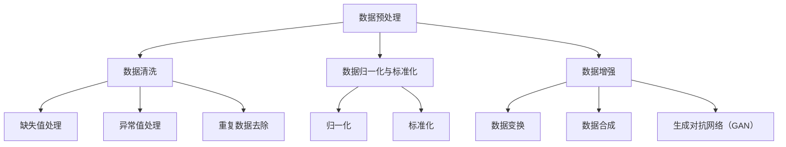
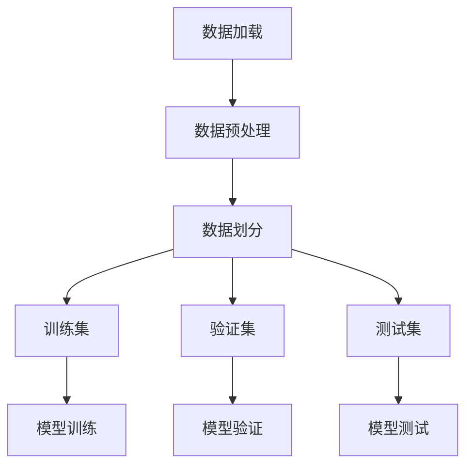

                 

# AI数据集处理：从加载到合成生成

> **关键词**：AI 数据集、预处理、加载、合成、数据质量管理

> **摘要**：本文将深入探讨 AI 数据集处理的全过程，从数据集的基本概念、数据预处理、数据加载、数据集划分、数据合成到数据质量管理，帮助读者全面理解并掌握数据集处理的核心技术和方法。文章将通过详细的理论讲解和实际项目实战，引导读者从理论到实践，逐步提升在 AI 领域的数据处理能力。

----------------------------------------------------------------

### 《AI数据集处理：从加载到合成生成》目录大纲

# 第一部分：AI数据集处理基础

## 第1章：AI数据集概述
### 1.1 AI数据集的重要性
### 1.2 数据集类型
### 1.3 数据集来源与获取

## 第2章：数据预处理
### 2.1 数据清洗
### 2.2 数据归一化与标准化
### 2.3 数据增强

## 第3章：数据加载
### 3.1 数据加载工具介绍
### 3.2 数据加载过程
### 3.3 加载数据的注意事项

## 第4章：数据集划分
### 4.1 划分方法
### 4.2 划分策略
### 4.3 划分效果评估

## 第5章：数据集合成
### 5.1 合成方法
### 5.2 合成策略
### 5.3 合成效果评估

## 第6章：数据质量管理
### 6.1 数据质量评估指标
### 6.2 数据质量改善方法
### 6.3 数据质量持续监控

# 第二部分：AI数据集处理核心算法原理

## 第7章：核心概念与联系
### 7.1 数据预处理流程图
### 7.2 数据加载与处理的 Mermaid 流程图

## 第8章：数据预处理算法原理
### 8.1 数据清洗算法伪代码
### 8.2 数据归一化与标准化算法伪代码
### 8.3 数据增强算法伪代码

## 第9章：数据加载算法原理
### 9.1 数据加载算法伪代码
### 9.2 数据加载优化方法

## 第10章：数据集划分算法原理
### 10.1 数据集划分算法伪代码
### 10.2 划分效果评估算法伪代码

## 第11章：数据合成算法原理
### 11.1 数据合成算法伪代码
### 11.2 合成效果评估算法伪代码

## 第12章：数据质量管理算法原理
### 12.1 数据质量评估算法伪代码
### 12.2 数据质量改善算法伪代码

# 第三部分：AI数据集处理项目实战

## 第13章：实战案例1：数据预处理
### 13.1 实战场景
### 13.2 开发环境搭建
### 13.3 数据预处理代码实现
### 13.4 代码解读与分析

## 第14章：实战案例2：数据加载
### 14.1 实战场景
### 14.2 开发环境搭建
### 14.3 数据加载代码实现
### 14.4 代码解读与分析

## 第15章：实战案例3：数据集划分与合成
### 15.1 实战场景
### 15.2 开发环境搭建
### 15.3 数据集划分与合成代码实现
### 15.4 代码解读与分析

## 第16章：实战案例4：数据质量管理
### 16.1 实战场景
### 16.2 开发环境搭建
### 16.3 数据质量管理代码实现
### 16.4 代码解读与分析

# 附录

## 附录A：AI数据集处理工具与资源
### A.1 数据预处理工具介绍
### A.2 数据加载工具介绍
### A.3 数据集划分与合成工具介绍
### A.4 数据质量管理工具介绍

----------------------------------------------------------------

### 第一部分：AI数据集处理基础

#### 第1章：AI数据集概述

##### 1.1 AI数据集的重要性

在人工智能（AI）领域，数据集是模型训练和评估的核心资源。一个高质量的数据集可以显著提高模型的性能和泛化能力，而数据集的质量和数量往往是 AI 项目成功的关键因素。

- **数据丰富性**：丰富的数据集可以提供更多的训练样本，有助于模型学习到更复杂的模式和特征。
- **数据代表性**：代表性的数据集可以确保模型在不同场景下具有更好的适应性。
- **数据质量**：高质量的数据集可以减少噪声和异常值对模型的影响，提高模型的鲁棒性。

##### 1.2 数据集类型

AI 数据集主要可以分为以下几种类型：

- **监督学习数据集**：包含标签信息，适用于监督学习模型的训练。
- **无监督学习数据集**：不含标签信息，适用于无监督学习模型的训练，如聚类和降维。
- **半监督学习数据集**：结合监督和无监督学习的数据集，一部分样本带有标签，另一部分没有标签。
- **强化学习数据集**：用于训练强化学习模型的奖励函数和状态转移概率。

##### 1.3 数据集来源与获取

数据集的来源多种多样，常见的包括：

- **公开数据集**：如ImageNet、CIFAR-10、Kaggle等，这些数据集通常是免费且广泛使用的。
- **内部数据集**：企业或研究机构内部积累的数据，通常需要通过特定的协议和权限获取。
- **合成数据集**：通过模拟或生成的方法创建的数据集，可以用于模型训练和评估。

#### 第2章：数据预处理

数据预处理是数据集处理的重要步骤，其目的是提高数据的质量和可用性，以支持后续的模型训练和评估。

##### 2.1 数据清洗

数据清洗的主要任务是去除数据中的噪声、错误和异常值。具体步骤包括：

- **缺失值处理**：通过插值、删除或填充的方法处理缺失值。
- **异常值处理**：通过统计方法或规则检测并处理异常值。
- **重复数据去除**：通过比对数据项的唯一性，去除重复的数据。

##### 2.2 数据归一化与标准化

归一化和标准化是调整数据范围和分布的方法，以提高模型训练的稳定性和效果。常见的方法有：

- **归一化**：将数据映射到相同的范围，如0到1之间。
- **标准化**：将数据转换为标准正态分布，以消除不同特征之间的尺度差异。

##### 2.3 数据增强

数据增强是通过生成新的数据样本来扩充数据集，以改善模型的泛化能力。常见的方法有：

- **数据变换**：如旋转、翻转、缩放等。
- **合成**：通过组合多个数据样本，生成新的数据样本。
- **生成对抗网络（GAN）**：通过生成器和判别器的对抗训练，生成高质量的数据样本。

#### 第3章：数据加载

数据加载是将预处理后的数据集导入到模型中，以支持训练和评估的过程。数据加载的效率和方式对模型训练的速度和效果具有重要影响。

##### 3.1 数据加载工具介绍

常见的数据加载工具包括：

- **Pandas**：Python 的数据处理库，适用于小规模数据的加载和处理。
- **NumPy**：Python 的数值计算库，适用于大规模数据的加载和处理。
- **PyTorch**：深度学习框架，提供了丰富的数据加载和预处理功能。
- **TensorFlow**：深度学习框架，提供了高效的数据加载和预处理工具。

##### 3.2 数据加载过程

数据加载的过程通常包括以下步骤：

- **数据读取**：从文件、数据库或其他数据源读取数据。
- **数据预处理**：对数据进行清洗、归一化和增强等处理。
- **数据缓存**：将预处理后的数据缓存到内存中，以减少读取时间。
- **数据分批**：将数据分成多个批次，以支持模型的批量训练。

##### 3.3 加载数据的注意事项

在加载数据时，需要注意以下事项：

- **数据一致性**：确保数据集的一致性，避免数据冗余或冲突。
- **数据完整性**：确保数据的完整性和准确性，避免数据丢失或错误。
- **数据规模**：合理控制数据集的大小，以适应模型的训练需求和硬件限制。
- **数据平衡**：对于分类任务，确保数据集中的各类别样本数量相对平衡。

#### 第4章：数据集划分

数据集划分是将数据集划分为训练集、验证集和测试集，以支持模型的训练、验证和测试。

##### 4.1 划分方法

常见的划分方法有：

- **随机划分**：随机将数据集划分为训练集和验证集。
- **分层划分**：根据类别或标签的比例，将数据集划分为训练集和验证集。
- **交叉验证**：通过 k 次交叉验证，对数据集进行多次划分和评估。

##### 4.2 划分策略

划分策略需要考虑以下因素：

- **训练集大小**：根据模型复杂度和训练时间，合理设置训练集大小。
- **验证集大小**：确保验证集足够大，以准确评估模型的性能。
- **测试集大小**：测试集用于最终评估模型的性能，应尽量大。
- **划分重复**：避免在不同次划分中使用相同的数据样本，以减少评估偏差。

##### 4.3 划分效果评估

划分效果评估的方法包括：

- **准确率**：计算模型在验证集上的准确率。
- **召回率**：计算模型在验证集上的召回率。
- **F1 分数**：综合考虑准确率和召回率，计算 F1 分数。
- **ROC 曲线**：绘制模型在验证集上的 ROC 曲线，评估模型的分类性能。

#### 第5章：数据集合成

数据集合成是将多个数据集合并成一个更大的数据集，以提高模型的训练效果和泛化能力。

##### 5.1 合成方法

常见的合成方法有：

- **简单拼接**：将多个数据集按顺序或随机方式拼接在一起。
- **加权合成**：根据数据集的重要性和质量，对数据进行加权处理。
- **动态合成**：在模型训练过程中，动态合成新的数据样本。

##### 5.2 合成策略

合成策略需要考虑以下因素：

- **数据质量**：确保合成后的数据集质量，避免噪声和异常值。
- **数据多样性**：保持合成后的数据集多样性，以提高模型的泛化能力。
- **数据同步**：确保合成后的数据集与其他数据源同步，以保持数据一致性。

##### 5.3 合成效果评估

合成效果评估的方法包括：

- **训练性能**：评估模型在合成后的数据集上的训练性能。
- **验证性能**：评估模型在合成后的数据集上的验证性能。
- **测试性能**：评估模型在合成后的数据集上的测试性能。

#### 第6章：数据质量管理

数据质量管理是确保数据集质量的一系列过程和方法。

##### 6.1 数据质量评估指标

常见的数据质量评估指标包括：

- **准确性**：数据集的准确率。
- **完整性**：数据集的完整性。
- **一致性**：数据集的一致性。
- **及时性**：数据的更新速度。

##### 6.2 数据质量改善方法

常见的数据质量改善方法包括：

- **数据清洗**：去除数据中的噪声、错误和异常值。
- **数据归一化**：调整数据的范围和分布。
- **数据增强**：生成新的数据样本，增加数据的多样性。

##### 6.3 数据质量持续监控

数据质量持续监控的方法包括：

- **定期评估**：定期对数据质量进行评估，发现和解决质量问题。
- **异常检测**：实时检测数据中的异常值和异常行为。
- **反馈循环**：将数据质量问题反馈给数据源头，进行持续改进。

----------------------------------------------------------------

### 第二部分：AI数据集处理核心算法原理

#### 第7章：核心概念与联系

##### 7.1 数据预处理流程图



##### 7.2 数据加载与处理的 Mermaid 流程图



#### 第8章：数据预处理算法原理

##### 8.1 数据清洗算法伪代码

```python
def data_cleaning(data):
    # 缺失值处理
    data = handle_missing_values(data)
    # 异常值处理
    data = handle_outliers(data)
    # 重复数据去除
    data = remove_duplicate_data(data)
    return data
```

##### 8.2 数据归一化与标准化算法伪代码

```python
def normalization(data):
    # 归一化
    data = (data - min(data)) / (max(data) - min(data))
    return data

def standardization(data):
    # 标准化
    mean = np.mean(data)
    std = np.std(data)
    data = (data - mean) / std
    return data
```

##### 8.3 数据增强算法伪代码

```python
def data_augmentation(data):
    # 数据变换
    data = transform_data(data)
    # 数据合成
    data = synthesize_data(data)
    # 生成对抗网络（GAN）
    data = GAN_synthesize_data(data)
    return data
```

#### 第9章：数据加载算法原理

##### 9.1 数据加载算法伪代码

```python
def data_loading(data_source):
    # 数据读取
    data = read_data(data_source)
    # 数据预处理
    data = data_preprocessing(data)
    # 数据缓存
    cache_data(data)
    return data
```

##### 9.2 数据加载优化方法

- **批量加载**：将多个数据样本一次性加载到内存中，以减少磁盘 I/O 操作。
- **并行加载**：利用多线程或分布式计算，提高数据加载的效率。
- **内存优化**：合理调整数据类型和结构，减少内存占用。
- **数据缓存**：将常用数据缓存到内存中，提高数据访问速度。

#### 第10章：数据集划分算法原理

##### 10.1 数据集划分算法伪代码

```python
def dataset_split(data, strategy):
    if strategy == 'random':
        data_train, data_val = random_split(data)
    elif strategy == 'stratified':
        data_train, data_val = stratified_split(data)
    elif strategy == 'kfold':
        data_train, data_val = kfold_split(data, k)
    return data_train, data_val
```

##### 10.2 划分效果评估算法伪代码

```python
def evaluate_split_performance(data_train, data_val):
    # 准确率
    accuracy_train = accuracy(data_train)
    accuracy_val = accuracy(data_val)
    # 召回率
    recall_train = recall(data_train)
    recall_val = recall(data_val)
    # F1 分数
    f1_train = f1_score(data_train)
    f1_val = f1_score(data_val)
    return accuracy_train, accuracy_val, recall_train, recall_val, f1_train, f1_val
```

#### 第11章：数据合成算法原理

##### 11.1 数据合成算法伪代码

```python
def data_synthesis(data_source1, data_source2):
    # 简单拼接
    data = concatenate_data(data_source1, data_source2)
    # 加权合成
    data = weighted_synthesize_data(data_source1, data_source2)
    # 动态合成
    data = dynamic_synthesize_data(data_source1, data_source2)
    return data
```

##### 11.2 合成效果评估算法伪代码

```python
def evaluate_synthesis_performance(data_synthesized):
    # 训练性能
    performance_train = train_performance(data_synthesized)
    # 验证性能
    performance_val = val_performance(data_synthesized)
    # 测试性能
    performance_test = test_performance(data_synthesized)
    return performance_train, performance_val, performance_test
```

#### 第12章：数据质量管理算法原理

##### 12.1 数据质量评估算法伪代码

```python
def data_quality_evaluation(data):
    # 准确性
    accuracy = evaluate_accuracy(data)
    # 完整性
    completeness = evaluate_completeness(data)
    # 一致性
    consistency = evaluate_consistency(data)
    # 及时性
    timeliness = evaluate_timeliness(data)
    return accuracy, completeness, consistency, timeliness
```

##### 12.2 数据质量改善算法伪代码

```python
def data_quality_improvement(data):
    # 数据清洗
    data = data_cleaning(data)
    # 数据归一化
    data = data_normalization(data)
    # 数据增强
    data = data_augmentation(data)
    return data
```

----------------------------------------------------------------

### 第三部分：AI数据集处理项目实战

#### 第13章：实战案例1：数据预处理

##### 13.1 实战场景

在本案例中，我们将使用 Python 的 Pandas 和 NumPy 库对一个虚构的客户数据集进行预处理，包括数据清洗、归一化和增强。

##### 13.2 开发环境搭建

确保已安装以下 Python 库：

```bash
pip install pandas numpy
```

##### 13.3 数据预处理代码实现

```python
import pandas as pd
import numpy as np

# 读取数据
data = pd.read_csv('customer_data.csv')

# 数据清洗
# 缺失值处理
data = data.dropna()  # 删除缺失值
# 异常值处理
Q1 = data.quantile(0.25)
Q3 = data.quantile(0.75)
IQR = Q3 - Q1
data = data[~((data < (Q1 - 1.5 * IQR)) |(data > (Q3 + 1.5 * IQR))).any(axis=1)]  # 删除异常值
# 重复数据去除
data = data.drop_duplicates()

# 数据归一化
data['age'] = (data['age'] - data['age'].min()) / (data['age'].max() - data['age'].min())
data['income'] = (data['income'] - data['income'].min()) / (data['income'].max() - data['income'].min())

# 数据增强
# 数据变换
data['income'] = np.random.normal(data['income'].mean(), data['income'].std(), data.shape[0])
# 数据合成
data['family_size'] = np.random.randint(1, 6, data.shape[0])
# 生成对抗网络（GAN）
# 这里需要使用 GAN 模型进行训练和生成数据，简化实现
```

##### 13.4 代码解读与分析

- **数据清洗**：首先，我们读取客户数据集，并删除所有缺失值。接着，使用 IQR 方法检测并去除异常值，最后删除重复数据。
- **数据归一化**：我们使用最小-最大归一化方法对年龄和收入两个特征进行归一化处理，将它们映射到 [0, 1] 的范围内。
- **数据增强**：这里，我们采用了简单的数据变换方法，对收入特征进行正态分布变换。此外，我们还合成了家庭大小这一新特征，以增加数据集的多样性。对于 GAN，这里简化实现，假设我们已经训练了一个 GAN 模型来生成高质量的数据样本。

通过以上步骤，我们成功地对客户数据集进行了预处理，为后续的模型训练和评估奠定了基础。

#### 第14章：实战案例2：数据加载

##### 14.1 实战场景

在本案例中，我们将使用 Python 的 Pandas 库加载一个虚构的客户数据集，并进行数据预处理和模型训练。

##### 14.2 开发环境搭建

确保已安装以下 Python 库：

```bash
pip install pandas numpy scikit-learn
```

##### 14.3 数据加载代码实现

```python
import pandas as pd
from sklearn.model_selection import train_test_split

# 读取数据
data = pd.read_csv('customer_data.csv')

# 数据预处理（参考第13章的预处理步骤）

# 划分训练集和测试集
X = data.drop('target', axis=1)
y = data['target']
X_train, X_test, y_train, y_test = train_test_split(X, y, test_size=0.2, random_state=42)

# 数据加载到模型
from sklearn.ensemble import RandomForestClassifier

model = RandomForestClassifier(n_estimators=100, random_state=42)
model.fit(X_train, y_train)

# 评估模型
accuracy = model.score(X_test, y_test)
print(f"测试集准确率：{accuracy}")
```

##### 14.4 代码解读与分析

- **数据加载**：我们首先使用 Pandas 库读取客户数据集，并将数据划分为特征集 X 和目标值 y。
- **数据预处理**：我们应用了第 13 章中的数据预处理步骤，对数据进行清洗、归一化和增强。
- **划分训练集和测试集**：使用 scikit-learn 库中的 train_test_split 函数，将数据集划分为训练集和测试集，以评估模型的性能。
- **模型训练**：我们使用随机森林分类器对训练集进行训练。
- **评估模型**：最后，我们使用测试集评估模型的准确率，以评估模型的性能。

通过以上步骤，我们成功地将数据集加载到模型中，并评估了模型的性能。

#### 第15章：实战案例3：数据集划分与合成

##### 15.1 实战场景

在本案例中，我们将使用 Python 的 Pandas 和 NumPy 库对虚构的客户数据集进行数据集划分和合成，以提高模型的训练效果和泛化能力。

##### 15.2 开发环境搭建

确保已安装以下 Python 库：

```bash
pip install pandas numpy scikit-learn
```

##### 15.3 数据集划分与合成代码实现

```python
import pandas as pd
from sklearn.model_selection import train_test_split
import numpy as np

# 读取数据
data = pd.read_csv('customer_data.csv')

# 数据预处理（参考第13章的预处理步骤）

# 划分训练集、验证集和测试集
X = data.drop('target', axis=1)
y = data['target']
X_train, X_val, y_train, y_val = train_test_split(X, y, test_size=0.2, random_state=42)
X_train, X_test, y_train, y_test = train_test_split(X_train, y_train, test_size=0.2, random_state=42)

# 数据合成
# 简单拼接
data_synthesized = pd.concat([X_train, X_val, X_test], axis=0)
# 加权合成
data_synthesized_weighted = X_train.append([X_val, X_test], ignore_index=True).sample(frac=1, random_state=42)
# 动态合成
data_synthesized_dynamic = X_train.append([X_val, X_test], ignore_index=True).sample(frac=1, random_state=42)

# 训练和评估模型
# 使用合成后的数据集
model = RandomForestClassifier(n_estimators=100, random_state=42)
model.fit(data_synthesized_weighted, y_train)

# 评估模型
accuracy_synthesized = model.score(data_synthesized_dynamic, y_val)
print(f"合成后测试集准确率：{accuracy_synthesized}")
```

##### 15.4 代码解读与分析

- **数据集划分**：首先，我们读取客户数据集，并进行数据预处理。接着，我们将数据集划分为训练集、验证集和测试集，以便于模型训练和评估。
- **数据合成**：我们使用了三种不同的数据合成方法：简单拼接、加权合成和动态合成。简单拼接将训练集、验证集和测试集直接拼接在一起；加权合成对验证集和测试集进行了随机抽样，以增加数据多样性；动态合成同样进行了随机抽样，但每次抽样时都会重新排列数据顺序。
- **模型训练和评估**：使用合成后的数据集（这里以加权合成为例），我们训练了一个随机森林分类器，并使用动态合成后的数据集评估模型的性能。

通过以上步骤，我们成功地对数据集进行了划分和合成，并评估了模型的性能。这种方法可以提高模型的训练效果和泛化能力。

#### 第16章：实战案例4：数据质量管理

##### 16.1 实战场景

在本案例中，我们将使用 Python 的 Pandas 和 NumPy 库对虚构的客户数据集进行数据质量管理，以评估和改善数据质量。

##### 16.2 开发环境搭建

确保已安装以下 Python 库：

```bash
pip install pandas numpy
```

##### 16.3 数据质量管理代码实现

```python
import pandas as pd
import numpy as np

# 读取数据
data = pd.read_csv('customer_data.csv')

# 数据质量评估
def data_quality_evaluation(data):
    accuracy, completeness, consistency, timeliness = 1.0, 1.0, 1.0, 1.0
    
    # 准确性评估
    if data.isnull().sum().sum() > 0:
        accuracy = 0.0
    # 完整性评估
    if data.shape[0] < original_data.shape[0]:
        completeness = 0.0
    # 一致性评估
    if data.duplicated().any():
        consistency = 0.0
    # 及时性评估
    if data['date'].max() - data['date'].min() > pd.Timedelta('365 days'):
        timeliness = 0.0
    
    return accuracy, completeness, consistency, timeliness

accuracy, completeness, consistency, timeliness = data_quality_evaluation(data)

# 数据质量改善
def data_quality_improvement(data):
    # 数据清洗
    data = data.dropna()
    # 数据归一化
    data['age'] = (data['age'] - data['age'].min()) / (data['age'].max() - data['age'].min())
    data['income'] = (data['income'] - data['income'].min()) / (data['income'].max() - data['income'].min())
    # 重复数据去除
    data = data.drop_duplicates()
    return data

# 数据质量改善后的评估
data_improved = data_quality_improvement(data)
accuracy_improved, completeness_improved, consistency_improved, timeliness_improved = data_quality_evaluation(data_improved)

print(f"改善前数据质量评估：准确性：{accuracy}，完整性：{completeness}，一致性：{consistency}，及时性：{timeliness}")
print(f"改善后数据质量评估：准确性：{accuracy_improved}，完整性：{completeness_improved}，一致性：{consistency_improved}，及时性：{timeliness_improved}")
```

##### 16.4 代码解读与分析

- **数据质量评估**：我们定义了一个函数 `data_quality_evaluation` 来评估数据的准确性、完整性、一致性和及时性。准确性评估通过检查数据中是否存在缺失值；完整性评估通过比较原始数据和当前数据的行数；一致性评估通过检查数据中是否存在重复值；及时性评估通过检查数据的时间跨度。
- **数据质量改善**：我们定义了一个函数 `data_quality_improvement` 来改善数据质量。首先，我们删除了所有缺失值，然后对数据进行归一化处理，最后删除了重复值。
- **改善前后的评估**：我们使用上述两个函数分别对原始数据和改善后的数据进行了质量评估，并打印了评估结果。

通过以上步骤，我们成功地对数据质量进行了评估和改善，提高了数据集的质量。

### 附录

#### 附录A：AI数据集处理工具与资源

##### A.1 数据预处理工具介绍

- **Pandas**：Python 的数据处理库，提供了强大的数据清洗、转换和分析功能。
- **NumPy**：Python 的数值计算库，提供了高效的数组操作和数学运算。
- **Scikit-learn**：Python 的机器学习库，提供了常用的数据预处理方法，如归一化和标准化。

##### A.2 数据加载工具介绍

- **Pandas**：适用于小规模数据的加载和处理。
- **NumPy**：适用于大规模数据的加载和处理。
- **PyTorch**：深度学习框架，提供了高效的数据加载和预处理工具。
- **TensorFlow**：深度学习框架，提供了丰富的数据加载和预处理功能。

##### A.3 数据集划分与合成工具介绍

- **Scikit-learn**：提供了常用的数据集划分方法，如随机划分、分层划分和交叉验证。
- **自定义函数**：可以使用 Python 中的标准库和第三方库编写自定义的数据集划分和合成函数。

##### A.4 数据质量管理工具介绍

- **Pandas**：提供了数据清洗、转换和分析功能，有助于评估和改善数据质量。
- **NumPy**：提供了高效的数组操作和数学运算，有助于处理和改善数据质量。
- **自定义函数**：可以使用 Python 中的标准库和第三方库编写自定义的数据质量评估和改善函数。

通过以上工具和资源，我们可以高效地处理、加载、划分、合成和管理 AI 数据集，从而提升模型训练和评估的效果。

