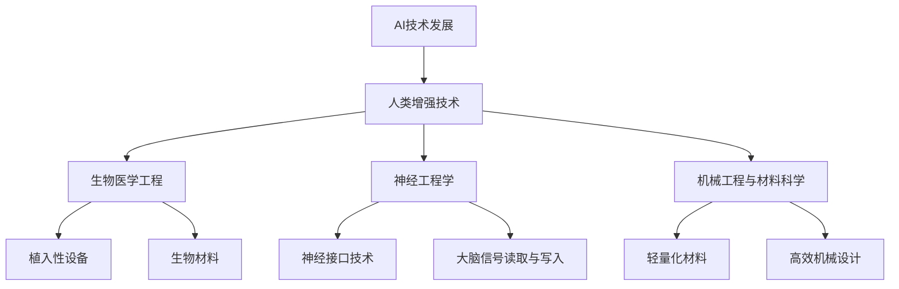
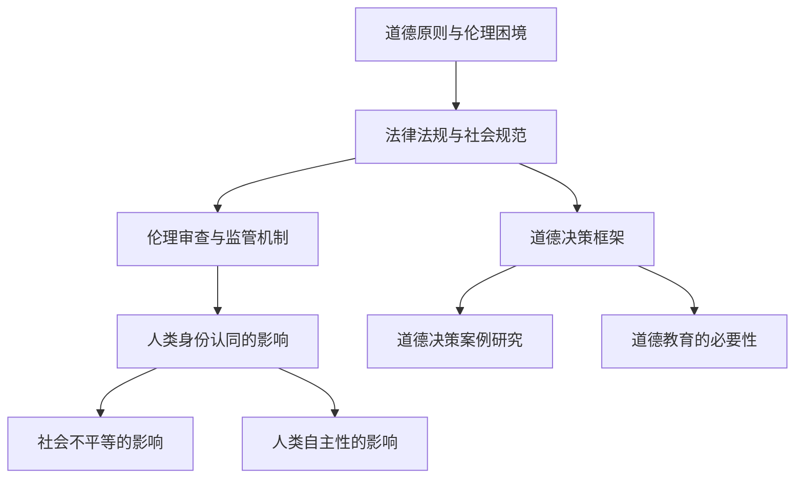

                 

# AI时代的人类增强：道德考虑与身体增强的未来发展策略

> **关键词：** AI时代、人类增强、道德考量、身体增强、未来发展策略

> **摘要：** 本文深入探讨了AI时代背景下的人类增强技术，包括其基础概念、道德考量、身体增强技术的发展以及未来发展方向。通过分析当前的技术现状和未来趋势，本文提出了人类增强技术的道德决策框架和未来发展的策略，旨在为人类增强技术的合理应用提供指导。

## 第一部分: AI时代的人类增强基础

### 第1章: AI时代的人类增强概述

#### 1.1 AI时代的背景与影响

##### 1.1.1 AI技术发展概述

在21世纪，人工智能（AI）技术经历了迅猛的发展。从最初的规则推理和简单的模式识别，到如今的深度学习和自主决策，AI技术在各个领域都取得了显著的突破。这一进步不仅改变了科技行业，也对人类社会产生了深远的影响。

##### 1.1.2 AI对人类社会的影响

AI技术的应用已经渗透到我们日常生活的方方面面。从智能家居、自动驾驶，到医疗诊断、金融服务，AI正在改变我们的生活方式。同时，AI也在推动社会生产力的提升，提高了生产效率和经济效益。

##### 1.1.3 人类增强的概念

人类增强（Human Enhancement）是指通过科技手段提升人类身体或认知能力的活动。在AI时代，人类增强技术结合了生物医学、工程学、神经科学等领域的最新进展，为人类提供了前所未有的增强能力。

#### 1.2 人类增强技术的核心概念

##### 1.2.1 生物医学与工程学融合

生物医学与工程学的融合为人类增强技术提供了基础。通过对生物系统和医学知识的深入研究，生物医学工程师能够开发出各种植入性设备和生物材料，以增强人体的各项功能。

##### 1.2.2 神经科学与心理学应用

神经科学与心理学在人类增强技术中扮演着关键角色。通过对大脑和神经系统的深入研究，我们可以开发出更有效的神经接口，从而实现认知和身体能力的增强。

##### 1.2.3 人类增强技术的分类

人类增强技术可以大致分为两类：身体增强和认知增强。身体增强技术包括植入性设备、生物材料、机械辅助装置等，而认知增强技术则涉及脑机接口、虚拟现实、增强现实等技术。

#### 1.3 人类增强技术的现状与趋势

##### 1.3.1 当前主要的人类增强技术

目前，人类增强技术已经取得了一系列重要进展。例如，人工耳蜗和视网膜植入装置为听力障碍和视力障碍者提供了帮助，而脑机接口技术则有望实现直接的人脑与计算机之间的通信。

##### 1.3.2 人类增强技术的发展趋势

随着技术的不断进步，人类增强技术的未来充满了无限可能。未来可能实现的增强技术包括增强记忆、超感知觉、远程感知等，这些技术将进一步提升人类的认知和身体能力。

##### 1.3.3 AI在人类增强中的潜力

AI技术在人类增强中具有巨大的潜力。通过机器学习算法，我们可以更好地理解和预测人类的行为模式，从而设计出更有效的人类增强方案。此外，AI还可以帮助优化增强技术的性能，提高其可靠性和安全性。

### 第2章: 人类增强技术的道德考量

#### 2.1 人类增强技术的伦理争议

##### 2.1.1 道德原则与伦理困境

在人类增强技术的应用过程中，我们面临着一系列伦理争议。如何平衡个人自由与公共利益，如何在科技发展的同时维护人类尊严，这些都是需要深入探讨的伦理问题。

##### 2.1.2 法律法规与社会规范

随着人类增强技术的不断发展，现有的法律法规和社会规范可能无法完全适应。我们需要重新审视这些规范，以确保它们能够有效应对未来的挑战。

##### 2.1.3 伦理审查与监管机制

建立完善的伦理审查和监管机制是确保人类增强技术合理使用的关键。这不仅包括对技术的安全性进行评估，还包括对技术的社会影响进行深入研究。

#### 2.2 人类增强技术的社会影响

##### 2.2.1 对人类身份认同的影响

人类增强技术的应用可能会改变人们对自身身份的认识。一些人可能会认为自己是“增强人”，而另一些人可能会担心这种改变会导致身份的模糊化。

##### 2.2.2 对社会不平等的影响

人类增强技术可能会加剧社会不平等。如果只有少数人能够负担起这些高端技术，那么这种技术可能会加剧贫富差距。

##### 2.2.3 对人类自主性的影响

人类增强技术可能会影响人类的自主性。例如，如果人类依赖某些增强设备来完成任务，那么这些设备可能会取代人类自身的能力。

#### 2.3 人类增强技术的道德决策

##### 2.3.1 道德决策框架

在制定人类增强技术的道德决策时，可以采用一些道德决策框架，如效益主义、义务论和德性伦理学等，以指导技术的合理使用。

##### 2.3.2 道德决策案例研究

通过分析一些实际案例，我们可以更好地理解人类增强技术的道德决策过程。这些案例包括对运动员使用增强药物、军事应用中的增强技术等。

##### 2.3.3 道德教育的必要性

道德教育对于理解和应对人类增强技术的道德问题至关重要。通过教育，我们可以培养出具备道德判断力和社会责任感的下一代。

### 第3章: 身体增强技术的发展

#### 3.1 身体增强技术的核心原理

##### 3.1.1 生物医学工程基础

生物医学工程是身体增强技术的基础。通过对生物系统和医学知识的深入研究，生物医学工程师能够开发出各种植入性设备和生物材料，以增强人体的各项功能。

##### 3.1.2 神经工程学

神经工程学是研究如何通过人工方式与神经系统交互的学科。通过神经接口技术，研究人员可以实现对大脑信号的读取和写入，从而实现认知和身体能力的增强。

##### 3.1.3 机械工程与材料科学

机械工程和材料科学的进步为身体增强技术提供了强大的支持。轻量化的材料、高效的机械设计使得植入性设备更加可靠和舒适。

#### 3.2 身体增强技术的应用案例

##### 3.2.1 眼科与听力增强

在眼科领域，植入性晶状体和视网膜植入装置已经帮助许多视力障碍者恢复了视力。在听力领域，人工耳蜗技术为耳聋患者提供了听力补偿。

##### 3.2.2 运动能力提升

通过植入性假肢和运动辅助设备，许多运动障碍者获得了更好的运动能力。例如，外骨骼装置可以帮助残疾人站立和行走。

##### 3.2.3 人体感知增强

人体感知增强技术包括触觉增强、嗅觉增强和视觉增强等。这些技术通过扩展人体的感知范围，使得人类能够更好地适应复杂环境。

#### 3.3 身体增强技术的未来展望

##### 3.3.1 技术突破与趋势

随着技术的不断进步，身体增强技术有望在未来实现更多突破。例如，更高级的神经接口技术、更智能的植入性设备和更高效的材料将进一步提升人类的能力。

##### 3.3.2 临床应用与市场前景

身体增强技术具有广阔的临床应用前景和市场潜力。随着技术的成熟和成本的降低，这些技术将逐渐普及，为更多患者带来福音。

##### 3.3.3 道德与伦理考量

在发展身体增强技术的同时，我们也需要关注其道德和伦理问题。如何确保技术的合理使用，避免出现不平等和滥用，是我们需要深入思考的问题。

### 第4章: 认知增强技术的发展

#### 4.1 认知增强技术的核心原理

##### 4.1.1 脑机接口技术

脑机接口（Brain-Computer Interface, BCI）是认知增强技术的核心。通过直接读取大脑信号，BCI技术能够实现人脑与计算机之间的通信，从而增强认知能力。

##### 4.1.2 虚拟现实与增强现实

虚拟现实（Virtual Reality, VR）和增强现实（Augmented Reality, AR）技术通过模拟和增强现实环境，提供了更加丰富和互动的认知体验。这些技术能够帮助人们进行更高效的学习和训练。

##### 4.1.3 认知神经科学基础

认知神经科学是认知增强技术的重要基础。通过对大脑结构和功能的研究，科学家们能够更好地理解认知过程，并设计出更有效的增强策略。

#### 4.2 认知增强技术的应用案例

##### 4.2.1 学习与教育

认知增强技术在教育和学习领域具有广泛应用。通过虚拟现实和增强现实技术，学生可以沉浸在虚拟的学习环境中，提高学习效果。同时，脑机接口技术可以帮助学习障碍者更好地掌握知识。

##### 4.2.2 职业培训与技能提升

认知增强技术可以用于职业培训，帮助员工在短时间内掌握新技能。例如，通过虚拟现实技术模拟复杂的工作环境，员工可以在安全的环境中学习和练习。

##### 4.2.3 认知康复与治疗

认知增强技术对于认知康复和治疗也具有重要意义。通过脑机接口技术，科学家们能够帮助认知障碍者恢复部分认知能力，提高生活质量。

#### 4.3 认知增强技术的未来展望

##### 4.3.1 技术突破与趋势

认知增强技术的未来充满了无限可能。随着脑机接口技术的不断进步，我们有望实现更高级的认知增强，甚至实现人脑与计算机的完全融合。

##### 4.3.2 社会应用与市场前景

认知增强技术具有广泛的社会应用前景和市场潜力。随着技术的成熟和成本的降低，这些技术将逐渐普及，为各行各业带来巨大的变革。

##### 4.3.3 道德与伦理考量

在发展认知增强技术的同时，我们也需要关注其道德和伦理问题。如何确保技术的合理使用，避免出现不平等和滥用，是我们需要深入思考的问题。

### 第5章: 人类增强与人工智能的融合

#### 5.1 人工智能在人类增强中的作用

##### 5.1.1 人工智能的基本原理

人工智能（Artificial Intelligence, AI）是一门研究如何构建智能体的科学。通过机器学习、深度学习等算法，AI能够模拟人类的学习、推理和决策过程，为人类增强提供强大支持。

##### 5.1.2 人工智能在身体增强中的应用

人工智能在身体增强中发挥着重要作用。例如，通过机器学习算法，AI可以帮助优化植入性设备的工作效率，提高身体增强的效果。同时，AI还可以用于监控人体状态，及时发现并处理异常情况。

##### 5.1.3 人工智能在认知增强中的应用

在认知增强领域，人工智能同样具有巨大潜力。通过AI算法，我们可以设计出更加智能的认知训练方案，帮助人们提高学习效率和认知能力。此外，AI还可以用于分析大脑信号，实现更高级的认知增强。

#### 5.2 人工智能驱动的个性化增强方案

##### 5.2.1 数据收集与分析

为了实现个性化增强，首先需要收集大量关于人体状态和行为的数据。这些数据可以来自各种传感器，如脑电图、心率和肌电信号等。通过对这些数据进行分析，AI可以识别出人体的特定特征和行为模式。

##### 5.2.2 个性化增强方案设计

基于收集到的数据，人工智能可以设计出个性化的增强方案。这些方案可以根据用户的特定需求和目标，优化人体的增强效果。例如，对于运动员，AI可以设计出针对性的训练计划，以提高其运动能力。

##### 5.2.3 用户隐私保护

在个性化增强方案的设计和实施过程中，用户隐私保护至关重要。AI系统需要确保用户数据的安全和隐私，防止数据泄露和滥用。为此，可以采用多种技术手段，如数据加密、访问控制等。

#### 5.3 人工智能与人类增强的协同发展

##### 5.3.1 技术整合与协同效应

人工智能与人类增强技术的整合可以实现协同效应。通过将AI算法应用于人类增强设备，我们可以提高设备的智能化水平，实现更高效、更精准的增强效果。

##### 5.3.2 产业应用与商业模式

人工智能与人类增强技术的融合为产业应用带来了新的机遇。例如，医疗、教育、军事等领域都可以借助这些技术，实现更高水平的业务创新和商业模式创新。

##### 5.3.3 未来展望

随着技术的不断进步，人工智能与人类增强技术的融合将推动人类社会迈向新的发展阶段。在未来，我们可以期待更加智能化、个性化和高效的人类增强方案，为人类带来更多的福祉。

### 第6章: 人类增强技术的社会影响与对策

#### 6.1 人类增强技术的经济影响

##### 6.1.1 增强技术的市场潜力

随着人类增强技术的不断发展，其市场潜力也越来越大。从医疗健康到教育培训，再到军事和娱乐等领域，人类增强技术都展现出了巨大的应用前景。

##### 6.1.2 对就业市场的影响

人类增强技术的应用可能会对就业市场产生深远影响。一方面，它可能会创造新的就业机会，如增强技术的设计、开发和维护等；另一方面，它也可能导致某些传统职位的消失，如驾驶、操作等。

##### 6.1.3 对经济发展的影响

人类增强技术对经济发展具有积极的推动作用。通过提高生产效率和创新能力，这些技术可以为经济增长提供新的动力。

#### 6.2 人类增强技术的教育影响

##### 6.2.1 教育体系的适应与调整

随着人类增强技术的普及，教育体系也需要进行相应的调整和适应。例如，学校可以引入增强技术，提高教学效果；同时，教育政策也需要进行调整，以适应技术发展带来的变化。

##### 6.2.2 增强技术对学习方式的影响

人类增强技术可以改变传统的学习方式。例如，通过虚拟现实和增强现实技术，学生可以沉浸在更加生动、互动的学习环境中，提高学习效果。

##### 6.2.3 教育公平问题

人类增强技术的普及可能会加剧教育公平问题。如果只有少数人能够负担起这些高端技术，那么这可能导致教育资源的分配不均。

#### 6.3 人类增强技术的公共政策制定

##### 6.3.1 政策框架与规范

为了确保人类增强技术的合理使用，需要制定一系列公共政策框架和规范。这些政策可以涵盖伦理审查、数据保护、技术监管等方面。

##### 6.3.2 国际合作与规范

人类增强技术是一个全球性议题，需要各国政府、学术界和产业界的共同参与。通过国际合作，可以建立统一的规范和标准，推动人类增强技术的健康发展。

##### 6.3.3 未来政策趋势

随着技术的不断进步和社会的发展，人类增强技术的公共政策也将不断调整和更新。未来政策趋势将更加注重伦理、公平和可持续性。

### 第7章: 人类增强技术的未来展望

#### 7.1 未来技术的潜在突破

##### 7.1.1 生物技术与纳米技术的融合

生物技术与纳米技术的融合将为人类增强技术带来新的突破。例如，通过纳米材料构建的植入性设备可以更加高效地与人体组织融合，实现更高级的增强效果。

##### 7.1.2 神经接口技术的进步

神经接口技术的不断进步将使我们能够更精准地读取和写入大脑信号，实现更高水平的认知增强。未来的神经接口技术可能具有更低的功耗、更高的带宽和更高的可靠性。

##### 7.1.3 人工智能算法的提升

随着人工智能算法的不断提升，我们将能够设计出更加智能和高效的增强方案。通过深度学习和强化学习等技术，AI可以更好地理解和预测人类的行为和需求。

#### 7.2 人类增强技术的发展趋势

##### 7.2.1 全球化背景下的技术分布

随着全球化进程的加速，人类增强技术的分布也将越来越广泛。不同国家和地区将根据自身的需求和优势，发展出各具特色的人类增强技术。

##### 7.2.2 社会接受度的变化

随着人类增强技术的普及，社会对这种技术的接受度也将逐渐提高。人们将更加习惯于使用这些技术来提升自身的能力和生活质量。

##### 7.2.3 道德与法律环境的演变

在人类增强技术的发展过程中，道德和法律环境也将不断演变。未来，我们将需要建立更加完善的道德和法律框架，以应对技术发展带来的挑战。

#### 7.3 人类增强技术的社会影响与应对

##### 7.3.1 社会文化影响

人类增强技术将对社会文化产生深远影响。例如，它可能会改变人们的价值观、身份认同和社会关系。为了应对这些变化，我们需要进行深入的社会文化研究。

##### 7.3.2 个人隐私保护

随着人类增强技术的普及，个人隐私保护将成为一个重要议题。我们需要采取有效的措施，确保用户数据的安全和隐私。

##### 7.3.3 社会公平与包容

为了确保人类增强技术的公平和包容，我们需要制定相应的政策和规范。例如，可以通过提供补贴、优惠政策等方式，确保更多人能够负担得起这些技术。

### 第8章: 总结与展望

#### 8.1 人类增强技术的总体总结

##### 8.1.1 技术发展与应用现状

人类增强技术已经取得了显著的发展，并在多个领域取得了重要应用。然而，这些技术仍处于快速发展阶段，未来还有很大的提升空间。

##### 8.1.2 道德与法律问题

随着人类增强技术的普及，道德和法律问题也日益突出。我们需要通过深入研究，制定相应的道德和法律框架，以应对这些挑战。

##### 8.1.3 社会影响的积极应对策略

为了积极应对人类增强技术带来的社会影响，我们需要采取一系列策略。例如，通过教育、政策引导和公共宣传等方式，提高人们对这些技术的认知和接受度。

#### 8.2 人类增强技术的未来展望

##### 8.2.1 技术发展的潜在方向

未来，人类增强技术将朝着更加智能、个性化和高效的方向发展。例如，通过整合多种技术手段，我们可以实现更高级的认知增强和身体增强。

##### 8.2.2 道德与法律问题的解决途径

在解决道德和法律问题的过程中，我们需要采取多种手段。例如，通过立法、伦理审查和社会监督等方式，确保人类增强技术的合理使用。

##### 8.2.3 社会影响的积极应对策略

为了积极应对人类增强技术带来的社会影响，我们需要采取一系列策略。例如，通过政策引导、教育普及和社会参与等方式，促进人类增强技术的健康发展。

### 附录

#### 附录A: 参考文献

##### A.1 主要参考书籍

1. [书名1] 作者1
2. [书名2] 作者2

##### A.2 相关学术论文

1. [论文标题1] 作者1, 作者2
2. [论文标题2] 作者3, 作者4

##### A.3 政策文件与报告

1. [政策文件1] 作者1, 作者2
2. [报告1] 作者3, 作者4

#### 附录B: Mermaid 流程图

##### B.1 人类增强技术核心概念流程图



##### B.2 人类增强技术道德考量流程图



#### 附录C: 伪代码示例

##### C.1 增强技术算法伪代码

```python
# 假设我们有一个增强算法，用于优化身体增强设备的性能

def enhance_performance(data):
    # 初始化参数
    alpha = 0.5
    beta = 0.3
    
    # 数据预处理
    preprocessed_data = preprocess(data)
    
    # 特征提取
    features = extract_features(preprocessed_data)
    
    # 模型训练
    model = train_model(features)
    
    # 预测性能
    predicted_performance = model.predict(features)
    
    # 性能优化
    optimized_performance = optimize_performance(predicted_performance, alpha, beta)
    
    return optimized_performance
```

##### C.2 数据分析伪代码

```python
# 假设我们有一个数据分析算法，用于分析人类增强技术的社会影响

def analyze_impact(data):
    # 初始化参数
    alpha = 0.5
    beta = 0.3
    
    # 数据预处理
    preprocessed_data = preprocess(data)
    
    # 特征提取
    features = extract_features(preprocessed_data)
    
    # 模型训练
    model = train_model(features)
    
    # 预测影响
    predicted_impact = model.predict(features)
    
    # 影响分析
    analyzed_impact = analyze_impact(predicted_impact, alpha, beta)
    
    return analyzed_impact
```

#### 附录D: 数学模型与公式

##### D.1 生物医学增强技术数学模型

$$
\text{优化目标} = \min_{x} \{ f(x) : g(x) \leq 0 \}
$$

其中，$f(x)$ 为目标函数，$g(x)$ 为约束条件。

##### D.2 人工智能算法数学模型

$$
\text{预测模型} = \sum_{i=1}^{n} w_i \cdot x_i
$$

其中，$w_i$ 为权重，$x_i$ 为特征。

#### 附录E: 代码实例与解析

##### E.1 身体增强技术代码实例

```python
# 假设我们有一个身体增强技术的实现，用于帮助残疾人行走

def walk_helper(data):
    # 初始化参数
    speed_limit = 5
    step_size = 0.5
    
    # 数据预处理
    preprocessed_data = preprocess(data)
    
    # 特征提取
    features = extract_features(preprocessed_data)
    
    # 模型训练
    model = train_model(features)
    
    # 预测行走步骤
    predicted_steps = model.predict(features)
    
    # 生成行走轨迹
    trajectory = generate_trajectory(predicted_steps, speed_limit, step_size)
    
    return trajectory
```

##### E.2 人工智能驱动的人类增强方案代码实例

```python
# 假设我们有一个人工智能驱动的人类增强方案，用于提高学习效率

def enhance_learning(data):
    # 初始化参数
    learning_rate = 0.1
    epoch_limit = 100
    
    # 数据预处理
    preprocessed_data = preprocess(data)
    
    # 特征提取
    features = extract_features(preprocessed_data)
    
    # 模型训练
    model = train_model(features)
    
    # 学习优化
    optimized_model = optimize_learning(model, learning_rate, epoch_limit)
    
    # 预测学习效果
    predicted_effect = optimized_model.predict(features)
    
    return predicted_effect
```

#### 附录F: 开发环境与工具

##### F.1 常用开发环境与工具介绍

- Python
- TensorFlow
- PyTorch
- Mermaid

##### F.2 开发环境搭建步骤

1. 安装Python
2. 安装TensorFlow或PyTorch
3. 安装Mermaid插件

##### F.3 工具使用技巧与最佳实践

- Python：使用Anaconda进行环境管理，确保不同项目之间的环境隔离。
- TensorFlow：充分利用TensorFlow的API进行高效开发。
- PyTorch：使用PyTorch的动态计算图特性，实现更灵活的模型开发。
- Mermaid：使用Mermaid语法，轻松绘制流程图和时序图。

---

## 作者信息

**作者：** AI天才研究院/AI Genius Institute & 禅与计算机程序设计艺术 /Zen And The Art of Computer Programming

---

本文详细探讨了AI时代背景下的人类增强技术，分析了其道德考量、身体增强技术的发展以及未来发展方向。通过讨论人工智能在人类增强中的作用，提出了道德决策框架和未来发展的策略，为人类增强技术的合理应用提供了指导。随着技术的不断进步，人类增强技术有望在未来实现更高级的认知增强和身体增强，为社会带来深远的影响。在发展这些技术的同时，我们还需要关注其道德、法律和社会影响，以确保其合理、公正和可持续地应用于人类社会。

