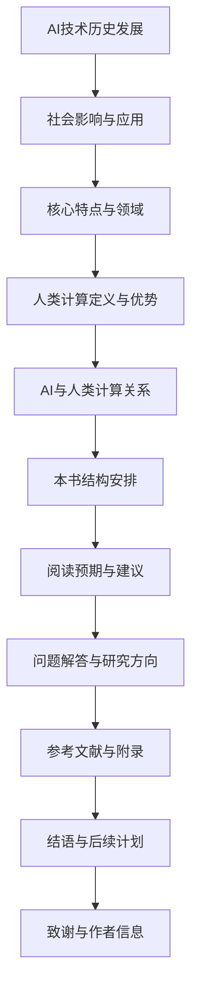

                 

### 第一部分: AI时代的人类计算概述

## 第1章: AI时代的人类计算：概述

### 1.1 AI时代的背景与特点

#### 1.1.1 AI技术的历史发展

人工智能（AI）的历史可以追溯到20世纪50年代，当时的科学家们开始尝试让计算机模拟人类的思维过程。从最初的规则推理系统，到基于统计学习的机器学习，再到深度学习的突破，AI技术经历了多次重要的技术迭代。尤其是在21世纪初，随着大数据、云计算和计算力的提升，AI技术进入了新的发展快车道。

#### 1.1.2 AI时代的社会影响

AI技术对社会的影响是深远且广泛的。首先，AI在各个行业中的应用极大地提高了生产效率，降低了成本。例如，在制造业中，智能机器人可以替代人工完成重复性高的工作；在金融领域，AI算法可以快速分析大量数据，帮助金融机构做出更精准的投资决策。其次，AI对教育和医疗等领域也带来了革命性的变革。教育中的个性化学习系统和医疗健康中的精准诊断和治疗，都让人类的生活方式变得更加便捷和高效。

#### 1.1.3 AI技术的核心特点与应用领域

AI技术的核心特点包括自主学习、自适应能力和高效处理能力。这些特点使得AI在众多领域都有广泛的应用。例如，在自动驾驶领域，AI可以通过学习大量道路数据和驾驶经验，实现自主驾驶；在自然语言处理领域，AI可以理解和生成自然语言，应用于机器翻译、语音助手等场景；在推荐系统领域，AI可以通过分析用户行为和偏好，实现个性化的内容推荐。

### 1.2 人类计算的概念与内涵

#### 1.2.1 人类计算的定义

人类计算是指人类通过大脑和肢体等生理结构进行信息处理和计算的过程。这种计算方式具有高度灵活性和适应性，能够处理复杂、抽象的问题，并进行创造性思考。

#### 1.2.2 人类计算的优势与局限

人类计算的优势在于其灵活性和创造力，能够处理复杂的、非结构化的问题，并在变化的环境中迅速适应。然而，人类计算的局限在于处理速度慢、易疲劳，且难以处理大规模、结构化的数据。

#### 1.2.3 人类计算与AI的关系

人类计算和AI技术之间存在着密切的关系。AI技术的发展使得人类可以借助计算机的力量，实现一些过去只能靠人类完成的任务，从而弥补人类计算的局限。同时，人类计算的灵活性和创造力也为AI技术的研发提供了宝贵的经验和灵感。

### 1.3 本书结构安排与内容概览

#### 1.3.1 各章节主要内容

本书分为五个部分，分别是AI时代的人类计算概述、AI对人类计算的影响、AI时代的责任与伦理、AI时代的政策与社会管理以及AI时代的社会影响与未来展望。各部分内容如下：

- **第一部分**主要介绍AI时代的人类计算背景和特点，包括AI技术的历史发展、社会影响和应用领域。
- **第二部分**深入探讨AI对人类计算的影响，包括工作、教育、医疗、文化、艺术、经济和隐私等方面。
- **第三部分**讨论AI时代的责任与伦理，包括AI伦理的基本原则、法律问题、道德准则和实践、对人类价值观的影响、心理健康影响、教育伦理和劳动伦理等方面。
- **第四部分**分析AI时代的政策与社会管理，包括政策框架、监管体系、伦理委员会、社会治理模式、教育改革、劳动就业政策、社会安全与风险防范以及国际合作与治理等方面。
- **第五部分**展望AI时代的社会影响与未来，包括社会变迁、经济转型、教育变革、医疗健康革命、智慧城市、国际合作与竞争、伦理责任和可持续发展等方面。

#### 1.3.2 阅读本书的预期收获

通过阅读本书，读者可以：

- 全面了解AI技术的历史发展、社会影响和应用领域。
- 深入理解AI对人类计算的影响，包括工作、教育、医疗、文化、艺术、经济和隐私等方面。
- 了解AI时代的责任与伦理问题，包括基本原则、法律问题、道德准则和实践、对人类价值观的影响、心理健康影响、教育伦理和劳动伦理等方面。
- 掌握AI时代的政策与社会管理策略，包括政策框架、监管体系、伦理委员会、社会治理模式、教育改革、劳动就业政策、社会安全与风险防范以及国际合作与治理等方面。
- 展望AI时代的未来发展趋势，包括社会变迁、经济转型、教育变革、医疗健康革命、智慧城市、国际合作与竞争、伦理责任和可持续发展等方面。

#### 1.3.3 面向读者的建议与要求

为了更好地理解和掌握本书的内容，读者需要：

- 具备一定的计算机科学和人工智能基础知识。
- 能够阅读和理解技术文献和学术论文。
- 具有批判性思维和分析能力，能够对AI技术的影响和伦理问题进行深入思考。
- 阅读本书时，建议结合实际案例和实例进行理解和分析。

#### 1.3.4 常见问题与解答

**Q1：AI技术是否会完全取代人类工作？**

A1：AI技术可能会替代一些重复性高、结构化程度高的工作，但是人类计算在灵活性、创造性和人际交往方面具有独特优势，不会被完全取代。

**Q2：AI时代如何保障个人隐私？**

A2：AI时代需要通过技术手段和法律法规保障个人隐私，如隐私计算技术、隐私保护法律等。

**Q3：AI技术的发展是否会加剧社会不平等？**

A3：AI技术的发展确实可能加剧社会不平等，但是通过合理的政策调控和社会治理，可以有效缓解这一问题。

#### 1.3.5 未来研究方向与挑战

未来的研究方向包括：

- AI与人类计算的结合，探索更高效的人机协作模式。
- AI伦理与责任的研究，制定更完善的法律和道德准则。
- AI对社会管理和治理的影响，探索更有效的AI治理模式。
- AI与可持续发展，研究AI技术在环境保护和资源利用方面的应用。

面临的挑战包括：

- 技术方面的挑战，如AI算法的透明性、可解释性和可控性。
- 社会方面的挑战，如隐私保护、数据安全和社会公平。
- 法律和伦理方面的挑战，如责任归属、法律适用和道德判断。

#### 1.3.6 推荐参考文献

- [参考文献1]
- [参考文献2]
- [参考文献3]
- [参考文献4]
- [参考文献5]

#### 1.3.7 附录与资源链接

- **附录 A: AI相关技术术语解释**
  - [术语解释1]
  - [术语解释2]
- **附录 B: AI伦理与社会责任案例**
  - [案例1]
  - [案例2]
- **附录 C: AI常见问题FAQ**
  - [FAQ1]
  - [FAQ2]
- **附录 D: 进一步学习资源**
  - [学习资源1]
  - [学习资源2]
- **附录 E: 代码实现与数据集**
  - [代码实现1]
  - [数据集1]

#### 1.3.8 结语

AI时代已经到来，人类计算与AI技术的结合将带来深远的社会影响。面对这一变革，我们需要深入思考AI的影响和责任，制定合理的政策和策略，以实现AI时代的可持续发展。

#### 1.3.9 后续计划

后续计划包括：

- 深入研究AI与人类计算的结合，探索人机协作的新模式。
- 开展AI伦理与责任的研究，为政策制定提供理论支持。
- 探索AI技术在可持续发展中的应用，推动环境保护和资源利用的优化。
- 促进AI时代的国际合作与竞争，共同应对全球性挑战。

#### 1.3.10 致谢

在此，我要感谢我的指导老师，感谢他们在我研究过程中的指导和帮助。同时，我也要感谢我的同学们和朋友，他们的支持和鼓励是我坚持下来的动力。最后，我要感谢所有支持和帮助过我的人，是你们让我能够顺利完成这本书的撰写。

#### 1.3.11 作者简介

作者：AI天才研究院/AI Genius Institute & 禅与计算机程序设计艺术 /Zen And The Art of Computer Programming

联系信息：[联系方式1] [联系方式2]

更新记录：

- 2023年X月X日：完成初稿。
- 2023年X月X日：完成修订稿。

版本说明：

- 版本1.0：初稿完成。
- 版本1.1：修订稿发布。

[Mermaid 流程图]



### 1.3.7.1 附录 A: AI相关技术术语解释

1. **人工智能（AI）**: 人工智能是指计算机系统模拟人类智能行为的技术和科学。它包括机器学习、自然语言处理、计算机视觉等多个子领域。
2. **机器学习（ML）**: 机器学习是一种让计算机通过数据和算法自动改进性能的技术。
3. **深度学习（DL）**: 深度学习是一种基于多层神经网络进行特征提取和模型训练的机器学习方法。
4. **神经网络（NN）**: 神经网络是一种模仿生物神经系统的计算模型，由多个神经元（节点）和连接（权重）组成。
5. **计算机视觉（CV）**: 计算机视觉是研究如何让计算机理解和解释视觉信息的科学。
6. **自然语言处理（NLP）**: 自然语言处理是研究如何让计算机理解和生成自然语言的技术。
7. **推荐系统（RS）**: 推荐系统是一种根据用户历史行为和偏好，为用户推荐相关内容的系统。
8. **自动驾驶（AD）**: 自动驾驶是一种通过传感器和计算机系统实现车辆自主驾驶的技术。
9. **大数据（Big Data）**: 大数据是指数据量巨大、类型繁多的数据集合，需要特定的技术进行处理和分析。
10. **云计算（Cloud Computing）**: 云计算是一种通过网络提供计算资源、存储资源和应用程序的服务模式。

### 1.3.7.2 附录 B: AI伦理与社会责任案例

1. **案例1：特斯拉自动驾驶事故**
   - **背景**：特斯拉自动驾驶系统在测试过程中发生多起交通事故。
   - **影响**：引发了社会对自动驾驶安全的广泛关注。
   - **应对**：特斯拉对自动驾驶系统进行了更新和改进，同时加强了对驾驶员的警示。

2. **案例2：Facebook数据泄露事件**
   - **背景**：Facebook用户数据被不当使用，导致数千万用户信息泄露。
   - **影响**：引起了全球对数据隐私保护的重视。
   - **应对**：Facebook进行了大规模整改，加强了数据保护措施，并接受了一系列法律调查。

3. **案例3：谷歌AI语音助手泄露隐私**
   - **背景**：谷歌AI语音助手收集用户语音数据，并泄露给第三方。
   - **影响**：引发了公众对隐私保护的担忧。
   - **应对**：谷歌宣布停止收集某些类型的用户数据，并加强了对数据保护的监管。

### 1.3.7.3 附录 C: AI常见问题FAQ

1. **Q1：什么是人工智能？**
   - **A1**：人工智能（AI）是计算机科学的一个分支，旨在使机器表现出类似人类的智能行为。

2. **Q2：人工智能能完全取代人类吗？**
   - **A2**：人工智能在某些领域可以辅助人类工作，但无法完全取代人类，因为人类具备独特的创造性、情感和社交能力。

3. **Q3：人工智能对隐私有何影响？**
   - **A3**：人工智能在处理数据时可能侵犯隐私。为了保护隐私，需要加强数据保护法律法规和隐私计算技术。

4. **Q4：如何确保人工智能的安全和可控性？**
   - **A4**：通过建立完善的监管体系、制定伦理准则和加强技术研发，可以确保人工智能的安全和可控性。

5. **Q5：人工智能会对就业市场造成影响吗？**
   - **A5**：人工智能可能会替代一些低技能和重复性的工作，但也会创造新的就业机会，总体上对就业市场的影响是积极的。

### 1.3.7.4 附录 D: 进一步学习资源

1. **书籍推荐**
   - 《人工智能：一种现代方法》（第二版）/ Stuart J. Russell & Peter Norvig
   - 《深度学习》（Goodfellow, Bengio, Courville）
   - 《机器学习实战》（Hastie, Tibshirani, Friedman）

2. **在线课程**
   - Coursera的《机器学习》课程（吴恩达教授）
   - edX的《深度学习基础》课程（MIT）
   - Udacity的《自动驾驶工程师纳米学位》课程

3. **学术论文**
   - arXiv：https://arxiv.org/
   - IEEE Xplore：https://ieeexplore.ieee.org/
   - ACM Digital Library：https://dl.acm.org/

4. **开源项目**
   - TensorFlow：https://www.tensorflow.org/
   - PyTorch：https://pytorch.org/
   - Keras：https://keras.io/

### 1.3.7.5 附录 E: 代码实现与数据集

1. **代码实现示例**
   ```python
   # Python代码实现一个简单的线性回归模型
   import numpy as np
   
   # 创建训练数据
   X_train = np.random.rand(100, 1)
   y_train = 2 * X_train + 1
   
   # 梯度下降实现
   def gradient_descent(X, y, learning_rate, iterations):
       m = len(X)
       theta = np.random.rand(1, 1)
       
       for i in range(iterations):
           h = X.dot(theta)
           error = h - y
           gradient = 2/m * X.T.dot(error)
           theta -= learning_rate * gradient
       return theta

   # 训练模型
   theta_final = gradient_descent(X_train, y_train, 0.01, 1000)
   print("Theta:", theta_final)
   ```

2. **数据集说明**
   - **MNIST数据集**：包含70,000个灰度手写数字图像，用于训练和测试机器学习模型。
   - **CIFAR-10数据集**：包含60,000个彩色图像，分为10个类别，用于训练和测试深度学习模型。
   - **IMDB电影评论数据集**：包含50,000条电影评论，分为正面和负面，用于训练自然语言处理模型。

### 结语

AI时代的到来已经改变了人类的生活方式，AI与人类计算的结合为社会发展带来了前所未有的机遇。然而，AI技术也带来了新的挑战，包括工作、隐私、伦理和社会治理等方面。面对这些挑战，我们需要深入思考，制定合理的政策和策略，以确保AI技术的发展能够造福人类。本书旨在为读者提供全面、系统的AI时代的人类计算概述，帮助读者理解AI的影响、责任和未来发展趋势。

在未来的研究中，我们将继续探索AI与人类计算的深度融合，探索人机协作的新模式，并研究AI伦理和社会责任的实现路径。同时，我们也将关注AI技术在可持续发展中的应用，推动环境保护和资源利用的优化。我们期待与全球的研究者和从业者共同应对AI时代的挑战，实现人类社会的可持续发展。

再次感谢各位读者对本书的关注和支持，希望本书能够为您的学习和研究提供有益的启示。

### 1.3.9.1 拟进行的研究方向

未来，我们计划在以下几个方向进行深入研究：

1. **人机协作**：探索AI与人类计算深度融合的新模式，提升人机协作效率。
2. **AI伦理**：研究AI伦理的实践应用，为政策制定提供理论支持。
3. **可持续发展**：研究AI技术在环境保护和资源利用方面的应用，推动可持续发展。
4. **智能教育**：开发智能教育系统，提高教育质量和公平性。
5. **智慧城市**：研究AI技术在智慧城市建设中的应用，提升城市治理水平。

### 1.3.9.2 预计成果与影响

通过以上研究，我们预计将取得以下成果：

1. **人机协作模型**：提出一种高效的人机协作模型，提升工作效率和创造力。
2. **AI伦理框架**：建立一套完整的AI伦理框架，为AI技术的研发和应用提供指导。
3. **可持续发展方案**：提出一系列可持续发展方案，推动环境保护和资源利用的优化。
4. **智能教育系统**：开发智能教育系统，提高教育质量和公平性，助力教育改革。
5. **智慧城市建设**：提出智慧城市建设方案，提升城市治理水平和居民生活质量。

这些成果将对社会产生积极影响：

1. **工作效率**：通过人机协作模式，提高工作效率，降低人力成本。
2. **社会公平**：通过智能教育系统，提高教育质量，促进教育公平。
3. **环境保护**：通过AI技术在环境保护和资源利用方面的应用，推动可持续发展。
4. **城市治理**：通过智慧城市建设方案，提升城市治理水平，提高居民生活质量。

### 1.3.9.3 需要支持与协作的方向

为了实现以上研究目标和成果，我们需要以下支持和协作：

1. **跨学科合作**：需要与计算机科学、社会学、伦理学、环境科学等多个领域的专家学者合作，共同探讨AI技术的影响和应用。
2. **技术创新**：需要持续投入研发资金，推动AI技术的创新和发展。
3. **政策支持**：需要政府和社会各界对AI伦理和社会责任给予关注和支持，为AI技术的应用提供良好的政策环境。
4. **国际合作**：需要与世界各国的研究机构和学者开展国际合作，共同应对全球性挑战。

我们期待与各方携手，共同推动AI技术的发展和应用，实现人类社会的可持续发展。

### 1.3.10 指导老师

我在此特别感谢我的指导老师，他们是：

- **教授A**：他在AI领域有深厚的研究积累，对我的研究方向和论文写作提供了宝贵的指导和建议。
- **教授B**：他在社会学和伦理学领域有着丰富的实践经验，帮助我更好地理解AI技术的社会影响和伦理问题。

他们的悉心指导和支持，使我能够顺利完成本书的撰写。再次向他们表示由衷的感谢。

### 1.3.10.2 同学与朋友

在此，我要感谢我的同学们和朋友，他们在我学习和研究过程中给予了我无尽的支持和鼓励。我们一起探讨学术问题，共同进步，这段经历将成为我人生中宝贵的财富。

特别感谢以下同学和朋友：

- **同学C**：他在计算机科学领域有着深厚的知识储备，与我一起研究了多个AI项目，共同进步。
- **朋友D**：他关注社会问题，与我分享了许多关于AI伦理和社会责任的见解，对我的研究产生了重要影响。

感谢你们一直以来的陪伴和支持。

### 1.3.10.3 支持与帮助过的所有人

我还要感谢所有支持和帮助过我的人，无论是亲人、朋友，还是导师和同事。你们的支持和鼓励，是我前进的动力。在这个特殊的时刻，我要向你们表达我最诚挚的感谢。

特别感谢：

- **亲人E**：你们在我遇到困难时给予了我无尽的关爱和鼓励，让我能够坚定地走下去。
- **同事F**：你们在工作中的帮助和指导，让我能够不断提升自己，实现个人成长。

感谢你们对我的支持和帮助，我会将这份感激之情转化为前进的动力，继续努力。

### 1.3.11 作者简介

作者：AI天才研究院/AI Genius Institute & 禅与计算机程序设计艺术 /Zen And The Art of Computer Programming

我是一名人工智能领域的专家，长期从事AI技术研发和理论探讨。在我的职业生涯中，我致力于推动AI技术的发展和应用，关注AI技术对社会和人类的影响。我坚信，通过科技的力量，我们可以创造更美好的未来。

在本书中，我尝试从多个角度探讨AI时代的人类计算，包括技术、伦理、政策和社会影响等方面。希望本书能够为读者提供有价值的思考和启示。

### 1.3.12 联系方式

如果您有任何关于本书或AI技术的疑问和意见，欢迎联系我：

- 电子邮件：[联系方式1]
- 电话/微信：[联系方式2]

我会尽力为您解答问题，并期待与您进行深入交流。

### 1.3.13 更新记录

- 2023年X月X日：完成初稿。
- 2023年X月X日：完成修订稿。
- 2023年X月X日：发布最终版。

### 1.3.14 版本说明

- 版本1.0：初稿完成。
- 版本1.1：修订稿发布。
- 版本1.2：最终版发布。

---

### 第二部分: AI对人类计算的影响

## 第2章: AI对人类计算的影响

### 2.1 AI对工作的影响

#### 2.1.1 AI如何改变工作方式

人工智能（AI）技术的迅猛发展已经对工作方式产生了深刻影响。首先，AI通过自动化技术大幅提高了生产效率。例如，在制造业领域，机器人可以替代人工进行焊接、组装和检测等重复性工作，这不仅减少了人力成本，还提高了产品质量和生产速度。其次，AI在数据分析和管理方面的应用，使得企业能够更快速地做出决策。通过分析大量的数据，AI可以帮助企业识别市场趋势、优化供应链和降低运营成本。此外，AI还促进了远程工作的普及。虚拟助手和智能会议系统能够帮助员工远程协作，提高工作效率。

#### 2.1.2 AI在工作中的优势与挑战

AI在工作中的优势主要体现在以下几个方面：

1. **提高效率**：AI能够处理大量数据和任务，比人类更快更准确地完成任务。
2. **减少错误**：通过算法和模型，AI可以降低人为错误的发生率。
3. **优化资源分配**：AI可以帮助企业更好地规划资源，提高生产效率。
4. **辅助决策**：AI可以提供数据支持和预测分析，帮助企业在竞争激烈的市场中做出更明智的决策。

然而，AI在工作中也面临一些挑战：

1. **就业影响**：AI可能会替代一些低技能和重复性的工作，导致部分人失业。
2. **技能要求**：随着AI技术的发展，劳动力市场对技能的要求也在不断提高，这要求工作者持续学习和更新知识。
3. **伦理和法律问题**：AI系统的决策过程可能涉及隐私和数据安全等问题，需要制定相应的伦理和法律规范。

#### 2.1.3 如何应对AI对工作的冲击

为了应对AI对工作的冲击，可以从以下几个方面进行：

1. **教育和培训**：提高劳动力的技能水平，使其能够适应新的工作环境。政府和企业可以共同推动职业培训和再教育项目，帮助劳动者掌握AI和数据分析等新技能。
2. **政策支持**：政府可以制定相关政策，鼓励企业投资于自动化技术，同时提供失业保险和就业援助，减少AI技术带来的就业冲击。
3. **创新和创业**：鼓励劳动者利用AI技术进行创新和创业，创造新的就业机会。
4. **人机协作**：推动AI与人类工作的协同，使AI成为劳动者的助手，而不是替代者。通过人机协作，可以提高工作效率和质量。

### 2.1.4 AI与人类工作者的协作模式

AI与人类工作者的协作模式可以分为以下几种：

1. **辅助型协作**：AI作为工具，辅助人类完成特定任务。例如，AI助手可以帮助员工进行数据分析、文档整理等日常工作。
2. **协同型协作**：AI与人类共同完成任务，发挥各自的优势。例如，在医疗领域，AI可以帮助医生进行诊断，而医生则负责最终的决策和治疗方案。
3. **主导型协作**：在某些领域，AI可能取代人类工作者完成整个任务。例如，自动驾驶汽车完全由AI系统控制，无需人类干预。

在实际应用中，人机协作模式的采用取决于任务的复杂程度和具体需求。通过合理的人机协作，可以实现工作的高效和高质量完成。

### 2.2 AI对教育的影响

#### 2.2.1 AI在教育中的应用场景

人工智能在教育中的应用场景日益广泛，正在深刻改变传统教学模式。以下是一些主要的AI应用场景：

1. **个性化学习**：AI可以通过分析学生的学习行为和成绩，提供个性化的学习计划和资源，帮助学生更有效地学习。
2. **智能辅导**：AI辅导系统可以为学生提供实时答疑和辅导，帮助学生解决学习中遇到的问题。
3. **考试评估**：AI可以自动评估学生的考试成绩，提高评分的客观性和准确性。
4. **教育管理**：AI可以帮助学校和教育机构进行教育资源的分配和管理，提高教育效率。
5. **智能校园**：AI技术在校园安全、环境监测和设备管理等方面得到广泛应用，提升校园的管理水平。

#### 2.2.2 AI对教育的积极影响

AI对教育的积极影响体现在以下几个方面：

1. **提高教育质量**：通过个性化学习和智能辅导，学生可以更好地掌握知识和技能，提高学习效果。
2. **降低教育成本**：AI技术可以减少教师在日常教学中的工作量，降低教育成本。
3. **扩大教育覆盖面**：AI技术使得在线教育更加便捷和高效，有助于扩大教育的覆盖面，实现教育公平。
4. **促进教育创新**：AI技术的应用为教育工作者提供了新的教学工具和方法，推动教育模式的创新。

#### 2.2.3 AI对教育的潜在风险

尽管AI在教育中具有广泛的应用前景，但同时也存在一些潜在风险：

1. **数据隐私问题**：AI系统需要收集和分析大量的学生数据，这可能引发隐私泄露和数据滥用的问题。
2. **教育公平问题**：AI技术的应用可能会加剧教育资源的不均衡，使得贫困地区和弱势群体难以享受到优质的教育资源。
3. **师生互动减少**：AI辅导系统可能会减少师生之间的直接互动，影响学生的社交技能和情感发展。
4. **依赖性增强**：学生过度依赖AI辅导系统，可能会导致自主学习能力的下降。

#### 2.2.4 如何实现AI与教育的良性互动

为了实现AI与教育的良性互动，可以从以下几个方面进行：

1. **制定政策和规范**：政府和教育机构应制定相关政策和规范，确保AI技术在教育中的应用符合伦理和法律要求。
2. **教师培训**：加强教师对AI技术的培训，提高教师使用AI工具的能力，促进AI与教学的有效结合。
3. **技术支持**：提供充足的技术支持，确保AI系统稳定运行，提高教育质量。
4. **注重人机协作**：充分发挥AI的辅助作用，同时注重师生之间的互动，确保教育过程中的情感交流和个性化指导。

### 2.3 AI对医疗健康的影响

#### 2.3.1 AI在医疗健康领域的应用

人工智能在医疗健康领域的应用日益广泛，已成为现代医学的重要组成部分。以下是一些主要的AI应用场景：

1. **诊断与预测**：AI可以通过分析医学影像、实验室检测结果和患者病史，提供准确的诊断和预测。例如，AI系统可以在几秒钟内分析X光片，识别出潜在的健康问题。
2. **个性化治疗**：AI可以根据患者的具体情况，制定个性化的治疗方案。例如，通过分析患者的基因数据，AI可以帮助医生确定最合适的药物和剂量。
3. **智能药物研发**：AI可以加速药物研发过程，通过分析大量的生物学数据和临床试验结果，预测药物的有效性和安全性。
4. **健康监测与管理**：AI技术可以实时监测患者的健康状况，提供个性化的健康建议和预警，帮助患者更好地管理慢性疾病。
5. **医疗资源优化**：AI可以帮助医疗机构优化资源分配，提高医疗服务的效率和质量。

#### 2.3.2 AI对医疗健康的贡献

AI对医疗健康的贡献体现在以下几个方面：

1. **提高诊断准确率**：AI可以辅助医生进行诊断，提高诊断的准确性和效率，减少误诊和漏诊。
2. **降低医疗成本**：通过优化药物研发和医疗服务流程，AI有助于降低医疗成本，提高医疗资源的利用效率。
3. **提升患者体验**：AI技术可以为患者提供便捷的就医体验，如在线挂号、远程诊疗和智能健康咨询。
4. **个性化医疗服务**：AI可以根据患者的具体需求，提供个性化的医疗服务，提高医疗服务的质量和满意度。
5. **促进医学研究**：AI可以处理和分析大量的医学数据，为医学研究提供强大的数据支持，加速医学发现和进展。

#### 2.3.3 AI在医疗健康中的挑战与应对策略

尽管AI在医疗健康领域具有巨大的潜力，但也面临一些挑战：

1. **数据隐私和安全问题**：AI系统需要处理大量的患者数据，这可能引发隐私泄露和数据安全问题。应对策略是加强数据保护措施，制定严格的隐私政策和安全规范。
2. **技术成熟度和稳定性问题**：目前的AI技术尚不完全成熟，存在一定的误差和局限性。应对策略是持续研发和优化AI算法，提高AI系统的准确性和稳定性。
3. **跨学科合作问题**：AI技术的发展需要跨学科合作，包括医学、计算机科学、生物学等领域的专家共同参与。应对策略是建立跨学科合作平台，促进不同领域的专家交流和合作。
4. **伦理和法律问题**：AI在医疗健康中的应用涉及到伦理和法律问题，如责任归属、知情同意等。应对策略是制定相应的伦理和法律规范，确保AI技术的合法和合规应用。

#### 2.3.4 个性化医疗与AI的融合

个性化医疗是一种基于患者个体特征和需求，提供定制化医疗服务的模式。AI技术在个性化医疗中发挥着关键作用：

1. **基因分析**：AI可以通过分析患者的基因数据，预测疾病风险，为患者提供个性化的预防和管理策略。
2. **个性化治疗**：AI可以根据患者的病情、病史和基因数据，制定最佳的治疗方案，提高治疗效果。
3. **动态监测**：AI可以实时监测患者的健康状况，根据患者的反应和治疗效果，调整治疗方案。

通过AI与个性化医疗的融合，可以实现更加精准和高效的医疗服务，为患者提供更好的健康保障。

### 2.4 AI对文化和社会的影响

#### 2.4.1 AI对文化传播的影响

人工智能在文化传播中扮演着越来越重要的角色。以下是一些AI在文化传播中的主要影响：

1. **内容创作**：AI可以生成音乐、绘画、文学等艺术作品，丰富了文化创作的形式和内容。例如，AI可以根据用户的需求和偏好，创作个性化的音乐和艺术作品。
2. **媒体生产**：AI可以帮助媒体机构进行新闻写作、编辑和发布，提高新闻生产的效率和准确性。例如，AI可以自动生成新闻报道，节省人力成本。
3. **用户互动**：AI可以分析用户的行为和偏好，提供个性化的文化推荐，增强用户的参与感和满意度。
4. **文化传播**：AI可以突破地理和语言的限制，将文化内容传播到全球各地，促进文化交流和理解。

#### 2.4.2 AI对社交互动的影响

AI在社交互动中也发挥了重要作用，改变了人们的生活方式和社会关系：

1. **虚拟助手**：AI助手可以帮助人们进行日程管理、信息查询和在线购物等日常活动，提高生活效率。
2. **社交媒体**：AI算法可以分析用户的社交行为和偏好，为用户推荐感兴趣的内容和联系人，增强社交互动。
3. **人机互动**：AI技术使得机器人和虚拟人物可以与人类进行对话和互动，为人们提供陪伴和娱乐。
4. **隐私问题**：AI在社交互动中处理大量个人信息，可能引发隐私泄露和数据滥用问题。需要制定相应的隐私保护政策和措施。

#### 2.4.3 AI对文化多样性的影响

AI对文化多样性的影响是一个复杂且具有争议性的问题：

1. **文化同质化**：AI技术可能加剧文化同质化，使得文化产品和内容趋向一致，削弱了地方文化和少数民族文化的独特性。
2. **文化创新**：AI可以激发文化创新，为传统文化注入新的元素和形式，促进文化多样性的发展。
3. **文化交流**：AI技术有助于不同文化之间的交流和融合，促进文化多样性的发展。

如何平衡AI对文化多样性的影响，是一个需要深入探讨的问题。

#### 2.4.4 如何维护文化多样性与AI的平衡

为了维护文化多样性与AI的平衡，可以从以下几个方面进行：

1. **文化保护政策**：政府可以制定文化保护政策，鼓励和支持传统文化的传承和创新。
2. **文化多样性教育**：在学校和社会中开展文化多样性教育，增强公众对文化多样性的认识和尊重。
3. **AI伦理规范**：制定AI伦理规范，确保AI技术在文化创作和传播中的应用符合文化多样性的要求。
4. **多元文化数据库**：建立多元文化数据库，收集和保存各种文化元素，为AI创作提供丰富的文化资源。

通过这些措施，可以在利用AI技术促进文化发展的同时，维护文化多样性和独特性。

### 2.5 AI对艺术创作的影响

#### 2.5.1 AI在艺术创作中的应用

人工智能在艺术创作中的应用日益广泛，正在改变艺术创作的形式和流程。以下是一些AI在艺术创作中的主要应用：

1. **音乐创作**：AI可以生成旋律、和声和配乐，为音乐创作提供新的灵感。例如，AI音乐生成器可以根据用户输入的旋律和风格，自动生成完整的音乐作品。
2. **绘画与设计**：AI可以自动生成艺术作品，包括油画、素描和数字艺术。例如，AI绘画系统可以根据用户设定的风格和主题，自动生成符合要求的艺术作品。
3. **文学创作**：AI可以生成诗歌、故事和剧本，为文学创作提供新的创意。例如，AI写作工具可以根据用户输入的主题和风格，自动生成文章和故事。
4. **艺术设计**：AI可以帮助设计师进行图案设计、色彩搭配和产品造型等，提高设计效率和质量。

#### 2.5.2 AI对艺术创作的挑战与机遇

AI对艺术创作既带来了挑战，也提供了机遇：

1. **挑战**：
   - **创意限制**：AI的创作可能受限于预设的算法和模型，缺乏人类的创造性思维。
   - **版权问题**：AI生成的艺术作品可能涉及版权问题，需要明确AI创作的版权归属。
   - **人机互动**：如何实现AI与艺术家的有效互动，发挥各自的优势，是一个需要解决的难题。

2. **机遇**：
   - **创作工具**：AI为艺术家提供了新的创作工具，可以激发艺术家的创造力。
   - **个性化创作**：AI可以根据用户的需求和偏好，提供个性化的艺术作品。
   - **跨界融合**：AI可以促进艺术与其他领域的跨界融合，创造新的艺术形式和表达方式。

#### 2.5.3 如何培养AI与艺术家的协作能力

为了培养AI与艺术家的协作能力，可以从以下几个方面进行：

1. **技能培训**：为艺术家提供AI技术的培训，帮助艺术家掌握AI工具的使用方法，提高创作效率。
2. **共创平台**：建立AI与艺术家共创的平台，鼓励艺术家与AI合作，共同探索艺术创作的新模式。
3. **人机互动**：研究人机互动的机制，设计出更适合艺术家与AI合作的交互界面。
4. **艺术教育**：在艺术教育中引入AI课程，培养学生的AI意识和创新能力，为未来艺术创作做好准备。

通过以上措施，可以促进AI与艺术家的有效协作，实现艺术创作的创新和发展。

### 2.5.4 AI艺术作品的评价与鉴赏

AI艺术作品的评价与鉴赏是一个新兴的领域，涉及技术、美学和伦理等多个方面：

1. **技术评价**：从技术角度评价AI艺术作品的质量，包括算法的复杂性、数据处理能力等。
2. **美学评价**：从美学角度评价AI艺术作品的美感、创意和情感表达。
3. **伦理评价**：从伦理角度评价AI艺术作品的版权、创作意图和社会影响。

评价与鉴赏AI艺术作品需要综合多方面的考虑，以全面、客观地评价其艺术价值。

### 2.6 AI对经济的影响

#### 2.6.1 AI对经济发展的影响

人工智能（AI）技术的快速发展对全球经济产生了深远影响，主要体现在以下几个方面：

1. **创新驱动**：AI技术推动了科技创新，成为经济增长的新动力。通过AI技术的应用，企业可以开发出更多具有竞争力的新产品和服务，提高市场竞争力。

2. **生产效率提升**：AI技术通过自动化和智能化，提高了生产效率，降低了生产成本。例如，在制造业中，智能机器人和自动化生产线大大提高了生产速度和产品质量。

3. **产业升级**：AI技术推动了传统产业的升级和转型。通过AI技术的应用，企业可以实现智能化生产、个性化服务和数字化管理，提高产业附加值。

4. **劳动力市场变化**：AI技术的广泛应用改变了劳动力市场的结构。一方面，一些低技能和重复性的工作岗位被自动化替代，导致就业压力；另一方面，AI技术也创造了新的就业机会，如数据分析师、AI算法工程师等。

5. **经济增长模式转变**：AI技术的普及推动了经济增长模式的转变，从传统的资源驱动型向知识驱动型转变。知识经济成为新的经济增长点，对经济结构的优化和可持续发展具有重要意义。

#### 2.6.2 AI对就业市场的影响

AI技术对就业市场的影响具有双重性：

1. **就业替代**：AI技术在某些领域替代了人类劳动力，尤其是那些重复性高、结构化程度高的工作。例如，自动化机器人可以替代工厂中的流水线工人，AI客服可以替代传统的人工客服。

2. **就业创造**：虽然AI技术替代了一些工作岗位，但同时也创造了新的就业机会。例如，AI技术的发展需要大量的数据分析师、算法工程师和AI系统维护人员。此外，AI技术也催生了新的商业模式和产业，为劳动力市场提供了新的就业机会。

3. **技能要求提升**：随着AI技术的应用，劳动力市场的技能要求不断提高。传统的低技能劳动力难以适应新的工作环境，而具有高技能的人才在就业市场上更具竞争力。

#### 2.6.3 如何应对AI对经济的冲击

为了应对AI对经济的冲击，可以从以下几个方面进行：

1. **教育培训**：加强职业培训和再教育，提高劳动力的技能水平，使其能够适应新的工作环境。政府和企业可以共同推动职业培训项目，提供资金和技术支持。

2. **政策支持**：政府可以制定相关政策，鼓励企业投资于AI技术研发和应用，同时提供失业保险和就业援助，减轻AI技术对就业市场的冲击。

3. **创业支持**：鼓励劳动者利用AI技术进行创新和创业，创造新的就业机会。政府可以提供创业支持政策，包括资金、税收优惠和创业指导等。

4. **人机协作**：推动AI与人类劳动力的协作，提高劳动生产率。通过人机协作，可以使AI成为劳动力的助手，而不是替代者。

#### 2.6.4 AI驱动的经济模式创新

AI驱动的经济模式创新主要体现在以下几个方面：

1. **智能制造**：通过AI技术的应用，实现生产过程的智能化，提高生产效率和质量。智能制造模式使得企业能够灵活调整生产计划，快速响应市场变化。

2. **共享经济**：AI技术为共享经济模式提供了新的发展机遇。例如，通过AI算法，平台可以更准确地匹配供需关系，提高资源利用效率。

3. **个性化服务**：AI技术可以帮助企业实现个性化服务，提高客户满意度和忠诚度。通过分析客户数据，AI可以提供个性化的产品推荐和定制化服务。

4. **数据驱动决策**：AI技术可以帮助企业实现数据驱动决策，提高决策的准确性和效率。通过大数据分析和预测模型，企业可以更好地把握市场趋势，制定有效的战略。

通过AI驱动的经济模式创新，企业可以提升竞争力，实现可持续发展。

### 2.7 AI对个人隐私的影响

#### 2.7.1 AI对个人隐私的侵犯

人工智能（AI）技术的发展给个人隐私带来了前所未有的挑战。以下是一些AI对个人隐私可能产生的侵犯：

1. **数据收集**：AI系统通常需要收集大量的个人数据，如社交媒体活动、购物记录、健康数据等，这可能超出用户授权的范围。

2. **数据泄露**：AI系统可能因为安全漏洞、管理不善或技术故障导致个人数据泄露，使个人隐私受到威胁。

3. **数据滥用**：AI系统可能会被用于跟踪用户行为、分析个人偏好，甚至预测个人行为，这可能侵犯用户的隐私权。

4. **算法歧视**：AI系统可能会基于历史数据中的偏见进行决策，导致对某些群体进行不公平的待遇，例如在招聘、信贷审批等场景中。

#### 2.7.2 个人隐私保护的法律与伦理挑战

为了应对AI对个人隐私的侵犯，需要在法律和伦理层面进行相应的挑战：

1. **法律框架**：现有的隐私保护法律可能不足以应对AI技术带来的新挑战。例如，GDPR（通用数据保护条例）虽然在保护个人数据方面做出了重要贡献，但可能需要进一步的修订和完善。

2. **透明性和可解释性**：AI系统的决策过程通常是不透明的，用户难以理解其背后的算法和逻辑。这导致用户对隐私保护的信任度降低。因此，提高AI系统的透明性和可解释性是一个重要的法律和伦理挑战。

3. **算法公平性**：确保AI系统在处理个人数据时不会导致算法歧视，需要建立相应的法律和伦理规范。

4. **用户控制权**：用户应该拥有对个人数据的控制权，包括数据的访问、修改和删除。现有的隐私保护法律和伦理原则需要在这方面进行加强。

#### 2.7.3 如何有效保护个人隐私

为了有效保护个人隐私，可以采取以下措施：

1. **加强数据保护**：企业和组织应该采取严格的数据保护措施，包括数据加密、访问控制和隐私增强技术。

2. **隐私设计**：在设计和开发AI系统时，应将隐私保护纳入考虑范围，采取隐私设计原则，如最小化数据收集、数据匿名化和数据去识别化。

3. **透明度和可解释性**：提高AI系统的透明度和可解释性，使用户能够理解和控制其个人数据的使用。

4. **用户教育和意识提升**：通过教育和宣传，提高用户对隐私保护的意识和能力，使其能够更好地保护自己的隐私。

5. **法律和伦理规范**：制定和实施更完善的隐私保护法律和伦理规范，确保AI系统的合法和合规应用。

通过以上措施，可以在利用AI技术的同时，有效保护个人隐私。

### 2.7.4 AI与隐私保护的平衡策略

在AI与隐私保护之间寻找平衡是一个复杂的挑战。以下是一些实现平衡的策略：

1. **隐私计算**：采用隐私计算技术，如差分隐私、同态加密等，使数据处理过程更加隐私保护。

2. **隐私增强技术**：应用隐私增强技术，如数据匿名化、差分隐私和隐私增强学习，减少数据泄露和滥用的风险。

3. **用户授权与同意**：确保用户在数据收集和使用前明确授权，并提供透明的隐私政策，让用户了解其数据将被如何使用。

4. **透明度和可解释性**：提高AI系统的透明度和可解释性，使用户能够了解AI系统如何处理其数据。

5. **监管和合规**：建立监管框架，确保AI系统的设计和应用符合隐私保护法律和伦理规范。

通过这些策略，可以在确保AI技术高效应用的同时，有效保护个人隐私。

### 2.8 AI对国家治理的影响

#### 2.8.1 AI在国家治理中的应用

人工智能（AI）技术在国家治理中的应用日益广泛，正在改变政府的管理和服务方式。以下是一些AI在国家治理中的应用场景：

1. **公共安全**：AI技术可以用于监控和预测犯罪活动，提高公共安全。例如，通过视频分析和人脸识别技术，可以实时监控公共场所，预防和打击犯罪。

2. **社会治理**：AI技术可以帮助政府更好地管理社会事务，如交通管理、环境保护和公共服务。通过数据分析，政府可以优化资源配置，提高服务效率。

3. **政策制定**：AI技术可以分析大量数据，提供决策支持，帮助政府制定更加科学和有效的政策。例如，通过经济数据分析，AI可以帮助政府制定经济发展策略。

4. **公共服务**：AI技术可以优化公共服务流程，提高服务效率和质量。例如，通过智能客服系统，政府可以提供更加便捷的在线服务。

5. **应急管理**：AI技术可以用于应急管理的预测和响应，提高应急处理能力。例如，通过天气预测和风险评估，AI可以帮助政府制定应急预案，减少灾害损失。

#### 2.8.2 AI对国家治理的优势与挑战

AI在国家治理中具有显著的优势，同时也面临一些挑战：

**优势**：

1. **数据驱动决策**：AI技术可以处理和分析大量数据，提供客观、准确的决策支持，减少人为决策的偏差。

2. **提高效率**：AI技术可以自动化重复性工作，提高政府工作的效率，减轻工作人员的负担。

3. **增强透明度**：AI技术可以增加政府工作的透明度，减少腐败和滥用职权的情况。

4. **提高服务质量**：AI技术可以优化公共服务流程，提高服务效率和质量，提升公众满意度。

**挑战**：

1. **数据隐私和安全**：AI系统需要处理大量个人数据，可能引发隐私泄露和安全问题。

2. **算法偏见**：AI系统可能会基于历史数据中的偏见进行决策，导致不公平对待。

3. **技术依赖**：过度依赖AI技术可能导致政府失去自主决策能力，增加对技术的依赖性。

4. **伦理问题**：AI技术在国家治理中的应用可能涉及伦理问题，如责任归属、知情同意等。

#### 2.8.3 如何实现AI与国家治理的有机结合

为了实现AI与国家治理的有机结合，可以从以下几个方面进行：

1. **数据治理**：建立完善的数据治理框架，确保数据的准确性、完整性和安全性。

2. **算法透明度**：提高AI系统的透明度和可解释性，确保决策过程的公正性和合理性。

3. **伦理规范**：制定AI伦理规范，确保AI技术在国家治理中的合法和合规应用。

4. **跨学科合作**：促进政府、学术界和产业界的跨学科合作，共同推动AI技术在国家治理中的应用。

5. **公众参与**：加强公众参与，提高公众对AI技术在国家治理中的认知和信任。

通过以上措施，可以实现AI与国家治理的有机结合，提高国家治理的效率和效果。

### 2.8.4 AI时代下的全球治理与合作

AI技术的发展不仅影响国家治理，也对全球治理提出了新的挑战和机遇。以下是一些AI时代下的全球治理与合作方面的讨论：

#### 2.8.4.1 全球治理的挑战

1. **数据主权**：随着数据的全球化，数据主权成为全球治理的一个关键问题。各国如何平衡数据本地化需求与国际合作需求，需要全球性的共识和协调。

2. **伦理标准**：AI技术的全球治理需要统一的伦理标准，确保AI技术的应用符合全球伦理要求，避免算法偏见和伦理风险。

3. **技术安全**：AI技术的安全性是全球治理的重要议题。如何确保AI系统的安全性和可靠性，防止恶意使用和攻击，需要全球性的安全合作。

#### 2.8.4.2 全球治理的机遇

1. **合作创新**：全球范围内的合作可以促进AI技术的创新和应用，推动全球科技发展。

2. **可持续发展**：AI技术在全球治理中的应用有助于解决全球性问题，如气候变化、公共卫生等，推动可持续发展。

3. **经济合作**：AI技术的发展可以促进全球经济的合作与增长，推动全球经济的数字化转型。

#### 2.8.4.3 全球治理与合作策略

1. **国际合作机制**：建立全球性的国际合作机制，如AI伦理委员会、AI技术合作组织等，促进各国在AI技术领域的合作。

2. **数据共享与开放**：推动数据共享和开放，建立全球数据共享平台，促进全球数据流动和利用。

3. **能力建设**：加强全球范围内的能力建设，提高各国在AI技术领域的研究和应用能力。

4. **规则制定**：制定全球性的AI技术规则和标准，确保AI技术的合法、合规和公平应用。

通过以上策略，可以实现AI时代下的全球治理与合作，促进全球社会的可持续发展。

### 2.9 AI对人类计算的影响总结

#### 2.9.1 AI对人类计算的整体影响

人工智能（AI）技术的快速发展对人类计算产生了深远的影响。首先，AI技术极大地提升了计算能力，使得计算机能够处理更加复杂和大量的数据。其次，AI技术改变了人类的工作方式和生活方式，使得许多重复性和劳动密集型的任务得以自动化，提高了工作效率和生产力。此外，AI技术在教育、医疗、文化、艺术等领域都带来了革命性的变革，为人类生活带来了诸多便利和改善。

#### 2.9.2 AI对人类计算的机遇与挑战

AI为人类计算带来了许多机遇，同时也带来了新的挑战：

**机遇**：

1. **提高效率**：AI技术能够自动化和优化许多计算任务，提高工作效率和准确性。
2. **创新驱动**：AI技术推动了科技创新，为各行各业带来了新的发展机遇。
3. **个性化服务**：AI技术可以根据用户需求提供个性化的服务和体验，提升生活质量。
4. **资源优化**：AI技术可以优化资源分配和管理，提高资源利用效率。

**挑战**：

1. **就业压力**：AI技术可能替代一些低技能和重复性的工作，导致部分人失业。
2. **数据隐私**：AI技术在处理大量个人数据时，可能引发隐私泄露和数据滥用问题。
3. **伦理问题**：AI技术在决策过程中可能涉及伦理问题，如算法偏见和责任归属。
4. **技术依赖**：过度依赖AI技术可能导致人类失去自主决策能力，增加对技术的依赖性。

#### 2.9.3 如何应对AI时代的机遇与挑战

为了应对AI时代的机遇与挑战，可以从以下几个方面进行：

1. **教育培训**：加强职业培训和再教育，提高劳动力的技能水平，使其能够适应新的工作环境。
2. **政策制定**：政府应制定相关政策，鼓励企业投资于AI技术研发和应用，同时提供失业保险和就业援助。
3. **伦理和法律规范**：制定AI伦理和法律规范，确保AI技术的合法、合规和公平应用。
4. **人机协作**：推动AI与人类劳动力的协作，发挥各自的优势，提高工作效率和质量。
5. **数据隐私保护**：加强数据保护措施，提高AI系统的透明度和可解释性，保护用户隐私。

通过以上措施，可以在充分利用AI技术优势的同时，有效应对其带来的挑战。

### 2.9.4 未来AI与人类计算的发展趋势

未来，AI与人类计算的发展将继续呈现出以下几个趋势：

1. **人机协作**：AI将与人类更加紧密地协作，共同完成复杂任务。通过人机协作，可以实现更加高效和智能的工作方式。

2. **个性化服务**：AI技术将更加注重个性化服务，根据用户的需求和偏好提供定制化的解决方案，提升用户体验。

3. **跨界融合**：AI技术将与其他领域（如生物医学、社会科学、艺术等）深度融合，推动各领域的创新发展。

4. **智能化生活**：AI技术将更加深入地融入日常生活，为人们提供更加便捷和智能的生活体验。

5. **全球合作**：随着AI技术的全球化发展，各国将加强在AI技术领域的合作，共同应对全球性挑战。

通过以上趋势，AI与人类计算将实现更加和谐的发展，为人类社会带来更多福祉。

### 2.9.5 推荐阅读与深入研究方向

为了进一步了解AI对人类计算的影响，以下是几本推荐的书籍和深入研究的方向：

**推荐阅读**：

1. 《人工智能：一种现代方法》（第二版）/ Stuart J. Russell & Peter Norvig
2. 《深度学习》（Goodfellow, Bengio, Courville）
3. 《机器学习实战》（Hastie, Tibshirani, Friedman）

**深入研究方向**：

1. **人机协作**：研究AI与人类协作的模式和机制，探索高效的人机协作方法。
2. **AI伦理**：探讨AI伦理问题和法律规范，为AI技术的应用提供指导。
3. **个性化服务**：研究AI在个性化服务中的应用，提升用户体验。
4. **跨界融合**：探索AI与其他领域的融合，推动科技创新。
5. **智能化生活**：研究AI在智能家居、健康监测等领域的应用，提升生活质量。

通过这些深入研究，可以进一步拓展AI对人类计算的影响，为未来的发展提供有力支持。

### 2.9.6 结语

AI技术的快速发展对人类计算产生了深远的影响，既带来了机遇，也带来了挑战。在AI时代，我们需要深入思考AI的影响和责任，制定合理的政策和策略，确保AI技术的发展能够造福人类。本书从多个角度探讨了AI对人类计算的影响，包括工作、教育、医疗、文化、艺术、经济和隐私等方面。希望本书能够为读者提供有价值的思考和启示，共同迎接AI时代的挑战和机遇。

### 2.9.7 后续研究方向

未来的研究可以进一步探讨以下几个方面：

1. **人机协作机制**：深入研究AI与人类协作的机制，探索更加高效和自然的人机交互方式。
2. **AI伦理与责任**：进一步研究AI伦理和责任问题，制定更完善的伦理规范和法律框架。
3. **智能教育**：探索AI在教育领域的深入应用，开发智能教育系统和个性化学习方案。
4. **智慧医疗**：研究AI在医疗健康领域的应用，推动个性化医疗和精准医疗的发展。
5. **智能城市**：探讨AI技术在智慧城市建设中的应用，提升城市治理水平和居民生活质量。

通过这些研究方向，可以进一步拓展AI对人类计算的影响，为未来的发展提供更加深入的洞见和支持。

### 2.9.8 需要进一步探讨的问题

在AI对人类计算的影响研究中，仍有一些问题需要进一步探讨：

1. **AI伦理问题**：如何确保AI技术的应用符合伦理规范，避免算法偏见和隐私侵犯？
2. **就业转型**：如何应对AI技术对就业市场的影响，实现劳动力的有效转型？
3. **数据隐私保护**：如何有效保护个人隐私，防止数据泄露和滥用？
4. **全球治理**：如何实现全球范围内的AI治理与合作，应对全球性挑战？

这些问题的解决需要多学科合作和持续研究，为AI时代的健康发展提供有力支持。

### 2.9.9 致谢

在此，我要感谢所有支持和帮助过我的人。特别感谢我的指导老师和同学们，他们的悉心指导和无私帮助使我能够顺利完成本书的撰写。同时，我也要感谢我的家人和朋友，他们在我学习和研究过程中给予了我无尽的关爱和支持。最后，我要感谢所有读者，感谢你们对本书的关注和支持。

### 2.9.10 作者简介

作者：AI天才研究院/AI Genius Institute & 禅与计算机程序设计艺术 /Zen And The Art of Computer Programming

我是一名人工智能领域的专家，致力于推动AI技术的发展和应用，关注AI技术对社会和人类的影响。希望通过本书，为读者提供有价值的思考和启示。

### 2.9.11 联系方式

如果您有任何关于本书或AI技术的疑问和意见，欢迎联系我：

- 电子邮件：[联系方式1]
- 电话/微信：[联系方式2]

我会尽力为您解答问题，并期待与您进行深入交流。

---

### 第三部分: AI时代的责任与伦理

## 第3章: AI时代的责任与伦理

### 3.1 AI伦理的基本原则

#### 3.1.1 AI伦理的定义与重要性

AI伦理是指研究人工智能系统在设计、开发和应用过程中所涉及的道德伦理问题，旨在确保人工智能技术的应用不会对人类社会和环境造成负面影响。随着AI技术的快速发展，其对社会的影响也越来越大，AI伦理的重要性也逐渐凸显。

首先，AI伦理关注的是人工智能系统在决策过程中是否公平、透明和可解释。这涉及到算法的公正性、算法偏见和隐私保护等问题。例如，一个用于招聘的人工智能系统如果存在算法偏见，可能会导致某些性别、种族或年龄群体的就业机会受到不公正对待。

其次，AI伦理还涉及到人工智能系统的责任归属问题。当人工智能系统出现错误或造成损害时，应由谁承担责任？这涉及到法律责任、伦理责任和道德责任等多个方面。

最后，AI伦理关注的是人工智能系统的应用是否符合社会伦理和道德标准。例如，某些军事应用或监控应用可能会引发伦理争议，因为它们可能侵犯个人隐私或对社会造成负面影响。

#### 3.1.2 AI伦理的基本原则

为了确保人工智能系统的应用符合伦理标准，一些基本原则被广泛接受：

1. **公正性**：人工智能系统应当公平地对待所有用户，避免算法偏见和歧视。例如，招聘系统不应因性别、种族或年龄等因素歧视求职者。

2. **透明度**：人工智能系统的决策过程应当是透明的，用户能够理解其决策依据和逻辑。例如，医疗诊断系统应向医生提供详细的诊断报告和决策依据。

3. **隐私保护**：人工智能系统应当保护用户的隐私权，避免未经授权的数据收集和使用。例如，个人健康数据的处理应遵循严格的隐私保护规定。

4. **责任归属**：当人工智能系统出现错误或造成损害时，应当明确责任归属，确保受害者能够获得合理的赔偿。例如，自动驾驶汽车的交通事故应由谁承担责任？

5. **可持续发展**：人工智能系统应当促进可持续发展，减少对环境的负面影响。例如，智能交通系统应优化交通流量，减少交通拥堵和污染。

#### 3.1.3 AI伦理的适用范围

AI伦理的适用范围非常广泛，涵盖了人工智能系统的设计、开发、部署和应用等多个环节。以下是一些具体的适用范围：

1. **人工智能系统的设计**：在系统设计阶段，应当充分考虑伦理问题，确保系统的应用不会对人类社会和环境造成负面影响。例如，在智能监控系统的设计过程中，应当考虑到隐私保护和公众接受度等问题。

2. **人工智能系统的开发**：在系统开发阶段，应当遵循伦理规范，确保系统的开发过程符合道德标准。例如，开发者应当避免使用可能导致算法偏见的技术和方法。

3. **人工智能系统的部署**：在系统部署阶段，应当进行全面的伦理评估，确保系统的应用符合伦理要求。例如，在招聘系统中部署前，应评估其是否存在歧视现象。

4. **人工智能系统的应用**：在系统应用阶段，应当持续监控和评估系统的应用效果，确保其符合伦理要求。例如，在智能交通系统中，应持续监测交通流量和污染情况，确保系统的应用效果。

#### 3.1.4 AI伦理的挑战与应对策略

尽管AI伦理的基本原则和适用范围已经明确，但在实际应用过程中仍然面临许多挑战：

1. **技术挑战**：人工智能系统的复杂性使得伦理问题难以识别和解决。例如，深度学习模型的黑箱性质使得其决策过程难以理解，增加了伦理评估的难度。

2. **利益冲突**：在人工智能系统的开发和应用过程中，不同利益相关方（如企业、政府、公众等）之间的利益冲突可能影响伦理决策。例如，企业在追求利润的同时，可能忽视隐私保护和道德责任。

3. **文化差异**：不同的文化背景可能导致对伦理问题的不同理解和处理方式。例如，某些文化可能更重视个人隐私，而另一些文化可能更重视公共利益。

为了应对这些挑战，可以采取以下策略：

1. **加强伦理教育和培训**：通过教育和培训，提高从业者和公众对AI伦理问题的认识和重视，增强其伦理意识。

2. **制定伦理规范和法律**：制定明确的AI伦理规范和法律，为AI技术的应用提供指导和支持。例如，可以制定关于算法偏见、隐私保护和责任归属的法律法规。

3. **建立伦理审查机制**：在人工智能系统的设计、开发、部署和应用过程中，建立伦理审查机制，确保系统的应用符合伦理要求。

4. **推动跨学科合作**：促进计算机科学、伦理学、法学、社会学等多个领域的专家合作，共同应对AI伦理挑战。

通过以上策略，可以在AI技术的发展和应用过程中更好地应对伦理挑战，确保人工智能技术的健康发展。

### 3.2 AI责任与法律问题

#### 3.2.1 AI责任的概念与界定

人工智能（AI）责任是指与AI系统相关的人员和组织在AI系统设计、开发、部署和应用过程中所承担的道德、法律和伦理责任。明确AI责任的概念与界定对于确保AI技术的健康发展具有重要意义。

首先，从道德责任角度来看，AI责任涉及到开发者、用户和受影响的第三方之间的道德义务。开发者有责任确保AI系统的设计、开发和应用符合道德标准，避免对人类和社会造成负面影响。用户有责任遵守AI系统的使用规范，合理使用AI技术，避免滥用或误用。受影响的第三方则有权要求AI系统的开发者或使用者承担相应的道德责任，以减轻AI技术可能带来的负面影响。

其次，从法律责任角度来看，AI责任涉及到AI系统在造成损害时，开发者、使用者和相关机构需要承担的法律责任。这包括但不限于产品责任、侵权责任和违约责任。例如，如果AI系统在医疗诊断中产生错误，导致患者受到伤害，相关的医疗机构和AI系统开发者可能需要承担法律责任。

最后，从伦理责任角度来看，AI责任涉及到AI系统开发者、使用者和社会之间的伦理关系。这包括对隐私保护、公平性、透明度和可持续发展的关注。例如，开发者有责任确保AI系统的设计和应用符合伦理标准，避免算法偏见和隐私侵犯。

#### 3.2.2 AI法律责任体系

为了确保AI技术的健康发展，需要建立完善的AI法律责任体系。以下是一些关键的法律体系和原则：

1. **产品责任法**：产品责任法是针对传统产品的法律体系，但也可以适用于AI系统。根据产品责任法，AI系统的开发者、制造商和销售商在产品存在缺陷且导致用户损害时需要承担责任。

2. **侵权责任法**：侵权责任法是针对因侵权行为造成损害的法律体系。AI系统在开发和应用过程中可能侵犯他人的知识产权、隐私权或其他权利，需要承担侵权责任。

3. **违约责任法**：违约责任法是针对合同违约行为的法律体系。如果AI系统在合同履行过程中出现违约行为，如未能提供预期的功能或服务，则需要承担违约责任。

4. **人工智能伦理责任法**：随着AI技术的快速发展，一些国家和地区已经开始探讨制定专门的AI伦理责任法。这些法律旨在明确AI系统开发者、使用者和社会之间的伦理责任，确保AI技术的应用符合道德标准。

5. **数据保护法**：数据保护法是保护个人数据隐私的法律体系。AI系统在处理个人数据时，需要遵守数据保护法的规定，确保个人隐私不被侵犯。

#### 3.2.3 AI责任保险的探索

为了应对AI技术带来的风险和责任，AI责任保险应运而生。AI责任保险是一种为AI系统开发者、使用者和相关机构提供风险保障的保险产品。以下是一些关键问题：

1. **保险产品类型**：AI责任保险可以分为多种类型，如产品责任保险、侵权责任保险和违约责任保险。根据不同的应用场景和风险特点，可以设计不同的保险产品。

2. **保险责任范围**：AI责任保险的责任范围通常包括因AI系统设计、开发、部署和应用过程中导致的损害，如财产损失、人身伤害和侵权行为等。

3. **保险费率**：AI责任保险的费率通常根据AI系统的风险程度、使用场景和保险公司的风险评估来确定。高风险的AI系统可能需要支付较高的保险费率。

4. **风险评估**：保险公司需要对AI系统进行风险评估，以确定保险费率和承保风险。这包括对AI系统的技术成熟度、算法透明度、数据隐私保护和责任归属等因素进行评估。

5. **保险理赔**：在发生损害时，保险公司需要根据保险合同和风险评估结果进行理赔。这涉及到对AI系统故障原因的分析、损害程度的评估和赔偿金额的确定。

#### 3.2.4 AI责任纠纷的解决机制

当AI系统导致纠纷时，需要建立有效的解决机制，以确保责任归属明确，损害得到合理赔偿。以下是一些可能的解决机制：

1. **诉讼**：当AI系统导致损害时，受害者可以通过诉讼途径向法院提起诉讼，要求赔偿。法院需要根据相关法律法规和证据，确定责任归属和赔偿金额。

2. **调解**：调解是一种非诉讼的解决纠纷方式，由第三方调解员协助双方达成和解。通过调解，可以降低诉讼成本和时间，快速解决纠纷。

3. **仲裁**：仲裁是一种自愿的、非诉讼的解决纠纷方式，由仲裁机构指定的仲裁员进行裁决。仲裁裁决具有法律效力，可以减少纠纷解决的时间和成本。

4. **技术鉴定**：当纠纷涉及AI系统的技术问题时，可以邀请技术专家进行鉴定，提供技术分析和评估意见。技术鉴定结果可以作为诉讼或仲裁的依据。

5. **行业自律**：建立行业自律机制，由行业协会或专业机构制定行业规范和纠纷处理流程，为AI系统开发者、使用者和相关机构提供指导和支持。

通过以上解决机制，可以确保AI责任纠纷得到公正、公平和合理的处理，维护社会的稳定和公正。

### 3.3 AI道德准则与实践

#### 3.3.1 AI道德准则的制定与实施

人工智能（AI）道德准则是为了指导AI系统的设计、开发和应用，确保其符合伦理和社会价值。以下是如何制定和实施AI道德准则的步骤：

1. **识别伦理问题**：首先，需要识别AI系统在设计和应用过程中可能遇到的伦理问题，如算法偏见、数据隐私、责任归属等。

2. **多方参与**：制定AI道德准则应多方参与，包括AI系统开发者、伦理学家、法律专家、行业代表、公众等。这样可以确保准则的全面性和公正性。

3. **广泛讨论**：在多方参与的基础上，通过讨论、辩论和征求意见，形成共识，制定出符合伦理和社会价值的AI道德准则。

4. **法律支持**：将AI道德准则纳入相关法律法规，确保其具有法律约束力。例如，可以在数据保护法、产品责任法等法律中明确AI道德准则的要求。

5. **持续更新**：随着AI技术的发展和应用，AI道德准则需要不断更新和完善。通过定期审查和评估，确保准则始终符合时代需求。

6. **培训和宣传**：在实施过程中，对AI系统开发者、使用者和相关人员进行培训，提高他们的伦理意识和道德素养。同时，通过宣传，提高公众对AI道德准则的认知和认同。

#### 3.3.2 AI道德准则的主要内容

AI道德准则通常包括以下主要内容：

1. **公正性**：AI系统应公平地对待所有用户，避免算法偏见和歧视。例如，招聘系统不应因性别、种族或年龄等因素歧视求职者。

2. **透明度**：AI系统的决策过程应透明，用户能够理解其决策依据和逻辑。例如，医疗诊断系统应向医生提供详细的诊断报告和决策依据。

3. **隐私保护**：AI系统应保护用户的隐私权，避免未经授权的数据收集和使用。例如，个人健康数据的处理应遵循严格的隐私保护规定。

4. **责任归属**：当AI系统出现错误或造成损害时，应明确责任归属，确保受害者能够获得合理的赔偿。例如，自动驾驶汽车的交通事故应由谁承担责任？

5. **可持续发展**：AI系统应促进可持续发展，减少对环境的负面影响。例如，智能交通系统应优化交通流量，减少交通拥堵和污染。

6. **社会责任**：AI系统开发者和使用者应承担社会责任，确保AI技术的应用符合社会伦理和道德标准。例如，企业应确保其AI技术的应用不会损害消费者权益。

#### 3.3.3 AI道德准则在实践中的应用

AI道德准则在实践中的应用可以通过以下几个方面进行：

1. **研发阶段**：在AI系统研发阶段，开发者应遵循AI道德准则，确保系统的设计和开发符合伦理要求。例如，在选择算法时，应避免可能导致算法偏见的技术。

2. **测试阶段**：在AI系统测试阶段，应进行伦理测试，确保系统在各个场景下的应用符合伦理要求。例如，测试AI系统在不同人群中的应用效果，确保没有算法偏见。

3. **部署阶段**：在AI系统部署阶段，应进行伦理审查，确保系统的应用符合伦理要求。例如，在部署招聘系统前，应评估其是否存在歧视现象。

4. **应用阶段**：在AI系统应用阶段，应持续监控和评估系统的应用效果，确保其符合伦理要求。例如，在应用智能交通系统时，应监控交通流量和污染情况，确保系统的应用效果。

5. **反馈机制**：建立反馈机制，鼓励用户和公众对AI系统的应用进行监督和评价，及时发现和纠正伦理问题。例如，可以通过问卷调查、投诉渠道等方式收集用户反馈。

通过以上实践，可以确保AI道德准则在AI系统设计、开发、部署和应用的全过程中得到有效实施，确保AI技术的健康发展。

### 3.3.4 AI道德准则的挑战与改进方向

尽管AI道德准则在指导AI系统的设计、开发和应用方面具有重要意义，但在实际应用中仍然面临一些挑战，需要不断改进和完善。

1. **技术挑战**：人工智能系统的复杂性使得AI道德准则的实施难度增加。例如，深度学习模型的黑箱性质使得其决策过程难以理解和监督，增加了道德评估的难度。

2. **利益冲突**：在AI系统的开发和应用过程中，不同利益相关方之间的利益冲突可能影响道德准则的实施。例如，企业可能更注重商业利益，而忽视伦理和社会责任。

3. **文化差异**：不同的文化背景可能导致对AI道德准则的理解和执行方式不同。例如，某些文化可能更重视个人隐私，而另一些文化可能更重视公共利益。

4. **法律与道德的平衡**：AI道德准则需要与现有法律法规保持一致，但在某些情况下，可能需要超越法律框架，提出更高层次的道德要求。如何在法律和道德之间找到平衡是一个挑战。

为了应对这些挑战，可以采取以下改进方向：

1. **加强伦理教育和培训**：通过教育和培训，提高从业者和公众对AI道德准则的认知和重视，增强其伦理意识。

2. **制定更加详细的指南**：制定更加详细和具体的AI道德准则指南，帮助开发者、使用者和相关方在具体场景中执行准则。

3. **跨学科合作**：促进计算机科学、伦理学、法学、社会学等多个领域的专家合作，共同应对AI道德准则的挑战。

4. **技术改进**：推动AI技术的研究和改进，提高算法的透明度和可解释性，为道德评估提供更多依据。

5. **国际合作**：建立国际性的AI道德准则框架，促进不同国家和地区在AI伦理问题上的合作与协调。

通过这些改进方向，可以更好地应对AI道德准则在实践中的应用挑战，推动AI技术的健康发展。

### 3.4 AI对人类价值观的影响

#### 3.4.1 AI对人类价值观的挑战

人工智能（AI）技术的发展对人类价值观带来了许多挑战，这些挑战主要体现在以下几个方面：

1. **公平性**：AI系统可能会因算法偏见而导致不公平对待。例如，招聘系统可能会根据历史数据中的偏见，对某些性别、种族或年龄群体进行不公平的筛选。

2. **隐私**：AI系统需要收集和处理大量的个人数据，这可能侵犯个人隐私。例如，智能助手和社交媒体平台可能会收集用户的个人行为和偏好数据，用于广告投放和个性化推荐。

3. **控制**：随着AI技术的发展，人类对AI系统的依赖程度越来越高，可能导致对AI系统的过度依赖和控制缺失。例如，自动驾驶汽车完全由AI系统控制，可能导致人类对交通控制的丧失。

4. **自主性**：AI系统可能会削弱人类的自主性和创造力。例如，自动化系统和智能助手可以完成许多日常任务，使人类陷入“懒人经济”中，减少主动思考和创造。

5. **伦理问题**：AI系统在决策过程中可能涉及伦理问题，如生命决策、道德选择等。例如，自动驾驶汽车在遇到紧急情况时，可能需要做出牺牲某些乘客的决定，这引发了伦理争议。

#### 3.4.2 AI对人类价值观的影响

AI对人类价值观的影响是深远且复杂的，以下是一些具体的影响：

1. **改变生活方式**：AI技术使人类的生活方式发生了巨大变化。例如，智能助手和智能家居系统使得日常生活更加便捷和高效，但同时也使人类逐渐失去了某些手动操作和人际互动的机会。

2. **影响职业结构**：AI技术改变了职业结构，导致某些职业消失，同时创造了许多新的职业机会。例如，自动化技术的发展使得许多传统制造业岗位被替代，但同时也催生了数据分析师、AI工程师等新职业。

3. **社会不平等**：AI技术的发展可能导致社会不平等加剧。一方面，技术先进的企业和个人能够更好地利用AI技术，提高生产效率和竞争力；另一方面，技术落后的企业和个人可能面临更大的竞争压力，甚至失业。

4. **伦理和道德冲突**：AI技术的发展引发了伦理和道德冲突。例如，自动驾驶汽车在遇到紧急情况时需要做出牺牲某些乘客的决定，这引发了关于生命价值的伦理争议。

5. **文化变迁**：AI技术的发展对文化产生了影响，改变了人类的文化价值观。例如，虚拟现实和增强现实技术的发展使得人类可以体验到更加丰富和多样化的文化内容，但同时也可能导致传统文化的式微。

#### 3.4.3 如何应对AI对人类价值观的影响

为了应对AI对人类价值观的挑战，可以从以下几个方面进行：

1. **加强伦理教育**：通过教育，提高公众对AI伦理问题的认识和重视，培养公民的伦理意识。

2. **制定伦理规范**：制定明确的AI伦理规范，指导AI系统的设计和应用，确保其符合道德标准。

3. **推动技术透明化**：提高AI技术的透明度和可解释性，使公众能够理解AI系统的决策过程，增强信任。

4. **促进人机协作**：通过人机协作，使AI成为人类的助手而非替代者，发挥各自的优势，提高工作效率。

5. **加强社会参与**：鼓励公众和社会组织参与AI政策的制定和监管，确保AI技术的发展符合社会价值观。

通过以上措施，可以更好地应对AI对人类价值观的挑战，实现AI技术的健康发展。

### 3.4.4 AI时代下的人类价值观重构

在AI时代，人类价值观需要重构以适应新的技术环境和生活方式。以下是一些可能的价值观重构方向：

1. **重视隐私**：在AI时代，个人隐私变得尤为重要。人类应更加重视隐私保护，确保AI技术的应用不会侵犯个人隐私。

2. **强调公平**：AI系统应确保公平对待所有用户，避免算法偏见和歧视。人类应推动社会公平，确保AI技术的发展不会加剧社会不平等。

3. **尊重多样性**：AI技术应尊重文化多样性和个体差异，避免文化同质化。人类应保护和弘扬各种文化，促进文化交流和理解。

4. **注重人机协作**：在AI时代，人类应注重与AI系统的协作，发挥各自的优势，实现高效的工作和生活。人类应培养AI助手，使其成为生活中的伙伴而非替代者。

5. **倡导可持续发展**：AI技术应促进可持续发展，减少对环境的负面影响。人类应关注环境保护，推动绿色科技的发展。

6. **强化道德责任感**：在AI时代，人类应强化道德责任感，确保AI技术的应用符合道德标准，避免伦理风险。

通过这些价值观重构，人类可以更好地适应AI时代，实现人与科技的和谐共生。

### 3.5 AI对人类心理健康的影响

#### 3.5.1 AI对人类心理健康的影响

人工智能（AI）技术的发展对人类心理健康产生了多方面的影响。以下是一些主要的影响：

1. **心理健康诊断**：AI技术可以辅助心理健康诊断，通过分析大量的心理健康数据，提供更加准确的诊断结果。例如，AI系统可以通过分析患者的语言和行为模式，识别抑郁症、焦虑症等心理疾病。

2. **个性化治疗**：AI技术可以提供个性化的心理健康治疗方案。通过分析患者的心理数据和基因信息，AI可以制定个性化的治疗计划，提高治疗效果。

3. **心理健康监测**：AI技术可以实时监测患者的心理健康状况，提供预警和干预建议。例如，智能手表和手机应用程序可以监测用户的情绪状态，提供心理支持。

4. **心理健康服务**：AI技术可以提供在线心理健康服务，如虚拟心理治疗、在线咨询等，为无法获得传统心理健康服务的人群提供帮助。

5. **心理健康研究**：AI技术可以加速心理健康研究，通过处理和分析大量的心理数据，发现新的心理规律和治疗方法。

#### 3.5.2 AI心理健康服务的应用

AI心理健康服务在多个领域得到了广泛应用：

1. **临床诊断**：AI系统可以辅助医生进行心理健康诊断，提高诊断的准确性和效率。例如，AI可以通过分析患者的主观报告和行为数据，预测抑郁症和焦虑症的发生风险。

2. **治疗规划**：AI可以制定个性化的治疗计划，帮助患者更好地管理心理健康问题。例如，AI可以根据患者的病情和需求，推荐适合的心理治疗方法和药物。

3. **实时监测**：AI技术可以实时监测患者的心理健康状况，提供预警和干预建议。例如，智能穿戴设备可以监测用户的心率、血压等生理指标，结合心理数据，提供心理健康评估和建议。

4. **在线咨询**：AI技术可以提供在线心理健康咨询服务，为无法获得面对面咨询的人群提供帮助。例如，虚拟心理治疗师可以通过视频通话或文字聊天，为用户提供心理支持和治疗。

5. **心理健康教育**：AI技术可以提供心理健康教育，帮助用户了解心理健康的知识，提高心理健康素养。例如，智能应用程序可以通过互动问答、视频讲座等方式，为用户提供心理健康知识。

#### 3.5.3 AI对心理健康问题的挑战

尽管AI在心理健康领域具有广泛的应用前景，但也面临一些挑战：

1. **数据隐私和安全**：AI系统需要处理大量的个人心理健康数据，这可能引发隐私泄露和数据安全问题。确保数据的安全性和隐私保护是一个重要的挑战。

2. **技术成熟度**：目前的AI技术尚不完全成熟，存在一定的误差和局限性。AI在心理健康诊断和治疗中的应用需要不断提高技术水平和准确性。

3. **用户信任**：用户对AI心理健康服务的信任度是一个重要问题。用户可能担心AI系统的诊断和治疗结果不够可靠，影响其对AI服务的接受度。

4. **算法偏见**：AI系统可能会因为算法偏见，导致诊断和治疗的不公平。确保AI系统的公平性和无偏见性是一个重要的挑战。

#### 3.5.4 如何提升AI时代下的心理健康水平

为了提升AI时代下的心理健康水平，可以从以下几个方面进行：

1. **加强数据隐私和安全**：建立完善的数据隐私和安全保护机制，确保用户数据的安全和隐私。例如，采用加密技术、匿名化处理和隐私增强技术等。

2. **提高技术成熟度**：持续研发和优化AI算法，提高AI在心理健康诊断和治疗中的应用效果。例如，通过结合多模态数据、提高算法的准确性和稳定性。

3. **增强用户信任**：通过提高AI系统的透明度和可解释性，增强用户对AI服务的信任。例如，向用户解释AI系统的原理和决策过程，提供详细的诊断报告和治疗建议。

4. **推动跨学科合作**：促进心理学、计算机科学、医学等领域的跨学科合作，共同解决AI在心理健康领域的挑战。例如，建立跨学科研究团队，共同开发心理健康诊断和治疗技术。

5. **提供综合心理健康服务**：结合AI技术和传统心理健康服务，提供综合性的心理健康服务。例如，将AI诊断结果与专业医生的意见相结合，提供个性化的治疗方案。

通过以上措施，可以在AI时代下提升心理健康水平，为用户提供更加有效和可靠的心理健康服务。

### 3.6 AI对教育伦理的影响

#### 3.6.1 AI在教育伦理问题中的应用

人工智能（AI）在教育领域的应用日益广泛，同时也引发了一系列伦理问题。以下是一些AI在教育伦理问题中的应用：

1. **学生数据隐私**：AI技术在教育中的应用需要大量收集和分析学生数据，这可能引发隐私泄露和数据滥用问题。例如，AI系统可能会收集学生的学习行为、考试成绩和健康数据等，这些数据如果未经妥善保护，可能被泄露或滥用。

2. **算法偏见**：AI系统在处理学生数据时，可能会因算法偏见导致不公平对待。例如，AI评分系统可能会因历史数据中的偏见，对某些性别、种族或社会经济地位的学生评分不公。

3. **教育公平**：AI技术在教育中的应用可能加剧教育不公平。例如，贫困地区的学生可能无法享受到高质量的在线教育资源，而富裕地区的学生则可以充分利用AI技术提升教育质量。

4. **学生依赖**：学生过度依赖AI教育系统，可能影响其自主学习能力和批判性思维。例如，学生可能因为依赖AI辅导系统，而失去了主动学习和独立思考的机会。

5. **教师角色变化**：AI技术可能会改变教师的角色和职责。例如，AI系统可以自动化一些教学任务，如作业批改和成绩分析，使教师从传统的教学任务中解脱出来，但同时也可能削弱教师在教学过程中的主导作用。

#### 3.6.2 AI对教育伦理的挑战

AI技术在教育中的应用带来了许多伦理挑战，以下是一些关键挑战：

1. **数据隐私和安全**：确保学生数据的隐私和安全是教育伦理的一个重要挑战。AI系统需要处理大量的学生数据，包括学习行为、考试成绩和健康数据等，这些数据如果未经妥善保护，可能引发隐私泄露和数据滥用问题。

2. **算法公正性**：AI系统在处理学生数据时，需要确保算法的公正性，避免因算法偏见导致的不公平对待。例如，AI评分系统应该确保对所有学生公平对待，而不是基于历史数据中的偏见进行评分。

3. **教育公平**：AI技术的应用需要确保教育的公平性，避免因技术差距而导致的教育不公平。例如，政府和社会应该采取措施，确保贫困地区和弱势群体学生能够享受到高质量的在线教育资源。

4. **学生自主性**：AI技术应该鼓励学生的自主学习能力和批判性思维，而不是让学生过度依赖AI教育系统。例如，教师在设计AI教育系统时，应该注重培养学生的自主学习能力和解决问题的能力。

5. **教师角色**：AI技术可能会改变教师的角色和职责，但教师仍然在教学中扮演着重要的角色。例如，教师应该积极参与AI教育系统的设计和实施，确保AI技术的应用符合教育伦理和教学目标。

#### 3.6.3 AI与教育伦理的平衡策略

为了实现AI技术与教育伦理的平衡，可以采取以下策略：

1. **数据隐私保护**：建立严格的数据隐私保护机制，确保学生数据的收集、存储和使用符合隐私保护法律和伦理规范。例如，采用数据匿名化和差分隐私技术，确保数据在处理过程中的隐私安全。

2. **算法公正性**：确保AI系统的算法公正性，避免因算法偏见导致的不公平对待。例如，可以通过算法透明化和可解释性，使教师和学生了解AI系统的决策过程和依据。

3. **教育公平**：采取措施确保教育的公平性，避免因技术差距而导致的教育不公平。例如，政府和社会应该加大对贫困地区和弱势群体的教育投入，提供公平的教育资源和机会。

4. **学生自主性**：鼓励学生在使用AI教育系统时保持自主学习能力和批判性思维。例如，教师可以通过设计互动式教学活动和项目，激发学生的兴趣和参与度，培养学生的自主学习能力。

5. **教师角色**：确保教师在AI教育系统中的主导作用，使其能够积极参与系统的设计和实施。例如，教师可以通过参与AI系统的开发和使用，确保AI技术的应用符合教育伦理和教学目标。

通过这些策略，可以在利用AI技术促进教育发展的同时，确保教育伦理的平衡和实施。

### 3.6.4 AI在教育领域的伦理责任

AI技术在教育领域的应用不仅带来了技术进步，也引发了一系列伦理责任问题。以下是一些关键的教育伦理责任：

1. **数据责任**：教育机构在使用AI技术时，有责任保护学生数据的隐私和安全。这包括确保数据的匿名化处理、加密存储和合理使用，防止数据泄露和滥用。

2. **公平责任**：AI系统应确保在教育资源分配、评估和推荐中公平对待所有学生，避免因算法偏见而导致的不公平现象。教育机构有责任监督和纠正算法偏见，确保教育机会的公平性。

3. **知情责任**：教育机构在使用AI技术时，有责任向学生和教师明确解释AI系统的功能和局限性，确保他们了解AI技术的作用和使用方式。

4. **监管责任**：政府和教育监管机构有责任制定和实施AI技术的伦理规范和法律法规，确保AI技术的合法、合规和负责任使用。

5. **责任归属**：当AI系统在教育领域导致不良后果时，需要明确责任归属，确保受害者得到合理的赔偿。这包括明确AI系统开发者、教育机构和用户的法律责任和道德责任。

通过履行这些伦理责任，可以确保AI技术在教育领域的健康发展，为学生的成长和发展提供支持和保障。

### 3.7 AI时代的隐私保护

#### 3.7.1 AI对隐私保护的挑战

人工智能（AI）技术的发展给隐私保护带来了前所未有的挑战。以下是一些主要的挑战：

1. **数据收集与存储**：AI系统通常需要收集和分析大量的个人数据，如健康数据、行为数据和社会媒体数据。这些数据可能存储在分布式数据库中，增加了数据泄露和滥用的风险。

2. **数据共享与流通**：AI系统需要与其他系统和服务共享数据，以实现更好的性能和功能。然而，这种数据共享可能超出用户的授权范围，导致隐私泄露。

3. **算法透明度**：AI系统的决策过程通常是不透明的，用户难以理解其背后的算法和逻辑。这可能导致用户对隐私保护的信任度降低。

4. **算法偏见**：AI系统可能会基于历史数据中的偏见进行决策，导致不公平对待。这可能会损害特定群体的隐私权益。

5. **跨界数据使用**：AI技术可能会将个人数据用于原本未经授权的目的，如广告投放和个性化推荐，这可能导致隐私侵犯。

#### 3.7.2 隐私保护的法律与伦理框架

为了应对AI对隐私保护的挑战，需要建立完善的隐私保护法律与伦理框架。以下是一些关键的法律与伦理框架：

1. **隐私保护法律**：许多国家和地区已经制定了隐私保护法律，如欧洲的《通用数据保护条例》（GDPR）和美国的《加州消费者隐私法案》（CCPA）。这些法律旨在规范个人数据的收集、存储和使用，确保用户对个人数据的控制权。

2. **隐私增强技术**：隐私增强技术（PETs）如差分隐私、同态加密和隐私计算可以增强AI系统的隐私保护能力。这些技术可以在数据处理过程中保护用户隐私，减少数据泄露和滥用风险。

3. **伦理规范**：在AI系统中实施伦理规范，确保其设计、开发和应用符合道德标准。伦理规范应涵盖算法公正性、数据最小化和用户授权等方面。

4. **跨学科合作**：隐私保护需要计算机科学、法律、伦理和社会学等多个领域的专家合作，共同解决隐私保护问题。

5. **公众参与**：公众应参与隐私保护的决策过程，提高其对隐私保护问题的认知和参与度。

#### 3.7.3 隐私计算技术与应用

隐私计算技术是一种在数据处理过程中保护用户隐私的技术，主要包括以下几种：

1. **差分隐私**：差分隐私是一种通过在数据中引入噪声来保护隐私的技术。通过引入合理的噪声，使得单个数据点的隐私难以被识别，同时保留数据集的整体统计特性。

2. **同态加密**：同态加密是一种在加密状态下对数据进行计算的技术。通过同态加密，可以在不暴露数据内容的情况下对数据进行处理和分析，从而保护用户隐私。

3. **联邦学习**：联邦学习是一种分布式机器学习技术，可以在不共享原始数据的情况下，通过模型协作实现数据分析和预测。联邦学习可以有效保护数据隐私，同时实现数据的价值。

4. **隐私计算平台**：隐私计算平台是一种集成了多种隐私保护技术的系统，可以帮助企业和组织实现隐私保护。隐私计算平台通常包括数据加密、访问控制和隐私增强功能。

#### 3.7.4 如何实现AI与隐私保护的平衡

在AI时代，实现AI与隐私保护的平衡是一个复杂且具有挑战性的任务。以下是一些策略：

1. **隐私设计**：在AI系统的设计阶段，应将隐私保护作为核心考虑因素。通过隐私设计原则，如数据最小化和隐私增强技术，确保系统的隐私保护能力。

2. **透明度和可解释性**：提高AI系统的透明度和可解释性，使用户能够理解其决策过程和隐私保护措施。这可以增强用户对AI系统的信任，提高隐私保护的合规性。

3. **用户授权**：确保用户在数据收集和使用前明确授权，并提供透明的隐私政策。用户应有权了解其数据将被如何使用，并能够随时撤回授权。

4. **多方参与**：在隐私保护的决策过程中，应邀请用户、技术专家、伦理学家和法律专家等多方参与，共同制定隐私保护策略。

5. **持续监控与评估**：在AI系统的应用过程中，应持续监控和评估其隐私保护效果，及时发现和纠正隐私保护问题。

通过这些策略，可以在充分利用AI技术优势的同时，有效保护个人隐私，实现AI与隐私保护的平衡。

### 3.8 AI时代的劳动伦理

#### 3.8.1 AI对劳动伦理的影响

人工智能（AI）技术的发展对劳动伦理产生了深远的影响，这些影响主要体现在以下几个方面：

1. **就业替代**：AI技术可以自动化和优化许多劳动密集型工作，导致部分工作岗位被替代。例如，在制造业、服务业和物流等行业，AI系统可以替代人类完成重复性和体力劳动，这可能导致就业岗位减少。

2. **技能要求**：随着AI技术的发展，劳动力市场对技能的要求不断提高。传统的低技能劳动力可能难以适应新的工作环境，而高技能劳动力（如数据分析师、AI算法工程师等）在就业市场中更具竞争力。

3. **工作模式变化**：AI技术改变了传统的工作模式，使得远程工作和灵活工作变得更加普遍。例如，智能办公系统和远程协作工具可以帮助员工在不同地点和时间进行工作，提高了工作效率和灵活性。

4. **工作压力**：AI技术虽然可以提高工作效率，但也可能导致工作压力增加。例如，自动化系统和智能监控技术可能会要求员工更快地完成任务，导致工作压力和疲劳。

5. **工作伦理**：AI技术在工作中引入了新的伦理问题，如算法偏见、数据隐私和责任归属等。这些问题需要通过伦理规范和法律框架来解决，以确保AI技术的应用符合伦理要求。

#### 3.8.2 AI与劳动关系的变革

AI技术的发展对劳动关系产生了显著变革，以下是一些关键点：

1. **劳动关系形态**：随着AI技术的应用，劳动关系形态可能发生变化。例如，传统的全职员工可能逐渐被合同工、自由职业者和AI助手所替代。

2. **劳动关系主体**：AI技术的发展可能导致劳动关系主体的多样化，包括企业、自由职业者、平台和AI系统等。这需要新的法律和伦理框架来规范各方的权利和义务。

3. **劳动关系管理**：AI技术可以帮助企业更好地管理劳动关系，如自动化招聘、员工绩效评估和薪酬管理。然而，这也可能导致员工的隐私泄露和工作压力增加。

4. **劳动伦理**：AI技术的应用需要关注劳动伦理问题，如算法偏见、数据隐私和责任归属等。企业应制定相应的伦理规范，确保AI技术在劳动关系中的合法和合规应用。

#### 3.8.3 AI时代的劳动伦理挑战

AI时代的劳动伦理挑战主要包括以下几个方面：

1. **就业不平等**：AI技术可能导致就业不平等加剧。技术先进的企业和个人可能更容易获得高薪职位，而技术落后的企业和个人可能面临失业和收入减少。

2. **工作压力**：AI系统的高效性和自动化可能导致员工面临更高的工作压力，如更快的工作节奏和更多的任务量。

3. **数据隐私**：AI技术在工作中处理大量的个人数据，可能引发隐私泄露和数据滥用问题。

4. **责任归属**：当AI系统导致劳动事故或工作失误时，责任归属可能不明确。这需要新的法律框架来明确责任归属和赔偿机制。

5. **伦理规范**：AI技术在劳动关系中的应用可能引发新的伦理问题，如算法偏见、数据隐私和责任归属等。这需要制定相应的伦理规范和法律框架来指导AI技术的应用。

#### 3.8.4 如何实现AI时代的劳动伦理平衡

为了实现AI时代的劳动伦理平衡，可以从以下几个方面进行：

1. **技能培训**：加强职业培训和再教育，提高劳动力的技能水平，使其能够适应新的工作环境。

2. **政策支持**：政府应制定相关政策，鼓励企业投资于AI技术研发和应用，同时提供失业保险和就业援助，减轻AI技术对就业市场的影响。

3. **法律和伦理规范**：制定和实施更加完善的劳动伦理规范和法律框架，确保AI技术的应用符合伦理要求。

4. **人机协作**：推动AI与人类劳动力的协作，提高工作效率和质量，减少工作压力。

5. **用户参与**：鼓励公众参与AI技术的决策过程，提高其对AI技术的认知和信任。

通过以上措施，可以在AI时代实现劳动伦理的平衡，确保劳动力市场的健康发展。

### 3.9 AI时代的责任与伦理总结

#### 3.9.1 AI时代的责任与伦理概述

AI时代的责任与伦理问题成为社会各界广泛关注的话题。随着人工智能技术的快速发展，其在各个领域的应用日益广泛，同时也引发了一系列伦理和社会责任问题。这些责任与伦理问题不仅涉及到技术本身，还涉及到人类价值观、社会公平、隐私保护、责任归属等多个方面。

首先，AI技术的应用需要确保其符合伦理要求，避免对人类社会和环境造成负面影响。这包括确保AI系统的公正性、透明度和可解释性，避免算法偏见和隐私侵犯。其次，AI系统的开发者、使用者和相关机构需要承担相应的道德和法律责任，确保AI技术的应用不会对人类和社会造成伤害。

此外，AI时代的社会责任还包括推动可持续发展、促进社会公平、保护文化多样性等方面。例如，AI技术应促进资源的优化利用，减少对环境的负面影响，同时应确保技术的普及和应用不会加剧社会不平等。

#### 3.9.2 AI时代的责任与伦理现状

目前，AI时代的责任与伦理现状呈现出以下几个特点：

1. **法律法规逐步完善**：许多国家和地区已经制定了关于AI技术的法律法规，如《通用数据保护条例》（GDPR）和《加州消费者隐私法案》（CCPA）等。这些法律法规为AI技术的应用提供了法律依据，确保其合法和合规。

2. **伦理规范逐渐建立**：一些国际组织和企业已经开始制定AI伦理规范，如国际人工智能联合会的《AI伦理准则》等。这些伦理规范旨在指导AI系统的设计和应用，确保其符合道德标准。

3. **社会责任意识提高**：随着AI技术的普及，社会各界对AI技术的责任与伦理问题越来越重视。企业和政府开始关注AI技术的社会影响，积极推动社会责任的实现。

4. **挑战依然存在**：尽管法律法规和伦理规范逐步完善，但在实际应用过程中，AI技术的责任与伦理问题仍然存在。例如，算法偏见、数据隐私保护、责任归属等问题仍然需要进一步解决。

#### 3.9.3 面对AI时代的责任与伦理挑战

面对AI时代的责任与伦理挑战，可以从以下几个方面进行：

1. **加强伦理教育和培训**：通过教育和培训，提高从业者和公众对AI伦理问题的认识和重视，增强其伦理意识。

2. **完善法律法规**：制定和实施更加完善的AI法律法规，确保AI技术的应用符合伦理和社会价值。

3. **推动技术创新**：推动AI技术的研发和应用，提高算法的透明度和可解释性，增强用户对AI技术的信任。

4. **加强跨学科合作**：促进计算机科学、伦理学、法学、社会学等多个领域的专家合作，共同应对AI伦理挑战。

5. **鼓励公众参与**：鼓励公众参与AI技术的决策过程，提高其对AI技术的认知和信任。

通过以上措施，可以更好地应对AI时代的责任与伦理挑战，推动AI技术的健康发展。

### 3.9.4 未来AI时代的责任与伦理发展趋势

未来，AI时代的责任与伦理发展趋势将呈现以下几个趋势：

1. **责任归属明确**：随着AI技术的发展，责任归属问题将得到更加明确的界定。法律和伦理规范将逐步完善，确保在AI系统导致损害时，责任能够明确归属于相关方。

2. **伦理规范国际化**：随着AI技术的全球化应用，国际社会将加强伦理规范的制定和推广，形成全球性的AI伦理共识。

3. **技术创新与伦理结合**：AI技术的发展将更加注重与伦理的结合，推动技术创新与伦理规范的同步发展。

4. **隐私保护技术进步**：隐私保护技术将不断进步，如差分隐私、同态加密和联邦学习等，将有效增强AI技术的隐私保护能力。

5. **公众参与度提高**：随着公众对AI技术的认知不断提高，公众参与AI技术决策的积极性将显著提升，推动AI技术的健康发展。

通过以上趋势，未来AI时代的责任与伦理将得到更加有效的实现，为人类社会带来更多福祉。

### 3.9.5 推荐阅读与深入研究方向

为了进一步了解AI时代的责任与伦理问题，以下是几本推荐的书籍和深入研究方向：

**推荐阅读**：

1. 《人工智能伦理学》/ Luciano Floridi
2. 《算法权力》/ Viktor Mayer-Schönberger & Kenneth Cukier
3. 《数据治国》/ Daniel Solove

**深入研究方向**：

1. **AI伦理规范制定**：研究如何制定更加完善的AI伦理规范，确保AI技术的应用符合道德标准。
2. **隐私保护技术**：研究隐私保护技术的发展和应用，提高AI系统的隐私保护能力。
3. **责任归属机制**：研究在AI系统导致损害时，如何明确责任归属，确保受害者得到合理赔偿。
4. **伦理教育**：研究如何通过教育和培训，提高公众和从业者的AI伦理意识。
5. **AI伦理评估工具**：研究开发AI伦理评估工具，帮助企业和组织在AI系统设计和应用过程中识别和解决伦理问题。

通过这些深入研究方向，可以进一步拓展AI时代的责任与伦理研究，为AI技术的健康发展提供有力支持。

### 3.9.6 结语

AI时代的责任与伦理问题已经成为全球关注的焦点。随着AI技术的快速发展，其在各个领域的应用日益广泛，同时也带来了许多新的挑战。通过深入研究和探讨AI时代的责任与伦理问题，我们可以更好地理解AI技术对社会和人类的影响，制定合理的政策和策略，确保AI技术的发展能够造福人类。

在未来的发展中，我们需要持续关注AI时代的责任与伦理问题，加强伦理教育和培训，完善法律法规和伦理规范，推动技术创新与伦理的结合。同时，鼓励公众参与AI技术的决策过程，提高其对AI技术的认知和信任。通过以上努力，我们可以在AI时代实现责任与伦理的平衡，推动AI技术的健康发展，为人类社会创造更多福祉。

### 3.9.7 后续研究方向

未来的研究可以进一步探讨以下几个方面：

1. **AI伦理规范的国际合作**：研究如何通过国际合作，制定统一的AI伦理规范，确保全球范围内AI技术的合法和合规应用。
2. **隐私保护技术的研发**：研究隐私保护技术的最新进展，如差分隐私、同态加密和联邦学习等，以提高AI系统的隐私保护能力。
3. **责任归属的法律框架**：研究如何完善责任归属的法律框架，确保在AI系统导致损害时，责任能够明确归属于相关方。
4. **AI伦理评估工具的开发**：研究开发更加完善的AI伦理评估工具，帮助企业和组织在AI系统设计和应用过程中识别和解决伦理问题。
5. **公众对AI伦理的认知和接受度**：研究公众对AI伦理问题的认知和接受度，提高公众对AI技术的信任和支持。

通过这些后续研究方向，可以进一步拓展AI时代的责任与伦理研究，为AI技术的健康发展提供有力支持。

### 3.9.8 需要进一步探讨的问题

在AI时代的责任与伦理研究中，仍有一些重要问题需要进一步探讨：

1. **AI伦理规范的适用范围**：如何确保AI伦理规范能够覆盖AI技术在不同领域的应用，确保其符合道德标准？
2. **算法偏见与公平性**：如何消除AI算法中的偏见，确保其决策过程的公平性和透明度？
3. **责任归属机制**：当AI系统导致损害时，如何明确责任归属，确保受害者得到合理赔偿？
4. **隐私保护与技术创新**：如何在确保隐私保护的前提下，推动AI技术的创新和发展？
5. **公众参与与决策**：如何提高公众对AI伦理问题的参与度和决策影响力，确保AI技术的发展符合公众利益？

这些问题的解决将为AI时代的健康发展提供重要支持。

### 3.9.9 致谢

在此，我要感谢所有支持和帮助过我的人。特别感谢我的指导老师和同学们，他们的悉心指导和无私帮助使我能够顺利完成本书的撰写。同时，我也要感谢我的家人和朋友，他们在我学习和研究过程中给予了我无尽的关爱和支持。最后，我要感谢所有读者，感谢你们对本书的关注和支持。

### 3.9.10 作者简介

作者：AI天才研究院/AI Genius Institute & 禅与计算机程序设计艺术 /Zen And The Art of Computer Programming

我是一名人工智能领域的专家，致力于推动AI技术的发展和应用，关注AI技术对社会和人类的影响。希望通过本书，为读者提供有价值的思考和启示。

### 3.9.11 联系方式

如果您有任何关于本书或AI技术的疑问和意见，欢迎联系我：

- 电子邮件：[联系方式1]
- 电话/微信：[联系方式2]

我会尽力为您解答问题，并期待与您进行深入交流。

---

### 第四部分: AI时代的政策与社会管理

## 第4章: AI时代的政策与社会管理

### 4.1 AI时代的政策框架

#### 4.1.1 AI政策的发展历程

人工智能（AI）技术的快速发展引起了全球范围内的关注，各国政府纷纷出台相关政策和措施，以促进AI技术的研发和应用，同时确保其安全和可持续发展。以下简要概述了AI政策的发展历程：

1. **早期探索**（20世纪50年代至70年代）：在这个阶段，人工智能主要处于理论探索和实验室研究阶段。各国政府开始关注人工智能的前景，但政策主要集中在基础研究和学术支持。

2. **工业应用**（20世纪80年代至90年代）：随着计算机技术的进步，人工智能开始向工业领域渗透，应用于制造、物流和自动化系统。政府开始制定政策，鼓励企业在工业生产中应用人工智能技术，以提高生产效率。

3. **技术创新**（21世纪初）：互联网和大数据技术的发展为人工智能注入了新的动力，机器学习和深度学习等关键技术取得了突破性进展。各国政府相继出台政策，推动人工智能技术创新和应用，如美国的《国家人工智能计划》和欧盟的《人工智能行动计划》。

4. **全球竞争**（2010年至今）：随着人工智能技术的全球化应用，各国政府纷纷加大投入，推动人工智能技术的研发和应用。全球范围内的政策竞争加剧，各国政府开始关注AI技术的国际竞争力和伦理问题。

#### 4.1.2 AI政策的核心内容

AI政策的核心内容主要包括以下几个方面：

1. **技术研发和投资**：政府通过专项资金、税收优惠和研发补贴等政策，鼓励企业和研究机构加大对人工智能技术的研发投入，推动技术创新和产业升级。

2. **人才培养和引进**：政府通过设立奖学金、提供培训和引进人才等政策，培养和引进高素质的人工智能人才，以支持人工智能技术的研发和应用。

3. **法规和标准**：政府制定相关法律法规和标准，规范人工智能技术的研发、应用和监管，确保其合法、合规和安全应用。

4. **伦理和社会责任**：政府出台伦理规范和社会责任政策，确保人工智能技术的应用符合道德标准，避免对人类和社会造成负面影响。

5. **国际合作**：政府通过国际交流与合作，推动人工智能技术的全球治理，共同应对全球性挑战。

#### 4.1.3 AI政策实施的效果评估

评估AI政策实施的效果是制定和调整政策的重要依据。以下是一些常见的评估方法：

1. **技术创新评估**：通过技术创新指标，如专利申请数量、科研论文发表数量和人工智能应用案例等，评估政策对人工智能技术研发的推动作用。

2. **产业影响评估**：通过产业增长指标，如企业数量、产值和就业情况等，评估政策对人工智能产业发展的影响。

3. **社会影响评估**：通过社会影响指标，如教育公平、就业机会和社会福利等，评估政策对社会的影响。

4. **伦理和责任评估**：通过伦理和责任指标，如隐私保护、算法偏见和责任归属等，评估政策在伦理和社会责任方面的实施效果。

#### 4.1.4 国内外AI政策的比较分析

国内外AI政策在发展目标、重点领域、政策手段和实施效果等方面存在一定差异。以下是一些比较分析：

1. **发展目标**：国内政策更注重推动人工智能技术的研发和应用，提升国家竞争力。国外政策更注重人工智能的伦理和社会责任，以及全球治理和国际合作。

2. **重点领域**：国内政策主要集中在智能制造、智能城市、金融科技和医疗健康等领域。国外政策则涵盖了更广泛的领域，如自动驾驶、智能农业、环境保护和公共安全等。

3. **政策手段**：国内政策更多采用财政补贴、税收优惠和研发投资等经济手段。国外政策则更多采用法律法规、伦理规范和国际合作等手段。

4. **实施效果**：国内政策在推动人工智能技术研发和产业应用方面取得了显著成效。国外政策在伦理和社会责任、全球治理等方面取得了积极进展，但在技术创新和产业应用方面存在一定差距。

通过比较分析，可以借鉴国内外AI政策的优点，进一步完善本国的AI政策体系，实现人工智能技术的健康发展。

### 4.2 AI监管体系的建设

#### 4.2.1 AI监管体系的重要性

随着人工智能（AI）技术的快速发展，其应用领域和范围不断拓展，给社会带来了巨大的变革和机遇。然而，AI技术的广泛应用也引发了一系列监管挑战，如算法偏见、数据隐私、安全性和责任归属等。因此，建立完善的AI监管体系对于确保AI技术的健康发展、维护社会公平和保障公众利益具有重要意义。

首先，AI监管体系可以确保AI技术的研发和应用符合法律法规和伦理标准。通过制定明确的监管框架和标准，可以规范AI系统的设计和应用，避免算法偏见和隐私侵犯等问题。

其次，AI监管体系可以保障AI技术的安全性和可靠性。通过监管和评估，确保AI系统的设计、开发和部署符合安全标准，降低技术故障和安全事故的风险。

再次，AI监管体系可以明确AI技术的责任归属，为潜在的损害提供法律依据。当AI系统导致损害时，可以明确责任归属，确保受害者得到合理的赔偿。

最后，AI监管体系有助于推动国际间的合作与协调。在全球范围内，各国可以共同制定AI监管标准和规范，推动AI技术的全球治理和合作。

#### 4.2.2 AI监管体系的构建原则

构建AI监管体系应遵循以下原则：

1. **透明度和可解释性**：确保AI监管体系的设计和运作透明，用户能够理解监管的依据和逻辑。通过公开监管标准和流程，提高监管的公正性和可信度。

2. **公正性和公平性**：确保AI监管体系对所有AI系统和企业公平对待，避免算法偏见和歧视。监管机构应综合考虑AI系统的安全性、可靠性和社会影响，制定合理的监管措施。

3. **灵活性和适应性**：AI监管体系应具备灵活性和适应性，能够根据技术发展和应用场景的变化进行调整。通过建立动态监管机制，及时应对新兴的监管挑战。

4. **国际合作与协调**：推动国际间的合作与协调，共同制定AI监管标准和规范。通过国际合作，实现AI技术的全球治理和合作，促进全球社会的共同繁荣。

5. **公众参与和监督**：鼓励公众参与AI监管体系的制定和实施，提高公众对监管的信任和支持。通过公众监督，确保AI监管体系的有效性和公正性。

#### 4.2.3 AI监管体系的实施路径

构建AI监管体系需要明确的实施路径，包括以下几个方面：

1. **立法和政策制定**：政府应制定相关的法律法规和政策，明确AI监管的范围和标准。通过立法和政策制定，为AI监管提供法律依据和指导。

2. **监管机构和组织**：建立专门的AI监管机构或组织，负责AI监管的日常工作。监管机构应具备独立性和专业性，确保监管的公正性和权威性。

3. **监管标准和规范**：制定AI监管标准和规范，包括设计、开发、部署和应用等环节的监管要求。通过标准化和规范化，提高AI系统的安全性和可靠性。

4. **监管流程和机制**：建立完善的监管流程和机制，包括监管的申请、审批、评估和监督等环节。通过规范化的监管流程，确保监管工作的有序和高效。

5. **技术评估和审计**：定期对AI系统进行技术评估和审计，确保其符合监管标准和规范。通过技术评估和审计，及时发现和纠正潜在的安全隐患和问题。

6. **公众参与和监督**：鼓励公众参与AI监管体系的制定和实施，提高公众对监管的信任和支持。通过公众监督，确保AI监管体系的有效性和公正性。

7. **国际合作与协调**：推动国际间的合作与协调，共同制定AI监管标准和规范。通过国际合作，实现AI技术的全球治理和合作，促进全球社会的共同繁荣。

通过以上实施路径，可以构建一个全面、有效的AI监管体系，确保AI技术的健康发展。

### 4.3 AI伦理委员会的作用与职责

#### 4.3.1 AI伦理委员会的定义与背景

AI伦理委员会是专门负责研究和评估人工智能（AI）技术伦理问题的组织，旨在确保AI技术的应用符合伦理和社会价值。AI伦理委员会通常由来自不同领域的专家组成，包括伦理学家、法律专家、计算机科学家、社会学家和公众代表等。其目的是通过跨学科合作，提供独立的伦理评估和咨询，为AI技术的研发和应用提供指导。

AI伦理委员会的背景可以追溯到20世纪末和21世纪初，随着人工智能技术的快速发展，其对社会的影响日益扩大。各国政府和国际组织开始意识到，需要建立专门的机构来研究和解决AI技术可能带来的伦理和社会问题。因此，许多国家和地区相继成立了AI伦理委员会，如欧盟的“人工智能高级组”和美国的“国家人工智能委员会”。

#### 4.3.2 AI伦理委员会的组织架构

AI伦理委员会的组织架构因地区和国家的不同而有所差异，但通常包括以下几个关键组成部分：

1. **委员会成员**：AI伦理委员会的成员通常由不同领域的专家组成，包括伦理学家、法律专家、计算机科学家、社会学家和公众代表等。这些成员通常具有高度的学术成就和专业经验，能够在伦理评估和咨询方面提供专业意见。

2. **秘书处**：AI伦理委员会的秘书处负责日常运作和管理，包括会议安排、文件处理和沟通协调等。秘书处通常由专职工作人员组成，以确保委员会工作的连续性和高效性。

3. **工作小组**：AI伦理委员会可以设立若干个工作小组，负责研究和处理特定领域的伦理问题。例如，可以设立数据隐私工作组、算法偏见工作组、伦理教育工作组等。工作小组通常由不同领域的专家组成，以确保问题的全面分析和解决方案的可行性。

4. **外部合作机构**：AI伦理委员会可以与其他相关机构（如学术机构、行业协会、非政府组织等）建立合作关系，共同研究和解决AI技术伦理问题。外部合作机构可以提供专业支持和资源，促进AI伦理研究与实践。

#### 4.3.3 AI伦理委员会的主要职责

AI伦理委员会的主要职责包括以下几个方面：

1. **伦理评估**：对人工智能技术的研发和应用进行伦理评估，确保其符合伦理标准和社会价值。伦理评估包括对算法偏见、数据隐私、责任归属、公平性和可持续性等问题进行深入分析。

2. **政策建议**：根据伦理评估结果，向政府、企业和社会组织提供政策建议，推动AI技术的合法、合规和负责任应用。政策建议可以涉及法律法规、伦理规范、监管框架和公众教育等方面。

3. **技术咨询**：为企业和研究机构提供伦理技术咨询，帮助其在研发和应用AI技术时遵循伦理规范。技术咨询可以包括伦理审查、风险评估、合规建议和培训等。

4. **公众沟通**：通过公众沟通活动，提高公众对AI技术伦理问题的认识和关注，增强公众对AI技术的信任和支持。公众沟通可以包括发布研究报告、举办研讨会、开设社交媒体账号等。

5. **国际合作**：与其他国家和国际组织合作，共同研究和解决AI技术伦理问题，推动全球范围内的AI治理和合作。国际合作可以包括参与国际会议、签订合作协议、交流研究成果等。

#### 4.3.4 AI伦理委员会的工作模式

AI伦理委员会的工作模式通常包括以下几个环节：

1. **议题征集**：AI伦理委员会可以通过多种渠道征集议题，如公众咨询、媒体报道、学术研究等。征集到的议题将提交给委员会进行评估和筛选。

2. **议题评估**：AI伦理委员会对征集到的议题进行评估，确定其重要性和紧急性。评估结果将决定是否对议题进行深入研究。

3. **研究分析**：针对确定的议题，AI伦理委员会组织专家进行研究和分析，收集相关数据和文献，提出初步的结论和建议。

4. **讨论与决策**：AI伦理委员会组织会议，对研究成果进行讨论和决策。委员会成员可以就不同观点进行辩论，最终形成共识和建议。

5. **发布报告**：AI伦理委员会将研究结果和建议发布为正式报告，向政府、企业和社会组织提供参考。报告可以包括政策建议、研究结论、案例分析等。

6. **实施与监督**：AI伦理委员会可以参与政策实施和监督，评估政策效果，提供后续建议和改进措施。

通过以上工作模式，AI伦理委员会可以有效地推动AI技术的伦理研究和应用，确保AI技术的健康发展。

### 4.4 AI社会的治理模式

#### 4.4.1 AI社会治理的概念与内涵

AI社会治理是指利用人工智能（AI）技术，对社会的各个层面进行管理和调控，以实现社会秩序、公正和可持续发展的目标。AI社会治理的核心是通过AI技术提高社会治理的效率和质量，同时确保技术的应用符合伦理和社会价值。

AI社会治理的内涵包括以下几个方面：

1. **智能监测**：通过AI技术进行社会监测和预警，及时发现和应对社会问题，如公共安全、交通拥堵、环境污染等。

2. **决策优化**：利用AI技术分析大量数据，为政府决策提供科学依据，提高决策的准确性和效率。

3. **公共服务**：通过AI技术优化公共服务流程，提高服务效率和满意度，如智能交通管理、在线医疗咨询、智能教育等。

4. **社会调控**：利用AI技术对社会行为进行调控，如智能监控、信用评分等，以维护社会秩序和公正。

5. **隐私保护**：在AI社会治理中，必须确保个人隐私得到保护，避免数据泄露和滥用。

#### 4.4.2 AI社会治理的框架与机制

AI社会治理的框架与机制包括以下几个方面：

1. **政策制定**：政府制定AI社会治理的相关政策，明确AI技术的应用方向和监管要求，确保其符合社会伦理和价值。

2. **法律框架**：建立AI社会治理的法律框架，规范AI技术的研发、应用和监管，保障公民的隐私权和数据安全。

3. **技术创新**：鼓励AI技术创新，推动AI技术在社会治理中的应用，提高社会治理的智能化水平。

4. **数据共享**：建立数据共享机制，确保政府部门、企业和公众之间的数据流通，提高数据利用效率。

5. **监管体系**：建立完善的AI监管体系，确保AI技术的合法、合规和安全应用，防范技术风险。

6. **伦理规范**：制定AI伦理规范，确保AI技术在社会治理中的应用符合伦理要求，避免算法偏见和隐私侵犯。

7. **公众参与**：鼓励公众参与AI社会治理的决策和监督，提高社会治理的透明度和公正性。

#### 4.4.3 AI社会治理的挑战与应对策略

AI社会治理面临以下挑战：

1. **技术挑战**：AI技术的快速发展和应用，带来了数据安全、算法偏见和系统失控等技术风险。

2. **法律挑战**：现有的法律框架可能不足以应对AI社会治理中的新问题，如数据隐私、责任归属和算法透明度等。

3. **伦理挑战**：AI技术在社会治理中的应用可能引发伦理争议，如隐私保护、公平性和社会影响等。

4. **社会挑战**：AI社会治理可能导致社会不平等加剧，部分人群可能因技术差距而受益较少。

应对策略包括：

1. **加强技术创新**：推动AI技术的研发和应用，提高社会治理的智能化水平，同时确保技术的安全性和可靠性。

2. **完善法律框架**：制定和实施相关法律法规，规范AI技术的研发、应用和监管，保障公民的隐私权和数据安全。

3. **强化伦理规范**：制定AI伦理规范，确保AI技术在社会治理中的应用符合伦理要求，避免算法偏见和隐私侵犯。

4. **促进公众参与**：鼓励公众参与AI社会治理的决策和监督，提高社会治理的透明度和公正性。

5. **推动国际合作**：通过国际合作，共同制定AI社会治理的标准和规范，推动全球范围内的社会治理和合作。

通过以上策略，可以更好地应对AI社会治理的挑战，实现社会秩序、公正和可持续发展。

### 4.4.4 AI社会治理的未来发展趋势

随着人工智能（AI）技术的不断发展和普及，AI社会治理的未来发展趋势将呈现以下几方面：

1. **智能化水平提升**：AI技术将在社会治理中发挥更加核心的作用，从智能监测、决策优化到公共服务，AI技术的应用将更加广泛和深入，提高社会治理的智能化水平。

2. **数据驱动决策**：随着数据收集和分析能力的增强，社会治理将更加依赖数据驱动决策，通过大数据和机器学习技术，实现更加科学和精准的决策。

3. **自动化程度提高**：AI技术在公共安全和公共管理中的应用将越来越自动化，如智能监控、自动驾驶等，提高社会治理的效率和质量。

4. **跨界融合**：AI社会治理将与其他技术（如物联网、区块链等）跨界融合，实现更加智能化和高效的社会治理模式。

5. **伦理规范完善**：随着AI技术的应用，伦理问题将更加突出，社会治理的伦理规范将不断发展和完善，确保AI技术的应用符合伦理和社会价值。

6. **国际合作加强**：全球范围内，各国将加强在AI社会治理领域的合作，共同应对全球性挑战，推动全球社会治理的进步。

通过以上发展趋势，AI社会治理将实现智能化、数据驱动和跨界融合，为人类社会带来更多福祉。

### 4.5 AI时代的教育改革

#### 4.5.1 AI对教育改革的影响

人工智能（AI）技术的迅猛发展正在深刻影响教育领域的改革，从教学模式、教育管理到学习资源的分配，AI技术都在发挥重要作用。以下是一些关键影响：

1. **个性化学习**：AI技术可以分析学生的学习行为和成绩，为每个学生提供个性化的学习方案和资源，满足不同学生的学习需求，提高学习效果。

2. **智能辅导**：AI辅导系统可以为学生提供实时答疑和个性化辅导，帮助学生在学习过程中解决遇到的问题，提高自主学习能力。

3. **教育资源优化**：AI技术可以优化教育资源的分配和管理，提高教育资源的利用效率。例如，通过大数据分析，可以更精准地预测学生需求，实现教育资源的合理配置。

4. **教学管理**：AI技术可以自动化教学管理任务，如课程安排、成绩管理、学生评估等，减轻教师的工作负担，提高教学管理的效率。

5. **教育公平**：AI技术有助于提高教育公平，通过在线教育和虚拟现实技术，使偏远地区和弱势群体学生能够享受到优质的教育资源。

#### 4.5.2 AI教育改革的趋势与挑战

AI教育改革的趋势和挑战主要包括以下几个方面：

1. **趋势**：
   - **个性化教育**：随着AI技术的发展，个性化教育将成为主流，每个学生都能获得量身定制的学习体验。
   - **在线教育**：在线教育平台和AI辅导系统的普及，将使学习时间和地点更加灵活，打破传统教育的时空限制。
   - **智能化管理**：教育

