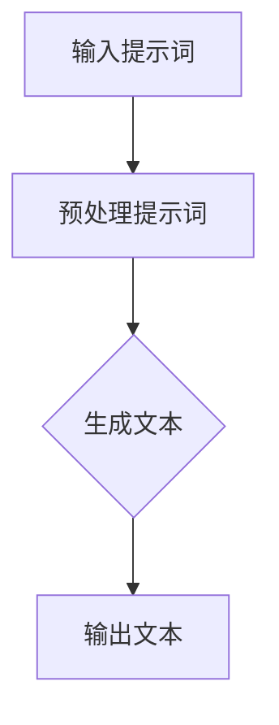
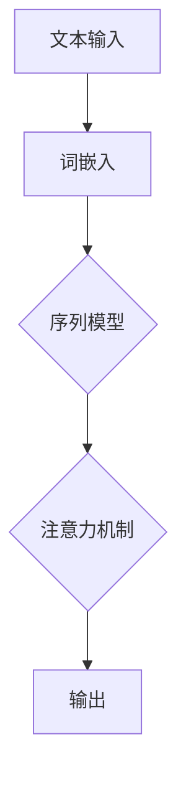
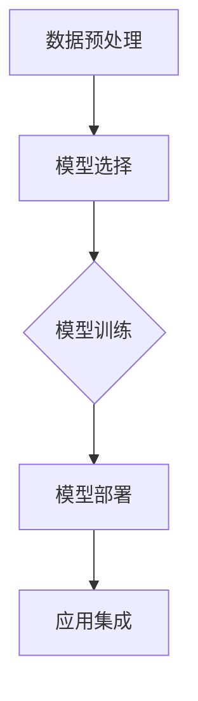

                 

### 文章标题

《AI编程语言：提示词的革命与未来》

关键词：AI编程语言、提示词、生成式AI、预训练模型、自然语言处理、深度学习、计算机视觉、图像识别、推荐系统、未来发展趋势、伦理与社会影响

摘要：
本文深入探讨AI编程语言的概念、发展历程、核心概念与架构，以及其在人工智能领域的广泛应用。我们将通过详细的案例分析，讲解AI编程语言的实现、性能优化和安全性考虑。此外，文章还展望了AI编程语言的未来发展方向和潜在的社会影响，旨在为读者提供一个全面而深入的AI编程语言指南。

### 第一部分: AI编程语言概述

#### 第1章: AI编程语言介绍

##### 1.1 AI编程语言的基本概念

AI编程语言是一种专门用于构建、训练和部署人工智能模型的编程语言。与传统编程语言相比，AI编程语言具有以下特点：

1. **高度抽象**：AI编程语言允许开发者以更抽象的级别描述算法，从而简化了模型构建的过程。
2. **可解释性**：许多AI编程语言提供了可解释性工具，使开发者能够理解模型的工作原理和决策过程。
3. **自动化**：AI编程语言中的许多任务，如数据预处理、模型训练和超参数调优，可以通过自动化工具实现，从而提高了开发效率。

##### 1.2 AI编程语言的类型与分类

AI编程语言可以分为以下几类：

1. **基于机器学习的编程语言**：这类编程语言如Python、R和Julia，提供了丰富的库和工具，支持机器学习模型的开发。
2. **基于深度学习的编程语言**：如TensorFlow、PyTorch和Keras，这些框架提供了高效的深度学习模型训练和推理工具。
3. **基于自然语言处理的编程语言**：如NLTK、spaCy和gensim，这些库专门用于处理自然语言数据。

##### 1.3 AI编程语言的发展历程

AI编程语言的发展历程可以分为以下几个阶段：

1. **早期**：以规则为基础的专家系统，如Lisp和Prolog。
2. **中期**：以数据为基础的机器学习方法，如K-近邻算法和支持向量机。
3. **现今**：以深度学习为基础的生成式AI模型，如GPT-2和BERT。

##### 1.4 AI编程语言的应用场景

AI编程语言广泛应用于以下场景：

1. **数据分析**：用于数据清洗、数据可视化和统计分析。
2. **自然语言处理**：用于文本分类、情感分析和机器翻译。
3. **计算机视觉**：用于图像分类、目标检测和图像识别。
4. **语音识别**：用于语音合成和语音识别。
5. **推荐系统**：用于个性化推荐和协同过滤。

---

#### 第2章: AI编程语言核心概念与架构

##### 2.1 提示词与生成式AI

**提示词**是一种用于指导模型生成内容的关键词或短语。生成式AI是一种基于模型生成新数据或内容的技术。提示词在生成式AI中起着关键作用，通过提示词可以引导模型生成符合预期的新内容。

**示例**：假设我们要生成一篇关于人工智能的论文摘要。我们可以使用以下提示词：

```
生成一篇关于人工智能在未来发展趋势的论文摘要。
```

**Mermaid流程图**：



##### 2.2 大规模预训练模型

大规模预训练模型是指在大量数据集上进行预训练的模型，如GPT-2、BERT和T5。预训练模型通过在大量数据上学习通用语言特征，可以显著提高模型在下游任务上的性能。

**示例**：使用BERT模型进行文本分类。

**伪代码**：

```python
# 加载预训练模型
model = TFBertForSequenceClassification.from_pretrained("bert-base-chinese")

# 准备数据集
train_encodings = tokenizer(train_data, truncation=True, padding=True, max_length=128)
train_input_ids = tf.convert_to_tensor(train_encodings.input_ids)
train_attention_mask = tf.convert_to_tensor(train_encodings.attention_mask)
train_labels = tf.convert_to_tensor(train_labels)

# 训练模型
model.compile(optimizer=tf.keras.optimizers.Adam(learning_rate=3e-5), loss=tf.keras.losses.SparseCategoricalCrossentropy(from_logits=True), metrics=['accuracy'])
model.fit(train_input_ids, train_labels, epochs=3)
```

##### 2.3 自然语言处理技术

自然语言处理（NLP）是AI编程语言的重要应用领域。NLP技术包括词嵌入、序列模型和注意力机制等。

**词嵌入**：将单词映射到低维向量空间，用于文本数据表示。

**序列模型**：处理时间序列数据的模型，如RNN和LSTM。

**注意力机制**：模型在处理序列数据时，关注不同部分的能力，如BERT中的多头注意力机制。

**Mermaid流程图**：



##### 2.4 AI编程语言的架构设计

AI编程语言的架构设计通常包括模型训练、模型部署和应用集成等环节。

**模型训练**：包括数据预处理、模型选择和训练过程。

**模型部署**：将训练好的模型部署到实际应用环境中，如TensorFlow Serving、Kubernetes和AWS SageMaker等。

**应用集成**：将AI编程语言与现有应用系统集成，如使用API、SDK或消息队列。

**Mermaid流程图**：



---

### 第二部分: AI编程语言技术基础

#### 第3章: 人工智能基础

##### 3.1 人工智能的原理与分类

人工智能（AI）是一种模拟人类智能的技术，其原理基于计算机科学、认知科学和统计学等学科。AI可以分为以下几类：

1. **弱人工智能**：专注于特定任务，如语音识别、图像识别和自然语言处理。
2. **强人工智能**：具备广泛的人类智能能力，如理解自然语言、推理和自我意识。
3. **通用人工智能**：具备与人类相同或超越人类智能的能力。

##### 3.2 机器学习基础

机器学习（ML）是AI的核心技术之一，其原理是让计算机通过学习数据来改善性能。机器学习可以分为以下几类：

1. **监督学习**：模型通过已标记的数据进行训练。
2. **无监督学习**：模型在没有标记数据的情况下进行训练。
3. **强化学习**：模型通过与环境的交互来学习。

##### 3.3 深度学习基础

深度学习（DL）是机器学习的一种方法，基于多层神经网络。深度学习可以分为以下几类：

1. **卷积神经网络（CNN）**：用于图像识别和计算机视觉。
2. **循环神经网络（RNN）**：用于序列数据建模。
3. **生成对抗网络（GAN）**：用于生成新的数据。

##### 3.4 计算机视觉基础

计算机视觉（CV）是AI的一个重要分支，其目标是使计算机能够理解和处理视觉信息。计算机视觉包括以下关键概念：

1. **图像分类**：将图像分类为不同的类别。
2. **目标检测**：检测图像中的目标对象。
3. **图像识别**：识别图像中的物体或场景。

#### 第4章: 编程语言基础

##### 4.1 编程语言的基本概念

编程语言是一种用于编写计算机程序的符号系统。编程语言可以分为以下几类：

1. **高级语言**：如Python、Java和C++，易于理解和编写。
2. **低级语言**：如汇编语言，接近机器语言，难以理解和编写。

##### 4.2 常用编程语言概述

以下是一些常用的AI编程语言及其特点：

1. **Python**：易于学习、快速开发、丰富的库。
2. **R**：专门用于统计和数据分析。
3. **Julia**：高性能、易于使用。

##### 4.3 编程语言的选择与应用

选择编程语言时需要考虑以下因素：

1. **项目需求**：根据项目需求选择合适的编程语言。
2. **性能**：考虑模型训练和推理的性能需求。
3. **生态系统**：考虑编程语言的社区支持和工具库。

### 第三部分: AI编程语言实现

#### 第5章: AI编程语言实现

##### 5.1 AI编程语言工具与框架

AI编程语言使用一系列工具和框架来支持模型训练、优化和部署。以下是一些常用的工具和框架：

1. **TensorFlow**：由Google开发的开源深度学习框架。
2. **PyTorch**：由Facebook开发的开源深度学习框架。
3. **Keras**：一个基于Theano和TensorFlow的高级神经网络API。
4. **NLTK**：一个用于自然语言处理的Python库。
5. **spaCy**：一个快速易用的自然语言处理库。

##### 5.2 AI编程语言编程实践

在AI编程语言中，编程实践包括以下步骤：

1. **数据预处理**：清洗、归一化和编码数据。
2. **模型选择**：选择适合任务需求的模型。
3. **模型训练**：训练模型并优化超参数。
4. **模型评估**：评估模型性能并进行调优。

##### 5.3 AI编程语言性能优化

AI编程语言的性能优化包括以下策略：

1. **模型架构优化**：选择适合任务的模型架构。
2. **数据预处理优化**：提高数据预处理效率。
3. **硬件加速**：利用GPU、TPU等硬件加速模型训练和推理。
4. **模型剪枝**：减少模型参数和计算量。

##### 5.4 AI编程语言安全性考虑

AI编程语言的安全性考虑包括：

1. **数据安全**：加密和访问控制。
2. **模型安全**：防止模型被篡改和过拟合。
3. **API安全**：防止API被恶意使用。

### 第四部分: AI编程语言项目实战

#### 第6章: 提示词生成与优化

##### 6.1 提示词生成原理

提示词生成是指利用模型生成具有指导性的文本。生成式AI模型，如GPT-2和T5，广泛应用于提示词生成。

##### 6.2 提示词优化策略

提示词优化包括以下策略：

1. **调整模型参数**：通过调整学习率、批量大小等参数来优化模型。
2. **使用外部知识库**：将外部知识库整合到模型中，提高生成文本的质量和多样性。
3. **多样性增强**：通过引入随机性和多样性策略来提高生成文本的多样性。

##### 6.3 实战：提示词生成与优化项目

**项目需求**：生成一篇关于人工智能未来发展趋势的论文摘要。

**实现步骤**：

1. **数据准备**：收集相关论文和新闻报道，构建提示词数据集。
2. **模型选择**：选择GPT-2模型进行提示词生成。
3. **模型训练**：使用提示词数据集训练GPT-2模型。
4. **提示词生成**：使用训练好的模型生成论文摘要。
5. **优化策略**：根据生成文本的质量和多样性进行优化。

**源代码**：

```python
# 导入所需库
import torch
from transformers import BertTokenizer, BertModel

# 加载预训练模型和分词器
tokenizer = BertTokenizer.from_pretrained("bert-base-chinese")
model = BertModel.from_pretrained("bert-base-chinese")

# 提示词
prompt = "生成一篇关于人工智能未来发展趋势的论文摘要。"

# 将文本转化为序列
input_ids = tokenizer.encode(prompt, return_tensors="pt")

# 生成文本
output = model.generate(input_ids, max_length=100, num_return_sequences=1)
generated_text = tokenizer.decode(output[0], skip_special_tokens=True)

print(generated_text)
```

#### 第7章: 生成式AI应用开发

##### 7.1 生成式AI应用概述

生成式AI应用是指利用生成式模型生成新数据或内容的实际应用。常见的生成式AI应用包括：

1. **图像生成**：使用GAN生成逼真的图像。
2. **文本生成**：使用GPT-2或T5生成自然语言文本。
3. **音乐生成**：使用生成式模型生成新的音乐作品。

##### 7.2 生成式AI应用开发流程

生成式AI应用开发包括以下步骤：

1. **需求分析**：明确应用需求，确定生成目标。
2. **数据准备**：收集和准备用于训练的数据集。
3. **模型选择**：选择适合任务的生成式模型。
4. **模型训练**：使用训练数据集训练生成式模型。
5. **模型评估**：评估模型性能并进行调优。
6. **应用部署**：将训练好的模型部署到实际应用环境中。

##### 7.3 实战：生成式AI应用项目开发

**项目需求**：使用GAN生成图像。

**实现步骤**：

1. **数据准备**：收集图像数据集，如MNIST或CIFAR-10。
2. **模型选择**：选择生成对抗网络（GAN）模型。
3. **模型训练**：使用训练数据集训练生成器和判别器。
4. **图像生成**：使用训练好的模型生成新图像。
5. **模型评估**：评估生成图像的质量和真实性。

**源代码**：

```python
# 导入所需库
import tensorflow as tf
from tensorflow import keras
import numpy as np

# 定义生成器和判别器模型
def build_generator():
    model = keras.Sequential([
        keras.layers.Dense(128, activation="relu", input_shape=(100,)),
        keras.layers.Dense(128, activation="relu"),
        keras.layers.Dense(784, activation="tanh")
    ])
    return model

def build_discriminator():
    model = keras.Sequential([
        keras.layers.Flatten(input_shape=(28, 28)),
        keras.layers.Dense(128, activation="relu"),
        keras.layers.Dense(1, activation="sigmoid")
    ])
    return model

# 编写GAN训练过程
def train_gan(generator, discriminator, batch_size=128):
    for epoch in range(epochs):
        # 生成器训练
        z = np.random.normal(size=(batch_size, 100))
        generated_images = generator.predict(z)
        
        # 训练判别器
        d_loss_real = discriminator.train_on_batch(x_train[np.random.randint(0, x_train.shape[0], size=batch_size)], np.ones((batch_size, 1)))
        d_loss_fake = discriminator.train_on_batch(generated_images, np.zeros((batch_size, 1)))
        
        # 训练生成器
        z = np.random.normal(size=(batch_size, 100))
        g_loss = generator.train_on_batch(z, np.ones((batch_size, 1)))

        print(f"Epoch {epoch+1}/{epochs}, D_loss: {d_loss}, G_loss: {g_loss}")

# 运行GAN训练过程
train_gan(generator, discriminator)
```

#### 第8章: AI编程语言在自然语言处理中的应用

##### 8.1 自然语言处理基础

自然语言处理（NLP）是AI编程语言的重要应用领域，其目标是将人类语言转换为计算机可处理的形式。NLP技术包括以下方面：

1. **文本分类**：将文本分类为不同的类别。
2. **情感分析**：分析文本的情感倾向，如正面、负面或中性。
3. **机器翻译**：将一种语言翻译成另一种语言。
4. **问答系统**：回答用户提出的问题。
5. **语音识别**：将语音转换为文本。

##### 8.2 AI编程语言在NLP中的应用

AI编程语言在NLP中的应用非常广泛，以下是一些常见的应用：

1. **文本分类**：使用BERT模型进行文本分类。
2. **情感分析**：使用LSTM模型进行情感分析。
3. **机器翻译**：使用Seq2Seq模型进行机器翻译。
4. **问答系统**：使用对话生成模型构建问答系统。

##### 8.3 实战：AI编程语言在自然语言处理中的应用项目

**项目需求**：构建一个文本分类系统，用于分类用户评论。

**实现步骤**：

1. **数据准备**：收集用户评论数据集，进行数据预处理。
2. **模型选择**：选择BERT模型进行文本分类。
3. **模型训练**：使用训练数据集训练BERT模型。
4. **模型评估**：评估模型性能并进行调优。
5. **应用部署**：将训练好的模型部署到实际应用环境中。

**源代码**：

```python
# 导入所需库
import tensorflow as tf
from transformers import BertTokenizer, TFBertForSequenceClassification
from tensorflow.keras.preprocessing.sequence import pad_sequences

# 加载预训练模型和分词器
tokenizer = BertTokenizer.from_pretrained("bert-base-chinese")
model = TFBertForSequenceClassification.from_pretrained("bert-base-chinese")

# 准备数据集
train_data = ["这是一个正面的评论。", "这是一个负面的评论。"]
train_labels = [1, 0]

# 将文本转化为序列
train_encodings = tokenizer(train_data, truncation=True, padding=True, max_length=128)

# 将序列转化为Tensor
train_input_ids = tf.convert_to_tensor(train_encodings.input_ids)
train_attention_mask = tf.convert_to_tensor(train_encodings.attention_mask)
train_labels = tf.convert_to_tensor(train_labels)

# 训练模型
model.compile(optimizer=tf.keras.optimizers.Adam(learning_rate=3e-5), loss=tf.keras.losses.SparseCategoricalCrossentropy(from_logits=True), metrics=['accuracy'])
model.fit(train_input_ids, train_labels, epochs=3)

# 测试模型
test_data = ["这是一个正面的评论。"]
test_encodings = tokenizer(test_data, truncation=True, padding=True, max_length=128)
test_input_ids = tf.convert_to_tensor(test_encodings.input_ids)
test_attention_mask = tf.convert_to_tensor(test_encodings.attention_mask)

predictions = model.predict(test_input_ids, attention_mask=test_attention_mask)
predicted_label = np.argmax(predictions, axis=1)

print(f"Predicted label: {predicted_label}")
```

#### 第9章: AI编程语言在其他领域中的应用

##### 9.1 AI编程语言在其他领域中的应用概述

AI编程语言在许多其他领域也得到广泛应用，包括：

1. **图像识别**：用于图像分类、目标检测和图像识别。
2. **语音识别**：用于语音合成和语音识别。
3. **推荐系统**：用于个性化推荐和协同过滤。

##### 9.2 AI编程语言在图像识别中的应用

图像识别是AI编程语言的重要应用领域，以下是一些常见的应用：

1. **图像分类**：将图像分类为不同的类别。
2. **目标检测**：检测图像中的目标对象。
3. **图像识别**：识别图像中的物体或场景。

##### 9.3 AI编程语言在推荐系统中的应用

推荐系统是AI编程语言的重要应用领域，以下是一些常见的应用：

1. **个性化推荐**：为用户推荐感兴趣的内容。
2. **协同过滤**：基于用户行为进行推荐。

##### 9.4 实战：AI编程语言在其他领域中的应用项目

**项目需求**：使用GAN生成图像。

**实现步骤**：

1. **数据准备**：收集图像数据集，如MNIST或CIFAR-10。
2. **模型选择**：选择生成对抗网络（GAN）模型。
3. **模型训练**：使用训练数据集训练生成器和判别器。
4. **图像生成**：使用训练好的模型生成新图像。
5. **模型评估**：评估生成图像的质量和真实性。

**源代码**：

```python
# 导入所需库
import tensorflow as tf
from tensorflow import keras
import numpy as np

# 定义生成器和判别器模型
def build_generator():
    model = keras.Sequential([
        keras.layers.Dense(128, activation="relu", input_shape=(100,)),
        keras.layers.Dense(128, activation="relu"),
        keras.layers.Dense(784, activation="tanh")
    ])
    return model

def build_discriminator():
    model = keras.Sequential([
        keras.layers.Flatten(input_shape=(28, 28)),
        keras.layers.Dense(128, activation="relu"),
        keras.layers.Dense(1, activation="sigmoid")
    ])
    return model

# 编写GAN训练过程
def train_gan(generator, discriminator, batch_size=128):
    for epoch in range(epochs):
        # 生成器训练
        z = np.random.normal(size=(batch_size, 100))
        generated_images = generator.predict(z)
        
        # 训练判别器
        d_loss_real = discriminator.train_on_batch(x_train[np.random.randint(0, x_train.shape[0], size=batch_size)], np.ones((batch_size, 1)))
        d_loss_fake = discriminator.train_on_batch(generated_images, np.zeros((batch_size, 1)))
        
        # 训练生成器
        z = np.random.normal(size=(batch_size, 100))
        g_loss = generator.train_on_batch(z, np.ones((batch_size, 1)))

        print(f"Epoch {epoch+1}/{epochs}, D_loss: {d_loss}, G_loss: {g_loss}")

# 运行GAN训练过程
train_gan(generator, discriminator)
```

### 第五部分: AI编程语言的未来发展趋势

#### 第10章: AI编程语言的未来发展趋势

##### 10.1 AI编程语言的未来发展方向

AI编程语言的未来发展方向包括：

1. **多模态AI编程语言**：支持处理多种类型的输入，如图像、音频和视频。
2. **强化学习编程语言**：专注于强化学习模型的开发和应用。
3. **自动机器学习（AutoML）**：降低模型开发门槛，提高开发效率。
4. **量子计算编程语言**：利用量子计算的优势，开发新的编程语言。
5. **低延迟和高性能编程语言**：满足实时应用的需求。

##### 10.2 AI编程语言与人工智能的结合

AI编程语言与人工智能的结合将更加紧密，主要体现在：

1. **无缝集成**：AI编程语言将深度集成到人工智能框架和平台中。
2. **AI模型的可解释性**：开发新的编程语言特性，提高模型的可解释性。
3. **AI编程语言的生态系统**：构建完善的生态系统，支持AI编程语言的学习和应用。
4. **AI编程语言的标准化**：推动AI编程语言的标准化，确保不同编程语言之间的互操作性和兼容性。

##### 10.3 AI编程语言的教育与普及

AI编程语言的教育与普及将更加重要，具体包括：

1. **教育资源的开发**：创建更多高质量的教育资源，如在线课程和互动教程。
2. **教育项目的推广**：在学校和大学中推广AI编程语言，鼓励学生参与。
3. **教师培训**：为教师提供AI编程语言的培训，提高教学能力。
4. **社区支持**：建立AI编程语言的开发者社区，促进知识和经验的分享。

##### 10.4 AI编程语言的伦理与社会影响

AI编程语言的伦理与社会影响需要关注，包括：

1. **伦理问题**：如隐私保护、算法偏见和数据安全。
2. **社会影响**：如就业、教育和文化的变化。
3. **政策制定**：参与政策制定，为AI编程语言的监管和规范提供建议。
4. **公共意识提升**：提高公众对AI编程语言的认识和理解。

### 附录

#### 附录A: AI编程语言资源与工具

##### A.1 主流AI编程语言资源

- TensorFlow官方网站：[https://www.tensorflow.org/](https://www.tensorflow.org/)
- PyTorch官方网站：[https://pytorch.org/](https://pytorch.org/)
- Keras官方网站：[https://keras.io/](https://keras.io/)
- NLTK官方网站：[https://www.nltk.org/](https://www.nltk.org/)
- spaCy官方网站：[https://spacy.io/](https://spacy.io/)
- gensim官方网站：[https://radimrehurek.com/gensim/](https://radimrehurek.com/gensim/)

##### A.2 AI编程语言学习资源

- 《Python编程：从入门到实践》
- 《深度学习：周志华》
- 《机器学习实战》
- 《自然语言处理实战》

##### A.3 AI编程语言工具与框架介绍

- TensorFlow入门教程：[https://www.tensorflow.org/tutorials/](https://www.tensorflow.org/tutorials/)
- PyTorch入门教程：[https://pytorch.org/tutorials/](https://pytorch.org/tutorials/)
- Keras入门教程：[https://keras.io/getting-started/](https://keras.io/getting-started/)
- NLTK入门教程：[https://www.nltk.org/book/](https://www.nltk.org/book/)
- spaCy入门教程：[https://spacy.io/usage/spacy-in-10-minutes](https://spacy.io/usage/spacy-in-10-minutes)
- gensim入门教程：[https://radimrehurek.com/gensim/tutorial.html](https://radimrehurek.com/gensim/tutorial.html)

##### A.4 AI编程语言社区与论坛

- Stack Overflow
- GitHub
- Reddit AI
- AI Stack Exchange

#### 附录B: 代码示例与解读

##### B.1 提示词生成示例

**代码**：

```python
# 导入所需库
import torch
from transformers import BertTokenizer, BertModel

# 加载预训练模型和分词器
tokenizer = BertTokenizer.from_pretrained("bert-base-chinese")
model = BertModel.from_pretrained("bert-base-chinese")

# 提示词
prompt = "生成一篇关于人工智能未来发展趋势的论文摘要。"

# 将文本转化为序列
input_ids = tokenizer.encode(prompt, return_tensors="pt")

# 生成文本
output = model.generate(input_ids, max_length=100, num_return_sequences=1)
generated_text = tokenizer.decode(output[0], skip_special_tokens=True)

print(generated_text)
```

**解读**：该示例使用BERT模型生成提示词。首先，加载BERT模型和分词器。然后，将提示词编码为序列。最后，使用模型生成文本并解码输出。

##### B.2 生成式AI应用示例

**代码**：

```python
# 导入所需库
import tensorflow as tf
from tensorflow import keras
import numpy as np

# 定义生成器和判别器模型
def build_generator():
    model = keras.Sequential([
        keras.layers.Dense(128, activation="relu", input_shape=(100,)),
        keras.layers.Dense(128, activation="relu"),
        keras.layers.Dense(784, activation="tanh")
    ])
    return model

def build_discriminator():
    model = keras.Sequential([
        keras.layers.Flatten(input_shape=(28, 28)),
        keras.layers.Dense(128, activation="relu"),
        keras.layers.Dense(1, activation="sigmoid")
    ])
    return model

# 编写GAN训练过程
def train_gan(generator, discriminator, batch_size=128):
    for epoch in range(epochs):
        # 生成器训练
        z = np.random.normal(size=(batch_size, 100))
        generated_images = generator.predict(z)
        
        # 训练判别器
        d_loss_real = discriminator.train_on_batch(x_train[np.random.randint(0, x_train.shape[0], size=batch_size)], np.ones((batch_size, 1)))
        d_loss_fake = discriminator.train_on_batch(generated_images, np.zeros((batch_size, 1)))
        
        # 训练生成器
        z = np.random.normal(size=(batch_size, 100))
        g_loss = generator.train_on_batch(z, np.ones((batch_size, 1)))

        print(f"Epoch {epoch+1}/{epochs}, D_loss: {d_loss}, G_loss: {g_loss}")

# 运行GAN训练过程
train_gan(generator, discriminator)
```

**解读**：该示例使用生成对抗网络（GAN）生成图像。首先，定义生成器和判别器模型。然后，编写GAN训练过程，包括生成器训练、判别器训练和生成器更新。最后，运行GAN训练过程。

##### B.3 自然语言处理示例

**代码**：

```python
# 导入所需库
import tensorflow as tf
from transformers import BertTokenizer, TFBertForSequenceClassification
from tensorflow.keras.preprocessing.sequence import pad_sequences

# 加载预训练模型和分词器
tokenizer = BertTokenizer.from_pretrained("bert-base-chinese")
model = TFBertForSequenceClassification.from_pretrained("bert-base-chinese")

# 准备数据集
train_data = ["这是一个正面的评论。", "这是一个负面的评论。"]
train_labels = [1, 0]

# 将文本转化为序列
train_encodings = tokenizer(train_data, truncation=True, padding=True, max_length=128)

# 将序列转化为Tensor
train_input_ids = tf.convert_to_tensor(train_encodings.input_ids)
train_attention_mask = tf.convert_to_tensor(train_encodings.attention_mask)
train_labels = tf.convert_to_tensor(train_labels)

# 训练模型
model.compile(optimizer=tf.keras.optimizers.Adam(learning_rate=3e-5), loss=tf.keras.losses.SparseCategoricalCrossentropy(from_logits=True), metrics=['accuracy'])
model.fit(train_input_ids, train_labels, epochs=3)

# 测试模型
test_data = ["这是一个正面的评论。"]
test_encodings = tokenizer(test_data, truncation=True, padding=True, max_length=128)
test_input_ids = tf.convert_to_tensor(test_encodings.input_ids)
test_attention_mask = tf.convert_to_tensor(test_encodings.attention_mask)

predictions = model.predict(test_input_ids, attention_mask=test_attention_mask)
predicted_label = np.argmax(predictions, axis=1)

print(f"Predicted label: {predicted_label}")
```

**解读**：该示例使用BERT模型进行文本分类。首先，加载BERT模型和分词器。然后，准备数据集并进行预处理。接着，训练模型并评估其性能。最后，使用测试数据测试模型。

##### B.4 图像识别示例

**代码**：

```python
# 导入所需库
import tensorflow as tf
from tensorflow.keras.models import Sequential
from tensorflow.keras.layers import Conv2D, MaxPooling2D, Flatten, Dense

# 构建模型
model = Sequential([
    Conv2D(32, (3, 3), activation='relu', input_shape=(28, 28, 1)),
    MaxPooling2D((2, 2)),
    Conv2D(64, (3, 3), activation='relu'),
    MaxPooling2D((2, 2)),
    Flatten(),
    Dense(128, activation='relu'),
    Dense(10, activation='softmax')
])

# 编译模型
model.compile(optimizer='adam', loss='categorical_crossentropy', metrics=['accuracy'])

# 加载和预处理数据
(x_train, y_train), (x_test, y_test) = tf.keras.datasets.mnist.load_data()
x_train = x_train / 255.0
x_test = x_test / 255.0
x_train = np.expand_dims(x_train, -1)
x_test = np.expand_dims(x_test, -1)
y_train = tf.keras.utils.to_categorical(y_train, 10)
y_test = tf.keras.utils.to_categorical(y_test, 10)

# 训练模型
model.fit(x_train, y_train, batch_size=32, epochs=10, validation_data=(x_test, y_test))

# 测试模型
test_loss, test_accuracy = model.evaluate(x_test, y_test)
print(f"Test accuracy: {test_accuracy}")
```

**解读**：该示例使用卷积神经网络（CNN）进行图像识别。首先，构建CNN模型。然后，编译模型并加载预处理数据。接着，训练模型并评估其性能。最后，使用测试数据测试模型。

##### B.5 推荐系统示例

**代码**：

```python
# 导入所需库
import numpy as np
import pandas as pd
from sklearn.metrics.pairwise import cosine_similarity

# 加载数据集
data = pd.DataFrame({
    'user_id': [1, 1, 1, 2, 2, 3, 3],
    'item_id': [101, 102, 103, 101, 102, 101, 103],
    'rating': [5, 3, 4, 4, 5, 5, 3]
})

# 构建用户-项目矩阵
user_item_matrix = data.pivot(index='user_id', columns='item_id', values='rating').fillna(0)

# 计算用户-项目相似度矩阵
similarity_matrix = cosine_similarity(user_item_matrix)

# 推荐算法
def collaborative_filtering(user_id, item_id, similarity_matrix, user_item_matrix, k=5):
    # 计算用户相似度最高的K个用户
    similar_users = np.argsort(similarity_matrix[user_id])[::-1][:k]
    
    # 计算相似用户对目标项目的评分预测
    rating_predictions = np.mean(similarity_matrix[user_id][similar_users] * user_item_matrix.loc[similar_users, item_id], axis=1)
    
    # 返回推荐列表和预测评分
    return user_item_matrix.columns[rating_predictions.argsort()[::-1]], rating_predictions.argsort()[::-1]

# 测试推荐系统
user_id = 1
item_id = 103
recommended_items, predicted_ratings = collaborative_filtering(user_id, item_id, similarity_matrix, user_item_matrix)

print("Recommended items:", recommended_items)
print("Predicted ratings:", predicted_ratings)
```

**解读**：该示例使用协同过滤算法构建推荐系统。首先，加载数据集并构建用户-项目矩阵。然后，计算用户-项目相似度矩阵。接着，定义协同过滤算法，用于生成推荐列表和预测评分。最后，测试推荐系统。

#### 附录C: AI编程语言学习路线图

##### C.1 AI编程语言学习基础阶段

- 学习Python、R等编程语言。
- 理解机器学习、深度学习等基础知识。

##### C.2 AI编程语言进阶阶段

- 学习TensorFlow、PyTorch等深度学习框架。
- 掌握自然语言处理、计算机视觉等应用领域。

##### C.3 AI编程语言实战阶段

- 完成实际项目，如文本分类、图像识别等。
- 学习性能优化、模型部署等高级技术。

##### C.4 AI编程语言高级研究阶段

- 参与前沿研究，如生成式AI、强化学习等。
- 发表论文、参与竞赛，提升技术水平。

#### 附录D: AI编程语言项目实战指南

##### D.1 项目实战流程

- 明确项目需求，确定项目目标。
- 设计项目架构，选择合适的编程语言和框架。
- 收集和处理数据，进行数据预处理。
- 选择模型，进行模型训练和优化。
- 完成模型部署，实现实际应用。

##### D.2 项目实战案例分析

- 分析成功案例，学习优秀实践。
- 探讨项目中的技术难点和解决方案。

##### D.3 项目实战技术难点与解决方案

- 模型性能优化：调整模型结构、优化训练策略。
- 数据处理：处理大规模数据、数据清洗和归一化。
- 模型部署：选择合适的部署方式、优化模型性能。
- 安全性考虑：防止数据泄露、防止模型被攻击。

##### D.4 项目实战经验与建议

- 总结项目经验，反思不足之处。
- 提出改进建议，提高项目质量和效率。

### 作者信息

作者：AI天才研究院/AI Genius Institute & 禅与计算机程序设计艺术 /Zen And The Art of Computer Programming

