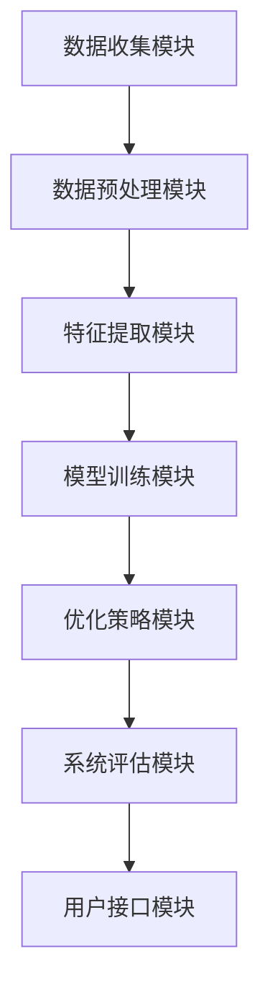
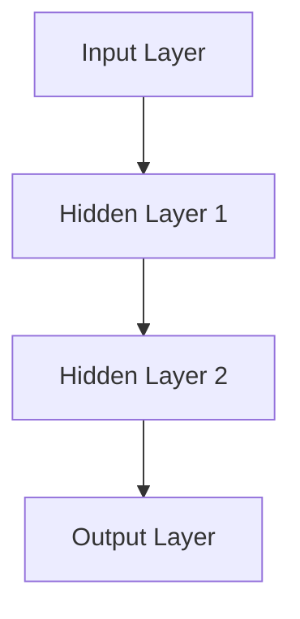

                 

## 文章标题：AI驱动的产品设计优化系统

### 关键词：
- AI产品设计优化
- 机器学习
- 深度学习
- 优化算法
- 强化学习

### 摘要：

本文旨在探讨AI驱动的产品设计优化系统的架构、核心算法、数学模型以及项目实战。文章首先介绍了AI在产品设计优化中的应用，随后详细阐述了系统的基础架构和主要组件。接着，我们深入讲解了机器学习、深度学习和强化学习等核心算法的原理，并通过伪代码进行了详细阐述。此外，本文还介绍了常见的数学模型和其在设计优化中的应用，并提供了具体的实战案例，展示了如何实现和优化产品设计。最后，文章对系统的未来发展趋势和挑战进行了展望，并提出了一些建议。

----------------------------------------------------------------

### 第一部分：AI驱动的产品设计优化系统基础

#### 第1章：AI驱动的产品设计优化系统概述

##### 1.1 AI在产品设计优化中的应用概述

AI在产品设计优化中的应用已经成为现代工业设计的关键趋势。通过利用AI技术，设计师可以自动化许多传统上繁琐和重复性的任务，从而提高设计效率和产品质量。AI驱动的产品设计优化系统主要包括以下几个应用方向：

1. **需求分析**：AI技术可以自动分析用户需求和市场趋势，为产品设计提供数据支持。
2. **设计生成**：利用生成对抗网络（GAN）和深度学习技术，AI能够生成新颖且符合用户需求的设计方案。
3. **优化设计**：通过机器学习和优化算法，AI可以自动调整产品设计参数，以实现最佳性能。
4. **质量控制**：AI技术可以检测产品缺陷，提高生产过程中产品的质量。

##### 1.1.1 AI在产品设计优化中的角色

在产品设计优化中，AI主要扮演以下角色：

1. **数据分析师**：AI可以自动收集和分析大量设计数据，为设计决策提供数据支持。
2. **优化专家**：AI能够通过机器学习和优化算法，自动调整设计参数，实现最优设计。
3. **质量监控员**：AI可以实时监控生产过程，检测产品缺陷，确保产品质量。
4. **设计师助理**：AI可以帮助设计师快速生成和优化设计方案，提高设计效率。

##### 1.1.2 AI驱动的产品设计优化的优势

AI驱动的产品设计优化具有以下优势：

1. **高效性**：AI可以自动化许多设计任务，大大提高了设计效率。
2. **精确性**：AI能够通过机器学习和优化算法，精确调整设计参数，实现最优设计。
3. **创新性**：AI可以生成新颖的设计方案，推动产品设计创新。
4. **成本效益**：通过自动化设计任务，降低了人力成本，提高了经济效益。

##### 1.1.3 系统架构与主要组件

一个典型的AI驱动的产品设计优化系统通常包括以下几个主要组件：

1. **数据收集模块**：负责收集与产品设计相关的各种数据，如用户反馈、市场调研数据、产品性能数据等。
2. **数据预处理模块**：对收集到的数据进行清洗、归一化等操作，确保数据的质量和一致性。
3. **特征提取模块**：从预处理后的数据中提取有助于模型训练的特征。
4. **模型训练模块**：使用提取出的特征进行机器学习和深度学习模型的训练。
5. **优化策略模块**：根据模型训练的结果，提出优化产品设计的方法和策略。
6. **系统评估模块**：对AI驱动的产品设计优化系统的性能进行评估。
7. **用户接口模块**：提供用户与系统的交互界面。

##### Mermaid流程图：



##### 关键组件详解

1. **数据收集模块**：该模块的主要功能是收集与产品设计相关的各种数据。数据来源可以包括用户反馈、市场调研、产品性能数据等。数据收集模块需要确保数据的准确性和完整性，以便后续的机器学习和深度学习处理。

2. **数据预处理模块**：该模块对收集到的数据进行清洗、归一化等操作，确保数据的质量和一致性。数据预处理模块通常包括数据清洗（去除噪声和缺失值）、数据归一化（将不同数据范围的数据统一到一个标准范围内）和数据转换（将不同类型的数据转换为适合机器学习和深度学习处理的形式）。

3. **特征提取模块**：该模块从预处理后的数据中提取有助于模型训练的特征。特征提取是机器学习和深度学习中的关键步骤，其质量直接影响到模型的性能。特征提取模块包括时间序列特征提取、图像特征提取、文本特征提取等。

4. **模型训练模块**：该模块使用提取出的特征进行机器学习和深度学习模型的训练。该模块包括选择合适的模型架构、优化算法和超参数设置等。常见的机器学习模型有线性回归、支持向量机、决策树等；深度学习模型有卷积神经网络（CNN）、循环神经网络（RNN）、长短期记忆网络（LSTM）等。

5. **优化策略模块**：该模块根据模型训练的结果，提出优化产品设计的方法和策略。该模块需要考虑如何根据用户反馈、市场趋势和产品性能指标来调整产品设计，以达到最佳效果。

6. **系统评估模块**：该模块对AI驱动的产品设计优化系统的性能进行评估，包括模型准确率、优化效果、系统稳定性等。评估结果用于指导系统的优化和改进。

7. **用户接口模块**：该模块提供用户与系统的交互界面，用户可以通过该界面查看系统的运行状态、优化策略和建议，以及调整系统的参数。

#### 第2章：基础概念与术语

##### 2.1 机器学习基本概念

机器学习是一种通过算法从数据中自动学习规律，从而进行预测和决策的技术。在机器学习过程中，主要包括以下几个基本概念：

1. **特征（Feature）**：特征是用于描述数据的属性或维度。在图像识别任务中，特征可以是像素值；在文本分类任务中，特征可以是单词的词频。
2. **模型（Model）**：模型是机器学习算法的核心部分，它通过学习数据中的规律，生成预测结果。常见的模型有线性回归、决策树、支持向量机等。
3. **损失函数（Loss Function）**：损失函数用于衡量模型预测结果与真实结果之间的差异。常用的损失函数有均方误差（MSE）、交叉熵损失（Cross-Entropy Loss）等。
4. **优化算法（Optimization Algorithm）**：优化算法用于调整模型参数，以最小化损失函数。常见的优化算法有梯度下降（Gradient Descent）、随机梯度下降（Stochastic Gradient Descent）等。

##### 2.2 深度学习原理简介

深度学习是一种基于多层神经网络的学习方法，它通过多层非线性变换来提取数据的特征。深度学习的核心原理包括：

1. **神经网络（Neural Network）**：神经网络是一种由大量神经元组成的计算模型。每个神经元都与其他神经元相连，并通过权重和偏置来传递信息。
2. **反向传播算法（Backpropagation）**：反向传播算法是一种用于训练神经网络的优化算法。它通过计算损失函数关于模型参数的梯度，并使用梯度下降法来调整模型参数。
3. **激活函数（Activation Function）**：激活函数用于引入非线性因素，使得神经网络能够学习和表示复杂的非线性关系。常见的激活函数有sigmoid、ReLU、Tanh等。

##### 2.3 数据预处理技术

数据预处理是机器学习和深度学习任务中至关重要的一步。数据预处理的主要目标包括：

1. **数据清洗（Data Cleaning）**：数据清洗是指去除数据中的噪声和异常值，确保数据的质量。常见的数据清洗方法包括缺失值填充、异常值处理等。
2. **数据归一化（Data Normalization）**：数据归一化是指将不同数据范围的数据统一到一个标准范围内，以消除数据之间的尺度差异。常见的数据归一化方法包括最小-最大规范化、Z-score规范化等。
3. **数据增强（Data Augmentation）**：数据增强是指通过增加数据的多样性来提高模型的泛化能力。常见的数据增强方法包括旋转、翻转、缩放、裁剪等。

##### 当前研究进展与未来趋势

AI驱动的产品设计优化系统的研究正在快速发展。当前的研究进展主要体现在以下几个方面：

1. **算法优化**：研究者们不断探索新的机器学习和深度学习算法，以提高设计优化的效率和准确性。
2. **多模态数据融合**：将不同类型的数据（如文本、图像、语音等）进行融合，以提供更全面的设计优化信息。
3. **强化学习应用**：强化学习在产品设计优化中的应用逐渐增多，特别是在交互式设计优化方面。
4. **伦理与隐私问题**：随着AI技术的应用，伦理和隐私问题越来越受到关注。研究者们开始探索如何在设计优化中平衡算法性能和伦理隐私。

未来的发展趋势包括：

1. **智能化设计**：AI驱动的产品设计优化系统将更加智能化，能够自动适应不同的设计环境和需求。
2. **定制化设计**：AI技术将帮助设计师实现更加定制化的产品设计，满足不同用户的需求。
3. **协同设计**：AI驱动的产品设计优化系统将与其他设计工具和平台集成，实现更高效的设计协同。
4. **可持续设计**：AI技术将助力产品设计实现更高的可持续性，降低对环境的影响。

##### 伦理与隐私问题探讨

在AI驱动的产品设计优化系统中，伦理和隐私问题是一个重要且复杂的挑战。以下是一些主要的伦理和隐私问题：

1. **数据隐私**：设计优化系统需要收集和处理大量用户数据，如何保护用户的隐私成为一个关键问题。
2. **算法透明性**：设计优化的算法和决策过程需要透明，以便用户理解和监督。
3. **算法偏见**：如果算法存在偏见，可能会导致不公平的设计决策，需要采取措施进行校正。
4. **责任归属**：在AI驱动的产品设计优化中，如何确定算法和设计师之间的责任归属是一个挑战。

为了解决这些问题，研究者们提出了一些解决方案，如数据匿名化、算法透明化、公平性评估等。同时，政策和法规的制定也在逐步完善，以规范AI技术的应用。

##### 总结

本章介绍了AI驱动的产品设计优化系统的基础概念和术语，包括机器学习、深度学习、数据预处理等核心概念。我们还探讨了当前的研究进展和未来趋势，以及伦理和隐私问题。这些基础知识和概念为后续章节的深入讨论奠定了基础。

## 第二部分：AI驱动的产品设计优化方法

### 第3章：数据分析与特征提取

在AI驱动的产品设计优化系统中，数据分析和特征提取是关键环节。通过对大量设计数据的分析，我们可以提取出有助于优化设计的关键特征，从而提升设计质量和效率。本章将详细介绍数据分析与特征提取的方法和技术，包括数据收集与预处理、特征提取技术以及时间序列特征提取和图像特征提取。

#### 3.1 数据收集与预处理

数据收集与预处理是设计数据分析的基础步骤。一个完整的数据收集与预处理过程通常包括以下几个环节：

1. **数据源选择**：首先需要确定数据收集的来源，包括用户反馈、市场调研、产品性能数据等。不同类型的数据源可以提供不同的信息，需要根据设计需求进行选择。

2. **数据清洗**：数据清洗是指去除数据中的噪声和异常值，确保数据的质量。常见的数据清洗方法包括缺失值填充、异常值处理、重复数据删除等。

   ```python
   # Python代码示例：缺失值填充
   df.fillna(method='ffill', inplace=True)
   ```

3. **数据归一化**：数据归一化是将不同数据范围的数据统一到一个标准范围内，以消除数据之间的尺度差异。常用的归一化方法包括最小-最大规范化、Z-score规范化等。

   ```python
   # Python代码示例：最小-最大规范化
   df_normalized = (df - df.min()) / (df.max() - df.min())
   ```

4. **数据转换**：将不同类型的数据转换为适合机器学习和深度学习处理的形式。例如，将文本数据转换为词向量，将图像数据转换为特征向量等。

   ```python
   # Python代码示例：图像数据转换
   from tensorflow.keras.preprocessing.image import img_to_array
   image = Image.open('image.jpg')
   image_array = img_to_array(image)
   ```

#### 3.2 特征提取技术

特征提取是从原始数据中提取有助于模型训练的关键特征。有效的特征提取可以提高模型的性能和泛化能力。以下是几种常见的特征提取技术：

1. **统计特征提取**：通过计算数据的统计量来提取特征，如均值、方差、协方差等。统计特征适用于时间序列数据、数值型数据等。

   ```python
   # Python代码示例：计算均值和方差
   mean_value = df.mean()
   variance_value = df.var()
   ```

2. **文本特征提取**：将文本数据转换为数值表示，如词袋模型、TF-IDF等。文本特征提取适用于文本分类、情感分析等任务。

   ```python
   # Python代码示例：词袋模型
   from sklearn.feature_extraction.text import CountVectorizer
   vectorizer = CountVectorizer()
   X = vectorizer.fit_transform(text_data)
   ```

3. **图像特征提取**：将图像数据转换为特征向量，如HOG（方向梯度直方图）、SIFT（尺度不变特征变换）等。图像特征提取适用于图像分类、目标检测等任务。

   ```python
   # Python代码示例：HOG特征提取
   from sklearn.datasets import fetch_libraries
   from sklearn.feature_extraction.image import hog
   data = fetch_libraries('digits')
   X = hog(data.data, pixels_per_cell=(8, 8), cells_per_block=(2, 2))
   ```

#### 3.3 时间序列特征提取

时间序列特征提取是指从时间序列数据中提取有助于模型训练的特征。时间序列数据通常包含时间作为第三个维度，因此需要特殊的特征提取方法。以下是几种常见的时间序列特征提取技术：

1. **滞后特征**：通过计算不同时间点的特征值来提取滞后特征。例如，在股票价格预测中，可以使用前一天的股票价格作为滞后特征。

   ```python
   # Python代码示例：滞后特征提取
   df['滞后1'] = df['收盘价'].shift(1)
   ```

2. **窗口特征**：通过计算固定时间窗口内的特征值来提取窗口特征。例如，在温度预测中，可以使用过去一周的平均温度作为窗口特征。

   ```python
   # Python代码示例：窗口特征提取
   df['窗口均值'] = df['温度'].rolling(window=7).mean()
   ```

3. **周期特征**：通过计算时间序列的周期特征来提取特征。例如，在季节性分析中，可以使用时间序列的周期长度作为周期特征。

   ```python
   # Python代码示例：周期特征提取
   import numpy as np
   df['周期长度'] = np.diff(df['时间'])
   ```

#### 3.4 图像特征提取

图像特征提取是指从图像数据中提取有助于模型训练的特征。图像特征提取方法种类繁多，以下是几种常见的图像特征提取技术：

1. **HOG特征**：HOG特征是一种用于描述图像局部特征的直方图方法。HOG特征可以有效地描述图像的纹理和形状。

   ```python
   # Python代码示例：HOG特征提取
   from skimage.feature import hog
   image = cv2.imread('image.jpg', cv2.IMREAD_GRAYSCALE)
   features, _ = hog(image)
   ```

2. **SIFT特征**：SIFT特征是一种用于描述图像局部特征的变换方法。SIFT特征可以有效地描述图像的角点、边缘等特征。

   ```python
   # Python代码示例：SIFT特征提取
   import cv2
   image = cv2.imread('image.jpg', cv2.IMREAD_GRAYSCALE)
   sift = cv2.xfeatures2d.SIFT_create()
   keypoints, descriptors = sift.detectAndCompute(image, None)
   ```

3. **CNN特征**：CNN特征是一种通过卷积神经网络从图像中提取的深度特征。CNN特征可以捕获图像的复杂模式和结构。

   ```python
   # Python代码示例：CNN特征提取
   from tensorflow.keras.applications import VGG16
   from tensorflow.keras.preprocessing import image
   import numpy as np
   
   model = VGG16(weights='imagenet')
   img = image.load_img('image.jpg', target_size=(224, 224))
   x = image.img_to_array(img)
   x = np.expand_dims(x, axis=0)
   x = preprocess_input(x)
   features = model.predict(x)
   ```

#### 3.5 总结

本章介绍了数据分析与特征提取的方法和技术。通过数据收集与预处理，我们可以确保数据的质量和一致性；通过特征提取，我们可以提取出有助于模型训练的关键特征。本章还详细介绍了时间序列特征提取和图像特征提取的方法，为后续的模型训练和设计优化奠定了基础。

## 第三部分：基于机器学习的优化算法

#### 第4章：基于机器学习的优化算法

在AI驱动的产品设计优化系统中，机器学习算法扮演着至关重要的角色。它们通过对大量设计数据的学习和分析，能够自动发现并利用数据中的潜在规律，从而优化产品设计。本章将详细介绍几种常见的机器学习优化算法，包括线性回归、逻辑回归和支持向量机（SVM）等，并使用伪代码解释其原理和实现。

#### 4.1 线性回归与逻辑回归

线性回归和逻辑回归是两种基本的机器学习算法，广泛应用于回归问题和分类问题中。

##### 4.1.1 线性回归原理

线性回归的目标是找到一条最佳拟合直线，使得预测值与实际值之间的误差最小。线性回归模型可以表示为：

\[ y = w_0 + w_1 \cdot x \]

其中，\( y \) 是输出目标，\( x \) 是输入特征，\( w_0 \) 和 \( w_1 \) 是模型的参数。

**伪代码：**

```
function linear_regression(x, y):
    # 初始化参数
    w0 = 0
    w1 = 0
    
    # 梯度下降优化参数
    for i in 1 to num_iterations:
        y_pred = w0 + w1 * x
        gradient_w0 = 2/m * sum(y - y_pred)
        gradient_w1 = 2/m * sum((y - y_pred) * x)
        
        w0 = w0 - learning_rate * gradient_w0
        w1 = w1 - learning_rate * gradient_w1
        
    return w0, w1
```

##### 4.1.2 伪代码实现

```
# 初始化参数
w0 = 0
w1 = 0

# 设置迭代次数
num_iterations = 1000

# 设置学习率
learning_rate = 0.01

# 梯度下降优化
for i in 1 to num_iterations:
    y_pred = w0 + w1 * x
    gradient_w0 = 2/m * sum(y - y_pred)
    gradient_w1 = 2/m * sum((y - y_pred) * x)
    
    w0 = w0 - learning_rate * gradient_w0
    w1 = w1 - learning_rate * gradient_w1

# 输出参数
print(w0, w1)
```

##### 4.1.3 逻辑回归与分类问题

逻辑回归是一种特殊的线性回归模型，主要用于分类问题。逻辑回归的目标是预测某个样本属于某个类别的概率。逻辑回归模型可以表示为：

\[ P(y=1) = \frac{1}{1 + e^{-(w_0 + w_1 \cdot x)}} \]

其中，\( P(y=1) \) 是目标变量为1的概率，\( x \) 是输入特征，\( w_0 \) 和 \( w_1 \) 是模型的参数。

**伪代码：**

```
function logistic_regression(x, y):
    # 初始化参数
    w0 = 0
    w1 = 0
    
    # 梯度下降优化参数
    for i in 1 to num_iterations:
        y_pred = 1 / (1 + e^{-(w0 + w1 * x)})
        gradient_w0 = 2/m * sum(y - y_pred)
        gradient_w1 = 2/m * sum((y - y_pred) * x)
        
        w0 = w0 - learning_rate * gradient_w0
        w1 = w1 - learning_rate * gradient_w1
        
    return w0, w1
```

##### 4.1.4 伪代码实现

```
# 初始化参数
w0 = 0
w1 = 0

# 设置迭代次数
num_iterations = 1000

# 设置学习率
learning_rate = 0.01

# 梯度下降优化
for i in 1 to num_iterations:
    y_pred = 1 / (1 + e^{-(w0 + w1 * x)})
    gradient_w0 = 2/m * sum(y - y_pred)
    gradient_w1 = 2/m * sum((y - y_pred) * x)
    
    w0 = w0 - learning_rate * gradient_w0
    w1 = w1 - learning_rate * gradient_w1

# 输出参数
print(w0, w1)
```

#### 4.2 支持向量机（SVM）

支持向量机（SVM）是一种强大的分类算法，其目标是在高维空间中找到一个最佳的超平面，使得不同类别的样本点尽可能分开。SVM的核心思想是最大化分类间隔。

##### 4.2.1 SVM原理

SVM的目标是找到一个最优超平面，使得分类间隔最大化。其决策边界可以表示为：

\[ w \cdot x - b = 0 \]

其中，\( w \) 是超平面的法向量，\( b \) 是偏置项。

**伪代码：**

```
function SVM(x, y):
    # 初始化参数
    w = [0, 0]
    b = 0
    
    # 使用SGD优化参数
    for i in 1 to num_iterations:
        for each sample (x_i, y_i) in dataset:
            if y_i * (w \cdot x_i - b) < 1:
                w = w + learning_rate * (y_i * x_i)
                b = b + learning_rate * y_i
                
    return w, b
```

##### 4.2.2 伪代码实现

```
# 初始化参数
w = [0, 0]
b = 0

# 设置迭代次数
num_iterations = 1000

# 设置学习率
learning_rate = 0.01

# 使用SGD优化
for i in 1 to num_iterations:
    for each sample (x_i, y_i) in dataset:
        if y_i * (w \cdot x_i - b) < 1:
            w = w + learning_rate * (y_i * x_i)
            b = b + learning_rate * y_i

# 输出参数
print(w, b)
```

#### 4.3 总结

本章介绍了线性回归、逻辑回归和支持向量机（SVM）等常见的机器学习优化算法。通过伪代码，我们详细阐述了这些算法的原理和实现。这些算法在AI驱动的产品设计优化系统中发挥着重要作用，能够帮助设计师自动发现和利用数据中的潜在规律，从而优化产品设计。

## 第四部分：深度学习与神经网络优化

### 第5章：深度学习基础

深度学习是机器学习的一个重要分支，它通过构建多层神经网络来模拟人脑的思维方式，从而实现复杂的模式识别和预测任务。在本章中，我们将介绍深度学习的基础知识，包括神经网络结构、深度学习优化算法和常见的深度学习框架。

#### 5.1 神经网络结构

神经网络（Neural Network，NN）是一种由大量神经元（Node）组成的计算模型，每个神经元与其他神经元通过连接（Connection）相互连接。神经网络的计算过程可以看作是信息的传播和转换过程。以下是神经网络的基本组成部分：

1. **输入层（Input Layer）**：输入层接收外部输入数据，并将其传递给下一层。
2. **隐藏层（Hidden Layer）**：隐藏层位于输入层和输出层之间，用于提取和转换输入特征。一个神经网络可以包含一个或多个隐藏层。
3. **输出层（Output Layer）**：输出层生成最终预测结果。

神经网络的计算过程可以分为以下几个步骤：

1. **前向传播（Forward Propagation）**：输入数据从输入层传递到隐藏层，再从隐藏层传递到输出层。在每个层次，神经元通过激活函数进行非线性变换。
2. **反向传播（Backpropagation）**：计算输出层的预测误差，并将其反向传播到隐藏层。通过梯度下降法调整网络权重和偏置，以减小误差。

以下是一个简单的神经网络结构的Mermaid流程图：



#### 5.2 深度学习优化算法

深度学习优化算法是用于训练深度神经网络的算法，其核心目标是调整网络权重和偏置，以最小化损失函数。以下是几种常见的深度学习优化算法：

1. **随机梯度下降（Stochastic Gradient Descent，SGD）**：SGD是一种基于随机样本的优化算法，它通过随机选择训练样本的子集来计算梯度，并更新网络权重和偏置。
2. **Adam优化器（Adaptive Moment Estimation）**：Adam优化器结合了SGD和动量法的优点，它通过自适应地调整学习率来优化网络参数。
3. **Adamax优化器**：Adamax优化器是Adam优化器的一种改进，它对历史梯度进行了改进，以提高算法的稳定性。

以下是SGD优化算法的伪代码：

```
function SGD(parameters, gradients, learning_rate):
    for parameter, gradient in zip(parameters, gradients):
        parameter -= learning_rate * gradient
    return parameters
```

#### 5.3 深度学习框架介绍

深度学习框架是用于构建、训练和部署深度学习模型的工具。常见的深度学习框架包括TensorFlow、PyTorch和Keras等。以下是这些框架的基本介绍：

1. **TensorFlow**：TensorFlow是一个由Google开发的开源深度学习框架，它提供了丰富的API和工具，用于构建、训练和部署深度学习模型。
2. **PyTorch**：PyTorch是一个由Facebook开发的深度学习框架，它具有动态计算图和简洁的API，使得构建和调试深度学习模型更加方便。
3. **Keras**：Keras是一个高级深度学习框架，它基于TensorFlow和Theano构建，提供了更易于使用的API和工具。

以下是使用Keras构建一个简单神经网络的示例代码：

```python
from tensorflow.keras.models import Sequential
from tensorflow.keras.layers import Dense

model = Sequential()
model.add(Dense(units=64, activation='relu', input_shape=(784,)))
model.add(Dense(units=10, activation='softmax'))
model.compile(optimizer='adam', loss='categorical_crossentropy', metrics=['accuracy'])
model.fit(x_train, y_train, epochs=5, batch_size=32)
```

#### 5.4 总结

本章介绍了深度学习的基础知识，包括神经网络结构、深度学习优化算法和常见的深度学习框架。通过这些内容，读者可以了解到深度学习的基本原理和应用，为后续的深入学习打下基础。

### 第6章：卷积神经网络（CNN）在图像处理中的应用

卷积神经网络（Convolutional Neural Network，CNN）是一种专门用于处理图像数据的深度学习模型。它通过卷积操作和池化操作提取图像特征，从而实现图像分类、目标检测等任务。在本章中，我们将详细探讨CNN的原理、伪代码实现以及在图像处理中的应用案例。

#### 6.1 CNN原理

CNN的核心思想是利用局部感受野（local receptive fields）和共享权重（shared weights）来提取图像特征。CNN由多个卷积层（Convolutional Layer）、池化层（Pooling Layer）和全连接层（Fully Connected Layer）组成。

1. **卷积层（Convolutional Layer）**：卷积层通过卷积操作提取图像特征。卷积操作使用一组可训练的卷积核（Kernel）与输入图像进行卷积，生成特征图（Feature Map）。

   ```mermaid
   graph TD
       A[Input Image] --> B[Convolution Layer]
       B --> C[Feature Map]
   ```

2. **激活函数（Activation Function）**：激活函数用于引入非线性因素，使神经网络能够学习和表示复杂的非线性关系。常见的激活函数有ReLU（Rectified Linear Unit）和Sigmoid等。

3. **池化层（Pooling Layer）**：池化层通过下采样操作减小特征图的尺寸，减少计算量。常见的池化操作有最大池化（Max Pooling）和平均池化（Average Pooling）。

   ```mermaid
   graph TD
       A[Feature Map] --> B[Pooling Layer]
       B --> C[Downsampled Feature Map]
   ```

4. **全连接层（Fully Connected Layer）**：全连接层将卷积层和池化层提取的特征进行整合，并输出最终预测结果。

   ```mermaid
   graph TD
       A[Downsampled Feature Map] --> B[Fully Connected Layer]
       B --> C[Prediction]
   ```

#### 6.2 CNN伪代码实现

以下是一个简单的CNN伪代码实现：

```python
function CNN(x):
    # 卷积层1
    conv1 = Conv2D(x, filter_size=3, num_filters=32)
    activation1 = ReLU(conv1)
    
    # 池化层1
    pool1 = MaxPooling(activation1, pool_size=2)
    
    # 卷积层2
    conv2 = Conv2D(pool1, filter_size=3, num_filters=64)
    activation2 = ReLU(conv2)
    
    # 池化层2
    pool2 = MaxPooling(activation2, pool_size=2)
    
    # 全连接层
    flatten = Flatten(pool2)
    fc1 = FullyConnected(flatten, num_neurons=128)
    activation3 = ReLU(fc1)
    
    # 输出层
    output = Softmax(activation3)
    
    return output
```

#### 6.3 CNN在产品设计优化中的应用案例

CNN在产品设计优化中的应用非常广泛，以下是一个基于CNN的图像识别优化系统的应用案例：

##### 案例背景

假设我们是一家电子产品公司，需要对生产过程中的缺陷图像进行自动识别和分类。我们的目标是开发一个基于CNN的图像识别系统，能够自动检测并分类缺陷图像，从而提高生产效率和产品质量。

##### 系统架构

该系统主要包括以下几个模块：

1. **数据收集模块**：负责收集生产过程中的缺陷图像。
2. **数据预处理模块**：对缺陷图像进行清洗、归一化等预处理操作。
3. **CNN模型训练模块**：使用预处理后的图像数据进行CNN模型训练。
4. **模型评估模块**：对训练好的模型进行评估和优化。
5. **用户接口模块**：提供用户与系统的交互界面，展示识别结果和模型性能。

##### 实现步骤

1. **数据收集**：从生产过程中收集缺陷图像，并将其按照缺陷类型进行分类存储。

2. **数据预处理**：对缺陷图像进行清洗、归一化等预处理操作，以适应CNN模型的要求。

3. **模型训练**：使用Keras框架搭建CNN模型，并使用预处理后的图像数据进行训练。以下是一个简单的CNN模型实现：

```python
from tensorflow.keras.models import Sequential
from tensorflow.keras.layers import Conv2D, MaxPooling2D, Flatten, Dense, Dropout

model = Sequential()
model.add(Conv2D(32, (3, 3), activation='relu', input_shape=(150, 150, 3)))
model.add(MaxPooling2D((2, 2)))
model.add(Conv2D(64, (3, 3), activation='relu'))
model.add(MaxPooling2D((2, 2)))
model.add(Conv2D(128, (3, 3), activation='relu'))
model.add(MaxPooling2D((2, 2)))
model.add(Flatten())
model.add(Dense(128, activation='relu'))
model.add(Dropout(0.5))
model.add(Dense(num_classes, activation='softmax'))

model.compile(optimizer='adam', loss='categorical_crossentropy', metrics=['accuracy'])
model.fit(train_images, train_labels, epochs=10, batch_size=32, validation_data=(val_images, val_labels))
```

4. **模型评估**：使用测试集对训练好的模型进行评估，以验证其准确性和可靠性。

5. **用户接口**：提供用户与系统的交互界面，展示识别结果和模型性能。

##### 总结

通过以上步骤，我们成功构建了一个基于CNN的图像识别优化系统。该系统能够自动检测和分类缺陷图像，提高了生产效率和产品质量。本章详细介绍了CNN的原理和实现，并通过一个实际案例展示了其在产品设计优化中的应用。这为我们提供了一个有效的工具，用于解决产品设计中的图像识别问题。

### 第7章：循环神经网络（RNN）与长短期记忆网络（LSTM）

循环神经网络（Recurrent Neural Network，RNN）是一种专门用于处理序列数据的神经网络。RNN通过循环连接，使得信息能够在时间步之间传递，从而捕捉时间序列数据中的长期依赖关系。然而，传统的RNN在处理长序列数据时存在梯度消失或梯度爆炸的问题。为了解决这些问题，引入了长短期记忆网络（Long Short-Term Memory，LSTM）。

#### 7.1 RNN原理

RNN的基本结构包括输入层、隐藏层和输出层。每个时间步，RNN都会接收输入数据，将其与隐藏状态和偏置项进行加权求和，并通过激活函数得到输出。隐藏状态会传递到下一个时间步，从而形成循环结构。

\[ h_t = \sigma(W_h \cdot [h_{t-1}, x_t] + b_h) \]
\[ y_t = W_o \cdot h_t + b_o \]

其中，\( h_t \) 是隐藏状态，\( x_t \) 是输入数据，\( W_h \) 和 \( b_h \) 是隐藏层的权重和偏置，\( W_o \) 和 \( b_o \) 是输出层的权重和偏置，\( \sigma \) 是激活函数。

**伪代码实现：**

```
function RNN(x, h_prev, W_h, b_h, W_o, b_o):
    # 输入：x (当前输入数据)，h_prev (前一个时间步的隐藏状态)
    # 输出：h_t (当前时间步的隐藏状态)，y_t (当前时间步的输出)

    # 计算隐藏状态
    h_t = activation(W_h * [h_prev, x] + b_h)

    # 计算输出
    y_t = W_o * h_t + b_o

    return h_t, y_t
```

#### 7.2 LSTM原理

LSTM通过引入门控机制，解决了传统RNN在处理长序列数据时的梯度消失问题。LSTM的核心组成部分包括输入门（Input Gate）、遗忘门（Forget Gate）和输出门（Output Gate）。

1. **输入门（Input Gate）**：控制当前时间步的输入信息对隐藏状态的更新。
2. **遗忘门（Forget Gate）**：控制前一个时间步的隐藏状态中哪些信息需要保留或丢弃。
3. **输出门（Output Gate）**：控制当前时间步的隐藏状态是否应该传递到输出层。

\[ i_t = \sigma(W_i \cdot [h_{t-1}, x_t] + b_i) \]
\[ f_t = \sigma(W_f \cdot [h_{t-1}, x_t] + b_f) \]
\[ o_t = \sigma(W_o \cdot [h_{t-1}, x_t] + b_o) \]
\[ g_t = \tanh(W_g \cdot [h_{t-1}, x_t] + b_g) \]
\[ h_t = o_t \cdot \tanh(c_t) \]
\[ c_t = f_t \cdot c_{t-1} + i_t \cdot g_t \]

其中，\( i_t \)、\( f_t \)、\( o_t \) 分别是输入门、遗忘门和输出门的激活值，\( g_t \) 是候选隐藏状态的激活值，\( c_t \) 是细胞状态的激活值。

**伪代码实现：**

```
function LSTM(x, h_prev, c_prev, W_i, b_i, W_f, b_f, W_o, b_o, W_g, b_g):
    # 输入：x (当前输入数据)，h_prev (前一个时间步的隐藏状态)，c_prev (前一个时间步的细胞状态)
    # 输出：h_t (当前时间步的隐藏状态)，c_t (当前时间步的细胞状态)

    # 计算输入门
    i_t = activation(W_i * [h_prev, x] + b_i)

    # 计算遗忘门
    f_t = activation(W_f * [h_prev, x] + b_f)

    # 计算输出门
    o_t = activation(W_o * [h_prev, x] + b_o)

    # 计算候选隐藏状态
    g_t = tanh(W_g * [h_prev, x] + b_g)

    # 更新细胞状态
    c_t = f_t * c_prev + i_t * g_t

    # 更新隐藏状态
    h_t = o_t * tanh(c_t)

    return h_t, c_t
```

#### 7.3 LSTM在优化中的应用

LSTM在产品设计优化中的应用主要体现在以下几个方面：

1. **时间序列预测**：LSTM能够捕捉时间序列数据中的长期依赖关系，从而实现更准确的时间序列预测。例如，在产品需求预测中，LSTM可以用于预测未来的需求量。
2. **交互式优化**：在交互式产品设计过程中，LSTM可以用于捕捉用户的反馈序列，并根据反馈序列调整产品设计策略，以提高用户体验。
3. **多步骤决策**：在涉及多个步骤的复杂决策过程中，LSTM可以用于处理序列决策问题，从而实现更智能的决策。

#### 7.4 应用案例

**案例背景：** 假设我们是一家电商公司，需要根据用户的历史购物行为和反馈，为用户提供个性化的购物推荐。我们的目标是开发一个基于LSTM的推荐系统，能够根据用户的行为数据预测其兴趣和需求，从而提高推荐效果。

**系统架构：** 该系统主要包括以下几个模块：

1. **数据收集模块**：负责收集用户的历史购物行为数据，包括浏览记录、购买记录、评价等。
2. **数据预处理模块**：对用户行为数据进行清洗、归一化等预处理操作。
3. **LSTM模型训练模块**：使用预处理后的用户行为数据训练LSTM模型。
4. **推荐生成模块**：根据LSTM模型的预测结果生成个性化推荐。
5. **用户接口模块**：提供用户与系统的交互界面，展示推荐结果。

**实现步骤：**

1. **数据收集**：从用户行为日志中提取相关数据，包括用户ID、商品ID、时间戳、行为类型等。
2. **数据预处理**：对用户行为数据进行编码、序列化等预处理操作，以适应LSTM模型的要求。
3. **模型训练**：使用Keras框架搭建LSTM模型，并使用预处理后的用户行为数据进行训练。以下是一个简单的LSTM模型实现：

```python
from tensorflow.keras.models import Sequential
from tensorflow.keras.layers import LSTM, Dense, Embedding

model = Sequential()
model.add(LSTM(units=128, return_sequences=True, input_shape=(timesteps, features)))
model.add(LSTM(units=64, return_sequences=False))
model.add(Dense(units=num_classes, activation='softmax'))

model.compile(optimizer='adam', loss='categorical_crossentropy', metrics=['accuracy'])
model.fit(x_train, y_train, epochs=10, batch_size=32, validation_data=(x_val, y_val))
```

4. **推荐生成**：使用训练好的LSTM模型对用户行为数据进行预测，生成个性化推荐。
5. **用户接口**：提供用户与系统的交互界面，展示推荐结果。

**总结：**

通过以上步骤，我们成功构建了一个基于LSTM的个性化购物推荐系统。该系统能够根据用户的历史购物行为和反馈，预测用户的兴趣和需求，从而提高推荐效果。本章详细介绍了RNN和LSTM的原理和实现，并通过一个实际案例展示了其在产品设计优化中的应用。这为我们提供了一个有效的工具，用于解决产品设计中的时间序列预测和交互式优化问题。

### 第8章：强化学习在产品设计优化中的应用

强化学习（Reinforcement Learning，RL）是一种通过试错和反馈机制来学习如何最大化奖励的机器学习技术。它在产品设计优化中具有广泛的应用，特别是在交互式设计过程中。本章将详细介绍强化学习的基本概念，包括强化学习原理、Q-learning算法和策略梯度算法，并探讨强化学习在产品设计优化中的应用。

#### 8.1 强化学习基本概念

强化学习由四个主要元素组成：代理（Agent）、环境（Environment）、状态（State）和动作（Action）。代理是在环境中执行动作的智能体，环境是代理操作的外部世界，状态是环境的当前描述，动作是代理可以执行的行为。代理的目标是通过学习如何在不同的状态下选择动作来最大化累积奖励。

1. **状态（State）**：状态是环境的当前状态，通常是一个向量，包含环境当前的所有信息。
2. **动作（Action）**：动作是代理可以选择的行动，通常也是一个向量。
3. **奖励（Reward）**：奖励是代理执行某个动作后获得的即时反馈，用于指导代理的学习过程。
4. **策略（Policy）**：策略是代理用于决策的规则，它决定了代理在特定状态下选择哪个动作。

#### 8.2 Q-learning算法

Q-learning是一种基于值函数的强化学习算法，它通过学习状态-动作值函数（Q值）来指导代理的行为。Q值表示在特定状态下执行特定动作的长期预期奖励。

**Q-learning算法原理：**

Q-learning算法通过以下步骤更新Q值：

\[ Q(s, a) \leftarrow Q(s, a) + \alpha [r + \gamma \max_{a'} Q(s', a') - Q(s, a)] \]

其中，\( Q(s, a) \) 是当前状态s下执行动作a的Q值，\( r \) 是即时奖励，\( \gamma \) 是折扣因子，\( \alpha \) 是学习率，\( s' \) 是执行动作后的状态，\( a' \) 是在状态\( s' \)下采取的最佳动作。

**伪代码实现：**

```
function QLearning(state, action, reward, next_state, learning_rate, discount_factor):
    # 计算目标Q值
    target_Q = reward + discount_factor * max(Q[next_state, all_actions]]
    
    # 更新当前Q值
    Q[state, action] = Q[state, action] + learning_rate * (target_Q - Q[state, action])
```

#### 8.3 策略梯度算法

策略梯度算法是一种基于策略的强化学习算法，它直接优化策略函数，以最大化累积奖励。策略梯度算法可以分为以下几个步骤：

1. **计算策略梯度**：计算策略函数的梯度，用于更新策略参数。
2. **更新策略参数**：根据策略梯度更新策略参数，以改进策略函数。
3. **评估策略性能**：评估更新后的策略性能，以确定是否需要进一步优化。

**策略梯度算法原理：**

策略梯度算法通过以下步骤更新策略参数：

\[ \nabla_\theta J(\theta) = \nabla_\theta \sum_{t} r_t \]

其中，\( \theta \) 是策略参数，\( J(\theta) \) 是策略函数的累积奖励，\( r_t \) 是在时间t获得的即时奖励。

**伪代码实现：**

```
function PolicyGradient(policy, states, actions, rewards, learning_rate):
    # 计算策略梯度
    policy_gradients = []

    for state, action, reward in zip(states, actions, rewards):
        state_action_value = policy(state)
        state_action_gradient = reward * state_action_value
        
        policy_gradients.append(state_action_gradient)

    # 更新策略参数
    policy.update_params(learning_rate, policy_gradients)
```

#### 8.4 强化学习在产品设计优化中的应用案例

**案例背景：** 假设我们是一家汽车制造商，需要在设计新型汽车时优化驾驶体验。我们的目标是开发一个基于强化学习的自动驾驶系统，能够根据驾驶环境和个人喜好，提供个性化的驾驶建议。

**系统架构：** 该系统主要包括以下几个模块：

1. **环境模拟模块**：模拟不同的驾驶环境和场景，如城市道路、高速公路、雨天等。
2. **代理模块**：执行驾驶任务，并根据环境反馈调整驾驶策略。
3. **奖励系统模块**：定义奖励函数，用于评估驾驶表现。
4. **用户反馈模块**：收集用户的驾驶喜好和反馈，用于改进代理的策略。
5. **用户接口模块**：提供用户与系统的交互界面，展示驾驶建议和体验评估。

**实现步骤：**

1. **环境模拟**：构建一个模拟驾驶环境的虚拟世界，包括道路、车辆、交通信号等。
2. **代理设计**：使用强化学习算法（如Q-learning或策略梯度算法）设计代理，使其能够通过试错学习如何优化驾驶体验。
3. **奖励定义**：定义奖励函数，用于评估驾驶表现。例如，奖励可以基于驾驶的平稳性、油耗、安全性等指标。
4. **用户反馈收集**：通过用户测试和反馈，收集用户对驾驶体验的喜好和评价，用于改进代理的策略。
5. **用户接口**：开发用户接口，允许用户查看驾驶建议和体验评估，并提供反馈。

**应用效果**：

通过强化学习算法，自动驾驶系统能够根据不同的驾驶环境和用户喜好，提供个性化的驾驶建议。例如，在雨天驾驶时，系统可能会建议减速和保持更长的跟车距离，以提高驾驶安全性。同时，系统会根据用户的反馈持续优化驾驶策略，以提供更优质的驾驶体验。

#### 8.5 强化学习在产品设计优化中的挑战

尽管强化学习在产品设计优化中具有巨大潜力，但仍面临一些挑战：

1. **数据需求**：强化学习需要大量数据进行训练，以确保代理能够学习到环境中的复杂规律。
2. **探索与利用平衡**：在强化学习过程中，代理需要在探索未知环境和利用已知信息之间取得平衡。
3. **安全性和稳定性**：确保代理在现实环境中执行动作时的安全性和稳定性。
4. **解释性**：强化学习算法通常具有较低的透明度，难以解释其决策过程。

#### 8.6 总结

本章介绍了强化学习的基本概念、Q-learning算法和策略梯度算法，并探讨了强化学习在产品设计优化中的应用。通过实际案例，我们展示了如何使用强化学习优化自动驾驶系统的驾驶体验。尽管强化学习在产品设计优化中面临挑战，但其强大的自适应能力和优化能力为设计创新提供了新的途径。未来，随着技术的进步和应用场景的扩展，强化学习在产品设计优化中的应用将更加广泛。

### 第9章：产品设计优化实战案例

在本章中，我们将通过两个具体的实战案例，详细描述如何使用AI技术对产品设计进行优化。这两个案例分别是基于深度学习的图像识别优化和基于强化学习的交互界面优化。

#### 第10章：基于深度学习的图像识别优化

**案例背景**：

假设我们是一家电子产品制造商，生产手机摄像头模块。在生产过程中，我们需要对摄像头模块的图像进行自动识别，以检测可能的缺陷。为了提高生产效率和产品质量，我们决定使用AI技术，特别是基于深度学习的图像识别系统，来实现这一目标。

**系统架构**：

该系统主要包括以下几个模块：

1. **数据收集模块**：负责收集生产过程中拍摄的摄像头模块图像。
2. **数据预处理模块**：对图像数据进行清洗、归一化和增强。
3. **模型训练模块**：使用卷积神经网络（CNN）对图像进行训练。
4. **模型评估模块**：对训练好的模型进行评估和优化。
5. **用户接口模块**：提供用户与系统的交互界面，展示识别结果。

**实现步骤**：

1. **数据收集**：

我们从生产线上收集了大量的摄像头模块图像，并将其按照缺陷类型（如划痕、裂纹、污点等）进行分类存储。

2. **数据预处理**：

对收集到的图像数据进行清洗，去除噪声和异常值。然后，对图像进行归一化处理，使其尺寸统一，便于模型训练。此外，我们使用数据增强技术，如随机裁剪、旋转等，增加了图像数据的多样性。

3. **模型训练**：

我们使用Keras框架搭建了一个简单的CNN模型，包括卷积层、池化层和全连接层。模型的结构如下：

```python
from tensorflow.keras.models import Sequential
from tensorflow.keras.layers import Conv2D, MaxPooling2D, Flatten, Dense

model = Sequential([
    Conv2D(32, (3, 3), activation='relu', input_shape=(150, 150, 3)),
    MaxPooling2D((2, 2)),
    Conv2D(64, (3, 3), activation='relu'),
    MaxPooling2D((2, 2)),
    Flatten(),
    Dense(128, activation='relu'),
    Dense(4, activation='softmax')
])

model.compile(optimizer='adam', loss='categorical_crossentropy', metrics=['accuracy'])
model.fit(train_images, train_labels, epochs=10, batch_size=32, validation_data=(val_images, val_labels))
```

4. **模型评估**：

在训练完成后，我们使用测试集对模型进行评估。评估指标包括准确率、召回率和F1分数等。通过对比不同模型的性能，我们选择最优的模型进行生产应用。

5. **用户接口**：

我们开发了一个用户界面，允许操作员查看识别结果和模型性能。同时，用户可以通过界面调整模型的参数，以优化识别效果。

**代码解读与分析**：

在模型训练过程中，我们使用了数据增强技术，如随机裁剪和旋转，以增加图像数据的多样性，提高模型的泛化能力。以下是一个简单的数据增强示例：

```python
from tensorflow.keras.preprocessing.image import ImageDataGenerator

datagen = ImageDataGenerator(
    rotation_range=20,
    width_shift_range=0.2,
    height_shift_range=0.2,
    shear_range=0.2,
    zoom_range=0.2,
    horizontal_flip=True,
    fill_mode='nearest'
)

train_generator = datagen.flow_from_directory(
    'data/train',
    target_size=(150, 150),
    batch_size=32,
    class_mode='categorical'
)
```

通过这个数据增强器，我们可以在训练过程中自动生成多样化的图像数据，从而提高模型的性能。

#### 第11章：基于强化学习的交互界面优化

**案例背景**：

假设我们是一家软件公司，正在开发一款具有高度交互性的用户界面（UI）设计工具。我们的目标是提供一个灵活且直观的界面，让用户可以轻松地设计和定制UI。为了优化用户体验，我们决定使用强化学习技术来学习用户的交互行为，并根据用户的反馈调整UI布局和交互设计。

**系统架构**：

该系统主要包括以下几个模块：

1. **用户交互模块**：记录用户的交互行为，如点击、拖动、滑动等。
2. **强化学习模块**：使用用户的交互数据训练强化学习模型。
3. **UI生成模块**：根据强化学习模型的建议，自动生成和调整UI布局。
4. **用户反馈模块**：收集用户的反馈，用于进一步优化UI设计。
5. **用户接口模块**：提供用户与系统的交互界面，展示UI设计和优化结果。

**实现步骤**：

1. **用户交互数据收集**：

我们使用事件追踪技术记录用户的交互行为，如点击、拖动、滑动等。这些数据将被用于训练强化学习模型。

2. **强化学习模型训练**：

我们使用Q-learning算法训练一个强化学习模型，使其能够学习用户的交互行为，并根据用户的反馈调整UI布局。以下是一个简单的Q-learning模型实现：

```python
import numpy as np

# 初始化Q表
Q = np.zeros([state_space_size, action_space_size])

# 定义学习率、折扣因子和迭代次数
learning_rate = 0.1
discount_factor = 0.9
num_iterations = 1000

# 训练模型
for i in range(num_iterations):
    state = current_state
    action = np.argmax(Q[state])
    next_state, reward = environment.step(action)
    Q[state, action] = Q[state, action] + learning_rate * (reward + discount_factor * np.max(Q[next_state]) - Q[state, action])
    state = next_state
```

3. **UI生成与调整**：

根据强化学习模型的建议，系统会自动生成和调整UI布局。例如，如果用户经常点击某个按钮，系统可能会将该按钮放置在更容易访问的位置。

4. **用户反馈收集**：

我们通过用户调查和反馈收集用户对UI设计的评价。这些反馈将被用于进一步优化UI设计。

5. **用户接口**：

我们开发了一个用户界面，允许用户查看UI设计和优化结果，并提供反馈。

**代码解读与分析**：

在Q-learning模型中，我们使用`np.argmax(Q[state])`来选择当前状态下的最佳动作。然后，根据执行动作后的奖励和下一状态，更新Q值。以下是一个简单的Q-learning更新规则：

```python
Q[state, action] = Q[state, action] + learning_rate * (reward + discount_factor * np.max(Q[next_state]) - Q[state, action])
```

这个更新规则确保了Q值根据即时奖励和未来奖励进行自适应调整。

#### 总结

通过以上两个实战案例，我们展示了如何使用AI技术（深度学习和强化学习）对产品设计进行优化。这些案例说明了AI技术在提高生产效率和优化用户体验方面的巨大潜力。未来，随着AI技术的进一步发展，我们可以预见更多的产品设计优化应用场景，从而推动整个设计行业的创新和发展。

### 第12章：产品设计优化系统的评估与改进

在设计并实现AI驱动的产品设计优化系统后，对其进行全面的评估与改进至关重要。评估系统性能可以确保其有效性和可靠性，而持续改进则有助于系统不断优化，以应对不断变化的需求和挑战。本章将详细讨论评估指标与方法、基于评估结果的优化策略、数据反馈与持续优化，以及模型更新与版本迭代。

#### 12.1 评估指标与方法

为了准确评估AI驱动的产品设计优化系统的性能，我们需要选择合适的评估指标和方法。以下是几种常见的评估指标和方法：

1. **准确率（Accuracy）**：准确率是评估分类模型性能的常用指标，表示正确分类的样本占总样本的比例。公式如下：
   \[ \text{准确率} = \frac{\text{正确分类的样本数}}{\text{总样本数}} \]

2. **召回率（Recall）**：召回率表示在所有正类样本中，被正确分类的样本所占的比例。公式如下：
   \[ \text{召回率} = \frac{\text{正确分类的正类样本数}}{\text{总正类样本数}} \]

3. **精确率（Precision）**：精确率表示在所有被预测为正类的样本中，实际为正类的样本所占的比例。公式如下：
   \[ \text{精确率} = \frac{\text{正确分类的正类样本数}}{\text{预测为正类的样本数}} \]

4. **F1分数（F1 Score）**：F1分数是精确率和召回率的调和平均数，用于综合评估模型的分类性能。公式如下：
   \[ \text{F1分数} = 2 \times \frac{\text{精确率} \times \text{召回率}}{\text{精确率} + \text{召回率}} \]

5. **均方误差（Mean Squared Error，MSE）**：均方误差是评估回归模型性能的常用指标，表示预测值与真实值之间差异的平方的平均值。公式如下：
   \[ \text{MSE} = \frac{1}{n} \sum_{i=1}^{n} (y_i - \hat{y}_i)^2 \]
   其中，\( y_i \) 是真实值，\( \hat{y}_i \) 是预测值，\( n \) 是样本数量。

6. **模型稳定性（Model Stability）**：评估模型在不同数据集或场景下的表现一致性，以确保模型的可靠性和稳定性。

7. **用户满意度（User Satisfaction）**：通过用户调查和反馈，评估系统对用户的满足程度，包括界面友好性、操作便捷性、优化效果等。

#### 12.2 评估方法比较

在选择评估指标和方法时，需要考虑评估目标、数据特性以及模型类型。以下是几种常见的评估方法及其适用场景：

1. **交叉验证（Cross-Validation）**：交叉验证是一种常用的评估方法，通过将数据集划分为多个子集，每次使用其中一个子集作为测试集，其余子集作为训练集，进行多次训练和测试，以评估模型的泛化能力。

   - **K折交叉验证（K-Fold Cross-Validation）**：将数据集划分为K个子集，每次使用一个子集作为测试集，其余子集作为训练集，共进行K次训练和测试，最终取平均值作为模型的评估结果。
   - **留一法交叉验证（Leave-One-Out Cross-Validation）**：每次将一个样本作为测试集，其余样本作为训练集，进行多次训练和测试，适用于样本数量较少的情况。

2. **Holdout Method**：将数据集划分为训练集和测试集，通常使用80%的数据作为训练集，20%的数据作为测试集。这种方法简单易行，但可能导致评估结果偏向训练集。

3. **在线评估（Online Evaluation）**：在线评估是指在实际应用环境中对模型进行实时评估。这种方法可以反映模型在实际运行中的表现，但数据量较少，可能导致评估结果不够稳定。

4. **A/B测试（A/B Testing）**：将用户随机分配到两个或多个不同的体验组，比较不同体验组之间的性能指标，以评估不同设计方案的优劣。

#### 12.3 评估流程设计

评估流程设计包括数据准备、模型训练、评估指标计算和结果分析等步骤。以下是评估流程的详细设计：

1. **数据准备**：

   - 收集和整理评估所需的数据集，包括训练集、验证集和测试集。
   - 对数据集进行预处理，包括数据清洗、归一化、特征提取等。

2. **模型训练**：

   - 使用训练集对模型进行训练，调整模型参数和超参数。
   - 训练过程中，使用验证集对模型进行监控，防止过拟合。

3. **评估指标计算**：

   - 使用测试集对训练好的模型进行评估，计算评估指标，如准确率、召回率、精确率、F1分数等。
   - 对不同评估指标进行综合分析，以全面评估模型性能。

4. **结果分析**：

   - 分析评估结果，识别模型的优势和不足。
   - 针对不足之处，提出改进策略和优化方法。

#### 12.4 基于评估结果的优化策略

基于评估结果，我们可以采取以下优化策略：

1. **模型调优**：

   - 调整模型参数和超参数，以提高模型性能。
   - 使用网格搜索（Grid Search）或贝叶斯优化（Bayesian Optimization）等方法，寻找最优参数组合。

2. **特征工程**：

   - 重新设计特征提取方法，以提取更有助于模型学习的特征。
   - 考虑使用特征选择方法，减少冗余特征，提高模型效率。

3. **数据增强**：

   - 使用数据增强方法，如随机裁剪、旋转、缩放等，增加数据多样性，提高模型泛化能力。
   - 对异常数据进行处理，减少噪声对模型的影响。

4. **模型集成**：

   - 结合多个模型的预测结果，提高整体性能。
   - 使用集成学习方法，如随机森林、梯度提升树等，构建集成模型。

#### 12.5 数据反馈与持续优化

数据反馈是持续优化AI驱动的产品设计优化系统的关键环节。以下是数据反馈与持续优化的重要步骤：

1. **用户反馈收集**：

   - 通过用户调查、问卷调查、用户访谈等方式，收集用户对系统的反馈和需求。
   - 分析用户反馈，识别用户的主要需求和痛点。

2. **实时监控**：

   - 在系统运行过程中，实时监控模型性能和用户行为数据。
   - 发现异常情况，及时采取调整措施。

3. **迭代优化**：

   - 根据用户反馈和实时监控结果，定期更新和优化系统。
   - 使用迭代方法，逐步改进系统性能和用户体验。

#### 12.6 模型更新与版本迭代

模型更新与版本迭代是AI驱动的产品设计优化系统不断发展的基础。以下是模型更新与版本迭代的步骤：

1. **版本控制**：

   - 对系统版本进行编号，确保每个版本的稳定性。
   - 记录每个版本的更新内容和优化策略。

2. **代码管理**：

   - 使用版本控制系统（如Git），管理代码库和版本。
   - 确保代码的可靠性和可追溯性。

3. **测试与验证**：

   - 在每个版本发布前，进行全面的测试和验证，确保系统性能和稳定性。
   - 对新版本进行A/B测试，评估用户对新功能的接受度和效果。

4. **用户培训与支持**：

   - 对新版本的用户进行培训，确保他们能够充分利用新功能。
   - 提供用户支持，解答用户在使用过程中遇到的问题。

#### 总结

本章详细介绍了AI驱动的产品设计优化系统的评估与改进方法。通过选择合适的评估指标和方法，我们可以全面评估系统的性能，并根据评估结果采取相应的优化策略。数据反馈和持续优化是系统不断改进的关键，而模型更新与版本迭代则确保系统能够适应不断变化的需求。通过这些方法，我们可以构建一个高效、稳定且不断优化的AI驱动的产品设计优化系统。

### 第13章：未来展望与挑战

随着人工智能（AI）技术的不断进步，AI驱动的产品设计优化系统正逐渐成为现代工业设计的重要工具。然而，这一领域也面临着诸多挑战和发展趋势，需要我们深入探讨和应对。

#### 13.1 技术发展趋势

1. **深度学习的进一步优化**：深度学习在图像识别、语音识别和自然语言处理等领域取得了显著的成果。未来，随着计算能力的提升和算法的优化，深度学习在产品设计优化中的应用将更加广泛和深入。

2. **多模态数据的融合**：多模态数据融合是一种将不同类型的数据（如文本、图像、音频等）进行整合的方法，以提供更全面的设计优化信息。未来，随着多模态数据处理技术的成熟，多模态数据融合将成为产品设计优化的重要方向。

3. **强化学习的应用扩展**：强化学习在产品设计优化中的应用逐渐增多，特别是在交互式设计优化和自适应设计中。未来，随着算法的改进和实际应用场景的扩展，强化学习在产品设计优化中的潜力将得到进一步发挥。

4. **自动化与智能化的融合**：自动化和智能化技术的融合将为产品设计优化带来新的机遇。例如，通过自动化流程和智能决策系统，设计师可以更高效地完成设计任务，同时确保设计质量。

#### 13.2 应用场景拓展

1. **智能制造**：在智能制造领域，AI驱动的产品设计优化系统可以用于优化生产线流程、提高产品质量和降低生产成本。通过自动化和智能化的设计优化，制造企业可以实现更高效率和更高质量的生产。

2. **智能交通**：在智能交通领域，AI驱动的产品设计优化系统可以用于优化交通信号灯控制、道路规划等，以缓解交通拥堵、提高交通效率。通过数据分析与优化，城市交通系统可以实现更加智能和高效的管理。

3. **健康医疗**：在健康医疗领域，AI驱动的产品设计优化系统可以用于优化医疗设备的设计和制造，提高医疗诊断和治疗的准确性。通过深度学习和强化学习等技术，医疗设备可以更加智能化，为患者提供更好的医疗服务。

4. **智慧城市**：在智慧城市领域，AI驱动的产品设计优化系统可以用于优化城市基础设施建设、公共安全、环境保护等方面。通过智能设计和优化，城市可以实现更加可持续和高效的发展。

#### 13.3 潜在挑战与解决方案

1. **数据隐私与安全**：随着AI驱动的产品设计优化系统的广泛应用，数据隐私和安全问题日益突出。解决方案包括数据加密、数据匿名化和隐私保护算法等，以确保数据在传输和处理过程中的安全性。

2. **算法解释性与可解释性**：当前，许多AI算法具有较低的透明度，难以解释其决策过程。解决这一挑战需要开发更加可解释的AI算法和解释性工具，以增强用户对系统的信任和理解。

3. **计算资源与能耗**：深度学习和强化学习算法通常需要大量的计算资源和能耗。解决方案包括优化算法、分布式计算和能耗管理技术等，以降低计算资源和能耗的需求。

4. **算法偏见与公平性**：AI算法可能存在偏见，导致不公平的设计决策。解决这一挑战需要开发公平性评估方法和算法校正技术，以确保算法的公正性和公平性。

#### 13.4 结论与展望

总之，AI驱动的产品设计优化系统具有广阔的应用前景和巨大的发展潜力。然而，这一领域也面临着诸多挑战，需要我们不断探索和解决。通过技术创新、应用拓展和挑战应对，我们有理由相信，AI驱动的产品设计优化系统将在未来实现更加广泛和深入的应用，为人类社会带来更加美好的生活和发展。

### 附录：常用工具与资源

在本附录中，我们将介绍一些常用的工具与资源，这些工具和资源在构建和优化AI驱动的产品设计优化系统中具有重要作用。

#### A.1 常用机器学习框架

1. **TensorFlow**：TensorFlow是Google开源的深度学习框架，广泛应用于各种机器学习和深度学习任务。它具有强大的功能和灵活的API，支持从简单的线性模型到复杂的深度神经网络。
2. **PyTorch**：PyTorch是Facebook开源的深度学习框架，以其动态计算图和简洁的API而闻名。PyTorch在学术界和工业界都得到了广泛的应用，特别是在计算机视觉和自然语言处理领域。
3. **Keras**：Keras是一个高级深度学习框架，基于TensorFlow和Theano构建。它提供了更加易于使用的API，使得构建和训练深度神经网络更加简单和高效。

#### A.2 数据处理工具

1. **Pandas**：Pandas是Python的数据分析库，提供了高效的数据结构和数据分析工具。它广泛应用于数据清洗、数据预处理和数据分析任务。
2. **NumPy**：NumPy是Python的数值计算库，提供了强大的多维数组对象和数学函数。NumPy在数据处理和科学计算中扮演着核心角色。
3. **Scikit-learn**：Scikit-learn是一个开源的机器学习库，提供了各种机器学习算法的实现和工具。它广泛应用于回归、分类、聚类和降维等任务。

#### A.3 实践资源与参考书籍

1. **《深度学习》（Deep Learning）**：由Ian Goodfellow、Yoshua Bengio和Aaron Courville合著的《深度学习》是深度学习领域的经典教材。它详细介绍了深度学习的理论基础、算法实现和应用案例。
2. **《机器学习实战》（Machine Learning in Action）**：由Peter Harrington编写的《机器学习实战》通过实际案例和代码示例，介绍了机器学习的基本概念和应用方法。
3. **《强化学习导论》（An Introduction to Reinforcement Learning）**：由Simon Bird和Paul Lambrick合著的《强化学习导论》是强化学习领域的入门教材，介绍了强化学习的基本原理和算法实现。
4. **在线课程与教程**：许多在线平台（如Coursera、edX、Udacity等）提供了丰富的机器学习和深度学习课程，包括理论讲解、实践操作和项目实战。这些课程和教程对于学习和掌握AI驱动的产品设计优化技术非常有帮助。

通过使用这些工具和资源，我们可以更加高效地构建和优化AI驱动的产品设计优化系统，为实际应用提供强大的技术支持。

