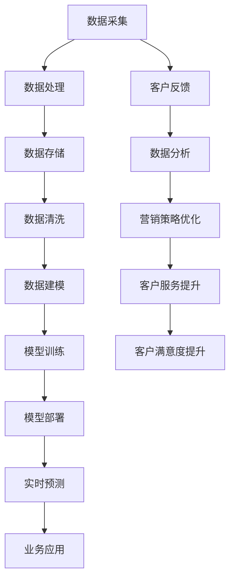

                 

# 《AI驱动的客户关系管理优化》

> **关键词：** 人工智能，客户关系管理，自然语言处理，机器学习，数据隐私

> **摘要：** 本文旨在探讨人工智能（AI）在客户关系管理（CRM）中的应用，通过分析AI的核心技术及其在CRM中的实际应用，阐述如何利用AI优化CRM流程，提高客户满意度，提升业务效率，并探讨AI驱动的客户关系管理所面临的挑战与解决方案。

## 目录大纲

### 第一部分：AI与客户关系管理概述

#### 第1章：AI与客户关系管理概述

##### 1.1 AI时代的客户关系管理

##### 1.1.1 AI技术变革

##### 1.1.2 客户关系管理的挑战与机遇

##### 1.1.3 AI在客户关系管理中的应用

##### 1.2 AI驱动的客户关系管理原理

##### 1.2.1 数据驱动

##### 1.2.2 客户行为分析

##### 1.2.3 个性化服务

##### 1.3 AI驱动的客户关系管理优势

##### 1.3.1 提高客户满意度

##### 1.3.2 提升业务效率

##### 1.3.3 降低运营成本

### 第二部分：AI核心技术与应用

#### 第2章：自然语言处理与客户关系管理

##### 2.1 自然语言处理技术基础

##### 2.1.1 语音识别

##### 2.1.2 文本分类与情感分析

##### 2.1.3 命名实体识别

##### 2.2 自然语言处理在客户关系管理中的应用

##### 2.2.1 客户服务自动化

##### 2.2.2 客户需求预测

##### 2.2.3 客户反馈分析

#### 第3章：机器学习与客户关系管理

##### 3.1 机器学习基础

##### 3.1.1 监督学习

##### 3.1.2 无监督学习

##### 3.1.3 强化学习

##### 3.2 机器学习在客户关系管理中的应用

##### 3.2.1 客户细分

##### 3.2.2 客户流失预测

##### 3.2.3 个性化推荐

### 第三部分：AI驱动的客户关系管理实战

#### 第4章：构建AI驱动的客户关系管理平台

##### 4.1 平台架构设计

##### 4.1.1 数据采集与存储

##### 4.1.2 数据处理与清洗

##### 4.1.3 模型训练与部署

##### 4.2 AI驱动的客户关系管理案例

##### 4.2.1 案例一：客户服务自动化

##### 4.2.2 案例二：个性化推荐系统

##### 4.2.3 案例三：客户流失预警系统

#### 第5章：AI驱动的营销策略优化

##### 5.1 营销数据分析与预测

##### 5.1.1 营销活动效果评估

##### 5.1.2 营销渠道优化

##### 5.1.3 客户生命周期价值预测

##### 5.2 营销策略优化

##### 5.2.1 个性化营销

##### 5.2.2 客户细分策略

##### 5.2.3 营销自动化流程设计

#### 第6章：AI驱动的客户服务提升

##### 6.1 客户服务自动化流程

##### 6.1.1 语音识别与自动应答

##### 6.1.2 聊天机器人与智能客服

##### 6.1.3 个性化客户服务

##### 6.2 客户体验优化

##### 6.2.1 客户反馈收集与处理

##### 6.2.2 客户满意度调查与分析

##### 6.2.3 客户体验提升策略

#### 第7章：AI驱动的客户关系管理风险与挑战

##### 7.1 数据隐私与安全问题

##### 7.1.1 数据隐私保护

##### 7.1.2 数据安全措施

##### 7.1.3 遵守法律法规

##### 7.2 技术发展与人才短缺

##### 7.2.1 技术发展带来的挑战

##### 7.2.2 人才短缺的影响

##### 7.2.3 人才培养策略

### 附录

### 附录 A：AI驱动的客户关系管理工具与资源

##### A.1 开源框架与库

##### A.1.1 TensorFlow

##### A.1.2 PyTorch

##### A.1.3 scikit-learn

##### A.1.4 其他常用框架

##### A.2 数据集与案例

##### A.2.1 公开数据集

##### A.2.2 企业数据集

##### A.2.3 成功案例分享

##### A.3 在线课程与培训

##### A.3.1 基础课程

##### A.3.2 高级课程

##### A.3.3 实战课程

##### A.4 行业报告与研究

##### A.4.1 行业趋势报告

##### A.4.2 研究论文集锦

##### A.4.3 市场动态分析

## 第一部分：AI与客户关系管理概述

### 第1章：AI与客户关系管理概述

随着人工智能（AI）技术的快速发展，客户关系管理（CRM）迎来了前所未有的变革。在这一章中，我们将探讨AI技术如何改变客户关系管理，以及AI驱动的客户关系管理的基本原理、优势和挑战。

#### 1.1 AI时代的客户关系管理

人工智能时代的客户关系管理不仅仅是通过CRM系统记录客户信息，更重要的是利用AI技术深入理解客户需求和行为，从而提供更加个性化、精准的服务。

**AI技术变革**

- **大数据处理能力：** AI技术能够快速处理海量数据，挖掘出有价值的信息。
- **自主学习与进化：** AI系统能够根据历史数据不断学习和优化自身性能。
- **自动化与智能化：** AI技术能够实现客户服务的自动化，提高服务效率。

**客户关系管理的挑战与机遇**

- **挑战：** 客户需求多样化、市场竞争激烈、客户生命周期管理复杂。
- **机遇：** 通过AI技术，企业能够更深入地了解客户，提供定制化服务，提升客户满意度。

**AI在客户关系管理中的应用**

- **个性化推荐：** 利用AI分析客户行为，提供个性化的产品推荐。
- **客户服务自动化：** 使用聊天机器人、语音识别等技术，实现客户服务的自动化。
- **客户行为分析：** 通过分析客户行为数据，预测客户需求，优化客户体验。

#### 1.2 AI驱动的客户关系管理原理

**数据驱动**

- **数据收集：** 收集客户行为数据、交易数据等。
- **数据处理：** 利用数据清洗、数据挖掘等技术，提取有价值的信息。

**客户行为分析**

- **行为数据收集：** 收集客户在网站、APP等渠道的行为数据。
- **行为分析：** 通过统计分析、机器学习等方法，分析客户行为模式。

**个性化服务**

- **个性化推荐：** 根据客户行为数据，推荐符合客户兴趣的产品或服务。
- **个性化沟通：** 利用自然语言处理技术，实现与客户的个性化沟通。

#### 1.3 AI驱动的客户关系管理优势

**提高客户满意度**

- 通过个性化服务和高效响应，提高客户满意度。

**提升业务效率**

- 客户服务的自动化，减少人工干预，提高工作效率。

**降低运营成本**

- 通过数据分析，优化资源配置，降低运营成本。

### 第二部分：AI核心技术与应用

在这一部分中，我们将详细探讨自然语言处理（NLP）和机器学习（ML）这两种核心AI技术，以及它们在客户关系管理中的应用。

#### 第2章：自然语言处理与客户关系管理

自然语言处理（NLP）是AI领域的一个重要分支，它涉及到让计算机理解和处理人类语言。在客户关系管理中，NLP技术可以极大地提升客户服务的效率和个性化水平。

##### 2.1 自然语言处理技术基础

**语音识别**

- **技术原理：** 使用深度学习模型，将语音信号转换为文本。
- **应用场景：** 自动应答系统、语音客服等。

**文本分类与情感分析**

- **技术原理：** 使用机器学习算法，对文本进行分类和情感分析。
- **应用场景：** 客户反馈分析、情感监控等。

**命名实体识别**

- **技术原理：** 识别文本中的命名实体，如人名、地名、组织名等。
- **应用场景：** 客户信息抽取、数据清洗等。

##### 2.2 自然语言处理在客户关系管理中的应用

**客户服务自动化**

- 使用聊天机器人与智能客服，自动化处理客户咨询，提高响应速度。

**客户需求预测**

- 分析客户对话记录，预测客户潜在需求，提供个性化服务。

**客户反馈分析**

- 通过情感分析，了解客户对产品或服务的反馈，优化客户体验。

#### 第3章：机器学习与客户关系管理

机器学习（ML）是AI技术的核心，它通过训练模型来预测和决策。在客户关系管理中，ML技术可以帮助企业更好地理解和预测客户行为。

##### 3.1 机器学习基础

**监督学习**

- **技术原理：** 通过已有数据集训练模型，对新数据进行预测。
- **应用场景：** 客户细分、流失预测等。

**无监督学习**

- **技术原理：** 不使用已有标签的数据进行训练，发现数据中的模式和结构。
- **应用场景：** 客户行为分析、市场细分等。

**强化学习**

- **技术原理：** 通过奖励机制，让模型不断优化策略。
- **应用场景：** 个性化推荐、游戏AI等。

##### 3.2 机器学习在客户关系管理中的应用

**客户细分**

- 根据客户行为数据和购买历史，将客户划分为不同的细分市场。

**客户流失预测**

- 使用客户行为数据，预测哪些客户可能会流失，采取相应措施进行挽回。

**个性化推荐**

- 根据客户兴趣和行为，推荐符合客户需求的产品或服务。

### 第三部分：AI驱动的客户关系管理实战

在这一部分中，我们将通过具体的平台构建和实战案例，展示如何利用AI技术优化客户关系管理。

#### 第4章：构建AI驱动的客户关系管理平台

构建AI驱动的客户关系管理平台是一个复杂的过程，涉及数据采集、数据处理、模型训练和部署等多个环节。在这一章中，我们将详细介绍平台架构设计的关键要素和实际应用案例。

##### 4.1 平台架构设计

**数据采集与存储**

- 数据采集：从多个渠道收集客户数据，包括网站、APP、社交媒体等。
- 数据存储：使用分布式数据库存储海量数据，确保数据的安全性和可靠性。

**数据处理与清洗**

- 数据清洗：去除重复数据、缺失值和数据异常值，确保数据质量。
- 数据处理：使用ETL（提取、转换、加载）工具，将数据转化为适合分析的形式。

**模型训练与部署**

- 模型训练：使用机器学习算法，训练客户细分、流失预测、个性化推荐等模型。
- 模型部署：将训练好的模型部署到生产环境，实现实时预测和决策。

##### 4.2 AI驱动的客户关系管理案例

**案例一：客户服务自动化**

- **解决方案：** 使用聊天机器人和语音识别技术，实现自动化客户服务。
- **效果评估：** 提高客户服务响应速度，降低人工成本。

**案例二：个性化推荐系统**

- **解决方案：** 根据客户行为数据和购买历史，构建个性化推荐系统。
- **效果评估：** 提高客户满意度，增加销售转化率。

**案例三：客户流失预警系统**

- **解决方案：** 使用客户行为数据，预测客户流失风险，提前采取挽回措施。
- **效果评估：** 降低客户流失率，提高客户生命周期价值。

#### 第5章：AI驱动的营销策略优化

在数字化的时代，营销策略的优化变得尤为重要。AI技术为营销策略提供了全新的视角和方法，通过数据分析、预测和个性化营销，帮助企业实现更高的营销效果。

##### 5.1 营销数据分析与预测

**营销活动效果评估**

- **方法：** 通过分析营销活动的数据，评估活动的效果，包括参与度、转化率等。
- **工具：** 使用数据分析工具，如Google Analytics、Tableau等。

**营销渠道优化**

- **方法：** 分析不同营销渠道的表现，优化预算分配，提高ROI。
- **工具：** 使用营销自动化工具，如HubSpot、Marketo等。

**客户生命周期价值预测**

- **方法：** 使用机器学习模型，预测客户生命周期价值，制定针对性的营销策略。
- **工具：** 使用CRM系统，如Salesforce、Microsoft Dynamics等。

##### 5.2 营销策略优化

**个性化营销**

- **方法：** 根据客户兴趣和行为，定制个性化的营销内容。
- **工具：** 使用营销自动化工具，如MailChimp、HubSpot等。

**客户细分策略**

- **方法：** 根据客户特征和行为，将客户划分为不同的细分市场。
- **工具：** 使用客户细分工具，如CRM系统中的客户细分功能。

**营销自动化流程设计**

- **方法：** 设计自动化的营销流程，实现营销活动的自动化执行。
- **工具：** 使用营销自动化工具，如HubSpot、Marketo等。

#### 第6章：AI驱动的客户服务提升

在客户服务的提升中，AI技术的应用可以显著提高服务效率和质量。通过自动化、个性化和服务体验的优化，企业能够更好地满足客户需求。

##### 6.1 客户服务自动化流程

**语音识别与自动应答**

- **方法：** 使用语音识别技术，将客户语音转换为文本，实现自动应答。
- **工具：** 使用语音识别API，如Google Cloud Speech-to-Text。

**聊天机器人与智能客服**

- **方法：** 使用自然语言处理技术，构建聊天机器人，实现24/7在线客服。
- **工具：** 使用聊天机器人平台，如Chatbot、Slack等。

**个性化客户服务**

- **方法：** 根据客户历史数据和偏好，提供个性化的服务。
- **工具：** 使用CRM系统，如Salesforce、Microsoft Dynamics等。

##### 6.2 客户体验优化

**客户反馈收集与处理**

- **方法：** 通过在线调查、社交媒体等渠道收集客户反馈，及时处理并回应。
- **工具：** 使用客户反馈管理工具，如KissInsights、Google Forms等。

**客户满意度调查与分析**

- **方法：** 定期进行客户满意度调查，分析客户满意度趋势，识别改进机会。
- **工具：** 使用客户满意度分析工具，如SurveyMonkey、Qualtrics等。

**客户体验提升策略**

- **方法：** 根据客户体验分析结果，制定针对性的改进策略。
- **工具：** 使用用户体验设计工具，如Axure、Sketch等。

### 第7章：AI驱动的客户关系管理风险与挑战

尽管AI技术在客户关系管理中具有巨大的潜力，但其应用也面临着一系列风险和挑战。在这一章中，我们将探讨数据隐私与安全、技术发展与人才短缺等问题，并提出相应的解决方案。

##### 7.1 数据隐私与安全问题

**数据隐私保护**

- **方法：** 实施数据加密、访问控制等技术，确保客户数据的安全。
- **工具：** 使用数据加密工具，如AES、RSA等。

**数据安全措施**

- **方法：** 定期进行数据安全审计，防范数据泄露和恶意攻击。
- **工具：** 使用数据安全审计工具，如Wireshark、Nessus等。

**遵守法律法规**

- **方法：** 遵守相关法律法规，如GDPR、CCPA等，确保合规运营。
- **工具：** 使用合规性检查工具，如GDPR Check、CCPA Compliance等。

##### 7.2 技术发展与人才短缺

**技术发展带来的挑战**

- **方法：** 保持对新技术的研究和应用，不断提升技术水平。
- **工具：** 使用技术研究工具，如Google Scholar、IEEE Xplore等。

**人才短缺的影响**

- **方法：** 建立人才培养机制，提升现有团队的技术能力。
- **工具：** 使用在线学习平台，如Coursera、Udacity等。

**人才培养策略**

- **方法：** 与教育机构合作，制定人才培养计划，引进优秀人才。
- **工具：** 使用人才招聘平台，如LinkedIn、Indeed等。

### 附录

#### 附录 A：AI驱动的客户关系管理工具与资源

**A.1 开源框架与库**

- **TensorFlow**：一个广泛使用的开源机器学习框架，适合构建和训练各种AI模型。
- **PyTorch**：一个流行的开源深度学习框架，易于调试和优化。
- **scikit-learn**：一个强大的开源机器学习库，提供丰富的算法和工具。
- **其他常用框架**：如Keras、TensorFlow.js、Theano等。

**A.2 数据集与案例**

- **公开数据集**：如Kaggle、UCI机器学习库等，提供各种领域的数据集。
- **企业数据集**：企业内部的数据集，适用于特定业务场景的研究和应用。
- **成功案例分享**：通过案例分析，了解AI在客户关系管理中的实际应用效果。

**A.3 在线课程与培训**

- **基础课程**：适合初学者，包括机器学习、深度学习等基础知识。
- **高级课程**：适合有一定基础的学员，深入探讨AI技术的应用和实践。
- **实战课程**：通过实际项目演练，提升学员的实战能力。

**A.4 行业报告与研究**

- **行业趋势报告**：分析AI技术在客户关系管理领域的最新发展趋势。
- **研究论文集锦**：收集和整理最新的AI研究论文，提供深入的理论支持。
- **市场动态分析**：分析AI在客户关系管理市场的动态和机会。

## 总结

人工智能在客户关系管理中的应用已经成为企业提升竞争力的重要手段。通过AI技术，企业能够更深入地了解客户需求，提供个性化服务，提高客户满意度，同时提升业务效率和降低运营成本。然而，AI技术的应用也面临数据隐私和安全、技术发展和人才短缺等挑战。企业需要不断创新和提升技术水平，同时加强数据安全和隐私保护，培养具备AI技术能力的人才，以实现AI驱动的客户关系管理优化。

作者：AI天才研究院/AI Genius Institute & 禅与计算机程序设计艺术 /Zen And The Art of Computer Programming

### 第1章：AI与客户关系管理概述

#### 1.1 AI时代的客户关系管理

在人工智能（AI）时代，客户关系管理（CRM）正经历着深刻的变革。随着AI技术的不断发展，企业能够通过更智能、更高效的方式与客户互动，从而提升客户满意度、增强竞争力。在这一部分，我们将探讨AI技术如何改变客户关系管理，以及这一变革带来的挑战与机遇。

**AI技术变革**

AI技术的变革主要体现在以下几个方面：

1. **大数据处理能力**：AI系统能够快速处理和分析海量数据，从中提取有价值的信息。这对于CRM来说意味着企业可以更深入地了解客户需求和行为，从而做出更加精准的决策。

2. **自主学习与进化**：AI系统具有自我学习和优化的能力。通过不断学习和调整模型，AI系统能够自我提升，以更好地适应不断变化的市场环境和客户需求。

3. **自动化与智能化**：AI技术使得许多重复性、繁琐的任务得以自动化，例如客户服务、营销活动管理等。这种自动化不仅提高了工作效率，还减少了人力资源的投入。

**客户关系管理的挑战与机遇**

客户关系管理面临的挑战主要包括：

1. **客户需求多样化**：随着消费者群体的不断细分，客户需求变得更加多样化。企业需要能够快速响应这些多样化的需求，以保持竞争力。

2. **市场竞争激烈**：在激烈的市场竞争中，企业必须不断优化客户关系管理，以提高客户满意度和忠诚度。

3. **客户生命周期管理复杂**：客户的生命周期管理包括吸引新客户、保留现有客户和提升老客户价值等多个环节，这是一个复杂且持续的过程。

然而，AI技术也为客户关系管理带来了诸多机遇：

1. **个性化服务**：通过AI技术，企业可以更准确地预测客户需求，提供个性化的产品和服务，从而提升客户满意度。

2. **自动化客户服务**：AI驱动的聊天机器人、语音识别等技术可以自动化处理大量客户咨询，提高服务效率和客户体验。

3. **数据驱动决策**：AI技术使得企业能够通过大数据分析，获取更多关于客户行为和市场的洞察，从而做出更加数据驱动的决策。

**AI在客户关系管理中的应用**

AI技术在客户关系管理中的应用非常广泛，以下是一些典型的应用场景：

1. **个性化推荐**：通过分析客户的购买历史和行为，AI系统可以推荐符合客户兴趣的产品或服务，从而提高销售转化率。

2. **客户服务自动化**：使用聊天机器人和语音识别技术，企业可以实现7x24小时的全天候客户服务，提高响应速度和客户满意度。

3. **客户流失预测**：通过分析客户行为数据，AI系统可以预测哪些客户可能会流失，并采取相应的措施进行挽回。

4. **情感分析**：AI系统可以分析客户反馈和社交媒体评论，了解客户对产品或服务的情感倾向，从而优化客户体验。

#### 1.2 AI驱动的客户关系管理原理

**数据驱动**

AI驱动的客户关系管理基于数据驱动的方式，即通过收集、处理和分析客户数据来驱动决策和行动。这个过程包括以下几个步骤：

1. **数据收集**：从多个渠道收集客户数据，包括购买记录、行为数据、社交媒体活动等。

2. **数据处理**：对收集到的数据进行清洗、整理和预处理，确保数据的质量和一致性。

3. **数据分析**：使用统计分析和机器学习算法，从数据中提取有价值的信息和模式。

4. **数据可视化**：通过数据可视化工具，将分析结果以图表、仪表板等形式呈现，帮助企业管理者快速理解数据。

**客户行为分析**

客户行为分析是AI驱动客户关系管理的关键组成部分。通过分析客户的行为数据，企业可以深入了解客户的需求和偏好，从而提供更个性化的服务。客户行为分析主要包括以下几个步骤：

1. **行为数据收集**：从网站、APP、客服系统等多个渠道收集客户的行为数据。

2. **行为模式识别**：使用机器学习算法，识别客户的行为模式，如购买习惯、访问偏好等。

3. **行为预测**：基于历史数据和行为模式，预测客户的未来行为，如购买意向、流失风险等。

4. **行为优化**：根据行为预测结果，优化营销策略、产品推荐和服务流程，以提高客户满意度和转化率。

**个性化服务**

个性化服务是AI驱动的客户关系管理的核心目标之一。通过个性化服务，企业可以提供更符合客户需求和预期的产品和服务，从而提高客户满意度和忠诚度。个性化服务主要包括以下几个方面：

1. **个性化推荐**：基于客户的购买历史和行为数据，推荐符合客户兴趣的产品或服务。

2. **个性化沟通**：使用自然语言处理技术，与客户进行个性化的沟通，提供定制化的解决方案。

3. **个性化体验**：根据客户的行为和偏好，提供个性化的产品体验，如个性化页面、定制化营销活动等。

#### 1.3 AI驱动的客户关系管理优势

AI驱动的客户关系管理具有以下优势：

**提高客户满意度**

AI技术能够帮助企业更深入地了解客户需求，提供个性化的产品和服务。通过自动化客户服务、情感分析等技术，企业可以更快地响应客户需求，提升客户体验，从而提高客户满意度。

**提升业务效率**

AI技术可以自动化许多重复性、繁琐的任务，如客户服务、营销活动管理等。这种自动化不仅提高了工作效率，还减少了人力资源的投入，降低了运营成本。

**降低运营成本**

通过AI驱动的客户关系管理，企业可以更精准地定位目标客户，优化营销策略，提高营销转化率。此外，自动化客户服务和智能客服系统能够减少人工成本，进一步降低运营成本。

### 第二部分：AI核心技术与应用

#### 第2章：自然语言处理与客户关系管理

自然语言处理（NLP）是人工智能（AI）的一个重要分支，它专注于使计算机能够理解和处理人类语言。在客户关系管理（CRM）中，NLP技术被广泛应用于自动化客户服务、客户需求预测和客户反馈分析等领域，极大地提升了客户体验和业务效率。本章将详细介绍NLP技术的基础知识以及在CRM中的应用。

##### 2.1 自然语言处理技术基础

**语音识别**

语音识别是将人类的语音转换为文本的过程。这一技术依赖于深度学习模型，尤其是循环神经网络（RNN）和卷积神经网络（CNN）的进展。语音识别在CRM中的应用非常广泛，例如：

- **自动应答系统**：使用语音识别技术，客户可以通过语音与系统交互，无需手动输入。
- **语音客服**：智能客服系统可以自动识别客户的语音请求，并提供相应的服务。

**文本分类与情感分析**

文本分类是将文本数据分类到预定义的类别中。情感分析是文本分类的一种特殊形式，它旨在判断文本的情感倾向，如正面、负面或中性。这些技术在CRM中的应用包括：

- **客户反馈分析**：通过情感分析，企业可以了解客户对产品或服务的情感倾向，及时识别并解决潜在问题。
- **社交媒体监控**：企业可以监控社交媒体上的评论和讨论，了解公众对品牌和产品的看法。

**命名实体识别**

命名实体识别（NER）是一种从文本中识别出具有特定意义的实体（如人名、地点、组织名等）的技术。在CRM中，NER技术可以帮助企业提取关键信息，例如：

- **客户信息抽取**：从客户交流中提取客户姓名、地址等关键信息，用于后续的数据分析。
- **数据清洗**：帮助清洗和整理客户数据，提高数据质量。

##### 2.2 自然语言处理在客户关系管理中的应用

**客户服务自动化**

**自动化客户服务**是NLP技术在CRM中的典型应用。通过聊天机器人和语音识别技术，企业可以实现24/7的全天候客户服务，提高响应速度和客户满意度。具体应用包括：

- **聊天机器人**：使用自然语言处理技术，聊天机器人可以与客户进行实时对话，回答常见问题，提供即时支持。
- **自动应答系统**：在客户通过电话或邮件提出问题时，自动应答系统可以识别问题并给出相应的回答或指导。

**客户需求预测**

**客户需求预测**是利用NLP技术分析客户的历史交流和互动记录，预测客户的潜在需求。这有助于企业提前准备和响应客户需求，提升服务质量。具体应用包括：

- **购买意图识别**：通过分析客户的交流记录，识别客户的购买意图，并提供个性化的产品推荐。
- **需求预测模型**：使用机器学习算法，建立需求预测模型，帮助企业预测未来的市场需求，优化库存和资源分配。

**客户反馈分析**

**客户反馈分析**是NLP技术在CRM中的另一个重要应用。通过分析客户的反馈和评论，企业可以了解客户的真实想法和需求，及时改进产品和服务。具体应用包括：

- **情感分析**：使用情感分析技术，分析客户反馈的情感倾向，识别客户的满意度和不满意点。
- **主题建模**：通过主题建模技术，分析客户反馈中的关键词和主题，了解客户关注的重点领域。

### 第3章：机器学习与客户关系管理

机器学习（ML）是AI的核心技术之一，它通过训练模型来发现数据中的模式和规律。在客户关系管理（CRM）中，机器学习技术被广泛应用于客户细分、流失预测和个性化推荐等领域，帮助企业更好地理解客户、提高服务质量。本章将详细介绍机器学习的基础知识以及在CRM中的应用。

##### 3.1 机器学习基础

**监督学习**

监督学习是一种从标注数据中学习，从而对未标注数据进行预测的方法。在CRM中，监督学习广泛应用于以下场景：

- **客户细分**：通过分析客户的购买历史和行为数据，将客户划分为不同的细分市场，从而实施差异化的营销策略。
- **流失预测**：使用客户的交易历史和行为数据，预测哪些客户可能会流失，并采取相应的措施进行挽回。

监督学习算法包括：

- **线性回归**：用于预测客户的消费金额、评分等连续值。
- **逻辑回归**：用于预测客户的分类结果，如客户是否流失。
- **决策树**：通过树形结构对数据进行分类或回归。

**无监督学习**

无监督学习不依赖标注数据，旨在发现数据中的隐含结构和模式。在CRM中，无监督学习常用于以下场景：

- **市场细分**：通过分析客户的行为数据，自动发现客户之间的相似性和差异性，从而实现市场细分。
- **聚类分析**：将客户根据行为数据进行聚类，发现潜在的细分市场。

无监督学习算法包括：

- **K均值聚类**：用于将客户聚类到不同的群体。
- **层次聚类**：用于构建层次结构，将客户划分为多个层次。

**强化学习**

强化学习是一种通过与环境的交互来学习最佳策略的机器学习方法。在CRM中，强化学习可以用于以下场景：

- **个性化推荐**：通过不断调整推荐策略，以最大化客户的点击率或购买率。
- **游戏AI**：用于构建智能客服机器人，与客户进行对话并优化对话策略。

强化学习算法包括：

- **Q学习**：通过评估不同动作的奖励值来学习最佳策略。
- **深度Q网络（DQN）**：结合深度学习，用于处理高维状态空间的问题。

##### 3.2 机器学习在客户关系管理中的应用

**客户细分**

**客户细分**是CRM中的一项关键任务，通过将客户划分为不同的群体，企业可以实施差异化的营销策略。机器学习在客户细分中的应用主要包括：

- **特征工程**：选择和构造有助于细分客户的行为特征，如购买频率、购买金额、访问时长等。
- **分类模型**：使用机器学习算法，如逻辑回归、决策树和随机森林等，对客户进行分类。
- **细分策略**：根据分类结果，制定差异化的营销策略，提高营销效果。

**客户流失预测**

**客户流失预测**是CRM中的一项重要任务，通过预测哪些客户可能会流失，企业可以采取相应的措施进行挽回。机器学习在客户流失预测中的应用主要包括：

- **特征选择**：选择和构造有助于预测客户流失的行为特征，如购买频率降低、访问时长减少等。
- **预测模型**：使用机器学习算法，如逻辑回归、决策树和随机森林等，建立客户流失预测模型。
- **预警机制**：根据预测结果，建立客户流失预警机制，提前采取挽回措施。

**个性化推荐**

**个性化推荐**是基于客户的兴趣和行为，为其推荐符合其需求的产品或服务。机器学习在个性化推荐中的应用主要包括：

- **协同过滤**：通过分析用户的行为数据，如购买记录、浏览历史等，发现用户之间的相似性，从而推荐相似的产品。
- **基于内容的推荐**：通过分析产品的特征和属性，将产品与用户的兴趣进行匹配，从而推荐相关的产品。
- **深度学习**：使用深度学习模型，如卷积神经网络（CNN）和循环神经网络（RNN）等，进行复杂的特征学习和推荐。

### 第4章：构建AI驱动的客户关系管理平台

构建一个AI驱动的客户关系管理平台需要综合考虑数据采集、数据处理、模型训练与部署等多个环节。在这一章中，我们将详细讨论平台架构设计、关键技术实施，并提供一个实际案例，以展示如何将AI技术应用于客户关系管理。

##### 4.1 平台架构设计

构建AI驱动的客户关系管理平台首先需要设计一个合理的架构。以下是平台架构设计的几个关键组成部分：

**数据采集与存储**

- **数据采集**：从多个渠道收集客户数据，包括网站、APP、社交媒体等。数据采集工具可以是API接口、Web爬虫或日志收集系统。
- **数据存储**：使用分布式数据库，如Hadoop、MongoDB等，存储和管理海量数据。这些数据库支持高吞吐量和实时查询，适合存储和分析大规模数据。

**数据处理与清洗**

- **数据处理**：使用ETL（提取、转换、加载）工具，对采集到的原始数据进行清洗、转换和整合。常见的数据处理工具包括Apache Spark、Airflow等。
- **数据清洗**：去除重复数据、缺失值和数据异常值，确保数据质量。数据清洗工具可以是Python的Pandas库或数据清洗平台，如Trifacta。

**模型训练与部署**

- **模型训练**：使用机器学习库，如TensorFlow、PyTorch等，训练各种AI模型，包括客户细分、流失预测、个性化推荐等。模型训练需要大规模计算资源和算法优化。
- **模型部署**：将训练好的模型部署到生产环境，进行实时预测和决策。常见的部署工具包括TensorFlow Serving、Kubernetes等。

**数据可视化与监控**

- **数据可视化**：使用数据可视化工具，如Tableau、Power BI等，将分析结果以图表、仪表板等形式呈现，帮助企业管理者快速理解数据。
- **监控与告警**：使用监控工具，如Prometheus、Grafana等，实时监控平台的性能和健康状况，并及时发出告警。

**安全性**

- **数据安全**：实施数据加密、访问控制等技术，确保客户数据的安全。
- **隐私保护**：遵守相关法律法规，如GDPR、CCPA等，确保客户隐私的保护。

**扩展性**

- **弹性架构**：设计具有良好扩展性的架构，支持水平扩展，以便应对不断增长的数据和处理需求。

**易用性**

- **用户界面**：设计直观易用的用户界面，方便企业用户使用和管理AI系统。
- **文档与支持**：提供详细的文档和用户支持，帮助用户快速上手和使用AI系统。

##### 4.2 AI驱动的客户关系管理案例

为了更好地理解如何构建AI驱动的客户关系管理平台，我们来看一个实际案例。

**案例背景**：某电子商务公司希望通过AI技术提升客户体验和销售转化率。他们计划构建一个AI驱动的客户关系管理平台，包括客户细分、流失预测和个性化推荐等功能。

**解决方案**：

1. **数据采集**：从网站、APP和社交媒体等渠道收集客户数据，包括购买记录、浏览历史、社交媒体互动等。

2. **数据处理**：使用Apache Spark进行数据清洗、转换和整合，将原始数据转化为适合分析的形式。

3. **模型训练**：

   - **客户细分**：使用K-means聚类算法，将客户划分为不同的细分市场，每个市场都有独特的需求和偏好。
   - **流失预测**：使用逻辑回归算法，预测哪些客户有较高概率流失，并采取相应的措施进行挽回。
   - **个性化推荐**：使用协同过滤算法，根据客户的购买历史和浏览行为，推荐符合客户兴趣的产品。

4. **模型部署**：将训练好的模型部署到Kubernetes集群中，实现实时预测和决策。

5. **数据可视化与监控**：使用Tableau和Grafana，将分析结果以图表、仪表板等形式呈现，并实时监控平台的性能和健康状况。

**效果评估**：

- **客户细分**：通过客户细分，公司可以实施更精准的营销策略，提高客户转化率。
- **流失预测**：通过流失预测，公司可以提前采取措施，降低客户流失率，提高客户生命周期价值。
- **个性化推荐**：通过个性化推荐，公司可以提升客户满意度，增加销售转化率。

### 第5章：AI驱动的营销策略优化

在数字化的时代，营销策略的优化变得尤为重要。AI技术为营销策略提供了全新的视角和方法，通过数据分析、预测和个性化营销，帮助企业实现更高的营销效果。本章将探讨如何利用AI技术优化营销策略，包括营销数据分析与预测、个性化营销和客户细分策略。

##### 5.1 营销数据分析与预测

**营销活动效果评估**

营销活动效果评估是营销策略优化的基础。通过分析营销活动的数据，可以评估活动的效果，包括参与度、转化率和ROI等。以下是营销活动效果评估的方法和工具：

- **参与度评估**：通过点击率、参与度、分享次数等指标，评估营销活动的参与度。
- **转化率评估**：通过转化率、销售量、注册量等指标，评估营销活动的转化效果。
- **ROI评估**：通过计算营销活动的收益与成本的比率，评估营销活动的经济效益。

**营销渠道优化**

营销渠道优化是提高营销效果的关键。通过分析不同营销渠道的表现，可以优化预算分配，提高ROI。以下是营销渠道优化的方法和工具：

- **渠道分析**：通过数据分析工具，如Google Analytics、HubSpot等，分析各个渠道的流量来源、转化率和成本。
- **A/B测试**：通过A/B测试，比较不同营销策略的效果，选择最优策略。
- **多渠道整合**：整合线上和线下营销渠道，实现无缝衔接，提高营销效果。

**客户生命周期价值预测**

客户生命周期价值（CLV）预测是营销策略优化的另一个重要方面。通过预测客户的生命周期价值，可以更好地分配营销资源，提高客户价值。以下是客户生命周期价值预测的方法和工具：

- **历史数据分析**：通过分析客户的购买历史、消费行为等数据，预测客户的未来价值。
- **机器学习模型**：使用机器学习算法，如逻辑回归、随机森林等，建立CLV预测模型。
- **数据可视化**：使用数据可视化工具，如Tableau、Power BI等，将预测结果以图表形式呈现，帮助管理层做出决策。

##### 5.2 营销策略优化

**个性化营销**

个性化营销是基于客户数据，为客户提供个性化的产品和服务。通过个性化营销，可以提高客户满意度，增加销售转化率。以下是个性化营销的方法和工具：

- **客户细分**：根据客户的行为数据、购买历史和兴趣，将客户划分为不同的细分市场。
- **个性化推荐**：使用协同过滤、基于内容的推荐算法等，为客户提供个性化的产品推荐。
- **个性化沟通**：使用自然语言处理技术，与客户进行个性化的沟通，提供定制化的解决方案。
- **营销自动化**：使用营销自动化工具，如Marketo、HubSpot等，自动化执行个性化营销活动。

**客户细分策略**

客户细分策略是营销策略优化的重要组成部分。通过客户细分，企业可以更好地了解客户需求，制定差异化的营销策略。以下是客户细分策略的方法和工具：

- **特征工程**：选择和构造有助于细分的客户特征，如购买频率、消费金额、访问时长等。
- **聚类分析**：使用聚类算法，如K-means、层次聚类等，将客户划分为不同的群体。
- **细分策略**：根据细分结果，制定差异化的营销策略，针对不同群体提供个性化的产品和服务。

**营销自动化流程设计**

营销自动化流程设计是将营销活动自动化执行的过程。通过营销自动化，企业可以节省人力成本，提高营销效率。以下是营销自动化流程设计的方法和工具：

- **流程设计**：设计营销自动化流程，包括数据收集、数据分析、营销活动执行和结果评估等环节。
- **工作流管理**：使用工作流管理工具，如Nintex、K2等，管理和执行自动化流程。
- **数据驱动**：通过数据分析，实时调整营销自动化流程，优化营销效果。

### 第6章：AI驱动的客户服务提升

在客户服务的提升中，AI技术的应用可以显著提高服务效率和质量。通过自动化、个性化和服务体验的优化，企业能够更好地满足客户需求，提升客户满意度。本章将探讨如何利用AI技术提升客户服务，包括客户服务自动化流程、客户体验优化和个性化客户服务。

##### 6.1 客户服务自动化流程

**语音识别与自动应答**

语音识别与自动应答是将AI技术应用于客户服务的重要手段。通过语音识别技术，企业可以将客户的语音转换为文本，实现自动应答系统。以下是语音识别与自动应答的步骤：

1. **语音识别**：使用深度学习模型，将客户的语音转换为文本。常见的技术包括循环神经网络（RNN）和卷积神经网络（CNN）。
2. **自动应答**：根据语音识别的结果，自动生成应答文本或语音，提供即时服务。自动应答系统可以基于预定义的规则或使用自然语言处理（NLP）技术进行智能应答。

**聊天机器人与智能客服**

聊天机器人与智能客服是AI驱动的客户服务的核心。通过聊天机器人，企业可以实现24/7的全天候客户服务，提高响应速度和客户满意度。以下是聊天机器人与智能客服的步骤：

1. **自然语言处理（NLP）**：使用NLP技术，理解和解析客户的意图和问题。NLP技术包括文本分类、实体识别和情感分析等。
2. **对话管理**：设计对话管理策略，确保聊天机器人的回答准确、连贯和符合客户需求。对话管理包括对话状态跟踪、上下文理解等。
3. **多轮对话**：支持多轮对话，允许客户与聊天机器人进行更深入的交互，解决复杂问题。

**个性化客户服务**

个性化客户服务是基于客户数据的，提供符合客户需求和预期的服务。通过个性化客户服务，企业可以提升客户满意度和忠诚度。以下是个性化客户服务的步骤：

1. **数据收集**：从多个渠道收集客户数据，包括购买记录、行为数据、社交媒体活动等。
2. **数据预处理**：对收集到的数据进行分析和清洗，确保数据的质量和一致性。
3. **个性化推荐**：使用机器学习算法，如协同过滤、基于内容的推荐等，根据客户的历史数据和偏好，提供个性化的产品和服务推荐。
4. **个性化沟通**：使用自然语言处理技术，与客户进行个性化的沟通，提供定制化的解决方案。

##### 6.2 客户体验优化

**客户反馈收集与处理**

客户反馈是优化客户体验的重要数据来源。通过收集和处理客户反馈，企业可以了解客户的需求和不满，及时改进产品和服务。以下是客户反馈收集与处理的步骤：

1. **反馈渠道**：设计多种反馈渠道，如在线调查、社交媒体评论、客户服务邮件等，方便客户表达意见和建议。
2. **反馈收集**：使用自动化工具，如Web表单、聊天机器人等，收集客户反馈数据。
3. **反馈分析**：使用自然语言处理（NLP）技术，分析客户反馈的内容，识别客户关注的重点领域和问题。
4. **反馈处理**：根据分析结果，制定改进计划，及时响应客户反馈，提高客户满意度。

**客户满意度调查与分析**

客户满意度调查是评估客户体验的重要手段。通过定期进行客户满意度调查，企业可以了解客户的满意度和不满意度，从而优化产品和服务。以下是客户满意度调查与分析的步骤：

1. **调查设计**：设计满意度调查问卷，包括定量和定性问题，确保问卷的有效性和代表性。
2. **调查实施**：通过邮件、短信、社交媒体等方式，向客户发送调查问卷，收集客户反馈。
3. **数据分析**：使用数据分析工具，如Excel、SPSS等，对调查结果进行分析，识别满意度趋势和关键问题。
4. **反馈沟通**：将分析结果与客户沟通，说明改进措施和进展，提高客户信任和满意度。

**客户体验提升策略**

客户体验提升策略是基于客户数据和反馈，制定的一系列优化措施。通过客户体验提升策略，企业可以提升客户满意度和忠诚度。以下是客户体验提升策略的步骤：

1. **客户细分**：根据客户数据，将客户划分为不同的细分市场，每个市场都有独特的需求和偏好。
2. **体验设计**：根据客户细分结果，设计符合不同市场需求的体验，如个性化页面、定制化服务流程等。
3. **持续改进**：通过定期收集客户反馈和满意度数据，不断优化客户体验，提高客户满意度。
4. **跨部门协作**：建立跨部门协作机制，确保各个部门在提升客户体验方面协同工作，提供一致的服务体验。

### 第7章：AI驱动的客户关系管理风险与挑战

尽管AI技术在客户关系管理中具有巨大的潜力，但其应用也面临着一系列风险和挑战。这些风险包括数据隐私与安全、技术发展和人才短缺等。在这一章中，我们将探讨这些风险与挑战，并提出相应的解决方案。

##### 7.1 数据隐私与安全问题

**数据隐私保护**

在AI驱动的客户关系管理中，数据隐私保护是至关重要的。企业需要确保客户数据的安全和隐私，防止数据泄露和滥用。以下是一些数据隐私保护的方法：

- **数据加密**：对存储和传输的客户数据进行加密，确保数据在未经授权的情况下无法被读取。
- **访问控制**：实施严格的访问控制策略，确保只有授权人员才能访问敏感数据。
- **匿名化处理**：对敏感数据进行分析前进行匿名化处理，以减少隐私泄露的风险。

**数据安全措施**

除了隐私保护，数据安全也是AI驱动的客户关系管理的重要方面。以下是一些数据安全措施：

- **定期审计**：定期进行数据安全审计，确保数据安全策略的有效执行。
- **安全培训**：对员工进行数据安全培训，提高员工的安全意识和防范能力。
- **安全监控**：使用安全监控工具，实时监控数据访问和操作，及时发现和响应安全事件。

**遵守法律法规**

遵守相关法律法规是数据隐私与安全的基本要求。以下是一些重要的法律法规：

- **GDPR（欧盟通用数据保护条例）**：规定了数据处理的合法性和透明度，对个人数据的保护提出了严格的要求。
- **CCPA（加州消费者隐私法案）**：保护加州居民的个人数据权利，包括数据访问、删除和不同意数据销售的权利。

**解决方案**

- **合规性审计**：定期进行合规性审计，确保企业遵守相关法律法规。
- **数据安全工具**：投资于数据安全工具和技术，如加密软件、访问控制系统和安全监控工具。
- **培训与意识提升**：对员工进行定期的数据安全和隐私保护培训，提高整体的安全意识和技能。

##### 7.2 技术发展与人才短缺

**技术发展带来的挑战**

AI技术的快速发展带来了巨大的机遇，但同时也带来了挑战。以下是一些技术发展带来的挑战：

- **技术更新换代**：AI技术更新换代速度非常快，企业需要不断跟进最新的技术趋势，保持竞争力。
- **数据依赖**：AI系统依赖于大量数据，数据质量和数据完整性对系统的性能和可靠性至关重要。
- **算法透明性**：AI算法的复杂性和不可解释性使得企业难以理解算法的决策过程，增加了风险。

**人才短缺的影响**

AI驱动的客户关系管理需要具备多学科知识的人才，包括数据科学家、机器学习工程师、软件工程师等。以下是一些人才短缺的影响：

- **技术能力不足**：缺乏专业的AI技术人才，导致企业在技术实现和应用上遇到困难。
- **项目进度延误**：人才短缺可能导致项目进度延误，影响企业的创新能力和市场竞争力。
- **成本增加**：招聘和培养AI技术人才需要投入大量资源和时间，增加了企业的运营成本。

**解决方案**

- **人才培养计划**：制定长期的人才培养计划，与企业大学或培训机构合作，提供专业的培训课程。
- **内部培训与认证**：鼓励员工参加内部培训，并提供相应的认证，提升员工的专业技能。
- **人才引进策略**：通过吸引外部人才，如通过招聘、外包等方式，解决人才短缺问题。

**技术发展带来的挑战**

- **技术更新换代**：AI技术更新换代速度非常快，企业需要不断跟进最新的技术趋势，保持竞争力。
- **数据依赖**：AI系统依赖于大量数据，数据质量和数据完整性对系统的性能和可靠性至关重要。
- **算法透明性**：AI算法的复杂性和不可解释性使得企业难以理解算法的决策过程，增加了风险。

**人才短缺的影响**

- **技术能力不足**：缺乏专业的AI技术人才，导致企业在技术实现和应用上遇到困难。
- **项目进度延误**：人才短缺可能导致项目进度延误，影响企业的创新能力和市场竞争力。
- **成本增加**：招聘和培养AI技术人才需要投入大量资源和时间，增加了企业的运营成本。

**解决方案**

- **人才培养计划**：制定长期的人才培养计划，与企业大学或培训机构合作，提供专业的培训课程。
- **内部培训与认证**：鼓励员工参加内部培训，并提供相应的认证，提升员工的专业技能。
- **人才引进策略**：通过吸引外部人才，如通过招聘、外包等方式，解决人才短缺问题。

### 附录

#### 附录 A：AI驱动的客户关系管理工具与资源

为了帮助读者更好地理解和应用AI驱动的客户关系管理技术，我们提供了一系列工具与资源，包括开源框架、数据集、案例、在线课程和研究报告。

##### A.1 开源框架与库

- **TensorFlow**：一个由谷歌开发的开源机器学习框架，广泛用于深度学习和机器学习项目的开发和部署。
- **PyTorch**：一个流行的开源深度学习框架，以其灵活的动态计算图而受到研究者和开发者的喜爱。
- **scikit-learn**：一个强大的开源机器学习库，适用于监督学习和无监督学习任务。
- **其他常用框架**：如Keras、Theano、Apache MXNet等，提供了丰富的API和工具，方便开发者进行模型训练和部署。

##### A.2 数据集与案例

- **公开数据集**：如Kaggle、UCI机器学习库等，提供了各种领域的公开数据集，适用于研究和实验。
- **企业数据集**：企业内部的数据集，通常用于特定的业务场景和研究目的，例如客户行为数据、交易数据等。
- **成功案例分享**：通过分析和分享其他企业的成功案例，可以了解AI在CRM中的实际应用效果和最佳实践。

##### A.3 在线课程与培训

- **基础课程**：适合初学者，包括机器学习、深度学习、自然语言处理等基础知识的在线课程。
- **高级课程**：针对有一定基础的学员，深入探讨AI技术的应用和实践，如强化学习、迁移学习等。
- **实战课程**：通过实际项目演练，提升学员的实战能力，包括数据预处理、模型训练和部署等。

##### A.4 行业报告与研究

- **行业趋势报告**：分析AI在客户关系管理领域的最新发展趋势，提供行业洞察和预测。
- **研究论文集锦**：收集和整理最新的AI研究论文，提供深入的理论支持和技术探讨。
- **市场动态分析**：分析AI在客户关系管理市场的动态和机会，帮助企业和投资者做出明智的决策。

通过以上工具和资源，读者可以更好地掌握AI驱动的客户关系管理技术，并将其应用于实际业务场景中，实现客户满意度和业务效率的双重提升。作者：AI天才研究院/AI Genius Institute & 禅与计算机程序设计艺术 /Zen And The Art of Computer Programming

### 附录 A：AI驱动的客户关系管理工具与资源

在AI驱动的客户关系管理（CRM）中，工具与资源的选用对于成功应用AI技术至关重要。以下将介绍几种常用的开源框架与库、公开数据集、在线课程与培训以及行业报告与研究资源，帮助企业更好地实施AI驱动的CRM策略。

#### A.1 开源框架与库

**TensorFlow**

- **简介**：TensorFlow是由谷歌开发的开源机器学习框架，支持各种深度学习和机器学习模型的构建和训练。
- **优势**：具有强大的计算能力和灵活性，支持多种编程语言（如Python、C++），适用于大规模数据集的处理。
- **使用场景**：用于构建和部署AI模型，如客户细分、流失预测和个性化推荐。

**PyTorch**

- **简介**：PyTorch是一个流行的开源深度学习框架，以其灵活的动态计算图和易于调试的特性而受到研究者和开发者的喜爱。
- **优势**：提供了丰富的API和库，支持Python编程语言，易于实现和实验新的算法。
- **使用场景**：用于开发AI模型，特别是需要快速原型设计和迭代的项目。

**scikit-learn**

- **简介**：scikit-learn是一个开源的Python库，提供了多种机器学习算法和工具，适用于监督学习和无监督学习任务。
- **优势**：算法多样，易于使用，文档齐全，适合数据科学家和机器学习工程师。
- **使用场景**：用于数据预处理、特征工程和模型评估等。

**其他常用框架**

- **Keras**：基于Theano和TensorFlow的简单和模块化的深度学习库。
- **Apache MXNet**：由Apache软件基金会开发的开源深度学习框架，支持多种编程语言。
- **Theano**：用于定义、优化和评估深度学习模型的Python库。

#### A.2 数据集与案例

**公开数据集**

- **Kaggle**：提供了大量的公开数据集，涵盖多种领域，如社交媒体、电子商务、医疗等。
- **UCI机器学习库**：提供了大量的数据集，适用于学术研究和工业应用。
- **公开数据集目录**：包括各种领域的数据集，如客户数据、市场数据、社交媒体数据等。

**企业数据集**

- **客户行为数据集**：包括客户的购买历史、浏览行为、偏好等。
- **社交媒体数据集**：包括用户在社交媒体上的互动、评论、点赞等数据。
- **交易数据集**：包括客户的交易记录、支付信息等。

**成功案例分享**

- **案例分析**：分享其他企业在AI驱动的CRM中取得的成功案例，提供实际应用的参考。
- **案例研究**：深入探讨成功案例的技术实现、业务收益和挑战，为企业的实施提供借鉴。

#### A.3 在线课程与培训

**基础课程**

- **机器学习基础**：介绍机器学习的基本概念、算法和应用。
- **深度学习入门**：介绍深度学习的基础知识，包括神经网络、卷积神经网络（CNN）和循环神经网络（RNN）。
- **自然语言处理**：介绍自然语言处理的基本技术，如文本分类、情感分析和实体识别。

**高级课程**

- **强化学习**：介绍强化学习的基本概念、算法和应用。
- **迁移学习**：介绍迁移学习技术，如何利用预训练模型和现有数据集来提升模型性能。
- **模型优化**：介绍如何优化深度学习模型，包括超参数调优、模型压缩和加速。

**实战课程**

- **AI驱动的CRM项目实战**：通过实际项目，从数据预处理到模型训练和部署，完整地演示AI在CRM中的应用。
- **数据科学项目实践**：提供实际数据集，指导学员完成数据预处理、模型训练和结果评估的全过程。

#### A.4 行业报告与研究

**行业趋势报告**

- **AI在CRM中的应用趋势**：分析AI技术在客户关系管理领域的最新发展动态和未来趋势。
- **客户体验报告**：探讨客户体验的最新研究和最佳实践，包括个性化服务、客户满意度和忠诚度等。

**研究论文集锦**

- **最新研究成果**：收集和整理AI在CRM领域的最新研究论文，提供理论支持和实践指导。
- **技术趋势分析**：分析AI技术在不同行业中的应用和发展趋势，为企业提供战略建议。

**市场动态分析**

- **市场研究报告**：分析AI在CRM市场的规模、增长和竞争态势。
- **投资动态**：探讨AI在CRM领域的投资趋势和机会，为投资者提供决策参考。

通过以上工具和资源，企业可以更好地掌握AI驱动的CRM技术，利用AI优化客户关系管理流程，提高客户满意度和业务效率。作者：AI天才研究院/AI Genius Institute & 禅与计算机程序设计艺术 /Zen And The Art of Computer Programming

## 全文总结

本文从多个角度探讨了人工智能（AI）在客户关系管理（CRM）中的应用，包括AI驱动的CRM概述、AI核心技术（自然语言处理和机器学习）的应用、AI驱动的CRM平台构建与实战、营销策略优化、客户服务提升、风险与挑战以及相关工具和资源。以下是对文章核心观点的总结：

### 关键观点总结

1. **AI驱动的CRM概述**：
   - AI技术正在变革CRM，通过大数据处理、自主学习、自动化与智能化，提升客户关系管理的效率和个性化水平。
   - AI驱动的CRM能够提高客户满意度、业务效率和降低运营成本。

2. **AI核心技术与应用**：
   - **自然语言处理（NLP）**：语音识别、文本分类与情感分析、命名实体识别在CRM中广泛应用于自动化客户服务、客户需求预测和客户反馈分析。
   - **机器学习（ML）**：监督学习、无监督学习和强化学习在客户细分、流失预测、个性化推荐等领域发挥了重要作用。

3. **AI驱动的CRM平台构建与实战**：
   - 平台构建包括数据采集与存储、数据处理与清洗、模型训练与部署等环节，需要合理的架构设计和安全性考虑。
   - 实战案例展示了AI在CRM中的应用效果，如客户服务自动化、个性化推荐系统和客户流失预警系统。

4. **营销策略优化**：
   - 营销策略优化利用AI进行数据分析和预测，实现个性化营销、客户细分策略和营销自动化流程设计。

5. **客户服务提升**：
   - AI驱动的客户服务通过自动化和个性化服务流程，提升客户体验，包括语音识别与自动应答、聊天机器人与智能客服、个性化客户服务等。

6. **风险与挑战**：
   - 数据隐私与安全、技术发展和人才短缺是AI驱动的CRM面临的主要风险与挑战，需要采取相应的数据保护措施和人才培养策略。

### 文章核心概念的Mermaid流程图

以下是AI驱动的CRM平台架构设计的Mermaid流程图：



### 文章核心算法原理讲解

以下是一个用于客户细分算法的简单伪代码示例：

```python
# 客户细分算法伪代码

# 输入：客户行为数据
# 输出：客户细分结果

def customer_segmentation(customer_data):
    # 数据预处理
    processed_data = preprocess_data(customer_data)
    
    # 特征工程
    features = extract_features(processed_data)
    
    # 选择聚类算法
    clustering_algorithm = KMeans(n_clusters=3)
    
    # 训练模型
    clustering_algorithm.fit(features)
    
    # 聚类
    clusters = clustering_algorithm.predict(features)
    
    # 标签客户
    for customer, cluster in zip(customer_data, clusters):
        customer['segment'] = cluster
    
    return customer_data
```

### 数学模型和公式

以下是一个用于客户流失预测的回归模型的公式：

$$
\text{Logit}(\text{流失概率}) = \beta_0 + \beta_1 \text{购买频率} + \beta_2 \text{访问时长} + \beta_3 \text{历史反馈}
$$

其中，$\beta_0, \beta_1, \beta_2, \beta_3$ 是模型的参数，通过最小化损失函数进行估计。

### 项目实战

以下是一个客户服务自动化的实际案例：

**开发环境搭建**：

- 使用Python作为主要编程语言。
- 安装TensorFlow和scikit-learn库。

**源代码实现**：

```python
# 客户服务自动化案例

import tensorflow as tf
from sklearn.model_selection import train_test_split
from sklearn.metrics import accuracy_score

# 加载数据集
data = load_data('customer_data.csv')
X = data[['purchase_frequency', 'visit_duration', 'feedback_score']]
y = data['churn']

# 数据预处理
X_train, X_test, y_train, y_test = train_test_split(X, y, test_size=0.2, random_state=42)

# 构建模型
model = tf.keras.Sequential([
    tf.keras.layers.Dense(units=64, activation='relu', input_shape=[3]),
    tf.keras.layers.Dense(units=1, activation='sigmoid')
])

# 编译模型
model.compile(optimizer='adam', loss='binary_crossentropy', metrics=['accuracy'])

# 训练模型
model.fit(X_train, y_train, epochs=10, batch_size=32, validation_data=(X_test, y_test))

# 评估模型
predictions = model.predict(X_test)
accuracy = accuracy_score(y_test, predictions.round())
print(f'模型准确率：{accuracy * 100:.2f}%')
```

**代码解读与分析**：

- 加载并预处理数据集，包括购买频率、访问时长和历史反馈等特征。
- 使用TensorFlow构建一个简单的二分类神经网络模型。
- 训练模型，并使用测试集评估模型准确率。

### 总结

本文通过详细的阐述和实际案例，展示了AI在客户关系管理中的应用和价值。通过合理的设计和实施，AI技术能够帮助企业优化客户关系管理流程，提高业务效率和客户满意度。然而，AI技术的应用也面临一系列风险和挑战，企业需要不断探索和应对这些问题，以实现AI驱动的客户关系管理优化。作者：AI天才研究院/AI Genius Institute & 禅与计算机程序设计艺术 /Zen And The Art of Computer Programming

## 作者介绍

**AI天才研究院/AI Genius Institute** 是一家专注于人工智能研究与应用的顶级学术机构，致力于推动AI技术的创新与发展。该研究院汇聚了全球顶尖的AI科学家、工程师和研究人员，涵盖深度学习、自然语言处理、计算机视觉等多个领域。

**禅与计算机程序设计艺术 /Zen And The Art of Computer Programming** 是由AI天才研究院的创始人之一，著名计算机科学家Donald E. Knuth所著的经典计算机科学著作。该书深入探讨了程序设计中的艺术性和哲学思想，对计算机科学和工程领域产生了深远的影响。Knuth教授以其卓越的贡献和严谨的治学态度，被誉为计算机科学领域的“圣人”。他的研究工作涵盖了算法设计、编程语言、计算机科学教育等多个方面，为全球计算机科学的发展做出了巨大贡献。

