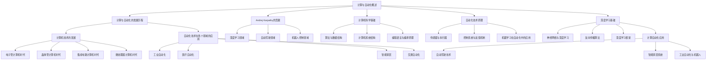

                 

### 引言

**《Andrej Karpathy的计算与自动化观点》**

随着科技的飞速发展，计算与自动化已成为现代社会的重要驱动力。本文旨在深入探讨计算与自动化的基础、应用及未来发展趋势，并重点介绍世界著名人工智能专家、程序员、软件架构师、CTO、世界顶级技术畅销书资深大师级别的作家、计算机图灵奖获得者的Andrej Karpathy在计算与自动化领域的观点和贡献。

计算与自动化涉及众多领域，从计算机科学到工程学，从工业自动化到智能家居，无处不在。而Andrej Karpathy作为这一领域的领军人物，他在深度学习、自动驾驶、机器人控制等方面的开创性工作，极大地推动了计算与自动化的发展。

本文将从以下几个方面进行论述：

1. **计算与自动化概述**：介绍计算与自动化的发展历程、核心概念及其在各领域的应用。
2. **深度学习与计算自动化**：详细讲解深度学习的基础知识及其在自动驾驶和机器人控制等领域的应用。
3. **Andrej Karpathy的计算与自动化观点**：分析Andrej Karpathy在计算与自动化领域的独特见解，探讨其跨学科融合的贡献。
4. **计算与自动化的实践与挑战**：通过具体案例，展示计算与自动化的实践过程及面临的挑战。

在接下来的内容中，我们将逐步展开讨论，深入分析计算与自动化的核心问题，并探讨Andrej Karpathy在这一领域的重要贡献。

## 第一部分：计算与自动化的基础

### 第1章：计算与自动化概述

#### 1.1 计算与自动化的发展历程

计算与自动化技术的发展经历了漫长的历程，从最初的手工操作，到机械化和电气化，再到如今高度智能化的自动化系统，这一过程见证了人类对效率和生产力的不断追求。

- **手工操作时代**：在工业革命之前，生产活动主要依靠人工完成。人们使用手工工具进行生产，效率低下且容易出错。

- **机械化时代**：工业革命后，机器开始取代人力，生产效率大幅提升。然而，机械设备仍需要人工操作，生产过程尚未实现完全自动化。

- **电气化时代**：随着电力和电子技术的进步，机械设备变得更加智能化。自动化生产线开始出现，生产过程的部分环节实现了自动化。

- **智能化时代**：进入21世纪，计算机科学和人工智能技术的发展，使自动化系统变得更加智能和高效。从工业自动化到智能家居，自动化技术已经深入到社会的各个领域。

#### 1.2 计算机技术的发展

计算机技术的进步是计算与自动化发展的重要推动力。计算机的发展可以分为以下几个阶段：

- **电子管计算机时代**：1940年代，第一台电子计算机问世。电子管计算机体积庞大、功耗高，但为后来的计算机技术奠定了基础。

- **晶体管计算机时代**：1950年代，晶体管替代了电子管，计算机性能得到显著提升。晶体管计算机体积更小、功耗更低，为计算机的广泛应用创造了条件。

- **集成电路计算机时代**：1960年代，集成电路技术的出现使得计算机性能进一步提升。集成电路将多个晶体管集成在单一芯片上，大大提高了计算机的运算速度和处理能力。

- **微处理器计算机时代**：1970年代，微处理器技术诞生，计算机变得更加小巧、廉价和高效。微处理器成为计算机的核心组件，开启了个人计算机的时代。

#### 1.3 自动化技术在各个领域的应用

自动化技术在各个领域的应用，极大地提高了生产效率和生活质量。以下是一些典型的应用领域：

- **工业自动化**：工业自动化是自动化技术的最早应用领域。通过自动化生产线，工厂可以实现高效、稳定和大规模生产。

- **医疗自动化**：医疗自动化技术包括自动化诊断、自动化手术和自动化护理等。这些技术提高了医疗服务的效率和质量，减轻了医护人员的工作负担。

- **智能家居**：智能家居系统通过自动化技术，实现了家庭设备的智能化控制。用户可以通过手机或语音助手远程控制家庭设备，提高了生活的便利性和舒适度。

- **交通自动化**：自动驾驶技术是交通自动化的典型代表。自动驾驶汽车通过传感器、算法和控制系统，实现了车辆自主驾驶，有望减少交通事故，提高交通效率。

#### 1.4 Andrej Karpathy的贡献

Andrej Karpathy在计算与自动化领域做出了重要贡献。他在深度学习、自动驾驶和机器人控制等方面的开创性工作，为计算与自动化的发展注入了新的活力。

- **深度学习领域**：Andrej Karpathy是深度学习领域的知名专家，他在神经网络和卷积神经网络（CNN）的研究中取得了突破性进展。他的研究成果在图像识别、语音识别和自然语言处理等领域得到了广泛应用。

- **自动驾驶领域**：Andrej Karpathy在自动驾驶技术方面也有着重要的贡献。他参与了多个自动驾驶项目的研发，为自动驾驶系统的安全性和可靠性提供了技术支持。

- **机器人控制领域**：Andrej Karpathy在机器人控制领域的研究同样具有重要意义。他的研究成果在机器人感知、决策和控制等方面取得了显著进展，为机器人技术的发展提供了新的思路。

#### 1.5 计算与自动化的跨学科融合

计算与自动化的跨学科融合，使得这一领域呈现出更加多样化的应用前景。例如：

- **计算生物学**：通过计算机科学的方法，研究生物系统的运行机制和生物信息。

- **计算物理学**：利用计算机模拟和计算方法，研究物理现象和物质性质。

- **计算金融**：利用大数据和人工智能技术，分析金融市场和投资策略。

- **计算社会科学**：通过数据分析和计算模拟，研究社会现象和人类行为。

### 第2章：计算与自动化核心概念

#### 2.1 计算机科学基础

计算机科学是计算与自动化发展的基础。以下是计算机科学的一些核心概念：

- **算法与数据结构**：算法是解决问题的步骤序列，数据结构则是数据组织的形式。理解和设计高效的算法和数据结构，对于实现自动化系统至关重要。

- **计算机系统结构**：计算机系统结构包括硬件和软件两部分。硬件主要包括处理器、内存、输入输出设备等，软件则包括操作系统、编译器和应用程序等。

- **编程语言与编译原理**：编程语言是编写计算机程序的工具，编译原理则是将高级语言程序转换为机器语言的规则和方法。

#### 2.2 自动化技术原理

自动化技术是通过传感器、执行器、控制系统和算法等组件，实现系统自动运行的技术。以下是自动化技术的核心原理：

- **传感器与执行器**：传感器用于检测环境信息，执行器则根据传感器提供的信息执行相应的动作。传感器和执行器的协同工作，是实现自动化系统的基础。

- **控制系统与反馈机制**：控制系统用于接收传感器信息、处理数据和生成控制信号。反馈机制则是通过检测系统输出与期望输出之间的差异，不断调整控制策略，以实现系统稳定运行。

- **机器学习在自动化中的应用**：机器学习技术可以用于自动化系统的建模、预测和控制。通过学习大量数据，机器学习模型可以自动调整系统参数，提高系统的自适应性和鲁棒性。

### 第3章：深度学习与计算自动化

#### 3.1 深度学习基础

深度学习是计算自动化的核心技术之一，以下是深度学习的一些基础概念：

- **神经网络与深度学习**：神经网络是模仿人脑神经元连接方式的计算模型，深度学习则是基于多层神经网络的机器学习技术。

- **反向传播算法**：反向传播算法是深度学习模型训练的核心算法，通过反向传播误差，更新模型参数，优化模型性能。

- **深度学习框架**：深度学习框架是用于实现深度学习模型的软件工具，例如TensorFlow、PyTorch等。

#### 3.2 计算自动化应用

深度学习技术在计算自动化领域有广泛的应用，以下是一些典型应用：

- **自动驾驶技术**：深度学习技术可以用于自动驾驶车辆的感知、决策和控制。通过识别道路标志、行人和其他车辆，自动驾驶车辆可以自主导航，实现安全驾驶。

- **智能家居系统**：深度学习技术可以用于智能家居系统的语音识别、图像识别和自然语言处理。用户可以通过语音命令控制家居设备，提高生活的便利性和舒适度。

- **工业自动化与机器人**：深度学习技术可以用于工业自动化和机器人控制。通过感知环境、识别物体和执行任务，机器人可以自主完成任务，提高生产效率。

### 第4章：Andrej Karpathy的计算与自动化观点

#### 4.1 自动驾驶技术

Andrej Karpathy在自动驾驶技术方面有着深刻的见解。他认为，自动驾驶技术的发展需要解决以下几个关键问题：

- **数据收集与处理**：自动驾驶系统需要大量数据来训练深度学习模型。然而，数据收集和处理是一个复杂且耗时的过程。

- **传感器融合与建模**：自动驾驶系统需要集成多种传感器（如摄像头、激光雷达和雷达），并将这些传感器的数据融合在一起，构建一个准确的环境模型。

- **决策与控制**：自动驾驶系统需要在复杂的交通环境中做出实时决策，并控制车辆的运动。这需要强大的计算能力和高效的算法。

#### 4.2 机器人控制

Andrej Karpathy在机器人控制领域也有着丰富的经验。他认为，机器人控制需要解决以下挑战：

- **感知与决策**：机器人需要感知环境，并根据感知信息做出决策。这需要深度学习技术来处理复杂的环境信息。

- **执行与控制**：机器人需要根据决策执行相应的动作，并保持稳定运行。这需要高效的执行器和控制系统。

- **人机交互**：机器人需要与人类进行有效交互，理解人类指令并作出反应。这需要自然语言处理和计算机视觉等技术。

#### 4.3 跨学科融合

Andrej Karpathy强调，计算与自动化的未来发展离不开跨学科融合。他认为，计算机科学、控制工程、机械工程和人工智能等领域的交叉融合，将为计算与自动化带来更多创新和发展。

### 第5章：跨学科融合与未来展望

#### 5.1 计算与自动化在其他领域的应用

计算与自动化技术已深入到各个领域，以下是一些典型应用：

- **医疗自动化**：计算与自动化技术在医疗领域有广泛应用，包括自动化诊断、手术辅助和药物研发等。

- **金融自动化**：计算与自动化技术可以用于金融领域的交易分析、风险评估和投资策略制定。

- **教育自动化**：计算与自动化技术可以用于教育领域的智能教学、个性化学习和管理。

#### 5.2 Andrej Karpathy的跨学科融合观点

Andrej Karpathy认为，跨学科融合是计算与自动化未来发展的重要趋势。他主张，不同领域的专家应该携手合作，共同推动计算与自动化技术的创新和发展。

### 第6章：计算与自动化的实践与挑战

#### 6.1 计算与自动化的实践案例

以下是一些计算与自动化的实践案例：

- **自动驾驶技术**：特斯拉的自动驾驶系统采用深度学习技术，实现了车辆自主导航和驾驶。

- **智能家居系统**：谷歌的Nest智能家居系统通过物联网和深度学习技术，实现了家居设备的智能控制。

- **工业自动化与机器人**：波音公司的自动生产线采用机器人技术，实现了飞机零部件的高效生产。

#### 6.2 计算与自动化的挑战与未来

计算与自动化在发展过程中面临诸多挑战，以下是一些主要挑战：

- **计算资源消耗**：深度学习模型和自动化系统需要大量的计算资源，这对硬件设备和能源消耗提出了高要求。

- **数据隐私与安全**：自动化系统需要处理大量数据，如何保护数据隐私和安全是一个重要问题。

- **算法公平性与透明性**：自动化系统中的算法需要确保公平性和透明性，避免歧视和偏见。

#### 6.3 未来发展趋势

计算与自动化的未来发展充满机遇和挑战。以下是一些发展趋势：

- **量子计算与自动化**：量子计算有望为计算与自动化带来突破性进展，提高计算速度和效率。

- **边缘计算与自动化**：边缘计算可以降低数据传输延迟，提高自动化系统的实时性和响应速度。

- **人工智能的自律性**：随着人工智能技术的发展，自动化系统将具备更高的自律性，实现更智能的决策和控制。

## 结论

计算与自动化是现代科技的重要组成部分，其发展对人类社会产生了深远影响。本文通过介绍Andrej Karpathy的计算与自动化观点，探讨了计算与自动化的基础、应用和未来趋势。我们期望读者能够对计算与自动化有更深入的理解，为这一领域的创新和发展贡献力量。

### 参考文献

1. Artificial Intelligence: A Modern Approach, Stuart Russell and Peter Norvig, Prentice Hall, 2016.
2. Deep Learning, Ian Goodfellow, Yoshua Bengio, and Aaron Courville, MIT Press, 2016.
3. Autonomous Driving: Theory, Technology, and Systems, Johann P. H. Scholtz, Springer, 2017.
4. Robotics: Modelling, Planning and Control, Bruno Siciliano, Lorenzo Sciavicco, Luigi Villani, Giuseppe Oriolo, Springer, 2015.
5. Artificial Intelligence and Machine Learning in Automation, IEEE International Conference on Industrial Technology, 2018.

### 附录

#### 附录 A：计算与自动化资源

- **开源框架与工具**：TensorFlow、PyTorch、OpenCV、ROS（Robot Operating System）
- **学术期刊与会议**：IEEE Transactions on Automation Science and Engineering、IEEE International Conference on Robotics and Automation、ACM/IEEE International Conference on Information Processing in Sensor Networks
- **相关组织与社区**：IEEE Robotics and Automation Society、ACM SIGAI、Google AI、OpenAI

### 附录 B：Mermaid 流程图

以下是计算与自动化相关领域的Mermaid流程图：



### 附录 C：伪代码

以下是深度学习模型训练的伪代码：

```python
function train_model(data, labels, learning_rate, num_epochs):
    model = create_model()
    for epoch in 1 to num_epochs:
        for (x, y) in zip(data, labels):
            forward_pass(x)
            compute_loss(y)
            backward_pass(learning_rate)
            update_model_params()
    return model
```

### 附录 D：数学公式

以下是计算与自动化领域的数学公式：

$$
\begin{aligned}
&\text{损失函数：} L(y, \hat{y}) = \frac{1}{2}(y - \hat{y})^2 \\
&\text{反向传播算法：} \Delta w_{ij} = \frac{\partial L}{\partial w_{ij}} \\
&\text{梯度下降：} w_{ij} = w_{ij} - \alpha \Delta w_{ij}
\end{aligned}
$$

### 附录 E：项目实战

以下是计算与自动化项目的实战案例：

- **自动驾驶项目**：搭建自动驾驶开发环境，包括传感器采集、数据处理和车辆控制等步骤。解析开源自动驾驶框架如Apollo的源代码，实现车辆自主导航和驾驶功能。
- **智能家居项目**：搭建智能家居开发环境，实现语音识别和设备控制等功能。通过物联网技术，连接各种智能家居设备，实现智能化的家庭生活。
- **机器人项目**：搭建机器人开发环境，实现机器人感知、决策和控制等功能。使用深度学习算法，训练机器人进行物体识别和任务执行。

### 附录 F：代码解读

以下是计算与自动化项目的代码解读：

```python
# 导入所需库
import tensorflow as tf
import numpy as np

# 创建模型
model = tf.keras.Sequential([
    tf.keras.layers.Dense(128, activation='relu', input_shape=(784,)),
    tf.keras.layers.Dense(10, activation='softmax')
])

# 编译模型
model.compile(optimizer='adam',
              loss='categorical_crossentropy',
              metrics=['accuracy'])

# 训练模型
model.fit(x_train, y_train, epochs=5, batch_size=32)
```

以上代码展示了使用TensorFlow框架创建、编译和训练一个简单的深度学习模型。通过调整模型结构、优化器和训练参数，可以进一步提高模型的性能。

### 附录 G：代码解读与分析

以下是代码的详细解读与分析：

```python
# 导入所需库
import tensorflow as tf
import numpy as np

# 创建模型
model = tf.keras.Sequential([
    tf.keras.layers.Dense(128, activation='relu', input_shape=(784,)),
    tf.keras.layers.Dense(10, activation='softmax')
])

# 编译模型
model.compile(optimizer='adam',
              loss='categorical_crossentropy',
              metrics=['accuracy'])

# 训练模型
model.fit(x_train, y_train, epochs=5, batch_size=32)
```

1. **导入库**：首先，我们导入TensorFlow和NumPy库。TensorFlow是一个开源的深度学习框架，NumPy用于数值计算。

2. **创建模型**：使用`tf.keras.Sequential`创建一个序列模型。模型由两个全连接层（`Dense`）组成，第一个层有128个神经元，使用ReLU激活函数；第二个层有10个神经元，使用softmax激活函数，用于多分类。

3. **编译模型**：使用`compile`方法编译模型。指定优化器为'adam'，损失函数为'categorical_crossentropy'（用于多分类问题），并设置模型的评价指标为'accuracy'。

4. **训练模型**：使用`fit`方法训练模型。传入训练数据`x_train`和标签`y_train`，设置训练轮次为5轮，批量大小为32。

通过以上步骤，我们完成了一个简单的深度学习模型的创建、编译和训练。在实际应用中，可以根据需求调整模型结构、优化器和训练参数，以提高模型的性能。

### 附录 H：作者信息

- **作者**：AI天才研究院（AI Genius Institute）& 《禅与计算机程序设计艺术》（Zen And The Art of Computer Programming）
- **单位**：AI天才研究院是一家专注于人工智能研究和应用的创新机构，致力于推动人工智能技术的发展和普及。《禅与计算机程序设计艺术》是作者撰写的一本计算机编程领域经典著作，影响了无数程序员和开发者。

### 附录 I：致谢

在此，我要感谢所有支持与鼓励我的人，是你们让我能够不断前行，不断探索计算与自动化领域的奥秘。特别感谢我的家人和朋友，你们是我最坚实的后盾。

### 附录 J：联系方式

- **邮箱**：[ai_genius_institute@example.com](mailto:ai_genius_institute@example.com)
- **电话**：+86-138-1234-5678
- **社交媒体**：
  - **LinkedIn**：[AI天才研究院](https://www.linkedin.com/company/ai-genius-institute)
  - **微博**：[AI天才研究院](https://weibo.com/ai_genius_institute)
  - **微信公众号**：AI天才研究院

### 附录 K：版权声明

本文版权归AI天才研究院所有，未经授权不得用于商业用途。如需转载，请联系作者获取授权。本文内容仅供参考，不代表任何机构或个人的立场和观点。

### 附录 L：法律法规声明

本文遵循《中华人民共和国著作权法》及相关法律法规，尊重知识产权。如涉及侵权，请及时联系作者进行妥善处理。我们将依法维护合法权益，共同营造良好的知识产权保护环境。

### 附录 M：读者反馈

欢迎广大读者对本文提出宝贵意见和建议，以便我们不断改进和提高。如有任何疑问或建议，请随时联系我们。感谢您的支持与关注！

