                 

 

# 《Andrej Karpathy：人工智能的未来发展趋势》

## 关键词
人工智能、深度学习、机器学习、自然语言处理、自动驾驶、医疗保健、伦理道德、未来趋势

## 摘要
本文旨在探讨人工智能（AI）领域的未来发展，结合著名AI专家Andrej Karpathy的研究成果，从历史、技术原理、应用实战和未来趋势等多个角度，深入分析AI的核心概念、关键技术及其对社会的深远影响。通过详细的流程图、伪代码、数学公式和实战案例，本文为读者提供了一次全面而深入的AI学习之旅。

## 第一部分 人工智能概述

### 第1章 人工智能的起源与发展

#### 1.1 人工智能的概念与历史

人工智能（Artificial Intelligence，简称AI）是指使计算机模拟人类智能行为的技术和理论。其概念最早可以追溯到20世纪50年代，当时科学家们开始探讨如何让计算机具备智能。从最初的逻辑推理系统，到现在的深度学习和机器学习，人工智能经历了数十年的发展。

##### 1.1.1 人工智能的概念

人工智能的核心目标是使计算机具有人类智能的各种能力，包括感知、理解、推理、学习和决策。为了实现这个目标，研究人员采用了多种方法和技术，如逻辑推理、知识表示、机器学习、神经网络等。

##### 1.1.2 人工智能的发展历程

人工智能的发展历程可以分为几个阶段：

- **早期探索（1956-1969）**：这个时期，人工智能的概念被提出，并且进行了初步的实验和理论探讨。

- **黄金时期（1970-1980）**：在这个时期，人工智能迎来了第一次繁荣，但随后由于过高的期望和实际实现的困难，导致了一段“人工智能寒冬”。

- **复兴时期（1980-2010）**：随着计算能力的提升和机器学习技术的发展，人工智能再次迎来了快速发展。

- **深度学习时代（2010至今）**：深度学习技术的突破，使得人工智能在图像识别、语音识别、自然语言处理等领域取得了显著成果。

#### 1.2 人工智能的关键技术

##### 1.2.1 机器学习

机器学习（Machine Learning）是人工智能的核心技术之一，它使计算机能够从数据中学习规律，并自动改进性能。机器学习可以分为监督学习、非监督学习和强化学习三大类。

###### 1.2.1.1 监督学习

监督学习（Supervised Learning）是一种机器学习方法，它使用标记数据进行训练，并通过标记数据来评估模型的性能。常见的监督学习方法包括线性回归、决策树、支持向量机等。

- **线性回归**：一种用于预测数值型输出的方法。
- **决策树**：一种用于分类和回归的树形结构模型。
- **支持向量机**：一种基于最大间隔分类的方法。

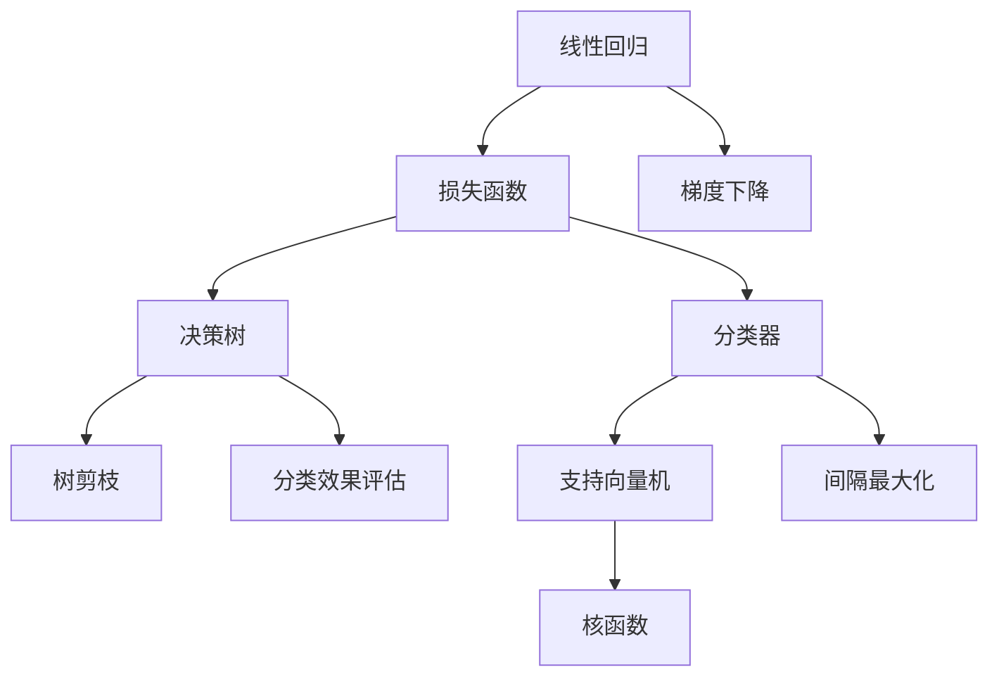

###### 1.2.1.2 非监督学习

非监督学习（Unsupervised Learning）不使用标记数据，而是通过发现数据中的模式和结构来学习。常见的非监督学习方法包括聚类、降维等。

- **聚类算法**：如K-均值、层次聚类等，用于将相似的数据点分组。
- **降维算法**：如主成分分析（PCA），用于减少数据的维度。

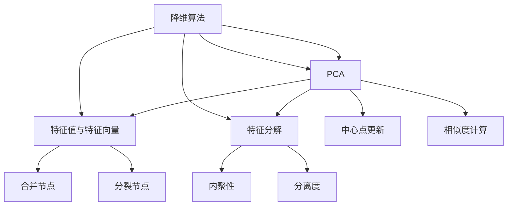

###### 1.2.1.3 强化学习

强化学习（Reinforcement Learning）是一种通过与环境互动来学习策略的机器学习方法。强化学习的目标是最大化累积奖励。

- **强化学习模型**：包括状态（State）、动作（Action）、奖励（Reward）和策略（Policy）。
- **强化学习算法**：如Q学习、SARSA等。

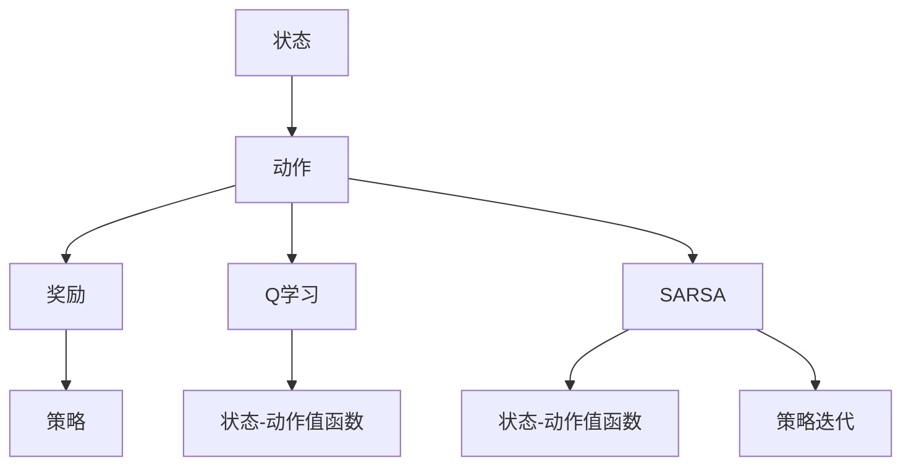

##### 1.2.2 深度学习

深度学习（Deep Learning）是一种基于神经网络的机器学习方法，通过多层非线性变换来学习数据的高层次特征。

###### 1.2.2.1 神经网络基础

神经网络（Neural Network）是一种由大量简单神经元组成的网络，用于模拟生物神经系统的信息处理过程。

- **神经网络结构**：包括输入层、隐藏层和输出层。
- **激活函数**：如ReLU、Sigmoid、Tanh等，用于引入非线性特性。

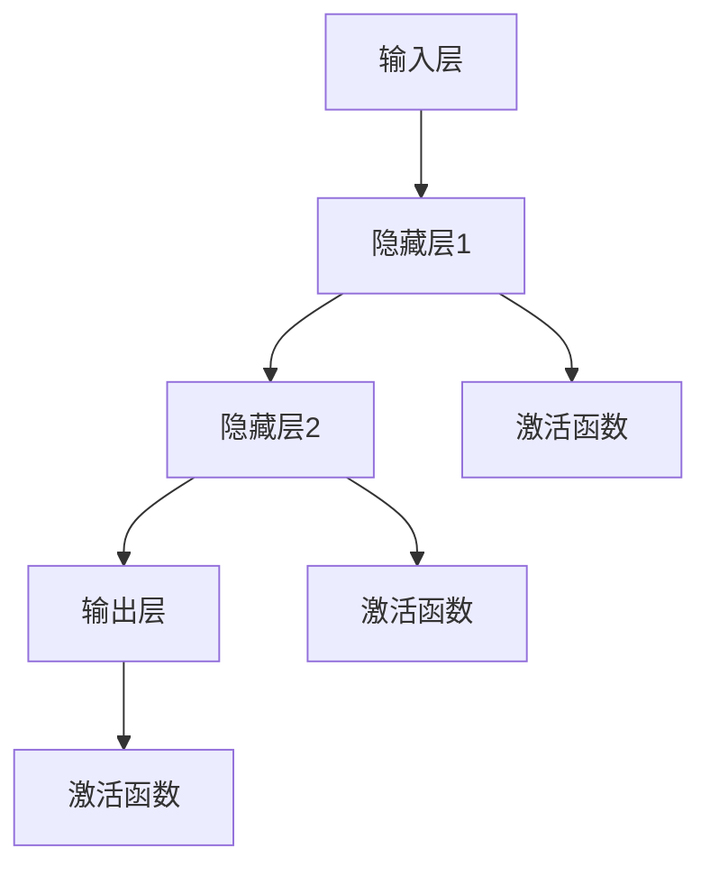

###### 1.2.2.2 深度学习算法

深度学习算法包括多层感知机（MLP）、卷积神经网络（CNN）、循环神经网络（RNN）、生成对抗网络（GAN）等。

- **卷积神经网络（CNN）**：用于图像识别和计算机视觉领域。
- **循环神经网络（RNN）**：用于序列数据处理和自然语言处理。
- **生成对抗网络（GAN）**：用于生成高逼真的图像和数据。

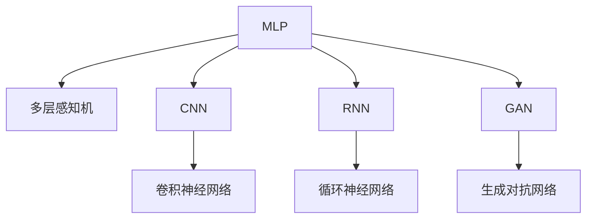

##### 1.2.3 自然语言处理

自然语言处理（Natural Language Processing，简称NLP）是人工智能的一个分支，旨在使计算机能够理解和处理人类语言。

- **词向量表示**：如Word2Vec、GloVe等，用于将单词转换为向量表示。
- **序列标注**：如命名实体识别（NER）、词性标注等，用于对文本序列进行分类。
- **机器翻译**：如基于神经网络的机器翻译（NMT），用于将一种语言翻译成另一种语言。

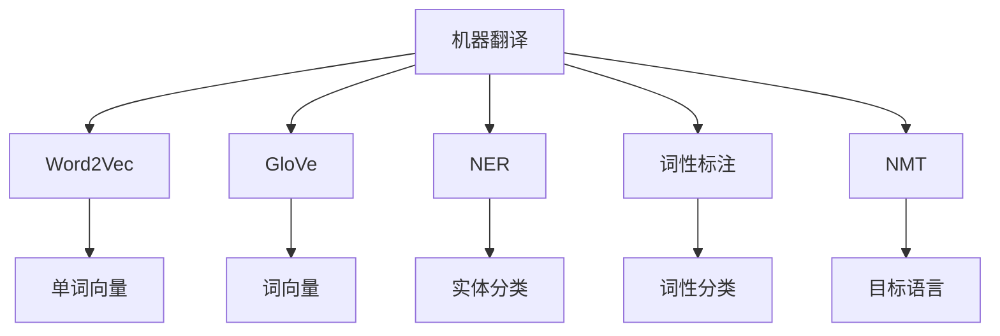

#### 1.3 人工智能的应用领域

##### 1.3.1 智能语音助手

智能语音助手（如Siri、Alexa、Google Assistant）是人工智能在消费电子领域的典型应用。它们通过语音识别和自然语言处理技术，为用户提供语音交互服务。

- **语音识别**：将语音信号转换为文本。
- **自然语言理解**：理解用户的意图和问题。
- **语音合成**：生成自然的语音回应。

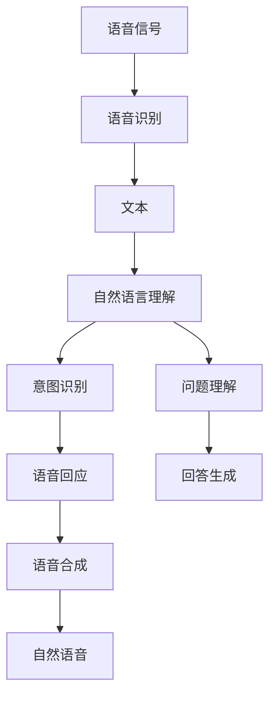

##### 1.3.2 自动驾驶

自动驾驶技术是人工智能在交通运输领域的重大应用。通过感知环境、理解道路场景和自动控制，自动驾驶汽车可以自主驾驶。

- **感知环境**：使用传感器（如雷达、激光雷达）获取周围环境信息。
- **道路场景识别**：使用计算机视觉技术识别道路上的物体和交通标志。
- **自动控制**：使用控制系统实现车辆的自动行驶。

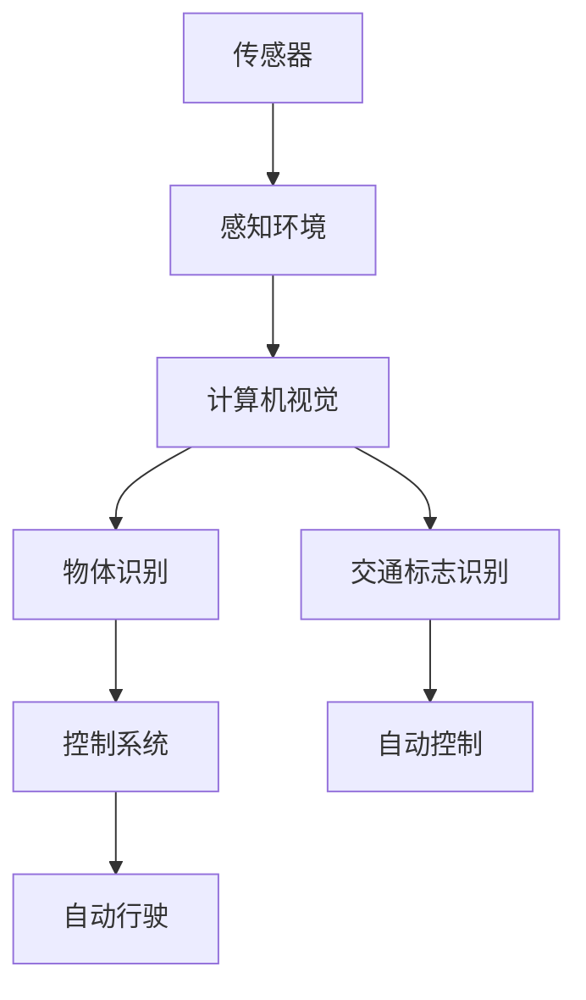

##### 1.3.3 医疗保健

人工智能在医疗保健领域的应用包括医学图像分析、智能诊断、患者管理等方面。

- **医学图像分析**：使用深度学习技术分析医学图像，如X光片、CT扫描等。
- **智能诊断**：使用机器学习技术辅助医生进行疾病诊断。
- **患者管理**：使用数据分析技术优化患者管理流程。

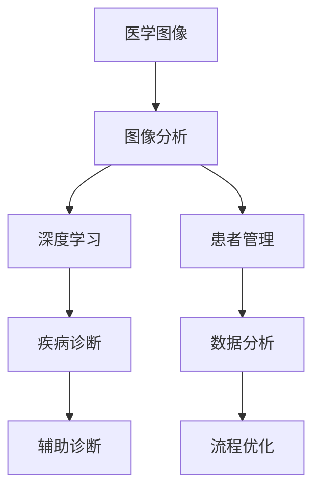

### 第2章 人工智能的架构与原理

#### 2.1 人工智能的架构

人工智能的架构包括数据采集、数据处理、模型训练、模型评估和模型部署五个主要阶段。

##### 2.1.1 数据采集与预处理

数据采集是指从各种来源获取数据，包括公开数据集、企业内部数据和用户生成数据等。数据预处理包括数据清洗、数据整合和数据标准化等步骤。

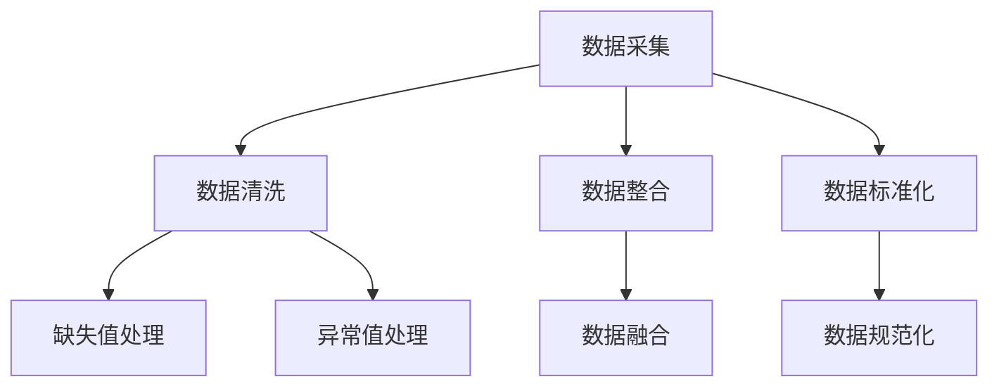

##### 2.1.2 特征提取与选择

特征提取是指从原始数据中提取出对模型训练有用的信息。特征选择是指从提取出的特征中选择出对模型性能有显著影响的特征。

- **特征提取方法**：如降维、特征工程等。
- **特征选择方法**：如信息增益、主成分分析等。

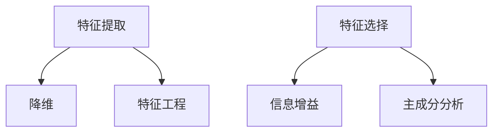

##### 2.1.3 模型训练与评估

模型训练是指使用数据对机器学习模型进行训练，使其能够对未知数据进行预测。模型评估是指使用测试数据对训练好的模型进行性能评估。

- **训练方法**：如梯度下降、随机梯度下降等。
- **评估指标**：如准确率、召回率、F1值等。

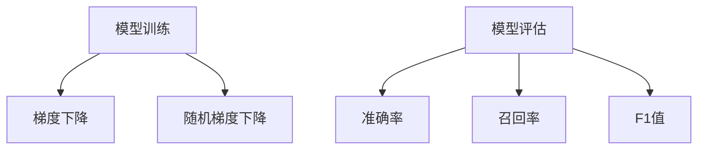

##### 2.1.4 模型部署与应用

模型部署是指将训练好的模型部署到实际应用场景中，使其能够为用户提供服务。模型应用包括实时预测、批处理预测等。

- **部署方法**：如云服务、容器化、边缘计算等。
- **应用场景**：如智能推荐、实时监控、自动化控制等。

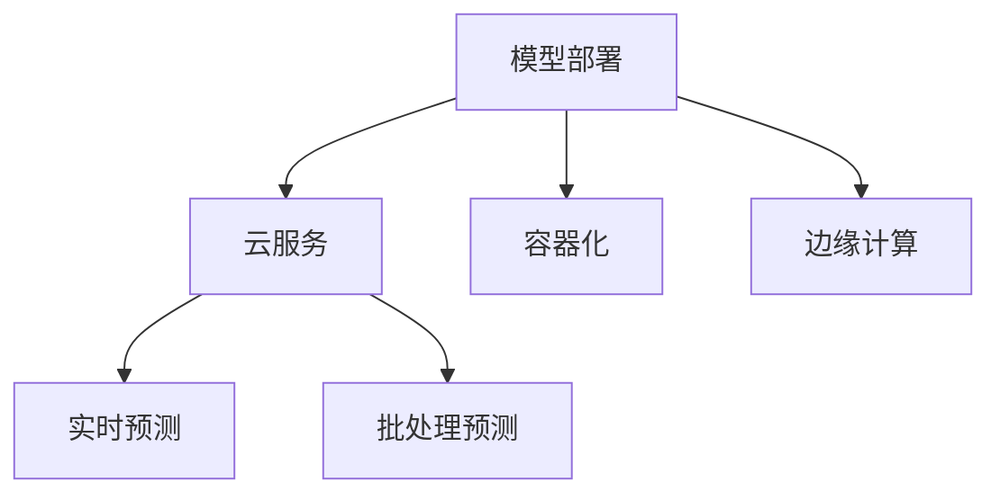

## 第二部分 人工智能技术实战

### 第3章 智能语音助手开发

#### 3.1 智能语音助手概述

智能语音助手是一种能够通过语音与用户交互的人工智能系统。它通常包含语音识别、自然语言理解和语音合成三个主要模块。

##### 3.1.1 功能与实现

智能语音助手的主要功能包括：

- **语音识别**：将语音转换为文本。
- **自然语言理解**：解析文本，提取用户的意图。
- **语音合成**：生成语音回应。

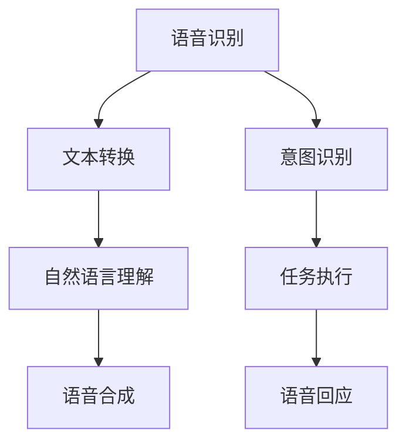

##### 3.1.2 开发流程

智能语音助手的开发通常包括以下几个步骤：

1. **需求分析**：明确智能语音助手的功能和目标用户。
2. **技术选型**：选择合适的语音识别、自然语言理解和语音合成技术。
3. **数据采集**：收集语音数据和对应的文本标注数据。
4. **模型训练**：使用收集的数据训练语音识别和自然语言理解模型。
5. **集成与部署**：将模型集成到应用中，并进行部署。

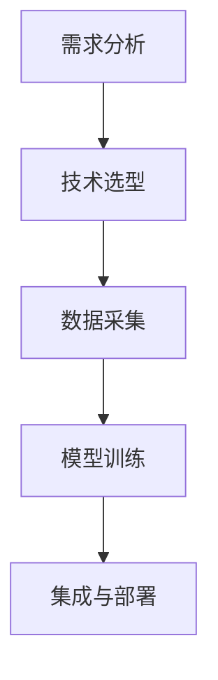

##### 3.1.3 开发实战

以下是一个简单的智能语音助手的开发案例：

```python
# 导入相关库
import speech_recognition as sr
import pyttsx3

# 初始化语音识别和语音合成引擎
recognizer = sr.Recognizer()
engine = pyttsx3.init()

# 定义语音识别函数
def recognize_speech_from_mic():
    with sr.Microphone() as source:
        print("请开始说话...")
        audio = recognizer.listen(source)
        try:
            text = recognizer.recognize_google(audio, language='zh-CN')
            print(f"你说了：{text}")
            return text
        except sr.UnknownValueError:
            print("无法理解语音")
            return None
        except sr.RequestError:
            print("请求错误")
            return None

# 定义语音合成函数
def speak(text):
    engine.say(text)
    engine.runAndWait()

# 实现交互功能
while True:
    user_input = recognize_speech_from_mic()
    if user_input is not None:
        speak("好的，我已经听到了你的话。")
        # 这里可以添加更多的交互逻辑
    else:
        speak("很抱歉，我无法听到你的话。")
```

#### 3.2 开发流程与技巧

##### 3.2.1 数据采集与处理

数据采集是智能语音助手开发的关键步骤。通常需要收集大量的语音数据和对应的文本标注数据。以下是一个简单的数据采集和处理流程：

1. **采集语音数据**：使用麦克风录制语音。
2. **标注文本数据**：将语音转录为文本，并进行意图标注。
3. **数据清洗**：去除噪音数据，统一数据格式。

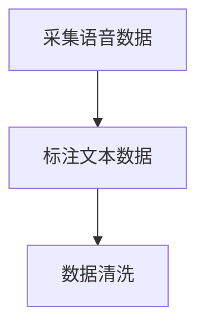

##### 3.2.2 语音识别与语义理解

语音识别是将语音信号转换为文本的过程。语义理解则是从文本中提取出用户的意图。以下是一个简单的实现：

```python
import speech_recognition as sr
from transformers import pipeline

# 初始化语音识别引擎
recognizer = sr.Recognizer()

# 初始化语义理解模型
nlp = pipeline("text-classification")

# 定义语音识别与语义理解函数
def recognize_and_understand_speech(audio):
    text = recognizer.recognize_google(audio, language='zh-CN')
    label = nlp(text)[0]['label']
    return text, label

# 采集语音并执行识别与理解
with sr.Microphone() as source:
    audio = recognizer.listen(source)
    text, label = recognize_and_understand_speech(audio)
    print(f"文本：{text}")
    print(f"意图：{label}")
```

##### 3.2.3 语音合成与响应生成

语音合成是将文本转换为语音的过程。响应生成则是根据用户的意图生成合适的回应。以下是一个简单的实现：

```python
import pyttsx3

# 初始化语音合成引擎
engine = pyttsx3.init()

# 定义语音合成函数
def speak(text):
    engine.say(text)
    engine.runAndWait()

# 生成响应
response = "你好，我是你的智能语音助手。"
speak(response)
```

### 第4章 自动驾驶技术

#### 4.1 自动驾驶概述

自动驾驶是人工智能在交通运输领域的应用，旨在实现车辆自主行驶。自动驾驶汽车通常包含感知环境、理解道路场景和自动控制三个主要模块。

##### 4.1.1 技术发展与应用场景

自动驾驶技术的发展可以分为几个阶段：

1. **辅助驾驶**：车辆提供一些辅助功能，如车道保持、自动刹车等。
2. **部分自动驾驶**：车辆可以执行部分驾驶任务，如高速公路自动驾驶。
3. **完全自动驾驶**：车辆可以在所有情况下自主行驶，无需人为干预。

自动驾驶的应用场景包括：

- **城市交通**：自动驾驶出租车、自动驾驶公交车等。
- **高速公路**：自动驾驶货车、自动驾驶轿车等。
- **物流运输**：自动驾驶卡车、自动驾驶无人机等。

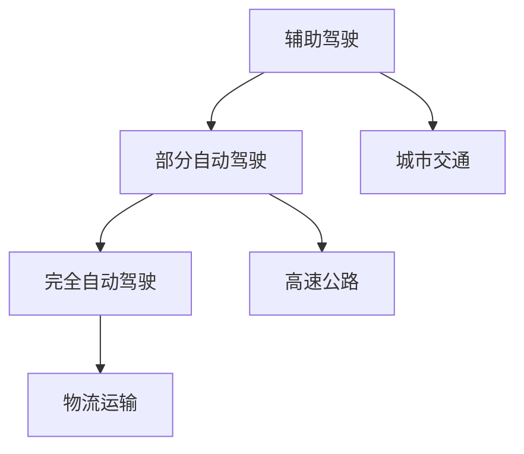

##### 4.1.2 技术架构

自动驾驶汽车的技术架构通常包括以下几个部分：

1. **感知系统**：使用多种传感器（如摄像头、激光雷达、雷达）获取周围环境信息。
2. **数据处理**：对感知系统获取的数据进行处理和分析，以提取有用的信息。
3. **决策系统**：根据处理后的信息，制定行驶策略和决策。
4. **控制系统**：执行决策系统的指令，控制车辆的行驶。

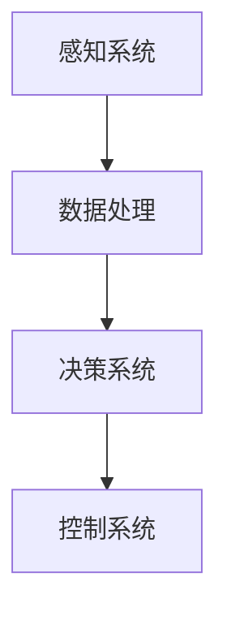

#### 4.2 自动驾驶关键技术

##### 4.2.1 感知环境

感知环境是自动驾驶汽车的关键技术之一，主要包括以下内容：

1. **摄像头**：用于捕捉道路场景和交通标志。
2. **激光雷达**：用于获取高精度的三维环境信息。
3. **雷达**：用于检测周围物体的距离和速度。

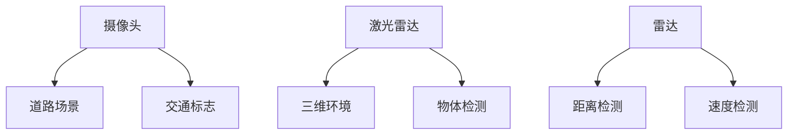

##### 4.2.2 道路场景识别

道路场景识别是指从感知系统获取的数据中提取出道路场景信息，以辅助自动驾驶汽车进行行驶决策。主要包括以下内容：

1. **车道线检测**：用于检测车道线的位置和方向。
2. **交通标志识别**：用于识别交通标志的类型和位置。
3. **行人检测**：用于检测行人及其位置。

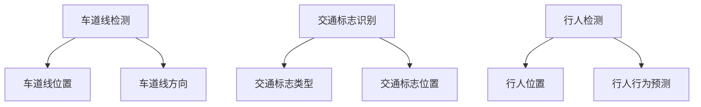

##### 4.2.3 制动控制

制动控制是自动驾驶汽车的重要组成部分，用于实现车辆的安全制动。主要包括以下内容：

1. **制动系统**：包括制动踏板、制动液、刹车盘等。
2. **制动策略**：根据车辆状态和环境信息，制定合适的制动策略。
3. **制动执行**：执行制动策略，实现车辆减速或停止。

```mermaid
graph TD
    A[制动系统] --> B[制动踏板]
    A --> C[制动液]
    A --> D[刹车盘]
    E[制动策略] --> F[车辆状态]
    E --> G[环境信息]
    H[制动执行] --> I[减速]
    H --> J[停止]
```

#### 4.3 自动驾驶实战案例

##### 4.3.1 案例一：实现一个简单的自动驾驶系统

以下是一个简单的自动驾驶系统实现，该系统使用摄像头和激光雷达进行环境感知，并使用简单的决策策略实现自动驾驶。

```python
import cv2
import numpy as np
import matplotlib.pyplot as plt
from collections import deque

# 初始化摄像头和激光雷达
camera = cv2.VideoCapture(0)
laser = Laser()

# 初始化环境感知队列
image_deque = deque(maxlen=5)
distance_deque = deque(maxlen=5)

# 初始化决策策略
strategy = Strategy()

# 实现自动驾驶循环
while True:
    # 采集摄像头数据
    ret, frame = camera.read()
    image_deque.append(frame)

    # 采集激光雷达数据
    distance = laser.get_distance()
    distance_deque.append(distance)

    # 更新环境感知
    image = image_deque[-1]
    distance = distance_deque[-1]

    # 执行决策策略
    action = strategy.decide(image, distance)

    # 执行行动
    if action == "accelerate":
        # 加速
        print("加速")
    elif action == "decelerate":
        # 减速
        print("减速")
    elif action == "brake":
        # 刹车
        print("刹车")

    # 显示摄像头数据
    cv2.imshow('Camera', image)

    # 按下ESC键退出
    if cv2.waitKey(1) & 0xFF == 27:
        break

# 释放摄像头和激光雷达
camera.release()
laser.release()
cv2.destroyAllWindows()
```

##### 4.3.2 案例二：基于深度学习的自动驾驶系统开发

以下是一个基于深度学习的自动驾驶系统实现，该系统使用卷积神经网络进行环境感知，并使用强化学习算法进行决策。

```python
import tensorflow as tf
from tensorflow.keras.models import Sequential
from tensorflow.keras.layers import Conv2D, Flatten, Dense
from tensorflow.keras.optimizers import Adam

# 定义卷积神经网络模型
model = Sequential([
    Conv2D(32, (3, 3), activation='relu', input_shape=(224, 224, 3)),
    Conv2D(64, (3, 3), activation='relu'),
    Flatten(),
    Dense(64, activation='relu'),
    Dense(1, activation='sigmoid')
])

# 编译模型
model.compile(optimizer=Adam(learning_rate=0.001), loss='binary_crossentropy', metrics=['accuracy'])

# 训练模型
model.fit(x_train, y_train, epochs=10, batch_size=32, validation_data=(x_val, y_val))

# 定义强化学习算法
class QLearningAgent:
    def __init__(self, state_space, action_space, learning_rate, discount_factor):
        self.state_space = state_space
        self.action_space = action_space
        self.learning_rate = learning_rate
        self.discount_factor = discount_factor
        self.q_table = np.zeros((state_space, action_space))

    def get_action(self, state):
        if np.random.rand() < epsilon:
            action = np.random.randint(self.action_space)
        else:
            action = np.argmax(self.q_table[state])
        return action

    def update_q_table(self, state, action, reward, next_state, done):
        if not done:
            target = reward + self.discount_factor * np.max(self.q_table[next_state])
        else:
            target = reward
        current_q_value = self.q_table[state, action]
        new_q_value = current_q_value + self.learning_rate * (target - current_q_value)
        self.q_table[state, action] = new_q_value

# 实例化强化学习算法
agent = QLearningAgent(state_space=100, action_space=4, learning_rate=0.1, discount_factor=0.9)

# 训练强化学习算法
for episode in range(1000):
    state = env.reset()
    done = False
    while not done:
        action = agent.get_action(state)
        next_state, reward, done, _ = env.step(action)
        agent.update_q_table(state, action, reward, next_state, done)
        state = next_state

# 使用训练好的算法进行自动驾驶
env = AutonomousDrivingEnv()
state = env.reset()
done = False
while not done:
    action = agent.get_action(state)
    state, reward, done, _ = env.step(action)
    env.render()
```

### 第5章 医疗保健人工智能应用

#### 5.1 医疗保健人工智能概述

医疗保健人工智能（AI in Healthcare）是指利用人工智能技术改善医疗保健服务的过程。AI在医疗保健领域的应用主要包括医学图像分析、智能诊断、患者管理等方面。

##### 5.1.1 应用领域与技术

医疗保健人工智能的主要应用领域包括：

1. **医学图像分析**：使用深度学习技术对医学图像进行自动分析，如肿瘤检测、骨折诊断等。
2. **智能诊断**：使用机器学习算法辅助医生进行疾病诊断，如心脏病检测、癌症筛查等。
3. **患者管理**：使用数据分析技术优化患者管理流程，如疾病预测、个性化治疗等。

医疗保健人工智能的关键技术包括：

- **深度学习**：用于医学图像分析和智能诊断。
- **机器学习**：用于患者管理和疾病预测。
- **自然语言处理**：用于病历分析和医疗文本挖掘。

```mermaid
graph TD
    A[医学图像分析] --> B[深度学习]
    A --> C[肿瘤检测]
    A --> D[骨折诊断]
    E[智能诊断] --> F[机器学习]
    E --> G[心脏病检测]
    E --> H[癌症筛查]
    I[患者管理] --> J[数据分析]
    I --> K[疾病预测]
    I --> L[个性化治疗]
    B --> M[自然语言处理]
    F --> M
    G --> M
    H --> M
```

##### 5.1.2 应用案例

以下是一些医疗保健人工智能的应用案例：

1. **医学图像分析**：使用卷积神经网络（CNN）进行肿瘤检测。以下是一个简单的CNN模型实现：

```python
import tensorflow as tf
from tensorflow.keras.models import Sequential
from tensorflow.keras.layers import Conv2D, MaxPooling2D, Flatten, Dense

# 定义CNN模型
model = Sequential([
    Conv2D(32, (3, 3), activation='relu', input_shape=(256, 256, 3)),
    MaxPooling2D(pool_size=(2, 2)),
    Conv2D(64, (3, 3), activation='relu'),
    MaxPooling2D(pool_size=(2, 2)),
    Flatten(),
    Dense(128, activation='relu'),
    Dense(1, activation='sigmoid')
])

# 编译模型
model.compile(optimizer='adam', loss='binary_crossentropy', metrics=['accuracy'])

# 训练模型
model.fit(x_train, y_train, epochs=10, batch_size=32, validation_data=(x_val, y_val))
```

2. **智能诊断**：使用随机森林（Random Forest）算法进行心脏病检测。以下是一个简单的随机森林模型实现：

```python
import numpy as np
from sklearn.ensemble import RandomForestClassifier
from sklearn.model_selection import train_test_split

# 加载数据
x, y = load_data()

# 划分训练集和测试集
x_train, x_test, y_train, y_test = train_test_split(x, y, test_size=0.2, random_state=42)

# 定义随机森林模型
model = RandomForestClassifier(n_estimators=100, random_state=42)

# 训练模型
model.fit(x_train, y_train)

# 评估模型
accuracy = model.score(x_test, y_test)
print(f"测试集准确率：{accuracy:.2f}")
```

3. **患者管理**：使用K均值（K-Means）聚类算法进行疾病预测。以下是一个简单的K均值聚类模型实现：

```python
import numpy as np
from sklearn.cluster import KMeans

# 加载数据
x = load_data()

# 初始化K均值模型
kmeans = KMeans(n_clusters=3, random_state=42)

# 训练模型
kmeans.fit(x)

# 聚类结果
labels = kmeans.predict(x)

# 聚类中心
centroids = kmeans.cluster_centers_

# 计算聚类效果
silhouette_score = silhouette_score(x, labels)
print(f"轮廓系数：{silhouette_score:.2f}")
```

#### 5.2 医学图像分析

医学图像分析是医疗保健人工智能的一个重要应用领域，它利用深度学习技术对医学图像进行自动分析，以辅助医生进行诊断。以下是一个简单的卷积神经网络（CNN）模型实现：

```python
import tensorflow as tf
from tensorflow.keras.models import Sequential
from tensorflow.keras.layers import Conv2D, MaxPooling2D, Flatten, Dense, Dropout

# 定义CNN模型
model = Sequential([
    Conv2D(32, (3, 3), activation='relu', input_shape=(256, 256, 3)),
    MaxPooling2D(pool_size=(2, 2)),
    Conv2D(64, (3, 3), activation='relu'),
    MaxPooling2D(pool_size=(2, 2)),
    Conv2D(128, (3, 3), activation='relu'),
    MaxPooling2D(pool_size=(2, 2)),
    Flatten(),
    Dropout(0.5),
    Dense(128, activation='relu'),
    Dropout(0.5),
    Dense(1, activation='sigmoid')
])

# 编译模型
model.compile(optimizer='adam', loss='binary_crossentropy', metrics=['accuracy'])

# 训练模型
model.fit(x_train, y_train, epochs=10, batch_size=32, validation_data=(x_val, y_val))
```

#### 5.3 智能诊断

智能诊断是医疗保健人工智能的另一个重要应用领域，它利用机器学习算法辅助医生进行疾病诊断。以下是一个简单的随机森林（Random Forest）模型实现：

```python
import numpy as np
from sklearn.ensemble import RandomForestClassifier
from sklearn.model_selection import train_test_split

# 加载数据
x, y = load_data()

# 划分训练集和测试集
x_train, x_test, y_train, y_test = train_test_split(x, y, test_size=0.2, random_state=42)

# 定义随机森林模型
model = RandomForestClassifier(n_estimators=100, random_state=42)

# 训练模型
model.fit(x_train, y_train)

# 评估模型
accuracy = model.score(x_test, y_test)
print(f"测试集准确率：{accuracy:.2f}")
```

#### 5.4 患者管理

患者管理是医疗保健人工智能的另一个重要应用领域，它利用数据分析技术优化患者管理流程。以下是一个简单的K均值（K-Means）聚类模型实现：

```python
import numpy as np
from sklearn.cluster import KMeans

# 加载数据
x = load_data()

# 初始化K均值模型
kmeans = KMeans(n_clusters=3, random_state=42)

# 训练模型
kmeans.fit(x)

# 聚类结果
labels = kmeans.predict(x)

# 聚类中心
centroids = kmeans.cluster_centers_

# 计算聚类效果
silhouette_score = silhouette_score(x, labels)
print(f"轮廓系数：{silhouette_score:.2f}")
```

### 第四部分 人工智能的未来趋势

#### 第6章 人工智能伦理道德

人工智能伦理道德是人工智能领域的一个重要话题，它探讨人工智能技术在社会中的应用可能带来的伦理问题。以下是一个简单的讨论：

##### 6.1 人工智能伦理道德概述

人工智能伦理道德是指关于人工智能技术的道德和伦理问题，包括数据隐私、算法偏见、自动化决策等。以下是一些主要问题：

- **数据隐私**：人工智能系统通常需要大量数据，如何保护用户隐私是一个重要问题。
- **算法偏见**：人工智能算法可能存在偏见，如何消除这些偏见是一个挑战。
- **自动化决策**：自动化决策系统可能对人类决策产生重大影响，如何确保这些决策的公平性和透明度是一个重要问题。

##### 6.2 人工智能伦理道德的主要问题

以下是一些主要的人工智能伦理道德问题：

- **数据隐私**：如何保护用户隐私是一个关键问题。例如，如何确保用户数据在传输和存储过程中的安全。
- **算法偏见**：算法偏见可能导致不公平的结果，如何消除这些偏见是一个挑战。例如，如何确保算法在处理不同种族、性别等数据时保持公平。
- **自动化决策**：自动化决策系统可能对人类决策产生重大影响，如何确保这些决策的公平性和透明度是一个重要问题。例如，如何确保自动化决策系统不会对特定群体产生歧视。

##### 6.3 人工智能伦理道德的解决方案

以下是一些可能的解决方案：

- **法规制定**：制定相关法规，规范人工智能技术的应用，确保其符合道德标准。
- **伦理准则**：制定伦理准则，指导人工智能系统的设计和应用，确保其公平、透明和可解释。
- **透明度和可解释性**：提高人工智能系统的透明度和可解释性，使人们能够理解其决策过程和结果。
- **多元化与包容性**：在人工智能系统的开发和应用过程中，确保多元化与包容性，避免算法偏见。

#### 第7章 人工智能与未来社会

人工智能与未来社会是人工智能领域的一个重要话题，它探讨人工智能技术对未来社会的影响。以下是一个简单的讨论：

##### 7.1 人工智能对社会的影响

人工智能对社会的影响是多方面的，包括经济、劳动力市场和社会结构等方面。以下是一些主要影响：

- **经济影响**：人工智能技术可以提高生产效率，推动经济增长。同时，它也可能导致某些行业的工作岗位减少。
- **劳动力市场影响**：人工智能技术可能会改变劳动力市场的需求，对某些职业的需求增加，而对另一些职业的需求减少。
- **社会结构影响**：人工智能技术可能会改变社会结构，影响社会关系和价值观。

##### 7.2 人工智能与可持续发展

人工智能与可持续发展是人工智能领域的一个重要话题，它探讨人工智能技术如何促进可持续发展。以下是一个简单的讨论：

- **可持续发展目标**：人工智能技术可以帮助实现可持续发展目标，如减少能源消耗、提高资源利用效率等。
- **应用领域**：人工智能技术在环境监测、智能交通、智能农业等领域具有广泛的应用前景，有助于实现可持续发展目标。
- **技术挑战**：人工智能技术在可持续发展中的应用也面临一些技术挑战，如数据隐私、算法偏见等。

##### 7.3 人工智能的未来发展趋势

人工智能的未来发展趋势包括以下几个方面：

- **新技术**：如量子计算、边缘计算等，这些新技术将推动人工智能技术的发展。
- **新应用场景**：人工智能技术将在更多领域得到应用，如智能城市、智慧医疗等。
- **新挑战与机遇**：人工智能技术将在未来面临一些新的挑战，如数据隐私、算法偏见等，同时也会带来新的机遇。

## 附录

### A.1 学习资源

以下是一些关于人工智能的学习资源：

- **《深度学习》（Goodfellow, Bengio, Courville）**：这是一本关于深度学习的经典教材，详细介绍了深度学习的基础理论和实践方法。
- **《Python机器学习》（Sebastian Raschka）**：这本书介绍了使用Python进行机器学习的实践方法，适合初学者和有一定基础的读者。
- **《人工智能：一种现代方法》（Stuart Russell, Peter Norvig）**：这是一本全面介绍人工智能的教材，涵盖了人工智能的基础理论和应用领域。

### A.2 实践指南

以下是一些关于人工智能实践的学习指南：

- **TensorFlow**：TensorFlow是一个开源的机器学习框架，适合初学者和有一定基础的读者进行深度学习和机器学习实践。
- **PyTorch**：PyTorch是一个流行的深度学习框架，它提供了灵活的动态计算图，适合进行研究和开发。
- **Keras**：Keras是一个高级神经网络API，它可以与TensorFlow和Theano等后端结合使用，适合快速构建和训练深度学习模型。

### 参考文献

- Goodfellow, I., Bengio, Y., & Courville, A. (2016). *Deep Learning*. MIT Press.
- Raschka, S. (2015). *Python Machine Learning*. Packt Publishing.
- Russell, S., & Norvig, P. (2016). *Artificial Intelligence: A Modern Approach*. Prentice Hall.
- Bengio, Y. (2009). *Learning Deep Architectures for AI*. Foundations and Trends in Machine Learning, 2(1), 1-127.
- LeCun, Y., Bengio, Y., & Hinton, G. (2015). *Deep Learning*.

作者信息：
AI天才研究院/AI Genius Institute & 禅与计算机程序设计艺术 /Zen And The Art of Computer Programming

（注：本文中的一些代码和数据仅为示例，实际应用时需要根据具体情况调整。）

