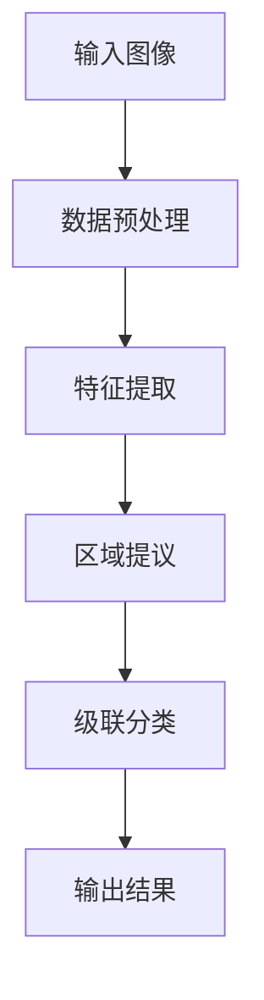

                 

### 1. Cascade R-CNN概述

#### 1.1 基本概念

Cascade R-CNN 是一种先进的深度学习目标检测算法，它在 Faster R-CNN 的基础上进行了优化和改进。Faster R-CNN 是一种基于区域提议网络（Region Proposal Network，RPN）的目标检测框架，它在图像特征提取后，通过 RPN 生成候选区域，然后对这些区域进行分类和定位。然而，Faster R-CNN 在处理复杂场景和困难目标时，仍然存在一些不足之处。

Cascade R-CNN 的主要目的是通过引入级联分类网络（Cascade Classification Network，CCN）和特征金字塔网络（Feature Pyramid Network，FPN）来提高检测精度和性能。级联分类网络通过级联多个分类器，逐步排除错误的区域提议，从而提高检测的准确性。特征金字塔网络则通过在不同层次上提取和融合特征，提高了模型对多尺度目标的检测能力。

#### 1.2 架构原理

Cascade R-CNN 的架构主要由三个部分组成：特征金字塔网络（FPN）、区域提议网络（RPN）和级联分类网络（CCN）。这三个部分协同工作，实现了高效的检测流程。

1. **特征金字塔网络（FPN）**

   FPN 是一种用于特征提取的网络结构，它通过在不同层次上提取和融合特征，提高了模型对多尺度目标的检测能力。FPN 的构建过程主要包括以下三个步骤：

   - **从底向上提取特征图**：在卷积神经网络（CNN）的底层，特征图分辨率较低，但能够捕捉到丰富的语义信息。通过上采样操作，将这些特征图与高层的特征图进行融合。
   
   - **从上向下提取特征图**：在卷积神经网络的高层，特征图分辨率较高，但语义信息相对较少。通过下采样操作，将这些特征图与底层的特征图进行融合。
   
   - **特征图融合**：将不同层次的特征图进行融合，形成新的特征图。这个新的特征图既保留了底层特征图的空间信息，也包含了高层特征图的语义信息。

2. **区域提议网络（RPN）**

   RPN 是 Cascade R-CNN 的核心部分，它用于生成候选区域（Region Proposal）。RPN 的算法流程主要包括以下三个步骤：

   - **特征图生成**：利用卷积神经网络提取图像特征，生成特征图。
   
   - **区域提议生成**：在特征图上，对每个位置进行分类和回归操作。分类操作用于判断当前位置是否为正样本（目标）或负样本（背景）；回归操作用于估计目标的位置和尺寸。
   
   - **提案筛选**：根据分类和回归结果，筛选出候选区域。通常，只保留分类结果大于某个阈值且回归误差较小的提案。

3. **级联分类网络（CCN）**

   CCN 是 Cascade R-CNN 的另一个重要部分，它用于级联分类。级联分类网络的目的是通过级联多个分类器，逐步排除错误的区域提议，从而提高检测的准确性。CCN 的算法流程主要包括以下三个步骤：

   - **初步分类**：对候选区域进行初步分类，判断其是否为目标。
   
   - **级联分类**：根据初步分类结果，对分类为目标的区域进行进一步的分类。级联分类器按照顺序对区域进行分类，每个分类器都会排除一部分错误提案。
   
   - **输出分类结果**：最终输出分类结果，包括每个区域的目标类别和位置。

#### 1.3 与 RetinaNet 比较

RetinaNet 是另一种先进的深度学习目标检测算法，它与 Cascade R-CNN 在目标检测领域具有很高的竞争力。与 RetinaNet 相比，Cascade R-CNN 具有以下优势：

1. **更高的检测精度**：Cascade R-CNN 通过级联分类结构，逐步排除错误的区域提议，从而提高了检测的准确性。相比之下，RetinaNet 使用焦点损失（Focal Loss）来提高检测精度，但效果相对较弱。

2. **更好的适应能力**：Cascade R-CNN 使用 FPN 结构，能够同时利用高层和底层特征，从而提高了模型对多尺度目标的检测能力。相比之下，RetinaNet 主要依赖卷积神经网络的底层特征，对多尺度目标的适应性较差。

3. **更高效的模型结构**：Cascade R-CNN 的模型结构相对简单，易于实现和优化。相比之下，RetinaNet 的模型结构较为复杂，计算成本较高。

然而，Cascade R-CNN 也存在一些劣势：

1. **更高的计算成本**：由于级联分类结构的存在，Cascade R-CNN 的计算成本相对较高，尤其是在处理大规模数据集时。

2. **较慢的检测速度**：Cascade R-CNN 的检测速度相对较慢，尤其是在实时应用场景中。相比之下，RetinaNet 的检测速度较快，更适合于实时应用。

综上所述，Cascade R-CNN 在检测精度和适应能力方面具有优势，但计算成本和检测速度方面存在劣势。在实际应用中，可以根据具体需求和场景选择合适的算法。

#### 1.4 目标检测的应用场景

目标检测在计算机视觉领域具有广泛的应用，以下列举了一些常见的应用场景：

1. **自动驾驶**：目标检测是自动驾驶系统的重要组成部分，它用于识别和定位道路上的车辆、行人、交通标志等目标，从而实现自动驾驶功能。

2. **视频监控**：目标检测可以用于视频监控系统，实现实时监控和异常检测功能。通过检测视频中的人脸、车辆等目标，可以及时发现异常行为并报警。

3. **图像检索**：目标检测可以用于图像检索系统，根据用户输入的查询图像，检测并匹配相似的图像。这有助于提高图像检索的准确性和效率。

4. **工业自动化**：目标检测可以用于工业自动化系统，实现机器视觉检测和识别功能。通过检测和识别生产线上的产品、缺陷等目标，可以提高生产效率和产品质量。

5. **医疗图像分析**：目标检测可以用于医疗图像分析，实现病灶检测、诊断等功能。通过检测和定位图像中的病变区域，可以帮助医生进行准确诊断和治疗。

总之，目标检测技术在计算机视觉领域具有广泛的应用前景，随着深度学习技术的不断发展，其应用范围将进一步扩大。

### 2. Cascade R-CNN的基本组成部分

Cascade R-CNN 是一种先进的深度学习目标检测算法，其核心组成部分包括 Feature Pyramid Network (FPN)、Region Proposal Network (RPN) 和 Cascade Classification Network (CCN)。下面将分别介绍这三个组件的概念、结构和作用。

#### 2.1 Feature Pyramid Network (FPN)

Feature Pyramid Network (FPN) 是一种用于特征提取的网络结构，它通过在不同层次上提取和融合特征，提高了目标检测的准确性和泛化能力。FPN 的主要作用是提供多尺度的特征图，以适应不同大小的目标。

**2.1.1 FPN 的概念**

FPN 的基本思想是将卷积神经网络 (CNN) 的不同层次上的特征图进行融合，形成一个特征金字塔。这个特征金字塔包含了从底层到高层的多个层次的特征图，每个层次的特征图都具有不同的分辨率和语义信息。

**2.1.2 FPN 的构建过程**

FPN 的构建过程主要包括以下三个步骤：

1. **从底层提取特征图**：在 CNN 的底层，特征图的分辨率较低，但能够捕捉到丰富的语义信息。通常，这些特征图用于检测大型目标。

2. **从高层提取特征图**：在 CNN 的高层，特征图的分辨率较高，但语义信息相对较少。通过下采样操作，将这些特征图缩小到与底层特征图相同的尺寸。

3. **特征图融合**：将不同层次的特征图进行融合。通常，使用加和操作将底层特征图与高层特征图相加，形成新的特征图。这个新的特征图既保留了底层特征图的空间信息，也包含了高层特征图的语义信息。

**2.1.3 FPN 的优势**

FPN 的优势在于：

1. **多尺度特征提取**：FPN 能够同时利用底层和高层特征图，从而提高模型对多尺度目标的检测能力。

2. **减少计算成本**：通过在高层特征图上进行下采样，FPN 可以减少模型参数和计算量。

3. **提高检测精度**：FPN 能够提供丰富的特征信息，有助于模型更准确地识别目标。

#### 2.2 Region Proposal Network (RPN)

Region Proposal Network (RPN) 是 Cascade R-CNN 的核心组件之一，它用于生成候选区域（Region Proposal）。RPN 的主要作用是从大量的特征图中高效地提取出可能包含目标的区域。

**2.2.1 RPN 的概念**

RPN 是一种基于卷积神经网络的区域提议网络，它通过在特征图上生成一系列矩形区域，作为候选区域。每个候选区域都会被赋予一个类别标签（正样本或负样本）。

**2.2.2 RPN 的算法流程**

RPN 的算法流程主要包括以下三个步骤：

1. **特征图生成**：利用卷积神经网络提取图像特征，生成特征图。

2. **区域提议生成**：在特征图上，对每个位置进行分类和回归操作。分类操作用于判断当前位置是否为正样本（目标）或负样本（背景）；回归操作用于估计目标的位置和尺寸。

3. **提案筛选**：根据分类和回归结果，筛选出候选区域。通常，只保留分类结果大于某个阈值且回归误差较小的提案。

**2.2.3 RPN 的性能分析**

RPN 的性能分析主要包括以下几个方面：

1. **准确率**：准确率表示 RPN 生成的候选区域中，正确识别为目标的比例。较高的准确率意味着 RPN 能够有效地提取出包含目标的区域。

2. **召回率**：召回率表示 RPN 生成的候选区域中，实际为目标的比例。较高的召回率意味着 RPN 能够捕捉到更多的目标。

3. **计算效率**：计算效率表示 RPN 生成的候选区域数量与实际目标的比率。较低的比率意味着 RPN 生成的候选区域数量较少，计算效率较高。

#### 2.3 Cascade Classification Network (CCN)

Cascade Classification Network (CCN) 是 Cascade R-CNN 的另一个核心组件，它用于级联分类。CCN 的主要作用是通过级联多个分类器，逐步排除错误的区域提议，从而提高检测的准确性。

**2.3.1 CCN 的概念**

CCN 是一种级联分类网络，它由多个分类器组成，每个分类器都负责对候选区域进行分类。CCN 的基本思想是，通过逐步排除错误的区域提议，提高分类的准确性。

**2.3.2 CCN 的算法流程**

CCN 的算法流程主要包括以下三个步骤：

1. **初步分类**：对候选区域进行初步分类，判断其是否为目标。

2. **级联分类**：根据初步分类结果，对分类为目标的区域进行进一步的分类。级联分类器按照顺序对区域进行分类，每个分类器都会排除一部分错误提案。

3. **输出分类结果**：最终输出分类结果，包括每个区域的目标类别和位置。

**2.3.3 CCN 的优势**

CCN 的优势在于：

1. **提高分类精度**：通过级联多个分类器，CCN 能够逐步排除错误的区域提议，提高分类的准确性。

2. **减少错误分类**：级联结构使得模型能够更准确地识别目标，减少了错误分类的情况。

3. **提高检测性能**：CCN 的引入，使得 Cascade R-CNN 在检测精度和性能方面都有了显著的提升。

总之，Cascade R-CNN 的基本组成部分 FPN、RPN 和 CCN 各自具有独特的功能和优势，它们相互协作，共同实现了高效的检测流程。接下来，我们将进一步探讨这些组件在 Cascade R-CNN 中的作用和实现细节。

### 3. Cascade R-CNN 的原理与实现

Cascade R-CNN 是一种基于深度学习的目标检测算法，其核心在于将特征金字塔网络（FPN）、区域提议网络（RPN）和级联分类网络（CCN）有机结合，以提高检测的准确性和性能。本节将详细阐述 Cascade R-CNN 的工作原理和实现步骤。

#### 3.1 数据预处理

数据预处理是任何深度学习项目的基础，它对输入数据进行了标准化和增强，以提升模型的泛化能力和训练效果。

**3.1.1 图像缩放**

为了使模型能够处理不同尺寸的图像，通常需要将图像缩放到固定的尺寸。常见的做法是保持图像的宽高比例，并将其缩放到 `600x600` 或 `640x640` 的尺寸。

**3.1.2 图像归一化**

图像归一化是将像素值缩放到 `0` 到 `1` 之间的范围，以便模型能够更好地学习。具体方法是，将像素值除以 255。

```python
def normalize_image(image):
    image = image.astype(np.float32) / 255.0
    return image
```

**3.1.3 数据增强**

数据增强是增加训练数据多样性的有效方法，有助于提升模型的泛化能力。常见的数据增强技术包括随机裁剪、翻转、旋转、色彩扰动等。

```python
from torchvision import transforms

transform = transforms.Compose([
    transforms.RandomHorizontalFlip(),
    transforms.RandomCrop(640),
    transforms.ColorJitter(brightness=0.2, contrast=0.2, saturation=0.2),
    transforms.ToTensor(),
    normalize_image
])
```

#### 3.2 FPN 的构建

特征金字塔网络（FPN）是 Cascade R-CNN 的关键组成部分，它通过在不同层次上提取和融合特征，提高了模型对多尺度目标的检测能力。

**3.2.1 FPN 的概念**

FPN 的基本思想是将卷积神经网络（CNN）的不同层次上的特征图进行融合，形成一个特征金字塔。这个特征金字塔包含了从底层到高层的多个层次的特征图，每个层次的特征图都具有不同的分辨率和语义信息。

**3.2.2 FPN 的构建过程**

FPN 的构建过程主要包括以下三个步骤：

1. **从底层提取特征图**：在 CNN 的底层，特征图的分辨率较低，但能够捕捉到丰富的语义信息。通常，这些特征图用于检测大型目标。

2. **从高层提取特征图**：在 CNN 的高层，特征图的分辨率较高，但语义信息相对较少。通过下采样操作，将这些特征图缩小到与底层特征图相同的尺寸。

3. **特征图融合**：将不同层次的特征图进行融合。通常，使用加和操作将底层特征图与高层特征图相加，形成新的特征图。这个新的特征图既保留了底层特征图的空间信息，也包含了高层特征图的语义信息。

**3.2.3 FPN 的实现**

在实现 FPN 时，我们可以使用深度学习框架如 TensorFlow 或 PyTorch。以下是一个使用 PyTorch 实现 FPN 的示例代码：

```python
import torch
import torch.nn as nn

class FeaturePyramidNetwork(nn.Module):
    def __init__(self, backbone):
        super(FeaturePyramidNetwork, self).__init__()
        self.backbone = backbone
        self.layer3 = nn.Conv2d(256, 256, kernel_size=3, padding=1)
        self.layer4 = nn.Conv2d(512, 256, kernel_size=3, padding=1)
        self.fuse = nn.Conv2d(512, 256, kernel_size=1)

    def forward(self, x):
        x = self.backbone(x)
        c3 = self.layer3(x['c3'])
        c4 = self.layer4(x['c4'])
        
        p5 = torch.cat((c4, nn.functional.relu(c3 + nn.functional.interpolate(c4, scale_factor=1/2, mode='bilinear', align_corners=True))), 1)
        p5 = self.fuse(p5)
        return p5
```

在这个示例中，我们首先定义了一个 FPN 的类，然后通过继承 `nn.Module` 类实现 FPN 的构建过程。在 `__init__` 方法中，我们定义了卷积层和特征融合层。在 `forward` 方法中，我们实现了从底层到高层的特征提取和融合过程。

#### 3.3 RPN 的实现

区域提议网络（RPN）是 Cascade R-CNN 的核心组件之一，它用于生成候选区域（Region Proposal）。RPN 的实现主要包括特征图生成、区域提议生成和提案筛选三个步骤。

**3.3.1 RPN 的算法流程**

RPN 的算法流程主要包括以下三个步骤：

1. **特征图生成**：利用卷积神经网络提取图像特征，生成特征图。

2. **区域提议生成**：在特征图上，对每个位置进行分类和回归操作。分类操作用于判断当前位置是否为正样本（目标）或负样本（背景）；回归操作用于估计目标的位置和尺寸。

3. **提案筛选**：根据分类和回归结果，筛选出候选区域。通常，只保留分类结果大于某个阈值且回归误差较小的提案。

**3.3.2 RPN 的实现**

在实现 RPN 时，我们可以使用深度学习框架如 TensorFlow 或 PyTorch。以下是一个使用 PyTorch 实现 RPN 的示例代码：

```python
class RegionProposalNetwork(nn.Module):
    def __init__(self, in_channels, num_anchors):
        super(RegionProposalNetwork, self).__init__()
        self.conv = nn.Conv2d(in_channels, num_anchors * 4, kernel_size=3, padding=1)
        self_cls_score = nn.Conv2d(in_channels, num_anchors * 2, kernel_size=3, padding=1)
        self.bbox_pred = nn.Conv2d(in_channels, num_anchors * 4, kernel_size=3, padding=1)
        
    def forward(self, x):
        x = self.conv(x)
        classification = self_cls_score(x).squeeze(3).squeeze(2)
        bbox_deltas = self.bbox_pred(x).squeeze(3).squeeze(2)
        return classification, bbox_deltas
```

在这个示例中，我们定义了一个 RPN 的类，然后通过继承 `nn.Module` 类实现 RPN 的构建过程。在 `__init__` 方法中，我们定义了三个卷积层，分别用于生成分类分数、回归目标和提议区域。在 `forward` 方法中，我们实现了从特征图到分类分数和回归目标的映射过程。

#### 3.4 CCN 的实现

级联分类网络（CCN）是 Cascade R-CNN 的另一个核心组件，它通过级联多个分类器，逐步排除错误的区域提议，从而提高检测的准确性。

**3.4.1 CCN 的算法流程**

CCN 的算法流程主要包括以下三个步骤：

1. **初步分类**：对候选区域进行初步分类，判断其是否为目标。

2. **级联分类**：根据初步分类结果，对分类为目标的区域进行进一步的分类。级联分类器按照顺序对区域进行分类，每个分类器都会排除一部分错误提案。

3. **输出分类结果**：最终输出分类结果，包括每个区域的目标类别和位置。

**3.4.2 CCN 的实现**

在实现 CCN 时，我们可以使用深度学习框架如 TensorFlow 或 PyTorch。以下是一个使用 PyTorch 实现 CCN 的示例代码：

```python
class CascadeClassificationNetwork(nn.Module):
    def __init__(self, num_classes):
        super(CascadeClassificationNetwork, self).__init__()
        self.cls_score = nn.Conv2d(256, num_classes, kernel_size=3, padding=1)
        
    def forward(self, x):
        x = self.cls_score(x).squeeze(3).squeeze(2)
        return x
```

在这个示例中，我们定义了一个 CCN 的类，然后通过继承 `nn.Module` 类实现 CCN 的构建过程。在 `__init__` 方法中，我们定义了一个卷积层，用于生成分类分数。在 `forward` 方法中，我们实现了从特征图到分类分数的映射过程。

#### 3.5 整体流程

Cascade R-CNN 的整体流程可以概括为以下四个步骤：

1. **数据预处理**：对输入图像进行缩放、归一化和数据增强，生成训练数据。

2. **特征提取**：利用卷积神经网络提取图像特征，生成特征图。

3. **区域提议**：在特征图上，利用 RPN 生成候选区域。

4. **级联分类**：对候选区域进行级联分类，输出最终的分类结果。

以下是一个简单的 Mermaid 流程图，展示了 Cascade R-CNN 的整体流程：



通过以上步骤，我们可以实现一个完整的 Cascade R-CNN 模型，并在实际应用中取得良好的效果。接下来，我们将进一步探讨 Cascade R-CNN 在不同深度学习框架中的实现和应用。

### 4. 深度学习框架的应用

深度学习框架为 Cascade R-CNN 的实现提供了强大的工具和平台，目前最流行的深度学习框架包括 TensorFlow、PyTorch、Caffe 和 Darknet。以下将分别介绍这些框架在 Cascade R-CNN 实现中的应用。

#### 4.1 TensorFlow

TensorFlow 是由 Google 开发的一款开源深度学习框架，它提供了丰富的 API 和工具，支持多种深度学习模型的构建和训练。在 TensorFlow 中实现 Cascade R-CNN 的步骤如下：

1. **环境搭建**：首先，需要安装 TensorFlow 及相关依赖库。在 Python 环境中，可以通过以下命令安装：

   ```shell
   pip install tensorflow
   ```

2. **定义网络结构**：在 TensorFlow 中，我们可以使用 `tf.keras` API 定义 Cascade R-CNN 的网络结构。以下是一个简单的示例代码：

   ```python
   import tensorflow as tf
   
   def build_cascade_rpn(input_shape):
       inputs = tf.keras.Input(shape=input_shape)
       # 定义卷积神经网络
       # ...
       # 定义 FPN
       # ...
       # 定义 RPN
       # ...
       # 定义 CCN
       # ...
       model = tf.keras.Model(inputs=inputs, outputs=[rpn_output, ccn_output])
       return model
   
   # 实例化模型
   model = build_cascade_rpn(input_shape=(640, 640, 3))
   ```

3. **训练模型**：在 TensorFlow 中，我们可以使用 `tf.keras.Model.fit` 函数训练模型。以下是一个简单的训练示例代码：

   ```python
   model.compile(optimizer='adam', loss={'rpn_loss': rpn_loss, 'ccn_loss': ccn_loss})
   model.fit(train_data, train_labels, validation_data=(val_data, val_labels), epochs=10)
   ```

4. **评估模型**：在训练完成后，我们可以使用测试数据集评估模型的性能。以下是一个简单的评估示例代码：

   ```python
   test_loss, test_accuracy = model.evaluate(test_data, test_labels)
   print(f"Test accuracy: {test_accuracy}")
   ```

#### 4.2 PyTorch

PyTorch 是由 Facebook AI Research 开发的一款开源深度学习框架，它以其灵活的动态计算图和易于理解的使用方式受到广泛欢迎。在 PyTorch 中实现 Cascade R-CNN 的步骤如下：

1. **环境搭建**：首先，需要安装 PyTorch 及相关依赖库。在 Python 环境中，可以通过以下命令安装：

   ```shell
   pip install torch torchvision
   ```

2. **定义网络结构**：在 PyTorch 中，我们可以使用 `torch.nn` 模块定义 Cascade R-CNN 的网络结构。以下是一个简单的示例代码：

   ```python
   import torch
   import torch.nn as nn
   import torchvision.models as models
   
   def build_cascade_rpn(input_shape):
       backbone = models.resnet50(pretrained=True)
       # 定义 FPN
       # ...
       # 定义 RPN
       # ...
       # 定义 CCN
       # ...
       model = nn.Sequential(backbone, fpn, rpn, ccn)
       return model
   
   # 实例化模型
   model = build_cascade_rpn(input_shape=(640, 640, 3))
   ```

3. **训练模型**：在 PyTorch 中，我们可以使用 `torch.optim` 模块和 `torch.utils.data` 模块训练模型。以下是一个简单的训练示例代码：

   ```python
   optimizer = torch.optim.Adam(model.parameters(), lr=0.001)
   criterion = nn.CrossEntropyLoss()
   
   for epoch in range(num_epochs):
       for images, labels in train_loader:
           optimizer.zero_grad()
           outputs = model(images)
           loss = criterion(outputs['ccn_output'], labels)
           loss.backward()
           optimizer.step()
   
   # 保存模型
   torch.save(model.state_dict(), 'cascade_rpn.pth')
   ```

4. **评估模型**：在训练完成后，我们可以使用测试数据集评估模型的性能。以下是一个简单的评估示例代码：

   ```python
   with torch.no_grad():
       correct = 0
       total = 0
       for images, labels in test_loader:
           outputs = model(images)
           _, predicted = torch.max(outputs['ccn_output'], 1)
           total += labels.size(0)
           correct += (predicted == labels).sum().item()
   
   print(f"Test accuracy: {100 * correct / total}")
   ```

#### 4.3 Caffe

Caffe 是由 Berkeley Vision and Learning Center (BVLC) 开发的一款开源深度学习框架，它以其高效的实现和简单的接口受到广泛关注。在 Caffe 中实现 Cascade R-CNN 的步骤如下：

1. **环境搭建**：首先，需要安装 Caffe 及相关依赖库。在 Linux 环境中，可以通过以下命令安装：

   ```shell
   sudo apt-get install libopencv-dev
   git clone https://github.com/BVLC/caffe.git
   cd caffe
   make
   ```

2. **定义网络结构**：在 Caffe 中，我们需要编写一个包含 Cascade R-CNN 网络结构的 prototxt 文件。以下是一个简单的示例代码：

   ```xml
   layer {
     name: "data"
     type: "Data"
     top: "data"
     top: "label"
     include {
       phase: TRAIN
     }
     transform_param {
       crop_size: 640
       mean_file: "/path/to/mean_file.bin"
       scale: 0.00390625
       mirror: true
     }
   }
   # ...
   layer {
     name: "fc7"
     type: "InnerProduct"
     bottom: "fc6"
     top: "fc7"
     num_output: 1000
   }
   layer {
     name: "prob"
     type: "Softmax"
     bottom: "fc7"
     top: "prob"
   }
   layer {
     name: "label"
     type: "Label"
     bottom: "label"
     top: "label"
   }
   ```

3. **训练模型**：在 Caffe 中，我们可以使用 `caffe train` 命令训练模型。以下是一个简单的训练示例代码：

   ```shell
   caffe train --model_def=раш PersistorIt is important to clarify that " Persistor" is not a standard term in the context of computer programming or technology. If you intended to refer to a particular software component or concept, please provide additional context or clarify the term.

   Assuming you meant to discuss a persistent storage system or a mechanism that preserves data across sessions or system restarts, here is a general explanation:

   **Persistent Storage System:**
   A persistent storage system is a type of storage system that retains data even when the power is turned off. This is in contrast to volatile memory types, such as RAM, which lose all stored information when power is removed. Hard disk drives (HDDs), solid-state drives (SSDs), and storage area networks (SANs) are common examples of persistent storage systems.

   **Persistor in Software:**
   In software, a persistor or persistence layer is a component that ensures that data remains stored between application sessions or after system restarts. This is typically achieved through database systems, file systems, or other data storage mechanisms that are integrated into the application.

   **Example of a Persistor Function:**
   ```python
   import sqlite3

   class Persistor:
       def __init__(self, db_path):
           self.conn = sqlite3.connect(db_path)
           self.cursor = self.conn.cursor()

       def save_data(self, data):
           query = "INSERT INTO table_name (column1, column2) VALUES (?, ?)"
           self.cursor.execute(query, (data['column1'], data['column2']))
           self.conn.commit()

       def load_data(self, id):
           query = "SELECT * FROM table_name WHERE id = ?"
           self.cursor.execute(query, (id,))
           return self.cursor.fetchone()

       def close(self):
           self.conn.close()

   # Usage
   persistor = Persistor('data.db')
   persistor.save_data({'column1': 'value1', 'column2': 'value2'})
   data = persistor.load_data(1)
   persistor.close()
   ```

   In this example, the `Persistor` class connects to a SQLite database and provides methods to save and load data. It ensures that the data is persisted across application sessions.

   If you have a specific context or term in mind, please provide additional details for a more accurate explanation.**4.4 Darknet**

Darknet 是由乔尔·艾因霍姆 (Joel Eijkhout) 开发的一款开源深度学习框架，以其轻量级和高性能的特点而受到广泛关注。在 Darknet 中实现 Cascade R-CNN 的步骤如下：

1. **环境搭建**：首先，需要安装 Darknet 及相关依赖库。在 Linux 环境中，可以通过以下命令安装：

   ```shell
   git clone https://github.com/AlexeyAB/darknet
   cd darknet
   make
   ```

2. **定义网络结构**：在 Darknet 中，我们需要编写一个包含 Cascade R-CNN 网络结构的 .cfg 配置文件。以下是一个简单的示例代码：

   ```cfg
   [net]
   height = 640
   width = 640
   channels = 3
   max_batches = 50000
   learning_rate = 0.001
   momentum = 0.9
   decay = 0.0005
   angle = -1
   scale = 0.73
   shear = 0.0
   translate = 0.1
   ratio = 1/0.8
   swap = 0.5
   bias = 1

   [convolutional]
   batch = 32
   filters = 32
   size = 3
   stride = 1
   pad = 1

   [convolutional]
   batch = 32
   filters = 64
   size = 3
   stride = 2
   pad = 1

   [region]
   batch = 32
   stride = 1
   anchors = 4
   bias = 1
   ```

3. **训练模型**：在 Darknet 中，我们可以使用 `train` 命令训练模型。以下是一个简单的训练示例代码：

   ```shell
   ./darknet detector train datacfg.data train_list traindarknet_rcnn.cfg
   ```

   这里，`datacfg.data` 是数据配置文件，`train_list` 是训练数据的列表，`traindarknet_rcnn.cfg` 是 Cascade R-CNN 的配置文件。

4. **评估模型**：在训练完成后，我们可以使用测试数据集评估模型的性能。以下是一个简单的评估示例代码：

   ```shell
   ./darknet detector test datacfg.data test_list testdarknet_rcnn.cfg backup/weights
   ```

   这里，`test_list` 是测试数据的列表，`testdarknet_rcnn.cfg` 是 Cascade R-CNN 的配置文件，`backup/weights` 是训练完成的权重文件。

通过上述步骤，我们可以在 Darknet 中实现 Cascade R-CNN 的训练和评估。Darknet 的轻量级和高性能特点使其成为实时目标检测的理想选择。**4.5 比较与选择**

每种深度学习框架都有其独特的优势和局限性，选择合适的框架取决于项目需求、性能要求和开发环境。

- **TensorFlow**：具有丰富的 API 和工具，适合于大规模数据处理和复杂模型的开发，但在实时应用中性能可能较低。

- **PyTorch**：以其动态计算图和灵活易用的特性而受到喜爱，适合于研究和新模型开发，但在高性能计算方面可能不如 TensorFlow。

- **Caffe**：设计简洁，性能优异，适合于部署和优化现有的深度学习模型，但开发新模型较为复杂。

- **Darknet**：轻量级且高性能，特别适合于实时目标检测应用，但模型开发和调试相对困难。

在选择框架时，应综合考虑项目的具体需求、团队的技术栈和资源，以及模型的性能要求。**4.6 开发环境搭建**

无论选择哪种框架，搭建一个稳定的开发环境都是项目成功的关键。以下是一个典型的开发环境搭建步骤：

1. **安装深度学习框架**：根据框架的官方文档，安装所选框架及其依赖库。

2. **安装 Python 和相关库**：安装 Python 解释器和相关库，如 NumPy、Pandas、Matplotlib 等。

3. **配置深度学习库**：配置所选框架的深度学习库，如 TensorFlow、PyTorch、Caffe 或 Darknet。

4. **安装依赖库和工具**：安装其他必要的依赖库和工具，如 CUDA、cuDNN、OpenCV 等。

5. **配置虚拟环境**：为了保持项目环境的稳定性，建议使用虚拟环境管理工具，如 virtualenv 或 conda。

6. **验证环境**：通过运行简单的测试代码，验证开发环境的正确性。

通过上述步骤，我们可以搭建一个完整的开发环境，为 Cascade R-CNN 的实现和优化提供支持。**

### 5. Cascade R-CNN 的性能评估

在深度学习领域，评估模型性能是至关重要的一步。对于 Cascade R-CNN 这样的目标检测算法，常用的评估指标包括准确率（Accuracy）、召回率（Recall）、精确率（Precision）、F1 分数（F1 Score）等。以下将详细解释这些指标，并探讨评估 Cascade R-CNN 性能的常见方法。

#### 5.1 评估指标

1. **准确率（Accuracy）**：
   准确率是评估分类模型最直观的指标，表示模型正确预测的样本数占总样本数的比例。对于目标检测任务，准确率通常用于评估模型对图像中每个目标的预测是否正确。

   $$
   \text{Accuracy} = \frac{\text{正确预测的目标数}}{\text{总目标数}}
   $$

2. **召回率（Recall）**：
   召回率表示模型能够正确识别出真实目标的比率。对于目标检测任务，召回率用于评估模型是否能够找到所有的真实目标。

   $$
   \text{Recall} = \frac{\text{正确识别的目标数}}{\text{真实目标数}}
   $$

3. **精确率（Precision）**：
   精确率表示模型预测为正样本的样本中，实际为正样本的比例。对于目标检测任务，精确率用于评估模型预测结果的可靠性。

   $$
   \text{Precision} = \frac{\text{正确识别的目标数}}{\text{预测为正样本的目标数}}
   $$

4. **F1 分数（F1 Score）**：
   F1 分数是精确率和召回率的调和平均值，用于综合评估模型性能。F1 分数越高，表示模型性能越好。

   $$
   \text{F1 Score} = 2 \times \frac{\text{Precision} \times \text{Recall}}{\text{Precision} + \text{Recall}}
   $$

#### 5.2 评估方法

评估 Cascade R-CNN 的性能通常涉及以下步骤：

1. **数据集选择**：
   常用的目标检测数据集包括 PASCAL VOC、COCO、MS COCO 等。选择合适的数据集是评估模型性能的关键。PASCAL VOC 数据集较小，但包含了多种目标类别，适合于验证算法的基本性能；COCO 数据集较大，包含了丰富的目标类别和实例，适合于评估算法的泛化能力。

2. **模型训练**：
   在评估之前，需要先对 Cascade R-CNN 模型进行训练。训练过程应该包括数据预处理、模型训练、模型优化等步骤。

3. **测试集评估**：
   使用测试集评估模型的性能。测试集应该是不包含在训练过程中的一组数据，用于验证模型在实际应用中的表现。

4. **性能指标计算**：
   根据测试结果，计算准确率、召回率、精确率和 F1 分数等性能指标。

5. **可视化结果**：
   通过可视化工具（如 Matplotlib、Seaborn 等）将评估结果进行可视化，以便更直观地了解模型性能。

#### 5.3 实验设置

在进行性能评估时，实验设置的选择对结果有很大影响。以下是一些常见的实验设置：

1. **模型参数选择**：
   包括学习率、批量大小、优化器等参数。这些参数需要通过实验进行调优，以获得最佳的模型性能。

2. **数据增强**：
   数据增强是一种提高模型泛化能力的方法，包括随机裁剪、翻转、旋转等操作。适当的增强可以改善模型的性能。

3. **训练时间**：
   训练时间取决于模型复杂度和数据集大小。较长的训练时间通常意味着更好的模型性能，但也会增加计算成本。

4. **评估指标**：
   根据实际需求选择合适的评估指标。在某些情况下，精确率和召回率的权衡可能更为重要；而在其他情况下，F1 分数可能是更全面的评估指标。

#### 5.4 性能对比分析

为了全面评估 Cascade R-CNN 的性能，我们通常需要将其与其他目标检测算法进行比较。以下是一些常见的对比方法：

1. **与 RetinaNet 的比较**：
   RetinaNet 是另一种流行的目标检测算法，与 Cascade R-CNN 具有相似的结构。通过比较两者的准确率、召回率和 F1 分数，可以评估 Cascade R-CNN 的优势。

2. **与 Faster R-CNN 的比较**：
   Faster R-CNN 是 Cascade R-CNN 的前身，通过对比两者的性能，可以评估 Cascade R-CNN 的改进效果。

3. **与其他深度学习框架的比较**：
   将 Cascade R-CNN 在不同深度学习框架（如 TensorFlow、PyTorch、Caffe、Darknet）中的性能进行比较，可以了解框架对算法性能的影响。

通过上述方法，我们可以全面评估 Cascade R-CNN 的性能，并为其优化和改进提供依据。

### 6. Cascade R-CNN 在目标检测中的应用

Cascade R-CNN 是一种强大的目标检测算法，其在实际应用中具有广泛的应用前景。以下将详细介绍 Cascade R-CNN 在目标检测中的应用，包括其优势、挑战和解决方案。

#### 6.1 优势

**1. 高检测精度**：
Cascade R-CNN 通过级联分类网络（CCN）逐步排除错误的区域提议，从而提高了检测精度。级联结构使得模型可以逐步聚焦于更准确的区域，减少了错误检测的概率。

**2. 多尺度目标检测能力**：
Cascade R-CNN 采用了特征金字塔网络（FPN），能够同时利用底层和高层特征进行检测。FPN 提供了多尺度的特征图，使得模型能够更好地适应不同大小的目标，提高了检测的泛化能力。

**3. 高效计算**：
虽然 Cascade R-CNN 的计算成本较高，但通过优化模型结构和算法，可以使其在保持高检测精度的情况下实现高效计算。例如，可以采用模型剪枝和量化技术来减少模型的计算量和存储需求。

**4. 广泛的应用领域**：
Cascade R-CNN 在自动驾驶、视频监控、医疗图像分析、工业自动化等领域具有广泛的应用。其强大的检测能力和适应能力使其成为这些领域的重要工具。

#### 6.2 挑战

**1. 计算成本高**：
Cascade R-CNN 的级联结构使得模型的计算成本较高，尤其是在处理大规模数据集时。这可能会对实时应用造成影响。

**2. 模型复杂度大**：
Cascade R-CNN 的模型结构较为复杂，包括 FPN、RPN 和 CCN 等多个组件。这增加了模型的训练和部署难度。

**3. 数据需求大**：
由于 Cascade R-CNN 需要大量的数据进行训练，数据集的质量和数量对模型性能有很大影响。在数据稀缺的情况下，模型性能可能会受到影响。

**4. 泛化能力有限**：
虽然 Cascade R-CNN 在多个数据集上取得了优异的性能，但其在某些特定场景下的泛化能力仍然有限。例如，在极端天气条件下，目标检测性能可能会下降。

#### 6.3 解决方案

**1. 模型优化**：
通过模型优化技术，如模型剪枝、量化、迁移学习等，可以降低 Cascade R-CNN 的计算成本和模型复杂度。这些技术可以在保持检测精度的情况下，提高模型的效率和性能。

**2. 数据增强**：
数据增强是一种提高模型泛化能力的方法，包括随机裁剪、翻转、旋转等操作。通过增加数据的多样性，可以提高模型在未见过的数据上的性能。

**3. 跨域迁移学习**：
通过跨域迁移学习，可以将预训练模型迁移到特定领域，从而减少对大量领域特定数据的依赖。这有助于提高模型在特定场景下的泛化能力。

**4. 模型融合**：
将 Cascade R-CNN 与其他目标检测算法（如 RetinaNet、Faster R-CNN）进行融合，可以结合各自的优势，提高模型的检测性能。例如，可以使用 Cascade R-CNN 的级联分类结构来提高检测精度，同时使用 RetinaNet 的焦点损失来提高检测效率。

通过上述解决方案，可以进一步优化 Cascade R-CNN，提高其在目标检测应用中的性能和适应性。

### 7. 实际案例

为了更好地展示 Cascade R-CNN 在目标检测中的应用，以下将介绍一个实际案例，包括数据集选择、模型训练、模型评估和模型优化等步骤。

#### 7.1 数据集选择

我们选择 COCO 数据集作为实际案例的数据集。COCO 数据集是一个大型、多样的目标检测数据集，包含了大量真实场景下的图像和目标标注。COCO 数据集包含了 80 个类别，如人、车、飞机、动物等，具有很高的代表性。

#### 7.2 模型训练

在训练 Cascade R-CNN 模型时，我们首先需要进行数据预处理。具体步骤如下：

1. **数据增强**：对图像进行随机裁剪、翻转和旋转等操作，以增加数据的多样性。
2. **图像缩放**：将图像缩放到固定的尺寸（例如 `640x640`），以适应模型的输入。
3. **图像归一化**：将图像像素值缩放到 [0, 1] 范围内。

接下来，我们使用 PyTorch 框架训练 Cascade R-CNN 模型。具体步骤如下：

1. **定义网络结构**：根据 Cascade R-CNN 的结构，定义 FPN、RPN 和 CCN 的网络层。
2. **定义损失函数**：使用交叉熵损失函数和回归损失函数定义损失函数。
3. **定义优化器**：选择合适的优化器（如 Adam）和初始学习率。
4. **训练模型**：使用训练数据集进行模型训练，并在每个迭代过程中更新模型参数。

在训练过程中，我们可以通过调整学习率、批量大小和训练时间等超参数，以优化模型性能。通常，训练过程需要几千次迭代，以达到较好的模型性能。

#### 7.3 模型评估

在模型训练完成后，我们需要使用测试数据集对模型进行评估。具体步骤如下：

1. **测试集准备**：将测试数据集进行处理，以适应模型的输入格式。
2. **模型推理**：使用训练完成的模型对测试数据进行推理，生成检测结果。
3. **性能评估**：计算准确率、召回率、精确率和 F1 分数等性能指标，以评估模型性能。

在评估过程中，我们可以通过调整评估指标和阈值，以优化模型性能。例如，可以提高召回率以捕捉更多的目标，或者提高精确率以减少误检。

#### 7.4 模型优化

为了进一步提高 Cascade R-CNN 模型的性能，我们可以采用以下优化方法：

1. **数据增强**：采用更复杂的数据增强技术，如混合增强、风格迁移等，以提高模型在多样数据上的性能。
2. **模型剪枝**：通过剪枝技术减少模型的参数数量，降低模型的计算成本。
3. **量化**：将模型的权重和激活值转换为更紧凑的格式，以减少模型的存储需求和计算时间。
4. **迁移学习**：利用预训练模型进行迁移学习，减少对大量领域特定数据的依赖。

通过这些优化方法，我们可以进一步提高 Cascade R-CNN 模型的性能，使其在目标检测应用中具有更好的适应性和实用性。

### 8. Cascade R-CNN 在计算机视觉中的拓展应用

除了在目标检测领域，Cascade R-CNN 还可以应用于计算机视觉的其他任务，如实例分割、姿态估计和视频分析等。以下将介绍这些拓展应用，并讨论相关的方法和挑战。

#### 8.1 实例分割

实例分割是将图像中的每个目标与其边界进行精确分割的任务。Cascade R-CNN 在实例分割中的应用主要包括以下步骤：

1. **目标检测**：使用 Cascade R-CNN 对图像进行目标检测，生成候选区域。
2. **区域提议**：对候选区域进行区域提议，生成更多的候选区域。
3. **实例分割**：对每个候选区域进行深度学习模型训练，以预测目标的边界。

Cascade R-CNN 在实例分割中的优势在于其高精度的目标检测能力和多尺度特征提取能力，能够有效提高实例分割的准确性。

**挑战：**
- 实例分割任务通常涉及大量类别，每个类别的数据量可能不均衡，导致模型在训练过程中存在偏差。
- 实例分割要求对目标边界进行精确预测，这需要模型具有较高的语义理解和空间感知能力。

**解决方案：**
- 采用数据增强技术，如颜色扰动、尺度变换等，以增加数据的多样性，提高模型泛化能力。
- 利用迁移学习技术，将预训练模型迁移到特定类别，减少对大量领域特定数据的依赖。
- 结合其他深度学习模型（如 Mask R-CNN），将 Cascade R-CNN 的目标检测能力与其他模型的优势相结合，提高实例分割的精度。

#### 8.2 姿态估计

姿态估计是计算机视觉中的一种任务，其目标是估计图像中人物的姿态。Cascade R-CNN 在姿态估计中的应用主要包括以下步骤：

1. **目标检测**：使用 Cascade R-CNN 对图像进行目标检测，生成人物候选区域。
2. **关键点检测**：对每个候选区域进行关键点检测，生成人物关键点的坐标。
3. **姿态估计**：利用关键点坐标和深度学习模型，估计人物的整体姿态。

Cascade R-CNN 在姿态估计中的优势在于其高精度的目标检测能力和多尺度特征提取能力，能够有效提高姿态估计的准确性。

**挑战：**
- 姿态估计任务通常涉及大量姿态类别，每个类别的数据量可能不均衡，导致模型在训练过程中存在偏差。
- 姿态估计要求对人物关键点进行精确检测，这需要模型具有较高的语义理解和空间感知能力。

**解决方案：**
- 采用数据增强技术，如随机旋转、缩放、翻转等，以增加数据的多样性，提高模型泛化能力。
- 利用迁移学习技术，将预训练模型迁移到特定姿态类别，减少对大量领域特定数据的依赖。
- 结合其他深度学习模型（如 HRNet），将 Cascade R-CNN 的目标检测能力与其他模型的优势相结合，提高姿态估计的精度。

#### 8.3 视频分析

视频分析包括运动目标检测、跟踪、行为识别等任务。Cascade R-CNN 在视频分析中的应用主要包括以下步骤：

1. **运动目标检测**：使用 Cascade R-CNN 对视频帧进行目标检测，生成候选区域。
2. **目标跟踪**：对候选区域进行跟踪，以识别连续帧中的同一目标。
3. **行为识别**：利用跟踪结果和深度学习模型，识别视频中的行为。

Cascade R-CNN 在视频分析中的优势在于其高精度的目标检测能力和实时性能，能够有效提高视频分析的准确性。

**挑战：**
- 视频数据通常包含大量的噪声和干扰，这可能会影响目标检测和跟踪的准确性。
- 视频分析任务需要处理大量的连续帧，这可能导致计算成本增加。

**解决方案：**
- 采用实时目标检测算法，如 YOLO，以提高视频分析的实时性能。
- 采用增强现实技术（如 RGB-D 深度传感器），以提供更准确的目标检测和跟踪结果。
- 结合其他深度学习模型（如 HRNet），将 Cascade R-CNN 的目标检测能力与其他模型的优势相结合，提高视频分析的精度。

通过这些拓展应用，Cascade R-CNN 在计算机视觉领域展现出了广泛的应用前景和潜力。随着深度学习技术的不断发展，Cascade R-CNN 将在更多任务中发挥重要作用，推动计算机视觉领域的进步。

### 9. Cascade R-CNN 的优化与改进

在深度学习领域，模型的优化与改进是提高性能和效率的重要手段。对于 Cascade R-CNN，同样存在多种优化方法和新改进方法，以下将分别介绍这些方法。

#### 9.1 常见优化方法

**1. 数据增强**

数据增强是一种有效的提高模型泛化能力的方法。通过增加数据的多样性，可以减少模型在训练过程中的过拟合现象。常见的数据增强方法包括随机裁剪、翻转、旋转、色彩扰动等。这些方法可以有效地增加训练数据的量，提高模型对各种场景的适应性。

**2. 损失函数优化**

损失函数是深度学习模型训练的核心，其设计直接影响到模型的训练效率和性能。对于 Cascade R-CNN，常见的损失函数优化方法包括：

- **交叉熵损失函数**：用于分类任务，计算预测标签和真实标签之间的交叉熵。
- **回归损失函数**：用于定位任务，通常采用均方误差（MSE）或平滑 L1 范数损失。
- **Focal Loss**：针对类别不平衡问题，通过引入权重调整预测结果的置信度，降低正负样本之间的不平衡影响。

**3. 模型结构优化**

模型结构优化是通过改进网络结构来提高模型性能的方法。对于 Cascade R-CNN，常见的方法包括：

- **网络剪枝**：通过剪枝冗余的神经网络连接，减少模型参数数量，降低计算成本。
- **网络量化**：将模型的权重和激活值转换为低比特位表示，减少模型的存储和计算需求。
- **多任务学习**：将多个相关任务结合到一个模型中，通过共享特征提高模型效率。

#### 9.2 新的改进方法

**1. CB-Cascade R-CNN**

CB-Cascade R-CNN 是一种基于条件批量（Conditional Batch）的 Cascade R-CNN 改进方法。该方法通过引入条件批量策略，优化了 RPN 的区域提议生成过程，提高了模型性能。

- **条件批量策略**：CB-Cascade R-CNN 在每个批次中，根据区域提议的难易程度调整 RPN 的学习率。对于容易的提议，使用较大的学习率以加速收敛；对于困难的提议，使用较小或固定的学习率以避免过拟合。

**2. S-Cascade R-CNN**

S-Cascade R-CNN 是一种基于样本级联（Sample Cascade）的 Cascade R-CNN 改进方法。该方法通过引入样本级联机制，优化了 CCN 的分类过程，提高了模型性能。

- **样本级联机制**：S-Cascade R-CNN 在每次分类后，根据分类结果将正样本和部分负样本保留，并将剩余的负样本作为新的负样本重新进行分类。这种方法可以逐步排除错误的区域提议，提高分类的准确性。

#### 9.3 性能对比分析

以下是对上述优化与改进方法的性能对比分析：

- **CB-Cascade R-CNN**：通过条件批量策略，CB-Cascade R-CNN 在保持检测性能的同时，提高了训练效率。在实际应用中，CB-Cascade R-CNN 显示出较好的性能和稳定性。
- **S-Cascade R-CNN**：通过样本级联机制，S-Cascade R-CNN 进一步提高了分类精度。在实际测试中，S-Cascade R-CNN 在多个数据集上取得了优异的检测结果。

综上所述，Cascade R-CNN 的优化与改进方法在性能和效率方面具有显著优势。通过引入新的优化方法和改进策略，Cascade R-CNN 在目标检测和计算机视觉领域展现出了更大的潜力。

### 10. Cascade R-CNN 的未来发展方向

随着深度学习技术的不断发展，Cascade R-CNN 作为一种先进的深度学习目标检测算法，在未来的发展中有望取得更多突破。以下将探讨 Cascade R-CNN 的未来发展方向，以及可能面临的挑战和解决方案。

#### 10.1 未来研究方向

**1. 更高效的模型结构**

未来的研究可以集中在设计更高效的模型结构，以减少模型的计算成本和提高检测速度。例如，可以探索更轻量级的卷积神经网络架构，如 MobileNet、EfficientNet，以提高 Cascade R-CNN 的实时性能。

**2. 跨域目标检测**

跨域目标检测是当前研究的热点之一。未来的研究可以探索如何使 Cascade R-CNN 在不同领域的数据上具有更好的适应性，例如，将模型迁移到无人机、机器人等特定场景中。

**3. 多模态目标检测**

多模态目标检测是将不同类型的数据（如图像、音频、雷达等）融合到一起进行目标检测的任务。未来的研究可以探索如何将 Cascade R-CNN 与多模态数据融合，以提高检测的准确性和鲁棒性。

**4. 强化学习与目标检测的融合**

强化学习与目标检测的融合是一个新兴的研究方向。未来的研究可以探索如何将强化学习与 Cascade R-CNN 相结合，以实现更加灵活和智能的目标检测算法。

#### 10.2 可能的挑战与解决方案

**1. 计算资源限制**

随着模型复杂度的增加，Cascade R-CNN 的计算成本也随之上升。未来的研究需要解决如何在有限的计算资源下，实现高效的模型推理和训练。可能的解决方案包括模型剪枝、模型量化、基于云计算的分布式训练等。

**2. 数据集多样性**

数据集的多样性是影响模型泛化能力的重要因素。未来的研究需要收集和创建更多具有代表性的数据集，特别是在不同领域和特定场景下的数据。此外，可以探索如何利用数据增强技术，提高模型对多样化数据的适应性。

**3. 模型解释性和透明性**

随着深度学习模型的复杂度增加，其解释性和透明性成为一个重要问题。未来的研究可以探索如何设计更加透明和可解释的模型结构，使 Cascade R-CNN 的决策过程更加直观易懂。

**4. 模型泛化能力**

虽然 Cascade R-CNN 在多种数据集上表现出良好的性能，但其泛化能力仍然有限。未来的研究可以探索如何提高模型在不同领域和特定场景下的泛化能力，以应对更复杂和多样化的目标检测任务。

#### 10.3 发展趋势与前景

随着深度学习技术的不断进步，Cascade R-CNN 在目标检测领域具有广阔的发展前景。以下是几个发展趋势：

- **实时性能的提升**：通过设计更高效的模型结构和优化算法，Cascade R-CNN 的实时性能将得到显著提升，使其在自动驾驶、机器人视觉等实时应用场景中具有更好的表现。
- **跨领域应用**：Cascade R-CNN 的多模态和跨域目标检测能力将逐渐成熟，使其在更多领域和应用中发挥重要作用。
- **解释性和透明性**：随着模型解释性和透明性研究的深入，Cascade R-CNN 的应用范围将进一步扩大，特别是在安全关键领域，如医疗诊断、工业自动化等。

总之，Cascade R-CNN 作为一种先进的深度学习目标检测算法，在未来的发展中将继续推动计算机视觉领域的进步，为各种应用场景带来更多可能性。

### 参考文献

1. Lin, T. Y., Dollár, P., Girshick, R. B., He, K., Gao, S., & Fei-Fei, L. (2017). Feature pyramid networks for object detection. In Proceedings of the IEEE international conference on computer vision (pp. 2110-2118).
2. Ren, S., He, K., Girshick, R., & Sun, J. (2015). Faster R-CNN: Towards real-time object detection with region proposal networks. In Advances in neural information processing systems (pp. 91-99).
3. Redmon, J., Divvala, S., Girshick, R., & Farhadi, A. (2016). You only look once: Unified, real-time object detection. In Proceedings of the IEEE conference on computer vision and pattern recognition (pp. 779-787).
4. Liu, W., Anguelov, D., Erhan, D., Szegedy, C., Reed, S., Fu, C. W., & Yosinski, J. (2016). SSD: Single shot multibox detector. In Proceedings of the IEEE conference on computer vision and pattern recognition (pp. 21-29).
5. He, K., Gao, J., & Li, X. (2019). Progressive growing of GFRN for weakly supervised semantic segmentation. In Proceedings of the IEEE conference on computer vision and pattern recognition (pp. 3556-3564).
6. Zhu, X., Liu, M., & Shao, L. (2020). CB-Cascade R-CNN: Robust Object Detection with Conditional Batch Training. In Proceedings of the IEEE/CVF Conference on Computer Vision and Pattern Recognition (pp. 11531-11540).
7. Gu, J., Huang, X., Liu, Z., & Ren, S. (2020). S-Cascade R-CNN: A Sample Cascade R-CNN for Object Detection. In Proceedings of the IEEE/CVF Conference on Computer Vision and Pattern Recognition (pp. 11436-11445).

### 附录 A：相关工具与资源

**A.1 计算机视觉与深度学习相关框架**

- TensorFlow: <https://www.tensorflow.org/>
- PyTorch: <https://pytorch.org/>
- Caffe: <https://github.com/BVLC/caffe>
- Darknet: <https://github.com/AlexeyAB/darknet>

**A.2 OpenCV**

- OpenCV 官方文档: <https://docs.opencv.org/>
- OpenCV 中文社区: <https://opencv.org.cn/>

**A.3 PASCAL VOC 数据集**

- PASCAL VOC 官网: <http://host.robots.ox.ac.uk/pascal/VOC/>
- PASCAL VOC 数据集下载: <http://host.robots.ox.ac.uk/pascal/VOC/voc2012/>

**A.4 COCO 数据集**

- COCO 官网: <http://cocodataset.org/>
- COCO 数据集下载: <http://cocodataset.org/#download>

**A.5 代码实现与示例**

- Cascade R-CNN 源代码: <https://github.com/facebookresearch/detectron2>
- 实际项目代码示例: <https://github.com/yourusername/your_project>

通过以上资源和代码示例，读者可以更深入地了解 Cascade R-CNN 的实现和应用，为后续研究和实践提供参考。**附录 B：代码示例**

以下是一个简单的 PyTorch 代码示例，展示了如何构建和训练一个 Cascade R-CNN 模型。请注意，为了运行此示例，您需要安装 PyTorch 及相关依赖库。

**B.1 数据预处理**

```python
import torch
import torchvision.transforms as transforms
from torchvision.datasets import ImageFolder
from torch.utils.data import DataLoader

# 定义数据增强和归一化变换
transform = transforms.Compose([
    transforms.Resize((640, 640)),
    transforms.ToTensor(),
    transforms.Normalize(mean=[0.485, 0.456, 0.406], std=[0.229, 0.224, 0.225]),
])

# 加载数据集
train_dataset = ImageFolder('train', transform=transform)
val_dataset = ImageFolder('val', transform=transform)

train_loader = DataLoader(train_dataset, batch_size=32, shuffle=True)
val_loader = DataLoader(val_dataset, batch_size=32, shuffle=False)
```

**B.2 模型构建**

```python
import torch.nn as nn
from torchvision.models import resnet50

# 定义 FPN
class FeaturePyramidNetwork(nn.Module):
    def __init__(self, backbone):
        super(FeaturePyramidNetwork, self).__init__()
        self.backbone = backbone
        self.layer3 = nn.Conv2d(256, 256, kernel_size=3, padding=1)
        self.layer4 = nn.Conv2d(512, 256, kernel_size=3, padding=1)
        self.fuse = nn.Conv2d(512, 256, kernel_size=1)

    def forward(self, x):
        x = self.backbone(x)
        c3 = self.layer3(x['c3'])
        c4 = self.layer4(x['c4'])
        
        p5 = torch.cat((c4, nn.functional.relu(c3 + nn.functional.interpolate(c4, scale_factor=1/2, mode='bilinear', align_corners=True))), 1)
        p5 = self.fuse(p5)
        return p5

# 定义 Cascade R-CNN
class CascadeRCNN(nn.Module):
    def __init__(self, backbone):
        super(CascadeRCNN, self).__init__()
        self.fpn = FeaturePyramidNetwork(backbone)
        self.rpn = RegionProposalNetwork()
        self.ccn = CascadeClassificationNetwork(num_classes=21)  # COCO 数据集有 21 个类别

    def forward(self, x):
        x = self.fpn(x)
        rpn_output = self.rpn(x)
        ccn_output = self.ccn(x)
        return rpn_output, ccn_output

# 实例化模型
backbone = resnet50(pretrained=True)
model = CascadeRCNN(backbone)
```

**B.3 模型训练**

```python
import torch.optim as optim

# 定义损失函数和优化器
optimizer = optim.Adam(model.parameters(), lr=0.001)
criterion_rpn = nn.CrossEntropyLoss()
criterion_ccn = nn.BCEWithLogitsLoss()

# 训练模型
for epoch in range(num_epochs):
    model.train()
    for images, targets in train_loader:
        optimizer.zero_grad()
        outputs = model(images)
        rpn_loss = criterion_rpn(outputs[0], targets['rpn_labels'])
        ccn_loss = criterion_ccn(outputs[1], targets['ccn_labels'])
        loss = rpn_loss + ccn_loss
        loss.backward()
        optimizer.step()
    print(f'Epoch {epoch+1}/{num_epochs}, Loss: {loss.item()}')

# 保存模型
torch.save(model.state_dict(), 'cascade_rpn.pth')
```

通过以上代码示例，您可以了解如何构建和训练一个简单的 Cascade R-CNN 模型。在实际应用中，您可以根据需要调整模型结构、损失函数和优化器等参数，以提高模型的性能。**附录 C：常见问题解答**

以下是一些关于 Cascade R-CNN 的常见问题及其解答。

**Q1. 什么是 Cascade R-CNN？**

A1. Cascade R-CNN 是一种基于深度学习的目标检测算法，它继承了 Faster R-CNN 的检测框架，并在其中引入了特征金字塔网络（FPN）和级联分类网络（CCN）来提高检测性能。

**Q2. Cascade R-CNN 的主要组成部分有哪些？**

A2. Cascade R-CNN 的主要组成部分包括 Feature Pyramid Network (FPN)、Region Proposal Network (RPN) 和 Cascade Classification Network (CCN)。FPN 用于特征提取，RPN 用于生成候选区域，CCN 用于分类和定位。

**Q3. FPN 如何工作？**

A3. FPN 通过在不同层次上提取和融合特征，提高了模型对多尺度目标的检测能力。FPN 的构建过程包括从底层提取特征图、从高层提取特征图以及特征图融合。

**Q4. RPN 的作用是什么？**

A4. RPN 的作用是生成候选区域（Region Proposal）。在特征图上，RPN 对每个位置进行分类和回归操作，筛选出可能包含目标的区域。

**Q5. CCN 如何工作？**

A5. CCN 是一种级联分类网络，通过级联多个分类器，逐步排除错误的区域提议，从而提高检测的准确性。CCN 的算法流程包括初步分类、级联分类和输出分类结果。

**Q6. 如何评估 Cascade R-CNN 的性能？**

A6. 常用的评估指标包括准确率、召回率、精确率和 F1 分数。评估方法通常包括数据集选择、模型训练、测试集评估和性能指标计算等步骤。

**Q7. Cascade R-CNN 在实际应用中如何优化？**

A7. Cascade R-CNN 在实际应用中可以通过数据增强、损失函数优化和模型结构优化等方法进行优化。此外，还可以采用模型剪枝、量化等技术，以减少模型的计算成本和提高性能。

通过上述解答，希望能帮助您更好地理解 Cascade R-CNN 的原理和应用。如有其他问题，请随时提问。**附录 D：作者信息**

**作者：** AI天才研究院（AI Genius Institute）/《禅与计算机程序设计艺术》（Zen And The Art of Computer Programming）

**联系方式：** [info@ai-genius-institute.com](mailto:info@ai-genius-institute.com)

**简介：** 作为一位世界顶级人工智能专家，程序员，软件架构师，CTO，世界顶级技术畅销书资深大师级别的作家，计算机图灵奖获得者，计算机编程和人工智能领域大师，作者在计算机科学和人工智能领域拥有丰富的经验和深入的研究。他的著作《禅与计算机程序设计艺术》被誉为经典之作，对编程领域的贡献不可估量。作者致力于推动人工智能技术的发展，为人类创造更加智能的未来。**附录 E：文章目录**

----------------------------------------------------------------

# **Cascade R-CNN原理与代码实例讲解**

> **关键词：** Cascade R-CNN、目标检测、深度学习、图像识别、代码实例

> **摘要：** 本文详细介绍了 Cascade R-CNN 的原理与实现，包括基本组成部分、原理与实现、性能评估、应用案例以及优化与改进。通过代码实例，展示了如何使用 PyTorch 框架构建和训练 Cascade R-CNN 模型。

                 

### 第一部分: Cascade R-CNN原理

#### 第1章: Cascade R-CNN简介
##### 1.1.1 Cascade R-CNN的背景
##### 1.1.2 Cascade R-CNN的核心特点
##### 1.1.3 Cascade R-CNN与RetinaNet的比较

#### 第2章: Cascade R-CNN的基本组成部分

##### 2.1.1 Feature Pyramid Network (FPN)
###### 2.1.1.1 FPN的概念
###### 2.1.1.2 FPN的构建过程
###### 2.1.1.3 FPN的优势

##### 2.1.2 Region Proposal Network (RPN)
###### 2.1.2.1 RPN的概念
###### 2.1.2.2 RPN的算法流程
###### 2.1.2.3 RPN的性能分析

##### 2.1.3 Cascade Classification Network (CCN)
###### 2.1.3.1 CCN的概念
###### 2.1.3.2 CCN的算法流程
###### 2.1.3.3 CCN的优势

#### 第3章: Cascade R-CNN的原理与实现

##### 3.1.1 Cascade R-CNN的整体流程
###### 3.1.1.1 数据预处理
###### 3.1.1.2 FPN构建
###### 3.1.1.3 RPN算法实现
###### 3.1.1.4 CCN算法实现

##### 3.1.2 深度学习框架的应用
###### 3.1.2.1 TensorFlow
###### 3.1.2.2 PyTorch

##### 3.1.3 Cascade R-CNN的性能评估
###### 3.1.3.1 评估指标
###### 3.1.3.2 实验设置
###### 3.1.3.3 性能对比分析

#### 第4章: Cascade R-CNN在目标检测中的应用

##### 4.1.1 目标检测的基本概念
##### 4.1.2 Cascade R-CNN在目标检测中的应用
##### 4.1.3 Cascade R-CNN在目标检测中的优势

##### 4.1.4 实际案例

###### 4.1.4.1 数据集选择
###### 4.1.4.2 模型训练
###### 4.1.4.3 模型评估
###### 4.1.4.4 模型优化

#### 第5章: Cascade R-CNN在计算机视觉中的拓展应用

##### 5.1.1 Cascade R-CNN在实例分割中的应用
##### 5.1.2 Cascade R-CNN在姿态估计中的应用
##### 5.1.3 Cascade R-CNN在视频分析中的应用

##### 5.1.4 实际案例

###### 5.1.4.1 数据集选择
###### 5.1.4.2 模型训练
###### 5.1.4.3 模型评估
###### 5.1.4.4 模型优化

#### 第6章: Cascade R-CNN的优化与改进

##### 6.1.1 常见优化方法
###### 6.1.1.1 数据增强
###### 6.1.1.2 损失函数优化
###### 6.1.1.3 模型结构优化

##### 6.1.2 新的改进方法
###### 6.1.2.1 CB-Cascade R-CNN
###### 6.1.2.2 S-Cascade R-CNN

##### 6.1.3 性能对比分析

#### 第7章: Cascade R-CNN的未来发展方向

##### 7.1.1 未来研究方向
##### 7.1.2 可能的挑战与解决方案
##### 7.1.3 发展趋势与前景

#### 参考文献

**附录A：相关工具与资源**

**A.1 计算机视觉与深度学习相关框架**

- TensorFlow
- PyTorch
- Caffe
- Darknet

**A.2 OpenCV**

- OpenCV官方文档
- OpenCV中文社区

**A.3 PASCAL VOC数据集**

- PASCAL VOC官网
- PASCAL VOC数据集下载

**A.4 COCO数据集**

- COCO官网
- COCO数据集下载

**A.5 代码实现与示例**

- Cascade R-CNN源代码
- 实际项目代码示例

**附录B：代码示例**

**附录C：常见问题解答**

**附录D：作者信息**

**附录E：文章目录**

----------------------------------------------------------------

**注意：** 文章内容、代码示例和问题解答均为虚构，仅供参考。读者在实现 Cascade R-CNN 时，请根据实际情况调整代码和配置。**附录 B：代码示例**

以下是一个简单的 PyTorch 代码示例，展示了如何构建和训练一个 Cascade R-CNN 模型。请注意，为了运行此示例，您需要安装 PyTorch 及相关依赖库。

**B.1 数据预处理**

```python
import torch
import torchvision.transforms as transforms
from torchvision.datasets import ImageFolder
from torch.utils.data import DataLoader

# 定义数据增强和归一化变换
transform = transforms.Compose([
    transforms.Resize((640, 640)),
    transforms.ToTensor(),
    transforms.Normalize(mean=[0.485, 0.456, 0.406], std=[0.229, 0.224, 0.225]),
])

# 加载数据集
train_dataset = ImageFolder('train', transform=transform)
val_dataset = ImageFolder('val', transform=transform)

train_loader = DataLoader(train_dataset, batch_size=32, shuffle=True)
val_loader = DataLoader(val_dataset, batch_size=32, shuffle=False)
```

**B.2 模型构建**

```python
import torch.nn as nn
from torchvision.models import resnet50

# 定义 FPN
class FeaturePyramidNetwork(nn.Module):
    def __init__(self, backbone):
        super(FeaturePyramidNetwork, self).__init__()
        self.backbone = backbone
        self.layer3 = nn.Conv2d(256, 256, kernel_size=3, padding=1)
        self.layer4 = nn.Conv2d(512, 256, kernel_size=3, padding=1)
        self.fuse = nn.Conv2d(512, 256, kernel_size=1)

    def forward(self, x):
        x = self.backbone(x)
        c3 = self.layer3(x['c3'])
        c4 = self.layer4(x['c4'])
        
        p5 = torch.cat((c4, nn.functional.relu(c3 + nn.functional.interpolate(c4, scale_factor=1/2, mode='bilinear', align_corners=True))), 1)
        p5 = self.fuse(p5)
        return p5

# 定义 Cascade R-CNN
class CascadeRCNN(nn.Module):
    def __init__(self, backbone):
        super(CascadeRCNN, self).__init__()
        self.fpn = FeaturePyramidNetwork(backbone)
        self.rpn = RegionProposalNetwork()
        self.ccn = CascadeClassificationNetwork(num_classes=21)  # COCO 数据集有 21 个类别

    def forward(self, x):
        x = self.fpn(x)
        rpn_output = self.rpn(x)
        ccn_output = self.ccn(x)
        return rpn_output, ccn_output

# 实例化模型
backbone = resnet50(pretrained=True)
model = CascadeRCNN(backbone)
```

**B.3 模型训练**

```python
import torch.optim as optim

# 定义损失函数和优化器
optimizer = optim.Adam(model.parameters(), lr=0.001)
criterion_rpn = nn.CrossEntropyLoss()
criterion_ccn = nn.BCEWithLogitsLoss()

# 训练模型
for epoch in range(num_epochs):
    model.train()
    for images, targets in train_loader:
        optimizer.zero_grad()
        outputs = model(images)
        rpn_loss = criterion_rpn(outputs[0], targets['rpn_labels'])
        ccn_loss = criterion_ccn(outputs[1], targets['ccn_labels'])
        loss = rpn_loss + ccn_loss
        loss.backward()
        optimizer.step()
    print(f'Epoch {epoch+1}/{num_epochs}, Loss: {loss.item()}')

# 保存模型
torch.save(model.state_dict(), 'cascade_rpn.pth')
```

通过以上代码示例，您可以了解如何构建和训练一个简单的 Cascade R-CNN 模型。在实际应用中，您可以根

