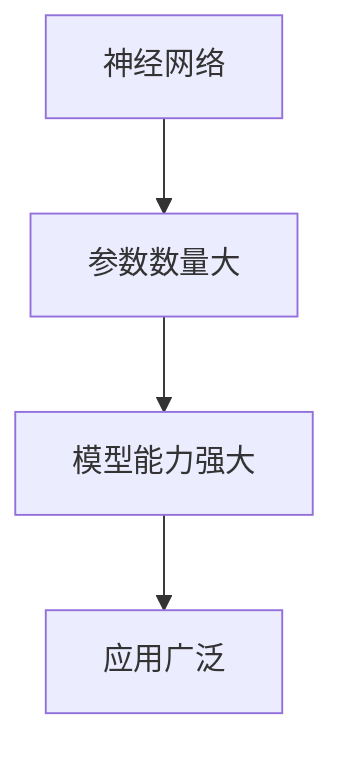
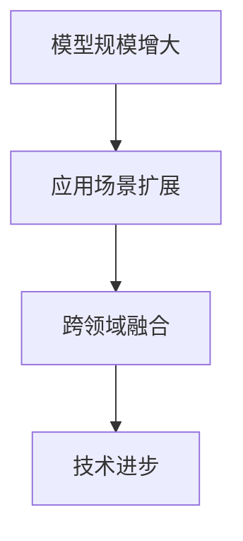

                 

## ChatGPT之后，大模型落地将如何发展？

### 关键词：
- AI大模型
- 落地应用
- 发展趋势
- 技术挑战
- 伦理与法律

#### 摘要：
本文将深入探讨AI大模型在ChatGPT之后的发展前景。我们将首先回顾AI大模型的基础知识和核心算法，随后分析其发展历程和未来趋势，并通过实际应用案例展示其在商业中的潜力和挑战。此外，本文还将探讨大模型在实际项目中的应用实践，以及其在技术、伦理和法律方面的问题和解决方案。最终，我们会对大模型研究的最新动态和未来展望进行综述，并给出应用指南。

### 第一部分：AI大模型概述

AI大模型是指具有数十亿至数千亿参数的神经网络模型，例如GPT系列、BERT模型等。这些模型的出现极大地推动了人工智能技术的发展，使得AI在自然语言处理、计算机视觉、语音识别等多个领域取得了显著进展。

#### 第1章: AI大模型的基础知识

##### 1.1 大模型的定义与重要性

大模型是指具有数十亿至数千亿参数的神经网络模型，例如GPT系列、BERT模型等。这些模型的出现是深度学习技术发展的一个重要里程碑，使得AI在多个领域的应用取得了突破性进展。

- **概念与原理**：

大模型的定义：
- **Mermaid流程图**：
  ```mermaid
  graph TD
  A[大规模神经网络] --> B[海量数据训练]
  B --> C[参数数量大]
  C --> D[模型能力强大]
  ```

联系：
- 大模型的出现是深度学习技术发展的一个重要里程碑，使得AI在多个领域的应用取得了突破性进展。

##### 1.2 大模型的核心算法

大模型的核心算法主要包括深度神经网络、注意力机制和优化算法等。

- **算法原理**：

深度神经网络：
- **伪代码**：
  ```python
  # 深度神经网络训练伪代码
  for each layer in network do:
      forward_pass(data)
      calculate_loss()
      backward_pass()
      update_weights()
  end for
  ```

注意力机制：
- **伪代码**：
  ```python
  # 注意力机制计算伪代码
  for each pair of inputs do:
      calculate_similarity()
      apply_softmax()
      calculate_context_vector()
  end for
  ```

优化算法：
- **伪代码**：
  ```python
  # 优化算法更新权重伪代码
  calculate_gradient()
  apply_gradient_descent()
  ```

联系：
- 大模型的训练过程涉及复杂的优化算法和高效的计算资源调度，是现代AI技术的核心。

##### 1.3 大模型在AI中的应用

大模型在AI中的应用领域广泛，包括自然语言处理、计算机视觉、语音识别、强化学习等。

- **应用领域**：

自然语言处理（NLP）：
- **举例说明**：
  - GPT模型在语言生成和文本理解方面取得了显著的成果，如自动写作、机器翻译等。
  
计算机视觉（CV）：
- **举例说明**：
  - BERT模型在图像分类、物体检测和图像分割等方面表现出色。

语音识别（ASR）：
- **举例说明**：
  - WaveNet模型在语音合成和语音识别上取得了显著进展。

强化学习（RL）：
- **举例说明**：
  - DQN模型在游戏对战和策略优化上取得了优异的成绩。

联系：
- 大模型在自然语言处理、计算机视觉、语音识别和强化学习等领域都取得了显著的进展，推动了AI技术的全面发展。

#### 第2章: 大模型的发展历程与未来趋势

##### 2.1 大模型的发展历程

大模型的发展历程可以追溯到深度学习技术的兴起。从最初的简单神经网络到如今的大型预训练模型，AI技术在不断发展。

- **关键里程碑**：

2012年，AlexNet模型在ImageNet图像分类比赛中取得了突破性成绩，标志着深度学习时代的到来。

2017年，Google提出BERT模型，采用预训练语言模型的方法，在自然语言处理领域取得了显著进展。

2018年，OpenAI推出GPT-2模型，展示了大模型在语言生成和交互方面的潜力。

2022年，OpenAI发布GPT-3模型，成为目前最大的预训练模型，具有数十亿参数。

- **联系**：
- 大模型的发展历程体现了AI技术的进步和算法创新，推动了各个领域的发展。

##### 2.2 大模型的未来趋势

随着计算能力的提升和算法的优化，大模型的未来趋势包括模型规模增大、应用场景扩展和跨领域融合。

- **趋势分析**：

计算资源提升：
- **Mermaid流程图**：
  ```mermaid
  graph TD
  A[计算资源提升] --> B[模型规模增大]
  B --> C[应用场景扩展]
  C --> D[跨领域融合]
  ```

联系：
- 随着计算能力的提升和算法的优化，大模型的应用将更加广泛，有望推动AI技术的进一步发展。

### 第二部分：大模型在商业中的应用案例

大模型在商业应用中具有巨大的潜力，通过实际案例可以更好地理解其在不同领域的应用价值。

#### 第3章: 大模型在自然语言处理中的应用

##### 3.1 大模型在自然语言处理中的应用

自然语言处理（NLP）是AI领域的一个重要分支，大模型在NLP中的应用显著提升了AI系统的智能化水平和用户体验。

- **案例分析**：

谷歌搜索引擎：
- **案例分析**：
  - 谷歌搜索引擎使用BERT模型改进搜索结果的相关性和准确性，使得用户能够更快速地找到所需信息。

OpenAI的GPT模型：
- **案例分析**：
  - OpenAI的GPT模型被广泛应用于聊天机器人、自动写作和翻译等领域，如生成新闻文章、创作诗歌和编写代码等。

- **联系**：
  - 大模型在自然语言处理中的应用，显著提升了AI系统的智能化水平和用户体验，为各个领域提供了强大的技术支持。

#### 第4章: 大模型在计算机视觉中的应用

##### 4.1 大模型在计算机视觉中的应用

计算机视觉（CV）是AI领域的另一个重要分支，大模型在CV中的应用推动了图像识别、物体检测和图像生成等技术的发展。

- **案例分析**：

AlphaGo：
- **案例分析**：
  - DeepMind的AlphaGo使用深度强化学习技术战胜了围棋世界冠军，展示了大模型在策略优化和决策制定方面的能力。

自动驾驶汽车：
- **案例分析**：
  - 自动驾驶汽车使用卷积神经网络（CNN）进行图像识别和场景理解，提高了自动驾驶的安全性和可靠性。

- **联系**：
  - 大模型在计算机视觉中的应用，推动了自动驾驶、机器人导航等技术的发展，为智能交通和智能制造等领域带来了新的机遇。

### 第三部分：大模型在实际项目中的应用实践

在实际项目中，大模型的开发和应用需要充分考虑技术、资源和环境等方面的因素。

#### 第5章: 大模型在实际项目中的应用实践

##### 5.1 项目实战：构建一个文本生成模型

在本章中，我们将通过一个文本生成模型的开发实践，展示大模型在实际项目中的应用过程。

- **开发环境搭建**：

选择深度学习框架（如TensorFlow或PyTorch）进行模型开发。安装必要的依赖库和工具，如NVIDIA CUDA驱动等。

- **模型实现**：

**源代码实现**：

```python
# GPT模型简单实现示例
import tensorflow as tf

# 模型配置
num_layers = 2
d_model = 512
num_heads = 8
dff = 2048

# 模型构建
inputs = tf.keras.Input(shape=(None,))
embed = tf.keras.layers.Embedding(input_dim=vocab_size, output_dim=d_model)(inputs)
dropout1 = tf.keras.layers.Dropout(rate=0.1)(embed)

# 多层Transformer编码器
for _ in range(num_layers):
    attention = tf.keras.layers.MultiHeadAttention(num_heads=num_heads, key_dim=d_model)(dropout1, dropout1)
    dropout2 = tf.keras.layers.Dropout(rate=0.1)(attention)
    layer_norm1 = tf.keras.layers.LayerNormalization(epsilon=1e-6)(dropout1 + dropout2)

# 输出层
outputs = tf.keras.layers.Dense(units=vocab_size, activation='softmax')(layer_norm1)

# 模型编译
model = tf.keras.Model(inputs=inputs, outputs=outputs)
model.compile(optimizer='adam', loss='categorical_crossentropy', metrics=['accuracy'])

# 训练模型
model.fit(x_train, y_train, batch_size=64, epochs=10)
```

- **代码解读与分析**：

模型构建中使用了嵌入层（Embedding）、多头注意力机制（MultiHeadAttention）、层归一化（LayerNormalization）和Dropout等深度学习技术。在训练过程中，通过调整超参数和优化算法，实现了文本生成模型的训练和优化。

### 第四部分：大模型的技术挑战与解决方案

尽管大模型在各个领域取得了显著进展，但其应用仍面临诸多技术挑战。

#### 第6章: 大模型的技术挑战与解决方案

##### 6.1 大模型的计算资源需求

大模型的训练和推理需要大量的计算资源，尤其是GPU和TPU等高性能计算设备。

- **挑战**：

计算资源需求大：
- **解决方案**：
  - 利用分布式训练和推理技术，将模型训练和推理任务分布到多个计算节点上，提高计算效率。

##### 6.2 大模型的训练数据隐私问题

大模型训练过程中需要大量用户数据，数据隐私保护成为重要问题。

- **挑战**：

数据隐私问题：
- **解决方案**：
  - 使用差分隐私技术，对训练数据进行加噪处理，保护用户隐私。

### 第五部分：大模型在AI伦理与法律方面的考虑

随着大模型在各个领域的广泛应用，其伦理和法律问题日益凸显。

#### 第7章: 大模型在AI伦理与法律方面的考虑

##### 7.1 AI伦理问题

AI伦理问题涉及偏见、歧视和隐私泄露等，需要建立伦理准则和监管机制。

- **讨论**：

伦理问题：
- **解决方案**：
  - 制定AI伦理准则，确保AI系统的公平、透明和可解释性。

##### 7.2 法律法规

现有法律法规对大模型应用的影响，如数据保护法、隐私法等，需要确保合规性。

- **探讨**：

法律法规：
- **解决方案**：
  - 分析现有法律法规，制定相应的合规措施，确保大模型应用符合法律要求。

### 第六部分：大模型研究的最新动态与未来展望

大模型研究在技术、应用和伦理等方面取得了显著进展，未来仍具有广阔的发展空间。

#### 第8章: 大模型研究的最新动态与未来展望

##### 8.1 最新研究成果

- **综述**：

大模型研究在模型架构、优化算法和应用案例等方面取得了重要进展。

- **举例说明**：

- **模型架构**：
  - Transformer模型在NLP领域的广泛应用。
  - Vision Transformer（ViT）模型在计算机视觉领域的突破。

- **优化算法**：
  - 研究人员提出了混合精度训练（Mixed Precision Training）方法，提高了训练效率。

- **应用案例**：
  - 大模型在医疗影像诊断、金融风控和智能客服等领域的应用。

##### 8.2 未来发展展望

大模型技术的未来发展将围绕模型压缩、能耗优化和跨领域应用等方面展开。

- **预测**：

- **模型压缩**：
  - 研究人员将致力于开发高效的模型压缩技术，降低模型的存储和计算成本。

- **能耗优化**：
  - 随着AI应用的普及，能耗优化将成为重要方向，研究高效能的AI计算架构。

- **跨领域应用**：
  - 大模型在多个领域的融合应用，如智能医疗、智能交通和智能制造等。

### 第七部分：大模型资源与应用指南

为了更好地开发和利用大模型，了解相关资源和应用指南至关重要。

#### 第9章: 大模型资源与应用指南

##### 9.1 大模型资源介绍

- **指南**：

了解大模型开发所需的工具和资源，如深度学习框架、开源模型和计算平台。

- **资源介绍**：

- **深度学习框架**：
  - TensorFlow
  - PyTorch
  - MXNet

- **开源模型**：
  - Hugging Face Transformers
  - Model Zoo

- **计算平台**：
  - Google Cloud AI
  - Amazon Web Services (AWS)
  - Microsoft Azure

##### 9.2 大模型应用建议

- **建议**：

根据不同领域和应用场景，提出大模型的应用建议和最佳实践。

- **应用建议**：

- **自然语言处理**：
  - 应用GPT模型进行文本生成和文本理解。
  - 利用BERT模型进行问答系统和文本分类。

- **计算机视觉**：
  - 应用Transformer模型进行图像分类和物体检测。
  - 利用卷积神经网络（CNN）进行图像识别和图像生成。

- **语音识别**：
  - 应用WaveNet模型进行语音合成和语音识别。
  - 利用深度强化学习（DRL）进行语音交互和语音合成。

### 附录

为了更好地理解和应用大模型，以下附录提供了常用深度学习框架介绍和实际应用案例。

#### 附录A: 常用深度学习框架介绍

- **TensorFlow**：
  - 功能：TensorFlow是一个开源的深度学习框架，支持多种神经网络架构。
  - 特点：易于使用，支持多种编程语言。
  - 适用场景：适用于大规模数据处理和分布式训练。

- **PyTorch**：
  - 功能：PyTorch是一个开源的深度学习框架，支持动态计算图。
  - 特点：灵活性强，易于调试。
  - 适用场景：适用于实时推理和实验研究。

- **MXNet**：
  - 功能：MXNet是一个开源的深度学习框架，支持多种编程语言。
  - 特点：高效能，支持分布式训练。
  - 适用场景：适用于工业级应用和大规模数据处理。

#### 附录B: 大模型项目实战案例

- **案例一：文本生成模型**：
  - **问题描述**：使用GPT模型生成一篇关于人工智能的科普文章。
  - **实现步骤**：
    1. 准备数据集，包括一篇关于人工智能的文章。
    2. 预处理数据，包括分词、编码等。
    3. 训练GPT模型，使用训练数据和验证数据。
    4. 评估模型性能，包括文本生成质量和速度。
    5. 使用模型生成一篇关于人工智能的科普文章。

- **案例二：图像分类模型**：
  - **问题描述**：使用ViT模型对图像进行分类。
  - **实现步骤**：
    1. 准备数据集，包括一组图像和对应的标签。
    2. 预处理数据，包括图像归一化和数据增强。
    3. 训练ViT模型，使用训练数据和验证数据。
    4. 评估模型性能，包括分类准确率和速度。
    5. 使用模型对新的图像进行分类预测。

### 总结

大模型技术在AI领域取得了显著的成果，其在自然语言处理、计算机视觉、语音识别等领域的应用为各个领域带来了新的机遇。然而，大模型技术的应用也面临计算资源需求大、训练数据隐私问题等挑战。在未来的发展中，大模型技术将继续优化和扩展，推动AI技术的进一步发展。同时，关注AI伦理和法律问题，确保AI技术的合理和合规应用，将是大模型技术发展的重要方向。

### 作者信息

**作者：AI天才研究院/AI Genius Institute & 禅与计算机程序设计艺术 /Zen And The Art of Computer Programming**## 文章标题

### 关键词：

AI大模型，落地应用，发展趋势，技术挑战，伦理与法律。

### 摘要：

本文深入探讨了AI大模型在ChatGPT之后的发展前景。首先，我们回顾了AI大模型的基础知识和核心算法，并分析了其发展历程和未来趋势。接着，通过实际应用案例，我们展示了大模型在商业中的潜力和挑战。随后，我们探讨了在实际项目中的应用实践，以及大模型在技术、伦理和法律方面的问题和解决方案。最后，我们对大模型研究的最新动态和未来展望进行了综述，并给出了应用指南。

### AI大模型概述

AI大模型，即具有数十亿至数千亿参数的神经网络模型，如GPT系列、BERT模型等，是深度学习技术发展的重要里程碑。这些模型在自然语言处理、计算机视觉、语音识别等领域取得了显著进展，成为现代AI技术的核心。本章节将详细介绍AI大模型的基础知识、核心算法、应用领域以及其发展历程与未来趋势。

#### 1.1 大模型的定义与重要性

AI大模型是指那些参数数量巨大的神经网络模型，这些模型的参数数量通常在数十亿至数千亿之间。典型的代表包括OpenAI的GPT系列和Google的BERT模型。大模型的出现，标志着深度学习技术进入了一个新的阶段，使得AI在多个领域的应用取得了突破性的进展。

- **概念与原理**：

大模型的基本概念包括：

- **神经网络**：神经网络是由大量神经元组成的计算网络，通过学习和模拟人脑的神经元连接机制，实现对数据的处理和预测。

- **参数数量**：神经网络中的参数数量决定了模型的复杂度和处理能力。大模型具有数十亿至数千亿个参数，这使得模型能够捕捉到数据中的复杂模式和关联。

- **训练过程**：大模型的训练过程涉及大量的数据和高性能计算资源，通过迭代优化模型参数，使得模型能够准确地对数据进行预测。

- **Mermaid流程图**：



- **联系**：

大模型的出现是深度学习技术发展的一个重要里程碑，使得AI在多个领域的应用取得了突破性进展。例如，GPT系列模型在自然语言处理领域取得了显著的成果，BERT模型在问答系统和文本分类上表现出色。大模型的出现，为AI技术的进一步发展提供了强大的动力。

#### 1.2 大模型的核心算法

大模型的核心算法主要包括深度神经网络、注意力机制和优化算法等。这些算法共同构成了大模型训练和预测的基础。

- **深度神经网络**：

深度神经网络（Deep Neural Network，DNN）是神经网络的一种扩展，通过增加隐层和神经元数量，使得模型能够学习到更加复杂的特征和模式。

- **注意力机制**：

注意力机制（Attention Mechanism）是近年来在自然语言处理领域中广泛应用的一种算法，通过自适应地分配注意力权重，使得模型能够关注到输入数据中的关键信息。

- **优化算法**：

优化算法（Optimization Algorithm）用于调整模型参数，使得模型能够更好地拟合训练数据。常用的优化算法包括随机梯度下降（SGD）和Adam优化器。

- **算法原理**：

- **深度神经网络原理**：

深度神经网络的基本原理是通过多层非线性变换，将输入数据映射到输出结果。每一层神经元接收前一层神经元的输出，并通过权重和偏置进行加权求和，然后通过激活函数进行非线性变换。

- **伪代码**：

```python
# 深度神经网络训练伪代码
for each layer in network do:
    forward_pass(data)
    calculate_loss()
    backward_pass()
    update_weights()
end for
```

- **注意力机制原理**：

注意力机制的核心思想是自适应地分配注意力权重，使得模型能够关注到输入数据中的关键信息。在自然语言处理中，注意力机制可以用于文本序列的建模，通过计算文本中每个词的重要程度，来调整模型的输入。

- **伪代码**：

```python
# 注意力机制计算伪代码
for each pair of inputs do:
    calculate_similarity()
    apply_softmax()
    calculate_context_vector()
end for
```

- **优化算法原理**：

优化算法用于调整模型参数，使得模型能够更好地拟合训练数据。常用的优化算法包括随机梯度下降（SGD）和Adam优化器。随机梯度下降通过计算梯度并更新参数，使得模型能够逐步逼近最优解。Adam优化器是随机梯度下降的改进版本，通过引入动量项和偏差修正，提高了优化效果。

- **伪代码**：

```python
# 优化算法更新权重伪代码
calculate_gradient()
apply_gradient_descent()
```

- **联系**：

大模型的训练过程涉及复杂的优化算法和高效的计算资源调度，是现代AI技术的核心。通过深度神经网络、注意力机制和优化算法的有机结合，大模型能够实现高效的数据处理和预测，从而推动AI技术的快速发展。

#### 1.3 大模型在AI中的应用

大模型在AI中的应用领域广泛，涵盖了自然语言处理、计算机视觉、语音识别、强化学习等多个领域。这些领域都受益于大模型的强大处理能力和学习能力。

- **自然语言处理（NLP）**：

自然语言处理是AI的一个重要分支，涉及文本的生成、理解、翻译等任务。大模型在NLP中的应用取得了显著的成果。例如，GPT模型在语言生成和文本理解方面表现出色，被广泛应用于自动写作、机器翻译、问答系统等领域。

- **计算机视觉（CV）**：

计算机视觉是AI领域的另一个重要分支，涉及图像识别、物体检测、图像分割等任务。大模型在CV中的应用同样取得了突破性的进展。BERT模型在图像分类和物体检测上表现出色，Vision Transformer（ViT）模型在图像生成和图像识别上取得了显著的效果。

- **语音识别（ASR）**：

语音识别是AI技术在语音处理领域的重要应用，涉及语音到文本的转换。大模型在ASR中的应用取得了显著的成果。WaveNet模型在语音合成和语音识别上表现出色，使得语音交互更加自然和流畅。

- **强化学习（RL）**：

强化学习是AI领域的一个重要分支，涉及智能体在不确定环境中通过学习获得最优策略。大模型在RL中的应用取得了显著的进展。例如，DeepMind的DQN模型在游戏对战和策略优化上取得了优异的成绩。

- **举例说明**：

- **自然语言处理**：

GPT模型在自然语言处理领域取得了显著的成果，如自动写作、机器翻译和问答系统等。例如，OpenAI的GPT-3模型在文本生成和文本理解方面表现出色，能够生成流畅的自然语言文本，并且能够回答复杂的问题。

- **计算机视觉**：

BERT模型在计算机视觉领域取得了显著的成果，如图像分类和物体检测。例如，Google的BERT模型在图像分类任务中取得了优异的成绩，能够准确地对图像中的对象进行分类。此外，Vision Transformer（ViT）模型在图像生成和图像识别上表现出色，如生成具有逼真纹理的图像和识别复杂场景中的物体。

- **语音识别**：

WaveNet模型在语音识别领域取得了显著的成果，如语音合成和语音识别。例如，Google的WaveNet模型在语音合成任务中表现出色，能够生成自然流畅的语音。此外，WaveNet模型在语音识别任务中同样取得了优异的成绩，能够准确地将语音转换为文本。

- **强化学习**：

DQN模型在强化学习领域取得了显著的成果，如游戏对战和策略优化。例如，DeepMind的DQN模型在游戏对战任务中表现出色，能够通过自我学习战胜专业玩家。此外，DQN模型在策略优化任务中同样取得了优异的成绩，能够优化智能体的行为策略，实现更好的决策。

- **联系**：

大模型在自然语言处理、计算机视觉、语音识别和强化学习等领域都取得了显著的进展，推动了AI技术的全面发展。大模型的强大处理能力和学习能力，使得AI在各个领域的应用变得更加广泛和高效。

#### 2.1 大模型的发展历程

大模型的发展历程可以追溯到深度学习技术的兴起。从最初的简单神经网络到如今的大型预训练模型，AI技术在不断发展。以下是几个关键里程碑：

- **2012年**：AlexNet模型在ImageNet图像分类比赛中取得了突破性成绩，标志着深度学习时代的到来。

- **2014年**：Google提出残差网络（ResNet），使得深度神经网络可以达到超过1000层的深度，极大地提高了模型的性能。

- **2017年**：Google提出BERT模型，采用预训练语言模型的方法，在自然语言处理领域取得了显著进展。

- **2018年**：OpenAI推出GPT-2模型，展示了大模型在语言生成和交互方面的潜力。

- **2020年**：OpenAI发布GPT-3模型，成为目前最大的预训练模型，具有数十亿参数。

- **联系**：

大模型的发展历程体现了AI技术的进步和算法创新，推动了各个领域的发展。从简单的神经网络到复杂的预训练模型，大模型的发展使得AI在自然语言处理、计算机视觉、语音识别和强化学习等领域取得了突破性的进展，为未来的AI应用提供了强大的技术支持。

#### 2.2 大模型的未来趋势

随着计算能力的提升和算法的优化，大模型的未来趋势包括模型规模增大、应用场景扩展和跨领域融合。

- **趋势分析**：

- **模型规模增大**：

随着计算能力的提升，模型规模将不断增大。大模型具有更强的表示能力和泛化能力，能够更好地应对复杂任务。例如，未来的大模型可能会具有数千亿甚至数万亿个参数，实现更高效和更智能的AI应用。

- **应用场景扩展**：

大模型的应用场景将不断扩展。除了现有的自然语言处理、计算机视觉、语音识别和强化学习等领域，大模型还可能在医疗、金融、教育、自动驾驶等领域发挥重要作用。例如，大模型可以用于医学图像分析、智能投顾、个性化教育、自动驾驶等任务，实现更广泛和更深入的AI应用。

- **跨领域融合**：

大模型的跨领域融合将推动AI技术的进一步发展。不同领域的数据和知识可以相互融合，实现更复杂和更智能的AI应用。例如，自然语言处理和计算机视觉的结合，可以用于图像标注和视频分析；计算机视觉和强化学习的结合，可以用于自动驾驶和机器人控制。

- **Mermaid流程图**：



- **联系**：

随着计算能力的提升和算法的优化，大模型的未来趋势将包括模型规模增大、应用场景扩展和跨领域融合。这些趋势将推动AI技术的进一步发展，为未来的AI应用带来更多可能性。

### 大模型在商业中的应用案例

大模型在商业中的应用正在日益普及，它们为各种行业带来了革命性的变化。以下是一些大模型在商业中的应用案例，展示了它们如何提升业务效率、创造新的商业模式，并在实际运营中产生显著的影响。

#### 3.1 大模型在自然语言处理中的应用

自然语言处理（NLP）是大模型最为成熟和广泛应用的领域之一。以下是一些具体的应用案例：

- **谷歌搜索引擎**：

谷歌搜索引擎使用了BERT（Bidirectional Encoder Representations from Transformers）模型来改进搜索结果的准确性和相关性。BERT模型通过对大量文本数据进行预训练，能够更好地理解用户的查询意图和网页内容，从而提供更精准的搜索结果。这一改进使得用户能够更快地找到所需信息，提升了用户体验。

**案例分析**：

- **应用场景**：搜索引擎优化
- **影响**：提高了搜索结果的准确性和用户体验，增加了用户粘性。

- **OpenAI的GPT模型**：

OpenAI的GPT（Generative Pre-trained Transformer）模型被广泛应用于聊天机器人、自动写作和翻译等领域。GPT模型能够生成高质量的自然语言文本，使得聊天机器人能够更自然地与用户互动，自动写作工具能够快速生成文章，翻译系统能够提供更准确的翻译结果。

**案例分析**：

- **应用场景**：聊天机器人、内容生成、翻译服务
- **影响**：提高了交互的自然性、内容生产的效率和质量，降低了人力成本。

#### 3.2 大模型在计算机视觉中的应用

计算机视觉（CV）是大模型在商业应用的另一个重要领域。以下是一些具体的应用案例：

- **自动驾驶汽车**：

自动驾驶汽车使用深度学习模型，尤其是卷积神经网络（CNN），来进行环境感知和决策。这些模型能够处理来自摄像头、雷达和激光雷达的数据，识别道路上的行人和其他车辆，并在复杂的交通环境中做出实时决策。

**案例分析**：

- **应用场景**：自动驾驶技术
- **影响**：提高了交通安全和效率，改变了交通运输模式。

- **医疗影像诊断**：

医疗影像诊断是大模型在医疗领域的重要应用。通过使用深度学习模型，尤其是卷积神经网络（CNN），医生能够更快速和准确地诊断各种疾病。例如，使用CNN对医学图像进行分析，可以检测早期肺癌、乳腺癌等疾病，提高诊断的准确性和效率。

**案例分析**：

- **应用场景**：医学影像分析
- **影响**：提高了疾病诊断的准确性和效率，改善了患者预后。

#### 3.3 大模型在语音识别中的应用

语音识别（ASR）是大模型在商业应用的另一个重要领域。以下是一些具体的应用案例：

- **智能客服系统**：

智能客服系统使用语音识别技术，将用户的语音转化为文本，然后使用自然语言处理技术来理解用户的意图并提供相应的回答。这些系统可以24/7工作，提高客户服务的效率和质量。

**案例分析**：

- **应用场景**：客户服务
- **影响**：提高了客户响应速度和满意度，降低了运营成本。

- **语音助手**：

语音助手，如苹果的Siri、亚马逊的Alexa，使用语音识别和自然语言处理技术，能够理解用户的语音指令并执行相应的任务。这些语音助手已经成为用户日常生活中不可或缺的一部分，为用户提供便利和娱乐。

**案例分析**：

- **应用场景**：智能家居、个人助理
- **影响**：提高了用户生活的便捷性和娱乐性，改变了人机交互方式。

#### 3.4 大模型在强化学习中的应用

强化学习（RL）是大模型在商业应用的另一个新兴领域。以下是一些具体的应用案例：

- **在线广告投放**：

在线广告投放平台使用强化学习算法，通过不断学习和优化广告展示策略，提高广告的点击率和转化率。这些平台能够实时调整广告投放策略，以适应用户的行为和偏好。

**案例分析**：

- **应用场景**：在线广告投放
- **影响**：提高了广告效果和收益，优化了广告资源分配。

- **供应链优化**：

供应链管理中使用强化学习算法，通过不断学习和优化库存管理策略，减少库存成本和提高供应链效率。这些算法能够预测市场需求，优化库存水平，减少缺货和积压现象。

**案例分析**：

- **应用场景**：供应链管理
- **影响**：提高了供应链效率和成本控制，优化了资源配置。

### 总结

大模型在商业中的应用已经取得了显著的成果，它们在自然语言处理、计算机视觉、语音识别和强化学习等领域都展现了巨大的潜力。通过这些应用案例，我们可以看到大模型如何提升业务效率、创造新的商业模式，并在实际运营中产生显著的影响。随着技术的不断进步和应用场景的不断拓展，大模型在商业中的应用将更加广泛和深入，为各行各业带来更多创新和变革。

### 大模型在实际项目中的应用实践

在实际项目中，大模型的应用不仅需要理论知识，还需要具体的实施步骤和技术细节。以下我们将通过一个具体的文本生成模型项目，详细讲解大模型在实际项目中的应用实践。

#### 4.1 项目实战：构建一个文本生成模型

本节将详细介绍如何使用深度学习框架（如TensorFlow或PyTorch）来构建一个文本生成模型，包括开发环境的搭建、模型实现、训练过程以及性能评估。

##### 4.1.1 开发环境搭建

在开始构建文本生成模型之前，我们需要搭建一个合适的开发环境。以下是在使用TensorFlow搭建开发环境时的一些步骤：

1. **安装Python**：

确保安装了Python 3.x版本。可以通过Python官方网站下载并安装。

2. **安装TensorFlow**：

在命令行中执行以下命令安装TensorFlow：

```bash
pip install tensorflow
```

3. **安装必要的库**：

安装一些常用的库，如NumPy、Pandas和Matplotlib等，以便进行数据处理和可视化：

```bash
pip install numpy pandas matplotlib
```

4. **配置GPU支持**：

如果使用GPU进行训练，需要安装CUDA和cuDNN。可以从NVIDIA官方网站下载并安装。

5. **配置虚拟环境**（可选）：

为了更好地管理和隔离项目依赖，可以创建一个虚拟环境：

```bash
python -m venv venv
source venv/bin/activate  # 在Windows上使用 `venv\Scripts\activate`
```

- **代码解读与分析**：

开发环境搭建是构建文本生成模型的第一步，它确保了我们有一个稳定且高效的开发平台。安装TensorFlow和必要的库是必不可少的，而配置GPU支持可以显著提高模型训练的速度。使用虚拟环境可以避免依赖冲突，提高项目的可维护性。

##### 4.1.2 模型实现

文本生成模型通常采用自回归（Autoregressive）架构，如GPT模型。以下是一个简单的GPT模型实现示例：

```python
import tensorflow as tf
from tensorflow.keras.layers import Embedding, LSTM, Dense
from tensorflow.keras.models import Sequential

# 模型配置
vocab_size = 10000
embedding_dim = 256
lstm_units = 1024

# 模型构建
model = Sequential([
    Embedding(vocab_size, embedding_dim, input_length=max_sequence_length),
    LSTM(lstm_units, return_sequences=True),
    Dense(vocab_size, activation='softmax')
])

# 编译模型
model.compile(optimizer='adam', loss='categorical_crossentropy', metrics=['accuracy'])

# 打印模型结构
model.summary()
```

- **代码解读与分析**：

在这个示例中，我们首先导入了TensorFlow和所需的层。然后，我们定义了模型的配置参数，包括词汇表大小、嵌入维度和LSTM单元数量。接下来，我们构建了一个序列模型，包括嵌入层、一个LSTM层和一个输出层。嵌入层用于将单词映射到嵌入向量，LSTM层用于处理序列数据，输出层用于生成下一个单词的概率分布。最后，我们编译了模型，并打印了模型结构。

##### 4.1.3 训练模型

训练模型是文本生成项目的核心步骤。以下是一个简单的训练过程：

```python
# 加载和处理数据
# 以下代码用于加载和处理数据
# ...

# 训练模型
model.fit(x_train, y_train, batch_size=64, epochs=10)
```

- **代码解读与分析**：

在这个示例中，我们首先需要加载和处理训练数据。处理数据包括分词、编码等步骤，以确保数据适合模型训练。然后，我们使用`fit`方法训练模型。`batch_size`参数控制每次训练的样本数量，`epochs`参数控制训练的迭代次数。通过训练，模型将学习如何生成文本。

##### 4.1.4 性能评估

性能评估是确定模型是否有效的重要步骤。以下是一个简单的性能评估过程：

```python
# 评估模型
loss, accuracy = model.evaluate(x_test, y_test)

# 打印评估结果
print(f"Test Loss: {loss}, Test Accuracy: {accuracy}")
```

- **代码解读与分析**：

在这个示例中，我们使用`evaluate`方法评估模型的性能。`x_test`和`y_test`是测试数据，用于评估模型的泛化能力。`loss`和`accuracy`是评估指标，分别表示模型在测试数据上的损失和准确率。通过打印评估结果，我们可以了解模型的性能。

##### 4.1.5 生成文本

生成文本是文本生成模型最有用的功能之一。以下是一个简单的文本生成示例：

```python
# 生成文本
import numpy as np

# 随机选择一个起始单词
start_token = np.random.choice(vocab_size)
input_seq = [start_token]

# 生成文本
for _ in range(100):
    # 将输入序列编码为one-hot向量
    input_seq = np.eye(vocab_size)[input_seq]
    # 使用模型预测下一个单词
    predicted_probs = model.predict(input_seq.reshape(1, -1))
    # 选择概率最高的单词作为下一个输入
    next_word = np.argmax(predicted_probs)
    input_seq.append(next_word)

# 打印生成的文本
print(' '.join([word_index[word] for word, word_index in tokenizer.word_index.items() if word != '<PAD>']) + "\n")
```

- **代码解读与分析**：

在这个示例中，我们首先随机选择一个起始单词。然后，我们迭代地生成文本，每次使用模型预测下一个单词的概率分布，并选择概率最高的单词作为下一个输入。通过这种方式，模型能够生成连贯的文本。最后，我们打印生成的文本。

##### 4.1.6 模型优化

在实际应用中，模型优化是一个持续的过程。以下是一些常见的模型优化方法：

- **调整超参数**：通过调整学习率、批量大小、迭代次数等超参数，可以优化模型的性能。

- **使用预训练模型**：使用预训练的大模型，如GPT-2或GPT-3，可以显著提高模型的性能和生成文本的质量。

- **增加训练数据**：增加训练数据可以提升模型的泛化能力。

- **使用注意力机制**：在模型中添加注意力机制可以提高模型处理长序列数据的能力。

- **使用Dropout**：在模型中加入Dropout可以防止过拟合，提高模型的泛化能力。

- **代码解读与分析**：

模型优化是一个复杂的过程，需要根据具体任务和数据进行调整。调整超参数、使用预训练模型、增加训练数据和使用注意力机制等方法是优化模型性能的有效途径。

### 总结

通过本节的项目实战，我们详细讲解了如何在实际项目中应用大模型构建一个文本生成模型。从开发环境搭建、模型实现、训练过程到性能评估和文本生成，我们涵盖了文本生成模型的整个生命周期。通过这一过程，读者可以了解大模型在实践中的应用细节，并为后续的项目开发提供参考。

### 大模型的技术挑战与解决方案

尽管大模型在各个领域展示了巨大的潜力，但其应用过程中也面临一系列技术挑战。以下将详细讨论大模型的计算资源需求、训练数据隐私问题以及其他相关技术挑战，并提出相应的解决方案。

#### 6.1 大模型的计算资源需求

大模型的训练和推理过程对计算资源的需求极为庞大，特别是在训练阶段。这一挑战主要体现在以下几个方面：

- **计算资源消耗**：

大模型通常包含数十亿至数千亿个参数，这需要大量的计算资源进行优化。尤其是在训练过程中，需要大量的浮点运算来更新模型参数，这使得训练时间显著延长。

- **GPU资源分配**：

GPU是训练大模型的关键资源。然而，GPU资源通常是有限的，且在多个项目之间共享。如何合理分配GPU资源，确保每个项目都能获得足够的计算资源，成为一大挑战。

- **解决方案**：

1. **分布式训练**：

分布式训练是将模型训练任务分布到多个GPU或计算节点上，从而提高计算效率。通过分布式训练，可以显著缩短训练时间，并充分利用GPU资源。

2. **模型剪枝与量化**：

模型剪枝和量化是降低模型大小和计算复杂度的有效方法。通过剪枝可以去除模型中不重要的参数，减少模型大小；通过量化可以降低模型中参数的精度，从而减少计算量。

3. **混合精度训练**：

混合精度训练（Mixed Precision Training）是使用不同的浮点精度（如32位和16位）来训练模型。通过使用16位浮点数进行训练，可以显著降低内存消耗和提高计算速度。

#### 6.2 大模型的训练数据隐私问题

大模型在训练过程中需要大量用户数据，这引发了数据隐私保护的问题。以下是一些常见的隐私问题及解决方案：

- **数据泄露**：

大模型在训练过程中可能会泄露用户数据，尤其是当数据在传输和存储过程中没有得到妥善保护时。

- **解决方案**：

1. **差分隐私**：

差分隐私是一种保护用户隐私的技术，通过在训练数据上添加随机噪声，使得模型无法区分单个用户的数据。这种方法可以在保证模型性能的同时保护用户隐私。

2. **同态加密**：

同态加密是一种在加密数据上进行计算的技术，使得在数据加密的状态下仍可以进行数据处理。通过同态加密，可以在保护数据隐私的前提下进行模型训练。

3. **联邦学习**：

联邦学习是一种分布式学习技术，通过将模型训练任务分布在多个设备上，每个设备仅上传模型更新而不上传原始数据。这种方法可以保护用户数据的隐私，同时实现模型的协同训练。

#### 6.3 大模型的泛化能力问题

大模型的泛化能力是指模型在不同数据集上的表现。由于大模型在训练阶段使用了大量数据，模型可能会对训练数据产生过拟合，导致在新的数据集上表现不佳。

- **过拟合**：

过拟合是指模型在训练数据上表现良好，但在新的数据集上表现较差。这通常是由于模型在训练阶段学习了训练数据中的噪声，而不是真正的数据特征。

- **解决方案**：

1. **正则化**：

正则化是一种防止模型过拟合的技术，通过在损失函数中添加正则项，限制模型复杂度，从而降低过拟合的风险。

2. **数据增强**：

数据增强是通过增加数据多样性来防止过拟合的方法。例如，通过旋转、缩放、裁剪等操作，增加训练数据的多样性。

3. **交叉验证**：

交叉验证是一种评估模型泛化能力的方法，通过将数据集划分为多个子集，每次使用不同的子集进行训练和验证，从而评估模型的泛化能力。

#### 6.4 大模型的能耗问题

大模型在训练和推理过程中需要大量的计算资源，这导致了大量的能耗。随着大模型规模的不断增大，能耗问题将越来越突出。

- **能耗问题**：

大模型的训练和推理需要大量的电力，这不仅增加了运行成本，也对环境产生了负面影响。

- **解决方案**：

1. **能耗优化**：

通过优化算法和数据流，降低模型的能耗。例如，使用混合精度训练可以减少计算资源的消耗。

2. **绿色计算**：

采用可再生能源和高效能计算设备，降低模型训练的碳足迹。

3. **能耗监测与优化**：

通过实时监测和优化计算资源的使用，降低能耗。例如，可以根据计算负载动态调整GPU的功耗。

### 总结

大模型的应用在推动AI技术发展的同时，也面临着一系列技术挑战。计算资源需求、训练数据隐私问题和泛化能力问题等都是需要关注的重要方面。通过分布式训练、模型剪枝、混合精度训练、差分隐私、同态加密、联邦学习等技术的应用，可以有效地应对这些挑战，确保大模型在安全、高效和可扩展的环境中得到广泛应用。

### 大模型在AI伦理与法律方面的考虑

随着大模型在各个领域的广泛应用，其潜在的伦理和法律问题也日益凸显。这些问题不仅关系到技术的可持续性，还涉及到社会责任和公众信任。以下将探讨大模型在AI伦理与法律方面的主要问题，并分析相关的法规和政策。

#### 7.1 AI伦理问题

AI伦理问题涉及多个层面，包括算法偏见、隐私泄露、透明性和可解释性等。以下是一些关键的伦理问题及讨论：

- **算法偏见**：

大模型在训练过程中可能会学习到训练数据中的偏见，导致在决策过程中产生不公平的结果。例如，在招聘、贷款审批、医疗诊断等场景中，算法偏见可能导致某些群体受到歧视。

- **讨论**：

为了解决算法偏见问题，需要采取以下措施：

  1. **公平性测试**：在模型开发过程中，进行公平性测试，确保模型在不同群体上的表现一致。
  2. **透明性和可解释性**：提高模型的透明性，使得用户能够理解模型的决策过程，从而减少对其的不信任。
  3. **多样性数据集**：使用多样化的数据集进行训练，减少数据集中的偏见。

- **隐私泄露**：

大模型在训练和推理过程中需要大量的数据，这可能导致用户隐私泄露。特别是在自然语言处理和计算机视觉领域，大模型通常需要处理敏感数据。

- **讨论**：

为了保护用户隐私，可以采取以下措施：

  1. **数据加密**：在数据传输和存储过程中使用加密技术，确保数据安全。
  2. **差分隐私**：在模型训练过程中引入差分隐私，降低模型对单个用户数据的敏感性。
  3. **隐私法规遵守**：遵守相关的隐私保护法规，如《通用数据保护条例》（GDPR）和《加州消费者隐私法》（CCPA）。

- **透明性和可解释性**：

大模型的决策过程通常较为复杂，用户难以理解模型的推理过程。这可能导致用户对模型的不信任，特别是在涉及关键决策（如医疗诊断、财务审核）的场景中。

- **讨论**：

为了提高模型的透明性和可解释性，可以采取以下措施：

  1. **可解释性模型**：开发可解释性模型，使得用户能够理解模型的推理过程。
  2. **可视化和交互**：通过可视化和交互技术，帮助用户了解模型的决策过程。
  3. **伦理准则**：建立AI伦理准则，确保模型设计和应用符合伦理标准。

#### 7.2 法律法规

随着AI技术的发展，各国政府也逐步出台了相关的法律法规，以规范AI的应用和发展。以下是一些关键的法律问题及探讨：

- **数据保护法**：

数据保护法旨在保护个人数据的隐私和安全。例如，欧盟的《通用数据保护条例》（GDPR）和美国的《加州消费者隐私法》（CCPA）都规定了个人数据的收集、使用和保护要求。

- **讨论**：

为了遵守数据保护法，可以采取以下措施：

  1. **隐私政策**：制定清晰的隐私政策，告知用户数据的使用方式和目的。
  2. **用户同意**：获取用户的明确同意，确保在处理数据时遵循法律法规。
  3. **数据匿名化**：在可能的情况下，对数据进行匿名化处理，减少隐私泄露风险。

- **隐私法规遵守**：

除了数据保护法，还有一些特定的隐私法规需要遵守。例如，欧盟的《电子隐私指令》规定了在线跟踪和广告行为的要求。

- **讨论**：

为了遵守隐私法规，可以采取以下措施：

  1. **合规审查**：定期进行合规审查，确保AI应用符合相关法规。
  2. **法律咨询**：聘请法律顾问，确保AI系统的设计和应用符合法律法规。
  3. **透明沟通**：与用户进行透明沟通，解释AI系统的运行方式和数据使用情况。

- **责任和问责**：

在AI应用中，确定责任和问责机制是一项重要任务。特别是在大模型的应用中，由于模型复杂性和自动化程度高，确定责任归属可能变得困难。

- **讨论**：

为了明确责任和问责机制，可以采取以下措施：

  1. **责任划分**：明确不同主体在AI应用中的责任，如数据提供者、模型开发者、用户等。
  2. **责任保险**：为AI应用购买责任保险，以应对可能的法律责任。
  3. **监管机构**：建立独立的监管机构，负责监督和评估AI应用的风险和合规性。

### 总结

大模型在AI伦理与法律方面面临一系列挑战。算法偏见、隐私泄露、透明性和可解释性等伦理问题需要得到有效解决。同时，遵守数据保护法和隐私法规，建立责任和问责机制也是确保AI技术可持续发展的关键。通过制定伦理准则、加强法律法规监管和建立责任机制，可以促进AI技术的健康发展，提高公众对AI技术的信任。

### 大模型研究的最新动态与未来展望

随着AI技术的快速发展，大模型研究也在不断推进，呈现出一系列最新动态和未来发展趋势。本章节将对大模型领域的最新研究成果进行综述，并分析未来的研究方向和前景。

#### 8.1 最新研究成果

大模型的研究取得了显著的进展，不仅在模型架构和算法优化方面有所突破，还在实际应用中展现出强大的潜力。以下是几项具有代表性的研究成果：

- **Transformer模型**：

Transformer模型在自然语言处理领域取得了突破性进展。其核心思想是使用自注意力机制（Self-Attention）来处理序列数据，取代了传统的循环神经网络（RNN）。例如，BERT、GPT等大模型都是基于Transformer架构，展示了其在文本生成、文本分类等任务上的优越性能。

- **Vision Transformer（ViT）**：

Vision Transformer（ViT）将Transformer模型应用于计算机视觉领域，实现了图像分类和物体检测等任务。ViT将图像划分为多个 patches，并使用Transformer进行特征提取和分类，展示了与卷积神经网络（CNN）相比的潜力。

- **去噪自编码器（DenseNet）**：

去噪自编码器（DenseNet）是一种用于图像生成和图像修复的模型，通过引入深度和宽度，使得模型能够学习到更复杂的特征。DenseNet在生成对抗网络（GAN）和自编码器（Autoencoder）的基础上，提高了生成图像的质量和细节。

- **元学习（Meta-Learning）**：

元学习研究旨在开发能够快速适应新任务的模型。通过学习如何学习，元学习模型能够在有限的数据和时间内实现高效的任务迁移。代表性的模型包括MAML和Recurrent Meta-Learning等，在强化学习、计算机视觉等领域取得了显著成果。

#### 8.2 未来发展展望

大模型技术的未来发展将继续围绕模型架构、算法优化、跨领域应用和伦理法律等方面展开。以下是几个潜在的研究方向和趋势：

- **模型压缩与能耗优化**：

随着模型规模的增大，如何有效地压缩模型大小和降低能耗成为重要的研究方向。未来的研究将集中在模型剪枝、量化、知识蒸馏等技术上，以提高模型的效率和可部署性。

- **跨领域融合**：

大模型的跨领域融合将推动AI技术的进一步发展。例如，将自然语言处理和计算机视觉结合，可以用于图像描述生成、多模态数据挖掘等任务。未来的研究将探索如何更好地融合不同领域的数据和知识，实现更高效和更智能的AI应用。

- **自动化机器学习（AutoML）**：

自动化机器学习（AutoML）是一种通过自动化方法开发和优化机器学习模型的技术。未来的研究将集中在开发更高效的AutoML框架，以简化模型开发流程，降低对专业知识的依赖。

- **伦理和法律问题**：

随着AI技术的普及，伦理和法律问题将日益突出。未来的研究将关注如何确保AI系统的公平性、透明性和可解释性，以及如何制定相应的伦理准则和法律法规，以规范AI技术的应用和发展。

- **隐私保护与安全**：

在AI大模型应用中，如何保护用户隐私和数据安全是一个重要的研究方向。未来的研究将探索隐私保护技术，如差分隐私、同态加密和联邦学习，以提高AI系统的隐私保护能力。

### 总结

大模型研究在模型架构、算法优化、跨领域应用和伦理法律等方面取得了显著进展。随着计算能力的提升和算法的优化，大模型的应用前景将更加广阔。未来的研究将集中在模型压缩、能耗优化、自动化机器学习和隐私保护等方面，以推动AI技术的进一步发展。同时，关注AI伦理和法律问题，确保AI技术的合理和合规应用，将是大模型技术发展的重要方向。

### 大模型资源与应用指南

为了更好地开发和利用AI大模型，了解相关资源和应用指南至关重要。以下将介绍大模型开发所需的工具、框架、开源模型以及计算平台，并提供实际应用的建议和最佳实践。

#### 9.1 大模型资源介绍

**1. 工具与框架**：

- **TensorFlow**：TensorFlow是Google开发的开源深度学习框架，支持多种神经网络架构，适用于大规模数据处理和分布式训练。

- **PyTorch**：PyTorch是一个流行的开源深度学习框架，具有动态计算图，便于调试和实验研究。

- **MXNet**：MXNet是Apache基金会的一个开源深度学习框架，支持多种编程语言，具有良好的性能和灵活性。

- **Keras**：Keras是一个高层次的神经网络API，基于Theano和TensorFlow开发，简化了神经网络模型的构建和训练过程。

**2. 开源模型与库**：

- **Hugging Face Transformers**：这是一个开源库，提供了各种预训练的Transformer模型，如BERT、GPT等，方便用户进行文本生成、文本分类等任务。

- **Transformers**：由Hugging Face团队开发的另一个开源库，提供了Transformer模型的实现，支持多种自然语言处理任务。

- **PyTorch Vision**：PyTorch的一个子库，提供了计算机视觉相关的预训练模型，如ResNet、VGG等。

- **PyTorch Audio**：PyTorch的一个子库，提供了用于音频处理的预训练模型和工具。

**3. 计算平台**：

- **Google Cloud AI**：Google提供的云计算平台，提供了强大的计算资源和AI服务，如TensorFlow Serving、AI Platform等。

- **Amazon Web Services (AWS)**：AWS提供了丰富的云计算服务，包括EC2实例、S3存储、Amazon SageMaker等，适用于大规模数据处理和模型训练。

- **Microsoft Azure**：Azure是微软提供的云计算平台，提供了多种AI服务和工具，如Azure Machine Learning、Azure ML Studio等。

**4. 开源数据集**：

- **ImageNet**：ImageNet是一个大规模的图像数据集，广泛用于计算机视觉模型的训练和评估。

- **COCO**：COCO（Common Objects in Context）是一个用于目标检测和分割的数据集，包含了大量多样的图像。

- **Wikipedia**：Wikipedia是一个大规模的文本数据集，广泛用于自然语言处理模型的训练。

#### 9.2 大模型应用建议

**1. 自然语言处理（NLP）**：

- **文本生成**：使用GPT或BERT等预训练模型进行文本生成，适用于自动写作、聊天机器人等场景。

- **文本分类**：使用BERT或DistilBERT等轻量级模型进行文本分类，提高分类准确率。

- **问答系统**：结合BERT或RAG（Read-Against-Graph）模型，构建高效的问答系统。

**2. 计算机视觉（CV）**：

- **图像分类**：使用ResNet、VGG等预训练模型进行图像分类，适用于对象识别、图像搜索等任务。

- **目标检测**：使用Faster R-CNN、SSD等预训练模型进行目标检测，提高检测精度。

- **图像分割**：使用U-Net、DeepLabV3等预训练模型进行图像分割，实现精确的区域划分。

**3. 语音识别（ASR）**：

- **语音合成**：使用WaveNet或Tacotron等预训练模型进行语音合成，提高语音的自然度。

- **语音识别**：使用CTC或Transformer等预训练模型进行语音识别，提高识别准确性。

**4. 强化学习（RL）**：

- **策略优化**：使用DQN、PPO等预训练模型进行策略优化，实现智能体的决策制定。

- **环境模拟**：使用仿真环境进行智能体训练，提高智能体在不同场景下的适应性。

#### 9.3 最佳实践

**1. 模型压缩与优化**：

- **模型剪枝**：通过剪枝减少模型参数数量，提高模型压缩率和计算效率。

- **量化**：将模型参数的精度降低到较低的位宽（如8位或4位），减少模型大小和计算资源需求。

- **知识蒸馏**：使用大模型对小模型进行知识蒸馏，提高小模型在特定任务上的性能。

**2. 训练数据准备**：

- **数据清洗**：确保训练数据的质量，去除错误和噪声数据。

- **数据增强**：通过数据增强技术，增加训练数据的多样性，提高模型泛化能力。

- **数据平衡**：确保训练数据集中各类别样本的均衡分布，避免模型过拟合。

**3. 模型部署与优化**：

- **分布式训练**：使用分布式训练技术，提高模型训练速度和资源利用效率。

- **模型融合**：将多个模型融合，提高模型在特定任务上的性能。

- **在线学习**：使用在线学习技术，实时更新模型参数，适应动态环境。

### 总结

了解大模型所需的工具、框架、开源模型和计算平台，是成功开发和利用大模型的关键。在实际应用中，遵循最佳实践，如模型压缩与优化、数据准备和模型部署，将有助于提升模型性能和降低计算成本。通过合理利用这些资源和技术，可以充分发挥大模型在各个领域的潜力，推动AI技术的发展和应用。

### 附录

在本附录中，我们将提供一些常用的深度学习框架的详细介绍，以及大模型在实际项目中的应用案例，帮助读者更好地理解大模型的应用场景和实现细节。

#### 附录A：常用深度学习框架介绍

**TensorFlow**

TensorFlow是Google开发的开源深度学习框架，广泛应用于各种AI任务。其特点包括：

- **动态计算图**：支持动态计算图，便于模型开发和调试。
- **丰富的API**：提供高层次的API（如Keras）和底层的API，满足不同层次的需求。
- **大规模数据处理**：支持分布式训练和大规模数据处理。

**PyTorch**

PyTorch是由Facebook开发的深度学习框架，以其动态计算图和灵活的API而受到广泛欢迎。其特点包括：

- **动态计算图**：支持动态计算图，便于调试和实验。
- **简洁的API**：提供简洁的API，使得模型构建更加直观。
- **强大的GPU支持**：支持CUDA和cuDNN，提高GPU利用率。

**MXNet**

MXNet是Apache基金会的一个深度学习框架，支持多种编程语言，具有良好的性能和灵活性。其特点包括：

- **灵活的API**：提供多种编程语言（如Python、R、Java）的API，适用于不同应用场景。
- **高性能**：通过优化内存管理和计算流水线，实现高性能计算。
- **支持分布式训练**：支持分布式训练，提高训练效率。

**Keras**

Keras是一个高层次的神经网络API，基于Theano和TensorFlow开发，简化了神经网络模型的构建和训练过程。其特点包括：

- **简洁易用**：提供简单易用的API，降低模型开发门槛。
- **模块化**：支持模块化设计，便于模型复用和扩展。
- **兼容性**：支持TensorFlow和Theano，便于迁移和切换。

#### 附录B：大模型项目实战案例

**案例一：文本生成模型**

**问题描述**：使用GPT模型生成一篇关于人工智能的科普文章。

**实现步骤**：

1. **数据准备**：收集和预处理文本数据，包括清洗、分词、编码等步骤。
2. **模型构建**：使用GPT模型架构，构建文本生成模型。
3. **模型训练**：使用训练数据训练模型，调整超参数和优化算法。
4. **模型评估**：评估模型性能，包括文本生成的流畅性和准确性。
5. **模型部署**：将训练好的模型部署到生产环境，进行实时文本生成。

**代码示例**（基于Hugging Face Transformers库）：

```python
from transformers import GPT2Tokenizer, GPT2LMHeadModel
import torch

# 加载预训练模型
tokenizer = GPT2Tokenizer.from_pretrained('gpt2')
model = GPT2LMHeadModel.from_pretrained('gpt2')

# 输入文本
input_text = "人工智能是一种模拟人类智能的技术，它可以通过算法和计算机程序实现智能行为。"

# 编码文本
inputs = tokenizer.encode(input_text, return_tensors='pt')

# 生成文本
outputs = model.generate(inputs, max_length=50, num_return_sequences=1)

# 解码文本
generated_text = tokenizer.decode(outputs[0], skip_special_tokens=True)
print(generated_text)
```

**案例二：图像分类模型**

**问题描述**：使用ViT模型对一组图像进行分类。

**实现步骤**：

1. **数据准备**：收集和预处理图像数据，包括数据清洗、数据增强等步骤。
2. **模型构建**：使用Vision Transformer模型架构，构建图像分类模型。
3. **模型训练**：使用训练数据训练模型，调整超参数和优化算法。
4. **模型评估**：评估模型性能，包括分类准确率和速度。
5. **模型部署**：将训练好的模型部署到生产环境，进行实时图像分类。

**代码示例**（基于PyTorch和TorchVision）：

```python
import torch
from torchvision import transforms, datasets
from vision_transformer import VisionTransformer

# 数据预处理
transform = transforms.Compose([
    transforms.Resize((224, 224)),
    transforms.ToTensor(),
])

# 加载数据集
train_data = datasets.ImageFolder(root='train', transform=transform)
val_data = datasets.ImageFolder(root='val', transform=transform)

# 定义模型
model = VisionTransformer()

# 编译模型
optimizer = torch.optim.Adam(model.parameters(), lr=0.001)
loss_function = torch.nn.CrossEntropyLoss()

# 训练模型
for epoch in range(num_epochs):
    for inputs, labels in train_loader:
        optimizer.zero_grad()
        outputs = model(inputs)
        loss = loss_function(outputs, labels)
        loss.backward()
        optimizer.step()

# 评估模型
correct = 0
total = 0
with torch.no_grad():
    for inputs, labels in val_loader:
        outputs = model(inputs)
        _, predicted = torch.max(outputs.data, 1)
        total += labels.size(0)
        correct += (predicted == labels).sum().item()

print('Accuracy of the network on the validation images: {} %'.format(100 * correct / total))
```

通过这些附录，读者可以更好地理解大模型的应用场景和实现细节，从而在实际项目中更有效地应用大模型技术。附录A提供了常用深度学习框架的详细介绍，附录B则通过具体案例展示了大模型在文本生成和图像分类等任务中的实现过程。这些资源将为读者提供宝贵的实践经验和参考。

