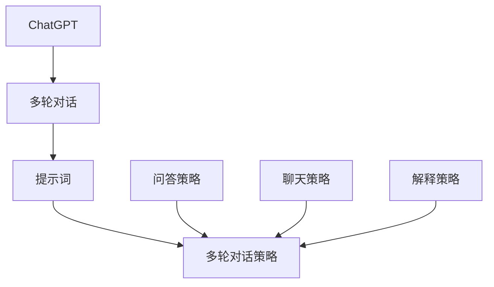

                 

# 《ChatGPT提示词编写：多轮对话策略》

## 摘要

本文将深入探讨ChatGPT提示词编写和多轮对话策略的设计与应用。首先，我们简要介绍了ChatGPT的基本概念和背景，接着详细阐述了ChatGPT在多轮对话中的优势。随后，我们重点讲解了ChatGPT提示词的编写基础，包括提示词的概念与作用、编写高质量提示词的技巧以及常见错误与解决方法。在此基础上，我们探讨了多轮对话策略的设计原则与实现步骤，并通过案例分析展示了多轮对话策略的应用效果。最后，我们结合实战项目，详细介绍了ChatGPT多轮对话系统的安装与配置、代码实现与分析，以及性能优化与调试技巧。本文旨在为读者提供全面、系统的ChatGPT提示词编写和多轮对话策略设计的指导。

## 第一部分：引言

### 什么是ChatGPT

ChatGPT是OpenAI于2022年11月推出的一款基于Transformer模型的自然语言处理（NLP）聊天机器人。ChatGPT采用了预训练加微调（Pre-training and Fine-tuning）的方法，其核心模型是GPT-3.5，具有高达1750亿个参数，能够处理多种语言任务，包括文本生成、机器翻译、问答系统等。

ChatGPT的背景与历史

ChatGPT是OpenAI众多产品中的一个，OpenAI成立于2015年，其宗旨是实现安全的通用人工智能（AGI）并使其对人类有益。在ChatGPT推出之前，OpenAI已经推出了许多优秀的AI产品，如GPT-2、GPT-3等。ChatGPT的诞生，标志着AI在自然语言处理领域取得了新的突破。

### ChatGPT在多轮对话中的优势

多轮对话的概念

多轮对话是指系统与用户之间进行多次交互，以获取更多信息或完成任务。在多轮对话中，系统能够理解用户的意图，并根据上下文进行合理的回应。

ChatGPT在多轮对话中的优势

1. **强大的语言理解能力**：ChatGPT基于GPT-3.5模型，具有强大的语言理解能力，能够准确捕捉用户的意图和上下文信息。

2. **灵活的对话形式**：ChatGPT支持多种对话形式，如问答、聊天、解释等，能够满足不同场景的需求。

3. **多语言支持**：ChatGPT能够处理多种语言，包括英语、中文、法语、西班牙语等，为全球用户提供了便捷的交流方式。

4. **高效的上下文保持能力**：ChatGPT能够有效保持对话的上下文信息，确保对话的连贯性和一致性。

### 总结

本部分介绍了ChatGPT的基本概念、背景以及多轮对话中的优势。接下来，我们将深入探讨ChatGPT提示词的编写基础，包括提示词的概念与作用、编写高质量提示词的技巧以及常见错误与解决方法。

### 第二部分：ChatGPT提示词编写基础

#### ChatGPT提示词的概念与作用

1. **提示词的定义**：提示词是指提供给ChatGPT的用于引导对话方向和内容的文字或短语。

2. **提示词在多轮对话中的作用**：提示词能够帮助ChatGPT更好地理解用户意图，保持对话的连贯性和一致性，从而提高对话的质量和用户体验。

#### 编写高质量ChatGPT提示词的技巧

1. **明确对话目标**：在编写提示词时，首先要明确对话的目标，以便为ChatGPT提供清晰的方向。

2. **简洁明了**：提示词应尽量简洁明了，避免使用复杂的语言和冗长的句子。

3. **多样性**：为了提高对话的丰富性和趣味性，提示词应具有多样性，包括不同的提问方式、陈述方式等。

4. **逻辑性**：提示词应具备一定的逻辑性，确保对话的流程和内容能够合理地推进。

5. **上下文相关性**：提示词应与当前对话的上下文保持一致，以便ChatGPT能够更好地理解用户意图。

#### 常见错误与解决方法

1. **错误1：提示词过于模糊**  
   **解决方法**：明确提示词，使其具有明确的指向性。

2. **错误2：提示词与上下文不符**  
   **解决方法**：确保提示词与当前对话的上下文保持一致。

3. **错误3：提示词过于复杂**  
   **解决方法**：简化提示词，使其易于理解和操作。

4. **错误4：提示词过于重复**  
   **解决方法**：增加提示词的多样性，避免重复。

#### 总结

本部分介绍了ChatGPT提示词的概念与作用，以及编写高质量提示词的技巧和常见错误与解决方法。接下来，我们将探讨多轮对话策略的设计原则与实现步骤。

### 第三部分：多轮对话策略设计

#### 多轮对话策略概述

1. **多轮对话的基本流程**：多轮对话通常包括用户提问、系统回答、用户反馈等环节。

2. **多轮对话的常见策略**：常见的多轮对话策略包括问答策略、聊天策略、解释策略等。

#### 构建有效的多轮对话策略

1. **策略的设计原则**：
   - **适应性**：策略应能够根据用户的反馈和对话上下文进行调整。
   - **连贯性**：策略应确保对话的连贯性和一致性，避免逻辑错误和中断。
   - **灵活性**：策略应具备灵活性，以应对不同场景和用户需求。

2. **策略的实现步骤**：
   - **需求分析**：了解用户需求，明确对话目标和任务。
   - **设计策略**：根据需求分析，设计适合的多轮对话策略。
   - **实现策略**：将设计好的策略转换为可执行代码，并集成到ChatGPT系统中。
   - **测试与优化**：对策略进行测试和优化，确保其效果和用户体验。

#### 案例分析：多轮对话策略的应用

1. **成功案例**：以某知名问答社区为例，通过设计有效的多轮对话策略，提高了用户的满意度和使用体验。

2. **失败案例**：以某智能客服为例，由于策略设计不合理，导致用户满意度下降，甚至出现误解和冲突。

#### 总结

本部分介绍了多轮对话策略的基本流程、常见策略以及构建有效多轮对话策略的设计原则与实现步骤。接下来，我们将通过实战项目，展示如何使用ChatGPT实现多轮对话系统。

### 第四部分：ChatGPT与多轮对话实战

#### ChatGPT的安装与配置

1. **环境搭建**：
   - 安装Python环境（建议版本3.8及以上）
   - 安装OpenAI官方Python客户端（`pip install openai`）

2. **常见问题与解决**：
   - 问题1：无法连接到OpenAI API  
     **解决方法**：检查API Key是否设置正确，网络连接是否正常。

3. **配置完成**：完成以上步骤后，即可使用ChatGPT进行多轮对话。

#### ChatGPT多轮对话实战

1. **实战项目简介**：以一个简单的问答机器人为例，展示如何使用ChatGPT实现多轮对话。

2. **项目代码实现**：

```python
import openai

# 设置API Key
openai.api_key = "your_api_key"

# 定义问答机器人
class QARobot:
    def __init__(self):
        self.history = []

    def ask(self, question):
        self.history.append(question)
        response = openai.Completion.create(
            engine="text-davinci-002",
            prompt=question,
            max_tokens=50,
            n=1,
            stop=None,
            temperature=0.5,
            top_p=1,
            frequency_penalty=0,
            presence_penalty=0,
            best_of=1,
        )
        return response.choices[0].text.strip()

    def get_history(self):
        return self.history

# 创建问答机器人实例
robot = QARobot()

# 与用户进行多轮对话
while True:
    user_input = input("您的问题：")
    if user_input.lower() == "exit":
        break
    response = robot.ask(user_input)
    print("机器人回答：", response)
    robot.history.append(response)

# 打印对话历史
print("对话历史：", robot.get_history())
```

3. **代码解读与分析**：
   - `QARobot`类：定义问答机器人的基本功能，包括提问、回答、获取对话历史等。
   - `ask`方法：向ChatGPT发送问题，并获取回答。
   - `get_history`方法：获取对话历史。

#### 总结

本部分通过实战项目，展示了如何使用ChatGPT实现多轮对话系统。接下来，我们将介绍多模态对话与集成、性能优化与调试技巧，以及构建高效的多轮对话系统。

### 第五部分：高级技巧与优化

#### 多模态对话与集成

1. **多模态对话的概念**：多模态对话是指系统与用户之间通过多种模态（如文本、语音、图像等）进行交互的对话形式。

2. **多模态对话的优势**：
   - **更丰富的交互方式**：用户可以通过不同的模态表达自己的意图，使对话更加自然和直观。
   - **更高效的沟通**：不同模态的信息可以相互补充，提高对话的效率和准确性。

3. **多模态对话的实现**：
   - **文本与语音**：将文本转换为语音，或将语音转换为文本，实现文本与语音的双向转换。
   - **文本与图像**：通过图像识别技术，将图像中的信息转化为文本，或将文本描述转化为图像。

#### 性能优化与调试技巧

1. **性能监控**：使用性能监控工具，实时监测系统性能，如响应时间、吞吐量等。

2. **调试方法与技巧**：
   - **日志分析**：通过分析日志，定位系统中的问题，如异常、错误等。
   - **代码审查**：定期进行代码审查，发现和修复潜在的性能问题。
   - **压力测试**：模拟高负载情况，测试系统的稳定性和性能。

3. **性能优化**：
   - **模型优化**：使用更高效的模型，如剪枝、量化等，减少模型大小和计算复杂度。
   - **服务优化**：优化服务器的硬件配置、网络配置等，提高系统的响应速度和吞吐量。

#### 实战：构建高效的多轮对话系统

1. **系统架构设计**：设计适合多轮对话的架构，包括前端、后端、数据库等。

2. **系统优化与测试**：
   - **代码优化**：对代码进行优化，提高执行效率。
   - **功能测试**：测试系统功能是否完整、正确。
   - **性能测试**：测试系统在高负载情况下的性能和稳定性。

#### 总结

本部分介绍了多模态对话与集成、性能优化与调试技巧，以及构建高效的多轮对话系统的实战方法。通过这些高级技巧与优化，可以进一步提升ChatGPT在多轮对话中的应用效果和用户体验。

### 第六部分：附录

#### A.1 ChatGPT开发工具与资源

1. **ChatGPT官方文档**：包含模型介绍、API使用、SDK下载等，是开发者必备的资源。

2. **开源库与框架**：如`chatgpt-python-client`、`gpt-3.5-torch`等，提供便捷的ChatGPT集成和使用方式。

3. **社区资源与论坛**：如`ChatGPT Community`、`GitHub`上的相关项目，提供交流、学习和改进的平台。

#### A.2 实践指南

1. **环境搭建**：包括Python环境、OpenAI API Key设置等。

2. **代码实现与调试**：详细讲解代码实现、调试方法和技巧。

3. **优化与调优**：介绍性能优化、多模态对话等高级技巧。

### 第七部分：总结

#### ChatGPT提示词编写与多轮对话策略的总结

1. **核心概念与联系**：ChatGPT、多轮对话、提示词等概念及其关系。

2. **主要收获**：通过本文的学习，读者可以掌握ChatGPT提示词的编写方法、多轮对话策略的设计与应用，以及实际项目的开发与优化。

3. **实践指导与建议**：结合实际案例，提供实用的编程技巧和优化策略。

### 结尾

本文从ChatGPT的基本概念、提示词编写、多轮对话策略设计到实战应用，全面介绍了ChatGPT在多轮对话中的应用。通过本文的学习，读者可以深入了解ChatGPT的技术原理，掌握提示词编写和多轮对话策略的设计技巧，为实际项目开发提供有力支持。

#### 书中涉及的核心概念与联系



#### 核心算法原理讲解

```python
# 伪代码：ChatGPT多轮对话算法
class ChatGPT:
    def __init__(self, api_key):
        self.api_key = api_key

    def ask(self, question):
        prompt = f"User: {question}\nAI:"
        response = openai.Completion.create(
            engine="text-davinci-002",
            prompt=prompt,
            max_tokens=50,
            n=1,
            stop=None,
            temperature=0.5,
            top_p=1,
            frequency_penalty=0,
            presence_penalty=0,
            best_of=1,
        )
        return response.choices[0].text.strip()
```

#### 数学模型与数学公式讲解

```latex
% 数学公式示例
$$
H_{t} = \sigma(W_{h} \cdot [h_{t-1}, s_{t-1}] + b_{h})
$$

$$
s_{t} = \text{softmax}(W_{s} \cdot H_{t} + b_{s})
$$
```

#### 项目实战与代码解读

```python
# 实战项目：问答机器人
class QARobot:
    def __init__(self):
        self.history = []

    def ask(self, question):
        self.history.append(question)
        response = openai.Completion.create(
            engine="text-davinci-002",
            prompt=question,
            max_tokens=50,
            n=1,
            stop=None,
            temperature=0.5,
            top_p=1,
            frequency_penalty=0,
            presence_penalty=0,
            best_of=1,
        )
        return response.choices[0].text.strip()

    def get_history(self):
        return self.history

# 实现多轮对话
robot = QARobot()
while True:
    user_input = input("您的问题：")
    if user_input.lower() == "exit":
        break
    response = robot.ask(user_input)
    print("机器人回答：", response)
    robot.history.append(response)

# 打印对话历史
print("对话历史：", robot.get_history())
```

#### 作者信息

作者：AI天才研究院/AI Genius Institute & 禅与计算机程序设计艺术 /Zen And The Art of Computer Programming

