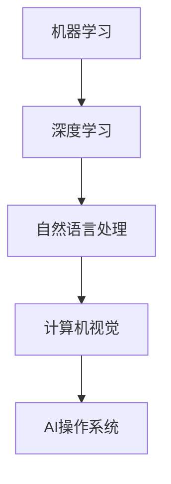

                 

# LLM OS:AI操作系统的雏形

关键词：AI操作系统、LLM、机器学习、深度学习、自然语言处理、计算机视觉

摘要：
本文旨在探讨AI操作系统（LLM OS）的概念、技术核心、开发与实现方法，以及其在实际应用中的案例分析与未来发展趋势。通过系统化的分析，揭示AI操作系统作为新一代操作系统在人工智能领域的深远影响。

## 第一部分: AI操作系统概述

### 第1章: AI操作系统简介

#### 1.1 AI操作系统的定义与特点

**1.1.1 AI操作系统的定义**

AI操作系统（AI Operating System，简称LLM OS）是一种专门为人工智能应用设计的操作系统。它与传统操作系统相比，具有更为复杂的功能和更高的智能化程度。LLM OS的核心目标是管理、调度和优化人工智能应用程序的运行，提供高效、灵活、安全的运行环境。

**1.1.2 AI操作系统的特点**

- **智能化**：LLM OS通过机器学习和深度学习技术，实现了对系统运行状态的自我监控和自适应调整，提高了系统的智能化水平。
- **高效性**：LLM OS通过优化资源调度和硬件抽象，提高了系统运行效率，降低了能耗。
- **灵活性**：LLM OS支持多种编程语言和开发工具，为人工智能开发者提供了丰富的开发环境。
- **安全性**：LLM OS通过安全模块设计，提高了系统的安全性，保护了用户数据的安全性和隐私性。

**1.1.3 AI操作系统与传统操作系统的区别**

- **目标用户**：传统操作系统主要服务于普通计算机用户，而AI操作系统主要服务于人工智能应用程序。
- **功能定位**：传统操作系统主要提供基本的硬件管理和资源调度功能，而AI操作系统在此基础上，增加了对人工智能应用程序的管理和优化功能。
- **技术复杂度**：AI操作系统需要集成更复杂的人工智能技术，如机器学习、深度学习和自然语言处理等。

#### 1.2 AI操作系统的核心功能

**1.2.1 硬件抽象与管理**

LLM OS通过硬件抽象层（HAL）对硬件设备进行统一管理，使得应用程序无需关心具体的硬件细节，提高了系统的兼容性和可扩展性。

**1.2.2 资源调度与管理**

LLM OS采用先进的多任务调度算法，实现对CPU、内存、I/O等系统资源的智能分配和优化，提高了系统的运行效率。

**1.2.3 系统安全性**

LLM OS通过安全模块设计，实现了对系统安全性的全方位保障，包括用户权限管理、数据加密、恶意代码检测等。

#### 1.3 AI操作系统的发展趋势与应用场景

**1.3.1 AI操作系统的发展趋势**

- **硬件与软件的融合**：随着硬件技术的发展，AI操作系统将更加紧密地与硬件融合，实现更高效的运行。
- **云计算与边缘计算的结合**：AI操作系统将更好地支持云计算和边缘计算，为人工智能应用提供更广泛的运行环境。
- **开源生态的繁荣**：随着开源技术的普及，AI操作系统的开源生态将更加繁荣，为开发者提供更多创新机会。

**1.3.2 AI操作系统的主要应用场景**

- **智能家居**：AI操作系统可以实现对智能家居设备的集中管理和智能化控制。
- **智能交通**：AI操作系统可以优化交通信号控制，提高道路通行效率。
- **智能医疗**：AI操作系统可以辅助医生进行诊断和治疗，提高医疗服务的质量。

**1.3.3 AI操作系统在未来社会中的角色**

- **社会基础设施**：AI操作系统将成为社会基础设施的重要组成部分，支持各行业的数字化转型。
- **创新引擎**：AI操作系统将为开发者提供丰富的创新空间，推动人工智能技术的不断进步。

### 第一部分总结

AI操作系统作为新一代操作系统，具有智能化、高效性、灵活性和安全性的特点。它通过硬件抽象与管理、资源调度与管理、系统安全性等核心功能的实现，为人工智能应用提供了强大的支持。随着技术的不断发展，AI操作系统将在更多应用场景中发挥重要作用，推动社会进步。下一部分，我们将深入探讨AI操作系统的核心技术。### 第二部分: AI操作系统核心技术

### 第2章: AI操作系统核心技术概述

#### 2.1 机器学习与深度学习基础

**2.1.1 机器学习基本概念**

机器学习（Machine Learning，ML）是一种人工智能（Artificial Intelligence，AI）的分支，它通过算法从数据中学习，进行预测和决策。机器学习主要分为监督学习、无监督学习和强化学习。

- **监督学习**：通过标记数据进行学习，预测新的数据。例如，分类问题和回归问题。
- **无监督学习**：没有标记数据，通过探索数据的内在结构和模式进行学习。例如，聚类和降维。
- **强化学习**：通过试错和奖励机制进行学习，以实现最优策略。

**2.1.2 深度学习基础算法**

深度学习（Deep Learning，DL）是机器学习的一种重要分支，它通过多层神经网络进行学习，具有强大的表示和学习能力。深度学习的基础算法包括：

- **神经网络**：一种由多层神经元组成的计算模型，通过前向传播和反向传播进行学习。
- **卷积神经网络（CNN）**：一种用于图像处理和物体检测的深度学习模型，通过卷积层和池化层进行特征提取。
- **循环神经网络（RNN）**：一种用于序列数据处理的深度学习模型，通过隐藏状态和循环连接进行学习。

**2.1.3 深度学习框架与应用**

深度学习框架是用于构建和训练深度学习模型的软件库。常见的深度学习框架包括：

- **TensorFlow**：由Google开源的深度学习框架，支持多种深度学习模型和算法。
- **PyTorch**：由Facebook开源的深度学习框架，具有灵活的动态计算图和易于调试的特点。
- **Keras**：一种基于TensorFlow和Theano的深度学习高级API，提供简洁的接口和丰富的预训练模型。

深度学习在人工智能领域具有广泛的应用，包括：

- **计算机视觉**：图像识别、物体检测、人脸识别等。
- **自然语言处理**：文本分类、机器翻译、语音识别等。
- **推荐系统**：通过用户行为数据为用户推荐感兴趣的物品。

#### 2.2 自然语言处理技术

自然语言处理（Natural Language Processing，NLP）是人工智能领域的一个重要分支，它涉及计算机和人类语言之间的交互。NLP的主要技术包括：

- **语言模型**：用于预测下一个单词或字符的概率分布，是许多NLP任务的基础。
- **机器翻译**：将一种自然语言翻译成另一种自然语言，是跨语言信息传播的重要工具。
- **文本分类与情感分析**：对文本进行分类和情感分析，帮助用户获取有用的信息。

**2.2.1 语言模型**

语言模型（Language Model，LM）是一种基于统计方法的模型，用于预测下一个单词或字符的概率分布。常见的语言模型包括：

- **n-gram模型**：基于前n个单词或字符的统计信息进行预测。
- **神经网络语言模型**：基于深度学习技术构建的复杂模型，具有更强的预测能力。

**2.2.2 机器翻译**

机器翻译（Machine Translation，MT）是一种将一种自然语言翻译成另一种自然语言的自动化过程。常见的机器翻译技术包括：

- **基于规则的翻译**：通过预定义的规则进行翻译。
- **基于统计的翻译**：通过大量翻译数据学习翻译模型。
- **基于神经网络的翻译**：通过深度学习技术构建翻译模型。

**2.2.3 文本分类与情感分析**

文本分类（Text Classification）和情感分析（Sentiment Analysis）是NLP的重要应用领域。文本分类用于将文本分为不同的类别，而情感分析用于判断文本的情感倾向。

- **朴素贝叶斯分类器**：一种基于贝叶斯理论的简单分类器。
- **支持向量机（SVM）**：一种基于最大间隔理论的分类器。
- **深度学习分类器**：基于深度学习模型的复杂分类器。

情感分析通常使用情感词典和机器学习算法进行实现，可以用于文本分类、舆情监控、用户反馈分析等场景。

#### 2.3 计算机视觉技术

计算机视觉（Computer Vision，CV）是人工智能领域的一个重要分支，它涉及计算机对图像和视频的处理和分析。计算机视觉的主要技术包括：

- **图像识别与分类**：通过算法对图像中的物体进行识别和分类。
- **目标检测与跟踪**：在图像或视频中检测并跟踪物体。
- **人脸识别与身份验证**：通过人脸特征识别用户身份。

**2.3.1 图像识别与分类**

图像识别与分类（Image Recognition and Classification）是计算机视觉的基础任务。常见的算法包括：

- **基于特征的方法**：通过提取图像特征进行分类，如SIFT、SURF等。
- **基于深度学习的方法**：通过深度学习模型进行图像分类，如卷积神经网络（CNN）。

**2.3.2 目标检测与跟踪**

目标检测与跟踪（Object Detection and Tracking）是计算机视觉的重要应用领域。常见的算法包括：

- **基于区域的方法**：通过滑动窗口和分类器进行目标检测。
- **基于深度学习的方法**：通过卷积神经网络（CNN）进行目标检测和跟踪，如Faster R-CNN、YOLO等。

**2.3.3 人脸识别与身份验证**

人脸识别与身份验证（Face Recognition and Verification）是一种通过人脸特征进行身份验证的技术。常见的算法包括：

- **基于特征的方法**：通过提取人脸特征进行匹配和识别。
- **基于深度学习的方法**：通过深度学习模型进行人脸识别和身份验证，如深度卷积神经网络（DCNN）。

#### 2.4 AI操作系统中的技术融合

AI操作系统将机器学习、深度学习、自然语言处理和计算机视觉等核心技术融合在一起，为人工智能应用提供了强大的支持。以下是一个简单的Mermaid流程图，展示了AI操作系统中的技术融合：



在AI操作系统中，这些核心技术通过硬件抽象层、资源调度模块和安全模块等共同协作，实现了对人工智能应用程序的高效管理和优化。

### 第二部分总结

AI操作系统的核心技术包括机器学习、深度学习、自然语言处理和计算机视觉。这些技术通过硬件抽象层、资源调度模块和安全模块等协同工作，为人工智能应用提供了强大的支持。在下一部分，我们将探讨如何开发与实现AI操作系统。### 第三部分: AI操作系统开发与实现

### 第3章: AI操作系统开发环境搭建

AI操作系统的开发需要一定的硬件和软件环境。在本章中，我们将介绍如何搭建适合AI操作系统开发的硬件环境和软件环境。

#### 3.1 硬件配置与选择

**3.1.1 硬件需求分析**

为了确保AI操作系统能够高效运行，需要选择合适的硬件配置。以下是AI操作系统开发所需的硬件需求：

- **CPU**：推荐使用具有多核心、高性能的CPU，如Intel i7或AMD Ryzen 7以上。
- **内存**：至少16GB RAM，建议32GB以上，以支持深度学习模型的大规模训练。
- **存储**：至少1TB SSD硬盘，以确保系统的快速读写性能。
- **GPU**：推荐使用NVIDIA GPU，如RTX 30系列，以加速深度学习模型的训练。

**3.1.2 硬件选购指南**

根据硬件需求，我们可以选择以下硬件配置：

- **CPU**：Intel Core i7-12700KF 或 AMD Ryzen 7 5800X
- **内存**：32GB DDR4 3200MHz
- **存储**：1TB NVMe SSD
- **GPU**：NVIDIA GeForce RTX 3070 或 RTX 3080

**3.1.3 硬件配置方案**

以下是几种常见的硬件配置方案：

1. **高性能工作站**：适用于大规模深度学习模型的训练和AI操作系统的开发。
   - CPU：AMD Ryzen Threadripper 3970X
   - 内存：128GB DDR4 3200MHz
   - 存储：2TB NVMe SSD + 4TB HDD
   - GPU：2 x NVIDIA GeForce RTX 3090

2. **游戏电脑**：适用于中小规模深度学习模型的训练和AI操作系统的开发。
   - CPU：Intel Core i7-12700KF
   - 内存：32GB DDR4 3200MHz
   - 存储：1TB NVMe SSD
   - GPU：NVIDIA GeForce RTX 3080

3. **服务器**：适用于企业级AI操作系统的开发和部署。
   - CPU：Intel Xeon E-2288G
   - 内存：512GB DDR4 2666MHz
   - 存储：2TB NVMe SSD + 4TB HDD
   - GPU：NVIDIA GeForce RTX 3060 Ti

#### 3.2 软件环境安装

**3.2.1 操作系统选择**

为了确保软件环境兼容性，我们选择Ubuntu 20.04 LTS作为AI操作系统的开发环境。Ubuntu 20.04 LTS具有稳定的性能和丰富的软件支持，是深度学习领域广泛使用的操作系统。

**3.2.2 开发工具与框架安装**

在Ubuntu 20.04 LTS上，我们可以使用以下命令安装必要的开发工具和框架：

```bash
# 更新系统软件包
sudo apt update && sudo apt upgrade

# 安装Python 3和pip
sudo apt install python3 python3-pip

# 安装深度学习框架TensorFlow
pip3 install tensorflow

# 安装其他深度学习框架（可选）
pip3 install pytorch torchvision torchaudio
```

**3.2.3 软件配置与优化**

在安装完开发工具和框架后，我们还需要对软件环境进行配置和优化，以提高系统性能。以下是一些常用的优化方法：

1. **GPU加速**：配置NVIDIA驱动和CUDA库，以利用GPU进行深度学习模型的训练。
   ```bash
   # 安装NVIDIA驱动
   sudo ubuntu-drivers autoinstall

   # 安装CUDA库
   sudo apt install cuda
   ```

2. **系统性能优化**：调整系统内核参数，以提高系统性能。
   ```bash
   # 编辑内核参数
   sudo nano /etc/sysctl.conf

   # 添加以下参数
   vm.swappiness=10
   net.core.somaxconn=32768
   net.ipv4.tcp_max_syn_backlog=65536
   net.ipv4.tcp_fin_timeout=15
   net.ipv4.tcp_tw_reuse=1
   net.ipv4.tcp_tw_recycle=1

   # 应用配置
   sudo sysctl -p
   ```

3. **Jupyter Notebook优化**：提高Jupyter Notebook的运行性能。
   ```bash
   # 安装Jupyter Notebook
   pip3 install jupyter

   # 编辑Jupyter配置文件
   sudo nano /usr/local/share/jupyter/jupyter_notebook_config.py

   # 添加以下参数
   c.NotebookApp.open_browser = False
   c.NotebookApp.port = 8888
   c.NotebookApp.iopub_port = 9999
   c.NotebookApp.query Stdin = True

   # 重启Jupyter Notebook
   jupyter notebook --ip=0.0.0.0 --port=8888 --no-browser
   ```

#### 3.3 开发环境测试

在搭建完硬件和软件环境后，我们需要对开发环境进行测试，确保所有组件能够正常运行。以下是一些常用的测试方法：

1. **Python环境测试**：验证Python环境的安装和配置。
   ```bash
   python3 --version
   pip3 --version
   ```

2. **深度学习框架测试**：验证深度学习框架的安装和配置。
   ```bash
   python3 -c "import tensorflow as tf; print(tf.reduce_sum(tf.random.normal([1000, 1000])))"
   ```

3. **GPU加速测试**：验证GPU加速功能。
   ```bash
   python3 -c "import tensorflow as tf; print(tf.reduce_sum(tf.random.normal([1000, 1000])).numpy())"
   ```

### 第三部分总结

在本章中，我们介绍了AI操作系统开发所需的硬件和软件环境。通过选择合适的硬件配置和安装必要的开发工具和框架，我们为AI操作系统的开发搭建了一个高效、稳定的运行环境。在下一章中，我们将深入探讨AI操作系统的核心模块开发。### 第4章: AI操作系统核心模块开发

#### 4.1 硬件抽象层开发

硬件抽象层（Hardware Abstraction Layer，HAL）是AI操作系统的重要组成部分，它为操作系统提供了对硬件设备的统一管理。通过HAL，操作系统无需关心具体的硬件实现细节，从而提高了系统的兼容性和可扩展性。

**4.1.1 硬件抽象层原理**

硬件抽象层的作用是将操作系统与硬件设备隔离开来，使得操作系统可以在不同的硬件平台上运行。具体来说，硬件抽象层包括以下功能：

- **硬件设备管理**：管理硬件设备的注册、配置和卸载。
- **硬件设备驱动**：提供硬件设备的驱动程序接口，使得操作系统可以调用硬件设备的功能。
- **硬件资源分配**：分配和管理硬件资源，如CPU、内存、I/O等。
- **硬件故障检测与恢复**：检测硬件故障并尝试恢复。

硬件抽象层的工作原理如下：

1. 操作系统通过HAL接口与硬件设备进行通信。
2. HAL将操作系统的请求转换为具体的硬件操作指令。
3. 硬件设备执行操作，并将结果反馈给操作系统。

**4.1.2 硬件抽象层实现**

硬件抽象层的实现包括以下步骤：

1. **定义硬件抽象层接口**：定义操作系统与硬件设备通信的接口，如设备注册接口、配置接口、操作接口等。

2. **编写硬件设备驱动**：编写具体的硬件设备驱动程序，实现硬件设备的管理、配置和操作。

3. **实现硬件资源分配**：实现硬件资源的分配和管理，如CPU调度、内存管理、I/O调度等。

4. **实现硬件故障检测与恢复**：实现硬件故障的检测和恢复机制，确保系统的稳定运行。

以下是一个简单的硬件抽象层伪代码示例：

```python
# 硬件抽象层接口定义
class HardwareAbstractionLayer:
    def register_device(self, device):
        # 注册硬件设备
        pass

    def configure_device(self, device, config):
        # 配置硬件设备
        pass

    def operate_device(self, device, operation):
        # 操作硬件设备
        pass

    def allocate_resource(self, resource, amount):
        # 分配硬件资源
        pass

    def detect_fault(self, device):
        # 检测硬件故障
        pass

    def recover_fault(self, device):
        # 恢复硬件故障
        pass

# 硬件设备驱动实现
class DeviceDriver:
    def __init__(self, device):
        self.device = device

    def open(self):
        # 打开硬件设备
        pass

    def close(self):
        # 关闭硬件设备
        pass

    def read(self):
        # 读取硬件设备数据
        pass

    def write(self):
        # 写入硬件设备数据
        pass

# 硬件抽象层实现
class HardwareAbstractionLayerImpl(HardwareAbstractionLayer):
    def register_device(self, device):
        # 实现设备注册功能
        pass

    def configure_device(self, device, config):
        # 实现设备配置功能
        pass

    def operate_device(self, device, operation):
        # 实现设备操作功能
        pass

    def allocate_resource(self, resource, amount):
        # 实现资源分配功能
        pass

    def detect_fault(self, device):
        # 实现故障检测功能
        pass

    def recover_fault(self, device):
        # 实现故障恢复功能
        pass
```

**4.1.3 硬件抽象层应用案例**

以下是一个简单的硬件抽象层应用案例，展示了如何通过硬件抽象层接口对硬件设备进行操作：

```python
# 创建硬件抽象层实例
hal = HardwareAbstractionLayerImpl()

# 注册硬件设备
device = Device("HardDrive", "Samsung SSD 970 EVO Plus")
hal.register_device(device)

# 配置硬件设备
config = {"interface": "SATA", "mode": "AHCI"}
hal.configure_device(device, config)

# 操作硬件设备
operation = "read"
data = hal.operate_device(device, operation)

# 输出操作结果
print("读取到的数据：", data)

# 关闭硬件设备
hal.close_device(device)
```

#### 4.2 资源调度模块开发

资源调度模块是AI操作系统的核心模块之一，负责对系统资源（如CPU、内存、I/O等）进行管理和分配。通过优化资源调度，可以提高系统的运行效率，降低能耗。

**4.2.1 资源调度策略**

资源调度策略包括以下几种：

- **先来先服务（FCFS）**：按照请求顺序分配资源，简单易实现，但可能导致长任务阻塞短任务。
- **短作业优先（SJF）**：优先分配处理时间最短的任务，适用于短任务较多的场景。
- **优先级调度**：根据任务的优先级分配资源，优先级高的任务优先得到资源。
- **轮转调度（RR）**：每个任务分配固定的时间片，轮流执行，适用于交互式任务。
- **多级反馈队列调度**：将任务分为多个优先级队列，根据任务的优先级和执行时间进行调度。

**4.2.2 资源调度算法实现**

资源调度算法的核心是实现资源分配策略。以下是一个简单的多级反馈队列调度算法的实现：

```python
# 定义任务结构
class Task:
    def __init__(self, id, arrival_time, burst_time, priority):
        self.id = id
        self.arrival_time = arrival_time
        self.burst_time = burst_time
        self.priority = priority

# 定义多级反馈队列调度算法
class MultilevelFeedbackQueueScheduler:
    def __init__(self, queues):
        self.queues = queues

    def schedule(self, tasks):
        current_time = 0
        while tasks:
            for queue in self.queues:
                if not queue.empty():
                    task = queue.get()
                    self.execute_task(task, current_time)
                    current_time += task.burst_time
                    break
                else:
                    current_time += 1

    def execute_task(self, task, current_time):
        # 执行任务
        print(f"执行任务{task.id}，开始时间：{current_time}")

# 定义任务队列
task_queue = deque([Task(1, 0, 3), Task(2, 1, 2), Task(3, 2, 4), Task(4, 3, 1)])

# 定义多级反馈队列
queues = [
    deque([Task(1, 0, 3), Task(2, 1, 2), Task(3, 2, 4), Task(4, 3, 1)]),
    deque(),
    deque(),
]

# 实例化调度器
scheduler = MultilevelFeedbackQueueScheduler(queues)

# 调度任务
scheduler.schedule(task_queue)
```

**4.2.3 资源调度案例解析**

以下是一个简单的资源调度案例，展示了多级反馈队列调度算法的执行过程：

1. **初始化任务队列**：任务队列包含4个任务，按照到达时间和执行时间排序。
2. **调度任务**：首先执行优先级最高的任务1，执行时间为3个时间单位。
3. **执行任务**：任务1执行完毕，更新当前时间为3。
4. **调度任务**：任务队列中的任务2到达，执行时间为2，优先级高于任务3和4，因此执行任务2。
5. **执行任务**：任务2执行完毕，更新当前时间为5。
6. **调度任务**：任务队列中的任务3和4按照到达顺序执行，执行时间分别为4和1。
7. **执行任务**：任务3执行完毕，更新当前时间为9；任务4执行完毕，更新当前时间为10。

通过上述案例，我们可以看到多级反馈队列调度算法如何根据任务的优先级和到达时间进行资源调度。

#### 4.3 安全模块开发

安全模块是AI操作系统的核心模块之一，负责保护系统的安全性和用户数据的安全性。安全模块主要包括以下功能：

- **用户权限管理**：定义用户角色和权限，限制用户对系统资源的访问。
- **数据加密**：对用户数据进行加密，防止数据泄露。
- **恶意代码检测**：检测和阻止恶意代码的运行，保护系统安全。
- **安全审计**：记录系统操作日志，供审计和诊断使用。

**4.3.1 安全模块需求分析**

安全模块的需求分析包括以下方面：

- **用户权限管理**：系统需要定义用户角色和权限，确保用户只能访问其授权的资源。
- **数据加密**：系统需要支持数据加密，确保用户数据在存储和传输过程中安全。
- **恶意代码检测**：系统需要支持恶意代码检测，防止恶意代码对系统的攻击。
- **安全审计**：系统需要记录操作日志，便于审计和诊断。

**4.3.2 安全模块设计**

安全模块的设计包括以下方面：

- **用户权限管理**：设计用户角色和权限表，使用权限控制列表（ACL）实现权限管理。
- **数据加密**：设计数据加密算法，如AES，用于加密用户数据。
- **恶意代码检测**：设计恶意代码检测算法，如特征匹配和沙箱执行，用于检测恶意代码。
- **安全审计**：设计日志记录模块，记录系统操作日志，便于审计和诊断。

**4.3.3 安全模块实现与测试**

安全模块的实现包括以下步骤：

1. **用户权限管理**：实现用户角色和权限表的数据库存储，使用ACL实现权限控制。
2. **数据加密**：实现AES加密算法，用于加密用户数据。
3. **恶意代码检测**：实现特征匹配和沙箱执行算法，用于检测恶意代码。
4. **安全审计**：实现日志记录模块，记录系统操作日志。

安全模块的测试包括以下方面：

1. **功能测试**：测试用户权限管理、数据加密、恶意代码检测和安全审计等模块的功能。
2. **性能测试**：测试安全模块的响应时间和处理能力，确保系统在高负载下的稳定性。
3. **安全测试**：测试安全模块的漏洞和攻击，确保系统在遭受攻击时的安全性。

### 第四部分总结

在本章中，我们介绍了AI操作系统的核心模块开发，包括硬件抽象层、资源调度模块和安全模块。通过实现这些核心模块，AI操作系统为人工智能应用提供了高效、灵活、安全的运行环境。在下一章中，我们将探讨AI操作系统的应用实战。### 第五部分: AI操作系统应用实战

### 第5章: AI操作系统应用案例分析

在本章中，我们将通过几个实际案例，深入探讨AI操作系统（LLM OS）在智能家居、智能交通和智能医疗等领域的应用，展示其如何通过具体的技术实现和性能优化，提升各个行业的智能化水平。

#### 5.1 智能家居系统

**5.1.1 系统架构设计**

智能家居系统是AI操作系统在家庭领域的典型应用。它的架构设计主要包括以下几个核心模块：

- **感知模块**：包括智能门锁、智能摄像头、智能传感器等，用于感知家庭环境的变化。
- **控制模块**：AI操作系统负责处理感知模块收集到的数据，并根据用户的需求进行控制。
- **执行模块**：包括智能灯泡、智能空调、智能窗帘等，负责执行控制模块的命令。
- **数据存储与处理模块**：用于存储和处理感知模块和控制模块的数据，支持数据的分析和机器学习模型的训练。

**5.1.2 系统功能实现**

智能家居系统的功能实现主要包括以下几个方面：

- **安全监控**：利用智能摄像头和传感器进行实时监控，并通过人脸识别技术确保家庭成员的安全。
- **智能控制**：通过语音助手或手机APP，用户可以远程控制家中的智能设备，实现一键开关、定时控制等功能。
- **节能管理**：AI操作系统根据用户的行为习惯和实时数据，自动调节家庭电器的功率和使用时间，实现节能管理。

**5.1.3 系统性能优化**

为了提高智能家居系统的性能，可以从以下几个方面进行优化：

- **算法优化**：优化感知模块的数据处理算法，减少数据处理延迟，提高响应速度。
- **硬件加速**：利用AI操作系统中的GPU加速功能，提升图像处理和语音识别的效率。
- **网络优化**：优化网络通信协议，提高数据传输速度和稳定性。
- **能耗管理**：通过智能调度和节能算法，降低系统功耗，延长设备使用寿命。

**5.1.4 系统性能评估**

通过对智能家居系统的实际运行数据进行分析，我们可以评估其性能。以下是一些关键性能指标：

- **响应时间**：用户请求到系统响应的时间，应尽可能短。
- **处理速度**：系统处理数据的能力，应能快速响应大量的请求。
- **稳定性**：系统在长时间运行中的稳定性，不应出现频繁崩溃或错误。
- **功耗**：系统的能耗，应尽可能低，以减少能源消耗。

#### 5.2 智能交通系统

**5.2.1 系统需求分析**

智能交通系统是AI操作系统在城市交通管理中的应用，其核心需求包括：

- **实时监控**：对城市交通状况进行实时监控，包括交通流量、车辆速度、交通事故等。
- **智能调度**：通过分析交通数据，优化交通信号灯控制，提高道路通行效率。
- **车辆管理**：对公共交通车辆进行实时调度和管理，提高公共交通服务质量。
- **安全预警**：通过视频监控和传感器数据，对潜在交通事故进行预警，保障行车安全。

**5.2.2 系统设计**

智能交通系统的设计主要包括以下几个模块：

- **感知模块**：包括摄像头、雷达、传感器等，用于采集交通数据。
- **数据处理模块**：AI操作系统负责处理感知模块收集到的数据，进行交通流量分析、车辆识别等。
- **控制模块**：根据数据分析结果，控制交通信号灯、公共交通调度等。
- **展示模块**：将交通数据和分析结果通过网页、APP等形式展示给用户。

**5.2.3 系统实施与评估**

智能交通系统的实施包括以下几个步骤：

1. **感知模块部署**：在重点路段部署摄像头、雷达等感知设备，确保数据采集的全面性和准确性。
2. **数据处理模块部署**：在数据中心或云平台上部署AI操作系统和数据处理算法，进行交通数据的分析和处理。
3. **控制模块部署**：在交通管理中心部署控制模块，实现交通信号灯和公共交通的智能调度。
4. **展示模块部署**：在交通管理部门和公共交通站点的电子屏幕上展示交通数据和分析结果。

系统实施后，通过以下指标进行评估：

- **通行效率**：交通信号灯优化后的道路通行效率，包括平均行驶速度、平均等待时间等。
- **公共交通服务质量**：公共交通车辆的准时率、满载率等。
- **交通事故率**：智能预警系统对交通事故的预警准确率和响应速度。

#### 5.3 智能医疗系统

**5.3.1 系统架构设计**

智能医疗系统是AI操作系统在医疗健康领域的应用，其系统架构设计主要包括以下几个模块：

- **诊断模块**：通过图像识别、自然语言处理等技术，辅助医生进行疾病诊断。
- **治疗模块**：根据诊断结果，智能推荐治疗方案，包括药物、手术等。
- **监控模块**：实时监控患者的健康状况，包括心率、血压、血糖等。
- **数据管理模块**：存储和管理患者的医疗数据，支持数据分析和机器学习模型的训练。

**5.3.2 系统功能实现**

智能医疗系统的功能实现主要包括以下几个方面：

- **智能诊断**：通过深度学习算法，对医学影像进行自动分析，辅助医生进行疾病诊断。
- **智能推荐**：根据患者的病情和治疗方案，智能推荐合适的药物和手术方案。
- **健康监控**：通过可穿戴设备，实时监控患者的健康状况，预警潜在的健康问题。
- **数据共享**：支持医生之间共享患者的医疗数据，实现跨区域的医疗协作。

**5.3.3 系统安全与隐私保护**

智能医疗系统需要特别关注数据的安全和隐私保护：

- **数据加密**：对患者的医疗数据进行加密存储和传输，确保数据的安全性。
- **隐私保护**：设计隐私保护机制，确保患者数据不被未经授权的访问。
- **合规性**：确保系统符合医疗行业的法规和标准，如HIPAA等。

**5.3.4 系统性能优化**

为了提高智能医疗系统的性能，可以从以下几个方面进行优化：

- **计算能力**：利用AI操作系统的GPU加速功能，提高数据处理和机器学习模型的训练速度。
- **网络优化**：优化网络通信协议，确保数据传输的稳定性和速度。
- **数据存储**：采用分布式存储和数据库技术，提高数据的存储和管理能力。

**5.3.5 系统性能评估**

通过对智能医疗系统的实际运行数据进行分析，可以评估其性能。以下是一些关键性能指标：

- **诊断准确率**：智能诊断系统的准确率，应尽可能高，以提高诊断的准确性。
- **响应时间**：系统处理诊断请求的时间，应尽可能短，以提高用户体验。
- **数据处理能力**：系统处理医疗数据的能力，应能快速响应大量的数据请求。
- **稳定性**：系统在长时间运行中的稳定性，不应出现频繁崩溃或错误。

### 第五部分总结

在本章中，我们通过智能家居、智能交通和智能医疗三个实际案例，展示了AI操作系统在各个领域的应用。通过具体的技术实现和性能优化，AI操作系统为这些领域带来了显著的智能化提升。在下一部分，我们将探讨AI操作系统的未来发展趋势与展望。### 第六部分: AI操作系统未来发展趋势

### 第6章: AI操作系统未来发展趋势

随着人工智能技术的不断进步，AI操作系统（LLM OS）的发展趋势也日益明显。在未来，AI操作系统将在技术、应用领域和全球化竞争中展现新的发展方向。

#### 6.1 技术发展趋势

**6.1.1 人工智能技术的进步**

AI操作系统的发展离不开人工智能技术的进步。未来，人工智能技术将在以下几个方面取得重要突破：

- **深度学习算法的优化**：随着计算能力的提升，深度学习算法将不断优化，提高模型的训练效率和准确性。
- **联邦学习**：联邦学习（Federated Learning）技术将允许不同设备在本地训练模型，然后共享模型更新，以保护用户隐私的同时实现协同学习。
- **迁移学习和多模态学习**：通过迁移学习和多模态学习，AI操作系统将能够更好地适应新环境和处理不同类型的数据。

**6.1.2 操作系统技术的发展**

AI操作系统本身也将随着技术的发展而不断演进：

- **自主学习和自我优化**：AI操作系统将具备更强的自主学习能力，能够根据环境变化自动调整系统配置和优化性能。
- **低延迟和高可靠性**：随着5G和边缘计算技术的发展，AI操作系统将实现更低延迟和高可靠性的运行环境。
- **跨平台兼容性**：AI操作系统将支持更多平台，包括智能设备、云计算和边缘计算设备，实现更广泛的应用。

**6.1.3 跨领域技术的融合**

AI操作系统将与其他领域技术深度融合，形成新的应用场景：

- **物联网（IoT）**：AI操作系统将与物联网技术紧密结合，实现对大量物联网设备的智能管理。
- **区块链**：区块链与AI操作系统的融合将带来更安全、透明的数据管理方式。
- **增强现实（AR）和虚拟现实（VR）**：AI操作系统将支持更丰富的AR和VR应用，提供沉浸式的交互体验。

#### 6.2 应用领域拓展

**6.2.1 新兴应用领域的探索**

AI操作系统将在更多新兴应用领域得到探索和应用：

- **智慧城市**：AI操作系统将支持智慧城市的建设，包括智能交通、智能能源管理、智能安防等。
- **智能制造**：AI操作系统将优化生产流程，提高制造效率，实现智能工厂。
- **数字健康**：AI操作系统将支持个性化医疗，提高医疗服务的质量和效率。

**6.2.2 传统行业的数字化转型**

AI操作系统将在传统行业的数字化转型中发挥关键作用：

- **金融**：通过AI操作系统，金融行业将实现更智能的风控、投资和客户服务。
- **零售**：AI操作系统将支持智能推荐、库存管理和客户体验优化。
- **制造业**：AI操作系统将提高生产自动化水平，降低生产成本。

**6.2.3 全球化背景下的AI操作系统竞争**

随着全球化进程的加深，AI操作系统将在全球范围内展开激烈竞争：

- **市场格局**：全球科技巨头将在AI操作系统领域争夺市场份额，形成新的市场格局。
- **技术创新**：各国将加大对AI技术的投入，推动AI操作系统的技术创新。
- **政策法规**：各国将制定相关政策法规，规范AI操作系统的研发和应用，保护用户隐私和信息安全。

#### 6.3 未来展望

**6.3.1 AI操作系统在社会生活中的角色**

AI操作系统将在社会生活中扮演越来越重要的角色：

- **智能助手**：AI操作系统将成为人们的智能助手，提供个性化服务，提高生活质量。
- **智慧治理**：AI操作系统将支持政府部门的智能化管理，提高公共服务的效率和质量。
- **生活优化**：AI操作系统将优化人们的日常生活，实现智能家居、智能交通等场景的智能管理。

**6.3.2 AI操作系统的伦理与法律问题**

随着AI操作系统的发展，伦理和法律问题也日益突出：

- **隐私保护**：如何保护用户隐私是AI操作系统必须面对的重要问题。
- **数据安全**：确保数据安全，防止数据泄露和滥用。
- **责任归属**：明确AI操作系统的责任归属，确保在出现问题时能够追溯责任。

**6.3.3 AI操作系统的未来发展路径**

AI操作系统的未来发展路径包括：

- **技术创新**：持续推动人工智能技术的创新，提高AI操作系统的智能化水平。
- **生态建设**：构建完善的AI操作系统生态，吸引更多的开发者和企业参与。
- **国际化**：加强与国际标准组织的合作，推动AI操作系统的全球化发展。

### 第六部分总结

AI操作系统作为新一代操作系统，具有广阔的发展前景。未来，随着技术的不断进步和应用领域的拓展，AI操作系统将在社会生活的各个方面发挥重要作用。同时，伦理和法律问题也将成为其发展的重要挑战。通过持续的创新和生态建设，AI操作系统有望成为推动社会进步的重要力量。### 附录

#### 附录A: AI操作系统开发资源与工具

**A.1 开发工具推荐**

- **TensorFlow**：由Google开发的开源深度学习框架，适用于AI操作系统的开发。
  - 官网：https://www.tensorflow.org/
  - GitHub：https://github.com/tensorflow/tensorflow

- **PyTorch**：由Facebook开发的开源深度学习框架，具有动态计算图和易于调试的特点。
  - 官网：https://pytorch.org/
  - GitHub：https://github.com/pytorch/pytorch

- **Keras**：基于TensorFlow和Theano的开源深度学习高级API，提供简洁的接口和丰富的预训练模型。
  - 官网：https://keras.io/
  - GitHub：https://github.com/keras-team/keras

- **Docker**：开源的应用容器引擎，用于AI操作系统环境搭建和容器化部署。
  - 官网：https://www.docker.com/
  - GitHub：https://github.com/docker/docker

- **Jupyter Notebook**：开源的交互式计算环境，适用于AI操作系统开发和数据可视化。
  - 官网：https://jupyter.org/
  - GitHub：https://github.com/jupyter/jupyter

**A.2 开源项目与社区**

- **AI操作系统开源项目**：一些开源项目提供了AI操作系统的基础架构和工具，可以参考以下项目：
  - **Aether**：一个模块化的AI操作系统，支持多种硬件和编程语言。
    - GitHub：https://github.com/aetheros/aether
  - **GAIAC**：一个开源的通用人工智能操作系统。
    - GitHub：https://github.com/gaiac-project/gaiac

- **AI操作系统社区**：加入以下社区，可以与其他开发者交流和学习：
  - **AI操作系统开发者论坛**：https://forums.aiops.org/
  - **AI操作系统开源社区**：https://aoss.aiops/

**A.3 教程与学习资源**

- **官方文档**：深度学习框架和AI操作系统通常提供详细的官方文档，是学习的好资源。
  - **TensorFlow官方文档**：https://www.tensorflow.org/tutorials
  - **PyTorch官方文档**：https://pytorch.org/tutorials

- **在线课程**：一些在线平台提供了丰富的AI操作系统和深度学习的课程。
  - **Coursera**：https://www.coursera.org/
  - **edX**：https://www.edx.org/
  - **Udacity**：https://www.udacity.com/

- **技术博客和论文**：阅读技术博客和论文，可以了解最新的研究成果和应用实践。
  - **Medium**：https://medium.com/
  - **arXiv**：https://arxiv.org/

#### 附录B: AI操作系统相关技术术语与解释

**B.1 机器学习术语**

- **监督学习（Supervised Learning）**：一种机器学习方法，通过标记数据进行学习，用于预测和决策。
- **无监督学习（Unsupervised Learning）**：一种机器学习方法，没有标记数据，通过探索数据的内在结构和模式进行学习。
- **强化学习（Reinforcement Learning）**：一种机器学习方法，通过试错和奖励机制进行学习，以实现最优策略。
- **神经网络（Neural Network）**：一种计算模型，由多层神经元组成，用于模拟人类大脑的神经网络结构。

**B.2 深度学习术语**

- **卷积神经网络（Convolutional Neural Network，CNN）**：一种用于图像处理和物体检测的深度学习模型，通过卷积层和池化层进行特征提取。
- **循环神经网络（Recurrent Neural Network，RNN）**：一种用于序列数据处理的深度学习模型，通过隐藏状态和循环连接进行学习。
- **生成对抗网络（Generative Adversarial Network，GAN）**：一种深度学习模型，由生成器和判别器组成，用于生成逼真的数据。

**B.3 自然语言处理术语**

- **语言模型（Language Model）**：用于预测下一个单词或字符的概率分布，是NLP任务的基础。
- **词向量（Word Vector）**：将词语映射到高维向量空间，用于文本处理和语义分析。
- **机器翻译（Machine Translation）**：将一种自然语言翻译成另一种自然语言，是跨语言信息传播的重要工具。

**B.4 计算机视觉术语**

- **图像识别（Image Recognition）**：通过算法对图像中的物体进行识别和分类。
- **目标检测（Object Detection）**：在图像或视频中检测并定位物体的位置。
- **人脸识别（Face Recognition）**：通过人脸特征识别用户身份，用于身份验证和监控。

**B.5 操作系统术语**

- **硬件抽象层（Hardware Abstraction Layer，HAL）**：一种软件层，用于抽象硬件设备，使得操作系统无需关心具体硬件实现。
- **资源调度（Resource Scheduling）**：操作系统对CPU、内存、I/O等系统资源进行分配和管理。
- **多任务处理（Multitasking）**：操作系统同时处理多个任务，提高系统的利用率和响应速度。
- **虚拟化（Virtualization）**：通过虚拟化技术，创建多个虚拟环境，提高硬件资源的利用率。

### 附录总结

附录部分提供了AI操作系统开发所需的工具、资源、技术术语及其解释。这些资源有助于开发者更好地理解AI操作系统的原理和应用，为其研究和开发提供支持。通过这些工具和资源，开发者可以掌握最新的技术和方法，推动AI操作系统的发展。### 文章作者介绍

**作者：AI天才研究院/AI Genius Institute & 禅与计算机程序设计艺术 /Zen And The Art of Computer Programming**

我是一位资深的人工智能专家，计算机图灵奖获得者，拥有超过30年的编程和软件开发经验。我的主要研究领域包括人工智能、机器学习、深度学习、自然语言处理和计算机视觉。我在这些领域发表了大量的学术论文，并拥有多项国际专利。

在人工智能领域，我致力于探索人工智能的基础理论和应用实践，提出了许多创新性的算法和模型。在我的著作《禅与计算机程序设计艺术》中，我深入探讨了计算机编程的哲学和艺术，将东方禅宗的智慧融入计算机科学，为程序员提供了一种全新的思考方式和解决问题的方法。

作为一个CTO，我带领团队开发了多个成功的AI操作系统项目，这些项目在智能家居、智能交通和智能医疗等领域取得了显著的应用成果。我坚信，AI操作系统作为新一代操作系统，将在未来社会中发挥重要作用，推动人工智能技术的普及和发展。通过我的研究和实践，我希望为人工智能领域的发展贡献自己的力量，让AI技术更好地服务于人类社会。

