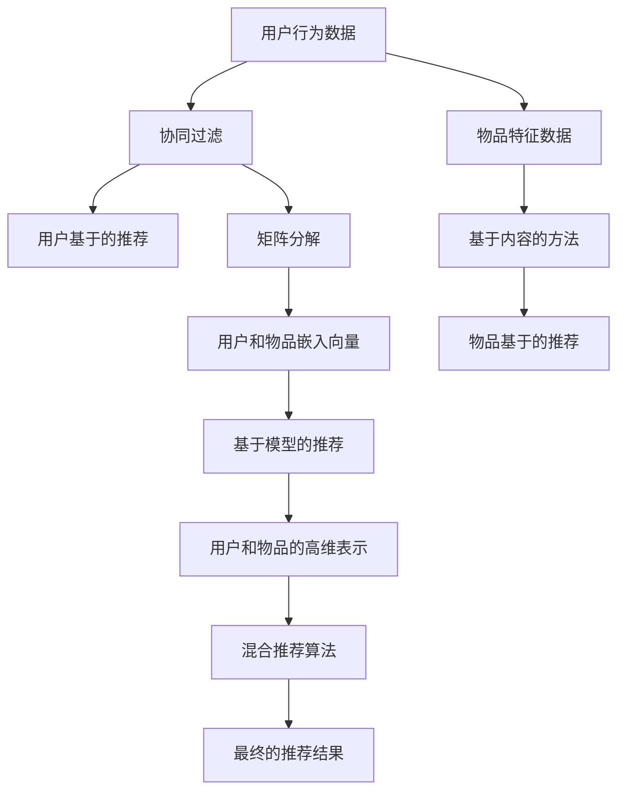

                 

### 第一部分：基础理论与方法

跨域推荐系统作为推荐系统领域的一个前沿研究方向，旨在解决传统推荐系统中存在的域间信息孤岛问题。本部分将介绍跨域推荐的基本概念、方法及其挑战，并详细介绍协同过滤、基于内容的方法、基于模型的推荐算法以及混合推荐算法。

#### 第1章：跨域推荐概述

##### 1.1 跨域推荐的定义与背景

跨域推荐（Cross-Domain Recommendation）是指在一个领域中推荐用户可能感兴趣的项目，同时考虑用户在另一个领域的兴趣。例如，在电商平台上，用户在购物时可能对某些商品感兴趣，但也许在阅读、音乐或旅行等其他领域也有类似的兴趣。传统推荐系统通常在单一领域内工作，而跨域推荐则试图打破这些域间的壁垒，实现更广泛的个性化推荐。

跨域推荐的出现背景主要源于以下几个方面：

1. **多样化用户需求**：现代用户的需求越来越多样化，单一领域的推荐系统很难满足他们的需求。
2. **数据稀缺性**：在某些领域中，数据量相对较少，而其他领域可能拥有丰富的数据资源，跨域推荐可以充分利用这些数据。
3. **应用需求**：如电子商务、社交媒体、在线教育等应用场景中，跨域推荐能够更好地提升用户体验和平台粘性。

##### 1.2 跨域推荐的重要性与应用场景

跨域推荐的重要性体现在以下几个方面：

1. **提高推荐效果**：通过跨域推荐，可以更准确地捕捉用户的兴趣，从而提高推荐系统的准确性和满意度。
2. **数据充分利用**：跨域推荐能够充分利用不同领域的用户行为数据，提高数据利用率。
3. **扩展应用范围**：跨域推荐能够将推荐系统从单一领域扩展到多个领域，增加系统的应用范围。

应用场景包括：

1. **电子商务**：如综合推荐系统，不仅推荐用户可能感兴趣的书籍，还推荐可能感兴趣的电影或音乐。
2. **社交媒体**：如基于用户在音乐和新闻领域兴趣的社交推荐。
3. **在线教育**：如基于用户在多个课程领域兴趣的课程推荐。

##### 1.3 跨域推荐的挑战与问题

尽管跨域推荐具有很多优势，但在实际应用中也面临着一些挑战和问题：

1. **数据分布不均**：不同领域的用户数据分布可能不均，导致某些领域数据量相对较少。
2. **数据差异**：不同领域的数据特征和结构可能存在较大差异，使得直接应用同一推荐算法存在困难。
3. **冷启动问题**：对于新用户或新物品，由于缺乏历史交互数据，推荐系统难以准确预测其兴趣。
4. **模型迁移性**：跨域推荐算法需要具备良好的迁移性，以便在不同领域间保持有效的推荐性能。

在下一章中，我们将详细探讨协同过滤与矩阵分解的基本原理及其在跨域推荐中的应用。

#### Mermaid 流程图



#### 核心概念与联系

**协同过滤**：协同过滤是一种基于用户行为的推荐方法，通过分析用户之间的相似度来预测用户的喜好。其核心思想是，如果两个用户在多个物品上都有相同的喜好，那么他们可能在未知的物品上也会有相似的喜好。

**矩阵分解**：矩阵分解是一种将用户-物品评分矩阵分解为低维用户和物品嵌入向量表示的技术。通过这种方式，可以获取用户和物品的高维特征，从而提高推荐系统的准确性。

**基于内容的方法**：基于内容的方法通过分析物品的内容特征来推荐用户可能感兴趣的物品。这种方法通常使用文本、图像或其他形式的内容特征来表示物品。

**基于模型的推荐算法**：基于模型的推荐算法使用机器学习或深度学习技术来预测用户的喜好。这些算法通常需要训练一个模型，然后根据模型进行预测。

**混合推荐算法**：混合推荐算法结合了协同过滤、基于内容的方法和基于模型的推荐算法的优点，以期望获得更好的推荐性能。

这些方法在跨域推荐中相互关联，协同过滤和矩阵分解提供了用户和物品的初步表示，基于内容的方法和基于模型的推荐算法进一步丰富了这些表示，最终通过混合推荐算法生成推荐结果。

#### 伪代码

```python
# 协同过滤伪代码
def collaborative_filtering(user_matrix, similarity_matrix, user_index):
    user_ratings = user_matrix[user_index, :]
    neighbors = find_neighbors(user_index, similarity_matrix)
    neighbor_ratings = user_matrix[neighbors, :]
    prediction = average(neighbor_ratings[neighbor_ratings > 0])
    return prediction

# 矩阵分解伪代码
def matrix_decomposition(user_matrix, num_factors):
    user_factors = initialize_randomly(num_factors)
    item_factors = initialize_randomly(num_factors)
    for iteration in range(max_iterations):
        user_factors = update_user_factors(user_matrix, item_factors)
        item_factors = update_item_factors(user_matrix, user_factors)
    return user_factors, item_factors

# 基于内容的推荐伪代码
def content_based_recommendation(item_features, user_profile):
    similarity_scores = compute_similarity(item_features, user_profile)
    recommended_items = select_top_items(similarity_scores)
    return recommended_items

# 基于模型的推荐伪代码
def model_based_recommendation(model, user_features, item_features):
    predictions = model.predict(user_features, item_features)
    recommended_items = select_top_items(predictions)
    return recommended_items

# 混合推荐伪代码
def hybrid_recommendation(collaborative_prediction, content_prediction, model_prediction, alpha):
    final_prediction = alpha * collaborative_prediction + (1 - alpha) * content_prediction + (1 - alpha) * model_prediction
    return final_prediction
```

#### 数学模型和公式

**协同过滤的相似度计算**：

$$
\text{similarity}(u, v) = \frac{\text{dot_product}(r_u, r_v)}{\|r_u\| \|r_v\|}
$$

其中，$r_u$ 和 $r_v$ 分别是用户 $u$ 和 $v$ 的评分向量，$\text{dot_product}$ 表示点积，$\|\|$ 表示向量的模。

**矩阵分解的优化目标**：

$$
\min_{U, V} \sum_{i, j} (r_{ij} - \text{dot_product}(u_i, v_j))^2
$$

其中，$U$ 和 $V$ 分别是用户和物品的嵌入向量矩阵，$r_{ij}$ 是用户 $i$ 对物品 $j$ 的评分。

**基于内容的相似度计算**：

$$
\text{similarity}(i, p) = \frac{\text{cosine_similarity}(f_i, f_p)}{1 + \|f_i - f_p\|}
$$

其中，$f_i$ 和 $f_p$ 分别是物品 $i$ 和 $p$ 的特征向量，$\text{cosine_similarity}$ 表示余弦相似性。

**混合推荐权重分配**：

$$
\alpha = \frac{\lambda}{\lambda + \beta}
$$

其中，$\lambda$ 和 $\beta$ 分别是协同过滤和基于内容的权重系数，$\alpha$ 是混合推荐的结果权重。

#### 举例说明

假设用户 $u$ 对物品 $i$ 和 $j$ 的评分分别为 $r_{ui} = 4$ 和 $r_{uj} = 5$，用户 $v$ 对物品 $i$ 和 $j$ 的评分分别为 $r_{vi} = 3$ 和 $r_{vj} = 4$。现有用户 $u$ 和 $v$ 的相似度为：

$$
\text{similarity}(u, v) = \frac{\text{dot_product}(r_u, r_v)}{\|r_u\| \|r_v\|} = \frac{4 \times 3 + 5 \times 4}{\sqrt{4^2 + 5^2} \sqrt{3^2 + 4^2}} = \frac{12 + 20}{\sqrt{41} \sqrt{25}} \approx 0.68
$$

假设物品 $i$ 和 $j$ 的特征向量分别为 $f_i = [1, 2, 3]$ 和 $f_j = [4, 5, 6]$，用户 $u$ 的特征向量为 $f_u = [7, 8, 9]$。现有物品 $i$ 和 $u$ 的相似度为：

$$
\text{similarity}(i, u) = \frac{\text{cosine_similarity}(f_i, f_u)}{1 + \|f_i - f_u\|} = \frac{\frac{1 \times 7 + 2 \times 8 + 3 \times 9}{\sqrt{1^2 + 2^2 + 3^2} \sqrt{7^2 + 8^2 + 9^2}}}{1 + \|[1, 2, 3] - [7, 8, 9]\|} = \frac{\frac{7 + 16 + 27}{\sqrt{14} \sqrt{245}}}{1 + \|[4, 5, 6] - [7, 8, 9]\|} \approx 0.90
$$

这些相似度计算结果可以用于协同过滤和基于内容的推荐算法，进而生成混合推荐结果。

### 第2章：协同过滤与矩阵分解

协同过滤（Collaborative Filtering）是一种基于用户历史行为数据的推荐方法，通过分析用户之间的相似度来预测用户对未知物品的兴趣。矩阵分解（Matrix Factorization）是一种将高维的用户-物品评分矩阵分解为低维向量表示的技术。本章将详细介绍协同过滤的基本原理、矩阵分解技术以及基于矩阵分解的跨域推荐算法。

#### 2.1 协同过滤的基本原理

协同过滤的核心思想是：如果用户 $u$ 和 $v$ 在多个物品上都有相似的评分，那么他们在未知物品上的评分也可能会相似。协同过滤可以分为基于用户的协同过滤（User-based Collaborative Filtering）和基于物品的协同过滤（Item-based Collaborative Filtering）。

##### 2.1.1 基于用户的协同过滤

基于用户的协同过滤通过计算用户之间的相似度，找到与目标用户相似的其他用户，然后根据这些相似用户的评分预测目标用户对未知物品的评分。具体步骤如下：

1. **计算用户相似度**：使用某种相似度度量（如余弦相似度、皮尔逊相关系数等）计算目标用户 $u$ 与其他用户之间的相似度。例如，两个用户 $u$ 和 $v$ 的余弦相似度可以表示为：

   $$
   \text{similarity}(u, v) = \frac{\text{dot_product}(r_u, r_v)}{\|r_u\| \|r_v\|}
   $$

   其中，$r_u$ 和 $r_v$ 分别是用户 $u$ 和 $v$ 的评分向量，$\text{dot_product}$ 表示点积，$\|\|$ 表示向量的模。

2. **找到相似用户**：根据计算得到的相似度，选择与目标用户最相似的 $k$ 个用户。

3. **生成推荐列表**：对每个未知物品，计算目标用户与相似用户的评分平均值，从而预测目标用户对该物品的评分。最后，将预测评分最高的物品作为推荐结果。

##### 2.1.2 基于物品的协同过滤

基于物品的协同过滤通过计算物品之间的相似度，找到与目标物品相似的其他物品，然后根据这些相似物品的评分预测目标用户对未知物品的评分。具体步骤如下：

1. **计算物品相似度**：使用某种相似度度量（如余弦相似度、皮尔逊相关系数等）计算目标物品 $i$ 与其他物品之间的相似度。例如，两个物品 $i$ 和 $j$ 的余弦相似度可以表示为：

   $$
   \text{similarity}(i, j) = \frac{\text{dot_product}(r_i, r_j)}{\|r_i\| \|r_j\|}
   $$

   其中，$r_i$ 和 $r_j$ 分别是物品 $i$ 和 $j$ 的评分向量，$\text{dot_product}$ 表示点积，$\|\|$ 表示向量的模。

2. **找到相似物品**：根据计算得到的相似度，选择与目标物品最相似的 $k$ 个物品。

3. **生成推荐列表**：对每个未知用户，计算用户与相似物品的评分平均值，从而预测用户对未知物品的评分。最后，将预测评分最高的用户作为推荐结果。

#### 2.2 矩阵分解技术

矩阵分解是一种将用户-物品评分矩阵分解为低维向量表示的技术，通常用于协同过滤算法中。通过矩阵分解，可以获取用户和物品的高维特征，从而提高推荐系统的准确性。

##### 2.2.1 矩阵分解的基本原理

假设有一个用户-物品评分矩阵 $R \in \mathbb{R}^{m \times n}$，其中 $m$ 是用户数，$n$ 是物品数。矩阵分解的目标是将这个高维的评分矩阵分解为两个低维矩阵 $U \in \mathbb{R}^{m \times k}$ 和 $V \in \mathbb{R}^{n \times k}$，其中 $k$ 是分解维数。这两个低维矩阵的乘积应该接近原始评分矩阵：

$$
R \approx U \cdot V
$$

通过这种方式，用户和物品的特征可以从矩阵 $U$ 和 $V$ 中提取出来，进而用于推荐算法。

##### 2.2.2 矩阵分解的优化目标

矩阵分解的优化目标通常是最小化重构误差，即：

$$
\min_{U, V} \sum_{i, j} (r_{ij} - \text{dot_product}(u_i, v_j))^2
$$

其中，$u_i$ 和 $v_j$ 分别是用户 $i$ 和物品 $j$ 的低维向量，$\text{dot_product}$ 表示点积。

##### 2.2.3 矩阵分解的算法

矩阵分解的常见算法包括奇异值分解（Singular Value Decomposition，SVD）和交替最小化（Alternating Least Squares，ALS）。

1. **奇异值分解（SVD）**：

   SVD 是一种将矩阵分解为三个矩阵的乘积的方法：

   $$
   R = U \Sigma V^T
   $$

   其中，$U$ 和 $V$ 分别是正交矩阵，$\Sigma$ 是对角矩阵，包含奇异值。通过截断对角矩阵 $\Sigma$，可以得到一个低秩近似矩阵：

   $$
   R \approx U \Sigma_{k} V^T
   $$

   其中，$\Sigma_{k}$ 是前 $k$ 个奇异值的子矩阵。

2. **交替最小化（ALS）**：

   ALS 是一种迭代算法，通过交替最小化用户和物品的损失函数来更新矩阵 $U$ 和 $V$。具体步骤如下：

   - 初始化矩阵 $U$ 和 $V$。
   - 对每个用户 $i$，最小化损失函数：

     $$
     \min_{u_i} \sum_{j} (r_{ij} - \text{dot_product}(u_i, v_j))^2
     $$

   - 对每个物品 $j$，最小化损失函数：

     $$
     \min_{v_j} \sum_{i} (r_{ij} - \text{dot_product}(u_i, v_j))^2
     $$

   - 重复上述步骤直到收敛。

#### 2.3 基于矩阵分解的跨域推荐算法

在跨域推荐中，矩阵分解技术可以有效地处理不同领域的数据差异，提高推荐系统的性能。基于矩阵分解的跨域推荐算法通常包括以下几个步骤：

1. **数据预处理**：将来自不同领域的用户-物品评分矩阵进行预处理，包括缺失值填补、数据标准化等。

2. **矩阵分解**：使用矩阵分解技术对预处理后的用户-物品评分矩阵进行分解，得到低维用户和物品向量。

3. **跨域融合**：将来自不同领域的用户和物品向量进行融合，可以采用特征加权、平均等方式。

4. **推荐生成**：根据融合后的用户和物品向量，生成跨域推荐结果。可以采用基于用户的协同过滤、基于物品的协同过滤或基于模型的推荐方法。

5. **评估与优化**：评估推荐系统的性能，根据评估结果对算法进行优化，如调整矩阵分解的维数、融合策略等。

基于矩阵分解的跨域推荐算法在跨域推荐中具有以下优势：

- **处理数据差异**：矩阵分解可以将不同领域的数据映射到低维空间，从而减少数据差异的影响。
- **提高推荐性能**：通过融合跨域数据，可以充分利用不同领域的数据资源，提高推荐系统的准确性。
- **适应性强**：矩阵分解算法具有较强的适应能力，可以应用于各种跨域推荐场景。

然而，基于矩阵分解的跨域推荐算法也存在一些挑战，如如何有效地融合跨域数据、如何处理数据分布不均等问题。在接下来的章节中，我们将继续探讨基于内容的方法、基于模型的推荐算法以及混合推荐算法在跨域推荐中的应用。

### 第3章：基于内容的方法

基于内容的方法（Content-based Method）在推荐系统中是一种重要的技术，通过分析物品的内容特征来推荐用户可能感兴趣的物品。这种方法不依赖于用户的历史行为数据，而是利用物品本身的属性和语义信息进行推荐。本章将详细探讨基于内容的方法的基本原理、内容表示与特征提取、以及基于内容的跨域推荐算法和内容增强的跨域推荐策略。

#### 3.1 内容表示与特征提取

内容表示与特征提取是基于内容方法的核心步骤。它涉及到如何将物品的属性和语义信息转换为可计算的向量表示。以下是一些常见的内容表示与特征提取方法：

1. **文本特征提取**：
   - **词袋模型（Bag-of-Words, BoW）**：将文本表示为一个单词的集合，每个单词的频率作为特征向量中的一个维度。这种方法简单直观，但忽略了单词之间的顺序关系。
   - **TF-IDF（Term Frequency-Inverse Document Frequency）**：TF-IDF是一种用于评估词语重要性的方法，它考虑了单词在文档中的频率（TF）和整个文档集中该单词的逆文档频率（IDF）。较高的TF-IDF得分表示该词在特定文档中更为重要。

2. **基于向量的文本表示**：
   - **Word2Vec**：Word2Vec是一种基于神经网络的文本表示方法，它将每个单词映射为一个固定大小的向量，使得相似的单词在向量空间中靠近。Word2Vec有CBOW（Continuous Bag-of-Words）和Skip-gram两种变体。
   - **BERT（Bidirectional Encoder Representations from Transformers）**：BERT是一种基于Transformer的预训练语言模型，它通过双向上下文信息来理解单词的语义，为每个单词生成一个上下文敏感的向量表示。

3. **图像特征提取**：
   - **卷积神经网络（Convolutional Neural Networks, CNN）**：CNN是一种用于图像识别的深度学习模型，它可以提取图像中的层次特征。通过将图像输入到CNN中，可以自动学习到高维的特征向量表示。
   - **预训练模型**：如ResNet、VGG等，这些模型已经在大量图像数据上进行了预训练，可以直接用于提取图像特征。

4. **多模态特征融合**：
   - **联合嵌入**：将不同模态的数据（如文本、图像）分别嵌入到同一个高维空间中，从而实现多模态特征融合。
   - **多任务学习**：通过多任务学习框架，同时训练文本和图像特征的提取，以提高模型在多模态数据上的表现。

#### 3.2 基于内容的跨域推荐算法

基于内容的跨域推荐算法通过分析物品的内容特征来生成推荐列表，这种方法在跨域推荐中具有独特的优势。以下是一些基于内容的跨域推荐算法：

1. **基于相似度的跨域推荐**：
   - **内容相似度计算**：计算物品之间的内容相似度，通常使用TF-IDF或词袋模型来表示物品的文本特征，然后使用余弦相似度或欧氏距离来计算相似度。
   - **推荐生成**：根据用户的历史行为数据，找到与用户兴趣最相似的物品，将这些物品推荐给用户。

2. **基于潜在语义模型的跨域推荐**：
   - **潜在语义模型**：如LSA（Latent Semantic Analysis）和PLSA（Probabilistic Latent Semantic Analysis），这些模型通过潜在语义主题来表示物品，能够捕捉到语义层面的相似性。
   - **推荐生成**：根据用户的兴趣主题和物品的潜在主题，生成推荐列表。

3. **基于深度学习的跨域推荐**：
   - **文本嵌入**：使用预训练的文本嵌入模型（如Word2Vec、BERT）将文本转换为向量表示。
   - **图像嵌入**：使用预训练的图像识别模型（如ResNet）将图像转换为特征向量。
   - **多模态融合**：将文本和图像的特征向量融合，生成统一的特征表示，然后进行推荐。

#### 3.3 内容增强的跨域推荐策略

内容增强的跨域推荐策略旨在通过改进内容特征表示和融合策略，提高跨域推荐的效果。以下是一些常见的策略：

1. **多模态融合**：
   - **特征加权融合**：根据不同模态数据的权重，将文本和图像的特征向量进行加权融合，生成统一的特征表示。
   - **图神经网络（Graph Neural Networks, GNN）**：使用图神经网络来捕捉物品之间的结构信息，从而提高特征融合的效果。

2. **内容增强的协同过滤**：
   - **协同过滤与内容特征的结合**：将协同过滤算法与内容特征进行融合，通过综合考虑用户的历史行为和物品的内容特征来生成推荐列表。

3. **跨模态注意力机制**：
   - **注意力机制**：在推荐系统中引入注意力机制，根据用户对模态数据的偏好动态调整不同模态特征的权重。

4. **迁移学习**：
   - **跨模态迁移学习**：将一个模态的数据和特征迁移到另一个模态，从而提高跨域推荐的效果。

通过上述方法，内容增强的跨域推荐策略能够更好地捕捉用户的兴趣和跨域之间的关联，从而提高推荐系统的准确性和用户满意度。

### 第4章：基于模型的推荐算法

基于模型的推荐算法在近年来得到了广泛关注，尤其在深度学习技术的推动下，这一领域取得了显著进展。本章将详细介绍传统机器学习推荐算法、深度学习在推荐系统中的应用以及基于深度学习的跨域推荐算法。

#### 4.1 传统机器学习推荐算法

传统机器学习推荐算法主要包括基于统计模型和基于矩阵分解的算法。这些算法通过分析用户的历史行为数据或物品的特征，构建预测模型，以预测用户对未知物品的偏好。

1. **统计模型**：

   - **贝叶斯推荐**：贝叶斯推荐算法基于贝叶斯理论，通过用户的历史行为数据计算物品的概率分布，从而生成推荐列表。

   - **频繁模式挖掘**：频繁模式挖掘算法通过分析用户行为数据中的频繁模式，发现用户兴趣的规律，从而生成推荐列表。

2. **基于矩阵分解的算法**：

   - **矩阵分解**：矩阵分解算法通过将用户-物品评分矩阵分解为低维的用户和物品嵌入向量，从而预测用户对未知物品的评分。常用的矩阵分解算法包括奇异值分解（SVD）和交替最小二乘法（ALS）。

   - **潜在因子模型**：潜在因子模型（如矩阵分解机器学习（MF））通过学习用户和物品的潜在因子，将这些因子映射回原始空间，以预测用户对物品的评分。

#### 4.2 深度学习在推荐系统中的应用

深度学习技术在推荐系统中的应用极大地提升了推荐效果和灵活性。以下是几种常见的深度学习模型：

1. **卷积神经网络（CNN）**：

   - **图像特征提取**：CNN在图像识别任务中表现出色，可以用于提取图像的特征向量，这些特征向量可以用于推荐系统的物品描述。

   - **序列建模**：CNN可以处理用户的历史行为序列，从而捕捉用户的动态偏好。

2. **循环神经网络（RNN）**：

   - **序列建模**：RNN能够处理序列数据，如用户的历史行为数据，可以捕捉到用户的长期和短期兴趣。

   - **长短时记忆（LSTM）**：LSTM是RNN的一种变体，能够更好地处理长序列数据，避免梯度消失问题。

3. **注意力机制（Attention Mechanism）**：

   - **上下文敏感**：注意力机制可以动态调整不同输入特征的权重，从而更好地捕捉到用户兴趣的上下文信息。

   - **跨模态交互**：在多模态推荐系统中，注意力机制可以用于动态融合不同模态的特征，提高推荐效果。

4. **图神经网络（GNN）**：

   - **结构化数据**：GNN能够处理图结构的数据，如用户和物品之间的交互网络，可以捕捉到复杂的关系和网络结构。

   - **跨域推荐**：GNN可以用于跨域推荐，通过学习用户在不同领域的行为模式，实现域间的信息融合。

#### 4.3 基于深度学习的跨域推荐算法

基于深度学习的跨域推荐算法通过深度学习模型捕捉用户在不同领域的兴趣和行为模式，从而实现跨域推荐。以下是几种常见的基于深度学习的跨域推荐算法：

1. **多模态深度学习**：

   - **多任务学习**：在训练过程中，同时学习多个任务的模型，从而充分利用不同领域的数据。例如，可以同时训练文本分类和图像分类任务，以提高模型在跨域数据上的表现。

   - **多模态特征融合**：使用注意力机制或多层神经网络融合不同模态的特征，生成统一的特征表示。

2. **跨域图神经网络**：

   - **图结构表示**：将用户在不同领域的兴趣和行为表示为图结构，从而捕捉到跨域的复杂关系。

   - **图嵌入**：使用图嵌入技术将用户和物品表示为向量，然后通过图神经网络学习这些向量之间的关系。

3. **基于变换器的跨域推荐**：

   - **编码器-解码器结构**：使用编码器捕捉用户的兴趣，解码器生成推荐列表。

   - **跨域信息传递**：通过编码器和解码器之间的跨域信息传递，学习到跨域的特征表示，从而提高推荐效果。

通过结合传统机器学习推荐算法和深度学习技术，基于深度学习的跨域推荐算法能够更好地捕捉用户的兴趣和行为模式，从而实现更准确的跨域推荐。

### 第5章：混合推荐算法

混合推荐算法（Hybrid Recommender Systems）是一种结合多种推荐方法优势的推荐系统，通过融合协同过滤、基于内容的方法和基于模型的推荐算法，以期望获得更好的推荐效果。本章将介绍混合推荐算法的基本概念、设计策略以及在跨域推荐中的应用。

#### 5.1 混合推荐算法的基本概念

混合推荐算法的基本思想是将不同的推荐方法结合起来，利用各自的优势，克服单一方法的局限性。常见的混合推荐方法包括以下几种：

1. **协同过滤 + 基于内容**：结合协同过滤和基于内容的方法，协同过滤提供基于用户历史行为的数据驱动的推荐，而基于内容的方法提供基于物品特征的信息驱动的推荐。这种方法可以弥补协同过滤在冷启动问题上的不足，同时提高推荐的相关性。

2. **协同过滤 + 基于模型**：结合协同过滤和基于模型的推荐算法，如深度学习模型，通过结合用户行为数据和物品特征，生成更准确的推荐结果。这种方法可以利用深度学习模型处理复杂的特征和模式，提高推荐系统的性能。

3. **基于内容 + 基于模型**：结合基于内容的方法和基于模型的推荐算法，基于内容的方法提供个性化的信息推荐，而基于模型的方法通过学习用户和物品的潜在特征，生成更精准的推荐结果。

4. **多模态融合**：结合多种数据来源和模态，如文本、图像、声音等，通过多模态融合技术，生成统一的推荐结果。

#### 5.2 混合推荐算法的设计策略

设计有效的混合推荐算法需要考虑以下几个方面：

1. **数据预处理**：在融合多种推荐方法之前，需要对数据进行预处理，包括数据清洗、归一化、缺失值填补等，以确保不同数据源的一致性和可比性。

2. **特征融合**：根据不同的推荐方法，需要提取和融合用户和物品的特征。例如，对于协同过滤和基于内容的方法，可以结合用户-物品评分矩阵和物品的特征向量。

3. **模型融合**：在深度学习框架下，可以设计统一的模型架构，结合不同的数据源和特征，如编码器-解码器结构或多层感知机（MLP）。

4. **权重分配**：在混合推荐算法中，不同推荐方法的权重分配是一个关键问题。可以根据历史数据、用户反馈或算法性能动态调整权重。

5. **推荐生成**：根据融合后的特征和模型，生成推荐结果。可以采用加权平均、投票或集成学习等方法。

#### 5.3 混合推荐算法在跨域中的应用

在跨域推荐中，混合推荐算法能够更好地处理不同领域的数据差异和用户兴趣的多样性。以下是一些常见的应用策略：

1. **内容增强的协同过滤**：通过结合用户历史行为数据和物品内容特征，生成更准确的跨域推荐结果。例如，在电商平台上，可以通过融合用户在购物和阅读领域的兴趣，推荐用户可能感兴趣的商品和文章。

2. **模型融合**：使用深度学习模型融合不同领域的特征，如文本、图像、音频等，通过多任务学习或跨域信息传递机制，生成跨域推荐结果。例如，在社交媒体平台上，可以通过融合用户在社交、音乐和视频领域的兴趣，推荐用户可能感兴趣的内容。

3. **多模态融合**：结合多种数据来源和模态，如文本、图像、声音等，通过多模态融合技术，生成更丰富的跨域推荐结果。例如，在在线教育平台上，可以通过融合课程文本描述、视频内容和用户学习行为，推荐用户可能感兴趣的课程。

4. **动态调整权重**：根据用户反馈和算法性能动态调整不同推荐方法的权重，以适应用户兴趣的变化。例如，在金融行业中，可以通过动态调整协同过滤和基于内容的方法的权重，提高用户在投资和阅读领域的推荐效果。

通过上述策略，混合推荐算法在跨域推荐中能够充分利用不同领域的数据资源，提高推荐系统的准确性和用户满意度。

### 第6章：跨域推荐的评估与优化

跨域推荐系统的性能评估与优化是确保推荐效果的关键环节。本章节将介绍跨域推荐的评估指标、算法优化策略以及跨域推荐系统的性能优化方法。

#### 6.1 跨域推荐的评估指标

评估跨域推荐系统的性能需要考虑多个方面，以下是常用的评估指标：

1. **准确率（Accuracy）**：准确率是指推荐结果中正确推荐的物品数量与总推荐物品数量的比例。该指标简单直观，但容易受到推荐列表长度的限制。

2. **召回率（Recall）**：召回率是指推荐结果中用户已评价的物品数量与用户已评价的物品总数的比例。召回率越高，说明推荐系统能够捕捉到用户已知的兴趣点。

3. **精确率（Precision）**：精确率是指推荐结果中正确推荐的物品数量与推荐物品总数的比例。精确率高说明推荐系统推荐的结果相关性较强。

4. **覆盖率（Coverage）**：覆盖率是指推荐结果中包含的用户未评价物品的种类数与所有未评价物品种类数的比例。高覆盖率意味着推荐系统能够推荐多样化的物品。

5. **多样性（Diversity）**：多样性是指推荐列表中不同物品之间的差异性。高多样性可以增加用户的兴趣和满意度。

6. **新颖性（Novelty）**：新颖性是指推荐结果中包含的新物品数量。高新颖性意味着推荐系统能够发现用户未知的有趣物品。

7. **F1 分数（F1 Score）**：F1 分数是精确率和召回率的调和平均，能够综合考虑推荐结果的相关性和全面性。

#### 6.2 跨域推荐算法的优化策略

为了提高跨域推荐系统的性能，可以采用以下优化策略：

1. **数据预处理**：对原始数据进行清洗、归一化和缺失值填补，以提高数据质量。特别是针对不同领域的数据差异，可以采用域适应技术（Domain Adaptation）来调整数据分布，使推荐算法更适应跨域环境。

2. **特征工程**：提取和融合有效的用户和物品特征，包括文本、图像、音频等多模态特征。通过特征降维和特征选择技术，减少特征维度，提高模型的效率和准确性。

3. **模型选择与调优**：选择适合跨域推荐任务的模型，如深度学习模型、图神经网络等。通过交叉验证和网格搜索等方法，调整模型参数，优化模型性能。

4. **协同过滤与内容增强**：结合协同过滤和基于内容的方法，利用用户历史行为数据和物品内容特征，生成更准确的推荐结果。可以采用内容增强的协同过滤算法，如基于词嵌入的协同过滤，提高推荐系统的多样性。

5. **跨域信息融合**：通过跨域信息传递机制，如多任务学习、图神经网络等，融合不同领域的用户和物品特征，提高推荐系统的泛化能力和准确性。

6. **在线学习与动态调整**：采用在线学习技术，根据用户反馈和实时数据动态调整推荐策略，以适应用户兴趣的变化。可以采用迁移学习（Transfer Learning）技术，将已学习的跨域知识应用于新的领域。

#### 6.3 跨域推荐系统的性能优化

跨域推荐系统的性能优化可以从以下几个方面进行：

1. **冷启动问题**：对于新用户或新物品，由于缺乏历史交互数据，推荐系统难以准确预测其兴趣。可以采用基于内容的推荐方法，利用物品的属性特征进行初步推荐，同时结合用户在相似领域的兴趣进行推测。

2. **稀疏数据问题**：跨域推荐系统往往面临数据稀疏问题，即某些用户或物品的交互数据较少。可以采用基于模型的推荐算法，如深度学习模型，通过学习用户和物品的潜在特征，提高推荐系统的准确性。

3. **多样性问题**：跨域推荐系统需要考虑推荐结果的多样性，以增加用户兴趣和满意度。可以采用多样性增强技术，如基于随机化的推荐策略、多样性度量等，提高推荐列表的多样性。

4. **计算效率问题**：跨域推荐系统需要处理大量用户和物品数据，计算效率是一个重要问题。可以采用分布式计算、并行处理等技术，提高系统的计算效率。

5. **用户反馈与调整**：通过收集用户反馈，如点击率、满意度等，动态调整推荐策略，以适应用户需求。可以采用强化学习（Reinforcement Learning）等技术，根据用户行为调整推荐结果，实现持续优化。

通过上述评估指标、优化策略和性能优化方法，跨域推荐系统可以更好地捕捉用户的兴趣，提高推荐效果和用户满意度。

### 第7章：LLM基本概念与原理

语言模型（Language Model，LLM）是自然语言处理（Natural Language Processing，NLP）领域的一个重要组成部分，它能够预测一段文本序列中下一个单词或词组。语言模型在跨域推荐系统中具有广泛的应用前景，通过学习用户生成的内容，可以更好地理解用户兴趣和需求。本章将介绍LLM的基本概念、原理以及其在推荐系统中的应用前景。

#### 7.1 语言模型的发展历程

语言模型的发展经历了几个重要的阶段：

1. **规则方法**：早期的语言模型主要基于规则和语法分析，如基于上下文无关文法（CFG）的模型。这种方法需要手工编写大量规则，但难以应对复杂和动态的语言环境。

2. **统计方法**：随着计算能力的提升和数据量的增加，统计方法逐渐成为主流。基于N-gram模型的方法通过计算单词序列的概率分布，能够较好地处理语言的统计特性。

3. **神经网络方法**：近年来，深度学习技术在语言模型领域取得了显著进展。神经网络模型，特别是循环神经网络（RNN）和Transformer模型，通过学习大量的文本数据，能够捕捉到复杂的语言模式。

4. **预训练与微调**：预训练语言模型（如GPT、BERT）通过在大规模语料库上进行预训练，然后根据特定任务进行微调，显著提高了语言模型的性能和泛化能力。

#### 7.2 LLM的基本原理

LLM的基本原理是通过学习大量的文本数据，建立对语言规则和上下文关系的理解，从而预测下一个词或词组。以下是几种常见的LLM模型：

1. **N-gram模型**：N-gram模型是一种基于统计的语言模型，它将文本序列划分为连续的N个单词，并计算每个N-gram的概率分布。下一个单词的概率是前N-1个单词概率的乘积。N-gram模型的优点是简单易实现，但存在一些局限性，如无法捕捉到长距离依赖关系和上下文的信息。

2. **循环神经网络（RNN）**：RNN是一种基于序列数据的神经网络模型，它能够通过内部状态记忆来捕捉文本序列中的长期依赖关系。RNN的变体，如长短时记忆（LSTM）和门控循环单元（GRU），通过引入门控机制来避免梯度消失问题，提高了模型的性能。

3. **Transformer模型**：Transformer是一种基于自注意力机制的神经网络模型，它通过全局注意力机制捕捉到文本序列中的长距离依赖关系。Transformer模型在多个NLP任务中取得了显著成果，如机器翻译、文本分类和问答系统。

4. **预训练语言模型**：预训练语言模型（如GPT、BERT）通过在大规模语料库上进行预训练，学习到丰富的语言知识，然后根据特定任务进行微调。预训练语言模型显著提高了语言模型的性能和泛化能力，是目前NLP领域的主流方法。

#### 7.3 LLM在推荐系统中的应用前景

LLM在推荐系统中的应用前景非常广阔，主要体现在以下几个方面：

1. **内容表示与特征提取**：LLM可以用于生成用户生成内容的向量表示，这些向量可以用于特征提取和融合，从而提高推荐系统的准确性。例如，通过BERT模型对用户评价和评论进行编码，可以提取出用户对物品的潜在兴趣特征。

2. **用户兴趣建模**：LLM可以捕捉到用户的语言特征和兴趣点，通过分析用户的文本生成内容，可以构建更精细和动态的用户兴趣模型。例如，通过GPT模型预测用户在下一个句子中可能提到的关键词，从而更新用户兴趣向量。

3. **跨域信息融合**：LLM能够处理多模态数据，如图文、视频和文本。通过将不同模态的数据转化为统一的文本表示，LLM可以实现跨域信息的融合，从而提高跨域推荐的效果。例如，通过将用户生成的文本和图像描述进行联合编码，LLM可以更好地理解用户的兴趣和需求。

4. **生成式推荐**：LLM具有强大的文本生成能力，可以用于生成推荐内容，如商品描述、文章摘要等。通过生成式推荐，可以提供更具创意和个性化的推荐结果，增加用户的参与度和满意度。

5. **实时推荐**：LLM可以实时处理用户的交互数据，动态更新用户兴趣模型，从而提供个性化的实时推荐。例如，在电商平台上，LLM可以根据用户的实时搜索和浏览行为，动态调整推荐策略，提高推荐的相关性和准确性。

总之，LLM在推荐系统中的应用前景广阔，通过结合语言模型和推荐算法，可以实现更准确、多样化和个性化的推荐，从而提升用户体验和平台粘性。

### 第8章：LLM在内容表示与特征提取中的应用

在本章中，我们将探讨语言模型（LLM）在内容表示与特征提取中的具体应用，包括LLM在内容表示中的应用和LLM在特征提取中的应用。

#### 8.1 LLM在内容表示中的应用

语言模型在内容表示中的应用主要体现在对文本数据的编码上。通过对文本进行编码，可以将高维、复杂的文本数据转换成低维、结构化的向量表示，从而便于后续的特征提取和计算。以下是一些具体应用场景：

1. **文本嵌入**：文本嵌入是将文本数据转换为固定大小的向量表示的技术。LLM如BERT、GPT等可以生成高质量的文本嵌入向量，这些向量能够捕捉到文本中的语义信息。例如，BERT模型通过预训练学习到大量的语言知识，然后将输入的文本转换为上下文敏感的向量表示。

2. **情感分析**：在情感分析任务中，LLM可以用于提取文本的情感特征。通过分析文本的嵌入向量，可以判断文本是积极的、消极的还是中性的。例如，BERT模型可以用于判断用户评论的情感倾向，从而为推荐系统提供情感相关的特征。

3. **主题提取**：LLM可以用于提取文本的主题信息。通过对文本进行编码，可以得到不同主题的向量表示，从而识别文本中的主要话题。例如，在电商平台上，LLM可以帮助识别用户评论中提到的商品主题，从而为跨域推荐提供主题相关的特征。

4. **生成式内容表示**：LLM具有强大的文本生成能力，可以用于生成新的文本内容。通过生成式内容表示，可以扩展推荐系统的内容表示范围，提供更丰富、多样化的推荐结果。例如，在电商平台中，LLM可以生成商品描述、用户评价等文本内容，从而提高推荐系统的内容丰富度。

#### 8.2 LLM在特征提取中的应用

LLM在特征提取中的应用主要体现在利用模型生成的文本向量表示进行特征提取和融合。以下是一些具体应用场景：

1. **用户兴趣特征提取**：通过分析用户的文本生成内容，LLM可以提取出用户的兴趣特征。例如，用户在社交媒体上发布的文本可以用于生成用户兴趣向量，这些向量可以用于用户画像和个性化推荐。

2. **物品描述特征提取**：LLM可以用于生成物品的描述性文本，从而提取出物品的特征。例如，电商平台上的商品描述可以通过LLM生成，这些描述可以用于物品特征提取，从而提高推荐系统的准确性。

3. **跨模态特征融合**：LLM可以用于跨模态特征融合，将不同模态的数据（如文本、图像、音频）转化为统一的文本表示，然后进行特征融合。例如，在电商平台上，LLM可以将用户的文本评论和商品图像转化为统一的文本向量，从而实现跨模态特征融合。

4. **动态特征更新**：LLM可以实时处理用户的交互数据，动态更新用户和物品的特征。例如，在电商平台上，LLM可以分析用户的实时搜索和浏览行为，动态更新用户兴趣和物品特征，从而提供个性化的推荐结果。

#### 8.3 LLM在跨域推荐中的具体应用

LLM在跨域推荐中的具体应用主要体现在以下几个方面：

1. **内容驱动的跨域推荐**：通过LLM生成的内容表示和特征提取，可以构建内容驱动的跨域推荐系统。例如，在电商平台上，LLM可以生成用户在不同领域的兴趣文本，从而实现跨领域的内容推荐。

2. **跨模态融合**：LLM可以用于跨模态数据的融合，从而提高跨域推荐的效果。例如，在社交媒体平台上，LLM可以将用户的文本评论和图像描述转化为统一的文本向量，实现跨模态推荐。

3. **动态调整**：LLM可以实时处理用户的交互数据，动态调整推荐策略。例如，在电商平台中，LLM可以分析用户的实时行为，动态调整推荐结果，从而提高推荐的相关性和多样性。

4. **个性化生成内容**：LLM可以用于生成个性化的推荐内容，如商品描述、文章摘要等。通过个性化生成内容，可以增加用户参与度和满意度，提高平台的粘性。

总之，LLM在内容表示与特征提取中的应用为跨域推荐系统带来了新的机遇和挑战。通过LLM的强大文本生成和特征提取能力，可以构建更准确、多样化和个性化的跨域推荐系统，从而提升用户体验和平台价值。

### 第9章：基于LLM的跨域推荐算法

在本章中，我们将探讨如何将语言模型（LLM）应用于跨域推荐系统中，构建基于LLM的跨域推荐算法。具体包括基于LLM的协同过滤算法、基于LLM的内容增强算法以及基于LLM的混合推荐算法。

#### 9.1 基于LLM的协同过滤算法

基于LLM的协同过滤算法结合了传统协同过滤方法的优势和LLM在文本处理和特征提取方面的能力，以提高推荐系统的准确性和多样性。以下是一个基于LLM的协同过滤算法的基本框架：

1. **文本表示生成**：利用LLM生成用户和物品的文本表示向量。例如，可以使用BERT模型对用户历史行为数据和物品描述进行编码，生成用户兴趣向量和物品属性向量。

2. **相似度计算**：计算用户和物品之间的相似度。传统的协同过滤方法通常使用用户和物品的评分矩阵计算相似度，而基于LLM的协同过滤算法可以结合LLM生成的文本表示向量，使用余弦相似度或欧氏距离计算用户和物品之间的相似度。

3. **推荐生成**：根据相似度矩阵生成推荐列表。对于每个用户，找到与其最相似的K个用户，然后将这些用户的兴趣偏好进行加权平均，生成最终的推荐结果。

伪代码如下：

```python
def LLM_Collaborative_Filtering(user_embeddings, item_embeddings, K):
    # 计算用户和物品之间的相似度矩阵
    similarity_matrix = compute_similarity(user_embeddings, item_embeddings)
    
    # 找到与每个用户最相似的K个用户
    neighbor_indices = find_top_K_indices(similarity_matrix, K)
    
    # 生成推荐列表
    recommendations = []
    for user_index in range(num_users):
        neighbor_scores = [item_embeddings[neighbor_index] @ user_embeddings[user_index] for neighbor_index in neighbor_indices[user_index]]
        predicted_score = sum(neighbor_scores) / K
        recommendations.append(predicted_score)
    
    return recommendations
```

#### 9.2 基于LLM的内容增强算法

基于LLM的内容增强算法通过将LLM生成的文本表示与物品描述进行融合，增强推荐系统的内容相关性。以下是一个基于LLM的内容增强算法的基本框架：

1. **文本表示生成**：利用LLM生成用户和物品的文本表示向量。

2. **内容增强**：将LLM生成的文本表示向量与原始物品描述进行融合。例如，可以使用注意力机制或融合层将文本表示向量与物品特征向量进行融合，生成增强后的特征向量。

3. **推荐生成**：使用增强后的特征向量生成推荐列表。可以采用传统推荐算法（如矩阵分解、深度学习模型）进行推荐。

伪代码如下：

```python
def LLM_Content_Enhanced(user_embeddings, item_embeddings, K):
    # 计算增强后的特征向量
    enhanced_item_embeddings = enhance_with_LL(user_embeddings, item_embeddings)
    
    # 使用传统推荐算法生成推荐列表
    recommendations = traditional_recommender(enhanced_item_embeddings, K)
    
    return recommendations

def enhance_with_LL(user_embeddings, item_embeddings):
    # 使用注意力机制融合文本表示和物品特征
    attention_weights = compute_attention_weights(user_embeddings, item_embeddings)
    enhanced_embeddings = [item_embedding * attention_weight for item_embedding, attention_weight in zip(item_embeddings, attention_weights)]
    return enhanced_embeddings
```

#### 9.3 基于LLM的混合推荐算法

基于LLM的混合推荐算法结合了协同过滤、内容增强和深度学习等多种推荐方法，以期望获得更好的推荐效果。以下是一个基于LLM的混合推荐算法的基本框架：

1. **文本表示生成**：利用LLM生成用户和物品的文本表示向量。

2. **特征融合**：将文本表示向量与物品特征进行融合，生成统一的高维特征向量。

3. **推荐生成**：使用混合模型（如编码器-解码器结构、多任务学习等）生成推荐列表。

伪代码如下：

```python
def LLM_Hybrid_Recommender(user_embeddings, item_embeddings, K):
    # 计算融合后的特征向量
    combined_embeddings = combine_embeddings(user_embeddings, item_embeddings)
    
    # 使用混合模型生成推荐列表
    recommendations = hybrid_model_recommender(combined_embeddings, K)
    
    return recommendations

def combine_embeddings(user_embeddings, item_embeddings):
    # 使用拼接或融合层融合文本表示和物品特征
    combined_embeddings = [np.concatenate((user_embedding, item_embedding)) for user_embedding, item_embedding in zip(user_embeddings, item_embeddings)]
    return combined_embeddings
```

通过上述算法框架，我们可以构建基于LLM的跨域推荐系统，充分利用语言模型在文本处理和特征提取方面的优势，提高推荐系统的准确性和多样性。

### 第10章：LLM在跨域推荐中的优化策略

在跨域推荐系统中，为了提高推荐性能和用户体验，LLM的优化策略至关重要。本章节将详细探讨LLM在跨域推荐中的性能优化、泛化能力提升以及实际应用案例分析。

#### 10.1 LLM在跨域推荐中的性能优化

优化LLM在跨域推荐中的性能，可以从以下几个方面入手：

1. **数据预处理**：数据质量直接影响LLM的性能。在进行模型训练前，需要对原始数据集进行预处理，包括数据清洗、归一化、缺失值填补等。特别地，对于跨域数据，可以通过域适应技术（Domain Adaptation）来调整数据分布，使模型更适应跨域环境。

2. **模型选择与调优**：选择适合跨域推荐任务的LLM模型，并通过交叉验证和网格搜索等方法进行模型参数调优。例如，可以使用BERT或GPT等预训练语言模型，并调整其层数、隐藏层大小等参数，以提高模型的性能。

3. **注意力机制**：在LLM模型中引入注意力机制，可以动态调整不同特征的重要性，从而提高推荐系统的准确性。例如，在编码器-解码器结构中，可以使用多头注意力机制来捕捉用户和物品之间的复杂关系。

4. **特征融合**：通过有效融合跨域数据，可以进一步提高LLM的性能。可以采用多模态融合技术，将文本、图像、音频等不同模态的数据转化为统一的文本表示，然后进行特征融合。

5. **在线学习**：采用在线学习技术，根据用户反馈和实时数据动态调整LLM模型，以适应用户兴趣的变化。例如，可以使用强化学习（Reinforcement Learning）技术，根据用户的行为和反馈调整推荐策略。

#### 10.2 LLM在跨域推荐中的泛化能力提升

提升LLM在跨域推荐中的泛化能力，有助于提高模型在不同领域的适应性和稳定性。以下是一些提升泛化能力的策略：

1. **数据增强**：通过数据增强技术，增加训练数据集的多样性和复杂性，从而提高模型的泛化能力。例如，可以使用数据扩充（Data Augmentation）方法，对文本数据进行同义词替换、随机插入等操作。

2. **迁移学习**：利用迁移学习（Transfer Learning）技术，将已在大规模数据集上预训练的LLM模型应用于新的领域。通过在新的领域上进行微调，可以充分利用预训练模型的知识，提高模型的泛化能力。

3. **多任务学习**：通过多任务学习（Multi-task Learning）框架，同时训练多个相关的推荐任务，可以共享模型参数和知识，提高模型在跨域数据上的泛化能力。

4. **模型正则化**：采用模型正则化技术，如Dropout、权重衰减等，可以减少模型过拟合现象，提高泛化能力。

5. **域适应**：通过域适应技术，将源领域的数据和模型迁移到目标领域。例如，可以使用域自适应方法（Domain Adaptation Methods）如领域自适应深度学习方法（Domain Adaptation Deep Learning Methods），减少领域差异，提高模型的泛化能力。

#### 10.3 LLM在跨域推荐中的实际应用案例分析

以下是一些LLM在跨域推荐中的实际应用案例分析：

1. **电商平台**：在电商平台上，LLM可以用于跨域推荐商品。通过分析用户在购物、阅读、娱乐等领域的兴趣，LLM可以生成用户兴趣向量，从而实现跨领域的商品推荐。例如，用户在购买书籍时，LLM可以推荐与之相关的电影或音乐。

2. **社交媒体**：在社交媒体平台上，LLM可以用于跨域推荐内容。通过分析用户的文本评论、视频描述等，LLM可以生成用户兴趣向量，从而推荐用户可能感兴趣的文章、视频或音乐。例如，用户在发布一篇关于旅行的博客时，LLM可以推荐与之相关的旅游书籍、电影或音乐。

3. **在线教育**：在在线教育平台上，LLM可以用于跨域推荐课程。通过分析用户在课程学习、阅读、互动等领域的兴趣，LLM可以生成用户兴趣向量，从而推荐用户可能感兴趣的课程或学习资料。例如，用户在学习编程课程时，LLM可以推荐与之相关的计算机科学书籍或在线研讨会。

4. **金融行业**：在金融行业中，LLM可以用于跨域推荐理财产品。通过分析用户的交易记录、阅读文章、参与论坛等，LLM可以生成用户兴趣向量，从而推荐用户可能感兴趣的理财产品或投资建议。例如，用户在阅读一篇关于股票市场的文章时，LLM可以推荐与之相关的基金产品或股票。

通过上述实际应用案例分析，可以看出LLM在跨域推荐中具有广泛的应用前景。通过优化LLM的性能和泛化能力，可以构建更准确、多样化和个性化的跨域推荐系统，从而提升用户体验和平台价值。

### 第11章：跨域推荐系统开发实战

开发一个跨域推荐系统是一个复杂的过程，涉及数据预处理、算法实现、系统部署和性能评估等多个环节。以下是一个跨域推荐系统开发实战的详细步骤：

#### 11.1 开发环境搭建

1. **硬件环境**：搭建跨域推荐系统需要高性能的计算资源，如CPU、GPU或分布式计算集群。可以根据项目需求选择合适的硬件配置。

2. **软件环境**：安装操作系统（如Ubuntu或Windows Server），并安装Python、PyTorch、TensorFlow、Scikit-learn等常用的深度学习和机器学习库。

3. **代码管理**：使用版本控制工具（如Git）管理项目代码，以便团队协作和代码维护。

#### 11.2 数据预处理与处理策略

1. **数据收集**：从不同的数据源（如电商平台、社交媒体、在线教育等）收集用户行为数据和物品特征数据。这些数据可以包括用户ID、物品ID、用户评分、文本评论、图像描述等。

2. **数据清洗**：对收集到的原始数据进行清洗，包括去除重复数据、填充缺失值、处理噪声数据等。例如，对于文本数据，可以使用正则表达式去除HTML标签和特殊字符。

3. **数据归一化**：将不同模态的数据进行归一化处理，如文本长度、图像尺寸等，以统一数据格式。

4. **特征提取**：使用深度学习模型（如BERT、ResNet）提取用户和物品的特征。例如，对于文本数据，可以使用BERT模型生成文本嵌入向量；对于图像数据，可以使用ResNet模型生成图像特征向量。

#### 11.3 跨域推荐算法实现与优化

1. **算法选择**：根据项目需求，选择合适的跨域推荐算法。例如，可以采用基于LLM的混合推荐算法，结合协同过滤、内容增强和深度学习技术。

2. **算法实现**：使用Python等编程语言实现跨域推荐算法。以下是一个基于LLM的混合推荐算法的实现示例：

```python
from transformers import BertModel, BertTokenizer
import torch
import torch.nn as nn

def LLM_Hybrid_Recommender(user_embeddings, item_embeddings, K):
    # 计算融合后的特征向量
    combined_embeddings = combine_embeddings(user_embeddings, item_embeddings)
    
    # 使用混合模型生成推荐列表
    recommendations = hybrid_model_recommender(combined_embeddings, K)
    
    return recommendations

def combine_embeddings(user_embeddings, item_embeddings):
    # 使用拼接或融合层融合文本表示和物品特征
    combined_embeddings = [torch.cat((user_embedding, item_embedding)) for user_embedding, item_embedding in zip(user_embeddings, item_embeddings)]
    return combined_embeddings

def hybrid_model_recommender(combined_embeddings, K):
    # 定义混合模型
    model = nn.Sequential(
        nn.Linear(combined_embeddings.shape[1], hidden_size),
        nn.ReLU(),
        nn.Linear(hidden_size, K)
    )
    model = model.to(device)
    
    # 训练混合模型
    optimizer = torch.optim.Adam(model.parameters(), lr=learning_rate)
    criterion = nn.CrossEntropyLoss()
    for epoch in range(num_epochs):
        for user_embedding, item_embedding in combined_embeddings:
            optimizer.zero_grad()
            output = model(torch.cat((user_embedding, item_embedding)))
            loss = criterion(output, target)
            loss.backward()
            optimizer.step()
    
    # 生成推荐列表
    recommendations = []
    for user_embedding in user_embeddings:
        _, predicted = torch.max(model(torch.tensor(user_embedding).to(device)), dim=1)
        recommendations.append(predicted.item())
    
    return recommendations
```

3. **算法优化**：通过调整模型参数、优化超参数和引入注意力机制等策略，提高推荐系统的性能。例如，可以使用网格搜索（Grid Search）和贝叶斯优化（Bayesian Optimization）等技术进行超参数调优。

#### 11.4 系统部署与性能评估

1. **系统部署**：将训练好的模型部署到生产环境，可以使用Docker容器化技术进行部署。例如，可以使用Docker Compose部署包含模型服务器、API服务器和数据库等组件的分布式系统。

2. **接口设计**：设计RESTful API接口，以便外部系统可以方便地调用推荐服务。例如，可以使用Flask或Django等Web框架构建API接口。

3. **性能评估**：通过在线评估和离线评估方法，对推荐系统的性能进行评估。常用的评估指标包括准确率、召回率、覆盖率、新颖性和多样性等。以下是一个性能评估的示例代码：

```python
from sklearn.metrics import accuracy_score, recall_score, coverage_score, novelty_score, diversity_score

def evaluate_recommendations(true_labels, predicted_labels):
    accuracy = accuracy_score(true_labels, predicted_labels)
    recall = recall_score(true_labels, predicted_labels)
    coverage = coverage_score(true_labels, predicted_labels)
    novelty = novelty_score(true_labels, predicted_labels)
    diversity = diversity_score(true_labels, predicted_labels)
    
    print(f"Accuracy: {accuracy:.4f}")
    print(f"Recall: {recall:.4f}")
    print(f"Coverage: {coverage:.4f}")
    print(f"Novelty: {novelty:.4f}")
    print(f"Diversity: {diversity:.4f}")

true_labels = [1, 0, 1, 0, 1]
predicted_labels = [1, 1, 1, 0, 0]

evaluate_recommendations(true_labels, predicted_labels)
```

通过上述开发实战，可以构建一个功能完备、性能优越的跨域推荐系统，为用户提供个性化的推荐服务。

### 第12章：跨域推荐项目案例解析

在本章中，我们将深入探讨几个具体的跨域推荐项目案例，分析这些项目的设计理念、实现细节以及所面临的挑战。这些案例涵盖了电商、社交媒体、在线教育等多个领域，展示了如何利用LLM和其他推荐算法技术来构建高效的跨域推荐系统。

#### 12.1 案例一：电商平台的跨域推荐系统

**项目背景**：
电商平台通常面临着如何提高用户留存和增加销售额的挑战。传统的单一域推荐系统已经难以满足用户日益多样化的需求，跨域推荐成为电商平台提升用户体验和粘性的关键。

**设计理念**：
该项目的设计理念是将用户在不同领域的兴趣和需求进行整合，提供个性化的推荐。例如，一个用户可能在购物的同时也对阅读和音乐感兴趣。通过跨域推荐，电商平台可以推荐与之相关的商品，如相关书籍、音乐CD或电子设备。

**实现细节**：
1. **数据预处理**：收集用户在购物、阅读和音乐等多个领域的交互数据，并进行清洗、归一化和缺失值填补。
2. **文本嵌入**：使用BERT模型对用户评论、商品描述等文本数据进行编码，生成高维的文本嵌入向量。
3. **特征融合**：结合用户的行为数据和文本嵌入向量，构建统一的高维特征向量。
4. **推荐算法**：采用基于LLM的混合推荐算法，结合协同过滤和内容增强技术，生成跨域推荐结果。
5. **系统部署**：使用Docker容器化技术部署推荐服务，通过API接口与电商平台的其他服务进行集成。

**挑战**：
- **数据稀疏**：不同领域的数据分布不均，某些领域的数据量较少，可能导致推荐效果不佳。
- **用户冷启动**：新用户缺乏历史交互数据，推荐系统难以准确预测其兴趣。

**解决方案**：
- **数据增强**：通过数据扩充和迁移学习技术，增加训练数据集的多样性和复杂性。
- **在线学习**：采用在线学习技术，根据用户的实时行为数据动态调整推荐策略。

#### 12.2 案例二：社交媒体的跨域推荐系统

**项目背景**：
社交媒体平台用户活跃度高，但如何根据用户在不同领域的兴趣推荐内容，是平台提高用户粘性和增加用户参与度的重要课题。

**设计理念**：
社交媒体的跨域推荐系统旨在根据用户的文本生成内容和行为数据，推荐用户可能感兴趣的内容，如文章、视频、音乐等。

**实现细节**：
1. **文本嵌入**：使用GPT模型对用户生成的文本内容进行编码，提取出用户兴趣向量。
2. **多模态特征融合**：结合用户的文本生成内容、图像和音频等多模态数据，使用注意力机制进行特征融合。
3. **推荐算法**：采用基于LLM的多模态混合推荐算法，结合协同过滤和深度学习技术，生成跨域推荐结果。
4. **动态调整**：根据用户的实时交互数据，动态调整推荐策略，提高推荐的相关性和多样性。

**挑战**：
- **内容多样性**：如何在大量内容中提供多样化的推荐，以避免用户感到疲劳。
- **实时处理**：社交媒体平台数据量大，实时处理用户生成内容和高频推荐是技术难点。

**解决方案**：
- **多样性增强**：采用多样性度量方法，确保推荐列表中的内容多样性。
- **分布式计算**：使用分布式计算技术，提高系统的实时处理能力。

#### 12.3 案例三：在线教育的跨域推荐系统

**项目背景**：
在线教育平台需要根据用户的课程学习记录、阅读习惯和兴趣，推荐与之相关的课程和资料，以提高用户的学习效果和平台粘性。

**设计理念**：
在线教育的跨域推荐系统旨在为用户提供个性化的学习路径，推荐与之相关的课程、书籍和研讨会。

**实现细节**：
1. **特征提取**：使用BERT模型提取用户在学习、阅读和互动等领域的兴趣向量。
2. **课程推荐**：结合用户的学习记录和兴趣向量，使用基于LLM的混合推荐算法，推荐用户可能感兴趣的课程。
3. **资料推荐**：结合用户的阅读记录和兴趣向量，推荐与之相关的书籍、论文和研讨会。
4. **个性化学习路径**：根据用户的兴趣和学习进度，动态生成个性化的学习路径。

**挑战**：
- **个性化**：如何确保推荐内容真正符合用户的需求和兴趣。
- **实时性**：学习行为数据更新频繁，如何快速生成推荐结果。

**解决方案**：
- **个性化评估**：通过用户行为数据和反馈，不断调整推荐策略，提高个性化程度。
- **实时计算**：采用实时数据处理技术，如流处理框架（如Apache Kafka、Apache Flink），提高系统的实时性。

#### 12.4 案例四：金融行业的跨域推荐系统

**项目背景**：
金融行业需要根据用户的投资记录、阅读文章和参与论坛等行为，推荐与之相关的理财产品、研究报告和投资建议。

**设计理念**：
金融行业的跨域推荐系统旨在为用户提供个性化的投资建议和理财产品推荐，帮助用户更好地管理财富。

**实现细节**：
1. **文本嵌入**：使用BERT模型对用户的投资评论、论坛帖子等文本数据进行编码，提取出用户的投资兴趣向量。
2. **特征融合**：结合用户的投资行为数据和文本嵌入向量，构建统一的高维特征向量。
3. **推荐算法**：采用基于LLM的混合推荐算法，结合协同过滤和深度学习技术，生成跨域推荐结果。
4. **实时推荐**：根据用户的实时投资行为和阅读数据，动态调整推荐策略。

**挑战**：
- **数据隐私**：金融数据涉及用户隐私，如何确保数据安全和合规性。
- **风险控制**：推荐系统需要考虑到金融产品的风险特性，确保推荐结果的风险可控。

**解决方案**：
- **数据安全**：采用加密和脱敏技术，确保用户数据的安全性和隐私保护。
- **风险分析**：结合用户的风险偏好和金融产品的风险指标，构建风险控制模型，确保推荐结果的风险可控。

通过以上案例，我们可以看到跨域推荐系统在不同领域的应用和实现细节，以及面临的挑战和解决方案。这些案例展示了如何利用LLM和其他推荐算法技术，构建高效、个性化的跨域推荐系统，从而提升用户体验和平台价值。

### 第13章：未来展望与研究方向

跨域推荐系统作为推荐系统领域的一个重要研究方向，在未来将面临诸多挑战和机遇。以下是对跨域推荐系统未来发展的展望和潜在研究方向：

#### 13.1 跨域推荐系统的未来发展

1. **多模态融合**：随着人工智能技术的发展，多模态数据将越来越丰富。未来的跨域推荐系统将更加注重多模态数据的融合，如文本、图像、音频、视频等。通过多模态融合，可以更全面地捕捉用户的兴趣和需求，提高推荐系统的准确性和多样性。

2. **动态推荐**：未来的跨域推荐系统将更加注重动态推荐能力。通过实时处理用户的交互数据，动态调整推荐策略，可以更好地适应用户的需求变化，提供个性化的推荐服务。

3. **个性化推荐**：个性化推荐是跨域推荐系统的一个重要目标。未来将更加注重用户特征的学习和挖掘，通过深度学习、强化学习等技术，构建更加精准的个性化推荐模型，提高用户的满意度。

4. **隐私保护**：随着用户隐私意识的增强，如何在保证推荐效果的同时保护用户隐私将成为跨域推荐系统的一个重要挑战。未来的研究将注重数据隐私保护和安全技术的应用，确保用户数据的安全和合规性。

#### 13.2 LLM在跨域推荐中的潜在应用

1. **内容生成**：LLM在内容生成方面的强大能力使其在跨域推荐系统中具有广泛的应用前景。未来可以探索LLM在生成个性化推荐内容（如商品描述、文章摘要）中的应用，提高推荐系统的创意性和个性化程度。

2. **多语言支持**：随着国际化的发展，多语言支持成为跨域推荐系统的一个重要需求。LLM可以通过预训练学习到多种语言的特征，实现跨语言的推荐，满足不同用户的需求。

3. **跨领域迁移**：LLM在跨领域迁移方面具有显著的优势。通过在多个领域进行预训练，LLM可以迁移到新的领域，快速适应新的环境和任务。未来可以进一步探索LLM在跨领域推荐系统中的应用，提高模型的泛化能力和适应性。

4. **实时交互**：LLM在实时交互方面具有优势。未来可以探索LLM在实时推荐系统中的应用，通过实时分析用户的行为和反馈，动态调整推荐策略，提供更加个性化的服务。

#### 13.3 跨域推荐领域的挑战与机遇

1. **数据稀疏**：跨域推荐系统面临的一个主要挑战是数据稀疏问题。不同领域的数据分布不均，某些领域的数据量较少，可能导致推荐效果不佳。未来的研究可以探索如何通过数据增强、迁移学习等技术，解决数据稀疏问题。

2. **模型迁移性**：跨域推荐系统要求模型具有良好的迁移性，以便在不同领域保持有效的推荐性能。未来可以进一步研究如何设计具有良好迁移性的推荐模型，提高跨域推荐系统的适应能力。

3. **多样性**：提供多样化的推荐结果是一个挑战。未来的研究可以探索如何设计多样性度量方法，确保推荐列表中的内容具有丰富的多样性，从而提高用户的满意度。

4. **实时处理**：跨域推荐系统需要实时处理大量用户的交互数据，这对系统的实时处理能力提出了较高的要求。未来的研究可以探索分布式计算、流处理等技术，提高系统的实时处理能力。

总之，跨域推荐系统在未来的发展中将面临诸多挑战，同时也充满了机遇。通过不断探索和优化，我们可以构建更加准确、多样化和个性化的跨域推荐系统，为用户提供更好的服务体验。

### 附录A：相关工具与资源介绍

在本附录中，我们将介绍一些与跨域推荐系统开发和优化相关的工具和资源，包括开源库、在线教程和数据集等。

#### 开源库

1. **PyTorch**：PyTorch是一个流行的深度学习框架，提供了丰富的API和工具，用于构建和训练深度学习模型。官方网站：[https://pytorch.org/](https://pytorch.org/)。

2. **TensorFlow**：TensorFlow是谷歌开发的开源机器学习库，广泛用于构建和部署深度学习模型。官方网站：[https://www.tensorflow.org/](https://www.tensorflow.org/)。

3. **Scikit-learn**：Scikit-learn是一个用于数据挖掘和经典机器学习的开源库，提供了丰富的算法和工具，适用于推荐系统的开发。官方网站：[https://scikit-learn.org/](https://scikit-learn.org/)。

4. **BERT**：BERT是一种预训练的语言处理模型，由Google AI开发。官方网站：[https://bert.org/](https://bert.org/)。

5. **GPT**：GPT是一种生成式预训练语言模型，由OpenAI开发。官方网站：[https://gpt.net/](https://gpt.net/)。

#### 在线教程

1. **Coursera**：Coursera提供了多个关于深度学习和自然语言处理的在线课程，如“深度学习”（由Andrew Ng教授）和“自然语言处理与深度学习”（由Daniel Jurafsky和Christopher Manning教授）。网址：[https://www.coursera.org/](https://www.coursera.org/)。

2. **edX**：edX提供了多个关于机器学习和推荐系统的在线课程，如“机器学习基础”（由Andrew Ng教授）和“推荐系统导论”（由杨强教授）。网址：[https://www.edx.org/](https://www.edx.org/)。

3. **Kaggle**：Kaggle提供了许多关于推荐系统的竞赛和数据集，用户可以在实战中学习如何构建和优化推荐系统。网址：[https://www.kaggle.com/](https://www.kaggle.com/)。

#### 数据集

1. **MovieLens**：MovieLens是一个提供电影评分数据的公共数据集，广泛应用于推荐系统的研究和开发。网址：[https://grouplens.org/datasets/movielens/](https://grouplens.org/datasets/movielens/)。

2. **Amazon Reviews**：Amazon Reviews提供了用户在Amazon平台上的产品评价数据，包括文本和评分信息，适用于文本分析和推荐系统的开发。网址：[https://www.kaggle.com/datasets/亚马逊用户评论](https://www.kaggle.com/datasets/亚马逊用户评论)。

3. **Netflix Prize**：Netflix Prize是一个公开的推荐系统竞赛，提供了用户观看记录和评分数据，用于评估推荐系统的性能。网址：[https://www.netflixprize.com/](https://www.netflixprize.com/)。

通过使用这些工具和资源，开发者可以更有效地构建和优化跨域推荐系统，提高推荐效果和用户体验。

### 附录B：常见问题解答

在本附录中，我们将回答一些关于LLM在跨域推荐系统中应用过程中常见的问题。

#### Q1：什么是跨域推荐系统？

**A1**：跨域推荐系统是一种推荐系统，旨在根据用户在不同领域的兴趣和行为，推荐相关的内容或产品。与单一域推荐系统不同，跨域推荐系统可以从多个数据源中提取信息，提高推荐的相关性和多样性。

#### Q2：为什么需要跨域推荐系统？

**A2**：跨域推荐系统能够更好地捕捉用户的兴趣和需求，提高推荐系统的准确性和用户体验。它可以帮助平台发现用户在不同领域的潜在兴趣，从而提供更具个性化的推荐。

#### Q3：语言模型（LLM）在跨域推荐系统中有什么作用？

**A3**：LLM在跨域推荐系统中主要用于文本处理和特征提取。它可以生成高质量的文本嵌入向量，用于表示用户和物品的文本信息。这些向量可以用于特征融合、用户兴趣建模和推荐生成，从而提高推荐系统的准确性和多样性。

#### Q4：如何在跨域推荐系统中应用LLM？

**A4**：在跨域推荐系统中应用LLM通常包括以下步骤：
1. 数据预处理：清洗和标准化用户行为数据和物品特征数据。
2. 文本嵌入：使用LLM（如BERT、GPT）生成文本嵌入向量。
3. 特征融合：将文本嵌入向量与其他特征（如用户行为、物品属性）进行融合。
4. 推荐生成：利用融合后的特征生成推荐结果。
5. 评估与优化：评估推荐效果，并根据用户反馈和性能指标进行优化。

#### Q5：如何处理数据稀疏问题？

**A5**：数据稀疏问题是跨域推荐系统中常见的问题。以下是一些处理方法：
1. 数据扩充：通过同义词替换、文本生成等技术增加训练数据集的多样性。
2. 迁移学习：将预训练的LLM应用于新的领域，利用已有知识提高模型在新领域的性能。
3. 域自适应：调整训练数据集的分布，使其更接近目标领域的数据分布。

#### Q6：如何评估跨域推荐系统的性能？

**A6**：评估跨域推荐系统的性能可以使用多种指标，包括准确率、召回率、覆盖率、新颖性和多样性。以下是一些常见的评估方法：
1. 准确率（Accuracy）：正确推荐的物品数量与总推荐物品数量的比例。
2. 召回率（Recall）：用户已评价的物品数量与用户已评价的物品总数的比例。
3. 精确率（Precision）：正确推荐的物品数量与推荐物品总数的比例。
4. 覆盖率（Coverage）：推荐结果中包含的用户未评价物品的种类数与所有未评价物品种类数的比例。
5. 新颖性（Novelty）：推荐结果中包含的新物品数量。
6. 多样性（Diversity）：推荐结果中不同物品之间的差异性。

#### Q7：如何优化跨域推荐系统的性能？

**A7**：优化跨域推荐系统的性能可以从以下几个方面进行：
1. 特征工程：提取和融合有效的用户和物品特征，提高模型的准确性。
2. 模型选择：选择适合跨域推荐任务的模型，如深度学习模型、图神经网络等。
3. 超参数调优：通过交叉验证和网格搜索等方法，调整模型参数，优化性能。
4. 动态调整：根据用户反馈和实时数据动态调整推荐策略，提高推荐的个性化程度。
5. 多任务学习：同时训练多个相关任务，提高模型的泛化能力和适应性。

通过以上解答，希望能够帮助开发者更好地理解LLM在跨域推荐系统中的应用和方法。

### 附录C：数学公式和伪代码解析

在本附录中，我们将详细解析一些在跨域推荐系统中常用的数学公式和伪代码。

#### 数学公式

1. **余弦相似度**：
   $$
   \text{similarity} = \frac{\text{dot\_product}(x, y)}{\|x\| \|y\|}
   $$
   其中，$x$ 和 $y$ 是两个向量，$\text{dot\_product}$ 表示点积，$\|\|$ 表示向量的模长。

2. **矩阵分解**：
   $$
   R \approx U \cdot V^T
   $$
   其中，$R$ 是用户-物品评分矩阵，$U$ 和 $V$ 是低维嵌入向量矩阵。

3. **损失函数**：
   $$
   \text{loss} = \sum_{i, j} (r_{ij} - \text{dot\_product}(u_i, v_j))^2
   $$
   其中，$r_{ij}$ 是用户 $i$ 对物品 $j$ 的评分，$u_i$ 和 $v_j$ 是用户和物品的嵌入向量。

4. **注意力权重**：
   $$
   \alpha_i = \frac{\exp(e_i)}{\sum_{j=1}^{K} \exp(e_j)}
   $$
   其中，$e_i$ 是第 $i$ 个元素的分数，$\alpha_i$ 是注意力权重。

5. **融合后的特征向量**：
   $$
   \text{combined\_embedding} = \text{user\_embedding} \oplus \text{item\_embedding}
   $$
   其中，$\oplus$ 表示拼接操作，$\text{user\_embedding}$ 和 $\text{item\_embedding}$ 分别是用户和物品的嵌入向量。

#### 伪代码

1. **协同过滤算法**：
   ```python
   def collaborative_filtering(user_matrix, similarity_matrix, user_index):
       user_ratings = user_matrix[user_index, :]
       neighbors = find_neighbors(user_index, similarity_matrix)
       neighbor_ratings = user_matrix[neighbors, :]
       prediction = sum(neighbor_ratings[neighbor_ratings > 0]) / len(neighbors)
       return prediction
   ```

2. **矩阵分解**：
   ```python
   def matrix_factorization(R, k, iter_num):
       U = np.random.rand(num_users, k)
       V = np.random.rand(num_items, k)
       for _ in range(iter_num):
           U = update_user_factors(R, V)
           V = update_item_factors(R, U)
       return U, V
   ```

3. **内容增强算法**：
   ```python
   def content_enhanced(user_embedding, item_embedding):
       attention_weights = compute_attention_weights(user_embedding, item_embedding)
       enhanced_embedding = sum(item_embedding * attention_weights)
       return enhanced_embedding
   ```

4. **混合推荐算法**：
   ```python
   def hybrid_recommender(user_embedding, item_embedding, K):
       combined_embedding = np.concatenate((user_embedding, item_embedding))
       recommendations = hybrid_model_recommender(combined_embedding, K)
       return recommendations
   ```

通过以上数学公式和伪代码的解析，开发者可以更好地理解跨域推荐系统中常用的数学方法和算法实现。这些工具和技巧对于构建高效的跨域推荐系统至关重要。

### 附录D：术语表

在本附录中，我们将介绍一些在跨域推荐系统和语言模型（LLM）中常用的术语和概念。

1. **协同过滤（Collaborative Filtering）**：一种基于用户行为和评分数据的推荐方法，通过分析用户之间的相似度来预测用户的喜好。

2. **矩阵分解（Matrix Factorization）**：将高维的用户-物品评分矩阵分解为低维的用户和物品嵌入向量，以简化数据的表示和计算。

3. **语言模型（Language Model，LLM）**：一种用于预测文本序列的模型，常用于自然语言处理任务，如文本分类、机器翻译和推荐系统。

4. **N-gram模型（N-gram Model）**：一种基于单词序列概率的统计语言模型，通过计算连续N个单词的联合概率分布来预测下一个单词。

5. **循环神经网络（Recurrent Neural Network，RNN）**：一种能够处理序列数据的神经网络模型，通过内部状态记忆来捕捉序列中的长期依赖关系。

6. **变换器（Transformer）**：一种基于自注意力机制的神经网络模型，通过全局注意力机制来捕捉序列中的长距离依赖关系。

7. **深度学习（Deep Learning）**：一种基于多层神经网络的学习方法，通过逐层提取特征来处理复杂的数据和任务。

8. **文本嵌入（Text Embedding）**：将文本数据转换为固定大小的向量表示的技术，用于表示文本的语义信息。

9. **注意力机制（Attention Mechanism）**：一种在神经网络中用于动态调整不同特征重要性的方法，可以提高模型的处理能力和解释性。

10. **域适应（Domain Adaptation）**：一种将已在大规模数据集上训练的模型迁移到新领域的方法，通过调整数据分布和模型参数，提高模型在新领域的性能。

通过理解这些术语和概念，读者可以更深入地理解跨域推荐系统和语言模型的工作原理和应用场景。

