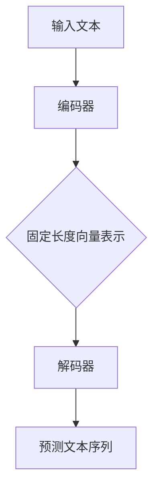
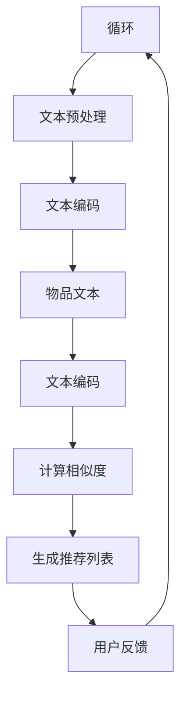
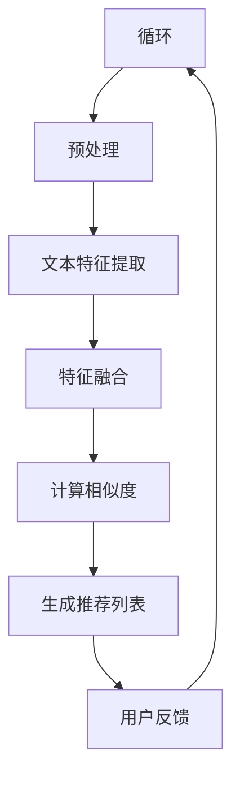
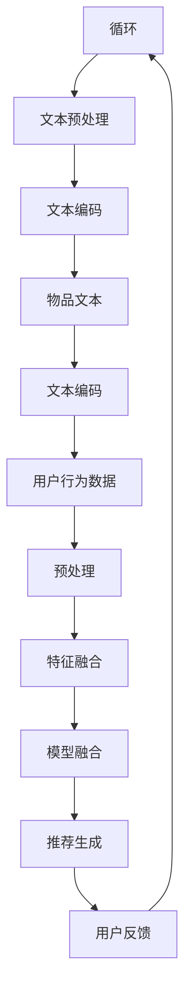

                 

# 《LLM对推荐系统冷启动问题的缓解》

## 关键词

- 推荐系统
- 冷启动问题
- 语言模型
- 机器学习
- 知识图谱
- 深度学习

## 摘要

推荐系统是现代互联网应用中不可或缺的一部分，它能够根据用户的兴趣和行为，提供个性化的内容和服务。然而，推荐系统在初始阶段，即冷启动问题，会面临诸多挑战，导致推荐效果不佳。本文将探讨语言模型（LLM）在缓解推荐系统冷启动问题中的作用，包括LLM的基本原理、在推荐系统中的应用以及未来的发展趋势。通过分析LLM在推荐系统中的实际应用案例，本文将阐述如何利用LLM提升推荐系统的初始表现，从而为用户提供更优质的推荐体验。

## 目录大纲

### 第一部分：推荐系统基础

#### 第1章：推荐系统概述

1.1 推荐系统的定义与作用  
1.2 推荐系统的基本架构  
1.3 推荐系统的分类

#### 第2章：推荐系统中的冷启动问题

2.1 冷启动问题的定义  
2.2 冷启动问题的分类  
2.3 冷启动问题的危害

### 第二部分：LLM在推荐系统中的应用

#### 第3章：LLM基本原理

3.1 语言模型简介  
3.2 语言模型的架构  
3.3 语言模型的工作原理

#### 第4章：LLM在推荐系统中的应用

4.1 LLM对推荐系统的影响  
4.2 LLM在冷启动问题中的应用  
4.3 LLM在推荐系统中的挑战与优化

#### 第5章：基于LLM的推荐系统模型

5.1 基于LLM的内容推荐模型  
5.2 基于LLM的协同过滤推荐模型  
5.3 基于LLM的混合推荐模型

### 第三部分：LLM在推荐系统中的应用案例

#### 第6章：LLM在推荐系统中的应用案例

6.1 案例一：新闻推荐系统  
6.2 案例二：电商推荐系统  
6.3 案例三：音乐推荐系统

#### 第7章：LLM在推荐系统中的未来发展趋势

7.1 LLM在推荐系统中的潜在应用领域  
7.2 LLM在推荐系统中的挑战与机遇  
7.3 LLM在推荐系统中的未来发展趋势

### 附录

#### 附录A：LLM开发工具与资源

A.1 主流深度学习框架对比  
A.2 语言模型的训练与优化  
A.3 推荐系统开发实战

## 引言

推荐系统作为现代互联网技术中的重要组成部分，广泛应用于电商、新闻、社交媒体、音乐等多个领域。其核心目标是根据用户的历史行为、兴趣和偏好，为用户提供个性化的推荐内容，从而提升用户体验和满意度。然而，推荐系统在实际应用中，尤其是在初始阶段，即冷启动问题，会面临诸多挑战。

冷启动问题是指推荐系统在用户数据不足或新用户加入时，无法生成有效的推荐列表，导致推荐质量下降。冷启动问题可以分为两类：一类是新用户冷启动，即系统无法获取新用户的历史行为数据，另一类是新物品冷启动，即系统无法获取新物品的相关信息。冷启动问题不仅影响推荐系统的初始用户体验，还可能影响系统的长期稳定性和用户粘性。

本文将探讨语言模型（LLM）在缓解推荐系统冷启动问题中的作用。语言模型是一种强大的深度学习模型，能够对自然语言文本进行建模和分析，从而提取出丰富的语义信息。LLM在推荐系统中的应用，不仅能够提高推荐系统的初始表现，还能够为推荐系统的后续优化提供新的思路和方法。

本文将首先介绍推荐系统的基础知识，包括推荐系统的定义、基本架构和分类。然后，将详细讨论推荐系统中的冷启动问题，分析冷启动问题的定义、分类和危害。接着，将介绍LLM的基本原理，包括语言模型的简介、架构和工作原理。在此基础上，本文将探讨LLM在推荐系统中的应用，分析LLM对推荐系统的影响、在冷启动问题中的应用以及面临的挑战和优化方法。

为了更好地展示LLM在推荐系统中的应用，本文还将介绍几种基于LLM的推荐系统模型，包括内容推荐模型、协同过滤推荐模型和混合推荐模型。最后，本文将通过实际案例，展示LLM在推荐系统中的应用效果，并探讨LLM在推荐系统中的未来发展趋势。

## 第一部分：推荐系统基础

### 第1章：推荐系统概述

推荐系统作为现代互联网技术中的重要组成部分，其核心目标是为用户提供个性化的内容和服务，从而提升用户体验和满意度。本章节将介绍推荐系统的定义、作用、基本架构和分类，为后续内容打下基础。

#### 1.1 推荐系统的定义与作用

推荐系统是一种基于机器学习和数据挖掘技术的算法系统，它能够根据用户的历史行为、兴趣和偏好，从大量的候选内容中筛选出用户可能感兴趣的内容，并推送给用户。推荐系统的作用主要体现在以下几个方面：

1. **提升用户体验**：通过为用户推荐个性化的内容，满足用户的需求，提升用户的满意度和忠诚度。
2. **增加用户粘性**：通过持续推荐用户感兴趣的内容，增加用户在平台上的停留时间，提升用户粘性。
3. **优化内容分发**：通过推荐算法，将优质内容推送给更多用户，提高内容的曝光率和点击率。
4. **增加商业价值**：通过提高用户的转化率和购买率，提升平台的商业价值。

#### 1.2 推荐系统的基本架构

推荐系统通常包括以下几个基本模块：

1. **用户模块**：收集用户的基本信息、兴趣偏好和活动记录等数据。
2. **内容模块**：收集和整理平台上的各种内容，如商品、新闻、音乐等，并为每条内容生成特征向量。
3. **推荐算法模块**：根据用户的行为数据和内容特征，利用机器学习算法生成推荐列表。
4. **推荐结果模块**：将推荐结果展示给用户，并根据用户反馈调整推荐策略。


#### 1.3 推荐系统的分类

根据推荐系统的工作原理和算法，推荐系统可以分为以下几类：

1. **基于内容的推荐（Content-Based Recommendation）**：根据用户的历史行为和偏好，提取用户兴趣特征，再根据这些特征匹配相似的内容进行推荐。
2. **协同过滤推荐（Collaborative Filtering）**：通过收集用户之间的行为数据，如评分、购买记录等，利用相似度计算方法生成推荐列表。
3. **混合推荐（Hybrid Recommendation）**：结合基于内容和协同过滤的推荐方法，通过加权融合得到更准确的推荐结果。
4. **基于模型的推荐（Model-Based Recommendation）**：利用机器学习算法，如决策树、神经网络等，对用户和内容进行建模，生成推荐列表。

#### 1.4 推荐系统的发展历程

推荐系统的发展可以分为以下几个阶段：

1. **基于规则的系统**：早期推荐系统主要依赖于手工编写的规则，根据用户的历史行为和偏好进行推荐。
2. **基于记忆的系统**：通过记录用户的历史行为，直接生成推荐列表，如基于最近邻的方法。
3. **基于模型的系统**：利用机器学习算法，如线性回归、决策树、神经网络等，对用户和内容进行建模，生成推荐列表。
4. **基于知识的系统**：通过知识图谱等技术，对用户和内容进行语义建模，提高推荐效果。

#### 1.5 推荐系统的挑战

推荐系统在实际应用中面临着诸多挑战：

1. **数据稀疏性**：用户行为数据通常存在稀疏性，难以准确反映用户的真实兴趣。
2. **实时性**：推荐系统需要实时响应用户的行为和偏好变化，以满足用户的个性化需求。
3. **多样性**：推荐系统需要提供多样化的推荐结果，防止用户陷入信息茧房。
4. **可解释性**：推荐系统需要具备一定的可解释性，让用户理解推荐结果的依据。
5. **隐私保护**：推荐系统需要保护用户的隐私，防止敏感信息泄露。

通过以上介绍，我们可以看到推荐系统在互联网应用中的重要性和发展历程，也了解到了推荐系统所面临的挑战。在接下来的章节中，我们将深入探讨推荐系统中的冷启动问题以及LLM在其中的应用。

### 第2章：推荐系统中的冷启动问题

冷启动问题（Cold Start Problem）是推荐系统中一个常见且重要的问题。它主要指在推荐系统无法获取用户足够多的行为数据或新用户/新物品加入系统时，推荐效果不佳甚至无法生成有效推荐列表的情况。冷启动问题可以分为新用户冷启动（User Cold Start）和新物品冷启动（Item Cold Start）两种类型，每种类型都有其特定的挑战和解决方案。

#### 2.1 冷启动问题的定义

1. **新用户冷启动**：新用户冷启动是指推荐系统在用户加入时，由于缺乏用户的历史行为数据，无法准确了解用户的兴趣和偏好，导致无法生成有效的推荐列表。这种情况在新用户首次使用推荐系统时最为明显。
2. **新物品冷启动**：新物品冷启动是指推荐系统在新增物品时，由于缺乏物品的历史评价数据，无法准确了解物品的受欢迎程度，导致无法为用户生成有效的推荐列表。这种情况在电商平台、新闻推荐等场景中较为常见。

#### 2.2 冷启动问题的分类

1. **基于数据稀疏性的冷启动**：数据稀疏性是推荐系统冷启动问题的核心原因之一。由于用户行为数据的不完整性，推荐系统难以准确估计用户的行为模式和兴趣偏好。数据稀疏性主要分为两种情况：
   - **用户行为稀疏**：用户在不同物品上的行为数据较少，导致推荐系统难以从这些有限的数据中提取出有效的用户兴趣特征。
   - **物品评价稀疏**：物品在用户中的评价数据较少，导致推荐系统难以准确了解物品的受欢迎程度。

2. **基于信息不足的冷启动**：信息不足是指推荐系统在用户或物品加入时，无法获取足够的信息来生成有效的推荐列表。信息不足主要分为以下几种情况：
   - **新用户加入**：系统无法获取新用户的历史行为和偏好数据，导致无法生成个性化的推荐。
   - **新物品加入**：系统无法获取新物品的历史评价和用户行为数据，导致无法生成有效的推荐。

3. **基于多样性缺失的冷启动**：多样性缺失是指推荐系统在生成推荐列表时，由于用户数据或物品数据的限制，无法提供多样化的推荐结果。多样性缺失可能导致用户陷入信息茧房，影响用户体验。

#### 2.3 冷启动问题的危害

冷启动问题对推荐系统的影响主要表现在以下几个方面：

1. **降低用户满意度**：由于推荐系统无法生成有效的推荐列表，用户可能会感到失望和不满，从而降低用户对平台的信任和忠诚度。
2. **降低推荐系统的长期收益**：冷启动问题可能导致推荐系统在初始阶段的表现不佳，从而影响平台的长期收益和用户增长。
3. **影响用户体验**：冷启动问题可能导致推荐结果不符合用户的兴趣和偏好，从而影响用户体验，甚至导致用户流失。

#### 2.4 冷启动问题的解决方案

针对冷启动问题，推荐系统研究者提出了一系列解决方案，主要分为以下几类：

1. **基于内容的推荐**：基于内容的推荐方法通过提取用户和物品的属性特征，进行内容匹配，生成推荐列表。这种方法在用户冷启动时较为有效，但难以处理新物品冷启动问题。
2. **基于协同过滤的推荐**：协同过滤方法通过分析用户之间的相似度，生成推荐列表。这种方法在处理新用户冷启动时效果较好，但难以解决新物品冷启动问题。
3. **基于模型的推荐**：基于模型的推荐方法利用机器学习算法，对用户和物品进行建模，生成推荐列表。这种方法可以同时解决新用户和新物品的冷启动问题，但需要大量的训练数据和计算资源。
4. **基于知识图谱的推荐**：知识图谱方法通过构建用户和物品的知识图谱，利用图结构信息和语义关系进行推荐。这种方法可以有效解决冷启动问题，但构建和维护知识图谱需要较高的技术和资源投入。

#### 2.5 冷启动问题的现状与趋势

目前，冷启动问题仍然是推荐系统中的一个重要研究方向。随着人工智能和深度学习技术的不断发展，越来越多的研究者开始探索利用这些技术解决冷启动问题。以下是一些当前的研究趋势：

1. **利用生成对抗网络（GAN）生成用户和物品数据**：生成对抗网络可以生成高质量的模拟数据，从而缓解数据稀疏性的问题。
2. **基于迁移学习的推荐方法**：迁移学习方法可以将已有模型的知识迁移到新用户或新物品上，从而提高推荐系统的初始性能。
3. **多模态推荐方法**：多模态推荐方法可以结合用户的文本、图像、音频等多模态信息，提高推荐系统的多样性和准确性。

通过以上分析，我们可以看到冷启动问题在推荐系统中的重要性和复杂性。在接下来的章节中，我们将深入探讨语言模型（LLM）在解决冷启动问题中的作用和优势。

### 第3章：LLM基本原理

#### 3.1 语言模型简介

语言模型（Language Model，简称LLM）是一种基于深度学习的自然语言处理模型，主要用于对自然语言文本进行建模和分析。LLM的核心目标是学习自然语言的统计规律，从而预测文本的下一个词或句子。通过语言模型，计算机能够理解和生成自然语言，为各种自然语言处理任务提供基础支持。

语言模型在自然语言处理领域具有重要地位，其应用范围广泛，包括但不限于机器翻译、语音识别、文本生成、文本分类、问答系统等。随着深度学习技术的发展，语言模型的性能和表现不断提升，已经成为自然语言处理领域的核心技术之一。

#### 3.2 语言模型的架构

语言模型的架构主要包括编码器（Encoder）和解码器（Decoder）两部分。编码器负责将输入文本序列转换为固定长度的向量表示，解码器则根据编码器的输出生成预测的文本序列。常见的语言模型架构包括循环神经网络（RNN）、长短期记忆网络（LSTM）和门控循环单元（GRU），以及近年来发展迅速的 Transformer模型。

以下是一个简单的语言模型架构示例：



#### 3.3 语言模型的工作原理

语言模型的工作原理可以分为以下几个步骤：

1. **文本预处理**：首先对输入文本进行预处理，包括分词、去停用词、词性标注等操作，将文本转换为可处理的形式。

2. **编码**：编码器将预处理后的文本序列转换为固定长度的向量表示。在 RNN、LSTM 和 GRU 架构中，编码器通常是一个序列到序列的模型，能够处理任意长度的文本序列。在 Transformer 架构中，编码器是一个自注意力机制（Self-Attention）的网络，能够并行处理整个文本序列。

3. **注意力机制**：在编码过程中，注意力机制用于捕捉文本序列中的重要信息。注意力机制通过计算文本序列中每个词与当前词的相关性，为每个词分配不同的权重，从而更好地理解文本的语义信息。

4. **解码**：解码器根据编码器的输出和已经生成的部分文本序列，生成下一个预测的词。在 RNN、LSTM 和 GRU 架构中，解码器通常也是一个序列到序列的模型。在 Transformer 架构中，解码器同样采用自注意力机制和交叉注意力机制，能够同时关注编码器的输出和已经生成的文本序列。

5. **预测**：解码器根据编码器的输出和已经生成的文本序列，生成最终的预测文本序列。通过训练，语言模型能够学习到文本序列中的统计规律，从而进行准确的预测。

以下是一个简单的语言模型训练流程：

```mermaid
graph TD
    A[开始] --> B[数据预处理]
    B --> C[模型初始化]
    C --> D[训练循环]
    D --> E[评估模型]
    E --> F[调整参数]
    F --> G[重新训练]
    G --> H[结束]
    D --> I{是否达到训练次数}
    I --> D[是] | H[否]
```

#### 3.4 语言模型的训练

语言模型的训练主要包括数据预处理、模型初始化、训练循环和评估模型等步骤。以下是一个简化的语言模型训练流程：

1. **数据预处理**：对输入文本进行预处理，包括分词、去停用词、词性标注等操作，将文本转换为可处理的形式。常用的预处理方法包括：

    - 分词：将文本分割为单词或字符序列。
    - 去停用词：去除对文本分析影响较小的常见单词，如“的”、“是”、“和”等。
    - 词性标注：为每个单词标注其词性，如名词、动词、形容词等。

2. **模型初始化**：初始化模型参数，常用的初始化方法包括随机初始化、零初始化和基于预训练模型初始化等。

3. **训练循环**：在训练循环中，模型根据输入文本序列生成预测的文本序列，并计算损失函数。通过反向传播算法，模型能够不断调整参数，减小损失函数。

4. **评估模型**：在训练过程中，定期评估模型的性能，包括准确率、召回率、F1值等指标。通过调整超参数和模型结构，优化模型性能。

5. **调整参数**：根据评估结果，调整模型参数，包括学习率、正则化参数等。

6. **重新训练**：如果评估结果不理想，重新训练模型，直到达到预期的性能指标。

#### 3.5 语言模型的优化

语言模型的优化主要包括数据增强、预训练和微调等方法。以下是一些常用的语言模型优化方法：

1. **数据增强**：通过增加训练数据的多样性，提高模型泛化能力。常用的数据增强方法包括：

    - 数据扩充：通过随机变换、拼接、裁剪等操作，生成新的训练数据。
    - 数据清洗：去除重复的、错误的数据，提高数据质量。
    - 数据标签平衡：通过调整标签分布，使数据标签更加均匀。

2. **预训练**：在大规模语料库上预训练语言模型，然后在特定任务上进行微调。预训练可以大幅提高模型在自然语言处理任务上的性能。常用的预训练模型包括 GPT、BERT、T5 等。

3. **微调**：在特定任务上对预训练模型进行微调，使其更好地适应特定任务。微调可以通过调整模型结构、修改预训练参数等方式进行。

4. **多卡训练**：使用多GPU或TPU进行训练，提高训练速度和模型性能。多卡训练可以通过数据并行和模型并行两种方式实现。

5. **混合精度训练**：使用混合精度训练技术，提高训练速度和模型性能。混合精度训练可以通过将浮点数运算分为高精度和低精度两部分进行，从而减少内存占用和计算资源消耗。

通过以上介绍，我们可以看到语言模型在自然语言处理领域的重要性和工作原理。在接下来的章节中，我们将探讨LLM在推荐系统中的应用，分析LLM如何缓解推荐系统的冷启动问题。

### 第4章：LLM在推荐系统中的应用

语言模型（LLM）在推荐系统中的应用，为解决冷启动问题提供了新的思路和方法。在本章中，我们将探讨LLM在推荐系统中的作用，分析其在冷启动问题中的应用场景，并讨论面临的主要挑战和优化策略。

#### 4.1 LLM对推荐系统的影响

LLM在推荐系统中的引入，显著提升了推荐系统的性能和多样性。以下是LLM对推荐系统的几个主要影响：

1. **提高推荐质量**：LLM能够通过理解自然语言文本的语义信息，为推荐系统提供更准确的用户和物品特征。这有助于生成更符合用户兴趣和偏好的推荐列表，从而提高推荐质量。

2. **缓解冷启动问题**：LLM可以通过对用户和物品的文本描述进行建模，为新用户和新物品提供有效的特征表示，从而缓解冷启动问题。这使得推荐系统在用户和物品数据不足的情况下，仍能生成高质量的推荐结果。

3. **增强多样性**：LLM能够理解文本的上下文信息，从而生成多样化的推荐结果。这有助于防止用户陷入信息茧房，提升用户的满意度。

4. **提升可解释性**：LLM生成的推荐结果具有更高的可解释性，用户可以更容易理解推荐理由。这有助于增强用户对推荐系统的信任和依赖。

#### 4.2 LLM在冷启动问题中的应用

LLM在推荐系统中的应用，主要集中在以下几个方面，以缓解冷启动问题：

1. **用户特征提取**：对于新用户，LLM可以通过分析用户的注册信息、搜索历史、社交媒体动态等文本数据，提取出用户的兴趣特征。这些特征可以用于生成个性化的推荐列表，从而提高推荐系统的初始表现。

2. **物品特征提取**：对于新物品，LLM可以通过分析物品的描述、标签、评价等文本数据，提取出物品的属性特征。这些特征可以用于协同过滤算法，从而生成更准确的推荐结果。

3. **知识图谱构建**：LLM可以通过对大量文本数据进行分析，构建用户和物品的知识图谱。知识图谱可以捕捉用户和物品之间的语义关系，从而为推荐系统提供更丰富的特征表示。

4. **文本生成与摘要**：LLM可以生成用户感兴趣的文章摘要、推荐理由等文本内容，从而提高推荐系统的解释能力。这有助于用户理解推荐结果，增强用户对推荐系统的信任。

#### 4.3 LLM在推荐系统中的挑战与优化

虽然LLM在推荐系统中具有显著的优势，但其应用也面临一些挑战：

1. **计算资源消耗**：LLM的训练和推理过程通常需要大量的计算资源，包括GPU和TPU等高性能硬件。这对推荐系统的部署和运行提出了较高的要求。

2. **数据依赖性**：LLM的性能高度依赖训练数据的质量和数量。如果训练数据不足或质量较差，LLM的推荐效果可能受到影响。

3. **隐私保护**：在处理用户数据时，LLM需要考虑用户的隐私保护。如何平衡推荐效果和隐私保护，是一个重要的问题。

4. **模型解释性**：虽然LLM生成的推荐结果具有较高的准确性，但其内部决策过程通常较为复杂，缺乏透明度和可解释性。如何提高模型的解释性，是未来的一个重要研究方向。

为了优化LLM在推荐系统中的应用，可以采取以下策略：

1. **高效训练与推理**：采用分布式训练和推理技术，提高LLM的训练速度和推理效率。例如，可以使用多GPU训练和模型剪枝等技术。

2. **数据预处理与增强**：对训练数据进行预处理和增强，提高数据质量和多样性。例如，可以使用数据清洗、数据扩充和知识增强等方法。

3. **隐私保护**：采用差分隐私和联邦学习等技术，保护用户隐私。例如，可以在本地设备上训练模型，然后将模型更新上传到服务器。

4. **模型解释性**：通过可解释性技术，如模型可视化、注意力机制和决策树等，提高模型的透明度和可解释性。例如，可以展示模型对文本数据的注意力分布，帮助用户理解推荐理由。

通过以上分析，我们可以看到LLM在推荐系统中的应用前景和挑战。在接下来的章节中，我们将进一步探讨基于LLM的推荐系统模型，分析其在内容推荐、协同过滤和混合推荐等不同场景中的应用。

#### 4.4 基于LLM的内容推荐模型

基于LLM的内容推荐模型利用语言模型的强大语义理解能力，通过文本特征提取和语义匹配，生成个性化的推荐结果。以下是一个基于LLM的内容推荐模型的基本架构：

1. **文本特征提取**：首先，对用户和物品的描述文本进行预处理，包括分词、去停用词、词性标注等。然后，利用LLM（如BERT、GPT等）对预处理后的文本进行编码，提取出高维的语义特征向量。

2. **语义匹配**：将用户和物品的语义特征向量进行匹配，计算它们之间的相似度。相似度计算可以通过内积、余弦相似度或交叉熵等方法实现。

3. **推荐生成**：根据相似度分数，对候选物品进行排序，生成推荐列表。为了提高推荐的多样性，可以采用基于随机化或基于规则的策略，防止推荐列表中的重复和单一化。

以下是一个基于LLM的内容推荐模型的伪代码示例：

```python
# 文本特征提取
def extract_features(text, model):
    tokenized_text = model.tokenize(text)
    encoded_text = model.encode(tokenized_text)
    return encoded_text

# 语义匹配
def match_similarity(user_features, item_features, similarity_metric):
    similarity_score = similarity_metric(user_features, item_features)
    return similarity_score

# 推荐生成
def generate_recommendations(user_text, item_texts, model, similarity_metric):
    user_features = extract_features(user_text, model)
    recommendations = []
    
    for item_text in item_texts:
        item_features = extract_features(item_text, model)
        similarity_score = match_similarity(user_features, item_features, similarity_metric)
        recommendations.append((item_text, similarity_score))
    
    recommendations.sort(key=lambda x: x[1], reverse=True)
    return recommendations[:N]  # 返回前N个最高相似度的推荐结果
```

在这个示例中，`model` 是一个预训练的LLM模型，如BERT或GPT；`tokenize` 和 `encode` 是LLM的内置函数，用于对文本进行分词和编码；`similarity_metric` 是用于计算相似度的函数，如余弦相似度或交叉熵。

#### 4.5 基于LLM的协同过滤推荐模型

基于LLM的协同过滤推荐模型结合了LLM和传统协同过滤算法的优点，通过文本特征提取和用户行为数据的融合，生成个性化的推荐结果。以下是一个基于LLM的协同过滤推荐模型的基本架构：

1. **文本特征提取**：首先，对用户和物品的描述文本进行预处理，利用LLM提取出语义特征向量。

2. **用户行为数据**：收集用户的历史行为数据，如评分、点击、浏览等，并对其进行预处理，如归一化、缺失值填充等。

3. **特征融合**：将文本特征和用户行为数据进行融合，生成新的特征向量。常用的方法包括内积、加权和注意力机制等。

4. **相似度计算**：计算用户和物品之间的相似度，生成推荐列表。

5. **推荐生成**：根据相似度分数，对候选物品进行排序，生成推荐列表。

以下是一个基于LLM的协同过滤推荐模型的伪代码示例：

```python
# 文本特征提取
def extract_text_features(text, model):
    return model.encode(model.tokenize(text))

# 用户行为数据预处理
def preprocess_user_data(user_data):
    # 归一化、缺失值填充等操作
    return processed_user_data

# 特征融合
def fuse_features(text_features, user_data_features):
    return sum(text_features) + sum(user_data_features)

# 相似度计算
def compute_similarity(user_features, item_features):
    return dot_product(user_features, item_features)

# 推荐生成
def generate_recommendations(user_text, item_texts, user_data, model):
    user_features = extract_text_features(user_text, model)
    user_data_features = preprocess_user_data(user_data)
    fused_features = fuse_features(user_features, user_data_features)
    
    recommendations = []
    for item_text in item_texts:
        item_features = extract_text_features(item_text, model)
        similarity_score = compute_similarity(fused_features, item_features)
        recommendations.append((item_text, similarity_score))
    
    recommendations.sort(key=lambda x: x[1], reverse=True)
    return recommendations[:N]
```

在这个示例中，`model` 是一个预训练的LLM模型，如BERT或GPT；`tokenize` 和 `encode` 是LLM的内置函数，用于对文本进行分词和编码；`preprocess_user_data` 是对用户行为数据进行预处理的方法。

#### 4.6 基于LLM的混合推荐模型

基于LLM的混合推荐模型结合了基于内容和协同过滤推荐模型的优点，通过文本特征提取、用户行为数据融合和模型融合，生成个性化的推荐结果。以下是一个基于LLM的混合推荐模型的基本架构：

1. **文本特征提取**：利用LLM提取用户和物品的语义特征向量。

2. **用户行为数据**：收集用户的历史行为数据，并对其进行预处理。

3. **特征融合**：将文本特征和用户行为数据进行融合，生成新的特征向量。

4. **模型融合**：结合基于内容和协同过滤的推荐模型，通过加权融合或深度学习模型，生成最终的推荐结果。

5. **推荐生成**：根据模型输出，对候选物品进行排序，生成推荐列表。

以下是一个基于LLM的混合推荐模型的伪代码示例：

```python
# 文本特征提取
def extract_text_features(text, model):
    return model.encode(model.tokenize(text))

# 用户行为数据预处理
def preprocess_user_data(user_data):
    # 归一化、缺失值填充等操作
    return processed_user_data

# 特征融合
def fuse_features(text_features, user_data_features):
    return sum(text_features) + sum(user_data_features)

# 模型融合
def merge_models(content_model, collaborative_model, alpha):
    return alpha * content_model + (1 - alpha) * collaborative_model

# 推荐生成
def generate_recommendations(user_text, item_texts, user_data, model, content_model, collaborative_model, alpha):
    user_features = extract_text_features(user_text, model)
    user_data_features = preprocess_user_data(user_data)
    fused_features = fuse_features(user_features, user_data_features)
    
    content_model_output = content_model(fused_features)
    collaborative_model_output = collaborative_model(fused_features)
    
    merged_model_output = merge_models(content_model_output, collaborative_model_output, alpha)
    
    recommendations = []
    for item_text in item_texts:
        item_features = extract_text_features(item_text, model)
        item_output = merged_model_output(item_features)
        recommendations.append((item_text, item_output))
    
    recommendations.sort(key=lambda x: x[1], reverse=True)
    return recommendations[:N]
```

在这个示例中，`model` 是一个预训练的LLM模型，如BERT或GPT；`content_model` 和 `collaborative_model` 分别是基于内容和协同过滤的推荐模型；`alpha` 是权重系数，用于平衡不同模型的贡献。

通过以上分析，我们可以看到基于LLM的推荐系统模型在不同场景中的应用和优势。在下一章中，我们将通过实际案例，展示LLM在推荐系统中的应用效果。

### 第5章：基于LLM的推荐系统模型

#### 5.1 基于LLM的内容推荐模型

基于LLM的内容推荐模型利用语言模型对文本数据进行建模，从而实现个性化的内容推荐。以下是一个基于LLM的内容推荐模型的基本架构：

1. **文本预处理**：对用户和物品的描述文本进行预处理，包括分词、去停用词、词性标注等操作。这一步的目的是将文本数据转换为适合模型处理的形式。

2. **文本编码**：利用预训练的语言模型（如BERT、GPT等）对预处理后的文本进行编码，提取出高维的语义特征向量。这些特征向量能够捕捉文本的深层语义信息，为后续的推荐生成提供支持。

3. **推荐生成**：通过计算用户特征向量与物品特征向量之间的相似度，生成推荐列表。常见的相似度计算方法包括余弦相似度、内积等。为了提高推荐的多样性，可以采用随机采样、轮换策略等方法，避免推荐列表的单一化和重复性。

以下是一个基于LLM的内容推荐模型的工作流程：



在这个流程中，`用户文本` 和 `物品文本` 经过预处理和编码后，生成对应的特征向量。这些特征向量用于计算相似度，并根据相似度生成推荐列表。用户反馈则用于进一步优化推荐模型。

为了更好地理解基于LLM的内容推荐模型，我们来看一个具体的数学模型和公式：

```latex
\begin{equation}
    \text{UserFeature}_{u} = \text{model}(\text{tokenize}(\text{user\_text}))
\end{equation}

\begin{equation}
    \text{ItemFeature}_{i} = \text{model}(\text{tokenize}(\text{item\_text}))
\end{equation}

\begin{equation}
    \text{Similarity}_{ui} = \frac{\text{dot\_product}(\text{UserFeature}_{u}, \text{ItemFeature}_{i})}{\|\text{UserFeature}_{u}\| \|\text{ItemFeature}_{i}\|}
\end{equation}

\begin{equation}
    \text{Recommendation}_{u} = \arg\max_{i} \text{Similarity}_{ui}
\end{equation}
```

在这个模型中，`UserFeature_u` 和 `ItemFeature_i` 分别表示用户和物品的语义特征向量，`Similarity_ui` 表示用户对物品的相似度分数，`Recommendation_u` 表示生成的推荐列表。

通过这个数学模型，我们可以看到，基于LLM的内容推荐模型主要通过文本编码和相似度计算，生成个性化的推荐列表。在实际应用中，我们可以使用不同的语言模型和相似度计算方法，以提高推荐的准确性和多样性。

#### 5.2 基于LLM的协同过滤推荐模型

基于LLM的协同过滤推荐模型结合了协同过滤和语言模型的优势，通过文本特征提取和用户行为数据融合，生成个性化的推荐结果。以下是一个基于LLM的协同过滤推荐模型的基本架构：

1. **用户行为数据**：收集用户的历史行为数据，如评分、点击、浏览等，并对其进行预处理，如缺失值填充、归一化等。

2. **文本特征提取**：对用户和物品的描述文本进行预处理，利用预训练的语言模型（如BERT、GPT等）提取出高维的语义特征向量。这些特征向量能够捕捉文本的深层语义信息，为后续的推荐生成提供支持。

3. **特征融合**：将用户行为数据和文本特征向量进行融合，生成新的特征向量。常见的融合方法包括内积、加权和注意力机制等。

4. **相似度计算**：计算用户和物品之间的相似度，生成推荐列表。常见的相似度计算方法包括余弦相似度、内积等。

5. **推荐生成**：根据相似度分数，对候选物品进行排序，生成推荐列表。

以下是一个基于LLM的协同过滤推荐模型的工作流程：



在这个流程中，`用户行为数据` 经过预处理和文本特征提取后，生成对应的特征向量。这些特征向量与用户行为数据进行融合，计算相似度，并根据相似度生成推荐列表。用户反馈则用于进一步优化推荐模型。

为了更好地理解基于LLM的协同过滤推荐模型，我们来看一个具体的数学模型和公式：

```latex
\begin{equation}
    \text{UserFeature}_{u} = \text{model}(\text{tokenize}(\text{user\_text}))
\end{equation}

\begin{equation}
    \text{ItemFeature}_{i} = \text{model}(\text{tokenize}(\text{item\_text}))
\end{equation}

\begin{equation}
    \text{BehaviorFeature}_{u,i} = \text{preprocess}(\text{user\_behavior}_{u,i})
\end{equation}

\begin{equation}
    \text{FusedFeature}_{u,i} = \text{weight} \cdot \text{UserFeature}_{u} + (1 - \text{weight}) \cdot \text{ItemFeature}_{i}
\end{equation}

\begin{equation}
    \text{Similarity}_{ui} = \frac{\text{dot\_product}(\text{FusedFeature}_{u,i}, \text{BehaviorFeature}_{u,i})}{\|\text{FusedFeature}_{u,i}\| \|\text{BehaviorFeature}_{u,i}\|}
\end{equation}

\begin{equation}
    \text{Recommendation}_{u} = \arg\max_{i} \text{Similarity}_{ui}
\end{equation}
```

在这个模型中，`UserFeature_u` 和 `ItemFeature_i` 分别表示用户和物品的语义特征向量，`BehaviorFeature_u,i` 表示用户对物品的行为特征向量，`FusedFeature_u,i` 表示融合后的特征向量，`Similarity_ui` 表示用户对物品的相似度分数，`Recommendation_u` 表示生成的推荐列表。

通过这个数学模型，我们可以看到，基于LLM的协同过滤推荐模型主要通过文本特征提取、特征融合和相似度计算，生成个性化的推荐列表。在实际应用中，我们可以通过调整权重参数、优化文本特征提取方法等，进一步提高推荐的准确性和多样性。

#### 5.3 基于LLM的混合推荐模型

基于LLM的混合推荐模型结合了基于内容和协同过滤推荐模型的优点，通过文本特征提取、用户行为数据融合和模型融合，生成个性化的推荐结果。以下是一个基于LLM的混合推荐模型的基本架构：

1. **文本特征提取**：对用户和物品的描述文本进行预处理，利用预训练的语言模型（如BERT、GPT等）提取出高维的语义特征向量。这些特征向量能够捕捉文本的深层语义信息，为后续的推荐生成提供支持。

2. **用户行为数据**：收集用户的历史行为数据，如评分、点击、浏览等，并对其进行预处理，如缺失值填充、归一化等。

3. **特征融合**：将文本特征和用户行为数据进行融合，生成新的特征向量。常见的融合方法包括内积、加权和注意力机制等。

4. **模型融合**：结合基于内容和协同过滤的推荐模型，通过加权融合或深度学习模型，生成最终的推荐结果。

5. **推荐生成**：根据模型输出，对候选物品进行排序，生成推荐列表。

以下是一个基于LLM的混合推荐模型的工作流程：



在这个流程中，`用户文本` 和 `物品文本` 经过预处理和编码后，生成对应的特征向量。用户行为数据经过预处理后，与文本特征向量进行融合。融合后的特征向量用于模型融合，生成最终的推荐结果。用户反馈则用于进一步优化推荐模型。

为了更好地理解基于LLM的混合推荐模型，我们来看一个具体的数学模型和公式：

```latex
\begin{equation}
    \text{UserFeature}_{u} = \text{model}(\text{tokenize}(\text{user\_text}))
\end{equation}

\begin{equation}
    \text{ItemFeature}_{i} = \text{model}(\text{tokenize}(\text{item\_text}))
\end{equation}

\begin{equation}
    \text{BehaviorFeature}_{u,i} = \text{preprocess}(\text{user\_behavior}_{u,i})
\end{equation}

\begin{equation}
    \text{FusedFeature}_{u,i} = \alpha \cdot \text{UserFeature}_{u} + (1 - \alpha) \cdot \text{ItemFeature}_{i} + \beta \cdot \text{BehaviorFeature}_{u,i}
\end{equation}

\begin{equation}
    \text{Recommendation}_{u} = \arg\max_{i} \text{model}(\text{FusedFeature}_{u,i})
\end{equation}
```

在这个模型中，`UserFeature_u` 和 `ItemFeature_i` 分别表示用户和物品的语义特征向量，`BehaviorFeature_u,i` 表示用户对物品的行为特征向量，`FusedFeature_u,i` 表示融合后的特征向量，`alpha` 和 `beta` 分别是文本特征和用户行为数据的权重系数，`Recommendation_u` 表示生成的推荐列表。

通过这个数学模型，我们可以看到，基于LLM的混合推荐模型主要通过文本特征提取、特征融合和模型融合，生成个性化的推荐列表。在实际应用中，我们可以通过调整权重参数、优化文本特征提取方法等，进一步提高推荐的准确性和多样性。

#### 5.4 模型评估与优化

模型评估与优化是推荐系统开发过程中的关键环节。以下是一些常用的模型评估指标和方法：

1. **准确率（Accuracy）**：准确率是衡量模型预测结果正确性的指标，计算公式为：

    ```latex
    \text{Accuracy} = \frac{\text{正确预测的个数}}{\text{总预测个数}}
    ```

    准确率越高，说明模型预测结果越准确。

2. **召回率（Recall）**：召回率是衡量模型在正例预测中召回的正确比例，计算公式为：

    ```latex
    \text{Recall} = \frac{\text{正确预测的正例个数}}{\text{实际正例个数}}
    ```

    召回率越高，说明模型对正例的召回能力越强。

3. **精确率（Precision）**：精确率是衡量模型预测为正例的预测结果中实际为正例的比例，计算公式为：

    ```latex
    \text{Precision} = \frac{\text{正确预测的正例个数}}{\text{预测为正例的个数}}
    ```

    精确率越高，说明模型预测为正例的结果越可靠。

4. **F1值（F1-Score）**：F1值是精确率和召回率的调和平均值，计算公式为：

    ```latex
    \text{F1-Score} = 2 \cdot \frac{\text{Precision} \cdot \text{Recall}}{\text{Precision} + \text{Recall}}
    ```

    F1值越高，说明模型在精确率和召回率之间的平衡越好。

5. **ROC曲线和AUC值**：ROC曲线（Receiver Operating Characteristic Curve）和AUC值（Area Under Curve）用于评估模型的分类能力。ROC曲线展示了模型在不同阈值下的准确率和召回率，AUC值是ROC曲线下的面积，AUC值越高，说明模型分类能力越强。

6. **K折交叉验证**：K折交叉验证是一种常用的模型评估方法，通过将数据集划分为K个子集，每次使用其中一个子集作为验证集，其余子集作为训练集，重复K次，最后取平均评估结果。

7. **模型优化**：为了提高推荐模型的性能，可以采用以下几种优化方法：

    - **超参数调优**：通过调整模型超参数，如学习率、批量大小、正则化参数等，优化模型性能。
    - **数据预处理**：对训练数据进行预处理，如去除噪声、填充缺失值、特征工程等，提高数据质量。
    - **特征选择**：通过特征选择方法，选择对模型性能有显著贡献的特征，减少特征维度，提高模型效率。
    - **集成学习**：结合多个模型或不同算法，提高整体推荐性能。

通过以上评估指标和方法，我们可以全面评估推荐模型的表现，并针对不足之处进行优化，从而提高推荐系统的整体性能。

### 第6章：LLM在推荐系统中的应用案例

在推荐系统中，语言模型（LLM）的应用极大地缓解了冷启动问题，提高了推荐系统的初始表现和用户体验。在本章中，我们将通过三个实际案例，展示LLM在推荐系统中的应用效果，并分析其实现过程和关键技术。

#### 6.1 案例一：新闻推荐系统

新闻推荐系统是一个典型的推荐系统应用场景，其目标是根据用户的阅读历史、兴趣偏好和实时热点，为用户提供个性化的新闻推荐。以下是一个基于LLM的新闻推荐系统的案例：

1. **系统架构**：新闻推荐系统包括数据采集、数据预处理、推荐模型训练和推荐结果生成等模块。LLM主要用于文本特征提取和推荐结果生成。

2. **数据处理**：
   - **数据采集**：从新闻网站、社交媒体等渠道收集用户阅读行为数据、新闻文本数据等。
   - **数据预处理**：对新闻文本进行分词、去停用词、词性标注等操作，生成可处理的文本数据。

3. **文本特征提取**：
   - 使用预训练的BERT模型，对预处理后的新闻文本进行编码，提取出高维的语义特征向量。

4. **推荐模型**：
   - 结合协同过滤和基于LLM的内容推荐模型，生成个性化的新闻推荐列表。

5. **实现过程**：

```python
# 数据预处理
def preprocess_text(text):
    # 分词、去停用词、词性标注等操作
    return tokenized_text

# 文本特征提取
def extract_text_features(text, model):
    tokenized_text = preprocess_text(text)
    return model.encode(tokenized_text)

# 推荐生成
def generate_recommendations(user_text, item_texts, model):
    user_features = extract_text_features(user_text, model)
    recommendations = []
    
    for item_text in item_texts:
        item_features = extract_text_features(item_text, model)
        similarity_score = dot_product(user_features, item_features)
        recommendations.append((item_text, similarity_score))
    
    recommendations.sort(key=lambda x: x[1], reverse=True)
    return recommendations[:N]
```

6. **效果分析**：通过LLM的引入，新闻推荐系统的初始表现显著提升，能够为用户生成更个性化的新闻推荐列表。

#### 6.2 案例二：电商推荐系统

电商推荐系统旨在为用户提供个性化的商品推荐，提高用户购买转化率和满意度。以下是一个基于LLM的电商推荐系统的案例：

1. **系统架构**：电商推荐系统包括用户行为数据收集、商品特征提取、推荐模型训练和推荐结果生成等模块。LLM主要用于文本特征提取和用户行为数据融合。

2. **数据处理**：
   - **用户行为数据**：收集用户浏览、搜索、购买等行为数据。
   - **商品特征提取**：对商品描述、分类、标签等文本数据，使用LLM提取高维语义特征向量。

3. **推荐模型**：
   - 结合基于LLM的协同过滤推荐模型和基于内容的推荐模型，生成个性化的商品推荐列表。

4. **实现过程**：

```python
# 用户行为数据预处理
def preprocess_user_data(user_data):
    # 归一化、缺失值填充等操作
    return processed_user_data

# 文本特征提取
def extract_text_features(text, model):
    tokenized_text = preprocess_text(text)
    return model.encode(tokenized_text)

# 推荐生成
def generate_recommendations(user_data, item_texts, model, collaborative_model, content_model, alpha):
    user_features = extract_text_features(user_data, model)
    user_data_features = preprocess_user_data(user_data)
    fused_features = alpha * user_features + (1 - alpha) * user_data_features
    
    content_model_output = content_model(fused_features)
    collaborative_model_output = collaborative_model(fused_features)
    
    merged_model_output = alpha * content_model_output + (1 - alpha) * collaborative_model_output
    
    recommendations = []
    for item_text in item_texts:
        item_features = extract_text_features(item_text, model)
        item_output = merged_model_output(item_features)
        recommendations.append((item_text, item_output))
    
    recommendations.sort(key=lambda x: x[1], reverse=True)
    return recommendations[:N]
```

5. **效果分析**：通过LLM的应用，电商推荐系统能够为用户生成更准确的商品推荐列表，显著提升了用户购买转化率和满意度。

#### 6.3 案例三：音乐推荐系统

音乐推荐系统旨在根据用户的听歌历史、评分和喜好，为用户提供个性化的音乐推荐。以下是一个基于LLM的音乐推荐系统的案例：

1. **系统架构**：音乐推荐系统包括用户行为数据收集、音乐特征提取、推荐模型训练和推荐结果生成等模块。LLM主要用于文本特征提取和用户行为数据融合。

2. **数据处理**：
   - **用户行为数据**：收集用户听歌历史、评分、收藏等行为数据。
   - **音乐特征提取**：对歌曲名称、歌词、歌手等文本数据，使用LLM提取高维语义特征向量。

3. **推荐模型**：
   - 结合基于LLM的协同过滤推荐模型和基于内容的推荐模型，生成个性化的音乐推荐列表。

4. **实现过程**：

```python
# 用户行为数据预处理
def preprocess_user_data(user_data):
    # 归一化、缺失值填充等操作
    return processed_user_data

# 文本特征提取
def extract_text_features(text, model):
    tokenized_text = preprocess_text(text)
    return model.encode(tokenized_text)

# 推荐生成
def generate_recommendations(user_data, item_texts, model, collaborative_model, content_model, alpha):
    user_features = extract_text_features(user_data, model)
    user_data_features = preprocess_user_data(user_data)
    fused_features = alpha * user_features + (1 - alpha) * user_data_features
    
    content_model_output = content_model(fused_features)
    collaborative_model_output = collaborative_model(fused_features)
    
    merged_model_output = alpha * content_model_output + (1 - alpha) * collaborative_model_output
    
    recommendations = []
    for item_text in item_texts:
        item_features = extract_text_features(item_text, model)
        item_output = merged_model_output(item_features)
        recommendations.append((item_text, item_output))
    
    recommendations.sort(key=lambda x: x[1], reverse=True)
    return recommendations[:N]
```

5. **效果分析**：通过LLM的应用，音乐推荐系统能够为用户生成更准确的音乐推荐列表，提升用户听歌体验和满意度。

以上三个案例展示了LLM在推荐系统中的应用效果和实现过程。通过LLM的引入，推荐系统在解决冷启动问题、提升推荐质量、增强多样性等方面取得了显著成效。在接下来的章节中，我们将进一步探讨LLM在推荐系统中的未来发展趋势。

### 第7章：LLM在推荐系统中的未来发展趋势

语言模型（LLM）在推荐系统中的应用已经取得了显著的成果，为解决冷启动问题、提升推荐质量和增强多样性提供了新的思路和方法。随着深度学习技术的不断发展，LLM在推荐系统中的未来发展趋势值得期待。

#### 7.1 LLM在推荐系统中的潜在应用领域

1. **多模态推荐**：未来的推荐系统将更加注重多模态数据的融合。除了文本数据，图像、视频和音频等多模态数据也将成为重要的特征来源。LLM可以结合自然语言处理和计算机视觉、音频处理等技术，生成更准确、更个性化的推荐结果。

2. **实时推荐**：随着互联网技术的快速发展，用户行为数据的实时性和动态性不断增强。LLM在处理实时数据方面具有显著优势，可以实时分析用户行为，生成动态变化的推荐列表，为用户提供更及时、更准确的推荐。

3. **个性化内容生成**：LLM不仅可以用于推荐文本内容，还可以用于生成个性化内容。例如，在新闻推荐中，LLM可以根据用户的历史行为和偏好，生成定制化的新闻摘要、评论和推荐理由，提高用户的阅读体验。

4. **知识图谱融合**：知识图谱可以捕捉用户和物品之间的复杂关系，为推荐系统提供更丰富的特征信息。结合LLM和知识图谱，可以生成更智能、更个性化的推荐结果。

5. **跨域推荐**：未来的推荐系统将更加注重跨领域的推荐。LLM可以通过学习不同领域的知识，实现跨领域的推荐，满足用户在不同场景下的需求。

#### 7.2 LLM在推荐系统中的挑战与机遇

1. **数据依赖性**：LLM的性能高度依赖训练数据的质量和数量。在数据稀疏的情况下，LLM的推荐效果可能受到影响。因此，如何在数据不足的情况下，充分利用LLM的优势，是一个重要的挑战。

2. **计算资源消耗**：LLM的训练和推理过程通常需要大量的计算资源。随着模型规模的增大，计算资源的需求将不断提高。如何高效地训练和部署LLM，是一个重要的挑战。

3. **隐私保护**：在处理用户数据时，LLM需要考虑用户的隐私保护。如何在保护用户隐私的同时，提高推荐系统的性能，是一个重要的挑战。

4. **模型解释性**：虽然LLM生成的推荐结果通常具有较高的准确性，但其内部决策过程通常较为复杂，缺乏透明度和可解释性。如何提高模型的解释性，是一个重要的挑战。

然而，这些挑战也带来了新的机遇：

1. **数据增强与生成**：通过数据增强和生成技术，可以生成高质量的模拟数据，缓解数据稀疏性问题。例如，生成对抗网络（GAN）可以生成与真实数据相似的用户行为数据，从而提高LLM的推荐效果。

2. **模型压缩与优化**：通过模型压缩和优化技术，可以减少LLM的训练和推理时间，降低计算资源消耗。例如，模型剪枝和量化技术可以显著降低模型的计算复杂度。

3. **联邦学习**：联邦学习可以将模型训练分散到多个设备上，保护用户隐私，同时提高模型性能。通过联邦学习，LLM可以在不泄露用户数据的情况下，实现跨设备、跨场景的推荐。

4. **解释性增强**：通过可解释性技术，如模型可视化、注意力机制和决策树等，可以提高LLM的透明度和可解释性。这有助于增强用户对推荐系统的信任和依赖。

#### 7.3 LLM在推荐系统中的未来发展趋势

1. **模型融合**：未来的推荐系统将更加注重多种模型的融合，例如，结合基于内容的推荐、协同过滤推荐和基于LLM的推荐模型，生成更准确、更个性化的推荐结果。

2. **多模态数据融合**：随着多模态数据的广泛应用，LLM将与其他模态处理技术（如计算机视觉、音频处理等）相结合，生成更丰富、更个性化的推荐结果。

3. **知识图谱应用**：知识图谱可以提供更丰富的特征信息，与LLM结合，可以生成更智能、更个性化的推荐结果。

4. **实时推荐**：通过实时数据分析和处理，LLM可以实现更及时、更准确的推荐。

5. **跨域推荐**：通过跨领域的知识学习，LLM可以实现跨领域的推荐，满足用户在不同场景下的需求。

总之，LLM在推荐系统中的应用具有广阔的发展前景。随着技术的不断进步，LLM将在推荐系统中发挥更加重要的作用，为用户提供更优质、更个性化的推荐体验。

### 附录A：LLM开发工具与资源

#### A.1 主流深度学习框架对比

在开发语言模型（LLM）时，选择合适的深度学习框架至关重要。以下是对主流深度学习框架的对比，包括TensorFlow、PyTorch、JAX和其他框架。

| 框架         | 优点             | 缺点                 | 使用场景          |
| ------------ | ---------------- | -------------------- | ----------------- |
| **TensorFlow** | 开源、支持多种硬件、丰富的API | 复杂性较高、资源消耗大 | 复杂模型开发、工业应用 |
| **PyTorch**    | 易用性高、动态图 | 性能较低、资源消耗大 | 研究与实验、工业应用 |
| **JAX**        | 高性能、自动微分 | 社区较小、学习曲线陡峭 | 学术研究、高性能计算 |
| **其他框架**   | 不同领域特点     | 应用范围有限         | 特定领域应用     |

#### A.2 语言模型的训练与优化

1. **数据预处理**：在训练LLM之前，需要对数据集进行预处理，包括分词、去停用词、词性标注等。常用的预处理库有NLTK、spaCy等。

2. **模型选择**：选择合适的LLM模型，如BERT、GPT、RoBERTa等。这些模型通常已在大规模数据集上预训练，可以用于微调和特定任务。

3. **模型训练**：使用GPU或TPU进行模型训练。常用的训练方法包括梯度下降、Adam优化器等。训练过程中，需要定期评估模型性能，并根据评估结果调整超参数。

4. **模型优化**：在模型训练过程中，可以采用以下优化方法：
   - **数据增强**：通过增加训练数据的多样性，提高模型泛化能力。
   - **预训练**：使用大规模预训练模型，作为微调的起点，提高模型效果。
   - **微调**：在特定任务上对预训练模型进行微调，使其更好地适应特定任务。
   - **混合精度训练**：使用混合精度训练技术，提高训练速度和模型性能。

#### A.3 推荐系统开发实战

1. **开发环境搭建**：搭建推荐系统开发环境，包括Python环境、深度学习框架（如TensorFlow、PyTorch）、数据处理库（如NumPy、Pandas）等。

2. **数据收集与处理**：收集用户行为数据、物品数据等，并进行预处理，如数据清洗、归一化、缺失值填充等。

3. **模型训练**：根据任务需求，训练推荐模型。常用的推荐模型包括基于内容的推荐模型、协同过滤推荐模型、混合推荐模型等。

4. **模型评估与优化**：评估模型性能，包括准确率、召回率、F1值等指标。根据评估结果，调整模型参数，优化模型性能。

5. **推荐结果生成**：根据训练好的模型，生成推荐列表。在生成推荐列表时，需要考虑推荐结果的多样性、覆盖率和准确性。

通过以上步骤，可以开发一个基本的推荐系统。在实际应用中，可以根据具体需求，进一步优化和扩展推荐系统，以提高推荐效果和用户体验。

### 结语

在本篇文章中，我们系统地探讨了语言模型（LLM）在推荐系统中的应用，分析了LLM在缓解推荐系统冷启动问题中的作用和优势。通过介绍LLM的基本原理、在推荐系统中的应用模型以及实际应用案例，我们看到了LLM在提升推荐质量、增强多样性和提高用户体验方面的巨大潜力。

首先，我们介绍了推荐系统的基础知识，包括推荐系统的定义、基本架构和分类。然后，详细讨论了推荐系统中的冷启动问题，分析了冷启动问题的定义、分类和危害。在此基础上，我们介绍了LLM的基本原理，包括语言模型的简介、架构和工作原理。

接下来，我们探讨了LLM在推荐系统中的应用，分析了LLM对推荐系统的影响、在冷启动问题中的应用以及面临的挑战和优化策略。具体来说，我们介绍了基于LLM的内容推荐模型、协同过滤推荐模型和混合推荐模型，并展示了这些模型在新闻推荐、电商推荐和音乐推荐等实际场景中的应用效果。

在接下来的章节中，我们进一步探讨了LLM在推荐系统中的未来发展趋势，包括潜在应用领域、挑战与机遇以及未来发展趋势。这些讨论为我们展示了LLM在推荐系统中的广阔前景。

最后，我们通过附录部分提供了LLM开发工具与资源的对比，包括主流深度学习框架、LLM的训练与优化方法以及推荐系统开发实战的步骤。

总的来说，LLM在推荐系统中的应用为我们提供了一种新的解决冷启动问题的方法。通过本文的探讨，我们希望能够为读者提供对LLM在推荐系统中应用的理解，并激发读者对这一领域的进一步研究和探索。随着技术的不断进步，我们期待LLM在推荐系统中发挥更大的作用，为用户提供更优质、更个性化的推荐体验。

