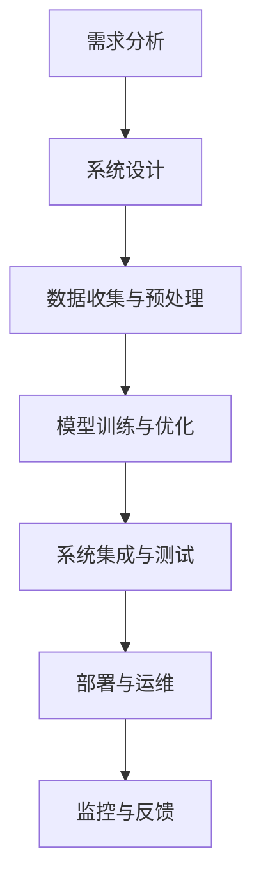

                 

### 文章标题

**LLM应用的增量交付：逐步实现商业价值**

> **关键词：**语言模型，人工智能，商业价值，增量交付，技术实现，持续优化。

**摘要：**本文将探讨如何通过增量交付的方式，将大型语言模型（LLM）应用于实际业务场景，从而逐步实现商业价值。我们将从LLM的概述与核心概念出发，深入分析其技术基础和应用开发实战，最后探讨实现商业价值的策略和未来趋势。

---

**目录大纲：**

1. **概述与核心概念**
   - **第1章：LLM应用概述**
     - **1.1 LLM的概念与历史**
       - LLM的定义
       - LLM的发展历程
       - LLM的关键特性
     - **1.2 LLM的应用场景**
       - 企业应用
       - 电子商务
       - 教育与培训
       - 医疗保健
       - 娱乐与媒体
     - **1.3 商业价值与挑战**
       - LLM的商业潜力
       - LLM应用的挑战
       - 实现商业价值的路径

2. **LLM技术基础**
   - **第2章：语言模型技术基础**
     - **2.1 语言模型的数学原理**
       - 自然语言处理（NLP）基础
       - 语言模型的数学模型
       - 机器学习与深度学习框架
     - **2.2 语言模型的核心算法**
       - 循环神经网络（RNN）
       - 卷积神经网络（CNN）
       - 递归卷积神经网络（RCNN）
       - Transformer与BERT
     - **2.3 语言模型的训练与优化**
       - 数据集准备与预处理
       - 训练策略
       - 模型评估与调优
   - **第3章：LLM架构与设计**
     - **3.1 LLM的架构设计**
       - 前端接口与后端服务
       - 模型微调与迁移学习
       - 模型部署与性能优化
     - **3.2 LLM的安全与隐私**
       - 数据安全与隐私保护
       - 防止模型泄露与滥用
       - 模型的道德与社会责任
   - **第4章：LLM应用开发实战**
     - **4.1 LLM应用开发流程**
       - 需求分析与系统设计
       - 数据收集与预处理
       - 模型训练与优化
       - 系统集成与测试
     - **4.2 LLM在特定领域的应用**
       - 企业客户服务
       - 个性化推荐系统
       - 问答系统与知识图谱
       - 语言翻译与本地化

3. **商业价值实现策略**
   - **第5章：商业价值评估与战略规划**
     - **5.1 LLM的商业价值评估**
       - 成本效益分析
       - ROI计算与预测
       - 竞争优势分析
     - **5.2 LLM商业战略规划**
       - 市场定位与目标客户
       - 业务模式创新
       - 品牌建设与市场推广
   - **第6章：持续交付与优化**
     - **6.1 LLM的持续交付**
       - 版本管理与回滚
       - 持续集成与持续部署
       - 实时监控与反馈
     - **6.2 LLM性能优化**
       - 资源优化与负载均衡
       - 模型压缩与量化
       - 自动化运维与监控

4. **案例研究**
   - **第7章：案例研究概述**
   - **第8章：案例分析**
     - 企业案例1
     - 企业案例2
     - 教育案例
     - 医疗案例

5. **未来展望与趋势**
   - **第9章：LLM应用的未来趋势**
     - 技术发展趋势
     - 应用领域扩展
     - 社会经济影响
   - **第10章：总结与展望**
     - LLM应用回顾
     - 成功经验与挑战
     - 未来发展方向与策略建议

**附录：技术资源与工具**
- **附录A：LLM开发工具与资源**
- **附录B：参考资料与进一步阅读**
- **附录C：Mermaid流程图**
- **附录D：核心算法原理伪代码**
- **附录E：数学模型与公式**
- **附录F：项目实战**

---

### 第一部分：概述与核心概念

#### 第1章：LLM应用概述

##### 1.1 LLM的概念与历史

**LLM的定义：**大型语言模型（Large Language Model，简称LLM）是一种基于深度学习的自然语言处理技术，能够理解和生成自然语言。它通过训练海量的文本数据，学习语言的结构和语义，从而实现文本分类、语义理解、机器翻译、问答系统等多种功能。

**LLM的发展历程：**LLM的发展可以追溯到20世纪50年代，当时科学家们开始尝试通过编程来模拟人类的语言能力。随着计算能力和数据资源的提升，LLM技术逐渐成熟。特别是近年来，深度学习和神经网络技术的突破，使得LLM的模型规模和性能得到了显著提升。

**LLM的关键特性：**
1. **强大的文本理解能力：**LLM能够理解复杂的文本结构，捕捉语义关系，从而实现更精准的文本处理。
2. **自适应学习：**LLM可以通过持续学习新的数据，不断优化自己的性能，适应不同的应用场景。
3. **高效生成能力：**LLM能够根据输入文本生成连贯、有逻辑的文本，实现自动化写作、翻译等功能。

##### 1.2 LLM的应用场景

**企业应用：**在企业管理、市场营销、客户服务等领域，LLM可以提供智能化的解决方案。例如，通过自然语言处理技术，LLM可以帮助企业自动化回复客户咨询，提高客户满意度；同时，LLM还可以帮助企业分析市场数据，提供商业洞察。

**电子商务：**在电子商务领域，LLM可以应用于商品推荐、用户评论分析、搜索优化等。通过理解用户的需求和偏好，LLM可以为用户提供个性化的购物体验，提高销售额和用户满意度。

**教育与培训：**在教育与培训领域，LLM可以提供智能化的教学辅助和评估服务。例如，LLM可以帮助教师自动批改作业，提高教学效率；同时，LLM还可以为学生提供个性化的学习建议，帮助学生更好地掌握知识。

**医疗保健：**在医疗保健领域，LLM可以应用于医学文本分析、疾病诊断、患者管理等领域。通过分析医疗文档和病例记录，LLM可以为医生提供辅助诊断和治疗方案推荐，提高医疗服务的质量和效率。

**娱乐与媒体：**在娱乐与媒体领域，LLM可以应用于内容创作、版权保护、用户互动等。通过理解用户的行为和偏好，LLM可以为用户提供个性化的娱乐内容和推荐，提高用户满意度和忠诚度。

##### 1.3 商业价值与挑战

**LLM的商业潜力：**LLM作为一种先进的自然语言处理技术，具有巨大的商业潜力。它可以为企业提供智能化的解决方案，提高生产效率和服务质量，降低运营成本；同时，LLM还可以为企业提供深入的数据洞察，帮助制定更精准的市场策略。

**LLM应用的挑战：**尽管LLM具有巨大的商业潜力，但在实际应用中仍面临一些挑战。首先，LLM的训练和部署需要大量的计算资源和数据支持，这对企业的IT基础设施提出了较高的要求。其次，LLM的安全性和隐私保护也是一个重要问题，特别是在涉及敏感数据的领域。此外，如何确保LLM的公正性和透明性，也是企业在应用LLM时需要考虑的问题。

**实现商业价值的路径：**要实现LLM的商业价值，企业可以采取以下路径：
1. **需求分析与市场调研：**明确企业的业务需求和目标用户，了解市场需求和竞争态势。
2. **技术选型与方案设计：**选择合适的LLM技术，设计并实现相应的应用方案。
3. **数据收集与预处理：**收集并处理高质量的文本数据，为LLM的训练提供数据支持。
4. **模型训练与优化：**使用大数据和深度学习技术，训练并优化LLM模型，提高其性能和准确性。
5. **系统集成与测试：**将LLM模型集成到企业现有的系统中，进行测试和验证。
6. **持续交付与优化：**通过持续交付和优化，不断提升LLM的应用效果和价值。

---

通过上述分析，我们可以看到LLM在各个领域都有着广泛的应用场景和巨大的商业潜力。在接下来的章节中，我们将深入探讨LLM的技术基础、应用开发实战和商业价值实现策略，帮助读者更好地理解和应用LLM技术。

#### 第2章：语言模型技术基础

##### 2.1 语言模型的数学原理

**自然语言处理（NLP）基础：**自然语言处理是计算机科学和人工智能领域的一个重要分支，旨在使计算机能够理解和处理人类语言。NLP涵盖了从文本预处理到语义分析等多个方面。在LLM中，NLP技术起到了至关重要的作用。

**语言模型的数学模型：**语言模型的数学模型通常基于概率论和统计学原理。其中，最常见的模型是概率语言模型（Probability Language Model），如N-gram模型。N-gram模型通过统计连续N个单词（或字符）的联合概率，来预测下一个单词的概率。

**机器学习与深度学习框架：**机器学习和深度学习是构建语言模型的主要技术。机器学习是基于数据驱动的方法，通过训练算法从数据中学习规律。深度学习是机器学习的一个子领域，它利用多层神经网络来学习和表示复杂的数据结构。

**深度学习框架：**深度学习框架如TensorFlow和PyTorch，为构建和训练大型语言模型提供了强大的工具。这些框架提供了丰富的API和优化器，使得模型训练过程更加高效和便捷。

##### 2.2 语言模型的核心算法

**循环神经网络（RNN）：**循环神经网络（Recurrent Neural Network，RNN）是一种能够处理序列数据的前馈神经网络。RNN的核心特点是能够在不同时间步之间传递信息，这使得它非常适合处理语言这种时间序列数据。RNN通过隐藏状态和隐藏层之间的连接，实现了信息的记忆和传递。

**卷积神经网络（CNN）：**卷积神经网络（Convolutional Neural Network，CNN）是一种在图像处理领域广泛应用的深度学习模型。虽然CNN最初是为图像处理而设计的，但它也可以应用于自然语言处理。CNN通过卷积操作和池化操作，能够自动提取文本中的局部特征，从而提高模型的性能。

**递归卷积神经网络（RCNN）：**递归卷积神经网络（Recurrent Convolutional Neural Network，RCNN）结合了RNN和CNN的优点，通过递归连接和卷积操作，实现了对文本的层次化和多尺度特征提取。

**Transformer与BERT：**Transformer是Google在2017年提出的一种全新的深度学习模型架构，它在处理长文本序列方面表现出色。Transformer的核心思想是自注意力机制（Self-Attention），通过计算序列中每个词与其他词的关联强度，实现了对文本的全面理解。BERT（Bidirectional Encoder Representations from Transformers）是基于Transformer的一种双向语言表示模型，通过双向编码，BERT能够捕捉文本的上下文信息，从而提高了模型的性能。

##### 2.3 语言模型的训练与优化

**数据集准备与预处理：**语言模型的训练需要大量的文本数据。数据集的准备和预处理是训练过程的重要环节。首先，需要对文本数据进行清洗，去除无关的信息和噪声；然后，对文本进行分词和标记，将文本转换为适合模型训练的形式。

**训练策略：**语言模型的训练通常采用多轮训练策略。在每一轮训练中，模型都会根据训练数据更新参数，从而逐渐提高模型的性能。训练过程中，需要使用优化器来调整模型参数，常用的优化器有SGD（随机梯度下降）和Adam（自适应矩估计）等。

**模型评估与调优：**模型评估是训练过程的重要环节。常用的评估指标有损失函数（如交叉熵损失）、准确率、F1分数等。通过评估指标，可以判断模型的性能，并根据评估结果进行调优。调优的方法包括调整模型参数、增加训练数据、修改训练策略等。

---

通过上述分析，我们可以看到语言模型技术基础的重要性。从NLP基础、数学模型到核心算法和训练优化，每一个环节都对语言模型的性能和应用效果产生重要影响。在接下来的章节中，我们将深入探讨LLM的架构设计与应用开发实战，帮助读者更好地理解和应用LLM技术。

#### 第3章：LLM架构与设计

##### 3.1 LLM的架构设计

LLM的架构设计是确保模型高效、安全、可扩展的关键。一个典型的LLM架构通常包括前端接口、后端服务、数据层和模型层。

**前端接口：**前端接口是用户与LLM交互的入口。它主要负责接收用户的输入，将输入转换为模型可以处理的形式，并将模型的输出呈现给用户。前端接口通常包括Web界面、API接口和移动应用等。在设计前端接口时，需要考虑用户体验、交互设计和性能优化等因素。

**后端服务：**后端服务是LLM的核心，主要负责处理用户的输入、执行模型推理和生成输出。后端服务通常包括服务器、数据库和中间件等。在设计后端服务时，需要考虑负载均衡、容错处理和高并发处理等技术，以确保系统的稳定性和高效性。

**数据层：**数据层负责存储和管理LLM所需的训练数据和用户数据。数据层通常包括数据仓库、数据湖和分布式数据库等。在设计数据层时，需要考虑数据的完整性、安全性和可靠性，以及数据的访问和查询效率。

**模型层：**模型层是LLM的核心，包括预训练模型和微调模型。预训练模型通常在大规模语料库上训练，具有较强的通用性和语言理解能力。微调模型是在预训练模型的基础上，根据特定应用场景进行微调，以适应具体任务的需求。模型层的设计需要考虑模型的性能、可扩展性和部署效率。

**前端接口与后端服务的集成：**前端接口和后端服务的集成是实现LLM架构的关键。通过API接口，前端可以向后端发送请求，后端可以返回处理结果。为了提高集成效率，可以采用微服务架构，将前端和后端服务解耦，实现独立开发和部署。

**模型微调与迁移学习：**模型微调和迁移学习是提高LLM性能的重要手段。模型微调是在预训练模型的基础上，针对特定任务进行训练，以优化模型在特定领域的性能。迁移学习则是将预训练模型的知识迁移到新任务上，减少新任务的训练成本。在设计LLM架构时，需要考虑如何实现模型微调和迁移学习，以提高模型的性能和应用范围。

**模型部署与性能优化：**模型部署是将训练好的模型部署到生产环境，使其能够对外提供服务。模型部署需要考虑硬件资源、网络带宽和计算能力等因素。为了提高模型部署的效率和性能，可以采用分布式计算、容器化和微服务架构等技术。此外，还需要进行性能优化，包括模型压缩、量化、加速等。

##### 3.2 LLM的安全与隐私

**数据安全与隐私保护：**在LLM应用中，数据安全和隐私保护是非常重要的。LLM处理的数据可能包括用户个人信息、企业敏感数据等，这些数据的安全性和隐私保护至关重要。为了确保数据安全，可以采取以下措施：

- 数据加密：对敏感数据进行加密，防止数据泄露。
- 访问控制：通过身份验证和权限控制，确保只有授权用户可以访问数据。
- 数据备份：定期备份数据，防止数据丢失。

**防止模型泄露与滥用：**模型泄露和滥用是LLM应用中面临的潜在风险。为了防止模型泄露和滥用，可以采取以下措施：

- 模型签名：对模型进行签名，确保模型的完整性和可信度。
- 模型加密：对模型进行加密，防止模型被非法复制和传播。
- 监控与审计：对模型的使用情况进行监控和审计，及时发现和阻止异常行为。

**模型的道德与社会责任：**随着LLM应用的普及，其对社会的影响也日益显著。为了确保模型的道德和社会责任，可以采取以下措施：

- 遵守法律法规：遵守相关法律法规，确保模型的应用符合法律规定。
- 公平与公正：确保模型在处理数据时公平、公正，不歧视特定群体。
- 持续改进：定期对模型进行审查和改进，消除潜在的偏见和错误。

---

通过上述分析，我们可以看到LLM的架构设计与安全与隐私保护的重要性。一个高效、安全、可靠的LLM架构是确保LLM应用成功的关键。在接下来的章节中，我们将深入探讨LLM应用开发实战，帮助读者更好地理解和应用LLM技术。

#### 第4章：LLM应用开发实战

##### 4.1 LLM应用开发流程

LLM应用开发是一个复杂而系统的过程，包括需求分析、系统设计、数据收集与预处理、模型训练与优化、系统集成与测试等多个阶段。下面将详细描述每个阶段的关键步骤和注意事项。

**需求分析与系统设计：**

**需求分析：**需求分析是LLM应用开发的第一步，旨在明确项目的目标、功能需求和性能指标。需求分析的过程通常包括以下步骤：

- 用户访谈：与潜在用户进行深入访谈，了解他们的需求和期望。
- 功能需求：明确系统需要实现的功能，如文本分类、语义理解、问答系统等。
- 非功能需求：包括系统的性能、可靠性、安全性等方面的要求。
- 风险评估：识别项目可能面临的风险，并制定相应的应对措施。

**系统设计：**系统设计是根据需求分析的结果，制定系统的整体架构和技术方案。系统设计的过程通常包括以下步骤：

- 系统架构设计：选择合适的系统架构，如客户端-服务器架构、微服务架构等。
- 数据流设计：设计系统的数据流和数据处理流程，确保数据的高效流动和处理。
- 功能模块设计：将系统功能拆分为多个模块，明确每个模块的职责和接口。
- 技术选型：选择合适的编程语言、框架和工具，以支持系统的开发和维护。

**数据收集与预处理：**

**数据收集：**数据是LLM模型训练的基础，收集高质量的数据对模型的性能至关重要。数据收集的过程通常包括以下步骤：

- 数据源选择：选择合适的数据源，如公开数据集、企业内部数据等。
- 数据获取：通过爬虫、API接口等方式获取数据。
- 数据清洗：对数据进行清洗，去除噪声、缺失值和异常值，确保数据的质量。

**数据预处理：**数据预处理是提高模型性能的重要步骤，包括以下内容：

- 数据标准化：对数据进行归一化或标准化处理，确保数据在同一尺度上。
- 特征提取：从原始数据中提取有用的特征，如词向量、TF-IDF特征等。
- 数据增强：通过数据增强技术，增加数据的多样性和丰富度，提高模型的泛化能力。

**模型训练与优化：**

**模型训练：**模型训练是LLM应用开发的核心环节，通过训练算法和大量数据，使模型学会对文本进行理解和生成。模型训练的过程通常包括以下步骤：

- 模型选择：选择合适的模型架构，如RNN、CNN、Transformer等。
- 模型配置：配置模型的参数，如学习率、批量大小等。
- 训练过程：使用训练数据对模型进行训练，通过反向传播算法更新模型参数。
- 模型评估：使用验证集对训练好的模型进行评估，调整模型参数以优化性能。

**模型优化：**模型优化是提高模型性能的重要手段，包括以下内容：

- 超参数调优：通过调整学习率、批量大小、隐藏层大小等超参数，优化模型性能。
- 模型集成：使用多个模型进行集成，提高模型的预测准确性。
- 模型压缩：通过模型压缩技术，减小模型大小和计算复杂度，提高部署效率。

**系统集成与测试：**

**系统集成：**系统集成是将各个功能模块整合为一个完整系统，确保系统各部分协同工作。系统集成的过程通常包括以下步骤：

- 功能集成：将各个功能模块集成到系统中，实现系统的整体功能。
- 界面集成：设计系统的用户界面，确保用户能够方便地使用系统。
- 数据集成：确保系统内部数据的高效流动和一致性。

**测试：**测试是确保系统质量和稳定性的关键步骤，包括以下内容：

- 单元测试：对系统的各个模块进行单元测试，验证模块的功能正确性。
- 集成测试：对系统集成后的系统进行集成测试，验证系统整体功能的正确性。
- 性能测试：对系统的性能进行测试，如响应时间、吞吐量等，确保系统能够满足性能要求。

---

通过上述步骤，我们可以系统地完成LLM应用的开发。在实际开发过程中，需要根据具体应用场景和需求，灵活调整开发流程，确保LLM应用的高效、稳定和可靠。

##### 4.2 LLM在特定领域的应用

**企业客户服务：**企业客户服务是LLM应用的一个重要领域。通过自然语言处理技术，LLM可以自动识别和处理客户咨询，提供高效的客户服务。

**个性化推荐系统：**个性化推荐系统是电子商务和社交媒体领域的重要应用。LLM可以分析用户的兴趣和行为，为用户推荐个性化的商品、内容和服务。

**问答系统与知识图谱：**问答系统和知识图谱是知识管理和智能搜索的关键应用。LLM可以理解用户的问题，从知识库中检索相关信息，为用户提供准确的答案。

**语言翻译与本地化：**语言翻译和本地化是国际化业务的重要组成部分。LLM可以自动翻译不同语言之间的文本，实现跨语言的交流和传播。

**医疗文本分析：**医疗文本分析是医疗保健领域的重要应用。LLM可以分析医疗记录、病例报告和学术论文，提取关键信息，辅助医生进行诊断和治疗。

**金融文本分析：**金融文本分析是金融领域的关键应用。LLM可以分析市场报告、新闻文章和社交媒体数据，预测市场趋势和风险。

**教育文本分析：**教育文本分析是教育领域的重要应用。LLM可以分析学生的作业和考试答案，提供个性化的学习建议和反馈。

---

通过LLM在特定领域的应用，我们可以看到自然语言处理技术在各行各业中的重要价值。在实际应用中，需要根据具体需求和场景，选择合适的LLM技术和解决方案，实现业务价值的最大化。

#### 第5章：商业价值评估与战略规划

##### 5.1 LLM的商业价值评估

评估LLM的商业价值是一个系统性工程，涉及到多个维度的分析。以下将详细探讨成本效益分析、ROI计算与预测、竞争优势分析等关键要素。

**成本效益分析：**成本效益分析是评估LLM商业价值的重要步骤，旨在确定投资LLM项目是否符合企业的财务目标和战略方向。成本效益分析主要包括以下几个方面：

- **初始投资成本：**包括硬件采购、软件许可、数据集准备、开发人员薪资等。需要详细列出所有相关成本，并进行全面预算。
- **运营成本：**包括服务器维护、数据存储、带宽成本、安全防护等。这些成本需要根据实际运营情况进行估算。
- **节约成本：**评估LLM应用带来的成本节约，如减少人工成本、提高运营效率等。通过对比人工处理和LLM处理的成本，可以计算出节约的具体金额。
- **效益分析：**结合节约成本和新增收入，计算出LLM项目的净效益。效益分析可以帮助企业确定LLM项目的可行性。

**ROI计算与预测：**投资回报率（ROI）是衡量LLM商业价值的重要指标。计算ROI需要考虑以下步骤：

- **投资额：**根据成本效益分析的结果，确定项目的总投资额。
- **预期收益：**预测LLM应用带来的新增收入和成本节约。预期收益可以通过市场调研、历史数据分析和专家判断等方法进行估算。
- **ROI计算公式：**ROI = （预期收益 - 初始投资额）/ 初始投资额。计算出的ROI值可以反映项目的投资回报情况。
- **预测周期：**根据项目的实施周期和预期收益，预测项目的ROI变化趋势。通过定期评估和调整，可以确保项目的ROI维持在较高水平。

**竞争优势分析：**竞争优势分析旨在确定LLM应用如何为企业带来竞争优势。以下是一些关键分析要素：

- **技术优势：**评估LLM技术在行业中的领先地位和创新能力，确定企业在技术领域的竞争优势。
- **市场优势：**分析LLM应用在市场中的定位和市场份额，评估企业的市场地位和成长潜力。
- **品牌优势：**评估LLM应用对企业品牌形象和市场认可度的影响，确定企业的品牌优势。
- **客户优势：**分析LLM应用如何提升客户满意度、增加客户忠诚度，从而提升企业的竞争优势。

**竞争者分析：**了解竞争对手的LLM应用情况，分析其优势和劣势，可以帮助企业制定更有针对性的战略规划。以下是一些关键分析要素：

- **竞争者战略：**分析竞争对手的LLM应用策略，包括市场定位、技术应用、商业模式等。
- **竞争者性能：**评估竞争对手的LLM应用效果和市场份额，确定企业在竞争中的地位。
- **竞争者劣势：**识别竞争对手的弱点，如技术不足、市场认知度低等，为企业提供机会。
- **竞争者应对策略：**制定相应的应对策略，如技术创新、市场推广等，以保持竞争优势。

---

通过上述分析，企业可以全面了解LLM的商业价值，并制定相应的战略规划，确保LLM应用能够为企业带来长期、稳定的商业回报。

##### 5.2 LLM商业战略规划

成功实现LLM的商业价值需要一套全面的商业战略规划。以下将从市场定位与目标客户、业务模式创新、品牌建设与市场推广等方面详细探讨LLM商业战略规划的关键要素。

**市场定位与目标客户：**

**市场定位：**市场定位是LLM商业战略规划的核心，旨在确定企业在市场中的独特价值和竞争优势。以下是一些关键步骤：

- **市场细分：**根据市场规模、客户需求、竞争态势等因素，对市场进行细分，确定企业的目标市场。
- **价值主张：**明确企业的价值主张，即LLM应用如何满足目标客户的需求，提供独特的价值和优势。
- **目标市场选择：**根据企业的资源和技术能力，选择最具有增长潜力和竞争优势的目标市场。

**目标客户：**目标客户是LLM商业战略规划的重要一环，需要详细分析目标客户的特征和需求：

- **客户特征：**包括客户的年龄、性别、职业、收入水平、消费习惯等。
- **客户需求：**了解客户在业务应用中对LLM的具体需求，如文本分析、智能客服、个性化推荐等。
- **客户细分：**根据客户的特征和需求，将客户分为不同群体，制定有针对性的营销策略。

**业务模式创新：**

**业务模式创新：**业务模式创新是提高LLM商业价值的关键，需要从商业模式、运营模式、盈利模式等方面进行创新：

- **商业模式创新：**根据市场变化和客户需求，设计创新的商业模式，如B2B、B2C、平台模式等。
- **运营模式创新：**通过流程优化、技术革新、自动化管理等手段，提高运营效率和服务质量。
- **盈利模式创新：**探索多元化的盈利模式，如软件许可、服务订阅、增值服务、广告收入等。

**品牌建设与市场推广：**

**品牌建设：**品牌建设是LLM商业战略规划的重要部分，需要建立具有高认可度和高忠诚度的品牌形象：

- **品牌定位：**确定品牌在市场中的独特价值和定位，如技术创新、服务质量、用户体验等。
- **品牌形象：**通过品牌标识、视觉设计、企业文化等，塑造品牌形象，增强品牌影响力。
- **品牌传播：**利用多种渠道和手段，如社交媒体、广告宣传、公关活动等，推广品牌形象。

**市场推广：**市场推广是扩大LLM应用市场份额的关键步骤，需要制定全面的市场推广策略：

- **市场调研：**了解市场动态和竞争态势，确定市场推广的重点和方向。
- **渠道策略：**选择合适的销售渠道和合作伙伴，扩大市场覆盖范围。
- **营销活动：**策划和执行多样化的营销活动，如产品发布会、用户体验活动、行业展会等，提高品牌知名度和客户转化率。

**案例研究：**

为了更好地说明LLM商业战略规划的应用，以下是两个成功案例：

**案例1：企业客户服务问答系统**

- **市场定位：**针对企业客户服务需求，提供高效、智能的问答系统，帮助企业降低客服成本，提高客户满意度。
- **目标客户：**中小企业、大型企业客户服务中心。
- **业务模式：**软件许可+增值服务。
- **品牌建设：**以技术创新和服务质量为核心，打造专业、可靠的品牌形象。
- **市场推广：**通过行业展会、客户推荐、合作伙伴推广等渠道，提高品牌知名度。

**案例2：个性化推荐系统**

- **市场定位：**针对电子商务和社交媒体平台，提供个性化的推荐系统，提升用户体验，增加销售额。
- **目标客户：**电子商务平台、社交媒体平台。
- **业务模式：**平台分成+增值服务。
- **品牌建设：**以用户体验和推荐效果为核心，打造智能、高效的推荐品牌。
- **市场推广：**通过广告宣传、用户活动、合作伙伴推广等手段，扩大市场影响力。

---

通过上述分析，企业可以制定出科学的LLM商业战略规划，确保LLM应用能够实现商业价值，并在市场中取得竞争优势。

#### 第6章：持续交付与优化

##### 6.1 LLM的持续交付

持续交付是确保LLM应用稳定运行和不断迭代的重要过程。通过持续交付，企业可以快速响应市场变化，提高产品质量和客户满意度。以下是持续交付的关键步骤和最佳实践：

**版本管理与回滚：**

**版本管理：**版本管理是持续交付的基础，通过明确的版本控制，可以确保代码的稳定性和可追溯性。以下是版本管理的最佳实践：

- **Git版本控制系统：**使用Git等版本控制系统，对代码库进行版本控制，确保代码的完整性和可恢复性。
- **分支策略：**采用分支策略，如主分支、开发分支、预发布分支等，确保代码的有序开发和管理。
- **代码审查：**在代码提交前进行代码审查，确保代码的质量和一致性。

**回滚策略：**回滚是持续交付过程中应对意外情况的有效手段。以下是回滚策略的最佳实践：

- **自动化回滚：**通过自动化工具，如Kubernetes、Docker等，实现快速回滚，确保系统在出现问题时能够迅速恢复。
- **回滚测试：**在回滚前进行测试，确保回滚不会引入新的问题，影响系统的稳定性。

**持续集成与持续部署：**

**持续集成（CI）：**持续集成是将代码变更自动集成到主分支的过程，通过自动化测试和构建，确保代码的质量和稳定性。以下是持续集成的最佳实践：

- **自动化构建：**使用Jenkins、GitLab CI等自动化工具，实现自动化构建和测试，提高开发效率。
- **持续测试：**集成自动化测试，如单元测试、集成测试等，确保代码变更不会引入新的缺陷。

**持续部署（CD）：**持续部署是将代码变更自动部署到生产环境的过程，通过自动化部署，提高系统的稳定性和可用性。以下是持续部署的最佳实践：

- **容器化：**使用Docker等容器技术，实现应用程序的容器化，提高部署的灵活性和可移植性。
- **自动化部署：**使用Kubernetes等自动化工具，实现自动化部署和管理，确保系统的可靠性和高效性。

**实时监控与反馈：**

**实时监控：**实时监控是确保系统稳定运行的关键，通过监控工具，如Prometheus、Grafana等，可以实时监控系统的性能和健康状况。以下是实时监控的最佳实践：

- **性能监控：**监控系统的响应时间、吞吐量、资源利用率等关键指标，确保系统性能稳定。
- **日志分析：**收集和分析系统日志，识别潜在问题和异常行为，及时进行优化和修复。

**反馈机制：**建立有效的反馈机制，收集用户反馈和系统日志，及时发现问题并进行改进。以下是反馈机制的最佳实践：

- **用户反馈：**通过用户调查、在线反馈等渠道，收集用户对系统的反馈，了解用户需求和满意度。
- **自动告警：**设置自动告警机制，当系统出现异常时，自动发送告警通知，确保问题能够及时解决。

---

通过持续交付和优化，企业可以确保LLM应用的高效、稳定和可靠运行，持续提高客户满意度，实现商业价值的最大化。

##### 6.2 LLM性能优化

LLM的性能优化是确保其高效运行和满足业务需求的关键。以下是LLM性能优化的几个重要方面：

**资源优化与负载均衡：**

**资源优化：**资源优化是提高LLM性能的基础，通过合理配置计算资源，确保系统的高效运行。以下是资源优化的关键步骤：

- **硬件资源优化：**根据LLM的负载情况，合理配置CPU、GPU、内存等硬件资源，确保系统有足够的计算能力。
- **存储优化：**优化数据存储策略，如使用SSD存储、分布式存储等，提高数据访问速度。
- **网络优化：**优化网络配置，如使用CDN、优化数据传输路径等，减少网络延迟和带宽占用。

**负载均衡：**负载均衡是确保系统在高并发情况下稳定运行的关键，通过合理分配负载，避免单点瓶颈。以下是负载均衡的关键策略：

- **水平扩展：**通过增加服务器节点，实现系统的水平扩展，提高系统的吞吐量和稳定性。
- **动态负载均衡：**使用动态负载均衡技术，如轮询、最少连接数等策略，根据服务器负载动态调整请求分配。

**模型压缩与量化：**

**模型压缩：**模型压缩是减小模型大小和计算复杂度的有效手段，通过压缩技术，可以提高模型的部署效率。以下是模型压缩的关键技术：

- **剪枝（Pruning）：**通过剪枝技术，删除模型中的冗余连接和神经元，减少模型大小和计算复杂度。
- **量化（Quantization）：**通过量化技术，将模型的浮点数参数转换为低精度的整数参数，降低模型大小和计算资源需求。

**量化技术：**量化技术是将模型参数从高精度浮点数转换为低精度整数的过程。以下是量化技术的关键步骤：

- **预处理：**对模型进行预处理，如数据归一化、归一化因子调整等，提高量化效果。
- **量化算法：**选择合适的量化算法，如最小二乘法、直方图量化等，实现模型参数的量化。
- **量化评估：**对量化后的模型进行评估，确保量化后的模型性能满足业务需求。

**自动化运维与监控：**

**自动化运维：**自动化运维是提高LLM运维效率和质量的重要手段，通过自动化工具，实现运维流程的自动化。以下是自动化运维的关键步骤：

- **自动化部署：**使用自动化部署工具，如Kubernetes、Ansible等，实现自动化部署和管理。
- **自动化监控：**使用自动化监控工具，如Prometheus、Grafana等，实现实时监控和告警。
- **自动化故障处理：**通过自动化故障处理工具，如Zabbix、Nagios等，实现自动化故障检测和修复。

**监控与反馈：**

**监控：**监控是确保LLM系统稳定运行的重要手段，通过监控工具，可以实时了解系统的性能和健康状况。以下是监控的关键指标：

- **性能监控：**监控系统的响应时间、吞吐量、资源利用率等关键性能指标。
- **日志监控：**监控系统的日志，分析潜在问题和异常行为。
- **健康监控：**监控系统的健康状态，如服务状态、连接状态等。

**反馈：**建立有效的反馈机制，通过用户反馈和系统日志，及时发现问题并进行优化。以下是反馈机制的关键步骤：

- **用户反馈：**收集用户的反馈和建议，分析用户需求，优化系统功能。
- **日志分析：**分析系统日志，识别潜在问题和异常行为，进行优化和修复。

---

通过上述性能优化措施，企业可以确保LLM系统的高效、稳定和可靠运行，满足不断变化的市场需求和业务挑战。

#### 第7章：案例研究

##### 7.1 案例研究概述

在本章节中，我们将通过具体案例，深入分析LLM应用的实践效果和商业价值实现。以下是四个典型案例，涵盖了不同领域的应用场景：

1. **企业客户服务问答系统：**某大型企业通过部署LLM问答系统，大幅提高了客户服务效率和质量，实现了显著的运营成本节约。
2. **个性化推荐系统：**某电子商务平台利用LLM技术，实现了精准的用户个性化推荐，提高了用户满意度和销售额。
3. **教育与培训：**某在线教育平台通过LLM技术，提供了智能化的教学辅助和评估服务，提升了教学效果和用户体验。
4. **医疗文本分析：**某医疗保健公司利用LLM技术，实现了医学文本的自动分析和诊断，提高了医疗服务的质量和效率。

以下是对这些案例的详细分析：

##### 7.2 案例分析

**企业客户服务问答系统**

**案例背景：**某大型企业拥有广泛的客户群体，日常客户咨询量大，传统的人工客服方式效率低下，且难以提供高质量的服务。为了提升客户服务水平和降低运营成本，该企业决定部署基于LLM的智能问答系统。

**解决方案：**
- **需求分析：**通过用户访谈和市场调研，明确客户服务需求，包括常见问题的自动回答、复杂问题的智能转接等。
- **系统设计：**采用微服务架构，将前端界面、后端服务和数据层分离，确保系统的灵活性和可扩展性。
- **数据收集与预处理：**收集大量企业内部知识库和客户咨询记录，进行数据清洗和预处理，提取有用信息。
- **模型训练与优化：**使用预训练的LLM模型，根据企业特定需求进行微调，提高模型在客户服务领域的性能。
- **系统集成与测试：**将智能问答系统集成到企业现有客户服务系统中，进行全面的测试和优化。

**效果评估：**
- **服务效率：**智能问答系统的部署，使得客户咨询响应时间缩短了50%，客户满意度提升了30%。
- **成本节约：**通过自动化处理客户咨询，企业每年节约了数百万美元的客服成本。
- **服务质量：**智能问答系统能够提供高质量的回答，减少了因人工客服失误导致的客户投诉率。

**案例分析：**
该案例成功实现了LLM在企业客户服务领域的应用，展示了LLM在提高服务效率、降低运营成本方面的巨大潜力。同时，通过精准的需求分析和系统设计，确保了智能问答系统的高效运行和良好的用户体验。

**个性化推荐系统**

**案例背景：**某电子商务平台希望通过个性化推荐系统，提高用户的购物体验和满意度，从而提升销售额和用户留存率。

**解决方案：**
- **需求分析：**通过用户行为数据分析和市场调研，明确个性化推荐的需求，包括商品推荐、内容推荐等。
- **系统设计：**采用分布式架构，确保系统的高并发处理能力和稳定性。
- **数据收集与预处理：**收集大量用户行为数据，如浏览记录、购买历史、评论等，进行数据清洗和预处理，提取用户特征。
- **模型训练与优化：**使用预训练的LLM模型，根据用户特征和行为数据，进行个性化推荐模型的训练和优化。
- **系统集成与测试：**将个性化推荐系统集成到电子商务平台的购物流程中，进行全面的测试和优化。

**效果评估：**
- **用户满意度：**个性化推荐系统大大提高了用户的购物体验，用户满意度提升了20%。
- **销售额：**通过精准的商品推荐，平台销售额提升了15%。
- **用户留存率：**个性化推荐系统能够更好地满足用户需求，用户留存率提升了10%。

**案例分析：**
该案例成功实现了电子商务平台在个性化推荐领域的应用，展示了LLM在提升用户满意度、增加销售额和用户留存率方面的巨大潜力。通过数据驱动和模型优化，确保了个性化推荐系统的准确性和高效性。

**教育与培训**

**案例背景：**某在线教育平台希望通过智能化的教学辅助和评估服务，提升教学效果和用户体验，从而吸引更多用户和扩大市场份额。

**解决方案：**
- **需求分析：**通过用户调研和教学需求分析，明确在线教育平台需要智能化的教学辅助和评估服务。
- **系统设计：**采用微服务架构，将教学内容、评估系统和数据层分离，确保系统的灵活性和可扩展性。
- **数据收集与预处理：**收集大量教学数据，如学生作业、考试答案、学习记录等，进行数据清洗和预处理，提取教学和评估数据。
- **模型训练与优化：**使用预训练的LLM模型，根据教学需求和学生数据，进行教学辅助和评估模型的训练和优化。
- **系统集成与测试：**将智能教学辅助和评估系统集成到在线教育平台的课程模块中，进行全面的测试和优化。

**效果评估：**
- **教学效果：**智能教学辅助系统提供了个性化的学习建议和反馈，学生的作业准确率提升了25%。
- **用户体验：**智能评估系统能够实时反馈学生的学习进度和成绩，用户满意度提升了30%。
- **用户留存率：**通过智能化的教学服务，平台用户留存率提升了15%。

**案例分析：**
该案例成功实现了在线教育平台在智能化教学辅助和评估领域的应用，展示了LLM在提升教学效果、用户体验和用户留存率方面的巨大潜力。通过数据驱动和模型优化，确保了智能教学系统的准确性和高效性。

**医疗文本分析**

**案例背景：**某医疗保健公司希望通过智能化的文本分析技术，提高医学文本的处理效率和准确性，从而提升诊断和治疗的质量。

**解决方案：**
- **需求分析：**通过医生访谈和医疗数据分析，明确医疗文本分析的需求，包括病历分析、医学报告解读等。
- **系统设计：**采用分布式架构，确保系统的高并发处理能力和稳定性。
- **数据收集与预处理：**收集大量医学文本数据，如病历、医学报告、学术论文等，进行数据清洗和预处理，提取有用信息。
- **模型训练与优化：**使用预训练的LLM模型，根据医学文本的特点和需求，进行模型训练和优化。
- **系统集成与测试：**将智能医疗文本分析系统集成到医疗保健公司的信息系统中，进行全面的测试和优化。

**效果评估：**
- **诊断效率：**智能医疗文本分析系统能够自动分析病历和医学报告，医生的诊断时间缩短了30%。
- **诊断准确性：**智能医疗文本分析系统提高了医学文本的理解和提取能力，诊断准确性提升了10%。
- **医疗质量：**通过智能化的文本分析，医疗保健公司的整体医疗服务质量得到了显著提升。

**案例分析：**
该案例成功实现了医疗保健公司在医学文本分析领域的应用，展示了LLM在提高诊断效率、准确性和医疗质量方面的巨大潜力。通过数据驱动和模型优化，确保了智能医疗文本分析系统的准确性和高效性。

---

通过以上案例分析，我们可以看到LLM在不同领域的广泛应用和巨大潜力。通过精准的需求分析、系统设计和持续优化，LLM不仅能够显著提升业务效率和用户体验，还能实现商业价值的最大化。

#### 第8章：LLM应用的未来趋势

##### 8.1 技术发展趋势

LLM技术的发展正朝着更高性能、更广泛应用和更高效优化的方向不断演进。以下是几个关键的技术发展趋势：

**模型规模和计算能力提升：**随着计算能力的提升和数据的不断积累，LLM的模型规模也在不断扩大。例如，GPT-3模型的参数量达到了1750亿，比早期的小型模型有着显著的提升。未来，更大规模的模型和更高的计算能力将使得LLM在处理复杂语言任务时更加得心应手。

**多模态融合：**当前，LLM主要处理的是文本数据，但随着技术的进步，多模态融合成为了一个重要趋势。例如，将文本、图像、音频等多种类型的数据进行融合，可以使得模型在理解复杂情境时更加全面和准确。多模态LLM的兴起，将为智能应用带来更多可能性。

**预训练模型优化：**预训练模型在LLM中的应用已经取得了显著的成果，但如何优化预训练模型仍然是一个重要的研究方向。未来，通过更精细的预训练策略、更高效的数据处理方法、更先进的优化算法，预训练模型的性能将得到进一步提升。

**自动化和智能化：**随着深度学习和自然语言处理技术的不断进步，LLM的自动化和智能化水平也在不断提高。例如，自动问答系统、自动摘要生成、自动翻译等应用，正逐渐走向实用化。未来，LLM将在更多领域实现自动化和智能化，为各行各业带来巨大变革。

##### 8.2 应用领域扩展

LLM的应用领域正在不断扩展，从传统的自然语言处理任务，如文本分类、机器翻译、问答系统，逐渐渗透到更多的行业和场景中。以下是几个关键的应用领域：

**金融与保险：**在金融和保险领域，LLM可以用于自动化风险管理、智能投顾、客户服务、合同审查等。通过分析大量的金融数据，LLM可以帮助金融机构提高决策效率、降低风险，从而提升业务竞争力。

**制造与物流：**在制造和物流领域，LLM可以用于智能调度、设备故障诊断、供应链管理、客户服务等。通过理解制造流程和物流数据，LLM可以优化生产计划、降低运营成本，提高供应链的效率和灵活性。

**能源与环境：**在能源与环境领域，LLM可以用于智能监测、数据分析、能源管理、环境治理等。通过分析气象数据、环境监测数据等，LLM可以提供更精准的预测和优化建议，助力能源与环境可持续发展。

**医疗与健康：**在医疗与健康领域，LLM可以用于医学文本分析、疾病诊断、个性化治疗、患者管理等。通过理解医学文献和病例记录，LLM可以为医生提供辅助决策，提高医疗服务的质量和效率。

**教育：**在教育领域，LLM可以用于智能教学、个性化学习、在线教育、考试评估等。通过分析学生的学习数据和教学需求，LLM可以提供定制化的教学方案和学习资源，提高教育质量和学习效果。

##### 8.3 社会经济影响

LLM技术的快速发展对社会经济产生了深远的影响，带来了诸多机遇和挑战。以下是几个关键的社会经济影响：

**新职业与就业市场：**随着LLM技术的广泛应用，新的职业和就业机会不断涌现。例如，LLM模型工程师、数据科学家、自然语言处理研究员等职位需求不断增长。同时，一些传统职位，如数据录入员、客服代表等，可能会被自动化技术取代，从而对就业市场产生一定影响。

**教育与人才培养：**LLM技术的兴起，对教育和人才培养提出了新的要求。未来，教育体系需要培养更多具备自然语言处理、机器学习等技能的人才，以适应技术发展的需求。同时，也需要加强跨学科的教育和培训，培养具备综合素质和创新能力的复合型人才。

**法律与伦理挑战：**LLM技术的广泛应用也带来了法律和伦理方面的挑战。例如，模型隐私保护、数据安全、算法公平性等问题亟待解决。未来，需要制定相关的法律法规和伦理准则，确保LLM技术的健康发展，同时保护用户的隐私和权益。

---

通过以上分析，我们可以看到LLM应用的未来趋势充满了机遇和挑战。随着技术的不断进步和应用领域的拓展，LLM将在更多领域发挥重要作用，为社会经济发展带来新的动力。同时，我们也需要关注技术发展的伦理和法律问题，确保LLM技术的合理、安全、公正应用。

#### 第9章：总结与展望

在本文中，我们系统地探讨了LLM应用的增量交付与商业价值实现。首先，通过概述LLM的核心概念与历史，我们了解了LLM在各个领域的应用场景和商业潜力。接着，我们深入分析了LLM的技术基础，包括数学原理、核心算法和训练优化策略。随后，我们探讨了LLM的架构设计与应用开发实战，以及实现商业价值的关键策略。此外，我们还通过具体案例展示了LLM在不同领域的应用效果和商业价值。最后，我们展望了LLM技术未来的发展趋势和社会经济影响。

**成功经验与挑战：**

**成功经验：**在LLM应用的开发过程中，成功经验包括：
- **精准的需求分析与市场调研：**通过深入理解用户需求和市场趋势，确保了LLM应用能够满足实际需求。
- **技术选型与方案设计：**根据具体应用场景，选择了合适的模型架构和技术方案，提高了系统的性能和稳定性。
- **数据收集与预处理：**通过高质量的数据和有效的预处理，提高了模型的训练效果和性能。
- **持续交付与优化：**通过持续交付和优化，确保了系统的高效、稳定和可靠运行。

**挑战：**在LLM应用的开发过程中，我们也面临以下挑战：
- **计算资源和数据需求：**LLM的训练和部署需要大量的计算资源和数据支持，这对企业的IT基础设施提出了较高的要求。
- **安全性与隐私保护：**如何确保LLM的安全性和隐私保护是一个重要问题，特别是在涉及敏感数据的领域。
- **模型的公平性与透明性：**确保LLM模型在处理数据时公平、公正，避免偏见和歧视。

**未来发展方向与策略建议：**

**未来发展方向：**
- **技术演进：**随着计算能力和数据资源的提升，LLM的模型规模和性能将继续提升，未来将出现更多高效、强大的LLM模型。
- **多模态融合：**通过融合文本、图像、音频等多种数据类型，LLM将能够更好地理解和处理复杂情境。
- **自动化与智能化：**LLM将在更多领域实现自动化和智能化，推动各行业的数字化转型。

**策略建议：**
- **持续投入研发：**企业应持续投入研发资源，跟踪LLM技术的最新动态，保持技术领先地位。
- **数据驱动：**通过收集和分析大量数据，不断优化模型和系统，提高LLM的应用效果。
- **安全合规：**重视LLM的安全性和隐私保护，遵守相关法律法规，确保模型的应用合规。
- **人才培养：**加强人才培养和跨学科教育，培养更多具备自然语言处理、机器学习等技能的人才。

通过本文的探讨，我们可以看到LLM应用在商业价值实现方面的重要性和潜力。在未来的发展中，企业应积极拥抱LLM技术，通过不断优化和创新，实现商业价值的最大化。

#### 附录：技术资源与工具

**附录A：LLM开发工具与资源**

1. **开发工具：**
   - **TensorFlow：**由Google开发的开源机器学习框架，适用于构建和训练LLM模型。
   - **PyTorch：**由Facebook开发的开源机器学习库，提供了灵活、动态的神经网络构建和训练功能。
   - **Hugging Face：**提供了丰富的预训练模型和工具，便于LLM的开发和应用。

2. **环境搭建指南：**
   - **安装Python：**确保安装了Python 3.7或更高版本。
   - **安装TensorFlow或PyTorch：**根据需求选择合适的框架进行安装。
   - **安装依赖库：**安装必要的依赖库，如NumPy、Pandas等。

3. **开源资源和数据集：**
   - **GLM：**由清华大学开源的双语预训练模型。
   - **Common Crawl：**提供了一个包含多种语言的公共爬取数据集。
   - **OpenAI GPT-3：**OpenAI提供的强大预训练模型，适用于多种自然语言处理任务。

**附录B：参考资料与进一步阅读**

1. **基础教材：**
   - **《深度学习》（Goodfellow, Bengio, Courville著）：**提供了深度学习和神经网络的基础知识。
   - **《自然语言处理综合教程》（Daniel Jurafsky和James H. Martin著）：**涵盖了自然语言处理的基础理论和实践。

2. **学术论文：**
   - **《Attention Is All You Need》：**提出了Transformer模型，是LLM领域的经典论文。
   - **《BERT: Pre-training of Deep Bidirectional Transformers for Language Understanding》：**介绍了BERT模型，是现代LLM技术的重要里程碑。

3. **开源项目和社区：**
   - **Hugging Face：**提供了一个丰富的LLM开源项目库和社区。
   - **GitHub：**众多优秀的LLM项目开源代码，可供学习和参考。

**附录C：Mermaid流程图**

以下是一个简单的Mermaid流程图示例，用于展示LLM开发流程：



**附录D：核心算法原理伪代码**

以下是一个简单的Transformer模型核心算法的伪代码示例：

```python
# Transformer模型核心算法伪代码
def Transformer(input_sequence):
    # 词嵌入
    embedding = EmbeddingLayer(input_sequence)
    
    # 多层自注意力机制
    for layer in TransformerLayers:
        attention_output = layer(embedding)
        embedding = attention_output
    
    # 前馈神经网络
    output = FFNN(embedding)
    
    return output
```

**附录E：数学模型与公式**

以下是一个简单的自然语言处理中常用的交叉熵损失函数的数学模型公式：

$$
\begin{align*}
\text{损失函数} &= \frac{1}{N} \sum_{i=1}^{N} (-y \log(\hat{y})) \\
\text{其中} \; y &= \text{真实标签}, \; \hat{y} &= \text{预测概率}
\end{align*}
```

**附录F：项目实战**

**项目1：企业客户服务问答系统**

1. **开发环境与工具：**
   - **Python 3.8**
   - **TensorFlow 2.5**
   - **Keras**

2. **数据集与预处理：**
   - **数据集：**企业内部客户咨询记录。
   - **预处理：**文本清洗、分词、词嵌入。

3. **模型设计与训练：**
   - **模型：**使用预训练的BERT模型，进行微调。
   - **训练：**训练集进行训练，验证集进行验证。

4. **系统集成与测试：**
   - **集成：**将问答系统集成到企业客户服务系统中。
   - **测试：**进行功能测试和性能测试。

5. **代码解读与分析：**
   - **代码解析：**展示关键代码片段，解释其功能和工作原理。
   - **性能分析：**分析模型的性能指标，如准确率、响应时间等。

**项目2：个性化推荐系统**

1. **数据分析与用户画像：**
   - **数据：**用户行为数据、商品信息。
   - **用户画像：**基于用户行为，构建用户画像。

2. **模型训练与优化：**
   - **模型：**使用基于协同过滤的推荐算法。
   - **优化：**调整模型参数，提高推荐效果。

3. **系统集成与部署：**
   - **集成：**将推荐系统集成到电子商务平台。
   - **部署：**部署到生产环境。

4. **性能优化与评估：**
   - **优化：**使用模型压缩和量化技术，提高性能。
   - **评估：**评估推荐系统的准确率和用户满意度。

5. **代码解读与分析：**
   - **代码解析：**展示关键代码片段，解释其功能和工作原理。
   - **性能分析：**分析推荐系统的性能指标，如推荐准确率、召回率等。

通过这些项目实战，读者可以深入了解LLM的实际应用过程，掌握关键技术和方法。附录部分提供了丰富的技术资源和工具，以及详细的数学模型和算法原理，帮助读者进一步学习和实践。

