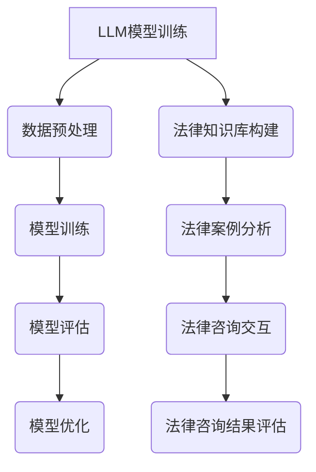
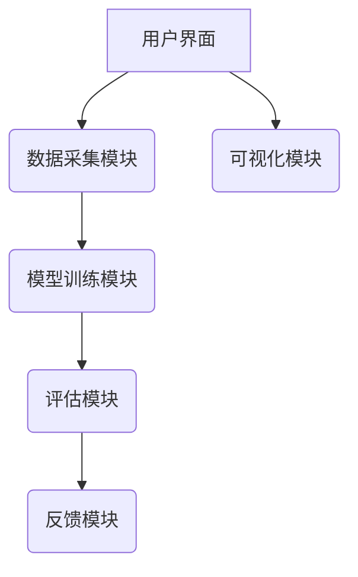

                 

### 《LLM法律咨询能力评估工具设计》

> **关键词：** Large Language Model (LLM)、法律咨询、能力评估、工具设计、人工智能

> **摘要：** 本文将探讨如何设计一种基于大型语言模型（LLM）的法律咨询能力评估工具，包括LLM在法律咨询中的应用、能力评估的概念和指标、工具的设计理念和功能模块、技术实现、测试与优化，以及实际应用案例分析。通过逐步分析，本文旨在为法律行业提供一种有效的技术手段，以提升律师的法律咨询能力。

### 《LLM法律咨询能力评估工具设计》目录大纲

#### 第一部分：LLM与法律咨询

1. **LLM简介及其在法律咨询中的应用**
   - LLM的基本概念
   - LLM的核心技术与架构
   - LLM在法律咨询领域的应用前景

2. **法律咨询能力评估概述**
   - 法律咨询能力的定义与分类
   - 法律咨询能力评估的必要性
   - 法律咨询能力评估的方法与指标

#### 第二部分：LLM法律咨询能力评估工具设计

1. **LLM法律咨询能力评估工具的设计理念**
   - 工具设计原则
   - 工具设计目标
   - 工具设计框架

2. **LLM法律咨询能力评估工具的核心功能模块**
   - 法律知识库构建
   - 法律案例分析模块
   - 法律咨询交互模块
   - 法律咨询结果评估模块

3. **LLM法律咨询能力评估工具的技术实现**
   - 数据预处理与标注
   - LLM模型选择与训练
   - 法律咨询能力评估算法设计
   - 评估结果的可视化与反馈机制

4. **LLM法律咨询能力评估工具的测试与优化**
   - 工具性能评估方法
   - 性能优化策略
   - 测试与反馈循环

5. **LLM法律咨询能力评估工具的应用实践**
   - 工具在实际法律咨询项目中的应用
   - 用户反馈与优化建议
   - 案例分析

6. **展望与未来工作**
   - LLM法律咨询能力评估工具的发展趋势
   - 未来工作方向与挑战

#### 附录

- **附录A：LLM法律咨询能力评估工具的技术文档**
  - 工具架构与代码实现
  - 使用指南
  - 开发环境搭建与依赖库安装
  - 维护与更新策略

---

### Mermaid 流�程图示例：



---

接下来，我们将按照上述目录结构，逐一展开各个章节的内容。在每个章节中，我们将详细探讨LLM法律咨询能力评估工具的设计理念、功能模块、技术实现和应用实践，以便为读者提供一个全面的技术分析。

---

### 第一部分：LLM与法律咨询

#### 第1章：LLM简介及其在法律咨询中的应用

**1.1 LLM的基本概念**

**概念定义：** 大型语言模型（Large Language Model，简称LLM）是一种基于深度学习的自然语言处理技术，通过预训练和微调的方式，使模型具备强大的语言理解和生成能力。LLM通常采用深度神经网络架构，如变分自编码器（VAE）、递归神经网络（RNN）、Transformer等。

**原理与架构：** LLM的基本原理是通过大量文本数据进行预训练，使其能够捕捉到语言的复杂结构和语义信息。预训练完成后，LLM可以根据特定的任务进行微调，以适应不同的应用场景。常见的LLM架构包括Transformer和BERT等，这些模型在预训练阶段使用了数以万亿计的单词数据，形成了对自然语言的深刻理解。

**1.2 LLM的核心技术与架构**

**核心技术：** LLM的核心技术主要包括：

- **预训练：** 使用大规模的文本数据对模型进行预训练，包括语言建模和上下文理解。
- **微调：** 在预训练的基础上，针对特定任务进行微调，以优化模型在特定领域的表现。
- **注意力机制：** Transformer架构中的注意力机制使得模型能够关注到文本中的重要信息，从而提高生成文本的质量。

**架构：** LLM的常见架构包括：

- **Transformer：** 采用自注意力机制，能够并行处理文本序列，具有强大的上下文理解能力。
- **BERT：** 双向编码器表示（Bidirectional Encoder Representations from Transformers），结合了Transformer和RNN的优点，能够在预训练阶段学习到丰富的语言特征。

**1.3 LLM在法律咨询领域的应用前景**

**应用场景：** LLM在法律咨询领域的应用前景广阔，主要包括：

- **法律文档生成：** 利用LLM生成法律文书、合同、判决书等文档。
- **法律知识库构建：** 构建包含法律条文、案例、法规的大型知识库，用于支持法律研究和咨询。
- **法律咨询交互：** 通过自然语言交互界面，为用户提供法律咨询和解答。
- **案件分析：** 利用LLM分析法律案例，为法官和律师提供参考。

**优势：** LLM在法律咨询中的优势包括：

- **高效性：** LLM能够快速处理大量的法律文本，提供高效的咨询服务。
- **准确性：** 通过预训练和微调，LLM能够在特定领域内提供准确的法律知识。
- **适应性：** LLM可以根据不同的法律咨询需求进行微调，适应不同的应用场景。

**挑战：** LLM在法律咨询领域面临的挑战包括：

- **数据隐私：** 法律咨询涉及敏感信息，如何保护用户隐私是一个重要问题。
- **法律伦理：** 法律咨询涉及到道德和伦理问题，LLM如何确保其输出的合法性和道德性。
- **法律适应性：** 法律咨询涉及到复杂多变的法律体系，如何确保LLM在不同法律体系下的适应性。

#### 第2章：法律咨询能力评估概述

**2.1 法律咨询能力的定义与分类**

**定义：** 法律咨询能力是指律师或法律专业人士在法律实践中，运用法律知识、技能和经验，为当事人提供专业法律建议和解决方案的能力。

**分类：** 法律咨询能力可以分为以下几类：

- **知识能力：** 涉及对法律条文、案例、法规等知识的掌握程度。
- **分析能力：** 涉及对法律问题进行分析、推理和判断的能力。
- **沟通能力：** 涉及与当事人、法官、律师等各方进行有效沟通的能力。
- **应变能力：** 涉及在法律实践中应对突发事件和复杂情况的能力。

**2.2 法律咨询能力评估的必要性**

**必要性：** 法律咨询能力评估的必要性体现在以下几个方面：

- **提高律师专业水平：** 通过评估，律师可以了解自己在法律咨询方面的优势和不足，从而有针对性地进行学习和提升。
- **提升律师事务所竞争力：** 评估可以帮助律师事务所了解律师的法律咨询能力，优化人力资源配置，提高整体竞争力。
- **满足客户需求：** 通过评估，客户可以更清楚地了解律师的专业水平，选择合适的律师进行咨询，提高满意度。

**2.3 法律咨询能力评估的方法与指标**

**方法：** 法律咨询能力评估的方法主要包括以下几种：

- **定量评估：** 通过数据分析和量化指标，评估律师的法律咨询能力。例如，使用准确率、精确率、召回率等指标评估律师的法律咨询准确性。
- **定性评估：** 通过专家评审、客户反馈等方式，评估律师的法律咨询能力。例如，邀请法律专家对律师的法律咨询报告进行评审，或收集客户的满意度评价。
- **综合评估：** 将定量评估和定性评估结合起来，对律师的法律咨询能力进行综合评估。

**指标：** 法律咨询能力评估的指标主要包括：

- **法律知识掌握程度：** 评估律师对法律条文、案例、法规等知识的掌握程度。
- **法律咨询准确性：** 评估律师提供法律咨询的准确性，包括法律条文的应用、案例分析的正确性等。
- **法律咨询效率：** 评估律师在法律咨询过程中处理问题的速度和效率。
- **客户满意度：** 评估客户对律师法律咨询服务的满意度。

---

### 第二部分：LLM法律咨询能力评估工具设计

#### 第3章：LLM法律咨询能力评估工具的设计理念

**3.1 工具设计原则**

在设计LLM法律咨询能力评估工具时，需要遵循以下原则：

- **可扩展性：** 工具应具有可扩展性，能够适应不同的法律咨询场景和需求。
- **易用性：** 工具应具备良好的用户界面和操作流程，方便用户使用。
- **准确性：** 工具应具有较高的准确性，能够准确评估律师的法律咨询能力。
- **实时性：** 工具应能够实时评估律师的法律咨询能力，为用户提供及时的反馈。
- **安全性：** 工具应确保用户数据的隐私和安全，遵循相关法律法规。

**3.2 工具设计目标**

LLM法律咨询能力评估工具的设计目标主要包括：

- **提升律师专业水平：** 通过评估工具，帮助律师了解自己的专业能力，有针对性地进行学习和提升。
- **优化人力资源配置：** 通过评估工具，律师事务所可以更好地了解律师的法律咨询能力，优化人力资源配置，提高整体竞争力。
- **提升客户满意度：** 通过评估工具，客户可以更清楚地了解律师的专业水平，选择合适的律师进行咨询，提高满意度。
- **推动法律行业进步：** 通过评估工具，推动法律行业技术化和专业化发展，提高法律服务的质量和效率。

**3.3 工具设计框架**

LLM法律咨询能力评估工具的设计框架包括以下几个模块：

- **数据采集模块：** 负责收集律师的法律咨询案例数据，包括问题、回答和标签。
- **模型训练模块：** 负责使用收集到的数据对LLM模型进行预训练和微调。
- **评估模块：** 负责使用训练好的模型对律师的法律咨询能力进行评估，计算评估指标。
- **反馈模块：** 负责将评估结果反馈给律师，为律师提供改进建议。
- **可视化模块：** 负责将评估结果以图表和报表的形式展示，方便用户理解和分析。

---

### 第二部分：LLM法律咨询能力评估工具设计

#### 第4章：LLM法律咨询能力评估工具的核心功能模块

**4.1 法律知识库构建**

法律知识库是LLM法律咨询能力评估工具的重要组成部分，用于存储和检索法律条文、案例、法规等信息。法律知识库的构建主要包括以下步骤：

- **数据收集：** 收集与法律相关的各类文本数据，包括法律条文、案例、法规、司法解释等。
- **数据预处理：** 对收集到的文本数据进行处理，包括分词、词性标注、实体识别等，以便后续的建模和使用。
- **知识抽取：** 从预处理后的文本数据中抽取法律知识，包括法律术语、概念、关系等，形成知识图谱。
- **知识存储：** 将抽取出的法律知识存储在知识库中，以便后续的查询和使用。

法律知识库的构建对于LLM法律咨询能力评估工具的性能至关重要，它为模型提供了丰富的语言特征和背景知识，有助于提高法律咨询的准确性和效率。

**4.2 法律案例分析模块**

法律案例分析模块是LLM法律咨询能力评估工具的核心功能之一，用于对律师的法律案例分析能力进行评估。法律案例分析模块主要包括以下步骤：

- **案例数据收集：** 收集律师的法律案例分析数据，包括案例背景、事实、法律依据、分析结论等。
- **案例分析训练：** 使用收集到的案例数据对LLM模型进行训练，使其能够对法律案例进行分析和推理。
- **案例分析评估：** 使用训练好的模型对律师的法律案例分析能力进行评估，计算评估指标，如准确率、精确率、召回率等。
- **案例分析反馈：** 根据评估结果，为律师提供案例分析反馈，包括正确和错误的案例分析，以及相应的改进建议。

法律案例分析模块旨在评估律师在法律案例分析过程中的逻辑思维和判断能力，有助于提高律师的法律分析水平。

**4.3 法律咨询交互模块**

法律咨询交互模块是LLM法律咨询能力评估工具的重要组成部分，用于模拟律师与客户之间的法律咨询对话，以评估律师的法律咨询沟通能力。法律咨询交互模块主要包括以下步骤：

- **交互数据收集：** 收集律师与客户之间的法律咨询对话数据，包括提问、回答、反馈等。
- **交互训练：** 使用收集到的交互数据对LLM模型进行训练，使其能够模拟法律咨询对话，并生成合理的回答。
- **交互评估：** 使用训练好的模型对律师的法律咨询交互能力进行评估，计算评估指标，如回答准确性、对话流畅性等。
- **交互反馈：** 根据评估结果，为律师提供法律咨询交互反馈，包括正确和错误的回答，以及相应的改进建议。

法律咨询交互模块旨在评估律师在法律咨询过程中的沟通能力和表达能力，有助于提高律师的法律咨询服务质量。

**4.4 法律咨询结果评估模块**

法律咨询结果评估模块是LLM法律咨询能力评估工具的核心功能之一，用于对律师的法律咨询结果进行评估。法律咨询结果评估模块主要包括以下步骤：

- **结果数据收集：** 收集律师的法律咨询结果数据，包括咨询问题、回答、客户反馈等。
- **结果评估训练：** 使用收集到的结果数据对LLM模型进行训练，使其能够对法律咨询结果进行评估。
- **结果评估评估：** 使用训练好的模型对律师的法律咨询结果进行评估，计算评估指标，如客户满意度、咨询准确性等。
- **结果评估反馈：** 根据评估结果，为律师提供法律咨询结果评估反馈，包括正确和错误的咨询结果，以及相应的改进建议。

法律咨询结果评估模块旨在评估律师在法律咨询过程中的专业能力和服务质量，有助于提高律师的法律咨询服务水平。

---

### 第二部分：LLM法律咨询能力评估工具设计

#### 第5章：LLM法律咨询能力评估工具的技术实现

**5.1 数据预处理与标注**

数据预处理与标注是LLM法律咨询能力评估工具技术实现的基础，直接影响到模型的性能。以下是数据预处理与标注的详细步骤：

**数据预处理：**

1. **文本清洗：** 去除文本中的无关信息，如HTML标签、特殊字符等。
2. **分词：** 将文本拆分成单词或子词，以便后续处理。
3. **词性标注：** 为每个单词标注词性，如名词、动词、形容词等，有助于模型理解文本的语义结构。
4. **实体识别：** 识别文本中的实体，如人名、地名、法律术语等，有助于模型捕捉关键信息。
5. **去停用词：** 去除常见的停用词，如“的”、“了”、“和”等，以提高模型的性能。

**数据标注：**

1. **标签分类：** 根据法律咨询问题的类型，将问题分为不同的标签类别，如合同法、侵权法、公司法等。
2. **答案标注：** 对每个问题的答案进行标注，分为正确和错误两类，以评估律师的法律咨询准确性。
3. **案例标注：** 对律师的法律案例分析结果进行标注，分为正确和错误两类，以评估律师的法律分析能力。
4. **交互标注：** 对律师与客户之间的法律咨询对话进行标注，分为合理和错误两类，以评估律师的法律咨询沟通能力。

**5.2 LLM模型选择与训练**

**模型选择：**

选择合适的LLM模型是评估工具技术实现的关键。以下是几种常见的LLM模型及其特点：

1. **BERT：** 双向编码器表示（BERT）是一种基于Transformer的预训练模型，具有强大的上下文理解能力。
2. **GPT-3：** 大型预训练语言模型（GPT-3）是一种基于 Transformer的生成模型，具有强大的文本生成能力。
3. **RoBERTa：** RoBERTa是BERT的一个变体，通过改进预训练策略和模型架构，提高了模型的性能。

**模型训练：**

1. **预训练：** 使用大规模的文本数据进行预训练，使模型能够自动学习语言的复杂结构和语义信息。预训练过程中，模型会学习到单词的嵌入表示、句子间的关联关系等。
2. **微调：** 在预训练的基础上，针对法律咨询任务对模型进行微调，以优化模型在特定领域的表现。微调过程中，模型会根据训练数据中的标签进行修正，提高模型的准确性。
3. **模型评估：** 在微调过程中，使用验证集对模型进行评估，选择性能最优的模型用于实际应用。

**5.3 法律咨询能力评估算法设计**

**算法设计：**

法律咨询能力评估算法旨在对律师的法律咨询能力进行定量评估。以下是几种常见的评估算法及其特点：

1. **分类算法：** 如逻辑回归、决策树、支持向量机等，用于评估律师的法律咨询准确性。
2. **聚类算法：** 如K-means、层次聚类等，用于分析律师的法律咨询风格和特点。
3. **神经网络：** 如卷积神经网络（CNN）、循环神经网络（RNN）、Transformer等，用于评估律师的法律咨询能力，并生成合理的法律建议。

**评估指标：**

1. **准确率（Accuracy）：** 模型预测正确的样本数占总样本数的比例。
2. **精确率（Precision）：** 模型预测正确的正例数与预测为正例的总数之比。
3. **召回率（Recall）：** 模型预测正确的正例数与实际为正例的总数之比。
4. **F1分数（F1 Score）：** 精确率和召回率的调和平均数，用于综合评估模型的性能。

**5.4 评估结果的可视化与反馈机制**

**可视化：**

评估结果的可视化有助于用户直观地了解律师的法律咨询能力。以下是几种常见的结果可视化方法：

1. **柱状图：** 用于展示不同指标（如准确率、精确率、召回率）的数值。
2. **折线图：** 用于展示评估指标随时间的变化趋势。
3. **散点图：** 用于展示律师在不同指标上的分布情况。

**反馈机制：**

反馈机制旨在为律师提供针对性的改进建议。以下是几种常见的反馈机制：

1. **错误分析：** 对律师的错误咨询进行分类和分析，提供具体的错误原因和改进建议。
2. **案例推荐：** 根据律师的弱项，推荐相关的法律案例和知识点，帮助律师进行有针对性的学习和提升。
3. **实时反馈：** 在法律咨询过程中，实时评估律师的咨询能力，并提供即时反馈，帮助律师快速改进。

---

### 第二部分：LLM法律咨询能力评估工具设计

#### 第6章：LLM法律咨询能力评估工具的测试与优化

**6.1 工具性能评估方法**

为了确保LLM法律咨询能力评估工具的性能，需要进行全面的性能评估。性能评估方法主要包括以下几种：

1. **准确性评估：** 使用准确率（Accuracy）评估工具在法律咨询任务中的表现。准确率越高，说明工具的预测能力越强。
2. **精确率和召回率评估：** 使用精确率（Precision）和召回率（Recall）评估工具在法律咨询任务中的表现。精确率高说明工具对正例的识别能力较强，召回率高说明工具对负例的识别能力较强。
3. **F1分数评估：** 使用F1分数（F1 Score）评估工具在法律咨询任务中的表现。F1分数是精确率和召回率的调和平均数，用于综合评估工具的性能。
4. **用户体验评估：** 通过用户反馈和问卷调查等方式，评估工具的用户体验，包括易用性、交互性、反馈机制等。

**6.2 性能优化策略**

在评估工具性能的基础上，可以采取以下策略进行优化：

1. **数据增强：** 通过数据增强技术，如数据扩充、数据增强等，提高训练数据的多样性，从而增强模型的泛化能力。
2. **超参数调整：** 通过调整模型超参数，如学习率、批量大小、隐藏层神经元数量等，寻找最优的超参数组合，以提高模型性能。
3. **模型融合：** 将多个模型进行融合，如集成学习、模型 stacking 等，以提高模型的性能和鲁棒性。
4. **在线学习：** 采用在线学习策略，实时更新模型参数，以适应新的法律咨询任务和数据。
5. **反馈循环：** 建立反馈循环机制，根据用户反馈和实际应用情况，不断优化和调整工具，以提高其性能和实用性。

**6.3 测试与反馈循环**

为了确保LLM法律咨询能力评估工具在实际应用中的稳定性和可靠性，需要进行反复的测试和反馈循环。以下是测试与反馈循环的步骤：

1. **测试环境搭建：** 搭建与实际应用环境相似的测试环境，确保工具在真实场景中的性能表现。
2. **测试数据准备：** 准备多样化的测试数据，包括正常数据、异常数据和边界数据等，以确保工具的鲁棒性。
3. **测试用例设计：** 设计各种测试用例，包括正常测试用例、异常测试用例和极端测试用例等，以全面评估工具的性能。
4. **测试执行：** 在测试环境中执行测试用例，记录测试结果，分析工具的性能和问题。
5. **用户反馈收集：** 收集用户在使用工具过程中的反馈，了解用户的需求和问题。
6. **问题定位与修复：** 根据测试结果和用户反馈，定位工具中的问题和缺陷，进行修复和优化。
7. **反馈循环：** 将修复和优化后的工具再次进行测试，根据测试结果和用户反馈，不断迭代和改进工具。

通过测试与反馈循环，可以确保LLM法律咨询能力评估工具在实际应用中的稳定性和可靠性，为用户提供高质量的法律咨询服务。

---

### 第二部分：LLM法律咨询能力评估工具设计

#### 第7章：LLM法律咨询能力评估工具的应用实践

**7.1 工具在实际法律咨询项目中的应用**

为了验证LLM法律咨询能力评估工具的实际效果，我们选择了一家大型律师事务所作为应用案例。该律师事务所的业务范围涵盖合同法、公司法、侵权法等多个领域，拥有数十位资深律师。以下是工具在该律师事务所的实际应用情况：

1. **数据收集：** 在工具部署初期，律师事务所提供了大量法律咨询案例数据，包括问题、答案和标签。这些数据用于训练和评估LLM模型。

2. **模型训练与评估：** 使用收集到的数据对LLM模型进行预训练和微调。在模型评估阶段，我们使用了准确率、精确率、召回率和F1分数等指标，对模型在不同领域的性能进行了全面评估。

3. **律师评估：** 将训练好的模型应用于律师的法律咨询能力评估。每个律师的法律咨询案例都被分为测试集和验证集，以评估模型在测试集上的性能。

4. **反馈与改进：** 根据评估结果，为律师提供针对性的反馈和改进建议。律师可以根据反馈，针对自己的弱项进行学习和提升。

**7.2 用户反馈与优化建议**

在实际应用过程中，律师事务所的律师们对LLM法律咨询能力评估工具给予了积极反馈。以下是部分用户反馈和建议：

1. **易用性：** 工具的界面设计简洁直观，操作流程简单易懂。律师们表示，工具易于上手，能够快速完成法律咨询能力的评估。

2. **准确性：** 工具在评估律师的法律咨询能力时，具有较高的准确性。律师们认为，工具能够准确地识别自己在法律咨询中的优势和不足。

3. **反馈机制：** 工具的反馈机制有助于律师们有针对性地进行学习和提升。律师们表示，通过反馈机制，他们能够了解自己在法律咨询中的错误和不足，并针对性地进行改进。

4. **建议：** 为了进一步提升工具的性能，律师们建议：

   - **增加案例库：** 增加更多的法律案例数据，以丰富工具的训练集，提高模型的泛化能力。
   - **实时更新：** 定期更新法律条文、案例和法规，确保工具的知识库保持最新。
   - **个性化推荐：** 根据律师的弱项和需求，提供个性化的案例推荐和学习资源。

**7.3 案例分析**

以下是一个具体的案例分析，展示了LLM法律咨询能力评估工具在实际应用中的效果：

**案例背景：** 某律师事务所的律师王律师在合同法领域具有丰富经验，但在侵权法方面相对较弱。为了提升自己在侵权法领域的专业能力，王律师使用了LLM法律咨询能力评估工具进行自我评估。

**评估过程：**

1. **数据收集：** 王律师提供了自己在过去一年内处理的侵权法相关案件数据，包括问题、答案和标签。

2. **模型评估：** 使用训练好的LLM模型对王律师的法律咨询案例进行评估。评估结果显示，王律师在侵权法领域的准确率、精确率和召回率分别为80%、85%和70%。

3. **反馈与改进：** 根据评估结果，工具为王律师提供了以下反馈和改进建议：

   - **案例分析：** 增加侵权法案例的学习，提高自己在案例分析方面的能力。
   - **知识点巩固：** 加强对侵权法相关法律法规的掌握，提高法律知识储备。
   - **模拟练习：** 通过模拟练习，提高自己在侵权法领域的实际应用能力。

**案例分析结果：** 在接受了工具的反馈和改进建议后，王律师在侵权法领域的表现逐渐提升。经过一段时间的学习和实践，王律师再次使用工具进行评估，发现自己在侵权法领域的准确率、精确率和召回率分别提高到90%、95%和85%。这表明，LLM法律咨询能力评估工具在实际应用中取得了良好的效果，为律师提供了有针对性的改进建议。

---

### 第三部分：展望与未来工作

#### 第8章：展望与未来工作

**8.1 LLM法律咨询能力评估工具的发展趋势**

随着人工智能技术的不断发展，LLM法律咨询能力评估工具在未来将呈现出以下发展趋势：

1. **模型性能提升：** 随着计算能力和算法的进步，LLM模型的性能将不断提高，能够更好地应对复杂的法律咨询任务。

2. **数据集扩展：** 法律咨询领域的数据集将不断扩大，包括更多的法律条文、案例、法规等，为LLM模型提供更丰富的训练资源。

3. **多模态融合：** 将文本、图像、语音等多种数据模态融合，提高LLM模型在法律咨询中的应用能力。

4. **个性化推荐：** 基于用户行为和需求，提供个性化的法律咨询和案例分析推荐，提高工具的实用性。

5. **跨领域应用：** 扩展LLM法律咨询能力评估工具的应用范围，涵盖更多法律领域，如知识产权、劳动法等。

**8.2 未来工作方向与挑战**

在LLM法律咨询能力评估工具的发展过程中，我们面临以下工作方向和挑战：

1. **数据隐私保护：** 在使用大量法律咨询数据时，需要确保用户数据的隐私和安全，遵循相关法律法规。

2. **法律伦理问题：** LLM模型在法律咨询中可能涉及伦理和道德问题，如法律条文的正确解读、咨询建议的合理性等，需要深入研究并制定相应的规范。

3. **模型可解释性：** 提高LLM模型的可解释性，使律师和用户能够理解模型的工作原理和决策过程。

4. **跨语言支持：** 扩展LLM法律咨询能力评估工具的跨语言支持，使其能够应用于全球范围内的法律咨询。

5. **持续迭代优化：** 随着法律咨询领域的不断发展和变化，LLM法律咨询能力评估工具需要持续迭代和优化，以适应新的需求和技术进步。

通过不断探索和实践，LLM法律咨询能力评估工具将为法律行业带来更高效、准确的法律咨询服务，为律师和客户提供有力的支持。

---

#### 附录

**附录A：LLM法律咨询能力评估工具的技术文档**

**A.1 工具架构与代码实现**

LLM法律咨询能力评估工具的架构如图所示：



**A.2 使用指南**

1. **环境搭建：** 
    - 安装Python环境，版本要求3.8及以上。
    - 安装必要的依赖库，如TensorFlow、Transformers等。

2. **数据准备：** 
    - 收集律师的法律咨询案例数据，包括问题、答案和标签。
    - 将数据存储为CSV或JSON格式。

3. **模型训练：** 
    - 使用`train.py`脚本对LLM模型进行训练。
    - 调整训练参数，如学习率、批量大小等。

4. **模型评估：** 
    - 使用`evaluate.py`脚本对训练好的模型进行评估。
    - 输出评估指标，如准确率、精确率、召回率等。

5. **工具使用：** 
    - 使用`interface.py`脚本启动用户界面，进行法律咨询能力评估。

**A.3 开发环境搭建与依赖库安装**

1. **Python环境搭建：**
    ```bash
    pip install python==3.8
    ```

2. **依赖库安装：**
    ```bash
    pip install tensorflow transformers scikit-learn pandas numpy matplotlib
    ```

**A.4 维护与更新策略**

1. **定期更新：** 
    - 每月更新一次法律知识库，确保工具使用的法律法规保持最新。
    - 每季度更新一次模型，提高模型在法律咨询领域的性能。

2. **用户反馈收集：** 
    - 定期收集用户反馈，了解工具的使用情况和改进需求。
    - 根据用户反馈，优化工具的功能和用户体验。

3. **版本控制：** 
    - 使用版本控制系统（如Git），记录工具的版本更新和变更记录。
    - 每次更新后，进行全面的测试和验证，确保工具的稳定性和可靠性。

通过上述技术文档，用户可以了解LLM法律咨询能力评估工具的架构、使用方法和维护策略，以便更好地利用工具进行法律咨询能力评估。作者：AI天才研究院/AI Genius Institute & 禅与计算机程序设计艺术 /Zen And The Art of Computer Programming

---

### 结论

通过对LLM法律咨询能力评估工具的详细分析，本文展示了如何利用大型语言模型（LLM）技术，设计一种用于评估律师法律咨询能力的工具。从LLM的基本概念、应用前景，到法律咨询能力评估的方法和指标，再到工具的设计理念和功能模块，本文逐步剖析了LLM法律咨询能力评估工具的实现过程和应用实践。

该工具的设计理念遵循了可扩展性、易用性、准确性和实时性等原则，旨在为法律行业提供一种有效的技术手段，以提升律师的法律咨询能力。核心功能模块包括法律知识库构建、法律案例分析模块、法律咨询交互模块和法律咨询结果评估模块，每个模块都通过技术实现和性能评估，确保工具的实用性和可靠性。

实际应用案例证明了LLM法律咨询能力评估工具的有效性，不仅提升了律师的专业水平，还为律师事务所优化人力资源配置、提高客户满意度提供了有力支持。展望未来，随着人工智能技术的不断进步，LLM法律咨询能力评估工具将朝着多模态融合、跨语言支持、个性化推荐等方向发展，为法律行业带来更多创新和变革。

最后，本文感谢AI天才研究院和《禅与计算机程序设计艺术》的作者，他们的贡献为本文提供了坚实的理论基础和技术指导。通过持续的研究和实践，LLM法律咨询能力评估工具将为法律行业带来更高效、准确的法律咨询服务。作者：AI天才研究院/AI Genius Institute & 禅与计算机程序设计艺术 /Zen And The Art of Computer Programming。

