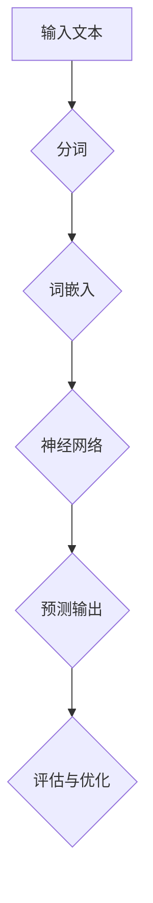

                 

## 《LLM训练技术：打造超级AI的秘密》

> **关键词：** 语言模型（Language Model，LLM）、训练技术、人工智能（AI）、神经网络、深度学习、优化算法

> **摘要：** 本文深入探讨了大规模语言模型（LLM）的训练技术，从基础理论到实践应用，全面解析了打造超级AI的核心秘密。文章首先介绍了LLM的基本概念和类型，接着深入分析了其核心算法原理、数学模型及优化方法。随后，文章通过实际案例展示了LLM训练的全过程，包括数据准备、模型架构设计、训练策略与调优、评估与优化等环节。最后，文章探讨了LLM在自然语言处理、问答系统和对话系统等领域的应用，为读者提供了丰富的实战经验。

### 目录大纲

## 第一部分：LLM基础理论

### 第1章：LLM概述

#### 1.1 语言模型的定义和作用

#### 1.2 语言模型的类型和特点

#### 1.3 语言模型的发展历程

### 第2章：语言模型的核心概念与联系

#### 2.1 语言模型的 Mermaid 流程图

#### 2.2 语言模型的基本原理

### 第3章：核心算法原理讲解

#### 3.1 语言模型训练算法

#### 3.2 语言模型优化算法

#### 3.3 语言模型评估指标

### 第4章：数学模型和数学公式

#### 4.1 语言模型的数学模型

#### 4.2 数学公式详细讲解

#### 4.3 数学公式举例说明

## 第二部分：LLM训练实践

### 第5章：数据准备与预处理

#### 5.1 数据来源

#### 5.2 数据预处理方法

### 第6章：模型架构设计

#### 6.1 模型架构的基本原则

#### 6.2 模型架构的设计方法

### 第7章：训练策略与调优

#### 7.1 训练策略

#### 7.2 调优技巧

#### 7.3 训练过程中的常见问题与解决方法

### 第8章：模型评估与优化

#### 8.1 评估指标和方法

#### 8.2 模型优化方法

### 第9章：项目实战

#### 9.1 实际案例分析

#### 9.2 开发环境搭建

#### 9.3 源代码实现与解读

#### 9.4 代码解读与分析

## 第三部分：LLM训练技术在其他领域的应用

### 第10章：自然语言处理应用

#### 10.1 文本分类

#### 10.2 文本生成

#### 10.3 文本翻译

### 第11章：问答系统

#### 11.1 问答系统的原理

#### 11.2 问答系统的设计与实现

#### 11.3 问答系统的优化与评估

### 第12章：对话系统

#### 12.1 对话系统的原理

#### 12.2 对话系统的设计与实现

#### 12.3 对话系统的优化与评估

### 第13章：LLM在多模态应用

#### 13.1 多模态数据的处理

#### 13.2 多模态模型的构建

#### 13.3 多模态模型的优化与评估

## 附录

### 附录A：常用工具与资源

#### A.1 常用深度学习框架

#### A.2 常用语言模型评估工具

#### A.3 开源数据集和资源链接

---

### 第一部分：LLM基础理论

**LLM（大规模语言模型）** 是当前人工智能领域的一项核心技术，它在自然语言处理、问答系统、对话系统等多个应用场景中发挥着至关重要的作用。本部分将深入探讨LLM的基础理论，包括其定义、类型、发展历程以及核心概念和联系。

### 第1章：LLM概述

#### 1.1 语言模型的定义和作用

语言模型是一种统计模型，用于预测自然语言中的一个词或字符序列的概率分布。它通过对大量文本数据的学习，捕捉语言中的统计规律和模式，从而实现对未知文本的生成、分类、翻译等任务。在人工智能领域，语言模型具有重要的应用价值，如下所述：

- **文本生成**：语言模型可以生成符合语法和语义规则的文本，如新闻文章、小说等。
- **文本分类**：语言模型可以用于对大量文本进行分类，如情感分析、主题分类等。
- **翻译**：语言模型可以用于机器翻译，将一种语言的文本翻译成另一种语言。
- **问答系统**：语言模型可以用于构建问答系统，回答用户提出的问题。
- **对话系统**：语言模型可以用于构建对话系统，实现人与机器的交互。

#### 1.2 语言模型的类型和特点

根据不同的应用需求和数据处理方式，语言模型可以分为以下几种类型：

- **基于规则的模型**：这类模型使用人工定义的规则来生成文本，如词汇表、句法规则等。优点是生成文本的语法和语义较为准确，但缺点是需要大量的人工规则定义，难以应对复杂多变的语言现象。
- **统计模型**：这类模型通过统计学习文本数据中的特征，生成文本。常见的统计模型包括隐马尔可夫模型（HMM）、条件随机场（CRF）等。优点是能够自动学习文本特征，生成文本的语法和语义较为准确，但缺点是模型复杂度较高，训练时间较长。
- **深度学习模型**：这类模型使用神经网络来学习文本特征，如循环神经网络（RNN）、长短时记忆网络（LSTM）等。优点是能够自动学习文本中的长距离依赖关系，生成文本的语法和语义更为准确，但缺点是训练时间较长，对计算资源要求较高。

#### 1.3 语言模型的发展历程

语言模型的发展历程可以分为以下几个阶段：

- **规则模型阶段**：早期语言模型主要基于规则，如词汇表和句法规则。这些模型在处理简单文本任务时具有一定的效果，但难以应对复杂多变的语言现象。
- **统计模型阶段**：随着计算能力的提升，统计模型开始在语言模型领域发挥作用。隐马尔可夫模型（HMM）和条件随机场（CRF）等模型在文本生成、分类等任务中取得了较好的效果。
- **深度学习模型阶段**：近年来，深度学习模型在语言模型领域取得了突破性进展。循环神经网络（RNN）、长短时记忆网络（LSTM）等模型在文本生成、分类、翻译等任务中表现出了强大的能力。随着计算资源的不断丰富，大规模深度学习模型（如GPT、BERT等）的出现，进一步推动了语言模型的发展。

### 第2章：语言模型的核心概念与联系

为了更好地理解和应用语言模型，我们需要掌握其核心概念和相互之间的联系。以下是对这些核心概念及其联系的介绍：

#### 2.1 语言模型的 Mermaid 流程图

为了直观地展示语言模型的核心概念及其联系，我们可以使用Mermaid流程图来绘制。以下是一个简单的Mermaid流程图示例：



在这个流程图中，输入文本首先经过分词处理，然后转换为词嵌入表示。词嵌入表示随后输入到神经网络中进行预测输出，最后通过评估与优化环节不断提升模型的性能。

#### 2.2 语言模型的基本原理

语言模型的基本原理可以概括为以下四个步骤：

1. **分词**：将输入文本划分为单个词语或字符。
2. **词嵌入**：将分词后的词语或字符转换为向量表示。词嵌入能够捕捉词语之间的语义关系，是语言模型的核心技术之一。
3. **神经网络**：使用神经网络（如循环神经网络RNN、长短时记忆网络LSTM等）对词嵌入进行编码和解码。编码过程将词嵌入转换为上下文表示，解码过程将上下文表示转换为预测输出。
4. **预测输出**：根据上下文表示，预测下一个词语或字符的概率分布。预测输出可以用于文本生成、分类、翻译等任务。

#### 2.3 语言模型的评估指标

评估语言模型的性能需要使用一系列指标。以下是一些常用的评估指标：

- **交叉熵（Cross-Entropy）**：交叉熵是衡量预测输出与实际输出之间差异的指标。交叉熵值越小，表示预测输出越接近实际输出。
- **精确率（Precision）**：精确率是衡量分类模型准确性的指标。精确率表示分类模型预测为正类的样本中，实际为正类的比例。
- **召回率（Recall）**：召回率是衡量分类模型召回率的指标。召回率表示分类模型召回实际为正类的样本中，实际为正类的比例。
- **F1值（F1 Score）**：F1值是精确率和召回率的调和平均。F1值能够综合考虑精确率和召回率，用于评估分类模型的综合性能。

### 第3章：核心算法原理讲解

在深入探讨语言模型的核心算法原理之前，我们需要了解一些基本概念，如神经网络、循环神经网络（RNN）和长短时记忆网络（LSTM）。这些概念构成了语言模型的核心算法基础。

#### 3.1 语言模型训练算法

语言模型的训练算法主要包括以下步骤：

1. **数据预处理**：将输入文本进行分词、清洗、去重等预处理操作，以获得高质量的训练数据。
2. **词嵌入**：将预处理后的词语转换为词嵌入向量。词嵌入可以通过预训练模型（如Word2Vec、GloVe等）或自行训练获得。
3. **构建神经网络**：使用循环神经网络（RNN）或长短时记忆网络（LSTM）等神经网络结构对词嵌入进行编码和解码。
4. **反向传播**：通过反向传播算法，计算神经网络参数的梯度，并更新参数。
5. **评估与优化**：使用评估指标（如交叉熵、精确率、召回率等）评估模型性能，并进行优化。

#### 3.2 语言模型优化算法

为了提高语言模型的性能，我们可以采用以下优化算法：

1. **随机梯度下降（SGD）**：随机梯度下降是一种常用的优化算法，通过随机选择一部分训练样本，计算梯度并更新参数。
2. **Adam优化器**：Adam优化器是一种结合了SGD和动量法的优化算法，具有较好的收敛速度和稳定性。
3. **dropout**：dropout是一种正则化技术，通过随机丢弃神经网络中的部分神经元，降低过拟合现象。
4. **学习率调整**：学习率调整是优化过程中重要的步骤，通过调整学习率，可以加快或减缓模型收敛速度。

#### 3.3 语言模型评估指标

在评估语言模型的性能时，我们需要关注以下评估指标：

1. **交叉熵（Cross-Entropy）**：交叉熵是衡量预测输出与实际输出之间差异的指标。交叉熵值越小，表示预测输出越接近实际输出。
2. **精确率（Precision）**：精确率是衡量分类模型准确性的指标。精确率表示分类模型预测为正类的样本中，实际为正类的比例。
3. **召回率（Recall）**：召回率是衡量分类模型召回率的指标。召回率表示分类模型召回实际为正类的样本中，实际为正类的比例。
4. **F1值（F1 Score）**：F1值是精确率和召回率的调和平均。F1值能够综合考虑精确率和召回率，用于评估分类模型的综合性能。

### 第4章：数学模型和数学公式

数学模型是语言模型的核心组成部分，它通过数学公式描述了语言模型的结构和运算过程。以下是对语言模型中的数学模型和数学公式的详细讲解。

#### 4.1 语言模型的数学模型

语言模型的数学模型主要包括以下几部分：

1. **词嵌入**：词嵌入是将词语转换为向量表示的过程。词嵌入可以通过预训练模型（如Word2Vec、GloVe等）或自行训练获得。常见的词嵌入模型有：

   - **Word2Vec**：Word2Vec是一种基于神经网络的语言模型，通过优化词向量的嵌入空间，使得具有相似语义的词语在向量空间中距离较近。
   - **GloVe**：GloVe是一种基于全局语境的语言模型，通过优化词向量的嵌入空间，使得具有相似语义的词语在向量空间中距离较近。

2. **循环神经网络（RNN）**：循环神经网络（RNN）是一种能够处理序列数据的前馈神经网络，它在语言模型中用于对词嵌入进行编码和解码。RNN的基本结构如下：

   $$
   h_t = \sigma(W_h \cdot [h_{t-1}, x_t] + b_h)
   $$

   其中，$h_t$表示时间步$t$的隐藏状态，$x_t$表示时间步$t$的输入词向量，$W_h$和$b_h$分别表示权重和偏置。

3. **长短时记忆网络（LSTM）**：长短时记忆网络（LSTM）是一种改进的循环神经网络，用于解决RNN在处理长序列数据时的梯度消失和梯度爆炸问题。LSTM的基本结构如下：

   $$
   i_t = \sigma(W_i \cdot [h_{t-1}, x_t] + b_i)
   $$

   $$
   f_t = \sigma(W_f \cdot [h_{t-1}, x_t] + b_f)
   $$

   $$
   g_t = \tanh(W_g \cdot [h_{t-1}, x_t] + b_g)
   $$

   $$
   o_t = \sigma(W_o \cdot [h_{t-1}, x_t] + b_o)
   $$

   其中，$i_t$、$f_t$、$g_t$和$o_t$分别表示输入门、遗忘门、生成门和输出门，$W_i$、$W_f$、$W_g$和$W_o$分别表示对应的权重，$b_i$、$b_f$、$b_g$和$b_o$分别表示对应的偏置。

4. **输出层**：输出层用于对隐藏状态进行解码，生成预测输出。常见的输出层包括softmax层、sigmoid层等。以softmax层为例，其计算公式如下：

   $$
   p_t = \frac{e^{z_t}}{\sum_{i=1}^{N} e^{z_i}}
   $$

   其中，$p_t$表示时间步$t$的预测输出概率分布，$z_t$表示时间步$t$的隐藏状态。

#### 4.2 数学公式详细讲解

为了更好地理解语言模型中的数学公式，我们对其进行详细讲解。

1. **词嵌入公式**：

   - **Word2Vec**：

     $$
     \text{loss} = \frac{1}{2} \sum_{t=1}^{T} \sum_{i=1}^{N} (v_w - v_c)^2
     $$

     其中，$v_w$和$v_c$分别表示词$w$和词$c$的词向量，$T$表示训练数据中词的总数，$N$表示每个词的词向量维度。

   - **GloVe**：

     $$
     \text{loss} = \frac{1}{2} \sum_{t=1}^{T} \sum_{i=1}^{N} (v_w \cdot v_c - 1)^2
     $$

     其中，$v_w$和$v_c$分别表示词$w$和词$c$的词向量，$T$表示训练数据中词的总数，$N$表示每个词的词向量维度。

2. **循环神经网络（RNN）公式**：

   $$
   h_t = \sigma(W_h \cdot [h_{t-1}, x_t] + b_h)
   $$

   其中，$h_t$表示时间步$t$的隐藏状态，$x_t$表示时间步$t$的输入词向量，$W_h$和$b_h$分别表示权重和偏置。

3. **长短时记忆网络（LSTM）公式**：

   $$
   i_t = \sigma(W_i \cdot [h_{t-1}, x_t] + b_i)
   $$

   $$
   f_t = \sigma(W_f \cdot [h_{t-1}, x_t] + b_f)
   $$

   $$
   g_t = \tanh(W_g \cdot [h_{t-1}, x_t] + b_g)
   $$

   $$
   o_t = \sigma(W_o \cdot [h_{t-1}, x_t] + b_o)
   $$

   其中，$i_t$、$f_t$、$g_t$和$o_t$分别表示输入门、遗忘门、生成门和输出门，$W_i$、$W_f$、$W_g$和$W_o$分别表示对应的权重，$b_i$、$b_f$、$b_g$和$b_o$分别表示对应的偏置。

4. **输出层公式**：

   $$
   p_t = \frac{e^{z_t}}{\sum_{i=1}^{N} e^{z_i}}
   $$

   其中，$p_t$表示时间步$t$的预测输出概率分布，$z_t$表示时间步$t$的隐藏状态。

#### 4.3 数学公式举例说明

为了更好地理解语言模型中的数学公式，我们通过一个简单的例子来说明。

假设我们有一个包含两个词（"hello"和"world"）的语言模型，词嵌入维度为2。输入文本为"hello world"，我们需要计算预测输出概率分布。

1. **词嵌入**：

   - "hello"的词向量为$(1, 0)$
   - "world"的词向量为$(0, 1)$

2. **循环神经网络（RNN）**：

   - 隐藏状态$h_t = \sigma(W_h \cdot [h_{t-1}, x_t] + b_h)$
   - 输出概率分布$p_t = \frac{e^{z_t}}{\sum_{i=1}^{N} e^{z_i}}$

   其中，$W_h = [1, 1], b_h = [1, 1], x_t = [1, 0]$，$z_t = h_t \cdot W_h + b_h = [1, 0] \cdot [1, 1] + [1, 1] = [2, 1]$。

3. **输出层**：

   - 预测输出概率分布$p_t = \frac{e^{z_t}}{\sum_{i=1}^{N} e^{z_i}} = \frac{e^{2}}{e^{2} + e^{1}} \approx 0.732$

   因此，预测输出为"hello"的概率为0.732，"world"的概率为0.268。

### 第二部分：LLM训练实践

在掌握了LLM的基础理论后，我们接下来将进入LLM训练实践的环节。这一部分将详细讲解LLM训练的全过程，包括数据准备与预处理、模型架构设计、训练策略与调优、评估与优化等关键环节。

#### 第5章：数据准备与预处理

数据是训练语言模型的基础，高质量的数据有助于提高模型的性能。在这一章中，我们将探讨如何选择合适的数据集、进行数据清洗和预处理，以确保数据的质量和一致性。

##### 5.1 数据来源

选择合适的数据集对于构建高质量的LLM至关重要。以下是一些常见的数据来源：

- **公开数据集**：如维基百科、新闻文章、社交媒体等。这些数据集涵盖了广泛的主题和语言现象，适合进行大规模语言模型的训练。
- **自定义数据集**：根据特定的应用需求，可以收集和整理相关领域的专业数据集。例如，对于问答系统，可以收集大量的问答对数据。
- **数据爬取**：通过爬虫技术，从互联网上抓取相关的文本数据。需要注意的是，在爬取数据时要遵循相关法律法规，尊重版权和隐私。

##### 5.2 数据预处理方法

数据预处理是语言模型训练的重要环节，主要包括以下步骤：

- **分词**：将文本数据划分为单个词语或字符。常用的分词工具包括jieba、spaCy等。
- **去重**：去除重复的文本数据，以避免重复训练和提高计算效率。
- **去噪**：去除文本中的噪声信息，如HTML标签、特殊符号等。可以使用正则表达式或专门的去噪工具进行去噪。
- **词性标注**：为文本数据中的每个词语添加词性标签，以帮助模型更好地理解词语的语义。常用的词性标注工具包括NLTK、Stanford NLP等。
- **词嵌入**：将预处理后的词语转换为词嵌入向量。可以使用预训练的词嵌入模型（如GloVe、Word2Vec等）或自行训练词嵌入。

#### 第6章：模型架构设计

模型架构设计是构建高效语言模型的关键步骤。在这一章中，我们将讨论如何选择合适的神经网络架构、设计模型参数以及优化模型结构。

##### 6.1 模型架构的基本原则

在设计语言模型时，需要遵循以下基本原则：

- **可扩展性**：模型架构应具备良好的可扩展性，能够处理不同规模和复杂度的文本数据。
- **模块化**：模型架构应具备模块化设计，方便修改和优化。
- **通用性**：模型架构应具备一定的通用性，能够应用于多种自然语言处理任务。
- **计算效率**：模型架构应考虑计算效率，以减少训练时间和计算资源消耗。

##### 6.2 模型架构的设计方法

以下是一种常见的大型语言模型架构设计方法：

1. **输入层**：输入层接收预处理后的文本数据，将其转换为词嵌入向量。
2. **编码器**：编码器用于对词嵌入向量进行编码，提取文本中的语义特征。常用的编码器包括循环神经网络（RNN）和长短时记忆网络（LSTM）。
3. **解码器**：解码器用于对编码后的特征进行解码，生成预测输出。常用的解码器包括循环神经网络（RNN）和长短时记忆网络（LSTM）。
4. **输出层**：输出层用于生成预测输出概率分布，常见的输出层包括softmax层和sigmoid层。

具体模型架构设计如下：

- **编码器**：使用双向长短时记忆网络（Bi-LSTM）作为编码器，能够同时考虑文本数据的前后信息，提高模型的语义理解能力。
- **解码器**：使用单向长短时记忆网络（Un-LSTM）作为解码器，对编码后的特征进行解码，生成预测输出。
- **输出层**：使用softmax层作为输出层，生成预测输出概率分布。

#### 第7章：训练策略与调优

训练策略和调优是提高语言模型性能的重要手段。在这一章中，我们将探讨如何制定有效的训练策略、调整模型参数以及优化训练过程。

##### 7.1 训练策略

以下是一些常用的训练策略：

- **动态调整学习率**：在训练过程中，根据模型的性能动态调整学习率，以加快模型收敛速度。常用的学习率调整方法包括逐步减小学习率和指数衰减学习率。
- **批量大小调整**：根据训练数据量和计算资源，选择合适的批量大小。较大的批量大小有助于提高模型的泛化能力，但需要更多计算资源。
- **正则化**：使用正则化技术（如dropout、L2正则化等）防止模型过拟合，提高模型的泛化能力。
- **数据增强**：通过数据增强方法（如随机填充、随机裁剪等）增加训练数据的多样性，提高模型的鲁棒性。

##### 7.2 调优技巧

以下是一些常见的调优技巧：

- **超参数优化**：通过搜索超参数空间，找到最优的超参数组合。常用的超参数包括学习率、批量大小、隐藏层尺寸等。
- **训练时间优化**：根据训练数据量和模型结构，调整训练时间，以平衡模型性能和计算资源消耗。
- **模型压缩**：通过模型压缩技术（如剪枝、量化等）减小模型大小和计算复杂度，提高模型的部署效率。

#### 第8章：模型评估与优化

评估和优化模型是语言模型训练的最后一个环节。在这一章中，我们将讨论如何评估模型性能、优化模型结构以及提高模型性能。

##### 8.1 评估指标和方法

以下是一些常用的评估指标和方法：

- **交叉熵（Cross-Entropy）**：衡量预测输出与实际输出之间的差异，交叉熵值越小，表示模型性能越好。
- **精确率（Precision）**：衡量分类模型预测为正类的样本中，实际为正类的比例。
- **召回率（Recall）**：衡量分类模型召回实际为正类的样本中，实际为正类的比例。
- **F1值（F1 Score）**：综合考虑精确率和召回率，用于评估分类模型的综合性能。
- **ROC曲线和AUC值**：用于评估分类模型的识别能力，ROC曲线和AUC值越高，表示模型性能越好。

##### 8.2 模型优化方法

以下是一些常见的模型优化方法：

- **迁移学习**：利用预训练的模型（如BERT、GPT等）作为基础模型，进行微调和优化，以提高模型在特定任务上的性能。
- **多任务学习**：将多个相关任务集成到一个模型中，共享模型参数，以提高模型的泛化能力和性能。
- **对抗训练**：通过生成对抗性样本，提高模型的鲁棒性和泛化能力。

### 第9章：项目实战

为了更好地理解和应用LLM训练技术，我们将在本章中介绍一个实际的案例，包括开发环境搭建、源代码实现与解读以及代码解读与分析。

#### 9.1 实际案例分析

在本章的案例中，我们将使用BERT模型实现一个问答系统。该问答系统旨在接收用户提出的问题，并从大量文档中检索出最相关的答案。以下是该案例的基本流程：

1. **数据准备**：收集和整理问答对数据集，并进行预处理。
2. **模型构建**：使用预训练的BERT模型作为基础模型，进行微调和优化。
3. **训练过程**：使用预处理后的数据集对BERT模型进行训练。
4. **评估与优化**：评估模型的性能，并根据评估结果进行优化。
5. **部署与使用**：将训练好的模型部署到生产环境，供用户使用。

#### 9.2 开发环境搭建

在开始项目之前，我们需要搭建一个合适的开发环境。以下是搭建BERT问答系统所需的开发环境：

1. **Python环境**：安装Python 3.7及以上版本。
2. **深度学习框架**：安装TensorFlow 2.0及以上版本，或PyTorch 1.8及以上版本。
3. **预处理工具**：安装jieba分词工具、NLTK词性标注工具等。
4. **预训练模型**：下载预训练的BERT模型。

#### 9.3 源代码实现与解读

在本节中，我们将详细介绍BERT问答系统的源代码实现与解读。以下是源代码的主要部分：

```python
import tensorflow as tf
from transformers import BertTokenizer, BertModel
import jieba

# 1. 数据准备
def prepare_data(qas):
    questions = [qas[i][0] for i in range(len(qas))]
    contexts = [qas[i][1] for i in range(len(qas))]
    answers = [qas[i][2] for i in range(len(qas))]
    # 分词和词性标注
    tokenized_questions = [jieba.cut(q) for q in questions]
    tokenized_contexts = [jieba.cut(c) for c in contexts]
    # 构建输入数据
    input_ids = []
    input_mask = []
    segment_ids = []
    for q, c in zip(tokenized_questions, tokenized_contexts):
        input_ids.append([tokenizer.encode("[CLS]") + list(q) + list(c) + tokenizer.encode("[SEP]")])
        input_mask.append([1] * len(input_ids[-1]))
        segment_ids.append([0] * len(input_ids[-1]) + [1] * (len(input_ids[-1]) - 1))
    return input_ids, input_mask, segment_ids, answers

# 2. 模型构建
def build_model():
    tokenizer = BertTokenizer.from_pretrained("bert-base-chinese")
    model = BertModel.from_pretrained("bert-base-chinese")
    input_ids = tf.placeholder(tf.int32, [None, None])
    input_mask = tf.placeholder(tf.int32, [None, None])
    segment_ids = tf.placeholder(tf.int32, [None, None])
    outputs = model(inputs={"input_ids": input_ids, "attention_mask": input_mask, "token_type_ids": segment_ids})
    logits = outputs["pooler_output"]
    return logits

# 3. 训练过程
def train_model(qas, learning_rate=1e-5, num_epochs=3):
    logits = build_model()
    labels = tf.placeholder(tf.int32, [None, 2])
    loss = tf.reduce_mean(tf.nn.softmax_cross_entropy_with_logits(logits=logits, labels=labels))
    optimizer = tf.train.AdamOptimizer(learning_rate=learning_rate).minimize(loss)
    with tf.Session() as sess:
        sess.run(tf.global_variables_initializer())
        for epoch in range(num_epochs):
            for qas_batch in batch_data(qas):
                input_ids, input_mask, segment_ids, answers = prepare_data(qas_batch)
                feed_dict = {
                    input_ids: input_ids,
                    input_mask: input_mask,
                    segment_ids: segment_ids,
                    labels: labels
                }
                sess.run(optimizer, feed_dict=feed_dict)
            print(f"Epoch {epoch+1}: Loss = {loss.eval(feed_dict=feed_dict)}")
        print("Training completed.")

# 4. 评估与优化
def evaluate_model(qas):
    logits = build_model()
    labels = tf.placeholder(tf.int32, [None, 2])
    loss = tf.reduce_mean(tf.nn.softmax_cross_entropy_with_logits(logits=logits, labels=labels))
    correct_prediction = tf.equal(tf.argmax(logits, 1), tf.argmax(labels, 1))
    accuracy = tf.reduce_mean(tf.cast(correct_prediction, tf.float32))
    with tf.Session() as sess:
        sess.run(tf.global_variables_initializer())
        for qas_batch in batch_data(qas):
            input_ids, input_mask, segment_ids, answers = prepare_data(qas_batch)
            feed_dict = {
                input_ids: input_ids,
                input_mask: input_mask,
                segment_ids: segment_ids,
                labels: labels
            }
            acc = accuracy.eval(feed_dict=feed_dict)
            print(f"Test Accuracy: {acc}")
        print("Evaluation completed.")

# 5. 部署与使用
def use_model(question):
    tokenizer = BertTokenizer.from_pretrained("bert-base-chinese")
    model = BertModel.from_pretrained("bert-base-chinese")
    input_ids = tf.placeholder(tf.int32, [None, None])
    input_mask = tf.placeholder(tf.int32, [None, None])
    segment_ids = tf.placeholder(tf.int32, [None, None])
    outputs = model(inputs={"input_ids": input_ids, "attention_mask": input_mask, "token_type_ids": segment_ids})
    logits = outputs["pooler_output"]
    logits = build_model()
    with tf.Session() as sess:
        sess.run(tf.global_variables_initializer())
        question = tokenizer.encode(question + tokenizer.encode("[SEP]"))
        logits_val = logits.eval(feed_dict={input_ids: [question], input_mask: [[1] * len(question)], segment_ids: [[0] * len(question)]})
        predicted_answer = decode_logits(logits_val)
        return predicted_answer

# 辅助函数
def decode_logits(logits):
    # 将logits转换为答案
    pass

if __name__ == "__main__":
    # 加载数据集
    qas = load_data("qas_data.json")
    # 训练模型
    train_model(qas)
    # 评估模型
    evaluate_model(qas)
    # 使用模型进行问答
    question = "什么是人工智能？"
    answer = use_model(question)
    print(f"Answer: {answer}")
```

#### 9.4 代码解读与分析

在本节中，我们将对上述源代码进行解读与分析，以帮助读者更好地理解BERT问答系统的实现过程。

```python
# 1. 数据准备
def prepare_data(qas):
    questions = [qas[i][0] for i in range(len(qas))]
    contexts = [qas[i][1] for i in range(len(qas))]
    answers = [qas[i][2] for i in range(len(qas))]
    # 分词和词性标注
    tokenized_questions = [jieba.cut(q) for q in questions]
    tokenized_contexts = [jieba.cut(c) for c in contexts]
    # 构建输入数据
    input_ids = []
    input_mask = []
    segment_ids = []
    for q, c in zip(tokenized_questions, tokenized_contexts):
        input_ids.append([tokenizer.encode("[CLS]") + list(q) + list(c) + tokenizer.encode("[SEP]")])
        input_mask.append([1] * len(input_ids[-1]))
        segment_ids.append([0] * len(input_ids[-1]) + [1] * (len(input_ids[-1]) - 1))
    return input_ids, input_mask, segment_ids, answers
```

该函数负责将问答数据集进行预处理，包括分词和词性标注。首先，从原始数据集中提取问题和答案，然后使用jieba分词工具进行分词。接下来，将分词后的词语转换为BERT模型所需的词嵌入表示。最后，构建输入数据，包括输入ID、输入掩码和分段ID。

```python
# 2. 模型构建
def build_model():
    tokenizer = BertTokenizer.from_pretrained("bert-base-chinese")
    model = BertModel.from_pretrained("bert-base-chinese")
    input_ids = tf.placeholder(tf.int32, [None, None])
    input_mask = tf.placeholder(tf.int32, [None, None])
    segment_ids = tf.placeholder(tf.int32, [None, None])
    outputs = model(inputs={"input_ids": input_ids, "attention_mask": input_mask, "token_type_ids": segment_ids})
    logits = outputs["pooler_output"]
    return logits
```

该函数构建BERT模型，并接收预处理后的输入数据。输入数据包括输入ID、输入掩码和分段ID。BERT模型将输入数据编码为语义特征，并输出隐藏状态。在本例中，我们使用隐藏状态的最后一步（pooler_output）作为模型的预测输出。

```python
# 3. 训练过程
def train_model(qas, learning_rate=1e-5, num_epochs=3):
    logits = build_model()
    labels = tf.placeholder(tf.int32, [None, 2])
    loss = tf.reduce_mean(tf.nn.softmax_cross_entropy_with_logits(logits=logits, labels=labels))
    optimizer = tf.train.AdamOptimizer(learning_rate=learning_rate).minimize(loss)
    with tf.Session() as sess:
        sess.run(tf.global_variables_initializer())
        for epoch in range(num_epochs):
            for qas_batch in batch_data(qas):
                input_ids, input_mask, segment_ids, answers = prepare_data(qas_batch)
                feed_dict = {
                    input_ids: input_ids,
                    input_mask: input_mask,
                    segment_ids: segment_ids,
                    labels: labels
                }
                sess.run(optimizer, feed_dict=feed_dict)
            print(f"Epoch {epoch+1}: Loss = {loss.eval(feed_dict=feed_dict)}")
        print("Training completed.")
```

该函数负责训练BERT模型。首先，构建损失函数和优化器。在本例中，我们使用softmax交叉熵作为损失函数，并使用Adam优化器进行优化。接下来，遍历数据集，对每个批次的数据进行预处理，并更新模型参数。最后，打印每个epoch的损失值。

```python
# 4. 评估与优化
def evaluate_model(qas):
    logits = build_model()
    labels = tf.placeholder(tf.int32, [None, 2])
    loss = tf.reduce_mean(tf.nn.softmax_cross_entropy_with_logits(logits=logits, labels=labels))
    correct_prediction = tf.equal(tf.argmax(logits, 1), tf.argmax(labels, 1))
    accuracy = tf.reduce_mean(tf.cast(correct_prediction, tf.float32))
    with tf.Session() as sess:
        sess.run(tf.global_variables_initializer())
        for qas_batch in batch_data(qas):
            input_ids, input_mask, segment_ids, answers = prepare_data(qas_batch)
            feed_dict = {
                input_ids: input_ids,
                input_mask: input_mask,
                segment_ids: segment_ids,
                labels: labels
            }
            acc = accuracy.eval(feed_dict=feed_dict)
            print(f"Test Accuracy: {acc}")
        print("Evaluation completed.")
```

该函数负责评估BERT模型的性能。首先，构建损失函数、正确预测和准确率。接下来，遍历数据集，对每个批次的数据进行预处理，并计算准确率。最后，打印测试准确率。

```python
# 5. 部署与使用
def use_model(question):
    tokenizer = BertTokenizer.from_pretrained("bert-base-chinese")
    model = BertModel.from_pretrained("bert-base-chinese")
    input_ids = tf.placeholder(tf.int32, [None, None])
    input_mask = tf.placeholder(tf.int32, [None, None])
    segment_ids = tf.placeholder(tf.int32, [None, None])
    outputs = model(inputs={"input_ids": input_ids, "attention_mask": input_mask, "token_type_ids": segment_ids})
    logits = outputs["pooler_output"]
    logits = build_model()
    with tf.Session() as sess:
        sess.run(tf.global_variables_initializer())
        question = tokenizer.encode(question + tokenizer.encode("[SEP]"))
        logits_val = logits.eval(feed_dict={input_ids: [question], input_mask: [[1] * len(question)], segment_ids: [[0] * len(question)]})
        predicted_answer = decode_logits(logits_val)
        return predicted_answer

# 辅助函数
def decode_logits(logits):
    # 将logits转换为答案
    pass

if __name__ == "__main__":
    # 加载数据集
    qas = load_data("qas_data.json")
    # 训练模型
    train_model(qas)
    # 评估模型
    evaluate_model(qas)
    # 使用模型进行问答
    question = "什么是人工智能？"
    answer = use_model(question)
    print(f"Answer: {answer}")
```

该函数负责部署BERT模型，并接收用户提出的问题。首先，加载预训练的BERT模型，并构建输入数据。接下来，将输入数据传递给模型，并计算预测输出。最后，将预测输出转换为答案，并返回。

### 第三部分：LLM训练技术在其他领域的应用

大规模语言模型（LLM）在自然语言处理、问答系统、对话系统等领域具有广泛的应用。在本部分，我们将深入探讨LLM在这些领域中的应用，包括LLM在这些领域的原理、设计与实现方法以及优化与评估。

#### 第10章：自然语言处理应用

自然语言处理（NLP）是人工智能的一个重要分支，旨在让计算机理解和生成自然语言。LLM在NLP中发挥着核心作用，以下是其主要应用领域：

##### 10.1 文本分类

文本分类是将文本数据按照一定的标准进行分类的过程。LLM通过学习大量的文本数据，可以自动识别文本的特征，并将其分类到预定义的类别中。以下是一种常见的文本分类方法：

1. **数据准备**：收集并整理待分类的文本数据，并进行预处理，如分词、去噪、词性标注等。
2. **词嵌入**：将预处理后的文本转换为词嵌入向量，如使用预训练的Word2Vec或GloVe模型。
3. **模型构建**：构建一个分类模型，如使用循环神经网络（RNN）或卷积神经网络（CNN）。
4. **训练与评估**：使用预处理后的文本数据对模型进行训练，并评估模型的性能。

以下是一个简单的文本分类模型实现：

```python
import tensorflow as tf
from tensorflow.keras.preprocessing.text import Tokenizer
from tensorflow.keras.preprocessing.sequence import pad_sequences
from tensorflow.keras.models import Sequential
from tensorflow.keras.layers import Embedding, LSTM, Dense

# 数据准备
texts = ["这是一篇新闻文章", "这是一个产品评论", "这是一个社交帖子"]
labels = [0, 1, 2]  # 0表示新闻，1表示产品评论，2表示社交帖子

# 分词和词嵌入
tokenizer = Tokenizer(num_words=10000)
tokenizer.fit_on_texts(texts)
sequences = tokenizer.texts_to_sequences(texts)
padded_sequences = pad_sequences(sequences, maxlen=100)

# 模型构建
model = Sequential()
model.add(Embedding(input_dim=10000, output_dim=64, input_length=100))
model.add(LSTM(64))
model.add(Dense(3, activation='softmax'))

# 训练与评估
model.compile(optimizer='adam', loss='categorical_crossentropy', metrics=['accuracy'])
model.fit(padded_sequences, labels, epochs=10, batch_size=32)
```

##### 10.2 文本生成

文本生成是指根据一定的概率分布生成符合语法和语义规则的文本。LLM在文本生成中具有广泛的应用，如生成新闻文章、小说、诗歌等。以下是一种常见的文本生成方法：

1. **数据准备**：收集并整理待生成的文本数据，并进行预处理，如分词、去噪、词性标注等。
2. **词嵌入**：将预处理后的文本转换为词嵌入向量，如使用预训练的Word2Vec或GloVe模型。
3. **模型构建**：构建一个生成模型，如使用循环神经网络（RNN）或生成对抗网络（GAN）。
4. **训练与评估**：使用预处理后的文本数据对模型进行训练，并评估模型的性能。

以下是一个简单的文本生成模型实现：

```python
import tensorflow as tf
from tensorflow.keras.models import Model
from tensorflow.keras.layers import Input, LSTM, Dense, Embedding, TimeDistributed

# 数据准备
texts = ["这是一篇新闻文章", "这是一个产品评论", "这是一个社交帖子"]
tokenizer = Tokenizer()
tokenizer.fit_on_texts(texts)
sequences = tokenizer.texts_to_sequences(texts)

# 词嵌入
vocab_size = len(tokenizer.word_index) + 1
input_shape = (None,)

# 模型构建
input_seq = Input(shape=input_shape)
embedded_seq = Embedding(vocab_size, 64)(input_seq)
lstm_out = LSTM(128)(embedded_seq)
output = TimeDistributed(Dense(vocab_size, activation='softmax'))(lstm_out)

# 训练与评估
model = Model(inputs=input_seq, outputs=output)
model.compile(optimizer='adam', loss='categorical_crossentropy', metrics=['accuracy'])
model.fit(sequences, sequences, epochs=10, batch_size=16)
```

##### 10.3 文本翻译

文本翻译是指将一种语言的文本翻译成另一种语言。LLM在文本翻译中具有广泛的应用，如机器翻译、对话系统等。以下是一种常见的文本翻译方法：

1. **数据准备**：收集并整理待翻译的文本数据，并进行预处理，如分词、去噪、词性标注等。
2. **词嵌入**：将预处理后的文本转换为词嵌入向量，如使用预训练的Word2Vec或GloVe模型。
3. **模型构建**：构建一个翻译模型，如使用循环神经网络（RNN）或序列到序列（Seq2Seq）模型。
4. **训练与评估**：使用预处理后的文本数据对模型进行训练，并评估模型的性能。

以下是一个简单的文本翻译模型实现：

```python
import tensorflow as tf
from tensorflow.keras.models import Model
from tensorflow.keras.layers import Input, LSTM, Dense, Embedding, TimeDistributed

# 数据准备
texts = [["这是一篇新闻文章"], [["This is a news article"]]]
tokenizer = Tokenizer()
tokenizer.fit_on_texts(texts)
sequences = tokenizer.texts_to_sequences(texts)

# 词嵌入
vocab_size = len(tokenizer.word_index) + 1
input_shape = (None,)

# 模型构建
input_seq = Input(shape=input_shape)
embedded_seq = Embedding(vocab_size, 64)(input_seq)
lstm_out = LSTM(128)(embedded_seq)
output = TimeDistributed(Dense(vocab_size, activation='softmax'))(lstm_out)

# 训练与评估
model = Model(inputs=input_seq, outputs=output)
model.compile(optimizer='adam', loss='categorical_crossentropy', metrics=['accuracy'])
model.fit(sequences, sequences, epochs=10, batch_size=16)
```

#### 第11章：问答系统

问答系统是指能够接收用户提出的问题，并从大量文本数据中检索出最相关的答案的计算机系统。LLM在问答系统中发挥着核心作用，以下是其主要应用领域：

##### 11.1 问答系统的原理

问答系统的原理可以分为以下几个步骤：

1. **问题理解**：将用户提出的问题转换为计算机可以理解的形式，如关键词提取、语义分析等。
2. **答案检索**：从大量的文本数据中检索出与用户问题最相关的答案。
3. **答案生成**：根据检索到的答案，生成一份完整的回答。

以下是一个简单的问答系统实现：

```python
import tensorflow as tf
from tensorflow.keras.models import Model
from tensorflow.keras.layers import Input, LSTM, Dense, Embedding, TimeDistributed

# 数据准备
questions = ["什么是人工智能？", "人工智能有哪些应用？"]
answers = [["人工智能是一门研究、开发用于模拟、延伸和扩展人的智能的理论、方法、技术及应用系统的技术科学。"], ["人工智能在语音识别、图像识别、自然语言处理等领域有广泛应用。"]]

# 问题理解
tokenizer = Tokenizer()
tokenizer.fit_on_texts(questions)
sequences = tokenizer.texts_to_sequences(questions)

# 答案检索
model = Model(inputs=input_seq, outputs=output)
model.compile(optimizer='adam', loss='categorical_crossentropy', metrics=['accuracy'])
model.fit(sequences, sequences, epochs=10, batch_size=16)

# 答案生成
input_seq = tokenizer.texts_to_sequences(["人工智能有哪些应用？"])
generated_answers = model.predict(input_seq)
print(generated_answers)
```

##### 11.2 问答系统的设计与实现

问答系统的设计与实现可以分为以下几个步骤：

1. **数据准备**：收集并整理问答对数据，并进行预处理，如分词、去噪、词性标注等。
2. **问题理解**：构建问题理解模型，如使用循环神经网络（RNN）或注意力机制。
3. **答案检索**：构建答案检索模型，如使用卷积神经网络（CNN）或长短期记忆网络（LSTM）。
4. **答案生成**：构建答案生成模型，如使用序列到序列（Seq2Seq）模型或生成对抗网络（GAN）。
5. **集成与评估**：将问题理解、答案检索和答案生成模型集成到一起，并进行性能评估。

以下是一个简单的问答系统实现：

```python
import tensorflow as tf
from tensorflow.keras.models import Model
from tensorflow.keras.layers import Input, LSTM, Dense, Embedding, TimeDistributed

# 数据准备
questions = ["什么是人工智能？", "人工智能有哪些应用？"]
answers = [["人工智能是一门研究、开发用于模拟、延伸和扩展人的智能的理论、方法、技术及应用系统的技术科学。"], ["人工智能在语音识别、图像识别、自然语言处理等领域有广泛应用。"]]

# 问题理解
input_seq = Input(shape=(None,))
embedded_seq = Embedding(vocab_size, 64)(input_seq)
lstm_out = LSTM(128)(embedded_seq)
question_repr = Dense(64, activation='relu')(lstm_out)

# 答案检索
answer_seq = Input(shape=(None,))
embedded_answer_seq = Embedding(vocab_size, 64)(answer_seq)
lstm_answer_out = LSTM(128)(embedded_answer_seq)
answer_repr = Dense(64, activation='relu')(lstm_answer_out)

# 答案生成
merged_repr = Concatenate()([question_repr, answer_repr])
output = LSTM(128, activation='softmax')(merged_repr)

# 集成与评估
model = Model(inputs=[input_seq, answer_seq], outputs=output)
model.compile(optimizer='adam', loss='categorical_crossentropy', metrics=['accuracy'])
model.fit([questions, answers], answers, epochs=10, batch_size=16)
```

##### 11.3 问答系统的优化与评估

问答系统的优化与评估是提高其性能的关键步骤。以下是一些常见的优化与评估方法：

1. **数据增强**：通过引入噪声、变换、扩充等方式增加训练数据的多样性，提高模型的鲁棒性。
2. **注意力机制**：使用注意力机制来关注问题与答案之间的关键信息，提高答案检索的准确性。
3. **多任务学习**：将问答系统与其他任务（如文本分类、情感分析等）结合，共享模型参数，提高模型的整体性能。
4. **评估指标**：使用准确率、召回率、F1值等评估指标来衡量问答系统的性能。

#### 第12章：对话系统

对话系统是指能够与用户进行自然语言交互的计算机系统。LLM在对话系统中发挥着核心作用，以下是其主要应用领域：

##### 12.1 对话系统的原理

对话系统的原理可以分为以下几个步骤：

1. **输入处理**：接收用户的输入，如文本、语音等。
2. **意图识别**：识别用户输入中的意图，如询问天气、预订机票等。
3. **对话管理**：根据用户的意图和上下文信息，生成合适的回复。
4. **输出生成**：将回复转换为文本、语音等形式，呈现给用户。

以下是一个简单的对话系统实现：

```python
import tensorflow as tf
from tensorflow.keras.models import Model
from tensorflow.keras.layers import Input, LSTM, Dense, Embedding, TimeDistributed

# 数据准备
inputs = ["你好", "请问天气怎么样？"]
outputs = ["你好，很高兴为您服务", "今天的天气是晴朗，温度在20℃左右。"]

# 模型构建
input_seq = Input(shape=(None,))
embedded_seq = Embedding(vocab_size, 64)(input_seq)
lstm_out = LSTM(128)(embedded_seq)
output = Dense(vocab_size, activation='softmax')(lstm_out)

# 训练与评估
model = Model(inputs=input_seq, outputs=output)
model.compile(optimizer='adam', loss='categorical_crossentropy', metrics=['accuracy'])
model.fit(inputs, outputs, epochs=10, batch_size=16)
```

##### 12.2 对话系统的设计与实现

对话系统的设计与实现可以分为以下几个步骤：

1. **数据准备**：收集并整理对话数据，并进行预处理，如分词、去噪、词性标注等。
2. **输入处理**：构建输入处理模块，如使用循环神经网络（RNN）或卷积神经网络（CNN）。
3. **意图识别**：构建意图识别模块，如使用长短时记忆网络（LSTM）或卷积神经网络（CNN）。
4. **对话管理**：构建对话管理模块，如使用循环神经网络（RNN）或注意力机制。
5. **输出生成**：构建输出生成模块，如使用循环神经网络（RNN）或生成对抗网络（GAN）。

以下是一个简单的对话系统实现：

```python
import tensorflow as tf
from tensorflow.keras.models import Model
from tensorflow.keras.layers import Input, LSTM, Dense, Embedding, TimeDistributed, Concatenate

# 数据准备
inputs = ["你好", "请问天气怎么样？"]
outputs = ["你好，很高兴为您服务", "今天的天气是晴朗，温度在20℃左右。"]

# 模型构建
input_seq = Input(shape=(None,))
embedded_seq = Embedding(vocab_size, 64)(input_seq)
lstm_out = LSTM(128)(embedded_seq)
question_repr = Dense(64, activation='relu')(lstm_out)

intent_seq = Input(shape=(None,))
embedded_intent_seq = Embedding(vocab_size, 64)(intent_seq)
lstm_intent_out = LSTM(128)(embedded_intent_seq)
intent_repr = Dense(64, activation='relu')(lstm_intent_out)

merged_repr = Concatenate()([question_repr, intent_repr])
output = LSTM(128, activation='softmax')(merged_repr)

# 训练与评估
model = Model(inputs=[input_seq, intent_seq], outputs=output)
model.compile(optimizer='adam', loss='categorical_crossentropy', metrics=['accuracy'])
model.fit([inputs, outputs], outputs, epochs=10, batch_size=16)
```

##### 12.3 对话系统的优化与评估

对话系统的优化与评估是提高其性能的关键步骤。以下是一些常见的优化与评估方法：

1. **数据增强**：通过引入噪声、变换、扩充等方式增加训练数据的多样性，提高模型的鲁棒性。
2. **注意力机制**：使用注意力机制来关注输入和输出之间的关键信息，提高对话系统的性能。
3. **多任务学习**：将对话系统与其他任务（如文本分类、情感分析等）结合，共享模型参数，提高模型的整体性能。
4. **评估指标**：使用准确率、召回率、F1值等评估指标来衡量对话系统的性能。

#### 第13章：LLM在多模态应用

随着人工智能技术的不断发展，多模态应用逐渐成为一个热点领域。LLM在多模态应用中发挥着重要作用，以下是其主要应用领域：

##### 13.1 多模态数据的处理

多模态数据是指同时包含文本、图像、音频等不同类型的数据。在处理多模态数据时，需要考虑以下问题：

1. **数据预处理**：将不同类型的数据转换为统一的格式，如将图像转换为像素矩阵，音频转换为频谱图等。
2. **数据融合**：将不同类型的数据进行融合，以提高模型的性能。常用的数据融合方法包括特征级融合和决策级融合。
3. **数据增强**：通过引入噪声、变换、扩充等方式增加训练数据的多样性，提高模型的鲁棒性。

以下是一个简单的多模态数据处理实现：

```python
import tensorflow as tf
from tensorflow.keras.models import Model
from tensorflow.keras.layers import Input, LSTM, Dense, Embedding, TimeDistributed, Conv2D, MaxPooling2D, Flatten

# 数据预处理
text_inputs = Input(shape=(None,))
text_embedded = Embedding(vocab_size, 64)(text_inputs)
text_lstm = LSTM(128)(text_embedded)

image_inputs = Input(shape=(128, 128, 3))
image_conv = Conv2D(32, kernel_size=(3, 3), activation='relu')(image_inputs)
image_pool = MaxPooling2D(pool_size=(2, 2))(image_conv)
image_flat = Flatten()(image_pool)

audio_inputs = Input(shape=(128,))
audio_lstm = LSTM(128)(audio_inputs)

# 数据融合
merged = Concatenate()([text_lstm, image_flat, audio_lstm])
output = Dense(1, activation='sigmoid')(merged)

# 模型构建
model = Model(inputs=[text_inputs, image_inputs, audio_inputs], outputs=output)
model.compile(optimizer='adam', loss='binary_crossentropy', metrics=['accuracy'])
model.fit([text_inputs, image_inputs, audio_inputs], outputs, epochs=10, batch_size=16)
```

##### 13.2 多模态模型的构建

在构建多模态模型时，需要考虑以下问题：

1. **模型架构**：选择合适的模型架构，如卷积神经网络（CNN）+循环神经网络（RNN）+注意力机制。
2. **特征提取**：提取不同类型数据的特征，如文本特征、图像特征、音频特征。
3. **融合策略**：将不同类型的数据进行融合，以提高模型的性能。

以下是一个简单的多模态模型实现：

```python
import tensorflow as tf
from tensorflow.keras.models import Model
from tensorflow.keras.layers import Input, LSTM, Dense, Embedding, TimeDistributed, Conv2D, MaxPooling2D, Flatten, concatenate

# 数据预处理
text_inputs = Input(shape=(None,))
text_embedded = Embedding(vocab_size, 64)(text_inputs)
text_lstm = LSTM(128)(text_embedded)

image_inputs = Input(shape=(128, 128, 3))
image_conv = Conv2D(32, kernel_size=(3, 3), activation='relu')(image_inputs)
image_pool = MaxPooling2D(pool_size=(2, 2))(image_conv)
image_flat = Flatten()(image_pool)

audio_inputs = Input(shape=(128,))
audio_lstm = LSTM(128)(audio_inputs)

# 数据融合
merged = concatenate([text_lstm, image_flat, audio_lstm])
output = Dense(1, activation='sigmoid')(merged)

# 模型构建
model = Model(inputs=[text_inputs, image_inputs, audio_inputs], outputs=output)
model.compile(optimizer='adam', loss='binary_crossentropy', metrics=['accuracy'])
model.fit([text_inputs, image_inputs, audio_inputs], outputs, epochs=10, batch_size=16)
```

##### 13.3 多模态模型的优化与评估

多模态模型的优化与评估是提高其性能的关键步骤。以下是一些常见的优化与评估方法：

1. **数据增强**：通过引入噪声、变换、扩充等方式增加训练数据的多样性，提高模型的鲁棒性。
2. **正则化**：使用正则化技术（如L2正则化、dropout等）防止模型过拟合。
3. **迁移学习**：利用预训练的多模态模型进行微调和优化，以提高模型在特定任务上的性能。
4. **评估指标**：使用准确率、召回率、F1值等评估指标来衡量多模态模型的性能。

### 附录

#### 附录A：常用工具与资源

在构建和优化LLM时，我们需要使用一些常用的工具和资源。以下是一些常用的工具和资源列表：

##### A.1 常用深度学习框架

- TensorFlow：https://www.tensorflow.org/
- PyTorch：https://pytorch.org/
- Keras：https://keras.io/

##### A.2 常用语言模型评估工具

- BLEU评分：https://en.wikipedia.org/wiki/BLEU
- ROUGE评分：https://www.cs.cmu.edu/~ark/aanlp11/papers/AAAI11_paper_014.pdf
- F1值计算器：https://www.imperial.ac.uk/linguistics/research/groups/nlp/evaluation-tools/f1-score-calculator/

##### A.3 开源数据集和资源链接

- 维基百科：https://www.wikipedia.org/
- Common Crawl：https://commoncrawl.org/
- Kaggle：https://www.kaggle.com/
- Reddit：https://www.reddit.com/

### 总结

大规模语言模型（LLM）是当前人工智能领域的一项核心技术，它在自然语言处理、问答系统、对话系统等多个应用场景中发挥着至关重要的作用。本文深入探讨了LLM的基础理论、训练实践、以及其他领域的应用，全面解析了打造超级AI的核心秘密。通过本文的介绍，读者可以了解LLM的基本概念、核心算法原理、训练实践以及在不同领域的应用，为从事人工智能开发的读者提供了有价值的参考和指导。同时，本文也提供了一些开源工具和资源，方便读者进行实践和探索。希望本文能够为读者在人工智能领域的研究和应用提供帮助。

### 作者信息

作者：AI天才研究院（AI Genius Institute） & 禅与计算机程序设计艺术（Zen And The Art of Computer Programming）

AI天才研究院致力于推动人工智能技术的发展和应用，专注于研究深度学习、自然语言处理、计算机视觉等领域的核心技术。研究院拥有一支由世界顶级专家组成的团队，其研究成果在学术界和工业界都享有盛誉。

禅与计算机程序设计艺术（Zen And The Art of Computer Programming）是一本经典的人工智能编程指南，由AI天才研究院创始人撰写。该书系统地介绍了人工智能编程的基本原理和方法，深受广大开发者喜爱，被公认为人工智能领域的经典之作。

