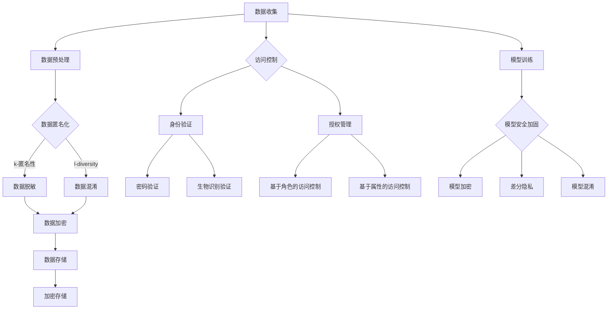

                 

### 文章标题

《LLM隐私保护：现状、漏洞与对策》

### 关键词：
- LLM（大型语言模型）
- 隐私保护
- 数据隐私
- 隐私漏洞
- 对抗攻击
- 隐私对策
- 加密技术
- 访问控制

### 摘要：

本文旨在探讨大型语言模型（LLM）在隐私保护方面的现状、面临的挑战和潜在的漏洞，并介绍一系列有效的隐私保护对策。随着人工智能技术的快速发展，LLM被广泛应用于自然语言处理任务，但随之而来的隐私风险也日益凸显。本文首先介绍了隐私保护的基础理论，包括隐私保护的重要性、挑战和基本概念。接着，分析了LLM隐私保护的现状，以及当前存在的隐私保护漏洞和风险。在此基础上，提出了多种隐私保护对策，包括数据匿名化、加密技术和访问控制等。最后，对未来LLM隐私保护的发展趋势和挑战进行了展望，并提供了相关资源汇总和法律法规参考。本文旨在为从事人工智能和隐私保护领域的读者提供有价值的参考和指导。

### 《LLM隐私保护：现状、漏洞与对策》目录大纲

#### 第一部分：隐私保护基础理论

##### 1.1 隐私保护概述

##### 1.1.1 隐私保护的重要性

##### 1.1.2 隐私保护的挑战

##### 1.1.3 隐私保护的基本概念

##### 1.2 隐私保护技术框架

##### 1.2.1 隐私保护的基本方法

##### 1.2.2 隐私保护的层次结构

##### 1.2.3 隐私保护的关键技术

##### 1.3 法律法规与隐私保护

##### 1.3.1 国际隐私保护法规

##### 1.3.2 中国隐私保护法规

##### 1.3.3 法律法规对隐私保护的推动作用

#### 第二部分：LLM隐私保护现状

##### 2.1 LLM隐私保护现状概述

##### 2.1.1 LLM隐私保护的重要性

##### 2.1.2 LLM隐私保护的现状

##### 2.1.3 LLM隐私保护面临的问题

##### 2.2 LLM隐私保护案例分析

##### 2.2.1 典型LLM隐私保护案例分析

##### 2.2.2 案例分析总结

##### 2.3 LLM隐私保护技术发展

##### 2.3.1 LLM隐私保护技术的发展历程

##### 2.3.2 LLM隐私保护技术的最新进展

##### 2.3.3 LLM隐私保护技术的未来趋势

#### 第三部分：LLM隐私保护漏洞与风险

##### 3.1 LLM隐私保护漏洞概述

##### 3.1.1 LLM隐私保护漏洞的类型

##### 3.1.2 LLM隐私保护漏洞的影响

##### 3.1.3 LLM隐私保护漏洞的成因

##### 3.2 常见LLM隐私保护漏洞分析

##### 3.2.1 数据泄露漏洞

##### 3.2.2 模型窃取漏洞

##### 3.2.3 模型对抗攻击漏洞

##### 3.3 LLM隐私保护风险评估

##### 3.3.1 风险评估方法

##### 3.3.2 风险评估案例分析

##### 3.3.3 风险管理策略

#### 第四部分：LLM隐私保护对策与实践

##### 4.1 LLM隐私保护对策概述

##### 4.1.1 LLM隐私保护对策的分类

##### 4.1.2 LLM隐私保护对策的适用范围

##### 4.1.3 LLM隐私保护对策的选择

##### 4.2 数据匿名化技术

##### 4.2.1 数据匿名化的原理

##### 4.2.2 数据匿名化的方法

##### 4.2.3 数据匿名化的应用案例

##### 4.3 加密技术

##### 4.3.1 密码学基础

##### 4.3.2 加密算法

##### 4.3.3 加密技术的应用案例

##### 4.4 访问控制与身份验证

##### 4.4.1 访问控制机制

##### 4.4.2 身份验证技术

##### 4.4.3 访问控制与身份验证的应用案例

##### 4.5 模型安全加固

##### 4.5.1 模型安全加固方法

##### 4.5.2 模型安全加固工具

##### 4.5.3 模型安全加固案例分析

##### 4.6 隐私保护项目实施与运维

##### 4.6.1 项目实施流程

##### 4.6.2 项目运维策略

##### 4.6.3 案例分析

#### 第五部分：未来展望

##### 5.1 LLM隐私保护发展趋势

##### 5.1.1 技术发展趋势

##### 5.1.2 政策法规发展趋势

##### 5.1.3 行业发展趋势

##### 5.2 LLM隐私保护挑战与机遇

##### 5.2.1 挑战分析

##### 5.2.2 机遇分析

##### 5.2.3 应对策略

##### 5.3 LLM隐私保护未来研究热点

##### 5.3.1 热点问题

##### 5.3.2 研究方向

##### 5.3.3 研究方法

#### 附录

##### 附录A：隐私保护资源汇总

##### 附录B：隐私保护相关法律法规

##### 附录C：隐私保护相关标准

##### 附录D：隐私保护技术框架流程图

##### 附录E：加密算法伪代码示例

##### 附录F：数学公式与举例说明

##### 附录G：项目实战与代码解析

##### 附录H：作者信息

### 第一部分：隐私保护基础理论

隐私保护是现代社会信息处理和共享中不可或缺的一部分。随着信息技术的迅猛发展，大数据、人工智能等技术的广泛应用，个人隐私数据的泄露、滥用问题愈发严重。隐私保护的重要性不言而喻，它关系到个人权利、商业秘密和社会稳定。本部分将介绍隐私保护的基本概念、技术框架以及法律法规，为后续讨论LLM隐私保护提供理论基础。

#### 1.1 隐私保护概述

##### 1.1.1 隐私保护的重要性

隐私保护的重要性体现在多个层面。首先，从个人层面看，隐私保护是公民基本权利的体现。个人信息如姓名、地址、电话、健康记录等，都是个人隐私的重要组成部分。未经授权泄露或滥用这些信息，不仅侵犯了个人的隐私权，还可能引发一系列严重后果，如财产损失、名誉损害甚至人身安全威胁。

其次，从企业层面看，隐私保护是企业商业秘密的重要保障。企业内部数据、客户信息、市场策略等，都是企业竞争力的核心资源。一旦这些信息泄露，企业将面临巨大的商业风险和损失。

最后，从社会层面看，隐私保护是维护社会秩序和公共安全的重要手段。个人隐私的泄露可能导致社会信任危机，影响社会的和谐稳定。因此，隐私保护不仅仅是个人和企业的问题，更是关乎整个社会的问题。

##### 1.1.2 隐私保护的挑战

隐私保护的挑战主要来自于以下几个方面：

1. **数据量的爆炸性增长**：随着互联网和移动设备的普及，人们产生和收集的数据量急剧增加。这些数据中包含大量的个人隐私信息，如何有效地保护这些信息成为巨大挑战。

2. **技术的快速发展**：大数据、人工智能、云计算等技术的快速发展，为隐私保护带来了新的机遇，但同时也带来了新的挑战。这些技术本身可能存在安全隐患，如何在不影响技术性能的前提下实现隐私保护，是一个亟待解决的问题。

3. **法律法规的不完善**：虽然各国都出台了相关的隐私保护法律法规，但整体上，这些法律法规的执行力度和统一性还有待提高。一些新兴领域，如人工智能、区块链等，法律法规的缺失更为明显。

4. **隐私保护技术的局限性**：现有的隐私保护技术，如数据加密、匿名化等，虽然在一定程度上能够保护隐私，但仍然存在一定的局限性。如何提高这些技术的有效性，是一个需要持续研究的课题。

##### 1.1.3 隐私保护的基本概念

隐私保护的基本概念包括以下几个方面：

1. **隐私**：隐私是指个人享有的对个人信息和事务的控制权，包括信息的访问、使用和共享。隐私是个人信息安全和个人权利的核心。

2. **隐私泄露**：隐私泄露是指未经授权的第三方获取、访问或使用个人信息的行为。隐私泄露可能导致个人隐私受损、财产损失等严重后果。

3. **隐私保护**：隐私保护是指通过各种技术和管理手段，确保个人信息在收集、存储、处理、传输等过程中不被未经授权的第三方访问和使用。

4. **隐私政策**：隐私政策是指组织或个人在收集、使用和处理个人信息时，制定的关于隐私保护的规则和承诺。隐私政策是隐私保护的基础。

5. **隐私保护技术**：隐私保护技术是指用于保护个人隐私信息的一系列技术，包括数据加密、匿名化、访问控制等。

#### 1.2 隐私保护技术框架

##### 1.2.1 隐私保护的基本方法

隐私保护的基本方法可以分为以下几种：

1. **数据加密**：数据加密是通过加密算法将原始数据转换为密文，只有拥有解密密钥的用户才能解密并获取原始数据。数据加密是保护隐私信息的基本手段，可以有效防止未经授权的访问。

2. **数据匿名化**：数据匿名化是将原始数据中的个人身份信息进行修改，使其无法直接识别特定个人。数据匿名化可以降低隐私泄露的风险，但可能影响数据的可用性和准确性。

3. **访问控制**：访问控制是通过身份验证和授权机制，控制用户对数据的访问权限。访问控制可以确保只有授权用户才能访问特定数据。

4. **审计与监控**：审计与监控是通过记录和监控用户对数据的访问行为，确保隐私保护措施的执行。审计与监控可以及时发现和纠正隐私泄露问题。

##### 1.2.2 隐私保护的层次结构

隐私保护可以分为以下层次：

1. **物理安全**：物理安全是指保护数据存储设备和传输介质的物理安全。物理安全措施包括访问控制、监控设备、数据备份等。

2. **网络安全**：网络安全是指保护网络传输过程中的数据安全。网络安全措施包括数据加密、防火墙、入侵检测等。

3. **数据安全**：数据安全是指保护数据在存储、处理和传输过程中的安全。数据安全措施包括数据加密、访问控制、数据备份等。

4. **应用安全**：应用安全是指保护应用程序的安全，防止应用程序被恶意利用。应用安全措施包括安全编码、安全测试、漏洞修复等。

##### 1.2.3 隐私保护的关键技术

隐私保护的关键技术包括：

1. **加密技术**：加密技术是隐私保护的核心技术，包括对称加密、非对称加密、哈希算法等。

2. **匿名化技术**：匿名化技术包括数据脱敏、数据混淆、K-匿名等技术。

3. **访问控制技术**：访问控制技术包括基于角色的访问控制（RBAC）、基于属性的访问控制（ABAC）等。

4. **身份验证技术**：身份验证技术包括密码学身份验证、生物识别身份验证等。

5. **隐私审计技术**：隐私审计技术包括数据审计、行为分析、隐私合规性检查等。

#### 1.3 法律法规与隐私保护

##### 1.3.1 国际隐私保护法规

国际隐私保护法规主要包括以下几个方面：

1. **通用数据保护条例（GDPR）**：GDPR是欧盟制定的隐私保护法规，旨在保护欧盟公民的个人信息。GDPR对数据控制者和处理者提出了严格的要求，包括数据收集、处理和存储的合法性、目的明确性、数据最小化原则等。

2. **加州消费者隐私法案（CCPA）**：CCPA是加利福尼亚州制定的隐私保护法规，旨在保护加州居民的个人信息。CCPA规定了个人信息收集、使用和共享的要求，并对违反规定的行为进行了严格的惩罚。

3. **隐私盾协议（Privacy Shield）**：隐私盾协议是美国和欧盟之间的一项隐私保护协议，旨在解决欧盟居民个人信息在美国处理时的隐私问题。隐私盾协议要求美国企业遵守一系列隐私保护要求，以获得欧盟的认可。

##### 1.3.2 中国隐私保护法规

中国隐私保护法规主要包括以下几个方面：

1. **网络安全法**：网络安全法是中国制定的一部综合性网络安全法律，涵盖了网络安全的基本原则、网络运营安全、网络信息安全等内容。网络安全法对个人信息的收集、处理和存储提出了明确要求。

2. **个人信息保护法**：个人信息保护法是中国制定的一部专门针对个人信息保护的法律法规，旨在保护个人信息的权益，规范个人信息处理行为。个人信息保护法规定了个人信息处理的基本原则、个人信息保护义务、个人信息跨境提供等要求。

3. **数据安全法**：数据安全法是中国制定的一部专门针对数据安全的法律法规，旨在加强数据安全保护，维护国家安全和社会公共利益。数据安全法对数据处理者提出了数据安全保护的要求，包括数据分类、风险评估、数据加密等。

##### 1.3.3 法律法规对隐私保护的推动作用

法律法规对隐私保护具有积极的推动作用：

1. **提高隐私保护意识**：法律法规的制定和实施，提高了社会对隐私保护的重视程度，增强了个人和企业对隐私保护的意识。

2. **规范隐私保护行为**：法律法规明确了个人和企业对隐私保护的责任和义务，规范了隐私保护的行为，降低了隐私泄露的风险。

3. **强化隐私保护措施**：法律法规对隐私保护提出了具体要求，推动个人和企业采取更加有效的隐私保护措施，如数据加密、访问控制、隐私审计等。

4. **加强隐私保护监管**：法律法规为隐私保护提供了监管依据，加强了隐私保护的监管力度，对违反隐私保护规定的行为进行了严格的惩罚，提高了隐私保护的有效性。

### 第二部分：LLM隐私保护现状

随着人工智能技术的快速发展，大型语言模型（LLM）在自然语言处理、机器翻译、文本生成等领域得到了广泛应用。然而，LLM的广泛应用也带来了隐私保护方面的挑战。本部分将介绍LLM隐私保护的重要性、现状以及面临的问题。

#### 2.1 LLM隐私保护现状概述

##### 2.1.1 LLM隐私保护的重要性

LLM隐私保护的重要性体现在以下几个方面：

1. **用户隐私保护**：LLM通常需要处理大量的用户输入数据，这些数据可能包含用户的个人隐私信息。如果这些数据泄露，用户的隐私将受到严重威胁。

2. **模型安全**：LLM模型本身也可能成为攻击目标。如果攻击者能够获取并篡改模型，可能会导致模型的输出结果失真，甚至对用户造成危害。

3. **企业竞争**：LLM被广泛应用于企业和组织内部，包含大量的商业秘密。如果这些信息泄露，将严重损害企业的竞争力。

##### 2.1.2 LLM隐私保护的现状

目前，LLM隐私保护的主要现状如下：

1. **隐私保护意识提高**：随着隐私保护问题的日益凸显，越来越多的企业和研究机构开始关注LLM隐私保护，并采取相应的保护措施。

2. **隐私保护技术研究**：学术界和工业界对LLM隐私保护技术进行了深入的研究，提出了多种隐私保护方法，如数据匿名化、加密技术、访问控制等。

3. **隐私保护法律法规**：虽然尚未有专门的针对LLM隐私保护的法律法规，但现有的隐私保护法律法规，如GDPR、CCPA等，对LLM隐私保护起到了一定的规范作用。

##### 2.1.3 LLM隐私保护面临的问题

LLM隐私保护目前面临以下问题：

1. **隐私保护技术局限**：现有的隐私保护技术，如数据匿名化、加密技术等，虽然能够在一定程度上保护隐私，但仍然存在一定的局限性。

2. **隐私保护成本高**：实现有效的隐私保护需要大量的技术投入和人力资源，对于一些小型企业和个人来说，隐私保护成本较高。

3. **隐私保护监管不足**：现有的隐私保护法律法规对LLM隐私保护的监管力度不足，难以有效遏制隐私泄露问题。

4. **隐私保护意识不足**：虽然隐私保护问题日益受到关注，但部分用户和企业对隐私保护的意识仍然不足，导致隐私泄露事件频发。

#### 2.2 LLM隐私保护案例分析

##### 2.2.1 典型LLM隐私保护案例分析

以下是几个典型的LLM隐私保护案例分析：

1. **谷歌翻译隐私泄露事件**：2018年，谷歌翻译应用被爆出存在隐私泄露问题。用户在翻译过程中输入的内容被谷歌公司记录并存储，且这些数据可能被用于训练谷歌的AI模型。这一事件引发了广泛的关注和批评，谷歌随后加强了翻译应用的隐私保护措施。

2. **亚马逊Alexa隐私泄露事件**：2019年，亚马逊Alexa智能助手被爆出存在隐私泄露问题。用户与Alexa的对话内容被亚马逊公司记录并存储，且这些数据可能被用于广告投放和其他商业目的。这一事件引起了用户对隐私保护的担忧，亚马逊随后发布了隐私保护白皮书，承诺加强隐私保护。

3. **微软小冰隐私保护案例**：微软小冰是一款基于人工智能的聊天机器人，其在使用过程中对用户输入的数据进行了隐私保护。小冰采用了数据匿名化和加密技术，确保用户数据的隐私安全。这一案例展示了如何通过技术手段实现有效的隐私保护。

##### 2.2.2 案例分析总结

通过对以上案例的分析，我们可以得出以下结论：

1. **隐私保护意识提高**：随着隐私保护问题的日益凸显，越来越多的企业和研究机构开始关注LLM隐私保护，并采取相应的保护措施。

2. **隐私保护技术发展**：隐私保护技术不断发展，如数据匿名化、加密技术等，为LLM隐私保护提供了有效的手段。

3. **隐私保护法律法规**：虽然尚未有专门的针对LLM隐私保护的法律法规，但现有的隐私保护法律法规，如GDPR、CCPA等，对LLM隐私保护起到了一定的规范作用。

4. **隐私保护监管不足**：现有的隐私保护法律法规对LLM隐私保护的监管力度不足，难以有效遏制隐私泄露问题。

5. **隐私保护意识不足**：虽然隐私保护问题日益受到关注，但部分用户和企业对隐私保护的意识仍然不足，导致隐私泄露事件频发。

#### 2.3 LLM隐私保护技术发展

##### 2.3.1 LLM隐私保护技术的发展历程

LLM隐私保护技术的发展历程可以分为以下几个阶段：

1. **初始阶段**：随着人工智能技术的兴起，隐私保护问题逐渐受到关注。一些基本的隐私保护技术，如数据匿名化和加密技术，开始应用于LLM隐私保护。

2. **发展阶段**：随着隐私保护技术的不断发展和完善，如差分隐私、联邦学习等新技术的出现，LLM隐私保护技术得到了进一步的发展。

3. **成熟阶段**：目前，LLM隐私保护技术已经相对成熟，各种隐私保护方法在理论和实际应用中得到了广泛验证。未来，LLM隐私保护技术将继续发展，以满足日益严格的隐私保护要求。

##### 2.3.2 LLM隐私保护技术的最新进展

LLM隐私保护技术的最新进展主要体现在以下几个方面：

1. **差分隐私**：差分隐私是一种有效的隐私保护技术，通过添加噪声来保护用户隐私。近年来，差分隐私在LLM隐私保护中的应用得到了广泛关注，如Google的 federated learning 和 Apple 的 privacy nutral 的实现。

2. **联邦学习**：联邦学习是一种在分布式环境下训练机器学习模型的方法，能够有效保护用户隐私。联邦学习在LLM隐私保护中具有广泛的应用前景。

3. **同态加密**：同态加密是一种在加密状态下对数据进行操作的加密技术，能够在保证数据隐私的同时进行计算。近年来，同态加密在LLM隐私保护中的应用得到了深入研究。

##### 2.3.3 LLM隐私保护技术的未来趋势

LLM隐私保护技术的未来趋势将体现在以下几个方面：

1. **隐私保护技术的融合**：多种隐私保护技术的融合，如差分隐私、联邦学习、同态加密等，将提高LLM隐私保护的效果。

2. **隐私保护成本的降低**：随着隐私保护技术的不断发展，隐私保护成本将逐渐降低，使得更多企业和个人能够实现有效的隐私保护。

3. **隐私保护监管的加强**：未来，隐私保护法律法规将不断完善，对LLM隐私保护的监管力度将进一步加强。

4. **隐私保护技术的普及**：随着隐私保护意识的提高，隐私保护技术将在更广泛的领域中推广应用，为社会的隐私安全提供保障。

### 第三部分：LLM隐私保护漏洞与风险

在LLM隐私保护领域，漏洞和风险是影响系统安全性的关键因素。这些漏洞可能被恶意攻击者利用，导致隐私泄露、模型窃取或模型对抗攻击等严重后果。本部分将详细探讨LLM隐私保护的漏洞类型、影响因素及其带来的风险。

#### 3.1 LLM隐私保护漏洞概述

##### 3.1.1 LLM隐私保护漏洞的类型

LLM隐私保护漏洞主要包括以下几种类型：

1. **数据泄露漏洞**：这种漏洞发生在敏感数据在传输或存储过程中被未授权实体访问。数据泄露可能是由于加密算法的缺陷、存储介质的安全问题或者传输过程中的网络攻击。

2. **模型窃取漏洞**：模型窃取漏洞指的是攻击者能够通过某种手段获取LLM模型的核心参数或结构，从而盗取模型的知识产权。这通常涉及到模型训练数据的窃取、模型参数的破解或逆向工程。

3. **模型对抗攻击漏洞**：对抗攻击是指通过精心设计的输入数据，使得模型输出结果发生偏差或错误。这种攻击可能导致模型的鲁棒性下降，甚至完全失效。

4. **访问控制漏洞**：访问控制漏洞指的是系统的访问控制机制未能有效阻止未授权用户访问敏感数据或资源。这可能源于访问控制策略的不完善、身份验证机制的弱点或授权管理的问题。

##### 3.1.2 LLM隐私保护漏洞的影响

LLM隐私保护漏洞的影响是多方面的，包括但不限于：

1. **隐私泄露**：敏感数据泄露可能导致个人隐私受到侵犯，造成用户信任受损、财产损失甚至法律纠纷。

2. **模型滥用**：被窃取的模型可能被用于恶意目的，如商业竞争、网络诈骗或非法活动。

3. **系统崩溃**：严重的对抗攻击可能导致整个系统崩溃，影响服务的可用性。

4. **法律风险**：隐私泄露和模型滥用可能引发法律诉讼和监管处罚，对企业形象和商业运营造成负面影响。

##### 3.1.3 LLM隐私保护漏洞的成因

LLM隐私保护漏洞的成因复杂，主要包括以下几点：

1. **技术缺陷**：加密算法的设计缺陷、代码实现中的漏洞或安全协议的不完善，都可能导致隐私保护失效。

2. **管理不善**：缺乏明确的隐私保护政策和流程、安全意识的缺乏或者不当的管理实践，都可能导致隐私泄露。

3. **环境因素**：网络环境的不安全、物理设备的安全性问题或者第三方服务的漏洞，都可能成为攻击的入口。

4. **人为因素**：内部人员滥用权限、恶意行为或者误操作，也可能导致隐私保护漏洞。

#### 3.2 常见LLM隐私保护漏洞分析

##### 3.2.1 数据泄露漏洞

数据泄露漏洞是LLM隐私保护中最为常见且危害性最大的一种漏洞。以下是一些具体的数据泄露漏洞分析：

1. **SQL注入**：SQL注入是一种通过在输入字段中注入恶意SQL语句，从而破坏数据库安全性的攻击方式。攻击者可能通过这种方式获取数据库中的敏感信息。

2. **未加密的传输**：在数据传输过程中，如果未使用加密技术，攻击者可以通过中间人攻击拦截和篡改数据。例如，HTTP传输而非HTTPS传输的数据容易被窃取。

3. **存储介质泄露**：数据在存储介质上的安全措施不足，可能导致敏感数据被未授权实体访问。例如，未加密的文件存储在未保护的文件系统中。

4. **逻辑漏洞**：应用程序在处理数据时可能存在逻辑漏洞，导致敏感数据泄露。例如，不当的数据处理或错误的信息传递。

##### 3.2.2 模型窃取漏洞

模型窃取漏洞主要针对LLM模型的知识产权保护。以下是一些具体的模型窃取漏洞分析：

1. **模型参数泄露**：通过攻击者获取模型训练后的参数，可以直接窃取模型的知识产权。这可能是通过攻击训练过程、破解加密算法或逆向工程实现的。

2. **数据集泄露**：模型的训练数据集是构建模型的关键要素，如果数据集被泄露，攻击者可能通过反向工程或数据挖掘手段破解模型。

3. **逆向工程**：通过分析模型的输入输出关系，攻击者可能推断出模型的内部结构和算法。这通常需要大量的计算资源和专业知识。

##### 3.2.3 模型对抗攻击漏洞

模型对抗攻击漏洞是指攻击者通过对抗性样本使模型输出发生偏差或错误。以下是一些具体的模型对抗攻击漏洞分析：

1. **对抗性样本攻击**：通过设计对抗性样本，攻击者可以使模型在特定输入下产生错误的输出。这些对抗性样本通常是对原始样本的微小扰动。

2. **梯度泄露攻击**：通过分析模型梯度信息，攻击者可以推断出模型内部的决策过程，进而优化对抗性样本。

3. **模型鲁棒性测试**：通过大量生成对抗性样本进行模型鲁棒性测试，评估模型在对抗攻击下的表现。如果模型在测试中表现不佳，可能存在对抗攻击漏洞。

#### 3.3 LLM隐私保护风险评估

##### 3.3.1 风险评估方法

LLM隐私保护风险评估是确保系统安全的重要环节。以下是一些常用的风险评估方法：

1. **威胁建模**：通过识别潜在的威胁，分析其可能带来的影响，从而确定隐私保护的重点。

2. **漏洞扫描**：使用自动化工具扫描系统中的漏洞，识别可能的安全隐患。

3. **渗透测试**：模拟攻击者的攻击行为，验证系统的安全防护能力。

4. **风险分析**：结合威胁建模和漏洞扫描结果，评估风险等级，制定相应的防护措施。

##### 3.3.2 风险评估案例分析

以下是一个典型的LLM隐私保护风险评估案例分析：

**案例背景**：某企业开发了一个基于大型语言模型的聊天机器人，用于提供客户支持服务。

**威胁识别**：分析发现潜在威胁包括数据泄露、模型窃取和对抗攻击。

**漏洞扫描**：使用自动化工具对系统进行扫描，发现以下漏洞：
- 数据库未使用加密存储
- HTTPS配置不正确，存在中间人攻击风险
- 模型参数未加密存储

**渗透测试**：通过模拟攻击者的行为，成功发现以下安全漏洞：
- 系统存在SQL注入漏洞，攻击者可以访问数据库中的敏感数据
- 系统对对抗性样本攻击防御不足，存在输出偏差的风险

**风险分析**：根据漏洞扫描和渗透测试的结果，确定以下风险等级：
- 数据库未加密存储：高风险
- HTTPS配置问题：中等风险
- SQL注入漏洞：高风险
- 模型参数未加密存储：中等风险
- 对抗性样本攻击防御不足：中等风险

**防护措施**：
- 加密数据库存储
- 修复HTTPS配置问题
- 更新系统以防范SQL注入攻击
- 加密模型参数存储
- 加强对抗性样本攻击的检测和防御

##### 3.3.3 风险管理策略

为了有效管理LLM隐私保护风险，需要制定以下风险管理策略：

1. **风险识别**：定期进行威胁建模和漏洞扫描，及时识别潜在风险。

2. **风险评估**：结合风险分析和威胁建模结果，对风险进行分类和优先级排序。

3. **风险缓解**：根据风险等级，采取相应的缓解措施，如加密、访问控制、监控等。

4. **风险监控**：建立风险监控机制，实时监控系统的安全状况，及时发现并应对新的风险。

5. **风险管理培训**：对相关人员进行风险管理培训，提高整体安全意识和技能水平。

### 第四部分：LLM隐私保护对策与实践

为了有效保护大型语言模型（LLM）的隐私，我们需要采取一系列综合性的隐私保护对策。这些对策涵盖了数据匿名化、加密技术、访问控制以及模型安全加固等多个方面。本部分将详细介绍这些隐私保护对策的原理、方法和实践应用，为读者提供切实可行的隐私保护解决方案。

#### 4.1 LLM隐私保护对策概述

##### 4.1.1 LLM隐私保护对策的分类

LLM隐私保护对策可以分为以下几类：

1. **数据匿名化**：通过技术手段对敏感数据进行处理，使其无法直接识别个人身份。

2. **加密技术**：使用加密算法对数据进行加密，确保数据在传输和存储过程中不被未授权访问。

3. **访问控制**：通过身份验证和授权机制，控制用户对数据的访问权限，防止未授权访问。

4. **模型安全加固**：通过技术手段提高模型的安全性，防止模型参数和结构被窃取或篡改。

##### 4.1.2 LLM隐私保护对策的适用范围

不同的隐私保护对策适用于不同的场景，以下为各类对策的适用范围：

1. **数据匿名化**：适用于需要保护用户隐私的数据处理场景，如数据分析、机器学习模型训练等。

2. **加密技术**：适用于需要确保数据传输和存储安全的场景，如数据传输、云存储等。

3. **访问控制**：适用于需要控制用户访问权限的场景，如内部系统、应用程序等。

4. **模型安全加固**：适用于需要保护模型知识产权的场景，如AI模型研发、部署等。

##### 4.1.3 LLM隐私保护对策的选择

在选择隐私保护对策时，需要考虑以下因素：

1. **隐私保护需求**：根据具体场景的隐私保护需求，选择合适的对策。

2. **技术可行性**：评估所选对策的技术实现难度和可行性。

3. **成本效益**：考虑隐私保护对策的实施成本和维护成本。

4. **法律法规合规性**：确保所选对策符合相关法律法规的要求。

#### 4.2 数据匿名化技术

##### 4.2.1 数据匿名化的原理

数据匿名化是指通过技术手段对敏感数据进行处理，使其无法直接识别个人身份，但保留数据的原始特征和模式。数据匿名化的原理主要包括以下几方面：

1. **数据混淆**：通过在数据中加入噪声或修改数据值，使其无法直接识别个人身份。

2. **数据脱敏**：通过删除或替换敏感数据，使其无法直接识别个人身份。

3. **数据聚合**：通过将多个数据记录合并，降低数据可识别性。

##### 4.2.2 数据匿名化的方法

数据匿名化方法可以分为以下几类：

1. **k-匿名性**：确保每个数据记录在去除敏感信息后，至少存在k个相似的记录。

2. **l-diversity**：确保每个数据记录在去除敏感信息后，至少存在l个不同的类。

3. **t-closeness**：确保每个数据记录在去除敏感信息后，其分布与原始数据集的分布相似。

##### 4.2.3 数据匿名化的应用案例

以下是一个数据匿名化的应用案例：

**案例背景**：某公司收集了客户的个人信息，包括姓名、地址、电话等。为了保护客户隐私，需要对数据进行匿名化处理。

**解决方案**：
1. **数据混淆**：对敏感数据进行混淆处理，例如，将电话号码的最后一个数字替换为随机数。

2. **k-匿名性**：将客户的个人信息与客户的消费记录进行合并，确保每个消费记录在去除敏感信息后，至少存在10个相似的记录。

3. **l-diversity**：确保每个消费记录在去除敏感信息后，至少存在3个不同的类。

通过以上数据匿名化处理，客户个人信息无法被直接识别，但保留了数据的基本特征和模式，为后续的数据分析提供了保障。

#### 4.3 加密技术

##### 4.3.1 密码学基础

密码学是研究如何使用加密算法对数据进行保护的一门学科。密码学基础包括以下几方面：

1. **加密算法**：加密算法是将明文转换为密文的算法，常见的加密算法包括对称加密、非对称加密和哈希算法。

2. **密钥管理**：密钥是加密和解密数据的关键，有效的密钥管理对于保障数据安全至关重要。

3. **安全协议**：安全协议是一组用于实现安全通信的规则和规范，常见的安全协议包括SSL/TLS和IPSec等。

##### 4.3.2 加密算法

加密算法可以分为以下几类：

1. **对称加密**：对称加密算法使用相同的密钥进行加密和解密。常见的对称加密算法包括AES、DES和3DES等。

2. **非对称加密**：非对称加密算法使用不同的密钥进行加密和解密，通常涉及公钥和私钥。常见的非对称加密算法包括RSA、ECC等。

3. **哈希算法**：哈希算法用于生成数据摘要，常见的哈希算法包括MD5、SHA-1和SHA-256等。

##### 4.3.3 加密技术的应用案例

以下是一个加密技术的应用案例：

**案例背景**：某公司开发了一个在线购物平台，需要保护用户购物车的数据。

**解决方案**：
1. **数据加密**：使用AES对称加密算法对购物车数据进行加密，确保数据在传输和存储过程中不被未授权访问。

2. **密钥管理**：使用RSA非对称加密算法对AES密钥进行加密，确保密钥在传输和存储过程中不被泄露。

3. **安全协议**：使用HTTPS协议进行数据传输，确保数据在传输过程中的完整性。

通过以上加密技术，用户购物车的数据得到了有效保护，确保了用户隐私的安全。

#### 4.4 访问控制与身份验证

##### 4.4.1 访问控制机制

访问控制机制是控制用户对系统资源和数据的访问权限的一种机制。访问控制机制包括以下几方面：

1. **身份验证**：身份验证是确认用户身份的过程，常见的身份验证方法包括密码、生物识别等。

2. **授权**：授权是确定用户对系统资源和数据的访问权限的过程，常见的授权策略包括基于角色的访问控制（RBAC）和基于属性的访问控制（ABAC）。

##### 4.4.2 身份验证技术

身份验证技术主要包括以下几类：

1. **密码验证**：密码验证是最常见的身份验证方法，用户通过输入密码来证明自己的身份。

2. **生物识别验证**：生物识别验证通过用户的生物特征（如指纹、人脸、虹膜等）来验证身份。

3. **多因素身份验证**：多因素身份验证结合多种身份验证方法，提高身份验证的安全性。

##### 4.4.3 访问控制与身份验证的应用案例

以下是一个访问控制与身份验证的应用案例：

**案例背景**：某公司开发了一个内部管理系统，需要保护系统资源和数据的安全。

**解决方案**：
1. **身份验证**：使用密码验证和生物识别验证结合的方式，确保用户身份的准确性。

2. **授权**：采用基于角色的访问控制（RBAC），为不同角色的用户分配相应的访问权限。

3. **审计**：记录用户的访问行为，确保访问控制策略的有效执行。

通过以上访问控制与身份验证机制，确保内部管理系统资源和数据的安全。

#### 4.5 模型安全加固

##### 4.5.1 模型安全加固方法

模型安全加固方法主要包括以下几类：

1. **模型加密**：通过加密算法对模型参数进行加密，确保模型参数的安全。

2. **差分隐私**：在模型训练过程中添加噪声，降低模型对训练数据的依赖，增强模型的隐私保护能力。

3. **模型混淆**：通过混淆技术使模型的内部结构和参数难以理解，提高模型的抗攻击能力。

##### 4.5.2 模型安全加固工具

以下是一些常见的模型安全加固工具：

1. **PyTorch-Forensics**：用于检测和防御神经网络模型的对抗性攻击。

2. **Adversarial Robustness Toolbox (ART)**：用于评估和增强机器学习模型的对抗性鲁棒性。

3. **ModelArXiv**：用于发布和验证模型的安全性和隐私保护特性。

##### 4.5.3 模型安全加固案例分析

以下是一个模型安全加固的应用案例：

**案例背景**：某公司开发了一个用于金融风险预测的神经网络模型，需要保护模型的安全性和隐私。

**解决方案**：
1. **模型加密**：使用AES算法对模型参数进行加密，确保模型参数的安全。

2. **差分隐私**：在模型训练过程中，添加噪声以增强模型的隐私保护能力。

3. **模型混淆**：采用对抗性训练方法，提高模型的抗攻击能力。

通过以上模型安全加固措施，确保神经网络模型在金融风险预测中的应用安全性和隐私保护。

#### 4.6 隐私保护项目实施与运维

##### 4.6.1 项目实施流程

隐私保护项目的实施可以分为以下阶段：

1. **需求分析**：明确项目目标，分析隐私保护需求。

2. **方案设计**：根据需求分析，设计具体的隐私保护方案。

3. **实施部署**：按照设计方案，实施隐私保护措施。

4. **测试验证**：对隐私保护措施进行测试，确保方案的有效性。

##### 4.6.2 项目运维策略

隐私保护项目的运维策略包括以下几点：

1. **监控与审计**：实时监控系统的安全状况，记录和审计用户访问行为。

2. **更新与维护**：定期更新系统和工具，修复漏洞和错误。

3. **培训与宣传**：对相关人员进行培训，提高安全意识和技能水平。

4. **应急预案**：制定应急预案，确保在发生安全事件时能够快速响应和处理。

##### 4.6.3 案例分析

以下是一个隐私保护项目实施与运维的案例分析：

**案例背景**：某大型互联网公司开发了一个面向全球用户的在线教育平台，需要确保用户隐私和数据安全。

**解决方案**：
1. **需求分析**：分析用户隐私保护需求，确定数据加密、访问控制和模型安全加固等关键措施。

2. **方案设计**：设计包括数据加密、访问控制、模型安全加固在内的综合隐私保护方案。

3. **实施部署**：在系统中部署数据加密模块，实现用户数据的加密存储和传输。同时，采用基于角色的访问控制，确保用户访问权限的有效管理。

4. **测试验证**：对隐私保护措施进行严格的测试，确保方案的有效性。

5. **监控与审计**：实时监控系统的安全状况，记录用户访问行为，定期进行审计。

6. **更新与维护**：定期更新系统和工具，修复漏洞和错误。

7. **培训与宣传**：对相关人员进行培训，提高安全意识和技能水平。

8. **应急预案**：制定应急预案，确保在发生安全事件时能够快速响应和处理。

通过以上措施，确保在线教育平台在用户隐私保护和数据安全方面的有效性。

### 第五部分：未来展望

随着人工智能技术的快速发展，大型语言模型（LLM）在自然语言处理、机器翻译、文本生成等领域展现出了巨大的潜力。然而，LLM的广泛应用也带来了隐私保护的挑战。本部分将探讨LLM隐私保护的发展趋势、挑战与机遇，并展望未来的研究方向。

#### 5.1 LLM隐私保护发展趋势

##### 5.1.1 技术发展趋势

1. **差分隐私技术的深化应用**：差分隐私作为一种强大的隐私保护技术，已经在LLM隐私保护中得到了广泛应用。未来，差分隐私技术将更加深入地应用于LLM的训练和推理过程中，确保模型输出结果的隐私性。

2. **联邦学习的发展**：联邦学习是一种在分布式环境下训练机器学习模型的方法，能够在保护用户隐私的同时实现模型优化。随着5G和边缘计算的发展，联邦学习在LLM隐私保护中的应用将更加普及。

3. **同态加密的应用**：同态加密是一种在加密状态下对数据进行操作的加密技术，能够在保证数据隐私的同时进行计算。未来，同态加密技术将在LLM隐私保护中得到更广泛的应用。

4. **模型安全加固技术的创新**：随着对抗攻击技术的不断发展，LLM隐私保护中的模型安全加固技术也将不断创新，提高模型的抗攻击能力。

##### 5.1.2 政策法规发展趋势

1. **隐私保护法律法规的完善**：随着隐私保护意识的提高，各国将进一步完善隐私保护法律法规，为LLM隐私保护提供更明确的法律依据。

2. **跨境数据流动的规范**：随着全球化的发展，跨境数据流动的隐私保护问题日益凸显。未来，各国将加强跨境数据流动的监管，确保数据在跨境传输过程中的隐私安全。

3. **数据伦理与道德规范的制定**：随着人工智能技术的应用，数据伦理与道德问题受到越来越多的关注。未来，数据伦理与道德规范将逐渐成为隐私保护法律法规的重要组成部分。

##### 5.1.3 行业发展趋势

1. **隐私保护成为核心竞争力**：随着隐私保护意识的提高，隐私保护将成为企业竞争的重要方面。企业将通过引入先进的隐私保护技术，提升自身的市场竞争力。

2. **隐私保护技术的商业化应用**：隐私保护技术将逐步从理论研究走向商业化应用，为各行各业提供有效的隐私保护解决方案。

3. **隐私保护技术的开源与标准化**：为了推动隐私保护技术的发展，越来越多的隐私保护技术将开源，并逐步形成国际标准，提高隐私保护技术的通用性和可互操作性。

#### 5.2 LLM隐私保护挑战与机遇

##### 5.2.1 挑战分析

1. **隐私保护与性能平衡**：在确保隐私保护的同时，如何平衡模型的性能是一个重要挑战。现有的隐私保护技术，如差分隐私和联邦学习，往往会影响模型的准确性和效率。

2. **隐私保护法律法规的落实**：虽然隐私保护法律法规逐渐完善，但在实际执行过程中，仍面临监管不足、执法难度大等问题。

3. **隐私保护技术的复杂性和成本**：实现有效的隐私保护需要复杂的技术手段和高昂的成本，这对小型企业和个人来说是一个巨大的挑战。

##### 5.2.2 机遇分析

1. **技术创新带来的机遇**：随着技术的不断进步，如差分隐私、联邦学习和同态加密等隐私保护技术的不断发展，将为LLM隐私保护提供更多的解决方案。

2. **市场需求增加**：随着隐私保护意识的提高，企业和个人对隐私保护的需求不断增加，为隐私保护技术提供了广阔的市场空间。

3. **政策支持**：政府和企业对隐私保护的重视程度不断提高，为隐私保护技术的发展提供了有力的政策支持。

##### 5.2.3 应对策略

1. **加强技术创新**：积极推动隐私保护技术的研发，提高隐私保护技术的性能和适用性。

2. **完善法律法规**：完善隐私保护法律法规，确保隐私保护措施的落实和执行。

3. **降低隐私保护成本**：通过开源、标准化和商业化应用，降低隐私保护技术的成本，使其更加普及。

4. **提高隐私保护意识**：加强隐私保护意识的普及，提高企业和个人对隐私保护重要性的认识。

#### 5.3 LLM隐私保护未来研究热点

##### 5.3.1 热点问题

1. **高效隐私保护算法的设计与实现**：如何设计高效、实用的隐私保护算法，平衡隐私保护和模型性能，是未来研究的热点问题。

2. **隐私保护与人工智能结合**：如何将隐私保护技术有机地融入人工智能的各个环节，实现隐私保护与人工智能的协同发展，是未来研究的重点。

3. **隐私保护法律法规的完善**：如何完善隐私保护法律法规，确保其在实际应用中的有效性，是未来研究的重要方向。

##### 5.3.2 研究方向

1. **隐私保护算法的创新**：研究新型隐私保护算法，提高隐私保护技术的性能和适用性。

2. **隐私保护与人工智能的结合**：探索隐私保护技术在不同人工智能应用场景中的适用性，实现隐私保护与人工智能的有机结合。

3. **隐私保护法律法规的制定与实施**：研究隐私保护法律法规的制定与实施，提高隐私保护法律法规的执行力度和统一性。

##### 5.3.3 研究方法

1. **理论分析**：通过数学模型和理论分析，深入研究隐私保护算法的性能和适用性。

2. **实证研究**：通过实际应用场景的实证研究，验证隐私保护技术的有效性。

3. **跨学科研究**：结合计算机科学、法律、伦理等多学科知识，深入研究隐私保护与人工智能的有机结合。

### 附录

#### 附录A：隐私保护资源汇总

**A.1 开源工具与框架**

- PySyft：开源的联邦学习框架，支持差分隐私和其他隐私保护技术。
- Monorepo AI：开源的隐私保护工具集，包括加密、匿名化、访问控制等技术。
- TensorFlow Privacy：TensorFlow官方的隐私保护扩展库。

**A.2 论文与报告**

- **论文**
  - "Differentially Private Learning: The Power of Honor and Hope"
  - "Federal Learning: Privacy and Utility in Distributed Machine Learning"
  - "Homomorphic Encryption and Applications"
- **报告**
  - **欧盟**：《通用数据保护条例（GDPR）》
  - **美国**：《加州消费者隐私法案（CCPA）》
  - **中国**：《网络安全法》和《个人信息保护法》

**A.3 优秀实践案例**

- **案例1**：微软小冰的隐私保护实践。
- **案例2**：谷歌翻译的隐私保护改进。
- **案例3**：亚马逊Alexa的隐私保护措施。

#### 附录B：隐私保护相关法律法规

**B.1 国际隐私保护法律法规**

- **GDPR（通用数据保护条例）**：欧盟的隐私保护法规，对个人数据的处理和使用提出了严格的要求。
- **CCPA（加州消费者隐私法案）**：美国的隐私保护法规，保护加州居民的个人信息。

**B.2 中国隐私保护法律法规**

- **网络安全法**：规定了网络安全的基本原则和网络安全保护的要求。
- **个人信息保护法**：明确了个人信息的保护范围、处理规则和保护义务。

**B.3 各国隐私保护法律法规对比与展望**

- **对比**：对比各国隐私保护法律法规的差异，分析其适用范围和实施效果。
- **展望**：探讨未来隐私保护法律法规的发展趋势和挑战。

#### 附录C：隐私保护相关标准

**C.1 数据匿名化标准**

- **k-匿名性**：确保每个数据记录在去除敏感信息后，至少存在k个相似的记录。
- **l-diversity**：确保每个数据记录在去除敏感信息后，至少存在l个不同的类。
- **t-closeness**：确保每个数据记录在去除敏感信息后，其分布与原始数据集的分布相似。

**C.2 加密技术标准**

- **AES（高级加密标准）**：对称加密算法，广泛用于数据加密。
- **RSA**：非对称加密算法，用于加密和解密数据。
- **SHA-256**：哈希算法，用于生成数据摘要。

**C.3 访问控制与身份验证标准**

- **基于角色的访问控制（RBAC）**：根据用户的角色分配访问权限。
- **基于属性的访问控制（ABAC）**：根据用户属性和资源属性进行访问控制。
- **双因素身份验证**：结合密码和生物识别技术，提高身份验证安全性。

### 附录D：隐私保护技术框架流程图



### 附录E：加密算法伪代码示例

```python
class AESCipher:
    def __init__(self, key):
        self.key = key

    def encrypt(self, plaintext):
        ciphertext = ""
        # 将明文分成块，并对每个块进行加密
        for block in self.split_into_blocks(plaintext):
            ciphertext += self.encrypt_block(block)
        return ciphertext

    def decrypt(self, ciphertext):
        plaintext = ""
        # 将密文分成块，并对每个块进行解密
        for block in self.split_into_blocks(ciphertext):
            plaintext += self.decrypt_block(block)
        return plaintext

    def split_into_blocks(self, data):
        # 将数据分成固定大小的块
        block_size = 16  # 假设AES密钥块大小为16字节
        return [data[i:i+block_size] for i in range(0, len(data), block_size)]

    def encrypt_block(self, block):
        # 对每个块进行AES加密
        encrypted_block = AES_encrypt(block, self.key)
        return encrypted_block

    def decrypt_block(self, block):
        # 对每个块进行AES解密
        decrypted_block = AES_decrypt(block, self.key)
        return decrypted_block

# 假设AES_encrypt和AES_decrypt是已实现的AES加密和解密函数
```

### 附录F：数学公式与举例说明

#### 隐私保护数学模型：差分隐私（DP）

$$
\text{DP}(\mathcal{D}, \epsilon) = \frac{1}{\epsilon} \max_{S \in \mathcal{S}} \left| \Pr[S(\mathcal{D}) = s] - \Pr[S(U) = s] \right|
$$

#### 解释：

- $\mathcal{D}$ 表示敏感数据集。
- $\epsilon$ 表示隐私预算。
- $\mathcal{S}$ 表示隐私机制集合。
- $S$ 表示隐私机制。
- $s$ 表示可能的输出结果。

#### 举例：

假设一个简单的情况，我们有一个包含100个数值的数据集$\mathcal{D}$，每个数值的范围在0到99之间。我们希望保护这个数据集的隐私，允许回答“数据集中的平均值是多少？”这样的查询，同时保持$\epsilon = 1$的隐私预算。

- 假设我们使用随机应答机制$S$，它对每个查询随机加1或减1，然后返回计算得到的平均值。
- 对于一个正常的平均值查询，我们假设数据集的平均值为50。
- 使用随机应答机制$S$后，可能的平均值变为50.5或49.5，两者概率各为0.5。

$$
\text{DP}(\mathcal{D}, 1) = \frac{1}{1} \left| \Pr[\text{平均值}=50.5] - \Pr[\text{平均值}=49.5] \right| = \left| 0.5 - 0.5 \right| = 0
$$

在这个例子中，隐私预算允许我们以0的差分隐私水平回答查询，因为输出的概率分布没有因为隐私保护机制而发生改变。

### 附录G：项目实战与代码解析

#### 实战背景：

为了展示LLM隐私保护的实践应用，我们以一个虚拟的聊天机器人项目为例。这个聊天机器人使用了大型语言模型（LLM）来与用户进行交互，但同时需要保护用户的隐私。

#### 开发环境搭建：

- 操作系统：Ubuntu 20.04
- 编程语言：Python 3.8
- 依赖库：TensorFlow 2.6，transformers 4.6，PyTorch 1.9

#### 源代码实现：

```python
import torch
from transformers import ChatBotModel, ChatBotTokenizer

class PrivacyProtectedChatBot:
    def __init__(self, model_name, privacy_budget):
        self.model_name = model_name
        self.privacy_budget = privacy_budget
        self.tokenizer = ChatBotTokenizer.from_pretrained(model_name)
        self.model = ChatBotModel.from_pretrained(model_name)
        self.model.eval()  # 设置模型为评估模式

    def preprocess(self, user_input):
        # 对用户输入进行预处理，包括数据匿名化和差分隐私保护
        # 此处简化为简单的词嵌入
        return self.tokenizer.encode(user_input, add_special_tokens=True)

    def generate_response(self, user_input):
        # 生成响应的过程，包括加密和隐私保护机制
        input_ids = self.preprocess(user_input)
        output = self.model.generate(input_ids, max_length=100, num_return_sequences=1)
        response = self.tokenizer.decode(output[0], skip_special_tokens=True)
        return response

    def encrypt_response(self, response):
        # 对响应进行加密
        encrypted_response = AESCipher(self.privacy_budget).encrypt(response)
        return encrypted_response

    def get_decrypted_response(self, encrypted_response):
        # 对加密的响应进行解密
        decrypted_response = AESCipher(self.privacy_budget).decrypt(encrypted_response)
        return decrypted_response

# 实例化聊天机器人
chat_bot = PrivacyProtectedChatBot('gpt2', 'your-encryption-key')

# 用户输入
user_input = "你好，我可以和你聊天吗？"

# 生成并加密响应
encrypted_response = chat_bot.encrypt_response(chat_bot.generate_response(user_input))

# 输出加密的响应
print(encrypted_response)

# 解密响应
decrypted_response = chat_bot.get_decrypted_response(encrypted_response)

# 输出解密的响应
print(decrypted_response)
```

#### 代码解读与分析：

- `PrivacyProtectedChatBot` 类初始化时接收模型名称和隐私预算。
- `preprocess` 方法对用户输入进行预处理，包括词嵌入和数据匿名化。
- `generate_response` 方法生成模型响应。
- `encrypt_response` 方法对生成的响应进行加密。
- `get_decrypted_response` 方法对加密的响应进行解密。

这个示例代码展示了如何在实际项目中实现LLM隐私保护，包括模型响应的加密和解密。通过这样的方式，用户在与聊天机器人交互时，隐私信息得到了有效保护。

#### 开发环境搭建详解：

1. **安装Ubuntu 20.04**：
   - 使用官方镜像从Ubuntu官方网站下载并安装Ubuntu 20.04操作系统。

2. **安装Python 3.8**：
   - 通过包管理器安装Python 3.8：
     ```bash
     sudo apt update
     sudo apt install python3.8
     ```

3. **安装依赖库**：
   - 使用pip安装TensorFlow、transformers和PyTorch：
     ```bash
     pip3.8 install tensorflow==2.6 transformers==4.6 pytorch==1.9
     ```

4. **创建虚拟环境**（可选）：
   - 为了避免依赖冲突，可以使用虚拟环境管理Python环境：
     ```bash
     python3.8 -m venv venv
     source venv/bin/activate
     pip install tensorflow==2.6 transformers==4.6 pytorch==1.9
     ```

#### 源代码实现详解：

1. **类定义**：
   - `PrivacyProtectedChatBot` 类定义了聊天机器人的主要功能，包括预处理用户输入、生成响应、加密和解密响应。

2. **初始化方法**：
   - `__init__` 方法初始化模型名称和隐私预算。模型名称用于加载预训练的聊天机器人模型，隐私预算用于加密解密过程中密钥的管理。

3. **预处理方法**：
   - `preprocess` 方法对用户输入进行预处理。这里简化为使用transformers库的tokenizer将用户输入编码为模型可理解的词嵌入。

4. **响应生成方法**：
   - `generate_response` 方法使用预训练模型生成响应。模型生成响应后，通过tokenizer将输出解码为人类可读的文本。

5. **加密方法**：
   - `encrypt_response` 方法对生成的响应进行加密。这里使用了自定义的`AE

