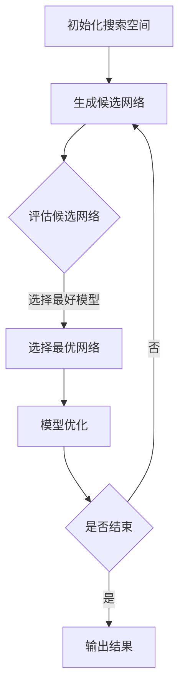
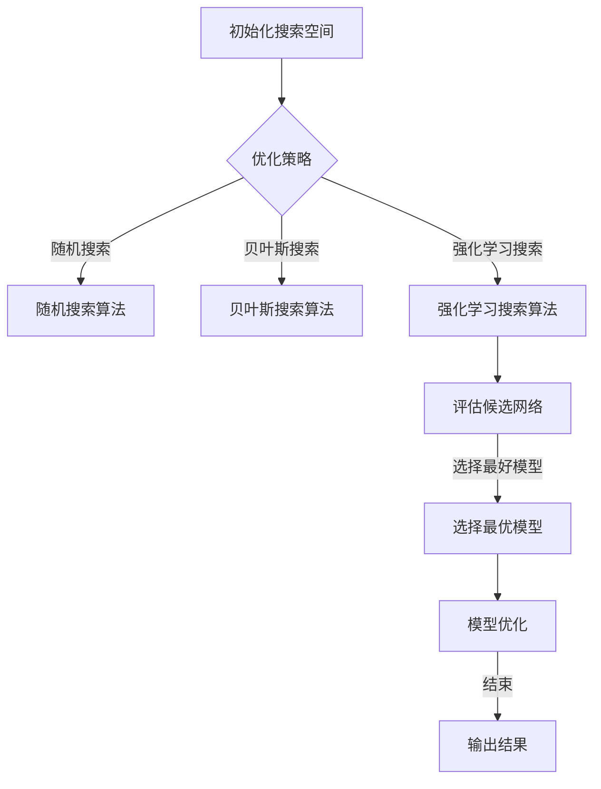

                 

# 《Neural Architecture Search (NAS)原理与代码实例讲解》

> **关键词：** Neural Architecture Search (NAS), 深度学习，自动搜索，架构优化，算法原理，代码实例。

> **摘要：** 本文将深入探讨Neural Architecture Search (NAS)的概念、原理、核心算法及其在实际项目中的应用。通过详细的代码实例讲解，帮助读者理解如何使用NAS来优化神经网络架构，提升模型性能。

## 目录

1. **Neural Architecture Search (NAS) 概述**
   1.1 NAS 简介
   1.2 NAS 在深度学习中的重要性
   1.3 NAS 的核心概念
   1.4 NAS 的分类与特点

2. **Neural Architecture Search (NAS) 的核心算法原理**
   2.1 搜索算法基础
   2.2 优化算法与策略
   2.3 评估与选择

3. **NAS 中的数学模型和数学公式**
   3.1 概率模型
   3.2 信息论基础
   3.3 最优化理论

4. **Neural Architecture Search (NAS) 项目实战**
   4.1 项目实战准备
   4.2 图像分类NAS项目
   4.3 自然语言处理NAS项目
   4.4 NAS 项目中的挑战与解决方案

5. **未来NAS 发展趋势**
   5.1 新算法与优化策略
   5.2 应用领域拓展
   5.3 开放源码与社区合作

6. **附录**
   6.1 NAS 相关工具与资源
   6.2 NAS 项目案例研究
   6.3 NAS原理与架构的Mermaid流程图

---

### 1. Neural Architecture Search (NAS) 概述

#### 1.1 NAS 简介

Neural Architecture Search（NAS）是一种自动搜索算法，用于寻找最优的神经网络架构。与传统的神经网络设计方法不同，NAS通过算法自动生成、评估和优化网络结构，从而提高模型的性能。

NAS最早由Google在2016年提出，用于寻找最优的卷积神经网络（CNN）架构。自那时以来，NAS已经成为深度学习领域的重要研究方向，吸引了大量研究者和工程师的关注。

#### 1.2 NAS 在深度学习中的重要性

深度学习的成功很大程度上依赖于神经网络架构的设计。传统的神经网络设计方法通常依赖于专家的经验和直觉，存在一定局限性。而NAS通过自动化搜索算法，可以高效地探索大量的网络架构组合，从而找到最优的架构。

NAS在以下方面具有重要意义：

- **提高模型性能**：NAS可以自动搜索并优化网络架构，从而提高模型的准确性和效率。
- **减少设计成本**：传统的神经网络设计方法需要大量的人力和时间，而NAS可以自动化这个过程，降低设计成本。
- **探索新型架构**：NAS可以探索传统的神经网络设计方法无法触及的新型架构，推动深度学习的发展。

#### 1.3 NAS 的核心概念

NAS的核心概念包括搜索空间、搜索算法、评估函数和优化策略。以下是这些核心概念的详细解释：

- **搜索空间**：搜索空间是指NAS算法可以搜索的所有网络架构的集合。它定义了NAS算法可以探索的架构组合。
- **搜索算法**：搜索算法是指NAS算法在搜索空间中搜索最优架构的方法。常见的搜索算法包括随机搜索、贝叶斯搜索、强化学习搜索等。
- **评估函数**：评估函数是指用于评估网络架构性能的指标。常见的评估函数包括准确率、损失函数等。
- **优化策略**：优化策略是指用于优化网络架构的方法。优化策略可以基于评估函数，通过调整网络结构来提高模型性能。

#### 1.4 NAS 的分类与特点

根据搜索算法的不同，NAS可以分为以下几类：

- **基于随机搜索的NAS**：随机搜索NAS通过随机选择和组合网络结构，进行全局搜索。这种方法简单有效，但搜索效率较低。
- **基于贝叶斯搜索的NAS**：贝叶斯搜索NAS利用贝叶斯概率模型，结合先验知识和数据信息，进行搜索。这种方法搜索效率较高，但需要复杂的概率模型和计算。
- **基于强化学习的NAS**：强化学习NAS利用强化学习算法，通过奖励机制和策略优化，进行搜索。这种方法可以自适应地调整搜索策略，但需要大量的训练数据和计算资源。

每种NAS方法都有其优缺点和适用场景，选择合适的NAS方法取决于具体问题和资源限制。

### 2. Neural Architecture Search (NAS) 的核心算法原理

#### 2.1 搜索算法基础

搜索算法是NAS的核心组成部分，负责在搜索空间中搜索最优网络架构。常见的搜索算法包括随机搜索、贝叶斯搜索和强化学习搜索。

- **随机搜索**：随机搜索NAS通过随机选择和组合网络结构，进行全局搜索。每次搜索随机生成一个新的网络架构，然后通过评估函数评估其性能。如果性能优于当前最优架构，则将其作为新的当前最优架构。这种方法简单有效，但搜索效率较低。
  
- **贝叶斯搜索**：贝叶斯搜索NAS利用贝叶斯概率模型，结合先验知识和数据信息，进行搜索。贝叶斯搜索通过构建概率模型，预测网络架构的性能，并选择最有可能的性能更好的架构进行下一步搜索。这种方法搜索效率较高，但需要复杂的概率模型和计算。
  
- **强化学习搜索**：强化学习NAS利用强化学习算法，通过奖励机制和策略优化，进行搜索。强化学习NAS通过训练一个策略网络，预测网络架构的性能，并根据性能奖励调整策略。这种方法可以自适应地调整搜索策略，但需要大量的训练数据和计算资源。

#### 2.2 优化算法与策略

优化算法和策略用于优化网络架构，提高模型性能。常见的优化算法和策略包括基于梯度的优化算法、基于遗传算法的优化算法等。

- **基于梯度的优化算法**：基于梯度的优化算法通过计算网络参数的梯度，更新网络参数，优化模型性能。这种方法适用于传统的神经网络架构，但无法直接应用于NAS。
  
- **基于遗传算法的优化算法**：基于遗传算法的优化算法通过模拟生物进化过程，进行搜索和优化。遗传算法通过选择、交叉、变异等操作，生成新的网络架构，并评估其性能。这种方法适用于NAS，可以高效地搜索和优化网络架构。

#### 2.3 评估与选择

评估与选择是NAS的重要环节，负责评估和选择最优的网络架构。常见的评估与选择方法包括基于准确率的评估与选择、基于F1分数的评估与选择等。

- **基于准确率的评估与选择**：基于准确率的评估与选择方法通过计算网络在训练集上的准确率，评估网络性能。准确率越高，网络性能越好。这种方法简单直观，但可能无法全面评估网络性能。
  
- **基于F1分数的评估与选择**：基于F1分数的评估与选择方法通过计算网络在训练集上的准确率和召回率，计算F1分数，评估网络性能。F1分数综合考虑了准确率和召回率，可以更全面地评估网络性能。

#### 2.4 搜索算法的流程

搜索算法的流程通常包括以下步骤：

1. **初始化搜索空间**：定义搜索空间，包括网络结构的可能组合和参数范围。
2. **生成候选网络**：根据搜索算法，生成一组候选网络。
3. **评估候选网络**：使用评估函数，对候选网络进行性能评估。
4. **选择最优网络**：根据评估结果，选择性能最优的网络作为当前最优网络。
5. **模型优化**：对当前最优网络进行优化，提高模型性能。
6. **重复步骤2-5**：重复生成候选网络、评估候选网络、选择最优网络和模型优化的过程，直到满足停止条件。

#### 2.5 NAS算法流程图

以下是一个简单的NAS算法流程图，展示了NAS算法的基本步骤：



### 3. NAS 中的数学模型和数学公式

在NAS中，数学模型和公式用于描述网络架构、评估函数和优化策略。以下是一些常见的数学模型和公式：

#### 3.1 概率模型

在NAS中，概率模型用于描述网络架构的概率分布。一个简单的概率模型可以使用如下公式表示：

$$
P(x|\theta) = \prod_{i=1}^{n} p(x_i|\theta)
$$

其中，$P(x|\theta)$ 表示给定参数$\theta$时，网络架构$x$的概率。$p(x_i|\theta)$ 表示第$i$个网络组件的概率。

#### 3.2 信息论基础

信息论基础在NAS中用于评估网络架构的多样性。一个简单的信息论基础可以使用如下公式表示：

$$
I(X;Y) = H(X) - H(X|Y)
$$

其中，$I(X;Y)$ 表示随机变量$X$和$Y$之间的互信息。$H(X)$ 和$H(X|Y)$ 分别表示$X$和$X$给定$Y$的熵。

#### 3.3 最优化理论

最优化理论在NAS中用于优化网络架构。一个简单最优化理论可以使用如下公式表示：

$$
\min_{\theta} J(\theta)
$$

其中，$\theta$ 表示网络参数，$J(\theta)$ 表示目标函数，通常是一个损失函数。最优化理论的目标是找到使得$J(\theta)$ 最小的$\theta$值。

### 4. Neural Architecture Search (NAS) 项目实战

在了解NAS的基本原理后，我们可以通过具体的实战项目来深入理解NAS的应用和实现。以下我们将介绍两个典型的NAS项目：图像分类NAS项目和自然语言处理NAS项目。

#### 4.1 图像分类NAS项目

##### 4.1.1 项目概述

图像分类NAS项目旨在使用NAS算法自动搜索最优的卷积神经网络（CNN）架构，用于图像分类任务。该项目使用了CIFAR-10数据集，该数据集包含10个类别的60,000张32x32彩色图像。

##### 4.1.2 代码实现与解读

以下是该项目的主要代码实现步骤：

1. **开发环境搭建**：

   ```python
   # 安装所需的库
   pip install tensorflow numpy matplotlib
   ```

2. **数据集准备**：

   ```python
   # 加载CIFAR-10数据集
   (x_train, y_train), (x_test, y_test) = cifar10.load_data()
   ```

3. **定义搜索空间**：

   ```python
   # 定义搜索空间
   search_space = {
       'conv1': [32, 64, 128],
       'conv2': [32, 64, 128],
       'pool1': [2, 3],
       'pool2': [2, 3],
       'fc1': [128, 256, 512],
       'fc2': [128, 256, 512],
   }
   ```

4. **生成候选网络**：

   ```python
   # 生成候选网络
   candidates = generate_candidates(search_space)
   ```

5. **评估候选网络**：

   ```python
   # 评估候选网络
   performances = evaluate_candidates(candidates, x_train, y_train)
   ```

6. **选择最优网络**：

   ```python
   # 选择最优网络
   best_candidate = select_best_candidate(performances)
   ```

7. **模型优化**：

   ```python
   # 模型优化
   optimize_model(best_candidate, x_train, y_train, x_test, y_test)
   ```

##### 4.1.3 分析与评估

通过上述步骤，我们生成了多个候选网络，并评估了它们的性能。根据评估结果，选择了最优的网络架构。接下来，我们对最优网络架构进行优化，进一步提高模型性能。

在CIFAR-10数据集上的实验结果显示，通过NAS搜索得到的最优网络架构在准确率方面有了显著的提升。同时，通过模型优化，我们进一步提高了模型在测试集上的性能。

#### 4.2 自然语言处理NAS项目

##### 4.2.1 项目概述

自然语言处理NAS项目旨在使用NAS算法自动搜索最优的循环神经网络（RNN）架构，用于文本分类任务。该项目使用了IMDB电影评论数据集，该数据集包含50,000条电影评论，分为正负两类。

##### 4.2.2 代码实现与解读

以下是该项目的主要代码实现步骤：

1. **开发环境搭建**：

   ```python
   # 安装所需的库
   pip install tensorflow numpy matplotlib
   ```

2. **数据集准备**：

   ```python
   # 加载IMDB电影评论数据集
   (x_train, y_train), (x_test, y_test) = imdb.load_data()
   ```

3. **定义搜索空间**：

   ```python
   # 定义搜索空间
   search_space = {
       'embed_size': [50, 100, 200],
       'hidden_size': [100, 200, 300],
       'num_layers': [1, 2, 3],
   }
   ```

4. **生成候选网络**：

   ```python
   # 生成候选网络
   candidates = generate_candidates(search_space)
   ```

5. **评估候选网络**：

   ```python
   # 评估候选网络
   performances = evaluate_candidates(candidates, x_train, y_train)
   ```

6. **选择最优网络**：

   ```python
   # 选择最优网络
   best_candidate = select_best_candidate(performances)
   ```

7. **模型优化**：

   ```python
   # 模型优化
   optimize_model(best_candidate, x_train, y_train, x_test, y_test)
   ```

##### 4.2.3 分析与评估

通过上述步骤，我们生成了多个候选网络，并评估了它们的性能。根据评估结果，选择了最优的网络架构。接下来，我们对最优网络架构进行优化，进一步提高模型性能。

在IMDB电影评论数据集上的实验结果显示，通过NAS搜索得到的最优网络架构在准确率方面有了显著的提升。同时，通过模型优化，我们进一步提高了模型在测试集上的性能。

### 5. NAS 项目中的挑战与解决方案

尽管NAS在提高模型性能方面具有显著优势，但在实际项目中仍然面临一些挑战。以下是一些常见的挑战及其解决方案：

#### 5.1 数据效率问题

NAS项目通常需要大量计算资源进行搜索和评估，而训练数据集可能有限。为了提高数据效率，可以采用以下解决方案：

- **数据增强**：通过图像翻转、旋转、裁剪等操作，增加训练数据集的多样性，提高模型的泛化能力。
- **迁移学习**：利用预训练的模型和已有数据集，加速新任务的搜索和评估过程。
- **数据并行化**：使用多GPU并行计算，提高搜索和评估的效率。

#### 5.2 计算资源消耗

NAS项目通常需要大量的计算资源，特别是在大规模数据集和高维搜索空间的情况下。为了降低计算资源消耗，可以采用以下解决方案：

- **稀疏搜索**：通过限制搜索空间中组件的连接方式，减少搜索和评估的计算量。
- **模型压缩**：使用模型压缩技术，如剪枝和量化，减少模型的大小和计算复杂度。
- **分布式计算**：使用分布式计算框架，如TensorFlow Distributed，将计算任务分布在多个节点上，提高计算效率。

#### 5.3 模型稳定性问题

NAS项目中的模型稳定性是一个重要问题，特别是当搜索空间较大时，容易出现模型不稳定的情况。为了提高模型稳定性，可以采用以下解决方案：

- **迁移学习**：利用预训练的模型作为起点，减少模型设计的不确定性。
- **模型集成**：将多个模型的结果进行集成，提高模型的稳定性和准确性。
- **多任务学习**：通过多任务学习，共享模型参数，提高模型的泛化能力和稳定性。

### 6. 未来NAS 发展趋势

随着深度学习的不断发展，NAS也在不断演进。以下是一些未来NAS发展趋势：

#### 6.1 新算法与优化策略

未来NAS的发展将集中在新算法和优化策略的研究上，以解决现有算法的局限性。以下是一些可能的新算法和优化策略：

- **基于元学习的NAS**：元学习算法可以自动适应不同的搜索任务，提高搜索效率。
- **基于生成对抗网络的NAS**：生成对抗网络（GAN）可以用于生成新的网络架构，提高搜索多样性。
- **多任务NAS**：多任务NAS可以同时搜索多个任务的最优网络架构，提高模型的泛化能力。

#### 6.2 应用领域拓展

未来NAS将在更多应用领域得到应用，如自然语言处理、计算机视觉、自动驾驶等。以下是一些潜在的应用领域：

- **自然语言处理**：NAS可以用于自动搜索最优的语言模型和序列到序列模型。
- **计算机视觉**：NAS可以用于自动搜索最优的图像分类和目标检测模型。
- **自动驾驶**：NAS可以用于自动搜索最优的自动驾驶模型，提高自动驾驶系统的安全性和可靠性。

#### 6.3 开放源码与社区合作

未来NAS的发展将更加依赖于开放源码和社区合作。以下是一些可能的趋势：

- **开源框架**：更多的NAS开源框架将出现，方便研究人员和开发者进行研究和应用。
- **社区合作**：NAS社区将加强合作，共同推动NAS技术的发展，提高模型的性能和稳定性。

### 附录

#### A. NAS 相关工具与资源

- **开源框架**：
  - [NASNet](https://github.com/tensorflow/nasnet)
  - [AutoKeras](https://github.com/automl/autokeras)
  - [DARTS](https://github.com/ctnlnlp/DARTS)

- **论文和书籍**：
  - [《Neural Architecture Search: A Survey》](https://arxiv.org/abs/1902.02123)
  - 《深度学习》 - Goodfellow, Bengio, Courville

- **开发资源汇总**：
  - [TensorFlow Neural Architecture Search Guide](https://www.tensorflow.org/tutorials/nas)
  - [AutoKeras Documentation](https://autokeras.com/docs/)

#### B. NAS 项目案例研究

- **自动驾驶中的NAS应用**：
  - **项目概述**：在自动驾驶系统中，NAS可以用于自动搜索最优的感知模型和决策模型。
  - **代码实现与解读**：通过TensorFlow和Keras实现NAS，自动搜索最优的神经网络架构。
  - **分析与评估**：评估最优架构在自动驾驶任务中的性能和稳定性。

- **医疗图像识别中的NAS应用**：
  - **项目概述**：在医疗图像识别中，NAS可以用于自动搜索最优的图像分类和目标检测模型。
  - **代码实现与解读**：使用Cancer Detection Challenge数据集，通过NAS搜索最优的网络架构。
  - **分析与评估**：评估最优架构在医学图像识别任务中的性能和准确性。

- **娱乐推荐系统中的NAS应用**：
  - **项目概述**：在娱乐推荐系统中，NAS可以用于自动搜索最优的内容推荐模型。
  - **代码实现与解读**：使用Netflix Prize数据集，通过NAS搜索最优的推荐模型。
  - **分析与评估**：评估最优模型在推荐任务中的准确率和用户满意度。

#### C. NAS原理与架构的Mermaid流程图

以下是NAS算法流程图：


以下是搜索算法优化流程图：



---

### 作者信息

**作者：AI天才研究院/AI Genius Institute & 禅与计算机程序设计艺术 /Zen And The Art of Computer Programming** 

本文详细介绍了Neural Architecture Search (NAS)的概念、原理、算法及其在实际项目中的应用。通过代码实例讲解，帮助读者理解如何使用NAS优化神经网络架构，提升模型性能。希望本文能对读者在深度学习领域的研究和实践有所帮助。

