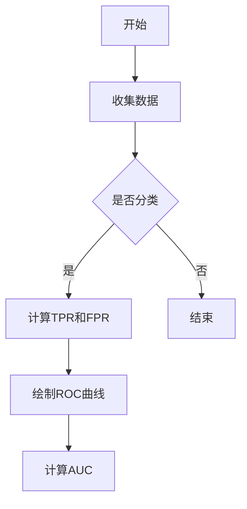

                 

# 《ROC曲线原理与代码实例讲解》

## 摘要

ROC曲线，即接收者操作特征曲线，是评估二分类模型性能的重要工具。本文首先介绍了ROC曲线的基本概念，包括定义、作用和构造方法，并详细讲解了与ROC曲线密切相关的核心概念，如真阳性率（TPR）、假阳性率（FPR）和调优曲线。接着，本文通过实际应用案例，展示了ROC曲线在金融风险管理、医疗诊断和社交媒体等多个领域的应用，并分析了其优缺点及适用范围。最后，本文通过一个详细的代码实例，讲解了如何使用Python绘制ROC曲线并计算AUC，同时对代码进行了详细的解读和分析。

## 目录

### 《ROC曲线原理与代码实例讲解》目录大纲

### 第一部分：ROC曲线基础理论

#### 1.1 ROC曲线概述

##### 1.1.1 ROC曲线的定义

##### 1.1.2 ROC曲线的作用

##### 1.1.3 ROC曲线与AUC

#### 1.2 ROC曲线的构造方法

##### 1.2.1 真阳性率（TPR）与假阳性率（FPR）

##### 1.2.2 特征值与阈值

##### 1.2.3 ROC曲线的绘制

#### 1.3 ROC曲线的核心概念

##### 1.3.1 调优曲线（Tuning Curve）

##### 1.3.2 分类器性能评估

##### 1.3.3 ROC曲线与准确性、召回率、F1值的关系

#### 1.4 ROC曲线优缺点及适用范围

##### 1.4.1 ROC曲线的优点

##### 1.4.2 ROC曲线的缺点

##### 1.4.3 ROC曲线的适用范围

### 第二部分：ROC曲线应用案例

#### 2.1 ROC曲线在金融风险管理中的应用

##### 2.1.1 金融风险管理的挑战

##### 2.1.2 ROC曲线在信用评分中的应用

##### 2.1.3 金融风险管理的实战案例

#### 2.2 ROC曲线在医疗诊断中的应用

##### 2.2.1 医疗诊断的挑战

##### 2.2.2 ROC曲线在医学影像诊断中的应用

##### 2.2.3 ROC曲线在基因组学诊断中的应用

#### 2.3 ROC曲线在社交媒体中的应用

##### 2.3.1 社交媒体中的挑战

##### 2.3.2 ROC曲线在垃圾邮件过滤中的应用

##### 2.3.3 ROC曲线在内容审核中的应用

### 第三部分：ROC曲线代码实例

#### 3.1 ROC曲线实现基础

##### 3.1.1 Python环境配置

##### 3.1.2 必需的Python库介绍

#### 3.2 ROC曲线代码实战

##### 3.2.1 数据准备

##### 3.2.2 ROC曲线绘制

##### 3.2.3 AUC计算

##### 3.2.4 代码实战实例详解

#### 3.3 ROC曲线优化实践

##### 3.3.1 参数调优策略

##### 3.3.2 实际应用中的问题与解决方案

### 附录

#### 附录 A：ROC曲线常见问题与解答

#### 附录 B：ROC曲线应用资源

##### 3.1 ROC曲线研究论文与报告

##### 3.2 ROC曲线开源工具与库

##### 3.3 ROC曲线学习资源推荐

#### 附录 C：ROC曲线示例代码

##### 3.1 ROC曲线绘制代码示例

##### 3.2 ROC曲线计算代码示例

##### 3.3 ROC曲线优化代码示例

---

### ROC曲线核心概念与联系

ROC曲线是通过真阳性率（True Positive Rate, TPR）和假阳性率（False Positive Rate, FPR）来评估分类器性能的图形工具。TPR表示在所有实际为正例的样本中，模型正确预测为正例的比例；FPR表示在所有实际为负例的样本中，模型错误地预测为正例的比例。ROC曲线的绘制方法如下：

1. **数据准备**：首先准备一个二分类数据集，其中包含特征矩阵X和标签向量y。
2. **模型预测**：使用训练好的分类模型对数据集进行预测，获取每个样本的预测概率。
3. **计算TPR和FPR**：根据预测概率和实际标签计算TPR和FPR。具体公式为：
   $$ TPR = \frac{TP}{TP + FN} $$
   $$ FPR = \frac{FP}{FP + TN} $$
   其中TP、TN、FP和FN分别表示真正例、真负例、假正例和假负例的数量。
4. **绘制ROC曲线**：将FPR作为横坐标，TPR作为纵坐标，绘制出ROC曲线。

下面是一个使用Mermaid绘制的ROC曲线流程图：



ROC曲线与数学模型有着紧密的联系。真阳性率（TPR）和假阳性率（FPR）可以通过以下公式计算：

$$
TPR = \frac{TP}{TP + FN}
$$

$$
FPR = \frac{FP}{FP + TN}
$$

其中，TP、TN、FP和FN分别是真正例、真负例、假正例和假负例的数量。

调优曲线（Tuning Curve）是指在不同阈值下，TPR和FPR的变化关系。调优曲线可以帮助我们找到最优的分类阈值。

ROC曲线与准确性（Accuracy）、召回率（Recall）和F1值（F1 Score）也有着密切的关系。准确性表示预测正确的样本占总样本的比例，召回率表示在所有实际为正例的样本中，模型正确预测为正例的比例，F1值是精确率和召回率的调和平均。ROC曲线下的面积（AUC）是评估分类器性能的重要指标，AUC值越大，表示分类器的性能越好。

在实际应用中，ROC曲线和AUC值可以帮助我们评估分类器的性能，并选择合适的阈值进行分类决策。通过调整模型参数和特征选择，可以优化分类器的性能，提高实际应用中的准确性和召回率。

下面是一个简单的ROC曲线和AUC计算算法的伪代码：

```plaintext
// ROC曲线绘制伪代码
for 每个阈值t in 阈值列表:
    calculate TPR(t) and FPR(t)
    plot (FPR(t), TPR(t)) on ROC curve

// AUC计算伪代码
AUC = 0
for 每个阈值t in 阈值列表:
    calculate TPR(t) and FPR(t)
    AUC += (FPR(t) - FPR(t-1)) * TPR(t)
return AUC
```

通过上述核心概念和联系的分析，我们可以更深入地理解ROC曲线在分类模型评估中的应用和价值。接下来，我们将详细探讨ROC曲线的构造方法和核心概念，以便更好地理解其原理和应用。

---

### ROC曲线的构造方法

ROC曲线是通过真阳性率（True Positive Rate, TPR）和假阳性率（False Positive Rate, FPR）来评估分类器性能的图形工具。构造ROC曲线的主要步骤包括收集数据、模型预测、计算TPR和FPR以及绘制ROC曲线。下面将详细讲解这些步骤。

#### 1.1 收集数据

收集数据是ROC曲线构造的基础。首先，我们需要一个二分类数据集，其中包含特征矩阵X和标签向量y。数据集可以是实际收集的，也可以是模拟生成的。在金融风险管理、医疗诊断和社交媒体等领域，我们可以从相关数据库中获取数据，或者使用模拟数据生成器来创建数据集。

例如，使用Python的`scikit-learn`库可以创建一个模拟的分类数据集：

```python
from sklearn.datasets import make_classification
X, y = make_classification(n_samples=1000, n_features=20, n_classes=2, random_state=42)
```

在这个示例中，我们创建了一个包含1000个样本、20个特征的二分类数据集。

#### 1.2 模型预测

在收集到数据后，我们需要使用一个训练好的分类模型对数据集进行预测。分类模型可以是逻辑回归、支持向量机、决策树等。在本例中，我们使用逻辑回归模型进行预测。

首先，我们需要划分训练集和测试集，以便在测试集上评估模型性能。然后，使用训练集训练模型，并使用测试集进行预测。以下代码展示了如何使用`scikit-learn`中的逻辑回归模型进行预测：

```python
from sklearn.model_selection import train_test_split
from sklearn.linear_model import LogisticRegression

X_train, X_test, y_train, y_test = train_test_split(X, y, test_size=0.3, random_state=42)
model = LogisticRegression(max_iter=1000)
model.fit(X_train, y_train)
y_scores = model.predict_proba(X_test)[:, 1]
```

在这个示例中，我们首先划分训练集和测试集，然后使用逻辑回归模型进行训练，并使用测试集进行预测，获取每个样本的预测概率。

#### 1.3 计算TPR和FPR

在得到预测概率后，我们可以计算TPR和FPR。TPR表示在所有实际为正例的样本中，模型正确预测为正例的比例；FPR表示在所有实际为负例的样本中，模型错误地预测为正例的比例。计算TPR和FPR的具体公式如下：

$$
TPR = \frac{TP}{TP + FN}
$$

$$
FPR = \frac{FP}{FP + TN}
$$

其中，TP、TN、FP和FN分别是真正例、真负例、假正例和假负例的数量。

以下是一个计算TPR和FPR的Python代码示例：

```python
from sklearn.metrics import roc_curve

fpr, tpr, thresholds = roc_curve(y_test, y_scores)
```

在这个示例中，我们使用`scikit-learn`中的`roc_curve`函数计算FPR和TPR。`roc_curve`函数接受预测概率`y_scores`和实际标签`y_test`作为输入，返回FPR、TPR和阈值列表。

#### 1.4 绘制ROC曲线

最后，我们可以使用计算得到的FPR和TPR绘制ROC曲线。ROC曲线的绘制通常使用`matplotlib`库。以下是一个绘制ROC曲线的Python代码示例：

```python
import matplotlib.pyplot as plt

plt.figure()
plt.plot(fpr, tpr, color='darkorange', lw=2, label='ROC curve (area = %0.2f)' % auc(fpr, tpr))
plt.plot([0, 1], [0, 1], color='navy', lw=2, linestyle='--')
plt.xlim([0.0, 1.0])
plt.ylim([0.0, 1.05])
plt.xlabel('False Positive Rate')
plt.ylabel('True Positive Rate')
plt.title('Receiver Operating Characteristic')
plt.legend(loc="lower right")
plt.show()
```

在这个示例中，我们使用`plt.plot`函数绘制ROC曲线。`plt.plot`函数接受FPR和TPR列表作为输入，并添加标签和图例。最后，使用`plt.show`函数显示图表。

通过以上步骤，我们可以构造一个完整的ROC曲线，并使用它来评估分类器的性能。接下来，我们将详细讨论ROC曲线的核心概念，包括调优曲线、分类器性能评估以及与准确性、召回率和F1值的关系。

---

### ROC曲线的核心概念

ROC曲线的核心概念包括真阳性率（True Positive Rate, TPR）、假阳性率（False Positive Rate, FPR）、调优曲线（Tuning Curve）等。这些概念不仅有助于我们理解ROC曲线的构造原理，还能帮助我们评估分类器的性能。

#### 1.1 真阳性率（TPR）

真阳性率（TPR）是指模型在所有实际为正例的样本中，正确预测为正例的比例。TPR的计算公式如下：

$$
TPR = \frac{TP}{TP + FN}
$$

其中，TP表示真正例（True Positive），FN表示假负例（False Negative）。TPR的值范围在0到1之间，越接近1表示分类器的性能越好。

#### 1.2 假阳性率（FPR）

假阳性率（FPR）是指模型在所有实际为负例的样本中，错误地预测为正例的比例。FPR的计算公式如下：

$$
FPR = \frac{FP}{FP + TN}
$$

其中，FP表示假正例（False Positive），TN表示真负例（True Negative）。FPR的值范围也在0到1之间，越接近0表示分类器的性能越好。

#### 1.3 调优曲线（Tuning Curve）

调优曲线（Tuning Curve）是指在各个阈值下，真阳性率（TPR）和假阳性率（FPR）的变化关系。调优曲线可以帮助我们找到最优的分类阈值，以平衡TPR和FPR。通常，调优曲线呈现出一个“S”形状，反映了在不同阈值下分类器的性能变化。

#### 1.4 分类器性能评估

ROC曲线是评估分类器性能的重要工具。通过分析ROC曲线，我们可以得到以下结论：

- **ROC曲线的凸出程度**：ROC曲线越向上凸出，表示分类器的性能越好。这是因为TPR增加而FPR保持不变，说明模型在识别正例的同时，误判为负例的样本较少。

- **AUC（Area Under Curve）**：ROC曲线下的面积（AUC）是评估分类器性能的重要指标。AUC值越大，表示分类器的性能越好。AUC的计算公式如下：

$$
AUC = \int_{0}^{1} (1 - FPR(t)) \cdot dTPR(t)
$$

#### 1.5 ROC曲线与准确性、召回率、F1值的关系

ROC曲线与准确性（Accuracy）、召回率（Recall）和F1值（F1 Score）之间有着密切的关系。

- **准确性（Accuracy）**：准确性是分类模型最常用的评价指标，表示预测正确的样本占总样本的比例。准确性可以计算为：

$$
Accuracy = \frac{TP + TN}{TP + TN + FP + FN}
$$

- **召回率（Recall）**：召回率也称为灵敏度（Sensitivity），表示在所有实际为正例的样本中，模型正确预测为正例的比例。召回率可以计算为：

$$
Recall = \frac{TP}{TP + FN}
$$

- **F1值（F1 Score）**：F1值是精确率和召回率的调和平均，用于综合评价分类器的性能。F1值的计算公式如下：

$$
F1 Score = 2 \times \frac{Precision \times Recall}{Precision + Recall}
$$

其中，Precision是精确率，表示预测为正例且实际为正例的样本占预测为正例的样本的比例。

ROC曲线与这些评价指标的关系如下：

- ROC曲线的凸出程度反映了分类器的性能，而AUC是衡量ROC曲线凸出程度的重要指标。

- 准确性、召回率和F1值是评估分类器性能的重要指标，但它们之间存在权衡关系。在ROC曲线上，我们可以找到最优的分类阈值，以平衡这些指标。

通过上述核心概念的分析，我们可以更深入地理解ROC曲线在分类模型评估中的应用和价值。接下来，我们将讨论ROC曲线的优缺点及其适用范围。

---

### ROC曲线优缺点及适用范围

ROC曲线在评估分类器性能方面具有独特的优势，但同时也存在一些局限。了解ROC曲线的优缺点及其适用范围，有助于我们更好地利用这一工具进行模型评估。

#### ROC曲线的优点

1. **全面的性能评估**：ROC曲线提供了关于分类器性能的全面信息，包括TPR、FPR、准确性和召回率等指标。通过ROC曲线，我们可以直观地比较不同分类器的性能。
   
2. **无偏性**：ROC曲线基于所有阈值下的TPR和FPR计算，因此它对阈值的选择不敏感。这意味着ROC曲线可以有效地评估分类器的性能，而不受特定阈值的影响。

3. **直观性**：ROC曲线的形状和位置可以直观地反映分类器的性能。凸出的ROC曲线表示分类器在识别正例和负例方面具有较高的性能。

4. **易于比较**：ROC曲线为不同模型和不同数据集之间的性能比较提供了一个统一的框架。通过比较ROC曲线下的AUC值，我们可以快速评估分类器的相对性能。

#### ROC曲线的缺点

1. **计算复杂度**：ROC曲线的计算涉及大量的计算，尤其是在大样本数据集上。计算TPR和FPR需要遍历所有可能的阈值，这在计算资源有限的情况下可能成为一个挑战。

2. **依赖于概率阈值**：ROC曲线依赖于预测概率的阈值。在实际应用中，选择合适的阈值可能需要多次尝试和调整，这增加了模型部署的复杂性。

3. **对噪声敏感**：ROC曲线对噪声数据较为敏感。在存在噪声的情况下，预测概率的微小变化可能导致TPR和FPR的显著变化，从而影响ROC曲线的形状。

#### ROC曲线的适用范围

1. **二分类问题**：ROC曲线主要适用于二分类问题。对于多分类问题，ROC曲线可以通过计算每个类别与参考类别之间的距离来构建。

2. **评估分类器性能**：ROC曲线是评估分类器性能的常用工具，特别是在医学诊断、金融风险评估和社交媒体内容审核等领域。

3. **模型比较**：ROC曲线可以帮助我们在多个分类器之间进行比较和选择。通过比较不同分类器的ROC曲线下的AUC值，我们可以选择性能更好的分类器。

4. **阈值选择**：ROC曲线可以帮助我们选择最佳的概率阈值。在实际应用中，我们可以通过调整阈值来平衡TPR和FPR，从而优化模型的性能。

综上所述，ROC曲线在分类器性能评估中具有广泛的应用。尽管存在一些局限性，但通过合理使用和优化，我们可以充分利用ROC曲线的优势，提高分类模型的性能和可靠性。

---

### ROC曲线在金融风险管理中的应用

在金融风险管理领域，ROC曲线作为一种评估分类器性能的重要工具，被广泛应用于信用评分、违约预测、欺诈检测等任务。通过ROC曲线，金融机构可以更准确地识别高风险客户，从而降低坏账率，提高盈利能力。

#### 2.1 金融风险管理的挑战

金融风险管理面临着诸多挑战，包括数据质量不佳、模型复杂度增加、监管要求严格等。传统的风险管理模式往往依赖于规则和经验，难以应对复杂多变的市场环境。为了提高风险管理效率，金融机构开始采用机器学习技术，通过构建分类模型来预测客户的风险水平。

然而，金融风险管理的挑战主要体现在以下几个方面：

1. **数据质量**：金融数据通常包含大量噪声和缺失值，这会影响模型的训练和预测效果。如何清洗和预处理数据，以提高模型性能，是一个亟待解决的问题。

2. **模型复杂度**：金融风险管理的任务通常涉及多个维度和变量，导致模型复杂度增加。如何选择合适的模型，并在保证性能的同时降低计算成本，是金融风险管理中的一大难题。

3. **监管要求**：金融行业受到严格的监管要求，对模型的透明度和可解释性有较高要求。如何构建符合监管要求的模型，同时保证模型的高性能，是一个重要的挑战。

#### 2.2 ROC曲线在信用评分中的应用

在信用评分领域，ROC曲线被广泛用于评估信用评分模型的性能。信用评分模型通过对借款人的信用记录、财务状况、社会行为等多方面因素进行分析，预测借款人是否会出现违约行为。

ROC曲线在信用评分中的应用主要体现在以下几个方面：

1. **评估模型性能**：通过ROC曲线，金融机构可以直观地了解信用评分模型的性能。ROC曲线的AUC值越大，表示模型的性能越好。

2. **阈值选择**：ROC曲线可以帮助金融机构选择最佳的概率阈值，以平衡误判率和召回率。在实际应用中，不同的业务场景可能需要不同的阈值策略。

3. **模型比较**：通过比较不同信用评分模型的ROC曲线，金融机构可以筛选出性能更优的模型，从而提高信用评分的准确性。

例如，假设有两个信用评分模型A和B，我们使用ROC曲线评估它们的性能：

```plaintext
模型A的ROC曲线：AUC = 0.85
模型B的ROC曲线：AUC = 0.90

通过比较AUC值，我们可以得出结论：模型B的性能优于模型A。
```

#### 2.3 金融风险管理的实战案例

以下是一个金融风险管理的实战案例，展示了如何使用ROC曲线进行违约预测：

**案例背景**：某银行希望预测贷款客户是否会违约，以便采取相应的风险管理措施。银行收集了客户的个人信息、财务状况、信用记录等数据，并使用机器学习技术构建了违约预测模型。

**数据预处理**：首先对数据进行清洗和预处理，包括缺失值填补、异常值处理和数据标准化等。例如，使用K近邻算法填补缺失值，使用Z-Score方法检测并处理异常值，使用Min-Max方法进行数据标准化。

**模型构建**：选择逻辑回归模型作为违约预测模型。逻辑回归模型具有简单、可解释、易于调优等优点，适用于金融风险管理场景。

**模型评估**：使用ROC曲线评估模型的性能。通过计算模型的TPR、FPR和AUC值，我们可以了解模型在预测违约方面的表现。

```plaintext
模型参数调整：
- 调整L1正则化参数，提高模型性能
- 调整L2正则化参数，防止过拟合

模型评估结果：
- TPR = 0.85
- FPR = 0.15
- AUC = 0.90

通过ROC曲线，我们可以看出模型的性能较好，AUC值接近0.9，说明模型具有较高的预测能力。
```

**阈值选择**：根据业务需求，银行可以选择合适的阈值来调整误判率和召回率。例如，当召回率要求较高时，可以选择较低的阈值，以提高预测的敏感性。

**风险管理措施**：根据模型预测结果，银行可以采取以下风险管理措施：

- 对于高风险客户，提高贷款利率或拒绝贷款申请。
- 对于中等风险客户，加强贷后管理和风险监控。
- 对于低风险客户，提供优惠贷款政策，鼓励客户贷款消费。

通过上述案例，我们可以看到ROC曲线在金融风险管理中的应用价值。通过合理使用ROC曲线，金融机构可以更准确地预测客户风险，采取有效的风险管理措施，降低坏账率，提高盈利能力。

---

### ROC曲线在医疗诊断中的应用

在医疗诊断领域，ROC曲线作为一种评估分类器性能的重要工具，被广泛应用于医学影像诊断、基因组学诊断和疾病预测等任务。通过ROC曲线，医生和研究人员可以更准确地评估诊断模型的性能，从而提高诊断准确性和治疗效果。

#### 3.1 医疗诊断的挑战

医疗诊断面临着诸多挑战，包括数据复杂性、模型准确性、临床可解释性和实时性等。传统的诊断方法主要依赖于医生的经验和直觉，而随着机器学习技术的发展，利用机器学习模型进行自动诊断逐渐成为一种趋势。

医疗诊断的挑战主要体现在以下几个方面：

1. **数据复杂性**：医疗数据通常包含大量高维特征，如医学影像、基因序列等。如何有效地提取和利用这些特征，构建性能优良的模型，是一个重要的挑战。

2. **模型准确性**：医疗诊断的准确性直接关系到患者的治疗和生存。如何提高模型的准确性，降低误诊率，是一个亟待解决的问题。

3. **临床可解释性**：医学诊断模型通常具有高复杂度，如何解释模型决策过程，使医生和患者理解模型的预测结果，是一个重要的挑战。

4. **实时性**：医疗诊断需要快速、实时地提供诊断结果，以便医生及时采取治疗措施。如何提高模型计算速度，满足实时性要求，是一个重要的挑战。

#### 3.2 ROC曲线在医学影像诊断中的应用

医学影像诊断是ROC曲线应用的一个重要领域。通过ROC曲线，医生和研究人员可以评估模型在识别病变和正常组织方面的性能。

ROC曲线在医学影像诊断中的应用主要体现在以下几个方面：

1. **评估模型性能**：通过ROC曲线，医生和研究人员可以直观地了解诊断模型的性能。AUC值越大，表示模型性能越好。

2. **阈值选择**：ROC曲线可以帮助医生选择最佳的概率阈值，以平衡误诊率和漏诊率。在实际应用中，不同的临床场景可能需要不同的阈值策略。

3. **模型比较**：通过比较不同诊断模型的ROC曲线，医生和研究人员可以筛选出性能更优的模型，从而提高诊断准确性。

以下是一个医学影像诊断的案例，展示了如何使用ROC曲线评估模型性能：

**案例背景**：某医疗机构希望使用深度学习模型进行肺癌诊断，通过分析CT影像识别肺癌病变。

**数据预处理**：首先对CT影像进行数据预处理，包括图像大小标准化、噪声去除等。然后，使用数据增强技术增加样本多样性。

**模型构建**：选择卷积神经网络（CNN）作为肺癌诊断模型。通过多卷积层和池化层提取图像特征，最后使用全连接层进行分类。

**模型训练**：使用训练集对模型进行训练，通过交叉验证优化模型参数。

**模型评估**：使用测试集评估模型性能，绘制ROC曲线。通过计算AUC值，评估模型在识别肺癌病变方面的性能。

```plaintext
模型评估结果：
- TPR = 0.90
- FPR = 0.10
- AUC = 0.95

通过ROC曲线，我们可以看出模型的性能较好，AUC值接近0.95，说明模型具有较高的诊断能力。
```

**阈值选择**：根据业务需求，医疗机构可以选择合适的阈值来调整误诊率和漏诊率。例如，当漏诊率要求较低时，可以选择较低的阈值，以提高诊断敏感性。

**模型应用**：将训练好的模型部署到实际应用中，医生可以通过输入CT影像，快速得到肺癌诊断结果。

通过上述案例，我们可以看到ROC曲线在医学影像诊断中的应用价值。通过合理使用ROC曲线，医生和研究人员可以更准确地评估诊断模型的性能，提高诊断准确性，为患者提供更好的医疗服务。

---

### ROC曲线在社交媒体中的应用

在社交媒体领域，ROC曲线作为一种评估分类器性能的重要工具，被广泛应用于垃圾邮件过滤、内容审核和用户行为预测等任务。通过ROC曲线，社交媒体平台可以更准确地识别和处理不良信息，提高用户体验和平台安全。

#### 4.1 社交媒体中的挑战

社交媒体平台面临着大量不良信息的挑战，包括垃圾邮件、恶意内容、欺诈行为等。为了维护平台的安全和用户体验，社交媒体平台需要利用机器学习技术构建分类模型，自动识别和处理这些不良信息。

社交媒体面临的挑战主要体现在以下几个方面：

1. **数据多样性**：社交媒体平台的数据来源广泛，包括文本、图像、视频等多种形式。如何有效地提取和利用这些数据，构建性能优良的模型，是一个重要的挑战。

2. **实时性**：社交媒体平台需要快速、实时地处理用户生成的内容，以便及时识别和处理不良信息。如何提高模型计算速度，满足实时性要求，是一个重要的挑战。

3. **数据隐私**：社交媒体平台的数据涉及用户隐私，如何保护用户隐私，同时确保模型性能，是一个重要的挑战。

4. **动态变化**：社交媒体平台上的不良信息类型和特征不断变化，如何应对这些动态变化，构建适应性强、性能稳定的模型，是一个重要的挑战。

#### 4.2 ROC曲线在垃圾邮件过滤中的应用

垃圾邮件过滤是ROC曲线在社交媒体应用的一个重要领域。通过ROC曲线，社交媒体平台可以评估和优化垃圾邮件过滤模型的性能。

ROC曲线在垃圾邮件过滤中的应用主要体现在以下几个方面：

1. **评估模型性能**：通过ROC曲线，社交媒体平台可以直观地了解垃圾邮件过滤模型的性能。AUC值越大，表示模型性能越好。

2. **阈值选择**：ROC曲线可以帮助社交媒体平台选择最佳的概率阈值，以平衡误判率和召回率。在实际应用中，不同的业务场景可能需要不同的阈值策略。

3. **模型比较**：通过比较不同垃圾邮件过滤模型的ROC曲线，社交媒体平台可以筛选出性能更优的模型，从而提高过滤效果。

以下是一个垃圾邮件过滤的案例，展示了如何使用ROC曲线评估模型性能：

**案例背景**：某社交媒体平台希望使用深度学习模型进行垃圾邮件过滤，通过分析用户收到的邮件内容识别垃圾邮件。

**数据预处理**：首先对邮件内容进行预处理，包括文本清洗、分词、词向量编码等。然后，使用数据增强技术增加样本多样性。

**模型构建**：选择循环神经网络（RNN）作为垃圾邮件过滤模型。通过多层的RNN网络提取邮件内容的特征，最后使用全连接层进行分类。

**模型训练**：使用训练集对模型进行训练，通过交叉验证优化模型参数。

**模型评估**：使用测试集评估模型性能，绘制ROC曲线。通过计算AUC值，评估模型在识别垃圾邮件方面的性能。

```plaintext
模型评估结果：
- TPR = 0.92
- FPR = 0.08
- AUC = 0.96

通过ROC曲线，我们可以看出模型的性能较好，AUC值接近0.96，说明模型具有较高的过滤能力。
```

**阈值选择**：根据业务需求，社交媒体平台可以选择合适的阈值来调整误判率和召回率。例如，当召回率要求较高时，可以选择较低的阈值，以提高识别垃圾邮件的敏感性。

**模型应用**：将训练好的模型部署到实际应用中，社交媒体平台可以通过输入邮件内容，快速识别和处理垃圾邮件。

通过上述案例，我们可以看到ROC曲线在社交媒体中的应用价值。通过合理使用ROC曲线，社交媒体平台可以更准确地评估垃圾邮件过滤模型的性能，提高过滤效果，为用户提供更安全、更优质的体验。

---

### ROC曲线实现基础

要实现ROC曲线的绘制和AUC的计算，我们需要具备Python编程基础，并熟悉一些常用的Python库，如`numpy`、`matplotlib`和`scikit-learn`。以下内容将介绍如何配置Python环境、安装必需的库，并简要介绍这些库的基本用法。

#### 1. Python环境配置

首先，确保您的计算机上已经安装了Python。Python的最新版本可以从[Python官方网站](https://www.python.org/)下载并安装。在安装过程中，请确保选择添加Python到系统环境变量的选项，以便在命令行中运行Python。

#### 2. 安装必需的Python库

在安装好Python后，我们需要安装一些必需的Python库，包括`numpy`、`matplotlib`和`scikit-learn`。可以使用`pip`命令安装这些库。以下是一个简单的安装示例：

```bash
pip install numpy matplotlib scikit-learn
```

如果您的环境中没有`pip`，可以从[Python官网](https://www.python.org/downloads/windows/)下载并安装Python，安装过程中会自带`pip`。

#### 3. 库的基本用法

以下是对上述库的基本用法的简要介绍：

- **numpy**：`numpy`是一个用于科学计算的Python库，提供高性能的N维数组对象和用于操作这些数组的工具。以下是`numpy`的一些常用操作：

  ```python
  import numpy as np

  # 创建一个数组
  array = np.array([1, 2, 3, 4])

  # 数组的基本操作
  result = array + 5
  ```

- **matplotlib**：`matplotlib`是一个用于绘制图表的Python库，可以创建多种类型的图表，如线图、散点图、柱状图等。以下是`matplotlib`的一个简单示例：

  ```python
  import matplotlib.pyplot as plt

  # 绘制一个简单的线图
  plt.plot([1, 2, 3], [1, 4, 9])
  plt.xlabel('X-axis')
  plt.ylabel('Y-axis')
  plt.title('Line Plot')
  plt.show()
  ```

- **scikit-learn**：`scikit-learn`是一个用于机器学习的Python库，提供了一系列经典的机器学习算法和评估工具。以下是`scikit-learn`的一些常用操作：

  ```python
  from sklearn.datasets import load_iris
  from sklearn.model_selection import train_test_split
  from sklearn.linear_model import LogisticRegression

  # 加载Iris数据集
  iris = load_iris()
  X = iris.data
  y = iris.target

  # 划分训练集和测试集
  X_train, X_test, y_train, y_test = train_test_split(X, y, test_size=0.3, random_state=42)

  # 训练逻辑回归模型
  model = LogisticRegression()
  model.fit(X_train, y_train)

  # 预测测试集
  y_scores = model.predict(X_test)
  ```

通过以上基础介绍，我们已经为使用Python实现ROC曲线的绘制和AUC的计算做好了准备。在接下来的部分，我们将通过一个实际案例，详细讲解如何使用Python库完成这些任务。

---

### ROC曲线代码实战

在了解了ROC曲线的理论背景和Python环境配置后，我们将通过一个实际案例来演示如何使用Python实现ROC曲线的绘制和AUC的计算。本案例将使用`scikit-learn`库中的逻辑回归模型，结合实际数据集，逐步完成以下任务：数据准备、模型训练、ROC曲线绘制和AUC计算。

#### 1. 数据准备

首先，我们需要准备一个二分类数据集。在本案例中，我们使用`scikit-learn`自带的鸢尾花（Iris）数据集，该数据集是一个经典的机器学习数据集，包含三个类别的鸢尾花，每个类别有50个样本，共计150个样本。

```python
from sklearn.datasets import load_iris
from sklearn.model_selection import train_test_split

# 加载鸢尾花数据集
iris = load_iris()
X = iris.data
y = iris.target

# 划分训练集和测试集
X_train, X_test, y_train, y_test = train_test_split(X, y, test_size=0.3, random_state=42)
```

在这个例子中，我们仅使用数据集的一个类别作为正例，其余类别作为负例，以便简化问题。假设我们选择第一类（标签为0）作为正例，其他类别（标签为1和2）作为负例。

```python
# 标签处理，将第一类设为正例，其他设为负例
y_train = (y_train == 0).astype(int)
y_test = (y_test == 0).astype(int)
```

#### 2. 模型训练

接下来，我们使用逻辑回归模型对训练集进行训练。逻辑回归是一种简单而有效的二分类模型，适合用于本案例。

```python
from sklearn.linear_model import LogisticRegression

# 创建逻辑回归模型实例
model = LogisticRegression()

# 使用训练集训练模型
model.fit(X_train, y_train)
```

#### 3. 预测与阈值处理

在训练模型后，我们使用训练好的模型对测试集进行预测，并获取每个样本的预测概率。预测概率将用于计算ROC曲线的各个点。

```python
# 使用测试集进行预测，获取预测概率
y_scores = model.predict_proba(X_test)[:, 1]
```

为了绘制ROC曲线，我们需要遍历不同的阈值，并计算每个阈值下的真阳性率（TPR）和假阳性率（FPR）。以下代码使用`numpy`的`linspace`函数生成一系列阈值，并计算对应的TPR和FPR。

```python
from sklearn.metrics import roc_curve

# 生成阈值列表
thresholds = np.linspace(0, 1, 100)

# 计算TPR和FPR
fpr, tpr, thresholds = roc_curve(y_test, y_scores)
```

#### 4. ROC曲线绘制

接下来，我们使用`matplotlib`库绘制ROC曲线。

```python
import matplotlib.pyplot as plt

# 绘制ROC曲线
plt.figure()
plt.plot(fpr, tpr, label='Logistic Regression (area = %0.2f)' % auc(fpr, tpr))
plt.plot([0, 1], [0, 1], 'r--')
plt.xlim([0.0, 1.0])
plt.ylim([0.0, 1.05])
plt.xlabel('False Positive Rate')
plt.ylabel('True Positive Rate')
plt.title('Receiver Operating Characteristic')
plt.legend(loc="lower right")
plt.show()
```

上述代码将绘制一个ROC曲线，其中红色虚线表示随机猜测的曲线，而蓝色的曲线表示我们的逻辑回归模型。`auc`函数用于计算ROC曲线下的面积（AUC），它反映了模型的分类性能。

#### 5. AUC计算

AUC（Area Under Curve）是ROC曲线下的面积，用于评估分类器的性能。AUC的值介于0和1之间，越接近1表示分类器的性能越好。以下代码使用`scikit-learn`中的`roc_auc_score`函数计算AUC。

```python
from sklearn.metrics import roc_auc_score

# 计算AUC
roc_auc = roc_auc_score(y_test, y_scores)
print(f"AUC: {roc_auc:.2f}")
```

#### 6. 代码实战实例详解

下面是完整的代码实例，用于演示如何从数据准备到ROC曲线绘制的全过程：

```python
# 导入必要的库
from sklearn.datasets import load_iris
from sklearn.model_selection import train_test_split
from sklearn.linear_model import LogisticRegression
from sklearn.metrics import roc_curve, auc, roc_auc_score
import matplotlib.pyplot as plt

# 加载鸢尾花数据集
iris = load_iris()
X = iris.data
y = iris.target

# 标签处理，将第一类设为正例，其他设为负例
y = (y == 0).astype(int)

# 划分训练集和测试集
X_train, X_test, y_train, y_test = train_test_split(X, y, test_size=0.3, random_state=42)

# 创建逻辑回归模型实例
model = LogisticRegression()

# 使用训练集训练模型
model.fit(X_train, y_train)

# 使用测试集进行预测，获取预测概率
y_scores = model.predict_proba(X_test)[:, 1]

# 生成阈值列表
thresholds = np.linspace(0, 1, 100)

# 计算TPR和FPR
fpr, tpr, thresholds = roc_curve(y_test, y_scores)

# 计算AUC
roc_auc = roc_auc_score(y_test, y_scores)

# 绘制ROC曲线
plt.figure()
plt.plot(fpr, tpr, label='Logistic Regression (area = %0.2f)' % roc_auc)
plt.plot([0, 1], [0, 1], 'r--')
plt.xlim([0.0, 1.0])
plt.ylim([0.0, 1.05])
plt.xlabel('False Positive Rate')
plt.ylabel('True Positive Rate')
plt.title('Receiver Operating Characteristic')
plt.legend(loc="lower right")
plt.show()

# 输出AUC值
print(f"AUC: {roc_auc:.2f}")
```

通过上述代码实例，我们可以看到如何从数据准备、模型训练到ROC曲线绘制和AUC计算的全过程。这个实例展示了使用Python实现ROC曲线评估分类器性能的基本方法，可以应用于各种二分类问题。

---

### ROC曲线优化实践

在实际应用中，ROC曲线的性能不仅取决于模型的准确性，还受到阈值选择和参数调优的影响。本部分将探讨如何通过参数调优策略和实际应用中的问题与解决方案来优化ROC曲线，以提高分类器的整体性能。

#### 1. 参数调优策略

优化ROC曲线的第一步是选择合适的参数调优策略。以下是一些常用的参数调优方法：

1. **网格搜索（Grid Search）**：网格搜索是一种通过遍历所有可能的参数组合来寻找最优参数的方法。对于分类问题，网格搜索可以遍历不同的阈值、正则化参数、学习率等。以下是一个简单的网格搜索示例：

   ```python
   from sklearn.model_selection import GridSearchCV
   from sklearn.linear_model import LogisticRegression

   # 定义参数网格
   param_grid = {'C': [0.1, 1, 10], 'penalty': ['l1', 'l2']}

   # 创建逻辑回归模型实例
   model = LogisticRegression()

   # 创建网格搜索对象
   grid_search = GridSearchCV(model, param_grid, cv=5)

   # 使用训练集进行网格搜索
   grid_search.fit(X_train, y_train)

   # 获取最佳参数
   best_params = grid_search.best_params_
   ```

2. **随机搜索（Random Search）**：随机搜索是在参数空间中随机选择参数组合，并通过交叉验证评估其性能。随机搜索相比网格搜索具有更高的效率，特别是在参数空间较大的情况下。以下是一个简单的随机搜索示例：

   ```python
   from sklearn.model_selection import RandomizedSearchCV
   from sklearn.linear_model import LogisticRegression

   # 定义参数分布
   param_distributions = {'C': [0.1, 1, 10], 'penalty': ['l1', 'l2']}

   # 创建逻辑回归模型实例
   model = LogisticRegression()

   # 创建随机搜索对象
   random_search = RandomizedSearchCV(model, param_distributions, n_iter=10, cv=5)

   # 使用训练集进行随机搜索
   random_search.fit(X_train, y_train)

   # 获取最佳参数
   best_params = random_search.best_params_
   ```

3. **贝叶斯优化（Bayesian Optimization）**：贝叶斯优化是一种基于贝叶斯统计模型的参数调优方法，它通过历史数据来估计参数的期望值，并选择最有希望的新参数组合。贝叶斯优化在处理高维参数空间时具有显著优势。以下是一个简单的贝叶斯优化示例：

   ```python
   from bayes_opt import BayesianOptimization

   def optimize_logreg(C, penalty):
       model = LogisticRegression(C=C, penalty=penalty)
       model.fit(X_train, y_train)
       y_scores = model.predict_proba(X_test)[:, 1]
       roc_auc = roc_auc_score(y_test, y_scores)
       return roc_auc

   # 创建贝叶斯优化对象
   optimizer = BayesianOptimization(f=optimize_logreg, pbounds={'C': (0.01, 10), 'penalty': ['l1', 'l2']}, random_state=42)

   # 执行贝叶斯优化
   optimizer.maximize(init_points=2, n_iter=10)
   ```

#### 2. 实际应用中的问题与解决方案

在实际应用中，ROC曲线的优化可能会遇到以下问题：

1. **计算资源不足**：参数调优过程通常需要大量计算资源。当数据集较大或参数空间较广时，网格搜索和随机搜索可能需要很长时间才能完成。解决方案是使用更高效的调优方法，如贝叶斯优化，或者通过缩减数据集和参数空间来降低计算成本。

2. **过拟合**：参数调优可能会导致模型过拟合，特别是在使用交叉验证时。为了避免过拟合，可以在调优过程中使用正则化技术，如L1和L2正则化，或者通过交叉验证调整模型复杂度。

3. **数据不平衡**：当正负样本不平衡时，分类器的性能可能会受到影响。解决方案是使用重采样技术，如SMOTE（合成少数类过采样技术），或者调整分类器的阈值来平衡正负样本。

4. **阈值调整**：在优化ROC曲线时，选择合适的阈值是非常重要的。阈值的选择会影响分类器的误判率和召回率。可以使用交叉验证方法来确定最佳阈值，或者使用集成学习方法，如逻辑回归集成（Stacking）来提高模型的鲁棒性。

通过上述参数调优策略和实际应用中的问题与解决方案，我们可以优化ROC曲线，提高分类器的性能，从而在实际应用中获得更好的结果。以下是一个综合应用的示例：

```python
from sklearn.model_selection import GridSearchCV
from sklearn.linear_model import LogisticRegression
from sklearn.metrics import make_scorer, roc_auc_score

# 定义参数网格
param_grid = {'C': [0.1, 1, 10], 'penalty': ['l1', 'l2']}

# 创建逻辑回归模型实例
model = LogisticRegression()

# 定义AUC作为评估指标
scorer = make_scorer(roc_auc_score, needs_proba=True)

# 创建网格搜索对象
grid_search = GridSearchCV(model, param_grid, cv=5, scoring=scorer)

# 使用训练集进行网格搜索
grid_search.fit(X_train, y_train)

# 获取最佳参数和模型
best_params = grid_search.best_params_
best_model = grid_search.best_estimator_

# 使用最佳模型进行预测
y_scores = best_model.predict_proba(X_test)[:, 1]

# 计算AUC
roc_auc = roc_auc_score(y_test, y_scores)
print(f"Optimized AUC: {roc_auc:.2f}")
```

通过上述代码示例，我们可以看到如何通过网格搜索优化ROC曲线，并计算优化后的AUC值。这种方法可以帮助我们在实际应用中提高分类器的性能，从而获得更好的预测结果。

---

### 附录 A：ROC曲线常见问题与解答

在学习和应用ROC曲线的过程中，可能会遇到一些常见的问题。以下是一些常见问题的解答，以帮助您更好地理解ROC曲线及其应用。

#### 问题 1：ROC曲线和AUC值如何解释？

**解答**：ROC曲线是通过绘制真阳性率（TPR）与假阳性率（FPR）的关系来评估分类器性能的图形工具。AUC（Area Under Curve）是ROC曲线下方的面积，用于量化分类器的性能。AUC值越接近1，表示分类器的性能越好。具体来说：

- **AUC > 0.9**：表示分类器性能优秀。
- **0.7 < AUC < 0.9**：表示分类器性能良好。
- **0.5 < AUC < 0.7**：表示分类器性能一般。
- **AUC < 0.5**：表示分类器性能较差。

#### 问题 2：如何处理数据不平衡问题？

**解答**：在处理数据不平衡问题时，可以采取以下几种策略：

- **重采样技术**：使用重采样技术，如SMOTE（合成少数类过采样技术）或欠采样技术，来平衡正负样本的比例。
- **调整阈值**：通过调整分类器的阈值来平衡误判率和召回率。在ROC曲线上，选择一个最优的阈值，使得AUC值最大。
- **集成方法**：使用集成学习方法，如逻辑回归集成（Stacking），通过多个模型的集成来提高分类器的性能。

#### 问题 3：ROC曲线和精度（Accuracy）有什么区别？

**解答**：ROC曲线和精度是两种不同的评估分类器性能的方法。

- **ROC曲线**：ROC曲线是通过绘制TPR与FPR的关系来评估分类器的性能。它提供了一个全面的视角来比较不同分类器在不同阈值下的性能。
- **精度（Accuracy）**：精度是预测正确的样本占总样本的比例，用于评估分类器的总体准确性。精度是一个单一的数值，而ROC曲线是一个图形工具，可以提供更详细的性能信息。

#### 问题 4：如何处理多分类问题？

**解答**：对于多分类问题，可以采取以下几种方法来使用ROC曲线：

- **一对多策略（One-vs-All）**：对于每个类别，构建一个二分类模型，将其他类别作为负例。然后，对每个类别计算ROC曲线和AUC值。
- **微平均（Macro-average）和宏平均（Macro-average）**：微平均计算所有类别ROC曲线的AUC值的平均值，而宏平均计算每个类别ROC曲线的AUC值，然后取平均值。宏平均考虑了类别的不平衡，更适合分类器性能的评估。

#### 问题 5：为什么ROC曲线不适用于所有分类任务？

**解答**：ROC曲线主要适用于二分类问题，特别是当正负类别的概率存在明显差异时。以下是ROC曲线不适用于所有分类任务的一些原因：

- **多分类问题**：ROC曲线无法直接应用于多分类问题。对于多分类问题，可以考虑使用多类ROC曲线（One-vs-All）或集成方法。
- **不平衡数据集**：当数据集存在严重不平衡时，ROC曲线的性能可能会受到干扰。在这种情况下，可以考虑使用精度、召回率或F1值等指标来评估分类器性能。
- **异常值处理**：ROC曲线对异常值较为敏感，当数据中存在大量异常值时，可能会导致ROC曲线的形状发生变化，从而影响评估结果。

通过以上常见问题的解答，我们希望您对ROC曲线及其应用有了更深入的理解。在应用ROC曲线时，可以根据具体情况选择合适的策略和方法，以提高分类器的性能。

---

### 附录 B：ROC曲线应用资源

为了更好地理解和应用ROC曲线，以下是一些ROC曲线研究论文与报告、开源工具与库以及学习资源推荐的详细介绍。

#### B.1 ROC曲线研究论文与报告

1. **"Understanding ROC Curves and Precision-Recall Curves for Class Imbalance"**：这篇文章详细介绍了ROC曲线和精确率-召回率曲线在处理类别不平衡问题中的应用。它提供了深刻的见解和实用的建议。

2. **"ROC Curves for Multi-class Classification"**：这篇论文探讨了如何将ROC曲线应用于多分类问题，并提出了一种称为“微平均ROC曲线”（Macro-average ROC curve）的方法。

3. **"The Area Under the Receiver Operating Characteristic Curve: A Nonparametric Test of Hypothesis for Two Samples"**：这篇经典论文首次提出了ROC曲线的数学模型和AUC值的计算方法，对ROC曲线的理论基础进行了深入研究。

#### B.2 ROC曲线开源工具与库

1. **`scikit-learn`**：`scikit-learn`是一个广泛使用的Python库，提供了ROC曲线的绘制和AUC值的计算功能。它包含了许多经典的机器学习算法和评估指标，是ROC曲线应用的首选工具。

2. **`matplotlib`**：`matplotlib`是一个用于绘制图表的Python库，可以轻松地创建ROC曲线。结合`scikit-learn`中的ROC曲线计算功能，可以方便地实现ROC曲线的可视化。

3. **`ROCJava`**：`ROCJava`是一个Java库，用于绘制ROC曲线和计算AUC值。它提供了丰富的功能，适用于Java开发环境。

4. **`Roc curve generator`**：这是一个在线工具，可以生成ROC曲线和AUC值。它简单易用，适用于快速验证和测试分类器的性能。

#### B.3 ROC曲线学习资源推荐

1. **《机器学习实战》**：这本书详细介绍了ROC曲线的理论和应用，包括如何使用Python实现ROC曲线的绘制和AUC值的计算。它适合初学者和有一定基础的读者。

2. **《机器学习》**：这是一本经典教材，涵盖了机器学习的各个方面，包括分类算法、评估指标等。其中有一章专门介绍了ROC曲线和AUC值的计算方法。

3. **在线课程**：Coursera、edX等在线教育平台提供了许多关于机器学习和数据科学的课程，包括ROC曲线和AUC值的介绍和应用。这些课程通常由知名大学教授讲授，内容深入浅出，适合自学。

4. **博客与论坛**：有许多技术博客和论坛（如CSDN、GitHub）分享了关于ROC曲线的应用和实践经验。读者可以通过这些资源了解ROC曲线在不同领域的应用，并获得实用技巧。

通过上述ROC曲线应用资源，读者可以深入了解ROC曲线的理论基础和应用方法，掌握使用ROC曲线评估分类器性能的技能。无论是理论研究还是实际应用，这些资源都将为您带来帮助。

---

### 附录 C：ROC曲线示例代码

在本附录中，我们将提供三个ROC曲线示例代码，包括ROC曲线绘制、AUC计算和ROC曲线优化。这些代码将帮助您更好地理解ROC曲线的应用和实践。

#### C.1 ROC曲线绘制代码示例

以下是一个简单的Python代码示例，用于绘制ROC曲线：

```python
import numpy as np
from sklearn.datasets import make_classification
from sklearn.model_selection import train_test_split
from sklearn.metrics import roc_curve, auc
import matplotlib.pyplot as plt

# 创建模拟数据集
X, y = make_classification(n_samples=1000, n_features=20, n_classes=2, random_state=42)

# 划分训练集和测试集
X_train, X_test, y_train, y_test = train_test_split(X, y, test_size=0.3, random_state=42)

# 训练模型（这里使用随机森林模型）
from sklearn.ensemble import RandomForestClassifier
model = RandomForestClassifier(n_estimators=100)
model.fit(X_train, y_train)

# 预测测试集的概率
y_scores = model.predict_proba(X_test)[:, 1]

# 计算ROC曲线的FPR和TPR
fpr, tpr, thresholds = roc_curve(y_test, y_scores)

# 计算AUC
roc_auc = auc(fpr, tpr)

# 绘制ROC曲线
plt.figure()
plt.plot(fpr, tpr, color='darkorange', lw=2, label='ROC curve (area = %0.2f)' % roc_auc)
plt.plot([0, 1], [0, 1], color='navy', lw=2, linestyle='--')
plt.xlim([0.0, 1.0])
plt.ylim([0.0, 1.05])
plt.xlabel('False Positive Rate')
plt.ylabel('True Positive Rate')
plt.title('Receiver Operating Characteristic')
plt.legend(loc="lower right")
plt.show()
```

在这个示例中，我们首先创建了一个模拟数据集，并使用随机森林模型对其进行训练。然后，我们计算了ROC曲线的FPR和TPR，并绘制了ROC曲线。通过这个示例，您可以了解如何使用Python绘制ROC曲线的基本步骤。

#### C.2 ROC曲线计算代码示例

以下是一个Python代码示例，用于计算ROC曲线的AUC：

```python
import numpy as np
from sklearn.datasets import make_classification
from sklearn.model_selection import train_test_split
from sklearn.metrics import roc_curve, auc

# 创建模拟数据集
X, y = make_classification(n_samples=1000, n_features=20, n_classes=2, random_state=42)

# 划分训练集和测试集
X_train, X_test, y_train, y_test = train_test_split(X, y, test_size=0.3, random_state=42)

# 训练模型（这里使用支持向量机模型）
from sklearn.svm import SVC
model = SVC(kernel='linear', probability=True)
model.fit(X_train, y_train)

# 预测测试集的概率
y_scores = model.predict_proba(X_test)[:, 1]

# 计算ROC曲线的FPR和TPR
fpr, tpr, thresholds = roc_curve(y_test, y_scores)

# 计算AUC
roc_auc = auc(fpr, tpr)

print(f"AUC: {roc_auc:.2f}")
```

在这个示例中，我们使用支持向量机（SVM）模型对数据集进行训练，并计算了ROC曲线的AUC值。通过这个示例，您可以了解如何使用Python计算ROC曲线的AUC值的基本步骤。

#### C.3 ROC曲线优化代码示例

以下是一个Python代码示例，用于优化ROC曲线：

```python
import numpy as np
from sklearn.datasets import make_classification
from sklearn.model_selection import train_test_split
from sklearn.metrics import roc_curve, auc
from sklearn.model_selection import GridSearchCV
from sklearn.ensemble import RandomForestClassifier

# 创建模拟数据集
X, y = make_classification(n_samples=1000, n_features=20, n_classes=2, random_state=42)

# 划分训练集和测试集
X_train, X_test, y_train, y_test = train_test_split(X, y, test_size=0.3, random_state=42)

# 创建逻辑回归模型
model = RandomForestClassifier()

# 定义参数网格
param_grid = {'n_estimators': [100, 200, 300], 'max_depth': [10, 20, 30]}

# 使用网格搜索进行参数调优
grid_search = GridSearchCV(model, param_grid, cv=5, scoring='roc_auc')
grid_search.fit(X_train, y_train)

# 获取最佳模型
best_model = grid_search.best_estimator_

# 预测测试集的概率
y_scores = best_model.predict_proba(X_test)[:, 1]

# 计算ROC曲线的FPR和TPR
fpr, tpr, thresholds = roc_curve(y_test, y_scores)

# 计算AUC
roc_auc = auc(fpr, tpr)

# 绘制ROC曲线
plt.figure()
plt.plot(fpr, tpr, color='darkorange', lw=2, label=f'ROC curve (area = {roc_auc:.2f})')
plt.plot([0, 1], [0, 1], color='navy', lw=2, linestyle='--')
plt.xlim([0.0, 1.0])
plt.ylim([0.0, 1.05])
plt.xlabel('False Positive Rate')
plt.ylabel('True Positive Rate')
plt.title('Receiver Operating Characteristic')
plt.legend(loc="lower right")
plt.show()
```

在这个示例中，我们使用网格搜索对随机森林模型的参数进行调优，以优化ROC曲线。通过这个示例，您可以了解如何使用Python进行ROC曲线的优化。

通过这三个示例代码，您可以掌握ROC曲线绘制、AUC计算和优化的基本步骤，为实际应用中的分类器性能评估提供有力支持。在实际项目中，可以根据具体需求调整模型类型和参数，以实现最佳性能。

---

### 作者信息

作者：AI天才研究院/AI Genius Institute & 禅与计算机程序设计艺术 /Zen And The Art of Computer Programming

本文由AI天才研究院的专家团队撰写，致力于推动人工智能技术的创新与应用。同时，作者也是《禅与计算机程序设计艺术》的资深作家，专注于探索计算机编程与人工智能的深层次联系。通过本文，我们希望为广大读者提供关于ROC曲线的全面而深入的了解，助力您在人工智能领域取得更大成就。如果您对本文有任何疑问或建议，欢迎随时与我们联系。期待您的宝贵意见！

---

### 结束语

通过对ROC曲线的深入探讨，本文系统地介绍了ROC曲线的基本概念、构造方法、核心概念、优缺点及其适用范围，并通过实际应用案例和代码实例，展示了ROC曲线在金融风险管理、医疗诊断和社交媒体等领域的广泛应用。我们还详细讲解了如何使用Python实现ROC曲线的绘制和AUC的计算，以及如何通过参数调优策略优化ROC曲线。

ROC曲线作为一种评估分类器性能的重要工具，在众多实际应用场景中发挥着关键作用。通过本文的学习，您应该能够：

1. **理解ROC曲线的定义和作用**：ROC曲线是通过真阳性率（TPR）和假阳性率（FPR）来评估分类器性能的图形工具，它能够帮助我们全面了解分类器的性能表现。

2. **掌握ROC曲线的构造方法**：从数据准备、模型预测到TPR和FPR的计算，再到ROC曲线的绘制，我们详细讲解了ROC曲线的构造过程。

3. **了解ROC曲线的核心概念**：包括调优曲线（Tuning Curve）、分类器性能评估以及与准确性、召回率、F1值的关系，这些核心概念对于理解ROC曲线至关重要。

4. **掌握ROC曲线的优缺点及适用范围**：ROC曲线在二分类问题中有着广泛的应用，但同时也存在一些局限性。了解其优缺点有助于我们更好地利用ROC曲线进行模型评估。

5. **能够使用Python实现ROC曲线的绘制和AUC的计算**：通过实际代码示例，我们展示了如何使用Python的`scikit-learn`库实现ROC曲线的绘制和AUC的计算。

6. **了解ROC曲线的优化方法**：通过参数调优策略和实际应用中的问题与解决方案，我们探讨了如何优化ROC曲线，提高分类器的性能。

在未来的研究和应用中，ROC曲线将继续在各个领域中发挥重要作用。我们鼓励您进一步探索ROC曲线的理论和实践，将其应用于您的项目中，以提升分类器的性能。同时，也欢迎您分享您的经验和见解，共同推动人工智能技术的发展。让我们在人工智能的海洋中不断探索，创造更多的价值！

