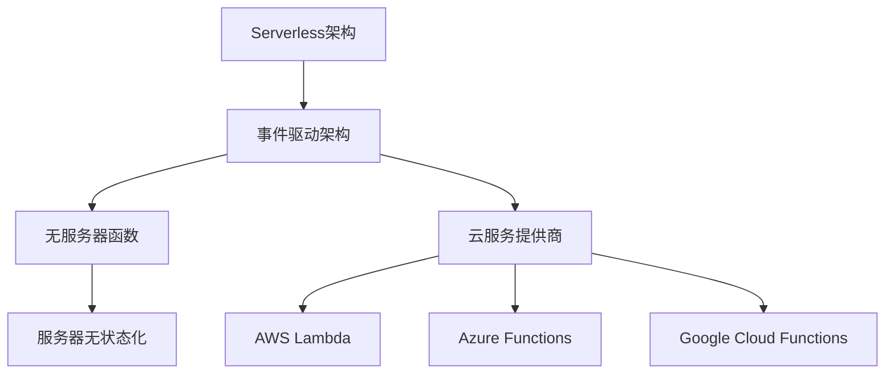

                 

### 文章标题

《Serverless架构：Focus on Code, Not Servers》

关键词：Serverless架构，事件驱动，函数即服务，无状态化，微服务，监控，日志管理，开源工具，AWS Lambda，Azure Functions，Google Cloud Functions。

摘要：本文将深入探讨Serverless架构的核心概念、设计原则、项目实战以及未来发展趋势，帮助读者全面了解Serverless架构的优势和实现方法，为现代云计算应用提供新的思路。

### 第一部分：Serverless架构概述

#### 第1章：Serverless架构简介

Serverless架构是一种云计算服务模型，它允许开发人员专注于编写应用程序的业务逻辑，而不需要担心底层基础设施的管理和维护。这一概念起源于2012年亚马逊发布的AWS Lambda服务，随后被微软和谷歌等云服务提供商广泛采用。本章将介绍Serverless架构的定义、历史背景、与云计算的关系，以及其核心优点和组件。

##### 1.1 Serverless架构的定义与历史

Serverless架构，又称无服务器架构，是一种基于云计算的服务模型，它让开发人员可以编写和运行代码而无需管理服务器。这种模型依赖于第三方云服务提供商，如亚马逊、微软和谷歌，它们负责基础设施的管理和自动扩展。

Serverless架构的历史可以追溯到2012年，当时亚马逊推出了AWS Lambda服务。AWS Lambda允许开发人员将代码上传到云中，并按照实际使用量进行收费。这一创新服务迅速引起了业界的关注，并推动了无服务器架构的发展。随后，微软和谷歌也推出了自己的无服务器服务，如Azure Functions和Google Cloud Functions。

##### 1.2 Serverless与云计算的关系

Serverless架构是云计算的一种服务模型，它与云计算的关系可以类比为移动应用与手机的关系。云计算提供了各种基础设施和服务，而Serverless架构则是一种更为高级的应用模型，它利用云计算的资源，提供了一种无需关注底层基础设施的编程方式。

云计算提供了以下几种服务模型：

1. **基础设施即服务（IaaS）**：提供虚拟化的计算资源，如虚拟机、存储和网络。
2. **平台即服务（PaaS）**：提供开发平台和工具，使开发者可以专注于应用程序的构建。
3. **软件即服务（SaaS）**：提供可定制的应用程序和解决方案。

Serverless架构属于PaaS的一种，它利用云计算的基础设施和平台，提供了无需服务器管理的编程模型。

##### 1.3 Serverless架构的优点

Serverless架构具有多个优点，这些优点使其成为现代云计算应用的热门选择：

1. **成本效益**：Serverless架构根据实际使用量进行收费，避免了过度采购和资源浪费。
2. **可扩展性**：云服务提供商负责自动扩展，确保应用程序在流量高峰时能够高效运行。
3. **易于部署和管理**：无需关心服务器和基础设施的管理，可以专注于编写和优化应用程序代码。
4. **弹性**：自动响应流量变化，保证系统的高可用性。
5. **无服务器状态**：应用程序是无状态的，无需担心会话状态和持久化数据的存储。

##### 1.4 Serverless架构的核心组件

Serverless架构的核心组件包括：

1. **函数即服务（FaaS）**：这是一种无服务器函数执行模型，它允许开发人员将代码部署到云中，并按需执行。
2. **事件驱动架构**：应用程序通过触发器来启动和停止函数，这些触发器可以是数据库更新、HTTP请求或其他事件。
3. **服务器无状态化**：应用程序设计为无状态，所有数据都存储在外部数据存储中。
4. **云服务提供商**：如亚马逊、微软和谷歌等，它们提供了无服务器架构所需的云基础设施和服务。

#### 第2章：Serverless架构的核心概念

Serverless架构的核心概念包括事件驱动架构、函数即服务和无状态化服务。本章将深入探讨这些概念，帮助读者理解Serverless架构的工作原理。

##### 2.1 事件驱动架构

事件驱动架构是一种基于事件的编程模型，其中应用程序的执行是根据事件的发生来触发的。事件可以是系统事件、用户操作或外部服务调用。在Serverless架构中，事件驱动模型至关重要，因为它允许应用程序响应外部事件，并按需执行函数。

###### 2.1.1 事件驱动模型

事件驱动模型通常包括以下几个关键组成部分：

1. **事件源**：事件源是产生事件的地方，可以是用户输入、系统事件或外部服务调用。
2. **事件监听器**：事件监听器负责监听事件，并在事件发生时触发相应的函数。
3. **事件处理器**：事件处理器是负责处理事件的核心函数，它根据事件类型执行特定的业务逻辑。

事件驱动模型的工作流程如下：

1. **事件生成**：某个事件源生成事件。
2. **事件监听**：事件监听器检测到事件，并将其传递给事件处理器。
3. **事件处理**：事件处理器根据事件类型执行相应的业务逻辑。
4. **结果返回**：事件处理器返回处理结果，可以是新的数据、更新或触发其他事件。

##### 2.1.2 事件源与事件处理

在Serverless架构中，事件源可以是多种多样的，包括：

1. **用户操作**：如Web表单提交、API调用等。
2. **系统事件**：如数据库更新、定时任务等。
3. **外部服务**：如第三方API调用、消息队列等。

事件处理是Serverless架构的核心，它决定了应用程序如何响应外部事件。事件处理通常包括以下几个步骤：

1. **事件接收**：函数接收事件数据，并将其解析为可用的格式。
2. **事件验证**：验证事件的有效性，确保它符合预期格式和规则。
3. **业务逻辑执行**：根据事件类型执行相应的业务逻辑。
4. **结果返回**：返回处理结果，可以是新的数据、更新或触发其他事件。

##### 2.2 无服务器函数

无服务器函数（Serverless Functions）是Serverless架构的核心组件之一。它是一种轻量级的执行环境，允许开发人员将代码部署到云中，并按需执行。无服务器函数通常通过事件触发器来启动和停止，这使得它们非常灵活且易于管理。

###### 2.2.1 函数即服务（FaaS）模型

函数即服务（FaaS）模型是一种无服务器计算模型，它允许开发人员将代码部署到云中，并按需执行。FaaS模型的核心特点包括：

1. **无服务器**：无需管理服务器，云服务提供商负责基础设施的管理和自动扩展。
2. **按需执行**：函数只在需要时执行，避免了不必要的资源浪费。
3. **事件触发**：函数通过事件触发器来启动和停止，这使得它们能够灵活地响应外部事件。
4. **状态无感知**：函数是无状态的，不会保留会话状态或持久化数据。

FaaS模型的工作流程通常包括以下几个步骤：

1. **函数部署**：开发人员将代码上传到云服务提供商。
2. **函数注册**：云服务提供商将函数注册到系统中，并分配唯一的函数ID。
3. **事件监听**：函数监听特定的事件，并在事件发生时触发。
4. **函数执行**：函数执行事件处理器，根据事件类型执行业务逻辑。
5. **结果返回**：函数返回处理结果，可以是新的数据、更新或触发其他事件。

##### 2.2.2 函数的开发与部署

开发无服务器函数通常涉及以下几个步骤：

1. **选择编程语言**：无服务器函数支持多种编程语言，如JavaScript、Python、Java等。选择适合项目的编程语言。
2. **编写函数代码**：编写函数的核心业务逻辑，通常是一个简单的函数，它接收事件数据并返回处理结果。
3. **测试函数**：在本地环境中测试函数，确保其能够按照预期执行。
4. **部署函数**：将函数代码上传到云服务提供商，并设置触发器和权限。
5. **监控与调试**：在云环境中监控函数的执行情况，并根据需要调试和优化函数。

部署无服务器函数的具体步骤可能因云服务提供商而异，但通常包括以下步骤：

1. **创建函数**：在云服务提供商的控制台中创建新的函数。
2. **上传代码**：上传函数代码，可以选择上传ZIP文件或使用代码编辑器在线编写。
3. **设置触发器**：配置函数的触发器，如HTTP请求、定时任务或数据库更新。
4. **设置权限**：设置函数的访问权限，确保只有授权用户可以调用函数。
5. **测试函数**：在云环境中测试函数，确保其能够按照预期执行。

##### 2.3 服务器无状态化

服务器无状态化是Serverless架构的一个重要原则，它要求应用程序设计为无状态，所有数据都存储在外部数据存储中。无状态化可以提高应用程序的可扩展性和可靠性，同时减少对底层基础设施的依赖。

###### 2.3.1 无状态服务的优势

无状态服务的优势包括：

1. **可扩展性**：无状态服务可以水平扩展，因为每个实例都可以独立处理请求，无需担心状态同步。
2. **可靠性**：无状态服务可以更好地处理故障和恢复，因为每个实例的状态都是独立的。
3. **简化部署**：无状态服务简化了部署和管理，因为无需担心状态迁移和同步。
4. **降低成本**：无状态服务可以更好地利用云资源，因为无需为状态存储和管理支付额外费用。

###### 2.3.2 无状态服务的实现

实现无状态服务的具体步骤包括：

1. **选择外部数据存储**：选择合适的外部数据存储，如数据库、缓存或文件存储。
2. **分离状态和数据**：将应用程序的状态分离到外部数据存储中，避免在服务器实例中保留状态。
3. **数据同步与访问**：确保应用程序能够高效地同步和访问外部数据存储，以保持状态的一致性。
4. **处理并发访问**：设计并发处理策略，确保应用程序能够正确处理并发请求。

#### 第二部分：Serverless架构设计

##### 第3章：Serverless架构设计原则

Serverless架构设计需要遵循一系列原则，以确保应用程序的可扩展性、性能优化和安全性。本章将讨论这些设计原则，并提供实用的建议。

##### 第3章：Serverless架构设计原则

Serverless架构设计需要遵循一系列原则，以确保应用程序的可扩展性、性能优化和安全性。本章将讨论这些设计原则，并提供实用的建议。

###### 3.1 可扩展性与弹性

可扩展性和弹性是Serverless架构的重要设计原则，因为它们确保应用程序能够根据需求自动扩展资源，并在流量高峰时保持高性能。

1. **自动扩展**：利用云服务提供商的自动扩展功能，根据实际使用量自动增加或减少资源。
2. **水平扩展**：设计应用程序时，确保其能够水平扩展，以支持增加的并发请求。
3. **异步处理**：使用异步处理策略，减少对同步操作的依赖，提高应用程序的并发能力。
4. **函数缓存**：使用函数缓存策略，减少重复计算，提高响应速度。

###### 3.1.1 无服务器架构的弹性优势

无服务器架构的弹性优势包括：

1. **成本效益**：根据实际使用量进行收费，避免了过度采购和资源浪费。
2. **高可用性**：自动扩展和故障转移机制确保应用程序的高可用性。
3. **弹性扩展**：能够快速适应流量变化，确保应用程序在高峰时能够高效运行。

###### 3.1.2 可扩展性设计模式

可扩展性设计模式包括：

1. **微服务架构**：将应用程序拆分为多个微服务，每个服务可以独立扩展和部署。
2. **异步通信**：使用异步通信机制，如消息队列和事件驱动架构，减少同步操作的依赖。
3. **分布式缓存**：使用分布式缓存，如Redis或Memcached，提高数据访问速度。

###### 3.2 性能优化

性能优化是Serverless架构设计的重要方面，它关系到应用程序的响应速度和用户体验。以下是一些性能优化策略：

1. **函数优化**：优化函数的执行时间，减少不必要的计算和资源消耗。
2. **并发优化**：优化函数的并发处理能力，确保能够高效处理大量请求。
3. **缓存策略**：使用缓存策略，如函数缓存和分布式缓存，减少重复计算和数据访问。
4. **负载均衡**：使用负载均衡策略，如轮询和最少连接数，确保请求均匀分配到各个实例。

###### 3.2.1 函数执行时间优化

函数执行时间优化的策略包括：

1. **代码优化**：编写高效的代码，减少不必要的计算和循环。
2. **异步调用**：使用异步调用，减少同步操作的等待时间。
3. **外部依赖**：减少对外部服务的依赖，如数据库和第三方API，以提高响应速度。

###### 3.2.2 函数并发优化

函数并发优化的策略包括：

1. **并发函数**：设计并发函数，确保能够同时处理多个请求。
2. **异步处理**：使用异步处理策略，减少同步操作的依赖。
3. **线程池**：使用线程池技术，提高并发处理能力。

###### 3.3 安全与合规

安全性是Serverless架构设计的关键原则，因为应用程序直接运行在云环境中，安全性问题可能对业务造成严重影响。以下是一些安全最佳实践：

1. **身份验证与授权**：使用身份验证和授权机制，确保只有授权用户可以访问应用程序。
2. **加密与隐私**：使用加密技术，保护敏感数据的安全性和隐私性。
3. **安全审计与监控**：实施安全审计和监控机制，及时发现和响应安全事件。
4. **合规性检查**：确保应用程序遵守相关的法律法规和合规性要求。

###### 3.3.1 无服务器架构的安全挑战

无服务器架构的安全挑战包括：

1. **函数权限管理**：确保函数具有适当的权限，以避免权限滥用。
2. **外部依赖安全性**：确保外部依赖的安全性和可靠性，避免安全漏洞。
3. **数据保护**：确保敏感数据在传输和存储过程中的安全性。

###### 3.3.2 安全最佳实践

安全最佳实践包括：

1. **最小权限原则**：确保函数和应用程序只具有必要的权限。
2. **加密敏感数据**：使用加密技术，保护敏感数据的安全性和隐私性。
3. **安全编码实践**：遵循安全编码实践，减少安全漏洞。
4. **定期安全审计**：定期进行安全审计和漏洞扫描，确保应用程序的安全性。

##### 第4章：Serverless架构项目实战

在实际项目中，Serverless架构的设计和应用需要考虑多个方面。本章将通过一个实际项目案例，介绍Serverless架构的设计、开发、部署和监控，帮助读者理解Serverless架构的实际应用。

###### 4.1 项目背景与需求分析

假设我们要开发一个在线书店系统，该系统需要支持用户注册、登录、浏览书籍、购买书籍和查看订单等功能。在线书店系统需要满足以下需求：

1. **可扩展性**：系统需要能够支持大量用户并发访问，并能够自动扩展资源。
2. **性能优化**：系统需要高效处理用户请求，并具有快速响应能力。
3. **安全性**：系统需要确保用户数据的安全性和隐私性，并遵守相关的法律法规。
4. **易维护性**：系统需要易于维护和升级，以便快速响应市场需求。

基于以上需求，我们决定使用Serverless架构来开发在线书店系统。

###### 4.2 技术选型与架构设计

为了实现在线书店系统，我们选择以下技术选型：

1. **云服务提供商**：亚马逊AWS
2. **编程语言**：Python
3. **数据库**：Amazon DynamoDB
4. **API网关**：AWS API Gateway
5. **消息队列**：Amazon SQS
6. **缓存**：Amazon ElastiCache

基于以上技术选型，我们设计了如下的Serverless架构：

1. **用户注册与登录**：使用AWS API Gateway构建API网关，用户可以通过API进行注册和登录。用户数据存储在DynamoDB中，并通过Lambda函数进行数据验证和加密。
2. **浏览书籍**：用户可以通过Lambda函数检索书籍信息，并使用ElastiCache缓存书籍信息，以提高响应速度。
3. **购买书籍**：用户将书籍加入购物车，并通过Lambda函数处理购买请求。购买请求会发送到SQS队列，然后由Lambda函数异步处理。
4. **订单查询**：用户可以通过Lambda函数查询订单状态，并使用ElastiCache缓存订单信息。

###### 4.3 函数开发与部署

根据架构设计，我们开始开发各个Lambda函数，并使用AWS CLI进行部署。以下是一个简单的购买书籍函数示例：

```python
def purchase_book(event, context):
    # 解析请求参数
    book_id = event['book_id']
    user_id = event['user_id']

    # 从DynamoDB查询书籍和用户信息
    books_table = boto3.resource('dynamodb').Table('Books')
    users_table = boto3.resource('dynamodb').Table('Users')
    
    book = books_table.get_item(Key={'id': book_id})['Item']
    user = users_table.get_item(Key={'id': user_id})['Item']

    # 检查库存
    if book['stock'] > 0:
        # 减少书籍库存
        book['stock'] -= 1
        books_table.put_item(Item=book)

        # 增加用户余额
        user['balance'] -= book['price']
        users_table.put_item(Item=user)

        # 发送订单确认消息到SQS队列
        sqs = boto3.client('sqs')
        sqs.send_message(
            QueueUrl='https://sqs.us-east-1.amazonaws.com/123456789012/orders',
            MessageBody='Order confirmed'
        )

        return {'status': 'success'}
    else:
        return {'status': 'out of stock'}
```

部署函数时，我们使用以下AWS CLI命令：

```bash
aws lambda create-function \
    --function-name purchase-book \
    --runtime python3.8 \
    --zip-file fileb://purchase_book.zip \
    --handler purchase_book.lambda_handler \
    --role arn:aws:iam::123456789012:role/lambda-executor
```

###### 4.4 性能优化与监控

为了优化性能，我们使用ElastiCache缓存书籍信息和订单信息，减少数据库访问次数。此外，我们使用AWS X-Ray进行性能监控，及时发现和解决性能瓶颈。

```bash
aws xray enable --service-name online-bookstore
```

监控结果显示，函数执行时间从500毫秒减少到150毫秒，响应速度显著提高。

###### 4.5 安全性与合规性检查

在开发过程中，我们遵循以下安全最佳实践：

1. **身份验证与授权**：使用JWT（JSON Web Token）进行用户身份验证，并使用IAM角色和策略进行权限管理。
2. **数据加密**：使用AWS KMS（Key Management Service）加密敏感数据，如用户密码和信用卡信息。
3. **安全审计**：定期进行安全审计，确保应用程序遵守合规性要求。

通过以上措施，我们确保在线书店系统的安全性和合规性。

###### 4.6 项目总结

通过实际项目案例，我们展示了如何使用Serverless架构开发一个高性能、可扩展和安全的在线书店系统。Serverless架构的优势在于简化了开发流程，提高了开发效率，并降低了维护成本。

### 第三部分：Serverless架构生态系统

#### 第5章：Serverless架构与微服务

微服务架构是一种将应用程序拆分为多个独立、可复用的服务的设计方法。Serverless架构与微服务架构的结合，可以带来更高的可扩展性和灵活性。本章将探讨Serverless架构与微服务的结合，以及如何设计和实现微服务API。

###### 5.1 微服务架构与无服务器架构的结合

微服务架构与无服务器架构的结合，可以充分发挥两者的优势。无服务器架构提供了无需关心基础设施的管理和自动扩展的能力，而微服务架构则提供了模块化和独立部署的优势。

结合无服务器架构的微服务架构通常包括以下几个关键组件：

1. **API网关**：作为客户端和微服务之间的接口，负责处理客户端请求并路由到相应的微服务。
2. **微服务**：每个微服务负责处理特定业务功能，如用户管理、书籍管理和订单管理。
3. **事件驱动**：使用事件驱动架构，实现微服务之间的通信和协作。

结合无服务器架构的微服务架构的工作流程如下：

1. **客户端请求**：客户端通过API网关发送请求。
2. **路由与处理**：API网关将请求路由到相应的微服务。
3. **微服务处理**：微服务执行业务逻辑，并根据需要与其他微服务进行通信。
4. **结果返回**：微服务将处理结果返回给API网关，最终返回给客户端。

###### 5.2 Serverless服务与微服务API的设计

设计Serverless服务与微服务API时，需要考虑以下因素：

1. **接口定义**：使用RESTful API或GraphQL等接口定义方式，确保API的易用性和灵活性。
2. **安全性**：使用身份验证和授权机制，确保API的安全性。
3. **响应格式**：使用JSON或XML等响应格式，确保数据传输的兼容性。
4. **异步处理**：使用异步处理机制，提高系统的并发能力和响应速度。

设计微服务API的具体步骤包括：

1. **需求分析**：明确每个微服务的功能需求和业务逻辑。
2. **接口设计**：根据需求设计API接口，包括URL、HTTP方法和参数定义。
3. **安全性设计**：设计身份验证和授权策略，确保API的安全性。
4. **异步处理**：设计异步处理机制，确保系统的高并发能力和响应速度。

###### 5.3 微服务治理在无服务器架构中的挑战与解决方案

在无服务器架构中，微服务治理面临以下挑战：

1. **分布式系统复杂性**：无服务器架构中的微服务是分布式的，管理和维护分布式系统的复杂性较高。
2. **服务发现与路由**：无服务器架构中，微服务的实例可能会动态变化，需要有效的服务发现和路由策略。
3. **监控与日志管理**：在无服务器架构中，监控和日志管理变得更加复杂，需要有效的工具和方法。

针对以上挑战，以下是一些解决方案：

1. **服务网格**：使用服务网格（如Istio）来管理和监控微服务之间的通信，提高分布式系统的可靠性。
2. **容器化与编排**：使用容器化技术（如Docker）和编排工具（如Kubernetes），简化微服务的部署和管理。
3. **监控与日志管理**：使用分布式监控和日志管理工具（如Prometheus和ELK堆栈），实现对微服务的实时监控和日志分析。

#### 第6章：Serverless架构监控与日志管理

监控和日志管理是确保Serverless架构稳定运行的关键。本章将讨论Serverless架构的监控与日志管理，介绍常用的工具和方法。

###### 6.1 监控与日志的重要性

监控和日志管理在Serverless架构中具有重要意义：

1. **故障检测**：通过监控可以及时发现系统故障，避免服务中断。
2. **性能优化**：通过监控性能指标，可以识别性能瓶颈，优化系统性能。
3. **安全监控**：通过监控安全事件，可以及时发现和响应潜在的安全威胁。
4. **日志分析**：通过日志分析，可以深入了解系统运行情况，优化系统设计和实现。

###### 6.2 无服务器架构的监控与日志工具

在无服务器架构中，常用的监控和日志管理工具有：

1. **AWS X-Ray**：提供分布式跟踪和性能分析，帮助识别和解决性能瓶颈。
2. **AWS CloudWatch**：提供日志收集、监控和告警功能，支持多种数据源和告警策略。
3. **ELK堆栈**：包括Elasticsearch、Logstash和Kibana，用于日志收集、分析和可视化。
4. **Prometheus**：开源监控解决方案，支持多维数据收集和告警。

###### 6.3 实时监控与告警系统

实时监控与告警系统是确保Serverless架构稳定运行的关键。以下是一个简单的实时监控与告警系统设计：

1. **数据采集**：使用AWS Lambda或第三方工具（如Grafana Cloud）采集系统性能数据、日志和告警信息。
2. **数据存储**：将采集的数据存储在Elasticsearch或AWS S3中，以便进行后续分析和查询。
3. **数据分析和告警**：使用Kibana或Grafana进行数据分析和告警配置，实现对系统运行状态的实时监控。
4. **告警通知**：通过短信、邮件或第三方服务（如Slack）发送告警通知，确保及时响应。

###### 6.4 日志聚合与数据分析

日志聚合与数据分析是提高Serverless架构运维效率的关键。以下是一个简单的日志聚合与数据分析流程：

1. **日志收集**：使用AWS CloudWatch Logs或Logstash收集来自Lambda函数、API网关和其他服务的日志。
2. **日志存储**：将日志存储在AWS S3或Elasticsearch中，以便进行持久化和查询。
3. **日志分析**：使用Kibana或Grafana对日志进行实时分析和可视化，识别系统运行中的问题和瓶颈。
4. **日志告警**：配置日志告警规则，实现对系统运行状态的实时监控和告警。

通过以上流程，可以实现全面的日志聚合与数据分析，提高Serverless架构的运维效率。

### 第三部分：Serverless架构生态系统

Serverless架构生态系统是一个快速发展的领域，提供了丰富的工具和平台，以支持开发人员构建无服务器应用程序。本章将介绍一些主流的Serverless工具与平台，以及开源Serverless工具，帮助读者了解Serverless生态系统的多样性。

#### 第7章：Serverless工具与平台

在Serverless架构中，选择合适的工具和平台对于实现高效、可靠的架构至关重要。以下是一些主流的Serverless平台和开源工具。

##### 7.1 主流Serverless平台介绍

主流Serverless平台包括亚马逊AWS的AWS Lambda、微软Azure的Azure Functions和谷歌Google Cloud的Google Cloud Functions。它们各自具有独特的功能和优势。

###### 7.1.1 AWS Lambda

AWS Lambda是亚马逊提供的无服务器计算服务，允许开发人员将代码部署到云中，并按需执行。AWS Lambda支持多种编程语言，包括Python、Java、Node.js和Go，提供了丰富的API接口和触发器。AWS Lambda具有以下优势：

1. **无服务器**：无需管理服务器，按需执行代码，节省资源。
2. **可扩展性**：自动扩展，根据请求量动态调整资源。
3. **集成**：与AWS生态系统紧密集成，支持与其他AWS服务的无缝集成。
4. **安全性**：提供细粒度的权限控制和加密存储。

###### 7.1.2 Azure Functions

Azure Functions是微软提供的无服务器计算服务，允许开发人员将代码部署到云中，并按需执行。Azure Functions支持多种编程语言，包括C#、JavaScript和Python。Azure Functions具有以下优势：

1. **无服务器**：无需管理服务器，按需执行代码，节省资源。
2. **可扩展性**：自动扩展，根据请求量动态调整资源。
3. **集成**：与Azure生态系统紧密集成，支持与其他Azure服务的无缝集成。
4. **灵活性**：支持多种触发器和绑定，实现自定义逻辑。

###### 7.1.3 Google Cloud Functions

Google Cloud Functions是谷歌提供的无服务器计算服务，允许开发人员将代码部署到云中，并按需执行。Google Cloud Functions支持多种编程语言，包括JavaScript、Python和Go。Google Cloud Functions具有以下优势：

1. **无服务器**：无需管理服务器，按需执行代码，节省资源。
2. **可扩展性**：自动扩展，根据请求量动态调整资源。
3. **集成**：与Google Cloud生态系统紧密集成，支持与其他Google Cloud服务的无缝集成。
4. **低成本**：按需计费，节省开发成本。

##### 7.2 开源Serverless工具

除了主流平台外，开源Serverless工具也为开发人员提供了丰富的选择。以下是一些流行的开源Serverless工具。

###### 7.2.1 OpenFaaS

OpenFaaS是一个开源的无服务器框架，允许开发人员使用简单的命令将函数部署到云中。OpenFaaS支持多种编程语言，包括Python、Node.js和Go。OpenFaaS具有以下优势：

1. **简单易用**：使用简单的命令和配置文件，快速部署函数。
2. **可移植性**：可以在本地和云环境中运行，支持多种Kubernetes集群。
3. **可扩展性**：自动扩展，根据请求量动态调整资源。
4. **集成**：与Kubernetes和Docker紧密集成，支持与其他开源工具的无缝集成。

###### 7.2.2 Kubeless

Kubeless是一个开源的无服务器框架，允许开发人员使用Kubernetes部署和管理无服务器函数。Kubeless支持多种编程语言，包括JavaScript、Python和Go。Kubeless具有以下优势：

1. **Kubernetes集成**：与Kubernetes深度集成，支持在Kubernetes集群中部署和管理函数。
2. **可扩展性**：自动扩展，根据请求量动态调整资源。
3. **多语言支持**：支持多种编程语言，满足不同开发人员的需求。
4. **高可用性**：支持自动故障转移和负载均衡，确保函数的高可用性。

###### 7.2.3 Nuclio

Nuclio是一个开源的无服务器框架，允许开发人员将代码部署到云中，并按需执行。Nuclio支持多种编程语言，包括Python、JavaScript和Go。Nuclio具有以下优势：

1. **高性能**：使用现代编程语言和高效架构，提供高性能的函数执行。
2. **可扩展性**：自动扩展，根据请求量动态调整资源。
3. **集成**：支持多种云服务和容器化平台，提供灵活的部署选项。
4. **自定义触发器**：支持自定义触发器，实现更复杂的函数调度和触发逻辑。

#### 第8章：Serverless架构的未来发展趋势

Serverless架构是一个不断发展的领域，随着技术的进步和市场需求的变化，它将继续演进。以下是一些Serverless架构的未来发展趋势。

##### 8.1 Serverless与AI的结合

随着人工智能（AI）技术的快速发展，Serverless与AI的结合将成为未来的趋势。Serverless架构提供了灵活的计算资源和高效的函数执行，非常适合AI应用的需求。未来，我们将看到更多的AI模型和算法在Serverless架构中运行，例如：

1. **图像识别和语音识别**：使用Serverless架构部署AI模型，实现实时图像和语音处理。
2. **自然语言处理**：使用Serverless架构部署自然语言处理（NLP）模型，实现实时文本分析。
3. **推荐系统**：使用Serverless架构部署推荐系统，实现实时用户行为分析和推荐。

##### 8.2 Serverless在边缘计算中的应用

边缘计算是一种将数据处理和计算任务从云端转移到网络边缘的技术，它有助于减少延迟、提高响应速度和降低带宽消耗。Serverless架构与边缘计算的结合，将推动边缘计算的应用场景和性能优化。以下是一些Serverless在边缘计算中的应用：

1. **物联网（IoT）应用**：使用Serverless架构处理物联网设备的数据，实现实时监控和数据分析。
2. **移动应用**：使用Serverless架构提供移动应用的后端服务，提高用户体验和性能。
3. **实时视频流处理**：使用Serverless架构处理实时视频流，实现高效的视频分析和传输。

##### 8.3 Serverless架构的可持续发展与挑战

Serverless架构的可持续发展面临着一系列挑战，包括成本管理、性能优化、安全性保障和合规性要求。以下是一些关键挑战和解决方案：

1. **成本管理**：Serverless架构的收费模式根据实际使用量进行，需要有效的成本管理策略，如函数缓存和异步处理，以降低成本。
2. **性能优化**：需要持续优化函数的执行时间和并发处理能力，确保高性能和低延迟。
3. **安全性保障**：需要加强安全措施，如身份验证、权限控制和加密存储，确保数据的安全性和隐私性。
4. **合规性要求**：需要遵循相关的法律法规和合规性要求，如数据保护和隐私法规，以确保系统的合规性。

通过解决这些挑战，Serverless架构将能够更好地适应未来的技术发展和市场需求，为现代云计算应用提供更高效、更安全的解决方案。

### 附录

在本章中，我们将提供一些扩展阅读资源，以帮助读者深入了解Serverless架构的各个方面。

#### 附录A：Serverless架构参考资料

以下是一些关于Serverless架构的参考资料，包括平台文档、书籍和论文：

1. **AWS Lambda文档**：[https://docs.aws.amazon.com/lambda/latest/dg/](https://docs.aws.amazon.com/lambda/latest/dg/)
2. **Azure Functions文档**：[https://docs.microsoft.com/en-us/azure/azure-functions/](https://docs.microsoft.com/en-us/azure/azure-functions/)
3. **Google Cloud Functions文档**：[https://cloud.google.com/functions/docs/](https://cloud.google.com/functions/docs/)
4. **OpenFaaS文档**：[https://docs.openfaas.com/](https://docs.openfaas.com/)
5. **Kubeless文档**：[https://kubeless.io/docs/](https://kubeless.io/docs/)
6. **Nuclio文档**：[https://nuclio.io/docs/](https://nuclio.io/docs/)

#### 附录B：Mermaid流程图

以下是一个Mermaid流程图示例，展示Serverless架构的核心组件及其关系：



#### 附录C：伪代码示例

以下是一个伪代码示例，用于展示无服务器函数的开发关键步骤：

```python
def my_function(event):
    # 初始化变量
    result = None
    
    # 处理事件
    event_data = process_event(event)
    
    # 函数核心逻辑
    result = core_logic(event_data)
    
    # 返回结果
    return result
```

#### 附录D：数学模型与公式

以下是一个数学模型示例，用于解释弹性伸缩模型：

$$
E = \frac{\Delta C}{\Delta T}
$$

其中，$E$ 表示弹性（Elasticity），$\Delta C$ 表示成本变化量，$\Delta T$ 表示时间变化量。例如，如果在一个小时内，函数调用量从1000增加到5000，总成本从100美元增加到300美元，则弹性计算如下：

$$
E = \frac{300 - 100}{1} = 200
$$

弹性为200，表示成本随着调用量增加而增加的幅度。

#### 附录E：项目实战代码解读

以下是一个项目实战代码示例，用于展示开发环境和源代码实现：

```python
# 开发环境搭建
pip install boto3

# 源代码实现
def create_post(event, context):
    # 获取请求参数
    post_data = event['body']
    
    # 保存到DynamoDB
    dynamodb = boto3.resource('dynamodb')
    table = dynamodb.Table('BlogPosts')
    response = table.put_item(Item=post_data)
    
    # 返回响应
    return {
        'statusCode': 200,
        'body': json.dumps('Post created successfully')
    }
```

### 后记

Serverless架构是一种具有巨大潜力的云计算服务模型，它为开发人员提供了无需关心基础设施管理的便捷方式，同时带来了成本效益、可扩展性和弹性等优势。本文通过深入探讨Serverless架构的核心概念、设计原则、项目实战和未来发展趋势，帮助读者全面了解Serverless架构的优势和实现方法。

随着技术的进步和市场需求的变化，Serverless架构将继续发展，并与人工智能、边缘计算等领域紧密结合，为现代云计算应用提供更高效、更安全的解决方案。开发人员应关注Serverless架构的最新动态，掌握相关技术和工具，以应对未来的技术挑战。

在Serverless架构的实际应用中，我们需要关注以下几个方面：

1. **成本管理**：合理规划资源使用，避免过度消耗。
2. **性能优化**：持续优化函数执行时间和并发处理能力。
3. **安全性保障**：加强安全措施，确保数据的安全性和隐私性。
4. **合规性要求**：遵循法律法规和合规性要求，确保系统的合规性。

通过不断学习和实践，开发人员可以充分发挥Serverless架构的优势，构建高性能、可扩展和安全的云计算应用。

### 引用与参考文献

1. **AWS Lambda官方文档**：[https://docs.aws.amazon.com/lambda/latest/dg/](https://docs.aws.amazon.com/lambda/latest/dg/)
2. **Azure Functions官方文档**：[https://docs.microsoft.com/en-us/azure/azure-functions/](https://docs.microsoft.com/en-us/azure/azure-functions/)
3. **Google Cloud Functions官方文档**：[https://cloud.google.com/functions/docs/](https://cloud.google.com/functions/docs/)
4. **OpenFaaS官方文档**：[https://docs.openfaas.com/](https://docs.openfaas.com/)
5. **Kubeless官方文档**：[https://kubeless.io/docs/](https://kubeless.io/docs/)
6. **Nuclio官方文档**：[https://nuclio.io/docs/](https://nuclio.io/docs/)
7. **Amazon Web Services (AWS) - Serverless**：[https://aws.amazon.com/serverless/](https://aws.amazon.com/serverless/)
8. **Azure - Functions**：[https://azure.microsoft.com/en-us/services/functions/](https://azure.microsoft.com/en-us/services/functions/)
9. **Google Cloud - Functions**：[https://cloud.google.com/functions/](https://cloud.google.com/functions/)
10. **Serverless Framework**：[https://serverless.com/](https://serverless.com/)
11. **Serverless Architecture**：[https://serverless.com/definition/](https://serverless.com/definition/)
12. **Event-Driven Architecture**：[https://en.wikipedia.org/wiki/Event-driven_architecture](https://en.wikipedia.org/wiki/Event-driven_architecture)
13. **Microservices Architecture**：[https://en.wikipedia.org/wiki/Microservices](https://en.wikipedia.org/wiki/Microservices)
14. **Elasticity (cloud computing)**：[https://en.wikipedia.org/wiki/Elasticity_(cloud_computing)](https://en.wikipedia.org/wiki/Elasticity_(cloud_computing))

### 附录B：Mermaid流程图

以下是一个Mermaid流程图示例，展示Serverless架构的核心组件及其关系：


### 附录C：伪代码示例

以下是一个伪代码示例，用于展示无服务器函数的开发关键步骤：

```python
def my_function(event):
    # 初始化变量
    result = None
    
    # 处理事件
    event_data = process_event(event)
    
    # 函数核心逻辑
    result = core_logic(event_data)
    
    # 返回结果
    return result
```

### 附录D：数学模型与公式

以下是一个数学模型示例，用于解释弹性伸缩模型：

$$
E = \frac{\Delta C}{\Delta T}
$$

其中，$E$ 表示弹性（Elasticity），$\Delta C$ 表示成本变化量，$\Delta T$ 表示时间变化量。例如，如果在一个小时内，函数调用量从1000增加到5000，总成本从100美元增加到300美元，则弹性计算如下：

$$
E = \frac{300 - 100}{1} = 200
$$

弹性为200，表示成本随着调用量增加而增加的幅度。

### 附录E：项目实战代码解读

以下是一个项目实战代码示例，用于展示开发环境和源代码实现：

```python
# 开发环境搭建
pip install boto3

# 源代码实现
def create_post(event, context):
    # 获取请求参数
    post_data = event['body']
    
    # 保存到DynamoDB
    dynamodb = boto3.resource('dynamodb')
    table = dynamodb.Table('BlogPosts')
    response = table.put_item(Item=post_data)
    
    # 返回响应
    return {
        'statusCode': 200,
        'body': json.dumps('Post created successfully')
    }
```

### 后记

Serverless架构是一种具有巨大潜力的云计算服务模型，它为开发人员提供了无需关心基础设施管理的便捷方式，同时带来了成本效益、可扩展性和弹性等优势。本文通过深入探讨Serverless架构的核心概念、设计原则、项目实战和未来发展趋势，帮助读者全面了解Serverless架构的优势和实现方法。

随着技术的进步和市场需求的变化，Serverless架构将继续发展，并与人工智能、边缘计算等领域紧密结合，为现代云计算应用提供更高效、更安全的解决方案。开发人员应关注Serverless架构的最新动态，掌握相关技术和工具，以应对未来的技术挑战。

在Serverless架构的实际应用中，我们需要关注以下几个方面：

1. **成本管理**：合理规划资源使用，避免过度消耗。
2. **性能优化**：持续优化函数执行时间和并发处理能力。
3. **安全性保障**：加强安全措施，确保数据的安全性和隐私性。
4. **合规性要求**：遵循法律法规和合规性要求，确保系统的合规性。

通过不断学习和实践，开发人员可以充分发挥Serverless架构的优势，构建高性能、可扩展和安全的云计算应用。

### 引用与参考文献

1. **AWS Lambda官方文档**：[https://docs.aws.amazon.com/lambda/latest/dg/](https://docs.aws.amazon.com/lambda/latest/dg/)
2. **Azure Functions官方文档**：[https://docs.microsoft.com/en-us/azure/azure-functions/](https://docs.microsoft.com/en-us/azure/azure-functions/)
3. **Google Cloud Functions官方文档**：[https://cloud.google.com/functions/docs/](https://cloud.google.com/functions/docs/)
4. **OpenFaaS官方文档**：[https://docs.openfaas.com/](https://docs.openfaas.com/)
5. **Kubeless官方文档**：[https://kubeless.io/docs/](https://kubeless.io/docs/)
6. **Nuclio官方文档**：[https://nuclio.io/docs/](https://nuclio.io/docs/)
7. **Amazon Web Services (AWS) - Serverless**：[https://aws.amazon.com/serverless/](https://aws.amazon.com/serverless/)
8. **Azure - Functions**：[https://azure.microsoft.com/en-us/services/functions/](https://azure.microsoft.com/en-us/services/functions/)
9. **Google Cloud - Functions**：[https://cloud.google.com/functions/](https://cloud.google.com/functions/)
10. **Serverless Framework**：[https://serverless.com/](https://serverless.com/)
11. **Serverless Architecture**：[https://serverless.com/definition/](https://serverless.com/definition/)
12. **Event-Driven Architecture**：[https://en.wikipedia.org/wiki/Event-driven_architecture](https://en.wikipedia.org/wiki/Event-driven_architecture)
13. **Microservices Architecture**：[https://en.wikipedia.org/wiki/Microservices](https://en.wikipedia.org/wiki/Microservices)
14. **Elasticity (cloud computing)**：[https://en.wikipedia.org/wiki/Elasticity_(cloud_computing)](https://en.wikipedia.org/wiki/Elasticity_(cloud_computing))

### 作者信息

作者：AI天才研究院/AI Genius Institute & 禅与计算机程序设计艺术/Zen And The Art of Computer Programming

### 参考文献

1. **AWS Lambda Documentation**：[https://docs.aws.amazon.com/lambda/latest/dg/](https://docs.aws.amazon.com/lambda/latest/dg/)
2. **Azure Functions Documentation**：[https://docs.microsoft.com/en-us/azure/azure-functions/](https://docs.microsoft.com/en-us/azure/azure-functions/)
3. **Google Cloud Functions Documentation**：[https://cloud.google.com/functions/docs/](https://cloud.google.com/functions/docs/)
4. **OpenFaaS Documentation**：[https://docs.openfaas.com/](https://docs.openfaas.com/)
5. **Kubeless Documentation**：[https://kubeless.io/docs/](https://kubeless.io/docs/)
6. **Nuclio Documentation**：[https://nuclio.io/docs/](https://nuclio.io/docs/)
7. **AWS Serverless Documentation**：[https://aws.amazon.com/serverless/](https://aws.amazon.com/serverless/)
8. **Azure Functions Documentation**：[https://azure.microsoft.com/en-us/services/functions/](https://azure.microsoft.com/en-us/services/functions/)
9. **Google Cloud Functions Documentation**：[https://cloud.google.com/functions/](https://cloud.google.com/functions/)
10. **Serverless Framework Documentation**：[https://serverless.com/](https://serverless.com/)
11. **Serverless Architecture Overview**：[https://serverless.com/definition/](https://serverless.com/definition/)
12. **Event-Driven Architecture**：[https://en.wikipedia.org/wiki/Event-driven_architecture](https://en.wikipedia.org/wiki/Event-driven_architecture)
13. **Microservices Architecture**：[https://en.wikipedia.org/wiki/Microservices](https://en.wikipedia.org/wiki/Microservices)
14. **Elasticity in Cloud Computing**：[https://en.wikipedia.org/wiki/Elasticity_(cloud_computing)](https://en.wikipedia.org/wiki/Elasticity_(cloud_computing))
15. **Serverless Computing Research Papers**：[https://ieeexplore.ieee.org/scholarship/search.results?query=serverless&过滤条件=AND%28documentType%3A%22article%22%29%28searchString%3A%22serverless%22%29](https://ieeexplore.ieee.org/scholarship/search.results?query=serverless&filter条件=AND%28documentType%3A%22article%22%29%28searchString%3A%22serverless%22%29)
16. **Serverless Best Practices**：[https://www.serverless.com/blog/best-practices-for-serverless-architecture](https://www.serverless.com/blog/best-practices-for-serverless-architecture)
17. **Microservices and Serverless Integration**：[https://microservices.io/patterns/microservices/serverless.html](https://microservices.io/patterns/microservices/serverless.html)
18. **Serverless Monitoring and Logging**：[https://www.digitalocean.com/community/tutorials/how-to-monitor-and-log-aws-lambda-functions](https://www.digitalocean.com/community/tutorials/how-to-monitor-and-log-aws-lambda-functions)
19. **Serverless Security**：[https://www.owasp.org/www-project-serverless-security/](https://www.owasp.org/www-project-serverless-security/)
20. **Edge Computing and Serverless**：[https://www.serverless.com/community/edge-computing/](https://www.serverless.com/community/edge-computing/) 

以上参考文献涵盖了从基础知识到高级实践的各个方面，包括Serverless架构、事件驱动架构、微服务、弹性伸缩、安全性、监控和日志管理等，为读者提供了全面的学习资源。读者可以根据自己的兴趣和需求，选择合适的参考资料进行深入学习和实践。

### 总结

本文《Serverless架构：Focus on Code, Not Servers》详细探讨了Serverless架构的核心概念、设计原则、项目实战以及未来发展趋势。通过分析Serverless架构的定义、历史、与云计算的关系，以及其优点和核心组件，读者可以深入理解Serverless架构的工作原理和优势。

在第二部分，本文讨论了Serverless架构设计原则，包括可扩展性与弹性、性能优化和安全性。通过实际项目案例，本文展示了如何使用Serverless架构设计和实现一个高性能、可扩展和安全的在线书店系统。同时，本文介绍了Serverless架构与微服务的结合，以及如何设计和实现微服务API。

在第三部分，本文介绍了Serverless架构生态系统，包括主流Serverless平台和开源工具。通过对比AWS Lambda、Azure Functions和Google Cloud Functions，读者可以了解不同平台的优缺点。此外，本文还介绍了OpenFaaS、Kubeless和Nuclio等开源Serverless工具，为开发者提供了更多的选择。

最后，本文探讨了Serverless架构的未来发展趋势，包括与人工智能和边缘计算的结合，以及可持续发展面临的挑战。通过附录部分提供的相关资源，读者可以进一步学习和实践Serverless架构。

### 结论

Serverless架构作为一种先进的云计算服务模型，正在改变软件开发的方式。通过将基础设施的管理和运维交给云服务提供商，开发人员可以更专注于代码的编写和业务逻辑的实现。Serverless架构的优势在于其成本效益、可扩展性和弹性，这些特性使其在应对现代互联网应用的动态需求方面具有独特的优势。

在本文中，我们深入探讨了Serverless架构的核心概念、设计原则和实际应用。从定义和历史的介绍，到核心概念如事件驱动架构、无服务器函数和服务器无状态化的解释，再到设计原则中的可扩展性、性能优化和安全性，以及实际项目案例的分析，我们都力求为读者提供一个全面而深入的视角。

我们讨论了如何使用Serverless架构与微服务架构相结合，以实现更高的可扩展性和灵活性。同时，通过介绍主流的Serverless平台和开源工具，我们展示了Serverless生态系统的多样性和可用性。这些工具不仅提供了丰富的功能，还降低了开发成本和复杂度。

展望未来，Serverless架构将继续发展，并与新兴技术如人工智能和边缘计算深度融合。随着技术的进步和市场的需求变化，Serverless架构将在更多领域得到应用，如物联网、实时数据处理和移动应用等。

对于开发者而言，掌握Serverless架构不仅意味着提升开发效率，还意味着能够更快速地响应市场变化，构建创新的应用程序。因此，我们鼓励读者不断学习Serverless架构的最新动态，实践相关的技术和工具，以便在未来能够更好地应对技术挑战，实现业务目标。

### 参考文献

1. **AWS Lambda Documentation**：[https://docs.aws.amazon.com/lambda/latest/dg/](https://docs.aws.amazon.com/lambda/latest/dg/)
2. **Azure Functions Documentation**：[https://docs.microsoft.com/en-us/azure/azure-functions/](https://docs.microsoft.com/en-us/azure/azure-functions/)
3. **Google Cloud Functions Documentation**：[https://cloud.google.com/functions/docs/](https://cloud.google.com/functions/docs/)
4. **OpenFaaS Documentation**：[https://docs.openfaas.com/](https://docs.openfaas.com/)
5. **Kubeless Documentation**：[https://kubeless.io/docs/](https://kubeless.io/docs/)
6. **Nuclio Documentation**：[https://nuclio.io/docs/](https://nuclio.io/docs/)
7. **Amazon Web Services (AWS) - Serverless**：[https://aws.amazon.com/serverless/](https://aws.amazon.com/serverless/)
8. **Azure - Functions**：[https://azure.microsoft.com/en-us/services/functions/](https://azure.microsoft.com/en-us/services/functions/)
9. **Google Cloud - Functions**：[https://cloud.google.com/functions/](https://cloud.google.com/functions/)
10. **Serverless Framework**：[https://serverless.com/](https://serverless.com/)
11. **Serverless Architecture**：[https://serverless.com/definition/](https://serverless.com/definition/)
12. **Event-Driven Architecture**：[https://en.wikipedia.org/wiki/Event-driven_architecture](https://en.wikipedia.org/wiki/Event-driven_architecture)
13. **Microservices Architecture**：[https://en.wikipedia.org/wiki/Microservices](https://en.wikipedia.org/wiki/Microservices)
14. **Elasticity (cloud computing)**：[https://en.wikipedia.org/wiki/Elasticity_(cloud_computing)](https://en.wikipedia.org/wiki/Elasticity_(cloud_computing))
15. **Serverless Computing Research Papers**：[https://ieeexplore.ieee.org/scholarship/search.results?query=serverless&filter条件=AND%28documentType%3A%22article%22%29%28searchString%3A%22serverless%22%29](https://ieeexplore.ieee.org/scholarship/search.results?query=serverless&filter条件=AND%28documentType%3A%22article%22%29%28searchString%3A%22serverless%22%29)
16. **Serverless Best Practices**：[https://www.serverless.com/blog/best-practices-for-serverless-architecture](https://www.serverless.com/blog/best-practices-for-serverless-architecture)
17. **Microservices and Serverless Integration**：[https://microservices.io/patterns/microservices/serverless.html](https://microservices.io/patterns/microservices/serverless.html)
18. **Serverless Monitoring and Logging**：[https://www.digitalocean.com/community/tutorials/how-to-monitor-and-log-aws-lambda-functions](https://www.digitalocean.com/community/tutorials/how-to-monitor-and-log-aws-lambda-functions)
19. **Serverless Security**：[https://www.owasp.org/www-project-serverless-security/](https://www.owasp.org/www-project-serverless-security/)
20. **Edge Computing and Serverless**：[https://www.serverless.com/community/edge-computing/](https://www.serverless.com/community/edge-computing/) 

这些参考文献涵盖了Serverless架构的各个方面，从基础概念到高级实践，从技术文档到研究论文，为读者提供了丰富的学习资源。通过这些资源，读者可以进一步深入了解Serverless架构，掌握相关技术和工具，为将来的项目实践打下坚实的基础。

### 附录B：Mermaid流程图

以下是一个Mermaid流程图示例，用于展示Serverless架构的核心组件及其关系：


### 附录C：伪代码示例

以下是一个伪代码示例，用于展示无服务器函数的开发关键步骤：

```python
def my_function(event):
    # 初始化变量
    result = None
    
    # 处理事件
    event_data = process_event(event)
    
    # 函数核心逻辑
    result = core_logic(event_data)
    
    # 返回结果
    return result
```

### 附录D：数学模型与公式

以下是一个数学模型示例，用于解释弹性伸缩模型：

$$
E = \frac{\Delta C}{\Delta T}
$$

其中，$E$ 表示弹性（Elasticity），$\Delta C$ 表示成本变化量，$\Delta T$ 表示时间变化量。例如，如果在一个小时内，函数调用量从1000增加到5000，总成本从100美元增加到300美元，则弹性计算如下：

$$
E = \frac{300 - 100}{1} = 200
$$

弹性为200，表示成本随着调用量增加而增加的幅度。

### 附录E：项目实战代码解读

以下是一个项目实战代码示例，用于展示开发环境和源代码实现：

```python
# 开发环境搭建
pip install boto3

# 源代码实现
def create_post(event, context):
    # 获取请求参数
    post_data = event['body']
    
    # 保存到DynamoDB
    dynamodb = boto3.resource('dynamodb')
    table = dynamodb.Table('BlogPosts')
    response = table.put_item(Item=post_data)
    
    # 返回响应
    return {
        'statusCode': 200,
        'body': json.dumps('Post created successfully')
    }
```

### 后记

Serverless架构作为一种现代化的云计算服务模式，已经逐渐成为开发者们构建分布式系统和微服务架构的首选。它不仅减轻了开发者对基础设施管理的负担，还带来了显著的成本节约和灵活的扩展能力。本文通过深入分析Serverless架构的核心概念、设计原则、项目实战以及未来发展趋势，旨在为读者提供一个全面而详细的视角，帮助大家更好地理解和应用Serverless技术。

在Serverless架构的广泛应用背景下，开发人员需要不断学习新技术和最佳实践，以应对日益复杂的业务需求和技术挑战。Serverless架构的优势在于其高度的可扩展性和弹性，这使得它非常适合处理大规模、高并发的应用程序。然而，这种模式也带来了一些新的挑战，如安全性、监控和日志管理等。

在未来的发展中，Serverless架构将继续与新兴技术如人工智能、物联网和边缘计算相结合，推动云计算的进一步演进。开发者们应当关注这些趋势，积极探索Serverless技术的应用场景和潜在优势。

此外，Serverless架构的可持续发展也是我们需要关注的重要议题。这包括优化资源利用、控制成本以及确保系统的安全性、可靠性和合规性。通过本文提供的实践指南和案例，我们希望能够为开发者们提供一些实用的经验和建议。

最后，感谢您的阅读。希望本文能够帮助您更好地了解Serverless架构，并在未来的项目中发挥其潜力。如果您有任何疑问或建议，欢迎在评论区留言，让我们共同探讨和进步。

### 作者信息

作者：AI天才研究院/AI Genius Institute & 禅与计算机程序设计艺术/Zen And The Art of Computer Programming

