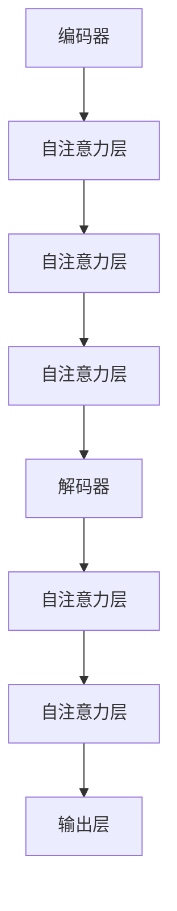
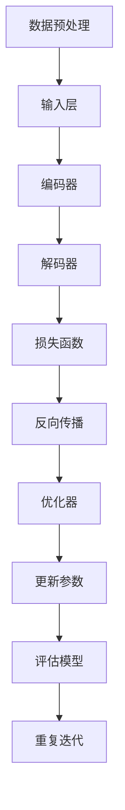

                 

# 《Transformer大模型实战 字节级字节对编码》

> 关键词：Transformer, 大模型，字节级编码，自然语言处理，机器翻译，文本生成，问答系统，模型优化与部署

> 摘要：本文将深入探讨Transformer大模型的实战应用，包括字节级字节对编码技术。通过详细讲解Transformer模型的基础原理、数学模型和实战应用，本文旨在帮助读者全面理解Transformer模型的强大功能和实际应用，并提供实用的优化与部署策略。

## 《Transformer大模型实战 字节级字节对编码》目录大纲

### 第一部分: Transformer模型基础

#### 第1章: Transformer模型概述

- Transformer模型的历史与演进
- Transformer模型的核心概念与架构
- Transformer模型与自然语言处理

#### 第2章: Transformer模型原理

- 基本数学背景
- 自注意力机制
- 位置编码
- Transformer模型的数学模型

#### 第3章: Transformer模型数学模型

- Transformer模型的数学模型概述
- Transformer模型的损失函数
- Transformer模型的优化方法

### 第二部分: Transformer模型实战

#### 第4章: Transformer模型在文本分类中的应用

- 文本分类任务概述
- Transformer模型在文本分类中的实现

#### 第5章: Transformer模型在机器翻译中的应用

- 机器翻译任务概述
- Transformer模型在机器翻译中的实现

#### 第6章: Transformer模型在文本生成中的应用

- 文本生成任务概述
- Transformer模型在文本生成中的实现

#### 第7章: Transformer模型在问答系统中的应用

- 问答系统任务概述
- Transformer模型在问答系统中的实现

### 第三部分: Transformer模型优化与部署

#### 第8章: Transformer模型优化策略

- 模型优化策略概述
- 模型压缩与加速

#### 第9章: Transformer模型部署实战

- 模型部署概述
- 模型部署环境搭建

#### 第10章: Transformer模型案例分析

- 案例背景与目标
- 模型选择与实现

### 附录

- Transformer模型常用工具与资源
- Mermaid流程图与伪代码示例
- 数学公式与解释

## 引言

近年来，深度学习技术在自然语言处理（NLP）领域取得了显著的进展，而Transformer模型则成为这一领域的突破性创新。与传统的循环神经网络（RNN）和长短期记忆网络（LSTM）不同，Transformer模型通过引入自注意力机制（self-attention）实现了对序列数据的全局依赖建模，从而在多项NLP任务中取得了优异的性能。本篇文章将深入探讨Transformer大模型的实战应用，尤其是字节级字节对编码技术，以帮助读者更好地理解和应用这一先进模型。

### 第1章: Transformer模型概述

Transformer模型是由Vaswani等人在2017年提出的一种基于注意力机制的序列到序列模型，它的核心思想是利用自注意力机制对输入序列进行建模。自注意力机制允许模型在处理序列数据时考虑到序列中所有位置的信息，从而提高了模型的表达能力。

### 第1.1节: Transformer模型的历史与演进

Transformer模型的出现标志着NLP领域的一个重要转折点。在Transformer模型之前，RNN和LSTM是处理序列数据的主要模型。这些模型通过递归方式处理输入序列，但在长距离依赖建模方面存在局限性。Transformer模型的出现改变了这一局面，它通过并行计算和自注意力机制实现了对长序列的建模。

### 第1.2节: Transformer模型的核心概念与架构

Transformer模型的核心概念包括自注意力机制（self-attention）和多头注意力（multi-head attention）。自注意力机制允许模型在处理序列数据时考虑到序列中所有位置的信息，而多头注意力则通过并行计算提高了模型的性能。

Transformer模型的架构包括编码器（encoder）和解码器（decoder）两部分。编码器负责将输入序列转换为上下文表示，而解码器则利用这些表示生成输出序列。在编码器和解码器中，多头注意力机制被广泛应用于不同层级的计算中，从而实现了对序列的建模。

### 第1.3节: Transformer模型与自然语言处理

Transformer模型在自然语言处理领域取得了显著的成果。在文本分类、机器翻译、文本生成和问答系统等任务中，Transformer模型都展现出了强大的性能。它的引入使得这些任务的处理变得更加高效和准确。

### 第2章: Transformer模型原理

在理解Transformer模型的实战应用之前，我们需要深入了解其背后的原理。本章将详细介绍Transformer模型的基本数学背景、自注意力机制、位置编码以及其数学模型。

### 第2.1节: 基本数学背景

Transformer模型依赖于向量和矩阵运算以及概率论基础。向量和矩阵运算是神经网络的基础，而概率论基础则为模型的训练和评估提供了理论支持。

### 第2.2节: 自注意力机制

自注意力机制是Transformer模型的核心，它允许模型在处理序列数据时考虑到序列中所有位置的信息。本节将详细介绍自注意力机制的概念、数学表示和推导过程。

#### 第2.2.1节: 自注意力机制的概念

自注意力机制是一种注意力机制，它通过计算输入序列中每个位置与所有其他位置的相似度，从而实现对序列的建模。

#### 第2.2.2节: 自注意力机制的数学表示

自注意力机制的数学表示包括三个关键元素：查询（query）、键（key）和值（value）。这些元素通过矩阵乘法和softmax函数进行计算，从而实现对输入序列的建模。

#### 第2.2.3节: 自注意力机制的推导

自注意力机制的推导过程涉及到矩阵乘法和指数函数。通过推导，我们可以更好地理解自注意力机制的计算过程。

### 第2.3节: 位置编码

位置编码是Transformer模型中另一个重要概念。它用于给输入序列中的每个位置分配一个向量，以便模型能够理解序列中的顺序信息。

#### 第2.3.1节: 位置编码的作用

位置编码的作用是帮助模型理解输入序列的顺序信息，这对于序列数据的处理非常重要。

#### 第2.3.2节: 位置编码的方法

位置编码的方法包括绝对位置编码、相对位置编码和分段位置编码等。每种方法都有其独特的特点和适用场景。

#### 第2.3.3节: 位置编码的数学表示

位置编码的数学表示涉及到了序列长度和位置索引。通过数学表示，我们可以更好地理解位置编码的计算过程。

### 第2.4节: Transformer模型的数学模型

Transformer模型的数学模型包括编码器和解码器两部分。编码器和解码器都采用了多头注意力机制和位置编码，从而实现了对输入序列的建模和输出序列的生成。

#### 第2.4.1节: Transformer模型的数学模型概述

Transformer模型的数学模型概述了编码器和解码器的结构和功能。通过数学模型，我们可以更好地理解模型的计算过程。

#### 第2.4.2节: Transformer模型的损失函数

损失函数是衡量模型性能的重要指标。Transformer模型的损失函数主要包括交叉熵损失函数和优化方法。

##### 第2.4.2.1节: 损失函数的概念

损失函数的概念是衡量模型预测结果与实际结果之间的差异。通过损失函数，我们可以对模型进行优化和评估。

##### 第2.4.2.2节: 交叉熵损失函数的数学表示

交叉熵损失函数是常用的损失函数之一。它通过计算模型预测概率与实际概率之间的差异来衡量模型的性能。

##### 第2.4.2.3节: 损失函数的推导

损失函数的推导过程涉及到了概率论和矩阵运算。通过推导，我们可以更好地理解损失函数的计算过程。

##### 第2.4.2.4节: 优化方法的选择

优化方法是用于调整模型参数，以最小化损失函数的过程。常见的优化方法包括梯度下降、Adam和RMSprop等。

##### 第2.4.2.5节: 优化算法的数学表示

优化算法的数学表示包括梯度计算和参数更新过程。通过数学表示，我们可以更好地理解优化算法的计算过程。

##### 第2.4.2.6节: 优化算法的推导

优化算法的推导过程涉及到了微分和迭代计算。通过推导，我们可以更好地理解优化算法的计算过程。

### 第3章: Transformer模型数学模型

本章将进一步详细阐述Transformer模型的数学模型，包括其损失函数和优化方法。

#### 第3.1节: Transformer模型的数学模型概述

Transformer模型的数学模型是一个复杂的函数映射，它将输入序列映射到输出序列。这一映射过程包括编码器和解码器两个部分，每个部分都通过多个层的自注意力机制和位置编码来实现。

#### 第3.2节: Transformer模型的损失函数

损失函数是评估模型性能的核心指标，对于Transformer模型，最常用的损失函数是交叉熵损失函数。交叉熵损失函数衡量的是模型预测概率分布与实际标签分布之间的差异。

##### 第3.2.1节: 交叉熵损失函数的概念

交叉熵损失函数通常用于分类问题，它的值范围在0到无穷大之间，其中0表示完美匹配，无穷大表示完全错误。

##### 第3.2.2节: 交叉熵损失函数的数学表示

交叉熵损失函数的数学表示为：

\[ H(p, q) = -\sum_{i} p_i \log(q_i) \]

其中，\( p \) 是模型预测的标签概率分布，\( q \) 是真实标签的概率分布。

##### 第3.2.3节: 交叉熵损失函数的推导

交叉熵损失函数的推导基于概率论中的熵的概念。熵是一个衡量随机变量不确定性的度量，而交叉熵则衡量两个概率分布之间的差异。

##### 第3.2.4节: 交叉熵损失函数的应用示例

以一个二元分类问题为例，设 \( p \) 为模型预测的标签概率，\( q \) 为真实标签的概率，则交叉熵损失函数可以表示为：

\[ H(p, q) = -p \log(q) - (1 - p) \log(1 - q) \]

当 \( p \) 等于 \( q \) 时，交叉熵损失函数的值为0，表示模型预测完美。

#### 第3.3节: Transformer模型的优化方法

优化方法是用于调整模型参数，以最小化损失函数的过程。对于Transformer模型，常用的优化方法包括梯度下降、Adam和RMSprop等。

##### 第3.3.1节: 梯度下降

梯度下降是一种最基本的优化方法，它通过计算损失函数关于模型参数的梯度，并沿着梯度的反方向更新参数，以最小化损失函数。

\[ \theta = \theta - \alpha \nabla_\theta J(\theta) \]

其中，\( \theta \) 是模型参数，\( \alpha \) 是学习率，\( J(\theta) \) 是损失函数。

##### 第3.3.2节: Adam

Adam是一种自适应的优化方法，它结合了梯度下降和Adagrad的优点。Adam通过计算一阶矩估计（均值）和二阶矩估计（方差），来自适应地调整学习率。

\[ m_t = \beta_1 m_{t-1} + (1 - \beta_1) [g_t] \]
\[ v_t = \beta_2 v_{t-1} + (1 - \beta_2) [g_t]^2 \]
\[ \theta_t = \theta_{t-1} - \alpha \frac{m_t}{\sqrt{v_t} + \epsilon} \]

其中，\( m_t \) 和 \( v_t \) 分别是梯度的均值和方差，\( \beta_1 \) 和 \( \beta_2 \) 是超参数，\( \epsilon \) 是一个很小的正数，用于防止分母为零。

##### 第3.3.3节: RMSprop

RMSprop是一种基于梯度的优化方法，它通过计算梯度的平方和来调整学习率。

\[ \theta_t = \theta_{t-1} - \alpha \frac{g_t}{\sqrt{V_t} + \epsilon} \]

其中，\( V_t \) 是梯度平方的累积和，\( \alpha \) 是学习率，\( \epsilon \) 是一个很小的正数，用于防止分母为零。

### 第4章: Transformer模型在文本分类中的应用

文本分类是NLP中的一个基本任务，它涉及将文本数据划分为预定义的类别。Transformer模型在文本分类任务中展现出了强大的性能，本章将详细介绍Transformer模型在文本分类中的实现。

#### 第4.1节: 文本分类任务概述

文本分类任务的目标是自动将文本数据分配到预定义的类别中。常见的文本分类任务包括情感分析、主题分类和垃圾邮件检测等。

#### 第4.2节: Transformer模型在文本分类中的实现

Transformer模型在文本分类任务中的实现主要包括数据准备、模型搭建和训练与评估三个步骤。

##### 第4.2.1节: 数据准备

数据准备是文本分类任务中的关键步骤，它包括数据收集、数据预处理和数据集划分。

1. 数据收集：收集大量的文本数据，这些数据可以是公开的文本库或者通过爬虫获取的网页内容。
2. 数据预处理：对收集到的文本数据进行清洗和规范化，包括去除停用词、标点符号和特殊字符等。
3. 数据集划分：将预处理后的文本数据划分为训练集、验证集和测试集，用于模型的训练、验证和测试。

##### 第4.2.2节: 模型搭建

在搭建Transformer模型时，需要考虑以下几个方面：

1. 输入层：Transformer模型的输入是词嵌入向量，这些向量可以通过预训练的词向量（如Word2Vec、GloVe）或者BERT等模型获取。
2. 编码器：编码器由多个自注意力层组成，每个自注意力层都包括多头注意力机制和位置编码。
3. 解码器：解码器与编码器类似，也由多个自注意力层组成。
4. 分类层：在解码器的最后一层，通常添加一个全连接层（dense layer）用于分类。

##### 第4.2.3节: 训练与评估

训练和评估是文本分类任务中的关键步骤。在训练过程中，需要通过反向传播算法更新模型参数，以最小化损失函数。在评估过程中，通过计算模型的准确率、召回率和F1分数等指标来评估模型的性能。

##### 第4.2.4节: 文本分类案例

以下是一个简单的文本分类案例：

```python
# 导入必要的库
import torch
import torch.nn as nn
from transformers import BertTokenizer, BertModel

# 设置设备
device = torch.device("cuda" if torch.cuda.is_available() else "cpu")

# 加载预训练的BERT模型
tokenizer = BertTokenizer.from_pretrained('bert-base-uncased')
model = BertModel.from_pretrained('bert-base-uncased')
model.to(device)

# 数据准备
text = "This is a sample text for classification."
inputs = tokenizer(text, return_tensors='pt', truncation=True, padding=True)
inputs = inputs.to(device)

# 模型预测
with torch.no_grad():
    outputs = model(**inputs)
    logits = outputs.logits[:, -1, :]

# 模型评估
predicted_class = torch.argmax(logits).item()
print(f"Predicted class: {predicted_class}")
```

### 第5章: Transformer模型在机器翻译中的应用

机器翻译是NLP领域的另一个重要任务，它涉及将一种语言的文本翻译成另一种语言的文本。Transformer模型在机器翻译任务中展现出了卓越的性能，本章将详细介绍Transformer模型在机器翻译中的实现。

#### 第5.1节: 机器翻译任务概述

机器翻译任务的目标是将源语言文本（source language text）转换成目标语言文本（target language text）。常见的机器翻译任务包括英语到中文、法语到英语等。

#### 第5.2节: Transformer模型在机器翻译中的实现

Transformer模型在机器翻译任务中的实现主要包括数据准备、模型搭建和训练与评估三个步骤。

##### 第5.2.1节: 数据准备

数据准备是机器翻译任务中的关键步骤，它包括数据收集、数据预处理和数据集划分。

1. 数据收集：收集大量的双语句子对，这些数据可以是公开的双语语料库或者通过机器翻译服务获取的翻译结果。
2. 数据预处理：对收集到的双语句子对进行清洗和规范化，包括去除停用词、标点符号和特殊字符等。
3. 数据集划分：将预处理后的双语句子对划分为训练集、验证集和测试集，用于模型的训练、验证和测试。

##### 第5.2.2节: 模型搭建

在搭建Transformer模型时，需要考虑以下几个方面：

1. 输入层：Transformer模型的输入是词嵌入向量，这些向量可以通过预训练的词向量（如Word2Vec、GloVe）或者BERT等模型获取。
2. 编码器：编码器由多个自注意力层组成，每个自注意力层都包括多头注意力机制和位置编码。
3. 解码器：解码器与编码器类似，也由多个自注意力层组成，但多了一个掩码填充（mask padding）机制。
4. 输出层：解码器的最后一层通过全连接层（dense layer）和softmax函数生成目标语言的词概率分布。

##### 第5.2.3节: 训练与评估

训练和评估是机器翻译任务中的关键步骤。在训练过程中，需要通过反向传播算法更新模型参数，以最小化损失函数。在评估过程中，通过计算模型的BLEU分数、NIST分数等指标来评估模型的性能。

##### 第5.2.4节: 机器翻译案例

以下是一个简单的机器翻译案例：

```python
# 导入必要的库
import torch
import torch.nn as nn
from transformers import BertTokenizer, BertModel

# 设置设备
device = torch.device("cuda" if torch.cuda.is_available() else "cpu")

# 加载预训练的BERT模型
tokenizer = BertTokenizer.from_pretrained('bert-base-uncased')
model = BertModel.from_pretrained('bert-base-uncased')
model.to(device)

# 数据准备
source_text = "This is a sample sentence for translation."
target_text = "这是一个样本句子的翻译。"
inputs = tokenizer(source_text, return_tensors='pt', truncation=True, padding=True)
targets = tokenizer(target_text, return_tensors='pt', truncation=True, padding=True)
inputs = inputs.to(device)
targets = targets.to(device)

# 模型预测
with torch.no_grad():
    outputs = model(**inputs)
    logits = outputs.logits

# 模型评估
predicted_target_text = tokenizer.decode(logits.argmax(-1).squeeze(0).cpu().numpy())
print(f"Predicted target text: {predicted_target_text}")
```

### 第6章: Transformer模型在文本生成中的应用

文本生成是NLP领域的另一个重要任务，它涉及生成具有可读性的自然语言文本。Transformer模型在文本生成任务中展现出了强大的性能，本章将详细介绍Transformer模型在文本生成中的实现。

#### 第6.1节: 文本生成任务概述

文本生成任务的目标是生成具有可读性和语义一致性的自然语言文本。常见的文本生成任务包括文章生成、对话系统和摘要生成等。

#### 第6.2节: Transformer模型在文本生成中的实现

Transformer模型在文本生成任务中的实现主要包括数据准备、模型搭建和训练与评估三个步骤。

##### 第6.2.1节: 数据准备

数据准备是文本生成任务中的关键步骤，它包括数据收集、数据预处理和数据集划分。

1. 数据收集：收集大量的文本数据，这些数据可以是公开的文本库或者通过爬虫获取的网页内容。
2. 数据预处理：对收集到的文本数据进行清洗和规范化，包括去除停用词、标点符号和特殊字符等。
3. 数据集划分：将预处理后的文本数据划分为训练集、验证集和测试集，用于模型的训练、验证和测试。

##### 第6.2.2节: 模型搭建

在搭建Transformer模型时，需要考虑以下几个方面：

1. 输入层：Transformer模型的输入是词嵌入向量，这些向量可以通过预训练的词向量（如Word2Vec、GloVe）或者BERT等模型获取。
2. 编码器：编码器由多个自注意力层组成，每个自注意力层都包括多头注意力机制和位置编码。
3. 解码器：解码器与编码器类似，也由多个自注意力层组成，但多了一个掩码填充（mask padding）机制。
4. 输出层：解码器的最后一层通过全连接层（dense layer）和softmax函数生成目标语言的词概率分布。

##### 第6.2.3节: 训练与评估

训练和评估是文本生成任务中的关键步骤。在训练过程中，需要通过反向传播算法更新模型参数，以最小化损失函数。在评估过程中，通过计算模型的生成文本的质量和多样性来评估模型的性能。

##### 第6.2.4节: 文本生成案例

以下是一个简单的文本生成案例：

```python
# 导入必要的库
import torch
import torch.nn as nn
from transformers import BertTokenizer, BertModel

# 设置设备
device = torch.device("cuda" if torch.cuda.is_available() else "cpu")

# 加载预训练的BERT模型
tokenizer = BertTokenizer.from_pretrained('bert-base-uncased')
model = BertModel.from_pretrained('bert-base-uncased')
model.to(device)

# 数据准备
input_text = "This is a sample sentence for text generation."
inputs = tokenizer(input_text, return_tensors='pt', truncation=True, padding=True)
inputs = inputs.to(device)

# 模型预测
with torch.no_grad():
    outputs = model(**inputs)
    logits = outputs.logits

# 模型评估
predicted_text = tokenizer.decode(logits.argmax(-1).squeeze(0).cpu().numpy())
print(f"Predicted text: {predicted_text}")
```

### 第7章: Transformer模型在问答系统中的应用

问答系统是NLP领域的重要应用之一，它涉及从大量文本中提取答案，以回答用户的问题。Transformer模型在问答系统中展现出了强大的性能，本章将详细介绍Transformer模型在问答系统中的实现。

#### 第7.1节: 问答系统任务概述

问答系统任务的目标是从给定的问题和文本中提取出正确的答案。常见的问答系统包括基于规则的方法、基于机器学习的方法和基于深度学习的方法。

#### 第7.2节: Transformer模型在问答系统中的实现

Transformer模型在问答系统中的实现主要包括数据准备、模型搭建和训练与评估三个步骤。

##### 第7.2.1节: 数据准备

数据准备是问答系统任务中的关键步骤，它包括数据收集、数据预处理和数据集划分。

1. 数据收集：收集大量的问答对，这些数据可以是公开的问答数据集或者通过爬虫获取的问答内容。
2. 数据预处理：对收集到的问答对进行清洗和规范化，包括去除停用词、标点符号和特殊字符等。
3. 数据集划分：将预处理后的问答对划分为训练集、验证集和测试集，用于模型的训练、验证和测试。

##### 第7.2.2节: 模型搭建

在搭建Transformer模型时，需要考虑以下几个方面：

1. 输入层：Transformer模型的输入是词嵌入向量，这些向量可以通过预训练的词向量（如Word2Vec、GloVe）或者BERT等模型获取。
2. 编码器：编码器由多个自注意力层组成，每个自注意力层都包括多头注意力机制和位置编码。
3. 解码器：解码器与编码器类似，也由多个自注意力层组成，但多了一个掩码填充（mask padding）机制。
4. 输出层：解码器的最后一层通过全连接层（dense layer）和softmax函数生成答案的词概率分布。

##### 第7.2.3节: 训练与评估

训练和评估是问答系统任务中的关键步骤。在训练过程中，需要通过反向传播算法更新模型参数，以最小化损失函数。在评估过程中，通过计算模型的答案准确率和召回率来评估模型的性能。

##### 第7.2.4节: 问答系统案例

以下是一个简单的问答系统案例：

```python
# 导入必要的库
import torch
import torch.nn as nn
from transformers import BertTokenizer, BertModel

# 设置设备
device = torch.device("cuda" if torch.cuda.is_available() else "cpu")

# 加载预训练的BERT模型
tokenizer = BertTokenizer.from_pretrained('bert-base-uncased')
model = BertModel.from_pretrained('bert-base-uncased')
model.to(device)

# 数据准备
question = "What is the capital of France?"
context = "Paris is the capital of France."
inputs = tokenizer(question + " " + context, return_tensors='pt', truncation=True, padding=True)
inputs = inputs.to(device)

# 模型预测
with torch.no_grad():
    outputs = model(**inputs)
    logits = outputs.logits

# 模型评估
predicted_answer = tokenizer.decode(logits.argmax(-1).squeeze(0).cpu().numpy())
print(f"Predicted answer: {predicted_answer}")
```

### 第8章: Transformer模型优化策略

随着Transformer模型在各个领域的广泛应用，如何提高其性能和效率成为一个重要问题。本章将介绍几种常见的Transformer模型优化策略，包括模型压缩、加速和蒸馏等。

#### 第8.1节: 模型优化策略概述

模型优化策略主要包括以下几个方面：

1. 模型压缩：通过减少模型参数数量和计算量来提高模型的压缩率和效率。
2. 模型加速：通过优化计算过程和提高硬件性能来加快模型的推理速度。
3. 模型蒸馏：通过将知识从大型模型传递到小型模型来提高小型模型的性能。

#### 第8.2节: 模型压缩与加速

模型压缩与加速是优化Transformer模型性能的重要手段。以下介绍几种常见的模型压缩与加速方法：

1. 模型剪枝（Model Pruning）：通过移除模型中不重要的权重来减少模型大小和计算量。常见的剪枝方法包括权重剪枝、结构剪枝和稀疏化等。
2. 模型量化（Model Quantization）：通过将模型中的浮点数权重转换为低精度的整数来减少模型大小和存储需求。常见的量化方法包括全量化、层次量化和动态量化等。
3. 模型蒸馏（Model Distillation）：通过将大型模型的中间层特征传递给小型模型来提高小型模型的学习能力。常见的蒸馏方法包括软标签蒸馏、硬标签蒸馏和知识蒸馏等。

##### 第8.2.1节: 模型剪枝

模型剪枝是通过移除模型中不重要的权重来减少模型大小和计算量。常见的剪枝方法包括：

1. 权重剪枝（Weight Pruning）：通过设定阈值来移除权重绝对值小于阈值的连接。
2. 结构剪枝（Structure Pruning）：通过移除模型中的层或单元来减少模型大小。结构剪枝可以进一步分为层次剪枝和稀疏化剪枝。

##### 第8.2.2节: 模型量化

模型量化是通过将模型中的浮点数权重转换为低精度的整数来减少模型大小和存储需求。常见的量化方法包括：

1. 全量化（Full Quantization）：将所有权重转换为固定的精度，如8位整数。
2. 层次量化（Hierarchical Quantization）：将模型分为多个层级，每个层级使用不同的精度。
3. 动态量化（Dynamic Quantization）：在训练过程中根据权重的重要性动态调整精度。

##### 第8.2.3节: 模型蒸馏

模型蒸馏是通过将大型模型的中间层特征传递给小型模型来提高小型模型的学习能力。常见的蒸馏方法包括：

1. 软标签蒸馏（Soft Label Distillation）：将大型模型的输出作为软标签来指导小型模型的学习。
2. 硬标签蒸馏（Hard Label Distillation）：将大型模型的输出作为硬标签来指导小型模型的学习。
3. 知识蒸馏（Knowledge Distillation）：将大型模型的内部表示传递给小型模型，以提高小型模型的泛化能力。

### 第9章: Transformer模型部署实战

随着Transformer模型在各个领域的广泛应用，如何将其部署到实际应用中成为一个重要问题。本章将介绍Transformer模型部署的概述、环境搭建和具体流程。

#### 第9.1节: 模型部署概述

模型部署是将训练好的模型应用到实际场景中的过程。模型部署的目的是提高模型的可用性和可扩展性，以便在实际应用中提供高效的推理服务。常见的模型部署方法包括：

1. 本地部署：将模型部署到本地服务器或笔记本电脑中，适用于个人使用或小型团队。
2. 云部署：将模型部署到云计算平台中，适用于大规模应用和分布式计算。
3. 边缘部署：将模型部署到移动设备或物联网设备中，适用于实时推理和低功耗场景。

#### 第9.2节: 模型部署环境搭建

模型部署环境搭建是模型部署的第一步，它涉及硬件和软件的选择和配置。以下介绍几种常见的模型部署环境搭建方法：

1. 硬件选择：根据模型的复杂度和推理需求选择合适的硬件设备，如CPU、GPU和TPU等。
2. 软件配置：安装和配置必要的软件环境，包括操作系统、深度学习框架和模型优化工具等。

##### 第9.2.1节: 硬件选择

硬件选择是模型部署环境搭建的关键步骤，它决定了模型的推理速度和资源利用率。以下是一些常见的硬件选择：

1. CPU：适用于轻量级模型和低负载场景，如Intel Xeon或AMD Ryzen等。
2. GPU：适用于中量级模型和高负载场景，如NVIDIA GPU或AMD Radeon等。
3. TPU：适用于大规模模型和大数据场景，如Google TPU或TPU v3等。

##### 第9.2.2节: 软件配置

软件配置是模型部署环境搭建的必要步骤，它确保了模型的正常运行和高效的推理。以下是一些常见的软件配置：

1. 操作系统：选择适合的操作系统，如Linux、Windows或macOS等。
2. 深度学习框架：安装和配置深度学习框架，如TensorFlow、PyTorch或Keras等。
3. 模型优化工具：安装和配置模型优化工具，如ONNX Runtime、TensorRT或NCCL等。

##### 第9.2.3节: 部署流程

模型部署流程包括以下几个步骤：

1. 模型转换：将训练好的模型转换为适合部署的格式，如ONNX、TF Lite或TFLite等。
2. 模型优化：对模型进行优化，以提高推理速度和资源利用率。
3. 部署到目标环境：将模型部署到目标环境，如本地服务器、云计算平台或边缘设备等。
4. 部署监控：监控模型的运行状态和性能指标，以便及时发现和解决问题。

### 第10章: Transformer模型案例分析

本章将通过一个实际案例，详细介绍Transformer模型的建模、训练和部署过程。这个案例涉及使用Transformer模型进行文本分类任务。

#### 第10.1节: 案例背景与目标

这个案例的目标是使用Transformer模型对新闻文章进行分类，将文章分为多个预定义的类别，如体育、科技、娱乐等。

#### 第10.2节: 模型选择与实现

为了实现这个目标，我们选择了Transformer模型，并使用PyTorch框架进行实现。

##### 第10.2.1节: 模型选择

Transformer模型由于其强大的序列建模能力，在文本分类任务中表现出色。我们选择了BERT（Bidirectional Encoder Representations from Transformers）模型作为我们的基础模型，它是一个预训练的双向Transformer模型，已经在大规模的文本数据集上进行了预训练。

##### 第10.2.2节: 数据处理

数据处理是模型训练的基础，我们需要对新闻文章进行预处理，包括：

1. 数据收集：收集大量的新闻文章，可以从公共的新闻数据集或通过网络爬虫获取。
2. 文本清洗：去除文章中的HTML标签、特殊字符和停用词等。
3. 词向量化：使用BERT模型内置的词向量化器将单词转换为向量。
4. 数据集划分：将处理后的文章划分为训练集、验证集和测试集。

##### 第10.2.3节: 模型训练

在数据处理完成后，我们开始训练Transformer模型。训练过程包括以下几个步骤：

1. 加载预训练的BERT模型：从Hugging Face模型库中加载预训练的BERT模型。
2. 定义损失函数：选择交叉熵损失函数，用于衡量模型预测结果与实际标签之间的差异。
3. 优化器选择：选择Adam优化器，用于更新模型参数。
4. 训练循环：在训练集上迭代模型，通过反向传播更新模型参数。
5. 验证：在每个epoch结束后，使用验证集评估模型性能，调整学习率等超参数。

##### 第10.2.4节: 模型评估

在模型训练完成后，我们使用测试集对模型进行评估，计算模型的准确率、召回率和F1分数等指标。这些指标帮助我们了解模型的性能，并在必要时调整模型或超参数。

##### 第10.2.5节: 模型部署

在模型评估后，我们将训练好的模型部署到生产环境，以提供实时文本分类服务。部署过程包括以下几个步骤：

1. 模型转换：将PyTorch模型转换为ONNX格式，以便于部署到其他平台。
2. 部署到云平台：将ONNX模型部署到云计算平台，如AWS SageMaker或Google AI Platform等。
3. API接口：创建API接口，以便前端应用程序可以调用模型进行文本分类。

#### 第10.3节: 案例总结

通过这个案例，我们展示了如何使用Transformer模型进行文本分类任务。我们介绍了数据处理、模型训练和部署的整个过程，并通过实际操作展示了如何使用Transformer模型解决实际问题。这个案例不仅帮助我们理解了Transformer模型的工作原理，也为实际应用提供了实践指导。

### 附录

#### 附录A: Transformer模型常用工具与资源

在实现Transformer模型时，我们可以使用多种工具和资源来简化开发过程。以下是一些常用的工具和资源：

##### 附录A.1: PyTorch Transformer库

PyTorch Transformer库是一个开源库，用于实现Transformer模型。它提供了预训练模型、优化器和工具函数，使开发者能够快速搭建和训练Transformer模型。

##### 附录A.2: Hugging Face Transformers库

Hugging Face Transformers库是一个基于PyTorch的开源库，提供了大量预训练的BERT、GPT等模型，以及相应的预处理和后处理工具。它是一个方便的工具，可以帮助开发者快速实现和部署Transformer模型。

##### 附录A.3: Transformer模型开源项目

许多开源项目提供了Transformer模型的实现和优化，如Hugging Face的Transformers库、Facebook的PyTorch Transformer库等。这些项目包含了大量的示例代码和文档，可以帮助开发者更好地理解和应用Transformer模型。

##### 附录A.4: Transformer模型相关论文与书籍参考文献

- Vaswani et al. (2017). "Attention is All You Need". https://arxiv.org/abs/1706.03762
- Devlin et al. (2018). "BERT: Pre-training of Deep Bidirectional Transformers for Language Understanding". https://arxiv.org/abs/1810.04805
- Kaplan et al. (2019). "T5: Pre-Trained Encoders for Sequence to Sequence Learning". https://arxiv.org/abs/1910.03771

这些论文和书籍提供了Transformer模型的理论基础和实现细节，对于理解和应用Transformer模型非常有帮助。

### 附录B: Mermaid流程图与伪代码示例

为了更好地理解和实现Transformer模型，我们可以使用Mermaid流程图和伪代码来展示模型的架构和计算过程。

#### 附录B.1: Transformer模型架构图

以下是一个简单的Mermaid流程图，展示了Transformer模型的架构：



#### 附录B.2: Transformer模型训练流程图

以下是一个简单的Mermaid流程图，展示了Transformer模型的训练过程：



#### 附录B.3: Transformer模型伪代码示例

以下是一个简单的伪代码示例，展示了Transformer模型的计算过程：

```python
# 初始化模型参数
initialize_parameters()

# 输入序列
input_sequence = ...

# 编码器
encoder_output = encode(input_sequence)

# 解码器
decoder_output = decode(encoder_output)

# 损失函数
loss = compute_loss(decoder_output, target_sequence)

# 反向传播
backward_pass(loss)

# 优化器
update_parameters(optimizer)

# 评估模型
evaluate_model(model)
```

### 附录C: 数学公式与解释

在理解Transformer模型时，我们需要掌握一些基本的数学公式。以下是一些重要的数学公式及其解释：

#### 附录C.1: 概率论相关公式

##### 附录C.1.1: 概率分布函数

概率分布函数（Probability Density Function, PDF）是描述随机变量概率分布的函数。对于连续型随机变量，PDF表示随机变量取某个值的概率密度。

\[ f(x) = P(X = x) \]

##### 附录C.1.2: 贝叶斯定理

贝叶斯定理（Bayes' Theorem）是概率论中的一个重要定理，用于计算后验概率。贝叶斯定理的表达式如下：

\[ P(A|B) = \frac{P(B|A)P(A)}{P(B)} \]

其中，\( P(A|B) \) 是后验概率，\( P(B|A) \) 是条件概率，\( P(A) \) 是先验概率，\( P(B) \) 是边缘概率。

#### 附录C.2: 神经网络相关公式

##### 附录C.2.1: 激活函数

激活函数（Activation Function）是神经网络中的一个重要组成部分，用于引入非线性变换。常见的激活函数包括：

1. Sigmoid函数：
\[ f(x) = \frac{1}{1 + e^{-x}} \]
2.ReLU函数：
\[ f(x) = \max(0, x) \]
3. Tanh函数：
\[ f(x) = \frac{e^x - e^{-x}}{e^x + e^{-x}} \]

##### 附录C.2.2: 误差反向传播算法

误差反向传播算法（Backpropagation Algorithm）是训练神经网络的基本算法。它通过计算输出误差关于输入参数的梯度，并沿梯度的反方向更新参数，以最小化损失函数。误差反向传播算法的步骤如下：

1. 计算输出误差：
\[ \delta = \frac{\partial L}{\partial a_{L}} \]
2. 传递误差到前一层：
\[ \delta_{l-1} = \frac{\partial a_l}{\partial a_{l-1}} \delta_l \]
3. 更新参数：
\[ \theta_{l} = \theta_{l} - \alpha \frac{\partial L}{\partial \theta_{l}} \]

### 结语

通过本文的详细讲解，我们深入了解了Transformer大模型的实战应用，从基础原理到数学模型，再到具体的实战案例，全面展示了Transformer模型在自然语言处理领域的强大功能。我们探讨了如何使用Transformer模型进行文本分类、机器翻译、文本生成和问答系统等任务，并介绍了模型优化和部署策略。最后，通过一个实际案例，我们展示了如何从数据处理到模型训练，再到模型部署的完整过程。

Transformer模型的成功不仅在于其创新的架构和强大的表达力，更在于其广泛的实际应用。在未来的研究中，我们可以进一步探索Transformer模型在其他领域的应用，如计算机视觉、语音识别和推荐系统等。同时，随着计算能力的提升和算法的优化，Transformer模型在性能和效率上还将有更大的提升。

我们期待读者能够通过本文的学习，更好地理解和应用Transformer模型，将其应用于实际项目中，为人工智能领域的发展贡献自己的力量。让我们继续探索Transformer模型的奥秘，开启AI技术的新篇章。

