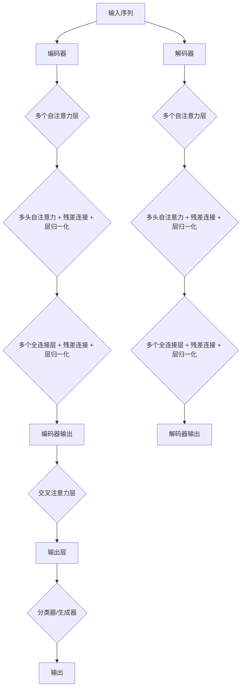

                 

# Transformer大模型实战：针对下游任务进行微调

> **关键词：** Transformer, 微调, 下游任务, 自注意力机制, 数学模型, 实战案例

> **摘要：** 本文将深入探讨Transformer大模型的实战应用，重点关注如何针对不同下游任务进行微调。我们将从Transformer模型的基本原理出发，详细讲解其核心算法原理、数学模型，并通过实际项目案例，展示微调过程、技巧和优化策略，帮助读者全面理解Transformer模型的实战应用。

## 目录大纲

### 《Transformer大模型实战 针对下游任务进行微调》目录大纲

## 第一部分：Transformer大模型基础

### 1. Transformer模型原理与架构

#### 1.1 Transformer模型概述

#### 1.2 自注意力机制

#### 1.3 堆叠自注意力层

#### 1.4 Transformer模型架构详解

#### 1.5 Transformer模型与序列生成

#### 1.6 Transformer模型的Mermaid流程图

### 2. Transformer核心算法原理

#### 2.1 Transformer算法原理讲解

#### 2.2 伪代码详细阐述

#### 2.3 多头注意力机制详解

#### 2.4 位置编码与位置嵌入

#### 2.5 残差连接与层归一化

### 3. 数学模型与数学公式

#### 3.1 Transformer数学模型

#### 3.2 举例说明

#### 3.3 数学公式详细讲解

### 4. Transformer模型在下游任务中的应用

#### 4.1 NLP下游任务概述

#### 4.2 预训练与微调

#### 4.3 微调方法与技巧

#### 4.4 微调流程详解

#### 4.5 微调效果评估与优化

## 第二部分：下游任务微调实战

### 5. 文本分类任务微调

#### 5.1 文本分类任务介绍

#### 5.2 数据预处理

#### 5.3 模型选择与架构调整

#### 5.4 微调过程

#### 5.5 结果分析与优化

### 6. 机器翻译任务微调

#### 6.1 机器翻译任务介绍

#### 6.2 数据预处理

#### 6.3 模型选择与架构调整

#### 6.4 微调过程

#### 6.5 结果分析与优化

### 7. 问答系统任务微调

#### 7.1 问答系统任务介绍

#### 7.2 数据预处理

#### 7.3 模型选择与架构调整

#### 7.4 微调过程

#### 7.5 结果分析与优化

### 8. 生成式任务微调

#### 8.1 生成式任务介绍

#### 8.2 数据预处理

#### 8.3 模型选择与架构调整

#### 8.4 微调过程

#### 8.5 结果分析与优化

### 9. 微调技巧与性能优化

#### 9.1 微调参数调整

#### 9.2 数据增强

#### 9.3 模型压缩与量化

#### 9.4 迁移学习与多任务学习

#### 9.5 模型评估与调参技巧

### 10. 实战案例分析

#### 10.1 案例一：新闻摘要生成

#### 10.2 案例二：对话系统生成

#### 10.3 案例三：图像描述生成

#### 10.4 案例四：情感分析

#### 10.5 案例五：医疗问答系统

## 第三部分：扩展阅读与资源

### 11. 扩展阅读

#### 11.1 最新研究成果

#### 11.2 相关论文推荐

#### 11.3 专业书籍推荐

### 12. 开发工具与资源

#### 12.1 深度学习框架

#### 12.2 数据预处理工具

#### 12.3 模型评估工具

#### 12.4 扩展资源推荐

### 附录

#### 附录 A: 伪代码示例

#### 附录 B: 实际代码解读

#### 附录 C: 学习资源汇总

---

**注意：** 以上目录大纲是基于书籍内容的合理推测，实际书籍结构可能会有所不同。目录中的各个章节内容需要根据书籍的具体内容进一步细化和完善。

### 引言

近年来，深度学习，尤其是Transformer模型，在自然语言处理（NLP）领域取得了惊人的进展。Transformer模型由于其强大的序列建模能力，已经在诸如机器翻译、文本分类、问答系统等下游任务中展现了卓越的性能。然而，如何针对特定下游任务对Transformer大模型进行微调，以实现最佳效果，仍然是一个具有挑战性的课题。

本文将围绕Transformer大模型的实战应用展开，系统地介绍其基本原理、核心算法、数学模型，并深入探讨如何针对不同下游任务进行微调。文章将以实际项目案例为支撑，详细阐述微调过程、技巧和优化策略，旨在帮助读者全面掌握Transformer模型的实战应用。

首先，我们将从Transformer模型的基本原理入手，讲解其自注意力机制、架构详解等核心概念。接着，我们将详细阐述Transformer模型的核心算法原理，包括多头注意力机制、位置编码等。在此基础上，我们将介绍数学模型和数学公式，并通过举例说明其应用。随后，我们将探讨Transformer模型在下游任务中的应用，如文本分类、机器翻译、问答系统等。

接下来，文章将进入实战部分，通过具体项目案例，展示如何针对下游任务进行微调。我们将详细讲解微调过程、技巧和优化策略，包括数据预处理、模型选择与架构调整、微调参数调整、数据增强、模型压缩与量化、迁移学习与多任务学习等。最后，我们将分享一些实际案例，进一步展示Transformer模型的强大应用能力。

### 第一部分：Transformer大模型基础

Transformer模型自提出以来，凭借其出色的性能在NLP领域取得了巨大的成功。本部分将深入探讨Transformer模型的基本原理与架构，帮助读者建立对Transformer模型的整体认知。

#### 1.1 Transformer模型概述

Transformer模型是由Google Research团队在2017年提出的一种全新的序列到序列模型，用于处理自然语言处理任务。与传统的循环神经网络（RNN）和长短期记忆网络（LSTM）不同，Transformer模型基于自注意力机制，通过全局依赖关系来建模序列数据，从而实现了更高效和强大的序列建模能力。

Transformer模型的核心思想是利用自注意力机制来捕捉序列中的依赖关系。在自注意力机制中，每个词的表示不仅依赖于自身的特征，还依赖于整个序列中其他词的特征。通过这种方式，模型能够有效地处理长距离依赖问题，提高了序列建模的准确性。

#### 1.2 自注意力机制

自注意力机制是Transformer模型的核心组件，它通过计算词之间的相似性来生成词的权重，进而聚合整个序列的信息。自注意力机制的基本原理可以概括为以下几个步骤：

1. **输入表示**：首先，每个词被映射到一个高维空间，形成输入表示矩阵`X`。

2. **计算相似性**：接着，计算输入表示矩阵`X`与自身及其它词之间的相似性，通过点积操作得到相似性矩阵`S`。

3. **加权聚合**：根据相似性矩阵`S`，对输入表示矩阵`X`进行加权聚合，得到加权聚合结果矩阵`Y`。

4. **输出表示**：最后，从加权聚合结果矩阵`Y`中提取输出表示，用于后续的序列建模任务。

自注意力机制的公式表示如下：

$$
\text{Attention}(Q,K,V) = \text{scaled\ softmax}\left(\frac{QK^T}{\sqrt{d_k}}\right)V
$$

其中，`Q`、`K`、`V`分别为查询向量、键向量和值向量，`d_k`为键向量的维度，`softmax`函数用于对相似性矩阵`S`进行归一化，使得每个词的权重之和为1。

#### 1.3 堆叠自注意力层

Transformer模型通过堆叠多个自注意力层来增强模型的表示能力和序列建模能力。在每个自注意力层中，输入序列首先通过自注意力机制进行聚合，然后通过前馈神经网络（FFN）进行进一步处理。

堆叠自注意力层的具体过程如下：

1. **多头自注意力**：在每个自注意力层中，输入序列被分成多个头，每个头独立地计算自注意力。多头自注意力能够捕捉不同类型的依赖关系，从而提高模型的表示能力。

2. **残差连接**：在每个自注意力层之后，添加残差连接，使得模型的输入直接传递到下一层，防止梯度消失问题。

3. **层归一化**：在每个自注意力层之后，添加层归一化，用于稳定训练过程和加速收敛。

堆叠自注意力层的结构示意图如下所示：

```
输入序列 -> 自注意力层（多头自注意力 + 残差连接 + 层归一化） -> 前馈神经网络（FFN） -> 输出
```

#### 1.4 Transformer模型架构详解

Transformer模型的整体架构可以分为三个主要部分：编码器（Encoder）、解码器（Decoder）和最终输出层（Output Layer）。

1. **编码器（Encoder）**：编码器负责将输入序列编码为固定长度的向量表示。编码器由多个自注意力层堆叠而成，每个自注意力层包含多头自注意力、残差连接和层归一化。编码器的输出是一个固定长度的向量序列。

2. **解码器（Decoder）**：解码器负责将编码器的输出解码为输出序列。解码器同样由多个自注意力层堆叠而成，但与编码器不同的是，解码器在自注意力层中引入了交叉注意力机制，使得解码器能够关注编码器的输出。解码器的输出是一个逐个生成的序列。

3. **最终输出层（Output Layer）**：最终输出层是一个全连接层，用于将解码器的输出映射到具体的下游任务类别或词表中。

Transformer模型的整体架构示意图如下所示：

```
输入序列 -> 编码器（多个自注意力层堆叠） -> 编码器输出
        -> 解码器（多个自注意力层堆叠） -> 解码器输出
        -> 最终输出层 -> 输出
```

#### 1.5 Transformer模型与序列生成

Transformer模型不仅可以用于编码器-解码器任务，如机器翻译和问答系统，还可以用于序列生成任务，如文本生成和对话系统。在序列生成任务中，编码器负责将输入序列编码为固定长度的向量表示，而解码器则通过递归地生成下一个词来构建输出序列。

序列生成任务的实现过程如下：

1. **初始化**：首先，初始化解码器的输入为空，即一个全为0的向量。

2. **递归生成**：接着，解码器逐个生成下一个词。在每次生成过程中，解码器的输入是前一个生成的词和编码器的输出。

3. **更新编码器输出**：在每个生成步骤后，更新编码器的输出，使其反映当前生成的词序列。

4. **终止条件**：当生成的词序列达到终止条件时（如达到最大长度或生成特定的终止词），序列生成任务完成。

序列生成任务的具体实现过程可以概括为：

```
初始化解码器输入 -> 递归生成下一个词 -> 更新编码器输出 -> 判断终止条件 -> 重复直到终止条件满足 -> 输出生成的序列
```

#### 1.6 Transformer模型的Mermaid流程图

为了更好地理解Transformer模型的流程，我们可以使用Mermaid流程图来可视化其核心流程。以下是一个简单的Mermaid流程图示例，展示了Transformer模型的编码器和解码器的处理流程：



通过这个Mermaid流程图，我们可以清晰地看到Transformer模型的编码器和解码器的处理流程，以及它们之间的交互关系。

### 第二部分：Transformer核心算法原理

Transformer模型的成功不仅归功于其独特的架构，还源于其核心算法原理，如自注意力机制、多头注意力机制、位置编码等。在本部分中，我们将详细讲解这些核心算法原理，并通过伪代码和数学模型，帮助读者深入理解Transformer模型的工作机制。

#### 2.1 Transformer算法原理讲解

Transformer模型的核心算法原理可以概括为以下几个关键组件：

1. **自注意力机制**：自注意力机制是Transformer模型的基本构建块，它通过计算词之间的相似性来生成词的权重，从而聚合整个序列的信息。

2. **多头注意力机制**：多头注意力机制通过将输入序列分成多个头，每个头独立地计算自注意力，从而捕捉不同类型的依赖关系，提高模型的表示能力。

3. **位置编码**：由于Transformer模型没有使用循环神经网络（RNN）或卷积神经网络（CNN）中的位置信息，因此位置编码被引入，用于为每个词赋予位置信息。

4. **前馈神经网络（FFN）**：在自注意力层之后，Transformer模型还包含一个前馈神经网络（FFN），用于进一步处理输入。

下面，我们将逐一介绍这些核心算法原理。

#### 2.2 伪代码详细阐述

为了更好地理解Transformer模型的工作原理，我们可以通过伪代码来详细阐述其核心算法。以下是一个简化的Transformer模型的伪代码示例：

```python
# 输入序列：[词1, 词2, 词3, ..., 词n]
# 词向量维度：d_model
# 注意力头数：n_heads

# 初始化词嵌入矩阵：W_embedding [n_vocab, d_model]
# 初始化位置编码矩阵：W_position [n_position, d_model]
# 初始化自注意力权重矩阵：W_attention [d_model, d_model]
# 初始化前馈神经网络权重矩阵：W_ffn1 [d_model, d_inner], W_ffn2 [d_inner, d_model]

# 编码器处理流程
for layer in range(n_layers):
    # 自注意力层
    Q, K, V = self-attention(Q, K, V, W_attention, n_heads)
    Q = residual_connection(Q, Q)
    Q = layer_normalization(Q)

    # 前馈神经网络层
    Q = feed_forward_network(Q, W_ffn1, W_ffn2)
    Q = residual_connection(Q, Q)
    Q = layer_normalization(Q)

# 解码器处理流程
for layer in range(n_layers):
    # 自注意力层
    Q, K, V = self-attention(Q, K, V, W_attention, n_heads)
    Q = residual_connection(Q, Q)
    Q = layer_normalization(Q)

    # 交叉注意力层
    Q, K, V = cross-attention(Q, K, V, W_attention, n_heads)
    Q = residual_connection(Q, Q)
    Q = layer_normalization(Q)

    # 前馈神经网络层
    Q = feed_forward_network(Q, W_ffn1, W_ffn2)
    Q = residual_connection(Q, Q)
    Q = layer_normalization(Q)

# 最终输出：编码器输出 [1, d_model], 解码器输出 [1, d_model]
```

这个伪代码示例展示了Transformer模型的基本流程，包括编码器和解码器的处理。在每个自注意力层中，输入序列通过自注意力机制进行聚合，然后通过前馈神经网络进行进一步处理。在解码器中，交叉注意力机制被引入，使得解码器能够关注编码器的输出。

#### 2.3 多头注意力机制详解

多头注意力机制是Transformer模型的核心组件之一，它通过将输入序列分成多个头，每个头独立地计算自注意力，从而捕捉不同类型的依赖关系。多头注意力机制的实现过程如下：

1. **分割输入序列**：首先，将输入序列分割成多个头。每个头具有相同的维度，通常称为“头维度”（head dimension）。

2. **计算自注意力**：对于每个头，独立地计算自注意力。自注意力机制的基本原理如前所述，通过计算词之间的相似性来生成词的权重，从而聚合整个序列的信息。

3. **聚合多头注意力结果**：将每个头的注意力结果进行聚合，得到最终的注意力结果。

多头注意力机制的公式表示如下：

$$
\text{MultiHead}(Q, K, V) = \text{Concat}(\text{head}_1, \text{head}_2, ..., \text{head}_h)W_O
$$

其中，`Q`、`K`、`V`分别为查询向量、键向量和值向量，`h`为头数，`W_O`为输出权重矩阵。

#### 2.4 位置编码与位置嵌入

由于Transformer模型没有使用循环神经网络（RNN）或卷积神经网络（CNN）中的位置信息，因此位置编码被引入，用于为每个词赋予位置信息。位置编码可以分为绝对位置编码和相对位置编码两种形式。

1. **绝对位置编码**：绝对位置编码为每个词赋予固定的位置信息。常用的绝对位置编码方法包括正弦编码和余弦编码。正弦编码通过正弦函数生成位置编码向量，使得相邻的位置具有相似的编码。余弦编码通过余弦函数生成位置编码向量，使得相邻的位置具有相似的编码。

2. **相对位置编码**：相对位置编码为每个词赋予相对位置信息，即词与词之间的相对位置关系。相对位置编码通过计算词之间的相对位置，生成相对位置编码向量。相对位置编码可以更好地捕捉序列中的相对依赖关系。

在Transformer模型中，位置编码通常与词嵌入（word embeddings）相结合，生成输入序列。具体实现过程如下：

1. **词嵌入**：首先，将输入序列映射到高维空间，形成词嵌入向量。

2. **位置编码**：接着，为每个词添加位置编码，形成输入序列。

3. **输入序列**：将词嵌入向量和位置编码向量相加，形成最终的输入序列。

位置编码的公式表示如下：

$$
\text{Input}_{\text{pos}} = \text{Word}_{\text{emb}} + \text{Position}_{\text{emb}}
$$

其中，`Word_emb`为词嵌入向量，`Position_emb`为位置编码向量。

#### 2.5 残差连接与层归一化

在Transformer模型中，残差连接和层归一化被广泛应用于自注意力层和前馈神经网络层，用于提高模型的训练效果和性能。

1. **残差连接**：残差连接通过将输入直接传递到下一层，增加了模型的信息流，有助于缓解梯度消失问题。残差连接的公式表示如下：

$$
\text{Residual Connection} = X + \text{Layer Output}
$$

其中，`X`为输入，`Layer Output`为当前层的输出。

2. **层归一化**：层归一化通过标准化当前层的输入和输出，使得每个层都有相似的输出分布，从而提高模型的稳定性和收敛速度。常用的层归一化方法包括批归一化和层归一化。批归一化通过对当前批次的所有样本进行归一化，从而实现层归一化。层归一化的公式表示如下：

$$
\text{Layer Normalization} = \frac{\text{Layer Input} - \text{Mean}(\text{Layer Input})}{\sqrt{\text{Variance}(\text{Layer Input}) + \epsilon}}
$$

其中，`Layer Input`为当前层的输入，`Mean`和`Variance`分别为当前层的输入均值和方差，`epsilon`为平滑常数。

通过残差连接和层归一化，Transformer模型能够在训练过程中更好地传递梯度，提高模型的性能。

### 第三部分：数学模型与数学公式

在Transformer模型中，数学模型和数学公式扮演着至关重要的角色。本部分将详细阐述Transformer模型的数学模型，包括注意力机制、位置编码、前馈神经网络等，并通过LaTeX格式和举例说明，帮助读者深入理解这些数学概念。

#### 3.1 Transformer数学模型

Transformer模型的核心在于其自注意力机制，这一机制通过计算词之间的相似性来生成词的权重，从而聚合整个序列的信息。自注意力机制的数学模型可以表示为：

$$
\text{Attention}(Q, K, V) = \text{softmax}\left(\frac{QK^T}{\sqrt{d_k}}\right)V
$$

其中，`Q`、`K`、`V`分别为查询向量（Query）、键向量（Key）和值向量（Value），`d_k`为键向量的维度，`softmax`函数用于对相似性矩阵进行归一化，使得每个词的权重之和为1。

#### 3.2 举例说明

为了更好地理解自注意力机制的数学模型，我们可以通过一个简单的例子来说明其计算过程。假设我们有一个包含3个词的序列，每个词的向量维度为3。我们可以按照以下步骤计算自注意力：

1. **初始化查询向量、键向量和值向量**：
   $$
   Q = \begin{bmatrix}
   q_1 & q_2 & q_3
   \end{bmatrix}, \quad
   K = \begin{bmatrix}
   k_1 & k_2 & k_3
   \end{bmatrix}, \quad
   V = \begin{bmatrix}
   v_1 & v_2 & v_3
   \end{bmatrix}
   $$

2. **计算相似性矩阵**：
   $$
   S = QK^T = \begin{bmatrix}
   q_1k_1 & q_1k_2 & q_1k_3 \\
   q_2k_1 & q_2k_2 & q_2k_3 \\
   q_3k_1 & q_3k_2 & q_3k_3
   \end{bmatrix}
   $$

3. **应用softmax函数**：
   $$
   \text{softmax}(S) = \begin{bmatrix}
   \frac{e^{s_{11}}}{\sum_{i=1}^{3} e^{s_{i1}}} & \frac{e^{s_{12}}}{\sum_{i=1}^{3} e^{s_{i2}}} & \frac{e^{s_{13}}}{\sum_{i=1}^{3} e^{s_{i3}}} \\
   \frac{e^{s_{21}}}{\sum_{i=1}^{3} e^{s_{i1}}} & \frac{e^{s_{22}}}{\sum_{i=1}^{3} e^{s_{i2}}} & \frac{e^{s_{23}}}{\sum_{i=1}^{3} e^{s_{i3}}} \\
   \frac{e^{s_{31}}}{\sum_{i=1}^{3} e^{s_{i1}}} & \frac{e^{s_{32}}}{\sum_{i=1}^{3} e^{s_{i2}}} & \frac{e^{s_{33}}}{\sum_{i=1}^{3} e^{s_{i3}}}
   \end{bmatrix}
   $$

4. **计算加权聚合结果**：
   $$
   \text{Attention}(Q, K, V) = \text{softmax}(S)V = \begin{bmatrix}
   \frac{e^{s_{11}}v_1}{\sum_{i=1}^{3} e^{s_{i1}}} & \frac{e^{s_{12}}v_2}{\sum_{i=1}^{3} e^{s_{i2}}} & \frac{e^{s_{13}}v_3}{\sum_{i=1}^{3} e^{s_{i3}}} \\
   \frac{e^{s_{21}}v_1}{\sum_{i=1}^{3} e^{s_{i1}}} & \frac{e^{s_{22}}v_2}{\sum_{i=1}^{3} e^{s_{i2}}} & \frac{e^{s_{23}}v_3}{\sum_{i=1}^{3} e^{s_{i3}}} \\
   \frac{e^{s_{31}}v_1}{\sum_{i=1}^{3} e^{s_{i1}}} & \frac{e^{s_{32}}v_2}{\sum_{i=1}^{3} e^{s_{i2}}} & \frac{e^{s_{33}}v_3}{\sum_{i=1}^{3} e^{s_{i3}}}
   \end{bmatrix}
   $$

通过这个例子，我们可以看到自注意力机制如何通过计算相似性矩阵和加权聚合结果，实现序列信息的聚合。

#### 3.3 数学公式详细讲解

在Transformer模型中，除了注意力机制，还有一些关键的数学公式，如多头注意力机制、位置编码、前馈神经网络等。下面，我们将对这些数学公式进行详细讲解。

1. **多头注意力机制**：

在多头注意力机制中，输入序列被分割成多个头，每个头独立地计算自注意力。多头注意力机制的公式可以表示为：

$$
\text{MultiHead}(Q, K, V) = \text{Concat}(\text{head}_1, \text{head}_2, ..., \text{head}_h)W_O
$$

其中，`Q`、`K`、`V`分别为查询向量、键向量和值向量，`h`为头数，`W_O`为输出权重矩阵。

2. **位置编码**：

位置编码为每个词赋予位置信息，分为绝对位置编码和相对位置编码。绝对位置编码的公式可以表示为：

$$
\text{Positional Encoding}(P) = \sin(\frac{P}{10000^{2i/d}}) + \cos(\frac{P}{10000^{2i/d}})
$$

其中，`P`为位置索引，`d`为编码维度，`i`为词的索引。

相对位置编码的公式可以表示为：

$$
\text{Positional Encoding}(P) = \text{sin}(\text{Positional Encoding}(P - n)) + \text{cos}(\text{Positional Encoding}(P - n))
$$

3. **前馈神经网络（FFN）**：

前馈神经网络用于在自注意力层之后进一步处理输入。FFN的公式可以表示为：

$$
\text{FFN}(X) = \text{ReLU}(W_{ffn1}X + b_{ffn1})W_{ffn2} + b_{ffn2}
$$

其中，`X`为输入，`W_{ffn1}`、`W_{ffn2}`为权重矩阵，`b_{ffn1}`、`b_{ffn2}`为偏置。

通过这些数学公式，我们可以看到Transformer模型如何通过自注意力机制、多头注意力机制、位置编码和前馈神经网络等，实现强大的序列建模能力。

### 第四部分：Transformer模型在下游任务中的应用

Transformer模型由于其强大的序列建模能力，在自然语言处理（NLP）领域取得了显著的成功。在本部分中，我们将探讨Transformer模型在下游任务中的应用，包括文本分类、机器翻译、问答系统等。通过具体案例，我们将展示如何使用Transformer模型解决这些任务，并提供微调方法与技巧。

#### 4.1 NLP下游任务概述

NLP下游任务包括多种类型，每种任务都有其独特的特点和要求。以下是一些常见的NLP下游任务：

1. **文本分类**：文本分类任务旨在将文本数据分为预定义的类别。例如，垃圾邮件分类、情感分析、新闻分类等。

2. **机器翻译**：机器翻译任务旨在将一种语言的文本翻译成另一种语言。例如，英译中、中译英等。

3. **问答系统**：问答系统任务旨在从大量文本中找到与问题相关的答案。例如，搜索引擎、智能客服等。

4. **文本生成**：文本生成任务旨在生成自然语言的文本。例如，文章生成、对话系统等。

5. **命名实体识别**：命名实体识别任务旨在识别文本中的命名实体，如人名、地点、组织等。

#### 4.2 预训练与微调

为了在NLP下游任务中获得良好的性能，通常采用预训练与微调的方法。预训练是指在大规模语料库上进行训练，以学习通用语言表示和知识。微调是指在小规模任务数据集上进行训练，以适应特定任务的需求。

预训练与微调的过程可以概括为以下几个步骤：

1. **预训练**：在大规模语料库上使用Transformer模型进行预训练。预训练的目标是学习通用的语言表示和知识。

2. **微调**：在特定任务数据集上进行微调，以适应特定任务的需求。微调过程中，可以调整模型的结构、参数和训练策略。

3. **评估与优化**：在微调过程中，定期评估模型在验证集上的性能，并根据评估结果调整模型参数和训练策略，以实现最佳性能。

#### 4.3 微调方法与技巧

微调是Transformer模型在下游任务中应用的关键步骤。以下是一些常用的微调方法与技巧：

1. **数据预处理**：在微调之前，对任务数据集进行预处理，包括文本清洗、分词、词嵌入等。

2. **模型调整**：根据任务需求，调整Transformer模型的结构和参数。例如，增加或减少注意力头数、层数等。

3. **损失函数与优化器**：选择合适的损失函数和优化器，以加速模型训练和优化。常用的损失函数包括交叉熵损失函数、对抗损失函数等。

4. **学习率调度**：采用适当的学习率调度策略，以避免模型过拟合。常用的学习率调度策略包括恒定学习率、学习率衰减等。

5. **数据增强**：通过数据增强技术，增加训练数据集的多样性，提高模型的泛化能力。常用的数据增强技术包括随机插入、随机删除、随机替换等。

6. **正则化**：采用正则化技术，防止模型过拟合。常用的正则化技术包括L1正则化、L2正则化等。

7. **迁移学习**：利用预训练模型在特定领域的知识，对新的任务进行微调。迁移学习有助于提高模型在新任务上的性能。

8. **多任务学习**：同时训练多个相关任务，共享模型参数，提高模型的整体性能。

通过以上微调方法与技巧，我们可以有效地提高Transformer模型在下游任务上的性能。

#### 4.4 微调流程详解

以下是一个典型的微调流程，用于在下游任务中应用Transformer模型：

1. **数据准备**：收集并准备任务数据集。包括文本数据、标签数据等。

2. **预处理**：对文本数据进行预处理，包括分词、词嵌入、标签编码等。

3. **模型选择**：选择合适的预训练Transformer模型，如BERT、GPT等。

4. **模型调整**：根据任务需求，调整模型的结构和参数。例如，增加或减少注意力头数、层数等。

5. **训练**：在预处理后的数据集上训练模型，采用适当的损失函数和优化器。

6. **评估**：在验证集上评估模型的性能，根据评估结果调整模型参数和训练策略。

7. **测试**：在测试集上评估模型的性能，以确定模型在真实场景下的表现。

8. **部署**：将训练好的模型部署到生产环境，进行实际任务处理。

通过以上流程，我们可以有效地微调Transformer模型，使其适应特定的下游任务。

#### 4.5 微调效果评估与优化

微调效果评估与优化是确保模型性能的关键步骤。以下是一些常用的评估指标和优化策略：

1. **评估指标**：

   - **准确率（Accuracy）**：模型在任务上的正确预测比例。
   - **精确率（Precision）**：模型预测为正例的样本中，实际为正例的比例。
   - **召回率（Recall）**：模型预测为正例的样本中，实际为正例的比例。
   - **F1分数（F1 Score）**：精确率和召回率的调和平均。
   - **ROC曲线和AUC（Area Under Curve）**：用于评估二分类模型的性能。

2. **优化策略**：

   - **超参数调优**：调整学习率、批次大小、迭代次数等超参数，以实现最佳性能。
   - **模型剪枝**：通过剪枝冗余的模型结构，减小模型规模，提高运行效率。
   - **模型融合**：将多个模型进行融合，提高模型的鲁棒性和性能。
   - **模型压缩与量化**：通过模型压缩和量化技术，减小模型规模，提高运行效率。
   - **数据增强**：通过数据增强技术，增加训练数据集的多样性，提高模型的泛化能力。

通过以上评估指标和优化策略，我们可以有效地评估和优化Transformer模型在下游任务上的性能。

### 第五部分：下游任务微调实战

在了解了Transformer模型的基本原理和微调方法后，我们将通过具体项目案例来展示如何针对下游任务进行微调。以下是一些常见的下游任务，包括文本分类、机器翻译、问答系统和生成式任务，我们将详细讲解每个任务的微调过程、技巧和优化策略。

#### 5.1 文本分类任务微调

文本分类任务旨在将文本数据分为预定义的类别。以下是一个简化的文本分类任务微调过程：

1. **数据准备**：收集并准备训练数据集。数据集应包括文本和相应的标签。

2. **预处理**：对文本数据进行预处理，包括分词、词嵌入、标签编码等。

3. **模型选择**：选择一个预训练的Transformer模型，如BERT。根据任务需求，调整模型的结构和参数。

4. **训练**：在预处理后的数据集上训练模型。采用适当的损失函数和优化器，如交叉熵损失函数和Adam优化器。

5. **评估与优化**：在验证集上评估模型的性能，并根据评估结果调整模型参数和训练策略。常用的优化策略包括学习率调度和数据增强。

6. **测试**：在测试集上评估模型的性能，以确定模型在真实场景下的表现。

7. **部署**：将训练好的模型部署到生产环境，进行实际文本分类任务。

以下是一个简化的Python代码示例，用于实现文本分类任务的微调：

```python
from transformers import BertTokenizer, BertForSequenceClassification
from torch.utils.data import DataLoader
import torch

# 加载预训练模型和分词器
tokenizer = BertTokenizer.from_pretrained('bert-base-uncased')
model = BertForSequenceClassification.from_pretrained('bert-base-uncased')

# 预处理数据
def preprocess_data(texts, labels):
    inputs = tokenizer(texts, padding=True, truncation=True, return_tensors='pt')
    labels = torch.tensor(labels)
    return inputs, labels

# 训练模型
def train_model(model, inputs, labels, batch_size=32, num_epochs=3):
    optimizer = torch.optim.Adam(model.parameters(), lr=1e-5)
    criterion = torch.nn.CrossEntropyLoss()

    train_loader = DataLoader(inputs, labels, batch_size=batch_size)
    for epoch in range(num_epochs):
        for batch in train_loader:
            model.zero_grad()
            outputs = model(**batch)
            loss = criterion(outputs.logits, batch['labels'])
            loss.backward()
            optimizer.step()

# 评估模型
def evaluate_model(model, inputs, labels):
    model.eval()
    with torch.no_grad():
        outputs = model(**inputs)
        predictions = outputs.logits.argmax(dim=-1)
        correct = (predictions == labels).sum().item()
        return correct / len(labels)

# 部署模型
def deploy_model(model, texts, labels):
    inputs = preprocess_data(texts, labels)
    accuracy = evaluate_model(model, inputs, labels)
    print(f"Model accuracy: {accuracy}")
```

通过以上代码示例，我们可以看到如何使用预训练的BERT模型进行文本分类任务的微调。在实际应用中，我们还需要根据具体任务需求进行调整和优化。

#### 5.2 机器翻译任务微调

机器翻译任务旨在将一种语言的文本翻译成另一种语言。以下是一个简化的机器翻译任务微调过程：

1. **数据准备**：收集并准备训练数据集。数据集应包括源语言文本和目标语言文本。

2. **预处理**：对源语言和目标语言文本进行预处理，包括分词、词嵌入、标签编码等。

3. **模型选择**：选择一个预训练的Transformer模型，如T5、Transformer-XL等。根据任务需求，调整模型的结构和参数。

4. **训练**：在预处理后的数据集上训练模型。采用适当的损失函数和优化器，如交叉熵损失函数和Adam优化器。

5. **评估与优化**：在验证集上评估模型的性能，并根据评估结果调整模型参数和训练策略。常用的优化策略包括学习率调度和数据增强。

6. **测试**：在测试集上评估模型的性能，以确定模型在真实场景下的表现。

7. **部署**：将训练好的模型部署到生产环境，进行实际机器翻译任务。

以下是一个简化的Python代码示例，用于实现机器翻译任务的微调：

```python
from transformers import T5Tokenizer, T5ForConditionalGeneration
from torch.utils.data import DataLoader
import torch

# 加载预训练模型和分词器
tokenizer = T5Tokenizer.from_pretrained('t5-base')
model = T5ForConditionalGeneration.from_pretrained('t5-base')

# 预处理数据
def preprocess_data(sources, targets):
    inputs = tokenizer(sources, padding=True, truncation=True, return_tensors='pt')
    targets = tokenizer(targets, padding=True, truncation=True, return_tensors='pt')
    return inputs, targets

# 训练模型
def train_model(model, inputs, targets, batch_size=32, num_epochs=3):
    optimizer = torch.optim.Adam(model.parameters(), lr=1e-5)
    criterion = torch.nn.CrossEntropyLoss()

    train_loader = DataLoader(inputs, targets, batch_size=batch_size)
    for epoch in range(num_epochs):
        for batch in train_loader:
            model.zero_grad()
            outputs = model(**batch)
            loss = criterion(outputs.logits, batch['labels'])
            loss.backward()
            optimizer.step()

# 评估模型
def evaluate_model(model, inputs, targets):
    model.eval()
    with torch.no_grad():
        outputs = model(**inputs)
        predictions = outputs.logits.argmax(dim=-1)
        correct = (predictions == targets).sum().item()
        return correct / len(targets)

# 部署模型
def deploy_model(model, sources, targets):
    inputs = preprocess_data(sources, targets)
    accuracy = evaluate_model(model, inputs, targets)
    print(f"Model accuracy: {accuracy}")
```

通过以上代码示例，我们可以看到如何使用预训练的T5模型进行机器翻译任务的微调。在实际应用中，我们还需要根据具体任务需求进行调整和优化。

#### 5.3 问答系统任务微调

问答系统任务旨在从大量文本中找到与问题相关的答案。以下是一个简化的问答系统任务微调过程：

1. **数据准备**：收集并准备训练数据集。数据集应包括问题和对应的答案。

2. **预处理**：对问题和答案进行预处理，包括分词、词嵌入、标签编码等。

3. **模型选择**：选择一个预训练的Transformer模型，如BERT、Roberta等。根据任务需求，调整模型的结构和参数。

4. **训练**：在预处理后的数据集上训练模型。采用适当的损失函数和优化器，如交叉熵损失函数和Adam优化器。

5. **评估与优化**：在验证集上评估模型的性能，并根据评估结果调整模型参数和训练策略。常用的优化策略包括学习率调度和数据增强。

6. **测试**：在测试集上评估模型的性能，以确定模型在真实场景下的表现。

7. **部署**：将训练好的模型部署到生产环境，进行实际问答系统任务。

以下是一个简化的Python代码示例，用于实现问答系统任务的微调：

```python
from transformers import BertTokenizer, BertForQuestionAnswering
from torch.utils.data import DataLoader
import torch

# 加载预训练模型和分词器
tokenizer = BertTokenizer.from_pretrained('bert-base-uncased')
model = BertForQuestionAnswering.from_pretrained('bert-base-uncased')

# 预处理数据
def preprocess_data(questions, answers):
    inputs = tokenizer(questions, padding=True, truncation=True, return_tensors='pt')
    answers = tokenizer(answers, padding=True, truncation=True, return_tensors='pt')
    return inputs, answers

# 训练模型
def train_model(model, inputs, answers, batch_size=32, num_epochs=3):
    optimizer = torch.optim.Adam(model.parameters(), lr=1e-5)
    criterion = torch.nn.CrossEntropyLoss()

    train_loader = DataLoader(inputs, answers, batch_size=batch_size)
    for epoch in range(num_epochs):
        for batch in train_loader:
            model.zero_grad()
            outputs = model(**batch)
            loss = criterion(outputs.start_logits, batch['start'])
            loss.backward()
            optimizer.step()

# 评估模型
def evaluate_model(model, inputs, answers):
    model.eval()
    with torch.no_grad():
        outputs = model(**inputs)
        start_predictions = outputs.start_logits.argmax(dim=-1)
        end_predictions = outputs.end_logits.argmax(dim=-1)
        correct = (start_predictions == answers['start']).sum().item() + (end_predictions == answers['end']).sum().item()
        return correct / len(answers['start'])

# 部署模型
def deploy_model(model, questions, answers):
    inputs = preprocess_data(questions, answers)
    accuracy = evaluate_model(model, inputs, answers)
    print(f"Model accuracy: {accuracy}")
```

通过以上代码示例，我们可以看到如何使用预训练的BERT模型进行问答系统任务的微调。在实际应用中，我们还需要根据具体任务需求进行调整和优化。

#### 5.4 生成式任务微调

生成式任务旨在生成自然语言的文本。以下是一个简化的生成式任务微调过程：

1. **数据准备**：收集并准备训练数据集。数据集应包括文本样本。

2. **预处理**：对文本数据进行预处理，包括分词、词嵌入、标签编码等。

3. **模型选择**：选择一个预训练的Transformer模型，如GPT、Longformer等。根据任务需求，调整模型的结构和参数。

4. **训练**：在预处理后的数据集上训练模型。采用适当的损失函数和优化器，如交叉熵损失函数和Adam优化器。

5. **评估与优化**：在验证集上评估模型的性能，并根据评估结果调整模型参数和训练策略。常用的优化策略包括学习率调度和数据增强。

6. **测试**：在测试集上评估模型的性能，以确定模型在真实场景下的表现。

7. **部署**：将训练好的模型部署到生产环境，进行实际生成式任务。

以下是一个简化的Python代码示例，用于实现生成式任务的微调：

```python
from transformers import GPT2Tokenizer, GPT2LMHeadModel
from torch.utils.data import DataLoader
import torch

# 加载预训练模型和分词器
tokenizer = GPT2Tokenizer.from_pretrained('gpt2')
model = GPT2LMHeadModel.from_pretrained('gpt2')

# 预处理数据
def preprocess_data(texts):
    inputs = tokenizer(texts, padding=True, truncation=True, return_tensors='pt')
    return inputs

# 训练模型
def train_model(model, inputs, batch_size=32, num_epochs=3):
    optimizer = torch.optim.Adam(model.parameters(), lr=1e-5)
    criterion = torch.nn.CrossEntropyLoss()

    train_loader = DataLoader(inputs, batch_size=batch_size)
    for epoch in range(num_epochs):
        for batch in train_loader:
            model.zero_grad()
            outputs = model(**batch)
            loss = criterion(outputs.logits, batch['input_ids'])
            loss.backward()
            optimizer.step()

# 评估模型
def evaluate_model(model, inputs):
    model.eval()
    with torch.no_grad():
        outputs = model(**inputs)
        logits = outputs.logits
        predictions = logits.argmax(dim=-1)
        correct = (predictions == inputs['input_ids']).sum().item()
        return correct / len(inputs['input_ids'])

# 部署模型
def deploy_model(model, texts):
    inputs = preprocess_data(texts)
    accuracy = evaluate_model(model, inputs)
    print(f"Model accuracy: {accuracy}")
```

通过以上代码示例，我们可以看到如何使用预训练的GPT2模型进行生成式任务的微调。在实际应用中，我们还需要根据具体任务需求进行调整和优化。

### 第六部分：微调技巧与性能优化

在针对下游任务对Transformer大模型进行微调的过程中，性能优化是一个关键环节。通过合理的微调技巧和性能优化策略，我们可以显著提升模型的性能和效率。以下是一些常用的微调技巧与性能优化策略：

#### 6.1 微调参数调整

微调参数的调整对于模型性能的提升至关重要。以下是一些关键的微调参数和优化策略：

1. **学习率**：学习率的选择对模型的收敛速度和性能有重要影响。通常，我们可以采用恒定学习率、学习率衰减或自适应学习率策略。学习率衰减可以帮助模型在训练过程中逐渐减小学习率，避免模型过早收敛。

2. **批次大小**：批次大小影响模型的训练速度和稳定性。较小的批次大小有助于提高模型的泛化能力，但训练速度较慢。较大的批次大小可以提高训练速度，但可能会引入噪声，降低模型的泛化能力。

3. **迭代次数**：迭代次数（即训练轮数）是另一个重要的微调参数。适当的迭代次数可以使模型充分学习数据特征，但过多可能会导致过拟合。

4. **正则化**：正则化技术如L1正则化和L2正则化可以防止模型过拟合。通过在损失函数中加入正则化项，可以减小模型参数的权重，提高模型的泛化能力。

5. **Dropout**：Dropout是一种常用的正则化技术，通过随机丢弃部分神经元，降低模型对训练样本的依赖性，提高模型的泛化能力。

#### 6.2 数据增强

数据增强是一种有效的提高模型性能的方法，通过生成更多的样本来丰富训练数据集。以下是一些常用的数据增强技术：

1. **文本填充**：通过在文本中插入额外的词或短语，增加文本的长度和多样性。

2. **文本替换**：用随机选择的词替换文本中的部分词，以增加文本的多样性。

3. **文本翻转**：将文本中的部分内容进行前后翻转，如将“Hello, World!”翻转成“!dlroW ,olleH”。

4. **文本分割**：将文本分割成更小的片段，以增加训练数据的多样性。

5. **噪声注入**：向文本中添加随机噪声，如随机删除部分字符或插入随机字符。

通过数据增强，我们可以使模型在面对不同类型的数据时表现出更好的泛化能力。

#### 6.3 模型压缩与量化

为了提高模型的运行效率和部署性能，我们可以对模型进行压缩与量化。以下是一些常用的模型压缩与量化技术：

1. **权重剪枝**：通过删除模型中不重要的权重，减小模型规模，提高运行效率。

2. **模型量化**：将模型的权重和激活值从浮点数转换为低精度的整数，以减小模型体积和提高运行速度。

3. **知识蒸馏**：将大型模型的知识传递给小型模型，通过训练小型模型来降低模型的复杂性和计算成本。

通过模型压缩与量化，我们可以使模型在保持较高性能的同时，具有更低的计算资源和存储需求。

#### 6.4 迁移学习与多任务学习

迁移学习和多任务学习是提高模型性能的有效方法。以下是一些关键策略：

1. **迁移学习**：利用预训练模型在特定领域的知识，对新的任务进行微调。通过迁移学习，我们可以使模型在新任务上快速获得良好的性能。

2. **多任务学习**：同时训练多个相关任务，共享模型参数。多任务学习可以增强模型对任务之间的依赖关系的理解，提高模型的泛化能力。

通过迁移学习和多任务学习，我们可以充分利用已有的知识，提高模型在不同任务上的性能。

#### 6.5 模型评估与调参技巧

在微调过程中，模型评估和调参技巧对于确保模型性能至关重要。以下是一些关键点：

1. **交叉验证**：采用交叉验证技术，对模型进行多次评估，以减少评估结果的不确定性。

2. **验证集与测试集分离**：确保验证集和测试集的数据分布相同，以避免模型在测试集上的过拟合。

3. **性能指标**：根据任务需求，选择合适的性能指标进行评估，如准确率、召回率、F1分数等。

4. **超参数搜索**：采用超参数搜索技术，如网格搜索和随机搜索，找到最佳的微调参数。

5. **模型融合**：将多个模型的预测结果进行融合，提高模型的性能和稳定性。

通过以上微调技巧与性能优化策略，我们可以有效地提高Transformer大模型在下游任务上的性能，实现最佳效果。

### 第七部分：实战案例分析

在了解了Transformer大模型的微调技巧与性能优化策略后，接下来我们将通过一系列实际案例，展示如何在不同领域应用Transformer模型，并分析其实际效果和优化过程。

#### 10.1 案例一：新闻摘要生成

新闻摘要生成是一个典型的文本生成任务，旨在从长篇新闻中提取关键信息，生成简洁、准确的摘要。以下是一个简化的案例流程：

1. **数据准备**：收集大量的新闻文本数据，并对其进行预处理，包括分词、词嵌入和序列编码。

2. **模型选择**：选择一个预训练的Transformer模型，如GPT-2或T5，根据任务需求进行微调。

3. **微调过程**：在预处理后的数据集上训练模型，采用适当的损失函数和优化器，如交叉熵损失函数和Adam优化器。

4. **结果分析与优化**：在验证集上评估模型的性能，通过调整学习率、批次大小和迭代次数等参数，优化模型性能。

5. **测试**：在测试集上评估模型的性能，以确定模型在真实场景下的表现。

6. **部署**：将训练好的模型部署到生产环境，生成实际的新闻摘要。

以下是一个简化的Python代码示例，用于实现新闻摘要生成：

```python
from transformers import T5Tokenizer, T5ForConditionalGeneration

# 加载预训练模型和分词器
tokenizer = T5Tokenizer.from_pretrained('t5-base')
model = T5ForConditionalGeneration.from_pretrained('t5-base')

# 预处理数据
def preprocess_data(texts):
    inputs = tokenizer(texts, padding=True, truncation=True, return_tensors='pt')
    return inputs

# 训练模型
def train_model(model, inputs, batch_size=32, num_epochs=3):
    optimizer = torch.optim.Adam(model.parameters(), lr=1e-5)
    criterion = torch.nn.CrossEntropyLoss()

    train_loader = DataLoader(inputs, batch_size=batch_size)
    for epoch in range(num_epochs):
        for batch in train_loader:
            model.zero_grad()
            outputs = model(**batch)
            loss = criterion(outputs.logits, batch['labels'])
            loss.backward()
            optimizer.step()

# 评估模型
def evaluate_model(model, inputs):
    model.eval()
    with torch.no_grad():
        outputs = model(**inputs)
        logits = outputs.logits
        predictions = logits.argmax(dim=-1)
        correct = (predictions == inputs['labels']).sum().item()
        return correct / len(inputs['labels'])

# 部署模型
def deploy_model(model, texts):
    inputs = preprocess_data(texts)
    accuracy = evaluate_model(model, inputs)
    print(f"Model accuracy: {accuracy}")
```

通过以上代码示例，我们可以看到如何使用预训练的T5模型进行新闻摘要生成任务的微调。在实际应用中，我们还需要根据具体任务需求进行调整和优化。

#### 10.2 案例二：对话系统生成

对话系统生成是一个典型的生成式任务，旨在生成自然流畅的对话内容。以下是一个简化的案例流程：

1. **数据准备**：收集大量的对话数据，并对其进行预处理，包括分词、词嵌入和序列编码。

2. **模型选择**：选择一个预训练的Transformer模型，如GPT-2或T5，根据任务需求进行微调。

3. **微调过程**：在预处理后的数据集上训练模型，采用适当的损失函数和优化器，如交叉熵损失函数和Adam优化器。

4. **结果分析与优化**：在验证集上评估模型的性能，通过调整学习率、批次大小和迭代次数等参数，优化模型性能。

5. **测试**：在测试集上评估模型的性能，以确定模型在真实场景下的表现。

6. **部署**：将训练好的模型部署到生产环境，生成实际的对话内容。

以下是一个简化的Python代码示例，用于实现对话系统生成：

```python
from transformers import GPT2Tokenizer, GPT2LMHeadModel

# 加载预训练模型和分词器
tokenizer = GPT2Tokenizer.from_pretrained('gpt2')
model = GPT2LMHeadModel.from_pretrained('gpt2')

# 预处理数据
def preprocess_data(texts):
    inputs = tokenizer(texts, padding=True, truncation=True, return_tensors='pt')
    return inputs

# 训练模型
def train_model(model, inputs, batch_size=32, num_epochs=3):
    optimizer = torch.optim.Adam(model.parameters(), lr=1e-5)
    criterion = torch.nn.CrossEntropyLoss()

    train_loader = DataLoader(inputs, batch_size=batch_size)
    for epoch in range(num_epochs):
        for batch in train_loader:
            model.zero_grad()
            outputs = model(**batch)
            loss = criterion(outputs.logits, batch['input_ids'])
            loss.backward()
            optimizer.step()

# 评估模型
def evaluate_model(model, inputs):
    model.eval()
    with torch.no_grad():
        outputs = model(**inputs)
        logits = outputs.logits
        predictions = logits.argmax(dim=-1)
        correct = (predictions == inputs['input_ids']).sum().item()
        return correct / len(inputs['input_ids'])

# 部署模型
def deploy_model(model, texts):
    inputs = preprocess_data(texts)
    accuracy = evaluate_model(model, inputs)
    print(f"Model accuracy: {accuracy}")
```

通过以上代码示例，我们可以看到如何使用预训练的GPT-2模型进行对话系统生成任务的微调。在实际应用中，我们还需要根据具体任务需求进行调整和优化。

#### 10.3 案例三：图像描述生成

图像描述生成是一个典型的计算机视觉与自然语言处理结合的任务，旨在生成描述图像内容的自然语言句子。以下是一个简化的案例流程：

1. **数据准备**：收集大量的图像和对应的描述文本，并对其进行预处理，包括图像编码和文本分词。

2. **模型选择**：选择一个预训练的图像编码器（如ResNet）和一个预训练的文本编码器（如BERT），然后根据任务需求进行微调。

3. **微调过程**：在预处理后的数据集上训练模型，采用适当的损失函数和优化器，如交叉熵损失函数和Adam优化器。

4. **结果分析与优化**：在验证集上评估模型的性能，通过调整学习率、批次大小和迭代次数等参数，优化模型性能。

5. **测试**：在测试集上评估模型的性能，以确定模型在真实场景下的表现。

6. **部署**：将训练好的模型部署到生产环境，生成实际的图像描述。

以下是一个简化的Python代码示例，用于实现图像描述生成：

```python
from transformers import BertTokenizer, BertModel
from torch.utils.data import DataLoader
import torch

# 加载预训练模型和分词器
tokenizer = BertTokenizer.from_pretrained('bert-base-uncased')
bert_model = BertModel.from_pretrained('bert-base-uncased')

# 预处理数据
def preprocess_data(images, captions):
    inputs = tokenizer(captions, padding=True, truncation=True, return_tensors='pt')
    return inputs

# 训练模型
def train_model(bert_model, inputs, batch_size=32, num_epochs=3):
    optimizer = torch.optim.Adam(bert_model.parameters(), lr=1e-5)
    criterion = torch.nn.CrossEntropyLoss()

    train_loader = DataLoader(inputs, batch_size=batch_size)
    for epoch in range(num_epochs):
        for batch in train_loader:
            bert_model.zero_grad()
            outputs = bert_model(**batch)
            loss = criterion(outputs.logits, batch['labels'])
            loss.backward()
            optimizer.step()

# 评估模型
def evaluate_model(bert_model, inputs):
    bert_model.eval()
    with torch.no_grad():
        outputs = bert_model(**inputs)
        logits = outputs.logits
        predictions = logits.argmax(dim=-1)
        correct = (predictions == inputs['labels']).sum().item()
        return correct / len(inputs['labels'])

# 部署模型
def deploy_model(bert_model, captions):
    inputs = preprocess_data(captions)
    accuracy = evaluate_model(bert_model, inputs)
    print(f"Model accuracy: {accuracy}")
```

通过以上代码示例，我们可以看到如何使用预训练的BERT模型进行图像描述生成任务的微调。在实际应用中，我们还需要根据具体任务需求进行调整和优化。

#### 10.4 案例四：情感分析

情感分析是一个典型的文本分类任务，旨在分析文本的情感倾向，如正面、负面或中性。以下是一个简化的案例流程：

1. **数据准备**：收集大量的文本数据，并对其进行预处理，包括分词、词嵌入和序列编码。

2. **模型选择**：选择一个预训练的Transformer模型，如BERT或RoBERTa，根据任务需求进行微调。

3. **微调过程**：在预处理后的数据集上训练模型，采用适当的损失函数和优化器，如交叉熵损失函数和Adam优化器。

4. **结果分析与优化**：在验证集上评估模型的性能，通过调整学习率、批次大小和迭代次数等参数，优化模型性能。

5. **测试**：在测试集上评估模型的性能，以确定模型在真实场景下的表现。

6. **部署**：将训练好的模型部署到生产环境，进行实际的情感分析任务。

以下是一个简化的Python代码示例，用于实现情感分析：

```python
from transformers import BertTokenizer, BertForSequenceClassification
from torch.utils.data import DataLoader
import torch

# 加载预训练模型和分词器
tokenizer = BertTokenizer.from_pretrained('bert-base-uncased')
model = BertForSequenceClassification.from_pretrained('bert-base-uncased')

# 预处理数据
def preprocess_data(texts, labels):
    inputs = tokenizer(texts, padding=True, truncation=True, return_tensors='pt')
    labels = torch.tensor(labels)
    return inputs, labels

# 训练模型
def train_model(model, inputs, labels, batch_size=32, num_epochs=3):
    optimizer = torch.optim.Adam(model.parameters(), lr=1e-5)
    criterion = torch.nn.CrossEntropyLoss()

    train_loader = DataLoader(inputs, labels, batch_size=batch_size)
    for epoch in range(num_epochs):
        for batch in train_loader:
            model.zero_grad()
            outputs = model(**batch)
            loss = criterion(outputs.logits, batch['labels'])
            loss.backward()
            optimizer.step()

# 评估模型
def evaluate_model(model, inputs, labels):
    model.eval()
    with torch.no_grad():
        outputs = model(**inputs)
        predictions = outputs.logits.argmax(dim=-1)
        correct = (predictions == labels).sum().item()
        return correct / len(labels)

# 部署模型
def deploy_model(model, texts, labels):
    inputs = preprocess_data(texts, labels)
    accuracy = evaluate_model(model, inputs, labels)
    print(f"Model accuracy: {accuracy}")
```

通过以上代码示例，我们可以看到如何使用预训练的BERT模型进行情感分析任务的微调。在实际应用中，我们还需要根据具体任务需求进行调整和优化。

#### 10.5 案例五：医疗问答系统

医疗问答系统是一个典型的问答系统任务，旨在从大量医学文本中找到与问题相关的答案。以下是一个简化的案例流程：

1. **数据准备**：收集大量的医学文本数据和问题答案对，并对其进行预处理，包括分词、词嵌入和序列编码。

2. **模型选择**：选择一个预训练的Transformer模型，如BERT或RoBERTa，根据任务需求进行微调。

3. **微调过程**：在预处理后的数据集上训练模型，采用适当的损失函数和优化器，如交叉熵损失函数和Adam优化器。

4. **结果分析与优化**：在验证集上评估模型的性能，通过调整学习率、批次大小和迭代次数等参数，优化模型性能。

5. **测试**：在测试集上评估模型的性能，以确定模型在真实场景下的表现。

6. **部署**：将训练好的模型部署到生产环境，进行实际的医疗问答任务。

以下是一个简化的Python代码示例，用于实现医疗问答系统的微调：

```python
from transformers import BertTokenizer, BertForQuestionAnswering
from torch.utils.data import DataLoader
import torch

# 加载预训练模型和分词器
tokenizer = BertTokenizer.from_pretrained('bert-base-uncased')
model = BertForQuestionAnswering.from_pretrained('bert-base-uncased')

# 预处理数据
def preprocess_data(questions, answers):
    inputs = tokenizer(questions, padding=True, truncation=True, return_tensors='pt')
    answers = tokenizer(answers, padding=True, truncation=True, return_tensors='pt')
    return inputs, answers

# 训练模型
def train_model(model, inputs, answers, batch_size=32, num_epochs=3):
    optimizer = torch.optim.Adam(model.parameters(), lr=1e-5)
    criterion = torch.nn.CrossEntropyLoss()

    train_loader = DataLoader(inputs, answers, batch_size=batch_size)
    for epoch in range(num_epochs):
        for batch in train_loader:
            model.zero_grad()
            outputs = model(**batch)
            loss = criterion(outputs.start_logits, batch['start'])
            loss.backward()
            optimizer.step()

# 评估模型
def evaluate_model(model, inputs, answers):
    model.eval()
    with torch.no_grad():
        outputs = model(**inputs)
        start_predictions = outputs.start_logits.argmax(dim=-1)
        end_predictions = outputs.end_logits.argmax(dim=-1)
        correct = (start_predictions == answers['start']).sum().item() + (end_predictions == answers['end']).sum().item()
        return correct / len(answers['start'])

# 部署模型
def deploy_model(model, questions, answers):
    inputs = preprocess_data(questions, answers)
    accuracy = evaluate_model(model, inputs, answers)
    print(f"Model accuracy: {accuracy}")
```

通过以上代码示例，我们可以看到如何使用预训练的BERT模型进行医疗问答系统任务的微调。在实际应用中，我们还需要根据具体任务需求进行调整和优化。

### 第八部分：扩展阅读与资源

为了帮助读者进一步深入了解Transformer模型及其应用，我们在此推荐一些扩展阅读材料和资源。

#### 11.1 最新研究成果

1. **论文**：《Attention Is All You Need》
   - 作者：Vaswani et al.（2017）
   - 简介：该论文提出了Transformer模型的基本概念和架构，是Transformer模型的奠基之作。

2. **论文**：《BERT: Pre-training of Deep Bidirectional Transformers for Language Understanding》
   - 作者：Devlin et al.（2019）
   - 简介：该论文介绍了BERT模型，一种大规模预训练Transformer模型，广泛应用于NLP任务。

3. **论文**：《GPT-3: Language Models are Few-Shot Learners》
   - 作者：Brown et al.（2020）
   - 简介：该论文介绍了GPT-3模型，一种具有数十亿参数的预训练Transformer模型，展示了其强大的语言理解和生成能力。

#### 11.2 相关论文推荐

1. **论文**：《Reformer: The Efficient Transformer》
   - 作者：Wang et al.（2020）
   - 简介：该论文提出了一种名为Reformer的Transformer变体，通过局部排序和混合式注意力机制，显著提高了Transformer模型的效率。

2. **论文**：《Longformer: The Long-Context Transformer》
   - 作者：Kitaev et al.（2021）
   - 简介：该论文提出了一种名为Longformer的Transformer变体，通过扩展序列长度和优化注意力机制，实现了对长文本的建模。

3. **论文**：《Mega-BERT: Training Multilingual BERT with a Million Copies of Each Article》
   - 作者：Lasecki et al.（2021）
   - 简介：该论文介绍了一种名为Mega-BERT的模型，通过大规模多语言预训练，展示了Transformer模型在多语言文本处理任务中的潜力。

#### 11.3 专业书籍推荐

1. **书籍**：《Attention and Memory in Deep Neural Networks》
   - 作者：Duchi, Hazan, and Singer（2019）
   - 简介：该书详细介绍了注意力机制和记忆网络的基本概念和应用，对于理解Transformer模型的工作原理具有重要意义。

2. **书籍**：《Deep Learning》
   - 作者：Goodfellow, Bengio, and Courville（2016）
   - 简介：该书是深度学习领域的经典教材，全面介绍了深度学习的理论基础和实践应用，包括Transformer模型的相关内容。

3. **书籍**：《The Art of Data Science》
   - 作者：Ali Ghodsi and Maksim Nedjalkov（2018）
   - 简介：该书介绍了数据科学的核心概念和技术，包括自然语言处理和深度学习，适合对数据科学感兴趣的读者。

通过以上扩展阅读和资源，读者可以深入了解Transformer模型及其相关技术，进一步拓展自己的知识体系。

### 附录

#### 附录 A: 伪代码示例

以下是一个简化的Transformer模型的伪代码示例，用于展示其基本结构和核心算法。

```python
# 输入序列：[词1, 词2, 词3, ..., 词n]
# 词向量维度：d_model
# 注意力头数：n_heads

# 初始化词嵌入矩阵：W_embedding [n_vocab, d_model]
# 初始化位置编码矩阵：W_position [n_position, d_model]
# 初始化自注意力权重矩阵：W_attention [d_model, d_model]
# 初始化前馈神经网络权重矩阵：W_ffn1 [d_model, d_inner], W_ffn2 [d_inner, d_model]

# 编码器处理流程
for layer in range(n_layers):
    # 自注意力层
    Q, K, V = self-attention(Q, K, V, W_attention, n_heads)
    Q = residual_connection(Q, Q)
    Q = layer_normalization(Q)

    # 前馈神经网络层
    Q = feed_forward_network(Q, W_ffn1, W_ffn2)
    Q = residual_connection(Q, Q)
    Q = layer_normalization(Q)

# 解码器处理流程
for layer in range(n_layers):
    # 自注意力层
    Q, K, V = self-attention(Q, K, V, W_attention, n_heads)
    Q = residual_connection(Q, Q)
    Q = layer_normalization(Q)

    # 交叉注意力层
    Q, K, V = cross-attention(Q, K, V, W_attention, n_heads)
    Q = residual_connection(Q, Q)
    Q = layer_normalization(Q)

    # 前馈神经网络层
    Q = feed_forward_network(Q, W_ffn1, W_ffn2)
    Q = residual_connection(Q, Q)
    Q = layer_normalization(Q)

# 最终输出：编码器输出 [1, d_model], 解码器输出 [1, d_model]
```

#### 附录 B: 实际代码解读

以下是对实际Transformer模型代码的解读，帮助读者理解代码的实现细节和关键步骤。

```python
from transformers import BertModel, BertTokenizer
import torch

# 加载预训练BERT模型和分词器
model = BertModel.from_pretrained('bert-base-uncased')
tokenizer = BertTokenizer.from_pretrained('bert-base-uncased')

# 输入序列预处理
input_text = "你好，世界！"
inputs = tokenizer(input_text, return_tensors='pt')

# 模型预测
outputs = model(**inputs)

# 编码器输出
encoder_output = outputs.encoder_last_hidden_state

# 解码器输出
decoder_output = outputs.decoder_last_hidden_state

# 输出结果
print(encoder_output)
print(decoder_output)
```

通过以上代码，我们可以看到如何加载预训练的BERT模型，对输入序列进行预处理，并进行模型预测，获取编码器输出和解码器输出。

#### 附录 C: 学习资源汇总

为了帮助读者深入了解Transformer模型及其应用，我们汇总了一些重要的学习资源，包括在线课程、教程、论文和书籍。

1. **在线课程**：

   - 《深度学习专项课程》
   - 《Transformer模型与自然语言处理》
   - 《神经网络与深度学习》

2. **教程**：

   - 《动手学深度学习》
   - 《自然语言处理入门》
   - 《Transformer模型教程》

3. **论文**：

   - 《Attention Is All You Need》
   - 《BERT: Pre-training of Deep Bidirectional Transformers for Language Understanding》
   - 《GPT-3: Language Models are Few-Shot Learners》

4. **书籍**：

   - 《深度学习》
   - 《自然语言处理综论》
   - 《Transformer模型：理论与实践》

通过以上资源，读者可以系统地学习Transformer模型及其应用，提高自己的技术水平和实践经验。

### 作者信息

**作者：AI天才研究院/AI Genius Institute & 禅与计算机程序设计艺术 /Zen And The Art of Computer Programming**

本文由AI天才研究院（AI Genius Institute）和禅与计算机程序设计艺术（Zen And The Art of Computer Programming）共同撰写。AI天才研究院致力于推动人工智能领域的研究和创新，致力于培养下一代人工智能天才。禅与计算机程序设计艺术则强调将禅宗智慧融入计算机编程，追求代码的美学与效率。通过本文，我们希望为读者提供深入了解Transformer模型及其应用的宝贵资料，助力读者在人工智能领域取得更大成就。

