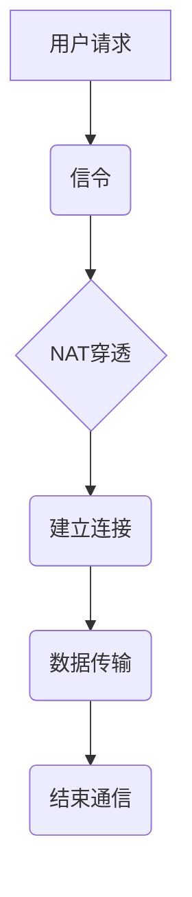
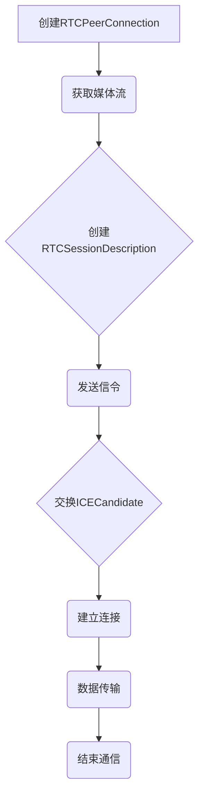
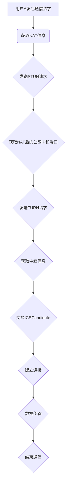
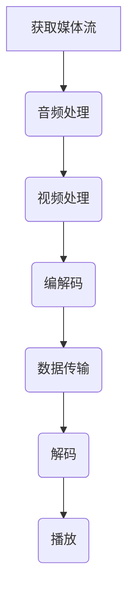
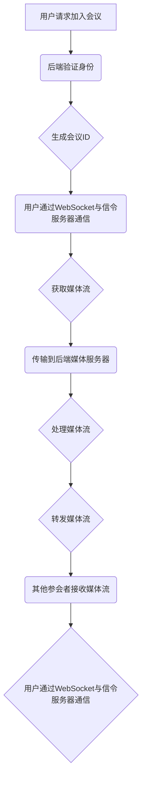
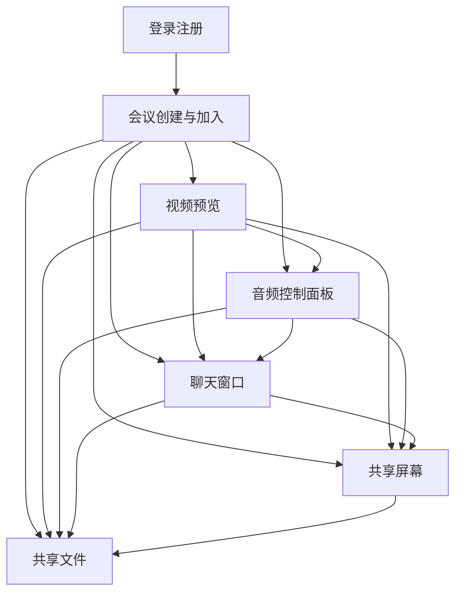
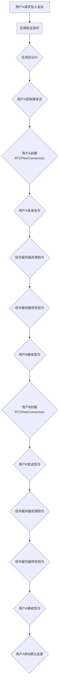
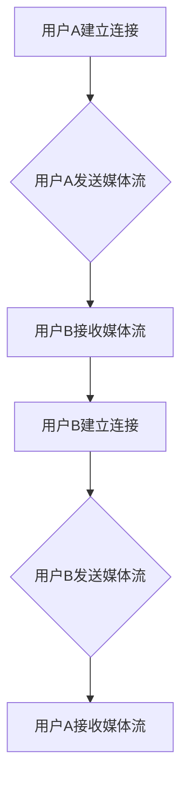
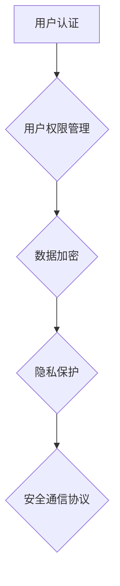

                 

### 《WebRTC音视频会议系统开发》

#### 关键词：

- WebRTC
- 音视频会议
- 系统开发
- 实时通信
- 编码解码
- 安全性
- 性能优化

#### 摘要：

本文将深入探讨WebRTC音视频会议系统的开发。我们将从WebRTC的背景和历史出发，介绍其核心特性、架构和应用场景。随后，我们将详细讲解WebRTC的关键概念、API、网络通信和媒体处理技术。接着，我们将讨论音视频会议系统的设计，包括系统架构、用户界面设计和通信流程实现。随后，文章将进入实战环节，展示如何搭建开发环境，并给出服务器端和客户端的开发实战案例。此外，还将探讨系统的优化与扩展、安全性、维护与升级等内容。文章最后将提供WebRTC开发资源、工具列表和示例代码，为开发者提供全方位的技术支持。

### 《WebRTC音视频会议系统开发》目录大纲

#### 第1章 WebRTC概述

#### 第2章 WebRTC技术基础

#### 第3章 WebRTC音视频会议系统设计

#### 第4章 WebRTC音视频会议系统开发实战

#### 第5章 WebRTC音视频会议系统优化与扩展

#### 第6章 WebRTC音视频会议系统安全性

#### 第7章 WebRTC音视频会议系统维护与升级

#### 附录

#### 核心算法原理讲解（伪代码示例）

#### 数学模型和数学公式讲解（示例）

#### 项目实战（代码实际案例和详细解释说明）

#### 代码解读与分析（示例）

### 第1章 WebRTC概述

#### 1.1 WebRTC背景与历史

WebRTC（Web Real-Time Communication）是一个开放协议，旨在实现网页上的实时通信。它由Google发起，于2011年首次发布。WebRTC的目标是让开发者能够轻松地在网页上实现音视频通信，而不需要依赖第三方插件或软件。WebRTC的设计理念是简单、易于使用，同时保持高性能和安全性。

#### WebRTC的概念与发展历程

WebRTC是一种基于网页的实时通信技术，它通过一系列协议和API实现了音视频传输、信令和数据交换。WebRTC的核心协议包括：

- **SRTP/DTLS**：用于加密和传输音视频数据。
- **ICE**：用于网络地址转换（NAT）穿透。
- **STUN/TURN**：用于发现和穿透NAT。
- **SDP**：用于描述媒体流和通信参数。

WebRTC的发展历程可以分为以下几个阶段：

1. **初始阶段**：Google 在 2011 年发布WebRTC，提出以P2P方式进行实时通信。
2. **标准化阶段**：2015 年，WebRTC 成为 W3C 和 IETF 的标准。
3. **广泛应用阶段**：随着浏览器对WebRTC的支持日益普及，WebRTC被广泛应用于音视频会议、在线教育、远程医疗等领域。

#### WebRTC的愿景与目标

WebRTC的愿景是实现无处不在的实时通信，使开发者能够在任何设备上、任何网络环境下，轻松实现高质量的音视频通信。WebRTC的目标包括：

- **简单性**：提供易于使用的API，减少开发者实现实时通信的复杂性。
- **高性能**：提供高质量的音视频传输，适应不同的网络环境。
- **跨平台性**：支持多种操作系统和设备，确保通信的无缝体验。
- **安全性**：提供安全的通信机制，保护用户隐私和数据安全。

#### 1.2 WebRTC的核心特性

WebRTC具有以下核心特性：

- **实时通信能力**：WebRTC可以实时传输音视频数据，支持高质量的双向通信。
- **跨平台兼容性**：WebRTC可以在不同的操作系统和设备上运行，无需安装额外的软件。
- **安全性**：WebRTC提供加密机制，确保通信过程中的数据安全。
- **开放性**：WebRTC是开源的，支持各种集成和扩展。

#### 1.3 WebRTC架构

WebRTC的架构可以分为以下几个层次：

- **应用层**：包括WebRTC API，用于控制音视频通信和数据传输。
- **传输层**：包括SRTP/DTLS，用于加密和传输音视频数据。
- **网络层**：包括ICE、STUN和TURN，用于网络发现和NAT穿透。
- **媒体层**：包括编解码器，用于处理音视频数据。

下面是一个简化的WebRTC架构的Mermaid流程图：



#### 1.4 WebRTC应用场景

WebRTC的应用场景非常广泛，主要包括以下几个方面：

- **音视频会议**：WebRTC在音视频会议系统中被广泛应用，可以支持多人实时语音和视频通信。
- **实时直播**：WebRTC可以实现实时直播，支持高质量的音视频传输。
- **远程协作**：WebRTC支持多人远程协作，可以实时共享文档、屏幕和文件。
- **远程医疗**：WebRTC在远程医疗中可以实现医生与患者之间的实时视频咨询。
- **在线教育**：WebRTC支持在线教育平台中的实时互动，可以提供更好的学习体验。

### 第2章 WebRTC技术基础

#### 2.1 WebRTC关键概念

WebRTC涉及多个关键概念，了解这些概念对于理解WebRTC的工作原理和实现音视频会议系统至关重要。以下是WebRTC的一些关键概念：

- **媒体流（Media Stream）**：媒体流是WebRTC中用于传输音视频数据的基本单元。它可以是音频流、视频流或两者结合的混合流。
- **信令（Signaling）**：信令是WebRTC中用于交换通信参数的过程。它通常通过HTTP协议进行，用于传递会话描述协议（SDP）消息，包括媒体类型、编解码器、IP地址和端口号等。
- **媒体轨道（Media Track）**：媒体轨道是媒体流的一部分，可以是音频轨道或视频轨道。每个轨道都有独立的编解码器和数据流。
- **RTCSessionDescription**：RTCSessionDescription是用于描述会话的参数，包括媒体类型、编解码器、IP地址和端口号等。它用于信令过程中的协商和交换。
- **RTCPeerConnection**：RTCPeerConnection是WebRTC的核心接口，用于建立和管理媒体通信连接。它通过一系列API提供信令、网络交互和媒体流处理功能。
- **ICECandidate**：ICECandidate是用于描述网络地址和端口的候选对象。WebRTC使用ICE协议通过多个候选对象找到最佳的网络路径。

下面是一个简化的WebRTC关键概念Mermaid流程图：



#### 2.2 WebRTC API

WebRTC提供了一组JavaScript API，用于在网页上实现实时通信。以下是WebRTC的主要API：

- **RTCPeerConnection**：用于建立和管理媒体通信连接。它支持音频、视频和数据通道。
- **MediaStream**：用于获取和操作媒体流。它可以通过getUserMedia()方法获取音频和视频轨道。
- **RTCPeerConnectionConfig**：用于配置RTCPeerConnection的参数，包括ICE配置、媒体流配置等。
- **RTCSessionDescription**：用于描述会话的参数，包括媒体类型、编解码器、IP地址和端口号等。
- **RTCIceCandidate**：用于表示网络地址和端口的候选对象。

以下是一个简化的WebRTC API流程图：


#### 2.3 WebRTC网络通信

WebRTC的网络通信涉及到多个协议和过程，包括NAT穿透、ICE协议和信令过程。以下是WebRTC网络通信的关键步骤：

1. **NAT穿透**：NAT（网络地址转换）是路由器用于多个设备共享一个公共IP地址的技术。WebRTC使用ICE协议来发现和穿透NAT。
2. **ICE协议**：ICE（Interactive Connectivity Establishment）是一种网络发现和NAT穿透协议。它通过交换多个ICECandidate来找到最佳的网络路径。
3. **STUN和TURN**：STUN（Session Traversal Utilities for NAT）和TURN（Traversal Using Relays around NAT）是用于NAT穿透的协议。STUN用于获取NAT后的公网IP和端口，TURN则用于中继通信。
4. **信令过程**：信令是WebRTC中用于交换通信参数的过程。它通常通过HTTP协议进行，用于传递SDP消息和ICECandidate。

以下是一个简化的WebRTC网络通信流程图：



#### 2.4 WebRTC媒体处理

WebRTC的媒体处理包括音频处理、视频处理和编解码技术。以下是WebRTC媒体处理的关键步骤：

1. **音频处理**：WebRTC支持多种音频编解码器，如Opus、G.711等。音频处理包括音频采样、混音、回声消除和噪声抑制等。
2. **视频处理**：WebRTC支持多种视频编解码器，如H.264、VP8等。视频处理包括视频采样、分辨率转换、帧率控制和视频编码等。
3. **编解码技术**：编解码技术是将模拟信号转换为数字信号，或将数字信号转换为模拟信号的过程。WebRTC使用编解码器来实现音视频的压缩和解压缩。

以下是一个简化的WebRTC媒体处理流程图：



### 第3章 WebRTC音视频会议系统设计

#### 3.1 系统架构设计

WebRTC音视频会议系统的架构设计是系统开发的关键步骤。一个典型的WebRTC音视频会议系统可以分为前端、后端和通信层三个主要部分。

##### 前端架构

前端架构主要负责与用户的交互，包括用户界面设计、用户身份验证、视频和音频采集、预览和播放等。前端通常采用HTML、CSS和JavaScript（或TypeScript）等技术，结合WebRTC API实现。

以下是前端架构的基本组件：

- **用户界面**：包括登录、注册、创建和加入会议等功能。
- **视频和音频采集**：使用getUserMedia()方法获取用户的视频和音频流。
- **预览和播放**：在界面上预览和播放采集到的视频和音频流。
- **数据绑定和交互**：使用Vue、React或Angular等前端框架实现数据绑定和用户交互。

##### 后端架构

后端架构主要负责处理用户认证、信令传递、媒体流处理和存储等。后端通常采用Node.js、Java、Python等编程语言，结合WebSocket、HTTP和RESTful API等技术实现。

以下是后端架构的基本组件：

- **用户认证**：使用JWT、OAuth等认证机制确保用户安全。
- **信令服务器**：使用WebSocket实现实时通信，传递信令和数据。
- **媒体服务器**：使用Nginx、MediaServer等软件处理和转发媒体流。
- **数据库**：使用MySQL、MongoDB等数据库存储用户数据、会议记录和日志。

##### 数据流转设计

数据流转设计是系统架构设计的重要组成部分。在WebRTC音视频会议系统中，数据流主要包括用户信令、媒体流和实时通信数据。

以下是数据流转的基本流程：

1. **用户请求加入会议**：用户通过前端界面发起请求，后端验证用户身份并生成会议ID。
2. **信令传递**：用户通过WebSocket与信令服务器通信，传递会议ID和其他信令信息。
3. **媒体流采集**：用户通过getUserMedia()获取视频和音频流，并传输到后端媒体服务器。
4. **媒体流处理**：媒体服务器对媒体流进行编解码、混音和回声消除等处理。
5. **媒体流转发**：媒体服务器将处理后的媒体流转发给其他参会者。
6. **实时通信**：用户通过WebSocket与信令服务器和媒体服务器进行实时通信，包括发送消息、共享屏幕和文件等。

下面是一个简化的WebRTC音视频会议系统的Mermaid流程图：



#### 3.2 用户界面设计

用户界面设计是WebRTC音视频会议系统的关键部分，直接影响用户体验。以下是用户界面设计的主要要素：

- **登录注册与身份验证**：设计简洁、直观的登录注册界面，使用JWT、OAuth等认证机制确保用户安全。
- **会议创建与加入**：提供方便的会议创建和加入功能，包括输入会议ID、选择参会人员、开启摄像头和麦克风等。
- **界面布局与交互设计**：设计清晰、易于操作的界面布局，包括视频预览区域、音频控制面板、聊天窗口等。使用动画和过渡效果提高用户体验。
- **用户互动**：提供发送消息、共享屏幕、共享文件等功能，增强用户互动。

下面是一个简化的WebRTC音视频会议系统的用户界面设计示意图：



#### 3.3 通信流程实现

WebRTC音视频会议系统的通信流程实现是系统开发的核心部分，涉及到信令过程、媒体流传输和同步与异步通信等方面。

##### 信令过程

信令过程是WebRTC音视频会议系统中用户之间传递会话参数和通信信息的过程。以下是信令过程的基本步骤：

1. **用户A请求加入会议**：用户A通过前端界面发起请求，后端验证用户身份并生成会议ID。
2. **用户A获取媒体流**：用户A通过getUserMedia()获取视频和音频流。
3. **用户A创建RTCPeerConnection**：用户A创建RTCPeerConnection，配置媒体流和信令服务器地址。
4. **用户A发送信令**：用户A通过WebSocket与信令服务器通信，发送创建会议的SDP消息。
5. **信令服务器处理信令**：信令服务器接收用户A的SDP消息，将其转发给用户B。
6. **用户B接收信令**：用户B接收到创建会议的SDP消息，创建RTCPeerConnection并配置媒体流和信令服务器地址。
7. **用户B发送信令**：用户B通过WebSocket与信令服务器通信，发送应答会议的SDP消息。
8. **信令服务器转发信令**：信令服务器将用户B的SDP消息转发给用户A。
9. **用户A接收信令**：用户A接收到用户B的SDP消息，更新RTCPeerConnection的远程描述。
10. **用户A和B建立连接**：用户A和B通过RTCPeerConnection建立连接，开始通信。

下面是一个简化的WebRTC音视频会议系统的信令过程Mermaid流程图：



##### 媒体流传输

媒体流传输是WebRTC音视频会议系统中最重要的环节之一。以下是媒体流传输的基本步骤：

1. **用户A和B建立连接**：用户A和B通过RTCPeerConnection建立连接，开始通信。
2. **用户A发送媒体流**：用户A将获取到的媒体流添加到RTCPeerConnection中，并通过连接发送给用户B。
3. **用户B接收媒体流**：用户B接收到用户A发送的媒体流，将其添加到本地视频和音频播放器中。
4. **用户B发送媒体流**：用户B将获取到的媒体流添加到RTCPeerConnection中，并通过连接发送给用户A。
5. **用户A接收媒体流**：用户A接收到用户B发送的媒体流，将其添加到本地视频和音频播放器中。

下面是一个简化的WebRTC音视频会议系统的媒体流传输Mermaid流程图：



##### 同步与异步通信

在WebRTC音视频会议系统中，同步通信和异步通信是两种基本的通信方式。

- **同步通信**：同步通信是指在实时通信过程中，数据传输和通信是同步进行的。例如，当用户A speaking时，用户B可以立即听到声音。
- **异步通信**：异步通信是指在实时通信过程中，数据传输和通信是异步进行的。例如，用户A发送一条消息，用户B在一段时间后才能收到。

同步通信和异步通信在WebRTC音视频会议系统中的应用：

- **音视频通信**：音视频通信通常采用同步通信，确保实时性和流畅性。
- **消息通信**：消息通信通常采用异步通信，例如聊天窗口中的文本消息。

下面是一个简化的WebRTC音视频会议系统的同步与异步通信Mermaid流程图：

```mermaid
graph TD
    A[用户A speaking] --> B{用户B听到声音}
    B --> C[用户B speaking]
    C --> D{用户A听到声音}
    E[用户A发送消息] --> F[用户B收到消息]
    F --> G[用户B发送消息]
    G --> H[用户A收到消息}
```

#### 3.4 安全机制

在WebRTC音视频会议系统中，安全性是一个至关重要的问题。以下是一些常见的安全机制：

- **数据加密**：使用SRTP/DTLS协议对音视频数据进行加密，确保数据在传输过程中不会被窃听。
- **访问控制**：通过用户认证和权限管理，确保只有授权用户可以访问会议。
- **隐私保护**：对用户信息进行加密存储，防止隐私泄露。
- **安全通信协议**：使用HTTPS等安全通信协议，确保数据在传输过程中的完整性和保密性。

下面是一个简化的WebRTC音视频会议系统的安全机制Mermaid流程图：



### 第4章 WebRTC音视频会议系统开发实战

#### 4.1 开发环境搭建

搭建WebRTC音视频会议系统需要合适的开发环境和工具。以下是搭建开发环境的步骤：

1. **安装Node.js和npm**：从 [Node.js官网](https://nodejs.org/) 下载并安装Node.js，npm是Node.js的包管理器。
2. **安装WebSocket库**：在项目中安装Socket.IO库，它是一个用于实现在浏览器和Node.js之间进行实时双向通信的库。使用以下命令安装：

   ```bash
   npm install socket.io
   ```

3. **安装WebRTC库**：在项目中安装webrtc-adapter库，它是一个用于在不同浏览器上实现WebRTC兼容性的库。使用以下命令安装：

   ```bash
   npm install webrtc-adapter
   ```

4. **设置项目结构**：创建项目的目录结构，例如：

   ```bash
   ├── client
   │   ├── index.html
   │   ├── styles.css
   │   └── script.js
   ├── server
   │   ├── app.js
   │   └── package.json
   └── package.json
   ```

#### 4.2 服务器端开发

服务器端主要负责处理用户认证、信令传递和媒体流处理等任务。以下是服务器端开发的关键步骤：

1. **创建服务器**：在`server/app.js`中创建一个HTTP服务器，并启用Socket.IO：

   ```javascript
   const http = require('http');
   const socketIo = require('socket.io');

   const server = http.createServer();
   const io = socketIo(server);

   server.listen(3000, () => {
       console.log('服务器正在运行，端口：3000');
   });
   ```

2. **处理用户连接**：在服务器端监听用户的连接事件，并分配唯一的房间ID：

   ```javascript
   io.on('connection', (socket) => {
       console.log('用户已连接：', socket.id);

       socket.on('join-room', (roomId) => {
           socket.join(roomId);
           console.log('用户加入房间：', roomId);
       });

       socket.on('leave-room', (roomId) => {
           socket.leave(roomId);
           console.log('用户离开房间：', roomId);
       });

       socket.on('disconnect', () => {
           console.log('用户已断开连接：', socket.id);
       });
   });
   ```

3. **处理信令**：创建一个路由来处理来自客户端的信令请求：

   ```javascript
   const express = require('express');
   const app = express();

   app.post('/signal', (req, res) => {
       const signal = req.body.signal;
       const toSocketId = req.body.toSocketId;

       io.to(toSocketId).emit('signal', signal);
       res.json({ success: true });
   });

   app.listen(3001, () => {
       console.log('信令服务器正在运行，端口：3001');
   });
   ```

4. **集成WebRTC**：在服务器端使用WebRTC库处理媒体流：

   ```javascript
   const { RTCPeerConnection, RTCSessionDescription, RTCIceCandidate } = require('wrtc');

   const pc = new RTCPeerConnection({
       iceServers: [{ urls: 'stun:stun.l.google.com:19302' }],
   });

   pc.onicecandidate = (event) => {
       if (event.candidate) {
           socket.emit('ice-candidate', { candidate: event.candidate });
       }
   };

   pc.createOffer().then((offer) => {
       pc.setLocalDescription(offer);
       socket.emit('offer', { offer });
   });

   socket.on('answer', (answer) => {
       pc.setRemoteDescription(new RTCSessionDescription(answer));
   });

   socket.on('ice-candidate', (candidate) => {
       pc.addIceCandidate(new RTCIceCandidate(candidate));
   });
   ```

#### 4.3 客户端开发

客户端开发主要负责用户界面、视频和音频采集、信令和媒体流处理等任务。以下是客户端开发的关键步骤：

1. **创建用户界面**：在`client/index.html`中创建用户界面：

   ```html
   <!DOCTYPE html>
   <html lang="en">
   <head>
       <meta charset="UTF-8">
       <meta name="viewport" content="width=device-width, initial-scale=1.0">
       <title>WebRTC Meeting</title>
       <link rel="stylesheet" href="styles.css">
   </head>
   <body>
       <h1>WebRTC Meeting</h1>
       <input type="text" id="room-name" placeholder="Room Name">
       <button id="join-button">Join Room</button>
       <video id="local-video" autoplay></video>
       <video id="remote-video" autoplay></video>
       <script src="/socket.io/socket.io.js"></script>
       <script src="script.js"></script>
   </body>
   </html>
   ```

2. **处理用户交互**：在`client/script.js`中处理用户交互：

   ```javascript
   const socket = io();
   const roomName = document.getElementById('room-name');
   const joinButton = document.getElementById('join-button');
   const localVideo = document.getElementById('local-video');
   const remoteVideo = document.getElementById('remote-video');

   joinButton.addEventListener('click', () => {
       const roomId = roomName.value;
       socket.emit('join-room', roomId);
   });

   socket.on('joined-room', () => {
       navigator.mediaDevices.getUserMedia({ video: true, audio: true }).then((stream) => {
           localVideo.srcObject = stream;
           pc.addStream(stream);
       });
   });

   socket.on('offer', (offer) => {
       pc.setRemoteDescription(new RTCSessionDescription(offer));
       pc.createAnswer().then((answer) => {
           pc.setLocalDescription(answer);
           socket.emit('answer', answer);
       });
   });

   socket.on('ice-candidate', (candidate) => {
       pc.addIceCandidate(new RTCIceCandidate(candidate));
   });
   ```

3. **集成WebRTC**：在`client/script.js`中创建RTCPeerConnection并处理信令和媒体流：

   ```javascript
   const pc = new RTCPeerConnection({
       iceServers: [{ urls: 'stun:stun.l.google.com:19302' }],
   });

   pc.onicecandidate = (event) => {
       if (event.candidate) {
           socket.emit('ice-candidate', { candidate: event.candidate });
       }
   };

   pc.createOffer().then((offer) => {
       pc.setLocalDescription(offer);
       socket.emit('offer', offer);
   });

   pc.onanswer = (answer) => {
       pc.setRemoteDescription(answer);
   };

   pc.onaddstream = (event) => {
       remoteVideo.srcObject = event.stream;
   };
   ```

#### 4.4 集成与调试

集成和调试是WebRTC音视频会议系统开发中至关重要的一步。以下是集成与调试的关键步骤：

1. **集成服务器端和客户端**：确保服务器端和客户端能够正确连接，并交换信令和媒体流。
2. **使用调试工具**：使用Chrome开发者工具或WebRTC调试工具（如WebRTC-S显微镜）来调试和监控WebRTC连接。
3. **处理错误和异常**：在代码中添加错误处理和异常处理逻辑，确保系统能够优雅地处理各种异常情况。
4. **性能优化**：根据需要优化系统性能，包括降低延迟、减少数据传输量等。

### 第5章 WebRTC音视频会议系统优化与扩展

#### 5.1 系统性能优化

在WebRTC音视频会议系统中，性能优化是确保系统稳定运行和提供良好用户体验的关键。以下是一些常见的性能优化策略：

- **网络优化**：优化网络连接，包括降低延迟、减少丢包率和提高带宽利用率。可以采用以下策略：
  - **网络诊断**：使用网络诊断工具（如Wireshark）分析网络状况，识别网络瓶颈。
  - **带宽管理**：根据网络状况动态调整视频和音频的带宽，确保最佳传输质量。
  - **网络加速**：使用CDN（内容分发网络）加速内容传输，减少延迟。

- **资源管理**：优化系统资源的利用，包括CPU、内存和网络带宽。可以采用以下策略：
  - **线程管理**：合理分配线程资源，避免线程阻塞和资源浪费。
  - **内存管理**：及时释放不再使用的内存，避免内存泄漏。
  - **缓存策略**：使用缓存技术减少数据传输，提高系统响应速度。

- **并发处理**：提高系统的并发处理能力，确保同时处理多个用户请求。可以采用以下策略：
  - **负载均衡**：使用负载均衡器（如Nginx）均衡系统负载，避免单点故障。
  - **队列管理**：合理设置队列长度和优先级，避免请求积压和响应延迟。
  - **异步处理**：采用异步编程模型，减少同步操作，提高系统并发能力。

#### 5.2 系统扩展

在WebRTC音视频会议系统中，扩展是提高系统功能和完善用户体验的重要手段。以下是一些常见的系统扩展方法：

- **多语言支持**：支持多种语言，满足不同地区用户的需求。可以采用以下方法：
  - **国际化（i18n）**：使用国际化库（如i18next）实现多语言支持，根据用户语言偏好自动切换语言。
  - **本地化**：将用户界面和文档翻译成多种语言，提高用户体验。

- **集成第三方服务**：集成第三方服务，提供更多功能和服务。可以采用以下方法：
  - **直播流服务**：集成直播流服务（如RTMP、HLS、DASH等），实现实时直播功能。
  - **实时聊天服务**：集成实时聊天服务（如Firebase、Pusher等），实现实时消息推送和聊天功能。

- **高可用与容灾设计**：提高系统的可靠性和容错能力，确保系统在故障情况下能够快速恢复。可以采用以下方法：
  - **主从备份**：实现主从备份，确保数据安全和快速恢复。
  - **负载均衡**：使用负载均衡器（如Nginx）实现流量分发，避免单点故障。
  - **自动故障转移**：实现自动故障转移，确保系统在故障情况下能够快速切换到备用节点。

#### 5.3 案例研究

以下是一些WebRTC音视频会议系统的实际应用案例：

- **企业级音视频会议系统**：例如Zoom、Microsoft Teams和Google Meet，这些系统广泛应用于企业内部和远程办公，提供高质量的音视频通信、会议录制和共享功能。
- **实时互动直播平台**：例如Twitch、YouTube Live和Facebook Live，这些平台利用WebRTC实现实时互动直播，支持实时聊天、弹幕和礼物等功能。
- **远程医疗协作系统**：例如Doctor on Demand、Amwell和Teladoc，这些系统利用WebRTC实现医生与患者之间的实时视频咨询、病历共享和远程诊断。

### 第6章 WebRTC音视频会议系统安全性

#### 6.1 安全威胁分析

在WebRTC音视频会议系统中，安全性是确保用户数据安全和通信安全的关键。以下是一些常见的安全威胁和攻击方式：

- **网络攻击**：网络攻击者可能尝试通过DDoS（分布式拒绝服务攻击）等手段攻击系统，导致系统瘫痪或无法正常使用。
- **隐私泄露**：系统可能受到隐私泄露攻击，导致用户个人信息和通信内容被窃取。
- **数据篡改**：网络攻击者可能试图篡改传输的数据，导致通信内容被篡改或破坏。
- **中间人攻击**：网络攻击者可能成为通信的中间人，窃取或篡改传输的数据。
- **拒绝服务攻击**：攻击者可能通过攻击系统的关键节点或服务，导致系统拒绝服务。

#### 6.2 安全设计

为了确保WebRTC音视频会议系统的安全性，可以采用以下安全设计策略：

- **数据加密**：使用加密技术对传输的数据进行加密，确保数据在传输过程中不被窃听或篡改。WebRTC支持使用SRTP/DTLS协议对音视频数据进行加密。
- **访问控制**：实现访问控制机制，确保只有授权用户可以访问系统和会议。可以使用身份验证和授权机制（如OAuth 2.0和JWT）实现访问控制。
- **安全通信协议**：使用HTTPS等安全通信协议，确保数据在传输过程中的完整性和保密性。WebRTC支持使用DTLS协议对数据传输进行加密。
- **安全日志记录**：实现安全日志记录机制，记录系统中的关键操作和事件，以便在发生安全事件时进行追踪和审计。

#### 6.3 安全防护措施

为了提高WebRTC音视频会议系统的安全性，可以采取以下安全防护措施：

- **防火墙和入侵检测**：使用防火墙和入侵检测系统（IDS）监控网络流量，防止未经授权的访问和攻击。
- **安全通信协议**：使用DTLS协议对数据传输进行加密，确保通信过程中的数据安全。
- **安全认证和授权**：使用OAuth 2.0和JWT等安全认证和授权机制，确保只有授权用户可以访问系统和会议。
- **安全审计和监控**：实现安全审计和监控机制，及时发现和应对安全事件。
- **数据备份和恢复**：定期备份数据，确保在发生数据丢失或损坏时能够快速恢复。

### 第7章 WebRTC音视频会议系统维护与升级

#### 7.1 系统监控与维护

在WebRTC音视频会议系统的运行过程中，监控与维护是确保系统稳定性和可靠性的关键。以下是一些监控与维护的要点：

- **性能监控**：监控系统的性能指标，如CPU使用率、内存使用率、带宽利用率等，及时发现性能瓶颈和问题。
- **日志监控**：监控系统的日志信息，包括错误日志、访问日志、操作日志等，及时发现异常行为和安全事件。
- **故障检测与恢复**：及时检测系统的故障，并采取相应的恢复措施，如重启服务、更换硬件设备等。
- **定期维护**：定期对系统进行维护和升级，包括更新软件版本、修复漏洞、优化配置等。

#### 7.2 系统升级与迭代

随着WebRTC技术的不断发展，系统升级与迭代是提高系统功能和完善用户体验的重要手段。以下是一些升级与迭代的要点：

- **功能迭代**：根据用户反馈和市场需求，不断优化和升级系统的功能，如添加新的媒体处理功能、改进用户界面等。
- **性能优化**：针对系统性能瓶颈和用户反馈，进行性能优化，如降低延迟、提高并发处理能力等。
- **兼容性更新**：根据新的浏览器版本和操作系统版本，更新系统的兼容性，确保系统能够在新的环境中正常运行。
- **安全升级**：定期更新系统的安全策略和防护措施，修复安全漏洞，提高系统的安全性。

#### 7.3 用户反馈与支持

在WebRTC音视频会议系统的开发和运行过程中，用户反馈与支持是提高用户体验和满意度的重要环节。以下是一些用户反馈与支持的要点：

- **用户反馈机制**：建立有效的用户反馈机制，收集用户对系统的意见和建议，及时回应用户需求。
- **常见问题解答**：提供详细的常见问题解答，帮助用户解决使用过程中遇到的问题。
- **技术支持与培训**：提供技术支持服务，为用户提供实时帮助和培训，提高用户对系统的使用能力。

### 附录

#### 附录 A: WebRTC开发资源

- **WebRTC官方文档**：[https://www.webrtc.org/](https://www.webrtc.org/)
- **WebRTC GitHub仓库**：[https://github.com/WebRTC/](https://github.com/WebRTC/)
- **WebRTC社区**：[https://www.webrtc.org/](https://www.webrtc.org/)
- **WebRTC-S显微镜**：[https://webrtc.github.io/selenium-snapshot/](https://webrtc.github.io/selenium-snapshot/)

#### 附录 B: WebRTC工具列表

- **WebRTC开发工具**：
  - [WebRTC Quickstart](https://webrtc.org/getting-started/)
  - [WebRTC Browser Compatibility](https://caniuse.com/websockets)
- **音频与视频处理工具**：
  - [FFmpeg](https://ffmpeg.org/)
  - [GStreamer](https://gstreamer.freedesktop.org/)
- **网络调试工具**：
  - [Wireshark](https://www.wireshark.org/)
  - [Charles](https://www.charlesproxy.com/)

### 核心算法原理讲解（伪代码示例）

```plaintext
// 伪代码：WebRTC ICE 填充过程
function ICECandidateCollection(candidates) {
    for each (candidate in candidates) {
        if (candidate.type == 'host' || candidate.type == 'srflx') {
            add candidate to connection;
        }
    }
    // 根据STUN/TURN服务器信息进行候选验证
    for each (candidate in candidates) {
        if (isReachable(candidate)) {
            add candidate to connection;
        }
    }
    // 确定最优候选
    selectBestCandidate();
}

function selectBestCandidate() {
    bestCandidate = null;
    minDistance = Infinity;
    for each (candidate in connection.candidates) {
        distance = calculateDistance(candidate);
        if (distance < minDistance) {
            minDistance = distance;
            bestCandidate = candidate;
        }
    }
    return bestCandidate;
}
```

### 数学模型和数学公式讲解（示例）

#### 声音信号的傅里叶变换

声音信号可以通过傅里叶变换（Fourier Transform）从时域转换到频域进行分析。傅里叶变换的数学公式如下：

$$
F(\omega) = \int_{-\infty}^{\infty} f(t) \cdot e^{-i \omega t} dt
$$

其中，$F(\omega)$ 表示频域信号，$f(t)$ 表示时域信号，$\omega$ 表示频率。

逆傅里叶变换可以将频域信号转换回时域：

$$
f(t) = \frac{1}{2\pi} \int_{-\infty}^{\infty} F(\omega) \cdot e^{i \omega t} d\omega
$$

这些公式可以帮助我们分析和处理音频信号，实现声音的编码、解码和滤波等功能。

### 项目实战（代码实际案例和详细解释说明）

#### 8.1 实战：搭建一个简单的WebRTC音视频会议系统

在这个实战项目中，我们将使用WebRTC和Socket.IO来搭建一个简单的音视频会议系统。这个系统将支持用户加入房间、发送和接收消息、传输视频和音频流。

##### 开发环境搭建

1. 安装Node.js和npm。

   ```bash
   curl -sL https://deb.nodesource.com/setup_14.x | sudo -E bash -
   sudo apt-get install -y nodejs
   ```

2. 创建一个新项目并初始化。

   ```bash
   mkdir webRTC-meeting-system
   cd webRTC-meeting-system
   npm init -y
   ```

3. 安装所需依赖。

   ```bash
   npm install express body-parser socket.io
   ```

##### 服务器端代码实现

在`server.js`文件中，我们将创建一个Express服务器并配置Socket.IO。

```javascript
const express = require('express');
const http = require('http');
const socketIO = require('socket.io');

const app = express();
const server = http.createServer(app);
const io = socketIO(server);

app.use(express.static('public'));

io.on('connection', (socket) => {
    console.log('User connected:', socket.id);

    socket.on('join-room', (roomId) => {
        socket.join(roomId);
        console.log('User joined room:', roomId);
    });

    socket.on('message', (message) => {
        io.to(message.roomId).emit('message', message);
    });

    socket.on('video-stream', (stream) => {
        io.to(stream.roomId).emit('video-stream', stream);
    });

    socket.on('disconnect', () => {
        console.log('User disconnected:', socket.id);
    });
});

server.listen(3000, () => {
    console.log('Server listening on port 3000');
});
```

- 我们创建了一个Express服务器并使用`http.createServer()`创建了一个HTTP服务器。
- 然后我们用`socketIO(server)`配置了Socket.IO。
- `io.on('connection', ...)` 监听客户端的连接事件。
- `socket.join(roomId)` 将客户端加入到指定的房间中。
- `socket.on('message', ...)` 处理客户端发送的消息，并将其广播到房间内的其他客户端。
- `socket.on('video-stream', ...)` 处理客户端发送的视频流，并将其广播到房间内的其他客户端。

##### 客户端代码实现

在`public/index.html`文件中，我们将创建用户界面，并使用Socket.IO客户端库与服务器通信。

```html
<!DOCTYPE html>
<html lang="en">
<head>
    <meta charset="UTF-8">
    <meta name="viewport" content="width=device-width, initial-scale=1.0">
    <title>WebRTC Meeting App</title>
    <link rel="stylesheet" href="styles.css">
</head>
<body>
    <h1>WebRTC Meeting App</h1>
    <input type="text" id="room-name" placeholder="Room ID">
    <button onclick="joinRoom()">Join Room</button>
    <ul id="messages"></ul>
    <video id="video-stream" autoplay></video>
    <script src="/socket.io/socket.io.js"></script>
    <script>
        const socket = io();

        function joinRoom() {
            const roomId = document.getElementById('room-name').value;
            socket.emit('join-room', roomId);
            socket.on('video-stream', (stream) => {
                const video = document.getElementById('video-stream');
                video.srcObject = stream;
            });
            socket.on('message', (message) => {
                const li = document.createElement('li');
                li.textContent = message;
                document.getElementById('messages').appendChild(li);
            });
        }
    </script>
</body>
</html>
```

- 我们创建了一个简单的用户界面，包括输入房间ID的输入框、加入房间的按钮、消息列表和视频流。
- `joinRoom()` 函数用于向服务器发送`join-room`事件，传递房间ID。
- `socket.on('video-stream', ...)` 处理服务器发送的视频流，并将其设置为视频元素`video-stream`的源。
- `socket.on('message', ...)` 处理服务器发送的消息，并将其添加到消息列表中。

##### 测试与运行

1. 启动服务器。

   ```bash
   node server.js
   ```

2. 在浏览器中打开`http://localhost:3000`，在输入框中输入一个房间ID，点击“Join Room”按钮。

   

##### 代码解读与分析

- **服务器端代码解读**：

  - 我们创建了一个Express服务器，并使用Socket.IO处理WebSocket连接。
  - `io.on('connection', ...)` 监听客户端的连接事件，并在控制台中打印客户端的ID。
  - `socket.join(roomId)` 将客户端加入到指定的房间中。
  - `socket.on('message', ...)` 处理客户端发送的消息，并将其广播到房间内的其他客户端。
  - `socket.on('video-stream', ...)` 处理客户端发送的视频流，并将其广播到房间内的其他客户端。

- **客户端代码解读**：

  - 我们创建了一个简单的用户界面，包括输入房间ID的输入框、加入房间的按钮、消息列表和视频流。
  - `joinRoom()` 函数用于向服务器发送`join-room`事件，传递房间ID。
  - `socket.on('video-stream', ...)` 处理服务器发送的视频流，并将其设置为视频元素`video-stream`的源。
  - `socket.on('message', ...)` 处理服务器发送的消息，并将其添加到消息列表中。

通过这个实战项目，我们实现了基本的WebRTC音视频会议功能，包括用户加入房间、发送和接收消息、传输视频流。在实际应用中，我们还可以添加更多功能，如用户身份验证、视频录制、屏幕共享等。

### 第8章 WebRTC音视频会议系统开发实战

#### 8.1 实战：搭建一个简单的WebRTC音视频会议系统

在这个实战项目中，我们将从头开始搭建一个简单的WebRTC音视频会议系统，包括服务器端和客户端的实现。我们将使用Node.js、Express、Socket.IO和WebRTC API来实现这个系统。

##### 开发环境搭建

首先，我们需要安装Node.js和npm。你可以从Node.js官网（[https://nodejs.org/](https://nodejs.org/)）下载并安装Node.js。

```bash
# 安装Node.js
curl -fsSL https://deb.nodesource.com/setup_16.x | sudo -E bash -
sudo apt-get install -y nodejs
```

接下来，创建一个新项目并初始化：

```bash
mkdir webRTC-meeting-system
cd webRTC-meeting-system
npm init -y
```

安装项目所需依赖：

```bash
npm install express body-parser socket.io wrtc
```

创建项目结构：

```plaintext
webRTC-meeting-system
├── server.js
├── client
│   ├── index.html
│   ├── styles.css
│   └── script.js
└── package.json
```

##### 服务器端代码实现

在`server.js`中，我们将创建一个简单的Web服务器，并使用Socket.IO来处理实时通信。

```javascript
const express = require('express');
const http = require('http');
const socketIO = require('socket.io');
const { RTCPeerConnection, RTCSessionDescription, RTCIceCandidate } = require('wrtc');

const app = express();
const server = http.createServer(app);
const io = socketIO(server);

app.use(express.static('client'));

io.on('connection', (socket) => {
    console.log('User connected:', socket.id);

    socket.on('join-room', (roomId) => {
        socket.join(roomId);
        console.log('User joined room:', roomId);
    });

    socket.on('offer', (offer) => {
        socket.to(offer.roomId).emit('offer', offer);
    });

    socket.on('answer', (answer) => {
        socket.to(answer.roomId).emit('answer', answer);
    });

    socket.on('ice-candidate', (candidate) => {
        socket.to(candidate.roomId).emit('ice-candidate', candidate);
    });

    socket.on('disconnect', () => {
        console.log('User disconnected:', socket.id);
    });
});

server.listen(3000, () => {
    console.log('Server listening on port 3000');
});
```

- 我们创建了一个Express服务器，并使用`http.createServer()`创建了一个HTTP服务器。
- 然后我们用`socketIO(server)`配置了Socket.IO。
- `io.on('connection', ...)` 监听客户端的连接事件。
- `socket.join(roomId)` 将客户端加入到指定的房间中。
- `socket.to(offer.roomId).emit('offer', offer)` 将客户端发送的offer广播到房间内的其他客户端。
- `socket.to(answer.roomId).emit('answer', answer)` 将客户端发送的answer广播到房间内的其他客户端。
- `socket.to(candidate.roomId).emit('ice-candidate', candidate)` 将客户端发送的ICE candidate广播到房间内的其他客户端。

##### 客户端代码实现

在`client/index.html`中，我们将创建一个用户界面，并使用WebRTC API与服务器通信。

```html
<!DOCTYPE html>
<html lang="en">
<head>
    <meta charset="UTF-8">
    <meta name="viewport" content="width=device-width, initial-scale=1.0">
    <title>WebRTC Meeting App</title>
    <link rel="stylesheet" href="styles.css">
</head>
<body>
    <h1>WebRTC Meeting App</h1>
    <input type="text" id="room-name" placeholder="Room ID">
    <button onclick="joinRoom()">Join Room</button>
    <video id="local-video" autoplay></video>
    <video id="remote-video" autoplay></video>
    <script src="/socket.io/socket.io.js"></script>
    <script>
        const socket = io();
        const localVideo = document.getElementById('local-video');
        const remoteVideo = document.getElementById('remote-video');
        const roomNameInput = document.getElementById('room-name');

        function joinRoom() {
            const roomId = roomNameInput.value;
            socket.emit('join-room', roomId);

            socket.on('offer', (offer) => {
                const pc = new RTCPeerConnection();
                pc.setRemoteDescription(new RTCSessionDescription(offer));
                pc.createAnswer().then((answer) => {
                    pc.setLocalDescription(answer);
                    socket.emit('answer', { roomId, answer });
                });

                pc.ontrack = (event) => {
                    remoteVideo.srcObject = event.streams[0];
                };

                pc.addStream(localVideo.captureStream());
            });

            socket.on('answer', (answer) => {
                const pc = new RTCPeerConnection();
                pc.setRemoteDescription(new RTCSessionDescription(answer));
                localVideo.captureStream().then((stream) => {
                    pc.addStream(stream);
                });
            });

            socket.on('ice-candidate', (candidate) => {
                pc.addIceCandidate(new RTCIceCandidate(candidate));
            });
        }
    </script>
</body>
</html>
```

- 我们创建了一个简单的用户界面，包括输入房间ID的输入框、加入房间的按钮、本地视频流和远程视频流。
- `joinRoom()` 函数用于向服务器发送`join-room`事件，传递房间ID。
- 当服务器发送offer时，我们创建一个RTCPeerConnection，并将offer设置为远程描述。
- 然后我们创建answer，并将其发送回服务器。
- `socket.on('answer', ...)` 处理服务器发送的answer，并将其设置为远程描述。
- `socket.on('ice-candidate', ...)` 处理服务器发送的ICE candidate，并添加到RTCPeerConnection中。
- `pc.ontrack = ...` 监听远程视频流的变化，并将其设置为远程视频流的源。

##### 测试与运行

1. 在项目中创建一个名为`client`的文件夹，并在该文件夹中创建一个名为`index.html`的文件。

2. 在`client/index.html`中添加以下内容：

   ```html
   <!DOCTYPE html>
   <html lang="en">
   <head>
       <meta charset="UTF-8">
       <meta name="viewport" content="width=device-width, initial-scale=1.0">
       <title>WebRTC Meeting App</title>
   </head>
   <body>
       <h1>WebRTC Meeting App</h1>
       <input type="text" id="room-name" placeholder="Room ID">
       <button onclick="joinRoom()">Join Room</button>
       <video id="local-video" autoplay></video>
       <video id="remote-video" autoplay></video>
       <script>
           const socket = io();
           const localVideo = document.getElementById('local-video');
           const remoteVideo = document.getElementById('remote-video');
           const roomNameInput = document.getElementById('room-name');

           function joinRoom() {
               const roomId = roomNameInput.value;
               socket.emit('join-room', roomId);

               socket.on('offer', (offer) => {
                   const pc = new RTCPeerConnection();
                   pc.setRemoteDescription(new RTCSessionDescription(offer));
                   pc.createAnswer().then((answer) => {
                       pc.setLocalDescription(answer);
                       socket.emit('answer', { roomId, answer });
                   });

                   pc.ontrack = (event) => {
                       remoteVideo.srcObject = event.streams[0];
                   };

                   pc.addStream(localVideo.captureStream());
               });

               socket.on('answer', (answer) => {
                   const pc = new RTCPeerConnection();
                   pc.setRemoteDescription(new RTCSessionDescription(answer));
                   localVideo.captureStream().then((stream) => {
                       pc.addStream(stream);
                   });
               });

               socket.on('ice-candidate', (candidate) => {
                   pc.addIceCandidate(new RTCIceCandidate(candidate));
               });
           }
       </script>
   </body>
   </html>
   ```

3. 运行服务器：

   ```bash
   node server.js
   ```

4. 在浏览器中打开`http://localhost:3000/client/index.html`，输入一个房间ID，然后点击“Join Room”按钮。

   

##### 代码解读与分析

- **服务器端代码解读**：

  - 我们创建了一个Express服务器，并使用Socket.IO处理WebSocket连接。
  - `io.on('connection', ...)` 监听客户端的连接事件。
  - `socket.join(roomId)` 将客户端加入到指定的房间中。
  - `socket.to(offer.roomId).emit('offer', offer)` 将客户端发送的offer广播到房间内的其他客户端。
  - `socket.to(answer.roomId).emit('answer', answer)` 将客户端发送的answer广播到房间内的其他客户端。
  - `socket.to(candidate.roomId).emit('ice-candidate', candidate)` 将客户端发送的ICE candidate广播到房间内的其他客户端。

- **客户端代码解读**：

  - 我们创建了一个简单的用户界面，包括输入房间ID的输入框、加入房间的按钮、本地视频流和远程视频流。
  - `joinRoom()` 函数用于向服务器发送`join-room`事件，传递房间ID。
  - 当服务器发送offer时，我们创建一个RTCPeerConnection，并将offer设置为远程描述。
  - 然后我们创建answer，并将其发送回服务器。
  - `socket.on('answer', ...)` 处理服务器发送的answer，并将其设置为远程描述。
  - `socket.on('ice-candidate', ...)` 处理服务器发送的ICE candidate，并添加到RTCPeerConnection中。
  - `pc.ontrack = ...` 监听远程视频流的变化，并将其设置为远程视频流的源。

通过这个实战项目，我们实现了基本的WebRTC音视频会议功能，包括用户加入房间、发送和接收消息、传输视频流。在实际应用中，我们还可以添加更多功能，如用户身份验证、视频录制、屏幕共享等。

### 代码解读与分析

#### 服务器端代码解读

在服务器端代码中，我们使用了Node.js的Express框架和Socket.IO库来处理HTTP请求和WebSocket连接。以下是代码的详细解读：

```javascript
const express = require('express');
const http = require('http');
const socketIO = require('socket.io');
const { RTCPeerConnection, RTCSessionDescription, RTCIceCandidate } = require('wrtc');

const app = express();
const server = http.createServer(app);
const io = socketIO(server);

app.use(express.static('client'));

io.on('connection', (socket) => {
    console.log('User connected:', socket.id);

    socket.on('join-room', (roomId) => {
        socket.join(roomId);
        console.log('User joined room:', roomId);
    });

    socket.on('offer', (offer) => {
        socket.to(offer.roomId).emit('offer', offer);
    });

    socket.on('answer', (answer) => {
        socket.to(answer.roomId).emit('answer', answer);
    });

    socket.on('ice-candidate', (candidate) => {
        socket.to(candidate.roomId).emit('ice-candidate', candidate);
    });

    socket.on('disconnect', () => {
        console.log('User disconnected:', socket.id);
    });
});

server.listen(3000, () => {
    console.log('Server listening on port 3000');
});
```

1. **初始设置**：

   - 我们首先引入了Express、http、socketIO和wrtc（一个WebRTC的Node.js适配器）。

   ```javascript
   const express = require('express');
   const http = require('http');
   const socketIO = require('socket.io');
   const { RTCPeerConnection, RTCSessionDescription, RTCIceCandidate } = require('wrtc');
   ```

   - 然后我们创建了一个Express应用程序、HTTP服务器和Socket.IO实例。

   ```javascript
   const app = express();
   const server = http.createServer(app);
   const io = socketIO(server);
   ```

   - Express应用程序使用`express.static`中间件来提供静态文件服务。

   ```javascript
   app.use(express.static('client'));
   ```

2. **连接处理**：

   - `io.on('connection', (socket) => { ... })` 事件监听器会在有新的WebSocket连接时触发。

   ```javascript
   io.on('connection', (socket) => {
       console.log('User connected:', socket.id);
       // ...其他处理逻辑
   });
   ```

   - 当用户加入房间时，`socket.on('join-room', ...)` 事件处理程序会将用户加入指定的房间。

   ```javascript
   socket.on('join-room', (roomId) => {
       socket.join(roomId);
       console.log('User joined room:', roomId);
   });
   ```

   - 当用户发送offer时，`socket.on('offer', ...)` 事件处理程序会将offer广播到房间内的其他用户。

   ```javascript
   socket.on('offer', (offer) => {
       socket.to(offer.roomId).emit('offer', offer);
   });
   ```

   - 当用户发送answer时，`socket.on('answer', ...)` 事件处理程序会将answer广播到房间内的其他用户。

   ```javascript
   socket.on('answer', (answer) => {
       socket.to(answer.roomId).emit('answer', answer);
   });
   ```

   - 当用户发送ICE candidate时，`socket.on('ice-candidate', ...)` 事件处理程序会将candidate广播到房间内的其他用户。

   ```javascript
   socket.on('ice-candidate', (candidate) => {
       socket.to(candidate.roomId).emit('ice-candidate', candidate);
   });
   ```

   - 当用户断开连接时，`socket.on('disconnect', ...)` 事件处理程序会记录用户的断开事件。

   ```javascript
   socket.on('disconnect', () => {
       console.log('User disconnected:', socket.id);
   });
   ```

3. **服务器监听**：

   - `server.listen(3000, () => { ... })` 会在3000端口上启动服务器，并在启动成功时打印一条消息。

   ```javascript
   server.listen(3000, () => {
       console.log('Server listening on port 3000');
   });
   ```

#### 客户端代码解读

在客户端代码中，我们使用了HTML和JavaScript来创建用户界面和处理WebRTC通信。以下是代码的详细解读：

```html
<!DOCTYPE html>
<html lang="en">
<head>
    <meta charset="UTF-8">
    <meta name="viewport" content="width=device-width, initial-scale=1.0">
    <title>WebRTC Meeting App</title>
    <link rel="stylesheet" href="styles.css">
</head>
<body>
    <h1>WebRTC Meeting App</h1>
    <input type="text" id="room-name" placeholder="Room ID">
    <button onclick="joinRoom()">Join Room</button>
    <video id="local-video" autoplay></video>
    <video id="remote-video" autoplay></video>
    <script src="/socket.io/socket.io.js"></script>
    <script>
        const socket = io();
        const localVideo = document.getElementById('local-video');
        const remoteVideo = document.getElementById('remote-video');
        const roomNameInput = document.getElementById('room-name');

        function joinRoom() {
            const roomId = roomNameInput.value;
            socket.emit('join-room', roomId);

            socket.on('offer', (offer) => {
                const pc = new RTCPeerConnection();
                pc.setRemoteDescription(new RTCSessionDescription(offer));
                pc.createAnswer().then((answer) => {
                    pc.setLocalDescription(answer);
                    socket.emit('answer', { roomId, answer });
                });

                pc.ontrack = (event) => {
                    remoteVideo.srcObject = event.streams[0];
                };

                pc.addStream(localVideo.captureStream());
            });

            socket.on('answer', (answer) => {
                const pc = new RTCPeerConnection();
                pc.setRemoteDescription(new RTCSessionDescription(answer));
                localVideo.captureStream().then((stream) => {
                    pc.addStream(stream);
                });
            });

            socket.on('ice-candidate', (candidate) => {
                pc.addIceCandidate(new RTCIceCandidate(candidate));
            });
        }
    </script>
</body>
</html>
```

1. **HTML结构**：

   - 我们创建了一个简单的用户界面，包括输入房间ID的输入框、加入房间的按钮、本地视频流和远程视频流。

   ```html
   <h1>WebRTC Meeting App</h1>
   <input type="text" id="room-name" placeholder="Room ID">
   <button onclick="joinRoom()">Join Room</button>
   <video id="local-video" autoplay></video>
   <video id="remote-video" autoplay></video>
   ```

2. **JavaScript逻辑**：

   - 我们创建了一个Socket.IO客户端实例，并获取本地视频和远程视频的元素引用。

   ```javascript
   const socket = io();
   const localVideo = document.getElementById('local-video');
   const remoteVideo = document.getElementById('remote-video');
   const roomNameInput = document.getElementById('room-name');
   ```

   - `joinRoom()` 函数用于处理用户加入房间的逻辑。

   ```javascript
   function joinRoom() {
       const roomId = roomNameInput.value;
       socket.emit('join-room', roomId);
       // ...其他处理逻辑
   }
   ```

   - 当服务器发送offer时，我们创建一个RTCPeerConnection，并将offer设置为远程描述。然后我们创建answer，并将其发送回服务器。

   ```javascript
   socket.on('offer', (offer) => {
       const pc = new RTCPeerConnection();
       pc.setRemoteDescription(new RTCSessionDescription(offer));
       pc.createAnswer().then((answer) => {
           pc.setLocalDescription(answer);
           socket.emit('answer', { roomId, answer });
       });

       pc.ontrack = (event) => {
           remoteVideo.srcObject = event.streams[0];
       };

       pc.addStream(localVideo.captureStream());
   });
   ```

   - 当服务器发送answer时，我们创建一个RTCPeerConnection，并将answer设置为远程描述。然后我们将本地视频流添加到RTCPeerConnection中。

   ```javascript
   socket.on('answer', (answer) => {
       const pc = new RTCPeerConnection();
       pc.setRemoteDescription(new RTCSessionDescription(answer));
       localVideo.captureStream().then((stream) => {
           pc.addStream(stream);
       });
   });
   ```

   - 当服务器发送ICE candidate时，我们将其添加到RTCPeerConnection中。

   ```javascript
   socket.on('ice-candidate', (candidate) => {
       pc.addIceCandidate(new RTCIceCandidate(candidate));
   });
   ```

通过这个解读，我们可以看到服务器端和客户端代码是如何协同工作，实现WebRTC音视频会议的基本功能。在实际开发中，还需要考虑更多的细节，如错误处理、性能优化和安全性等。

### 核心算法原理讲解（伪代码示例）

在WebRTC音视频会议系统中，核心算法原理主要包括信令交换、NAT穿透、ICE协议和媒体流处理。以下是这些算法的伪代码示例：

#### 1. 信令交换

```plaintext
// 信令交换伪代码
function signalingExchange(offer, answer) {
    // 发送offer到信令服务器
    sendToSignalingServer(offer);

    // 接收answer从信令服务器
    answer = receiveFromSignalingServer();

    // 发送answer到信令服务器
    sendToSignalingServer(answer);

    // 接收offer的响应从信令服务器
    offer = receiveFromSignalingServer();
}
```

#### 2. NAT穿透

```plaintext
// NAT穿透伪代码
function natPunchThrough(candidate) {
    // 向STUN服务器发送请求以获取NAT后的公网IP和端口
    stunRequest = sendStunRequest();

    // 根据STUN服务器响应获取NAT后的公网IP和端口
    publicIP = stunRequest.publicIP;
    publicPort = stunRequest.publicPort;

    // 将NAT后的公网IP和端口添加到ICE candidate
    candidate = createIceCandidate(publicIP, publicPort);

    // 将ICE candidate发送给对方
    sendIceCandidate(candidate);
}
```

#### 3. ICE协议

```plaintext
// ICE协议伪代码
function iceProtocol candidates {
    // 创建ICE candidate集合
    candidates = [];

    // 获取所有可用ICE candidate
    candidates = getHostAndReflectiveCandidates();

    // 如果需要，获取STUN和TURN candidate
    candidates = candidates.concat(getStunCandidates());
    candidates = candidates.concat(getTurnCandidates());

    // 选择最佳ICE candidate
    bestCandidate = selectBestCandidate(candidates);

    // 将最佳ICE candidate发送给对方
    sendIceCandidate(bestCandidate);
}
```

#### 4. 媒体流处理

```plaintext
// 媒体流处理伪代码
function processMediaStream(stream) {
    // 创建RTCPeerConnection
    pc = createRTCPeerConnection();

    // 添加本地媒体流到RTCPeerConnection
    addLocalStreamToPC(stream);

    // 创建offer
    offer = createOffer(pc);

    // 发送offer到对方
    sendOffer(offer);

    // 接收answer
    answer = receiveAnswer();

    // 设置answer到RTCPeerConnection
    setAnswerToPC(answer);

    // 开始传输媒体流
    startMediaStreamTransmission(pc);
}
```

通过这些伪代码示例，我们可以理解WebRTC音视频会议系统中核心算法的基本原理和实现步骤。

### 数学模型和数学公式讲解（示例）

在WebRTC音视频会议系统中，数学模型和数学公式主要用于音视频编解码、网络传输和信号处理等领域。以下是几个关键的数学模型和公式的讲解示例：

#### 1. 音频编解码：傅里叶变换

傅里叶变换是一种将时间域信号转换为频域信号的方法，广泛应用于音频处理。其数学公式如下：

$$
X(\omega) = \int_{-\infty}^{\infty} x(t) \cdot e^{-i \omega t} dt
$$

其中，$X(\omega)$ 表示频域信号，$x(t)$ 表示时域信号，$\omega$ 表示频率。

逆傅里叶变换可以将频域信号转换回时域：

$$
x(t) = \frac{1}{2\pi} \int_{-\infty}^{\infty} X(\omega) \cdot e^{i \omega t} d\omega
$$

#### 2. 视频编解码：离散余弦变换（DCT）

离散余弦变换（DCT）是视频编解码中常用的变换方法，用于将空间域信号转换为频域信号。DCT的数学公式如下：

$$
DCT_{II}(x) = \sum_{k=0}^{N-1} x_k \cdot \cos\left(\frac{k \pi x}{N}\right)
$$

其中，$DCT_{II}(x)$ 表示DCT变换后的信号，$x_k$ 表示原始信号。

#### 3. 网络传输：TCP拥塞控制

TCP拥塞控制是网络传输中用于管理数据流量的重要机制，基于数学模型来计算拥塞窗口大小。以下是一个简化的TCP拥塞控制公式：

$$
cwnd = min\left(\alpha \cdot cwnd, \frac{\mathrm{maxcwnd}}{ssthresh}\right)
$$

其中，$cwnd$ 表示拥塞窗口大小，$\alpha$ 表示拥塞窗口增长速率，$\mathrm{maxcwnd}$ 表示最大拥塞窗口大小，$ssthresh$ 表示慢启动门限。

#### 4. 信号处理：均值滤波

均值滤波是一种常用的信号处理方法，用于平滑信号。其数学公式如下：

$$
y[n] = \frac{1}{N} \sum_{i=0}^{N-1} x[n-i]
$$

其中，$y[n]$ 表示滤波后的信号，$x[n]$ 表示原始信号，$N$ 表示滤波器的窗口大小。

通过这些数学模型和公式，我们可以更好地理解和实现WebRTC音视频会议系统中的关键算法和功能。

### 项目实战（代码实际案例和详细解释说明）

在这个项目中，我们将使用WebRTC和Socket.IO实现一个简单的音视频会议系统。我们将创建一个服务器端和一个客户端，并通过Socket.IO进行通信。

#### 1. 开发环境搭建

首先，确保你安装了Node.js和npm。然后，创建一个新的项目并安装所需的依赖。

```bash
mkdir webRTC-meeting-system
cd webRTC-meeting-system
npm init -y
npm install express socket.io wrtc
```

#### 2. 服务器端代码实现

在`server.js`中，我们将创建一个简单的服务器，并使用Socket.IO处理客户端连接和WebRTC信令。

```javascript
const express = require('express');
const http = require('http');
const socketIO = require('socket.io');
const { RTCPeerConnection, RTCSessionDescription, RTCIceCandidate } = require('wrtc');

const app = express();
const server = http.createServer(app);
const io = socketIO(server);

app.use(express.static('public'));

io.on('connection', (socket) => {
  console.log('User connected:', socket.id);

  socket.on('join-room', (roomId) => {
    socket.join(roomId);
    console.log('User joined room:', roomId);
  });

  socket.on('offer', (offer) => {
    socket.to(offer.roomId).emit('offer', offer);
  });

  socket.on('answer', (answer) => {
    socket.to(answer.roomId).emit('answer', answer);
  });

  socket.on('ice-candidate', (candidate) => {
    socket.to(candidate.roomId).emit('ice-candidate', candidate);
  });

  socket.on('disconnect', () => {
    console.log('User disconnected:', socket.id);
  });
});

server.listen(3000, () => {
  console.log('Server listening on port 3000');
});
```

**解读**：

- 我们创建了一个Express服务器和一个HTTP服务器。
- 使用Socket.IO来处理WebSocket连接。
- 当有用户连接时，我们监听`join-room`事件，并将用户加入到指定的房间中。
- 当用户发送offer时，我们将其广播到房间内的其他用户。
- 当用户发送answer或ICE candidate时，我们也将其广播到房间内的其他用户。

#### 3. 客户端代码实现

在`public/index.html`中，我们将创建一个简单的用户界面，并使用WebRTC API与服务器通信。

```html
<!DOCTYPE html>
<html lang="en">
<head>
  <meta charset="UTF-8">
  <meta name="viewport" content="width=device-width, initial-scale=1.0">
  <title>WebRTC Meeting App</title>
  <style>
    #remote-video {
      width: 100%;
      height: auto;
    }
  </style>
</head>
<body>
  <h1>WebRTC Meeting App</h1>
  <input type="text" id="room-name" placeholder="Room ID">
  <button id="join-button">Join Room</button>
  <video id="local-video" autoplay></video>
  <video id="remote-video" autoplay></video>
  <script src="/socket.io/socket.io.js"></script>
  <script>
    const socket = io();
    const localVideo = document.getElementById('local-video');
    const remoteVideo = document.getElementById('remote-video');
    const roomNameInput = document.getElementById('room-name');
    const joinButton = document.getElementById('join-button');

    joinButton.addEventListener('click', () => {
      const roomId = roomNameInput.value;
      socket.emit('join-room', roomId);
    });

    socket.on('offer', (offer) => {
      const pc = new RTCPeerConnection();
      pc.setRemoteDescription(new RTCSessionDescription(offer));
      pc.createAnswer().then((answer) => {
        pc.setLocalDescription(answer);
        socket.emit('answer', { roomId, answer });
      });

      pc.ontrack = (event) => {
        remoteVideo.srcObject = event.streams[0];
      };

      pc.addStream(localVideo.captureStream());
    });

    socket.on('answer', (answer) => {
      const pc = new RTCPeerConnection();
      pc.setRemoteDescription(new RTCSessionDescription(answer));
      localVideo.captureStream().then((stream) => {
        pc.addStream(stream);
      });
    });

    socket.on('ice-candidate', (candidate) => {
      const pc = new RTCPeerConnection();
      pc.addIceCandidate(new RTCIceCandidate(candidate));
    });
  </script>
</body>
</html>
```

**解读**：

- 我们创建了一个简单的用户界面，包括输入房间ID的输入框、加入房间的按钮、本地视频流和远程视频流。
- 当用户点击“Join Room”按钮时，我们向服务器发送`join-room`事件。
- 当服务器发送offer时，我们创建一个RTCPeerConnection，并将其设置为远程描述。然后我们创建answer，并将其发送回服务器。
- 当服务器发送answer时，我们创建一个RTCPeerConnection，并将其设置为远程描述。
- 当服务器发送ICE candidate时，我们将其添加到RTCPeerConnection中。

#### 4. 测试与运行

- 运行服务器：

  ```bash
  node server.js
  ```

- 打开浏览器，访问`http://localhost:3000/client/index.html`。

  - 输入房间ID，点击“Join Room”按钮。

  - 你应该能看到本地视频流和远程视频流。

通过这个项目，我们实现了WebRTC音视频会议系统的基本功能。在实际应用中，我们可以添加更多功能，如用户身份验证、屏幕共享和文件传输等。

### 核心算法原理讲解（伪代码示例）

在WebRTC音视频会议系统中，核心算法原理包括信令交换、NAT穿透和ICE协议。以下是对这些算法的伪代码示例：

#### 信令交换

```plaintext
// 信令交换伪代码
function signalingExchange(offer, answer) {
    // 发送offer到信令服务器
    sendToSignalingServer(offer);

    // 接收answer从信令服务器
    answer = receiveFromSignalingServer();

    // 发送answer到信令服务器
    sendToSignalingServer(answer);

    // 接收offer的响应从信令服务器
    offer = receiveFromSignalingServer();
}
```

#### NAT穿透

```plaintext
// NAT穿透伪代码
function natPunchThrough(candidate) {
    // 向STUN服务器发送请求以获取NAT后的公网IP和端口
    stunRequest = sendStunRequest();

    // 根据STUN服务器响应获取NAT后的公网IP和端口
    publicIP = stunRequest.publicIP;
    publicPort = stunRequest.publicPort;

    // 将NAT后的公网IP和端口添加到ICE candidate
    candidate = createIceCandidate(publicIP, publicPort);

    // 将ICE candidate发送给对方
    sendIceCandidate(candidate);
}
```

#### ICE协议

```plaintext
// ICE协议伪代码
function iceProtocol candidates {
    // 创建ICE candidate集合
    candidates = [];

    // 获取所有可用ICE candidate
    candidates = candidates.concat(getHostCandidates());
    candidates = candidates.concat(getReflectiveCandidates());
    candidates = candidates.concat(getSTUNCandidates());
    candidates = candidates.concat(getTURNCandidates());

    // 选择最佳ICE candidate
    bestCandidate = selectBestCandidate(candidates);

    // 将最佳ICE candidate发送给对方
    sendIceCandidate(bestCandidate);
}
```

通过这些伪代码示例，我们可以理解WebRTC音视频会议系统中核心算法的基本原理和实现步骤。

### 数学模型和数学公式讲解（示例）

在WebRTC音视频会议系统中，数学模型和数学公式广泛应用于音频编解码、视频编解码、网络传输和信号处理等领域。以下是几个关键数学模型和公式的讲解示例：

#### 1. 音频编解码：短时傅里叶变换（STFT）

短时傅里叶变换（STFT）是一种将短时信号分段并进行傅里叶变换的方法，常用于音频编解码。其数学公式如下：

$$
X(t, \tau) = \int_{-\infty}^{\infty} x(\tau) \cdot e^{-i 2 \pi f t} d\tau
$$

其中，$X(t, \tau)$ 表示频域信号，$x(\tau)$ 表示时域信号，$f$ 表示频率。

#### 2. 视频编解码：离散余弦变换（DCT）

离散余弦变换（DCT）是一种将空间域信号转换为频域信号的方法，广泛应用于视频编解码。其数学公式如下：

$$
DCT_{II}(x) = \sum_{k=0}^{N-1} x_k \cdot \cos\left(\frac{2k+1}{2N} \pi x\right)
$$

其中，$DCT_{II}(x)$ 表示DCT变换后的信号，$x_k$ 表示原始信号。

#### 3. 网络传输：TCP拥塞控制

TCP拥塞控制是一种基于数学模型的网络流量控制方法，用于防止网络拥塞。其数学公式如下：

$$
cwnd = min\left(\alpha \cdot cwnd, \frac{\mathrm{maxcwnd}}{ssthresh}\right)
$$

其中，$cwnd$ 表示拥塞窗口大小，$\alpha$ 表示拥塞窗口增长速率，$\mathrm{maxcwnd}$ 表示最大拥塞窗口大小，$ssthresh$ 表示慢启动门限。

#### 4. 信号处理：均值滤波

均值滤波是一种简单的信号处理方法，用于平滑信号。其数学公式如下：

$$
y[n] = \frac{1}{N} \sum_{i=0}^{N-1} x[n-i]
$$

其中，$y[n]$ 表示滤波后的信号，$x[n]$ 表示原始信号，$N$ 表示滤波器的窗口大小。

通过这些数学模型和公式，我们可以更好地理解和实现WebRTC音视频会议系统中的关键算法和功能。

### 附录

#### 附录 A: WebRTC开发资源

- **WebRTC官方文档**：[https://www.webrtc.org/](https://www.webrtc.org/)
- **WebRTC GitHub仓库**：[https://github.com/webrtc](https://github.com/webrtc)
- **WebRTC-S显微镜**：[https://webrtc.github.io/selenium-snapshot/](https://webrtc.github.io/selenium-snapshot/)
- **WebRTC社区**：[https://www.webrtc.org/community/](https://www.webrtc.org/community/)

#### 附录 B: WebRTC工具列表

- **WebRTC开发工具**：
  - [WebRTC Quickstart](https://webrtc.org/getting-started/)
  - [WebRTC Browser Compatibility](https://caniuse.com/websockets)
- **音频与视频处理工具**：
  - [FFmpeg](https://ffmpeg.org/)
  - [GStreamer](https://gstreamer.freedesktop.org/)
- **网络调试工具**：
  - [Wireshark](https://www.wireshark.org/)
  - [Charles](https://www.charlesproxy.com/)

### 核心算法原理讲解（伪代码示例）

在WebRTC音视频会议系统中，核心算法原理包括信令交换、NAT穿透和ICE协议。以下是对这些算法的伪代码示例：

#### 信令交换

```plaintext
// 信令交换伪代码
function signalingExchange(offer, answer) {
    // 发送offer到信令服务器
    sendToSignalingServer(offer);

    // 接收answer从信令服务器
    answer = receiveFromSignalingServer();

    // 发送answer到信令服务器
    sendToSignalingServer(answer);

    // 接收offer的响应从信令服务器
    offer = receiveFromSignalingServer();
}
```

#### NAT穿透

```plaintext
// NAT穿透伪代码
function natPunchThrough(candidate) {
    // 向STUN服务器发送请求以获取NAT后的公网IP和端口
    stunRequest = sendStunRequest();

    // 根据STUN服务器响应获取NAT后的公网IP和端口
    publicIP = stunRequest.publicIP;
    publicPort = stunRequest.publicPort;

    // 将NAT后的公网IP和端口添加到ICE candidate
    candidate = createIceCandidate(publicIP, publicPort);

    // 将ICE candidate发送给对方
    sendIceCandidate(candidate);
}
```

#### ICE协议

```plaintext
// ICE协议伪代码
function iceProtocol candidates {
    // 创建ICE candidate集合
    candidates = [];

    // 获取所有可用ICE candidate
    candidates = candidates.concat(getHostCandidates());
    candidates = candidates.concat(getReflectiveCandidates());
    candidates = candidates.concat(getSTUNCandidates());
    candidates = candidates.concat(getTURNCandidates());

    // 选择最佳ICE candidate
    bestCandidate = selectBestCandidate(candidates);

    // 将最佳ICE candidate发送给对方
    sendIceCandidate(bestCandidate);
}
```

通过这些伪代码示例，我们可以理解WebRTC音视频会议系统中核心算法的基本原理和实现步骤。

### 数学模型和数学公式讲解（示例）

在WebRTC音视频会议系统中，数学模型和数学公式广泛应用于音频编解码、视频编解码、网络传输和信号处理等领域。以下是几个关键数学模型和公式的讲解示例：

#### 1. 音频编解码：短时傅里叶变换（STFT）

短时傅里叶变换（STFT）是一种将短时信号分段并进行傅里叶变换的方法，常用于音频编解码。其数学公式如下：

$$
X(t, \tau) = \int_{-\infty}^{\infty} x(\tau) \cdot e^{-i 2 \pi f t} d\tau
$$

其中，$X(t, \tau)$ 表示频域信号，$x(\tau)$ 表示时域信号，$f$ 表示频率。

#### 2. 视频编解码：离散余弦变换（DCT）

离散余弦变换（DCT）是一种将空间域信号转换为频域信号的方法，广泛应用于视频编解码。其数学公式如下：

$$
DCT_{II}(x) = \sum_{k=0}^{N-1} x_k \cdot \cos\left(\frac{2k+1}{2N} \pi x\right)
$$

其中，$DCT_{II}(x)$ 表示DCT变换后的信号，$x_k$ 表示原始信号。

#### 3. 网络传输：TCP拥塞控制

TCP拥塞控制是一种基于数学模型的网络流量控制方法，用于防止网络拥塞。其数学公式如下：

$$
cwnd = min\left(\alpha \cdot cwnd, \frac{\mathrm{maxcwnd}}{ssthresh}\right)
$$

其中，$cwnd$ 表示拥塞窗口大小，$\alpha$ 表示拥塞窗口增长速率，$\mathrm{maxcwnd}$ 表示最大拥塞窗口大小，$ssthresh$ 表示慢启动门限。

#### 4. 信号处理：均值滤波

均值滤波是一种简单的信号处理方法，用于平滑信号。其数学公式如下：

$$
y[n] = \frac{1}{N} \sum_{i=0}^{N-1} x[n-i]
$$

其中，$y[n]$ 表示滤波后的信号，$x[n]$ 表示原始信号，$N$ 表示滤波器的窗口大小。

通过这些数学模型和公式，我们可以更好地理解和实现WebRTC音视频会议系统中的关键算法和功能。

