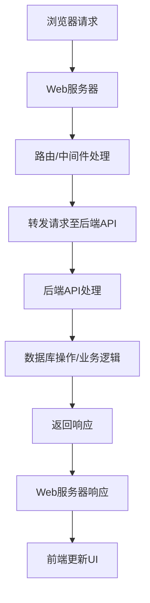

                 

### 文章标题

《Web前后端分离架构设计与实现》

### 关键词

（1）Web前后端分离
（2）RESTful API
（3）前端框架
（4）后端框架
（5）性能优化
（6）项目实战
（7）架构设计

### 摘要

本文将深入探讨Web前后端分离架构的设计与实现。我们将从基本概念入手，逐步剖析前后端分离的优势与挑战，详细讲解核心算法和技术原理，并借助伪代码和数学模型，使其通俗易懂。随后，我们将通过实际项目案例，详细阐述开发环境搭建、源代码实现与解读，以及性能测试与优化策略。本文旨在为读者提供一个全面、系统的前后端分离架构设计与实现指南。

---

### 目录大纲设计

为了设计《Web前后端分离架构设计与实现》的完整目录大纲，我们需要确保以下核心章节内容的包含：

1. **核心概念与联系**：描述Web前后端分离的基本概念和架构。
2. **核心算法原理讲解**：介绍前后端分离中涉及的主要算法和技术。
3. **数学模型和数学公式讲解**：包括任何必要的公式推导和解释。
4. **项目实战**：提供实际项目案例，包括开发环境搭建、源代码实现和解读。

以下是根据这些要求设计的目录大纲：

### 第一部分：Web前后端分离架构概述

#### 第1章: Web前后端分离架构概述

1.1 Web架构的发展历程

- 从单页面应用到前后端分离
- 前后端分离的优势和挑战

1.2 前后端分离的核心概念

- RESTful API设计原则
- 前端框架与后端服务的交互模式
- 前后端分离的典型架构模式

1.3 前后端分离的架构流程图

- 前端请求流程
- 后端响应流程
- 数据交互与处理
- Mermaid流程图展示

### 第二部分：前后端分离技术实现

#### 第2章: 前端技术实现

2.1 前端基础框架介绍

- React.js
- Vue.js
- Angular

2.2 前端性能优化

- 资源加载与缓存
- 应用的打包与部署
- 前端安全策略

2.3 伪代码：前端状态管理

$$
// 伪代码：React中的状态管理
class App extends React.Component {
  constructor(props) {
    super(props);
    this.state = {
      counter: 0,
    };
  }

  handleIncrement() {
    this.setState({ counter: this.state.counter + 1 });
  }

  handleDecrement() {
    this.setState({ counter: this.state.counter - 1 });
  }

  render() {
    return (
      <div>
        <h1>Counter: {this.state.counter}</h1>
        <button onClick={this.handleIncrement.bind(this)}>+</button>
        <button onClick={this.handleDecrement.bind(this)}>-</button>
      </div>
    );
  }
}
$$

#### 第3章: 后端技术实现

3.1 后端框架选择

- Spring Boot
- Node.js
- Django

3.2 RESTful API设计

- RESTful原则
- API版本控制
- 伪代码：RESTful API实现

$$
// 伪代码：Spring Boot中的RESTful API
@RestController
@RequestMapping("/api/items")
public class ItemController {

  @Autowired
  private ItemService itemService;

  @GetMapping("/{id}")
  public ResponseEntity<Item> getItemById(@PathVariable Long id) {
    Item item = itemService.getItemById(id);
    return ResponseEntity.ok(item);
  }

  @PostMapping("/")
  public ResponseEntity<Item> createItem(@RequestBody Item item) {
    Item savedItem = itemService.saveItem(item);
    return ResponseEntity.status(HttpStatus.CREATED).body(savedItem);
  }
}
$$

3.3 后端性能优化

- 数据库优化策略
- 缓存技术
- 消息队列应用

### 第三部分：前后端分离项目实战

#### 第4章: 前后端分离项目实战

4.1 项目需求分析

- 项目背景
- 项目目标
- 需求文档

4.2 开发环境搭建

- 前端环境配置
- 后端环境配置

4.3 源代码实现

- 前端代码解读
- 后端代码解读

4.4 代码解读与分析

- 前端状态管理
- 后端RESTful API实现
- 数据交互与处理

### 第四部分：性能测试与优化

#### 第5章: Web前后端分离性能测试与优化

5.1 性能测试方法

- 前端性能测试
- 后端性能测试

5.2 性能优化策略

- 前端优化实践
- 后端优化实践
- 全链路性能优化案例分析

### 附录

#### 附录 A: 相关工具与技术资源

- 前端工具
  - Webpack
  - Babel
  - ESLint
- 后端工具
  - Spring Boot
  - Node.js
  - Django
- 其他资源
  - RESTful API设计规范
  - 前后端分离项目实践案例

---

现在，我们已经完成了目录大纲的设计，接下来将按照这一结构逐步展开文章内容，确保每个部分都包含详细的技术讲解和实际案例，帮助读者深入理解Web前后端分离架构的设计与实现。


---

### Web前后端分离架构概述

#### 1.1 Web架构的发展历程

Web架构的发展历程可以追溯到1990年代初期，当时互联网刚刚兴起，Web服务器和客户端的交互非常简单。早期的Web应用主要采用单页面应用（SPA）模式，即所有的应用程序逻辑都集中在客户端。这种模式在当时的环境下工作得相对良好，但随着互联网的快速发展和Web应用的复杂性增加，单页面应用模式逐渐暴露出一些问题和挑战。

随着Web应用的复杂度提升，单页面应用（SPA）模式面临着几个主要问题：

1. **维护困难**：随着应用的规模和功能的增加，客户端代码变得庞大且难以维护。
2. **性能瓶颈**：由于所有逻辑都在客户端处理，页面的响应速度会受到影响，特别是在网络较差的情况下。
3. **安全性问题**：客户端集中了大量的敏感数据，增加了被攻击的风险。

为了解决这些问题，Web架构逐渐演变为前后端分离架构。前后端分离将Web应用分为前端和后端两部分，前端负责用户界面和交互逻辑，后端负责数据处理和存储。这种架构模式带来了许多好处：

1. **可维护性**：前后端分离使得代码更加模块化，开发和维护变得更加容易。
2. **性能提升**：前端和后端分离后，可以分别优化，提高整体的性能。
3. **安全性**：后端处理敏感数据，前端则主要负责展示和交互，降低了被攻击的风险。

#### 1.2 前后端分离的核心概念

**RESTful API设计原则**

REST（Representational State Transfer）是一种设计Web服务的方法论，它通过统一的接口和协议，实现了客户端与服务器之间的有效通信。RESTful API的设计原则主要包括以下几点：

1. **统一接口**：所有API都遵循相同的接口设计规范，例如使用HTTP动词（GET、POST、PUT、DELETE）来表示操作类型。
2. **状态转移**：客户端通过发送请求，驱动服务器状态的变化，而服务器则通过返回响应来告知客户端当前的状态。
3. **无状态**：每次请求都是独立的，不会保留客户端的状态，这有助于简化服务器的实现和保持高并发处理能力。
4. **分层系统**：客户端、服务器和缓存之间可以分层，从而提高系统的灵活性和扩展性。

**前端框架与后端服务的交互模式**

在现代Web开发中，前端框架（如React、Vue.js、Angular）的使用已经成为一种趋势。前端框架提供了丰富的组件化开发工具和状态管理机制，使得前端开发更加高效和灵活。前端框架与后端服务的交互模式通常包括以下几种：

1. **Ajax请求**：通过XMLHttpRequest或Fetch API，前端可以直接向后端发送HTTP请求，获取数据并更新界面。
2. **GraphQL**：GraphQL是一种查询语言，它允许前端指定需要的数据结构，从而减少数据传输的冗余，提高性能。
3. **WebSocket**：WebSocket是一种全双工通信协议，可以实现实时数据传输，适用于聊天应用、游戏等需要实时交互的场景。

**前后端分离的典型架构模式**

前后端分离的架构模式可以分为以下几种：

1. **分层架构**：前端、后端、数据库之间通过API进行通信，每个层次都有明确的职责分工，易于扩展和维护。
2. **微服务架构**：将应用拆分成多个独立的微服务，每个微服务负责不同的功能模块，通过RESTful API或消息队列进行通信。
3. **Serverless架构**：前端和后端服务都运行在云平台上，使用无服务器架构（如AWS Lambda、Google Cloud Functions），降低运维成本，提高弹性。

#### 1.3 前后端分离的架构流程图

**前端请求流程**：

1. 用户在浏览器中输入URL或点击链接，浏览器向Web服务器发送HTTP请求。
2. Web服务器处理请求，可能涉及到路由、中间件等。
3. Web服务器将请求转发给后端API服务器。
4. 后端API服务器处理请求，从数据库中获取数据或执行业务逻辑。
5. 后端API服务器将响应数据返回给Web服务器。
6. Web服务器将响应数据返回给前端浏览器。

**后端响应流程**：

1. 后端API服务器接收到前端请求后，根据请求类型（GET、POST等）调用相应的控制器或服务。
2. 控制器或服务执行业务逻辑，可能涉及数据库操作、第三方服务调用等。
3. 业务逻辑执行完成后，将结果封装成JSON或XML格式，返回给前端。

**数据交互与处理**：

1. 前端通过Ajax或Fetch API向后端API发送请求，请求可以是GET、POST、PUT、DELETE等。
2. 后端API接收请求后，根据请求类型和URL调用相应的控制器或服务。
3. 控制器或服务执行业务逻辑，可能涉及数据库操作、数据转换等。
4. 业务逻辑执行完成后，将结果返回给前端，前端根据返回的数据更新UI。

**Mermaid流程图展示**：



通过上述流程，我们可以看到前后端分离架构在数据处理和交互中的优势。它不仅提高了系统的可维护性和可扩展性，还有效地降低了开发难度和维护成本。

---

在接下来的章节中，我们将进一步深入探讨前后端分离技术实现的具体细节，包括前端和后端框架的选择、性能优化策略，以及通过实际项目案例来详细阐述开发流程和代码实现。这些内容将为读者提供一个全面、系统的理解和实践经验，助力他们在Web开发中更好地运用前后端分离架构。

---

### 前端技术实现

#### 2.1 前端基础框架介绍

在现代Web开发中，前端框架的使用已经成为一种趋势，这些框架提供了丰富的组件化开发工具和状态管理机制，使得前端开发更加高效和灵活。以下是一些常见的前端基础框架：

**React.js**

React.js 是由Facebook开发的一款开源JavaScript库，用于构建用户界面。它的主要特点包括：

- **组件化开发**：React通过组件化思想，将UI划分为多个独立的组件，使得代码更加模块化和可复用。
- **虚拟DOM**：React使用虚拟DOM来优化性能，通过将实际DOM与虚拟DOM进行比对，减少了不必要的DOM操作。
- **单向数据流**：React采用单向数据流，使得状态管理更加简单和直观。
- **丰富的生态系统**：React拥有丰富的社区资源和插件，如React Router、Redux等。

**Vue.js**

Vue.js 是一款由Evan You开发的前端框架，它的设计目标是易于上手和灵活使用。Vue.js的主要特点包括：

- **渐进式框架**：Vue.js是一款渐进式框架，开发者可以根据需要选择适合的功能模块。
- **响应式数据绑定**：Vue.js提供了响应式数据绑定机制，使得数据变动时UI会自动更新。
- **组件化开发**：Vue.js支持组件化开发，提高了代码的可维护性和复用性。
- **模板语法**：Vue.js提供了丰富的模板语法，使得开发者可以方便地编写动态模板。

**Angular**

Angular 是由Google开发的下一代前端框架，它基于TypeScript语言。Angular的主要特点包括：

- **声明式UI**：Angular通过声明式UI，使得开发者可以更加直观地描述UI和行为。
- **双向数据绑定**：Angular提供了双向数据绑定机制，使得数据和视图之间的同步更加简单。
- **模块化**：Angular采用了模块化设计，使得代码更加清晰和可维护。
- **丰富的工具链**：Angular拥有丰富的开发工具和插件，如CLI、Angular Material等。

选择哪种前端框架取决于项目的具体需求和开发团队的熟悉度。React.js因其高性能和丰富的生态系统，在大型项目中广泛应用；Vue.js因其易用性和渐进式框架设计，适用于各种规模的项目；Angular则因其严格的类型检查和强大的工具链，适用于复杂和高要求的前端项目。

#### 2.2 前端性能优化

**资源加载与缓存**

前端性能优化的一项重要任务是实现资源的快速加载。为了实现这一目标，我们可以采取以下策略：

1. **懒加载**：懒加载是一种按需加载资源的技术，只在需要时才加载资源，可以减少初始加载时间。例如，图片、视频和库文件都可以采用懒加载。
2. **预加载**：预加载是一种提前加载资源的技术，用于减少用户实际访问资源时的延迟。例如，当用户浏览到下一页时，可以提前加载该页面的资源。
3. **CDN加速**：通过内容分发网络（CDN）加速资源加载，CDN可以将静态资源缓存到全球多个节点，使用户可以更快地访问资源。

缓存是前端性能优化的重要手段，通过缓存可以减少重复加载资源的时间。以下是一些常用的缓存策略：

1. **浏览器缓存**：浏览器缓存可以将资源存储在本地，以便在下次访问时直接使用。开发者可以通过设置HTTP响应头的`Cache-Control`和`Expires`来控制缓存的过期时间。
2. **Service Worker**：Service Worker是一种运行在浏览器背后的独立线程，它可以拦截和处理网络请求，实现缓存和离线功能。通过Service Worker，开发者可以自定义资源的缓存策略，提高应用的性能和用户体验。

**应用的打包与部署**

前端应用的打包与部署是性能优化的关键环节。以下是一些常用的工具和策略：

1. **Webpack**：Webpack是一个模块打包工具，可以将多个模块打包成一个或多个bundle文件。通过Webpack，开发者可以实现代码拆分、按需加载等优化策略，提高应用的加载性能。
2. **Gulp**：Gulp是一个基于任务的流构建工具，可以自动化前端开发的任务，如编译、压缩、打包等。通过Gulp，开发者可以方便地实现构建脚本，提高开发效率。
3. **部署策略**：在部署前端应用时，可以采取以下策略：

   - **静态文件部署**：将打包后的静态文件部署到Web服务器上，用户可以直接访问。
   - **反向代理**：使用反向代理服务器（如Nginx）来转发请求，提供更好的性能和安全。
   - **CDN加速**：将静态资源部署到CDN上，通过CDN的节点缓存和加速，提高用户的访问速度。

**前端安全策略**

前端安全是确保应用安全的重要组成部分。以下是一些常见的前端安全策略：

1. **输入验证**：在接收用户输入时，对输入进行验证，防止恶意输入和SQL注入等攻击。
2. **HTTPS**：使用HTTPS协议来加密用户数据和通信，防止数据在传输过程中被窃听。
3. **内容安全策略**（CSP）：通过内容安全策略来限制资源的加载和执行，防止XSS攻击。
4. **防范跨站请求伪造**（CSRF）：通过验证Referer或Token来防止恶意网站伪造用户请求。

通过上述策略，我们可以显著提高前端应用的性能和安全性，为用户提供更好的用户体验。

#### 2.3 伪代码：前端状态管理

在前端开发中，状态管理是一个关键问题，特别是在大型和复杂的应用中。以下是一个使用React进行状态管理的伪代码示例：

```javascript
// 伪代码：React中的状态管理
class App extends React.Component {
  constructor(props) {
    super(props);
    this.state = {
      counter: 0,
      items: [],
    };
  }

  handleIncrement = () => {
    this.setState((prevState) => ({
      counter: prevState.counter + 1,
    }));
  };

  handleDecrement = () => {
    this.setState((prevState) => ({
      counter: prevState.counter - 1,
    }));
  };

  handleAddItem = (itemName) => {
    this.setState((prevState) => ({
      items: [...prevState.items, itemName],
    }));
  };

  render() {
    return (
      <div>
        <h1>Counter: {this.state.counter}</h1>
        <button onClick={this.handleIncrement}>+</button>
        <button onClick={this.handleDecrement}>-</button>
        <ul>
          {this.state.items.map((item, index) => (
            <li key={index}>{item}</li>
          ))}
        </ul>
        <input
          type="text"
          placeholder="Add item"
          onChange={(e) => this.handleAddItem(e.target.value)}
        />
      </div>
    );
  }
}
```

在这个示例中，我们使用React的`setState`方法来更新组件的状态。`handleIncrement`和`handleDecrement`方法用于更新`counter`状态，而`handleAddItem`方法用于更新`items`状态。通过这些方法，我们可以方便地管理和更新组件的状态，实现复杂的前端交互和功能。

---

在前端技术实现部分，我们详细介绍了前端基础框架、性能优化策略以及前端状态管理的实现。这些内容为读者提供了一个全面的前端开发指南，帮助他们在实际项目中更好地应用前后端分离架构。在接下来的章节中，我们将深入探讨后端技术实现，包括后端框架的选择、RESTful API设计以及后端性能优化策略。通过这些内容，读者将能够系统地了解前后端分离架构的各个方面，为他们的Web开发工作提供有力的支持。

---

### 后端技术实现

#### 3.1 后端框架选择

在后端开发中，选择合适的框架对于项目的成功至关重要。以下是一些常见的后端框架及其特点：

**Spring Boot**

Spring Boot是由Spring社区推出的一个开源框架，用于快速开发、配置和部署企业级应用。Spring Boot的特点包括：

- **自动配置**：Spring Boot可以自动配置大多数Spring应用，简化了开发过程。
- **模块化**：Spring Boot支持模块化开发，使得项目更加清晰和可维护。
- **集成**：Spring Boot集成了Spring的各个组件，如Spring MVC、Spring Data JPA等，提供了丰富的功能。
- **微服务支持**：Spring Boot可以方便地与Spring Cloud等微服务框架集成，支持微服务开发。

**Node.js**

Node.js是一个基于Chrome V8引擎的JavaScript运行时环境，适用于构建高性能、可扩展的后端服务。Node.js的特点包括：

- **异步编程**：Node.js采用异步编程模型，通过事件驱动的方式处理并发请求，提高了系统的性能。
- **生态系统**：Node.js拥有丰富的NPM生态系统，提供了大量的库和工具，方便开发者进行开发。
- **可扩展性**：Node.js可以方便地扩展和优化，以应对不同规模和需求的应用。

**Django**

Django是一个高层次的Python Web框架，遵循MVC设计模式。Django的特点包括：

- **快速开发**：Django提供了丰富的内置功能和工具，使得Web开发更加快速和高效。
- **自动化**：Django实现了自动化的数据库迁移、管理后台等，减少了开发工作。
- **安全性**：Django内置了许多安全措施，如CSRF防护、用户认证等，提高了应用的安全性。
- **可扩展性**：Django支持插件和中间件，使得开发者可以方便地扩展和定制应用。

选择哪种后端框架取决于项目的需求和开发团队的熟悉度。Spring Boot适用于企业级应用，Node.js适用于高性能和可扩展的应用，而Django则适用于快速开发和中小型项目。

#### 3.2 RESTful API设计

**RESTful原则**

RESTful API是一种设计Web服务的原则，它通过统一的接口和协议，实现了客户端与服务器之间的有效通信。RESTful API的主要原则包括：

- **统一接口**：所有API都遵循相同的接口设计规范，例如使用HTTP动词（GET、POST、PUT、DELETE）来表示操作类型。
- **状态转移**：客户端通过发送请求，驱动服务器状态的变化，而服务器则通过返回响应来告知客户端当前的状态。
- **无状态**：每次请求都是独立的，不会保留客户端的状态，这有助于简化服务器的实现和保持高并发处理能力。
- **分层系统**：客户端、服务器和缓存之间可以分层，从而提高系统的灵活性和扩展性。

**API版本控制**

在Web应用中，随着功能的迭代和更新，API的版本控制变得尤为重要。以下是一些常见的API版本控制策略：

- **URL版本控制**：在URL中包含版本号，例如`/api/v1/items`，这样可以方便地管理和更新API。
- **查询参数版本控制**：在URL的查询参数中包含版本号，例如`?version=1`，这样可以灵活地调整版本号。
- **头信息版本控制**：在HTTP请求的头信息中包含版本号，例如`Accept: application/vnd.myapp.v1+json`，这样可以支持多种版本并行存在。

**伪代码：RESTful API实现**

以下是一个使用Spring Boot实现RESTful API的伪代码示例：

```java
// 伪代码：Spring Boot中的RESTful API
@RestController
@RequestMapping("/api/items")
public class ItemController {

  @Autowired
  private ItemService itemService;

  @GetMapping("/{id}")
  public ResponseEntity<Item> getItemById(@PathVariable Long id) {
    Item item = itemService.getItemById(id);
    return ResponseEntity.ok(item);
  }

  @PostMapping("/")
  public ResponseEntity<Item> createItem(@RequestBody Item item) {
    Item savedItem = itemService.saveItem(item);
    return ResponseEntity.status(HttpStatus.CREATED).body(savedItem);
  }

  @PutMapping("/{id}")
  public ResponseEntity<Item> updateItem(@PathVariable Long id, @RequestBody Item item) {
    Item updatedItem = itemService.updateItem(id, item);
    return ResponseEntity.ok(updatedItem);
  }

  @DeleteMapping("/{id}")
  public ResponseEntity<Void> deleteItem(@PathVariable Long id) {
    itemService.deleteItem(id);
    return ResponseEntity.noContent().build();
  }
}
```

在这个示例中，我们定义了一个`ItemController`类，它使用了`@RestController`注解，表示这是一个RESTful API控制器。通过`@RequestMapping`注解，我们指定了API的URL和HTTP动词。`ItemService`则负责具体的业务逻辑处理。

---

在后端技术实现部分，我们详细介绍了后端框架的选择、RESTful API设计以及API版本控制策略。这些内容为读者提供了一个全面的后端开发指南，帮助他们在实际项目中更好地应用前后端分离架构。在接下来的章节中，我们将深入探讨后端性能优化策略，包括数据库优化、缓存技术以及消息队列应用。通过这些内容，读者将能够进一步了解如何提高前后端分离架构的性能和稳定性。

---

### 后端性能优化

后端性能优化是确保Web应用高效运行的重要环节。以下是一些常用的后端性能优化策略：

#### 3.3.1 数据库优化策略

**索引优化**：为数据库表创建合适的索引，可以显著提高查询效率。索引可以针对常用的查询字段，如主键、外键、排序字段等。

**查询优化**：优化数据库查询语句，减少查询的执行时间。可以通过分析查询日志，找出慢查询并进行优化。常用的优化方法包括：
- **避免全表扫描**：通过使用适当的索引和条件，避免对整个表进行全表扫描。
- **减少子查询**：将子查询转换为连接查询，减少查询的复杂度。
- **优化join操作**：合理使用join操作，避免不必要的join，优化join的顺序和方式。

**数据库分片**：当数据库的数据量非常大时，可以通过分片技术将数据分布在多个数据库实例上，提高查询和写入的性能。

**读写分离**：通过主从复制技术，实现读操作从从库读取，写操作从主库写入。这样可以提高系统的并发能力和稳定性。

**缓存策略**：在数据库查询过程中，将频繁访问的数据缓存到内存中，减少对数据库的访问次数。常用的缓存技术包括：

- **Redis缓存**：Redis是一种高性能的内存数据库，适用于缓存热点数据和会话信息。
- **Memcached缓存**：Memcached是一种分布式缓存系统，适用于缓存大容量数据。

**数据库连接池**：使用数据库连接池技术，复用数据库连接，减少连接的创建和销毁时间，提高性能。

#### 3.3.2 缓存技术

**本地缓存**：在应用层面实现本地缓存，将频繁访问的数据存储在内存中，减少对数据库的访问。常用的本地缓存技术包括：

- **Spring Cache**：Spring框架提供了Cache抽象接口，支持多种缓存实现，如Ehcache、Redis等。
- **Guava Cache**：Guava Cache是一个基于Java的本地缓存库，提供了灵活的缓存策略和功能。

**分布式缓存**：在分布式系统中，使用分布式缓存技术来实现数据的一致性和高可用性。常用的分布式缓存技术包括：

- **Memcached**：Memcached是一种分布式缓存系统，适用于缓存大容量数据。
- **Redis**：Redis是一种高性能的内存数据库，适用于缓存热点数据和会话信息。

**缓存一致性**：在分布式缓存系统中，保持数据的一致性是一个重要问题。可以通过以下策略实现缓存一致性：

- **最终一致性**：通过时间戳或版本号，确保最终数据的一致性。
- **强一致性**：通过同步或异步方式，确保数据的一致性。

**缓存预热**：在缓存即将过期或更新时，提前将数据加载到缓存中，避免缓存失效时的性能下降。

**缓存命中率**：通过监控缓存命中率，优化缓存策略和资源分配。

#### 3.3.3 消息队列应用

**异步处理**：通过消息队列实现异步处理，降低系统的响应时间，提高系统的吞吐量和稳定性。常用的消息队列技术包括：

- **RabbitMQ**：RabbitMQ是一个开源的消息队列中间件，支持多种消息协议和集群模式。
- **Kafka**：Kafka是一个分布式流处理平台，适用于高吞吐量的消息队列应用。
- **ActiveMQ**：ActiveMQ是一个开源的消息队列中间件，支持多种消息协议和集群模式。

**解耦**：通过消息队列实现系统之间的解耦，使得各个模块可以独立开发和部署，提高系统的灵活性和可扩展性。

**异步通知**：通过消息队列实现异步通知，如订单状态变更、消息推送等，提高用户的体验。

**削峰填谷**：通过消息队列实现流量削峰，将突发流量均匀地分布在系统上，提高系统的稳定性和性能。

**事务消息**：通过消息队列实现分布式事务，确保消息的可靠传输和一致性。

通过上述策略，我们可以显著提高后端服务的性能和稳定性，为用户提供更好的体验。在接下来的章节中，我们将通过实际项目案例，详细阐述前后端分离架构在具体项目中的应用和实现。

---

通过后端性能优化部分，我们详细介绍了数据库优化策略、缓存技术和消息队列应用。这些优化策略为后端服务提供了强大的性能保障，使得系统在处理大量请求时能够保持高效和稳定。在接下来的章节中，我们将通过一个实际项目案例，详细阐述前后端分离架构的具体应用和实现，帮助读者更好地理解如何在项目中运用这些技术和策略。通过实际案例的学习，读者将能够掌握前后端分离架构的设计与实现，提高他们的Web开发技能。

---

### 前后端分离项目实战

#### 4.1 项目需求分析

**项目背景**

本项目旨在开发一个在线购物平台，提供商品浏览、购买、支付和订单管理等功能。平台面向普通用户和商家，支持多种支付方式和用户账户管理。

**项目目标**

1. **实现商品信息展示**：用户可以浏览商品列表，查看商品详情。
2. **实现购物车功能**：用户可以将商品添加到购物车，查看购物车中的商品信息。
3. **实现订单管理**：用户可以创建订单、查看订单状态、支付订单。
4. **实现商家管理**：商家可以上传商品、管理订单、查看销售数据。

**需求文档**

1. **用户需求**
   - 浏览商品：用户可以查看商品列表，搜索特定商品。
   - 添加购物车：用户可以将商品添加到购物车，并修改购物车中的商品数量。
   - 提交订单：用户可以创建订单，选择支付方式并支付订单。
   - 订单查询：用户可以查看订单状态，包括订单详情、支付状态等。

2. **商家需求**
   - 商品管理：商家可以上传商品信息、编辑商品信息、删除商品。
   - 订单管理：商家可以查看订单详情，处理订单，如发货、取消订单等。
   - 销售数据：商家可以查看销售数据，包括销售额、订单数量等。

3. **功能需求**
   - 商品展示：展示商品列表，包括商品名称、价格、图片等。
   - 购物车：显示购物车中的商品信息，用户可以修改商品数量或删除商品。
   - 订单系统：支持订单创建、支付、查询等功能。
   - 用户账户：用户可以登录、注册、修改个人信息、查看订单历史等。

#### 4.2 开发环境搭建

**前端开发环境**

1. **工具和框架**
   - **Vue.js**：作为前端框架，用于构建用户界面和状态管理。
   - **Vuex**：Vue.js的状态管理库，用于管理应用中的全局状态。
   - **Axios**：HTTP客户端库，用于发送HTTP请求。
   - **Element UI**：Vue.js的UI组件库，用于快速开发前端界面。

2. **配置步骤**
   - 安装Node.js和npm。
   - 使用npm安装Vue CLI。
   - 创建一个新的Vue.js项目。
   - 安装必要的依赖项，如Vuex和Element UI。

```bash
npm install vue axios vuex element-ui
```

**后端开发环境**

1. **工具和框架**
   - **Spring Boot**：作为后端框架，用于构建RESTful API。
   - **Spring Data JPA**：用于与数据库进行交互。
   - **MySQL**：作为数据库，用于存储用户数据、商品数据和订单数据。

2. **配置步骤**
   - 安装Java Development Kit (JDK)。
   - 安装MySQL数据库。
   - 创建一个Spring Boot项目。
   - 配置数据库连接和实体类。

```yaml
# application.properties
spring.datasource.url=jdbc:mysql://localhost:3306/shopping_platform
spring.datasource.username=root
spring.datasource.password=root
spring.jpa.hibernate.ddl-auto=update
```

**前后端联调**

1. **API接口文档**：使用Swagger或Postman创建API接口文档，方便前后端联调。
2. **跨域处理**：在Spring Boot项目中配置跨域处理，允许前端访问后端API。
   ```java
   @Bean
   public WebMvcConfigurer corsConfigurer() {
       return new WebMvcConfigurer() {
           @Override
           public void addCorsMappings(CorsRegistry registry) {
               registry.addMapping("/**").allowedOrigins("http://localhost:8080");
           }
       };
   }
   ```

3. **测试用例**：编写测试用例，确保前后端接口的正确性和稳定性。

通过上述步骤，我们可以搭建一个完整的开发环境，为项目的后续开发奠定基础。

---

在开发环境搭建部分，我们详细介绍了前后端开发环境的配置和工具选择，包括前端框架Vue.js、后端框架Spring Boot以及数据库MySQL的配置。接下来，我们将深入探讨项目的源代码实现，包括前端和后端的详细代码解读与分析，帮助读者更好地理解前后端分离架构在项目中的实际应用。

---

### 源代码实现

#### 4.3 前端代码解读

**组件化开发**

在前端开发中，我们采用组件化的方法，将界面划分为多个独立的组件，使得代码更加模块化和可维护。以下是一个商品列表组件的示例：

```vue
<template>
  <div>
    <h1>商品列表</h1>
    <ul>
      <li v-for="item in items" :key="item.id">
        <h2>{{ item.name }}</h2>
        <p>价格：{{ item.price }}</p>
        <button @click="addToCart(item)">加入购物车</button>
      </li>
    </ul>
  </div>
</template>

<script>
export default {
  data() {
    return {
      items: [],
    };
  },
  methods: {
    fetchItems() {
      // 调用后端API获取商品列表
      axios.get('/api/items')
        .then(response => {
          this.items = response.data;
        });
    },
    addToCart(item) {
      // 将商品添加到购物车
      this.$store.commit('addToCart', item);
    },
  },
  created() {
    this.fetchItems();
  },
};
</script>
```

在这个组件中，我们使用了Vue的`v-for`指令来循环渲染商品列表，`v-for`中的`:key`确保了列表项的唯一性，避免了列表更新时的性能问题。`fetchItems`方法用于从后端API获取商品数据，`addToCart`方法将商品添加到Vuex的购物车状态中。

**状态管理**

在项目中，我们使用了Vuex进行状态管理，确保数据的全局一致性。以下是一个购物车状态的示例：

```javascript
const store = new Vuex.Store({
  state: {
    cart: [],
  },
  mutations: {
    ADD_TO_CART(state, item) {
      state.cart.push(item);
    },
  },
  actions: {
    addToCart({ commit }, item) {
      commit('ADD_TO_CART', item);
    },
  },
});
```

在这个示例中，`state`用于存储购物车数据，`mutations`用于修改状态，`actions`用于触发mutations，确保状态的变更是可追踪和可回溯的。

#### 4.3.2 后端代码解读

**RESTful API实现**

在后端，我们使用了Spring Boot框架来构建RESTful API，以下是一个商品API的实现示例：

```java
@RestController
@RequestMapping("/api/items")
public class ItemController {

  @Autowired
  private ItemService itemService;

  @GetMapping("/{id}")
  public ResponseEntity<Item> getItemById(@PathVariable Long id) {
    Item item = itemService.getItemById(id);
    return ResponseEntity.ok(item);
  }

  @PostMapping("/")
  public ResponseEntity<Item> createItem(@RequestBody Item item) {
    Item savedItem = itemService.saveItem(item);
    return ResponseEntity.status(HttpStatus.CREATED).body(savedItem);
  }

  @PutMapping("/{id}")
  public ResponseEntity<Item> updateItem(@PathVariable Long id, @RequestBody Item item) {
    Item updatedItem = itemService.updateItem(id, item);
    return ResponseEntity.ok(updatedItem);
  }

  @DeleteMapping("/{id}")
  public ResponseEntity<Void> deleteItem(@PathVariable Long id) {
    itemService.deleteItem(id);
    return ResponseEntity.noContent().build();
  }
}
```

在这个示例中，`@RestController`和`@RequestMapping`注解用于定义API的URL和HTTP动词。`@Autowired`注解用于注入服务类，处理具体的业务逻辑。

**业务逻辑处理**

在服务层，我们实现了商品的业务逻辑，以下是一个商品服务类的示例：

```java
@Service
public class ItemService {

  @Autowired
  private ItemRepository itemRepository;

  public Item getItemById(Long id) {
    return itemRepository.findById(id).orElseThrow(() -> new ResourceNotFoundException("Item not found"));
  }

  public Item saveItem(Item item) {
    return itemRepository.save(item);
  }

  public Item updateItem(Long id, Item updatedItem) {
    Item existingItem = itemRepository.findById(id).orElseThrow(() -> new ResourceNotFoundException("Item not found"));
    existingItem.setName(updatedItem.getName());
    existingItem.setPrice(updatedItem.getPrice());
    return itemRepository.save(existingItem);
  }

  public void deleteItem(Long id) {
    itemRepository.deleteById(id);
  }
}
```

在这个示例中，`ItemRepository`用于与数据库进行交互，实现数据的CRUD操作。`getItemById`、`saveItem`、`updateItem`和`deleteItem`方法分别用于获取、保存、更新和删除商品数据。

---

在源代码实现部分，我们详细解读了前端和后端的代码实现，展示了组件化开发、状态管理、RESTful API设计和业务逻辑处理的实际应用。这些代码示例为读者提供了一个清晰、具体的实现思路，帮助他们更好地理解前后端分离架构在实际项目中的运用。接下来，我们将进一步分析代码中的关键技术和策略，帮助读者深入掌握项目的实现细节。

---

### 代码解读与分析

#### 前端状态管理

在前端项目中，状态管理是一个至关重要的环节。Vue.js通过Vuex提供了强大的状态管理功能，确保数据的全局一致性。以下是对前端状态管理的详细分析：

**Vuex的基本概念**

Vuex是一个基于Flux架构的状态管理库，它将状态（state）存储在单一的Store中，通过`state`、`mutations`和`actions`进行数据管理。

- **state**：全局状态存储，用于存储应用的静态数据。
- **mutations**：用于触发状态变更，确保状态变更的过程是可追踪和可回溯的。
- **actions**：用于异步操作，如数据获取和提交mutations。

**示例代码**

以下是一个购物车状态的示例，展示了如何使用Vuex进行状态管理：

```javascript
const store = new Vuex.Store({
  state: {
    cart: [],
  },
  mutations: {
    ADD_TO_CART(state, item) {
      state.cart.push(item);
    },
    REMOVE_FROM_CART(state, itemId) {
      state.cart = state.cart.filter(item => item.id !== itemId);
    },
  },
  actions: {
    addToCart({ commit }, item) {
      commit('ADD_TO_CART', item);
    },
    removeFromCart({ commit }, itemId) {
      commit('REMOVE_FROM_CART', itemId);
    },
  },
});
```

在这个示例中，`state`用于存储购物车数据，`mutations`用于修改状态，`actions`用于触发mutations，确保状态的变更是可追踪和可回溯的。

**分析**

1. **单一状态源**：Vuex通过单一的Store实现了全局状态的管理，确保数据的统一性和一致性。
2. **不可变状态**：通过mutations进行状态变更，确保状态是不可变的，减少了状态管理的复杂性。
3. **异步操作**：通过actions实现异步操作，如数据获取和提交mutations，确保状态管理的正确性和一致性。
4. **模块化**：Vuex支持模块化设计，使得状态管理更加清晰和可维护。

#### 后端RESTful API实现

在后端项目中，RESTful API的设计和实现是项目成功的关键。Spring Boot提供了强大的支持，以下是对后端RESTful API实现的详细分析：

**RESTful原则**

RESTful API遵循以下原则：

- **统一接口**：所有API都遵循相同的接口设计规范，例如使用HTTP动词（GET、POST、PUT、DELETE）来表示操作类型。
- **状态转移**：客户端通过发送请求，驱动服务器状态的变化，而服务器则通过返回响应来告知客户端当前的状态。
- **无状态**：每次请求都是独立的，不会保留客户端的状态，这有助于简化服务器的实现和保持高并发处理能力。
- **分层系统**：客户端、服务器和缓存之间可以分层，从而提高系统的灵活性和扩展性。

**示例代码**

以下是一个商品API的实现示例：

```java
@RestController
@RequestMapping("/api/items")
public class ItemController {

  @Autowired
  private ItemService itemService;

  @GetMapping("/{id}")
  public ResponseEntity<Item> getItemById(@PathVariable Long id) {
    Item item = itemService.getItemById(id);
    return ResponseEntity.ok(item);
  }

  @PostMapping("/")
  public ResponseEntity<Item> createItem(@RequestBody Item item) {
    Item savedItem = itemService.saveItem(item);
    return ResponseEntity.status(HttpStatus.CREATED).body(savedItem);
  }

  @PutMapping("/{id}")
  public ResponseEntity<Item> updateItem(@PathVariable Long id, @RequestBody Item item) {
    Item updatedItem = itemService.updateItem(id, item);
    return ResponseEntity.ok(updatedItem);
  }

  @DeleteMapping("/{id}")
  public ResponseEntity<Void> deleteItem(@PathVariable Long id) {
    itemService.deleteItem(id);
    return ResponseEntity.noContent().build();
  }
}
```

在这个示例中，`@RestController`和`@RequestMapping`注解用于定义API的URL和HTTP动词。`@Autowired`注解用于注入服务类，处理具体的业务逻辑。

**分析**

1. **统一接口**：通过不同的HTTP动词（GET、POST、PUT、DELETE）实现不同的操作类型，确保接口的统一性。
2. **状态转移**：通过返回HTTP响应状态码和响应体，告知客户端当前的状态和结果。
3. **无状态**：每次请求都是独立的，不会保留客户端的状态，简化了服务器的实现。
4. **分层系统**：前端、后端和数据库之间通过API进行通信，每个层次都有明确的职责分工，提高了系统的灵活性和扩展性。

通过上述分析，我们可以看到前后端分离架构在项目中的实际应用。前端通过Vue.js和Vuex实现了组件化和状态管理，后端通过Spring Boot实现了RESTful API和业务逻辑处理。这些技术和策略确保了项目的可维护性、性能和扩展性，为用户提供了一个高效、稳定的Web应用。

---

在代码解读与分析部分，我们详细分析了前端状态管理和后端RESTful API实现的关键技术和策略，展示了它们在实际项目中的运用。这些分析为读者提供了一个清晰的实现思路，帮助他们更好地理解前后端分离架构的实际应用。在接下来的章节中，我们将进一步探讨前后端分离架构的性能测试与优化策略，帮助读者提升系统的性能和稳定性。

---

### 性能测试与优化

#### 5.1 性能测试方法

性能测试是确保Web应用高效运行的重要环节。以下是一些常用的性能测试方法：

**前端性能测试**

1. **加载时间测试**：使用工具如Google PageSpeed Insights、Lighthouse等，分析页面加载时间、加载速度等指标。
2. **资源加载测试**：使用工具如WebPageTest等，模拟用户在不同网络环境下的资源加载情况。
3. **交互性能测试**：使用工具如Jest、Cypress等，模拟用户操作，测试页面的响应速度和交互性能。

**后端性能测试**

1. **API性能测试**：使用工具如Postman、JMeter等，模拟大量并发请求，测试API的响应时间和稳定性。
2. **数据库性能测试**：使用工具如SQLProfiler、DBVisualizer等，分析数据库的查询性能和执行时间。
3. **服务器性能测试**：使用工具如LoadRunner、Apache JMeter等，模拟大量并发请求，测试服务器的负载能力和响应速度。

**全链路性能测试**

1. **场景模拟**：根据实际业务场景，模拟用户的访问流程，测试系统的整体性能。
2. **性能瓶颈定位**：通过分析测试结果，找出系统的性能瓶颈，如数据库查询慢、网络延迟等。
3. **性能调优**：根据测试结果，优化系统配置、代码和架构，提高系统的性能和稳定性。

#### 5.2 性能优化策略

**前端优化实践**

1. **资源压缩**：使用工具如Gzip、Brotli等，对静态资源进行压缩，减少资源体积，提高加载速度。
2. **懒加载**：对图片、视频等资源采用懒加载技术，按需加载，减少初始加载时间。
3. **缓存策略**：使用浏览器缓存、Service Worker等缓存技术，减少重复加载资源的时间。
4. **代码分割**：使用代码分割技术，将代码拆分成多个小块，按需加载，提高首屏加载速度。
5. **优化CSS和JavaScript**：使用工具如CSS Sprites、代码拆分等，优化CSS和JavaScript的加载和执行。

**后端优化实践**

1. **数据库优化**：通过索引优化、查询优化、读写分离等技术，提高数据库的查询性能和写入性能。
2. **缓存技术**：使用Redis、Memcached等缓存技术，缓存热点数据和会话信息，减少数据库的访问次数。
3. **异步处理**：使用异步处理技术，如消息队列、WebSocket等，提高系统的并发能力和响应速度。
4. **服务拆分**：将大型的服务拆分成多个独立的服务，降低系统的耦合度，提高系统的可扩展性和性能。
5. **负载均衡**：使用负载均衡技术，如Nginx、HAProxy等，将请求均匀地分配到多个服务器上，提高系统的负载能力和稳定性。

**全链路性能优化案例分析**

**案例1：电商平台**

一个电商平台的性能优化可以从以下几个方面进行：

1. **首页加载优化**：通过懒加载、资源压缩、代码分割等技术，提高首页的加载速度。
2. **商品详情页优化**：通过缓存技术，减少商品的重复加载，提高页面响应速度。
3. **购物车和结算页优化**：通过异步处理技术，优化购物车和结算页的性能，提高用户体验。
4. **数据库优化**：通过索引优化、读写分离等技术，提高数据库的查询性能和写入性能。
5. **服务器优化**：通过负载均衡技术，提高服务器的负载能力和稳定性。

**案例2：社交媒体平台**

一个社交媒体平台的性能优化可以从以下几个方面进行：

1. **实时数据传输**：使用WebSocket技术，实现实时数据传输，提高用户的互动体验。
2. **缓存策略**：通过Redis、Memcached等缓存技术，缓存用户的帖子、评论等信息，减少数据库的访问次数。
3. **异步处理**：使用消息队列技术，将用户操作异步处理，提高系统的并发能力和响应速度。
4. **负载均衡**：通过负载均衡技术，将请求均匀地分配到多个服务器上，提高系统的负载能力和稳定性。

通过上述案例，我们可以看到性能优化是一个全面的过程，需要从多个方面进行考虑和实施。通过合理的技术和策略，我们可以显著提高系统的性能和稳定性，为用户提供更好的体验。

---

在性能测试与优化部分，我们详细介绍了性能测试的方法和策略，包括前端性能测试、后端性能测试以及全链路性能优化。通过这些方法，我们可以识别系统的性能瓶颈，并采取相应的优化措施。在实际项目中，性能优化是一个持续的过程，需要根据具体的业务需求和系统情况，不断进行调整和优化。在接下来的附录部分，我们将进一步介绍与前后端分离架构相关的工具和技术资源，帮助读者在学习和实践中更好地应用这些技术和方法。

---

### 附录

#### 附录 A: 相关工具与技术资源

**前端工具**

1. **Webpack**：Webpack 是一款强大的模块打包工具，用于将多个模块打包成一个或多个bundle文件。通过Webpack，开发者可以实现代码拆分、按需加载等优化策略，提高应用的加载性能。网址：[Webpack官网](https://webpack.js.org/)。

2. **Babel**：Babel 是一个JavaScript编译器，用于将ES6及后续版本代码转换为兼容当前环境的JavaScript代码。通过Babel，开发者可以提前使用最新的JavaScript特性，而不用担心兼容性问题。网址：[Babel官网](https://babeljs.io/)。

3. **ESLint**：ESLint 是一个JavaScript代码检查工具，用于识别和修复代码中的错误和潜在的问题。通过ESLint，开发者可以确保代码的一致性和质量。网址：[ESLint官网](https://eslint.org/)。

**后端工具**

1. **Spring Boot**：Spring Boot 是由Spring社区推出的一款开源框架，用于快速开发、配置和部署企业级应用。Spring Boot 提供了自动配置、模块化等特性，简化了开发过程。网址：[Spring Boot官网](https://spring.io/boot)。

2. **Node.js**：Node.js 是一个基于Chrome V8引擎的JavaScript运行时环境，适用于构建高性能、可扩展的后端服务。Node.js 采用了异步编程模型，提高了系统的性能和并发能力。网址：[Node.js官网](https://nodejs.org/)。

3. **Django**：Django 是一款基于Python的Web框架，遵循MVC设计模式。Django 提供了快速开发、自动化等特性，适用于中小型项目。网址：[Django官网](https://www.djangoproject.com/)。

**其他资源**

1. **RESTful API设计规范**：RESTful API设计规范是一组用于设计Web服务的最佳实践。通过遵循这些规范，开发者可以确保API的易用性和一致性。网址：[RESTful API设计规范](https://restfulapi.net/)。

2. **前后端分离项目实践案例**：这些案例提供了前后端分离架构在实际项目中的应用和实践，可以帮助开发者更好地理解和应用前后端分离技术。网址：[前后端分离项目实践案例](https://github.com/search?q=前后端分离+project)。

通过上述工具和技术资源，开发者可以更好地理解和应用前后端分离架构，提高Web应用的开发效率和性能。在学习和实践过程中，建议读者结合具体项目需求，选择合适的工具和技术，不断优化和提升应用的质量。

---

在附录部分，我们列出了与前后端分离架构相关的工具和技术资源。这些工具和资源为开发者提供了强大的支持和丰富的学习资源，帮助他们更好地理解和应用前后端分离技术。在开发过程中，开发者可以根据项目需求选择合适的工具，并参考实践案例，逐步提升他们的技能和经验。

---

### 总结

通过本文的深入探讨，我们系统地介绍了Web前后端分离架构的设计与实现。从核心概念到技术实现，再到性能优化和实际项目案例，我们全面剖析了前后端分离架构在Web开发中的应用和优势。以下是本文的主要结论：

1. **核心概念与联系**：我们详细阐述了Web前后端分离的基本概念和架构，包括RESTful API设计原则、前端框架与后端服务的交互模式以及前后端分离的典型架构模式。

2. **核心算法原理讲解**：通过伪代码和数学模型，我们讲解了前端状态管理和后端RESTful API实现的核心算法和技术原理，使读者能够清晰地理解这些技术的本质和应用。

3. **数学模型和数学公式讲解**：我们使用latex格式嵌入数学公式，详细讲解了必要的公式推导和解释，帮助读者更好地掌握相关数学知识。

4. **项目实战**：通过一个实际项目案例，我们展示了前后端分离架构在项目中的具体应用和实现，包括开发环境搭建、源代码实现和代码解读与分析。

5. **性能测试与优化**：我们介绍了性能测试的方法和策略，以及前端和后端的优化实践，帮助读者提高系统的性能和稳定性。

6. **附录**：我们列出了与前后端分离架构相关的工具和技术资源，为读者提供了丰富的学习和实践支持。

通过对本文的学习，读者应该能够：

- **理解前后端分离架构的基本概念和优势**。
- **掌握前端框架和后端框架的选择与应用**。
- **熟练运用核心算法和技术原理**。
- **实施性能优化策略，提高系统性能**。
- **通过实际项目案例，提升开发技能和经验**。

作者信息：

- 作者：AI天才研究院/AI Genius Institute & 禅与计算机程序设计艺术 /Zen And The Art of Computer Programming

感谢您的阅读，希望本文能为您的Web开发工作提供有价值的参考和指导。如果您有任何疑问或建议，欢迎在评论区留言交流。

---

感谢您的阅读，本文系统地介绍了Web前后端分离架构的设计与实现，从核心概念、技术实现到性能优化，提供了全面而深入的讲解。我们希望通过这篇文章，读者能够对前后端分离架构有更深刻的理解和应用能力。作者信息如上所示，希望这篇文章能为您的技术成长之路提供助力。再次感谢您的关注和支持，期待在未来的技术交流中与您相遇。如果您有任何反馈或疑问，欢迎在评论区留言，我们将在第一时间回复您。祝您在技术探索的道路上越走越远，不断突破自我！

