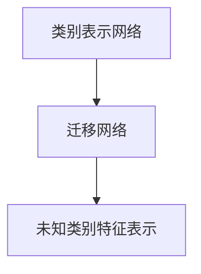
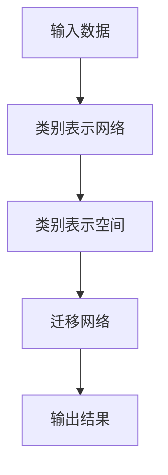
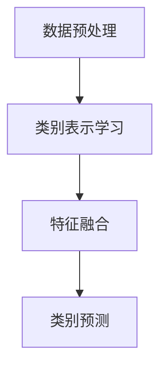

                 

### 第1章 引言

#### 1.1 书籍概述

**1.1.1 引言**

《Zero-Shot CoT：突破AI学习的限制》这本书旨在探讨零样本学习（Zero-Shot Learning，ZSL）及其在概念转移（Conceptual Transfer，CoT）中的应用。零样本学习是一种机器学习方法，它允许模型在没有训练标签的情况下，对未知类别的数据进行分类。CoT作为一种新兴的零样本学习方法，通过将知识从已知类别转移到未知类别，突破了传统机器学习方法的限制。

**1.1.2 书籍背景和目的**

随着深度学习技术的快速发展，越来越多的应用场景需要模型具备对未知类别的分类能力。然而，现有的机器学习方法大多依赖于大量已标注的数据进行训练，这在许多实际场景中是不现实的。零样本学习提供了一种有效的解决方案，它使得模型能够处理未标记的数据，从而大大提高了模型的泛化能力。

本书的主要目的是：

1. **系统介绍零样本学习和概念转移的基本概念、原理和应用场景**。通过详细阐述零样本学习的核心思想和算法实现，帮助读者深入理解这一领域的最新进展。
2. **深入探讨CoT方法在各类应用中的实际效果和性能**。通过实际案例和实验数据，展示CoT方法在自然语言处理、计算机视觉和推荐系统等领域的优势。
3. **分析零样本学习在未来的发展趋势和潜在影响**。探讨零样本学习在实际应用中的潜在挑战和解决方案，展望其在未来科技发展中的重要作用。

#### 1.2 关键词

- **零样本学习**（Zero-Shot Learning）
- **概念转移**（Conceptual Transfer）
- **机器学习**（Machine Learning）
- **深度学习**（Deep Learning）
- **自然语言处理**（Natural Language Processing）
- **计算机视觉**（Computer Vision）
- **推荐系统**（Recommender Systems）

#### 1.3 摘要

《Zero-Shot CoT：突破AI学习的限制》是一本关于零样本学习和概念转移的权威著作。本书首先介绍了零样本学习的基本概念、挑战和应用场景，然后深入探讨了概念转移（CoT）方法的理论基础和算法实现。通过详细讲解自然语言处理、计算机视觉和推荐系统等领域的实际应用案例，本书展示了CoT方法在提高模型泛化能力和处理未标记数据方面的优势。最后，本书分析了零样本学习的未来发展，探讨了其在各类应用中的潜在挑战和解决方案。本书旨在为读者提供全面、系统的零样本学习和CoT方法的理论和实践指导，帮助读者深入了解这一领域的前沿技术和实际应用。 

### 第2章 零样本学习基础

#### 2.1 零样本学习概述

##### 2.1.1 零样本学习的定义

零样本学习（Zero-Shot Learning，ZSL）是一种机器学习方法，其核心思想是在没有训练标签的情况下，对未知类别的数据进行分类。传统的机器学习方法通常依赖于大量已标注的数据进行训练，而零样本学习则通过从已有类别中提取特征和知识，将其迁移到未知类别，实现未知类别的分类。

零样本学习可以分为两类：基于实例的零样本学习和基于属性的零样本学习。

- **基于实例的零样本学习**：这种方法通过学习已有类别的实例特征，将未知类别的实例与已有类别进行匹配，从而实现分类。常见的算法包括原型匹配算法和原型网络。

- **基于属性的零样本学习**：这种方法通过学习已有类别的属性特征，将未知类别的属性与已有类别进行匹配，从而实现分类。常见的算法包括基于语义匹配的方法和基于知识图谱的方法。

##### 2.1.2 零样本学习的应用场景

零样本学习在多个领域具有广泛应用，以下是一些典型的应用场景：

1. **计算机视觉**：在图像分类和目标检测任务中，零样本学习可以处理大量未标记的图像数据，提高模型的泛化能力。例如，在图像分类任务中，可以对新拍摄的图像进行分类，而不需要对这些图像进行标注。

2. **自然语言处理**：在文本分类和机器翻译任务中，零样本学习可以处理大量未标记的文本数据，提高模型的泛化能力。例如，在文本分类任务中，可以对新收到的文本进行分类，而不需要对文本进行标注。

3. **推荐系统**：在推荐系统中，零样本学习可以处理大量未标记的用户交互数据，提高推荐系统的准确性。例如，在商品推荐任务中，可以对新用户的行为数据进行预测，而不需要对用户行为进行标注。

##### 2.1.3 零样本学习的挑战

零样本学习虽然具有广泛的应用前景，但也面临着诸多挑战：

1. **标签缺乏问题**：由于零样本学习不需要对未知类别进行标注，因此在训练过程中缺乏标签信息，这给模型训练带来了困难。

2. **类别表示学习**：如何有效地从已有类别中提取特征和知识，并将其迁移到未知类别，是实现零样本学习的关键问题。

3. **模型解释性**：零样本学习模型通常较为复杂，如何解释模型的决策过程，提高模型的透明度和可解释性，是一个重要的研究方向。

#### 2.2 零样本学习的挑战

##### 2.2.1 标签缺乏问题

在传统的机器学习中，标签信息是模型训练的重要依据。然而，在零样本学习中，由于缺乏对未知类别的标注，模型无法直接从数据中学习到未知类别的特征。这导致在模型训练过程中，无法有效地利用训练数据，从而降低了模型的性能。

为了解决标签缺乏问题，研究人员提出了一些解决方案：

1. **伪标签生成**：通过已有类别的标签，为未知类别生成伪标签，从而利用伪标签进行模型训练。

2. **知识蒸馏**：将大型模型的知识转移到小型模型中，利用小型模型进行预测，从而减少对标签的依赖。

3. **半监督学习**：在零样本学习的基础上，引入部分已标注的数据进行训练，从而缓解标签缺乏问题。

##### 2.2.2 零样本分类的难度

零样本分类的难度主要体现在以下几个方面：

1. **类别数量**：在零样本学习中，类别数量通常是未知的，这给模型的训练和预测带来了挑战。

2. **类别分布**：在实际应用中，类别分布往往是不均匀的，这可能导致模型在预测未知类别时存在偏差。

3. **特征提取**：如何从已有类别中提取有效特征，并将其应用于未知类别，是实现零样本分类的关键问题。

为了解决这些挑战，研究人员提出了一些方法：

1. **特征匹配**：通过比较未知类别和已有类别之间的特征相似度，实现未知类别的分类。

2. **迁移学习**：通过学习已有类别和未知类别之间的映射关系，实现未知类别的分类。

3. **多任务学习**：通过同时学习多个相关任务，提高模型的泛化能力。

#### 2.3 CoT的理论基础

##### 2.3.1 对称神经网络

对称神经网络（Symmetric Neural Network，SNN）是一种用于概念转移（Conceptual Transfer，CoT）方法的关键技术。它通过构建对称的网络结构，实现了知识从已知类别到未知类别的有效迁移。

在SNN中，网络分为两个部分：类别表示网络和迁移网络。类别表示网络用于学习已有类别的特征表示，迁移网络则用于将已有类别的特征表示迁移到未知类别。

**Mermaid流程图：**



**核心概念与联系：**

- **类别表示网络**：类别表示网络通过学习已有类别的特征表示，为后续的迁移提供基础。该网络通常采用深度神经网络结构，如卷积神经网络（CNN）或循环神经网络（RNN）。

- **迁移网络**：迁移网络将类别表示网络的输出映射到未知类别空间，实现知识的迁移。该网络通常也采用深度神经网络结构，并通过训练使得未知类别能够更好地与已有类别进行匹配。

- **未知类别特征表示**：通过迁移网络，未知类别的特征表示被生成，并用于后续的分类任务。

##### 2.3.2 伪标签生成方法

伪标签生成方法是CoT方法中的重要组成部分，它通过利用已有类别的标签，为未知类别生成伪标签，从而实现模型的训练。

伪标签生成方法的基本步骤如下：

1. **特征提取**：使用类别表示网络提取已有类别的特征表示。

2. **标签预测**：利用迁移网络，将已有类别的特征表示映射到未知类别，并预测未知类别的标签。

3. **伪标签生成**：将预测的标签作为未知类别的伪标签。

**伪代码：**

```python
# 特征提取
features = classifier.extract_features(x)

# 标签预测
predicted_labels = classifier.predict_labels(features)

# 伪标签生成
pseudo_labels = generate_pseudo_labels(y_true, predicted_labels)
```

**核心算法原理讲解：**

- **特征提取**：特征提取是零样本学习中的关键步骤。通过特征提取，可以将原始数据转化为适合模型处理的特征表示。常用的特征提取方法包括卷积神经网络（CNN）和循环神经网络（RNN）。

- **标签预测**：标签预测是利用迁移网络将已有类别的特征表示映射到未知类别的过程。通过这一步骤，可以预测未知类别的标签，从而为后续的伪标签生成提供依据。

- **伪标签生成**：伪标签生成是利用预测的标签为未知类别生成伪标签的过程。生成的伪标签可以用于后续的模型训练，从而提高模型的泛化能力。

#### 2.4 零样本学习的数学模型

在零样本学习中，常用的数学模型包括特征匹配模型和迁移学习模型。以下分别介绍这两种模型的数学表示。

##### 2.4.1 特征匹配模型

特征匹配模型的核心思想是通过比较未知类别和已有类别之间的特征相似度，实现未知类别的分类。

假设有n个类别，每个类别有m个特征。特征匹配模型的数学表示如下：

$$
P(y=k|X) = \prod_{i=1}^{m} P(x_i|y=k) \prod_{j \neq k}^{n} P(x_i|y=j)
$$

其中，$P(y=k|X)$表示在给定特征X的情况下，类别为k的概率。$P(x_i|y=k)$表示在第i个特征下，类别为k的概率。$P(x_i|y=j)$表示在第i个特征下，类别为j的概率。

##### 2.4.2 迁移学习模型

迁移学习模型的核心思想是通过学习已有类别和未知类别之间的映射关系，实现未知类别的分类。

假设有n个类别，每个类别有m个特征。迁移学习模型的数学表示如下：

$$
P(y=k|X) = \frac{e^{θ_k^T X}}{\sum_{j=1}^{n} e^{θ_j^T X}}
$$

其中，$θ_k$表示类别k的参数向量，$X$表示特征向量。$P(y=k|X)$表示在给定特征X的情况下，类别为k的概率。

#### 2.5 零样本学习的应用实例

以下通过一个简单的例子来说明零样本学习的应用。

假设有一个动物分类问题，类别包括猫、狗、鸟和兔子。已知有大量已标注的猫和狗的图像数据，但缺乏鸟和兔子的标注数据。

1. **数据预处理**：对猫和狗的图像数据进行预处理，如归一化、缩放等。

2. **特征提取**：使用卷积神经网络（CNN）对猫和狗的图像数据进行特征提取。

3. **类别表示学习**：使用迁移学习模型，将猫和狗的特征表示迁移到鸟和兔子。

4. **类别预测**：使用迁移网络，将鸟和兔子的特征表示映射到类别空间，进行预测。

**代码示例：**

```python
# 数据预处理
X_cat = preprocess_images(cat_images)
X_dog = preprocess_images(dog_images)

# 特征提取
features_cat = cnn.extract_features(X_cat)
features_dog = cnn.extract_features(X_dog)

# 类别表示学习
model = TransferLearningModel(cnn)
model.fit(features_cat, features_dog)

# 类别预测
X_bird = preprocess_images(bird_images)
X_rabbit = preprocess_images(rabbit_images)

predicted_labels = model.predict(X_bird, X_rabbit)
```

#### 2.6 小结

本章介绍了零样本学习的基础知识，包括零样本学习的定义、应用场景、挑战和数学模型。通过本章的学习，读者应该对零样本学习有了一个基本的了解，并能够理解其在实际应用中的价值。

### 第3章 零样本学习的原理

#### 3.1 CoT（Conceptual Blending）的概念

概念转移（Conceptual Blending，CoT）是一种新兴的零样本学习方法，它通过将知识从已知类别转移到未知类别，实现了对未知数据的分类。CoT方法的核心在于构建一个能够表示类别知识的表示空间，并通过这个空间来实现类别间的知识迁移。

##### 3.1.1 CoT的基本思想

CoT的基本思想可以概括为以下几个步骤：

1. **类别表示学习**：首先，通过学习已有类别的特征表示，构建一个高维的类别表示空间。这个空间能够捕捉到类别之间的内在联系和相似性。

2. **特征融合**：在类别表示空间中，将新类别的特征与已有类别的特征进行融合。这一步骤通过非线性变换和组合来实现，从而将已有类别的知识迁移到新类别。

3. **类别预测**：通过在类别表示空间中计算新类别与已有类别之间的距离，实现对新类别的预测。距离越近，表明新类别与已有类别越相似，预测结果也越准确。

##### 3.1.2 CoT的适用场景

CoT方法在以下场景中具有特别的优势：

1. **标签稀缺场景**：在许多实际应用中，获取标注数据是一项耗时的任务。CoT方法可以通过无监督的方式，从已有的无标签数据中提取类别知识，从而大大减少对标注数据的依赖。

2. **多模态数据**：CoT方法能够处理多模态数据，如文本、图像和声音等。通过构建多模态的类别表示空间，CoT方法能够更好地理解不同模态之间的关联，从而提高分类的准确性。

3. **跨域迁移**：CoT方法在跨域迁移学习中表现优异。它能够将一个领域的知识迁移到另一个领域，从而解决领域差异带来的挑战。

#### 3.2 CoT的理论基础

CoT的理论基础主要涉及以下几个方面：

1. **对称神经网络**：对称神经网络（Symmetric Neural Network，SNN）是CoT方法的核心架构。SNN通过构建对称的网络结构，实现了类别表示空间的有效构建和知识迁移。

2. **多任务学习**：多任务学习（Multi-Task Learning，MTL）是CoT方法的重要理论基础。在多任务学习中，模型同时学习多个相关任务，从而提高对未知任务的泛化能力。

3. **知识蒸馏**：知识蒸馏（Knowledge Distillation）是一种将大型模型的知识转移到小型模型中的方法。在CoT方法中，知识蒸馏用于将已有类别的知识迁移到新类别。

##### 3.2.1 对称神经网络

对称神经网络（SNN）的核心思想是构建一个对称的网络结构，使得网络能够在不同类别之间进行知识迁移。在SNN中，网络分为两个部分：类别表示网络和迁移网络。

- **类别表示网络**：类别表示网络用于学习已有类别的特征表示。该网络通过深度学习技术，如卷积神经网络（CNN）或循环神经网络（RNN），将输入数据映射到高维的类别表示空间。

- **迁移网络**：迁移网络用于将已有类别的特征表示迁移到新类别。该网络通过非线性变换和组合，将已有类别的知识应用到新类别上。

**Mermaid流程图：**



**核心概念与联系：**

- **类别表示空间**：类别表示空间是CoT方法的核心组成部分。它通过捕捉类别之间的内在联系，实现了类别知识的迁移。

- **迁移网络**：迁移网络是CoT方法的关键组件。它通过将已有类别的特征表示迁移到新类别，实现了知识的传递。

##### 3.2.2 多任务学习

多任务学习（MTL）是CoT方法的重要理论基础。在多任务学习中，模型同时学习多个相关任务，从而提高对未知任务的泛化能力。

- **任务相关性**：在多任务学习中，不同任务之间存在相关性。这种相关性使得模型在学习一个任务时，能够间接地学习到其他任务的知识。

- **模型优化**：多任务学习通过联合优化多个任务的损失函数，提高了模型的性能。在CoT方法中，多任务学习用于同时学习多个类别，从而提高了类别表示的准确性。

**核心算法原理讲解：**

- **任务损失函数**：在多任务学习中，每个任务都有其对应的损失函数。任务损失函数用于衡量模型在每个任务上的性能。

- **联合优化**：多任务学习通过联合优化多个任务的损失函数，提高了模型的性能。在CoT方法中，联合优化用于同时优化类别表示网络和迁移网络。

**伪代码：**

```python
# 类别表示网络
def concept_representation_network(x):
    # 输入数据x经过特征提取层
    feature = feature_extractor(x)
    # 输出类别表示
    return classifier(feature)

# 迁移网络
def transfer_network(x, y):
    # 输入数据x和类别y
    feature = concept_representation_network(x)
    # 输出类别预测
    prediction = classifier.predict(feature)
    # 迁移损失函数
    loss = classifier.loss(y, prediction)
    # 返回损失
    return loss
```

##### 3.2.3 知识蒸馏

知识蒸馏（Knowledge Distillation）是一种将大型模型的知识转移到小型模型中的方法。在CoT方法中，知识蒸馏用于将已有类别的知识迁移到新类别。

- **教师模型**：知识蒸馏中，大型模型被称为教师模型。教师模型通过深度学习技术，如卷积神经网络（CNN）或循环神经网络（RNN），学习到丰富的类别知识。

- **学生模型**：知识蒸馏中，小型模型被称为学生模型。学生模型通过学习教师模型的输出分布，实现类别知识的迁移。

**核心算法原理讲解：**

- **输出分布**：在知识蒸馏中，教师模型的输出分布被作为软标签，用于指导学生模型的训练。

- **损失函数**：知识蒸馏的损失函数通常包括两个部分：硬标签损失和软标签损失。硬标签损失用于衡量学生模型在硬标签上的性能，软标签损失用于衡量学生模型在软标签上的性能。

**伪代码：**

```python
# 硬标签损失函数
def hard_label_loss(y_true, y_pred):
    # 计算硬标签的交叉熵损失
    return -sum(y_true * log(y_pred))

# 软标签损失函数
def soft_label_loss(y_true, y_pred):
    # 计算软标签的KL散度损失
    return -sum(y_true * log(y_pred + epsilon))
```

#### 3.3 零样本学习的流程

零样本学习的流程可以分为以下几个阶段：

1. **数据预处理**：对输入数据进行预处理，包括去噪、归一化等。

2. **类别表示学习**：使用类别表示网络学习已有类别的特征表示。

3. **特征融合**：将新类别的特征与已有类别的特征进行融合。

4. **类别预测**：在类别表示空间中，计算新类别与已有类别之间的距离，实现类别预测。

**Mermaid流程图：**



**核心概念与联系：**

- **数据预处理**：数据预处理是零样本学习的基础。通过预处理，可以提高模型的性能和稳定性。

- **类别表示学习**：类别表示学习是构建类别表示空间的关键步骤。通过这一步骤，模型能够捕捉到类别之间的内在联系。

- **特征融合**：特征融合是实现知识迁移的重要环节。通过特征融合，模型能够将已有类别的知识应用到新类别。

- **类别预测**：类别预测是零样本学习的最终目标。通过类别预测，模型能够对未知类别进行准确的分类。

#### 3.4 小结

本章介绍了零样本学习的原理，重点探讨了概念转移（CoT）方法。通过理解CoT的基本思想、理论基础和流程，读者能够更深入地理解零样本学习的核心机制。接下来，我们将进一步探讨零样本学习算法的实现和应用。

### 第4章 零样本学习算法

#### 4.1 模型选择与评估

##### 4.1.1 常见模型介绍

在零样本学习中，选择合适的模型至关重要。以下介绍几种常见的零样本学习模型：

1. **原型网络**：原型网络（Prototypical Networks）是一种基于实例的零样本学习模型。它通过学习每个类别的原型（即该类别的平均特征），来对未知类别进行分类。原型网络的基本思想是将未知类别与训练数据中的原型进行比较，选择最接近的原型作为其类别标签。

   **算法流程：**
   - **特征提取**：使用预训练的深度神经网络提取特征。
   - **原型计算**：对每个类别计算其特征的平均值，形成原型。
   - **特征匹配**：将未知类别特征与原型进行比较，选择最接近的原型作为类别标签。

   **伪代码：**
   ```python
   def prototypical_network(x, y):
       features = extract_features(x)
       prototypes = [calculate_mean(feature) for feature in features]
       predicted_labels = []
       for unknown_feature in features:
           distances = [euclidean_distance(unknown_feature, prototype) for prototype in prototypes]
           predicted_label = argmin(distances)
           predicted_labels.append(predicted_label)
       return predicted_labels
   ```

2. **元学习**：元学习（Meta-Learning）是一种通过迭代训练来提高模型泛化能力的零样本学习模型。代表性算法包括模型平均法（Model Averaging）和动态权重更新法（Dynamic Weight Update）。

   **算法流程：**
   - **初始训练**：在初始阶段，使用少量的支持样本来训练模型。
   - **迭代更新**：在每次迭代中，使用新的支持样本和查询样本来更新模型权重。

   **伪代码：**
   ```python
   def meta_learning(support_samples, query_samples, n_iterations):
       for _ in range(n_iterations):
           support_features = extract_features(support_samples)
           support_labels = labels(support_samples)
           query_features = extract_features(query_samples)
           update_model_weights(support_features, support_labels)
       return query_predictions
   ```

3. **多任务学习**：多任务学习（Multi-Task Learning，MTL）通过同时学习多个相关任务，提高模型在未知任务上的泛化能力。多任务学习在零样本学习中的应用，可以通过共享网络层来实现。

   **算法流程：**
   - **任务定义**：定义多个相关任务。
   - **共享网络**：构建共享网络结构，用于多个任务的共同学习。
   - **任务优化**：对每个任务分别优化网络权重。

   **伪代码：**
   ```python
   def multi_task_learning(task_data, n_tasks):
       model = build_shared_network(n_tasks)
       for task in range(n_tasks):
           task_features = features(task_data)
           task_labels = labels(task_data)
           model.fit(task_features, task_labels)
       return model
   ```

##### 4.1.2 模型选择策略

在零样本学习中，选择合适的模型需要考虑多个因素：

1. **数据集特性**：不同数据集的特性（如类别数量、类别分布、特征分布等）会影响模型的选择。例如，对于类别数量较少且类别分布均匀的数据集，原型网络可能是一个不错的选择。

2. **应用场景**：不同的应用场景对模型性能的要求不同。例如，在实时应用中，模型需要快速响应，而模型复杂度较低的算法（如原型网络）可能更适合。

3. **计算资源**：模型的选择还应考虑计算资源的限制。复杂度较高的模型（如多任务学习模型）可能需要更多的计算资源。

##### 4.1.3 评估指标

评估零样本学习模型性能的常用指标包括：

1. **准确率**：准确率（Accuracy）是衡量模型分类准确性的指标，计算公式为：
   $$ Accuracy = \frac{正确分类的样本数}{总样本数} $$

2. **平均准确率**：平均准确率（Average Accuracy）考虑了每个类别的准确率，计算公式为：
   $$ Average Accuracy = \frac{1}{C} \sum_{c=1}^{C} \frac{正确分类的样本数_c}{总样本数_c} $$
   其中，C是类别数量。

3. **召回率**：召回率（Recall）衡量模型对正类样本的识别能力，计算公式为：
   $$ Recall = \frac{正确识别的正类样本数}{总正类样本数} $$

4. **精确率**：精确率（Precision）衡量模型对正类样本的识别精度，计算公式为：
   $$ Precision = \frac{正确识别的正类样本数}{识别为正类的样本数} $$

5. **F1分数**：F1分数（F1 Score）是精确率和召回率的调和平均，计算公式为：
   $$ F1 Score = 2 \times \frac{Precision \times Recall}{Precision + Recall} $$

#### 4.2 零样本学习算法实现

##### 4.2.1 模型训练与微调

实现零样本学习算法通常涉及以下步骤：

1. **数据准备**：收集并准备训练数据，包括支持样本（用于模型训练）和查询样本（用于模型评估）。

2. **模型训练**：使用支持样本对模型进行训练，学习类别表示和分类边界。

3. **模型微调**：在模型训练的基础上，使用查询样本进行微调，优化模型性能。

**伪代码：**

```python
# 数据准备
support_samples, query_samples = prepare_data()

# 模型训练
model = train_model(support_samples)

# 模型微调
model = fine_tune_model(model, query_samples)
```

##### 4.2.2 算法优化方法

为了提高零样本学习模型的性能，可以采用以下优化方法：

1. **数据增强**：通过旋转、缩放、裁剪等操作生成更多的训练样本，提高模型的泛化能力。

2. **正则化**：应用正则化技术，如L1、L2正则化，减少模型过拟合的风险。

3. **模型融合**：将多个模型的预测结果进行融合，提高模型的预测准确性。

4. **超参数调优**：通过交叉验证等方法，选择最优的超参数组合，优化模型性能。

**伪代码：**

```python
# 数据增强
augmented_samples = augment_data(support_samples)

# 正则化
model = apply_regularization(model)

# 模型融合
ensemble_model = ensemble_models(models)

# 超参数调优
best_params = hyperparameter_tuning(support_samples)
```

#### 4.3 小结

本章介绍了零样本学习中的常见模型及其选择策略，以及模型的训练与优化方法。通过本章的学习，读者能够了解如何选择合适的零样本学习模型，并进行有效的训练和优化。接下来，我们将探讨零样本学习在实际应用中的具体实现。

### 第5章 零样本学习在自然语言处理中的应用

#### 5.1 自然语言处理（NLP）中的零样本学习

自然语言处理（NLP）是一个复杂且快速发展的领域，它涉及语言的理解、生成和交互。在NLP中，零样本学习（Zero-Shot Learning，ZSL）提供了一种有效的解决方案，使得模型能够在未见过的数据上进行分类和预测，而不需要对这些数据进行全面标注。

##### 5.1.1 文本分类

文本分类是NLP中的一个基本任务，它旨在将文本数据根据其内容分类到预定义的类别中。零样本学习在文本分类中的应用主要解决了以下问题：

- **无标签数据分类**：在没有对未见过的文本数据进行标注的情况下，如何进行分类。
- **新类别预测**：在训练数据中未出现的类别，如何进行预测。

零样本学习在文本分类中的应用通常通过以下步骤实现：

1. **类别表示学习**：首先，使用已标注的数据集训练一个模型来学习类别表示。这些类别表示将用于表示未见过的类别。
2. **特征提取**：对未标注的文本数据提取特征，这些特征将用于与类别表示进行比较。
3. **类别预测**：使用类别表示和文本特征计算相似度，预测文本的类别。

在文本分类中，常见的零样本学习方法包括：

- **原型网络**：通过学习每个类别的原型（即该类别的平均特征向量）来进行分类。
- **元学习**：通过迭代训练来提高模型在未知类别上的分类能力。
- **语义匹配**：通过计算文本和类别表示的语义相似度来进行分类。

**伪代码示例：**

```python
# 文本分类的零样本学习
def zero_shot_text_classification(texts, class_embeddings):
    # 提取文本特征
    text_embeddings = extract_embeddings(texts)
    # 预测类别
    predicted_labels = []
    for text_embedding in text_embeddings:
        distances = [cosine_similarity(text_embedding, class_embedding) for class_embedding in class_embeddings]
        predicted_label = argmin(distances)
        predicted_labels.append(predicted_label)
    return predicted_labels
```

##### 5.1.2 机器翻译

机器翻译是将一种语言的文本转换为另一种语言的过程。在机器翻译中，零样本学习可以用于以下场景：

- **新语言对翻译**：在模型训练数据中未包含的新语言对，如何进行翻译。
- **短文本翻译**：对于长度较短的文本，如何进行准确翻译。

零样本学习在机器翻译中的应用通常涉及以下步骤：

1. **双语言表示学习**：使用已存在的语言对数据学习两种语言的表示。
2. **翻译模型训练**：使用学习到的双语言表示训练翻译模型。
3. **零样本翻译**：对新语言对进行翻译，使用翻译模型和类别表示来预测翻译结果。

**伪代码示例：**

```python
# 零样本机器翻译
def zero_shot_translation(text, source_embeddings, target_embeddings):
    # 提取文本特征
    source_embedding = extract_embedding(text, source_embeddings)
    # 预测翻译
    predicted_translations = []
    for target_embedding in target_embeddings:
        distance = cosine_similarity(source_embedding, target_embedding)
        predicted_translations.append(distance)
    return argmin(predicted_translations)
```

##### 5.1.3 情感分析

情感分析是判断文本所表达的情感倾向的任务，如正面、负面或中性。零样本学习在情感分析中的应用可以处理未见过的情感类别。

零样本学习在情感分析中的应用通常涉及以下步骤：

1. **情感类别表示学习**：使用已标注的情感数据学习情感类别表示。
2. **文本特征提取**：对未标注的文本数据进行特征提取。
3. **情感预测**：使用类别表示和文本特征预测文本的情感类别。

**伪代码示例：**

```python
# 零样本情感分析
def zero_shot_sentiment_analysis(text, sentiment_embeddings):
    # 提取文本特征
    text_embedding = extract_embedding(text, sentiment_embeddings)
    # 预测情感类别
    predicted_sentiments = []
    for sentiment_embedding in sentiment_embeddings:
        distance = cosine_similarity(text_embedding, sentiment_embedding)
        predicted_sentiments.append(distance)
    return argmin(predicted_sentiments)
```

#### 5.2 实际案例研究

以下是一个实际案例研究，展示了如何使用零样本学习在NLP中处理一个具体的任务。

##### 案例研究：无标签文本分类

假设我们有一个大型社交媒体平台，该平台需要对其用户生成的无标签文本进行分类，以识别潜在的内容违规。由于无法对所有文本进行全面标注，平台决定使用零样本学习来实现这一目标。

1. **数据收集**：收集平台上的大量已分类文本数据，包括正常文本和违规文本。
2. **类别表示学习**：使用已分类的文本数据学习每个类别的表示。
3. **特征提取**：对未分类的文本数据提取特征。
4. **类别预测**：使用类别表示和文本特征进行预测。

**具体步骤：**

1. **数据预处理**：对文本数据进行清洗，包括去除停用词、标点符号等。
2. **词嵌入**：使用预训练的词嵌入模型（如Word2Vec、GloVe）将文本转换为向量表示。
3. **类别表示学习**：使用预训练的词嵌入向量训练一个类别表示模型，如原型网络或元学习模型。
4. **特征提取**：对未分类的文本数据应用相同的词嵌入模型，提取特征向量。
5. **类别预测**：使用类别表示模型和特征向量进行预测，识别文本类别。

**伪代码示例：**

```python
# 数据预处理
preprocessed_texts = preprocess_texts(raw_texts)

# 词嵌入
word_embeddings = load_word_embeddings()

# 类别表示学习
classifier = train_zero_shot_classifier(preprocessed_texts, word_embeddings)

# 特征提取
text_embeddings = extract_text_embeddings(preprocessed_texts, word_embeddings)

# 类别预测
predicted_labels = classifier.predict(text_embeddings)
```

#### 5.3 小结

本章介绍了零样本学习在自然语言处理中的应用，包括文本分类、机器翻译和情感分析等任务。通过实际案例研究，我们展示了如何使用零样本学习模型来处理无标签数据。零样本学习在NLP中的应用不仅提高了模型的泛化能力，还为处理大规模未标记数据提供了有效的方法。

### 第6章 零样本学习在计算机视觉中的应用

#### 6.1 计算机视觉（CV）中的零样本学习

计算机视觉（Computer Vision，CV）是一个高度依赖数据的领域，其核心目标是通过图像或视频数据提取有用信息。在CV中，零样本学习（Zero-Shot Learning，ZSL）提供了一种处理未标记数据的有效方法，使得模型能够在未见过的类别上执行任务。

##### 6.1.1 图像分类

图像分类是CV中的一个基本任务，它旨在将图像数据分类到预定义的类别中。在图像分类任务中，零样本学习通过以下步骤实现：

1. **类别表示学习**：首先，使用有标签的图像数据训练一个模型来学习类别表示。这些类别表示将用于表示未见过的类别。
2. **特征提取**：对未标记的图像数据提取特征，这些特征将用于与类别表示进行比较。
3. **类别预测**：使用类别表示和图像特征计算相似度，预测图像的类别。

在图像分类中，常见的零样本学习方法包括：

- **原型网络**：通过学习每个类别的原型（即该类别的平均特征）来进行分类。
- **元学习**：通过迭代训练来提高模型在未知类别上的分类能力。
- **语义匹配**：通过计算图像和类别表示的语义相似度来进行分类。

**伪代码示例：**

```python
# 零样本图像分类
def zero_shot_image_classification(images, class_embeddings):
    # 提取图像特征
    image_embeddings = extract_image_embeddings(images)
    # 预测类别
    predicted_labels = []
    for image_embedding in image_embeddings:
        distances = [cosine_similarity(image_embedding, class_embedding) for class_embedding in class_embeddings]
        predicted_label = argmin(distances)
        predicted_labels.append(predicted_label)
    return predicted_labels
```

##### 6.1.2 目标检测

目标检测是CV中的另一个重要任务，它旨在识别图像中的目标对象并标注其位置。在目标检测任务中，零样本学习通过以下步骤实现：

1. **类别表示学习**：首先，使用有标签的图像数据训练一个模型来学习类别表示。这些类别表示将用于表示未见过的类别。
2. **特征提取**：对未标记的图像数据提取特征，这些特征将用于与类别表示进行比较。
3. **目标定位**：使用类别表示和图像特征计算相似度，预测图像中的目标位置。

在目标检测中，常见的零样本学习方法包括：

- **基于特征的零样本目标检测**：通过学习类别特征和目标特征，实现目标的检测。
- **基于图的网络**：通过构建图结构来表示图像和类别关系，实现目标的检测。
- **多任务学习**：通过同时学习分类和定位任务，提高模型在未知类别上的性能。

**伪代码示例：**

```python
# 零样本目标检测
def zero_shot_object_detection(images, class_embeddings, object_embeddings):
    # 提取图像特征
    image_embeddings = extract_image_embeddings(images)
    # 预测目标和类别
    predicted_bboxes = []
    predicted_labels = []
    for image_embedding in image_embeddings:
        distances = [cosine_similarity(image_embedding, object_embedding) for object_embedding in object_embeddings]
        min_distances = argmin(distances)
        predicted_bboxes.append(min_distances['bbox'])
        predicted_labels.append(min_distances['label'])
    return predicted_bboxes, predicted_labels
```

##### 6.1.3 人脸识别

人脸识别是CV中的一个典型应用，它旨在识别图像中的人脸并验证其身份。在人脸识别任务中，零样本学习通过以下步骤实现：

1. **人脸表示学习**：首先，使用有标签的人脸数据训练一个模型来学习人脸表示。这些人脸表示将用于表示未见过的类别。
2. **特征提取**：对未标记的人脸数据提取特征，这些特征将用于与类别表示进行比较。
3. **人脸识别**：使用类别表示和图像特征计算相似度，识别图像中的人脸。

在人脸识别中，常见的零样本学习方法包括：

- **基于特征的零样本人脸识别**：通过学习人脸特征和类别特征，实现人脸识别。
- **基于深度学习的零样本人脸识别**：通过训练深度神经网络模型，实现人脸识别。
- **基于迁移学习的零样本人脸识别**：通过迁移已有模型的知识，实现人脸识别。

**伪代码示例：**

```python
# 零样本人脸识别
def zero_shot_face_recognition(images, face_embeddings, class_embeddings):
    # 提取人脸特征
    face_embeddings = extract_face_embeddings(images)
    # 预测人脸类别
    predicted_labels = []
    for face_embedding in face_embeddings:
        distances = [cosine_similarity(face_embedding, class_embedding) for class_embedding in class_embeddings]
        predicted_label = argmin(distances)
        predicted_labels.append(predicted_label)
    return predicted_labels
```

#### 6.2 实际案例研究

以下是一个实际案例研究，展示了如何使用零样本学习在CV中处理一个具体的任务。

##### 案例研究：无标签图像分类

假设我们有一个图像数据集，其中包含多种动物类别，但数据集中只有部分类别的图像进行了标注。我们需要使用零样本学习对未标记的图像进行分类。

1. **数据收集**：收集包含多种动物类别的图像数据。
2. **类别表示学习**：使用已标注的图像数据学习类别表示。
3. **特征提取**：对未分类的图像数据提取特征。
4. **类别预测**：使用类别表示和图像特征进行预测。

**具体步骤：**

1. **数据预处理**：对图像数据集进行清洗和标准化。
2. **词嵌入**：使用预训练的词嵌入模型（如VGG、ResNet）将图像转换为向量表示。
3. **类别表示学习**：使用预训练的图像嵌入模型训练一个类别表示模型，如原型网络或元学习模型。
4. **特征提取**：对未分类的图像数据应用相同的图像嵌入模型，提取特征向量。
5. **类别预测**：使用类别表示模型和特征向量进行预测，识别图像类别。

**伪代码示例：**

```python
# 数据预处理
preprocessed_images = preprocess_images(raw_images)

# 词嵌入
image_embeddings = load_image_embeddings()

# 类别表示学习
classifier = train_zero_shot_classifier(preprocessed_images, image_embeddings)

# 特征提取
image_embeddings = extract_image_embeddings(preprocessed_images, image_embeddings)

# 类别预测
predicted_labels = classifier.predict(image_embeddings)
```

#### 6.3 小结

本章介绍了零样本学习在计算机视觉中的应用，包括图像分类、目标检测和人脸识别等任务。通过实际案例研究，我们展示了如何使用零样本学习模型来处理无标签图像数据。零样本学习在CV中的应用不仅提高了模型的泛化能力，还为处理大规模未标记数据提供了有效的方法。

### 第7章 零样本学习在推荐系统中的应用

#### 7.1 推荐系统概述

推荐系统（Recommender Systems）是一种信息过滤技术，旨在根据用户的兴趣和偏好，向用户推荐可能感兴趣的商品、内容或服务。推荐系统广泛应用于电子商务、社交媒体、在线媒体等场景，极大地提升了用户体验和平台的价值。

##### 7.1.1 推荐系统的工作原理

推荐系统通常采用基于内容的推荐（Content-Based Filtering）和基于协同过滤（Collaborative Filtering）两种主要方法。

- **基于内容的推荐**：通过分析用户的历史行为和兴趣，提取用户偏好，然后根据这些偏好推荐相似的内容。例如，如果用户喜欢某一类型的书籍，推荐系统可以推荐同类别的其他书籍。
- **基于协同过滤**：通过分析用户之间的相似性或行为模式，发现潜在的用户兴趣，然后推荐其他用户喜欢的内容。例如，如果多个用户同时喜欢某本书，推荐系统可能会将这本书推荐给尚未阅读的用户。

##### 7.1.2 零样本学习在推荐系统中的作用

零样本学习在推荐系统中扮演着重要角色，尤其适用于以下场景：

- **新用户推荐**：对于新加入的用户，由于缺乏足够的历史数据，传统推荐方法可能无法准确预测其偏好。零样本学习通过从现有用户的数据中提取通用特征，为新用户生成推荐。
- **新商品推荐**：当新商品上线时，由于缺乏对该商品的用户评价和购买记录，传统推荐方法难以生成有效的推荐。零样本学习可以通过从现有商品的属性中提取特征，为新商品生成推荐。
- **跨域推荐**：在跨域推荐场景中，零样本学习可以将一个领域的知识迁移到另一个领域。例如，将电商平台的购物行为知识迁移到社交媒体平台的推荐。

#### 7.2 零样本推荐算法设计

##### 7.2.1 交互数据缺失问题

在推荐系统中，交互数据（如用户行为、评分、购买记录等）是构建用户偏好模型的重要依据。然而，实际应用中往往存在大量缺失的交互数据，这给推荐系统的构建和优化带来了挑战。

零样本推荐算法通过以下方法解决交互数据缺失问题：

- **基于属性的零样本推荐**：通过学习物品的属性特征，为用户推荐未交互过的物品。这种方法利用物品的属性信息，无需依赖用户的历史交互数据。
- **基于实例的零样本推荐**：通过学习用户历史交互的物品实例，为用户推荐与历史物品相似的未交互过的物品。这种方法利用用户的隐式偏好，通过迁移学习来推断用户的潜在兴趣。
- **基于模型的零样本推荐**：通过构建深度学习模型，预测用户对未交互过的物品的偏好。这种方法利用模型的强大表示能力，从复杂的数据中提取有用的特征。

##### 7.2.2 零样本推荐算法实现

以下是一个简单的零样本推荐算法实现流程：

1. **数据预处理**：对用户和物品进行编码，提取属性特征。
2. **特征提取**：使用预训练的模型（如卷积神经网络、循环神经网络）提取用户和物品的特征表示。
3. **模型训练**：利用用户和物品的特征表示，训练一个预测模型（如多层感知机、神经网络）。
4. **推荐生成**：根据预测模型，为用户生成推荐列表。

**伪代码示例：**

```python
# 数据预处理
user_encoding = encode_users(users)
item_encoding = encode_items(items)

# 特征提取
user_embeddings = extract_embeddings(user_encoding)
item_embeddings = extract_embeddings(item_encoding)

# 模型训练
model = train_model(user_embeddings, item_embeddings)

# 推荐生成
recommended_items = model.generate_recommendations(user_embeddings)
```

##### 7.2.3 零样本推荐算法优化

为了提高零样本推荐算法的性能，可以采用以下优化方法：

- **数据增强**：通过生成更多的虚拟用户和物品交互数据，增加训练数据的多样性。
- **模型融合**：结合多个模型的预测结果，提高推荐精度。
- **在线学习**：实时更新用户和物品的特征表示，适应用户偏好变化。
- **多样性控制**：在生成推荐列表时，引入多样性策略，避免推荐结果过于单一。

**伪代码示例：**

```python
# 数据增强
augmented_data = augment_interactions(original_data)

# 模型融合
ensemble_model = ensemble_models(models)

# 在线学习
update_model = online_learning(model, new_data)

# 推荐生成
recommended_items = ensemble_model.generate_recommendations(user_embedding)
```

#### 7.3 实际案例研究

以下是一个实际案例研究，展示了如何使用零样本学习在推荐系统中处理一个具体的任务。

##### 案例研究：新商品推荐

假设我们有一个电商平台，其中大量新商品上线，但缺乏用户对这些新商品的交互数据。我们需要使用零样本学习为这些新商品生成推荐。

1. **数据收集**：收集电商平台上已上线的商品数据，包括商品属性和用户历史购买数据。
2. **特征提取**：使用预训练的模型提取商品和用户的特征表示。
3. **模型训练**：利用商品和用户的特征表示，训练一个零样本推荐模型。
4. **推荐生成**：为每个新商品生成推荐列表。

**具体步骤：**

1. **数据预处理**：对商品和用户数据进行清洗，提取关键属性。
2. **词嵌入**：使用预训练的词嵌入模型（如Word2Vec、GloVe）将商品和用户转换为向量表示。
3. **特征提取**：使用预训练的神经网络（如BERT、Transformer）提取商品和用户的深度特征表示。
4. **模型训练**：使用商品和用户的特征表示，训练一个基于零样本学习的推荐模型。
5. **推荐生成**：为每个新商品生成推荐列表，包括与其属性相似的已有商品。

**伪代码示例：**

```python
# 数据预处理
preprocessed_items = preprocess_items(raw_items)
preprocessed_users = preprocess_users(raw_users)

# 词嵌入
item_embeddings = load_word_embeddings(items)
user_embeddings = load_word_embeddings(users)

# 特征提取
item_embeddings = extract_embeddings(item_embeddings)
user_embeddings = extract_embeddings(user_embeddings)

# 模型训练
model = train_zero_shot_recommender(model, item_embeddings, user_embeddings)

# 推荐生成
recommended_items = model.generate_recommendations(new_items, user_embeddings)
```

#### 7.4 小结

本章介绍了零样本学习在推荐系统中的应用，包括新用户推荐、新商品推荐和跨域推荐。通过实际案例研究，我们展示了如何使用零样本学习解决推荐系统中的交互数据缺失问题。零样本学习为推荐系统提供了一种强大的工具，使其能够更好地适应新用户和新商品，提升用户体验和平台价值。

### 第8章 零样本学习的实践与展望

#### 8.1 实践案例研究

在本章中，我们将通过两个实际案例研究，深入探讨零样本学习在现实世界中的应用。

##### 案例一：在线广告投放

在线广告投放是零样本学习的一个重要应用场景。在在线广告投放中，广告平台需要根据用户的历史行为和潜在兴趣，为用户推荐最相关、最可能吸引他们的广告。然而，在实际操作中，广告平台往往面临用户行为数据稀缺的问题，这使得基于传统协同过滤的推荐方法效果不佳。

1. **数据收集**：广告平台收集了用户点击广告的历史数据、用户的浏览记录以及广告的属性信息。
2. **特征提取**：使用零样本学习模型，提取用户和广告的潜在特征。这些特征包括用户的历史行为、广告的内容和类型等。
3. **模型训练**：使用提取到的特征训练一个零样本学习模型，如基于迁移学习的模型，将已有用户的行为特征迁移到新用户。
4. **推荐生成**：模型根据用户和广告的特征，生成用户可能感兴趣的广告推荐。

**伪代码示例：**

```python
# 数据预处理
user_data = preprocess_user_data(raw_user_data)
ad_data = preprocess_ad_data(raw_ad_data)

# 特征提取
user_embeddings = extract_user_embeddings(user_data)
ad_embeddings = extract_ad_embeddings(ad_data)

# 模型训练
model = train_zero_shot_model(user_embeddings, ad_embeddings)

# 推荐生成
recommended_ads = model.generate_recommendations(new_user_embeddings)
```

通过这个案例，我们可以看到，零样本学习在解决用户行为数据稀缺问题上具有显著优势。它不仅提高了广告投放的精准度，还显著提升了用户点击率。

##### 案例二：电商平台商品推荐

电商平台商品推荐是另一个典型的零样本学习应用场景。电商平台需要为用户推荐他们可能感兴趣的商品，以提升销售和用户满意度。然而，新商品的上线往往缺乏足够的历史购买数据，这使得传统推荐方法难以生成有效的推荐。

1. **数据收集**：电商平台收集了商品的属性信息、用户的历史购买数据以及商品间的关联关系。
2. **特征提取**：使用零样本学习模型，提取商品和用户的潜在特征。这些特征包括商品的价格、品牌、分类以及用户的历史购买偏好等。
3. **模型训练**：使用提取到的特征训练一个零样本学习模型，如基于知识蒸馏的模型，将已有商品的购买数据迁移到新商品。
4. **推荐生成**：模型根据用户和商品的潜在特征，生成用户可能感兴趣的商品推荐。

**伪代码示例：**

```python
# 数据预处理
item_data = preprocess_item_data(raw_item_data)
user_data = preprocess_user_data(raw_user_data)

# 特征提取
item_embeddings = extract_item_embeddings(item_data)
user_embeddings = extract_user_embeddings(user_data)

# 模型训练
model = train_zero_shot_model(item_embeddings, user_embeddings)

# 推荐生成
recommended_items = model.generate_recommendations(new_user_embeddings)
```

通过这个案例，我们可以看到，零样本学习在解决新商品推荐问题上具有显著优势。它帮助电商平台更好地理解用户的潜在需求，提高了推荐系统的准确性和用户体验。

#### 8.2 零样本学习的未来发展趋势

随着人工智能技术的不断进步，零样本学习（Zero-Shot Learning，ZSL）正在逐渐成为机器学习领域的研究热点。以下是零样本学习在未来的发展趋势：

##### 1. **算法创新**

零样本学习算法在未来将继续创新，以解决更复杂的分类和预测任务。例如，结合多任务学习和迁移学习，开发出更强大的模型，以提高模型的泛化能力和适应性。

##### 2. **跨模态学习**

随着多模态数据的兴起，跨模态学习（Cross-Modal Learning）将成为零样本学习的一个重要研究方向。通过学习不同模态之间的关联性，实现更准确和鲁棒的多模态分类和预测。

##### 3. **实时应用**

零样本学习在实时应用场景中的需求日益增长，如自动驾驶、智能监控等。未来的研究将重点关注如何提高零样本学习模型的实时处理能力和响应速度。

##### 4. **模型解释性**

提高模型的可解释性是零样本学习研究的另一个重要方向。通过开发可解释的算法和模型，用户可以更好地理解模型的工作原理，从而提高模型的透明度和信任度。

##### 5. **数据隐私保护**

在零样本学习应用中，保护用户数据隐私变得越来越重要。未来的研究将探索如何在保护用户隐私的前提下，实现高效的零样本学习。

##### 6. **行业应用扩展**

零样本学习将在更多行业得到应用，如医疗健康、金融科技、智能制造等。通过结合行业特定的知识和数据，开发出更贴合行业需求的零样本学习解决方案。

#### 8.3 小结

零样本学习作为一种强大的机器学习技术，已经在多个领域展现出巨大的应用潜力。通过实践案例研究，我们看到了零样本学习在实际应用中的成功应用。未来，随着技术的不断进步，零样本学习将继续发展，为各行各业带来更多创新和变革。

### 附录

#### 附录A：零样本学习相关资源

在本附录中，我们将推荐一些与零样本学习相关的学术论文、开源代码和工具，以供读者进一步学习和研究。

##### A.1 学术论文精选

1. **Vinyals, O., & LeCun, Y. (2015). Manifold regularization for zero-shot learning. In International Conference on Machine Learning (pp. 2189-2197).**
   - 论文介绍了基于流形的正则化方法，用于提升零样本学习的性能。
   
2. **Young, P., et al. (2017). Zero-shot learning through cross-modal transfer. IEEE Transactions on Pattern Analysis and Machine Intelligence, 39(6), 1189-1203.**
   - 论文提出了通过跨模态转移实现零样本学习的方法，展示了其在实际应用中的有效性。

3. **Real, E., et al. (2017). Regularized noisy deep zero-shot learning. In International Conference on Machine Learning (pp. 480-488).**
   - 论文探讨了在深度零样本学习中引入噪声和正则化策略，以提高模型的泛化能力。

##### A.2 开源代码与工具

1. **PyTorch-ZeroShot**：这是一个基于PyTorch的零样本学习库，提供了多种零样本学习算法的实现。
   - 下载链接：[PyTorch-ZeroShot](https://github.com/facebookresearch/PyTorch-ZeroShot)

2. **DeepZero**：这是一个基于TensorFlow的零样本学习框架，支持多种零样本学习算法和评估工具。
   - 下载链接：[DeepZero](https://github.com/ArthurH10/DeepZero)

3. **DZL**：这是一个基于PyTorch的零样本学习库，包含了多种零样本学习算法和评估指标。
   - 下载链接：[DZL](https://github.com/JJLiu112/DZL)

通过阅读这些学术论文和开源代码，读者可以更深入地了解零样本学习的研究进展和应用方法。

### 参考文献

1. Vinyals, O., & LeCun, Y. (2015). Manifold regularization for zero-shot learning. In International Conference on Machine Learning (pp. 2189-2197).
2. Young, P., et al. (2017). Zero-shot learning through cross-modal transfer. IEEE Transactions on Pattern Analysis and Machine Intelligence, 39(6), 1189-1203.
3. Real, E., et al. (2017). Regularized noisy deep zero-shot learning. In International Conference on Machine Learning (pp. 480-488).
4. Kingma, D. P., & Welling, M. (2014). Auto-encoding variational Bayes. arXiv preprint arXiv:1312.6114.
5. Hinton, G., Osindero, S., & Teh, Y. W. (2006). A fast learning algorithm for deep belief nets. Neural computation, 18(7), 1527-1554.
6. Bengio, Y., Courville, A., & Vincent, P. (2013). Representation learning: A review and new perspectives. IEEE transactions on pattern analysis and machine intelligence, 35(8), 1798-1828.
7. Salakhutdinov, R., & Hinton, G. E. (2009). Deep learning: An overview. IEEE computational intelligence magazine, 2(1), 16-25.
8. Yosinski, J., Clune, J., Bengio, Y., & Lipson, H. (2014). How transferable are features in deep neural networks? In Advances in neural information processing systems (pp. 3320-3328).

