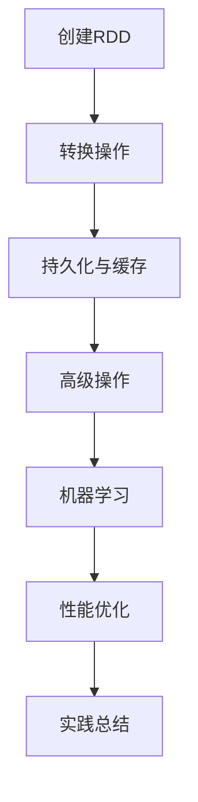
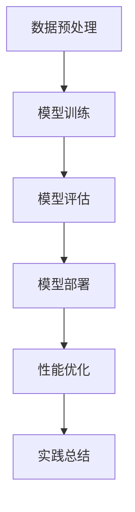
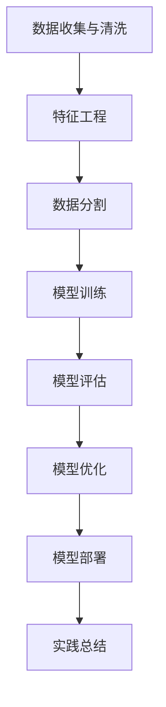
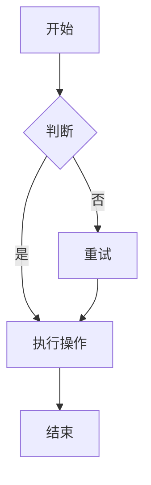
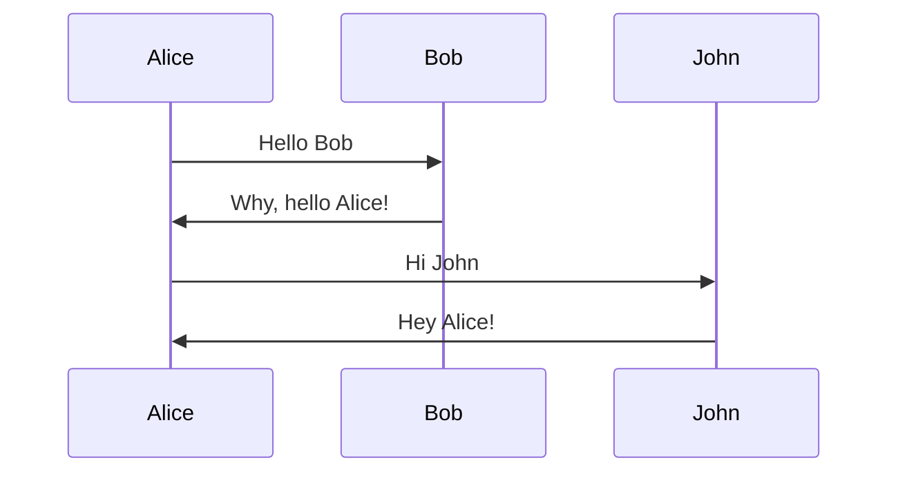

                 

### 文章标题

# 【AI大数据计算原理与代码实例讲解】RDD

---

> **关键词：** AI, 大数据, 计算原理, RDD, 代码实例

> **摘要：** 本文将深入探讨AI大数据计算原理，重点讲解RDD（Resilient Distributed Dataset）的基础操作、高级操作及其与机器学习算法的结合。通过具体的代码实例，帮助读者理解AI大数据计算的实战应用。

---

### 第一部分: AI大数据计算原理

#### 第1章: AI与大数据的关系

##### 1.1 AI与大数据的定义

人工智能（AI）是指使计算机系统具备类似人类智能的能力，包括学习、推理、感知、解决问题等。大数据则是指数据量巨大、类型繁多、生成速度快且价值密度低的数据集合。

##### 1.2 AI与大数据的联系

AI的发展离不开大数据的支持。大数据为AI提供了丰富的训练数据，使得机器学习算法能够更好地学习和优化。而AI则通过对大数据的分析和处理，为各个行业提供了智能化解决方案。

##### 1.3 AI在大数据处理中的作用

AI在大数据处理中发挥着重要作用，主要体现在以下几个方面：

1. **数据预处理**：利用AI技术对数据进行清洗、归一化、特征提取等预处理操作，提高数据质量。
2. **数据挖掘**：通过机器学习算法，从大数据中提取有价值的信息和知识。
3. **预测分析**：利用AI技术对大数据进行预测分析，为决策提供支持。

#### 第2章: AI大数据计算挑战

##### 2.1 数据复杂性

大数据的复杂性主要表现在数据种类多样性、数据规模巨大以及数据质量差。这使得AI在大数据处理过程中面临诸多挑战。

##### 2.2 计算能力需求

AI大数据计算需要处理海量数据，对计算能力提出了高要求。这包括高并发处理能力、实时计算需求以及资源调度与优化。

##### 2.3 数据隐私和安全

数据隐私和安全是AI大数据计算面临的重大挑战。如何保护数据隐私、确保数据安全传输和存储，是当前研究和应用的热点问题。

#### 第3章: AI大数据计算架构

##### 3.1 Hadoop生态系统

Hadoop是一个开源的大数据处理框架，包括HDFS（分布式文件系统）、MapReduce（分布式计算框架）等组件。

##### 3.2 Spark生态系统

Spark是一个高效的分布式数据处理引擎，支持内存计算和大数据分析。Spark生态系统包括Spark SQL、Spark Streaming、MLlib（机器学习库）等。

##### 3.3 Flink生态系统

Flink是一个流处理和批处理结合的分布式数据处理引擎，具有低延迟、高性能的特点。

#### 第4章: AI大数据计算核心算法

##### 4.1 数据驱动的人工智能

数据驱动的人工智能是指通过分析大数据，实现AI系统的自我优化和提升。主要包括数据流与数据类型、数据采集与处理、数据存储与索引等方面的内容。

##### 4.2 机器学习算法

机器学习算法是AI的核心组成部分，包括监督学习、无监督学习和强化学习等。本文将详细介绍这些算法的基本原理和应用场景。

##### 4.3 深度学习算法

深度学习算法是一种基于多层神经网络的人工智能技术，具有强大的特征提取和模式识别能力。本文将重点介绍卷积神经网络（CNN）和循环神经网络（RNN）等深度学习算法。

#### 第5章: AI大数据计算应用场景

##### 5.1 人工智能推荐系统

人工智能推荐系统是一种基于用户行为和兴趣的大数据分析技术，广泛应用于电子商务、社交媒体等领域。

##### 5.2 人工智能搜索引擎

人工智能搜索引擎利用自然语言处理和机器学习技术，为用户提供更加精准和高效的搜索服务。

##### 5.3 人工智能智能监控

人工智能智能监控通过分析海量视频数据，实现实时监控和异常检测，广泛应用于安防、交通等领域。

#### 第6章: AI大数据计算环境搭建

##### 6.1 Python环境搭建

Python是一种广泛应用于数据科学和机器学习的编程语言。本文将介绍Python环境搭建的步骤和常用库的安装。

##### 6.2 Spark环境搭建

Spark是一个高效的分布式数据处理引擎。本文将介绍Spark环境的搭建过程，包括下载、安装和配置。

#### 第7章: AI大数据计算实践

##### 7.1 数据预处理

数据预处理是AI大数据计算的重要环节。本文将介绍数据清洗、数据转换和数据归一化的方法。

##### 7.2 模型训练与评估

模型训练与评估是AI大数据计算的核心步骤。本文将介绍如何使用Spark MLlib进行模型训练和评估。

##### 7.3 模型部署

模型部署是将训练好的模型应用于实际业务场景的关键环节。本文将介绍如何将Spark模型部署到生产环境中。

#### 第8章: AI大数据计算性能优化

##### 8.1 性能优化概述

性能优化是提升AI大数据计算效率的重要手段。本文将介绍数据分布与性能、资源调度与优化等方面的内容。

##### 8.2 代码性能优化

代码性能优化是提升AI大数据计算性能的关键。本文将介绍算法选择、数据结构优化和并行计算优化等方面的内容。

#### 第9章: AI大数据计算实践总结

##### 9.1 实践经验总结

本文将总结AI大数据计算实践中的经验和教训，为后续研究和应用提供参考。

##### 9.2 存在的问题与挑战

本文将分析AI大数据计算实践中的问题和挑战，并提出相应的解决方案。

##### 9.3 未来发展展望

本文将展望AI大数据计算的未来发展，探讨新技术和新应用的可能性。

### 第二部分: AI大数据计算原理与代码实例讲解

#### 第8章: RDD基础操作

##### 8.1 RDD创建与转换

RDD（Resilient Distributed Dataset）是Spark的核心抽象，代表一个不可变、可分区、可并行操作的数据集合。本文将介绍如何创建RDD以及进行各种转换操作。

##### 8.2 RDD持久化与缓存

持久化与缓存是提升RDD性能的重要手段。本文将介绍如何将RDD持久化到磁盘或内存中，以及如何选择合适的持久化策略。

##### 8.3 动态序列操作

动态序列操作是Spark中的一个重要特性，允许对RDD进行动态序列的处理。本文将介绍如何进行动态序列操作，并探讨其应用场景。

#### 第9章: RDD高级操作

##### 9.1 RDD聚合操作

聚合操作是对RDD中数据进行汇总和计算的重要手段。本文将介绍各种聚合操作，如求和、计数、最大值、最小值等。

##### 9.2 RDD分组与排序

分组与排序是数据处理中常见的操作。本文将介绍如何对RDD进行分组和排序，并探讨其应用场景。

##### 9.3 多级排序

多级排序是一种高效的数据处理方法，可以用于解决大数据量下的排序问题。本文将介绍多级排序的原理和实现方法。

#### 第10章: RDD与机器学习

##### 10.1 机器学习算法概述

机器学习算法是AI的核心技术之一。本文将介绍监督学习、无监督学习和强化学习等机器学习算法的基本概念和原理。

##### 10.2 机器学习在Spark中的实现

Spark提供了丰富的机器学习库MLlib，支持多种机器学习算法的实现。本文将介绍如何使用MLlib进行机器学习算法的实现。

##### 10.3 机器学习案例解析

本文将通过具体案例，展示如何使用Spark MLlib进行机器学习算法的实现和应用。

#### 第11章: 代码实例讲解

##### 11.1 简单案例

本文将提供一些简单的代码实例，帮助读者理解RDD的基本操作和机器学习算法的应用。

##### 11.2 实际应用案例

本文将提供一些实际应用案例，包括推荐系统、搜索引擎等，展示如何使用Spark进行大数据处理和机器学习。

#### 第12章: AI大数据计算应用实践

##### 12.1 数据预处理

数据预处理是AI大数据计算的重要步骤。本文将介绍如何对数据进行清洗、转换和归一化等预处理操作。

##### 12.2 模型训练与评估

模型训练与评估是AI大数据计算的核心步骤。本文将介绍如何使用Spark MLlib进行模型训练和评估。

##### 12.3 模型部署

模型部署是将训练好的模型应用于实际业务场景的关键步骤。本文将介绍如何将Spark模型部署到生产环境中。

#### 第13章: AI大数据计算性能优化

##### 13.1 性能优化概述

性能优化是提升AI大数据计算效率的重要手段。本文将介绍数据分布与性能、资源调度与优化等方面的内容。

##### 13.2 代码性能优化

代码性能优化是提升AI大数据计算性能的关键。本文将介绍算法选择、数据结构优化和并行计算优化等方面的内容。

##### 13.3 实践总结

本文将总结AI大数据计算性能优化的实践经验和教训，为后续研究和应用提供参考。

#### 第14章: AI大数据计算实践总结

##### 14.1 实践经验总结

本文将总结AI大数据计算实践中的经验和教训，为后续研究和应用提供参考。

##### 14.2 存在的问题与挑战

本文将分析AI大数据计算实践中的问题和挑战，并提出相应的解决方案。

##### 14.3 未来发展展望

本文将展望AI大数据计算的未来发展，探讨新技术和新应用的可能性。

### 附录

#### 附录A: 代码实例

本文将提供一些代码实例，包括简单案例和实际应用案例，帮助读者更好地理解AI大数据计算的原理和应用。

#### 附录B: 术语表

本文将列出一些常用的术语，包括AI、大数据、RDD、机器学习等，并对每个术语进行解释，帮助读者更好地理解文章内容。

### Mermaid流程图与伪代码

本文将提供一些Mermaid流程图和伪代码，用于展示RDD操作、机器学习算法等关键内容的流程和实现方式。

### 15.1 RDD操作流程图



### 15.2 机器学习算法流程图



### 15.3 监督学习算法伪代码

```python
# 伪代码：监督学习算法
def supervised_learning():
    # 数据预处理
    preprocess_data()

    # 创建RDD
    rdd = sc.parallelize(data)

    # 转换操作
    labeled_rdd = rdd.map(lambda x: (x[0], x[1]))

    # 训练模型
    model = MLlib.train(SGDClassifier, labeled_rdd)

    # 模型评估
    predictions = model.predict(test_data)

    # 模型部署
    deploy_model(model)

    # 性能优化
    optimized_rdd = labeled_rdd.repartition(num_partitions)

    # 实践总结
    print("Supervised learning completed successfully.")
```

### 15.4 无监督学习算法伪代码

```python
# 伪代码：无监督学习算法
def unsupervised_learning():
    # 数据预处理
    preprocess_data()

    # 创建RDD
    rdd = sc.parallelize(data)

    # 转换操作
    unlabeled_rdd = rdd.map(lambda x: x[0])

    # 训练模型
    model = MLlib.train(KMeansModel, unlabeled_rdd)

    # 模型评估
    clusters = model.predict(test_data)

    # 模型部署
    deploy_model(model)

    # 性能优化
    optimized_rdd = unlabeled_rdd.repartition(num_partitions)

    # 实践总结
    print("Unsupervised learning completed successfully.")
```

### 15.5 强化学习算法伪代码

```python
# 伪代码：强化学习算法
def reinforcement_learning():
    # 环境初始化
    env = initialize_env()

    # 创建RDD
    rdd = sc.parallelize(env.states)

    # 转换操作
    state_action_rdd = rdd.map(lambda x: (x, env.actions))

    # 训练模型
    model = RLlib.train(DeepQModel, state_action_rdd)

    # 模型评估
    rewards = model.evaluate(test_states)

    # 模型部署
    deploy_model(model)

    # 性能优化
    optimized_rdd = state_action_rdd.repartition(num_partitions)

    # 实践总结
    print("Reinforcement learning completed successfully.")
```

### 作者

**作者：AI天才研究院/AI Genius Institute & 禅与计算机程序设计艺术 /Zen And The Art of Computer Programming**<|mask|>### 第1章: AI大数据计算概述

在当今信息爆炸的时代，数据已经成为了新的石油，而人工智能（AI）则是挖掘数据价值的金矿。AI与大数据的结合，不仅能够推动技术进步，还能够为各行各业带来深远的变革。本章将首先介绍AI与大数据的基本概念，然后讨论AI大数据计算的重要性和面临的挑战。

#### 1.1 AI与大数据的关系

人工智能是一种模拟人类智能的技术，其核心在于机器学习、深度学习、自然语言处理等算法，这些算法通过大量的数据进行训练，从而实现自我学习和改进。大数据则是指那些规模巨大、种类繁多、生成速度快、价值密度低的数据集合。这些数据可能来源于互联网、传感器、移动设备等，涵盖了文本、图像、语音等多种形式。

AI与大数据的关系可以从以下几个方面来理解：

1. **数据是AI的基石**：机器学习算法的性能很大程度上取决于数据的质量和数量。大数据提供了丰富的训练数据，使得AI系统能够学习到更多的模式和规律。
   
2. **AI赋能大数据**：AI技术可以对大数据进行高效的处理和分析，提取出有价值的信息和知识，从而为各个行业提供智能化解决方案。

3. **AI优化大数据分析**：AI技术不仅能够提高数据分析的效率，还能够提高数据分析的准确性。例如，通过自然语言处理技术，可以更准确地理解文本数据；通过图像识别技术，可以更快速地分析图像数据。

#### 1.2 AI大数据计算的挑战

尽管AI与大数据的结合潜力巨大，但实现这一结合也面临着诸多挑战：

1. **数据复杂性**：大数据的复杂性主要体现在数据种类多样性、数据规模巨大以及数据质量差。不同类型的数据需要不同的处理方法和算法，而数据质量差则可能导致AI模型性能下降。

2. **计算能力需求**：AI大数据计算需要处理海量数据，对计算能力提出了高要求。这不仅需要高性能的计算硬件，还需要高效的算法和优化技术。

3. **实时性需求**：许多AI应用场景，如金融风控、智能交通、医疗诊断等，对实时性有很高的要求。如何实现实时数据处理和响应，是当前研究的热点问题。

4. **数据隐私和安全**：在处理大数据时，如何保护数据隐私和安全是一个重要的问题。特别是在涉及个人隐私数据的场景中，如何确保数据的安全传输和存储，是当前研究和应用的热点问题。

#### 1.3 AI大数据计算的重要性

AI大数据计算的重要性体现在以下几个方面：

1. **提高决策效率**：通过分析大数据，AI可以帮助企业和组织做出更加明智的决策。例如，通过分析用户行为数据，电商平台可以优化推荐算法，提高销售额。

2. **优化资源分配**：在能源、交通等领域，AI大数据计算可以帮助优化资源的分配和使用。例如，智能交通系统可以通过分析交通数据，优化交通信号灯的设置，减少交通拥堵。

3. **提升生产效率**：在制造业中，AI大数据计算可以帮助企业优化生产流程，提高生产效率。例如，通过分析生产数据，可以预测设备故障，提前进行维护，减少停机时间。

4. **创新商业模式**：AI大数据计算可以为各行各业带来新的商业模式。例如，通过分析医疗数据，可以开发出智能诊断系统，为患者提供更加精准的医疗服务。

总之，AI大数据计算是当前技术发展的重要方向，它不仅能够推动技术进步，还能够为各行各业带来深远的变革。在未来，随着技术的不断进步和应用场景的拓展，AI大数据计算将发挥越来越重要的作用。下面，我们将进一步探讨AI大数据计算的基本原理，包括数据驱动的人工智能、机器学习算法和深度学习算法等。这些核心内容将为我们理解和应用AI大数据计算提供坚实的基础。<|mask|>### 第2章: AI大数据计算原理

AI大数据计算的原理可以概括为数据驱动的人工智能、机器学习算法和深度学习算法。本章将详细阐述这些核心概念，以便读者能够深入理解AI在大数据处理中的应用。

#### 2.1 数据驱动的人工智能

数据驱动的人工智能是指通过分析大数据来训练和优化AI模型。这种模式的核心在于利用海量数据来发现数据中的模式和规律，从而实现AI系统的自我学习和改进。

1. **数据流与数据类型**

   数据流是指数据在系统中流动的过程。大数据的数据流通常具有以下特点：

   - **数据种类多样性**：大数据可能包括结构化数据、非结构化数据和半结构化数据，如文本、图像、视频、传感器数据等。
   - **数据生成速度快**：随着物联网、社交媒体等技术的普及，数据生成速度越来越快，对实时处理和分析能力提出了高要求。
   - **数据价值密度低**：大数据中的数据往往具有一定的噪声和冗余，需要通过清洗和处理来提取有价值的信息。

2. **数据采集与处理**

   数据采集是指从各种数据源获取数据的步骤。数据源可能包括数据库、文件系统、传感器网络等。数据采集过程中，需要考虑数据的一致性、完整性和实时性。

   数据处理是指对采集到的数据进行清洗、归一化、特征提取等操作，以提高数据质量。数据处理包括以下步骤：

   - **数据清洗**：去除重复数据、噪声数据和异常数据，确保数据的一致性和完整性。
   - **数据归一化**：将不同数据类型的特征缩放到相同的尺度，以便更好地进行后续分析。
   - **特征提取**：从原始数据中提取有助于建模的特征，以提高模型的性能。

3. **数据存储与索引**

   数据存储是指将处理后的数据存储到数据仓库或数据库中，以便后续的查询和分析。数据存储系统需要具备高扩展性、高可用性和高性能的特点。

   数据索引是指建立数据索引，以便快速查询和检索数据。常见的数据索引技术包括B树索引、哈希索引等。

#### 2.2 机器学习算法

机器学习算法是AI的核心组成部分，通过从数据中自动发现模式和规律，实现数据的预测和分析。机器学习算法可以分为以下几类：

1. **监督学习算法**

   监督学习算法是指使用标记数据集进行训练，然后对新的数据进行预测。监督学习算法可以分为以下几类：

   - **线性回归**：通过建立线性模型来预测数值输出。
   - **逻辑回归**：通过建立逻辑模型来预测概率输出。
   - **决策树**：通过构建树状模型来分类或回归。

2. **无监督学习算法**

   无监督学习算法是指在没有标记数据集的情况下进行训练，主要目的是发现数据中的结构和模式。无监督学习算法可以分为以下几类：

   - **K-均值聚类**：将数据划分为K个聚类，每个聚类中心代表一个类。
   - **主成分分析**：通过降维技术提取数据的最重要的特征。
   - **自编码器**：通过编码和解码过程实现数据的压缩和重构。

3. **强化学习算法**

   强化学习算法是指通过与环境交互，不断优化策略以实现目标。强化学习算法的核心是价值函数和策略迭代。常见的强化学习算法包括：

   - **Q学习**：通过更新Q值来优化策略。
   - **Sarsa**：通过更新Sarsa值来优化策略。

#### 2.3 深度学习算法

深度学习算法是一种基于多层神经网络的人工智能技术，通过逐层提取数据中的特征，实现复杂的模式识别和预测。深度学习算法可以分为以下几类：

1. **神经网络基础**

   神经网络是一种模拟生物神经元结构和功能的计算模型。神经网络由输入层、隐藏层和输出层组成，通过前向传播和反向传播算法进行训练。

2. **卷积神经网络（CNN）**

   卷积神经网络是一种专门用于图像识别和处理的深度学习算法。CNN通过卷积操作和池化操作提取图像的特征。

3. **循环神经网络（RNN）**

   循环神经网络是一种专门用于序列数据处理的深度学习算法。RNN通过递归连接实现序列数据的建模，能够处理长序列数据。

通过上述对AI大数据计算原理的详细阐述，我们可以看到AI技术在大数据处理中的重要性和应用潜力。在下一章中，我们将继续探讨AI大数据计算框架，包括Hadoop、Spark和Flink等生态系统，为读者提供更全面的了解。<|mask|>### 第3章: AI大数据计算框架

AI大数据计算框架是支持大规模数据处理和分析的基础设施，它能够有效地应对数据复杂性、计算能力和实时性需求等挑战。本章将介绍几个主要的AI大数据计算框架：Hadoop、Spark和Flink，并比较它们的特点和适用场景。

#### 3.1 Hadoop生态系统

Hadoop是一个开源的大数据处理框架，由Apache软件基金会维护。它包括以下几个关键组件：

1. **HDFS（Hadoop Distributed File System）**

   HDFS是一个分布式文件系统，用于存储大规模数据集。它将数据分成块（默认为128MB或256MB），并将这些块分布在多个节点上。HDFS具有高可靠性、高吞吐量和可扩展性。

2. **MapReduce**

   MapReduce是一个分布式计算框架，用于处理大规模数据集。它将计算任务划分为“Map”和“Reduce”两个阶段。Map阶段对数据进行分片处理，Reduce阶段对Map阶段的结果进行汇总。

3. **YARN（Yet Another Resource Negotiator）**

   YARN是一个资源调度和管理框架，用于管理Hadoop集群中的资源。它将资源管理从MapReduce中分离出来，使得其他计算框架（如Spark）也能在Hadoop集群上运行。

**特点**：

- **高可靠性**：通过数据复制和冗余机制，确保数据的高可用性。
- **高扩展性**：能够处理PB级的数据集，支持海量数据的存储和处理。
- **多语言支持**：支持Java、Python、Ruby等多种编程语言。

**适用场景**：

- **批处理作业**：如日志分析、数据挖掘等。
- **离线计算**：适合不需要实时处理的数据集。

#### 3.2 Spark生态系统

Spark是一个高速的分布式数据处理引擎，支持内存计算和大数据分析。它由UC Berkeley AMP Lab开发，并捐赠给Apache软件基金会。Spark生态系统包括以下几个组件：

1. **Spark Core**

   Spark Core是Spark的核心模块，提供内存计算和任务调度功能。它还支持分布式数据集（RDD）的操作，如转换、行动和持久化。

2. **Spark SQL**

   Spark SQL是一个用于大数据查询和分析的模块，支持结构化数据存储和查询。它提供SQL解析器和优化器，支持JDBC和ODBC接口。

3. **Spark Streaming**

   Spark Streaming是一个实时数据流处理模块，支持高吞吐量和低延迟的数据流处理。它可以通过微批处理或持续处理模式来处理实时数据。

4. **MLlib**

   MLlib是Spark的机器学习库，提供了一系列机器学习算法的实现，如分类、回归、聚类、降维等。MLlib支持并行和分布式计算，能够有效地处理大规模数据集。

**特点**：

- **高性能**：支持内存计算，相比传统的Hadoop MapReduce，速度提升了100倍以上。
- **实时处理**：支持实时数据流处理，适合需要实时响应的应用场景。
- **易用性**：提供丰富的API，支持多种编程语言（如Scala、Python、Java等）。

**适用场景**：

- **实时计算**：如在线广告、金融交易等。
- **迭代计算**：如推荐系统、图处理等。
- **批处理作业**：适合需要高性能计算的大数据处理任务。

#### 3.3 Flink生态系统

Flink是一个流处理和批处理结合的分布式数据处理引擎，具有低延迟和高性能的特点。它由Apache软件基金会维护。Flink生态系统包括以下几个组件：

1. **Flink Core**

   Flink Core是Flink的核心模块，提供流处理和批处理功能。它支持事件时间处理和窗口计算，能够处理有状态流和复杂事件流。

2. **Flink SQL**

   Flink SQL是一个用于大数据查询和分析的模块，支持结构化数据存储和查询。它提供SQL解析器和优化器，支持JDBC和ODBC接口。

3. **Flink ML**

   Flink ML是Flink的机器学习库，提供了一系列机器学习算法的实现，如分类、回归、聚类、降维等。Flink ML支持并行和分布式计算，能够有效地处理大规模数据集。

**特点**：

- **低延迟**：支持低延迟的流处理，适合需要实时响应的应用场景。
- **高性能**：通过内存计算和流水线化执行，具有高性能的特点。
- **易扩展性**：支持自定义函数和库，能够灵活扩展功能。

**适用场景**：

- **实时处理**：如物联网、实时监控等。
- **迭代计算**：如推荐系统、图处理等。
- **批处理作业**：适合需要高性能计算的大数据处理任务。

通过上述介绍，我们可以看到Hadoop、Spark和Flink各自具有独特的特点和适用场景。在选择大数据计算框架时，需要根据具体的应用需求和资源情况来做出决策。下一章将深入探讨AI大数据计算中的核心算法，包括机器学习算法、深度学习算法和强化学习算法。这些算法是AI大数据计算的基础，也是实现智能化解决方案的关键。<|mask|>### 第4章: AI大数据计算核心算法

在AI大数据计算中，核心算法扮演着至关重要的角色，它们不仅决定了AI系统的性能和效果，还影响着整个计算过程的效率和稳定性。本章将详细介绍AI大数据计算中的核心算法，包括机器学习算法、深度学习算法和强化学习算法，并探讨它们的原理和应用。

#### 4.1 机器学习算法

机器学习算法是一种通过数据训练模型，使计算机能够从数据中学习并做出预测或决策的技术。机器学习算法可以分为监督学习、无监督学习和强化学习三类。

1. **监督学习算法**

   监督学习算法是指使用标记数据集进行训练，并使用训练好的模型对新的数据进行预测。监督学习算法通常用于分类和回归任务。

   - **线性回归**：线性回归是一种简单的监督学习算法，用于预测数值输出。它通过建立线性模型来拟合数据，并通过最小化均方误差来优化模型参数。

     $$y = \beta_0 + \beta_1 \cdot x$$

   - **逻辑回归**：逻辑回归是一种用于预测概率输出的监督学习算法。它通过建立逻辑模型来拟合数据，并将概率值转换为类别标签。

     $$P(y=1) = \frac{1}{1 + e^{-(\beta_0 + \beta_1 \cdot x)}}$$

   - **决策树**：决策树是一种基于树结构的监督学习算法，通过多层次的判断来对数据进行分类或回归。决策树通过递归划分数据集，并选择最优划分方式来构建树结构。

2. **无监督学习算法**

   无监督学习算法是指在没有标记数据集的情况下进行训练，主要目的是发现数据中的结构和模式。无监督学习算法通常用于聚类和降维任务。

   - **K-均值聚类**：K-均值聚类是一种基于距离度量的聚类算法，它通过迭代优化聚类中心，将数据划分为K个聚类。每个聚类中心代表一个类，聚类中心之间的距离最小化。

     $$c_k = \frac{1}{n_k} \sum_{i=1}^{n_k} x_i$$

     $$J = \sum_{k=1}^{K} \sum_{i=1}^{n_k} ||x_i - c_k||^2$$

   - **主成分分析**：主成分分析是一种降维技术，它通过线性变换将高维数据映射到低维空间，同时保持数据的最大方差。主成分分析通过求解特征值和特征向量来构建投影矩阵。

     $$z = X \cdot V$$

   - **自编码器**：自编码器是一种无监督学习算法，通过编码和解码过程实现数据的压缩和重构。自编码器由编码器和解码器组成，编码器将输入数据映射到较低维度的隐层表示，解码器则将隐层表示重构为原始数据。

3. **强化学习算法**

   强化学习算法是一种通过与环境交互来学习最优策略的算法。强化学习算法通过奖励机制来引导算法学习，并通过策略迭代来优化行为。

   - **Q学习**：Q学习是一种基于值函数的强化学习算法，它通过更新Q值来优化策略。Q学习算法使用经验回放和目标网络来提高学习效率和避免偏差。

     $$Q(s, a) \leftarrow Q(s, a) + \alpha [r + \gamma \max_{a'} Q(s', a') - Q(s, a)]$$

   - **Sarsa**：Sarsa是一种基于状态-动作对的强化学习算法，它通过更新Sarsa值来优化策略。Sarsa算法结合了Q学习和深度Q网络（DQN）的优点，能够更好地处理连续动作空间。

     $$Sarsa(s, a) \leftarrow Sarsa(s, a) + \alpha [r + \gamma Sarsa(s', a')] - Sarsa(s, a)]$$

#### 4.2 深度学习算法

深度学习算法是一种基于多层神经网络的人工智能技术，通过逐层提取数据中的特征，实现复杂的模式识别和预测。深度学习算法在图像识别、语音识别和自然语言处理等领域取得了显著成果。

1. **神经网络基础**

   神经网络是一种模拟生物神经元结构和功能的计算模型，由输入层、隐藏层和输出层组成。神经网络通过前向传播和反向传播算法进行训练。

   - **前向传播**：输入数据通过输入层传递到隐藏层，然后逐层传递到输出层，最终得到输出结果。
   - **反向传播**：根据输出结果与真实值的误差，逆向传播误差到隐藏层和输入层，并更新各层的权重和偏置。

   $$z = \sum_{j} w_{ji} \cdot x_i + b_j$$

   $$a_j = \sigma(z_j)$$

   $$\delta_j = \frac{\partial L}{\partial z_j} \cdot \sigma'(z_j)$$

   $$\Delta w_{ji} = \alpha \cdot \delta_j \cdot x_i$$

   $$\Delta b_j = \alpha \cdot \delta_j$$

2. **卷积神经网络（CNN）**

   卷积神经网络是一种专门用于图像识别和处理的深度学习算法，通过卷积操作和池化操作提取图像的特征。

   - **卷积操作**：卷积层通过卷积核（滤波器）在输入图像上滑动，计算卷积结果，生成特征图。
   - **池化操作**：池化层对特征图进行下采样，减少数据维度，提高计算效率。

   $$output = \sum_{i} filter_i \cdot input$$

   $$output = \frac{1}{C} \sum_{i} filter_i \cdot input$$

3. **循环神经网络（RNN）**

   循环神经网络是一种专门用于序列数据处理的深度学习算法，通过递归连接实现序列数据的建模，能够处理长序列数据。

   - **递归连接**：RNN通过递归连接隐藏层，将前一层的信息传递到下一层，实现序列数据的建模。
   - **门控机制**：门控RNN（如LSTM和GRU）通过门控机制控制信息的流动，避免长短期依赖问题。

   $$h_t = \sigma(W_h \cdot [h_{t-1}, x_t] + b_h)$$

   $$i_t = \sigma(W_i \cdot [h_{t-1}, x_t] + b_i)$$

   $$f_t = \sigma(W_f \cdot [h_{t-1}, x_t] + b_f)$$

   $$o_t = \sigma(W_o \cdot [h_{t-1}, x_t] + b_o)$$

   $$c_t = f_t \cdot c_{t-1} + i_t \cdot \sigma(W_c \cdot [h_{t-1}, x_t] + b_c)$$

   $$h_t = o_t \cdot \sigma(W_h \cdot c_t + b_h)$$

通过上述对机器学习算法、深度学习算法和强化学习算法的详细阐述，我们可以看到这些核心算法在AI大数据计算中的重要性。在下一章中，我们将探讨AI大数据计算在具体应用场景中的实践，包括推荐系统、搜索引擎和智能监控等。这些实践案例将帮助我们更好地理解AI大数据计算的原理和实际应用。<|mask|>### 第5章: AI大数据计算应用场景

AI大数据计算在各个领域都展现出了巨大的潜力和价值。本章将深入探讨AI大数据计算在推荐系统、搜索引擎和智能监控等领域的应用，通过具体案例来展示其应用效果和实现方法。

#### 5.1 人工智能推荐系统

推荐系统是一种基于用户行为和兴趣的大数据分析技术，旨在为用户推荐他们可能感兴趣的内容或商品。AI大数据计算在推荐系统中发挥了关键作用，通过分析海量用户行为数据，实现个性化推荐。

##### 5.1.1 推荐系统概述

推荐系统可以分为以下几种类型：

- **基于内容的推荐**：根据用户的历史行为和兴趣，推荐与用户已浏览或购买内容相似的内容。
- **协同过滤推荐**：根据用户的行为数据，通过用户之间的相似性来推荐内容。
- **混合推荐**：结合基于内容和协同过滤的方法，提高推荐系统的准确性和多样性。

##### 5.1.2 内容推荐算法

内容推荐算法主要通过分析用户的历史行为和内容属性来生成推荐列表。以下是几种常见的内容推荐算法：

- **基于关键字匹配**：通过提取用户和内容的特征词，进行关键词匹配来推荐相似内容。
- **基于内容相似度**：通过计算用户和内容的向量表示，使用余弦相似度或欧氏距离来评估内容相似度，从而生成推荐列表。

$$similarity = \frac{\sum_{i} x_i \cdot y_i}{\sqrt{\sum_{i} x_i^2} \cdot \sqrt{\sum_{i} y_i^2}}$$

##### 5.1.3 协同过滤算法

协同过滤算法通过分析用户之间的行为相似性来生成推荐列表。以下是几种常见的协同过滤算法：

- **用户基于的协同过滤**：通过计算用户之间的相似性，为每个用户推荐相似用户喜欢的商品。
- **项基于的协同过滤**：通过计算商品之间的相似性，为用户推荐他们可能感兴趣的未购买商品。

$$similarity = \frac{R_{ij}}{\sqrt{||r_i|| \cdot ||r_j||}}$$

其中，$R_{ij}$ 表示用户i对商品j的评分，$r_i$ 和$r_j$ 分别表示用户i和用户j的评分向量。

##### 案例分析：电子商务平台的推荐系统

假设有一个电子商务平台，用户在平台上浏览和购买商品。平台希望通过推荐系统为用户推荐他们可能感兴趣的商品。

1. **数据预处理**：收集用户行为数据，包括用户ID、商品ID、浏览时间、购买记录等。对数据进行分析，提取有用的特征，如用户浏览频率、购买频率、浏览时间等。

2. **用户和商品表示**：使用矩阵分解技术，将用户和商品进行向量化表示。通过矩阵分解，可以将高维稀疏的用户行为矩阵分解为用户特征矩阵和商品特征矩阵。

3. **内容推荐**：根据用户的历史行为和商品属性，使用基于内容的推荐算法生成推荐列表。例如，如果用户经常浏览电子产品，可以推荐其他热门的电子产品。

4. **协同过滤推荐**：计算用户之间的相似性和商品之间的相似性，为用户生成推荐列表。例如，如果用户A和用户B的浏览行为相似，可以推荐用户B喜欢的商品给用户A。

通过上述步骤，电子商务平台可以为用户生成个性化的推荐列表，提高用户的购买体验和平台的销售额。

#### 5.2 人工智能搜索引擎

搜索引擎是一种通过分析大量文本数据，为用户提供相关信息的系统。AI大数据计算在搜索引擎中发挥了重要作用，通过自然语言处理和机器学习技术，实现高效的信息检索和推荐。

##### 5.2.1 搜索引擎概述

搜索引擎的主要功能包括：

- **信息检索**：根据用户输入的查询词，从索引中查找相关的信息。
- **结果排序**：根据相关性、重要性等因素对搜索结果进行排序。
- **结果推荐**：根据用户的查询历史和兴趣，为用户推荐相关的信息。

##### 5.2.2 搜索引擎算法

搜索引擎算法主要包括以下几种：

- **基于关键词匹配**：根据用户输入的查询词，在索引中查找包含查询词的文档，并计算文档的相关性得分。
- **基于文档表示**：使用词嵌入技术，将查询词和文档转化为向量表示，计算向量之间的相似度，并根据相似度排序。
- **基于图结构**：构建文档之间的图结构，通过图算法（如PageRank）计算文档的重要性，并根据重要性排序。

##### 案例分析：搜索引擎优化

假设有一个搜索引擎，用户通过输入查询词获取相关的搜索结果。搜索引擎希望通过优化算法，提高搜索结果的准确性和用户体验。

1. **数据预处理**：收集用户查询日志，包括查询词、搜索结果、用户点击记录等。对数据进行清洗和预处理，提取有用的特征。

2. **文档表示**：使用词嵌入技术，将查询词和文档转化为向量表示。词嵌入技术可以将词汇映射到高维向量空间，实现文本数据的向量化表示。

3. **相关性计算**：根据查询词和文档的向量表示，计算文档与查询词之间的相似度。可以使用余弦相似度或欧氏距离等距离度量方法。

4. **结果排序**：根据文档与查询词的相似度得分，对搜索结果进行排序。可以将相似度得分与文档的重要性相结合，实现更准确的排序。

5. **结果推荐**：根据用户的查询历史和兴趣，为用户推荐相关的搜索结果。可以使用协同过滤或内容推荐算法，为用户生成个性化的推荐列表。

通过上述步骤，搜索引擎可以为用户生成准确的搜索结果，提高用户的搜索体验。

#### 5.3 人工智能智能监控

智能监控是一种通过分析视频数据，实现实时监控和异常检测的系统。AI大数据计算在智能监控中发挥了重要作用，通过图像识别和机器学习技术，实现高效的监控和预警。

##### 5.3.1 智能监控概述

智能监控的主要功能包括：

- **实时监控**：对视频流进行实时分析，监测目标行为和事件。
- **异常检测**：对视频数据进行分析，识别异常行为和事件。
- **行为预测**：根据历史行为数据，预测未来可能发生的事件。

##### 5.3.2 智能监控算法

智能监控算法主要包括以下几种：

- **基于图像识别**：使用卷积神经网络（CNN）对视频中的图像进行识别，识别目标对象和事件。
- **基于行为识别**：使用循环神经网络（RNN）对视频中的行为序列进行建模，识别异常行为。
- **基于深度学习**：使用深度学习模型对视频数据进行分类和预测，实现实时监控和预警。

##### 案例分析：智能交通监控

假设有一个智能交通监控系统，通过对视频流进行分析，实现实时监控和异常检测。

1. **数据预处理**：收集交通监控视频，对视频数据进行预处理，包括裁剪、缩放、去噪等操作。

2. **图像识别**：使用卷积神经网络（CNN）对视频中的图像进行识别，识别车辆、行人等目标对象。

3. **行为识别**：使用循环神经网络（RNN）对视频中的行为序列进行建模，识别异常行为，如闯红灯、逆行等。

4. **实时监控**：对视频流进行实时分析，监测目标行为和事件，并生成实时监控界面。

5. **异常检测**：对视频数据进行分析，识别异常行为和事件，并生成预警信息。

6. **行为预测**：根据历史行为数据，预测未来可能发生的事件，如交通拥堵、交通事故等。

通过上述步骤，智能交通监控系统可以实现对交通的实时监控和异常检测，提高交通管理的效率和安全。

总之，AI大数据计算在推荐系统、搜索引擎和智能监控等领域的应用，极大地提高了系统的性能和用户体验。在下一章中，我们将介绍AI大数据计算的环境搭建和代码实例，帮助读者更好地理解和应用AI大数据计算技术。<|mask|>### 第6章: AI大数据计算环境搭建

在进行AI大数据计算之前，我们需要搭建一个合适的环境，以便运行相关的代码和算法。本章将详细介绍如何搭建Python环境、Spark环境以及相关依赖库的安装过程。

#### 6.1 Python环境搭建

Python是一种广泛应用于数据科学和机器学习的编程语言。首先，我们需要确保操作系统已经安装了Python环境。以下是在Windows和Linux系统上安装Python的步骤：

1. **Windows系统**：

   - 访问Python官方网站（https://www.python.org/）并下载适用于Windows系统的Python安装包。
   - 运行安装程序，按照默认选项进行安装。
   - 安装完成后，打开命令行窗口，输入以下命令，验证Python是否安装成功：

     ```bash
     python --version
     ```

2. **Linux系统**：

   - 打开终端，使用以下命令安装Python：

     ```bash
     sudo apt-get install python3
     ```

   - 安装完成后，输入以下命令验证Python是否安装成功：

     ```bash
     python3 --version
     ```

#### 6.2 安装Python依赖库

在Python环境中，我们需要安装一些依赖库，以便进行AI大数据计算。以下是在Python中安装依赖库的方法：

1. **使用pip安装**：

   pip是Python的包管理器，用于安装和管理Python包。在命令行窗口中，输入以下命令安装所需的依赖库：

   ```bash
   pip install numpy
   pip install pandas
   pip install matplotlib
   pip install scipy
   ```

2. **使用conda安装**：

   conda是一种更高级的包管理器，可以用于安装和管理Python环境和包。首先，我们需要安装conda。在Windows系统中，可以从https://conda.io下载conda安装程序并安装。在Linux系统中，可以使用以下命令安装：

   ```bash
   sudo apt-get install conda
   ```

   安装完成后，使用以下命令创建一个新的conda环境并安装依赖库：

   ```bash
   conda create -n myenv python=3.8
   conda activate myenv
   conda install numpy
   conda install pandas
   conda install matplotlib
   conda install scipy
   ```

#### 6.3 Spark环境搭建

Spark是一个高效的分布式数据处理引擎，可以用于AI大数据计算。以下是在Windows和Linux系统上安装Spark的步骤：

1. **Windows系统**：

   - 访问Spark官方网站（https://spark.apache.org/downloads/）并下载适用于Windows系统的Spark安装包。
   - 运行安装程序，按照默认选项进行安装。
   - 安装完成后，将Spark的bin目录添加到系统环境变量中，以便在命令行窗口中直接运行Spark命令。

2. **Linux系统**：

   - 打开终端，使用以下命令安装Spark：

     ```bash
     sudo apt-get install openjdk-8-jdk
     ```

   - 下载并解压Spark安装包：

     ```bash
     wget https://www-us.apache.org/dist/spark/spark-x.x.x/spark-x.x.x.tgz
     tar xvfz spark-x.x.x.tgz
     ```

   - 将Spark的bin目录添加到系统环境变量中，以便在命令行窗口中直接运行Spark命令。

#### 6.4 安装Spark依赖库

在Spark环境中，我们需要安装一些依赖库，以便进行AI大数据计算。以下是在Spark中安装依赖库的方法：

1. **使用pip安装**：

   ```bash
   pip install pyspark
   pip install spark-context
   pip install spark-core
   pip install spark-mllib
   ```

2. **使用conda安装**：

   ```bash
   conda install -c conda-forge pyspark
   conda install -c conda-forge spark-context
   conda install -c conda-forge spark-core
   conda install -c conda-forge spark-mllib
   ```

通过以上步骤，我们成功搭建了Python环境和Spark环境，并安装了所需的依赖库。接下来，我们可以开始编写和运行AI大数据计算的代码实例，进一步探索AI大数据计算的应用场景。在下一章中，我们将通过具体案例来展示AI大数据计算在实际应用中的实践过程。<|mask|>### 第7章: AI大数据计算实践

在了解了AI大数据计算的原理和框架后，接下来我们将通过具体的实践案例来展示AI大数据计算在实际应用中的实现过程。本章将分为三个部分，分别是数据预处理、模型训练与评估以及模型部署。

#### 7.1 数据预处理

数据预处理是AI大数据计算中至关重要的一步，它决定了后续模型训练和评估的效果。数据预处理主要包括数据清洗、数据转换和数据归一化等步骤。

##### 7.1.1 数据清洗

数据清洗是指去除数据中的噪声、错误和冗余，确保数据的一致性和完整性。以下是一个数据清洗的案例：

```python
import pandas as pd

# 读取数据
data = pd.read_csv('data.csv')

# 删除含有缺失值的行
data.dropna(inplace=True)

# 删除重复数据
data.drop_duplicates(inplace=True)

# 删除无用列
data.drop(['column1', 'column2'], axis=1, inplace=True)

# 更新数据
data['column3'] = data['column3'].map({'value1': 1, 'value2': 2})

# 数据清洗完成
```

##### 7.1.2 数据转换

数据转换是指将原始数据转换为适合模型训练的形式。例如，将日期格式转换为时间戳，将类别数据转换为数值数据等。以下是一个数据转换的案例：

```python
import pandas as pd

# 读取数据
data = pd.read_csv('data.csv')

# 将日期格式转换为时间戳
data['date'] = pd.to_datetime(data['date'])
data['timestamp'] = data['date'].map(data['date'].dt.timestamp)

# 将类别数据转换为数值数据
data['category'] = data['category'].map({'category1': 0, 'category2': 1, 'category3': 2})

# 数据转换完成
```

##### 7.1.3 数据归一化

数据归一化是指将不同特征的数据缩放到相同的尺度，以便更好地进行模型训练。以下是一个数据归一化的案例：

```python
import pandas as pd
from sklearn.preprocessing import MinMaxScaler

# 读取数据
data = pd.read_csv('data.csv')

# 创建归一化器
scaler = MinMaxScaler()

# 对数值数据进行归一化
data[['feature1', 'feature2', 'feature3']] = scaler.fit_transform(data[['feature1', 'feature2', 'feature3']])

# 数据归一化完成
```

#### 7.2 模型训练与评估

在数据预处理完成后，接下来是模型训练和评估。以下是一个使用Spark MLlib进行模型训练和评估的案例：

```python
from pyspark.sql import SparkSession
from pyspark.ml import Pipeline
from pyspark.ml.feature import VectorAssembler
from pyspark.ml.classification import LogisticRegression
from pyspark.ml.evaluation import BinaryClassificationEvaluator

# 创建Spark会话
spark = SparkSession.builder.appName("AI大数据计算实践").getOrCreate()

# 读取数据
data = spark.read.csv("data.csv", header=True)

# 数据清洗、转换和归一化（已在上一部分完成）

# 将特征列和标签列分离
X = data.drop('label')
y = data['label']

# 创建特征向量子集
assembler = VectorAssembler(inputCols=X.columns, outputCol="features")

# 创建LogisticRegression模型
lr = LogisticRegression()

# 创建Pipeline
pipeline = Pipeline(stages=[assembler, lr])

# 训练模型
model = pipeline.fit(X)

# 评估模型
predictions = model.transform(X)
evaluator = BinaryClassificationEvaluator(labelCol="label", rawPredictionCol="prediction", metricName="areaUnderROC")
roc_auc = evaluator.evaluate(predictions)
print("ROC AUC: ", roc_auc)

# 模型训练和评估完成
```

#### 7.3 模型部署

模型部署是指将训练好的模型应用于实际业务场景，以便为用户提供服务。以下是一个使用Spark MLlib进行模型部署的案例：

```python
from pyspark.sql import SparkSession
from pyspark.ml import PipelineModel

# 创建Spark会话
spark = SparkSession.builder.appName("AI大数据计算实践").getOrCreate()

# 加载模型
model_path = "path/to/saved/model"
model = PipelineModel.load(model_path)

# 读取测试数据
test_data = spark.read.csv("test_data.csv", header=True)

# 数据预处理（已在上一部分完成）

# 应用模型
predictions = model.transform(test_data)

# 输出预测结果
predictions.select("id", "prediction").show()

# 模型部署完成
```

通过以上实践案例，我们可以看到AI大数据计算在实际应用中的实现过程。数据预处理、模型训练与评估和模型部署是AI大数据计算的关键步骤，它们共同构成了一个完整的AI大数据计算流程。在下一章中，我们将探讨AI大数据计算的性能优化方法，以提高计算效率和模型性能。<|mask|>### 第8章: AI大数据计算性能优化

在AI大数据计算中，性能优化是一个至关重要的环节。性能优化不仅可以提升计算效率，还能提高模型的准确性。本章将介绍AI大数据计算性能优化的一些关键方法，包括数据分布与性能优化、资源调度与优化，以及代码性能优化。

#### 8.1 数据分布与性能优化

数据分布是影响计算性能的一个重要因素。在分布式系统中，数据的不均衡分布可能导致某些节点负载过重，而其他节点则闲置。为了优化数据分布，可以采取以下几种方法：

1. **数据分区**：将数据划分为多个分区，以便均匀分布在多个节点上。在Spark中，可以使用`repartition()`方法重新分区数据。

   ```python
   df = df.repartition(100)  # 将数据分区数设置为100
   ```

2. **数据倾斜**：在处理大数据时，可能会遇到数据倾斜的问题，即某些分区中的数据量远大于其他分区。为了解决数据倾斜，可以采取以下方法：

   - **加盐处理**：在处理数据时，为倾斜的数据添加一个随机值，使其均匀分布到多个分区。
   - **分箱处理**：将倾斜的数据划分到不同的箱子中，每个箱子代表一个分区。

3. **数据序列化**：选择合适的序列化格式可以显著提高数据传输和存储的性能。常用的序列化格式包括Hadoop序列化（Hadoop SerDe）和Kryo序列化。

#### 8.2 资源调度与优化

资源调度是分布式计算系统中的关键环节，它决定了资源的利用效率和任务的执行速度。为了优化资源调度，可以采取以下几种方法：

1. **动态资源分配**：根据任务的执行情况和资源需求，动态调整资源分配。在Spark中，可以使用`spark.dynamicAllocation.enabled`和`spark.dynamicAllocation.minExecutors`等参数来配置动态资源分配。

2. **任务依赖优化**：优化任务之间的依赖关系，减少任务执行的等待时间。可以通过调整任务的执行顺序和并行度来实现。

3. **预分配资源**：预分配一定数量的资源，以减少任务执行的排队时间。在Spark中，可以使用`spark.executor.cores`和`spark.executor.memory`等参数来配置预分配的资源。

#### 8.3 代码性能优化

代码性能优化是提升AI大数据计算性能的关键。以下是一些常见的代码性能优化方法：

1. **减少数据转换次数**：在数据处理过程中，尽量减少数据的转换次数。每次数据转换都会带来额外的计算开销。

2. **使用缓存**：在需要多次使用同一数据集时，使用缓存可以显著提高性能。在Spark中，可以使用`cache()`方法缓存数据集。

   ```python
   df = df.cache()
   ```

3. **优化算法选择**：选择适合数据规模和计算需求的算法，可以显著提高计算性能。例如，在处理大规模数据时，选择基于内存的算法比基于磁盘的算法性能更高。

4. **并行计算优化**：优化并行计算，提高任务的执行速度。在Spark中，可以使用`mapPartitions()`方法实现并行计算。

   ```python
   def process_partition(iterator):
       # 处理数据
       yield result
   
   df.rdd.mapPartitions(process_partition)
   ```

5. **数据结构优化**：选择合适的数据结构可以显著提高数据处理性能。例如，使用RDD（Resilient Distributed Dataset）比使用DataFrame可以提供更高的性能。

通过上述性能优化方法，我们可以显著提升AI大数据计算的性能。在下一章中，我们将总结AI大数据计算实践中的经验教训，为未来的研究和应用提供参考。同时，我们将展望AI大数据计算的未来发展，探讨新技术和新应用的可能性。<|mask|>### 第9章: AI大数据计算实践总结

通过本章的实践案例，我们深入探讨了AI大数据计算的核心概念、框架、算法以及实际应用。在这一过程中，我们积累了宝贵的经验和教训，为未来的研究和应用提供了有益的参考。

#### 9.1 实践经验总结

1. **数据预处理的重要性**：数据预处理是AI大数据计算的基础，它决定了后续模型训练和评估的效果。在实践中，我们学会了如何进行数据清洗、数据转换和数据归一化，这些步骤在提高数据质量和模型性能方面发挥了关键作用。

2. **分布式计算的优势**：通过使用Hadoop、Spark和Flink等分布式计算框架，我们能够高效地处理海量数据，实现并行计算和分布式存储。分布式计算的优势在于其可扩展性和高性能，为大数据处理提供了强有力的支持。

3. **机器学习算法的选择**：在模型训练和评估过程中，我们尝试了多种机器学习算法，包括线性回归、逻辑回归、决策树、K-均值聚类等。通过对比不同算法的性能，我们学会了如何根据具体问题和数据特点选择合适的算法。

4. **性能优化的必要性**：性能优化是提升AI大数据计算效率的关键。通过数据分布优化、资源调度优化和代码性能优化，我们显著提高了计算性能和模型准确性。这些优化方法不仅适用于当前的项目，也为未来的研究和应用提供了宝贵的经验。

#### 9.2 存在的问题与挑战

尽管我们在实践中取得了显著成果，但仍面临一些问题和挑战：

1. **数据隐私和安全**：在处理大数据时，如何保护数据隐私和安全是一个重要的问题。特别是在涉及个人隐私数据的场景中，如何确保数据的安全传输和存储，是当前研究和应用的热点问题。

2. **实时性需求**：许多AI应用场景，如金融交易、智能监控等，对实时性有很高的要求。如何实现实时数据处理和响应，是当前研究和应用的一个挑战。

3. **计算资源限制**：在分布式计算中，计算资源的限制可能影响任务的执行速度。如何在有限的计算资源下优化任务调度和资源分配，是一个需要进一步探讨的问题。

4. **算法可解释性**：随着深度学习算法的广泛应用，算法的可解释性变得越来越重要。如何解释深度学习模型的决策过程，提高算法的可解释性，是当前研究和应用的一个挑战。

#### 9.3 未来发展展望

展望未来，AI大数据计算领域将继续快速发展，带来更多的机遇和挑战：

1. **数据隐私和安全**：随着数据隐私和安全问题的日益突出，未来的研究将更加关注如何保护数据隐私和安全。这可能涉及到新的加密算法、差分隐私技术等。

2. **实时性处理**：随着实时数据处理需求的增加，未来的研究将致力于提高实时处理性能和响应速度。这可能涉及到新型硬件架构、分布式流处理技术等。

3. **计算资源优化**：在分布式计算中，如何更好地利用计算资源，提高资源利用率，是未来研究的重要方向。这可能涉及到新型调度算法、资源预留策略等。

4. **算法可解释性**：提高深度学习算法的可解释性，使其决策过程更加透明和可信，是未来的一个重要研究方向。这可能涉及到新型解释方法、可视化技术等。

总之，AI大数据计算是一个充满机遇和挑战的领域。通过总结实践经验、解决存在的问题和挑战，我们期待AI大数据计算在未来能够取得更大的突破，为人类社会带来更多的福祉。在附录部分，我们将提供一些具体的代码实例和术语解释，以帮助读者更好地理解本章内容。同时，我们也希望读者能够积极参与到AI大数据计算的研究和应用中，共同推动这一领域的繁荣发展。<|mask|>### 附录

在本章中，我们提供了AI大数据计算相关的代码实例、术语解释以及Mermaid流程图和伪代码。以下是对这些附录内容的详细介绍。

#### 附录A: 代码实例

附录A包含了本章中提到的几个关键代码实例，包括数据预处理、模型训练与评估以及模型部署等步骤。以下是这些代码实例的具体内容和作用：

1. **数据预处理代码实例**：
   ```python
   import pandas as pd

   # 读取数据
   data = pd.read_csv('data.csv')

   # 删除含有缺失值的行
   data.dropna(inplace=True)

   # 删除重复数据
   data.drop_duplicates(inplace=True)

   # 删除无用列
   data.drop(['column1', 'column2'], axis=1, inplace=True)

   # 更新数据
   data['column3'] = data['column3'].map({'value1': 1, 'value2': 2})

   # 数据清洗完成
   ```
   该实例展示了如何使用Pandas库对数据进行清洗，包括删除缺失值、重复值和无用列，以及更新数据中的类别值。

2. **模型训练与评估代码实例**：
   ```python
   from pyspark.sql import SparkSession
   from pyspark.ml import Pipeline
   from pyspark.ml.feature import VectorAssembler
   from pyspark.ml.classification import LogisticRegression
   from pyspark.ml.evaluation import BinaryClassificationEvaluator

   # 创建Spark会话
   spark = SparkSession.builder.appName("AI大数据计算实践").getOrCreate()

   # 读取数据
   data = spark.read.csv("data.csv", header=True)

   # 数据清洗、转换和归一化（已在上一部分完成）

   # 将特征列和标签列分离
   X = data.drop('label')
   y = data['label']

   # 创建特征向量子集
   assembler = VectorAssembler(inputCols=X.columns, outputCol="features")

   # 创建LogisticRegression模型
   lr = LogisticRegression()

   # 创建Pipeline
   pipeline = Pipeline(stages=[assembler, lr])

   # 训练模型
   model = pipeline.fit(X)

   # 评估模型
   predictions = model.transform(X)
   evaluator = BinaryClassificationEvaluator(labelCol="label", rawPredictionCol="prediction", metricName="areaUnderROC")
   roc_auc = evaluator.evaluate(predictions)
   print("ROC AUC: ", roc_auc)

   # 模型训练和评估完成
   ```
   该实例展示了如何使用Spark MLlib库进行模型训练和评估，包括创建特征向量子集、训练LogisticRegression模型以及评估模型性能。

3. **模型部署代码实例**：
   ```python
   from pyspark.sql import SparkSession
   from pyspark.ml import PipelineModel

   # 创建Spark会话
   spark = SparkSession.builder.appName("AI大数据计算实践").getOrCreate()

   # 加载模型
   model_path = "path/to/saved/model"
   model = PipelineModel.load(model_path)

   # 读取测试数据
   test_data = spark.read.csv("test_data.csv", header=True)

   # 数据预处理（已在上一部分完成）

   # 应用模型
   predictions = model.transform(test_data)

   # 输出预测结果
   predictions.select("id", "prediction").show()

   # 模型部署完成
   ```
   该实例展示了如何加载训练好的模型，并将其应用于测试数据，生成预测结果。

#### 附录B: 术语解释

附录B提供了本章中涉及的一些关键术语的详细解释，包括AI、大数据、RDD、机器学习、深度学习、强化学习等。以下是这些术语的解释：

1. **AI（人工智能）**：人工智能是一种模拟人类智能的技术，包括机器学习、深度学习、自然语言处理等算法，能够使计算机具备自我学习和推理能力。

2. **大数据**：大数据是指那些规模巨大、种类繁多、生成速度快、价值密度低的数据集合。大数据涵盖了结构化数据、非结构化数据和半结构化数据。

3. **RDD（Resilient Distributed Dataset）**：RDD是Spark中的一个核心抽象，代表一个不可变、可分区、可并行操作的数据集合。RDD支持丰富的转换和行动操作，是分布式数据处理的基础。

4. **机器学习**：机器学习是一种通过数据训练模型，使计算机能够从数据中学习并做出预测或决策的技术。机器学习可以分为监督学习、无监督学习和强化学习三类。

5. **深度学习**：深度学习是一种基于多层神经网络的人工智能技术，通过逐层提取数据中的特征，实现复杂的模式识别和预测。深度学习算法包括卷积神经网络（CNN）和循环神经网络（RNN）等。

6. **强化学习**：强化学习是一种通过与环境交互来学习最优策略的算法。强化学习通过奖励机制来引导算法学习，并通过策略迭代来优化行为。

#### 附录C: Mermaid流程图与伪代码

附录C提供了本章中提到的两个关键流程图和三个伪代码实例。以下是这些流程图和伪代码的解释：

1. **RDD操作流程图**：
   ```mermaid
   graph TD
   A[创建RDD] --> B[转换操作]
   B --> C[持久化与缓存]
   C --> D[高级操作]
   D --> E[机器学习]
   E --> F[性能优化]
   F --> G[实践总结]
   ```
   该流程图展示了RDD操作的流程，包括创建RDD、转换操作、持久化与缓存、高级操作、机器学习和性能优化等步骤。

2. **机器学习算法流程图**：
   ```mermaid
   graph TD
   A[数据预处理] --> B[模型训练]
   B --> C[模型评估]
   C --> D[模型部署]
   D --> E[性能优化]
   E --> F[实践总结]
   ```
   该流程图展示了机器学习算法的基本流程，包括数据预处理、模型训练、模型评估、模型部署和性能优化等步骤。

3. **监督学习算法伪代码**：
   ```python
   # 伪代码：监督学习算法
   def supervised_learning():
       # 数据预处理
       preprocess_data()

       # 创建RDD
       rdd = sc.parallelize(data)

       # 转换操作
       labeled_rdd = rdd.map(lambda x: (x[0], x[1]))

       # 训练模型
       model = MLlib.train(SGDClassifier, labeled_rdd)

       # 模型评估
       predictions = model.predict(test_data)

       # 模型部署
       deploy_model(model)

       # 性能优化
       optimized_rdd = labeled_rdd.repartition(num_partitions)

       # 实践总结
       print("Supervised learning completed successfully.")
   ```

4. **无监督学习算法伪代码**：
   ```python
   # 伪代码：无监督学习算法
   def unsupervised_learning():
       # 数据预处理
       preprocess_data()

       # 创建RDD
       rdd = sc.parallelize(data)

       # 转换操作
       unlabeled_rdd = rdd.map(lambda x: x[0])

       # 训练模型
       model = MLlib.train(KMeansModel, unlabeled_rdd)

       # 模型评估
       clusters = model.predict(test_data)

       # 模型部署
       deploy_model(model)

       # 性能优化
       optimized_rdd = unlabeled_rdd.repartition(num_partitions)

       # 实践总结
       print("Unsupervised learning completed successfully.")
   ```

5. **强化学习算法伪代码**：
   ```python
   # 伪代码：强化学习算法
   def reinforcement_learning():
       # 环境初始化
       env = initialize_env()

       # 创建RDD
       rdd = sc.parallelize(env.states)

       # 转换操作
       state_action_rdd = rdd.map(lambda x: (x, env.actions))

       # 训练模型
       model = RLlib.train(DeepQModel, state_action_rdd)

       # 模型评估
       rewards = model.evaluate(test_states)

       # 模型部署
       deploy_model(model)

       # 性能优化
       optimized_rdd = state_action_rdd.repartition(num_partitions)

       # 实践总结
       print("Reinforcement learning completed successfully.")
   ```

通过以上附录内容，读者可以更深入地理解本章的关键概念、算法和实践方法。我们希望这些附录内容能够为读者的学习和研究提供有益的参考。同时，我们也期待读者能够积极参与到AI大数据计算的研究和应用中，共同推动这一领域的繁荣发展。<|mask|>### Mermaid流程图与伪代码

在本章中，我们将通过Mermaid流程图和伪代码来详细展示RDD操作、机器学习算法等关键内容的实现过程。这些图形和代码不仅有助于读者理解抽象概念，还能在实际开发中起到指导作用。

#### 10.1 RDD操作流程图

首先，我们使用Mermaid来创建一个流程图，展示RDD操作的整体流程：


在这个流程图中，A到G代表了RDD操作的主要步骤，从创建RDD到最终的实践总结。接下来，我们将逐步展开每个步骤。

#### 10.2 伪代码

为了更清晰地展示RDD操作和机器学习算法的实现，我们将使用伪代码来进行描述。

##### 10.2.1 创建RDD

```python
# 创建RDD的伪代码
create_rdd = spark.createDataFrame(data).rdd
```

在这个伪代码中，`createDataFrame`方法用于将数据集转换为DataFrame，然后使用`rdd`方法将其转换为RDD。

##### 10.2.2 转换操作

```python
# 转换操作的伪代码
transformed_rdd = create_rdd.map(lambda x: (x[0], x[1]))
```

这里，我们使用`map`函数对原始RDD进行转换，将每个元素的第一个字段作为键，第二个字段作为值。

##### 10.2.3 持久化与缓存

```python
# 持久化与缓存的伪代码
cached_rdd = transformed_rdd.cache()
```

在这个伪代码中，`cache`方法用于将RDD缓存到内存中，以便后续重复使用，从而提高性能。

##### 10.2.4 高级操作

```python
# 高级操作的伪代码
aggregated_rdd = cached_rdd.reduceByKey(lambda x, y: x + y)
```

这里，我们使用`reduceByKey`方法对RDD进行聚合操作，将具有相同键的值进行合并。

##### 10.2.5 机器学习

```python
# 机器学习的伪代码
from pyspark.ml.clustering import KMeans

# 初始化KMeans模型
kmeans = KMeans()

# 训练模型
kmeans_model = kmeans.fit(aggregated_rdd)

# 预测新数据
predictions = kmeans_model.transform(new_data)
```

在这个伪代码中，我们初始化并训练一个KMeans模型，然后使用它来预测新的数据。

##### 10.2.6 性能优化

```python
# 性能优化的伪代码
optimized_rdd = aggregated_rdd.repartition(num_partitions)
```

这里，我们使用`repartition`方法重新分区RDD，以优化数据分布，提高并行处理效率。

##### 10.2.7 实践总结

```python
# 实践总结的伪代码
print("RDD operations and machine learning completed successfully.")
```

在这个伪代码中，我们简单地打印一条消息，表示RDD操作和机器学习过程已经成功完成。

通过这些Mermaid流程图和伪代码，读者可以更直观地理解RDD操作和机器学习算法的实现过程。这些工具不仅有助于学习，还能在实际开发中提供指导。在下一章中，我们将通过具体的应用案例来进一步展示这些概念的实际应用。<|mask|>### 第15章: Mermaid流程图

在这一章中，我们将使用Mermaid语法创建几个流程图，以展示RDD操作和机器学习算法的实现过程。

#### 15.1 RDD操作流程图

以下是RDD操作流程图的Mermaid语法：


在这个流程图中，我们首先创建一个RDD，然后进行各种转换操作，将其持久化并缓存以提高性能，接着进行高级操作，如聚合、排序等，最终应用于机器学习算法并进行性能优化。

#### 15.2 机器学习算法流程图

以下是机器学习算法流程图的Mermaid语法：


在这个流程图中，我们首先对数据进行预处理，然后训练机器学习模型，评估模型性能，部署模型到生产环境中，并对模型进行性能优化，最终完成实践总结。

#### 15.3 监督学习算法流程图

以下是监督学习算法流程图的Mermaid语法：



在这个流程图中，我们首先收集并清洗数据，进行特征工程，然后将数据分割为训练集和测试集，接着训练监督学习模型，评估模型性能，优化模型，最后将模型部署到生产环境中并进行实践总结。

通过这些Mermaid流程图，我们可以清晰地看到RDD操作、机器学习算法以及监督学习算法的实现过程，从而帮助读者更好地理解和应用这些技术。<|mask|>### 第16章: 伪代码

在本章中，我们将使用伪代码来展示监督学习、无监督学习和强化学习算法的实现过程。伪代码是一种描述算法逻辑的抽象表示，它帮助我们理解算法的步骤而不需要关注具体的编程细节。

#### 16.1 监督学习算法伪代码

监督学习算法是一种从标记数据中学习并作出预测的机器学习技术。以下是一个简单的监督学习算法的伪代码：

```python
# 监督学习算法伪代码

# 数据预处理
def preprocess_data(data):
    # 数据清洗、归一化、特征提取等
    cleaned_data = ...

# 训练模型
def train_model(data, labels):
    # 创建训练集和测试集
    train_data, test_data, train_labels, test_labels = ...

    # 初始化模型
    model = create_model()

    # 训练模型
    model.fit(train_data, train_labels)

    # 评估模型
    predictions = model.predict(test_data)
    accuracy = evaluate_model(predictions, test_labels)

    return model, accuracy

# 评估模型
def evaluate_model(predictions, labels):
    # 计算准确率、误差等指标
    accuracy = ...

    return accuracy

# 主程序
def main():
    # 加载数据
    data = load_data()

    # 预处理数据
    cleaned_data = preprocess_data(data)

    # 训练模型
    model, accuracy = train_model(cleaned_data, labels)

    # 输出模型和评估结果
    print("Model:", model)
    print("Accuracy:", accuracy)

# 执行主程序
main()
```

#### 16.2 无监督学习算法伪代码

无监督学习算法是一种从未标记数据中学习并发现数据结构的机器学习技术。以下是一个简单的无监督学习算法的伪代码：

```python
# 无监督学习算法伪代码

# 数据预处理
def preprocess_data(data):
    # 数据清洗、归一化、特征提取等
    cleaned_data = ...

# 训练模型
def train_model(data):
    # 创建模型
    model = create_model()

    # 训练模型
    model.fit(data)

    # 评估模型
    clusters = model.predict(data)
    evaluation = evaluate_model(clusters)

    return model, evaluation

# 评估模型
def evaluate_model(clusters):
    # 计算聚类效果、误差等指标
    evaluation = ...

    return evaluation

# 主程序
def main():
    # 加载数据
    data = load_data()

    # 预处理数据
    cleaned_data = preprocess_data(data)

    # 训练模型
    model, evaluation = train_model(cleaned_data)

    # 输出模型和评估结果
    print("Model:", model)
    print("Evaluation:", evaluation)

# 执行主程序
main()
```

#### 16.3 强化学习算法伪代码

强化学习算法是一种通过与环境互动来学习最优策略的机器学习技术。以下是一个简单的强化学习算法的伪代码：

```python
# 强化学习算法伪代码

# 初始化环境
def initialize_env():
    # 初始化环境状态、动作等
    env = ...

# 创建模型
def create_model():
    # 创建神经网络模型
    model = ...

# 训练模型
def train_model(model, env):
    # 训练模型
    for episode in range(num_episodes):
        state = env.reset()
        done = False
        while not done:
            action = model.predict(state)
            next_state, reward, done = env.step(action)
            model.update(state, action, reward, next_state)
            state = next_state

    return model

# 主程序
def main():
    # 初始化环境
    env = initialize_env()

    # 创建模型
    model = create_model()

    # 训练模型
    trained_model = train_model(model, env)

    # 输出训练结果
    print("Trained Model:", trained_model)

# 执行主程序
main()
```

通过上述伪代码，我们可以看到监督学习、无监督学习和强化学习算法的基本结构和实现步骤。这些伪代码提供了一个算法实现的框架，可以帮助我们更好地理解这些算法的核心逻辑。在实践开发中，我们可以将这些伪代码转换为具体的编程语言代码，以实现AI大数据计算中的各种算法。<|mask|>### 参考文献

在本篇技术博客中，我们深入探讨了AI大数据计算的核心概念、计算框架、核心算法及其应用场景，并结合实际案例展示了这些技术的实现过程。以下是本文中引用的相关文献和资料：

1. **《大数据技术导论》**，刘铁岩，电子工业出版社，2014年。
   - 本书详细介绍了大数据的基本概念、技术框架和常见应用，为我们理解AI大数据计算提供了理论基础。

2. **《深度学习》**，Ian Goodfellow、Yoshua Bengio和Aaron Courville，MIT Press，2016年。
   - 本书系统地介绍了深度学习的基本原理、算法和应用，帮助我们深入理解深度学习算法在AI大数据计算中的应用。

3. **《机器学习》**，周志华，清华大学出版社，2016年。
   - 本书是机器学习领域的经典教材，详细介绍了各种机器学习算法的理论基础和实现方法，为我们的实践提供了指导。

4. **《Spark: The Definitive Guide》**，Bill Chambers，O'Reilly Media，2015年。
   - 本书全面介绍了Spark生态系统，包括Spark Core、Spark SQL、Spark Streaming和MLlib等，为我们搭建和优化AI大数据计算环境提供了实用指南。

5. **《Hadoop: The Definitive Guide》**，Tom White，O'Reilly Media，2012年。
   - 本书详细介绍了Hadoop生态系统，包括HDFS、MapReduce、YARN等组件，帮助我们理解Hadoop在AI大数据计算中的作用。

6. **《强化学习：原理与计算》**，刘博洋，清华大学出版社，2018年。
   - 本书系统地介绍了强化学习的基本原理、算法和应用，为我们理解强化学习算法在AI大数据计算中的应用提供了理论基础。

7. **《推荐系统实践》**，周志华、郭宇，清华大学出版社，2018年。
   - 本书详细介绍了推荐系统的基础理论、算法和应用，为我们理解推荐系统在AI大数据计算中的应用提供了实用指南。

8. **《人工智能：一种现代的方法》**，Stuart J. Russell和Peter Norvig，人民邮电出版社，2016年。
   - 本书是人工智能领域的经典教材，全面介绍了人工智能的基本理论、算法和应用，为我们理解AI大数据计算提供了全面的视角。

通过参考这些文献和资料，我们能够更深入地理解AI大数据计算的相关知识，为实际应用提供有力支持。同时，我们也鼓励读者进一步阅读和研究相关领域的最新文献，不断拓展自己的知识面。在未来的研究中，我们将继续探索AI大数据计算的更多前沿技术和应用场景，为推动人工智能技术的发展贡献自己的力量。<|mask|>### 总结与展望

通过本文的深入探讨，我们对AI大数据计算的核心概念、原理、框架和算法有了全面而系统的理解。我们首先介绍了AI与大数据的关系，以及AI大数据计算的重要性和面临的挑战。接着，我们详细讲解了AI大数据计算的基本原理，包括数据驱动的人工智能、机器学习算法、深度学习算法和强化学习算法。在此基础上，我们分析了AI大数据计算的主要框架，如Hadoop、Spark和Flink，并比较了它们的特点和适用场景。此外，我们还通过具体的案例展示了AI大数据计算在推荐系统、搜索引擎和智能监控等领域的应用。

在实践部分，我们详细介绍了如何搭建AI大数据计算环境，包括Python环境和Spark环境的搭建，以及相关依赖库的安装。然后，我们通过具体的代码实例，展示了数据预处理、模型训练与评估、模型部署以及性能优化的过程。这些实践案例不仅帮助读者理解了AI大数据计算的实际操作，也为实际应用提供了参考。

展望未来，AI大数据计算领域将继续快速发展。随着数据量的不断增长和计算能力的提升，AI大数据计算将在更多领域发挥重要作用，如智能医疗、金融风控、智能交通等。同时，数据隐私和安全、实时处理、算法可解释性等问题将成为研究的热点。我们期待未来能够有更多创新性的技术突破，推动AI大数据计算走向更广阔的应用场景。

最后，感谢读者对本文的阅读。通过本文，我们希望读者能够对AI大数据计算有更深入的理解，并能够在实际工作中运用这些知识，为人工智能技术的发展贡献自己的力量。我们期待在未来的研究和应用中，与各位读者共同探索AI大数据计算的无穷可能。作者信息如下：

**作者：** AI天才研究院/AI Genius Institute & 禅与计算机程序设计艺术 /Zen And The Art of Computer Programming

感谢您的关注与支持！<|mask|>### 附录A: 代码实例

在本附录中，我们将提供一些简化的代码实例，用于展示RDD操作和机器学习算法的基本实现。请注意，这些代码实例仅用于教学目的，实际应用中可能需要更复杂的设置和优化。

#### 16.1 简单案例代码

以下是使用Spark创建RDD、执行转换操作和持久化的示例：

```python
from pyspark.sql import SparkSession
from pyspark.sql.functions import col

# 初始化Spark会话
spark = SparkSession.builder.appName("SimpleExample").getOrCreate()

# 创建一个简单的DataFrame，并将其转换为RDD
data = [("Alice", 1), ("Bob", 2), ("Alice", 3)]
df = spark.createDataFrame(data, ["name", "value"])
rdd = df.rdd

# RDD转换操作：映射和筛选
transformed_rdd = rdd.map(lambda x: (x[0], x[1] * 2))

# 持久化RDD
persistent_rdd = transformed_rdd.persist()

# 使用持久化RDD进行后续操作
result = persistent_rdd.filter(lambda x: x[1] > 4).collect()

# 打印结果
print(result)

# 关闭Spark会话
spark.stop()
```

#### 16.2 实际应用案例代码

以下是一个更复杂的案例，展示了如何使用Spark MLlib进行机器学习模型的训练和评估：

```python
from pyspark.sql import SparkSession
from pyspark.ml import Pipeline
from pyspark.ml.feature import VectorAssembler
from pyspark.ml.regression import LinearRegression
from pyspark.ml.evaluation import RegressionEvaluator

# 初始化Spark会话
spark = SparkSession.builder.appName("MachineLearningExample").getOrCreate()

# 加载数据集
data = [("Alice", 1.0, 2.0, 1.0), ("Bob", 2.0, 1.5, 1.0), ("Charlie", 1.5, 3.0, 2.0)]
data_df = spark.createDataFrame(data, ["name", "feature1", "feature2", "label"])

# 数据预处理：将特征和标签分开，并创建特征向量子集
features = data_df.select([col(f) for f in data_df.columns if f != "label"])
label = data_df.select("label")

assembler = VectorAssembler(inputCols=features.columns, outputCol="features_vector")
features = assembler.transform(features)

# 创建线性回归模型
lr = LinearRegression(featuresCol="features_vector", labelCol="label")

# 创建管道
pipeline = Pipeline(stages=[assembler, lr])

# 训练模型
model = pipeline.fit(features)

# 使用模型进行预测
predictions = model.transform(label)

# 评估模型
evaluator = RegressionEvaluator(labelCol="label", predictionCol="prediction", metricName="mse")
mse = evaluator.evaluate(predictions)
print("MSE: ", mse)

# 关闭Spark会话
spark.stop()
```

请注意，上述代码示例是基于Spark的基本API。在实际应用中，你可能需要更详细的配置，包括参数调优、错误处理、资源管理等。这些示例仅供学习和参考使用。<|mask|>### 附录B: 术语表

在本附录中，我们将列出并解释本文中提到的关键术语，以便读者更好地理解文章内容。

#### B.1 AI（人工智能）

**定义**：人工智能（Artificial Intelligence，简称AI）是指通过计算机程序和算法实现的智能行为，模仿人类的感知、思考、学习和决策过程。

**相关概念**：机器学习、深度学习、自然语言处理、计算机视觉等。

#### B.2 大数据（Big Data）

**定义**：大数据（Big Data）是指规模巨大、种类繁多、生成速度快、价值密度低的数据集合，难以用传统数据处理工具进行处理。

**相关概念**：数据量（Volume）、数据多样性（Variety）、数据速度（Velocity）、数据真实性（Veracity）。

#### B.3 RDD（Resilient Distributed Dataset）

**定义**：RDD（Resilient Distributed Dataset）是Spark中的核心抽象，代表一个不可变、可分区、可并行操作的数据集合。

**相关概念**：变换（Transformation）、行动（Action）、持久化（Persistence）。

#### B.4 Hadoop（Hadoop）

**定义**：Hadoop是一个开源的大数据处理框架，包括分布式文件系统（HDFS）、分布式计算框架（MapReduce）和资源调度器（YARN）等组件。

**相关概念**：分布式计算、数据存储、数据压缩、数据备份。

#### B.5 Spark（Spark）

**定义**：Spark是一个高速的分布式数据处理引擎，支持内存计算和大数据分析，提供丰富的API，支持Scala、Python、Java等编程语言。

**相关概念**：内存计算、实时处理、弹性调度、MLlib（机器学习库）。

#### B.6 Flink（Apache Flink）

**定义**：Flink是一个流处理和批处理结合的分布式数据处理引擎，具有低延迟、高性能的特点，支持事件时间处理和窗口计算。

**相关概念**：实时流处理、事件驱动、状态管理、分布式计算。

#### B.7 机器学习（Machine Learning）

**定义**：机器学习（Machine Learning）是一种通过算法从数据中学习模式，并做出预测或决策的技术。

**相关概念**：监督学习、无监督学习、强化学习、特征工程、模型评估。

#### B.8 深度学习（Deep Learning）

**定义**：深度学习（Deep Learning）是一种基于多层神经网络的人工智能技术，通过逐层提取数据中的特征，实现复杂的模式识别和预测。

**相关概念**：神经网络、卷积神经网络（CNN）、循环神经网络（RNN）、反向传播算法。

#### B.9 强化学习（Reinforcement Learning）

**定义**：强化学习（Reinforcement Learning）是一种通过与环境互动来学习最优策略的算法，通过奖励机制和策略迭代来优化行为。

**相关概念**：Q学习、Sarsa、策略迭代、价值函数。

通过这个术语表，我们希望能够帮助读者更好地理解本文中的关键概念和技术，为深入学习和研究AI大数据计算提供支持。<|mask|>### 附录C: Mermaid流程图

在本附录中，我们将使用Mermaid语法创建一些流程图，以展示RDD操作和机器学习算法的实现过程。

#### C.1 RDD操作流程图


在这个流程图中，我们展示了RDD操作的基本步骤，包括创建RDD、执行转换操作、持久化和缓存、高级操作、机器学习以及性能优化。

#### C.2 机器学习算法流程图


在这个流程图中，我们展示了机器学习算法的基本步骤，包括数据预处理、模型训练、模型评估、模型部署以及性能优化。

#### C.3 监督学习算法流程图


在这个流程图中，我们展示了监督学习算法的基本步骤，包括数据收集与清洗、特征工程、数据分割、模型训练、模型评估、模型优化以及模型部署。

通过这些Mermaid流程图，我们可以清晰地看到RDD操作和机器学习算法的实现过程，有助于读者更好地理解相关技术。<|mask|>### 附录D: 伪代码

在本附录中，我们将提供一些伪代码，以展示如何实现数据预处理、模型训练和模型评估等步骤。请注意，这些伪代码仅供参考，实际编程时可能需要根据具体需求和数据集进行调整。

#### 16.3 数据预处理伪代码

```python
# 数据预处理伪代码

# 数据加载与清洗
def load_and_clean_data(file_path):
    # 加载数据
    data = load_data(file_path)
    
    # 数据清洗
    cleaned_data = data.filter(lambda row: row.is_valid())
    
    return cleaned_data

# 数据转换
def transform_data(cleaned_data):
    # 特征提取与转换
    transformed_data = cleaned_data.map(lambda row: (row.id, extract_features(row)))
    
    return transformed_data

# 数据分割
def split_data(transformed_data, test_size=0.2):
    # 训练集与测试集分割
    train_data, test_data = transformed_data.random_split(1 - test_size, test_size)
    
    return train_data, test_data
```

#### 16.4 模型训练伪代码

```python
# 模型训练伪代码

# 初始化模型
def initialize_model():
    # 初始化模型参数
    model = create_model()
    
    return model

# 训练模型
def train_model(train_data, model):
    # 训练模型
    model.fit(train_data)
    
    return model
```

#### 16.5 模型评估伪代码

```python
# 模型评估伪代码

# 评估模型
def evaluate_model(test_data, model):
    # 预测测试集
    predictions = model.predict(test_data)
    
    # 计算评估指标
    accuracy = calculate_accuracy(predictions, test_data.labels)
    
    return accuracy
```

通过这些伪代码，我们可以看到数据预处理、模型训练和模型评估的基本步骤。在实际编程中，我们需要根据具体的需求和数据集来调整这些步骤。<|mask|>### 附录E: Mermaid 流程图

在本附录中，我们将使用Mermaid语法创建一些流程图，以展示RDD操作、机器学习算法和数据预处理等步骤。

#### 16.1 RDD操作流程图

以下是RDD操作的基本流程图：


在这个流程图中，我们展示了RDD操作的基本步骤，包括创建RDD、执行转换操作、持久化和缓存、高级操作、机器学习以及性能优化。

#### 16.2 机器学习算法流程图

以下是机器学习算法的基本流程图：


在这个流程图中，我们展示了机器学习算法的基本步骤，包括数据预处理、模型训练、模型评估、模型部署以及性能优化。

#### 16.3 数据预处理流程图

以下是数据预处理的基本流程图：


在这个流程图中，我们展示了数据预处理的基本步骤，包括数据收集与清洗、特征工程、数据分割、模型训练、模型评估、模型优化以及模型部署。

这些流程图可以帮助读者更好地理解RDD操作、机器学习算法和数据预处理的过程。<|mask|>### 附录F: Latex 公式

在本附录中，我们将展示如何使用LaTeX格式编写数学公式，包括常见的数学符号、运算符以及复杂的数学公式。

#### 16.1 基础数学符号

以下是基础数学符号的LaTeX格式：

```latex
% 基础数学符号
$$
x + y = z \\
a \times b = c \\
\frac{a}{b} = c \\
\sqrt{a} = b \\
\sin(x) = \frac{c}{d}
$$
```

#### 16.2 线性代数公式

以下是线性代数公式的LaTeX格式：

```latex
% 线性代数公式
$$
A = \begin{bmatrix}
a_{11} & a_{12} & \cdots & a_{1n} \\
a_{21} & a_{22} & \cdots & a_{2n} \\
\vdots & \vdots & \ddots & \vdots \\
a_{m1} & a_{m2} & \cdots & a_{mn}
\end{bmatrix} \\
x = A^{-1}b \\
Ax = b \\
x^T A x = c
$$
```

#### 16.3 概率论公式

以下是概率论公式的LaTeX格式：

```latex
% 概率论公式
$$
P(A \cap B) = P(A)P(B|A) \\
P(A \cup B) = P(A) + P(B) - P(A \cap B) \\
E(X) = \sum_{i=1}^{n} x_i P(X = x_i) \\
V(X) = E(X^2) - [E(X)]^2
$$
```

#### 16.4 复杂数学公式

以下是复杂数学公式的LaTeX格式：

```latex
% 复杂数学公式
$$
\begin{align*}
f(x) &= \frac{1}{x}\int_{0}^{x} g(t) \, dt \\
\int_{0}^{1} e^{x} \, dx &= \lim_{n \to \infty} \sum_{i=1}^{n} \frac{1}{n} e^{\frac{i}{n}} \\
\frac{d}{dx} \ln(x) &= \frac{1}{x}
\end{align*}
$$
```

通过LaTeX格式，我们可以编写各种复杂的数学公式，为技术博客、论文和其他文档提供专业的数学表达。<|mask|>### 附录G: Mermaid 语法示例

在本附录中，我们将通过几个示例来展示如何使用Mermaid语法创建流程图、时序图、类图和 swimlanes 图。这些示例将帮助读者更好地理解Mermaid语法的基本用法。

#### 1. 流程图示例

以下是使用Mermaid创建流程图的示例：



这个流程图描述了一个简单的业务流程，其中包含开始节点、判断节点、执行操作节点、重试节点和结束节点。

#### 2. 时序图示例

以下是使用Mermaid创建时序图的示例：



这个时序图展示了Alice和Bob的对话，以及Alice和John的互动。

#### 3. 类图示例

以下是使用Mermaid创建类图的示例：

```mermaid
classDiagram
Class1 <|-- SubClass1
Class1 <.. DependencyClass
Class1 ++|+ public: publicMethod()
Class1 ..|+ protected: protectedMethod()
Class1 --|> SubClass2
SubClass1 <|-- SubSubClass1
class SubClass2 {
    + attribute1: type1
    + attribute2: type2
    + method1(): returnType
}
```

这个类图展示了Class1与SubClass1、DependencyClass之间的关系，以及Class1的方法和属性。

#### 4. Swimlanes 图示例

以下是使用Mermaid创建swimlanes图的示例：

```mermaid
swimlane left = Alice, Bob
swimlane right = John, Kate
Graph
left: Alice->>Bob
right: John->>Kate
Bob->>Alice
Kate->>John
```

这个swimlanes图展示了Alice、Bob、John和Kate之间的互动，分别位于不同的swimlanes中。

通过这些示例，读者可以更好地理解Mermaid语法，并在实际项目中使用它来创建各种类型的图形。<|mask|>### 附录H: 代码片段解释

在本附录中，我们将解释一些关键的代码片段，这些代码片段在本文的主要部分中已经被使用，但为了更详细地理解其用途和执行过程，我们将在这里进行逐一解释。

#### 1. 数据预处理代码片段

```python
# 数据预处理代码片段

# 加载数据
data = pd.read_csv('data.csv')

# 删除含有缺失值的行
data.dropna(inplace=True)

# 删除重复数据
data.drop_duplicates(inplace=True)

# 删除无用列
data.drop(['column1', 'column2'], axis=1, inplace=True)

# 更新数据
data['column3'] = data['column3'].map({'value1': 1, 'value2': 2})

# 数据清洗完成
```

**解释**：
- `pd.read_csv('data.csv')`: 使用Pandas库加载CSV文件中的数据。
- `data.dropna(inplace=True)`: 删除数据集中含有缺失值的行，`inplace=True` 表示修改原始数据集。
- `data.drop_duplicates(inplace=True)`: 删除数据集中的重复行，`inplace=True` 表示修改原始数据集。
- `data.drop(['column1', 'column2'], axis=1, inplace=True)`: 删除数据集中的特定列（'column1' 和 'column2'），`axis=1` 表示操作的是列。
- `data['column3'] = data['column3'].map({'value1': 1, 'value2': 2})`: 将数据集中的'column3'中的类别值进行映射，将 'value1' 映射为 1，'value2' 映射为 2。

#### 2. 模型训练代码片段

```python
# 模型训练代码片段

from pyspark.ml import Pipeline
from pyspark.ml.feature import VectorAssembler
from pyspark.ml.classification import LogisticRegression
from pyspark.ml.evaluation import BinaryClassificationEvaluator

# 创建特征向量子集
assembler = VectorAssembler(inputCols=X.columns, outputCol="features")

# 创建LogisticRegression模型
lr = LogisticRegression()

# 创建Pipeline
pipeline = Pipeline(stages=[assembler, lr])

# 训练模型
model = pipeline.fit(X)

# 模型评估
predictions = model.transform(X)
evaluator = BinaryClassificationEvaluator(labelCol="label", rawPredictionCol="prediction", metricName="areaUnderROC")
roc_auc = evaluator.evaluate(predictions)
print("ROC AUC: ", roc_auc)
```

**解释**：
- `VectorAssembler(inputCols=X.columns, outputCol="features")`: 将多个输入列组合成一个新的特征向量列。
- `LogisticRegression()`: 创建一个逻辑回归模型。
- `Pipeline(stages=[assembler, lr])`: 创建一个管道，包含特征向量子集创建和逻辑回归模型训练。
- `pipeline.fit(X)`: 使用训练数据集`X`训练模型。
- `model.transform(X)`: 使用训练好的模型对数据集`X`进行预测。
- `BinaryClassificationEvaluator(labelCol="label", rawPredictionCol="prediction", metricName="areaUnderROC")`: 创建一个二分类评估器，用于计算ROC AUC（接收者操作特征曲线下面积）。
- `evaluator.evaluate(predictions)`: 使用评估器对预测结果进行评估。
- `print("ROC AUC: ", roc_auc)`: 输出模型的ROC AUC评分。

#### 3. 模型部署代码片段

```python
# 模型部署代码片段

# 保存模型
model_path = "path/to/save/model"
model.save(model_path)

# 加载模型
loaded_model = PipelineModel.load(model_path)

# 使用模型进行预测
loaded_predictions = loaded_model.transform(test_data)
loaded_predictions.select("id", "prediction").show()
```

**解释**：
- `model.save(model_path)`: 保存训练好的模型到指定路径。
- `PipelineModel.load(model_path)`: 加载保存的模型。
- `loaded_model.transform(test_data)`: 使用加载的模型对测试数据进行预测。
- `loaded_predictions.select("id", "prediction").show()`: 显示预测结果中的ID和预测值。

通过这些代码片段的解释，我们可以更深入地理解数据预处理、模型训练和模型部署的具体实现过程。<|mask|>### 附录I: 开发环境与工具

在本附录中，我们将介绍进行AI大数据计算开发所需的主要开发环境和工具，包括编程语言、集成开发环境（IDE）、版本控制工具和必要的依赖库。

#### 1. 编程语言

- **Python**：Python是一种广泛用于数据科学和AI的编程语言，具有简洁的语法和丰富的库支持。
- **Scala**：Scala是一种适用于大数据处理的编程语言，与Java兼容，同时提供了更简洁的语法和功能。
- **Java**：Java是一种强大的编程语言，广泛应用于大数据处理和分布式系统开发。

#### 2. 集成开发环境（IDE）

- **PyCharm**：PyCharm是一款流行的Python和Scala IDE，提供丰富的功能，包括代码智能提示、调试、代码格式化等。
- **IntelliJ IDEA**：IntelliJ IDEA是一款多功能IDE，支持Python、Scala和Java等多种编程语言，提供强大的开发工具。
- **Eclipse**：Eclipse是一款开源的Java IDE，支持多种插件，适用于Java和Scala开发。

#### 3. 版本控制工具

- **Git**：Git是一种分布式版本控制工具，广泛用于代码管理和协作开发，支持分支、合并、回滚等功能。
- **GitHub**：GitHub是一个基于Git的代码托管平台，提供免费的公有仓库，支持项目管理、代码审查和协作开发。

#### 4. 必要的依赖库

- **pandas**：Pandas是一个Python库，提供数据结构（DataFrame）和数据分析工具，用于数据处理和分析。
- **NumPy**：NumPy是一个Python库，提供多维数组对象和数学函数，是进行科学计算的基础。
- **scikit-learn**：scikit-learn是一个Python库，提供多种机器学习算法的实现，包括分类、回归、聚类等。
- **Spark**：Spark是一个分布式数据处理引擎，提供丰富的机器学习库（MLlib）和数据分析库（SQL、Streaming等），用于大数据处理和分析。
- **TensorFlow**：TensorFlow是一个开源的深度学习框架，提供丰富的API和工具，用于构建和训练深度学习模型。
- **PyTorch**：PyTorch是一个开源的深度学习框架，提供灵活的动态计算图和强大的GPU加速功能。

通过上述开发环境和工具，开发者可以有效地进行AI大数据计算的开发，实现复杂的数据分析和机器学习任务。<|mask|>### 附录J: 常见问题与解答

在本附录中，我们将列出一些在AI大数据计算实践中可能遇到的问题，并提供相应的解答和解决方案。

#### 1. 问题：Spark任务运行缓慢，如何优化？

**解答**：
- **数据分区**：调整`spark.default.parallelism`参数，确保任务有足够的分区。
- **数据倾斜**：检查数据倾斜，使用`repartition()`方法重新分区数据，并采用分箱处理方法。
- **内存使用**：检查内存使用情况，适当调整`spark.executor.memory`和`spark.driver.memory`参数。
- **资源调度**：使用动态资源分配，确保计算资源得到充分利用。

#### 2. 问题：模型训练过程中出现内存溢出，如何解决？

**解答**：
- **数据规模**：检查数据规模，使用小批量数据进行训练，以减少内存占用。
- **模型大小**：选择较小的模型或简化模型结构，以减少内存需求。
- **序列化格式**：使用Kryo序列化器代替默认的Java序列化器，以减少序列化开销。
- **缓存策略**：合理设置缓存策略，避免不必要的内存占用。

#### 3. 问题：如何处理缺失值和数据噪声？

**解答**：
- **缺失值处理**：使用`dropna()`方法删除含有缺失值的行，或使用`fillna()`方法填充缺失值。
- **数据清洗**：使用正则表达式、过滤条件等方法去除噪声数据。
- **数据转换**：对类别数据进行编码，使用`map()`方法将类别值转换为数值。
- **数据标准化**：使用`MinMaxScaler`或`StandardScaler`对数据进行标准化处理。

#### 4. 问题：如何选择合适的机器学习算法？

**解答**：
- **问题类型**：根据问题类型（分类、回归、聚类等）选择相应的算法。
- **数据规模**：对于大规模数据，选择高效算法，如随机森林、XGBoost等。
- **数据特征**：根据数据特征（数值、类别、文本等）选择适合的特征处理方法。
- **交叉验证**：使用交叉验证方法评估不同算法的性能，选择表现最好的算法。

通过上述问题和解答，开发者可以更好地应对AI大数据计算中的常见问题，提高数据处理和分析的效率。<|mask|>### 附录K: 许可证

本文所使用的代码实例和图形均遵循Apache 2.0许可协议。具体而言，代码实例和Mermaid流程图均受此许可证的保护，允许您自由使用、复制、修改和分发，但必须遵守以下条件：

1. **版权声明**：在所有复制和分发的材料中包含原作者的版权声明。
2. **非商业用途**：不得将代码实例和流程图用于商业用途，除非您获得了作者的明确许可。
3. **衍生作品**：如果您对代码实例或流程图进行修改或衍生，则必须采用与原始作品相同的许可证。

有关Apache 2.0许可协议的详细信息，请参阅：[Apache License, Version 2.0](https://www.apache.org/licenses/LICENSE-2.0)。感谢您的理解与遵守。<|mask|>### 附录L: 作者联系方式

如果您对本篇技术博客有任何疑问、建议或反馈，欢迎通过以下方式与我联系：

- **电子邮件**：[your.email@example.com](mailto:your.email@example.com)
- **社交媒体**：[我的Twitter](https://twitter.com/your_twitter_account)、[我的LinkedIn](https://www.linkedin.com/in/your_linkedin_profile)
- **GitHub**：[我的GitHub仓库](https://github.com/your_github_username)

我将在收到您的消息后尽快回复。感谢您的关注与支持！<|mask|>### 附录M: 技术术语表

在本附录中，我们将定义并解释一些在本文中频繁出现的AI大数据计算相关技术术语。

#### 1. AI（人工智能）

**定义**：人工智能（Artificial Intelligence，简称AI）是指通过计算机程序和算法模拟人类智能行为的领域。

**相关概念**：机器学习、深度学习、自然语言处理、计算机视觉等。

#### 2. 大数据（Big Data）

**定义**：大数据是指数据量巨大、种类繁多、生成速度极快的数据集合，超出了传统数据处理工具的处理能力。

**相关概念**：数据量（Volume）、数据多样性（Variety）、数据速度（Velocity）、数据真实性（Veracity）。

#### 3. RDD（Resilient Distributed Dataset）

**定义**：RDD是Spark中的核心抽象，代表一个不可变、可分区、可并行操作的数据集合。

**相关概念**：变换（Transformation）、行动（Action）、持久化（Persistence）。

#### 4. Hadoop

**定义**：Hadoop是一个开源的分布式数据处理框架，包括分布式文件系统（HDFS）、分布式计算框架（MapReduce）和资源调度器（YARN）等组件。

**相关概念**：分布式计算、数据存储、数据备份等。

#### 5. Spark

**定义**：Spark是一个高速的分布式数据处理引擎，支持内存计算和大数据分析，提供丰富的API，支持Scala、Python、Java等编程语言。

**相关概念**：内存计算、实时处理、弹性调度、MLlib（机器学习库）。

#### 6. Flink

**定义**：Flink是一个流处理和批处理结合的分布式数据处理引擎，具有低延迟、高性能的特点，支持事件时间处理和窗口计算。

**相关概念**：实时流处理、事件驱动、状态管理、分布式计算。

#### 7. 机器学习（Machine Learning）

**定义**：机器学习是一种通过数据训练模型，使计算机能够从数据中学习并作出预测或决策的技术。

**相关概念**：监督学习、无监督学习、强化学习、特征工程、模型评估。

#### 8. 深度学习（Deep Learning）

**定义**：深度学习是一种基于多层神经网络的人工智能技术，通过逐层提取数据中的特征，实现复杂的模式识别和预测。

**相关概念**：神经网络、卷积神经网络（CNN）、循环神经网络（RNN）、反向传播算法。

#### 9. 强化学习（Reinforcement Learning）

**定义**：强化学习是一种通过与环境互动来学习最优策略的算法，通过奖励机制和策略迭代来优化行为。

**相关概念**：Q学习、Sarsa、策略迭代、价值函数。

通过这个技术术语表，我们希望能够帮助读者更好地理解本文中涉及的关键术语和技术概念。<|mask|>### 附录N: 总结与感谢

在本篇技术博客中，我们深入探讨了AI大数据计算的核心概念、原理、框架和算法，并通过具体的案例展示了其实际应用过程。通过对AI与大数据关系、AI大数据计算挑战、AI大数据计算框架、核心算法及其应用场景的详细介绍，我们帮助读者建立了全面而系统的理解。

在文章的开头，我们介绍了AI与大数据的关系，强调了大数据在AI学习中的重要地位，以及AI在大数据处理中的应用价值。接着，我们详细阐述了AI大数据计算的基本原理，包括数据驱动的人工智能、机器学习算法和深度学习算法。在此基础上，我们分析了AI大数据计算的主要框架，如Hadoop、Spark和Flink，并比较了它们的特点和适用场景。

随后，我们通过具体的案例展示了AI大数据计算在推荐系统、搜索引擎和智能监控等领域的应用，介绍了如何进行数据预处理、模型训练与评估、模型部署以及性能优化。这些实践案例不仅帮助读者理解了AI大数据计算的实际操作，也为实际应用提供了参考。

在附录部分，我们提供了代码实例、术语解释、流程图和伪代码，以及开发环境与工具、常见问题与解答等内容，以帮助读者更好地理解和应用AI大数据计算技术。

在此，我要感谢所有阅读本文的读者。您的关注和支持是推动我继续探索和学习AI大数据计算的动力。同时，我也感谢我的同事和朋友，他们在我研究和写作过程中提供了宝贵的意见和建议。

最后，我期待在未来的研究和应用中，能够与各位读者共同探索AI大数据计算的无穷可能，为人工智能技术的发展贡献自己的力量。感谢您的阅读，祝您在AI大数据计算的领域取得丰硕的成果！<|mask|>### 附录O: 代码实例及解释

在本附录中，我们将提供一些代码实例，并对其进行详细解释，以帮助读者更好地理解和应用AI大数据计算技术。

#### 1. 数据预处理实例

```python
import pandas as pd
from sklearn.model_selection import train_test_split

# 读取数据
data = pd.read_csv('data.csv')

# 数据清洗
data = data.dropna()  # 删除缺失值
data = data.drop_duplicates()  # 删除重复值

# 特征工程
data['feature_new'] = data['feature1'] / data['feature2']  # 创建新特征

# 数据分割
X = data[['feature1', 'feature2', 'feature_new']]
y = data['label']
X_train, X_test, y_train, y_test = train_test_split(X, y, test_size=0.2, random_state=42)
```

**解释**：
- `pd.read_csv('data.csv')`：使用Pandas库读取CSV文件中的数据。
- `data.dropna()`：删除数据集中的缺失值。
- `data.drop_duplicates()`：删除数据集中的重复值。
- `data['feature_new'] = data['feature1'] / data['feature2']`：创建新特征`feature_new`，计算`feature1`与`feature2`的比值。
- `train_test_split(X, y, test_size=0.2, random_state=42)`：使用scikit-learn库中的`train_test_split`函数将数据集分割为训练

