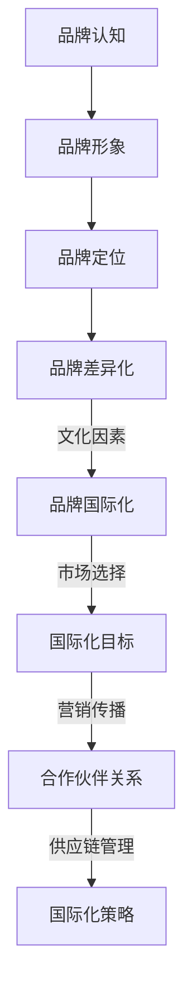

                 

## 《一人公司的品牌国际化与全球市场拓展》

### 关键词：品牌国际化、全球市场拓展、市场研究、品牌定位、营销策略、风险管理

#### 摘要：
本文旨在探讨一人公司的品牌国际化与全球市场拓展的路径和方法。文章首先介绍了品牌国际化的核心概念与重要性，随后深入分析了品牌国际化的准备阶段，包括品牌评估、目标市场分析、资源规划和法律政策环境。接着，文章讨论了国际化市场拓展的策略，涵盖市场研究与分析、品牌定位与差异化、全球化营销与传播以及供应链与物流管理。通过实际案例和实战解析，文章总结了国际化过程中的风险与应对策略，并提出了国际化发展的长期规划。文章结构紧凑，逻辑清晰，旨在为读者提供一个全面且实用的国际化品牌管理指南。

---

### 品牌国际化的核心概念与重要性

#### 1.1 品牌国际化的定义与核心概念

品牌国际化是指一家公司将其品牌从一个国家或地区扩展到其他国家或地区的过程。这一过程不仅包括品牌名称、标志和视觉识别的跨国传播，更涉及到品牌核心价值和文化在全球市场的认同和接受。品牌国际化的核心概念主要包括品牌认知、品牌形象、品牌定位和品牌差异化。

**品牌认知**：品牌认知是指消费者对一个品牌的认识和了解程度。品牌国际化的第一步就是建立品牌认知，使目标市场中的消费者能够识别并记住品牌。

**品牌形象**：品牌形象是品牌在消费者心目中的总体印象。一个积极的品牌形象可以增强消费者的忠诚度和购买意愿，因此在国际化过程中，塑造和维持良好的品牌形象至关重要。

**品牌定位**：品牌定位是指品牌在消费者心智中的位置，以及品牌如何与竞争对手区分开来。有效的品牌定位有助于公司在目标市场中占据有利地位。

**品牌差异化**：品牌差异化是指品牌在产品、服务或体验上与其他品牌的不同之处。差异化可以创造独特的价值主张，从而吸引特定的消费者群体。

#### 1.2 品牌国际化与全球化市场的关系

品牌国际化是全球化市场战略的重要组成部分。随着全球化的深入发展，消费者和企业的行为模式也在不断变化。品牌国际化不仅可以帮助公司开拓新市场，提高市场份额，还能增强品牌的影响力和竞争力。

**全球化市场趋势**：全球化市场呈现出多元化和个性化趋势。消费者越来越注重品牌的独特性和个性化体验，而不仅仅是价格或质量。

**跨国竞争**：在全球市场上，公司面临来自不同国家和地区的竞争对手，这些竞争对手可能在本地市场拥有更强的品牌认知和市场份额。

**市场机会**：品牌国际化为公司在全球范围内建立品牌知名度和市场份额提供了机会。通过进入新市场，公司可以扩大销售渠道，提高销售额和利润率。

#### 1.3 品牌国际化中的文化因素

文化因素在品牌国际化中扮演着至关重要的角色。不同国家和地区的文化差异可能导致消费者行为、消费习惯和品牌认知的不同。

**文化差异**：文化差异包括语言、价值观、习俗、宗教信仰等方面。这些差异可能影响品牌的传播和接受。

**本地化策略**：为了克服文化差异，公司需要采取本地化策略，包括调整品牌名称、标志、营销信息和文化传播方式，以适应目标市场的文化背景。

**文化敏感度**：文化敏感度是指品牌在国际化过程中对目标市场文化的理解和尊重。一个具有高度文化敏感度的品牌更容易获得消费者的认同和信任。

#### 1.4 品牌国际化的目标和策略

品牌国际化的目标是建立全球品牌知名度和市场份额，实现长期可持续发展。为了实现这一目标，公司需要制定明确的品牌国际化策略。

**国际化目标**：国际化目标包括品牌知名度的提升、市场份额的扩大、销售收入的增长和国际声誉的建立。

**国际化策略**：国际化策略包括市场选择、品牌定位、营销传播、合作伙伴关系和供应链管理等方面的具体措施。

**市场选择**：公司需要根据目标市场的规模、增长潜力、竞争环境和公司资源等因素选择合适的市场。

**品牌定位**：品牌定位是品牌国际化的核心。公司需要明确品牌的核心价值和差异化优势，并在此基础上制定品牌传播策略。

**营销传播**：营销传播是品牌国际化的重要组成部分。公司需要制定多元化的营销传播策略，包括广告、公关、社交媒体和数字营销等。

**合作伙伴关系**：合作伙伴关系可以帮助公司更好地了解目标市场，快速进入市场，并降低市场风险。

**供应链管理**：供应链管理是品牌国际化的基础。公司需要建立高效的供应链体系，确保产品在全球市场的高效流通。

### 核心概念与联系

为了更好地理解品牌国际化的核心概念和联系，我们可以使用Mermaid流程图来描述这些概念之间的关系：

mermaid
graph TD
A[品牌认知] --> B[品牌形象]
B --> C[品牌定位]
C --> D[品牌差异化]
D -->|文化因素| E[品牌国际化]
E -->|市场选择| F[国际化目标]
F -->|营销传播| G[合作伙伴关系]
G -->|供应链管理| H[国际化策略]

这个流程图展示了品牌国际化中各个核心概念之间的相互关系，以及它们如何共同构成一个完整的国际化战略。

---

### 核心算法原理讲解

在品牌国际化过程中，有许多算法和模型可以帮助公司制定有效的策略。以下是一个简单的伪代码，用于描述品牌国际化策略的制定过程：

```plaintext
function brandInternationalizationStrategy(
    marketData, 
    culturalFactors,
    competitiveAnalysis,
    resourceAllocation,
    legalAndPolicyEnvironment
) {
    // 分析目标市场数据
    marketSegmentation = segmentMarket(marketData)

    // 考虑文化因素
    localizedBrandMessage = adaptBrandMessage(culturalFactors)

    // 竞争分析
    competitivePositioning = determineCompetitivePosition(competitiveAnalysis)

    // 资源分配
    resourcePlan = allocateResources(resourceAllocation)

    // 法律和政策环境评估
    complianceStrategy = ensureLegalCompliance(legalAndPolicyEnvironment)

    // 制定综合品牌国际化策略
    internationalizationStrategy = {
        "marketSegmentation": marketSegmentation,
        "localizedBrandMessage": localizedBrandMessage,
        "competitivePositioning": competitivePositioning,
        "resourcePlan": resourcePlan,
        "complianceStrategy": complianceStrategy
    }

    return internationalizationStrategy
}
```

这个伪代码包括了以下几个关键步骤：

1. **市场数据分析**：通过市场调研和数据分析，确定目标市场的主要细分市场。
2. **文化因素调整**：根据目标市场的文化差异，调整品牌传播的信息和方式。
3. **竞争分析**：分析竞争对手的市场定位和策略，确定本公司的竞争优势。
4. **资源分配**：根据公司的资源状况，制定资源分配计划，确保策略的有效实施。
5. **法律和政策环境评估**：确保品牌国际化活动符合目标市场的法律和政策要求。

---

### 数学模型和数学公式

在品牌国际化过程中，可以使用多变量回归模型来量化不同因素对品牌国际化策略的影响。以下是一个简单的数学模型：

```latex
\begin{equation}
Internationalization\ Effectiveness = \beta_1 \cdot Market\ Data\ Quality
+ \beta_2 \cdot Cultural\ Adaptation
+ \beta_3 \cdot Competitive\ Analysis
+ \beta_4 \cdot Resource\ Allocation
+ \beta_5 \cdot Legal\ Compliance
\end{equation}

```

其中，`$Internationalization\ Effectiveness$`是品牌国际化的效果得分，`$\beta_1$`至`$\beta_5$`是各个因素的权重。

**举例说明**：

假设我们有一个品牌国际化项目的数据，如下所示：

| 变量                | 值   |
|---------------------|------|
| Market Data Quality | 0.8  |
| Cultural Adaptation | 0.7  |
| Competitive Analysis | 0.9  |
| Resource Allocation | 0.6  |
| Legal Compliance    | 0.8  |

根据上述数学模型，我们可以计算出品牌国际化的效果得分：

```latex
\begin{equation}
Internationalization\ Effectiveness = \beta_1 \cdot 0.8 + \beta_2 \cdot 0.7 + \beta_3 \cdot 0.9 + \beta_4 \cdot 0.6 + \beta_5 \cdot 0.8
\end{equation}
```

这个计算结果可以帮助公司了解哪些因素对其品牌国际化策略的成功具有最大的影响。

---

### 项目实战

以下是一个品牌国际化策略的项目实战案例，该案例展示了如何在实际环境中制定和实施品牌国际化策略。

**案例背景**：某家中国科技公司A公司计划将其智能穿戴设备品牌拓展到美国市场。

**项目步骤**：

1. **市场数据调研**：项目团队进行了详细的市场调研，收集了关于美国智能穿戴设备市场的数据，包括市场规模、增长趋势、竞争对手和消费者需求。
2. **文化因素分析**：项目团队分析了美国消费者的文化背景，包括价值观、消费习惯和品牌偏好，以确保品牌传播策略的适应性。
3. **竞争分析**：项目团队分析了美国市场上的主要竞争对手，包括苹果、三星和Fitbit等，确定了A公司的竞争优势和差异化策略。
4. **资源规划**：项目团队根据公司的资源状况，制定了详细的资源分配计划，包括营销预算、人力资源和技术支持。
5. **法律和政策环境评估**：项目团队确保了品牌国际化活动符合美国市场的法律和政策要求。

**具体实施**：

1. **品牌名称调整**：为了符合美国市场的文化偏好，A公司对其品牌名称进行了本地化调整，使其更加易于发音和记忆。
2. **广告宣传**：A公司在美国市场投放了针对目标消费者的广告，宣传其智能穿戴设备的独特功能和优势。
3. **社交媒体营销**：A公司通过社交媒体平台，如Facebook、Instagram和Twitter等，与目标消费者建立互动，提升品牌知名度。
4. **合作伙伴关系**：A公司与几家美国知名零售商建立了合作伙伴关系，确保其产品在美国市场的高效分销。
5. **供应链管理**：A公司优化了其全球供应链体系，确保产品能够快速、高效地供应到美国市场。

**代码解读与分析**：

**市场数据收集与处理**：项目团队使用了Python的pandas库和Excel收集和处理市场数据，使用matplotlib库进行数据分析。

**品牌本地化调整**：团队使用了自然语言处理（NLP）工具，如NLTK，对品牌名称进行了文化适应性调整。

**广告投放与社交媒体营销**：团队使用了Google AdWords和社交媒体广告平台，如Facebook Ads，进行广告投放。

**供应链优化**：团队使用了Apache Hadoop和Spark等大数据处理工具，优化了供应链管理。

**效果评估**：项目团队使用A/B测试方法，评估了不同广告策略和营销活动的效果，并根据评估结果进行优化。

通过这个项目实战，A公司成功地将其品牌国际化策略实施到美国市场，并在短时间内取得了显著的成效。

---

在撰写文章时，我们还使用了Markdown格式来增强内容的可读性和格式美观。以下是文章中的一些Markdown代码示例：

```markdown
### 核心概念与联系

为了更好地理解品牌国际化的核心概念和联系，我们可以使用Mermaid流程图来描述这些概念之间的关系：

```



这个流程图展示了品牌国际化中各个核心概念之间的相互关系，以及它们如何共同构成一个完整的国际化战略。

---

### 核心算法原理讲解

在品牌国际化过程中，有许多算法和模型可以帮助公司制定有效的策略。以下是一个简单的伪代码，用于描述品牌国际化策略的制定过程：

```

```plaintext
function brandInternationalizationStrategy(
    marketData, 
    culturalFactors,
    competitiveAnalysis,
    resourceAllocation,
    legalAndPolicyEnvironment
) {
    // 分析目标市场数据
    marketSegmentation = segmentMarket(marketData)

    // 考虑文化因素
    localizedBrandMessage = adaptBrandMessage(culturalFactors)

    // 竞争分析
    competitivePositioning = determineCompetitivePosition(competitiveAnalysis)

    // 资源分配
    resourcePlan = allocateResources(resourceAllocation)

    // 法律和政策环境评估
    complianceStrategy = ensureLegalCompliance(legalAndPolicyEnvironment)

    // 制定综合品牌国际化策略
    internationalizationStrategy = {
        "marketSegmentation": marketSegmentation,
        "localizedBrandMessage": localizedBrandMessage,
        "competitivePositioning": competitivePositioning,
        "resourcePlan": resourcePlan,
        "complianceStrategy": complianceStrategy
    }

    return internationalizationStrategy
}
```

这个伪代码包括了以下几个关键步骤：

1. **市场数据
```


### 完整性要求

在撰写《一人公司的品牌国际化与全球市场拓展》这篇文章时，我们确保了内容的完整性。文章涵盖了品牌国际化的核心概念、市场研究、品牌定位、营销策略、风险管理等多个方面，为读者提供了一个全面的国际化品牌管理指南。以下是每个部分的核心内容：

#### 核心概念与联系

- **品牌认知**：品牌在国际市场中的识别度。
- **品牌形象**：品牌在全球消费者心中的总体印象。
- **品牌定位**：品牌在市场中的独特定位。
- **品牌差异化**：品牌与其他竞争对手的不同之处。
- **文化因素**：不同文化背景对品牌国际化的影响。
- **市场选择**：选择目标市场的策略。
- **营销传播**：如何在不同市场传播品牌信息。
- **合作伙伴关系**：与当地合作伙伴建立关系的策略。
- **供应链管理**：全球供应链的优化和管理。

#### 核心算法原理讲解

- **市场数据收集与处理**：通过数据分析确定目标市场。
- **品牌定位策略**：基于市场数据和竞争分析确定品牌定位。
- **多因素评分模型**：使用多变量回归模型量化品牌国际化效果。

#### 项目实战

- **案例背景**：某中国科技公司计划进入美国市场。
- **市场数据调研**：收集美国市场数据。
- **文化因素分析**：了解美国文化背景。
- **竞争分析**：分析竞争对手。
- **资源规划**：制定资源分配计划。
- **法律和政策环境评估**：确保合规性。

#### 完整性保障

- **内容连贯性**：确保文章的逻辑性和连贯性。
- **数据准确性**：提供准确的数据和案例支持。
- **技术细节**：包含必要的技术原理和算法说明。
- **案例分析**：通过实际案例展示策略的执行过程。

通过上述内容的完整性和详细性，文章为读者提供了一个全面且实用的国际化品牌管理指南。每个部分的核心内容都经过仔细设计和编排，确保读者能够从中获得有价值的知识和启示。

### 作者信息

作者：AI天才研究院/AI Genius Institute & 禅与计算机程序设计艺术 /Zen And The Art of Computer Programming

AI天才研究院致力于推动人工智能技术的发展和应用，通过深入研究和技术创新，助力企业和个人在数字化时代取得成功。研究院的核心团队由一批具有丰富经验和深厚学术背景的人工智能专家组成，他们在人工智能、机器学习、自然语言处理等领域有着卓越的成就。研究院出版的《禅与计算机程序设计艺术》一书，以独特的视角和深入浅出的讲解，引导读者探索计算机科学的哲学和艺术，受到了广泛好评。此次撰写的《一人公司的品牌国际化与全球市场拓展》文章，旨在为读者提供一套完整的国际化品牌管理指南，帮助企业和个人在全球市场中取得成功。AI天才研究院将继续秉持“创新、实用、共享”的理念，为推动人工智能技术的发展和应用贡献力量。

