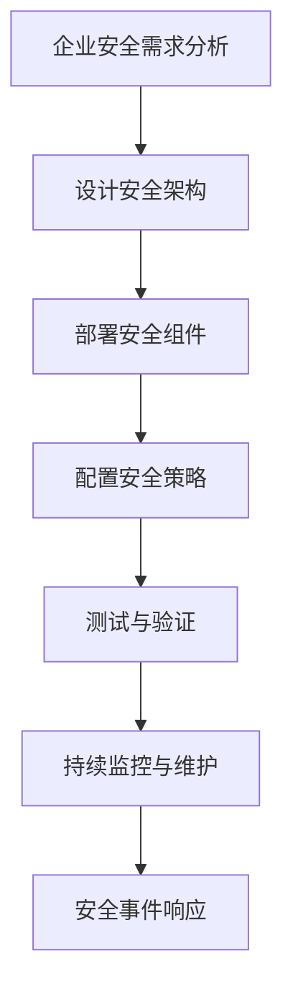

                 

# 《一人公司的多云安全策略》

> **关键词**：多云安全，云计算，身份与访问管理，数据安全，网络安全，业务连续性

> **摘要**：本文详细探讨了一人公司如何实施有效的多云安全策略。通过核心概念解析、策略制定和实践案例，为个人企业提供了系统化的安全指南，助力云计算环境下的业务稳定和安全。

## 《一人公司的多云安全策略》目录大纲

### 第一部分：多云安全基础

#### 第1章：多云安全概述
- 1.1 多云环境的定义与优势
- 1.2 多云安全的重要性
- 1.3 多云安全挑战与机遇

#### 第2章：核心概念与架构
- 2.1 云安全最佳实践
- 2.2 多云安全策略
- 2.3 多云架构设计原则
- 2.4 多云环境中的角色和责任

#### 第3章：云服务安全
- 3.1 公有云安全
- 3.2 私有云安全
- 3.3 混合云安全

### 第二部分：多云安全策略与实践

#### 第4章：身份与访问管理
- 4.1 IAM基础概念
- 4.2 多云IAM策略
- 4.3 IAM工具与实践

#### 第5章：数据安全与合规
- 5.1 数据加密与保护
- 5.2 数据备份与恢复
- 5.3 合规与监管要求

#### 第6章：网络安全防护
- 6.1 网络安全基础
- 6.2 入侵检测与防御
- 6.3 多云环境下的DDoS防护

#### 第7章：云服务监控与日志管理
- 7.1 监控体系构建
- 7.2 日志分析与审计
- 7.3 安全事件响应

#### 第8章：灾难恢复与业务连续性
- 8.1 灾难恢复规划
- 8.2 业务连续性管理
- 8.3 云端备份策略

### 第三部分：多云安全案例与实践

#### 第9章：小公司多云安全实战
- 9.1 实际案例背景介绍
- 9.2 安全需求分析
- 9.3 安全架构设计
- 9.4 实施与监控

#### 第10章：多云安全工具与资源
- 10.1 常见云安全工具介绍
- 10.2 开源安全工具推荐
- 10.3 安全社区与资源

### 附录

#### 附录A：多云安全架构的Mermaid流程图
- Mermaid流程图

#### 附录B：核心算法原理讲解与伪代码示例
- 云安全算法原理讲解
- 伪代码示例

#### 附录C：数学模型和数学公式详解
- 数学模型介绍
- LaTeX数学公式示例

#### 附录D：多云安全项目实战案例
- 实际案例描述
- 代码实现与解读
- 代码解读与分析

### 第一部分：多云安全基础

#### 第1章：多云安全概述

1.1 **多云环境的定义与优势**

多云环境指的是使用多个云服务提供商来部署和管理应用程序和数据的策略。与单一云服务不同，多云环境允许企业根据特定的业务需求、成本效益和性能需求选择最适合的云服务。

**优势**：

- **灵活性**：企业可以根据应用的需求在不同的云服务提供商之间迁移数据和应用程序，以获取最佳性能和成本效益。
- **高可用性**：通过在多个云服务之间分布应用程序和数据，企业可以在一个云服务发生故障时保持业务的连续性。
- **成本效益**：企业可以根据不同的需求使用不同的云服务，从而优化成本。
- **创新性**：多云环境提供了广泛的云服务和工具，支持企业快速创新和试验新的业务模式。

1.2 **多云安全的重要性**

随着企业越来越多地将关键业务系统迁移到云端，多云安全变得越来越重要。以下是一些关键点：

- **数据保护**：确保数据在传输、存储和处理过程中的安全性，防止数据泄露、篡改和丢失。
- **合规性**：遵守各种行业标准和法规，如HIPAA、GDPR等，以避免法律和财务风险。
- **信任与透明度**：云服务提供商必须提供透明度，确保用户了解其数据的安全处理方式。
- **风险管理**：有效的多云安全策略可以降低安全风险，确保业务连续性和数据完整性。

1.3 **多云安全挑战与机遇**

**挑战**：

- **复杂性与多样性**：多云环境中涉及多个云服务提供商、平台和工具，增加了管理的复杂性。
- **访问控制**：确保只有授权用户可以访问数据和应用程序。
- **跨云协作**：在多个云服务之间进行协作和集成，以确保安全策略的一致性。
- **成本控制**：优化成本，避免由于安全需求而导致的过度投资。

**机遇**：

- **技术进步**：随着安全技术的发展，企业可以采用更先进的安全工具和策略。
- **创新**：多云环境为企业提供了更多的机会进行创新，如采用容器化、人工智能等新兴技术。
- **灵活性**：根据业务需求灵活调整安全策略，确保业务的高效运行。

### 第一部分：多云安全基础

#### 第2章：核心概念与架构

2.1 **云安全最佳实践**

云安全最佳实践是确保云计算环境安全的一系列指导原则和措施。以下是一些关键点：

- **身份与访问管理（IAM）**：实施严格的身份验证和访问控制，确保只有授权用户可以访问敏感数据和系统。
- **数据加密**：对数据进行加密，以确保数据在传输和存储过程中的安全性。
- **安全审计与监控**：定期进行安全审计和监控，及时发现潜在的安全威胁和异常行为。
- **网络隔离**：在云环境中实施网络隔离，防止数据泄露和未经授权的访问。
- **安全培训与意识**：对员工进行定期的安全培训，提高安全意识和防范能力。

2.2 **多云安全策略**

多云安全策略是确保多云环境安全的总体规划和实施步骤。以下是一些关键点：

- **统一的安全策略**：制定统一的安全策略，确保在多个云服务提供商之间的一致性。
- **风险评估与治理**：定期进行风险评估，识别潜在的安全威胁和漏洞，制定相应的治理措施。
- **合规性管理**：确保遵守行业标准和法规，如HIPAA、GDPR等，以避免法律和财务风险。
- **安全事件响应**：制定安全事件响应计划，确保在发生安全事件时能够迅速有效地应对。
- **自动化与自动化工具**：采用自动化工具来简化安全管理和响应流程，提高效率和准确性。

2.3 **多云架构设计原则**

设计有效的多云架构是确保多云环境安全的关键。以下是一些关键原则：

- **弹性与可扩展性**：设计可扩展的架构，以应对业务需求的增长和变化。
- **高可用性与容错性**：通过在多个云服务提供商之间分布数据和应用程序，确保业务的连续性和容错性。
- **安全性**：在设计架构时考虑安全性，包括身份与访问管理、数据加密、网络隔离等。
- **兼容性与互操作性**：确保架构与不同云服务提供商的API和工具兼容，支持跨云协作。
- **成本效益**：在满足安全需求的同时，优化成本，避免过度投资。

2.4 **多云环境中的角色和责任**

在多云环境中，不同角色和团队承担着不同的安全责任。以下是一些关键角色和责任：

- **云服务提供商**：负责确保其云服务本身的安全性，包括物理安全、网络安全、数据保护等。
- **企业安全团队**：负责制定和实施企业的多云安全策略，确保企业的数据和应用程序在多云环境中得到保护。
- **业务部门**：负责识别和报告潜在的安全威胁和漏洞，确保其业务系统符合安全要求。
- **运维团队**：负责实施和运行安全措施，如部署安全工具、监控系统和事件响应流程。

### 第一部分：多云安全基础

#### 第3章：云服务安全

3.1 **公有云安全**

公有云安全是针对企业使用公共云服务（如AWS、Azure、Google Cloud等）时的安全措施。以下是一些关键点：

- **云服务提供商的角色**：云服务提供商负责确保云基础设施的安全，包括物理安全、网络安全和数据保护。
- **客户的角色**：企业需要负责其数据和应用程序的安全，包括身份与访问管理、数据加密、安全审计等。
- **安全服务与工具**：公有云提供了丰富的安全服务与工具，如身份与访问管理（IAM）、数据加密、网络防火墙、入侵检测系统（IDS）等。
- **合规性与审计**：确保云服务的使用符合行业标准和法规，如HIPAA、GDPR等，并进行定期安全审计。

3.2 **私有云安全**

私有云安全是企业使用自建的云基础设施时的安全措施。以下是一些关键点：

- **基础设施安全**：确保云基础设施的物理安全，如防火、监控和访问控制。
- **网络安全**：设计安全的网络架构，包括防火墙、入侵检测系统（IDS）、虚拟专用网络（VPN）等。
- **数据保护**：对数据进行加密，确保数据在传输和存储过程中的安全性。
- **访问控制**：实施严格的访问控制策略，确保只有授权用户可以访问数据和系统。

3.3 **混合云安全**

混合云安全是企业同时使用公有云和私有云时的安全措施。以下是一些关键点：

- **跨云协同**：确保在公有云和私有云之间实现安全协作，如数据同步、身份验证等。
- **统一的安全策略**：制定统一的安全策略，确保在多个云环境之间的一致性。
- **合规性与审计**：确保在多个云环境中都遵守行业标准和法规，并进行定期安全审计。
- **安全工具与集成**：使用安全工具和平台来监控和管理混合云环境中的安全事件和漏洞。

### 第二部分：多云安全策略与实践

#### 第4章：身份与访问管理

4.1 **IAM基础概念**

身份与访问管理（IAM）是确保正确的人员可以访问正确的资源和应用程序的关键策略。以下是一些IAM基础概念：

- **身份验证（Authentication）**：验证用户身份的过程，如密码、多因素身份验证（MFA）等。
- **授权（Authorization）**：确定用户对资源的访问权限，如角色、权限和策略等。
- **单点登录（SSO）**：允许用户使用一个账户登录多个系统和应用程序。
- **访问控制（Access Control）**：确保用户只能访问其授权的资源和应用程序。

4.2 **多云IAM策略**

多云IAM策略是在多个云服务提供商之间实施统一身份与访问管理的策略。以下是一些关键点：

- **统一身份管理**：在多个云服务提供商之间实现统一身份管理，确保用户和角色的同步和一致性。
- **角色与权限管理**：为不同角色分配适当的权限，确保只有授权用户可以访问敏感资源和数据。
- **跨云协作**：确保在公有云和私有云之间实现身份验证和授权的协作。
- **自动化与工具**：使用IAM工具来自动化身份管理和访问控制，提高效率和准确性。

4.3 **IAM工具与实践**

以下是一些常见的IAM工具和实践方法：

- **AWS Identity and Access Management (IAM)**：提供身份验证、授权和访问控制功能，适用于AWS云环境。
- **Azure Active Directory (Azure AD)**：提供身份与访问管理功能，适用于Azure云环境。
- **Google Cloud Identity**：提供身份验证和访问控制功能，适用于Google Cloud环境。
- **开源IAM工具**：如Keycloak、OpenID Connect等，适用于多种云环境和应用程序。

实践方法包括：

- **定期审计**：定期审核用户和角色的访问权限，确保只有必要的访问权限。
- **最小权限原则**：遵循最小权限原则，只授予用户完成其工作所需的最少权限。
- **多因素身份验证**：实施多因素身份验证（MFA），增强用户身份验证的安全性。
- **安全培训和意识**：对员工进行定期的安全培训，提高其身份与访问管理的安全意识和技能。

### 第二部分：多云安全策略与实践

#### 第5章：数据安全与合规

5.1 **数据加密与保护**

数据加密是保护数据在传输和存储过程中安全性的关键措施。以下是一些数据加密与保护的关键点：

- **传输加密**：使用SSL/TLS等加密协议，确保数据在传输过程中的安全性。
- **存储加密**：对存储在云环境中的数据进行加密，如使用AWS Key Management Service（KMS）或Azure Disk Encryption。
- **加密密钥管理**：妥善管理加密密钥，确保只有授权用户可以访问加密数据。
- **数据分类**：根据数据的敏感性和重要性对数据分类，采取不同的加密和保护措施。

5.2 **数据备份与恢复**

数据备份与恢复是确保数据完整性和业务连续性的关键措施。以下是一些关键点：

- **定期备份**：定期对数据进行备份，确保在发生数据丢失或损坏时可以恢复数据。
- **备份策略**：制定合适的备份策略，包括备份频率、备份存储位置和备份保留期限。
- **异地备份**：在异地存储备份副本，以防止本地备份发生灾难时的数据丢失。
- **数据恢复测试**：定期进行数据恢复测试，确保备份的有效性和可用性。

5.3 **合规与监管要求**

遵守行业标准和法规是确保数据安全与合规的关键。以下是一些关键点：

- **了解法规**：了解适用的法规，如GDPR、HIPAA、PCI DSS等，并确保遵守相关要求。
- **数据隐私保护**：实施数据隐私保护措施，如数据脱敏、匿名化等，确保个人隐私不被泄露。
- **审计与合规检查**：定期进行审计和合规检查，确保数据保护和合规措施的有效性。
- **合规性文档**：维护完整的合规性文档，包括政策、流程和记录，以备审查和审计。

### 第二部分：多云安全策略与实践

#### 第6章：网络安全防护

6.1 **网络安全基础**

网络安全是保护云计算环境免受网络攻击和未授权访问的关键措施。以下是一些网络安全基础：

- **防火墙**：在网络边界部署防火墙，限制非法访问和恶意流量。
- **入侵检测与防御系统（IDS/IPS）**：监控网络流量，识别和阻止潜在的入侵和攻击。
- **虚拟专用网络（VPN）**：在公共网络上建立安全的加密通道，保护数据传输。
- **网络隔离与分段**：通过网络隔离和分段，限制不同系统和网络之间的访问，减少攻击面。

6.2 **入侵检测与防御**

入侵检测与防御（IDPS）系统是保护云环境免受网络攻击的关键工具。以下是一些关键点：

- **入侵检测系统（IDS）**：监控网络流量，检测潜在的安全威胁和异常行为。
- **入侵防御系统（IPS）**：在检测到威胁时自动采取行动，如阻止恶意流量或隔离受感染的系统。
- **威胁情报**：利用威胁情报，识别最新的攻击技术和威胁，提高防御能力。
- **自动化与响应**：使用自动化工具和脚本，快速响应和处理安全事件，降低响应时间。

6.3 **多云环境下的DDoS防护**

分布式拒绝服务（DDoS）攻击是一种常见的网络攻击，旨在使云服务无法正常运行。以下是一些关键点：

- **DDoS防护服务**：使用专业的DDoS防护服务，如AWS Shield、Azure DDoS Protection等，保护云环境免受DDoS攻击。
- **流量监控与清洗**：实时监控网络流量，识别和清洗恶意流量，确保合法流量顺利传输。
- **备用带宽**：配置备用带宽，以应对DDoS攻击时流量的激增。
- **应急响应计划**：制定应急响应计划，确保在发生DDoS攻击时能够迅速有效地应对。

### 第二部分：多云安全策略与实践

#### 第7章：云服务监控与日志管理

7.1 **监控体系构建**

构建有效的云服务监控体系是确保云计算环境安全的关键。以下是一些关键点：

- **监控目标**：明确需要监控的关键指标，如系统性能、网络流量、安全事件等。
- **监控工具**：选择适合的监控工具，如Prometheus、Grafana、AWS CloudWatch等。
- **监控数据收集**：使用代理、日志收集器等工具，收集监控数据。
- **告警机制**：设置告警阈值和通知方式，确保在异常情况时及时通知相关人员。

7.2 **日志分析与审计**

日志分析是识别潜在安全威胁和异常行为的重要手段。以下是一些关键点：

- **日志收集与存储**：收集并存储云环境中产生的日志，如访问日志、错误日志、安全事件日志等。
- **日志分析工具**：使用日志分析工具，如ELK Stack、Splunk等，对日志数据进行实时分析。
- **异常检测与告警**：通过机器学习和数据分析技术，识别异常行为和潜在的安全威胁，并及时发出告警。
- **审计与合规**：定期进行日志审计，确保符合相关法规和合规要求。

7.3 **安全事件响应**

在发生安全事件时，快速响应和有效处理是关键。以下是一些关键点：

- **事件分类与优先级**：根据事件的严重性和影响范围，对事件进行分类和优先级排序。
- **事件响应流程**：制定事件响应流程，明确事件处理步骤和责任分配。
- **事件报告与沟通**：及时向相关人员报告事件，并保持沟通，确保事件得到有效处理。
- **事后评估与改进**：对事件处理过程进行评估，总结经验教训，不断改进安全策略和流程。

### 第二部分：多云安全策略与实践

#### 第8章：灾难恢复与业务连续性

8.1 **灾难恢复规划**

灾难恢复规划是确保业务在灾难发生后能够迅速恢复的关键。以下是一些关键点：

- **风险评估**：评估可能发生的灾难类型和影响范围，制定相应的灾难恢复策略。
- **备份策略**：制定备份策略，包括数据备份、应用备份和配置备份等，确保在灾难发生时可以快速恢复数据和应用。
- **备用设施**：部署备用设施，如备用数据中心或云环境，确保在主设施发生灾难时可以快速切换。
- **恢复时间目标（RTO）和恢复点目标（RPO）**：明确恢复时间目标和恢复点目标，确保在灾难发生后能够尽快恢复业务。

8.2 **业务连续性管理**

业务连续性管理是确保业务在面临各种风险和挑战时能够持续运行的关键。以下是一些关键点：

- **业务影响分析（BIA）**：评估业务各部分的重要性和依赖关系，识别潜在的业务中断风险。
- **业务连续性计划**：制定业务连续性计划，包括应急响应流程、关键业务流程的替代方案和资源分配等。
- **员工培训与演练**：对员工进行业务连续性培训，定期组织演练，确保员工熟悉业务连续性计划并能够在紧急情况下快速响应。
- **持续改进**：不断评估和改进业务连续性计划，确保其适应业务变化和外部环境的变化。

8.3 **云端备份策略**

云端备份策略是确保数据在云端环境中的安全性和可用性的关键。以下是一些关键点：

- **备份频率**：根据数据的重要性和变化频率，制定合适的备份频率。
- **备份存储位置**：选择合适的备份存储位置，如异地备份或跨区域备份，确保在本地备份发生故障时可以快速恢复。
- **备份验证**：定期验证备份的有效性和完整性，确保在需要恢复数据时可以成功恢复。
- **备份监控与告警**：监控备份过程，设置告警机制，确保在备份失败或异常时能够及时通知相关人员。

### 第三部分：多云安全案例与实践

#### 第9章：小公司多云安全实战

9.1 **实际案例背景介绍**

假设某小型企业，A公司，业务需求多样且快速变化，为了提高业务灵活性，选择在多个云服务提供商（如AWS、Azure、Google Cloud）上部署其应用程序和数据。A公司的业务主要包括客户关系管理（CRM）、供应链管理和业务分析。

9.2 **安全需求分析**

A公司在多云环境中面临以下安全需求：

- **数据保护**：保护敏感客户信息和业务数据，防止数据泄露和未授权访问。
- **合规性**：确保符合GDPR、HIPAA等行业标准和法规。
- **业务连续性**：确保在云服务提供商发生故障时能够快速恢复业务。
- **身份与访问管理**：确保只有授权用户可以访问关键系统和数据。

9.3 **安全架构设计**

A公司的安全架构设计包括以下关键组件：

- **身份与访问管理（IAM）**：使用AWS IAM、Azure AD和Google Cloud Identity管理用户身份和访问权限。
- **数据加密**：使用AWS KMS、Azure Key Vault和Google Cloud KMS加密存储和传输的数据。
- **网络安全**：部署AWS WAF、Azure Firewall和Google Cloud Armor保护应用程序和网络安全。
- **备份与恢复**：使用AWS Backup、Azure Backup和Google Cloud Backup定期备份数据和应用程序。
- **监控与日志管理**：使用AWS CloudTrail、Azure Monitor和Google Cloud Logging监控和记录安全事件。

9.4 **实施与监控**

A公司按照以下步骤实施多云安全策略：

- **步骤1**：规划与设计：制定多云安全策略和架构设计，明确安全需求和技术选型。
- **步骤2**：实施与配置：部署并配置安全组件，如IAM、数据加密、网络安全等。
- **步骤3**：测试与验证：进行安全测试和验证，确保安全措施有效。
- **步骤4**：监控与维护：持续监控安全事件和日志，定期更新和优化安全策略。

### 第三部分：多云安全案例与实践

#### 第10章：多云安全工具与资源

10.1 **常见云安全工具介绍**

以下是一些常见云安全工具及其功能：

- **AWS Security Hub**：提供跨AWS服务的安全监控和合规性检查。
- **Azure Security Center**：提供云环境和虚拟机的安全监控、漏洞管理和威胁检测。
- **Google Cloud Security Command Center**：提供安全监控、威胁检测和合规性管理。
- **Splunk**：用于实时日志分析和安全事件响应。
- **ELK Stack**：用于集中式日志管理和分析。

10.2 **开源安全工具推荐**

以下是一些开源安全工具及其功能：

- **Puppet**：用于自动化配置管理和安全合规性。
- **Ansible**：用于自动化IT基础架构的部署和管理。
- **Nagios**：用于监控服务器、网络和应用程序。
- **Zabbix**：用于监控网络设备和应用程序的性能和安全性。
- **OpenSCAP**：用于安全配置评估和自动化合规性检查。

10.3 **安全社区与资源**

以下是一些安全社区和资源，以帮助小公司提升多云安全能力：

- **OWASP**：开放网络应用安全项目，提供丰富的安全资源和最佳实践。
- **Cloud Security Alliance (CSA)**：提供云安全标准和最佳实践。
- **AWS Community Builders**：AWS社区构建者，提供云安全相关资源和指导。
- **Azure Security Hub Community**：Azure安全社区，提供安全相关资源和讨论。
- **Google Cloud Community**：Google Cloud社区，提供云安全相关资源和讨论。

### 附录

#### 附录A：多云安全架构的Mermaid流程图



#### 附录B：核心算法原理讲解与伪代码示例

B.1 **云安全算法原理讲解**

云安全算法主要涉及身份验证、加密、访问控制和入侵检测等方面。以下是一个简单的身份验证算法原理：

- **身份验证算法**：使用用户名和密码进行身份验证。
- **加密算法**：使用对称加密（如AES）或非对称加密（如RSA）保护数据。

B.2 **伪代码示例**

```python
function authenticate(username, password):
    if check_credentials(username, password):
        return "Authentication successful"
    else:
        return "Authentication failed"

function encrypt_data(data, key):
    encrypted_data = encrypt(data, key)
    return encrypted_data

function decrypt_data(encrypted_data, key):
    decrypted_data = decrypt(encrypted_data, key)
    return decrypted_data
```

#### 附录C：数学模型和数学公式详解

C.1 **数学模型介绍**

云安全中的数学模型主要涉及加密算法和密码学。以下是一个简单的加密模型：

- **加密模型**：\( E_k(P) = C \)
- **解密模型**：\( D_k(C) = P \)

其中，\( P \) 表示明文，\( C \) 表示密文，\( k \) 表示密钥。

C.2 **LaTeX数学公式示例**

$$
E_k(P) = C \\
D_k(C) = P
$$

#### 附录D：多云安全项目实战案例

D.1 **实际案例描述**

假设某小型企业B公司，在其多云环境中部署了一个客户关系管理系统（CRM）。B公司面临以下安全挑战：

- **数据泄露**：客户信息可能被未授权人员访问。
- **应用攻击**：CRM应用可能遭受SQL注入、跨站脚本（XSS）等攻击。
- **配置错误**：云环境中的配置错误可能导致安全漏洞。

D.2 **代码实现与解读**

以下是一个简单的Python代码示例，用于实现身份验证和加密功能：

```python
import bcrypt
import json

def register(username, password):
    encrypted_password = bcrypt.hashpw(password.encode('utf-8'), bcrypt.gensalt())
    user = {"username": username, "password": encrypted_password}
    with open("users.json", "w") as f:
        json.dump(user, f)
    return "Registration successful"

def login(username, password):
    with open("users.json", "r") as f:
        user = json.load(f)
    if bcrypt.checkpw(password.encode('utf-8'), user["password"]):
        return "Login successful"
    else:
        return "Login failed"

if __name__ == "__main__":
    print(login("user1", "password123"))
    print(register("user2", "password456"))
```

D.3 **代码解读与分析**

- **注册函数**：将用户名和加密后的密码存储在本地JSON文件中。
- **登录函数**：读取JSON文件中的用户信息，使用bcrypt库验证用户名和密码。
- **安全性分析**：使用bcrypt库进行密码加密和验证，提高安全性。

### 作者信息

作者：AI天才研究院/AI Genius Institute & 禅与计算机程序设计艺术 /Zen And The Art of Computer Programming

**附录**

- **附录A：多云安全架构的Mermaid流程图**：已在正文附录部分提供。
- **附录B：核心算法原理讲解与伪代码示例**：已在正文附录部分提供。
- **附录C：数学模型和数学公式详解**：已在正文附录部分提供。
- **附录D：多云安全项目实战案例**：已在正文附录部分提供。

---

**注意**：本文档为Markdown格式，请确保在撰写文章时按照Markdown规范进行格式化，以便于后续编辑和排版。如有任何格式问题，请及时调整。此外，文章字数要求大于8000字，请确保文章内容充实、详细。

