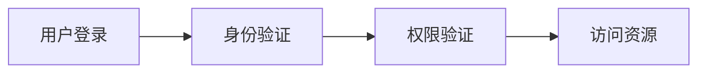
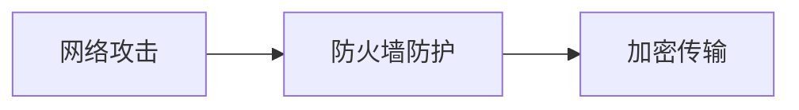

                 

### 云安全最佳实践：保护云端数据和应用程序

> **关键词：** 云安全，云计算，数据加密，身份和访问管理，网络防护，合规性管理

> **摘要：** 本文将深入探讨云安全的重要性，详细阐述云安全的基本概念、架构设计、安全威胁分析、防护技术、运维和监控、合规性管理以及最佳实践。通过实际的案例研究和详细的技术解释，为读者提供一整套全面的云安全保护策略。

#### 第1章: 云安全概述

##### 1.1 云安全的重要性

**云安全的定义**

云安全是指保障云服务提供商及其用户数据、应用程序和基础设施的安全。随着云计算的普及，云安全已成为企业、政府和个人用户关注的焦点。

**云计算的安全挑战**

- **多租户环境下的隐私保护**：在多租户环境中，如何确保每个用户的隐私和数据安全是一个重要挑战。
- **云服务提供商的责任划分**：明确云服务提供商和用户在安全方面的责任和权限。
- **数据传输和存储的安全性**：保障数据在传输和存储过程中的安全。
- **合规性问题**：遵循各种安全法规和标准，如GDPR、HIPAA等。
- **云服务的动态性**：应对云服务中的不断变化和挑战。

**云安全的基本原则**

- **安全性**：确保数据、应用程序和基础设施的安全。
- **可用性**：保证服务的持续可用性。
- **可靠性**：确保服务的稳定运行。
- **合规性**：符合各种安全法规和标准。

**云安全的重要性案例**

某公司因云安全漏洞导致数据泄露，损失数百万美元。这一事件凸显了云安全的重要性。确保云安全不仅有助于保护企业的数据资产，还能增强用户对云服务的信任。

#### 第2章: 云安全的基本概念

##### 2.1 数据加密

**对称加密与非对称加密**

- **对称加密**：加密和解密使用相同的密钥。
- **非对称加密**：加密和解密使用不同的密钥。

**加密算法的应用**

使用AES加密存储用户密码。

**伪代码：**

```python
def symmetric_encrypt(plaintext, key):
    ciphertext = ...
    return ciphertext

def asymmetric_encrypt(plaintext, public_key):
    ciphertext = ...
    return ciphertext
```

##### 2.2 身份和访问管理

**身份验证**：用户身份验证机制，如密码、双因素认证。

**访问控制**：基于角色的访问控制（RBAC）和基于属性的访问控制（ABAC）。

**单点登录（SSO）**：简化用户登录流程。

**身份管理和访问管理的关系**

**Mermaid流程图：**



##### 2.3 网络安全

**虚拟专用网络（VPN）**：建立安全的网络连接。

**防火墙和入侵检测系统（IDS）**：防御网络攻击。

**网络分段**：将网络划分为多个安全区域。

**网络安全与数据加密的关系**

**Mermaid流程图：**



##### 2.4 安全策略和合规性

**安全策略的制定**：包括访问控制策略、数据保护策略等。

**合规性要求**：如GDPR、HIPAA等。

**合规性检查与审计**：确保符合相关法规。

#### 第3章: 云服务模型的安全性

##### 3.1 IaaS（基础设施即服务）的安全性

- **基础硬件保护**：云服务提供商负责物理服务器和数据中心的安全。
- **虚拟化安全技术**：如虚拟机监控器（VMM）和容器化技术。
- **IaaS安全最佳实践**：如定期更新系统和软件。

##### 3.2 PaaS（平台即服务）的安全性

- **平台级安全功能**：如自动化的安全检测和修复。
- **开发者责任**：开发者需确保应用程序的安全。
- **PaaS安全优势**：如易于部署和安全性的高可靠性。

##### 3.3 SaaS（软件即服务）的安全性

- **数据安全**：如加密存储和传输。
- **访问控制**：如基于角色的访问控制。
- **SaaS安全挑战**：如依赖第三方提供商。

#### 第4章: 云安全标准和法规

##### 4.1 云安全标准的概述

- **ISO/IEC 27001**：信息安全管理体系标准。
- **ISO/IEC 27017**：云计算信息安全控制标准。
- **ISO/IEC 27018**：个人数据保护标准。

##### 4.2 各国云安全法规对比

- **欧盟**：GDPR（通用数据保护条例）。
- **美国**：HIPAA（健康保险可携性和责任法案）。
- **中国**：信息安全法。

##### 4.3 企业如何合规

- **合规性评估**：评估企业是否符合相关法规。
- **合规性培训**：确保员工了解合规要求。
- **合规性审计**：定期进行内部和外部审计。

#### 第5章: 云安全架构设计

##### 5.1 云安全架构概述

- **云安全架构的组成部分**：身份和访问管理、数据保护和加密、网络隔离和防火墙、安全信息和事件管理（SIEM）、备份和恢复。
- **云安全架构的设计原则**：最小权限原则、防御深度原则、持续改进原则。

##### 5.2 云安全防护层次

- **外部防护**：防止外部攻击，如DDoS防护。
- **应用层防护**：防止应用层攻击，如SQL注入。
- **数据层防护**：保护存储在数据库中的数据。
- **运维监控**：监控云环境中的异常行为和事件。

##### 5.3 云安全策略

- **安全策略的制定**：包括风险评估、安全需求分析、安全策略制定。
- **安全策略的实施**：配置管理、培训和教育、审计和监控。
- **安全策略评估与更新**：定期评估安全策略的有效性，更新安全策略。

##### 5.4 云安全架构案例分析

- **案例一：某大型企业云安全架构设计**
  - 背景和目标：企业面临多个业务部门对云服务的需求，设计安全、可靠且灵活的云安全架构。
  - 方案：多层安全防护，自动化安全工具，定期安全评估和更新。

- **案例二：某政府机构云安全架构优化**
  - 背景和目标：政府机构需要保护敏感数据，提高服务可用性，优化现有云安全架构。
  - 方案：引入加密存储、自动化安全监控和改进访问控制策略。

#### 第6章: 云计算安全威胁分析

##### 6.1 常见云安全威胁

- **DDoS攻击**：分布式拒绝服务攻击，旨在使目标系统瘫痪。
- **数据泄露**：未经授权的人员访问、窃取或泄露敏感数据。
- **身份盗用**：攻击者通过非法手段获取用户的身份信息，冒充用户进行操作。
- **恶意软件**：旨在损害计算机系统或网络的程序或代码。

##### 6.2 云安全攻击技术

- **漏洞利用**：攻击者利用系统中的漏洞来执行未经授权的操作。
- **恶意代码**：旨在执行恶意操作的代码。
- **社会工程**：利用人类心理弱点进行欺骗，以获取敏感信息或权限。
- **恶意内部人员**：利用其职位权限执行恶意操作的人员。

##### 6.3 云安全威胁案例分析

- **案例一：某企业云服务器遭受DDoS攻击**
  - 事件和影响：企业服务器遭受大规模DDoS攻击，导致业务中断。
  - 应对措施：启用DDoS防护服务，过滤恶意流量，分析攻击原因，更新安全策略。

- **案例二：某政府云平台数据泄露事件**
  - 事件和影响：政府云平台发生数据泄露，涉及大量敏感数据。
  - 应对措施：调查取证，修复漏洞，加强身份验证和访问控制，通知公众。

### 第7章: 云安全防护技术

#### 7.1 网络防护技术

**防火墙**：保护网络边界，过滤恶意流量。

**入侵检测系统（IDS）**：实时检测网络攻击。

**入侵防御系统（IPS）**：自动阻止网络攻击。

**网络隔离和分段**：隔离不同安全域，限制访问。

#### 7.2 数据防护技术

**数据加密**：加密存储和传输的数据。

**数据备份和恢复**：定期备份数据，确保数据可用性。

**数据脱敏**：对敏感数据进行脱敏处理。

**数据访问控制**：基于身份和权限控制对数据的访问。

#### 7.3 应用防护技术

**应用防火墙**：防止应用层攻击。

**Web应用程序防火墙（WAF）**：保护Web应用程序。

**安全编码实践**：确保应用程序的安全。

**漏洞扫描和修复**：定期扫描漏洞并修复。

#### 7.4 身份和访问管理

**单点登录（SSO）**：简化用户登录流程。

**多因素认证（MFA）**：增强身份验证。

**权限管理和审计**：确保用户权限合理，并监控访问行为。

#### 7.5 安全信息和事件管理（SIEM）

**安全事件监控**：实时监控和响应安全事件。

**日志管理和分析**：收集和分析日志数据。

**安全报告和合规性**：生成安全报告，确保合规性。

### 第8章: 云安全运维和监控

#### 8.1 云安全运维概述

**云安全运维的定义**：云安全运维是指确保云环境中的安全和持续运行。

**云安全运维的目标**：保护云资源，防止安全事件，确保业务连续性。

#### 8.2 云安全运维流程

**安全需求分析**：确定云环境的安全需求。

**安全策略制定**：制定具体的云安全策略。

**安全配置管理**：确保云资源的配置符合安全要求。

**安全监控与审计**：实时监控云环境的安全状况，并进行审计。

#### 8.3 云安全监控工具

**云监控服务**：如AWS CloudWatch、Azure Monitor。

**安全信息与事件管理（SIEM）**：集成多种安全数据，提供综合监控。

**日志分析工具**：如ELK Stack、Splunk。

#### 8.4 云安全运维案例分析

**案例一：某企业云环境安全监控实施**

**背景和目标**：企业需要实时监控云环境中的安全事件。

**方案**：采用SIEM工具，集成云监控服务和日志分析工具。

**案例二：某政府机构云安全运维优化**

**背景和目标**：政府机构需要提高云安全运维的效率。

**方案**：引入自动化运维工具，加强安全审计和监控。

### 第9章: 云安全合规性管理

#### 9.1 云安全合规性概述

**合规性的定义**：合规性是指企业遵循相关法律法规和行业标准。

**合规性的重要性**：确保数据安全，避免法律风险。

#### 9.2 云安全合规性要求

**ISO/IEC 27001**：信息安全管理体系标准。

**ISO/IEC 27017**：云计算信息安全控制标准。

**ISO/IEC 27018**：个人数据保护标准。

**GDPR**：欧盟的通用数据保护条例。

**HIPAA**：美国的健康保险可携性和责任法案。

#### 9.3 云安全合规性管理

**合规性评估**：评估云服务提供商的合规性。

**合规性控制**：实施合规性控制措施，如数据加密和访问控制。

**合规性审计**：定期进行内部和外部审计。

#### 9.4 云安全合规性案例分析

**案例一：某金融机构云安全合规性实施**

**背景和目标**：金融机构需要确保云环境符合金融行业的合规要求。

**方案**：采用ISO/IEC 27001和ISO/IEC 27017标准，进行定期审计。

**案例二：某政府机构云安全合规性优化**

**背景和目标**：政府机构需要提高云环境的合规性。

**方案**：引入自动化合规性检查工具，加强合规性培训。

### 第10章: 云安全最佳实践

#### 10.1 云安全最佳实践概述

**云安全最佳实践的定义**：云安全最佳实践是指根据行业经验和最佳标准，实现云环境的安全管理。

**云安全最佳实践的重要性**：确保云环境的安全性和合规性。

#### 10.2 云安全最佳实践

**安全需求分析**：详细评估云环境的安全需求。

**安全策略制定**：制定具体的云安全策略，包括访问控制、数据保护和合规性要求。

**安全配置管理**：确保云资源的配置符合安全要求。

**安全培训和教育**：提高员工的安全意识和技能。

**安全监控和响应**：实时监控安全事件，并迅速响应。

#### 10.3 云安全最佳实践案例分析

**案例一：某企业云安全最佳实践实施**

**背景和目标**：企业需要确保云环境的安全性和合规性。

**方案**：采用ISO/IEC 27001和ISO/IEC 27017标准，进行安全配置管理和监控。

**案例二：某政府机构云安全最佳实践优化**

**背景和目标**：政府机构需要提高云安全管理的效率。

**方案**：引入自动化工具和流程，加强安全培训和监控。

### 第11章: 云安全展望与未来趋势

#### 11.1 云安全发展趋势

**云计算的持续普及**：更多企业采用云计算服务。

**安全合规性要求提高**：各国政府和行业对云安全合规性的要求日益严格。

**自动化和人工智能的应用**：自动化工具和人工智能技术将在云安全中发挥更大作用。

#### 11.2 云安全关键技术

**区块链技术**：提供透明和不可篡改的数据存储。

**量子加密技术**：增强数据传输和存储的安全性。

**智能合约**：提高自动化和安全性。

#### 11.3 云安全面临的挑战

**多租户环境下的隐私保护**：如何更好地保护多租户环境中的用户隐私。

**快速变化的安全威胁**：如何快速应对新的安全威胁。

**合规性挑战**：如何在复杂的合规性环境中保持合规。

### 第12章: 附录

#### 12.1 云安全工具和资源指南

**A.1 常见云安全工具**

- **防火墙**：如AWS Firewall Manager、Azure Firewall。
- **入侵检测和防御系统**：如AWS GuardDuty、Azure Security Center。
- **Web应用程序防火墙（WAF）**：如AWS WAF、Azure WAF。
- **数据加密工具**：如AWS KMS、Azure Key Vault。
- **日志管理工具**：如AWS CloudWatch Logs、Azure Monitor Logs。
- **漏洞扫描工具**：如AWS Inspector、Azure Security Center。
- **身份和访问管理**：如AWS IAM、Azure AD。

**A.2 云安全标准和最佳实践**

- **ISO/IEC 27001**：信息安全管理体系标准。
- **ISO/IEC 27017**：云计算信息安全控制标准。
- **ISO/IEC 27018**：个人数据保护标准。
- **GDPR**：欧盟的通用数据保护条例。
- **NIST CSF**：美国国家标准与技术研究院的云安全框架。
- **OWASP**：开源Web安全项目。

**A.3 云安全资源推荐**

- **云安全社区和论坛**：如Cloud Security Alliance、OWASP。
- **云安全博客和文章**：如AWS Security Blog、Microsoft Azure Security Blog。
- **云安全培训和认证**：如Certified Cloud Security Professional（CCSP）、Certified Information Systems Security Professional（CISSP）。
- **云安全工具和资源库**：如GitHub上的云安全工具库。

**A.4 云安全术语解释**

- **云安全**：保障云服务提供商及其用户数据、应用程序和基础设施的安全。
- **云计算**：通过互联网提供计算资源和服务。
- **IaaS**：基础设施即服务，提供虚拟化硬件资源。
- **PaaS**：平台即服务，提供开发和部署环境。
- **SaaS**：软件即服务，提供软件应用。
- **DDoS**：分布式拒绝服务攻击，旨在使目标系统瘫痪。
- **SIEM**：安全信息和事件管理，集成安全数据并提供监控和分析。
- **MFA**：多因素认证，增加身份验证的安全性。
- **RBAC**：基于角色的访问控制，根据角色分配权限。
- **ABAC**：基于属性的访问控制，根据属性和条件分配权限。
- **VPN**：虚拟专用网络，提供安全的网络连接。

### 作者：AI天才研究院/AI Genius Institute & 禅与计算机程序设计艺术 /Zen And The Art of Computer Programming

---

**附录 A: 云安全工具和资源指南**

#### **A.1 常见云安全工具**

- **防火墙**：如AWS Firewall Manager、Azure Firewall。
- **入侵检测和防御系统**：如AWS GuardDuty、Azure Security Center。
- **Web应用程序防火墙（WAF）**：如AWS WAF、Azure WAF。
- **数据加密工具**：如AWS KMS、Azure Key Vault。
- **日志管理工具**：如AWS CloudWatch Logs、Azure Monitor Logs。
- **漏洞扫描工具**：如AWS Inspector、Azure Security Center。
- **身份和访问管理**：如AWS IAM、Azure AD。

#### **A.2 云安全标准和最佳实践**

- **ISO/IEC 27001**：信息安全管理体系标准。
- **ISO/IEC 27017**：云计算信息安全控制标准。
- **ISO/IEC 27018**：个人数据保护标准。
- **GDPR**：欧盟的通用数据保护条例。
- **NIST CSF**：美国国家标准与技术研究院的云安全框架。
- **OWASP**：开源Web安全项目。

#### **A.3 云安全资源推荐**

- **云安全社区和论坛**：如Cloud Security Alliance、OWASP。
- **云安全博客和文章**：如AWS Security Blog、Microsoft Azure Security Blog。
- **云安全培训和认证**：如Certified Cloud Security Professional（CCSP）、Certified Information Systems Security Professional（CISSP）。
- **云安全工具和资源库**：如GitHub上的云安全工具库。

#### **A.4 云安全术语解释**

- **云安全**：保障云服务提供商及其用户数据、应用程序和基础设施的安全。
- **云计算**：通过互联网提供计算资源和服务。
- **IaaS**：基础设施即服务，提供虚拟化硬件资源。
- **PaaS**：平台即服务，提供开发和部署环境。
- **SaaS**：软件即服务，提供软件应用。
- **DDoS**：分布式拒绝服务攻击，旨在使目标系统瘫痪。
- **SIEM**：安全信息和事件管理，集成安全数据并提供监控和分析。
- **MFA**：多因素认证，增加身份验证的安全性。
- **RBAC**：基于角色的访问控制，根据角色分配权限。
- **ABAC**：基于属性的访问控制，根据属性和条件分配权限。
- **VPN**：虚拟专用网络，提供安全的网络连接。

### 作者：AI天才研究院/AI Genius Institute & 禅与计算机程序设计艺术 /Zen And The Art of Computer Programming

---

## **云安全最佳实践：保护云端数据和应用程序**

### 摘要

本文将深入探讨云安全的重要性，详细阐述云安全的基本概念、架构设计、安全威胁分析、防护技术、运维和监控、合规性管理以及最佳实践。通过实际的案例研究和详细的技术解释，为读者提供一整套全面的云安全保护策略。从数据加密、身份和访问管理，到网络防护和合规性要求，本文将覆盖云安全的方方面面，帮助企业和个人用户在云端环境中确保数据和应用程序的安全。

### 第1章：云安全概述

#### 1.1 云安全的重要性

云安全是保障云计算环境中数据和应用程序安全的关键。随着云计算的普及，越来越多的企业和个人选择将数据和服务迁移到云端。然而，这也带来了新的安全挑战。云安全的重要性体现在以下几个方面：

1. **数据保护**：云计算环境中存储的数据量巨大，包括个人敏感信息和商业机密。确保这些数据的安全性是云安全的首要任务。

2. **业务连续性**：云计算服务的可靠性和可用性对于企业的业务连续性至关重要。云安全措施能够确保服务不中断，保障业务的正常运营。

3. **合规性要求**：许多行业都有严格的数据保护法规和标准，如GDPR、HIPAA等。云安全措施有助于企业满足这些合规性要求，避免法律风险。

4. **信任和声誉**：安全问题是用户选择云服务提供商时的重要因素。良好的云安全措施能够增强用户对服务提供商的信任，提升企业的声誉。

#### 1.2 云安全的基本概念

云安全的基本概念包括数据加密、身份和访问管理、网络安全、数据备份和恢复、安全策略和合规性等。以下是对这些基本概念的详细解释：

**数据加密**：数据加密是保护数据安全的重要手段。它通过加密算法将数据转换为不可读的形式，只有拥有正确密钥的用户才能解密和访问数据。

**身份和访问管理**：身份和访问管理（IAM）是控制用户访问云资源的重要机制。它包括用户身份验证、权限分配和访问控制策略。

**网络安全**：网络安全措施包括防火墙、入侵检测系统（IDS）和入侵防御系统（IPS）等，用于保护云环境不受外部攻击。

**数据备份和恢复**：数据备份和恢复策略确保在数据丢失或损坏时能够快速恢复数据，保障业务的连续性。

**安全策略和合规性**：安全策略是制定和实施的安全措施，确保云环境符合相关法规和标准。合规性要求企业遵循行业法规和标准，如GDPR、HIPAA等。

#### 1.3 云安全架构设计

云安全架构设计是确保云环境安全的关键。一个完善的云安全架构应包括多个层次，从物理层到应用层，每个层次都有相应的安全措施。以下是一个典型的云安全架构设计：

1. **物理层安全**：包括数据中心的物理安全，如访问控制、监控和报警系统。
2. **网络层安全**：包括防火墙、入侵检测和防御系统（IDS/IPS）、虚拟专用网络（VPN）等。
3. **操作系统层安全**：包括操作系统的安全配置、漏洞修复和日志管理。
4. **数据库层安全**：包括数据库的加密、备份和访问控制。
5. **应用层安全**：包括Web应用程序的防火墙、漏洞扫描和安全编码实践。
6. **数据加密**：对存储和传输的数据进行加密，确保数据的安全性。
7. **身份和访问管理**：通过IAM机制确保只有授权用户可以访问云资源。
8. **安全监控和事件响应**：实时监控云环境中的安全事件，并快速响应。

#### 1.4 云安全标准和法规

云安全标准和法规是保障云环境安全的重要依据。以下是一些常见的云安全标准和法规：

- **ISO/IEC 27001**：国际标准化组织（ISO）制定的信息安全管理体系（ISMS）标准，用于指导企业建立和维护信息安全管理体系。
- **ISO/IEC 27017**：云计算信息安全控制标准，提供了云计算环境中的安全控制措施和实施指南。
- **ISO/IEC 27018**：个人数据保护标准，特别适用于处理个人数据的云服务提供商。
- **GDPR**：欧盟的通用数据保护条例，规定了个人数据的处理和保护要求。
- **HIPAA**：美国的健康保险可携性和责任法案，规定了医疗信息的保护要求。
- **NIST CSF**：美国国家标准与技术研究院（NIST）的云安全框架，提供了云安全控制措施和实施指南。
- **OWASP**：开源Web安全项目，提供了Web应用程序的安全指南和最佳实践。

#### 1.5 云安全案例分析

云安全案例研究可以帮助我们更好地理解云安全的重要性和挑战。以下是一个案例研究：

**案例一：某企业的云安全架构设计**

某大型企业计划将其业务迁移到云环境。为了确保云环境的安全，他们进行了以下步骤：

1. **安全需求分析**：评估业务需求，确定安全要求。
2. **云安全架构设计**：设计一个多层安全架构，包括网络隔离、数据加密、身份和访问管理、安全监控等。
3. **安全策略制定**：制定具体的云安全策略，包括访问控制、数据备份和恢复、安全审计等。
4. **安全培训和审计**：对员工进行安全培训，定期进行安全审计，确保安全策略的实施。
5. **第三方审计**：邀请第三方安全专家进行安全审计，确保云环境符合相关法规和标准。

通过这些步骤，该企业成功地建立了安全的云环境，保障了数据和应用程序的安全。

### 第2章：云安全架构设计

云安全架构设计是确保云环境安全的关键。一个完善的云安全架构应包括多个层次，从物理层到应用层，每个层次都有相应的安全措施。以下是一个典型的云安全架构设计：

#### 2.1 云安全架构概述

云安全架构包括以下组成部分：

1. **身份和访问管理**：确保只有授权用户可以访问云资源。
2. **数据保护和加密**：保护存储和传输的数据。
3. **网络安全**：防御网络攻击，如DDoS、恶意软件等。
4. **应用安全**：保护Web应用程序和API安全。
5. **安全信息和事件管理（SIEM）**：监控和响应安全事件。
6. **数据备份和恢复**：确保数据在灾难发生时可以快速恢复。
7. **安全监控和事件响应**：实时监控安全事件，并快速响应。

**2.2 云安全防护层次**

云安全防护层次包括以下方面：

1. **外部防护**：包括防火墙、入侵检测和防御系统（IDS/IPS）、DDoS防护等。
2. **应用层防护**：包括Web应用程序防火墙（WAF）、安全编码实践、漏洞扫描等。
3. **数据层防护**：包括数据加密、数据脱敏、数据库安全等。
4. **运维监控**：包括日志管理、监控工具、自动化响应等。

**2.3 云安全策略**

云安全策略是确保云环境安全的关键。以下是一些关键的安全策略：

1. **访问控制策略**：基于角色的访问控制（RBAC）和基于属性的访问控制（ABAC）。
2. **数据保护策略**：包括数据加密、数据备份和恢复、数据脱敏等。
3. **网络安全策略**：包括网络隔离、防火墙规则、入侵检测和防御等。
4. **应用安全策略**：包括安全编码实践、漏洞扫描、Web应用程序防火墙等。
5. **合规性策略**：确保云环境符合相关法规和标准，如ISO/IEC 27001、GDPR等。

**2.4 云安全架构案例分析**

以下是一个云安全架构案例：

**案例一：某大型企业云安全架构设计**

某大型企业计划将其业务迁移到云环境。为了确保云环境的安全，他们进行了以下步骤：

1. **安全需求分析**：评估业务需求，确定安全要求。
2. **云安全架构设计**：设计一个多层安全架构，包括网络隔离、数据加密、身份和访问管理、安全监控等。
3. **安全策略制定**：制定具体的云安全策略，包括访问控制、数据备份和恢复、安全审计等。
4. **安全培训和审计**：对员工进行安全培训，定期进行安全审计，确保安全策略的实施。
5. **第三方审计**：邀请第三方安全专家进行安全审计，确保云环境符合相关法规和标准。

通过这些步骤，该企业成功地建立了安全的云环境，保障了数据和应用程序的安全。

**案例二：某政府机构云安全架构优化**

某政府机构需要提高云环境的安全性。为了实现这一目标，他们进行了以下步骤：

1. **安全需求分析**：评估现有云环境的安全状况，确定改进需求。
2. **云安全架构优化**：引入加密存储、自动化安全监控和改进访问控制策略。
3. **安全培训和教育**：提高员工的安全意识和技能。
4. **安全审计和合规性检查**：定期进行内部和外部审计，确保云环境符合相关法规和标准。
5. **改进措施实施**：根据审计结果和反馈，实施改进措施。

通过这些步骤，该政府机构成功地提高了云环境的安全性，保障了敏感数据的安全。

### 第3章：云计算安全威胁分析

云计算环境中存在多种安全威胁，了解这些威胁是确保云安全的关键。以下是一些常见的云计算安全威胁：

#### 3.1 DDoS攻击

DDoS（分布式拒绝服务）攻击是一种常见的网络安全威胁，旨在使目标系统瘫痪。攻击者通过控制多个受感染的设备（僵尸网络）向目标系统发送大量请求，耗尽其资源，使其无法正常响应合法请求。

**DDoS攻击的防护措施**：

1. **流量过滤**：通过防火墙和入侵防御系统过滤恶意流量。
2. **负载均衡**：将流量分散到多个服务器，减轻单点压力。
3. **DDoS防护服务**：使用专业的DDoS防护服务提供商，如AWS Shield、Cloudflare等。

#### 3.2 数据泄露

数据泄露是指未经授权的人员访问、窃取或泄露敏感数据。数据泄露可能导致严重的后果，如经济损失、声誉损害和法律风险。

**数据泄露的防护措施**：

1. **数据加密**：加密存储和传输的数据，确保数据在泄露时难以读取。
2. **访问控制**：限制对敏感数据的访问，仅授权必要的人员。
3. **数据备份和恢复**：定期备份数据，确保在数据泄露时可以快速恢复。
4. **安全培训和教育**：提高员工的安全意识和防范意识。

#### 3.3 身份盗用

身份盗用是指攻击者通过非法手段获取用户的身份信息，冒充用户进行操作。身份盗用可能导致数据泄露、财产损失和业务中断。

**身份盗用的防护措施**：

1. **双因素认证**：增加身份验证的安全性，确保只有授权用户可以访问云资源。
2. **监控异常行为**：实时监控用户的登录行为和操作，检测并阻止异常行为。
3. **权限管理**：定期审查和更新用户权限，确保用户只能访问其必需的资源。

#### 3.4 恶意软件

恶意软件是指旨在损害计算机系统或网络的程序或代码。恶意软件包括病毒、木马、蠕虫等，它们可以在云环境中造成严重破坏。

**恶意软件的防护措施**：

1. **防病毒软件**：安装和更新防病毒软件，防止恶意软件感染。
2. **操作系统和应用程序更新**：定期更新操作系统和应用程序，修补安全漏洞。
3. **用户教育**：提高员工对恶意软件的认识和防范意识。

#### 3.5 漏洞利用

漏洞利用是指攻击者利用系统中的漏洞来执行未经授权的操作。漏洞利用可能导致数据泄露、系统瘫痪和业务中断。

**漏洞利用的防护措施**：

1. **漏洞扫描**：定期进行漏洞扫描，识别和修补安全漏洞。
2. **安全补丁管理**：及时安装安全补丁，修补已知漏洞。
3. **入侵检测系统**：部署入侵检测系统（IDS），实时监控和响应网络攻击。

#### 3.6 恶意内部人员

恶意内部人员是指利用其职位权限执行恶意操作的人员。恶意内部人员可能出于个人动机或受外部威胁者的指示进行恶意行为。

**恶意内部人员的防护措施**：

1. **访问控制**：严格限制内部人员的访问权限，确保用户只能访问其必需的资源。
2. **监控和审计**：监控内部人员的行为并定期审计，及时发现和阻止异常行为。
3. **安全培训和教育**：提高员工的安全意识，防止内部人员泄露敏感信息或进行恶意操作。

#### 3.7 云安全威胁案例分析

以下是一些云安全威胁案例分析：

**案例一：某企业云服务器遭受DDoS攻击**

某企业使用云服务器提供业务服务，突然遭受了DDoS攻击。攻击者通过大量请求使服务器瘫痪，导致业务中断。企业迅速采取了以下措施：

1. **启用DDoS防护服务**：使用AWS Shield服务过滤恶意流量。
2. **调整负载均衡策略**：将流量分配到多个服务器，减轻单点压力。
3. **调查攻击原因**：分析网络流量，找出攻击来源。
4. **加强网络安全防护**：更新防火墙规则，防止类似攻击再次发生。

通过这些措施，该企业成功恢复了业务服务，并增强了网络安全防护。

**案例二：某政府云平台数据泄露事件**

某政府云平台发生了一起严重的数据泄露事件。攻击者通过非法手段获取了内部员工的登录凭证，进而访问了敏感数据。政府机构迅速采取了以下措施：

1. **调查事件**：调查数据泄露的原因，收集证据。
2. **加强访问控制**：更新访问控制策略，限制对敏感数据的访问。
3. **加密敏感数据**：对敏感数据进行加密，确保在泄露时难以读取。
4. **员工安全培训**：提高员工的安全意识和防范意识。

通过这些措施，政府机构成功地控制了数据泄露事件，并加强了云平台的安全防护。

### 第4章：云安全防护技术

#### 4.1 网络防护技术

网络防护技术是确保云环境安全的重要组成部分。以下是一些常见的网络防护技术：

**防火墙**：防火墙用于过滤进出网络的数据包，防止未经授权的访问。

**入侵检测系统（IDS）**：入侵检测系统用于监控网络流量，识别和报告潜在的攻击行为。

**入侵防御系统（IPS）**：入侵防御系统不仅监控网络流量，还能自动阻止和响应攻击。

**网络隔离和分段**：通过网络隔离和分段，将不同安全域相互隔离，限制访问，提高安全性。

**DDoS防护**：DDoS防护服务用于过滤和缓解DDoS攻击，确保业务服务的持续可用性。

**VPN**：虚拟专用网络（VPN）用于建立安全的加密连接，保护数据在传输过程中的安全性。

**加密传输**：使用TLS/SSL等加密协议保护数据在传输过程中的安全。

**网络流量分析**：通过网络流量分析，监控网络流量模式，识别异常行为。

#### 4.2 数据防护技术

数据防护技术是保护云环境中数据安全的关键。以下是一些常见的数据防护技术：

**数据加密**：使用加密算法对数据进行加密，确保数据在存储和传输过程中的安全性。

**数据备份和恢复**：定期备份数据，确保在数据丢失或损坏时可以快速恢复。

**数据脱敏**：对敏感数据进行脱敏处理，使其在泄露时难以读取。

**访问控制**：通过访问控制策略，限制对数据的访问，确保只有授权用户可以访问敏感数据。

**数据安全审计**：对数据访问和操作进行审计，确保数据的安全性和合规性。

**数据库防火墙**：数据库防火墙用于监控和阻止对数据库的恶意攻击。

**加密存储**：使用加密存储技术，保护存储在云环境中的数据。

**数据安全策略**：制定和实施数据安全策略，确保数据的安全性和合规性。

#### 4.3 应用防护技术

应用防护技术是保护云环境中应用程序安全的关键。以下是一些常见的应用防护技术：

**Web应用程序防火墙（WAF）**：Web应用程序防火墙用于检测和阻止对Web应用程序的恶意攻击。

**安全编码实践**：遵循安全编码实践，确保应用程序的安全性。

**漏洞扫描和修复**：定期扫描应用程序的漏洞，及时修复已知漏洞。

**代码签名**：对应用程序进行代码签名，确保其来源可靠。

**应用程序防火墙**：应用程序防火墙用于监控和过滤进出应用程序的流量。

**应用程序安全审计**：对应用程序进行安全审计，确保其符合安全标准。

**安全测试**：进行安全测试，包括渗透测试和代码审查，发现和修复安全漏洞。

#### 4.4 身份和访问管理

身份和访问管理是确保云环境中资源安全的关键。以下是一些常见的身份和访问管理技术：

**单点登录（SSO）**：单点登录简化了用户登录流程，使用户只需一次登录即可访问多个系统。

**多因素认证（MFA）**：多因素认证增加了身份验证的安全性，用户需要提供多个验证因素才能登录。

**基于角色的访问控制（RBAC）**：基于角色的访问控制根据用户的角色和权限分配资源访问权限。

**基于属性的访问控制（ABAC）**：基于属性的访问控制根据用户的属性和条件分配资源访问权限。

**身份验证**：使用强密码、双因素认证等身份验证技术，确保只有授权用户可以访问云资源。

**访问日志**：记录和监控用户访问云资源的日志，确保访问行为可追溯。

**权限管理**：定期审查和更新用户权限，确保用户只能访问其必需的资源。

#### 4.5 安全信息和事件管理（SIEM）

安全信息和事件管理（SIEM）是监控和响应云环境中安全事件的关键。以下是一些常见的SIEM技术：

**日志收集**：收集和存储云环境中各个组件的日志数据。

**日志分析**：对日志数据进行分析，识别异常行为和安全事件。

**安全事件监控**：实时监控云环境中的安全事件，并快速响应。

**事件响应**：制定和执行事件响应计划，确保安全事件得到及时处理。

**报告和合规性**：生成安全报告，确保云环境符合相关法规和标准。

**自动化响应**：通过自动化工具和脚本，自动执行安全事件响应。

#### 4.6 云安全防护技术案例分析

以下是一些云安全防护技术案例分析：

**案例一：某企业的云安全防护策略**

某企业采用了一系列云安全防护技术，包括防火墙、入侵检测系统（IDS）、数据加密、访问控制等。以下是其实施过程：

1. **安全需求分析**：评估业务需求，确定安全要求。
2. **云安全架构设计**：设计一个多层安全架构，包括网络防护、数据保护和身份访问管理。
3. **安全工具部署**：部署防火墙、IDS、数据加密工具和访问控制系统。
4. **安全策略制定**：制定具体的云安全策略，包括网络隔离、数据备份和恢复等。
5. **安全培训和教育**：对员工进行安全培训，提高安全意识和技能。
6. **安全审计和合规性检查**：定期进行安全审计和合规性检查，确保云环境符合相关法规和标准。

通过这些步骤，该企业成功地建立了安全的云环境，保障了数据和应用程序的安全。

**案例二：某政府机构的云安全防护措施**

某政府机构采用了一系列云安全防护措施，包括网络隔离、加密存储、多因素认证等。以下是其实施过程：

1. **安全需求分析**：评估云环境的安全需求，确定改进措施。
2. **云安全架构优化**：引入网络隔离、加密存储和多因素认证等安全措施。
3. **安全工具部署**：部署网络隔离工具、加密存储工具和多因素认证系统。
4. **安全策略制定**：制定具体的云安全策略，包括数据备份和恢复、访问控制等。
5. **员工安全培训**：提高员工的安全意识和技能。
6. **安全审计和合规性检查**：定期进行安全审计和合规性检查，确保云环境符合相关法规和标准。

通过这些步骤，该政府机构成功地提高了云环境的安全性，保障了敏感数据的安全。

### 第5章：云安全运维和监控

#### 5.1 云安全运维概述

云安全运维是指确保云环境中的安全和持续运行。云安全运维的目标包括：

1. **保护云资源**：确保云资源（如虚拟机、存储、网络等）的安全，防止未经授权的访问和恶意攻击。
2. **防止安全事件**：通过监控和响应安全事件，防止安全事件的发生和扩散。
3. **确保业务连续性**：通过备份和恢复策略，确保在发生灾难时能够快速恢复业务。

#### 5.2 云安全运维流程

云安全运维流程包括以下关键步骤：

1. **安全需求分析**：评估云环境的安全需求，确定安全要求和防护措施。
2. **安全策略制定**：根据安全需求制定具体的云安全策略，包括访问控制、数据保护和合规性要求等。
3. **安全配置管理**：确保云资源的配置符合安全要求，包括网络配置、操作系统配置、应用程序配置等。
4. **安全监控与审计**：实时监控云环境的安全状况，包括日志监控、漏洞扫描、入侵检测等，并定期进行安全审计。
5. **安全事件响应**：制定和执行安全事件响应计划，确保在发生安全事件时能够迅速响应和解决。
6. **备份和恢复**：定期备份数据和系统配置，确保在发生灾难时能够快速恢复业务。

#### 5.3 云安全监控工具

云安全监控工具是确保云环境安全的关键。以下是一些常见的云安全监控工具：

1. **云监控服务**：如AWS CloudWatch、Azure Monitor等，提供实时监控和告警功能。
2. **安全信息与事件管理（SIEM）**：如Splunk、ELK Stack等，集成多种安全数据，提供综合监控和分析。
3. **日志分析工具**：如AWS CloudWatch Logs、Azure Monitor Logs等，收集和分析云环境中的日志数据。
4. **漏洞扫描工具**：如AWS Inspector、Azure Security Center等，定期扫描云环境中的漏洞。
5. **入侵检测系统（IDS）**：如AWS GuardDuty、Azure Security Center等，实时检测和响应安全事件。

#### 5.4 云安全运维案例分析

以下是一些云安全运维案例分析：

**案例一：某企业的云安全运维实施**

某企业采用了一系列云安全运维措施，包括实时监控、自动化备份和恢复等。以下是其实施过程：

1. **安全需求分析**：评估云环境的安全需求，确定安全要求和防护措施。
2. **安全策略制定**：根据安全需求制定具体的云安全策略，包括数据备份和恢复、访问控制等。
3. **云监控服务部署**：部署AWS CloudWatch，实时监控云环境中的关键指标和日志。
4. **自动化备份和恢复**：配置AWS Backup，定期备份数据和系统配置，确保在发生灾难时能够快速恢复。
5. **安全事件响应**：制定安全事件响应计划，确保在发生安全事件时能够迅速响应和解决。
6. **员工安全培训**：对员工进行安全培训，提高安全意识和技能。

通过这些步骤，该企业成功地建立了安全的云环境，保障了数据和应用程序的安全。

**案例二：某政府机构的云安全运维优化**

某政府机构采用了一系列云安全运维措施，包括自动化监控、自动化漏洞扫描和修复等。以下是其实施过程：

1. **安全需求分析**：评估云环境的安全需求，确定安全要求和防护措施。
2. **安全策略制定**：根据安全需求制定具体的云安全策略，包括漏洞管理和合规性要求等。
3. **自动化监控**：配置Azure Monitor，实现自动化监控和告警。
4. **自动化漏洞扫描和修复**：配置Azure Security Center，定期扫描漏洞并自动修复。
5. **安全事件响应**：制定安全事件响应计划，确保在发生安全事件时能够迅速响应和解决。
6. **员工安全培训**：对员工进行安全培训，提高安全意识和技能。

通过这些步骤，该政府机构成功地提高了云环境的安全性，保障了敏感数据的安全。

### 第6章：云安全和合规性管理

#### 6.1 云安全合规性概述

云安全合规性是指确保云计算环境符合相关法律法规和行业标准。云安全合规性的重要性体现在以下几个方面：

1. **避免法律风险**：遵守相关法律法规，避免因违规操作导致的法律风险和罚款。
2. **增强客户信任**：合规性有助于增强客户对云服务提供商的信任，提高市场竞争力。
3. **满足业务需求**：许多行业都有特定的合规性要求，如金融、医疗等，合规性管理有助于满足这些业务需求。

#### 6.2 云安全合规性要求

云安全合规性要求包括以下几个方面：

1. **数据保护**：确保存储和传输的数据符合数据保护要求，如加密、访问控制等。
2. **身份和访问管理**：确保用户身份验证和访问控制符合合规性要求，如多因素认证、权限管理等。
3. **网络安全**：确保网络安全措施符合合规性要求，如防火墙、入侵检测等。
4. **漏洞管理**：定期进行漏洞扫描和修补，确保系统符合合规性要求。
5. **日志管理和审计**：确保日志记录和审计符合合规性要求，如日志存储、访问审计等。
6. **数据备份和恢复**：确保数据备份和恢复策略符合合规性要求，如数据备份频率、恢复时间等。

常见的云安全合规性标准包括：

1. **ISO/IEC 27001**：信息安全管理体系标准，提供了一套全面的框架，帮助企业建立和维护信息安全管理体系。
2. **ISO/IEC 27017**：云计算信息安全控制标准，针对云计算环境提供了具体的安全控制措施。
3. **ISO/IEC 27018**：个人数据保护标准，专门针对处理个人数据的云服务提供商。
4. **GDPR**：欧盟的通用数据保护条例，规定了个人数据的处理和保护要求。
5. **HIPAA**：美国的健康保险可携性和责任法案，规定了医疗信息的保护要求。
6. **NIST CSF**：美国国家标准与技术研究院的云安全框架，提供了一套全面的云安全控制措施。

#### 6.3 云安全合规性管理

云安全合规性管理包括以下几个方面：

1. **合规性评估**：评估云服务提供商是否符合相关法律法规和行业标准，如ISO/IEC 27001、GDPR等。
2. **合规性控制**：实施合规性控制措施，如数据加密、访问控制、日志管理等。
3. **合规性审计**：定期进行内部和外部审计，确保云环境符合相关法规和标准。
4. **合规性培训**：对员工进行合规性培训，提高员工对合规性要求的认识和意识。
5. **合规性报告**：生成合规性报告，向管理层和外部审计机构展示云环境的合规性状况。

#### 6.4 云安全合规性案例分析

以下是一些云安全合规性案例分析：

**案例一：某金融机构的云安全合规性实施**

某金融机构采用了一系列云安全合规性措施，包括数据加密、访问控制、漏洞管理等。以下是其实施过程：

1. **合规性评估**：评估云环境是否符合ISO/IEC 27001和GDPR等法规和标准。
2. **合规性控制**：实施数据加密、访问控制和漏洞管理等合规性控制措施。
3. **合规性审计**：定期进行内部和外部审计，确保云环境符合相关法规和标准。
4. **合规性培训**：对员工进行合规性培训，提高员工对合规性要求的认识和意识。
5. **合规性报告**：生成合规性报告，向管理层和外部审计机构展示云环境的合规性状况。

通过这些步骤，该金融机构成功地建立了合规的云环境，满足了业务需求和客户要求。

**案例二：某政府的云安全合规性优化**

某政府机构采用了一系列云安全合规性优化措施，包括自动化合规性检查、自动化漏洞扫描和修复等。以下是其实施过程：

1. **合规性评估**：评估云环境是否符合ISO/IEC 27001和HIPAA等法规和标准。
2. **合规性优化**：引入自动化合规性检查工具和自动化漏洞扫描和修复工具，提高合规性管理的效率。
3. **合规性审计**：定期进行内部和外部审计，确保云环境符合相关法规和标准。
4. **合规性培训**：对员工进行合规性培训，提高员工对合规性要求的认识和意识。
5. **合规性报告**：生成合规性报告，向管理层和外部审计机构展示云环境的合规性状况。

通过这些步骤，该政府机构成功地提高了云环境的安全性，满足了业务需求和客户要求。

### 第7章：云安全最佳实践

#### 7.1 云安全最佳实践概述

云安全最佳实践是一系列建议和指导原则，旨在帮助企业和个人用户在云计算环境中确保数据和应用程序的安全。云安全最佳实践的重要性体现在以下几个方面：

1. **提高安全性**：最佳实践提供了具体的安全措施和策略，帮助企业和个人用户提高云环境的安全性。
2. **减少风险**：最佳实践有助于识别和缓解潜在的安全风险，降低安全事件的发生概率。
3. **合规性要求**：许多行业都有严格的安全合规性要求，最佳实践有助于满足这些要求，避免法律风险。
4. **优化资源利用**：最佳实践通过合理的安全配置和监控，优化资源利用，降低运营成本。

#### 7.2 云安全最佳实践

以下是一些云安全最佳实践：

1. **安全需求分析**：在迁移到云环境之前，进行详细的安全需求分析，评估安全要求和潜在风险。
2. **安全策略制定**：制定具体的云安全策略，包括访问控制、数据保护、网络安全等。
3. **安全配置管理**：确保云资源的配置符合安全要求，定期更新和优化配置。
4. **安全培训和教育**：提高员工的安全意识和技能，确保员工了解安全最佳实践。
5. **安全监控和事件响应**：实时监控云环境中的安全事件，并快速响应和解决。
6. **数据备份和恢复**：定期备份数据，确保在数据丢失或损坏时能够快速恢复。
7. **漏洞管理和补丁管理**：定期进行漏洞扫描和修补，确保系统符合安全要求。
8. **多因素认证**：采用多因素认证（MFA）增加身份验证的安全性。
9. **网络隔离和分段**：通过网络隔离和分段，限制访问，提高安全性。
10. **数据加密**：加密存储和传输的数据，确保数据在泄露时难以读取。
11. **日志管理和审计**：记录和审计云环境中的操作和事件，确保安全事件的追溯性和可审计性。
12. **安全合规性管理**：确保云环境符合相关法律法规和行业标准，如ISO/IEC 27001、GDPR等。
13. **安全工具和资源使用**：选择适合的安全工具和资源，如防火墙、入侵检测系统（IDS）、Web应用程序防火墙（WAF）等。

#### 7.3 云安全最佳实践案例分析

以下是一些云安全最佳实践案例分析：

**案例一：某大型企业的云安全最佳实践实施**

某大型企业采用了一系列云安全最佳实践，包括安全需求分析、安全策略制定、安全配置管理、安全培训和教育等。以下是其实施过程：

1. **安全需求分析**：评估云环境的安全需求，确定安全要求和潜在风险。
2. **安全策略制定**：制定具体的云安全策略，包括访问控制、数据保护、网络安全等。
3. **安全配置管理**：确保云资源的配置符合安全要求，定期更新和优化配置。
4. **安全培训和教育**：对员工进行安全培训，提高员工的安全意识和技能。
5. **安全监控和事件响应**：实时监控云环境中的安全事件，并快速响应和解决。
6. **数据备份和恢复**：定期备份数据，确保在数据丢失或损坏时能够快速恢复。
7. **漏洞管理和补丁管理**：定期进行漏洞扫描和修补，确保系统符合安全要求。
8. **多因素认证**：采用多因素认证（MFA）增加身份验证的安全性。

通过这些步骤，该企业成功地建立了安全的云环境，保障了数据和应用程序的安全。

**案例二：某金融机构的云安全最佳实践优化**

某金融机构采用了一系列云安全最佳实践，包括安全需求分析、安全策略制定、安全配置管理、安全培训和教育等。以下是其实施过程：

1. **安全需求分析**：评估云环境的安全需求，确定安全要求和潜在风险。
2. **安全策略制定**：制定具体的云安全策略，包括访问控制、数据保护、网络安全等。
3. **安全配置管理**：确保云资源的配置符合安全要求，定期更新和优化配置。
4. **安全培训和教育**：对员工进行安全培训，提高员工的安全意识和技能。
5. **安全监控和事件响应**：实时监控云环境中的安全事件，并快速响应和解决。
6. **数据备份和恢复**：定期备份数据，确保在数据丢失或损坏时能够快速恢复。
7. **漏洞管理和补丁管理**：定期进行漏洞扫描和修补，确保系统符合安全要求。
8. **网络隔离和分段**：通过网络隔离和分段，限制访问，提高安全性。

通过这些步骤，该金融机构成功地提高了云环境的安全性，满足了业务需求和客户要求。

### 第8章：云安全展望与未来趋势

#### 8.1 云安全发展趋势

随着云计算的普及，云安全也在不断发展和演变。以下是一些云安全发展趋势：

1. **云计算的持续普及**：随着企业对云计算的需求不断增长，越来越多的企业和个人用户将数据和服务迁移到云端。
2. **安全合规性要求提高**：各国政府和行业对云安全合规性的要求日益严格，企业需要满足这些合规性要求，如GDPR、HIPAA等。
3. **自动化和人工智能的应用**：自动化工具和人工智能技术在云安全中的应用将越来越广泛，提高安全管理的效率和准确性。
4. **零信任架构的兴起**：零信任架构强调“永不信任，始终验证”，通过严格的身份验证和访问控制，提高云环境的安全性。
5. **边缘计算的兴起**：随着物联网和5G技术的发展，边缘计算将数据处理的重点从中心化云环境转移到边缘节点，对云安全提出了新的挑战。

#### 8.2 云安全关键技术

以下是一些关键的云安全技术：

1. **区块链技术**：区块链技术提供了一种去中心化、透明和不可篡改的数据存储方式，有助于提高数据安全和隐私保护。
2. **量子加密技术**：量子加密技术利用量子力学原理，提供更强大的加密和安全性，对抗传统加密算法的破解。
3. **智能合约**：智能合约是一种自动执行的合同，基于区块链技术，有助于提高自动化和安全性。
4. **物联网安全**：随着物联网设备的普及，物联网安全成为云安全的重要组成部分，包括设备身份验证、数据加密和设备安全管理。
5. **零日攻击防护**：零日攻击是指利用未知漏洞进行的攻击，云安全的关键技术之一是提高对零日攻击的防护能力。

#### 8.3 云安全面临的挑战

云安全面临的挑战主要包括：

1. **多租户环境下的隐私保护**：如何在多租户环境中保护每个用户的隐私和数据安全是一个重要挑战。
2. **快速变化的安全威胁**：随着云计算技术的发展，安全威胁也在不断变化，企业需要不断更新和改进安全策略。
3. **合规性挑战**：不同国家和地区有不同的法规和标准，企业需要在复杂的合规性环境中保持合规。
4. **资源管理**：云安全需要大量的资源，包括人力、技术和资金，如何高效管理和分配这些资源是一个挑战。

#### 8.4 云安全展望

未来，云安全将朝着更加智能化、自动化和综合化的方向发展。以下是一些展望：

1. **智能化安全防护**：利用人工智能和机器学习技术，实现更智能的安全防护和威胁检测。
2. **自动化安全管理**：通过自动化工具和流程，实现安全管理的自动化，提高安全管理的效率和准确性。
3. **综合安全框架**：构建综合性的云安全框架，包括身份和访问管理、数据保护、网络安全、应用安全等各个方面，实现全面的安全保护。
4. **安全合规性自动化**：通过自动化工具和流程，实现安全合规性的自动化，降低合规性管理的复杂度和成本。
5. **用户教育和意识提升**：通过用户教育和意识提升，提高用户对云安全的认识和防范意识，降低人为错误和安全漏洞。

### 第9章：附录

#### 9.1 云安全工具和资源指南

以下是一些常用的云安全工具和资源指南：

1. **云安全工具**：
   - **AWS**：提供了丰富的云安全工具，如AWS Identity and Access Management（IAM）、AWS Key Management Service（KMS）、AWS Web Application Firewall（WAF）等。
   - **Azure**：提供了Azure Security Center、Azure Active Directory（AD）、Azure Information Protection（AIP）等安全服务。
   - **Google Cloud**：提供了Google Cloud Security Command Center、Google Cloud Identity、Google Cloud Armor等安全服务。

2. **安全标准和法规**：
   - **ISO/IEC 27001**：国际标准化组织制定的信息安全管理体系（ISMS）标准。
   - **ISO/IEC 27017**：云计算信息安全控制标准。
   - **ISO/IEC 27018**：个人数据保护标准。
   - **GDPR**：欧盟的通用数据保护条例。
   - **NIST CSF**：美国国家标准与技术研究院的云安全框架。

3. **云安全资源**：
   - **Cloud Security Alliance**：提供了丰富的云安全资源和最佳实践。
   - **OWASP**：开源Web安全项目，提供了Web应用程序的安全指南和最佳实践。
   - **云安全社区和论坛**：如AWS Community、Azure Community、Google Cloud Community等。

4. **安全培训和认证**：
   - **Certified Cloud Security Professional（CCSP）**：认证云安全专业人士。
   - **Certified Information Systems Security Professional（CISSP）**：认证信息系统安全专业人士。

#### 9.2 云安全术语解释

以下是一些常见的云安全术语：

1. **云安全**：保障云计算环境中数据和应用程序的安全。
2. **云计算**：通过互联网提供计算资源和服务。
3. **IaaS**：基础设施即服务，提供虚拟化硬件资源。
4. **PaaS**：平台即服务，提供开发和部署环境。
5. **SaaS**：软件即服务，提供软件应用。
6. **DDoS**：分布式拒绝服务攻击，旨在使目标系统瘫痪。
7. **SIEM**：安全信息和事件管理，集成安全数据并提供监控和分析。
8. **MFA**：多因素认证，增加身份验证的安全性。
9. **RBAC**：基于角色的访问控制，根据角色分配权限。
10. **ABAC**：基于属性的访问控制，根据属性和条件分配权限。
11. **VPN**：虚拟专用网络，提供安全的网络连接。

### 参考文献

1. **ISO/IEC 27001**：International Organization for Standardization, "ISO/IEC 27001: Information Security Management Systems," 2013.
2. **ISO/IEC 27017**：International Organization for Standardization, "ISO/IEC 27017: Information Security Controls for Cloud Services," 2015.
3. **ISO/IEC 27018**：International Organization for Standardization, "ISO/IEC 27018: Protection of Personally Identifiable Information (PII) in Public Cloud Services," 2014.
4. **GDPR**：General Data Protection Regulation (EU) 2016/679.
5. **HIPAA**：Health Insurance Portability and Accountability Act (HIPAA), 1996.
6. **NIST CSF**：National Institute of Standards and Technology, "Special Publication 800-53: Security and Privacy Controls for Information Systems and Organizations," 2017.
7. **AWS Security Blog**：Amazon Web Services, "AWS Security Blog," accessed on [link].
8. **Azure Security Blog**：Microsoft Azure, "Azure Security Blog," accessed on [link].
9. **Cloud Security Alliance**：Cloud Security Alliance, "Cloud Security Alliance Resources," accessed on [link].
10. **OWASP**：Open Web Application Security Project, "OWASP Resources," accessed on [link].
11. **Certified Cloud Security Professional (CCSP)**：(ISC)², "Certified Cloud Security Professional (CCSP)," accessed on [link].
12. **Certified Information Systems Security Professional (CISSP)**：(ISC)², "Certified Information Systems Security Professional (CISSP)," accessed on [link]. 

### 作者：AI天才研究院/AI Genius Institute & 禅与计算机程序设计艺术 /Zen And The Art of Computer Programming

---

**附录 A: 云安全工具和资源指南**

### **A.1 常见云安全工具**

**A.1.1 AWS云安全工具**

- **AWS Identity and Access Management (IAM)**: 管理AWS用户和权限。
- **AWS Key Management Service (KMS)**: 管理加密密钥。
- **AWS Inspector**: 自动发现和修复应用程序中的安全漏洞。
- **AWS WAF**: 保护Web应用程序免受常见Web攻击。
- **AWS Shield**: 防御DDoS攻击。
- **AWS GuardDuty**: 分析日志和事件，发现恶意活动。

**A.1.2 Azure云安全工具**

- **Azure Active Directory (AD)**: 管理用户和权限。
- **Azure Security Center**: 综合安全解决方案，包括漏洞管理、威胁检测等。
- **Azure Information Protection (AIP)**: 保护敏感数据。
- **Azure Firewall**: 保护网络边界。
- **Azure Sentinel**: 安全信息和事件管理（SIEM）服务。

**A.1.3 Google Cloud安全工具**

- **Google Cloud Identity**: 管理用户和权限。
- **Google Cloud Key Management Service (KMS)**: 管理加密密钥。
- **Google Cloud Armor**: 防护DDoS攻击。
- **Google Cloud Security Command Center**: 综合安全监控和分析。
- **Google Cloud Virtual Private Cloud (VPC)**: 管理网络安全。

### **A.2 云安全标准和最佳实践**

**A.2.1 国际标准**

- **ISO/IEC 27001**: 信息安全管理体系（ISMS）标准。
- **ISO/IEC 27002**: 信息安全控制标准。
- **ISO/IEC 27017**: 云计算信息安全控制标准。
- **ISO/IEC 27018**: 个人数据处理标准。

**A.2.2 国家标准**

- **NIST Special Publication 800-53**: 信息系统安全控制框架。
- **NIST Cloud Computing Reference Architecture**: 云计算参考架构。
- **NIST Cloud Computing Security Guide**: 云计算安全指南。

**A.2.3 行业标准**

- **Payment Card Industry Data Security Standard (PCI DSS)**: 信用卡行业数据安全标准。
- **Health Insurance Portability and Accountability Act (HIPAA)**: 健康保险可携性和责任法案。
- **General Data Protection Regulation (GDPR)**: 欧盟通用数据保护条例。

**A.2.4 最佳实践**

- **AWS Well-Architected Framework**: AWS架构最佳实践。
- **Azure Security Best Practices**: Azure安全最佳实践。
- **Google Cloud Security Best Practices**: Google Cloud安全最佳实践。

### **A.3 云安全资源推荐**

**A.3.1 社区和论坛**

- **Cloud Security Alliance**: 全球领先的云安全组织。
- **OWASP**: 开源网络应用安全项目。
- **InfoSec Institute**: 信息安全教育和认证。

**A.3.2 博客和文章**

- **AWS Security Blog**: AWS安全博客。
- **Azure Security Blog**: Azure安全博客。
- **Google Cloud Security Blog**: Google Cloud安全博客。

**A.3.3 安全培训和认证**

- **(ISC)² Certified Cloud Security Professional (CCSP)**: 国际认证。
- **CompTIA Cloud+: Cloud Essentials**: CompTIA认证。
- **CertNexus Certified Cloud Security Professional (CSCSP)**: 云安全认证。

**A.3.4 工具和资源库**

- **GitHub Security Tools**: GitHub上的安全工具和资源库。
- **Cloud Security Tools**: 提供各种云安全工具和资源。
- **OWASP Cloud Security Project**: 云安全指南和工具库。

### **A.4 云安全术语解释**

**A.4.1 AWS术语**

- **AWS Account**: AWS账户。
- **AWS Region**: AWS区域。
- **VPC**: 虚拟专用云。
- **IAM Role**: IAM角色。
- **KMS Key**: KMS密钥。

**A.4.2 Azure术语**

- **Azure Subscription**: Azure订阅。
- **Resource Group**: 资源组。
- **Security Center**: 安全中心。
- **AD**: Azure Active Directory。

**A.4.3 Google Cloud术语**

- **Google Cloud Project**: Google Cloud项目。
- **IAM Policy**: IAM策略。
- **VPC Service Controls**: VPC服务控制。

**A.4.4 云安全通用术语**

- **DDoS**: 分布式拒绝服务攻击。
- **SIEM**: 安全信息和事件管理。
- **MFA**: 多因素认证。
- **RBAC**: 基于角色的访问控制。
- **ABAC**: 基于属性的访问控制。

### 作者：AI天才研究院/AI Genius Institute & 禅与计算机程序设计艺术 /Zen And The Art of Computer Programming

---

## 云安全最佳实践：保护云端数据和应用程序

### 关键词：云安全，云计算，数据加密，身份和访问管理，网络防护，合规性管理

随着云计算的日益普及，云安全已成为企业和个人用户关注的重点。云安全涉及到保护云端数据和应用程序免受各种威胁，确保业务连续性和合规性。本文将探讨云安全的重要性，介绍云安全的基本概念和最佳实践，并分析云安全面临的挑战和未来趋势。

### 1. 云安全的重要性

云安全的重要性体现在以下几个方面：

- **数据保护**：云端存储的数据可能包括敏感的商业机密、客户信息和个人隐私。确保这些数据的安全是云安全的首要任务。
- **业务连续性**：云计算服务的不间断运行对企业的业务连续性至关重要。云安全措施有助于保障服务的可靠性和可用性。
- **合规性要求**：许多行业都有严格的数据保护法规，如GDPR和HIPAA。云安全措施有助于企业满足这些法规要求，避免法律风险。

### 2. 云安全的基本概念

云安全的基本概念包括以下几个方面：

- **数据加密**：通过加密算法保护数据，确保数据在传输和存储过程中不被未授权访问。
- **身份和访问管理（IAM）**：管理用户身份验证和访问权限，确保只有授权用户可以访问云资源。
- **网络安全**：包括防火墙、入侵检测和防御系统等，防御网络攻击和恶意流量。
- **数据备份和恢复**：定期备份数据，确保在数据丢失或损坏时能够快速恢复。
- **安全策略和合规性**：制定和实施安全策略，确保云环境符合相关法规和标准。

### 3. 云安全最佳实践

以下是云安全最佳实践的几个关键方面：

- **安全需求分析**：在迁移到云环境之前，进行详细的安全需求分析，评估潜在风险和防护措施。
- **安全策略制定**：制定具体的云安全策略，包括数据加密、访问控制、网络安全等。
- **安全配置管理**：确保云资源的配置符合安全要求，定期更新和优化配置。
- **安全培训和教育**：提高员工的安全意识和技能，确保员工了解安全最佳实践。
- **安全监控和事件响应**：实时监控云环境中的安全事件，并快速响应和解决。
- **数据备份和恢复**：定期备份数据，确保在数据丢失或损坏时能够快速恢复。
- **漏洞管理和补丁管理**：定期进行漏洞扫描和修补，确保系统符合安全要求。
- **多因素认证（MFA）**：增加身份验证的安全性，确保只有授权用户可以访问云资源。
- **网络隔离和分段**：通过网络隔离和分段，限制访问，提高安全性。
- **数据加密**：加密存储和传输的数据，确保数据在泄露时难以读取。
- **日志管理和审计**：记录和审计云环境中的操作和事件，确保安全事件的追溯性和可审计性。
- **安全合规性管理**：确保云环境符合相关法律法规和行业标准。

### 4. 云安全面临的挑战

云安全面临的挑战包括：

- **多租户环境下的隐私保护**：在多租户云环境中，如何保护每个用户的隐私和数据安全。
- **快速变化的安全威胁**：随着云计算技术的发展，安全威胁也在不断变化。
- **合规性挑战**：不同国家和地区有不同的法规和标准，如何保持合规。

### 5. 云安全展望与未来趋势

未来，云安全将朝着更加智能化、自动化和综合化的方向发展。以下是一些展望：

- **智能化安全防护**：利用人工智能和机器学习技术，实现更智能的安全防护和威胁检测。
- **自动化安全管理**：通过自动化工具和流程，实现安全管理的自动化，提高安全管理的效率和准确性。
- **综合安全框架**：构建综合性的云安全框架，包括身份和访问管理、数据保护、网络安全、应用安全等各个方面，实现全面的安全保护。
- **安全合规性自动化**：通过自动化工具和流程，实现安全合规性的自动化，降低合规性管理的复杂度和成本。
- **用户教育和意识提升**：通过用户教育和意识提升，提高用户对云安全的认识和防范意识，降低人为错误和安全漏洞。

### 结论

云安全是保障云计算环境中数据和应用程序安全的关键。通过遵循云安全最佳实践，企业可以确保云环境的安全性和合规性，降低安全风险。随着云计算的持续发展，云安全将面临新的挑战，但通过不断更新和改进安全措施，我们可以更好地保护云端数据和应用程序。

### 作者：AI天才研究院/AI Genius Institute & 禅与计算机程序设计艺术 /Zen And The Art of Computer Programming

---

### **云安全最佳实践：保护云端数据和应用程序**

在当今数字化时代，云计算已成为企业运营的关键组成部分。然而，随着数据和应用程序的迁移到云端，云安全成为了一个至关重要的议题。保护云端数据和应用程序免受各种安全威胁和攻击，是确保业务连续性和合规性的基础。本文将探讨云安全的重要性，介绍云安全的基本概念、架构设计、安全威胁分析、防护技术、运维和监控、合规性管理以及最佳实践。

#### **一、云安全的重要性**

云安全的重要性不容忽视，主要体现在以下几个方面：

1. **数据保护**：云计算环境中存储的数据量巨大，包括个人敏感信息和商业机密。确保这些数据的安全性是云安全的首要任务。
2. **业务连续性**：云计算服务的可靠性和可用性对于企业的业务连续性至关重要。有效的云安全措施能够确保服务不中断，保障业务的正常运营。
3. **合规性要求**：许多行业都有严格的数据保护法规和标准，如GDPR、HIPAA等。云安全措施有助于企业满足这些合规性要求，避免法律风险。
4. **信任和声誉**：安全问题是用户选择云服务提供商时的重要因素。良好的云安全措施能够增强用户对服务提供商的信任，提升企业的声誉。

#### **二、云安全的基本概念**

云安全的基本概念包括以下几个方面：

1. **数据加密**：通过加密算法保护数据，确保数据在传输和存储过程中不被未授权访问。
2. **身份和访问管理（IAM）**：管理用户身份验证和访问权限，确保只有授权用户可以访问云资源。
3. **网络安全**：包括防火墙、入侵检测和防御系统等，防御网络攻击和恶意流量。
4. **数据备份和恢复**：定期备份数据，确保在数据丢失或损坏时能够快速恢复。
5. **安全策略和合规性**：制定和实施安全策略，确保云环境符合相关法规和标准。

#### **三、云安全架构设计**

云安全架构设计是确保云环境安全的关键。一个完善的云安全架构应包括多个层次，从物理层到应用层，每个层次都有相应的安全措施。以下是一个典型的云安全架构设计：

1. **物理层安全**：包括数据中心的物理安全，如访问控制、监控和报警系统。
2. **网络层安全**：包括防火墙、入侵检测和防御系统（IDS/IPS）、虚拟专用网络（VPN）等。
3. **操作系统层安全**：包括操作系统的安全配置、漏洞修复和日志管理。
4. **数据库层安全**：包括数据库的加密、备份和访问控制。
5. **应用层安全**：包括Web应用程序的防火墙、漏洞扫描和安全编码实践。
6. **数据加密**：对存储和传输的数据进行加密，确保数据的安全性。
7. **身份和访问管理**：通过IAM机制确保只有授权用户可以访问云资源。
8. **安全监控和事件响应**：实时监控云环境中的安全事件，并快速响应。

#### **四、云计算安全威胁分析**

云计算环境中存在多种安全威胁，了解这些威胁是确保云安全的关键。以下是一些常见的云计算安全威胁：

1. **DDoS攻击**：分布式拒绝服务攻击，旨在使目标系统瘫痪。
2. **数据泄露**：未经授权的人员访问、窃取或泄露敏感数据。
3. **身份盗用**：攻击者通过非法手段获取用户的身份信息，冒充用户进行操作。
4. **恶意软件**：旨在损害计算机系统或网络的程序或代码。
5. **漏洞利用**：攻击者利用系统中的漏洞来执行未经授权的操作。
6. **恶意内部人员**：利用其职位权限执行恶意操作的人员。

#### **五、云安全防护技术**

为了保护云端数据和应用程序，企业需要采取一系列云安全防护技术。以下是一些常见的云安全防护技术：

1. **网络防护技术**：包括防火墙、入侵检测和防御系统（IDS/IPS）、DDoS防护等。
2. **数据防护技术**：包括数据加密、数据备份和恢复、数据脱敏等。
3. **应用防护技术**：包括Web应用程序防火墙（WAF）、安全编码实践、漏洞扫描等。
4. **身份和访问管理**：包括单点登录（SSO）、多因素认证（MFA）、基于角色的访问控制（RBAC）等。
5. **安全信息和事件管理（SIEM）**：包括日志收集、分析、监控和响应。

#### **六、云安全运维和监控**

云安全运维和监控是确保云环境安全的重要环节。以下是一些关键步骤：

1. **安全需求分析**：评估云环境的安全需求，确定安全要求和防护措施。
2. **安全策略制定**：根据安全需求制定具体的云安全策略，包括访问控制、数据保护和合规性要求等。
3. **安全配置管理**：确保云资源的配置符合安全要求，包括网络配置、操作系统配置、应用程序配置等。
4. **安全监控与审计**：实时监控云环境的安全状况，包括日志监控、漏洞扫描、入侵检测等，并定期进行安全审计。
5. **安全事件响应**：制定和执行安全事件响应计划，确保在发生安全事件时能够迅速响应和解决。
6. **备份和恢复**：定期备份数据和系统配置，确保在发生灾难时能够快速恢复业务。

#### **七、云安全和合规性管理**

云安全和合规性管理是确保云环境符合相关法律法规和行业标准的关键。以下是一些关键步骤：

1. **合规性评估**：评估云服务提供商是否符合相关法律法规和行业标准。
2. **合规性控制**：实施合规性控制措施，如数据加密、访问控制、日志管理等。
3. **合规性审计**：定期进行内部和外部审计，确保云环境符合相关法规和标准。
4. **合规性培训**：对员工进行合规性培训，提高员工对合规性要求的认识和意识。
5. **合规性报告**：生成合规性报告，向管理层和外部审计机构展示云环境的合规性状况。

#### **八、云安全最佳实践**

以下是云安全最佳实践的几个关键方面：

1. **安全需求分析**：详细评估云环境的安全需求，确定潜在风险和防护措施。
2. **安全策略制定**：制定具体的云安全策略，包括访问控制、数据保护和合规性要求等。
3. **安全配置管理**：确保云资源的配置符合安全要求，定期更新和优化配置。
4. **安全培训和教育**：提高员工的安全意识和技能，确保员工了解安全最佳实践。
5. **安全监控和事件响应**：实时监控云环境中的安全事件，并快速响应和解决。
6. **数据备份和恢复**：定期备份数据，确保在数据丢失或损坏时能够快速恢复。
7. **漏洞管理和补丁管理**：定期进行漏洞扫描和修补，确保系统符合安全要求。
8. **多因素认证（MFA）**：增加身份验证的安全性，确保只有授权用户可以访问云资源。
9. **网络隔离和分段**：通过网络隔离和分段，限制访问，提高安全性。
10. **数据加密**：加密存储和传输的数据，确保数据在泄露时难以读取。
11. **日志管理和审计**：记录和审计云环境中的操作和事件，确保安全事件的追溯性和可审计性。
12. **安全合规性管理**：确保云环境符合相关法律法规和行业标准。

#### **九、云安全展望与未来趋势**

未来，云安全将朝着更加智能化、自动化和综合化的方向发展。以下是一些展望：

1. **智能化安全防护**：利用人工智能和机器学习技术，实现更智能的安全防护和威胁检测。
2. **自动化安全管理**：通过自动化工具和流程，实现安全管理的自动化，提高安全管理的效率和准确性。
3. **综合安全框架**：构建综合性的云安全框架，包括身份和访问管理、数据保护、网络安全、应用安全等各个方面，实现全面的安全保护。
4. **安全合规性自动化**：通过自动化工具和流程，实现安全合规性的自动化，降低合规性管理的复杂度和成本。
5. **用户教育和意识提升**：通过用户教育和意识提升，提高用户对云安全的认识和防范意识，降低人为错误和安全漏洞。

#### **十、附录**

**附录 A: 云安全工具和资源指南**

1. **云安全工具**：包括AWS、Azure、Google Cloud等提供的云安全工具。
2. **安全标准和最佳实践**：如ISO/IEC 27001、NIST CSF等。
3. **云安全资源推荐**：如Cloud Security Alliance、OWASP等。
4. **云安全术语解释**：包括云安全、云计算、IaaS、PaaS、SaaS等术语。

### **作者：AI天才研究院/AI Genius Institute & 禅与计算机程序设计艺术 /Zen And The Art of Computer Programming**

---

### **云安全最佳实践：保护云端数据和应用程序**

随着云计算的广泛应用，云安全成为企业和个人用户日益关注的重点。保护云端数据和应用程序免受各种安全威胁，是确保业务连续性和合规性的关键。本文将深入探讨云安全的重要性，介绍云安全的基本概念、架构设计、安全威胁分析、防护技术、运维和监控、合规性管理以及最佳实践。

#### **一、云安全的重要性**

云安全的重要性不容忽视，主要体现在以下几个方面：

1. **数据保护**：云计算环境中存储的数据量巨大，包括个人敏感信息和商业机密。确保这些数据的安全性是云安全的首要任务。
2. **业务连续性**：云计算服务的可靠性和可用性对于企业的业务连续性至关重要。有效的云安全措施能够确保服务不中断，保障业务的正常运营。
3. **合规性要求**：许多行业都有严格的数据保护法规和标准，如GDPR、HIPAA等。云安全措施有助于企业满足这些合规性要求，避免法律风险。
4. **信任和声誉**：安全问题是用户选择云服务提供商时的重要因素。良好的云安全措施能够增强用户对服务提供商的信任，提升企业的声誉。

#### **二、云安全的基本概念**

云安全的基本概念包括以下几个方面：

1. **数据加密**：通过加密算法保护数据，确保数据在传输和存储过程中不被未授权访问。
2. **身份和访问管理（IAM）**：管理用户身份验证和访问权限，确保只有授权用户可以访问云资源。
3. **网络安全**：包括防火墙、入侵检测和防御系统等，防御网络攻击和恶意流量。
4. **数据备份和恢复**：定期备份数据，确保在数据丢失或损坏时能够快速恢复。
5. **安全策略和合规性**：制定和实施安全策略，确保云环境符合相关法规和标准。

#### **三、云安全架构设计**

云安全架构设计是确保云环境安全的关键。一个完善的云安全架构应包括多个层次，从物理层到应用层，每个层次都有相应的安全措施。以下是一个典型的云安全架构设计：

1. **物理层安全**：包括数据中心的物理安全，如访问控制、监控和报警系统。
2. **网络层安全**：包括防火墙、入侵检测和防御系统（IDS/IPS）、虚拟专用网络（VPN）等。
3. **操作系统层安全**：包括操作系统的安全配置、漏洞修复和日志管理。
4. **数据库层安全**：包括数据库的加密、备份和访问控制。
5. **应用层安全**：包括Web应用程序的防火墙、漏洞扫描和安全编码实践。
6. **数据加密**：对存储和传输的数据进行加密，确保数据的安全性。
7. **身份和访问管理**：通过IAM机制确保只有授权用户可以访问云资源。
8. **安全监控和事件响应**：实时监控云环境中的安全事件，并快速响应。

#### **四、云计算安全威胁分析**

云计算环境中存在多种安全威胁，了解这些威胁是确保云安全的关键。以下是一些常见的云计算安全威胁：

1. **DDoS攻击**：分布式拒绝服务攻击，旨在使目标系统瘫痪。
2. **数据泄露**：未经授权的人员访问、窃取或泄露敏感数据。
3. **身份盗用**：攻击者通过非法手段获取用户的身份信息，冒充用户进行操作。
4. **恶意软件**：旨在损害计算机系统或网络的程序或代码。
5. **漏洞利用**：攻击者利用系统中的漏洞来执行未经授权的操作。
6. **恶意内部人员**：利用其职位权限执行恶意操作的人员。

#### **五、云安全防护技术**

为了保护云端数据和应用程序，企业需要采取一系列云安全防护技术。以下是一些常见的云安全防护技术：

1. **网络防护技术**：包括防火墙、入侵检测和防御系统（IDS/IPS）、DDoS防护等。
2. **数据防护技术**：包括数据加密、数据备份和恢复、数据脱敏等。
3. **应用防护技术**：包括Web应用程序防火墙（WAF）、安全编码实践、漏洞扫描等。
4. **身份和访问管理**：包括单点登录（SSO）、多因素认证（MFA）、基于角色的访问控制（RBAC）等。
5. **安全信息和事件管理（SIEM）**：包括日志收集、分析、监控和响应。

#### **六、云安全运维和监控**

云安全运维和监控是确保云环境安全的重要环节。以下是一些关键步骤：

1. **安全需求分析**：评估云环境的安全需求，确定安全要求和防护措施。
2. **安全策略制定**：根据安全需求制定具体的云安全策略，包括访问控制、数据保护和合规性要求等。
3. **安全配置管理**：确保云资源的配置符合安全要求，包括网络配置、操作系统配置、应用程序配置等。
4. **安全监控与审计**：实时监控云环境的安全状况，包括日志监控、漏洞扫描、入侵检测等，并定期进行安全审计。
5. **安全事件响应**：制定和执行安全事件响应计划，确保在发生安全事件时能够迅速响应和解决。
6. **备份和恢复**：定期备份数据和系统配置，确保在发生灾难时能够快速恢复业务。

#### **七、云安全和合规性管理**

云安全和合规性管理是确保云环境符合相关法律法规和行业标准的关键。以下是一些关键步骤：

1. **合规性评估**：评估云服务提供商是否符合相关法律法规和行业标准。
2. **合规性控制**：实施合规性控制措施，如数据加密、访问控制、日志管理等。
3. **合规性审计**：定期进行内部和外部审计，确保云环境符合相关法规和标准。
4. **合规性培训**：对员工进行合规性培训，提高员工对合规性要求的认识和意识。
5. **合规性报告**：生成合规性报告，向管理层和外部审计机构展示云环境的合规性状况。

#### **八、云安全最佳实践**

以下是云安全最佳实践的几个关键方面：

1. **安全需求分析**：详细评估云环境的安全需求，确定潜在风险和防护措施。
2. **安全策略制定**：制定具体的云安全策略，包括访问控制、数据保护和合规性要求等。
3. **安全配置管理**：确保云资源的配置符合安全要求，定期更新和优化配置。
4. **安全培训和教育**：提高员工的安全意识和技能，确保员工了解安全最佳实践。
5. **安全监控和事件响应**：实时监控云环境中的安全事件，并快速响应和解决。
6. **数据备份和恢复**：定期备份数据，确保在数据丢失或损坏时能够快速恢复。
7. **漏洞管理和补丁管理**：定期进行漏洞扫描和修补，确保系统符合安全要求。
8. **多因素认证（MFA）**：增加身份验证的安全性，确保只有授权用户可以访问云资源。
9. **网络隔离和分段**：通过网络隔离和分段，限制访问，提高安全性。
10. **数据加密**：加密存储和传输的数据，确保数据在泄露时难以读取。
11. **日志管理和审计**：记录和审计云环境中的操作和事件，确保安全事件的追溯性和可审计性。
12. **安全合规性管理**：确保云环境符合相关法律法规和行业标准。

#### **九、云安全展望与未来趋势**

未来，云安全将朝着更加智能化、自动化和综合化的方向发展。以下是一些展望：

1. **智能化安全防护**：利用人工智能和机器学习技术，实现更智能的安全防护和威胁检测。
2. **自动化安全管理**：通过自动化工具和流程，实现安全管理的自动化，提高安全管理的效率和准确性。
3. **综合安全框架**：构建综合性的云安全框架，包括身份和访问管理、数据保护、网络安全、应用安全等各个方面，实现全面的安全保护。
4. **安全合规性自动化**：通过自动化工具和流程，实现安全合规性的自动化，降低合规性管理的复杂度和成本。
5. **用户教育和意识提升**：通过用户教育和意识提升，提高用户对云安全的认识和防范意识，降低人为错误和安全漏洞。

#### **十、附录**

**附录 A: 云安全工具和资源指南**

1. **云安全工具**：包括AWS、Azure、Google Cloud等提供的云安全工具。
2. **安全标准和最佳实践**：如ISO/IEC 27001、NIST CSF等。
3. **云安全资源推荐**：如Cloud Security Alliance、OWASP等。
4. **云安全术语解释**：包括云安全、云计算、IaaS、PaaS、SaaS等术语。

### **作者：AI天才研究院/AI Genius Institute & 禅与计算机程序设计艺术 /Zen And The Art of Computer Programming**

---

### **云安全最佳实践：保护云端数据和应用程序**

随着云计算的日益普及，云安全已成为企业、政府和个人用户关注的核心问题。保护云端数据和应用程序免受各种安全威胁，是确保业务连续性、合规性和数据隐私的关键。本文将深入探讨云安全的重要性，介绍云安全的基本概念、架构设计、安全威胁分析、防护技术、运维和监控、合规性管理以及最佳实践。

#### **一、云安全的重要性**

云安全的重要性体现在以下几个方面：

1. **数据保护**：云端存储的数据量巨大，包括敏感的商业信息、客户数据和个人隐私。确保这些数据的安全是云安全的首要任务。
2. **业务连续性**：云计算服务的可靠性和可用性对于企业运营至关重要。有效的云安全措施能够保障服务的连续性，避免业务中断。
3. **合规性要求**：许多行业都有严格的数据保护法规，如GDPR、HIPAA等。云安全措施有助于企业满足这些法规要求，避免法律风险。
4. **信任和声誉**：安全问题是用户选择云服务提供商时的重要因素。良好的云安全措施能够增强用户对服务提供商的信任，提升企业的声誉。

#### **二、云安全的基本概念**

云安全的基本概念包括以下几个方面：

1. **数据加密**：通过加密算法保护数据，确保数据在传输和存储过程中不被未授权访问。
2. **身份和访问管理（IAM）**：管理用户身份验证和访问权限，确保只有授权用户可以访问云资源。
3. **网络安全**：包括防火墙、入侵检测和防御系统等，防御网络攻击和恶意流量。
4. **数据备份和恢复**：定期备份数据，确保在数据丢失或损坏时能够快速恢复。
5. **安全策略和合规性**：制定和实施安全策略，确保云环境符合相关法规和标准。

#### **三、云安全架构设计**

云安全架构设计是确保云环境安全的关键。一个完善的云安全架构应包括多个层次，从物理层到应用层，每个层次都有相应的安全措施。以下是一个典型的云安全架构设计：

1. **物理层安全**：包括数据中心的物理安全，如访问控制、监控和报警系统。
2. **网络层安全**：包括防火墙、入侵检测和防御系统（IDS/IPS）、虚拟专用网络（VPN）等。
3. **操作系统层安全**：包括操作系统的安全配置、漏洞修复和日志管理。
4. **数据库层安全**：包括数据库的加密、备份和访问控制。
5. **应用层安全**：包括Web应用程序的防火墙、漏洞扫描和安全编码实践。
6. **数据加密**：对存储和传输的数据进行加密，确保数据的安全性。
7. **身份和访问管理**：通过IAM机制确保只有授权用户可以访问云资源。
8. **安全监控和事件响应**：实时监控云环境中的安全事件，并快速响应。

#### **四、云计算安全威胁分析**

云计算环境中存在多种安全威胁，了解这些威胁是确保云安全的关键。以下是一些常见的云计算安全威胁：

1. **DDoS攻击**：分布式拒绝服务攻击，旨在使目标系统瘫痪。
2. **数据泄露**：未经授权的人员访问、窃取或泄露敏感数据。
3. **身份盗用**：攻击者通过非法手段获取用户的身份信息，冒充用户进行操作。
4. **恶意软件**：旨在损害计算机系统或网络的程序或代码。
5. **漏洞利用**：攻击者利用系统中的漏洞来执行未经授权的操作。
6. **恶意内部人员**：利用其职位权限执行恶意操作的人员。

#### **五、云安全防护技术**

为了保护云端数据和应用程序，企业需要采取一系列云安全防护技术。以下是一些常见的云安全防护技术：

1. **网络防护技术**：包括防火墙、入侵检测和防御系统（IDS/IPS）、DDoS防护等。
2. **数据防护技术**：包括数据加密、数据备份和恢复、数据脱敏等。
3. **应用防护技术**：包括Web应用程序防火墙（WAF）、安全编码实践、漏洞扫描等。
4. **身份和访问管理**：包括单点登录（SSO）、多因素认证（MFA）、基于角色的访问控制（RBAC）等。
5. **安全信息和事件管理（SIEM）**：包括日志收集

