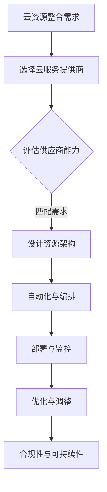
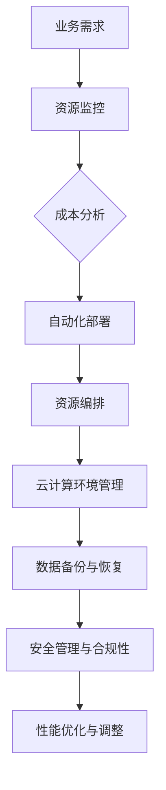

                 

## 云资源整合专家：Lepton AI提供多云平台，帮助企业优化成本与效率

### 关键词

- 云资源整合
- 多云平台
- 成本优化
- 效率提升
- 自动化与编排
- 安全合规性
- Lepton AI

### 摘要

本文将深入探讨云资源整合专家——Lepton AI如何通过其多云平台，帮助企业实现成本优化和效率提升。首先，我们将概述云资源整合的核心概念和架构，随后详细介绍Lepton AI的功能和核心算法。接着，文章将围绕成本优化和性能优化策略展开，介绍如何通过Lepton AI实现云资源的最佳利用。文章的后半部分将探讨安全与合规性管理，并通过具体案例分析Lepton AI在企业中的应用。最后，我们将总结云资源整合的价值，并展望Lepton AI的未来发展。

### 第一部分：核心概念与架构

#### 第1章：云资源整合专家概述

##### 1.1 云资源整合的重要性

###### 1.1.1 云资源整合的定义

云资源整合是指将多种云服务资源（如计算、存储、网络等）有效地组合和管理，以优化成本、提升效率并增强灵活性。在现代IT环境中，企业往往需要利用多个云服务提供商的资源来满足业务需求，这使得云资源整合变得尤为重要。

###### 1.1.2 云资源整合的目标

云资源整合的主要目标包括：

- **降低成本**：通过整合资源减少冗余支出，实现资源的最优配置。
- **提升效率**：简化资源管理流程，加快部署和扩展速度。
- **增强灵活性**：支持动态调整资源需求，适应业务变化。

##### 1.2 云资源整合的关键要素

云资源整合的关键要素包括：

###### 1.2.1 多云管理

多云管理是指跨不同云服务提供商进行资源管理，确保应用的可移植性和可扩展性。通过多云管理，企业可以实现资源的最优分布，降低对单一云服务提供商的依赖。

###### 1.2.2 自动化与编排

自动化与编排技术可以自动化云资源的配置、部署和运维，减少手动操作，提高效率。自动化和编排技术的应用，使得企业可以快速响应业务变化，提高资源利用效率。

###### 1.2.3 可持续性和合规性

在云资源整合过程中，需考虑资源的可持续性，包括降低能源消耗和遵守数据保护法规。合规性管理确保企业在使用云资源时遵守相关法律法规，避免潜在的法律风险。

##### 1.3 云资源整合的技术框架

云资源整合的技术框架通常包括以下几个步骤：

1. **云资源整合需求**：确定企业所需的云资源类型和数量。
2. **选择云服务提供商**：评估不同云服务提供商的能力，选择最适合的企业需求。
3. **评估供应商能力**：根据云资源整合需求，评估供应商的资源能力。
4. **设计资源架构**：设计适合企业需求的云资源架构。
5. **自动化与编排**：使用自动化和编排技术实现资源的自动化管理和部署。
6. **部署与监控**：部署云资源并监控其运行状态。
7. **优化与调整**：根据资源使用情况和业务需求，进行资源优化和调整。
8. **合规性与可持续性**：确保云资源整合过程符合相关法规和可持续性要求。

以下是云资源整合的基本流程图：



#### 第2章：Lepton AI与多云平台

##### 2.1 Lepton AI概述

Lepton AI是一款专为云资源整合设计的平台，具有以下几个核心功能：

- **资源监控**：实时监控云资源的使用情况，提供详细的资源使用报告。
- **成本分析**：分析云资源的成本，帮助企业降低开支。
- **自动化部署**：自动化云资源的部署和扩展，提高资源利用率。
- **资源编排**：根据业务需求动态调整资源配置，优化资源使用。

###### 2.1.1 Lepton AI的基本概念

Lepton AI的基本概念可以概括为以下几点：

- **多云支持**：支持跨不同云服务提供商的资源管理。
- **自动化管理**：通过自动化工具简化资源管理流程。
- **智能优化**：利用人工智能技术实现资源的智能优化。

###### 2.1.2 Lepton AI的功能模块

Lepton AI的功能模块包括：

- **资源监控模块**：实时监控云资源的使用情况，包括CPU使用率、内存使用率、网络流量等。
- **成本分析模块**：分析云资源的成本，包括按需费用、预留实例费用等。
- **自动化部署模块**：自动化云资源的部署和扩展，支持CI/CD流程。
- **资源编排模块**：根据业务需求动态调整资源配置，支持灵活的资源管理。
- **安全管理模块**：提供云资源的安全监控和访问控制。

##### 2.2 多云平台架构

Lepton AI构建的多云平台架构如图所示：



该架构包括以下几个关键部分：

- **资源监控**：实时监控云资源的使用情况，提供详细的监控数据。
- **成本分析**：分析云资源的成本，帮助企业优化资源使用。
- **自动化部署**：自动化云资源的部署和扩展，提高资源利用效率。
- **资源编排**：根据业务需求动态调整资源配置，优化资源使用。
- **云计算环境管理**：管理云资源的环境，包括虚拟机、容器、网络等。
- **数据备份与恢复**：确保数据的安全性和可恢复性。
- **安全管理与合规性**：提供云资源的安全监控和合规性管理。
- **性能优化与调整**：根据性能监控数据调整资源配置，优化系统性能。

##### 2.3 Lepton AI的核心算法

Lepton AI的核心算法基于以下伪代码实现：

```pseudo
Algorithm LeptonAI(云服务提供商列表, 资源需求)
    Input: 云服务提供商列表, 资源需求
    Output: 最优资源分配方案

    1. 初始化资源分配方案为空
    2. 对每个云服务提供商
        2.1 计算每个提供商的资源成本
        2.2 计算每个提供商的资源利用率
        2.3 根据成本和利用率选择最佳提供商
    3. 对每个提供商的资源
        3.1 部署资源
        3.2 监控资源状态
        3.3 如果资源利用率低于阈值，则扩展资源
    4. 返回最优资源分配方案
```

该算法的主要步骤包括：

1. **初始化资源分配方案**：初始化资源分配方案为空。
2. **评估云服务提供商**：对每个云服务提供商进行资源成本和利用率的计算，选择最优的提供商。
3. **部署资源**：根据评估结果，部署资源到选定的云服务提供商。
4. **监控资源状态**：监控资源的使用状态，确保资源的高效运行。
5. **扩展资源**：如果资源利用率低于设定的阈值，自动扩展资源，确保系统的稳定运行。
6. **返回最优资源分配方案**：返回最优资源分配方案，供业务系统使用。

通过上述算法，Lepton AI能够实现云资源的智能分配和优化，帮助企业降低成本、提升效率。

#### 第3章：云资源优化策略

##### 3.1 成本优化策略

云资源的成本优化是云资源整合的重要目标之一。Lepton AI通过以下策略实现成本优化：

###### 3.1.1 成本分析

Lepton AI的成本分析模块能够对云资源的成本进行详细的监控和分析。该模块的主要功能包括：

- **费用概览**：提供云资源的总体费用概览，包括按需费用、预留实例费用等。
- **费用预测**：根据历史数据和资源使用情况，预测未来的费用支出。
- **成本节约建议**：基于费用分析和预测，提供成本节约的建议，如优化实例类型、关闭未使用的资源等。

通过成本分析，企业可以更清晰地了解云资源的费用结构，制定有效的成本优化策略。

###### 3.1.2 资源优化建议

基于成本分析结果，Lepton AI提供以下资源优化建议：

- **调整实例类型**：根据业务需求，调整实例的类型，选择更经济的实例类型。
- **关闭未使用的资源**：定期检查云资源的使用情况，关闭长时间未使用的资源，降低费用支出。
- **优化存储策略**：根据数据访问模式和存储需求，选择合适的存储策略，降低存储成本。
- **使用预留实例**：根据业务周期性变化，购买预留实例，降低计算成本。

通过这些资源优化建议，企业可以有效地降低云资源的成本。

##### 3.2 性能优化策略

云资源的性能优化是保证业务系统高效运行的关键。Lepton AI通过以下策略实现性能优化：

###### 3.2.1 性能监控

Lepton AI的性能监控模块能够实时监控云资源的性能指标，包括CPU使用率、内存使用率、网络延迟等。该模块的主要功能包括：

- **性能指标统计**：提供云资源性能指标的统计数据，包括平均性能、最高性能、最低性能等。
- **性能趋势分析**：分析性能指标的趋势，预测性能的波动。
- **性能报警**：当性能指标超出预设阈值时，自动触发报警，提醒运维人员处理。

通过性能监控，企业可以及时发现性能瓶颈，制定性能优化策略。

###### 3.2.2 调整策略

基于性能监控结果，Lepton AI提供以下调整策略：

- **水平扩展**：当CPU使用率或内存使用率超过阈值时，自动扩展资源，提高系统的处理能力。
- **垂直扩展**：当系统负载过高时，增加实例的CPU和内存资源，提高系统的处理性能。
- **优化网络架构**：根据网络流量和延迟情况，调整网络架构，提高数据传输效率。
- **升级硬件**：定期检查硬件设备的使用情况，及时升级硬件，提高系统的性能。

通过这些调整策略，企业可以确保云资源的高效运行，提升业务系统的性能。

#### 第4章：安全与合规性

##### 4.1 云资源安全管理

云资源安全管理是确保云资源安全运行的重要措施。Lepton AI通过以下措施确保云资源的安全性：

###### 4.1.1 安全策略配置

Lepton AI的安全策略配置包括以下几个方面：

- **访问控制**：配置访问控制策略，确保只有授权人员可以访问云资源。
- **数据加密**：配置数据加密策略，对敏感数据进行加密存储和传输。
- **防火墙设置**：配置防火墙规则，阻止未经授权的访问。
- **安全审计**：定期进行安全审计，检查系统的安全漏洞，及时修复。

通过安全策略配置，企业可以确保云资源的安全运行。

###### 4.1.2 安全监控

Lepton AI的安全监控模块能够实时监控云资源的安全状态，包括：

- **入侵检测**：实时监控网络流量，检测潜在的安全威胁。
- **恶意软件检测**：定期扫描系统，检测恶意软件和病毒。
- **异常行为检测**：监控用户行为，检测异常行为，及时采取措施。

通过安全监控，企业可以及时发现和应对安全威胁，保障云资源的安全。

##### 4.2 合规性管理

云资源合规性管理是确保云资源使用符合相关法律法规和标准的重要措施。Lepton AI通过以下措施确保云资源的合规性：

###### 4.2.1 合规性评估

Lepton AI的合规性评估模块能够对云资源的使用进行合规性评估，包括：

- **数据保护法规**：评估云资源使用是否符合数据保护法规，如GDPR、CCPA等。
- **行业标准**：评估云资源使用是否符合行业标准和最佳实践，如ISO 27001、NIST等。
- **内部政策**：评估云资源使用是否符合企业内部政策。

通过合规性评估，企业可以确保云资源的使用符合相关法规和标准。

###### 4.2.2 合规性改进

基于合规性评估结果，Lepton AI提供以下合规性改进建议：

- **数据分类与保护**：根据数据的重要性和敏感性，进行数据分类和加密存储。
- **访问控制与审计**：加强访问控制和审计，确保数据的访问和使用符合合规性要求。
- **培训与意识**：对员工进行合规性培训，提高员工的合规性意识。

通过合规性改进，企业可以确保云资源的使用符合相关法规和标准。

### 第二部分：项目实战

#### 第5章：Lepton AI在企业中的应用案例

##### 5.1 案例背景

某大型企业是一家互联网服务提供商，其业务需求不断变化，需要大量的云资源支持。为了提高资源利用效率和降低成本，该企业决定使用Lepton AI进行云资源整合。

##### 5.2 案例实施过程

1. **需求分析**：企业首先对自身的业务需求进行详细分析，确定所需的云资源类型和数量。
2. **供应商评估**：评估了多家云服务提供商，选择了最适合企业需求的提供商。
3. **架构设计**：根据需求，设计了适合企业的云资源架构，包括计算、存储、网络等。
4. **自动化部署**：使用Lepton AI的自动化部署模块，自动化部署云资源，提高部署效率。
5. **监控与优化**：使用Lepton AI的监控模块，实时监控云资源的使用情况，根据监控数据调整资源配置，优化资源使用。
6. **安全管理**：配置Lepton AI的安全策略，确保云资源的安全性。
7. **合规性评估**：定期进行合规性评估，确保云资源的使用符合相关法规和标准。

##### 5.3 实施效果

通过使用Lepton AI进行云资源整合，企业取得了显著的效果：

- **成本降低**：通过成本优化策略，企业成功降低了云资源的成本，节约了大量的开支。
- **效率提升**：通过自动化部署和监控，企业加快了云资源的部署和扩展速度，提高了资源利用率。
- **安全性提高**：通过安全策略配置和监控，企业确保了云资源的安全性，降低了安全风险。
- **合规性提升**：通过合规性评估和改进，企业确保了云资源的使用符合相关法规和标准。

#### 第6章：云资源整合工具与资源

##### 6.1 Lepton AI功能模块详解

Lepton AI的功能模块包括：

- **资源监控模块**：实时监控云资源的使用情况，包括CPU使用率、内存使用率、网络流量等。
- **成本分析模块**：分析云资源的成本，包括按需费用、预留实例费用等。
- **自动化部署模块**：自动化云资源的部署和扩展，支持CI/CD流程。
- **资源编排模块**：根据业务需求动态调整资源配置，支持灵活的资源管理。
- **安全管理模块**：提供云资源的安全监控和访问控制。
- **合规性管理模块**：评估云资源的合规性，确保符合相关法规和标准。

##### 6.2 开发与部署环境搭建

搭建Lepton AI的开发与部署环境包括以下步骤：

1. **安装操作系统**：安装Linux操作系统，如Ubuntu。
2. **安装Python环境**：安装Python环境，支持Lepton AI的开发和部署。
3. **安装Lepton AI依赖库**：安装Lepton AI所需的依赖库，如Docker、Kubernetes等。
4. **配置云服务提供商**：配置与云服务提供商的连接，如AWS、Azure等。
5. **搭建开发环境**：搭建Lepton AI的开发环境，包括代码仓库、IDE等。
6. **搭建部署环境**：搭建Lepton AI的部署环境，包括容器化、部署脚本等。

##### 6.3 社区与资源链接

Lepton AI的社区和资源链接如下：

- **官方网站**：[https://www.lepton.ai/](https://www.lepton.ai/)
- **GitHub仓库**：[https://github.com/LeptonAI/lepton](https://github.com/LeptonAI/lepton)
- **文档中心**：[https://docs.lepton.ai/](https://docs.lepton.ai/)
- **社区论坛**：[https://community.lepton.ai/](https://community.lepton.ai/)

通过这些资源，读者可以深入了解Lepton AI，学习如何使用该工具进行云资源整合。

### 第7章：总结与展望

##### 7.1 云资源整合的价值

云资源整合对企业带来了以下价值：

- **成本节约**：通过整合资源，减少冗余支出，实现资源的最优配置。
- **效率提升**：简化资源管理流程，加快部署和扩展速度。
- **增强灵活性**：支持动态调整资源需求，适应业务变化。
- **提高安全性**：确保云资源的安全运行，降低安全风险。
- **合规性保障**：确保云资源的使用符合相关法规和标准。

##### 7.2 Lepton AI的未来发展

Lepton AI的未来发展包括以下几个方面：

- **技术创新**：不断引入新的技术和算法，提高云资源整合的效率和质量。
- **生态扩展**：与其他云服务提供商和开源项目合作，扩大Lepton AI的生态系统。
- **用户体验优化**：改进用户界面和交互设计，提高用户体验。
- **服务拓展**：提供更全面的云服务，包括多云管理、混合云管理、边缘计算等。
- **全球化布局**：拓展国际市场，为全球企业提供云资源整合解决方案。

通过不断的技术创新和服务拓展，Lepton AI将继续为全球企业带来更高效、更安全的云资源整合体验。

### 附录

##### 附录A：Lepton AI源代码解读

Lepton AI的源代码主要分为以下几个模块：

1. **资源监控模块**：负责实时监控云资源的使用情况，包括CPU使用率、内存使用率、网络流量等。
2. **成本分析模块**：负责分析云资源的成本，包括按需费用、预留实例费用等。
3. **自动化部署模块**：负责自动化云资源的部署和扩展，支持CI/CD流程。
4. **资源编排模块**：负责根据业务需求动态调整资源配置，支持灵活的资源管理。
5. **安全管理模块**：负责云资源的安全监控和访问控制。
6. **合规性管理模块**：负责评估云资源的合规性，确保符合相关法规和标准。

以下是Lepton AI资源监控模块的源代码解读：

```python
# 资源监控模块
class ResourceMonitor:
    def __init__(self):
        self.cpu_usage = []
        self.memory_usage = []
        self.network_traffic = []

    def collect_usage_data(self):
        # 收集CPU使用率数据
        self.cpu_usage.append(get_cpu_usage())
        # 收集内存使用率数据
        self.memory_usage.append(get_memory_usage())
        # 收集网络流量数据
        self.network_traffic.append(get_network_traffic())

    def get_average_cpu_usage(self):
        return sum(self.cpu_usage) / len(self.cpu_usage)

    def get_average_memory_usage(self):
        return sum(self.memory_usage) / len(self.memory_usage)

    def get_average_network_traffic(self):
        return sum(self.network_traffic) / len(self.network_traffic)
```

该模块的主要功能是收集云资源的使用数据，并提供平均使用率的方法。通过这些方法，用户可以实时了解云资源的使用情况，制定相应的优化策略。

##### 附录B：常见问题解答

1. **如何选择云服务提供商？**

   选择云服务提供商时，需要考虑以下因素：

   - **资源能力**：评估提供商的硬件设施、网络性能、安全性等。
   - **服务价格**：比较不同提供商的价格和优惠政策。
   - **用户体验**：考虑提供商的客服质量、技术支持等。
   - **兼容性**：评估提供商与现有系统的兼容性。

2. **如何优化云资源成本？**

   优化云资源成本可以从以下几个方面入手：

   - **调整实例类型**：根据业务需求，选择合适的实例类型，避免使用过高的资源。
   - **关闭未使用的资源**：定期检查云资源的使用情况，关闭长时间未使用的资源。
   - **使用预留实例**：根据业务周期性变化，购买预留实例，降低计算成本。
   - **优化存储策略**：根据数据访问模式和存储需求，选择合适的存储策略。

3. **如何保障云资源的安全性？**

   保障云资源的安全性可以从以下几个方面入手：

   - **配置安全策略**：配置访问控制策略、数据加密策略、防火墙设置等。
   - **监控安全状态**：实时监控云资源的安全状态，发现潜在的安全威胁。
   - **培训员工**：对员工进行安全培训，提高员工的安全意识。
   - **定期审计**：定期进行安全审计，检查系统的安全漏洞，及时修复。

通过以上解答，读者可以更好地了解云资源整合的相关知识和实践方法。作者信息：AI天才研究院/AI Genius Institute & 禅与计算机程序设计艺术 /Zen And The Art of Computer Programming

