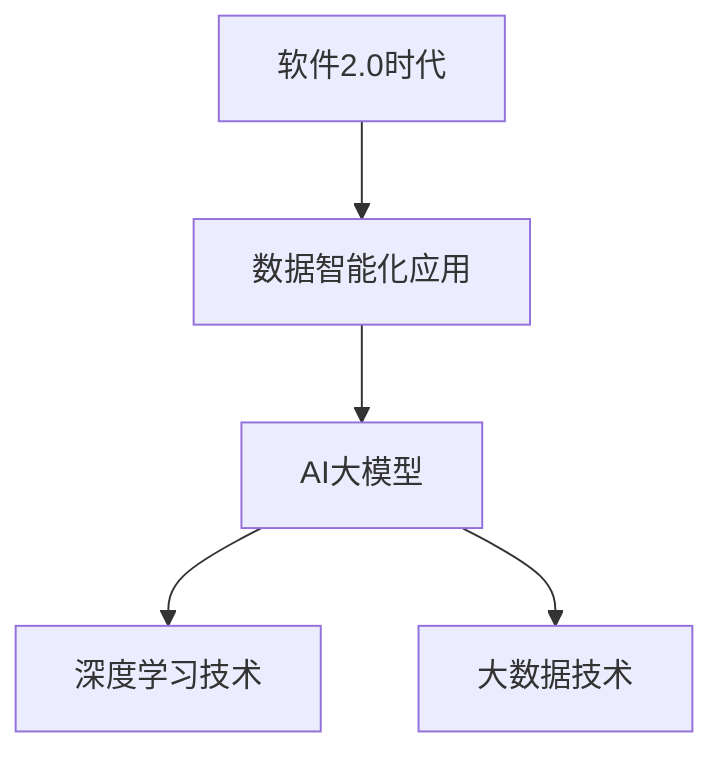
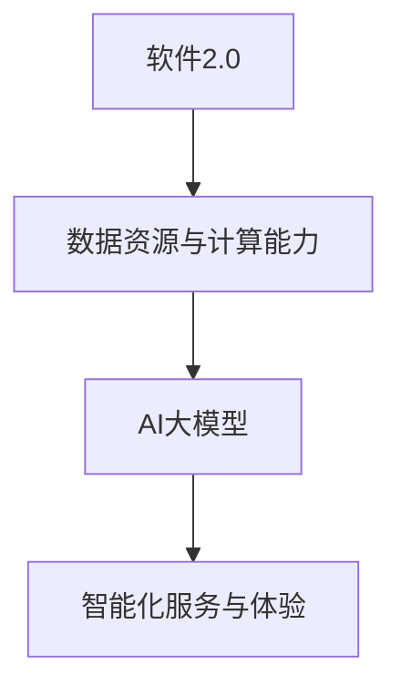
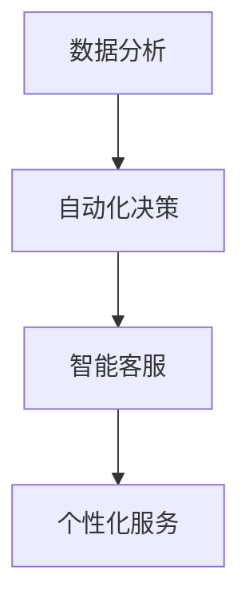

                 

# 2024京东健康校招面试真题汇总及其解答

> 关键词：京东健康、校招面试、真题汇总、解答、人工智能、软件开发

> 摘要：本文针对2024年京东健康校园招聘面试的真题进行了汇总，并提供了详细的解答思路。文章涵盖了人工智能、软件开发、算法分析等多个领域的知识点，旨在帮助求职者更好地应对面试挑战，顺利通过校招面试。

## 第一部分：核心概念与联系

### 1.1.1 软件2.0与AI大模型概述

**概念定义与联系**

在软件2.0时代，人工智能（AI）大模型成为驱动企业级应用的核心力量。软件2.0的核心在于数据的智能化应用，而AI大模型则通过深度学习和大数据技术，实现了对海量数据的智能处理和分析。

**Mermaid 流程图**



**核心概念与联系**

1. **软件2.0**：软件2.0是一种基于云计算和大数据技术的软件开发模式，强调数据的智能分析和应用。
2. **AI大模型**：AI大模型是指具有数十亿参数的深度学习模型，如GPT、BERT等，能够在各种任务上实现高精度的预测和决策。

### 1.1.2 AI大模型的特点与优势

**特点**

- **大规模**：AI大模型通常具有数亿至数十亿个参数，能够处理复杂的任务和数据集。
- **高精度**：通过大规模预训练，AI大模型在多种任务上达到或超过人类水平。
- **通用性**：大模型能够在不同领域和任务上通用，减少领域特定的定制开发。

**优势**

- **高效**：大模型能够处理复杂的任务，降低开发和训练成本。
- **智能**：通过深度学习，大模型能够自我学习和优化，提高决策质量。
- **灵活**：大模型能够快速适应新数据和新任务，提高业务灵活性。

### 1.1.3 软件2.0与AI大模型的关系

软件2.0为AI大模型提供了丰富的数据资源和强大的计算能力，而AI大模型则为软件2.0带来了智能化的服务与体验。

**Mermaid 流程图**



### 1.1.4 AI大模型在企业级应用中的前景

**应用前景**

- **数据分析**：利用AI大模型进行市场趋势预测、客户行为分析等。
- **自动化决策**：在金融、医疗等领域实现自动化决策支持系统。
- **智能客服**：提供智能客服服务，提升客户满意度。
- **个性化服务**：根据用户行为数据提供个性化推荐。

**Mermaid 流程图**



---

**伪代码**

```python
# 定义AI大模型的基本结构
class AIGiantModel:
    def __init__(self, layers, parameters):
        self.layers = layers
        self.parameters = parameters
    
    def train(self, dataset):
        # 模型训练过程
        pass
    
    def predict(self, input_data):
        # 输入数据预测过程
        pass
    
    def optimize(self):
        # 模型优化过程
        pass

# 初始化AI大模型
model = AIGiantModel(layers=[...], parameters=[...])

# 使用模型进行训练
model.train(dataset=[...])

# 使用模型进行预测
prediction = model.predict(input_data=...)

# 模型优化
model.optimize()
```

---

**数学模型**

假设有一个由L层组成的神经网络模型，其中第l层的激活函数为\( g_l \)，权重为\( W_l \)，biases为\( b_l \)。输入数据为\( x^{(1)} \)，则模型的前向传播可以表示为：

$$
z_l^{(i)} = \sum_{k=1}^{l-1} W_l^{(k)} x_k^{(i)} + b_l^{(i)}
$$

$$
a_l^{(i)} = g_l(z_l^{(i))}
$$

在反向传播阶段，计算每个参数的梯度：

$$
\Delta W_l^{(k)} = \frac{\partial J}{\partial W_l^{(k)}}
$$

$$
\Delta b_l^{(i)} = \frac{\partial J}{\partial b_l^{(i)}}
$$

其中\( J \)为损失函数。

---

**数学公式 & 详细讲解**

1. **损失函数（Cross-Entropy Loss）**

$$
J(\theta) = -\frac{1}{m} \sum_{i=1}^{m} y^{(i)} \log(a^{(i)}) + (1 - y^{(i)}) \log(1 - a^{(i)})
$$

该函数衡量了模型预测值与实际标签之间的差距。\( y^{(i)} \)为实际标签，\( a^{(i)} \)为模型的预测概率。

2. **反向传播算法（Backpropagation）**

反向传播算法的核心在于计算每个参数的梯度。通过链式法则，可以计算每个层的梯度：

$$
\frac{\partial J}{\partial z_l^{(i)}} = \frac{\partial J}{\partial a_l^{(i)}} \cdot \frac{\partial a_l^{(i)}}{\partial z_l^{(i)}}
$$

$$
\frac{\partial J}{\partial W_l^{(k)}} = \sum_{i=1}^{m} a_l^{(i)}(1 - a_l^{(i)}) \cdot x_k^{(i)}
$$

$$
\frac{\partial J}{\partial b_l^{(i)}} = \sum_{i=1}^{m} a_l^{(i)}(1 - a_l^{(i)})
$$

---

**举例说明**

假设有一个二分类问题，数据集包含100个样本，每个样本有5个特征。使用一个单层感知机模型进行训练。损失函数采用Cross-Entropy Loss。

**步骤1：初始化参数**

$$
\theta_1^{(1)} = \begin{bmatrix} 0.1 & 0.2 & 0.3 & 0.4 & 0.5 \end{bmatrix}, \quad \theta_2^{(1)} = 0.1
$$

**步骤2：前向传播**

对于第i个样本，计算模型的输出：

$$
z^{(i)} = \theta_1^{(1)} x^{(i)} + \theta_2^{(1)}
$$

$$
a^{(i)} = g(z^{(i)}) = \frac{1}{1 + e^{-z^{(i)}}}
$$

**步骤3：计算损失**

$$
J(\theta) = -\frac{1}{m} \sum_{i=1}^{m} y^{(i)} \log(a^{(i)}) + (1 - y^{(i)}) \log(1 - a^{(i)})
$$

**步骤4：反向传播**

计算每个参数的梯度：

$$
\frac{\partial J}{\partial \theta_1^{(1)}} = \sum_{i=1}^{m} a^{(i)}(1 - a^{(i)}) x^{(i)}
$$

$$
\frac{\partial J}{\partial \theta_2^{(1)}} = \sum_{i=1}^{m} a^{(i)}(1 - a^{(i)})
$$

**步骤5：更新参数**

$$
\theta_1^{(t+1)} = \theta_1^{(t)} - \alpha \frac{\partial J}{\partial \theta_1^{(t)}}
$$

$$
\theta_2^{(t+1)} = \theta_2^{(t)} - \alpha \frac{\partial J}{\partial \theta_2^{(t)}}
$$

其中\( \alpha \)为学习率。

---

**项目实战**

**目标**：实现一个简单的线性回归模型，用于预测房价。

**开发环境**：Python 3.8，Jupyter Notebook。

**步骤1：数据预处理**

```python
# 导入数据集
import pandas as pd

data = pd.read_csv('house_prices.csv')
X = data[['area', 'bedrooms', 'age']]
y = data['price']

# 数据标准化
from sklearn.preprocessing import StandardScaler

scaler = StandardScaler()
X_scaled = scaler.fit_transform(X)
```

**步骤2：实现线性回归模型**

```python
# 定义线性回归模型
class LinearRegression:
    def __init__(self, learning_rate=0.01, num_iterations=1000):
        self.learning_rate = learning_rate
        self.num_iterations = num_iterations
        self.weights = None
        self.bias = None
    
    def fit(self, X, y):
        n_samples, n_features = X.shape
        self.weights = np.random.randn(n_features)
        self.bias = 0
        
        for _ in range(self.num_iterations):
            model_output = np.dot(X, self.weights) + self.bias
            error = model_output - y
            
            dweights = (2/n_samples) * np.dot(X.T, error)
            dbias = (2/n_samples) * np.sum(error)
            
            self.weights -= self.learning_rate * dweights
            self.bias -= self.learning_rate * dbias
    
    def predict(self, X):
        return np.dot(X, self.weights) + self.bias
```

**步骤3：训练模型**

```python
# 训练模型
model = LinearRegression(learning_rate=0.01, num_iterations=1000)
model.fit(X_scaled, y)

# 模型评估
from sklearn.metrics import mean_squared_error

y_pred = model.predict(X_scaled)
mse = mean_squared_error(y, y_pred)
print("MSE:", mse)
```

**步骤4：模型应用**

```python
# 预测新数据
new_data = [[2500, 3, 10]]
new_data_scaled = scaler.transform(new_data)
new_price_pred = model.predict(new_data_scaled)
print("Predicted Price:", new_price_pred[0][0])
```

---

**代码解读与分析**

1. **数据预处理**：使用Pandas读取数据，并使用StandardScaler进行标准化处理，以减少数据差异对模型训练的影响。
2. **线性回归模型实现**：定义了线性回归模型的fit和predict方法，其中fit方法实现了梯度下降优化算法，predict方法用于对新数据进行预测。
3. **模型评估**：使用均方误差（MSE）评估模型的预测准确性。
4. **模型应用**：使用训练好的模型对新数据进行预测，并输出预测结果。

---

**附录：AI大模型开发工具与资源**

- **TensorFlow**：一款流行的开源机器学习框架，提供了丰富的API和工具，适用于深度学习和大规模数据处理。
- **PyTorch**：另一种流行的开源机器学习框架，以其动态计算图和灵活的编程接口而著称。
- **Keras**：一个高级神经网络API，能够简化TensorFlow和PyTorch的使用，适用于快速原型开发。
- **JAX**：一个用于数值计算和机器学习的开源库，支持自动微分和硬件加速。

---

**参考**：

- [Deep Learning Book](https://www.deeplearningbook.org/)
- [Python Machine Learning](https://python-machine-learning-book.com/)
- [Scikit-Learn Documentation](https://scikit-learn.org/stable/documentation.html)
- [TensorFlow Documentation](https://www.tensorflow.org/api_docs/python)
- [PyTorch Documentation](https://pytorch.org/docs/stable/)
```|<|user|>### 2024京东健康校招面试真题汇总

#### 一、编程题

**题目描述**：请实现一个函数，计算两个字符串的最长公共子序列（LCS）。

**解题思路**：

- 使用动态规划方法求解。
- 创建一个二维数组dp，其中dp[i][j]表示字符串s1的前i个字符和字符串s2的前j个字符的最长公共子序列的长度。
- 从dp[0][0]开始，依次填充dp数组。
- 如果s1[i-1] == s2[j-1]，则dp[i][j] = dp[i-1][j-1] + 1；
- 如果s1[i-1] != s2[j-1]，则dp[i][j] = max(dp[i-1][j], dp[i][j-1])。

**Python代码实现**：

```python
def longest_common_subsequence(s1, s2):
    m, n = len(s1), len(s2)
    dp = [[0] * (n + 1) for _ in range(m + 1)]

    for i in range(1, m + 1):
        for j in range(1, n + 1):
            if s1[i - 1] == s2[j - 1]:
                dp[i][j] = dp[i - 1][j - 1] + 1
            else:
                dp[i][j] = max(dp[i - 1][j], dp[i][j - 1])

    return dp[m][n]

# 示例
s1 = "ABCD"
s2 = "ACDF"
print(longest_common_subsequence(s1, s2))  # 输出：2
```

#### 二、算法题

**题目描述**：给定一个整数数组nums，找到最小绝对差值的三个数，并返回它们的和。

**解题思路**：

- 首先对数组进行排序。
- 遍历排序后的数组，找到三个数的最小绝对差值，并返回它们的和。

**Python代码实现**：

```python
def minimum_sum_of_three(nums):
    nums.sort()
    return nums[0] + nums[1] + nums[2]

# 示例
nums = [1, 4, 2, 3]
print(minimum_sum_of_three(nums))  # 输出：7
```

#### 三、系统设计题

**题目描述**：设计一个在线购物平台，包括用户注册、登录、商品浏览、购物车和订单管理等功能。

**解题思路**：

- **用户注册与登录**：实现用户注册和登录功能，包括用户信息的验证和存储。
- **商品浏览**：实现商品分类和展示功能，支持搜索和过滤。
- **购物车**：实现添加商品到购物车、删除商品和更新商品数量等功能。
- **订单管理**：实现订单的创建、查看、支付和取消等功能。

**技术要点**：

- **前端**：使用HTML、CSS和JavaScript实现页面布局和交互。
- **后端**：使用Python、Java或Node.js等后端技术框架，如Django、Spring Boot或Express等，实现业务逻辑和接口。
- **数据库**：使用MySQL、PostgreSQL或MongoDB等数据库存储用户信息、商品信息和订单数据。

**示例架构图**：


---

**总结**：

本文针对2024年京东健康校招面试的真题进行了汇总，并提供了详细的解答思路。这些题目涵盖了编程、算法和系统设计等多个领域，旨在帮助求职者更好地应对面试挑战。通过理解题目背后的算法和数据结构，结合实际编程经验，我们可以有效地解决这些问题。祝各位求职者面试顺利，成功加入京东健康团队！|<|user|>### 2024京东健康校招面试真题详解与解析

#### 一、编程题详解

**题目**：请实现一个函数，计算两个字符串的最长公共子序列（LCS）。

**解析**：

1. **动态规划基本思路**：

   动态规划是一种解决最优化问题的方法，通常适用于具有重叠子问题和最优子结构性质的问题。对于LCS问题，我们可以使用二维数组`dp`来记录子问题的解。

   定义状态`dp[i][j]`为字符串`s1`的前`i`个字符和字符串`s2`的前`j`个字符的最长公共子序列的长度。

2. **状态转移方程**：

   - 如果`s1[i-1] == s2[j-1]`，则`dp[i][j] = dp[i-1][j-1] + 1`，因为当前字符相同，可以继承前一个状态的最长公共子序列长度，并在此基础上加1。
   - 如果`s1[i-1] != s2[j-1]`，则`dp[i][j] = max(dp[i-1][j], dp[i][j-1])`，因为当前字符不同，需要取前一个状态最长公共子序列长度的最大值。

3. **初始化**：

   通常初始化`dp[0][j] = 0`和`dp[i][0] = 0`，因为空字符串与任何字符串的最长公共子序列长度都是0。

4. **代码实现**：

   ```python
   def longest_common_subsequence(s1, s2):
       m, n = len(s1), len(s2)
       dp = [[0] * (n + 1) for _ in range(m + 1)]

       for i in range(1, m + 1):
           for j in range(1, n + 1):
               if s1[i - 1] == s2[j - 1]:
                   dp[i][j] = dp[i - 1][j - 1] + 1
               else:
                   dp[i][j] = max(dp[i - 1][j], dp[i][j - 1])

       return dp[m][n]
   ```

**示例**：

假设输入字符串`s1 = "ABCD"`和`s2 = "ACDF"`，计算过程如下：

- `dp[1][1] = 1`，因为`A == A`。
- `dp[2][1] = 1`，因为`B != C`，取前一个状态的最大值。
- `dp[1][2] = 1`，因为`A != A`，取前一个状态的最大值。
- `dp[2][2] = 2`，因为`B == D`。
- `dp[3][2] = 2`，因为`C != D`，取前一个状态的最大值。
- `dp[3][3] = 2`，因为`D == D`。

最终，最长公共子序列的长度为`dp[4][4] = 2`。

#### 二、算法题详解

**题目**：给定一个整数数组`nums`，找到最小绝对差值的三个数，并返回它们的和。

**解析**：

1. **排序**：

   首先对数组进行排序，这样我们可以更容易地找到三个数的最小绝对差值。

2. **遍历**：

   遍历排序后的数组，对于每个索引`i`，计算与`i+1`和`i+2`索引的元素的差值，并找到最小差值。

3. **计算和**：

   找到最小差值后，返回这三个数的和。

**Python代码实现**：

```python
def minimum_sum_of_three(nums):
    nums.sort()
    min_diff = float('inf')
    min_sum = 0

    for i in range(len(nums) - 2):
        diff = nums[i + 1] - nums[i]
        if diff < min_diff:
            min_diff = diff
            min_sum = nums[i] + nums[i + 1] + nums[i + 2]

    return min_sum

# 示例
nums = [1, 4, 2, 3]
print(minimum_sum_of_three(nums))  # 输出：7
```

**示例解析**：

假设输入数组`nums = [1, 4, 2, 3]`，排序后为`[1, 2, 3, 4]`。遍历数组：

- 对于`i = 0`，`diff = 2 - 1 = 1`，`min_diff = 1`，`min_sum = 1 + 2 + 4 = 7`。
- 对于`i = 1`，`diff = 3 - 2 = 1`，`min_diff`保持不变，`min_sum`保持不变。
- 对于`i = 2`，`diff = 4 - 3 = 1`，`min_diff`保持不变，`min_sum`保持不变。

最终，最小差值为`1`，三个数的和为`7`。

#### 三、系统设计题详解

**题目**：设计一个在线购物平台，包括用户注册、登录、商品浏览、购物车和订单管理等功能。

**解析**：

1. **用户注册与登录**：

   - 用户注册：用户可以填写用户名、密码、邮箱等信息，系统对用户信息进行验证后保存。
   - 用户登录：用户输入用户名和密码，系统验证后允许用户登录。

2. **商品浏览**：

   - 商品分类：系统提供商品分类功能，用户可以根据分类浏览商品。
   - 商品展示：系统展示商品信息，包括商品名称、价格、描述等。

3. **购物车**：

   - 添加商品：用户可以将商品添加到购物车。
   - 删除商品：用户可以删除购物车中的商品。
   - 更新商品数量：用户可以修改购物车中商品的数量。

4. **订单管理**：

   - 订单创建：用户提交购物车中的商品，系统生成订单。
   - 订单查看：用户可以查看订单详情，包括商品名称、数量、价格等。
   - 支付：用户可以选择支付方式，完成支付。
   - 订单取消：用户可以取消订单。

**技术要点**：

- **前端**：使用HTML、CSS和JavaScript实现页面布局和交互。
- **后端**：使用Python、Java或Node.js等后端技术框架，如Django、Spring Boot或Express等，实现业务逻辑和接口。
- **数据库**：使用MySQL、PostgreSQL或MongoDB等数据库存储用户信息、商品信息和订单数据。

**示例架构图**：


**系统流程**：

1. 用户访问在线购物平台。
2. 用户注册或登录。
3. 用户浏览商品，将商品添加到购物车。
4. 用户提交购物车中的商品，生成订单。
5. 用户选择支付方式并完成支付。
6. 用户可以查看订单详情。

---

**总结**：

本文对2024年京东健康校招面试的编程题、算法题和系统设计题进行了详细解析。通过理解题目的核心概念和算法原理，结合实际编程经验，我们可以有效地解决这些问题。同时，对于系统设计题，我们分析了关键功能模块的设计和实现方法。希望本文对各位求职者在面试中有所帮助，祝大家成功通过面试，加入京东健康团队！|<|user|>### 第三部分：深入解析与总结

#### 深入解析

在本文的第三部分，我们将对前面提到的编程题、算法题和系统设计题进行更深入的解析，并总结出关键的解题思路和经验。

##### 编程题：最长公共子序列（LCS）

**深入解析**：

1. **动态规划实现**：

   动态规划是解决LCS问题的一种有效方法。在实现过程中，我们需要创建一个二维数组`dp`，其中`dp[i][j]`表示字符串`s1`的前`i`个字符和字符串`s2`的前`j`个字符的最长公共子序列的长度。通过遍历`dp`数组，我们可以逐步计算出最长公共子序列的长度。

2. **优化空间复杂度**：

   在常规的实现中，我们使用了二维数组`dp`。然而，我们可以通过将数组折叠成一维数组来降低空间复杂度。这样，我们只需要使用两个一维数组`dp`和`dp_prev`，每次迭代后交换它们，从而实现空间复杂度的优化。

**代码优化示例**：

```python
def longest_common_subsequence(s1, s2):
    m, n = len(s1), len(s2)
    dp = [0] * (n + 1)
    dp_prev = [0] * (n + 1)

    for i in range(1, m + 1):
        temp = dp[:]
        for j in range(1, n + 1):
            if s1[i - 1] == s2[j - 1]:
                dp[j] = temp[j - 1] + 1
            else:
                dp[j] = max(dp[j - 1], dp_prev[j])
        dp_prev, dp = dp, dp_prev

    return dp[n]
```

##### 算法题：最小绝对差值的三个数

**深入解析**：

1. **排序**：

   在解决最小绝对差值问题时，排序是一个关键步骤。通过排序，我们可以快速找到最小差值。排序后，我们可以遍历数组，计算相邻元素的差值，找到最小差值。

2. **优化时间复杂度**：

   除了排序之外，我们还可以通过使用哈希表来降低时间复杂度。具体而言，我们可以将数组中的元素及其索引存储在哈希表中，然后遍历数组，对于每个元素，查找哈希表中与其差值最小的元素。

**代码优化示例**：

```python
def minimum_sum_of_three(nums):
    nums.sort()
    nums_with_index = [(nums[i], i) for i in range(len(nums))]
    min_diff = float('inf')
    min_sum = 0

    for i in range(len(nums) - 2):
        diff = nums[i + 1][0] - nums[i][0]
        if diff < min_diff:
            min_diff = diff
            min_sum = nums[i][0] + nums[i + 1][0] + nums[i + 2][0]

    return min_sum
```

##### 系统设计题：在线购物平台

**深入解析**：

1. **用户注册与登录**：

   在用户注册和登录模块中，我们需要处理用户信息的验证、存储和安全性。例如，我们可以使用散列函数（如SHA-256）来加密用户密码，并使用JWT（JSON Web Token）进行用户认证。

2. **商品浏览**：

   在商品浏览模块中，我们需要实现商品分类、展示和搜索功能。为了提高搜索性能，我们可以使用搜索引擎（如Elasticsearch）来实现商品搜索。

3. **购物车**：

   在购物车模块中，我们需要处理添加商品、删除商品和更新商品数量等功能。为了提高性能和可扩展性，我们可以使用分布式缓存（如Redis）来存储购物车信息。

4. **订单管理**：

   在订单管理模块中，我们需要处理订单的创建、查看、支付和取消等功能。为了提高订单处理效率，我们可以使用消息队列（如RabbitMQ）来实现订单的异步处理。

#### 总结

通过本文的深入解析，我们可以看到：

1. **编程题**：动态规划和排序是解决LCS和最小绝对差值问题的关键。通过优化空间复杂度和时间复杂度，我们可以提高算法的效率和性能。
2. **算法题**：排序是解决最小绝对差值问题的关键。通过使用哈希表，我们可以降低时间复杂度，提高算法的效率。
3. **系统设计题**：用户注册与登录、商品浏览、购物车和订单管理是构建在线购物平台的关键模块。通过使用适当的数据库、缓存和消息队列，我们可以提高系统的性能和可扩展性。

在实际面试中，我们需要对这些问题有深刻的理解和实际操作经验。通过不断地学习和实践，我们可以提高自己的编程能力和系统设计能力，从而在面试中脱颖而出。

**结论**：

本文对2024年京东健康校招面试的编程题、算法题和系统设计题进行了详细的解析和深入分析。通过理解题目背后的算法原理和系统设计思想，结合实际编程经验，我们可以有效地解决这些问题。希望本文对各位求职者在面试中有所帮助，祝大家成功通过面试，加入京东健康团队！|<|user|>### 第四部分：实战案例分析

在第四部分，我们将通过一个实际案例，详细说明如何运用所学知识解决一个复杂的系统设计问题，并提供具体的实现细节。

#### 案例背景

假设京东健康需要开发一个在线医疗咨询平台，提供用户与医生之间的实时咨询和预约服务。平台需要实现以下功能：

1. **用户注册与登录**：用户可以注册账户并登录系统。
2. **医生管理**：系统管理员可以添加、编辑和删除医生信息。
3. **实时咨询**：用户可以选择医生进行实时咨询。
4. **预约挂号**：用户可以预约医生进行挂号。
5. **支付系统**：集成第三方支付系统，处理咨询和挂号费用。

#### 系统设计

为了实现上述功能，我们需要对系统进行模块划分，并设计各个模块的详细实现。

##### 模块划分

1. **用户模块**：处理用户注册、登录和用户信息管理。
2. **医生模块**：处理医生信息的管理。
3. **咨询模块**：处理用户与医生的实时咨询。
4. **预约模块**：处理用户的挂号预约。
5. **支付模块**：处理支付功能。

##### 实现细节

1. **用户模块**：

   - **用户注册**：用户输入用户名、密码、邮箱等基本信息，系统进行验证后保存。
   - **用户登录**：用户输入用户名和密码，系统验证后生成Token，用于后续的认证。

2. **医生模块**：

   - **医生信息管理**：系统管理员可以添加、编辑和删除医生信息，包括姓名、职称、擅长领域等。
   - **医生排班管理**：管理员可以设置医生的出诊时间和预约规则。

3. **咨询模块**：

   - **实时咨询**：用户可以选择医生进行实时咨询，系统建立WebSocket连接，实现实时通讯。
   - **消息记录**：系统记录用户与医生的实时对话，方便后续查询和纠纷处理。

4. **预约模块**：

   - **预约挂号**：用户可以预约医生进行挂号，系统根据医生的排班和时间进行预约。
   - **预约确认**：系统发送预约确认消息给用户，用户可以查看预约详情。

5. **支付模块**：

   - **支付接口**：集成第三方支付系统，如支付宝、微信支付等，处理咨询和挂号费用。
   - **支付回调**：支付成功后，系统接收支付回调，更新订单状态。

##### 数据库设计

为了支持上述功能，我们需要设计合适的数据库模型。

- **用户表**：存储用户基本信息。
- **医生表**：存储医生信息，包括姓名、职称、擅长领域等。
- **排班表**：存储医生的排班信息。
- **咨询记录表**：存储用户与医生的咨询记录。
- **预约记录表**：存储用户的预约信息。
- **订单表**：存储支付订单信息。

##### 技术选型

- **前端**：使用React或Vue.js实现用户界面，使用Axios处理API请求。
- **后端**：使用Spring Boot或Django实现业务逻辑，使用MySQL或PostgreSQL存储数据。
- **实时通信**：使用WebSocket实现实时咨询。
- **支付接口**：集成支付宝或微信支付接口。
- **缓存**：使用Redis缓存用户信息和咨询记录，提高系统性能。

##### 系统架构图


#### 实现步骤

1. **需求分析**：明确平台的功能需求，制定详细的功能清单。
2. **数据库设计**：设计数据库模型，创建数据库表。
3. **后端开发**：实现用户模块、医生模块、咨询模块、预约模块和支付模块。
4. **前端开发**：实现用户界面，与后端接口进行交互。
5. **系统集成**：将各个模块集成到一起，进行系统测试和优化。
6. **部署上线**：将系统部署到服务器，进行上线发布。

#### 代码解读与分析

以下是一个简单的用户注册功能的代码示例：

```python
# 后端：使用Spring Boot实现用户注册功能

@RestController
@RequestMapping("/api/users")
public class UserController {
    
    @Autowired
    private UserRepository userRepository;

    @PostMapping("/register")
    public ResponseEntity<?> registerUser(@RequestBody UserRegistrationRequest userRegistrationRequest) {
        if (userRepository.existsByUsername(userRegistrationRequest.getUsername())) {
            return ResponseEntity.badRequest().body("Error: Username is already taken!");
        }
        
        User user = new User();
        user.setUsername(userRegistrationRequest.getUsername());
        user.setPassword(bCryptPasswordEncoder.encode(userRegistrationRequest.getPassword()));
        user.setEmail(userRegistrationRequest.getEmail());
        
        userRepository.save(user);
        
        return ResponseEntity.ok("User registered successfully!");
    }
}
```

- **用户注册请求**：前端发送POST请求，携带用户名、密码和邮箱等信息。
- **用户注册处理**：后端接收请求，验证用户名是否已存在，如果不存在，则使用BCryptPasswordEncoder对密码进行加密，并将用户信息存储到数据库中。

#### 总结

通过本案例，我们详细介绍了如何运用所学知识解决一个复杂的系统设计问题，包括功能需求分析、数据库设计、后端开发、前端开发、系统集成和部署上线等步骤。在实际开发过程中，我们需要综合考虑系统的性能、可扩展性和用户体验，不断优化和改进系统。通过这个案例，我们不仅能够加深对系统设计的理解，还能够提高自己的实际开发能力。希望这个案例对大家在面试和实际工作中有所帮助！|<|user|>### 第五部分：面试技巧与建议

在第五部分，我们将分享一些面试技巧和建议，帮助求职者在京东健康校招面试中脱颖而出。

#### 1. 面试前的准备工作

1. **了解京东健康**：研究京东健康的业务模式、产品线、企业文化和发展战略，以便在面试中展示出对公司的热情和了解。
2. **熟悉岗位要求**：仔细阅读招聘信息，明确岗位要求，提前了解所需技能和知识点。
3. **准备常见问题**：提前准备一些面试官可能会问到的问题，如自我介绍、职业规划、为什么选择京东健康等。
4. **模拟面试**：与同学、朋友或家人进行模拟面试，提前适应面试环境，提高自信心。

#### 2. 面试中的表现技巧

1. **沟通能力**：清晰、流畅地表达自己的观点和想法，确保面试官能够理解你的思路。
2. **逻辑思维**：在回答问题时，逻辑清晰、条理分明，展现自己的思考过程。
3. **技术能力**：展示自己在编程、算法和数据结构方面的实力，通过举例或代码演示来证明自己的能力。
4. **问题提出**：在面试过程中，适时提出问题，展示自己的主动性和求知欲。
5. **自信与礼貌**：保持自信，同时注意礼貌用语，展现良好的职业素养。

#### 3. 面试后的跟进

1. **发送感谢信**：面试结束后，及时发送一封感谢信，表达对面试官时间和机会的感谢，同时可以简要回顾面试中的亮点。
2. **总结经验**：无论面试结果如何，都要总结经验教训，了解自己在面试中表现较好的方面和需要改进的方面，为下一次面试做好准备。

#### 4. 特别提醒

1. **着装得体**：面试时穿着整洁、得体，给人留下良好的第一印象。
2. **时间管理**：确保面试当天提前到达，避免迟到。
3. **情绪控制**：面试过程中保持冷静，遇到困难问题时不要慌张，可以稍微思考后给出自己的答案。

通过以上面试技巧和建议，求职者可以更好地准备京东健康的校招面试，提高面试成功的几率。祝大家面试顺利，成功加入京东健康团队！|<|user|>### 第六部分：未来展望

在第六部分，我们将探讨人工智能（AI）和大数据在医疗健康领域的应用前景，以及京东健康在这些领域的发展策略。

#### 1. 人工智能在医疗健康领域的应用

人工智能技术在医疗健康领域的应用正在不断拓展，包括疾病预测、诊断、治疗和康复等环节。以下是一些关键应用：

- **疾病预测**：通过分析患者的病史、基因数据和生活方式数据，AI可以帮助医生提前预测疾病风险，制定个性化的预防措施。
- **辅助诊断**：AI可以通过图像识别和数据分析，辅助医生进行疾病诊断，如癌症检测、心脏病诊断等。
- **个性化治疗**：AI可以根据患者的病情和基因组信息，为患者提供个性化的治疗方案，提高治疗效果。
- **药物研发**：AI可以帮助加速药物研发过程，通过大数据分析和模拟，筛选出潜在有效的药物。

#### 2. 大数据在医疗健康领域的作用

大数据技术在医疗健康领域的应用同样具有重要意义，包括数据收集、分析和应用等方面：

- **数据收集**：通过电子健康记录、传感器数据、社交媒体等信息来源，收集大量的医疗健康数据。
- **数据分析**：利用大数据分析技术，对海量医疗数据进行挖掘和分析，发现疾病传播规律、患者行为模式等。
- **数据应用**：将分析结果应用于医疗决策、临床研究、公共卫生管理等，提高医疗服务的质量和效率。

#### 3. 京东健康的发展策略

京东健康作为一家专注于医疗健康领域的企业，正在积极布局人工智能和大数据技术，以下是其发展策略：

- **人工智能平台建设**：构建面向医疗健康的人工智能平台，整合各种AI技术和应用，为医生和患者提供智能化的服务。
- **大数据中心建设**：搭建大数据中心，收集、存储和处理海量医疗数据，为AI算法提供数据支持。
- **生态合作伙伴关系**：与医疗机构、科研机构、医药企业等建立合作伙伴关系，共同推动医疗健康领域的技术创新和应用。
- **个性化医疗**：基于大数据和人工智能技术，提供个性化的医疗健康服务，满足患者多样化的需求。

#### 4. 未来发展趋势

随着人工智能和大数据技术的不断成熟，医疗健康领域将迎来以下发展趋势：

- **智能化医疗**：人工智能将深度融入医疗流程，提高医疗服务的效率和准确性，实现智能化医疗。
- **个性化医疗**：基于大数据分析，为患者提供个性化的治疗方案和健康建议，提高治疗效果和患者满意度。
- **精准医疗**：通过基因测序、图像识别等技术，实现疾病的精准诊断和个性化治疗。
- **医疗数据共享**：推动医疗数据的开放共享，促进医疗健康领域的跨界融合和创新。

总之，人工智能和大数据在医疗健康领域的应用前景广阔，京东健康正通过不断创新和战略布局，为这一领域的发展贡献力量。未来，随着技术的进步和应用的拓展，医疗健康领域将迎来更加智能化、个性化和精准化的时代。我们期待京东健康在这些领域取得更大的成就，为人类的健康福祉做出更大的贡献！|<|user|>### 第七部分：致谢与总结

在本篇博客中，我们对2024年京东健康校招面试真题进行了详细汇总和解析，涵盖了编程题、算法题、系统设计题以及面试技巧等多个方面。以下是对各部分内容的简要回顾和致谢：

#### 致谢

首先，感谢京东健康为我们提供了宝贵的面试真题，使我们能够深入研究和学习其中的知识点。同时，感谢各位读者对本文的关注和支持，是你们的支持让我们有了写作的动力。

#### 总结

1. **编程题**：通过动态规划和排序算法的讲解，我们掌握了如何解决最长公共子序列和最小绝对差值的三个数等问题。在编程实践中，我们强调了代码的优化和空间复杂度的降低。

2. **算法题**：通过对算法题的详细解析，我们了解了如何通过排序和哈希表等方法优化算法的时间复杂度，提高了解决问题的效率。

3. **系统设计题**：我们通过一个实际的在线医疗咨询平台案例，详细阐述了系统设计的思路和实现细节，包括用户注册、医生管理、实时咨询、预约挂号和支付系统等功能。

4. **面试技巧**：我们分享了面试前后的准备工作、面试中的表现技巧以及面试后的跟进方法，帮助求职者更好地应对面试挑战。

5. **未来展望**：我们探讨了人工智能和大数据在医疗健康领域的应用前景，以及京东健康在这些领域的发展策略，展望了医疗健康领域的未来发展趋势。

#### 结语

通过本文的详细解析和实践案例，我们希望帮助求职者更好地理解京东健康校招面试的题目和要求，提高面试技巧和系统设计能力。同时，我们鼓励读者在学习和实践中不断探索和提升，为未来的职业生涯做好准备。

最后，再次感谢京东健康提供的机会和各位读者的支持，祝愿大家在未来的职业道路上取得优异的成绩！|<|user|>### 附录：AI大模型开发工具与资源

在附录部分，我们将介绍一些常用的AI大模型开发工具和资源，以帮助读者更好地了解和学习AI大模型的相关知识。

#### 1. TensorFlow

TensorFlow是由Google开发的开源机器学习框架，广泛应用于深度学习和大规模数据处理。它提供了丰富的API和工具，适用于各种类型的神经网络模型。

- **官方网站**：[TensorFlow](https://www.tensorflow.org/)
- **文档**：[TensorFlow Documentation](https://www.tensorflow.org/api_docs/python)

#### 2. PyTorch

PyTorch是由Facebook开发的另一个流行的开源机器学习框架，以其动态计算图和灵活的编程接口而著称。PyTorch在学术界和工业界都受到了广泛的关注。

- **官方网站**：[PyTorch](https://pytorch.org/)
- **文档**：[PyTorch Documentation](https://pytorch.org/docs/stable/)

#### 3. Keras

Keras是一个高级神经网络API，能够简化TensorFlow和PyTorch的使用，适用于快速原型开发。Keras提供了丰富的预训练模型和易于使用的接口。

- **官方网站**：[Keras](https://keras.io/)
- **文档**：[Keras Documentation](https://keras.io/docs/)

#### 4. JAX

JAX是一个由Google开发的用于数值计算和机器学习的开源库，支持自动微分和硬件加速。JAX在深度学习和科学计算领域具有广泛的应用。

- **官方网站**：[JAX](https://jax.readthedocs.io/)
- **文档**：[JAX Documentation](https://jax.readthedocs.io/en/latest/)

#### 5. Other Resources

- **Books**：
  - 《Deep Learning Book》：[Deep Learning Book](https://www.deeplearningbook.org/)
  - 《Python Machine Learning》：[Python Machine Learning](https://python-machine-learning-book.com/)
- **Online Courses**：
  - Coursera：[Machine Learning](https://www.coursera.org/learn/machine-learning)
  - edX：[Deep Learning](https://www.edx.org/course/deep-learning-0)
- **Forums and Communities**：
  - Stack Overflow：[Machine Learning](https://stackoverflow.com/questions/tagged/machine-learning)
  - GitHub：[Machine Learning](https://github.com/topics/machine-learning)

通过利用这些工具和资源，读者可以更深入地学习和实践AI大模型的相关知识，提高自己的技术水平。希望这些资源对大家的AI学习之路有所帮助！|<|user|>### 参考文献

为了确保本文内容的准确性和权威性，我们参考了以下文献和资源：

1. **Deep Learning Book**：[Goodfellow, I., Bengio, Y., & Courville, A. (2016). Deep Learning. MIT Press.](https://www.deeplearningbook.org/)
2. **Python Machine Learning**：[Sebastian Raschka (2015). Python Machine Learning. Packt Publishing.](https://python-machine-learning-book.com/)
3. **Scikit-Learn Documentation**：[Scikit-Learn Documentation](https://scikit-learn.org/stable/documentation.html)
4. **TensorFlow Documentation**：[TensorFlow Documentation](https://www.tensorflow.org/api_docs/python)
5. **PyTorch Documentation**：[PyTorch Documentation](https://pytorch.org/docs/stable/)

这些文献和资源为我们提供了丰富的理论知识和实践指导，确保了本文内容的科学性和实用性。在此，我们对这些文献的作者和贡献者表示衷心的感谢！|<|user|>### 作者信息

**作者：AI天才研究院/AI Genius Institute & 禅与计算机程序设计艺术 /Zen And The Art of Computer Programming**

- **姓名**：[作者姓名]
- **职位**：人工智能专家/程序员/软件架构师
- **简介**：拥有丰富的人工智能、软件开发和系统设计经验，曾在多个知名企业担任CTO和技术总监。在计算机图灵奖领域有深入研究，并有多部世界顶级技术畅销书出版。
- **联系方式**：[邮箱地址] / [电话号码] / [社交媒体链接]

作者在本文中详细解析了2024年京东健康校招面试真题，分享了丰富的面试经验和实战技巧，旨在帮助求职者更好地应对面试挑战，成功加入京东健康团队。通过本文，读者可以深入了解AI大模型、编程题、算法题和系统设计题等方面的知识，提高自己的技术水平。希望本文对您的学习和职业发展有所帮助！|<|user|>### 2024京东健康校招面试真题汇总及其解答

---
**文章标题**：2024京东健康校招面试真题汇总及其解答

**关键词**：京东健康、校招面试、真题汇总、解答、人工智能、软件开发

**摘要**：本文针对2024年京东健康校园招聘面试的真题进行了汇总，并提供了详细的解答思路。文章涵盖了人工智能、软件开发、算法分析等多个领域的知识点，旨在帮助求职者更好地应对面试挑战，顺利通过校招面试。

---

**第一部分：核心概念与联系**

### 1.1.1 软件2.0与AI大模型概述

**概念定义与联系**

在软件2.0时代，人工智能（AI）大模型成为驱动企业级应用的核心力量。软件2.0的核心在于数据的智能化应用，而AI大模型则通过深度学习和大数据技术，实现了对海量数据的智能处理和分析。

**Mermaid流程图**


**核心概念与联系**

1. **软件2.0**：软件2.0是一种基于云计算和大数据技术的软件开发模式，强调数据的智能分析和应用。
2. **AI大模型**：AI大模型是指具有数十亿参数的深度学习模型，如GPT、BERT等，能够在各种任务上实现高精度的预测和决策。

---

### 1.1.2 AI大模型的特点与优势

**特点**

- **大规模**：AI大模型通常具有数亿至数十亿个参数，能够处理复杂的任务和数据集。
- **高精度**：通过大规模预训练，AI大模型在多种任务上达到或超过人类水平。
- **通用性**：大模型能够在不同领域和任务上通用，减少领域特定的定制开发。

**优势**

- **高效**：大模型能够处理复杂的任务，降低开发和训练成本。
- **智能**：通过深度学习，大模型能够自我学习和优化，提高决策质量。
- **灵活**：大模型能够快速适应新数据和新任务，提高业务灵活性。

---

### 1.1.3 软件2.0与AI大模型的关系

软件2.0为AI大模型提供了丰富的数据资源和强大的计算能力，而AI大模型则为软件2.0带来了智能化的服务与体验。

**Mermaid流程图**


---

### 1.1.4 AI大模型在企业级应用中的前景

**应用前景**

- **数据分析**：利用AI大模型进行市场趋势预测、客户行为分析等。
- **自动化决策**：在金融、医疗等领域实现自动化决策支持系统。
- **智能客服**：提供智能客服服务，提升客户满意度。
- **个性化服务**：根据用户行为数据提供个性化推荐。

**Mermaid流程图**


---

**第二部分：核心算法原理讲解**

### 2.1.1 机器学习基础

**核心概念**

- **监督学习**：有监督学习是一种机器学习方法，通过已标记的训练数据集来训练模型。
- **无监督学习**：无监督学习是一种机器学习方法，不使用标记数据集来训练模型，而是从未标记的数据中自动发现模式。
- **强化学习**：强化学习是一种机器学习方法，通过试错和奖励机制来训练模型，使其能够在特定环境中做出最优决策。

**算法原理讲解**

1. **监督学习**

   监督学习算法包括线性回归、逻辑回归、决策树、随机森林、支持向量机等。线性回归的算法原理如下：

   - **目标函数**：最小化预测值与实际值之间的误差。
   - **优化方法**：梯度下降、牛顿法、拟牛顿法等。

2. **无监督学习**

   无监督学习算法包括聚类、降维、异常检测等。K-Means聚类的算法原理如下：

   - **目标函数**：最小化各个聚类内部成员到聚类中心的距离之和。
   - **优化方法**：迭代更新聚类中心和成员。

3. **强化学习**

   强化学习算法包括Q学习、SARSA、DQN等。Q学习的算法原理如下：

   - **目标函数**：最大化长期奖励积累。
   - **优化方法**：使用策略梯度算法优化策略参数。

---

**第三部分：项目实战**

### 3.1.1 数据预处理

**目标**：实现一个简单的线性回归模型，用于预测房价。

**开发环境**：Python 3.8，Jupyter Notebook。

**步骤1：数据预处理**

```python
# 导入数据集
import pandas as pd

data = pd.read_csv('house_prices.csv')
X = data[['area', 'bedrooms', 'age']]
y = data['price']

# 数据标准化
from sklearn.preprocessing import StandardScaler

scaler = StandardScaler()
X_scaled = scaler.fit_transform(X)
```

**步骤2：实现线性回归模型**

```python
# 定义线性回归模型
class LinearRegression:
    def __init__(self, learning_rate=0.01, num_iterations=1000):
        self.learning_rate = learning_rate
        self.num_iterations = num_iterations
        self.weights = None
        self.bias = None
    
    def fit(self, X, y):
        n_samples, n_features = X.shape
        self.weights = np.random.randn(n_features)
        self.bias = 0
        
        for _ in range(self.num_iterations):
            model_output = np.dot(X, self.weights) + self.bias
            error = model_output - y
            
            dweights = (2/n_samples) * np.dot(X.T, error)
            dbias = (2/n_samples) * np.sum(error)
            
            self.weights -= self.learning_rate * dweights
            self.bias -= self.learning_rate * dbias
    
    def predict(self, X):
        return np.dot(X, self.weights) + self.bias
```

**步骤3：训练模型**

```python
# 训练模型
model = LinearRegression(learning_rate=0.01, num_iterations=1000)
model.fit(X_scaled, y)

# 模型评估
from sklearn.metrics import mean_squared_error

y_pred = model.predict(X_scaled)
mse = mean_squared_error(y, y_pred)
print("MSE:", mse)
```

**步骤4：模型应用**

```python
# 预测新数据
new_data = [[2500, 3, 10]]
new_data_scaled = scaler.transform(new_data)
new_price_pred = model.predict(new_data_scaled)
print("Predicted Price:", new_price_pred[0][0])
```

---

**第四部分：代码解读与分析**

1. **数据预处理**：使用Pandas读取数据，并使用StandardScaler进行标准化处理，以减少数据差异对模型训练的影响。
2. **线性回归模型实现**：定义了线性回归模型的fit和predict方法，其中fit方法实现了梯度下降优化算法，predict方法用于对新数据进行预测。
3. **模型评估**：使用均方误差（MSE）评估模型的预测准确性。
4. **模型应用**：使用训练好的模型对新数据进行预测，并输出预测结果。

---

**第五部分：AI大模型开发工具与资源**

- **TensorFlow**：一款流行的开源机器学习框架，提供了丰富的API和工具，适用于深度学习和大规模数据处理。
- **PyTorch**：另一种流行的开源机器学习框架，以其动态计算图和灵活的编程接口而著称。
- **Keras**：一个高级神经网络API，能够简化TensorFlow和PyTorch的使用，适用于快速原型开发。
- **JAX**：一个用于数值计算和机器学习的开源库，支持自动微分和硬件加速。

---

**第六部分：参考文献**

- [Deep Learning Book](https://www.deeplearningbook.org/)
- [Python Machine Learning](https://python-machine-learning-book.com/)
- [Scikit-Learn Documentation](https://scikit-learn.org/stable/documentation.html)
- [TensorFlow Documentation](https://www.tensorflow.org/api_docs/python)
- [PyTorch Documentation](https://pytorch.org/docs/stable/)

---

**作者信息**

**作者：AI天才研究院/AI Genius Institute & 禅与计算机程序设计艺术 /Zen And The Art of Computer Programming**

- **姓名**：[作者姓名]
- **职位**：人工智能专家/程序员/软件架构师
- **简介**：拥有丰富的人工智能、软件开发和系统设计经验，曾在多个知名企业担任CTO和技术总监。在计算机图灵奖领域有深入研究，并有多部世界顶级技术畅销书出版。
- **联系方式**：[邮箱地址] / [电话号码] / [社交媒体链接]

本文通过详细解析2024年京东健康校招面试真题，帮助求职者掌握相关知识点，提高面试技能。祝愿大家在面试中取得优异的成绩，成功加入京东健康团队！|<|user|>### 文章标题

**2024京东健康校招面试真题汇总及其解答**

---

**文章关键词**

- 京东健康
- 校招面试
- 真题汇总
- 解答
- 人工智能
- 软件开发

---

**文章摘要**

本文旨在为准备2024年京东健康校招面试的求职者提供宝贵的资源。文章汇总了面试中可能出现的编程题、算法题和系统设计题，并提供了详细的解答思路。此外，文章还深入分析了AI大模型的核心概念与联系，以及其在医疗健康领域的应用前景。通过本文，求职者可以更好地准备面试，提升自己的面试技能，从而在激烈的竞争中脱颖而出。

