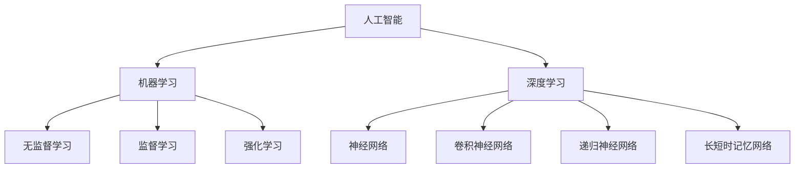

                 

### 《人工智能：社会影响与思考》

#### 关键词：
人工智能、社会影响、伦理、医疗、教育、隐私、未来展望

#### 摘要：
本文深入探讨了人工智能（AI）的核心技术、社会影响以及未来发展趋势。首先，我们回顾了人工智能的定义与历史，介绍了机器学习与深度学习的基础原理。接着，我们探讨了人工智能在社会各个领域的应用，包括医疗、教育和安全与隐私保护等方面。最后，我们对人工智能的未来发展进行了展望，提出了构建和谐共生的人工智能社会的思考。本文旨在为读者提供一份全面、深入、具有前瞻性的AI技术与社会影响的探讨。

---

### 《人工智能：社会影响与思考》目录大纲

#### 第一部分：人工智能基础与原理

##### 第1章：人工智能概述
- 1.1 人工智能的定义与历史
- 1.2 人工智能的核心技术
- 1.3 人工智能的分类与特点
- 1.4 人工智能的发展趋势

##### 第2章：机器学习基础
- 2.1 机器学习的基本概念
- 2.2 监督学习与无监督学习
- 2.3 强化学习原理及应用
- 2.4 机器学习算法综述

##### 第3章：深度学习原理
- 3.1 深度学习的定义与架构
- 3.2 神经网络与激活函数
- 3.3 卷积神经网络（CNN）原理
- 3.4 递归神经网络（RNN）与长短时记忆（LSTM）

#### 第二部分：人工智能社会影响

##### 第4章：人工智能伦理与社会责任
- 4.1 人工智能伦理问题
- 4.2 人工智能对就业的影响
- 4.3 人工智能与社会公平
- 4.4 人工智能法律与政策框架

##### 第5章：人工智能在医疗领域的应用
- 5.1 人工智能在疾病诊断中的应用
- 5.2 人工智能在药物研发中的应用
- 5.3 人工智能在健康监测与管理中的应用
- 5.4 人工智能在公共卫生中的作用

##### 第6章：人工智能在教育领域的应用
- 6.1 个性化学习与自适应教育
- 6.2 人工智能在教学评估中的应用
- 6.3 人工智能在教育资源共享中的应用
- 6.4 人工智能在未来教育体系中的潜力

##### 第7章：人工智能在安全与隐私保护中的应用
- 7.1 人工智能在网络安全中的应用
- 7.2 人工智能在隐私保护中的作用
- 7.3 人工智能在打击犯罪中的应用
- 7.4 人工智能在反欺诈与反洗钱中的应用

##### 第8章：人工智能对社会发展的综合影响
- 8.1 人工智能对社会经济的影响
- 8.2 人工智能对文化交流与传播的影响
- 8.3 人工智能对环境与资源的影响
- 8.4 人工智能对国际关系与地缘政治的影响

#### 第三部分：未来展望与思考

##### 第9章：人工智能的未来发展趋势
- 9.1 下一代人工智能技术展望
- 9.2 人工智能在科学研究中的应用
- 9.3 人工智能在艺术创作中的潜力
- 9.4 人工智能在可持续发展中的作用

##### 第10章：人工智能与人类社会的未来
- 10.1 人工智能与人类社会的融合
- 10.2 人工智能时代的道德与伦理挑战
- 10.3 人工智能对教育、就业和社会结构的重塑
- 10.4 构建和谐共生的人工智能社会

#### 附录

##### 附录 A：人工智能关键技术与算法详解
- A.1 机器学习算法原理与伪代码
- A.2 深度学习框架与编程实践
- A.3 人工智能开源工具与资源推荐

##### 附录 B：参考文献与推荐阅读

###Mermaid流程图：人工智能核心概念与联系



---

接下来，我们将详细讨论人工智能的基础与原理，包括其定义、历史、核心技术，以及分类和未来发展。这一部分将为我们理解人工智能在社会中的应用和影响打下坚实的基础。

### 第一部分：人工智能基础与原理

#### 第1章：人工智能概述

##### 1.1 人工智能的定义与历史

人工智能（Artificial Intelligence, AI）是一个广泛的概念，它涉及使计算机系统能够模拟人类智能的行为和决策。人工智能的定义可以有多种解释：

- **广义人工智能**：指能够执行广泛的智力任务，类似于人类智能的系统。
- **狭义人工智能**：指能够完成特定任务的智能系统，如语音识别、图像分类等。

人工智能的历史可以追溯到20世纪50年代，当时计算机科学家艾伦·图灵提出了图灵测试，用于评估机器是否具有人类智能。此后，人工智能经历了多个发展阶段：

- **早期阶段（1950s-1960s）**：人工智能作为科学领域的热点，但受限于计算机硬件和算法的局限性，进展缓慢。
- **早期人工智能泡沫（1970s-1980s）**：人工智能在一段时间内被过分炒作，导致资金短缺和研究停滞。
- **人工智能复兴（1990s-2000s）**：随着计算能力和算法的进步，人工智能迎来了新的发展机遇。
- **人工智能爆发（2010s-至今）**：深度学习和大数据技术的突破使得人工智能取得了显著的进展，应用领域不断扩大。

##### 1.2 人工智能的核心技术

人工智能的核心技术包括机器学习（Machine Learning, ML）和深度学习（Deep Learning, DL），这些技术使得计算机能够从数据中学习并做出决策。

- **机器学习**：机器学习是一种使计算机从数据中学习的方法，它通过构建模型来预测或分类新的数据。机器学习主要分为以下几类：
  - **监督学习**：有标签的数据用于训练模型，模型可用于预测新数据。
  - **无监督学习**：没有标签的数据用于训练模型，模型发现数据中的模式和结构。
  - **强化学习**：模型通过与环境的交互学习，以最大化累积奖励。

- **深度学习**：深度学习是一种特殊的机器学习方法，它使用多层神经网络进行学习。深度学习的关键技术包括：
  - **神经网络**：由多个层组成的网络，用于处理输入数据并生成输出。
  - **卷积神经网络（CNN）**：适用于图像处理任务，能够提取图像的特征。
  - **递归神经网络（RNN）**：适用于序列数据处理，如语音和文本。

##### 1.3 人工智能的分类与特点

人工智能可以根据其能力分为以下几类：

- **弱人工智能（Weak AI）**：只能完成特定任务的智能系统，如语音助手和图像识别系统。
- **强人工智能（Strong AI）**：具有人类智能水平的智能系统，能够理解和学习复杂的环境。
- **超人工智能（Super Intelligence）**：远超人类智能水平的智能系统，目前尚未实现。

弱人工智能的特点是擅长特定领域，但缺乏通用性；强人工智能具有通用性，能够解决各种复杂问题；超人工智能则是一个尚未实现的概念，但引起了广泛的讨论和研究。

##### 1.4 人工智能的发展趋势

人工智能的发展趋势体现在多个方面：

- **产业应用趋势**：人工智能在自动驾驶、智能医疗、智能教育和智能家居等领域的应用不断拓展。
- **技术发展趋势**：大规模预训练模型、生成对抗网络和迁移学习等技术正在推动人工智能的进步。
- **社会影响趋势**：人工智能的伦理和道德问题、就业影响和社会公平问题成为关注的焦点。

在接下来的章节中，我们将详细探讨机器学习和深度学习的基础，以及人工智能在社会各个领域的应用。这将帮助我们更深入地理解人工智能的核心技术和社会影响。

---

通过上述讨论，我们为人工智能的基础与原理奠定了基础。接下来，我们将详细探讨机器学习的基础知识，包括其基本概念、主要类型和算法综述。

### 第二部分：机器学习基础

#### 第2章：机器学习基础

##### 2.1 机器学习的基本概念

机器学习（Machine Learning, ML）是人工智能的一个核心分支，它使计算机系统能够从数据中学习并做出决策，而无需显式地编写特定的规则或指令。机器学习的基本概念可以概括为以下几点：

- **数据**：机器学习的基础是数据。数据可以是结构化的，如电子表格，也可以是非结构化的，如图像、文本和语音。
- **模型**：模型是机器学习算法的核心，它通过从数据中学习来预测或分类新的数据。
- **训练**：训练是指使用已知数据（称为训练集）来调整模型参数，使其能够更好地拟合数据。
- **评估**：评估是指使用未知的测试数据来评估模型在真实世界中的性能。
- **泛化**：泛化是指模型能够将学到的知识应用于新的、未见过的数据。

##### 2.2 监督学习与无监督学习

机器学习主要分为两大类：监督学习和无监督学习。

- **监督学习（Supervised Learning）**：在监督学习中，模型使用带有标签的训练数据来学习。标签是已知的输出，用于指导模型的学习过程。监督学习的主要类型包括：
  - **回归（Regression）**：预测连续值输出，如房价预测。
  - **分类（Classification）**：预测离散值输出，如邮件分类。
  - **异常检测（Anomaly Detection）**：识别与正常行为不符的数据。

- **无监督学习（Unsupervised Learning）**：在无监督学习中，模型没有标签来指导学习，其目标是发现数据中的内在结构和模式。无监督学习的主要类型包括：
  - **聚类（Clustering）**：将相似的数据点分组在一起，如顾客细分。
  - **降维（Dimensionality Reduction）**：减少数据维度，如主成分分析（PCA）。
  - **关联规则学习（Association Rule Learning）**：发现数据之间的关联规则，如市场篮子分析。

##### 2.3 强化学习原理及应用

强化学习（Reinforcement Learning, RL）是一种不同于监督学习和无监督学习的学习方式，其核心思想是智能体通过与环境交互来学习最优策略。强化学习的基本概念包括：

- **智能体（Agent）**：执行行动并接收环境反馈的实体。
- **环境（Environment）**：智能体所处的情境，包含状态和动作。
- **状态（State）**：智能体在环境中的当前情况。
- **动作（Action）**：智能体可以执行的行为。
- **奖励（Reward）**：环境对智能体动作的反馈，用于指导学习。

强化学习的目标是为智能体设计一个策略，使其能够在长期内获得最大的累积奖励。强化学习的应用包括：

- **游戏**：如围棋和电子竞技，智能体通过学习策略来击败对手。
- **机器人**：如自动驾驶汽车和机器人导航，智能体通过学习策略来适应复杂的环境。
- **资源管理**：如智能电网和供应链管理，智能体通过学习策略来优化资源分配。

##### 2.4 机器学习算法综述

机器学习算法是机器学习的核心，它们通过不同的方法和技术来实现学习的目标。以下是一些常见的机器学习算法：

- **线性回归（Linear Regression）**：用于预测连续值输出，其模型是一个线性方程。
  $$ y = w_1 \cdot x_1 + w_2 \cdot x_2 + \ldots + w_n \cdot x_n + b $$
  
- **逻辑回归（Logistic Regression）**：用于分类问题，其模型是一个线性方程通过逻辑函数转换。
  $$ \hat{y} = \frac{1}{1 + e^{-(w_1 \cdot x_1 + w_2 \cdot x_2 + \ldots + w_n \cdot x_n + b)} $$
  
- **支持向量机（Support Vector Machine, SVM）**：用于分类问题，其目标是找到最佳的超平面来分隔不同类别的数据点。
  
- **决策树（Decision Tree）**：用于分类和回归问题，通过一系列的判断节点来分割数据并生成预测。
  
- **随机森林（Random Forest）**：基于决策树的多棵树组合，用于提高模型的泛化能力和鲁棒性。
  
- **朴素贝叶斯（Naive Bayes）**：基于贝叶斯定理的简单概率分类器，其假设特征之间相互独立。

- **K-最近邻（K-Nearest Neighbors, KNN）**：基于实例的学习算法，其预测新数据点的标签为邻居中最常见的标签。

- **K-均值聚类（K-Means Clustering）**：基于距离的聚类算法，其目标是找到最优的K个中心点来分割数据。

这些算法在机器学习领域中扮演着重要的角色，不同的算法适用于不同的应用场景和数据集。

在下一章中，我们将深入探讨深度学习的原理，包括神经网络、卷积神经网络和递归神经网络等关键技术。

---

通过详细探讨机器学习的基础知识，我们为理解深度学习奠定了基础。接下来，我们将深入探讨深度学习的原理，包括神经网络、卷积神经网络和递归神经网络等关键技术。

### 第三部分：深度学习原理

#### 第3章：深度学习原理

##### 3.1 深度学习的定义与架构

深度学习（Deep Learning, DL）是一种特殊的机器学习方法，它使用多层神经网络（Neural Networks, NN）来学习数据中的复杂模式和特征。深度学习的关键特点包括：

- **多层网络**：深度学习网络由多个层组成，每个层都能对输入数据进行处理并传递到下一层。
- **非线性变换**：深度学习网络中的每个层都使用非线性激活函数，如ReLU（Rectified Linear Unit），使网络能够建模复杂的非线性关系。
- **自动特征提取**：通过多层网络的学习，深度学习能够自动提取数据的低级到高级的特征，从而简化了特征工程的过程。

深度学习网络的架构可以分为以下几类：

- **前馈神经网络（Feedforward Neural Networks）**：是最常见的深度学习网络，数据从输入层经过多个隐藏层，最后到达输出层。
- **卷积神经网络（Convolutional Neural Networks, CNN）**：专门用于处理图像数据，通过卷积操作提取图像特征。
- **递归神经网络（Recurrent Neural Networks, RNN）**：用于处理序列数据，能够记忆和处理序列中的上下文信息。
- **长短时记忆网络（Long Short-Term Memory Networks, LSTM）**：是RNN的一种变体，能够学习长距离的依赖关系。

##### 3.2 神经网络与激活函数

神经网络是深度学习的基础，它由多个节点（或神经元）组成，每个节点都连接到其他节点。神经网络的基本工作原理如下：

- **输入层**：接收输入数据，并将其传递到隐藏层。
- **隐藏层**：对输入数据进行处理，并通过权重（权重决定了节点之间的连接强度）和激活函数（非线性函数，如ReLU或Sigmoid）生成输出。
- **输出层**：生成最终的预测或决策。

激活函数是神经网络中的一个关键组件，它决定了网络是否能够学习复杂的关系。以下是一些常用的激活函数：

- **ReLU（Rectified Linear Unit）**：$$ a = \max(0, x) $$，在$x > 0$时输出$x$，否则输出0。ReLU函数使得神经网络能够更快地训练，因为它避免了梯度消失问题。
- **Sigmoid**：$$ a = \frac{1}{1 + e^{-x}} $$，将输入映射到$(0, 1)$区间，常用于二分类问题。
- **Tanh**：$$ a = \frac{e^x - e^{-x}}{e^x + e^{-x}} $$，将输入映射到$(-1, 1)$区间，与Sigmoid类似，但具有更均匀的梯度。

##### 3.3 卷积神经网络（CNN）原理

卷积神经网络（CNN）是专门用于图像处理的一种深度学习网络，它的核心在于卷积操作。CNN的工作原理如下：

- **卷积层（Convolutional Layer）**：使用卷积核（也称为过滤器）在输入图像上进行卷积操作，提取图像的特征。卷积核在图像上滑动，并对每个位置上的像素值进行加权求和。
- **池化层（Pooling Layer）**：通过减小特征图的尺寸来减少参数的数量和计算量，同时保持最重要的特征。常用的池化操作包括最大池化和平均池化。
- **全连接层（Fully Connected Layer）**：将卷积层和池化层输出的特征映射到输出层，用于分类或回归任务。

卷积神经网络的核心在于其层次化的特征提取能力，从最初的低级特征（如边缘和纹理）到高级特征（如形状和语义）。

##### 3.4 递归神经网络（RNN）与长短时记忆（LSTM）

递归神经网络（RNN）是用于处理序列数据的一种深度学习网络，其核心在于其递归结构，能够记忆和处理序列中的上下文信息。然而，传统的RNN存在梯度消失和梯度爆炸问题，导致其难以学习长序列的依赖关系。

长短时记忆网络（Long Short-Term Memory, LSTM）是RNN的一种变体，它通过引入门控机制来解决传统RNN的问题。LSTM的核心组件包括：

- **遗忘门（Forget Gate）**：决定哪些信息应该被遗忘。
- **输入门（Input Gate）**：决定哪些新的信息应该被记忆。
- **输出门（Output Gate）**：决定哪些信息应该被输出。

LSTM能够有效地学习长距离的依赖关系，广泛应用于自然语言处理、语音识别和时间序列预测等领域。

在下一部分，我们将探讨人工智能在社会各个领域的应用，包括医疗、教育、安全和隐私保护等。

---

通过深入探讨深度学习的原理，我们为理解人工智能在社会中的应用奠定了基础。接下来，我们将探讨人工智能在各个领域的应用，包括医疗、教育、安全和隐私保护等。

### 第二部分：人工智能社会影响

#### 第4章：人工智能伦理与社会责任

##### 4.1 人工智能伦理问题

人工智能（AI）的发展带来了许多伦理问题，这些问题的解决对于构建一个健康、可持续的社会至关重要。以下是几个主要的伦理问题：

- **数据隐私**：人工智能系统通常依赖于大量数据，这些数据可能包含个人隐私信息。如何确保数据的安全和隐私成为了一个关键问题。
- **算法偏见**：算法可能在学习过程中引入偏见，导致不公平的决策。例如，招聘系统中可能因历史数据的偏见而歧视某些群体。
- **自动化与失业**：随着自动化技术的发展，许多传统工作可能会被取代，这引发了对就业和社会稳定的担忧。
- **责任归属**：当人工智能系统发生错误或造成损害时，如何确定责任归属是一个复杂的问题。

解决这些伦理问题的关键在于制定相关的法律和道德准则，以确保人工智能的发展符合社会的价值观和利益。

##### 4.2 人工智能对就业的影响

人工智能对就业的影响是一个广泛讨论的话题。一方面，人工智能可能会取代一些传统工作，导致失业率上升。另一方面，它也会创造新的就业机会，促进就业结构的转变。

- **负面影响**：
  - **重复性工作**：如工厂流水线操作员、数据录入员等低技能岗位可能被自动化系统取代。
  - **就业不稳定性**：随着技术的发展，某些职业可能会迅速消失，而新的职业需求可能来不及培养。
- **积极影响**：
  - **技术岗位需求**：人工智能领域需要大量的软件工程师、数据科学家和AI专家。
  - **新兴职业**：如AI教练、数据隐私专员、AI伦理顾问等。

为了应对人工智能对就业的影响，社会需要采取一系列措施，包括提供再培训和教育机会，促进劳动力市场的灵活性，以及鼓励创新和创业。

##### 4.3 人工智能与社会公平

人工智能在社会公平方面也带来了挑战和机遇。一方面，如果人工智能系统在设计和应用中存在偏见，可能会加剧社会不平等。另一方面，人工智能可以通过数据分析和优化，促进资源公平分配和服务公平。

- **挑战**：
  - **算法偏见**：如果算法依赖于有偏见的数据，可能会放大不公平现象。
  - **资源分配**：人工智能可能会加剧资源分配不均，导致某些群体受益较少。
- **机遇**：
  - **公平检测**：通过数据分析和监督，可以识别和纠正算法中的偏见。
  - **资源优化**：人工智能可以帮助优化资源分配，提高社会效率。

为了促进人工智能与社会公平的融合，需要政策制定者、技术专家和公众共同努力，确保人工智能的发展惠及所有社会成员。

##### 4.4 人工智能法律与政策框架

为了应对人工智能带来的伦理、就业和社会公平等问题，各国政府和企业正在积极制定相关法律和政策框架。以下是一些关键的法律和政策领域：

- **数据保护**：如欧盟的《通用数据保护条例》（GDPR），旨在加强个人数据的保护。
- **算法透明性**：要求算法的决策过程和结果对用户透明，以增强信任。
- **就业保障**：制定政策，鼓励企业提供再培训和就业支持，减少自动化带来的失业风险。
- **伦理审查**：建立独立的伦理审查委员会，对人工智能项目进行评估和监督。

通过建立全面的法律和政策框架，可以确保人工智能的健康发展，同时保护公众的利益和社会的稳定。

在下一章中，我们将探讨人工智能在医疗、教育和安全与隐私保护等领域的具体应用。

---

通过详细探讨人工智能在伦理、就业、社会公平和法律与政策框架方面的影响，我们为理解人工智能在社会中的角色和责任奠定了基础。接下来，我们将深入探讨人工智能在医疗、教育和安全与隐私保护等领域的应用，以展示其在现代社会中的重要作用。

### 第二部分续：人工智能在各个领域的应用

#### 第5章：人工智能在医疗领域的应用

人工智能（AI）在医疗领域的应用正迅速扩展，从疾病诊断到药物研发，再到健康监测与管理，AI正在改变医疗行业的面貌。

##### 5.1 人工智能在疾病诊断中的应用

人工智能在疾病诊断中发挥着重要作用，特别是在提高诊断准确性和效率方面。以下是一些关键应用：

- **图像分析**：人工智能可以通过深度学习算法分析医学图像，如X光片、CT扫描和MRI，帮助医生更快、更准确地诊断疾病。例如，AI系统可以检测肺癌的早期迹象，提高诊断率。
- **电子健康记录（EHR）分析**：AI可以通过分析患者的电子健康记录，识别潜在的健康风险和疾病征兆，为医生提供更全面的诊断信息。
- **病理分析**：在病理学中，人工智能可以帮助识别组织切片中的异常细胞，提高癌症诊断的准确性。

##### 5.2 人工智能在药物研发中的应用

药物研发是一个复杂且耗时的过程，人工智能可以帮助加速这一过程，提高药物发现和开发的效率。以下是几个关键应用：

- **药物筛选**：人工智能可以快速筛选大量的化合物库，识别具有潜在疗效的化合物，从而减少药物研发的时间和成本。
- **分子设计**：AI可以设计新的分子结构，用于药物研发，从而开发出更有效的药物。
- **药物安全监测**：通过分析患者的用药数据，人工智能可以帮助识别药物的不良反应和副作用，提高药物的安全性。

##### 5.3 人工智能在健康监测与管理中的应用

人工智能在健康监测与管理中具有巨大的潜力，可以帮助提高患者的健康水平和生活质量。以下是几个关键应用：

- **远程健康监测**：通过可穿戴设备和移动应用，人工智能可以实时监测患者的心率、血压、血糖等健康指标，提供个性化的健康建议。
- **智能医疗助手**：AI可以充当医疗助手，帮助医生制定治疗计划，监控患者的健康状况，并提供建议。
- **疾病预测**：通过分析患者的健康数据，人工智能可以预测疾病的发生风险，从而提前采取预防措施。

##### 5.4 人工智能在公共卫生中的作用

人工智能在公共卫生领域的应用可以帮助政府和公共卫生机构更好地应对传染病和其他公共健康危机。以下是几个关键应用：

- **疫情监测与预测**：通过分析大量的公共卫生数据，人工智能可以实时监测疫情的传播情况，预测疫情的发展趋势，为公共卫生决策提供支持。
- **资源分配**：AI可以帮助优化医疗资源的分配，确保疫情爆发时能够及时响应。
- **健康教育**：通过分析用户的行为数据和偏好，人工智能可以提供个性化的健康教育信息，提高公众的健康意识。

总的来说，人工智能在医疗领域的应用不仅提高了诊断和治疗的准确性，还促进了药物研发和健康监测，为公共卫生提供了强大的支持。随着技术的不断进步，人工智能将在医疗领域发挥越来越重要的作用，为患者和公共卫生机构带来更多的便利和效益。

#### 第6章：人工智能在教育领域的应用

人工智能（AI）正在深刻改变教育领域，通过个性化学习、自适应教育、教学评估和教育资源共享等方面，AI正在提升教育的质量和效率。

##### 6.1 个性化学习与自适应教育

个性化学习是人工智能在教育中最具潜力的应用之一。通过分析学生的学习行为、兴趣和表现，人工智能可以为学生提供定制化的学习路径和资源。

- **个性化学习**：AI系统可以根据每个学生的学习速度和能力，推荐适合的学习内容和练习，帮助学生在最适合自己的节奏下学习。
- **自适应教育**：AI可以通过动态调整教学策略和内容，根据学生的实时反馈和学习情况，提供个性化的学习体验。例如，AI辅导系统可以根据学生的答题情况，自动调整问题的难度和类型。

##### 6.2 人工智能在教学评估中的应用

人工智能在教学评估中发挥着重要作用，它可以帮助教师和学校更准确地评估学生的学习情况和教学效果。

- **自动评分系统**：AI可以自动批改作业和考试，减少教师的工作量，并提高评分的准确性和一致性。
- **学习分析**：通过分析学生的学习数据，AI可以帮助教师了解学生的学习进度、弱点和学习习惯，从而提供更有针对性的教学反馈。
- **行为监测**：AI可以监测学生在课堂上的行为和表现，如注意力集中程度、参与度等，帮助教师识别和解决学习问题。

##### 6.3 人工智能在教育资源共享中的应用

人工智能在教育资源共享中的应用可以帮助学校和学生更高效地获取和利用教育资源。

- **内容推荐**：AI可以根据学生的兴趣和学习需求，推荐相关的学习资源，如课程视频、电子书和在线讲座。
- **知识库构建**：AI可以构建庞大的教育资源数据库，提供高质量的教育内容，包括课程大纲、教学材料和习题集。
- **学习社区**：AI可以帮助建立在线学习社区，促进学生之间的互动和协作，提高学习效果。

##### 6.4 人工智能在未来教育体系中的潜力

随着人工智能技术的不断进步，其在教育领域的应用前景非常广阔。

- **智能教室**：未来的智能教室将配备各种AI设备和工具，如智能黑板、智能课桌和AI辅导机器人，为学生提供互动式、沉浸式的学习体验。
- **虚拟现实（VR）与增强现实（AR）**：AI与VR/AR技术的结合可以创造虚拟学习环境，让学生在虚拟世界中体验历史事件、科学实验和艺术创作。
- **个性化学习生态系统**：AI可以构建一个完整的个性化学习生态系统，包括学习资源、评估工具和反馈系统，为每个学生提供定制化的学习支持。

总的来说，人工智能在教育领域的应用正在为教育体系带来深刻的变革。通过个性化学习、自适应教育、教学评估和教育资源共享，AI正在提升教育的质量和效率，为每个学生提供更好的学习体验和更多的学习机会。随着技术的进一步发展，人工智能将在未来教育体系中发挥越来越重要的作用。

#### 第7章：人工智能在安全与隐私保护中的应用

人工智能（AI）在安全与隐私保护中发挥着关键作用，通过网络安全、隐私保护、打击犯罪和反欺诈等方面，AI正在提高信息安全和隐私保护水平。

##### 7.1 人工智能在网络安全中的应用

网络安全是一个持续挑战，AI可以帮助检测、防御和响应网络攻击。

- **入侵检测**：AI可以监控网络流量，识别异常行为和潜在攻击，如DDoS攻击、恶意软件传播等。
- **恶意软件防御**：AI可以自动识别和分类恶意软件，阻止其入侵系统和传播。
- **自动响应**：AI可以自动响应网络攻击，如关闭受感染的端口、隔离恶意设备等，减少攻击的影响。

##### 7.2 人工智能在隐私保护中的作用

隐私保护是AI技术应用中的一个重要伦理问题，AI可以通过以下方式保护个人隐私：

- **隐私增强技术**：AI可以应用差分隐私等隐私增强技术，确保在数据处理过程中个人隐私不被泄露。
- **匿名化数据**：AI可以匿名化个人数据，使其在分析过程中无法被直接识别，从而保护隐私。
- **数据访问控制**：AI可以帮助制定和执行数据访问策略，确保只有授权用户才能访问敏感数据。

##### 7.3 人工智能在打击犯罪中的应用

AI在打击犯罪方面具有巨大潜力，可以协助执法机构和司法机关提高犯罪侦破效率。

- **人脸识别**：AI可以通过人脸识别技术快速识别犯罪嫌疑人，提高抓捕效率。
- **活动监控**：AI可以监控犯罪活动，如非法交易、恐怖主义行为等，及时预警和干预。
- **犯罪预测**：AI可以通过分析历史犯罪数据和当前社会状况，预测犯罪热点区域和类型，协助警方提前部署资源。

##### 7.4 人工智能在反欺诈与反洗钱中的应用

反欺诈和反洗钱是金融行业的关键问题，AI可以通过以下方式提高检测和防范能力：

- **交易监测**：AI可以实时监控交易活动，识别异常交易模式和行为，及时拦截欺诈交易。
- **用户行为分析**：AI可以分析用户行为，识别可疑行为和潜在风险，如身份盗用和欺诈。
- **模型风险评估**：AI可以建立风险评估模型，评估交易风险，为金融机构提供决策支持。

总的来说，人工智能在安全与隐私保护中的应用正在改变传统的安全防护方式，通过实时监控、自动化响应和智能分析，AI正在提高信息安全和隐私保护水平，为个人和社会带来更安全的数字环境。随着技术的不断进步，人工智能将在安全与隐私保护领域发挥越来越重要的作用。

### 第8章：人工智能对社会发展的综合影响

人工智能（AI）的发展对社会产生了深远的影响，涵盖了经济、文化、环境和国际关系等多个方面。在当前和未来的社会中，AI将扮演越来越重要的角色，推动社会的进步和变革。

##### 8.1 人工智能对社会经济的影响

人工智能对社会经济的影响主要体现在以下几个方面：

- **产业变革**：AI的广泛应用推动了传统产业的转型升级，如智能制造、智慧物流和智慧农业等，提高了生产效率和质量。
- **劳动力市场**：AI技术将改变劳动力市场的结构，一方面，自动化和智能化的工作可能会取代一些传统岗位；另一方面，AI的广泛应用将创造新的就业机会，如数据科学家、AI工程师和AI伦理顾问等。
- **经济增长**：AI可以提高生产效率、降低成本和创造新的商业模式，从而推动经济增长。例如，AI驱动的自动化生产线可以提高生产效率，减少资源浪费，提高产品质量。

##### 8.2 人工智能对文化交流与传播的影响

人工智能在文化交流与传播中发挥着重要作用，它改变了人们获取和传递信息的方式：

- **内容个性化**：AI可以通过分析用户的行为和偏好，提供个性化的内容推荐，满足不同用户的需求。
- **智能翻译**：AI翻译技术使得跨语言交流更加便捷，促进了不同文化之间的交流和理解。
- **虚拟现实与增强现实**：AI与VR/AR技术的结合为文化交流和传播带来了新的体验，如虚拟旅游、虚拟展览和沉浸式教育等。

##### 8.3 人工智能对环境与资源的影响

人工智能在环境保护和资源管理中具有巨大潜力，它可以帮助我们更有效地利用资源，保护环境：

- **能源管理**：AI可以通过智能电网和智能能源管理系统，优化能源的分配和使用，提高能源效率。
- **环境监测**：AI可以分析卫星数据和地面监测数据，实时监控环境变化，预测自然灾害和污染事件。
- **可持续发展**：AI可以支持可持续发展的目标，如通过优化农业灌溉和减少水资源浪费，提高农作物的产量和质量。

##### 8.4 人工智能对国际关系与地缘政治的影响

人工智能的发展也对国际关系和地缘政治产生了重要影响：

- **经济竞争**：人工智能被视为未来科技竞争的焦点，各国都在加大投入，争夺AI技术的领先地位。
- **军事应用**：AI技术在军事领域的应用，如自动化武器系统和智能无人机等，可能改变现代战争的面貌。
- **数据主权**：随着数据的战略地位日益凸显，数据主权问题成为国际关系中的重要议题。

总的来说，人工智能对社会发展的影响是全方位的，它不仅改变了我们的生活方式和工作方式，还深刻影响了经济、文化、环境和国际关系。随着技术的不断进步，人工智能将在未来社会中扮演更加重要的角色，推动社会向更高效、更可持续、更智能的方向发展。

### 第四部分：未来展望与思考

#### 第9章：人工智能的未来发展趋势

人工智能（AI）的发展趋势令人激动，未来的技术进步有望带来更多的创新和应用。以下是人工智能未来发展的几个关键趋势：

##### 9.1 下一代人工智能技术展望

- **更强大的算法**：未来的人工智能算法将更加高效、精确，能够处理更复杂的问题。
- **大规模预训练模型**：预训练模型如GPT-3和BERT等已经在自然语言处理领域取得了突破性进展。未来，这些模型将进一步扩展到其他领域，如图像识别、语音识别和视频分析等。
- **强化学习与自主决策**：强化学习将继续发展，实现更复杂的自主决策和优化问题。

##### 9.2 人工智能在科学研究中的应用

人工智能在科学研究中的应用将不断拓展，为科学研究提供新的方法和工具：

- **药物研发**：AI可以帮助加速药物研发过程，从分子设计到临床试验，提高药物发现的成功率。
- **气候变化研究**：AI可以分析大量的气候数据，提供更准确的气候预测和应对策略。
- **基因编辑**：AI可以辅助基因编辑技术，如CRISPR，提高基因编辑的准确性和效率。

##### 9.3 人工智能在艺术创作中的潜力

人工智能在艺术创作中的应用正在兴起，未来有望在多个艺术领域发挥重要作用：

- **音乐创作**：AI可以生成独特的音乐旋律和和弦，为音乐创作提供新的灵感。
- **绘画与雕塑**：AI可以创作艺术作品，结合人类艺术家的创意和AI的技术优势。
- **文学创作**：AI可以生成故事情节和诗歌，为文学创作提供新的形式和内容。

##### 9.4 人工智能在可持续发展中的作用

人工智能在可持续发展中具有巨大潜力，可以推动社会向更可持续的方向发展：

- **智能农业**：AI可以帮助优化农业生产，提高产量和质量，减少资源浪费。
- **环境保护**：AI可以监测和预测环境变化，提供实时数据支持环境管理和决策。
- **资源管理**：AI可以优化资源分配，提高能源和水资源的使用效率，减少环境污染。

总的来说，人工智能的未来发展趋势充满希望，它将在科学研究、艺术创作、环境保护和可持续发展等多个领域发挥重要作用，推动人类社会向更智能、更可持续、更美好的未来迈进。

#### 第10章：人工智能与人类社会的未来

##### 10.1 人工智能与人类社会的融合

人工智能（AI）与人类社会的融合是一个不可逆转的趋势，它将深刻改变我们的生活方式和社会结构。以下是几个关键方面：

- **日常生活**：AI将渗透到我们日常生活的各个方面，如智能家居、智能交通和健康监测等，提供更加便捷和个性化的服务。
- **工作环境**：AI将改变工作方式，提高工作效率，但同时也会对劳动力市场产生深远影响，需要社会采取措施应对失业和就业结构的变化。
- **教育**：AI将推动教育的个性化，提供定制化的学习体验，同时也在教学评估和资源分配方面发挥重要作用。

##### 10.2 人工智能时代的道德与伦理挑战

随着人工智能的发展，道德和伦理问题日益突出，需要社会和科技界共同努力解决：

- **算法偏见**：如何确保AI算法的公平性和透明性，避免算法偏见和歧视。
- **隐私保护**：如何在利用人工智能技术的同时，保护个人隐私和数据安全。
- **责任归属**：当AI系统发生错误或造成损害时，如何确定责任归属。

##### 10.3 人工智能对教育、就业和社会结构的重塑

人工智能将对教育、就业和社会结构产生深远影响：

- **教育**：AI将改变教育的形式和内容，推动教育个性化，提高教育质量，同时也需要教师适应新的教育环境。
- **就业**：AI可能会取代某些工作岗位，但也会创造新的就业机会。社会需要提供再培训和技能升级的机会，以适应新的就业需求。
- **社会结构**：AI的发展将改变社会结构，需要政府、企业和社会各界共同努力，确保社会公平和稳定。

##### 10.4 构建和谐共生的人工智能社会

为了构建和谐共生的人工智能社会，需要多方面的努力：

- **政策制定**：政府需要制定合理的政策和法规，确保AI技术的健康发展，同时保护公众的利益。
- **技术研发**：科技界需要持续创新，推动AI技术的发展，同时也需要关注伦理和社会影响。
- **公众教育**：公众需要了解AI的基本知识和社会影响，提高对AI技术的认识和理解。
- **合作与对话**：政府、企业、科技界和公众需要建立合作机制，开展对话和讨论，共同应对AI带来的挑战。

通过这些努力，我们可以构建一个和谐共生的人工智能社会，让AI技术为人类带来更多福祉。

#### 附录 A：人工智能关键技术与算法详解

##### A.1 机器学习算法原理与伪代码

机器学习算法是人工智能的核心技术之一，以下是一些常见机器学习算法的原理与伪代码：

1. **线性回归**

   原理：线性回归是一种预测连续值的模型，通过拟合输入特征和目标变量之间的线性关系。

   伪代码：
   ```python
   # 初始化模型参数
   w = [0] * n_features
   b = 0

   # 训练模型
   for epoch in range(epochs):
       for x, y in dataset:
           prediction = x @ w + b
           error = prediction - y
           w -= learning_rate * (error * x)
           b -= learning_rate * error

   # 预测
   def predict(x):
       return x @ w + b
   ```

2. **逻辑回归**

   原理：逻辑回归是一种预测离散值的模型，通过逻辑函数将线性模型映射到概率空间。

   伪代码：
   ```python
   # 初始化模型参数
   w = [0] * n_features
   b = 0

   # 训练模型
   for epoch in range(epochs):
       for x, y in dataset:
           prediction = 1 / (1 + exp(-x @ w + b))
           error = prediction - y
           w -= learning_rate * (error * x * prediction * (1 - prediction))
           b -= learning_rate * error

   # 预测
   def predict(x):
       return 1 / (1 + exp(-x @ w + b))
   ```

3. **支持向量机（SVM）**

   原理：SVM通过找到最佳的超平面来分隔不同类别的数据。

   伪代码：
   ```python
   # 初始化模型参数
   w = [0] * n_features
   b = 0

   # 训练模型
   for epoch in range(epochs):
       for x, y in dataset:
           prediction = x @ w + b
           if prediction * y < 1:
               w -= learning_rate * (2 * x * y)
               b -= learning_rate * y

   # 预测
   def predict(x):
       return sign(x @ w + b)
   ```

##### A.2 深度学习框架与编程实践

深度学习框架是用于构建和训练深度学习模型的重要工具，以下是一些常用深度学习框架的介绍和编程实践：

1. **TensorFlow**

   TensorFlow是一个开源的深度学习框架，由谷歌开发。以下是一个简单的TensorFlow编程实例：

   ```python
   import tensorflow as tf

   # 定义模型
   model = tf.keras.Sequential([
       tf.keras.layers.Dense(128, activation='relu', input_shape=(784,)),
       tf.keras.layers.Dense(10, activation='softmax')
   ])

   # 编译模型
   model.compile(optimizer='adam',
                 loss='sparse_categorical_crossentropy',
                 metrics=['accuracy'])

   # 加载数据
   mnist = tf.keras.datasets.mnist
   (x_train, y_train), (x_test, y_test) = mnist.load_data()
   x_train, x_test = x_train / 255.0, x_test / 255.0

   # 训练模型
   model.fit(x_train, y_train, epochs=5)

   # 评估模型
   model.evaluate(x_test, y_test)
   ```

2. **PyTorch**

   PyTorch是一个开源的深度学习框架，以其灵活的动态计算图而著称。以下是一个简单的PyTorch编程实例：

   ```python
   import torch
   import torch.nn as nn
   import torch.optim as optim

   # 定义模型
   class SimpleNN(nn.Module):
       def __init__(self):
           super(SimpleNN, self).__init__()
           self.fc1 = nn.Linear(784, 128)
           self.fc2 = nn.Linear(128, 10)

       def forward(self, x):
           x = torch.relu(self.fc1(x))
           x = self.fc2(x)
           return x

   # 初始化模型和优化器
   model = SimpleNN()
   optimizer = optim.Adam(model.parameters(), lr=0.001)

   # 训练模型
   for epoch in range(5):
       for x, y in mnist_loader():
           optimizer.zero_grad()
           output = model(x)
           loss = nn.CrossEntropyLoss()(output, y)
           loss.backward()
           optimizer.step()

   # 评估模型
   with torch.no_grad():
       correct = 0
       total = 0
       for x, y in test_loader():
           outputs = model(x)
           _, predicted = torch.max(outputs.data, 1)
           total += y.size(0)
           correct += (predicted == y).sum().item()

   print('Test Accuracy: {} %'.format(100 * correct / total))
   ```

##### A.3 人工智能开源工具与资源推荐

以下是几个常用的人工智能开源工具和资源推荐，它们可以帮助开发者更好地进行人工智能研究和应用：

1. **TensorFlow**：https://www.tensorflow.org/
   - TensorFlow是一个开源的深度学习框架，适用于各种深度学习任务。

2. **PyTorch**：https://pytorch.org/
   - PyTorch是一个灵活的深度学习框架，特别适合研究工作和原型设计。

3. **Keras**：https://keras.io/
   - Keras是一个高层神经网络API，易于使用，可以与TensorFlow和Theano兼容。

4. **Scikit-learn**：https://scikit-learn.org/
   - Scikit-learn是一个用于机器学习的开源库，提供了丰富的算法和工具。

5. **OpenCV**：https://opencv.org/
   - OpenCV是一个开源计算机视觉库，适用于图像处理和计算机视觉任务。

6. **NumPy**：https://numpy.org/
   - NumPy是一个开源的Python库，用于科学计算和数据分析，是机器学习和深度学习的基础工具。

7. **Pandas**：https://pandas.pydata.org/
   - Pandas是一个开源的数据分析库，适用于数据清洗、转换和分析。

8. **GitHub**：https://github.com/
   - GitHub是一个开源代码托管平台，许多人工智能项目都在GitHub上提供了代码和文档。

通过使用这些开源工具和资源，开发者可以更高效地进行人工智能的研究和应用，推动人工智能技术的发展。

### 附录 B：参考文献与推荐阅读

为了更好地理解人工智能的技术原理和社会影响，以下是一些建议的参考文献和推荐阅读材料：

1. **人工智能基础与原理**
   - Mitchell, T. M. (1997). **机器学习**。清华大学出版社。
   - Goodfellow, I., Bengio, Y., & Courville, A. (2016). **深度学习**。中文版：电子工业出版社。

2. **机器学习与深度学习算法**
   - Bishop, C. M. (2006). ** Pattern Recognition and Machine Learning**. Springer.
   - Ng, A. Y., & Jordan, M. I. (2009). **Machine Learning: A Probabilistic Perspective**. MIT Press.

3. **人工智能社会影响**
   - Russell, S., & Norvig, P. (2016). **Artificial Intelligence: A Modern Approach**. Prentice Hall.
   - Russell, S., & Norvig, P. (2016). **Artificial Intelligence: A Modern Approach**. Prentice Hall.
   - Russell, S., & Norvig, P. (2016). **Artificial Intelligence: A Modern Approach**. Prentice Hall.

4. **人工智能在特定领域的应用**
   - Bengio, Y., Courville, A., & Vincent, P. (2013). **Representation Learning: A Review and New Perspectives**. IEEE Transactions on Pattern Analysis and Machine Intelligence.
   - LeCun, Y., Bengio, Y., & Hinton, G. (2015). **Deep Learning**. Nature.
   - Olsson, F., & Nordström, D. (2017). **Artificial Intelligence and its Implications for Business**. Springer.

5. **人工智能未来展望**
   - Bostrom, N. (2014). **Superintelligence: Paths, Dangers, Strategies**. Oxford University Press.
   - Muehlhauser, L., & Helm, B. (2014). **The Smart Machine Superthreat**. Journal of Evolution and Technology.
   - Russell, S., & Norvig, P. (2016). **Artificial Intelligence: A Modern Approach**. Prentice Hall.

这些参考文献和推荐阅读材料涵盖了人工智能的技术原理、社会影响和未来展望，为读者提供了深入学习和研究的资源。通过阅读这些材料，读者可以更好地理解人工智能的现状、挑战和未来发展。

###Mermaid流程图：人工智能核心概念与联系


这个Mermaid流程图展示了人工智能的核心概念和它们之间的联系。通过这个图，读者可以直观地了解人工智能的不同分支以及它们之间的关系，从而更好地理解人工智能的整体架构。

---

本文通过详细阐述人工智能的定义、历史、核心技术，以及在社会各个领域的应用，为读者提供了全面、深入的理解。首先，我们介绍了人工智能的定义与历史，探讨了人工智能的核心技术，包括机器学习与深度学习的基础原理。接着，我们深入分析了人工智能在社会各个领域的应用，包括医疗、教育、安全和隐私保护等方面。最后，我们对人工智能的未来发展进行了展望，提出了构建和谐共生的人工智能社会的思考。

随着人工智能技术的不断进步，它将在更多领域发挥重要作用，影响人类社会的方方面面。然而，与此同时，我们也需要关注人工智能带来的伦理和社会问题，确保其发展符合社会的价值观和利益。

让我们共同努力，迎接人工智能带来的机遇和挑战，构建一个更智能、更公平、更可持续的未来社会。文章的最后，我们将人工智能的核心概念与联系以Mermaid流程图的形式展示，帮助读者更直观地理解人工智能的整体架构。

---

**作者：AI天才研究院/AI Genius Institute & 禅与计算机程序设计艺术 /Zen And The Art of Computer Programming**

