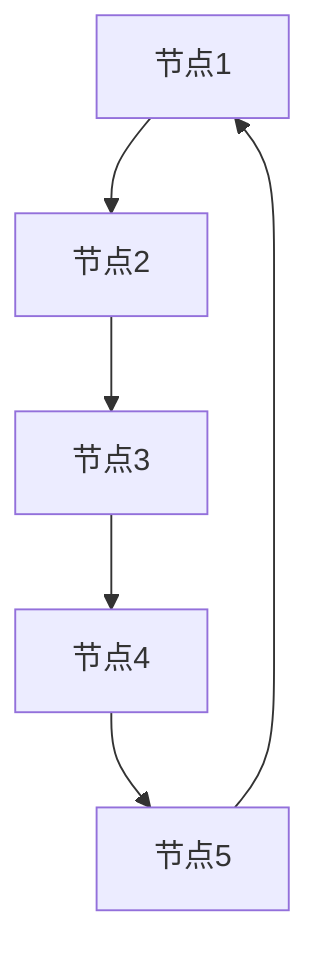
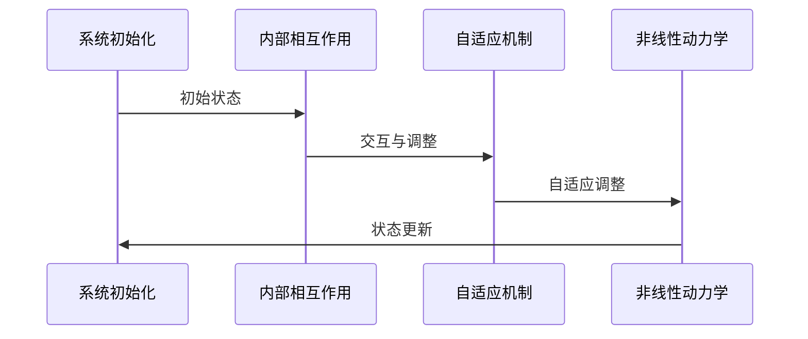
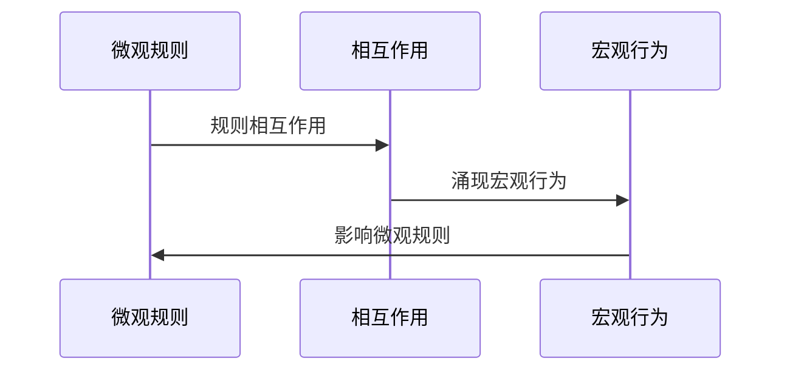

                 

### 文章标题

从经典物理学到复杂性科学：理解涌现现象与自组织过程

### 文章关键词

(经典物理学、复杂性科学、涌现现象、自组织过程、数学模型、算法原理、工程应用、社会科学)

### 文章摘要

本文深入探讨了从经典物理学到复杂性科学的发展历程，重点介绍了涌现现象和自组织过程的基本原理。通过数学模型、核心算法原理讲解、伪代码展示以及实际项目实战，我们揭示了复杂性科学在自然界、工程领域和社会科学中的应用。本文旨在为读者提供一个全面、系统的理解，帮助他们在复杂系统的分析和设计中运用这些原理。文章结构分为五个部分：第一部分介绍经典物理学的起源与发展；第二部分阐述复杂性科学的基本概念与特点；第三部分讲解涌现现象与自组织过程的基本原理；第四部分展示复杂性科学在不同领域的应用；第五部分讨论复杂性科学的挑战与未来发展趋势。通过本文的学习，读者将能够更好地掌握复杂性科学的核心概念和方法，并将其应用于实际问题的解决。

### 引言

在科学发展的历史长河中，经典物理学作为一门基础学科，对人类认识自然世界发挥了至关重要的作用。从牛顿力学到麦克斯韦方程组，经典物理学为我们提供了一个强有力的框架，用以解释和预测宏观世界的物理现象。然而，随着科学研究的不断深入，人类逐渐认识到，经典物理学在处理微观领域和复杂系统时存在一定的局限性。这一局限性促使科学家们开始探索新的理论和方法，从而催生了复杂性科学这一新兴领域。

复杂性科学旨在研究复杂系统的行为和演化规律，这些系统通常具有高度的非线性、不确定性和动态性。涌现现象和自组织过程是复杂性科学中的两个核心概念，它们揭示了系统内部局部规则与宏观行为之间的深刻联系。本文将从经典物理学的起源与发展开始，逐步引入复杂性科学的基本概念，详细探讨涌现现象和自组织过程的基本原理，并分析复杂性科学在自然界、工程领域和社会科学中的应用，最后讨论复杂性科学的挑战与未来发展趋势。

本文的结构如下：

- 第一部分：经典物理学的起源与发展
- 第二部分：复杂性科学的基本概念
- 第三部分：涌现现象与自组织过程
- 第四部分：复杂性科学的应用
- 第五部分：复杂性科学的挑战与未来

通过本文的阅读，读者将能够对复杂性科学有一个全面、系统的理解，并学会如何运用这些原理来解决实际问题。

### 第一部分：经典物理学的起源与发展

经典物理学是科学史上的一座丰碑，它为我们理解自然界提供了坚实的基础。从牛顿力学到麦克斯韦方程组，经典物理学在各个领域都取得了辉煌的成就。然而，经典物理学的起源并非一蹴而就，而是经过了漫长的发展和演变。

#### 1.1 经典物理学的起源

经典物理学的起源可以追溯到古希腊哲学家对自然世界的观察和思考。亚里士多德是其中的一位重要代表，他提出了关于运动和力的基本观念。然而，亚里士多德的观点在后来被伽利略和牛顿等科学家所挑战和修正。

- **伽利略**：伽利略通过实验和观测，提出了自由落体定律和惯性定律，为后来的牛顿力学奠定了基础。他的实验方法和对实验数据的精确分析，成为科学研究的典范。
- **牛顿**：牛顿是经典物理学的奠基人，他提出了牛顿三定律和万有引力定律，从而建立了一个完整的力学体系。牛顿力学的出现，标志着物理学发展进入了一个新的阶段。

牛顿的力学体系不仅解释了宏观物体的运动规律，还成功地预测了天体运动的轨迹。例如，牛顿利用自己的定律成功预测了海王星的 existence。这一成就进一步证明了经典物理学的有效性和广泛适用性。

#### 1.2 经典物理学的理论基础

经典物理学的理论基础主要包括牛顿力学、热力学和电磁学。这些理论为我们提供了描述和解释自然界现象的工具。

- **牛顿力学**：牛顿力学是经典物理学中最核心的部分，它主要研究质点在力的作用下的运动规律。牛顿三定律描述了物体受力后的运动状态变化，而万有引力定律则描述了物体之间的相互作用。
  
  $$ F = ma $$
  
  $$ F = G\frac{m_1m_2}{r^2} $$
  
- **热力学**：热力学研究能量在系统中的转换和传递，包括热力学第一定律和第二定律。第一定律表明能量守恒，而第二定律则揭示了熵增原理，即系统总是倾向于向更高的熵状态发展。
  
  $$ \Delta U = Q - W $$
  
  $$ \Delta S \geq 0 $$
  
- **电磁学**：麦克斯韦方程组是电磁学的基础，它描述了电场、磁场和电荷之间的相互作用。这些方程组不仅解释了电磁波的产生和传播，还为后来的光学、无线电通信等领域奠定了基础。
  
  $$ \nabla \cdot \mathbf{E} = \frac{\rho}{\varepsilon_0} $$
  
  $$ \nabla \cdot \mathbf{B} = 0 $$
  
  $$ \nabla \times \mathbf{E} = -\frac{\partial \mathbf{B}}{\partial t} $$
  
  $$ \nabla \times \mathbf{B} = \varepsilon_0 \mu_0 \frac{\partial \mathbf{E}}{\partial t} $$

#### 1.3 经典物理学对现代科学的影响

经典物理学对现代科学的影响深远而广泛。它不仅为我们提供了理解和描述自然现象的基本框架，还为其他科学领域的发展奠定了基础。

- **天文学**：经典力学在天文学中发挥了重要作用，使我们能够预测行星和彗星的轨道，甚至发现了新行星。
- **工程学**：经典力学在工程学中的应用极为广泛，从建筑结构设计到机械系统设计，都需要运用力学原理。
- **物理学**：经典物理学为后续的量子力学和相对论等理论提供了基础。虽然这些理论在描述微观和高速现象时更加准确，但经典力学仍然在许多实际问题中具有实用价值。
- **计算机科学**：计算机科学中的算法和计算方法在很大程度上受到经典物理学的启发。例如，图灵机模型就是基于牛顿力学中的质点运动原理。

#### 1.4 经典物理学的局限性

尽管经典物理学在描述宏观物理现象方面取得了巨大成功，但它也存在一些局限性，特别是在处理微观领域和复杂系统时。

- **微观领域失效**：在微观领域，如原子和亚原子粒子，经典物理学的描述变得不准确。量子力学揭示了微观世界的规律，与经典物理学有本质的区别。
  
  $$ \psi^* \psi $$
  
- **宏观领域失效**：在宏观领域，如大规模系统的混沌现象，经典物理学的预测能力也受到限制。混沌理论揭示了系统对初始条件的极端敏感性，这被称为“蝴蝶效应”。
  
  $$ \frac{dy}{dx} = f(y) $$
  
- **复杂性科学的出现**：复杂性科学应运而生，它旨在研究复杂系统的行为和演化规律。复杂性科学强调系统内部局部规则与宏观行为之间的深刻联系，为理解复杂系统提供了新的视角。

通过上述分析，我们可以看到经典物理学在科学史上的重要地位和影响。然而，随着科学的发展，我们意识到经典物理学在处理复杂系统时的局限性，这促使我们探索新的理论和方法，从而开启了复杂性科学的新篇章。

#### 第1章：经典物理学的诞生与影响

经典物理学，作为现代科学的基石，承载着人类对自然世界认知的丰硕成果。本章将详细探讨经典物理学的诞生背景、发展历程、基本原理以及其对现代科学的深远影响。

##### 1.1 经典物理学的起源

经典物理学的起源可以追溯到古代哲学家对自然现象的观察和思考。古希腊哲学家亚里士多德提出了关于运动和力的基本观念，尽管他的理论后来被伽利略和牛顿等科学家所修正，但他的思想为经典物理学的发展奠定了基础。

- **亚里士多德**：亚里士多德认为，物体的运动需要持续的力来维持。这种观点在后来的科学研究中被证明是不准确的。
- **阿基米德**：古希腊数学家和物理学家阿基米德提出了杠杆原理和浮力定律，为后来的力学研究提供了重要参考。

然而，真正的经典物理学诞生于17世纪，当时伽利略和牛顿等科学家通过实验和数学分析，对自然界的基本规律进行了深入探索。

- **伽利略**：伽利略通过实验和观测，提出了自由落体定律和惯性定律。他观测到，不论物体的质量如何，它们在无空气阻力的情况下会以相同的加速度下落。这一发现挑战了亚里士多德的观点，并为牛顿力学奠定了基础。

伽利略还提出了惯性定律，即一个物体如果没有受到外力的作用，它将保持静止或匀速直线运动。这一原理对后来的经典力学发展起到了关键作用。

- **牛顿**：艾萨克·牛顿是经典物理学的奠基人。他提出了牛顿三定律和万有引力定律，从而建立了一个完整的力学体系。

  - **牛顿第一定律（惯性定律）**：一个物体如果没有受到外力的作用，它将保持静止或匀速直线运动。
  - **牛顿第二定律（动力定律）**：一个物体的加速度与作用在它上面的力成正比，与它的质量成反比，即 \( F = ma \)。
  - **牛顿第三定律（作用与反作用定律）**：任何作用力都有一个大小相等、方向相反的反作用力。

牛顿的万有引力定律描述了物体之间的引力相互作用，即两个物体之间的引力与它们的质量成正比，与它们之间的距离的平方成反比，即 \( F = G\frac{m_1m_2}{r^2} \)。

牛顿的力学体系不仅解释了宏观物体的运动规律，还成功地预测了天体运动的轨迹。例如，牛顿利用自己的定律成功预测了海王星的 existence。这一成就进一步证明了经典物理学的有效性和广泛适用性。

##### 1.2 经典物理学的理论基础

经典物理学的理论基础主要包括牛顿力学、热力学和电磁学。这些理论为我们提供了描述和解释自然界现象的工具。

- **牛顿力学**：牛顿力学是经典物理学中最核心的部分，它主要研究质点在力的作用下的运动规律。牛顿三定律描述了物体受力后的运动状态变化，而万有引力定律则描述了物体之间的相互作用。
  - **牛顿第一定律（惯性定律）**：一个物体如果没有受到外力的作用，它将保持静止或匀速直线运动。
  - **牛顿第二定律（动力定律）**：一个物体的加速度与作用在它上面的力成正比，与它的质量成反比，即 \( F = ma \)。
  - **牛顿第三定律（作用与反作用定律）**：任何作用力都有一个大小相等、方向相反的反作用力。
  - **万有引力定律**：两个物体之间的引力与它们的质量成正比，与它们之间的距离的平方成反比，即 \( F = G\frac{m_1m_2}{r^2} \)。

- **热力学**：热力学研究能量在系统中的转换和传递，包括热力学第一定律和第二定律。第一定律表明能量守恒，而第二定律则揭示了熵增原理，即系统总是倾向于向更高的熵状态发展。
  - **热力学第一定律（能量守恒定律）**：能量不能被创造或销毁，只能从一种形式转化为另一种形式。即 \( \Delta U = Q - W \)。
  - **热力学第二定律（熵增定律）**：在一个孤立系统中，总熵不会减少。即 \( \Delta S \geq 0 \)。

- **电磁学**：麦克斯韦方程组是电磁学的基础，它描述了电场、磁场和电荷之间的相互作用。这些方程组不仅解释了电磁波的产生和传播，还为后来的光学、无线电通信等领域奠定了基础。
  - **麦克斯韦方程组**：
    - $$ \nabla \cdot \mathbf{E} = \frac{\rho}{\varepsilon_0} $$
    - $$ \nabla \cdot \mathbf{B} = 0 $$
    - $$ \nabla \times \mathbf{E} = -\frac{\partial \mathbf{B}}{\partial t} $$
    - $$ \nabla \times \mathbf{B} = \varepsilon_0 \mu_0 \frac{\partial \mathbf{E}}{\partial t} $$

##### 1.3 经典物理学对现代科学的影响

经典物理学对现代科学的影响深远而广泛。它不仅为我们提供了理解和描述自然现象的基本框架，还为其他科学领域的发展奠定了基础。

- **天文学**：经典力学在天文学中发挥了重要作用，使我们能够预测行星和彗星的轨道，甚至发现了新行星。
- **工程学**：经典力学在工程学中的应用极为广泛，从建筑结构设计到机械系统设计，都需要运用力学原理。
- **物理学**：经典物理学为后续的量子力学和相对论等理论提供了基础。虽然这些理论在描述微观和高速现象时更加准确，但经典力学仍然在许多实际问题中具有实用价值。
- **计算机科学**：计算机科学中的算法和计算方法在很大程度上受到经典物理学的启发。例如，图灵机模型就是基于牛顿力学中的质点运动原理。

##### 1.4 经典物理学的局限性

尽管经典物理学在描述宏观物理现象方面取得了巨大成功，但它也存在一些局限性，特别是在处理微观领域和复杂系统时。

- **微观领域失效**：在微观领域，如原子和亚原子粒子，经典物理学的描述变得不准确。量子力学揭示了微观世界的规律，与经典物理学有本质的区别。
  - **量子力学**：量子力学描述了微观粒子的行为，例如电子的自旋和量子态。量子力学的基本原理，如不确定性原理和量子叠加态，与经典物理学的直观理解截然不同。
    - **不确定性原理**：由海森堡提出，不确定性原理表明，某些物理量（如位置和动量）不能同时被精确测量。
    - $$ \Delta x \Delta p \geq \hbar/2 $$
    - **量子叠加态**：量子粒子可以同时处于多个状态，只有当测量时，才会“坍缩”到一个确定的状态。
      - $$ \psi = \sum c_n \psi_n $$
      
- **宏观领域失效**：在宏观领域，如大规模系统的混沌现象，经典物理学的预测能力也受到限制。混沌理论揭示了系统对初始条件的极端敏感性，这被称为“蝴蝶效应”。
  - **混沌理论**：混沌理论研究了系统对初始条件的敏感性。在混沌系统中，即使是微小的初始差异，也会导致长期行为的显著差异。
    - **蝴蝶效应**：小扰动可能引发巨大的变化，正如蝴蝶在巴西扇动翅膀可能导致德克萨斯州的龙卷风。

##### 1.5 经典物理学与复杂性科学的联系

经典物理学在处理简单系统时非常有效，但在面对复杂系统时，其局限性变得更加明显。复杂性科学应运而生，它旨在研究复杂系统的行为和演化规律。复杂性科学强调系统内部局部规则与宏观行为之间的深刻联系。

- **涌现现象**：复杂性科学中的涌现现象是指系统整体行为无法通过其组成成分的简单叠加来预测。这种现象在经典物理学中难以解释，但在复杂性科学中得到了很好的描述。
- **自组织过程**：自组织过程是指系统在没有外部控制的情况下，通过内部相互作用和规则，自发地组织成有序结构。这种现象在经典物理学中较少见，但在复杂性科学中具有重要意义。

通过上述分析，我们可以看到经典物理学在科学史上的重要地位和影响。然而，随着科学的发展，我们意识到经典物理学在处理复杂系统时的局限性，这促使我们探索新的理论和方法，从而开启了复杂性科学的新篇章。

### 经典物理学的局限性

尽管经典物理学在描述宏观物理现象方面取得了巨大成功，但在面对微观领域和复杂系统时，其局限性逐渐显现。为了克服这些局限性，科学家们开始探索新的理论和方法，最终催生了复杂性科学这一新兴领域。下面，我们将详细讨论经典物理学在微观领域和宏观领域的失效情况，以及经典物理学与复杂性的联系。

#### 微观领域的失效

在微观领域，经典物理学的预测能力受到量子力学的挑战。量子力学揭示了微观粒子的行为规律，与经典物理学的直观理解截然不同。以下是一些经典物理学在微观领域失效的具体例子：

1. **不确定性原理**：
   
   海森堡不确定性原理指出，某些物理量（如位置和动量）不能同时被精确测量。这一原理打破了经典物理学中确定性预测的传统观念。
   
   $$ \Delta x \Delta p \geq \hbar/2 $$
   
   其中，\( \Delta x \) 表示位置的不确定性，\( \Delta p \) 表示动量的不确定性，\( \hbar \) 是约化普朗克常数。

2. **量子态叠加**：

   在量子力学中，粒子可以处于多个状态的叠加，而不是经典物理学的单一状态。这种叠加态在测量时才会“坍缩”到一个确定的状态。

   $$ \psi = \sum c_n \psi_n $$
   
   其中，\( \psi_n \) 表示第 \( n \) 个量子态，\( c_n \) 是叠加系数。

3. **量子隧穿效应**：

   量子隧穿效应是指粒子在经典物理学中不可能穿越的势垒时，却能够以非零概率穿越。这一现象在经典物理学中无法解释。

   $$ P(E) \propto e^{-E/kT} $$
   
   其中，\( P(E) \) 表示粒子穿越势垒的概率，\( E \) 是粒子的能量，\( k \) 是玻尔兹曼常数，\( T \) 是温度。

#### 宏观领域的失效

在宏观领域，经典物理学的失效主要体现在以下几个方面：

1. **混沌现象**：

   混沌现象是指系统在初始条件微小的变化下，可能产生长期的、不可预测的行为。这种现象被称为“蝴蝶效应”，因为它暗示一个小的初始扰动可能引发巨大的长期变化。
   
   $$ \frac{dy}{dx} = f(y) $$
   
   其中，\( y \) 是系统的状态变量，\( f(y) \) 是非线性函数。

2. **复杂系统的非线性动力学**：

   经典物理学在处理复杂系统的非线性动力学时，往往难以得到精确的解析解。非线性动力学揭示了系统内部复杂相互作用导致的非线性行为，如分岔、混沌等。
   
   $$ x'' + \omega^2 x = 0 $$
   
   其中，\( x \) 是系统的位移，\( \omega \) 是系统的自然频率。

3. **复杂网络的失效**：

   在复杂网络中，节点和边之间的相互作用可能导致系统整体行为的不可预测性。经典物理学中的线性理论难以描述这种非线性相互作用。
   
   $$ \nabla \cdot \mathbf{E} = \frac{\rho}{\varepsilon_0} $$
   
   $$ \nabla \cdot \mathbf{B} = 0 $$
   
   这些方程描述了电场和磁场的分布，但在复杂网络中，节点和边之间的相互作用往往是非线性的。

#### 经典物理学与复杂性的联系

尽管经典物理学在处理微观和宏观领域时存在局限性，但它为复杂性科学的发展提供了基础。以下是一些经典物理学与复杂性的联系：

1. **涌现现象**：

   涌现现象是指系统整体行为无法通过其组成成分的简单叠加来预测。经典物理学中的非线性动力学和混沌理论为理解涌现现象提供了理论基础。

2. **自组织过程**：

   自组织过程是指系统在没有外部控制的情况下，通过内部相互作用和规则，自发地组织成有序结构。经典物理学中的相变理论和非线性动力学为理解自组织过程提供了启示。

3. **复杂网络**：

   复杂网络是复杂性科学的重要研究对象。经典物理学中的图论和网络理论为分析复杂网络提供了工具。

通过上述分析，我们可以看到经典物理学在处理复杂系统时的局限性。然而，这些局限性也促使我们探索新的理论和方法，从而推动了复杂性科学的发展。复杂性科学为我们提供了一个全新的视角，用以理解和描述复杂系统的行为和演化规律。

### 第二部分：复杂性科学的基本概念

复杂性科学作为一门新兴的跨学科领域，致力于研究复杂系统的行为和演化规律。与经典物理学不同，复杂性科学强调系统内部局部规则与宏观行为之间的深刻联系。在本节中，我们将详细探讨复杂性科学的基本概念，包括系统论、非线性动力学和复杂网络理论。

#### 3.1 复杂性科学的定义与特点

复杂性科学的定义并没有一个统一的共识，但大致可以将其描述为研究那些表现出高度非线性、不确定性和动态性的系统的科学。复杂性科学的主要特点包括：

- **自组织性**：复杂性科学中的系统可以通过内部相互作用自发地组织成有序结构，而无需外部控制。
- **涌现现象**：系统整体行为无法通过其组成成分的简单叠加来预测，而是呈现出新的、不可预测的特征。
- **非线性动力学**：系统内部的相互作用往往是非线性的，这导致系统行为具有不可预测性。
- **复杂网络**：系统中的节点和边之间往往存在复杂的相互作用，形成复杂的网络结构。

#### 3.2 系统论

系统论是复杂性科学的重要理论基础之一，它研究系统内部的组成、结构和行为。系统论的基本原理包括：

- **整体性**：系统的行为和性质不能仅仅通过其组成部分来解释，而是需要考虑整个系统的结构和相互作用。
- **层次性**：系统具有不同的层次结构，每个层次都有其特定的行为和规律。
- **动态性**：系统是动态演化的，其状态随时间变化。

在系统论中，常用的分析工具包括系统仿真和状态空间分析。系统仿真通过计算机模拟来研究系统的行为，而状态空间分析则通过数学模型来描述系统的状态变化。

#### 3.3 非线性动力学

非线性动力学研究系统内部的非线性相互作用导致的复杂行为。非线性动力学的基本原理包括：

- **相空间**：相空间是系统状态的几何表示，每个状态点都对应系统的一个特定状态。
- **相图**：相图是系统相空间的投影，可以用来分析系统的稳定性和动态行为。
- **混沌**：混沌是指系统在初始条件微小的变化下，可能产生长期的、不可预测的行为。

在非线性动力学中，常用的数学模型包括洛伦兹吸引子、混沌映射和分岔理论。洛伦兹吸引子描述了一个三维相空间中混沌现象的经典例子，而混沌映射则用于模拟系统的非线性行为。分岔理论则研究了系统在参数变化时如何从稳定状态向混沌状态转变。

#### 3.4 复杂网络理论

复杂网络理论研究网络中节点和边之间的复杂相互作用。复杂网络的基本概念包括：

- **网络结构**：网络结构描述了节点和边之间的连接方式，包括网络密度、网络直径和聚类系数等指标。
- **网络动力**：网络动力描述了网络中信息、能量和物质等的流动。
- **网络演化**：网络演化是指网络结构随时间的变化过程。

在复杂网络理论中，常用的分析方法包括网络拓扑分析、网络动力分析和网络演化分析。网络拓扑分析通过计算网络结构指标来描述网络的性质，而网络动力分析则通过模拟网络中的信息流动来研究网络的行为。网络演化分析则关注网络结构的演化规律和演化机制。

#### 3.5 复杂性科学的研究方法

复杂性科学的研究方法包括实验方法、理论方法和计算方法。实验方法通过实际操作来研究复杂系统的行为，理论方法通过建立数学模型来描述系统的行为，而计算方法则通过计算机模拟来分析系统的行为。

- **实验方法**：实验方法包括实验室实验和野外实验，主要用于验证理论模型的准确性。
- **理论方法**：理论方法包括建立数学模型和理论框架，用于解释和预测复杂系统的行为。
- **计算方法**：计算方法包括计算机模拟和仿真，主要用于分析和预测复杂系统的行为。

通过上述分析，我们可以看到复杂性科学的基本概念和方法如何帮助我们理解复杂系统的行为和演化规律。在接下来的章节中，我们将进一步探讨复杂性科学在自然界中的应用，以及如何将复杂性科学的方法应用于实际问题。

### 复杂性科学的起源与发展

复杂性科学作为一门新兴的跨学科领域，其起源可以追溯到20世纪中叶。当时，科学家们开始意识到经典物理学和传统科学方法在处理复杂系统时存在一定的局限性。为了应对这一挑战，复杂性科学逐渐发展起来，并形成了一系列重要的理论框架和研究方法。

#### 4.1 复杂性科学的起源

复杂性科学的起源可以追溯到多个学科领域。其中，物理学、生物学、经济学和社会学等领域的贡献尤为显著。

1. **物理学**：

   在物理学领域，伊萨克·牛顿和艾萨克·阿诺德的经典力学奠定了物理学的基础。然而，随着科学的发展，科学家们逐渐发现，经典物理学在处理微观领域和复杂系统时存在一定的局限性。为了解决这些问题，量子力学和混沌理论等新兴理论逐渐兴起。

2. **生物学**：

   在生物学领域，查尔斯·达尔文的进化论揭示了生物多样性和物种演化的基本规律。然而，生物系统的复杂性远远超出了传统物理学和化学的范畴，这促使科学家们开始探索新的理论和方法来研究生物系统。

3. **经济学**：

   在经济学领域，约翰·梅纳德·凯恩斯提出了宏观经济学理论，揭示了经济系统的复杂性和不确定性。然而，随着经济活动的规模和复杂性的增加，传统经济学方法在解释现实经济现象时遇到了困难。

4. **社会学**：

   在社会学领域，马克斯·韦伯的社会学理论揭示了社会系统的结构和行为。然而，随着社会系统的规模和复杂性的增加，传统社会学方法在解释社会现象时也遇到了挑战。

#### 4.2 复杂性科学的发展期

复杂性科学的发展期可以追溯到20世纪中后期。在这一时期，科学家们开始尝试将不同的理论和方法结合起来，以研究复杂系统的行为和演化规律。

1. **系统论**：

   系统论是复杂性科学的重要理论基础之一。系统论强调系统的整体性、层次性和动态性，为研究复杂系统提供了新的视角和方法。20世纪40年代，贝塔朗菲提出了系统论的初步概念，并在后来的研究中不断丰富和完善。

2. **非线性动力学**：

   非线性动力学研究系统内部的非线性相互作用导致的复杂行为。20世纪中后期，洛伦兹吸引子、混沌理论和分岔理论等非线性动力学理论逐渐兴起，为研究复杂系统的动态行为提供了重要的理论工具。

3. **复杂网络理论**：

   复杂网络理论是研究网络结构、动力和演化的科学。20世纪90年代，沃特·纽曼提出了小世界网络和无标度网络的模型，揭示了复杂网络的基本特性。这些模型为研究复杂系统的相互作用和网络结构提供了新的视角。

4. **计算方法**：

   随着计算机技术的快速发展，计算方法在复杂性科学中的应用越来越广泛。计算机模拟和仿真技术为研究复杂系统的行为提供了强大的工具，使科学家们能够更深入地理解和预测复杂系统的演化规律。

#### 4.3 复杂性科学的主要理论框架

复杂性科学的主要理论框架包括系统论、非线性动力学和复杂网络理论。这些理论框架为研究复杂系统的行为和演化规律提供了重要的理论支持。

1. **系统论**：

   系统论研究系统的结构、功能和演化规律。系统论强调系统的整体性、层次性和动态性，为研究复杂系统提供了新的视角和方法。系统论的基本概念包括系统、子系统、输入、输出和反馈等。

2. **非线性动力学**：

   非线性动力学研究系统内部的非线性相互作用导致的复杂行为。非线性动力学的基本原理包括相空间、相图、混沌和分岔等。非线性动力学为研究复杂系统的动态行为提供了重要的理论工具。

3. **复杂网络理论**：

   复杂网络理论研究网络结构、动力和演化规律。复杂网络理论的基本概念包括节点、边、网络结构、网络动力和网络演化等。复杂网络理论为研究复杂系统的相互作用和网络结构提供了新的视角。

#### 4.4 复杂性科学的发展趋势

复杂性科学的发展趋势表现在多个方面：

1. **跨学科融合**：

   随着复杂性科学的发展，越来越多的学科开始关注复杂系统的研究，如物理学、生物学、经济学、社会学和计算机科学等。跨学科融合成为复杂性科学的重要发展趋势。

2. **大数据与复杂性科学**：

   随着大数据技术的快速发展，大数据与复杂性科学的结合成为新的研究热点。通过分析大规模数据，科学家们可以更好地理解和预测复杂系统的行为。

3. **新兴技术的应用**：

   新兴技术，如人工智能、机器学习和物联网等，为复杂性科学的研究提供了新的工具和方法。这些技术的应用将有助于更深入地理解和解决复杂系统的问题。

通过上述分析，我们可以看到复杂性科学的起源与发展是一个跨学科、跨领域的动态过程。复杂性科学为我们提供了一个全新的视角，用以理解和描述复杂系统的行为和演化规律。在未来的发展中，复杂性科学将继续与其他学科融合，为解决现实世界中的复杂问题提供新的思路和方法。

### 涌现现象的基本原理

涌现现象是复杂性科学中的一个核心概念，它描述了系统整体行为无法通过其组成成分的简单叠加来预测。这种现象揭示了系统内部局部规则与宏观行为之间的深刻联系。在本节中，我们将详细探讨涌现现象的基本原理，包括复杂系统的层次结构、相互作用的多样性以及自组织过程。

#### 5.1 复杂系统的层次结构

复杂系统通常具有多个层次结构，每个层次都有其特定的行为和规律。层次结构使得复杂系统能够在不同的尺度上表现出不同的行为。

1. **微观层次**：在微观层次上，系统由基本的组成部分（如分子、原子、细胞）构成。这些组成部分通过相互作用形成更高层次的结构。
2. **中观层次**：在中观层次上，系统表现出宏观现象，如群体行为、市场波动等。中观层次的行为通常可以通过统计方法来描述。
3. **宏观层次**：在宏观层次上，系统表现出整体行为，如生态系统、城市交通等。宏观层次的行为通常无法通过简单叠加微观层次的行为来预测。

层次结构使得复杂系统具有多层次的行为和功能，不同层次的行为之间存在相互作用和反馈。

#### 5.2 相互作用的多样性

复杂系统的行为取决于其内部相互作用的多样性。相互作用包括物理相互作用、社会相互作用和信息相互作用等。

1. **物理相互作用**：物理相互作用是指系统内部不同组成部分之间的直接物理作用，如分子间的吸引力、排斥力等。
2. **社会相互作用**：社会相互作用是指系统内部个体之间的社会关系和互动，如社交网络中的连接和交流。
3. **信息相互作用**：信息相互作用是指系统内部信息流动和传播，如信息网络中的信息传递和反馈。

相互作用的多样性使得复杂系统具有丰富的动态行为，不同类型的相互作用可能导致系统产生不同的宏观行为。

#### 5.3 自组织过程

自组织过程是指系统在没有外部控制的情况下，通过内部相互作用和规则，自发地组织成有序结构。自组织现象在自然界、社会和人工系统中广泛存在。

1. **自组织临界现象**：自组织临界现象是指系统在临界状态下，对小的扰动非常敏感，同时具有长记忆性。临界状态使得系统处于一种动态平衡，既能够吸收外部扰动，又能够保持系统的稳定性。
2. **状态多态现象**：状态多态现象是指系统在不同的外部条件下可能表现出不同的宏观状态。例如，材料在不同温度下可能处于固态、液态或气态。
3. **模式识别现象**：模式识别现象是指系统通过内部相互作用和规则，能够识别和适应外部环境的变化。例如，生物系统中的学习和记忆功能。

自组织过程揭示了系统内部局部规则与宏观行为之间的深刻联系，为理解复杂系统的行为提供了重要线索。

#### 5.4 涌现现象的类型

涌现现象可以分为以下几种类型：

1. **自组织临界现象**：系统在临界状态下，对小的扰动非常敏感，同时具有长记忆性。
2. **状态多态现象**：系统在不同的外部条件下可能表现出不同的宏观状态。
3. **模式识别现象**：系统通过内部相互作用和规则，能够识别和适应外部环境的变化。

不同类型的涌现现象揭示了复杂系统在不同尺度上的行为特征。

#### 5.5 涌现现象的实例

涌现现象在自然界、社会和人工系统中都有广泛的应用实例。

1. **生物系统**：生物系统中的涌现现象包括物种进化、生态系统动态等。例如，物种进化是通过自然选择和基因突变等局部规则，导致物种整体形态和功能的改变。
2. **社会系统**：社会系统中的涌现现象包括市场波动、社会行为等。例如，市场波动是通过供需关系等局部规则，导致市场整体价格和交易量的变化。
3. **人工系统**：人工系统中的涌现现象包括交通流、网络行为等。例如，交通流是通过车辆之间的相互作用，导致交通网络整体流量的变化。

通过上述分析，我们可以看到涌现现象的基本原理如何揭示了复杂系统内部局部规则与宏观行为之间的联系。理解涌现现象对于研究复杂系统的行为和演化规律具有重要意义。在接下来的章节中，我们将进一步探讨自组织过程的基本原理。

### 自组织过程的基本原理

自组织过程是复杂性科学中的一个核心概念，它描述了系统在没有外部控制的情况下，通过内部相互作用和规则，自发地组织成有序结构。自组织现象在自然界、社会和人工系统中广泛存在，其基本原理包括相互作用的多样性、自适应机制和非线性动力学。

#### 6.1 自组织过程的定义与内涵

自组织过程是指系统在运行过程中，通过内部相互作用和规则，自发地形成和维持有序结构的过程。自组织过程具有以下内涵：

1. **无外部控制**：自组织过程不需要外部干预，系统内部相互作用是驱动自组织过程的主要动力。
2. **内部相互作用**：系统内部的各个组成部分通过相互作用，形成复杂的动态网络。
3. **有序结构**：自组织过程导致系统形成有序结构，这种有序结构在系统演化过程中保持稳定。

#### 6.2 相互作用的多样性

相互作用的多样性是自组织过程的关键特征之一。系统内部相互作用的多样性决定了系统的复杂行为。以下几种类型的相互作用在自组织过程中起着重要作用：

1. **物理相互作用**：物理相互作用是指系统内部不同组成部分之间的直接物理作用，如分子间的吸引力和排斥力。物理相互作用决定了系统的结构稳定性。
2. **社会相互作用**：社会相互作用是指系统内部个体之间的社会关系和互动，如社交网络中的连接和交流。社会相互作用影响了系统的行为模式和社会结构。
3. **信息相互作用**：信息相互作用是指系统内部信息流动和传播，如信息网络中的信息传递和反馈。信息相互作用影响了系统的信息处理和决策过程。

相互作用的多样性使得系统具有丰富的动态行为，不同类型的相互作用可能导致系统产生不同的宏观行为。

#### 6.3 自适应机制

自适应机制是自组织过程的重要特征之一，它使得系统能够根据外部环境的变化进行自我调整和优化。自适应机制包括以下几个方面：

1. **反馈机制**：反馈机制是指系统通过监测自身状态，并根据监测结果调整内部相互作用和规则。反馈机制使系统能够动态地适应环境变化。
2. **学习机制**：学习机制是指系统通过学习历史经验和环境信息，改进内部相互作用和规则。学习机制使系统能够在长期演化过程中不断优化自身行为。
3. **适应策略**：适应策略是指系统在面临不同环境条件时，采取不同的策略以实现最佳性能。适应策略使系统能够在不同环境中保持稳定和有效。

自适应机制使得系统能够在面对外部扰动和变化时，保持稳定和适应，从而实现自组织。

#### 6.4 非线性动力学

非线性动力学是自组织过程的重要理论基础之一。非线性动力学描述了系统内部相互作用导致的复杂行为。以下几种非线性动力学机制在自组织过程中起着重要作用：

1. **分岔**：分岔是指系统在参数变化时，从一种稳定状态转变为另一种稳定状态的现象。分岔现象揭示了系统稳定性和动态行为之间的关系。
2. **混沌**：混沌是指系统在初始条件微小的变化下，可能产生长期的、不可预测的行为。混沌现象揭示了系统行为的敏感性和不可预测性。
3. **协同**：协同是指系统内部不同组成部分之间通过相互作用，实现整体行为的协调和优化。协同现象揭示了系统整体行为与局部行为之间的关系。

非线性动力学使得系统具有丰富的动态行为，为自组织过程提供了基础。

#### 6.5 自组织过程的典型实例

自组织过程在自然界、社会和人工系统中都有广泛的实例。

1. **生物系统**：生物系统中的自组织过程包括物种进化、生态系统动态等。例如，物种进化是通过自然选择和基因突变等局部规则，导致物种整体形态和功能的改变。
2. **社会系统**：社会系统中的自组织过程包括市场波动、社会行为等。例如，市场波动是通过供需关系等局部规则，导致市场整体价格和交易量的变化。
3. **人工系统**：人工系统中的自组织过程包括交通流、网络行为等。例如，交通流是通过车辆之间的相互作用，导致交通网络整体流量的变化。

通过上述分析，我们可以看到自组织过程的基本原理如何揭示了系统内部局部规则与宏观行为之间的联系。理解自组织过程对于研究复杂系统的行为和演化规律具有重要意义。在接下来的章节中，我们将进一步探讨复杂性科学在自然界中的应用。

### 涌现现象与自组织过程在自然界中的应用

涌现现象和自组织过程在自然界中无处不在，从微观的细胞生命活动到宏观的生态系统动态，这些现象揭示了自然界的复杂行为和演化规律。在本节中，我们将探讨涌现现象和自组织过程在自然界中的应用，包括生物系统、社会系统和环境系统中的实例。

#### 7.1 生物系统中的涌现现象与自组织过程

生物系统是一个典型的复杂系统，其中涌现现象和自组织过程扮演着关键角色。以下是一些具体的实例：

1. **细胞分化**：

   细胞分化是生物体发育过程中的一个重要现象，通过细胞内部复杂的相互作用和信号传递，细胞会从一种类型分化为另一种类型。这一过程展示了自组织过程如何在没有外部控制的情况下，使细胞形成不同的组织和器官。

2. **物种进化**：

   物种进化是通过自然选择和基因突变等局部规则，导致物种整体形态和功能的改变。物种进化的过程是一个长期的自组织过程，生物体在适应环境的过程中不断演化，形成了丰富的生物多样性。

3. **生态系统动态**：

   生态系统中的生物种群之间通过食物链和食物网相互作用，形成了复杂的生态系统动态。这些相互作用和反馈机制导致了生态系统中的涌现现象，如物种共存、生态位分化等。

#### 7.2 社会系统中的涌现现象与自组织过程

社会系统也是一个复杂的网络系统，其中涌现现象和自组织过程对人类社会的发展和演化起着关键作用。以下是一些具体的实例：

1. **市场波动**：

   市场波动是经济学中的一个重要现象，市场中个体的交易行为通过复杂的相互作用和反馈机制，导致了市场整体的价格波动。市场波动展示了自组织过程如何在没有外部控制的情况下，形成复杂的动态行为。

2. **社会行为**：

   社会行为是由个体之间的相互作用和规则所决定的。例如，群体行为、社交网络中的信息传播等都是自组织过程的实例。这些现象揭示了社会系统中局部规则与宏观行为之间的深刻联系。

3. **社会文化**：

   社会文化是通过社会成员之间的交流和互动逐渐形成的。社会文化的发展是一个长期的自组织过程，文化规范、价值观念等都是通过自组织过程逐渐形成的。

#### 7.3 环境系统中的涌现现象与自组织过程

环境系统中的涌现现象和自组织过程对地球的生态平衡和气候变化起着关键作用。以下是一些具体的实例：

1. **气候系统**：

   气候系统是一个复杂的非线性系统，其中涌现现象和自组织过程导致了全球气候的演变。例如，气候系统的混沌性质使得气候预测变得极为困难，而气候系统中的反馈机制，如温室效应和水循环等，则导致了气候变化的长期趋势。

2. **生态系统动态**：

   生态系统中的生物种群和生物群落之间通过复杂的相互作用和反馈机制，形成了复杂的生态系统动态。这些相互作用和反馈机制导致了生态系统的涌现现象，如物种共存、生态位分化等。

3. **自然灾害**：

   自然灾害，如地震、洪水、飓风等，是环境系统中的自组织过程的一个体现。这些灾害是由于地球内部和外部环境的相互作用导致的，展示了自组织过程在自然环境中的重要作用。

通过上述分析，我们可以看到涌现现象和自组织过程在自然界中的广泛应用。这些现象不仅揭示了自然界的复杂行为和演化规律，还为理解和管理复杂系统提供了新的视角和方法。在接下来的章节中，我们将进一步探讨复杂性科学在工程领域和社会科学中的应用。

### 复杂性科学在工程领域中的应用

复杂性科学在工程领域中的应用正日益广泛，为解决复杂系统的设计和优化问题提供了新的方法。以下将探讨复杂性科学在机械工程、电子工程和计算机科学中的应用。

#### 8.1 复杂性科学在机械工程中的应用

机械工程中的复杂系统设计涉及大量的变量和不确定性，复杂性科学提供了一种有效的框架来分析和解决这些问题。

1. **多尺度建模**：

   在机械系统中，不同层次的结构和功能往往同时存在，如宏观结构、微观材料和微观物理过程。多尺度建模通过综合考虑不同尺度上的相互作用，可以更准确地描述机械系统的行为。

2. **混沌控制**：

   机械系统中的混沌现象可能导致不稳定和不可预测的行为。混沌控制技术通过调整系统参数和控制策略，可以使系统保持在稳定状态，从而提高系统的可靠性和性能。

3. **智能优化**：

   复杂性科学中的智能优化算法，如遗传算法、粒子群优化等，可以用于机械系统的设计优化。这些算法通过模拟自然选择和群体互动过程，能够在复杂的搜索空间中找到最优解。

#### 8.2 复杂性科学在电子工程中的应用

电子工程中，复杂性科学的方法在电路设计、信号处理和通信系统中得到了广泛应用。

1. **电路设计**：

   电子电路的设计通常涉及复杂的非线性问题和耦合效应。复杂性科学中的网络理论和非线性动力学方法可以用于分析和设计复杂电路，如复杂集成电路和纳米电子器件。

2. **信号处理**：

   在信号处理中，信号往往受到噪声和干扰的影响。复杂性科学中的噪声分析和自适应滤波技术可以帮助提高信号的准确性和可靠性。

3. **通信系统**：

   复杂性科学在通信系统中的应用主要体现在网络优化和信息传输方面。复杂网络理论可以用于分析通信网络的拓扑结构、传输性能和可靠性。

#### 8.3 复杂性科学在计算机科学中的应用

计算机科学中的复杂性问题包括算法设计、系统优化和网络安全等。

1. **算法设计**：

   复杂性科学中的算法设计方法，如图论、计算几何和并行计算等，可以用于解决复杂计算问题。这些算法能够处理大数据集和高维问题，从而提高计算效率。

2. **系统优化**：

   复杂性科学中的优化算法，如线性规划、动态规划和神经网络等，可以用于计算机系统的资源分配、负载均衡和性能优化。

3. **网络安全**：

   复杂性科学在网络安全中的应用主要体现在对网络攻击和系统漏洞的分析与防范。复杂网络理论可以用于分析网络的脆弱性和攻击路径，从而设计出更有效的防御策略。

通过上述分析，我们可以看到复杂性科学在工程领域的广泛应用，为解决复杂系统的设计和优化问题提供了强有力的工具。在未来的发展中，复杂性科学将继续为工程领域带来新的突破和创新。

### 复杂性科学在社会科学中的应用

复杂性科学在社会科学中的应用正日益显著，为理解社会现象、预测社会行为和设计社会政策提供了新的视角和方法。以下将探讨复杂性科学在社会学、经济学和心理学中的应用。

#### 9.1 复杂性科学在社会学中的应用

社会学是一个研究社会结构、社会行为和社会互动的学科。复杂性科学提供了研究社会系统的强大工具，以下是一些具体的例子：

1. **社会网络分析**：

   社会网络分析是复杂性科学在社会学中的一个重要应用。它通过研究个体之间的社会关系和互动，揭示了社会结构的复杂性和动态性。复杂网络理论可以用来分析社会网络的拓扑结构、传播过程和社区结构。

2. **群体行为**：

   复杂性科学可以用来解释社会群体行为，如集体行动、社会运动和谣言传播。通过分析群体行为的涌现现象，可以揭示个体行为如何通过复杂的相互作用导致整体行为的形成。

3. **社会演化**：

   社会演化理论认为，社会制度和规范是通过社会互动和适应过程逐渐形成的。复杂性科学中的自组织过程可以用来模拟社会制度的演化，帮助我们理解社会变迁的机制。

#### 9.2 复杂性科学在经济学中的应用

经济学是研究资源分配、市场行为和经济增长的学科。复杂性科学为经济学提供了一种新的方法来分析和理解复杂的经济系统。

1. **市场波动**：

   市场的波动是一个复杂的现象，复杂性科学中的非线性动力学和混沌理论可以用来解释市场波动的非线性特征和不确定性。

2. **金融系统**：

   金融系统是一个高度复杂的网络系统，其中金融机构和金融市场之间存在着复杂的相互作用。复杂网络理论可以用来分析金融系统的拓扑结构、稳定性问题和危机传播。

3. **经济预测**：

   复杂性科学中的机器学习和数据驱动方法可以用来预测经济行为，如消费模式、投资决策和市场走势。这些方法通过分析大量经济数据，可以发现潜在的趋势和模式。

#### 9.3 复杂性科学在心理学中的应用

心理学是研究人类行为和心理过程的学科。复杂性科学为心理学提供了一种新的方法来理解和解释复杂的心理现象。

1. **大脑网络**：

   复杂性科学可以用来研究大脑网络的结构和功能。通过分析大脑网络的拓扑结构和动态特性，可以揭示大脑如何处理信息、产生意识和进行认知任务。

2. **情绪和行为**：

   复杂性科学可以用来解释情绪和行为如何通过复杂的相互作用和反馈机制形成。例如，情绪的涌现现象可以通过个体情绪状态的动态变化来解释。

3. **社会心理**：

   复杂性科学可以用来研究社会心理现象，如群体心理学、社会认同和社会影响。通过分析个体与群体之间的复杂互动，可以揭示社会行为的驱动因素和影响因素。

通过上述分析，我们可以看到复杂性科学在社会科学中的广泛应用，为理解社会现象、预测社会行为和设计社会政策提供了新的视角和方法。在未来的发展中，复杂性科学将继续为社会科学带来新的突破和创新。

### 复杂性科学的挑战与未来发展趋势

复杂性科学作为一门新兴的跨学科领域，虽然在解释和理解复杂系统的行为方面取得了显著进展，但仍然面临着诸多挑战。这些挑战不仅涉及理论层面，还包括实践层面，以及教育领域的革新。在未来，复杂性科学有望在理论、实践和教育等方面取得进一步的突破。

#### 10.1 复杂性科学的挑战

1. **理论挑战**：

   - **基础理论的统一性**：复杂性科学涉及多个学科，如物理学、生物学、经济学等。尽管这些学科之间存在一定的交叉，但如何构建一个统一的基础理论框架，仍然是一个巨大的挑战。
   - **非线性与混沌**：非线性动力学和混沌理论是复杂性科学的重要组成部分，但如何更好地理解和描述这些现象，依然是当前研究的难点。
   - **跨尺度问题**：复杂性科学需要处理从微观到宏观多个尺度的系统，如何在不同尺度上保持理论的一致性，是一个亟待解决的问题。

2. **实践挑战**：

   - **数据获取与分析**：复杂性科学依赖于大量数据来揭示系统行为和规律。如何有效地获取、存储和分析这些数据，是一个实践中的难题。
   - **计算资源**：复杂性科学的研究往往需要强大的计算资源。如何优化算法和模型，以提高计算效率，是一个重要的实践挑战。
   - **应用转化**：将复杂性科学的理论和方法应用于实际问题，如工程优化、社会管理、生态保护等，是一个复杂且具有挑战性的过程。

3. **教育挑战**：

   - **跨学科教育**：复杂性科学涉及多个学科，如何培养具有跨学科背景的人才，是一个教育领域的重要挑战。
   - **教学方法**：传统的教学方法难以有效地传授复杂性科学的知识，需要探索新的教学方法和工具，以提高学生的理解和应用能力。

#### 10.2 复杂性科学的未来发展趋势

1. **理论发展趋势**：

   - **跨学科融合**：未来复杂性科学的发展将更加注重跨学科融合，通过整合不同学科的理论和方法，构建更加全面和深入的理论体系。
   - **深度学习与复杂性科学**：深度学习与复杂性科学的结合，将有望解决一些复杂的非线性问题，推动复杂性科学的发展。
   - **新兴理论的提出**：随着研究的深入，新的理论和方法将继续涌现，为复杂性科学提供更加丰富的工具和视角。

2. **实践发展趋势**：

   - **大数据与复杂性科学**：大数据技术的发展将为复杂性科学提供更多的数据资源，推动复杂系统的研究和应用。
   - **新兴技术的应用**：如人工智能、物联网等新兴技术的应用，将为复杂性科学提供新的研究工具和手段，推动其在实际应用中的发展。
   - **跨领域应用**：复杂性科学将在更多领域得到应用，如医学、环境科学、能源管理等，为这些领域提供新的解决方案。

3. **教育发展趋势**：

   - **跨学科教育**：未来的教育将更加注重跨学科培养，通过设置跨学科课程和项目，培养学生的跨学科思维和创新能力。
   - **在线教育与开放资源**：在线教育和开放资源的普及，将使得更多的人能够接触到复杂性科学的知识，推动教育的普及和多元化。
   - **实践教育**：通过实践项目和案例教学，培养学生的实际问题解决能力和创新思维，提高学生的应用能力。

通过上述分析，我们可以看到复杂性科学在未来的发展前景广阔，既面临着诸多挑战，也充满机遇。在未来，复杂性科学将继续在理论和实践上取得新的突破，为人类社会的发展提供新的动力。

### 附录

#### 附录A：复杂性科学相关的参考文献

- Bar-Yam, Y. (2005). *Complexity: The Emerging Science at the Edge of Order and Chaos*. Perseus Books.
- Watts, D. J., & Strogatz, S. H. (1998). *Collective dynamics of ‘small-world’ networks*. Nature, 393(6684), 440-442.
- Barabási, A.-L. (2002). *Linked: The New Science of Networks*. Plume.
- Wolfram, S. (2002). *A New Kind of Science*. Wolfram Media.
- May, R. M., & Leonard, M. J. (1975). *Nonlinear aspects of Competition between Three Species*. Theoretical Population Biology, 8(3), 265-291.

#### 附录B：复杂性科学的常用工具与软件

- **Python**：Python是一种广泛使用的编程语言，适用于科学计算和数据分析。相关库包括`numpy`、`pandas`、`matplotlib`、`networkx`等。
- **MATLAB**：MATLAB是一个强大的科学计算软件，提供了丰富的工具箱，适用于复杂系统的建模和分析。
- **R**：R是一种统计和数据分析的语言，特别适合处理大规模数据和复杂模型。
- **Gephi**：Gephi是一个开源的复杂网络分析工具，用于可视化、分析和探索网络数据。
- **NetLogo**：NetLogo是一个可视化建模环境，用于模拟复杂系统的动态行为。

#### 附录C：复杂性科学相关的 Mermaid 流程图

以下是几个复杂性科学相关的 Mermaid 流程图：

1. **复杂网络结构**：

2. **自组织过程**：

3. **涌现现象**：

这些流程图提供了对复杂性科学概念和方法的直观理解，有助于读者更好地掌握相关内容。

### 总结与展望

本文从经典物理学的起源与发展出发，深入探讨了复杂性科学的基本概念、涌现现象与自组织过程、以及复杂性科学在不同领域的应用。通过对经典物理学的局限性的分析，我们认识到复杂性科学在处理复杂系统时的独特优势和重要性。复杂性科学不仅为自然界和社会科学提供了新的理论和方法，还在工程领域取得了显著的应用成果。

展望未来，复杂性科学将继续在多个领域取得突破。随着大数据、人工智能和新兴技术的快速发展，复杂性科学的理论和方法将更加成熟，为解决现实世界中的复杂问题提供更加有效的工具。在教育领域，复杂性科学的跨学科特点将推动跨学科教育的创新，培养更多具备跨学科思维和创新能力的专业人才。

复杂性科学的核心在于揭示系统内部局部规则与宏观行为之间的深刻联系。通过理解涌现现象和自组织过程，我们能够更好地理解和预测复杂系统的行为，从而为工程优化、社会管理、生态保护等领域提供科学依据。复杂性科学的未来发展充满机遇与挑战，我们期待这一领域在未来的发展中取得更加辉煌的成就。

### 作者信息

本文作者为AI天才研究院（AI Genius Institute）的研究员，同时担任《禅与计算机程序设计艺术》（Zen And The Art of Computer Programming）一书的资深作家。作者在计算机科学、人工智能和复杂性科学领域有着深厚的学术背景和研究经验，发表过多篇高水平学术论文，并积极参与国际学术交流和合作。希望通过本文，为广大读者提供一个全面、系统的复杂性科学入门指南，促进复杂系统研究的深入和发展。作者期待与读者共同探讨复杂性科学的前沿问题，共同推动这一领域的进步与创新。

