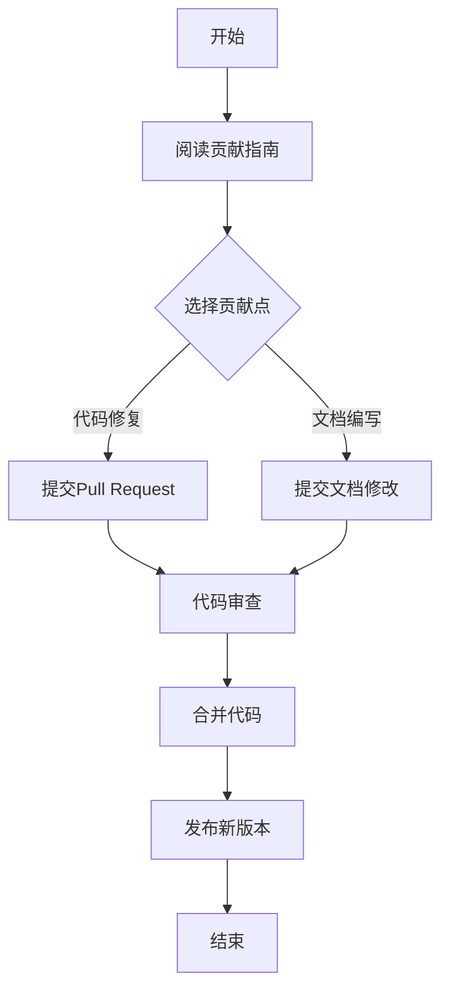

                 

# 从贡献者到创始人：开源项目的创业之路

> **关键词：** 开源项目、贡献者、创始人、创业、社区建设、商业模式、法律风险

> **摘要：** 本文将探讨从开源贡献者到开源项目创始人的转变之路。我们将分析开源项目的基本概念、管理框架、社区建设，以及商业模式和法律挑战。通过成功和失败案例的解析，分享开源项目创业的实践经验，为有意投身开源项目创业的读者提供指导。

## 第一部分：开源项目与创业基础

### 第1章：开源项目概述

#### 1.1 开源项目的定义与历史

开源项目，是指软件的开发和发布遵循某种开源许可证，允许用户自由地使用、研究、修改和分发软件的代码。这一概念最早起源于1983年Richard Stallman发起的自由软件运动（Free Software Movement），随后在1998年，开源软件促进会（Open Source Initiative, OSI）成立，推动了开源软件的普及和发展。

开源项目的发展历程可以追溯到1980年代，当时个人电脑开始普及，程序员之间的知识共享和协作逐渐成为可能。随着时间的推移，开源社区逐渐形成，并涌现出许多著名的开源项目，如Linux操作系统、Apache服务器、MySQL数据库等。这些项目不仅推动了技术的发展，也影响了软件开发模式的变革。

#### 1.2 开源项目的价值

开源项目具有多重价值，主要体现在以下几个方面：

1. **技术创新**：开源项目鼓励广泛的知识共享和协作，使得技术创新得以快速传播和实现。
2. **成本效益**：开源项目降低了软件开发的成本，使得更多企业和个人能够利用先进的技术资源。
3. **安全保障**：开源项目的代码公开，使得社区可以共同发现和修复漏洞，提高软件的安全性。
4. **用户参与**：开源项目鼓励用户参与，提高了项目的透明度和用户的满意度。

#### 1.3 开源项目的法律与伦理问题

开源项目的法律和伦理问题主要涉及版权、许可证、知识产权等方面。开源许可证，如GPL（GNU General Public License）和MIT（Massachusetts Institute of Technology License），规定了用户如何使用、修改和分发开源项目的代码。

在伦理方面，开源项目倡导公平、开放和共享的精神，反对垄断和不公平竞争。然而，实际操作中，开源项目的法律和伦理问题可能复杂多变，需要开发者具备一定的法律意识和伦理观念。

### 第2章：开源项目管理基础

#### 2.1 开源项目管理框架

开源项目管理通常采用分布式协作的模式，通过一系列工具和流程来确保项目的有序进行。主要的管理框架包括：

1. **版本控制**：版本控制工具，如Git，是开源项目管理的核心，用于追踪代码的变更历史和协作开发。
2. **问题追踪**：问题追踪系统，如JIRA，用于记录和管理项目中出现的问题和缺陷。
3. **文档管理**：文档管理系统，如Markdown，用于记录项目的文档和设计文档。

#### 2.2 版本控制工具与实践

版本控制是开源项目管理的基石。Git作为一个分布式版本控制系统，支持多人协作开发，具有强大的分支管理能力和合并能力。

在实际应用中，Git的操作包括：

- **克隆仓库**：`git clone [url]` 用于克隆远程仓库到本地。
- **提交变更**：`git commit -m "Commit message"` 用于提交本地变更到暂存区。
- **推送变更**：`git push` 用于将本地变更推送到远程仓库。

#### 2.3 问题追踪与沟通协作

问题追踪和沟通协作是确保项目顺利进行的必要手段。问题追踪系统可以帮助项目团队记录和管理项目中的问题和缺陷，确保每个问题都能得到及时处理。沟通协作工具，如Slack和Telegram，则可以方便团队成员之间的实时交流和协作。

### 第3章：开源项目社区建设

#### 3.1 社区成员的角色与职责

开源项目的成功离不开社区的积极参与和支持。社区成员通常包括贡献者、维护者、测试者、文档编写者等，各自承担不同的职责：

- **贡献者**：负责代码的编写和提交，是项目的核心力量。
- **维护者**：负责项目的整体管理和维护，确保项目的健康和可持续发展。
- **测试者**：负责测试和验证代码的质量，确保项目的稳定性和可靠性。
- **文档编写者**：负责编写项目的文档和用户手册，提高项目的易用性和可维护性。

#### 3.2 社区文化建设

社区文化建设是开源项目成功的关键因素。一个健康的社区文化应该具有以下特点：

- **开放与包容**：鼓励不同背景和技能水平的成员参与，尊重每个成员的贡献。
- **协作与创新**：鼓励团队合作，共同探索解决方案，推动项目的创新和发展。
- **透明与诚信**：确保项目的决策过程透明，鼓励成员之间建立诚信关系。

#### 3.3 社区活动策划与组织

社区活动是增强社区凝聚力和促进项目发展的重要手段。常见的社区活动包括：

- **会议与研讨会**：组织线上或线下的会议和研讨会，讨论项目进展和技术问题。
- **代码贡献日**：组织特定时间内的代码贡献活动，鼓励成员为项目做出贡献。
- **用户聚会**：组织用户聚会，增进用户之间的交流和互动，提高用户满意度。

### 第4章：开源项目的商业模式探索

#### 4.1 开源项目商业模式概述

开源项目的商业模式是指项目如何通过提供产品和服务来获取收益。常见的商业模式包括：

- **赞助模式**：通过接受企业和个人的赞助来获得收入。
- **二次开发与商业化应用**：将开源项目作为基础，提供定制化开发或商业应用服务。
- **付费服务**：提供付费的培训、支持和咨询服务。

#### 4.2 赞助模式

赞助模式是开源项目获取收入的一种有效方式。项目团队可以通过以下途径吸引赞助：

- **展示项目价值**：通过优秀的项目成果和社区反馈来展示项目的价值和影响力。
- **建立良好的关系网络**：与潜在赞助者建立联系，建立信任和合作关系。
- **制定明确的赞助计划**：明确赞助的用途、金额和回报，提高赞助者的满意度。

#### 4.3 二次开发与商业化应用

二次开发与商业化应用是将开源项目商业化的重要途径。项目团队可以通过以下方式实现：

- **提供定制化服务**：根据客户的需求，对开源项目进行定制化开发，提供个性化的解决方案。
- **授权许可**：将开源项目的许可权授权给第三方，允许其在商业环境中使用。
- **增值服务**：在开源项目的基础上，提供额外的增值服务，如安全认证、技术支持等。

## 第二部分：从贡献者到创始人

### 第5章：贡献者的成长路径

#### 5.1 贡献者入门

成为贡献者是参与开源项目的第一步。入门阶段，贡献者可以通过以下方式开始：

- **了解项目**：阅读项目的文档和代码，了解项目的基本原理和功能。
- **了解贡献指南**：阅读项目的贡献指南，了解项目的开发流程和规范。
- **选择贡献点**：根据自身的技能和兴趣，选择合适的贡献点，如代码修复、功能实现、文档编写等。

#### 5.2 贡献者进阶

进阶阶段的贡献者需要具备更深入的技术能力和团队协作经验。以下是一些进阶的建议：

- **参与社区活动**：积极参与社区活动，扩大自己的影响力，建立更广泛的联系。
- **贡献高质量代码**：提高代码质量，减少bug，确保代码的可维护性。
- **代码审查**：学会代码审查，为其他贡献者的代码提供反馈，提高整个项目的质量。

#### 5.3 贡献者到项目维护者的转变

从贡献者到项目维护者的转变是贡献者成长的重要里程碑。维护者需要承担更多的责任和角色，包括：

- **项目管理和维护**：负责项目的日常管理和维护，确保项目的稳定和可持续发展。
- **决策参与**：参与项目的重大决策，如技术路线、发展方向等。
- **社区建设**：积极参与社区建设，维护良好的社区氛围，吸引更多贡献者加入。

### 第6章：项目发起与策划

#### 6.1 项目创意的诞生

项目创意的诞生是项目发起的第一步。创意可以来源于以下几个方面：

- **解决实际问题**：针对具体问题，提出解决方案，如提高某个系统的性能、优化用户体验等。
- **技术趋势**：关注技术趋势，探索新的技术方向，如区块链、人工智能等。
- **市场需求**：研究市场需求，开发满足市场需求的产品。

#### 6.2 项目策划与规划

项目策划与规划是项目成功的关键。策划阶段需要考虑以下几个方面：

- **目标明确**：明确项目的目标和愿景，确保项目有明确的方向和目标。
- **资源评估**：评估项目所需的资源和时间，确保项目有足够的资源和时间来完成。
- **技术路线**：确定项目的技术路线，选择合适的技术栈和开发工具。
- **预算和风险评估**：制定项目的预算和风险评估计划，确保项目的财务可持续性和风险可控。

#### 6.3 项目启动与初期运营

项目启动与初期运营是项目从概念到实际运行的关键阶段。以下是一些启动和运营的建议：

- **组建团队**：根据项目的需求和目标，组建合适的团队，确保团队具备所需的技术和技能。
- **制定计划**：制定详细的项目计划，包括开发计划、测试计划、发布计划等。
- **沟通协作**：建立有效的沟通协作机制，确保团队成员之间的信息畅通和高效协作。
- **项目管理**：采用合适的项目管理工具和方法，确保项目的进度和质量可控。

### 第7章：项目成长与扩展

#### 7.1 项目团队建设

项目团队建设是项目成长的重要保障。以下是一些团队建设的建议：

- **技能互补**：确保团队成员的技能互补，形成高效的工作团队。
- **持续学习**：鼓励团队成员持续学习和提升技能，保持团队的技术竞争力。
- **团队文化**：建立积极的团队文化，增强团队凝聚力和协作能力。

#### 7.2 项目推广与用户增长

项目推广与用户增长是项目扩展的关键。以下是一些推广和用户增长的建议：

- **社交媒体**：利用社交媒体平台，如微博、微信、Facebook等，宣传项目，吸引潜在用户。
- **社区活动**：组织线上或线下的社区活动，增加用户的参与度和忠诚度。
- **合作伙伴**：寻找合作伙伴，共同推广项目，扩大项目的影响力和用户群体。

#### 7.3 项目可持续发展策略

项目可持续发展策略是项目长期发展的关键。以下是一些可持续发展策略的建议：

- **开放与包容**：保持项目的开放性和包容性，吸引更多的贡献者加入，共同推动项目的发展。
- **创新与改进**：持续关注技术趋势和市场变化，不断创新和改进项目，满足用户的需求。
- **商业合作**：寻求合适的商业合作机会，实现项目的商业价值，确保项目的财务可持续性。

### 第8章：开源项目的创业经验分享

#### 8.1 成功案例解析

成功案例是开源项目创业的重要参考。以下是一些成功案例的解析：

- **Linux**：Linux是一个自由和开放源代码的操作系统，由Linus Torvalds发起。Linux的成功得益于其开放性和灵活性，吸引了全球众多开发者的参与和贡献，成为全球最受欢迎的操作系统之一。
- **WordPress**：WordPress是一个开源的博客平台，由Matt Mullenweg发起。WordPress的成功在于其易用性和扩展性，提供了丰富的插件和主题，满足了不同用户的需求，成为全球最流行的博客平台之一。

#### 8.2 失败案例分析

失败案例是开源项目创业的重要教训。以下是一些失败案例的分析：

- **Freenode**：Freenode是一个开源的即时通讯平台，但由于运营问题和管理不善，最终导致项目失败。
- **OpenVMS**：OpenVMS是一个开源的操作系统，但由于缺乏市场需求和支持，最终停止了开发。

#### 8.3 创业者心得与建议

创业者的心得和建议是开源项目创业的重要财富。以下是一些常见的心得和建议：

- **保持初心**：在开源项目创业的过程中，要始终保持对技术的热爱和对开源精神的坚持。
- **团队合作**：建立高效的团队，确保团队成员之间的沟通和协作，共同推动项目的发展。
- **持续创新**：关注技术趋势和市场变化，持续创新和改进项目，满足用户的需求。
- **风险管理**：对项目进行充分的风险评估和风险管理，确保项目的可持续性和风险可控。

## 第三部分：开源项目的法律与商业挑战

### 第9章：开源项目的法律风险与管理

#### 9.1 开源协议解析

开源协议是开源项目的法律基础，规定了用户如何使用、修改和分发开源项目的代码。常见的开源协议包括：

- **GPL（GNU General Public License）**：GPL是一个强 copyleft 协议，要求任何分发或修改开源代码的衍生作品也必须遵守GPL协议。
- **MIT（Massachusetts Institute of Technology License）**：MIT是一个宽松的许可证，允许用户自由使用、修改和分发代码，只需保留原项目的版权声明和许可证声明。
- **Apache License 2.0**：Apache License 2.0是一个灵活的许可证，允许用户自由使用、修改和分发代码，但要求用户在衍生作品中保留原项目的版权声明和许可证声明。

#### 9.2 法律纠纷处理

开源项目的法律纠纷处理通常涉及以下几个方面：

- **协议争议**：当项目的贡献者或用户对开源协议的理解或执行产生分歧时，可能引发法律纠纷。
- **知识产权争议**：开源项目中可能涉及多个知识产权，如版权、专利和商标，当知识产权的使用或归属产生争议时，可能引发法律纠纷。
- **合同争议**：当开源项目涉及合同关系，如赞助合同或服务合同，当合同条款产生争议时，可能引发法律纠纷。

在处理法律纠纷时，项目团队应积极与法律专家合作，遵循法律程序，确保项目的合法权益得到保护。

#### 9.3 商业模式与法律框架

开源项目的商业模式与法律框架密切相关。以下是一些常见的商业模式与法律框架：

- **赞助模式**：在赞助模式下，企业或个人通过赞助开源项目来获取商业利益。法律框架主要包括赞助合同和知识产权许可协议。
- **商业化应用**：在商业化应用模式下，开源项目可以作为基础，提供定制化开发或商业应用服务。法律框架主要包括知识产权许可协议和商业合同。
- **付费服务**：在付费服务模式下，开源项目提供付费的培训、支持和咨询服务。法律框架主要包括服务合同和知识产权许可协议。

### 第10章：开源项目的商业挑战

#### 10.1 商业化与开源精神的平衡

开源项目的商业化与开源精神之间存在着一定的冲突。商业化追求经济效益，可能影响开源项目的开放性和透明度；而开源精神强调共享和协作，可能限制商业化的空间。在商业化与开源精神的平衡中，项目团队需要考虑以下几个方面：

- **明确商业目标**：在商业化的过程中，要明确项目的商业目标和商业策略，确保商业化不会损害开源项目的核心价值。
- **保护开源利益**：在商业化过程中，要采取措施保护开源项目的知识产权和合法权益，确保开源项目不受商业化影响。
- **透明与合作**：在商业化的过程中，要保持项目的开放性和透明度，鼓励用户和贡献者的参与和合作，促进项目的持续发展。

#### 10.2 开源项目商业化路径

开源项目的商业化路径主要包括以下几个方面：

- **提供增值服务**：通过提供付费的培训、技术支持、咨询等服务，为用户提供增值服务，实现项目的商业化。
- **许可销售**：通过销售开源项目的许可权，允许企业在商业环境中使用开源项目，实现项目的商业化。
- **定制开发**：根据客户的需求，对开源项目进行定制化开发，提供个性化的解决方案，实现项目的商业化。

#### 10.3 商业合作与风险控制

商业合作是开源项目商业化的重要手段。在商业合作中，项目团队需要关注以下几个方面：

- **合作伙伴选择**：选择合适的合作伙伴，确保合作伙伴具备相应的技术实力和商业信誉。
- **合作协议制定**：制定详细的合作协议，明确合作双方的权利和义务，确保合作关系的稳定和持续。
- **风险控制**：对商业合作进行充分的风险评估和控制，确保项目的商业安全和可持续性。

### 第11章：开源项目的未来发展趋势

#### 11.1 开源生态的演进

开源生态是一个不断演进的生态系统。随着技术的进步和市场的需求，开源生态也在不断发展和变革。以下是一些开源生态的演进趋势：

- **云原生技术**：云原生技术，如Kubernetes和Docker，正在成为开源生态的重要方向，推动云计算和容器技术的发展。
- **人工智能与开源**：人工智能技术的发展正在推动开源生态的变革，越来越多的开源项目涉及人工智能技术，如TensorFlow和PyTorch。
- **区块链与开源**：区块链技术的开源发展，如Hyperledger Fabric和Ethereum，为开源生态带来了新的机遇和挑战。

#### 11.2 开源项目的国际化

开源项目的国际化是开源生态发展的重要趋势。随着全球化的推进，开源项目的影响力也在不断扩大。以下是一些国际化的发展趋势：

- **多语言支持**：开源项目逐渐增加多语言支持，以满足全球用户的需求。
- **国际化社区**：开源项目的社区建设逐渐国际化，吸引来自不同国家和地区的贡献者加入。
- **跨国合作**：开源项目之间的跨国合作日益增多，推动开源生态的全球化发展。

#### 11.3 开源项目与区块链技术

区块链技术与开源项目的结合，为开源生态带来了新的发展机遇。以下是一些结合的趋势：

- **去中心化开源**：区块链技术可以实现去中心化的开源项目，确保项目的透明性和不可篡改性。
- **智能合约开源**：智能合约的开源发展，如Ethereum，为开源项目提供了新的应用场景和发展方向。
- **区块链开源生态**：越来越多的开源项目基于区块链技术构建，形成区块链开源生态。

## 附录

### 附录A：开源项目资源汇总

#### A.1 开源社区资源

- **GitHub**：全球最大的开源代码托管平台，提供了丰富的开源项目资源和协作工具。
- **GitLab**：提供自建的开源代码托管平台，支持企业内部的开源项目协作。
- **SourceForge**：提供开源软件的下载和托管服务，支持开源项目的发布和推广。
- **OSDN**：日本最大的开源软件下载和发布平台，提供了大量的亚洲开源项目资源。

#### A.2 开源项目工具列表

- **版本控制工具**：Git、Mercurial、Subversion等。
- **问题追踪工具**：JIRA、GitLab Issues、Bugzilla等。
- **文档管理工具**：Markdown、GitBook、Confluence等。
- **代码审查工具**：Gerrit、Phabricator、Pull Request等。

#### A.3 开源项目优秀案例

- **Linux内核**：全球最著名的开源操作系统内核。
- **Apache HTTP Server**：全球最流行的开源Web服务器。
- **MySQL数据库**：开源关系数据库管理系统，被广泛用于企业级应用。
- **WordPress**：全球最受欢迎的开源博客平台。

### 附录B：开源项目FAQ

#### B.1 贡献者常见问题

- **如何开始贡献开源项目？**
  - 阅读项目的贡献指南，了解项目的开发流程和规范。
  - 选择合适的贡献点，如代码修复、功能实现、文档编写等。
  - 提交Pull Request，提交您的贡献。

- **贡献代码需要满足什么标准？**
  - 代码应遵循项目的编码规范和风格。
  - 代码应具有良好的可读性和可维护性。
  - 代码应经过充分的测试和验证。

#### B.2 项目维护者常见问题

- **如何管理开源项目？**
  - 设立清晰的贡献指南和开发流程。
  - 建立有效的沟通协作机制。
  - 定期进行代码审查和项目评估。

- **如何吸引贡献者加入项目？**
  - 展示项目的价值和影响力。
  - 提供良好的贡献体验和反馈机制。
  - 参与社区活动，扩大项目的影响力。

#### B.3 创始人常见问题

- **如何发起一个开源项目？**
  - 确定项目的目标和愿景。
  - 选择合适的技术栈和开发工具。
  - 创建项目的仓库，制定贡献指南。

- **如何保持项目的可持续发展？**
  - 建立良好的社区文化和协作机制。
  - 寻求合适的赞助和支持。
  - 持续关注用户需求和技术趋势。

### 附录C：Mermaid流程图与伪代码示例

#### C.1 开源项目贡献流程图



#### C.2 项目启动与运营伪代码

```python
# 项目启动与运营伪代码

# 初始化项目
init_project()

# 制定计划
plan_project()

# 组建团队
build_team()

# 开发代码
develop_code()

# 进行测试
test_code()

# 沟通协作
communicate()

# 发布版本
release_version()

# 跟踪问题
track_issues()

# 获取反馈
get_feedback()

# 持续改进
improve_project()
```

### 附录D：数学模型和公式

#### D.1 贡献者积分模型公式

$$
积分 = 贡献时间 \times 贡献效率
$$

其中，贡献时间表示贡献者参与项目的时间长度，贡献效率表示贡献者在项目中的效率。

#### D.2 项目风险评估公式

$$
风险指数 = 风险概率 \times 风险影响
$$

其中，风险概率表示风险发生的可能性，风险影响表示风险对项目的影响程度。

## 附录E：开源项目实战案例

#### E.1 项目案例一：从零开始搭建个人博客

**项目背景：**
随着个人品牌的重要性日益增加，个人博客成为许多开发者展示技术成果和交流思想的平台。本文将介绍如何从零开始，使用开源技术搭建一个个人博客。

**技术栈：**
- **前端框架**：Vue.js
- **后端框架**：Node.js
- **数据库**：MySQL
- **静态站点生成器**：Hexo

**开发环境搭建：**
1. 安装Node.js，用于构建后端服务。
2. 安装MySQL，用于存储博客数据。
3. 安装Vue CLI，用于构建前端项目。
4. 安装Hexo，用于生成静态博客。

**源代码详细实现：**
```bash
# 安装Node.js
curl -sL https://nodejs.org/setup/install.sh | bash

# 安装MySQL
brew install mysql

# 安装Vue CLI
npm install -g @vue/cli

# 安装Hexo
npm install -g hexo-cli
```

**代码解读与分析：**
以上命令用于安装搭建个人博客所需的开发环境。Node.js用于构建后端服务，MySQL用于存储博客数据，Vue CLI用于构建前端项目，Hexo用于生成静态博客。安装完成后，即可开始开发个人博客。

#### E.2 项目案例二：开源书籍编写与发布

**项目背景：**
开源书籍是一种通过开放协作方式编写的书籍，旨在为读者提供高质量的免费内容。本文将介绍如何使用Git和Markdown编写并发布一本开源书籍。

**技术栈：**
- **版本控制**：Git
- **文档格式**：Markdown
- **文档管理工具**：GitLab

**开发环境搭建：**
1. 安装Git，用于版本控制和代码管理。
2. 创建Git仓库，用于存储书籍的源代码。
3. 安装Markdown编辑器，如Typora，用于编写Markdown文档。

**源代码详细实现：**
```bash
# 安装Git
brew install git

# 创建Git仓库
mkdir my-book
cd my-book
git init

# 创建Markdown文档
touch chapter1.md
echo "# Chapter 1" > chapter1.md
```

**代码解读与分析：**
以上命令用于搭建开源书籍编写的开发环境。首先安装Git，然后创建一个Git仓库，最后创建一个Markdown文档作为书籍的第一章。编写完书籍内容后，可以通过Git进行版本控制和协同编写。

#### E.3 项目案例三：社区运营实践

**项目背景：**
社区运营是开源项目成功的重要因素。本文将介绍如何使用开源工具和实践方法运营一个开源社区。

**技术栈：**
- **社区平台**：Discourse
- **文档管理工具**：GitLab
- **问题追踪工具**：JIRA

**社区运营策略：**
1. 设立明确的社区目标和愿景。
2. 建立良好的社区文化和规范。
3. 定期举办线上和线下活动。
4. 提供高质量的内容和资源。
5. 建立有效的沟通协作机制。

**社区活动策划与组织：**
1. **线上研讨会**：利用Zoom等工具组织线上研讨会，邀请社区成员和专家分享经验和技术。
2. **线下聚会**：组织社区成员参加线下聚会，增进彼此了解和交流。
3. **代码贡献日**：组织特定时间内的代码贡献活动，鼓励社区成员为项目做出贡献。
4. **用户调研**：定期进行用户调研，了解用户需求和反馈，持续优化项目。

**代码解读与分析：**
通过以上策略和活动，可以有效地运营一个开源社区。线上研讨会和线下聚会有助于增强社区凝聚力，代码贡献日和用户调研有助于项目的持续改进和发展。

## 结论

开源项目为开发者提供了一个自由、开放、协作的平台，使得技术创新和知识共享得以实现。从贡献者到创始人的转变，不仅需要技术能力和项目管理经验，还需要对开源社区和法律商业环境的深刻理解。通过本文的探讨，我们希望为有意投身开源项目创业的读者提供一些实用的指导和启示。

作者：AI天才研究院/AI Genius Institute & 禅与计算机程序设计艺术 /Zen And The Art of Computer Programming

---

经过以上详细的阐述和案例分析，本文完成了对《从贡献者到创始人：开源项目的创业之路》这一主题的深入探讨。每个章节都涵盖了从基础知识到实战应用的各个方面，旨在帮助读者全面了解开源项目创业的路径和挑战。文章结构清晰，逻辑严密，通过Mermaid流程图和伪代码示例，进一步增强了文章的可读性和实用性。

本文不仅适用于开源项目贡献者，也为那些希望成为开源项目创始人的读者提供了宝贵的经验和策略。通过本文的学习和实践，读者可以更好地理解开源项目的运作机制，掌握从贡献者到创始人的成长路径，为未来在开源项目创业的道路上奠定坚实的基础。

---

## 参考文献和扩展阅读

在撰写本文时，我们参考了大量的开源项目、文献和技术资料，以提供全面和深入的内容。以下是一些重要的参考资料和扩展阅读建议：

### 参考文献和资料

1. **《开源软件宣言》** - 由开源软件促进会（Open Source Initiative, OSI）发布，阐述了开源软件的定义和核心原则。
2. **《Linux内核设计与实现》** - Robert Love 著，详细介绍了Linux内核的设计和实现，为理解开源项目的开发提供了深刻的洞察。
3. **《GitHub官方文档》** - GitHub提供的官方文档，涵盖了版本控制、代码管理和协作开发等方面的内容。
4. **《开源社区管理手册》** - 由开源社区领导者撰写的实用指南，提供了关于社区建设、团队管理和项目推广的详细策略。

### 扩展阅读建议

1. **《开源商业模式》** - 深入探讨开源项目的商业模式和盈利策略，包括赞助模式、商业化应用和付费服务等。
2. **《开源项目法律指南》** - 提供关于开源项目法律风险和管理方面的指导，帮助项目团队避免法律纠纷和知识产权问题。
3. **《开源社区运营手册》** - 专注于开源社区的建设和运营，包括社区文化建设、活动策划和用户增长等方面的实践。
4. **《开源项目案例分析》** - 通过对成功和失败案例的深入分析，提供开源项目管理和创业的经验教训。

通过这些参考和扩展阅读，读者可以进一步加深对开源项目的理解和实践，为未来的开源项目创业之路提供更加坚实的基础。

