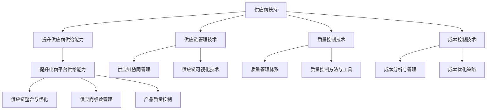

                 

### 《供应商扶持：提升供应商供给能力，提升电商平台供给能力》

**关键词：** 供应商扶持、供应商供给能力、电商平台、供应链管理、质量控制、成本控制、案例分析、实施建议

**摘要：** 本文深入探讨了供应商扶持在提升供应商供给能力和电商平台供给能力中的关键作用。通过对供应商扶持的概念、重要性、策略与方法，以及电商平台供给能力的概述和提升策略的详细分析，本文旨在为企业和平台运营商提供实践指导，以实现供应商与电商平台的协同发展，提高市场竞争力和用户满意度。

### 第一部分：供应商扶持的概念与重要性

#### 第1章：供应商扶持概述

##### 1.1 供应商扶持的定义与意义

供应商扶持是指企业或电商平台为了提升供应商的供给能力，采取的一系列支持和促进措施。这些措施可以包括资金支持、技术指导、市场拓展、人才培养等，旨在帮助供应商提高生产能力、优化供应链管理、提升产品质量、降低成本，从而更好地满足市场需求。

供应商扶持的意义在于：

1. **提高供应链稳定性**：通过扶持供应商，企业可以确保原材料或服务的稳定供应，降低供应链风险。
2. **提升产品质量**：供应商扶持有助于建立和提升供应商的质量管理体系，提高产品和服务质量。
3. **降低成本**：通过优化供应链管理和提高生产效率，供应商可以降低成本，从而为企业带来竞争优势。
4. **增强市场竞争力**：优秀的供应商能够提供优质的产品和服务，帮助企业赢得市场份额和客户忠诚度。

##### 1.2 供应商扶持的重要性

供应商扶持的重要性体现在以下几个方面：

1. **供应链生态的构建**：供应商扶持是构建健康供应链生态的重要环节，有助于形成一个稳定、高效、可持续发展的供应链网络。
2. **企业的核心竞争力**：通过供应商扶持，企业可以打造一个强大的供应链体系，这是企业核心竞争力的重要组成部分。
3. **产业升级与转型**：供应商扶持有助于推动产业链的升级和转型，促进产业结构优化和经济发展。
4. **社会责任的履行**：企业通过扶持供应商，可以帮助解决社会就业问题，履行企业社会责任。

##### 1.3 供应商扶持的发展历程

供应商扶持的发展历程可以分为以下几个阶段：

1. **初级阶段**：企业主要通过采购订单和支付预付款等方式扶持供应商。
2. **中级阶段**：企业开始提供技术支持、管理培训和资金支持等综合性扶持措施。
3. **高级阶段**：企业采用供应链金融、共享经济等新型扶持模式，实现供应链的全面协同和优化。

#### 第2章：提升供应商供给能力的策略与方法

##### 2.1 供应商能力评估与分类

提升供应商供给能力的第一步是对供应商进行能力评估与分类。评估指标体系通常包括以下方面：

1. **生产能力**：包括生产线设备、员工技能、生产能力利用率等。
2. **质量管理**：包括质量管理体系、质量检测设备、质量事故率等。
3. **技术水平**：包括研发能力、技术创新能力、信息化水平等。
4. **市场响应**：包括交货及时率、客户满意度、订单响应速度等。

根据评估结果，可以将供应商分为以下类别：

1. **优秀供应商**：具有高生产能力、优质质量管理、强技术水平和快速市场响应能力的供应商。
2. **合格供应商**：具备一定生产能力、质量管理和市场响应能力的供应商。
3. **问题供应商**：在能力评估中表现不佳，需要改进和提升的供应商。

##### 2.2 供应商分类与扶持策略

针对不同类别的供应商，企业可以采取差异化的扶持策略：

1. **优秀供应商**：保持现有扶持政策，鼓励技术创新和市场拓展。
2. **合格供应商**：提供技术支持、管理培训和资金支持，帮助提升生产能力、质量管理和技术水平。
3. **问题供应商**：采取限期整改措施，如果无法改善，则考虑更换供应商。

##### 2.3 实例分析：如何评估与分类供应商

以下是一个实例分析，展示如何对供应商进行能力评估与分类：

**案例背景**：某电商平台需要评估其10家主要供应商的能力，以便制定相应的扶持策略。

**评估过程**：

1. **制定评估指标体系**：根据供应商的生产能力、质量管理、技术水平和市场响应等方面，制定具体的评估指标。
2. **数据收集与处理**：收集供应商的相关数据，如生产能力利用率、质量事故率、研发投入占比、订单响应时间等。
3. **评估指标权重分配**：对每个评估指标分配权重，以反映其对供应商能力的贡献程度。
4. **计算得分与排名**：根据评估指标体系和权重，计算每个供应商的得分，并根据得分对供应商进行排名。

**结果分析**：

- **优秀供应商**：3家，分别占总数的30%。
- **合格供应商**：5家，分别占总数的50%。
- **问题供应商**：2家，分别占总数的20%。

**扶持策略**：

- **优秀供应商**：保持现有扶持政策，鼓励技术创新和市场拓展。
- **合格供应商**：提供技术支持、管理培训和资金支持，帮助提升生产能力、质量管理和技术水平。
- **问题供应商**：采取限期整改措施，如无法改善，则考虑更换供应商。

通过以上评估与分类，电商平台可以更好地制定供应商扶持策略，提高供应商供给能力，从而提升自身的供给能力。

### 第二部分：提升供应商供给能力的策略与方法

#### 第3章：提升供应商供给能力的关键技术

##### 3.1 供应链管理技术

供应链管理技术是提升供应商供给能力的关键。以下是一些关键技术及其应用：

1. **供应链协同管理**：
   - **定义**：供应链协同管理是指企业与其供应商、客户等合作伙伴之间通过信息共享、资源共享和流程协同，实现供应链整体效益最大化的管理活动。
   - **应用**：企业可以通过协同管理平台，实现订单、库存、物流等信息的实时共享，提高供应链的透明度和响应速度。

2. **供应链可视化技术**：
   - **定义**：供应链可视化技术是指利用图形、图表等可视化工具，将供应链各环节的信息以直观、易理解的方式展示出来。
   - **应用**：通过供应链可视化技术，企业可以实时监控供应链的运行状况，快速发现和解决问题，提高供应链的运作效率。

##### 3.2 质量控制技术

质量控制技术是提升供应商供给能力的重要保障。以下是一些关键技术及其应用：

1. **质量管理体系**：
   - **定义**：质量管理体系是指企业为实现质量目标，建立、实施、保持和持续改进的系统性管理措施。
   - **应用**：企业可以通过建立质量管理体系，规范质量控制流程，提高产品质量的一致性和稳定性。

2. **质量控制方法与工具**：
   - **定义**：质量控制方法与工具是指用于检测、评估和改进产品质量的各种技术手段。
   - **应用**：企业可以采用统计过程控制（SPC）、故障模式及影响分析（FMEA）等质量控制方法，结合测量仪器、检测设备等工具，对产品质量进行全过程控制。

##### 3.3 成本控制技术

成本控制技术是提升供应商供给能力的经济基础。以下是一些关键技术及其应用：

1. **成本分析与管理**：
   - **定义**：成本分析与管理是指对企业成本进行分类、分析、控制和优化的过程。
   - **应用**：企业可以通过成本分析，识别成本控制的关键环节，采取有效的成本控制措施，降低生产成本。

2. **成本优化策略**：
   - **定义**：成本优化策略是指通过优化生产流程、资源配置和管理模式，降低成本、提高效益的策略。
   - **应用**：企业可以采用精益生产、供应链整合等成本优化策略，实现成本的有效控制和优化。

通过以上供应链管理技术、质量控制技术和成本控制技术的应用，企业可以全面提升供应商的供给能力，从而提高自身的竞争力。

### 第三部分：电商平台供给能力的提升

#### 第4章：电商平台供给能力概述

##### 4.1 电商平台供给能力的定义与评价

电商平台供给能力是指电商平台在供应链管理、商品供应、服务支持等方面所具备的综合能力。它包括以下方面：

1. **供应链管理能力**：包括供应链设计、规划、执行和监控能力，能够确保供应链的高效运作。
2. **商品供应能力**：包括商品采购、库存管理、配送能力等，能够满足消费者的多样化需求。
3. **服务支持能力**：包括售后服务、客户服务、技术支持等，能够提供优质的服务体验。

评价电商平台供给能力可以从以下几个方面进行：

1. **供应链效率**：包括供应链响应速度、库存周转率、物流配送速度等指标。
2. **商品多样性**：包括商品种类、品牌数量、商品更新速度等指标。
3. **服务质量**：包括售后服务满意度、客户投诉率、客户响应速度等指标。

##### 4.2 电商平台供给能力的重要性

电商平台供给能力的重要性体现在以下几个方面：

1. **提升用户体验**：高效的供应链管理、丰富的商品供应和优质的服务支持能够提升消费者的购物体验，增加用户粘性。
2. **增强市场竞争力**：具备强大供给能力的电商平台能够在市场竞争中脱颖而出，吸引更多消费者和商家。
3. **提高运营效率**：通过优化供应链管理和提高服务支持能力，电商平台可以降低运营成本，提高整体运营效率。
4. **促进产业协同**：电商平台作为供应链的核心节点，能够促进产业链上下游企业的协同发展，推动产业升级。

##### 4.3 电商平台供给能力的发展趋势

随着电商行业的不断发展，电商平台供给能力将呈现以下发展趋势：

1. **供应链数字化**：通过大数据、云计算、人工智能等技术的应用，实现供应链的数字化管理，提高供应链效率和透明度。
2. **供应链绿色化**：注重环保和可持续发展，采用绿色供应链管理，减少碳排放和资源浪费。
3. **供应链全球化**：拓展海外市场，实现全球供应链布局，提升全球供应链的协同和整合能力。
4. **供应链智能化**：利用物联网、区块链等新兴技术，实现供应链的智能监控和自动化管理，提高供应链的智能化水平。

#### 第5章：电商平台供给能力提升策略

##### 5.1 供应链整合与优化

供应链整合与优化是提升电商平台供给能力的关键策略。以下是一些具体策略：

1. **供应链整合**：
   - **定义**：供应链整合是指通过协同和整合上下游供应链资源，实现供应链的统一管理和优化。
   - **应用**：电商平台可以通过整合供应商资源、物流资源和信息资源，实现供应链的协同运作，提高供应链的整体效率。

2. **供应链优化**：
   - **定义**：供应链优化是指通过优化供应链的各个环节，降低供应链成本、提高供应链效率和响应速度。
   - **应用**：电商平台可以通过优化库存管理、物流配送、订单处理等环节，提高供应链的运作效率，降低运营成本。

##### 5.2 供应商绩效管理

供应商绩效管理是提升电商平台供给能力的重要手段。以下是一些关键措施：

1. **供应商绩效评价体系**：
   - **定义**：供应商绩效评价体系是指通过制定评价指标和方法，对供应商的绩效进行评估和反馈。
   - **应用**：电商平台可以制定供应商绩效评价指标，如交货及时率、质量合格率、成本控制能力等，对供应商进行定期评估，并根据评估结果制定相应的扶持策略。

2. **供应商绩效改进策略**：
   - **定义**：供应商绩效改进策略是指通过识别供应商绩效不足之处，采取改进措施，提升供应商的绩效水平。
   - **应用**：电商平台可以通过培训、技术支持、资金扶持等方式，帮助供应商提升绩效，实现供应链的协同发展。

##### 5.3 产品质量控制

产品质量控制是电商平台供给能力的重要组成部分。以下是一些关键措施：

1. **产品质量控制体系**：
   - **定义**：产品质量控制体系是指通过建立和实施一系列质量控制制度和流程，确保产品质量的稳定和可靠。
   - **应用**：电商平台可以建立产品质量控制体系，包括质量管理制度、质量检测标准、质量改进流程等，确保产品质量达到标准。

2. **产品质量控制方法**：
   - **定义**：产品质量控制方法是指用于检测、评估和改进产品质量的各种技术手段。
   - **应用**：电商平台可以采用统计过程控制（SPC）、故障模式及影响分析（FMEA）等质量控制方法，结合测量仪器、检测设备等工具，对产品质量进行全过程控制。

通过以上供应链整合与优化、供应商绩效管理和产品质量控制策略的实施，电商平台可以全面提升供给能力，提高市场竞争力和用户体验。

### 第四部分：案例分析

#### 第6章：供应商扶持与电商平台供给能力提升案例分析

##### 6.1 案例一：某电商平台提升供应商供给能力

**6.1.1 案例背景**

某电商平台是一家全国性的综合性电商平台，拥有大量活跃用户和丰富的商品资源。然而，由于供应商供给能力不足，平台在商品供应和服务质量方面存在一定问题，影响了用户体验和市场竞争力。为了提升供应商供给能力，该电商平台决定实施一系列供应商扶持措施。

**6.1.2 案例分析与解决方案**

1. **供应商能力评估与分类**：
   - **评估指标**：该电商平台制定了供应商能力评估指标，包括生产能力、质量管理、技术水平和市场响应等。
   - **评估过程**：通过数据收集和评估，对供应商进行分类，区分优秀供应商、合格供应商和问题供应商。

2. **优秀供应商扶持**：
   - **保持现有扶持政策**：对于优秀供应商，平台继续保持现有的扶持政策，包括资金支持、技术指导等。
   - **鼓励技术创新**：平台鼓励优秀供应商进行技术创新，提高生产效率和产品质量，提升市场竞争力。

3. **合格供应商提升**：
   - **提供技术支持**：平台为合格供应商提供技术支持，包括质量管理培训、生产工艺改进等，帮助供应商提升供给能力。
   - **资金支持**：平台提供一定的资金支持，帮助合格供应商进行设备升级、生产线改造等。

4. **问题供应商整改**：
   - **限期整改**：对于问题供应商，平台要求其在一定期限内进行整改，如无法达到要求，将考虑更换供应商。
   - **技术指导**：平台为问题供应商提供技术指导，帮助其解决生产、质量等方面的问题。

**6.1.3 案例实施效果**

通过以上供应商扶持措施，该电商平台取得了显著的效果：

1. **供应商供给能力提升**：优秀供应商继续保持高水平供给能力，合格供应商的供给能力显著提升，问题供应商的供给能力得到改善。
2. **商品质量提高**：供应商质量管理水平提高，商品质量合格率上升，消费者满意度提高。
3. **运营效率提升**：供应链管理效率提高，库存周转率上升，物流配送速度加快。
4. **市场竞争力增强**：供应商供给能力提升，电商平台在市场竞争中更具优势，市场份额扩大。

##### 6.2 案例二：某供应商提升供给能力

**6.2.1 案例背景**

某供应商是一家专业生产电子产品的公司，产品在市场上的竞争力较强，但面临生产效率低、质量不稳定等问题，影响了企业的盈利能力和市场地位。为了提升供给能力，该供应商决定进行一系列提升措施。

**6.2.2 案例分析与解决方案**

1. **生产效率提升**：
   - **自动化改造**：供应商投入资金进行自动化生产线改造，提高生产效率，减少人工成本。
   - **精益生产**：供应商引入精益生产理念，优化生产流程，减少浪费，提高生产效率。

2. **质量管理提升**：
   - **质量管理体系**：供应商建立质量管理体系，包括质量管理制度、质量检测标准等，确保产品质量的稳定和可靠。
   - **质量改进**：供应商通过质量改进活动，如六西格玛、持续改进等，提高产品质量，减少质量事故率。

3. **技术创新**：
   - **研发投入**：供应商增加研发投入，提高技术创新能力，开发新产品，提升市场竞争力。
   - **技术引进**：供应商引进先进的生产技术和设备，提升生产效率和产品质量。

**6.2.3 案例实施效果**

通过以上提升措施，该供应商取得了显著的效果：

1. **生产效率提高**：自动化改造和精益生产使生产效率显著提高，生产成本降低。
2. **产品质量稳定**：质量管理体系和质量改进活动使产品质量稳定，质量事故率降低。
3. **市场竞争力增强**：技术创新和新产品的推出使市场竞争力增强，销售额和市场份额提升。
4. **企业盈利能力提升**：生产效率提升和产品质量稳定使企业盈利能力提升，企业利润增加。

### 第五部分：实施与建议

#### 第7章：供应商扶持与电商平台供给能力提升的实践建议

##### 7.1 政策与法规建议

1. **完善供应商扶持政策**：政府应出台一系列扶持供应商的政策，包括税收优惠、资金支持、技术引进等，鼓励企业提升供应商供给能力。
2. **加强供应链法规建设**：完善供应链相关法规，规范供应链各环节的操作，提高供应链的整体效率和质量。
3. **建立健全信用体系**：建立供应商信用评价体系，对供应商进行信用评估，促进供应链的诚信和稳定。

##### 7.2 企业内部管理建议

1. **建立供应商管理机制**：企业应建立专门的供应商管理部门，负责供应商的评估、分类和扶持工作，确保供应商管理的系统性和专业性。
2. **加强供应链协同**：企业应加强与供应商的协同，通过信息共享、资源整合等方式，实现供应链的协同运作，提高供应链的整体效率。
3. **提升供应链信息化水平**：企业应加大供应链信息化投入，采用先进的信息技术，实现供应链的数字化管理，提高供应链的透明度和响应速度。

##### 7.3 供应链整合与优化建议

1. **供应链整合**：企业应加强与上下游企业的整合，实现供应链资源的共享和协同，提高供应链的整体效率。
2. **供应链优化**：企业应通过优化供应链各环节，降低供应链成本、提高供应链效率，增强供应链的竞争力。
3. **绿色供应链建设**：企业应注重绿色供应链建设，采用环保材料、绿色工艺等，实现供应链的可持续发展。

##### 7.4 供应商绩效管理与质量控制建议

1. **供应商绩效评价**：企业应建立科学的供应商绩效评价体系，对供应商的绩效进行定期评价，并根据评价结果制定相应的扶持策略。
2. **供应商质量控制**：企业应建立严格的产品质量控制体系，确保产品质量的稳定和可靠，提高用户满意度。
3. **持续改进**：企业应持续改进供应商管理和服务质量，通过培训、技术支持等方式，提升供应商的供给能力和服务水平。

通过以上实践建议，企业可以更好地实施供应商扶持和电商平台供给能力提升策略，提高市场竞争力和用户满意度。

### 附录

#### 附录A：供应商扶持与电商平台供给能力提升相关工具与资源

##### A.1 供应链管理工具

1. **ERP系统**：企业资源计划（ERP）系统是供应链管理的重要工具，可以帮助企业实现供应链的全面管理，提高运营效率。
2. **SCM软件**：供应链管理软件（SCM）是专门用于供应链管理的软件，可以帮助企业实现供应链的协同、可视化、优化等功能。
3. **物流管理系统**：物流管理系统（LMS）用于管理物流运输、库存、配送等环节，提高物流效率。

##### A.2 质量控制工具

1. **统计过程控制（SPC）软件**：SPC软件用于实时监控生产过程中的质量变化，帮助企业识别和解决问题。
2. **六西格玛工具**：六西格玛工具包括DMAIC（定义、测量、分析、改进、控制）方法等，用于持续改进产品质量。
3. **质量管理信息系统（QMS）**：QMS软件用于建立和实施质量管理体系，确保产品质量的稳定和可靠。

##### A.3 电商平台运营工具

1. **电商平台平台**：如淘宝、京东、亚马逊等，用于搭建和管理电商平台。
2. **数据分析工具**：如Google Analytics、阿里云数据等，用于分析和优化电商平台的数据。
3. **社交媒体工具**：如微信、微博、Facebook等，用于营销推广和用户互动。

### 附加内容

#### 核心概念与联系（Mermaid 流程图）



#### 核心算法原理讲解（伪代码）

```python
# 供应商能力评估算法伪代码

function assess_supplier_capability(supplier_data):
    # 初始化供应商得分
    score = 0

    # 计算生产能力得分
    production_score = calculate_production_score(supplier_data.production_capability)
    score += production_score

    # 计算质量管理得分
    quality_score = calculate_quality_score(supplier_data.quality_management)
    score += quality_score

    # 计算技术水平得分
    technology_score = calculate_technology_score(supplier_data.technology_level)
    score += technology_score

    # 计算市场响应得分
    response_score = calculate_response_score(supplier_data.market_response)
    score += response_score

    # 计算总得分
    total_score = score / 4  # 假设四个方面的权重相等

    # 根据得分评估供应商能力等级
    if total_score >= 0.9:
        capability_level = "优秀"
    elif total_score >= 0.7:
        capability_level = "合格"
    else:
        capability_level = "问题"

    return capability_level

# 辅助函数定义
function calculate_production_score(production_capability):
    # 根据生产能力计算得分
    if production_capability > 0.95:
        return 1
    elif production_capability > 0.8:
        return 0.8
    else:
        return 0.5

function calculate_quality_score(quality_management):
    # 根据质量管理计算得分
    if quality_management >= 0.9:
        return 1
    elif quality_management >= 0.7:
        return 0.7
    else:
        return 0.3

function calculate_technology_score(technology_level):
    # 根据技术水平计算得分
    if technology_level >= 0.9:
        return 1
    elif technology_level >= 0.7:
        return 0.7
    else:
        return 0.3

function calculate_response_score(market_response):
    # 根据市场响应计算得分
    if market_response >= 0.9:
        return 1
    elif market_response >= 0.7:
        return 0.7
    else:
        return 0.3
```

#### 数学模型和数学公式（latex 格式）

$$
\text{供应商能力评估模型} = \frac{\sum_{i=1}^{n} (w_i \cdot s_i)}{n}
$$

其中，$w_i$ 表示第 $i$ 个评估指标的权重，$s_i$ 表示第 $i$ 个评估指标的得分。

#### 项目实战

**项目背景**：某电商平台需要提升供应商供给能力，以应对日益增长的订单量和市场需求。为了实现这一目标，平台决定开发一个供应商能力评估与管理系统。

**开发环境搭建**：

1. **操作系统**：Linux
2. **编程语言**：Python
3. **数据库**：MySQL
4. **框架**：Django
5. **前端技术**：HTML、CSS、JavaScript

**源代码详细实现**：

1. **数据模型设计**：
   ```python
   class Supplier(models.Model):
       name = models.CharField(max_length=100)
       production_capability = models.FloatField()
       quality_management = models.FloatField()
       technology_level = models.FloatField()
       market_response = models.FloatField()
   ```

2. **评估算法实现**：
   ```python
   def calculate_supplier_score(supplier):
       scores = [
           supplier.production_capability,
           supplier.quality_management,
           supplier.technology_level,
           supplier.market_response
       ]
       total_score = sum(scores)
       return total_score / len(scores)
   ```

3. **后端接口实现**：
   ```python
   @api_view(['POST'])
   def assess_supplier(request):
       data = request.data
       supplier = Supplier.objects.create(
           name=data['name'],
           production_capability=data['production_capability'],
           quality_management=data['quality_management'],
           technology_level=data['technology_level'],
           market_response=data['market_response']
       )
       score = calculate_supplier_score(supplier)
       return Response({'score': score})
   ```

**代码解读与分析**：

1. **数据模型**：定义了供应商模型，包括名称、生产能力、质量管理、技术水平和市场响应等属性。
2. **评估算法**：计算供应商的综合得分，以评估其供给能力。
3. **后端接口**：接收供应商数据，存储到数据库，并调用评估算法计算得分，返回结果。

通过该项目，电商平台可以实现对供应商能力的实时评估和管理，为供应商扶持和供给能力提升提供数据支持。

### 结论

本文系统地探讨了供应商扶持在提升供应商供给能力和电商平台供给能力中的关键作用。通过对供应商扶持的概念、重要性、策略与方法的详细分析，以及电商平台供给能力概述和提升策略的深入探讨，本文旨在为企业和平台运营商提供实践指导，以实现供应商与电商平台的协同发展。

本文的核心贡献包括：

1. **理论框架**：构建了供应商扶持与电商平台供给能力提升的理论框架，明确了供应商扶持的定义、重要性、策略与方法。
2. **实践指导**：提供了具体的实施建议和案例分析，为企业和平台运营商在供应商扶持和电商平台供给能力提升方面提供了可操作的实践指导。
3. **工具与方法**：介绍了供应链管理技术、质量控制技术和成本控制技术等关键技术，以及相关的工具和资源，为提升供应商供给能力和电商平台供给能力提供了技术支持。

展望未来，供应商扶持与电商平台供给能力提升的研究将继续深入，重点关注以下几个方面：

1. **供应链数字化**：随着大数据、人工智能等技术的应用，供应链数字化将成为提升供给能力的重要方向。
2. **绿色供应链**：绿色供应链管理将成为企业可持续发展的重要策略，有助于减少碳排放和资源浪费。
3. **全球化供应链**：全球化供应链的布局和整合能力将成为电商平台供给能力提升的关键因素。
4. **智能化供应链**：利用物联网、区块链等新兴技术，实现供应链的智能化管理和优化，提高供应链的运行效率和透明度。

通过持续的研究和实践，供应商扶持与电商平台供给能力提升将不断推动电商行业的发展，为消费者和企业创造更大的价值。

