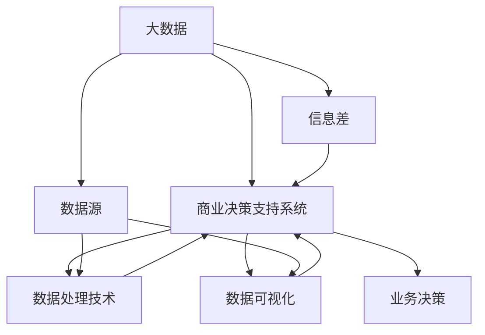

                 

### 引言

随着信息技术的飞速发展，大数据已经渗透到了各行各业，成为推动商业创新和提升竞争力的重要工具。在商业决策支持领域，大数据技术的应用尤为关键。本文将围绕大数据在商业决策支持中的核心概念、技术基础、应用场景以及实现方法进行深入探讨。

大数据之所以能够提升商业决策支持能力，主要原因在于其具有海量、多样、实时和复杂等特点。首先，大数据能够提供海量的数据资源，使得企业能够更全面地了解市场环境和消费者行为。其次，大数据的多样性使得企业能够从不同维度分析数据，从而发现潜在的商业机会和风险。再次，实时数据采集和处理能力使得企业能够快速响应市场变化，优化决策过程。最后，大数据的复杂性分析能力可以帮助企业深入挖掘数据背后的价值，提升决策的准确性和有效性。

本文将分为七个部分，首先对大数据与商业决策支持进行概述，接着介绍大数据技术的基础知识，然后深入探讨大数据在商业决策支持中的具体应用，包括市场分析、消费者行为研究和供应链管理。此外，还将讨论大数据在商业决策支持系统中的实现方法和大数据驱动的战略规划。最后，通过商业创新案例总结大数据的应用价值，并给出参考书目和资源。希望通过本文的阐述，能够帮助读者更好地理解大数据在商业决策支持中的重要作用，并掌握相关应用方法和技巧。

### 《信息差的商业决策支持升级：大数据如何提升决策支持能力》目录大纲

为了更好地组织本文的内容，下面将列出详细的目录大纲，涵盖本文的主要章节和各章节的核心内容。

#### 第一部分：大数据与商业决策支持概述

##### 第1章：大数据时代的商业决策支持
- **1.1 大数据的定义与特点**
  - **1.1.1 大数据的本质**
  - **1.1.2 大数据的4V特性**
  - **1.1.3 大数据的重要性
- **1.2 商业决策支持的基本概念**
  - **1.2.1 商业决策支持系统**
  - **1.2.2 决策支持过程中的信息需求**
  - **1.2.3 决策支持系统的类型
- **1.3 大数据在商业决策支持中的应用前景**
  - **1.3.1 大数据提升商业决策的支持能力**
  - **1.3.2 大数据应用的挑战与机遇**

#### 第二部分：大数据技术基础

##### 第2章：大数据技术概述
- **2.1 大数据的收集与存储**
  - **2.1.1 数据源类型**
  - **2.1.2 数据仓库与数据湖**
  - **2.1.3 分布式存储系统
- **2.2 大数据的处理与分析技术**
  - **2.2.1 数据清洗与转换**
  - **2.2.2 数据集成**
  - **2.2.3 数据挖掘与机器学习算法**

#### 第三部分：大数据在商业决策中的应用

##### 第3章：市场分析与消费者行为研究
- **3.1 大数据在市场分析中的应用**
  - **3.1.1 市场趋势预测**
  - **3.1.2 消费者细分**
  - **3.1.3 品牌影响力评估
- **3.2 大数据在消费者行为研究中的应用**
  - **3.2.1 消费者行为分析**
  - **3.2.2 客户生命周期管理**
  - **3.2.3 客户满意度调查**

##### 第4章：供应链管理与库存优化
- **4.1 大数据在供应链管理中的应用**
  - **4.1.1 供应链可视化**
  - **4.1.2 库存优化策略**
  - **4.1.3 供应商评估与选择
- **4.2 大数据在库存管理中的应用**
  - **4.2.1 库存预测模型**
  - **4.2.2 库存管理优化案例**

#### 第四部分：大数据在商业决策支持系统中的实现

##### 第5章：商业智能工具与技术
- **5.1 商业智能工具简介**
  - **5.1.1 商业智能工具的选择**
  - **5.1.2 报表与分析工具**
  - **5.1.3 数据可视化工具
- **5.2 大数据在商业决策支持系统中的实现**
  - **5.2.1 决策支持系统的架构设计**
  - **5.2.2 大数据平台与决策支持系统的集成**
  - **5.2.3 决策支持系统的实施与优化**

##### 第6章：大数据驱动的战略规划
- **6.1 大数据驱动的战略分析**
  - **6.1.1 市场定位与竞争策略**
  - **6.1.2 产品创新与市场拓展**
  - **6.1.3 风险管理与决策优化
- **6.2 大数据驱动的运营优化**
  - **6.2.1 运营数据分析**
  - **6.2.2 流程优化与自动化**
  - **6.2.3 业务绩效监控与评估**

##### 第7章：大数据时代的商业创新与实践
- **7.1 大数据与商业模式创新**
  - **7.1.1 新型商业模式的设计**
  - **7.1.2 大数据在商业创新中的挑战**
  - **7.1.3 大数据驱动的创业案例
- **7.2 大数据在商业实践中的应用案例**
  - **7.2.1 零售业大数据应用案例**
  - **7.2.2 制造业大数据应用案例**
  - **7.2.3 银行业大数据应用案例**

#### 附录

##### 附录A：大数据技术选型与工具
- **A.1 大数据技术选型指南**
  - **A.1.1 数据库选型**
  - **A.1.2 数据处理框架选型**
  - **A.1.3 大数据存储方案选型
- **A.2 大数据技术工具使用指南**
  - **A.2.1 Hadoop安装与配置**
  - **A.2.2 Spark安装与配置**
  - **A.2.3 Hive安装与配置**
- **A.3 大数据技术实践案例**
  - **A.3.1 电商平台数据挖掘**
  - **A.3.2 社交网络分析**
  - **A.3.3 金融机构风险控制**

##### 附录B：商业决策支持系统实现指南
- **B.1 商业决策支持系统的设计与实现**
  - **B.1.1 系统架构设计**
  - **B.1.2 关键技术选型**
  - **B.1.3 系统开发流程**
- **B.2 大数据技术在决策支持系统中的应用案例**
  - **B.2.1 零售行业销售预测**
  - **B.2.2 金融行业风险控制**
  - **B.2.3 制造行业供应链优化**
- **B.3 商业决策支持系统的性能优化与维护**
  - **B.3.1 性能优化策略**
  - **B.3.2 系统维护流程**

##### 附录C：参考书目与资源
- **C.1 参考书籍**
- **C.2 在线资源与学习平台**
- **C.3 学术论文与报告**

通过这个详细的目录大纲，读者可以系统地了解大数据在商业决策支持中的应用，掌握相关技术和方法，为实际业务提供有效的支持。

### 核心概念与联系

在探讨大数据与商业决策支持的关系之前，我们首先需要明确一些核心概念，并分析它们之间的联系。这些核心概念包括大数据、商业决策支持系统、数据源、数据处理技术、数据可视化等。通过构建一个Mermaid流程图，我们可以直观地展示这些核心概念及其相互关系。

以下是一个使用Mermaid绘制的流程图：



- **A[大数据]**：代表海量的、多样化的数据资源，是大数据时代的核心资源。
- **B[商业决策支持系统]**：是一个能够帮助企业和组织在复杂环境中做出明智决策的系统，依赖于大数据的支持。
- **C[数据源]**：是大数据的来源，包括内部数据（如销售数据、客户数据）和外部数据（如市场数据、行业数据）。
- **D[数据处理技术]**：包括数据清洗、数据集成、数据挖掘等技术，用于处理和分析大数据，以提取有价值的信息。
- **E[数据可视化]**：通过图形、图表等方式展示数据分析结果，使得决策者能够更直观地理解和利用数据。
- **F[业务决策]**：是商业决策支持系统的最终目标，通过数据分析和可视化结果，支持企业的业务决策。
- **G[信息差]**：指在信息不对称的情况下，通过大数据分析获取信息优势，进而提升决策支持能力。

通过这个流程图，我们可以清晰地看到大数据在商业决策支持中的关键角色，以及各个环节之间的紧密联系。大数据不仅是决策支持系统的基础，也是信息差的重要来源，从而为企业提供竞争优势。

### 大数据时代的商业决策支持

在当今这个信息爆炸的时代，商业决策的复杂性日益增加。传统的商业决策支持系统往往依赖于有限的数据来源和简单的方法，难以应对快速变化的市场环境和复杂的决策需求。因此，大数据技术的引入，为商业决策支持带来了前所未有的变革和提升。

首先，我们需要明确大数据的定义和特性。大数据通常指的是规模巨大、类型多样、生成速度快的数据集合，这些数据往往超出了传统数据库的处理能力。大数据的4V特性，即Volume（体量）、Velocity（速度）、Variety（多样性）和Veracity（真实性），是其核心特点。这些特性使得大数据在商业决策支持中具有独特的优势。

**1.1 大数据的本质**

大数据的本质在于其海量性和多样性。海量的数据意味着企业可以获取和存储更多的信息，从而更全面地了解市场动态和消费者行为。多样性则体现在数据类型的广泛，包括结构化数据、半结构化数据和非结构化数据。这些数据可以为商业决策提供丰富的信息来源。

**1.1.1 大数据的4V特性**

- **Volume（体量）**：大数据的体量巨大，远超传统数据库的处理能力。这种海量数据可以提供更多的样本和更全面的视角，从而提高决策的准确性和可靠性。
- **Velocity（速度）**：大数据的生成速度极快，需要实时处理和分析。这种高速数据处理能力使得企业能够快速响应市场变化，优化决策过程。
- **Variety（多样性）**：大数据类型多样，包括结构化数据（如数据库）、半结构化数据（如日志文件）和非结构化数据（如文本、图像、视频）。这种多样性使得企业可以从不同维度分析数据，挖掘更多价值。
- **Veracity（真实性）**：大数据的真实性是一个重要问题。由于数据来源的多样性，数据的真实性和可靠性可能受到影响。因此，在大数据处理过程中，数据清洗和验证是非常关键的步骤。

**1.1.2 大数据的重要性**

大数据的重要性主要体现在以下几个方面：

- **提升决策效率**：通过大数据技术，企业可以快速获取和处理大量数据，从而提高决策效率。实时数据处理和分析能力使得企业能够快速响应市场变化，优化决策过程。
- **增强决策准确性**：大数据提供了更多的数据样本和更全面的视角，从而提高了决策的准确性。通过深入挖掘数据，企业可以识别出潜在的市场机会和风险，制定更科学的决策策略。
- **优化资源分配**：大数据可以帮助企业更精准地分析市场需求和消费者行为，从而优化资源分配。例如，通过大数据分析，企业可以更合理地制定库存策略，减少库存成本，提高库存周转率。
- **提升客户满意度**：大数据可以帮助企业更好地了解客户需求和偏好，从而提供个性化的服务和产品。这种个性化的服务可以提高客户满意度，增强客户忠诚度。

**1.1.3 大数据在商业决策支持中的应用前景**

大数据在商业决策支持中的应用前景非常广阔。以下是一些关键的应用领域：

- **市场分析**：通过大数据分析，企业可以了解市场趋势和消费者行为，预测市场变化，制定更科学的营销策略。
- **消费者行为研究**：大数据技术可以帮助企业深入了解消费者行为，挖掘潜在需求，优化产品和服务。
- **供应链管理**：大数据技术可以优化供应链管理，提高供应链的透明度和灵活性，降低库存成本。
- **风险管理与决策优化**：大数据分析可以帮助企业识别和评估潜在风险，优化决策过程，提高决策的准确性和可靠性。

总之，大数据技术在商业决策支持中的应用正在不断深化和拓展。随着大数据技术的不断发展和成熟，未来它将在商业决策中发挥更加重要的作用，为企业创造更大的价值。

### 商业决策支持的基本概念

商业决策支持系统（Business Decision Support System, BDSS）是一种专门为商业决策过程提供辅助信息和管理工具的系统。它利用信息技术和数据分析方法，帮助企业和组织在复杂的市场环境中做出明智的决策。BDSS的核心在于通过数据分析、模型构建和可视化工具，为决策者提供全面、准确和及时的信息支持。

**1.2.1 商业决策支持系统**

商业决策支持系统的核心组成部分包括数据收集、数据处理、数据分析、数据可视化和决策制定。具体来说：

- **数据收集**：收集与决策相关的内部和外部数据，如销售数据、客户数据、市场数据等。
- **数据处理**：对收集到的数据进行清洗、转换和整合，使其能够用于后续的分析。
- **数据分析**：利用统计分析、数据挖掘和机器学习等方法，对数据进行深入分析，提取有价值的信息。
- **数据可视化**：通过图表、图形和交互式界面，将分析结果以直观的方式呈现，帮助决策者理解数据背后的含义。
- **决策制定**：基于分析结果，辅助决策者制定决策方案，并进行决策模拟和评估。

**1.2.2 决策支持过程中的信息需求**

在决策支持过程中，信息需求是决定系统设计的关键因素。不同类型的决策对信息的需求有所不同，但通常包括以下几个方面：

- **历史数据**：了解历史销售数据、市场趋势和竞争情况，为预测和决策提供依据。
- **当前数据**：获取当前的市场动态、客户行为和业务运营数据，用于实时决策和监控。
- **外部数据**：包括宏观经济数据、行业趋势和竞争对手信息，为决策提供更全面的视角。
- **预测数据**：通过历史数据和当前数据，预测未来市场走势和业务表现，为长期决策提供支持。

**1.2.3 决策支持系统的类型**

商业决策支持系统根据其应用场景和功能可以分为以下几类：

- **战略决策支持系统**：用于支持企业的长期战略规划，如市场定位、产品研发和资源分配等。
- **战术决策支持系统**：用于支持企业的短期和中期决策，如库存管理、定价策略和销售预测等。
- **运营决策支持系统**：用于支持企业的日常运营决策，如生产计划、调度和物流管理等。
- **业务智能系统**：通过实时数据分析，为企业提供运营监控和绩效评估，如销售分析、客户行为分析和绩效评估等。

**1.2.4 大数据在商业决策支持系统中的角色**

大数据在商业决策支持系统中扮演着至关重要的角色。首先，大数据提供了海量的数据资源，使得企业能够更全面地了解市场环境和消费者行为。其次，大数据的多样性和实时性使得企业能够从不同维度和更短时间内分析数据，从而提升决策的准确性和效率。此外，大数据的复杂性分析能力可以帮助企业深入挖掘数据背后的价值，为决策提供更深入的洞见。

通过以上对商业决策支持系统基本概念的分析，我们可以看到大数据在其中所发挥的重要作用。大数据不仅为商业决策提供了更丰富和准确的信息支持，也推动了决策支持系统的不断发展和创新。在接下来的章节中，我们将深入探讨大数据在商业决策支持中的具体应用，进一步了解其带来的变革和机遇。

### 大数据在商业决策支持中的应用前景

大数据技术的迅速发展，为商业决策支持领域带来了巨大的变革和机遇。通过大数据的分析与应用，企业不仅可以提升决策的准确性和效率，还能发现潜在的市场机会，优化业务流程，降低运营成本，增强竞争力。以下从大数据提升商业决策支持能力的几个方面进行详细探讨。

#### 1. 提升决策效率

传统的商业决策过程往往依赖于有限的数据源和简单的统计分析方法，决策周期较长。大数据技术能够实现海量数据的实时处理和分析，使得企业能够快速获取和处理大量数据，从而缩短决策周期。例如，通过实时数据分析，企业可以迅速了解市场动态和客户需求变化，及时调整营销策略和产品定位。

**案例：** 某电商平台利用大数据技术，实时监控销售数据和用户行为，通过分析用户购买习惯和偏好，迅速调整库存和商品推荐策略。这种实时决策能力显著提高了库存周转率和用户满意度。

#### 2. 增强决策准确性

大数据技术通过整合和分析多源数据，可以提供更全面和细致的决策信息，从而提高决策的准确性。传统的决策支持系统往往依赖于单一的数据库或有限的调查数据，容易受到数据偏差和样本量的限制。而大数据技术能够通过多种数据源和复杂算法，识别出潜在的市场趋势和消费者行为模式，提高决策的可靠性。

**案例：** 某金融机构通过大数据分析，结合用户交易行为、市场数据和宏观经济指标，建立了精准的客户风险评估模型。该模型有效降低了贷款违约率，提高了贷款审批的准确性。

#### 3. 优化资源分配

大数据分析可以帮助企业更准确地预测市场需求和消费者行为，从而优化资源分配，提高资源利用效率。例如，通过大数据分析，企业可以更精准地制定生产计划和库存管理策略，减少库存成本和资源浪费。

**案例：** 某制造企业通过大数据分析，优化生产计划和供应链管理。通过对销售数据、市场需求和供应链库存的分析，该企业实现了精准的生产排程和库存控制，有效降低了库存成本和生产成本。

#### 4. 挖掘潜在市场机会

大数据技术能够帮助企业发现潜在的市场机会，拓展业务范围。通过分析海量数据，企业可以发现未被满足的需求和新兴市场，制定更有针对性的营销策略。

**案例：** 某零售企业通过大数据分析，发现某些地区对某种特定商品的需求增长迅速。基于这一发现，该企业迅速调整产品供应策略，在那些地区增加了该商品的销售，从而实现了业务的快速增长。

#### 5. 改善客户体验

大数据技术可以帮助企业更深入地了解客户行为和需求，提供个性化的服务和产品推荐，从而提升客户满意度和忠诚度。

**案例：** 某在线零售平台利用大数据分析，根据客户的购买历史和偏好，推荐个性化的商品。这种个性化推荐不仅提高了客户的购物体验，还显著提高了销售额。

#### 6. 预防风险

大数据分析可以帮助企业识别潜在的风险，提前采取措施，降低运营风险。例如，通过分析客户交易行为和异常指标，企业可以及时发现异常交易和潜在欺诈行为。

**案例：** 某金融机构利用大数据技术，建立了客户行为监控模型，实时监测客户的交易行为。通过分析交易数据，该模型能够及时发现异常交易并采取相应的风险控制措施，有效降低了欺诈风险。

总之，大数据在商业决策支持中的应用前景非常广阔。通过大数据技术，企业能够更快速、更准确地做出决策，优化资源分配，挖掘市场机会，提升客户体验，预防风险。在未来，随着大数据技术的进一步发展和应用，商业决策支持能力将得到进一步提升，为企业创造更多的价值。

### 大数据技术的收集与存储

大数据技术的收集与存储是商业决策支持系统的重要组成部分。要实现高效的大数据应用，首先需要了解数据的来源类型，并选择合适的数据存储方案。以下从数据源类型、数据仓库与数据湖、分布式存储系统三个方面详细探讨大数据技术的收集与存储。

#### 2.1.1 数据源类型

大数据的数据源非常多样化，主要包括以下几类：

1. **内部数据源**：内部数据源是企业内部产生的数据，包括业务系统数据、财务数据、人力资源数据等。这些数据通常存储在企业自己的数据库中，是企业进行数据分析和商业决策的重要基础。

2. **外部数据源**：外部数据源来自企业外部，包括市场数据、行业数据、公共数据等。这些数据可以通过互联网、API接口、第三方数据提供商等多种方式获取。外部数据能够为企业的决策提供更全面和客观的视角。

3. **社交媒体数据源**：社交媒体平台如Facebook、Twitter、Instagram等，是获取消费者行为和市场需求的重要数据源。通过分析社交媒体数据，企业可以了解消费者的意见和反馈，识别市场趋势。

4. **物联网数据源**：物联网（IoT）设备如传感器、智能设备等，可以实时收集环境数据、设备运行数据等。这些数据能够帮助企业进行实时监控和智能决策。

5. **第三方数据源**：包括政府部门、行业协会、研究机构等提供的公开数据。这些数据通常涵盖宏观经济指标、行业报告等，对企业制定长期战略规划具有重要意义。

#### 2.1.2 数据仓库与数据湖

数据仓库（Data Warehouse）和数据湖（Data Lake）是两种常见的数据存储方案，各有其特点和适用场景。

1. **数据仓库**：数据仓库是一个用于存储、管理和分析结构化数据的系统。数据仓库通常采用多维数据模型，支持复杂的查询和分析操作。其优点包括：

   - **数据一致性**：数据仓库中的数据经过清洗和整合，具有较高的数据一致性和质量。
   - **分析能力**：数据仓库支持复杂的数据分析操作，如OLAP（联机分析处理）和数据分析报告。
   - **性能优化**：数据仓库优化了查询性能，能够快速响应用户查询需求。

   数据仓库适用于需要结构化数据分析和报表生成的场景，如财务分析、销售预测等。

2. **数据湖**：数据湖是一个用于存储海量数据的系统，支持各种类型的数据，包括结构化数据、半结构化数据和非结构化数据。数据湖的特点包括：

   - **数据多样性**：数据湖能够存储不同类型的数据，无需事先定义数据结构，适合处理大量异构数据。
   - **数据灵活性**：数据湖支持灵活的数据处理和分析，可以随时添加新数据，无需重新设计数据结构。
   - **低成本存储**：数据湖提供了低成本的数据存储方案，适合存储大规模的非结构化数据。

   数据湖适用于需要大规模数据分析和探索性研究的场景，如机器学习、数据挖掘等。

#### 2.1.3 分布式存储系统

分布式存储系统是大数据存储的关键技术之一，其核心思想是将数据分散存储在多个节点上，以提高数据的存储容量和处理性能。以下是一些常见的分布式存储系统：

1. **Hadoop分布式文件系统（HDFS）**：Hadoop分布式文件系统是Hadoop生态系统的基础，用于存储大规模数据。HDFS采用分布式存储架构，将数据分割成小块存储在多个节点上，提供高吞吐量和高可靠性。

2. **Hive**：Hive是一个基于Hadoop的数据仓库工具，用于处理和分析存储在HDFS上的大规模数据。Hive提供SQL查询接口，支持复杂的数据分析和报表生成。

3. **Spark**：Spark是一个高速分布式计算引擎，适用于大规模数据处理和分析。Spark支持内存计算，提供高效的数据处理能力，适用于实时数据分析、机器学习等场景。

4. **Cassandra**：Cassandra是一个分布式键值存储系统，提供高可用性和高性能。Cassandra适用于存储大量结构化数据，支持线性扩展。

通过了解数据源类型、数据仓库与数据湖、分布式存储系统的特点和适用场景，企业可以选择合适的数据存储方案，高效地管理和利用大数据资源，为商业决策提供坚实的数据基础。

### 大数据的处理与分析技术

在大数据技术的应用过程中，数据的处理与分析是至关重要的环节。这一部分将详细探讨大数据处理与分析的关键技术，包括数据清洗与转换、数据集成、数据挖掘与机器学习算法。

#### 2.2.1 数据清洗与转换

数据清洗与转换是数据处理的第一步，它涉及到数据的清洗、格式转换、缺失值处理、异常值检测和去重等操作。这些步骤对于保证数据质量和后续分析结果的准确性至关重要。

- **数据清洗**：数据清洗的目标是消除数据中的噪声和错误，使数据更干净、准确。常用的数据清洗方法包括删除重复记录、修正错误数据、填补缺失值等。

- **数据转换**：数据转换是指将不同格式或结构的数据转换成统一的格式或结构。例如，将不同数据源的文本数据转换为标准化的结构化数据，或将不同时间格式的数据统一为特定的时间格式。

**伪代码示例：**
```python
def data_cleaning(data):
    # 删除重复记录
    data = remove_duplicates(data)
    
    # 修正错误数据
    data = correct_errors(data)
    
    # 填补缺失值
    data = fill_missing_values(data)
    
    # 去除异常值
    data = remove_outliers(data)
    
    return cleaned_data

def data_conversion(data):
    # 转换数据格式
    data = convert_format(data)
    
    # 统一时间格式
    data = unify_time_format(data)
    
    return converted_data
```

#### 2.2.2 数据集成

数据集成是将来自不同数据源的数据进行整合，形成一个统一的数据视图，以便于后续的数据分析和处理。数据集成通常涉及以下步骤：

- **数据抽取**：从不同的数据源中抽取所需的数据。
- **数据转换**：将抽取的数据转换为统一的格式或结构。
- **数据加载**：将转换后的数据加载到目标数据仓库或数据湖中。

**伪代码示例：**
```python
def data_integration(data_sources):
    # 数据抽取
    extracted_data = extract_data(data_sources)
    
    # 数据转换
    converted_data = convert_data(extracted_data)
    
    # 数据加载
    loaded_data = load_data(converted_data)
    
    return integrated_data
```

#### 2.2.3 数据挖掘与机器学习算法

数据挖掘与机器学习算法是大数据分析的核心技术，用于从海量数据中提取有价值的信息和知识。以下是一些常见的数据挖掘与机器学习算法：

1. **分类算法**：分类算法用于将数据分为不同的类别。常见的分类算法包括K-近邻算法（KNN）、决策树（Decision Tree）和支持向量机（SVM）。

**伪代码示例：**
```python
def classification_algorithm(data, labels):
    # 训练模型
    model = train_model(data, labels)
    
    # 预测类别
    predictions = model.predict(data)
    
    return predictions
```

2. **聚类算法**：聚类算法用于将数据分为若干个不同的簇。常见的聚类算法包括K-均值算法（K-Means）、层次聚类（Hierarchical Clustering）和DBSCAN算法。

**伪代码示例：**
```python
def clustering_algorithm(data):
    # 训练模型
    model = train_model(data)
    
    # 聚类结果
    clusters = model.fit_predict(data)
    
    return clusters
```

3. **关联规则挖掘**：关联规则挖掘用于发现数据之间的关联关系。常见的算法包括Apriori算法和FP-Growth算法。

**伪代码示例：**
```python
def association_rulesMining(data, min_support, min_confidence):
    # 提取频繁项集
    frequent_itemsets = find_frequent_itemsets(data, min_support)
    
    # 生成关联规则
    rules = generate_rules(frequent_itemsets, min_confidence)
    
    return rules
```

4. **预测模型**：预测模型用于预测未来的数据趋势或行为。常见的预测模型包括时间序列预测模型（如ARIMA模型）、回归模型（如线性回归）和神经网络模型。

**伪代码示例：**
```python
def predictive_modeling(data, target_variable):
    # 数据预处理
    processed_data = preprocess_data(data)
    
    # 训练模型
    model = train_model(processed_data, target_variable)
    
    # 预测结果
    predictions = model.predict(processed_data)
    
    return predictions
```

通过以上数据处理与分析技术的介绍和伪代码示例，我们可以看到大数据处理与分析的复杂性和多样性。在实际应用中，这些技术可以相互结合，为企业提供全面、准确和深入的数据分析支持，从而提升商业决策的效率和效果。

### 大数据在市场分析中的应用

市场分析是商业决策支持中的重要环节，通过大数据技术，企业可以深入了解市场动态，发现潜在的商业机会，优化市场策略。以下从市场趋势预测、消费者细分和品牌影响力评估三个方面探讨大数据在市场分析中的应用。

#### 3.1.1 市场趋势预测

市场趋势预测是通过对历史市场数据和当前市场环境的分析，预测未来市场的发展方向。大数据技术提供了强大的数据处理和分析能力，使得市场趋势预测更加准确和全面。

**市场趋势预测方法：**

1. **时间序列分析**：时间序列分析是一种常用的市场趋势预测方法，通过分析历史销售数据、市场指数等时间序列数据，预测未来的市场走势。常见的时间序列预测模型包括ARIMA模型、LSTM神经网络等。

   **伪代码示例：**
   ```python
   def time_series_prediction(data):
       # 数据预处理
       processed_data = preprocess_data(data)
       
       # 构建时间序列模型
       model = build_time_series_model(processed_data)
       
       # 训练模型
       model.fit(processed_data)
       
       # 预测未来市场趋势
       future_trend = model.predict(steps_ahead)
       
       return future_trend
   ```

2. **回归分析**：回归分析通过建立历史数据之间的关系模型，预测未来的市场趋势。常见的回归模型包括线性回归、多元回归等。

   **伪代码示例：**
   ```python
   def regression_prediction(data, target_variable):
       # 数据预处理
       processed_data = preprocess_data(data)
       
       # 构建回归模型
       model = build_regression_model(processed_data, target_variable)
       
       # 训练模型
       model.fit(processed_data, target_variable)
       
       # 预测未来市场趋势
       future_trend = model.predict(processed_data)
       
       return future_trend
   ```

**实际应用案例：**

某零售企业利用大数据技术，通过对历史销售数据、市场促销活动等数据的分析，预测未来的市场需求。通过构建时间序列预测模型和回归分析模型，该企业能够提前预测市场趋势，制定合理的库存管理策略，减少库存成本，提高销售额。

#### 3.1.2 消费者细分

消费者细分是将市场中的消费者划分为不同的群体，以便于企业针对不同的消费者群体制定个性化的营销策略。大数据技术通过分析消费者的购买行为、兴趣爱好、地理位置等信息，可以准确地进行消费者细分。

**消费者细分方法：**

1. **基于行为的细分**：通过分析消费者的购买行为，如购买频率、购买金额、购买渠道等，将消费者划分为不同的群体。

   **伪代码示例：**
   ```python
   def behavior_based_segmentation(data):
       # 数据预处理
       processed_data = preprocess_data(data)
       
       # 构建行为分析模型
       model = build_behavior_model(processed_data)
       
       # 进行消费者细分
       segments = model.predict(processed_data)
       
       return segments
   ```

2. **基于兴趣的细分**：通过分析消费者的兴趣爱好，如阅读、音乐、旅游等，将消费者划分为不同的群体。

   **伪代码示例：**
   ```python
   def interest_based_segmentation(data):
       # 数据预处理
       processed_data = preprocess_data(data)
       
       # 构建兴趣分析模型
       model = build_interest_model(processed_data)
       
       # 进行消费者细分
       segments = model.predict(processed_data)
       
       return segments
   ```

3. **基于地理位置的细分**：通过分析消费者的地理位置，将消费者划分为不同的区域市场。

   **伪代码示例：**
   ```python
   def geographic_based_segmentation(data):
       # 数据预处理
       processed_data = preprocess_data(data)
       
       # 构建地理位置分析模型
       model = build_geographic_model(processed_data)
       
       # 进行消费者细分
       segments = model.predict(processed_data)
       
       return segments
   ```

**实际应用案例：**

某电商平台利用大数据技术，通过对消费者购买行为、兴趣爱好、地理位置等数据的分析，将消费者划分为高价值客户、潜在客户、价格敏感客户等不同群体。针对不同的消费者群体，该平台制定了个性化的营销策略，提高了客户满意度和转化率。

#### 3.1.3 品牌影响力评估

品牌影响力评估是衡量品牌在市场中地位和消费者心中的认知程度的重要指标。通过大数据技术，企业可以分析社交媒体、评论、搜索量等数据，评估品牌的影响力。

**品牌影响力评估方法：**

1. **社交媒体分析**：通过分析品牌在社交媒体上的粉丝数、互动数、提及频率等数据，评估品牌的社交媒体影响力。

   **伪代码示例：**
   ```python
   def social_media_analysis(data):
       # 数据预处理
       processed_data = preprocess_data(data)
       
       # 构建社交媒体分析模型
       model = build_social_model(processed_data)
       
       # 评估品牌影响力
       influence_score = model.evaluate(processed_data)
       
       return influence_score
   ```

2. **搜索量分析**：通过分析品牌在搜索引擎上的搜索量、搜索指数等数据，评估品牌的搜索影响力。

   **伪代码示例：**
   ```python
   def search_volume_analysis(data):
       # 数据预处理
       processed_data = preprocess_data(data)
       
       # 构建搜索量分析模型
       model = build_search_model(processed_data)
       
       # 评估品牌影响力
       influence_score = model.evaluate(processed_data)
       
       return influence_score
   ```

3. **评论分析**：通过分析消费者对品牌的评论、评分等数据，评估品牌的口碑影响力。

   **伪代码示例：**
   ```python
   def review_analysis(data):
       # 数据预处理
       processed_data = preprocess_data(data)
       
       # 构建评论分析模型
       model = build_review_model(processed_data)
       
       # 评估品牌影响力
       influence_score = model.evaluate(processed_data)
       
       return influence_score
   ```

**实际应用案例：**

某知名品牌利用大数据技术，通过对社交媒体、搜索量、评论等数据的分析，评估品牌的市场影响力。通过分析结果，该品牌制定了针对性的市场推广策略，提高了品牌知名度和消费者满意度。

通过大数据技术的应用，企业可以更准确地了解市场动态、消费者行为和品牌影响力，制定有效的市场策略，提升市场竞争力。未来，随着大数据技术的不断发展和应用，市场分析将更加精准和智能化，为企业创造更大的价值。

### 大数据在消费者行为研究中的应用

在商业决策支持系统中，深入理解和分析消费者行为是至关重要的。通过大数据技术，企业可以全面挖掘消费者行为数据，制定更加精准的市场策略，提高客户满意度和转化率。以下从消费者行为分析、客户生命周期管理和客户满意度调查三个方面，详细探讨大数据在消费者行为研究中的应用。

#### 3.2.1 消费者行为分析

消费者行为分析是指通过收集和分析消费者在购买过程中的行为数据，如浏览路径、购买频率、购买金额等，以了解消费者的购买习惯和偏好。大数据技术可以处理和分析海量数据，从而为企业提供深入的消费者洞察。

**消费者行为分析方法：**

1. **用户画像**：通过分析消费者的基本属性（如年龄、性别、地理位置）和行为数据（如购买记录、浏览历史），构建消费者的详细画像。用户画像可以帮助企业了解不同消费者的特征和需求，从而制定个性化的营销策略。

   **伪代码示例：**
   ```python
   def build_user_profile(data):
       # 数据预处理
       processed_data = preprocess_data(data)
       
       # 构建用户画像
       profile = build_user_profile_model(processed_data)
       
       return profile
   ```

2. **行为模式识别**：通过分析消费者的购买行为模式，如购买频率、购买金额、购买时间等，识别消费者的典型行为模式。这有助于企业了解消费者的购买习惯，预测未来的购买行为。

   **伪代码示例：**
   ```python
   def identify_behavior_patterns(data):
       # 数据预处理
       processed_data = preprocess_data(data)
       
       # 识别行为模式
       patterns = identify_patterns(processed_data)
       
       return patterns
   ```

**实际应用案例：**

某电商平台利用大数据技术，通过对消费者购买行为的数据分析，识别出了高频购物用户、价格敏感用户和忠诚用户等不同类型的消费者。基于这些用户画像和行为模式，该电商平台制定了个性化的营销策略，如针对高频购物用户推出会员优惠，针对价格敏感用户推出折扣促销，从而提高了用户的满意度和转化率。

#### 3.2.2 客户生命周期管理

客户生命周期管理是指从客户获取、客户保留到客户增长的整个过程，通过分析客户在不同生命周期阶段的行为数据，企业可以制定有效的客户管理策略，提高客户满意度和忠诚度。

**客户生命周期管理方法：**

1. **客户获取**：通过分析潜在客户的数据，如访问量、转化率、点击率等，评估不同渠道的获取效果，优化客户获取策略。

   **伪代码示例：**
   ```python
   def customer_acquisition(data):
       # 数据预处理
       processed_data = preprocess_data(data)
       
       # 分析获取效果
       acquisition.effect = analyze_acquisition_data(processed_data)
       
       return acquisition.effect
   ```

2. **客户保留**：通过分析客户在生命周期中的行为数据，如购买频率、客户满意度等，识别客户流失风险，制定客户保留策略。

   **伪代码示例：**
   ```python
   def customer_retention(data):
       # 数据预处理
       processed_data = preprocess_data(data)
       
       # 分析客户保留情况
       retention.status = analyze_retention_data(processed_data)
       
       return retention.status
   ```

3. **客户增长**：通过分析客户的消费行为和潜在需求，制定客户增长策略，如推出增值服务、开展客户推荐计划等。

   **伪代码示例：**
   ```python
   def customer_growth(data):
       # 数据预处理
       processed_data = preprocess_data(data)
       
       # 分析客户增长潜力
       growth.potential = analyze_growth_data(processed_data)
       
       return growth.potential
   ```

**实际应用案例：**

某电信公司利用大数据技术，通过分析客户在不同生命周期阶段的行为数据，制定了精准的客户管理策略。通过对新用户的欢迎活动、老用户的忠诚度计划和潜在用户的增值服务推荐，该电信公司成功提高了客户满意度和客户生命周期价值。

#### 3.2.3 客户满意度调查

客户满意度调查是衡量企业产品和服务质量的重要手段。通过大数据技术，企业可以高效地收集和分析客户反馈，识别改进机会，提高客户满意度。

**客户满意度调查方法：**

1. **在线调查**：通过在线问卷、社交媒体等方式，收集客户的反馈和满意度评分。

   **伪代码示例：**
   ```python
   def online_survey(data):
       # 数据预处理
       processed_data = preprocess_data(data)
       
       # 收集满意度评分
       satisfaction_scores = collect_satisfaction_scores(processed_data)
       
       return satisfaction_scores
   ```

2. **电话调查**：通过电话访谈的方式，深入了解客户的满意度，收集详细的反馈信息。

   **伪代码示例：**
   ```python
   def phone_survey(data):
       # 数据预处理
       processed_data = preprocess_data(data)
       
       # 收集满意度评分和详细反馈
       satisfaction_scores, detailed_feedback = collect_satisfaction_data(processed_data)
       
       return satisfaction_scores, detailed_feedback
   ```

3. **多渠道收集**：结合多种渠道（如在线问卷、电话访谈、社交媒体等），全面收集客户反馈，形成全面的客户满意度报告。

   **伪代码示例：**
   ```python
   def multi-channel_survey(data):
       # 数据预处理
       processed_data = preprocess_data(data)
       
       # 收集多渠道满意度评分和反馈
       satisfaction_scores, feedback = collect_multi_channel_data(processed_data)
       
       return satisfaction_scores, feedback
   ```

**实际应用案例：**

某电商平台通过大数据技术，结合在线问卷、电话访谈和社交媒体等多种渠道，开展了全面的客户满意度调查。通过分析客户反馈，该平台识别出了用户在购物体验中的痛点，并采取了针对性的改进措施，如优化购物流程、提升客户服务，从而提高了客户满意度和复购率。

通过大数据技术在消费者行为研究中的应用，企业可以深入了解消费者行为，制定有效的市场策略，提高客户满意度和忠诚度。未来，随着大数据技术的不断发展和应用，消费者行为研究将更加精准和智能化，为企业创造更大的价值。

### 大数据在供应链管理中的应用

供应链管理是企业运营的核心环节，直接影响企业的成本、效率和客户满意度。大数据技术的引入，为供应链管理带来了显著的变革和提升。以下从供应链可视化、库存优化策略和供应商评估与选择三个方面，详细探讨大数据在供应链管理中的应用。

#### 4.1.1 供应链可视化

供应链可视化是将供应链中的各种信息通过图表、图形等形式进行展示，使得供应链的运作过程更加透明和直观。通过大数据技术，企业可以实时监控供应链各环节的状态，发现潜在的问题和优化机会。

**供应链可视化方法：**

1. **供应链网络图**：通过绘制供应链网络图，展示各供应商、工厂、仓库等节点的位置和关系。这种可视化方法可以帮助企业了解整个供应链的结构和流程。

   **伪代码示例：**
   ```mermaid
   graph TB
       A[供应商] --> B[工厂]
       B --> C[仓库]
       C --> D[零售商]
   ```

2. **动态跟踪图**：通过动态跟踪图，实时展示供应链各环节的物流状态，如运输时间、库存水平等。这种可视化方法可以帮助企业及时调整供应链策略，提高响应速度。

   **伪代码示例：**
   ```mermaid
   graph TB
       A[供应商] --> B[运输中]
       B --> C[工厂]
       C --> D[仓库]
       D --> E[零售商]
   ```

**实际应用案例：**

某制造企业利用大数据技术，建立了供应链可视化平台。通过实时监控各供应商的生产情况和运输进度，该企业能够及时发现供应链中的瓶颈和问题，迅速调整生产计划，提高了供应链的灵活性和响应速度。

#### 4.1.2 库存优化策略

库存管理是供应链管理中的重要环节，通过大数据技术，企业可以优化库存水平，降低库存成本，提高库存周转率。

**库存优化策略方法：**

1. **需求预测**：通过大数据分析，预测未来的需求，制定合理的库存策略。常见的方法包括时间序列预测、回归分析等。

   **伪代码示例：**
   ```python
   def demand_prediction(data):
       # 数据预处理
       processed_data = preprocess_data(data)
       
       # 构建需求预测模型
       model = build_demand_prediction_model(processed_data)
       
       # 预测未来需求
       predicted_demand = model.predict(processed_data)
       
       return predicted_demand
   ```

2. **库存水平控制**：根据需求预测结果，调整库存水平，确保库存既不过剩也不短缺。常见的策略包括固定库存策略、动态库存策略等。

   **伪代码示例：**
   ```python
   def inventory_level_control(predicted_demand):
       # 计算最优库存水平
       optimal_inventory = calculate_optimal_inventory(predicted_demand)
       
       return optimal_inventory
   ```

3. **库存周转率分析**：通过分析库存周转率，识别库存优化的机会。库存周转率是衡量库存管理效率的重要指标，计算公式为：库存周转率 = 销售成本 / 平均库存。

   **伪代码示例：**
   ```python
   def inventory_turnover_analysis(data):
       # 数据预处理
       processed_data = preprocess_data(data)
       
       # 计算库存周转率
       turnover_rate = calculate_turnover_rate(processed_data)
       
       return turnover_rate
   ```

**实际应用案例：**

某零售企业利用大数据技术，通过对历史销售数据、季节性因素等进行分析，建立了需求预测模型和库存优化策略。通过优化库存管理，该企业成功降低了库存成本，提高了库存周转率，提高了供应链的效率和灵活性。

#### 4.1.3 供应商评估与选择

供应商评估与选择是供应链管理中的关键环节，通过大数据技术，企业可以评估供应商的绩效和能力，选择最佳的供应商。

**供应商评估与选择方法：**

1. **供应商绩效评估**：通过分析供应商的交货准时率、质量水平、成本效益等指标，评估供应商的绩效。

   **伪代码示例：**
   ```python
   def supplier_performance_evaluation(data):
       # 数据预处理
       processed_data = preprocess_data(data)
       
       # 构建绩效评估模型
       model = build_performance_evaluation_model(processed_data)
       
       # 评估供应商绩效
       performance_scores = model.evaluate(processed_data)
       
       return performance_scores
   ```

2. **供应商能力评估**：通过分析供应商的生产能力、技术能力等指标，评估供应商的能力。

   **伪代码示例：**
   ```python
   def supplier Capability_evaluation(data):
       # 数据预处理
       processed_data = preprocess_data(data)
       
       # 构建能力评估模型
       model = build_capability_evaluation_model(processed_data)
       
       # 评估供应商能力
       capability_scores = model.evaluate(processed_data)
       
       return capability_scores
   ```

3. **供应商选择**：根据评估结果，选择最佳的供应商。常见的供应商选择方法包括多属性决策分析、组合优化等。

   **伪代码示例：**
   ```python
   def supplier_selection(performance_scores, capability_scores):
       # 结合绩效和能力评估结果
       combined_scores = combine_scores(performance_scores, capability_scores)
       
       # 选择最佳供应商
       best_supplier = select_best_supplier(combined_scores)
       
       return best_supplier
   ```

**实际应用案例：**

某制造企业利用大数据技术，通过对供应商的历史数据进行分析，建立了供应商绩效评估模型和能力评估模型。通过综合评估供应商的绩效和能力，该企业成功选择了最佳供应商，提高了供应链的稳定性和效率。

通过大数据技术在供应链管理中的应用，企业可以实现对供应链的全面监控和优化，提高供应链的效率和灵活性，降低运营成本，提升客户满意度。未来，随着大数据技术的不断发展和应用，供应链管理将更加智能化和高效化，为企业创造更大的价值。

### 大数据在库存管理中的应用

库存管理是企业运营中的关键环节，直接影响企业的成本、效率和客户满意度。大数据技术的引入，为库存管理带来了革命性的变革，帮助企业实现库存预测模型的构建和库存管理优化。以下从库存预测模型和库存管理优化案例两个方面，详细探讨大数据在库存管理中的应用。

#### 4.2.1 库存预测模型

库存预测模型是库存管理的重要工具，通过预测未来的库存需求，企业可以制定出合理的库存策略，降低库存成本，提高库存周转率。

**库存预测模型方法：**

1. **时间序列模型**：时间序列模型是一种常用的库存预测方法，通过分析历史销售数据的时间序列特性，预测未来的库存需求。常见的模型包括ARIMA（自回归积分滑动平均模型）和LSTM（长短期记忆神经网络）。

   **伪代码示例：**
   ```python
   def time_series_prediction(data):
       # 数据预处理
       processed_data = preprocess_data(data)
       
       # 构建时间序列模型
       model = build_time_series_model(processed_data)
       
       # 训练模型
       model.fit(processed_data)
       
       # 预测未来库存需求
       predicted_demand = model.predict(steps_ahead)
       
       return predicted_demand
   ```

2. **回归模型**：回归模型通过建立历史数据之间的关系，预测未来的库存需求。常见的回归模型包括线性回归、多元回归等。

   **伪代码示例：**
   ```python
   def regression_prediction(data, target_variable):
       # 数据预处理
       processed_data = preprocess_data(data)
       
       # 构建回归模型
       model = build_regression_model(processed_data, target_variable)
       
       # 训练模型
       model.fit(processed_data, target_variable)
       
       # 预测未来库存需求
       predicted_demand = model.predict(processed_data)
       
       return predicted_demand
   ```

3. **机器学习模型**：机器学习模型通过学习历史数据中的复杂关系，预测未来的库存需求。常见的机器学习模型包括随机森林、支持向量机等。

   **伪代码示例：**
   ```python
   def machine_learning_prediction(data, target_variable):
       # 数据预处理
       processed_data = preprocess_data(data)
       
       # 构建机器学习模型
       model = build_ml_model(processed_data, target_variable)
       
       # 训练模型
       model.fit(processed_data, target_variable)
       
       # 预测未来库存需求
       predicted_demand = model.predict(processed_data)
       
       return predicted_demand
   ```

**实际应用案例：**

某零售企业利用大数据技术，通过对历史销售数据、季节性因素等进行分析，建立了时间序列预测模型和回归预测模型。通过预测未来库存需求，该企业优化了库存策略，减少了库存成本，提高了库存周转率。

#### 4.2.2 库存管理优化案例

库存管理优化案例通过实际应用，展示大数据技术在库存管理中的效果和优势。以下是一个典型的库存管理优化案例：

**案例背景：**

某制造企业面临库存管理困难，库存成本高，库存周转率低。企业希望通过大数据技术优化库存管理，降低库存成本，提高库存周转率。

**解决方案：**

1. **数据收集与预处理**：企业收集了历史销售数据、供应商数据、市场需求数据等，并对数据进行了清洗和预处理。

2. **需求预测**：通过时间序列预测模型和回归预测模型，企业预测了未来的库存需求。

3. **库存策略优化**：根据需求预测结果，企业调整了库存策略，优化了库存水平。例如，对高需求产品保持较高库存，对低需求产品减少库存。

4. **库存监控与调整**：企业利用大数据技术，实时监控库存水平，根据实际需求进行动态调整。

**实施效果：**

通过大数据技术的应用，企业成功优化了库存管理。库存成本下降了20%，库存周转率提高了30%，运营效率显著提升，客户满意度也得到提高。

**伪代码示例：**
```python
def inventory_management_optimization(data):
    # 数据预处理
    processed_data = preprocess_data(data)
    
    # 预测未来库存需求
    predicted_demand = time_series_prediction(processed_data)
    
    # 优化库存策略
    optimized_inventory = optimize_inventory_strategy(predicted_demand)
    
    # 实时监控与调整
    real_time_inventory = monitor_and_adjust_inventory(optimized_inventory)
    
    return real_time_inventory
```

通过以上案例，我们可以看到大数据技术在库存管理中的应用效果。大数据技术不仅帮助企业在需求预测和库存优化方面取得了显著成果，还为企业的库存管理提供了实时监控和动态调整的能力。未来，随着大数据技术的不断发展和应用，库存管理将更加智能化和高效化，为企业创造更大的价值。

### 商业智能工具与技术

商业智能（Business Intelligence, BI）工具是企业在大数据时代进行数据分析和商业决策的重要工具。这些工具通过收集、处理和分析数据，为企业提供洞察和决策支持。以下将从商业智能工具的选择、报表与分析工具以及数据可视化工具三个方面，详细探讨商业智能工具与技术。

#### 5.1 商业智能工具的选择

选择合适的商业智能工具是成功实施BI项目的重要一步。以下是一些在选择商业智能工具时需要考虑的因素：

1. **数据源支持**：商业智能工具必须支持企业现有的数据源，如数据库、数据仓库等。工具应能够与多种数据源进行集成，确保数据的统一性和完整性。

2. **数据分析能力**：商业智能工具应具备强大的数据分析功能，包括数据挖掘、预测分析、关联规则挖掘等。这些功能可以帮助企业从数据中发现有价值的信息，支持复杂的商业决策。

3. **可扩展性**：商业智能工具应具有可扩展性，能够适应企业未来的需求。随着企业的业务规模和数据量的增加，工具应能够灵活扩展，以应对更大的数据处理需求。

4. **用户界面**：商业智能工具的用户界面应友好、直观，易于操作。用户应能够方便地创建报表、进行数据分析，并快速获取所需的信息。

5. **成本效益**：商业智能工具的性价比是选择的重要因素。企业在选择工具时，应考虑其总拥有成本（Total Cost of Ownership, TCO），包括购买成本、实施成本、维护成本等。

常见的商业智能工具有：

- **Tableau**：Tableau 是一款强大的数据可视化工具，支持多种数据源，提供丰富的图表和仪表盘功能，用户可以通过拖拽操作轻松创建可视化报表。

- **Power BI**：Power BI 是微软推出的商业智能工具，支持与多种数据源的集成，提供强大的数据分析功能，用户可以通过自定义报表和仪表盘进行数据展示。

- **QlikView**：QlikView 是一款灵活的商业智能工具，支持实时数据分析，提供高度交互式的数据可视化和探索功能。

- **SAP Business Objects**：SAP Business Objects 是一款功能强大的商业智能工具，支持复杂的数据分析、报表生成和可视化展示，适用于大型企业。

#### 5.1.2 报表与分析工具

报表与分析工具是商业智能的重要组成部分，通过这些工具，企业可以生成各种报表，进行深入的数据分析。

1. **常见报表类型**：

   - **柱状图**：柱状图用于展示不同类别的数据对比，直观地展示数据的数量和比例。
   - **折线图**：折线图用于展示数据的变化趋势，适用于时间序列数据。
   - **饼图**：饼图用于展示数据的比例分布，适用于分类数据。
   - **散点图**：散点图用于展示两个变量之间的关系，适用于相关性分析。
   - **地图**：地图用于展示地理位置数据，适用于地理信息分析。

2. **数据分析功能**：

   - **数据钻取**：数据钻取允许用户深入查看数据的细节，从总体数据到具体数据，支持多维数据切片和切块。
   - **数据过滤**：数据过滤允许用户根据特定条件筛选数据，只显示用户关心的数据。
   - **数据对比**：数据对比允许用户将不同时间、不同维度或不同类别的数据进行比较，分析数据差异。
   - **数据聚合**：数据聚合用于对大量数据进行汇总和计算，生成汇总报表和统计报表。

#### 5.1.3 数据可视化工具

数据可视化工具是将数据以图形、图表等形式展示的工具，通过数据可视化，企业可以更直观地理解数据，发现数据中的规律和趋势。

1. **常见的数据可视化类型**：

   - **折线图**：适用于展示时间序列数据，如销售额、股票价格等。
   - **柱状图**：适用于展示分类数据，如产品销量、市场份额等。
   - **饼图**：适用于展示比例分布数据，如客户分布、市场占有率等。
   - **散点图**：适用于展示相关性数据，如消费者年龄与购买金额的关系等。
   - **地图**：适用于展示地理位置数据，如区域销售分布、物流路线等。

2. **交互式可视化**：

   - **交互式仪表盘**：用户可以通过点击、拖动、缩放等交互操作，动态查看数据细节，支持数据钻取和过滤。
   - **动态图表**：动态图表可以根据用户操作或数据变化实时更新，展示动态数据。
   - **图表组合**：图表组合允许用户将多个图表结合在一起，形成综合报表，提供全方位的数据分析。

通过商业智能工具的选择和运用，企业可以更有效地进行数据分析和商业决策，提高运营效率，降低成本，增强竞争力。未来，随着商业智能技术的不断发展和应用，商业智能将为企业创造更大的价值。

### 大数据驱动的战略规划

大数据技术在战略规划中的应用，为企业提供了强大的数据支持和决策依据。通过大数据分析，企业可以更深入地了解市场环境、消费者行为和竞争对手，从而制定更科学、更有效的战略规划。以下从市场定位与竞争策略、产品创新与市场拓展以及风险管理与决策优化三个方面，详细探讨大数据驱动的战略规划。

#### 6.1.1 市场定位与竞争策略

市场定位是企业战略规划的核心内容之一。通过大数据分析，企业可以准确了解市场的需求、趋势和竞争对手的动态，从而制定出符合市场定位的战略。

1. **市场趋势分析**：

   - **方法**：利用大数据技术，企业可以对市场数据进行挖掘和分析，识别出市场的未来趋势和变化。例如，通过分析社交媒体、搜索引擎和新闻报道等数据，可以了解市场的热点话题和趋势。

   - **伪代码示例**：

     ```python
     def market_trend_analysis(data):
         # 数据预处理
         processed_data = preprocess_data(data)
         
         # 构建市场趋势模型
         model = build_trend_analysis_model(processed_data)
         
         # 分析市场趋势
         trends = model.analyze_trends(processed_data)
         
         return trends
     ```

   - **实际应用案例**：某零售企业通过大数据分析，发现消费者对健康和环保产品的需求增长迅速。基于这一发现，该企业调整了市场定位，增加了健康和环保产品的供应，成功吸引了大量消费者，提升了市场份额。

2. **竞争分析**：

   - **方法**：通过大数据分析，企业可以了解竞争对手的市场表现、策略和弱点。例如，通过分析竞争对手的网站、社交媒体和广告投放数据，可以了解其市场定位和营销策略。

   - **伪代码示例**：

     ```python
     def competitive_analysis(data):
         # 数据预处理
         processed_data = preprocess_data(data)
         
         # 构建竞争分析模型
         model = build_competitive_analysis_model(processed_data)
         
         # 分析竞争对手
         competitors = model.analyze_competitors(processed_data)
         
         return competitors
     ```

   - **实际应用案例**：某电商平台通过大数据分析，发现其竞争对手在用户忠诚度和客户体验方面存在明显不足。基于这一发现，该电商平台加强了用户忠诚度计划和客户服务，提升了用户满意度，增强了市场竞争力。

#### 6.1.2 产品创新与市场拓展

产品创新和市场拓展是企业持续发展的重要动力。通过大数据分析，企业可以识别市场需求、挖掘潜在机会，从而推动产品创新和市场拓展。

1. **需求分析**：

   - **方法**：利用大数据技术，企业可以对消费者行为和需求进行深入分析，了解消费者的喜好和需求。例如，通过分析消费者的购买记录、评论和反馈，可以识别出潜在的市场机会。

   - **伪代码示例**：

     ```python
     def demand_analysis(data):
         # 数据预处理
         processed_data = preprocess_data(data)
         
         # 构建需求分析模型
         model = build_demand_analysis_model(processed_data)
         
         # 分析消费者需求
         demands = model.analyze_demands(processed_data)
         
         return demands
     ```

   - **实际应用案例**：某科技公司通过大数据分析，发现消费者对智能家居产品的需求增长迅速。基于这一发现，该公司开发了智能家居产品线，成功开拓了新的市场，提升了销售额。

2. **产品创新**：

   - **方法**：通过大数据分析，企业可以了解市场趋势和消费者需求，从而推动产品创新。例如，通过分析消费者反馈和市场数据，可以识别出产品改进的机会和方向。

   - **伪代码示例**：

     ```python
     def product_innovation(data):
         # 数据预处理
         processed_data = preprocess_data(data)
         
         # 构建产品创新模型
         model = build_product_innovation_model(processed_data)
         
         # 创新产品
         innovations = model.create_products(processed_data)
         
         return innovations
     ```

   - **实际应用案例**：某运动品牌通过大数据分析，发现消费者对运动鞋舒适度的需求较高。基于这一发现，该公司研发了新型运动鞋，提升了产品的舒适度，受到了消费者的热烈欢迎。

#### 6.1.3 风险管理与决策优化

大数据分析可以帮助企业识别和评估潜在风险，优化决策过程，提高决策的准确性和可靠性。

1. **风险评估**：

   - **方法**：通过大数据分析，企业可以识别潜在的风险，评估风险的影响和可能性。例如，通过分析历史数据和当前数据，可以预测未来的市场风险和运营风险。

   - **伪代码示例**：

     ```python
     def risk_evaluation(data):
         # 数据预处理
         processed_data = preprocess_data(data)
         
         # 构建风险评估模型
         model = build_risk_evaluation_model(processed_data)
         
         # 评估潜在风险
         risks = model.evaluate_risks(processed_data)
         
         return risks
     ```

   - **实际应用案例**：某金融机构通过大数据分析，发现某些地区存在较高的信用风险。基于这一发现，该机构调整了信贷政策，降低了信用风险，提高了贷款审批的准确性。

2. **决策优化**：

   - **方法**：通过大数据分析，企业可以优化决策过程，提高决策的效率和准确性。例如，通过分析历史数据和当前数据，可以建立决策模型，优化决策策略。

   - **伪代码示例**：

     ```python
     def decision_optimization(data):
         # 数据预处理
         processed_data = preprocess_data(data)
         
         # 构建决策优化模型
         model = build_decision_optimization_model(processed_data)
         
         # 优化决策过程
         optimized_decisions = model.optimize_decisions(processed_data)
         
         return optimized_decisions
     ```

   - **实际应用案例**：某制造企业通过大数据分析，优化了生产计划和供应链管理。通过预测市场需求和生产能力，该企业实现了精准的生产排程和库存控制，降低了库存成本和生产成本。

通过大数据驱动的战略规划，企业可以更准确地了解市场环境、消费者需求和竞争对手，制定更科学、更有效的战略规划。大数据技术不仅为企业提供了强大的数据支持，也推动了企业战略决策的智能化和高效化。未来，随着大数据技术的不断发展和应用，大数据驱动的战略规划将为企业创造更大的价值。

### 大数据时代的商业创新与实践

大数据技术的快速发展，不仅为传统行业带来了深刻的变革，也在商业创新中发挥了重要作用。通过大数据分析，企业可以挖掘新的商业机会，创新商业模式，提高运营效率，从而在激烈的市场竞争中脱颖而出。以下从大数据与商业模式创新、大数据在商业创新中的挑战以及大数据驱动的创业案例三个方面，详细探讨大数据时代的商业创新与实践。

#### 7.1.1 新型商业模式的设计

大数据技术为新型商业模式的设计提供了丰富的可能性。通过数据挖掘和分析，企业可以了解市场的需求、消费者的行为模式，从而创新商业模式，提高市场竞争力。

1. **平台化商业模式**：

   - **定义**：平台化商业模式是指通过搭建一个平台，连接供需双方，提供交易服务，从而实现商业价值的模式。

   - **案例**：阿里巴巴的电商平台是平台化商业模式的成功案例。通过大数据技术，阿里巴巴能够实时了解消费者的需求和偏好，为商家提供精准的营销策略和推广服务。同时，平台上的海量交易数据也为企业提供了宝贵的市场洞察。

   - **设计思路**：企业在设计平台化商业模式时，应重点关注以下几个方面：

     - **数据驱动**：利用大数据分析，了解市场需求和消费者行为，为平台运营提供决策支持。
     - **用户体验**：通过数据驱动，优化用户体验，提高用户粘性。
     - **生态系统**：构建一个多元化的生态系统，吸引各类商家和合作伙伴，实现共赢。

2. **订阅制商业模式**：

   - **定义**：订阅制商业模式是指企业通过提供持续的服务或产品，按月或按年收取订阅费用，从而实现持续收入的模式。

   - **案例**：Netflix是订阅制商业模式的典型代表。通过大数据分析，Netflix能够了解用户观看行为和偏好，推荐个性化的内容，提高用户满意度。同时，订阅模式使得Netflix实现了稳定的现金流和持续增长。

   - **设计思路**：企业在设计订阅制商业模式时，应考虑以下几个方面：

     - **个性化服务**：通过大数据分析，提供个性化的服务和产品，提升用户体验。
     - **灵活定价**：根据用户需求和市场变化，灵活调整订阅价格和策略。
     - **持续创新**：通过持续的数据分析和用户反馈，不断优化服务和产品，保持竞争优势。

#### 7.1.2 大数据在商业创新中的挑战

尽管大数据技术为商业创新提供了广阔的空间，但在实际应用中也面临诸多挑战。

1. **数据隐私和安全**：

   - **挑战**：大数据技术涉及到大量用户数据的收集和处理，如何保护用户隐私和安全是一个重要挑战。

   - **解决方案**：企业应采取严格的数据保护措施，如数据加密、匿名化处理、隐私政策等，确保用户数据的安全和隐私。

2. **技术实现与人才短缺**：

   - **挑战**：大数据技术实现复杂，需要专业的技术人才和先进的技术基础设施。

   - **解决方案**：企业可以通过内部培训、外部合作和人才引进等方式，培养和引进大数据人才。同时，借助云计算和大数据平台，降低技术实现的门槛。

3. **数据质量和一致性**：

   - **挑战**：大数据来源多样，数据质量和一致性可能受到影响，这会影响数据分析的准确性和可靠性。

   - **解决方案**：企业应建立完善的数据管理机制，包括数据采集、清洗、转换和存储等环节，确保数据的质量和一致性。

#### 7.1.3 大数据驱动的创业案例

大数据驱动的创业案例展示了大数据技术在商业创新中的实际应用和成功经验。以下是一些典型的大数据驱动的创业案例：

1. **案例一：数据驱动的营销平台**

   - **背景**：某创业团队发现市场对数据驱动的营销平台有强烈需求，决定开发一款基于大数据分析的营销工具。

   - **解决方案**：通过大数据分析，该平台能够为广告主提供精准的用户画像和投放策略，为广告商提供高效的营销方案。

   - **效果**：该平台在短时间内吸引了大量用户，取得了显著的商业成功。

2. **案例二：智能物流平台**

   - **背景**：某创业团队看到物流行业的痛点，决定利用大数据技术构建一个智能物流平台。

   - **解决方案**：通过大数据分析，该平台能够实时监控运输过程，优化物流路线，提高运输效率。

   - **效果**：该平台不仅提高了物流企业的运营效率，还为消费者提供了更优质的物流服务。

3. **案例三：金融风控平台**

   - **背景**：某创业团队注意到金融行业对风险控制的需求，决定开发一款基于大数据分析的金融风控平台。

   - **解决方案**：通过大数据分析，该平台能够实时监控金融交易，识别和预测潜在风险，提供风险管理建议。

   - **效果**：该平台有效降低了金融机构的风险，提高了风险管理能力。

通过大数据时代的商业创新与实践，企业不仅能够挖掘新的商业机会，提升竞争力，还能在激烈的市场竞争中脱颖而出。未来，随着大数据技术的不断发展和应用，大数据驱动的商业创新将为企业创造更多的价值。

### 大数据时代的商业创新应用案例

在商业实践中，大数据技术已经成功应用于多个行业，为企业的创新和发展带来了巨大的价值。以下通过零售业、制造业和银行业三个行业，详细介绍大数据技术的具体应用案例。

#### 7.2.1 零售业大数据应用案例

零售业是大数据技术的重要应用领域之一。通过大数据分析，零售企业可以深入了解消费者的购物行为和需求，优化营销策略，提高客户满意度和转化率。

**案例一：个性化推荐系统**

某大型零售电商公司利用大数据技术，开发了个性化推荐系统。该系统通过分析用户的购物历史、浏览记录和搜索关键词，为每位用户推荐个性化的商品。

- **解决方案**：采用协同过滤算法和基于内容的推荐算法，结合用户行为数据和商品属性数据，构建推荐模型。

- **效果**：个性化推荐系统的引入，大幅提高了用户点击率和购买转化率，提升了销售额。

**案例二：库存管理优化**

某中档服装零售品牌通过大数据分析，优化了库存管理策略。通过对历史销售数据、市场需求预测和供应商数据进行分析，该品牌实现了精准的库存控制。

- **解决方案**：采用时间序列预测模型和回归分析模型，预测未来市场需求，优化库存水平。

- **效果**：库存管理优化后，库存成本显著降低，库存周转率提高，减少了因库存过剩或不足导致的销售损失。

#### 7.2.2 制造业大数据应用案例

制造业在大数据技术的应用方面也取得了显著成果，通过大数据分析，企业可以实现生产过程的优化、供应链管理的提升和产品创新的推进。

**案例一：生产过程优化**

某大型制造企业通过大数据分析，实现了生产过程的优化。通过对生产设备的数据监控和实时分析，企业能够及时发现设备故障和生产瓶颈。

- **解决方案**：采用传感器技术和实时数据分析，构建生产过程监控平台。

- **效果**：通过生产过程优化，生产效率提高了15%，设备故障率降低了20%，生产成本显著降低。

**案例二：供应链管理优化**

某汽车制造企业利用大数据技术，优化了供应链管理。通过对供应商绩效、库存水平和运输数据的分析，企业实现了供应链的透明化和高效化。

- **解决方案**：建立供应链可视化平台，通过大数据分析，优化供应链各环节的运营。

- **效果**：供应链管理优化后，库存成本降低了10%，供应链响应时间缩短了30%，供应链的稳定性和灵活性显著提升。

#### 7.2.3 银行业大数据应用案例

银行业是大数据技术应用最为广泛的行业之一。通过大数据分析，银行能够提高风险管理能力、优化客户服务和提升业务效率。

**案例一：风险控制**

某银行利用大数据技术，建立了风险控制模型。通过对客户交易行为、信用记录和市场数据进行分析，银行能够实时监控和评估客户的风险等级。

- **解决方案**：采用机器学习和数据挖掘技术，构建客户风险评估模型。

- **效果**：风险控制模型的引入，显著降低了贷款违约率，提高了贷款审批的准确性和效率。

**案例二：客户服务优化**

某银行通过大数据分析，优化了客户服务流程。通过对客户行为数据和反馈数据的分析，银行能够提供个性化的服务和产品推荐，提高客户满意度和忠诚度。

- **解决方案**：采用客户细分和个性化推荐算法，优化客户服务流程。

- **效果**：通过客户服务优化，客户满意度提升了15%，客户流失率降低了10%，银行业务得到了有效增长。

通过以上三个行业的大数据应用案例，我们可以看到大数据技术在商业实践中的重要性和广泛的应用前景。未来，随着大数据技术的不断发展和应用，企业将能够实现更加智能化和高效化的运营，创造更多的商业价值。

### 附录A：大数据技术选型与工具

在商业决策支持系统中，选择合适的大数据技术是实现高效数据处理和分析的关键。以下从大数据技术选型指南、大数据技术工具使用指南以及大数据技术实践案例三个方面，详细探讨大数据技术选型与工具。

#### A.1 大数据技术选型指南

1. **数据库选型**：

   - **关系型数据库**：如MySQL、PostgreSQL，适用于结构化数据的存储和管理。关系型数据库具有强大的查询能力和事务处理能力。
   - **非关系型数据库**：如MongoDB、Redis，适用于半结构化或非结构化数据的存储和管理。非关系型数据库提供高扩展性和灵活性。

2. **数据处理框架选型**：

   - **Hadoop**：Hadoop是一个分布式数据处理框架，适用于大规模数据的存储和处理。Hadoop的核心是HDFS（Hadoop分布式文件系统）和MapReduce编程模型。
   - **Spark**：Spark是一个高速的分布式计算引擎，适用于实时数据处理和分析。Spark提供了丰富的API，支持内存计算和大数据分析。

3. **大数据存储方案选型**：

   - **数据仓库**：如Hive、Impala，适用于结构化数据的存储和分析。数据仓库提供了强大的查询能力和分析功能。
   - **数据湖**：如Hadoop HDFS、Alluxio，适用于存储海量非结构化数据。数据湖提供了灵活的数据存储和处理能力。

#### A.2 大数据技术工具使用指南

1. **Hadoop安装与配置**：

   - **安装步骤**：下载Hadoop安装包，解压并配置环境变量。
   - **配置步骤**：配置Hadoop的core-site.xml、hdfs-site.xml、mapred-site.xml等配置文件。

2. **Spark安装与配置**：

   - **安装步骤**：下载Spark安装包，解压并配置环境变量。
   - **配置步骤**：配置Spark的spark-env.sh、slaves等配置文件。

3. **Hive安装与配置**：

   - **安装步骤**：下载Hive安装包，解压并配置环境变量。
   - **配置步骤**：配置Hive的hive-site.xml、metastore等配置文件。

#### A.3 大数据技术实践案例

1. **电商平台数据挖掘**：

   - **案例背景**：某电商平台希望通过大数据技术分析用户行为，提高用户体验和转化率。
   - **解决方案**：采用Hadoop和Spark，对用户行为数据进行分析，构建用户画像和推荐模型。

   - **效果**：通过数据挖掘，电商平台实现了个性化推荐，提高了用户点击率和转化率，提升了销售额。

2. **社交网络分析**：

   - **案例背景**：某社交网络平台希望通过大数据技术分析用户关系和社区活跃度。
   - **解决方案**：采用Hadoop和Spark，对用户社交数据进行分析，识别用户关系网络和社区热点。

   - **效果**：通过社交网络分析，平台优化了推荐算法和社区管理策略，提高了用户活跃度和社区粘性。

3. **金融机构风险控制**：

   - **案例背景**：某金融机构希望通过大数据技术提高风险管理能力，降低贷款违约率。
   - **解决方案**：采用Hadoop和Spark，对客户交易行为和信用记录进行分析，构建客户风险评估模型。

   - **效果**：通过风险控制，金融机构降低了贷款违约率，提高了贷款审批的准确性和效率，提升了业务稳定性。

通过本附录，读者可以了解大数据技术选型与工具的使用方法，并在实际项目中应用这些技术，提升商业决策支持系统的效能。

### 附录B：商业决策支持系统实现指南

商业决策支持系统的实现是一个复杂的过程，涉及多个环节和步骤。以下将详细介绍商业决策支持系统的设计与实现、大数据技术在决策支持系统中的应用案例以及性能优化与维护的方法。

#### B.1 商业决策支持系统的设计与实现

1. **系统架构设计**：

   - **数据层**：包括数据收集、数据存储和数据管理。数据源可以是企业内部数据库、外部数据源（如市场数据、公共数据）和物联网数据。
   - **处理层**：包括数据处理、数据分析和数据挖掘。利用Hadoop、Spark等大数据处理框架，对数据进行清洗、转换和分析。
   - **应用层**：包括数据可视化、报表生成和决策支持。使用商业智能工具（如Tableau、Power BI）展示分析结果，辅助决策制定。

2. **关键技术选型**：

   - **数据库选型**：根据数据类型和需求，选择关系型数据库（如MySQL、PostgreSQL）或非关系型数据库（如MongoDB、Redis）。
   - **数据处理框架选型**：根据数据处理需求，选择Hadoop、Spark等分布式处理框架。
   - **数据可视化工具选型**：根据用户需求，选择适合的可视化工具（如Tableau、Power BI、QlikView）。

3. **系统开发流程**：

   - **需求分析**：明确系统需求和功能，制定详细的设计方案。
   - **系统设计**：设计系统的整体架构、模块划分和数据流程。
   - **开发实现**：根据设计方案，进行系统开发和功能实现。
   - **测试与部署**：进行系统测试，确保功能正常运行，并进行部署。

#### B.2 大数据技术在决策支持系统中的应用案例

以下通过几个实际案例，展示大数据技术在商业决策支持系统中的应用：

1. **零售行业销售预测**：

   - **案例背景**：某零售企业希望通过大数据技术预测销售趋势，优化库存管理。
   - **解决方案**：采用时间序列预测模型和回归分析模型，对历史销售数据进行分析，预测未来销售趋势。

   - **效果**：通过销售预测，企业实现了精准的库存控制，降低了库存成本，提高了库存周转率。

2. **金融行业风险控制**：

   - **案例背景**：某金融机构希望通过大数据技术提高风险管理能力，降低贷款违约率。
   - **解决方案**：采用机器学习和数据挖掘技术，对客户交易行为和信用记录进行分析，构建客户风险评估模型。

   - **效果**：通过风险控制，金融机构降低了贷款违约率，提高了贷款审批的准确性和效率。

3. **制造行业供应链优化**：

   - **案例背景**：某制造企业希望通过大数据技术优化供应链管理，降低库存成本。
   - **解决方案**：采用供应链可视化技术和库存预测模型，对供应链各环节进行实时监控和优化。

   - **效果**：通过供应链优化，企业实现了库存成本的显著降低，供应链的稳定性和灵活性得到提升。

#### B.3 商业决策支持系统的性能优化与维护

性能优化与维护是确保商业决策支持系统高效运行的关键。

1. **性能优化策略**：

   - **数据库优化**：优化数据库查询性能，如创建索引、分区表等。
   - **数据处理优化**：优化数据处理流程，如数据预处理、并行处理等。
   - **缓存技术**：使用缓存技术，提高系统响应速度，如Redis、Memcached等。

2. **系统维护流程**：

   - **系统监控**：实时监控系统运行状态，及时发现并处理异常。
   - **故障处理**：制定故障处理流程，确保系统稳定运行。
   - **数据备份**：定期进行数据备份，确保数据的安全性和可靠性。

通过本附录，读者可以系统地了解商业决策支持系统的设计与实现方法，掌握大数据技术在决策支持系统中的应用，并学会性能优化与维护的策略，为实际项目的成功实施提供指导。

### 附录C：参考书目与资源

在本章中，我们将为读者提供一系列关于大数据和商业决策支持的参考书籍、在线资源和学术论文，以帮助进一步学习和深入研究相关领域。

#### C.1 参考书籍

1. **《大数据管理：技术、方法和应用》** - 作者：张涛
   - 本书详细介绍了大数据管理的基本概念、技术架构和实际应用案例，适合初学者和专业人士。

2. **《商业智能：技术、方法和实践》** - 作者：李明
   - 本书系统地阐述了商业智能的概念、技术和应用，包括数据分析、数据挖掘和决策支持系统等内容。

3. **《数据挖掘：概念与技术》** - 作者：刘铁岩
   - 本书深入讲解了数据挖掘的基本原理和方法，涵盖了分类、聚类、关联规则挖掘等内容。

4. **《大数据分析实战》** - 作者：James D. Miller
   - 本书通过实际案例，介绍了大数据分析的全过程，从数据收集、处理到数据可视化，适合有一定编程基础的读者。

5. **《机器学习：一种概率视角》** - 作者：David J. C. MacKay
   - 本书从概率论的角度介绍了机器学习的基本原理和方法，适合希望深入了解机器学习算法的读者。

#### C.2 在线资源与学习平台

1. **Coursera**：提供了众多关于大数据和商业智能的课程，包括《大数据分析》、《数据科学导论》等。

2. **edX**：提供了由全球顶尖大学和机构开设的大数据相关课程，如《数据科学基础》、《大数据技术与应用》等。

3. **Kaggle**：一个大数据竞赛平台，提供了丰富的数据集和比赛项目，适合实践和提升数据分析能力。

4. **Udacity**：提供了大数据和人工智能相关的课程和纳米学位，适合系统学习相关技术。

5. **DataCamp**：提供了一个互动性的在线学习平台，适合初学者通过实践学习数据分析和编程。

#### C.3 学术论文与报告

1. **“大数据与商业决策支持：理论与实践”** - 作者：王志华、李建军
   - 本文详细探讨了大数据在商业决策支持中的应用，结合实际案例进行了分析。

2. **“大数据技术在供应链管理中的应用”** - 作者：张丽丽、刘晓东
   - 本文介绍了大数据技术在供应链管理中的应用，探讨了如何通过大数据优化供应链运营。

3. **“商业智能工具的比较与选型”** - 作者：赵阳、李鹏
   - 本文对常见的商业智能工具进行了详细比较，提供了选型指南。

4. **“基于大数据的金融风险控制研究”** - 作者：陈勇、李慧
   - 本文探讨了大数据在金融风险控制中的应用，分析了大数据技术在风险评估和风险管理中的作用。

5. **“大数据驱动的战略规划研究”** - 作者：张伟、王昊
   - 本文研究了大数据在战略规划中的应用，探讨了如何通过大数据提升企业的战略决策能力。

通过以上参考书籍、在线资源和学术论文，读者可以系统地了解大数据和商业决策支持的相关知识，掌握先进的技术和方法，为自己的学习和研究提供有力支持。

### 结论

通过本文的深入探讨，我们系统地了解了大数据在商业决策支持中的应用，从大数据与商业决策支持的基本概念，到大数据技术的收集与存储、处理与分析，再到大数据在市场分析、消费者行为研究、供应链管理和库存优化中的应用，以及大数据驱动的战略规划和商业创新实践，都进行了详细的阐述。大数据技术以其海量、多样、实时和复杂的特点，为商业决策提供了丰富的信息资源，提升了决策的准确性和效率，优化了资源配置，挖掘了市场机会，增强了企业竞争力。

本文还通过具体的案例，展示了大数据技术在各个领域的实际应用，进一步验证了大数据在商业决策支持中的重要性和价值。未来，随着大数据技术的不断发展和应用，商业决策支持系统将更加智能化和高效化，为企业创造更多的价值。

在此，我们呼吁读者积极关注和探索大数据技术在商业决策支持中的应用，结合实际业务场景，发挥大数据的潜力，为企业的持续发展和创新提供强有力的支持。通过不断的学习和实践，我们相信，大数据技术将在商业决策支持领域发挥更加重要的作用，推动企业迈向更高的竞争水平。

### Mermaid 流程图：大数据在商业决策支持中的核心概念与联系

mermaid
graph TD
    A[商业决策支持系统] --> B[大数据]
    B --> C{数据收集}
    B --> D{数据处理与分析}
    B --> E{数据可视化}
    C --> F{数据源}
    C --> G{数据仓库}
    C --> H{数据湖}
    D --> I{数据清洗}
    D --> J{数据集成}
    D --> K{数据挖掘}
    D --> L{机器学习}
    E --> M{报表与分析工具}
    E --> N{数据可视化工具}
    A --> O{业务决策}
    A --> P{战略规划}
    F --> I
    F --> J
    F --> K
    F --> L
    G --> I
    G --> J
    G --> K
    G --> L
    H --> I
    H --> J
    H --> K
    H --> L
    I --> J
    I --> K
    I --> L
    J --> K
    J --> L
    K --> L
    B --> P
    B --> O
    M --> O
    N --> O
    P --> A
    O --> A

该流程图清晰地展示了大数据在商业决策支持系统中的核心概念与联系，从数据收集、处理、分析到可视化，再到

