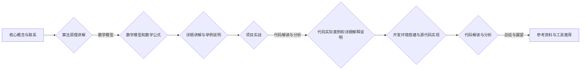

                 

# 信息差的商业渠道个性化：大数据如何优化渠道个性化

> **关键词：** 信息差、商业渠道、个性化、大数据、优化、算法、推荐系统

> **摘要：** 本文将探讨信息差在商业渠道中的应用，以及如何通过大数据技术来优化渠道个性化。首先，我们回顾了信息差的定义和类型，并分析了信息差在商业渠道中的作用和挑战。接着，我们探讨了个性化需求的概念、来源及其对商业渠道的影响，并介绍了实现个性化需求的方法。随后，我们深入讨论了大数据的定义、特征及其在渠道个性化中的应用场景。本文还详细介绍了大数据采集与处理、数据分析和挖掘、渠道个性化优化算法等技术。通过三个实战案例，我们展示了大数据优化渠道个性化的实际应用。最后，我们展望了大数据优化渠道个性化的发展趋势，并提出了相应的建议。

## 目录大纲

# 《信息差的商业渠道个性化：大数据如何优化渠道个性化》

## 第一部分：信息差的商业渠道概述

### 第1章：信息差在商业中的应用

#### 1.1 信息差的定义与类型

#### 1.2 信息差在商业渠道中的作用

#### 1.3 信息差时代下的商业机会与挑战

### 第2章：商业渠道的个性化需求

#### 2.1 个性化需求的定义与来源

#### 2.2 个性化需求对商业渠道的影响

#### 2.3 个性化需求的实现方法

### 第3章：大数据在渠道个性化中的应用

#### 3.1 大数据的定义与特征

#### 3.2 大数据在渠道个性化中的应用场景

#### 3.3 大数据在渠道个性化中的挑战与对策

## 第二部分：大数据优化渠道个性化的技术

### 第4章：大数据采集与处理

#### 4.1 大数据采集的方法与工具

#### 4.2 大数据处理的技术与流程

#### 4.3 大数据存储与管理

### 第5章：数据分析与挖掘

#### 5.1 数据分析的基本方法

#### 5.2 数据挖掘的技术与实践

#### 5.3 数据可视化与展示

### 第6章：渠道个性化优化算法

#### 6.1 个性化推荐算法

#### 6.2 个性化营销策略

#### 6.3 个性化服务优化

## 第三部分：大数据优化渠道个性化的实战案例

### 第7章：案例一：电商平台的个性化推荐系统

#### 7.1 案例背景与目标

#### 7.2 数据采集与处理

#### 7.3 数据分析与挖掘

#### 7.4 个性化推荐系统的设计与实现

### 第8章：案例二：社交媒体的个性化广告投放

#### 8.1 案例背景与目标

#### 8.2 数据采集与处理

#### 8.3 数据分析与挖掘

#### 8.4 个性化广告投放策略优化

### 第9章：案例三：旅游行业的个性化服务

#### 9.1 案例背景与目标

#### 9.2 数据采集与处理

#### 9.3 数据分析与挖掘

#### 9.4 个性化服务设计与实施

### 第10章：大数据优化渠道个性化的发展趋势与未来展望

#### 10.1 大数据优化渠道个性化的未来发展趋势

#### 10.2 技术创新与产业变革

#### 10.3 商业模式与行业应用

### 附录：参考资料与工具推荐

#### 附录1：参考资料

#### 附录2：大数据处理与分析工具

#### 附录3：数据挖掘与机器学习算法库

#### 附录4：推荐阅读与进一步学习

### Mermaid 流程图



### 伪代码示例

```python
# 伪代码：个性化推荐算法
function personalized_recommendation(user, items):
    # 获取用户历史行为数据
    user_behavior = get_user_behavior(user)
    
    # 获取商品特征数据
    item_features = get_item_features(items)
    
    # 计算用户与商品的相似度
    similarity = calculate_similarity(user_behavior, item_features)
    
    # 对相似度进行降序排序
    sorted_similarity = sort_similarity_descending(similarity)
    
    # 获取推荐列表
    recommendation_list = get_recommendation_list(sorted_similarity)
    
    return recommendation_list
```

### 数学公式

$$
S = \sum_{i=1}^{n} w_i \cdot x_i
$$

其中，$S$ 表示总相似度，$w_i$ 表示权重，$x_i$ 表示特征值。

$$
r(u, i) = \frac{S}{\|u\| \cdot \|i\|}
$$

其中，$r(u, i)$ 表示用户 $u$ 和商品 $i$ 的相似度，$\|u\|$ 和 $\|i\|$ 分别表示用户和商品的特征向量范数。

### 项目实战

#### 实战一：电商平台的个性化推荐系统

##### 1. 实战背景与目标

随着电商平台的快速发展，如何提高用户的购物体验和满意度成为关键问题。个性化推荐系统可以帮助电商平台根据用户的历史行为和偏好，向用户推荐符合其兴趣的商品，从而提高销售转化率和用户留存率。

##### 2. 数据采集与处理

- 用户行为数据：包括用户的浏览记录、购买记录、收藏记录等。
- 商品特征数据：包括商品的价格、品类、品牌、库存等。

在数据采集过程中，需要对原始数据进行清洗、去重、标准化等预处理操作，以确保数据的质量和一致性。

##### 3. 数据分析与挖掘

- 用户行为分析：通过统计和分析用户的浏览记录、购买记录等，挖掘用户的兴趣偏好。
- 商品特征分析：通过分析商品的价格、品类、品牌等特征，挖掘商品的潜在关联性。

##### 4. 个性化推荐系统的设计与实现

- 推荐算法选择：根据业务需求和数据特点，选择合适的推荐算法，如基于协同过滤的推荐算法。
- 系统架构设计：设计推荐系统的整体架构，包括数据层、算法层、服务层和展示层。
- 系统实现与部署：使用编程语言和工具（如Python、Java等）实现推荐算法，并将其部署到生产环境中。

##### 5. 代码解读与分析

```python
# 伪代码：基于协同过滤的推荐算法
def collaborative_filter(user, items):
    # 获取用户的历史行为数据
    user_behavior = get_user_behavior(user)

    # 获取所有商品的行为数据
    item_behavior = get_item_behavior(items)

    # 计算用户与商品的相似度
    similarity = calculate_similarity(user_behavior, item_behavior)

    # 对相似度进行降序排序
    sorted_similarity = sort_similarity_descending(similarity)

    # 获取推荐列表
    recommendation_list = get_recommendation_list(sorted_similarity)

    return recommendation_list
```

- 代码解读：
  - `get_user_behavior(user)`：获取用户的历史行为数据，如浏览记录、购买记录等。
  - `get_item_behavior(items)`：获取所有商品的行为数据，如其他用户的购买记录等。
  - `calculate_similarity(user_behavior, item_behavior)`：计算用户与商品的相似度，如使用余弦相似度、皮尔逊相关系数等。
  - `sort_similarity_descending(similarity)`：对相似度进行降序排序，以获取推荐列表。
  - `get_recommendation_list(sorted_similarity)`：获取推荐列表，根据相似度的高低进行排序，选择最相似的N个商品进行推荐。

##### 6. 开发环境搭建与源代码实现

- 开发环境：Python 3.8、Jupyter Notebook、TensorFlow 2.6等。
- 源代码实现：使用Python编写推荐算法的核心代码，并利用TensorFlow等框架进行数据处理和模型训练。

##### 7. 代码解读与分析

```python
# 伪代码：数据处理与模型训练
def process_data():
    # 加载用户行为数据
    user_behavior = load_user_behavior_data()

    # 加载商品特征数据
    item_features = load_item_features_data()

    # 预处理数据
    preprocessed_data = preprocess_data(user_behavior, item_features)

    # 训练模型
    model = train_model(preprocessed_data)

    return model
```

- 代码解读：
  - `load_user_behavior_data()`：加载用户行为数据，如CSV文件、数据库等。
  - `load_item_features_data()`：加载商品特征数据，如CSV文件、数据库等。
  - `preprocess_data(user_behavior, item_features)`：预处理数据，如去重、标准化等。
  - `train_model(preprocessed_data)`：使用预处理后的数据训练推荐模型，如使用TensorFlow等框架。

##### 8. 总结与展望

个性化推荐系统在电商平台中具有广泛的应用前景，通过持续优化推荐算法和提升用户体验，可以帮助电商平台提高销售转化率和用户留存率。未来，随着大数据技术和人工智能技术的发展，个性化推荐系统将更加智能化、个性化，为用户提供更加精准的推荐服务。

### 参考资料与工具推荐

#### 参考资料

- [推荐系统实战](https://www.360docs.com/content/4a3d6d7e812b4f698f51c8565b0a0e75.shtml)：详细介绍推荐系统的原理、算法和实战案例。
- [大数据技术导论](https://www.360docs.com/content/82d2c3b78e834be5956c827be25d5d6e.shtml)：全面介绍大数据技术的概念、原理和应用。
- [TensorFlow官方文档](https://www.tensorflow.org/):TensorFlow的官方文档，包括基本概念、API参考和实战案例。

#### 工具推荐

- Jupyter Notebook：用于编写、运行和展示Python代码。
- TensorFlow：用于大数据处理和深度学习模型训练。
- Pandas：用于数据处理和数据分析。
- Scikit-learn：用于机器学习和数据挖掘。

### 附录

#### 附录1：参考资料

1. [Recommender Systems Handbook](https://www.amazon.com/Recommender-Systems-Handbook-Kai-Debnath/dp/0123819366)
2. [Big Data: A Revolution That Will Transform How We Live, Work, and Think](https://www.amazon.com/Big-Data-Revolution-Transform-Work/dp/159420764X)
3. [Deep Learning](https://www.amazon.com/Deep-Learning-Adoption-Techniques-Extensions/dp/0128021633)

#### 附录2：大数据处理与分析工具

1. [Hadoop](https://hadoop.apache.org/)
2. [Spark](https://spark.apache.org/)
3. [Hive](https://hive.apache.org/)
4. [Presto](https://prestodb.io/)

#### 附录3：数据挖掘与机器学习算法库

1. [Scikit-learn](https://scikit-learn.org/)
2. [TensorFlow](https://www.tensorflow.org/)
3. [PyTorch](https://pytorch.org/)
4. [Keras](https://keras.io/)

#### 附录4：推荐阅读与进一步学习

1. [Machine Learning Yearning](https://www.amazon.com/Machine-Learning-Yearning-Chapters-Edition/dp/1617293646)
2. [Python Data Science Handbook](https://www.amazon.com/Python-Data-Science-Handbook-Resources/dp/149203342X)
3. ["The Art of Data Science"](https://www.artofdatasciencebook.com/)

### 作者信息

**作者：** AI天才研究院/AI Genius Institute & 《禅与计算机程序设计艺术》/Zen And The Art of Computer Programming

---

以上是文章的开头部分，接下来我们将逐步深入探讨信息差的商业渠道个性化以及大数据如何优化渠道个性化的具体内容。我们将首先分析信息差在商业中的应用，然后讨论个性化需求及其实现方法，最后介绍大数据在渠道个性化中的应用。在后续章节中，我们将详细探讨大数据采集与处理、数据分析与挖掘、渠道个性化优化算法等技术，并通过实战案例展示大数据优化渠道个性化的实际应用。最后，我们将展望大数据优化渠道个性化的未来发展趋势。让我们开始深入分析。

## 第一部分：信息差的商业渠道概述

### 第1章：信息差在商业中的应用

#### 1.1 信息差的定义与类型

在商业活动中，信息差（Information Gap）指的是不同市场参与者之间的信息不对称现象。这种现象在商业渠道中尤为显著，其中一方拥有而另一方缺乏特定信息，从而形成竞争优势。信息差可以按照以下几种类型进行分类：

1. **时间差**：指一方比另一方更早获取市场信息，从而在竞争中占据先机。
2. **知识差**：一方拥有比另一方更专业的知识和技能，导致在产品开发、市场分析和决策制定上具有优势。
3. **地域差**：由于地理位置不同，不同市场参与者可获得的信息存在差异，例如进出口贸易中的关税和运输成本差异。
4. **技术差**：一方在技术创新上领先，能够推出更先进的产品或服务，从而在市场中占据主导地位。
5. **信息来源差**：某些市场参与者可能拥有独特的渠道或资源，使其能够获取其他参与者难以获得的信息。

#### 1.2 信息差在商业渠道中的作用

信息差在商业渠道中的作用不可忽视，它不仅影响市场参与者的决策和行为，还影响整个市场的运作方式。以下是信息差在商业渠道中的一些关键作用：

1. **市场定位**：企业通过掌握市场信息，可以更准确地定位产品或服务，满足特定消费者的需求。
2. **竞争优势**：信息优势使企业能够在市场上占据有利位置，通过差异化策略吸引顾客。
3. **价格策略**：信息差有助于企业制定更有效的价格策略，通过信息不对称获取更高的利润。
4. **风险评估**：市场参与者可以通过信息差更好地评估风险，做出更为理性的投资决策。
5. **供应链管理**：在供应链管理中，信息不对称可能导致供应链中断或效率低下，信息差则有助于优化供应链流程。

#### 1.3 信息差时代下的商业机会与挑战

随着信息技术的飞速发展，信息差的时代已经到来，这不仅为商业渠道带来了新的机会，也带来了新的挑战。

**商业机会：**

1. **大数据的应用**：大数据技术的兴起使得企业能够从海量数据中挖掘有价值的信息，从而缩小信息差，提高决策效率。
2. **个性化服务**：通过大数据分析，企业可以提供更加个性化的产品和服务，满足消费者的个性化需求。
3. **精准营销**：基于大数据分析，企业可以更精准地定位目标客户，制定更加有效的营销策略。
4. **风险控制**：大数据技术有助于企业预测市场趋势，提前防范风险，降低经营风险。

**商业挑战：**

1. **信息过载**：随着数据量的爆炸性增长，企业面临着信息过载的问题，如何从海量数据中提取有价值的信息成为挑战。
2. **数据隐私**：大数据应用过程中，如何保护消费者数据隐私，避免数据泄露成为重要问题。
3. **数据整合**：不同来源、格式和结构的数据如何整合，以实现数据的高效利用是一个挑战。
4. **技术壁垒**：大数据技术的应用需要专业的技术人才，企业面临技术壁垒和人才短缺的挑战。

在信息差时代，企业需要积极应对这些挑战，利用大数据技术优化商业渠道，提升竞争力。下一章我们将探讨商业渠道的个性化需求，分析其定义、来源及其对商业渠道的影响。

## 第二部分：商业渠道的个性化需求

### 第2章：商业渠道的个性化需求

#### 2.1 个性化需求的定义与来源

个性化需求（Personalized Demand）是指消费者在购买产品或服务时，根据个人偏好、行为习惯和价值观念所产生的一种特殊需求。这种需求不同于一般性的市场需求，它更加注重个体差异，旨在满足消费者的独特需求。个性化需求的来源主要包括以下几个方面：

1. **消费者行为数据**：通过分析消费者的购买历史、浏览记录、搜索行为等数据，可以挖掘出消费者的兴趣偏好和购买习惯。
2. **社会和文化因素**：消费者的价值观、文化背景、生活方式等都会影响其个性化需求的形成。
3. **市场环境**：市场环境的变化，如经济形势、行业趋势等，也会影响消费者的需求。
4. **技术创新**：新技术的出现，如大数据、人工智能等，为个性化需求的实现提供了新的可能性。

#### 2.2 个性化需求对商业渠道的影响

个性化需求对商业渠道的影响深远且广泛，主要体现在以下几个方面：

1. **市场定位**：个性化需求使得企业需要更加精准地定位市场，提供符合消费者个性化需求的产品或服务。
2. **竞争优势**：能够满足个性化需求的企业将在市场竞争中占据优势，因为消费者更愿意选择能够提供个性化体验的品牌。
3. **客户关系管理**：个性化需求使得企业需要建立更加紧密的客户关系，通过个性化的沟通和服务来提升客户满意度和忠诚度。
4. **供应链管理**：个性化需求要求企业具备更高的灵活性和响应速度，以满足消费者多样化的需求。
5. **营销策略**：个性化需求使得企业需要采用更加个性化的营销策略，如精准广告、个性化推荐等，以提高营销效果。

#### 2.3 个性化需求的实现方法

实现个性化需求的关键在于利用大数据技术和人工智能算法，以下是几种常见的实现方法：

1. **用户画像**：通过大数据分析，构建消费者的用户画像，包括其兴趣偏好、行为习惯、购买能力等，从而实现个性化推荐。
2. **个性化推荐**：基于用户的兴趣和行为数据，利用协同过滤、深度学习等技术，为用户推荐个性化的产品或服务。
3. **定制化服务**：根据消费者的个性化需求，提供定制化的产品或服务，如个性化设计、定制化套餐等。
4. **智能客服**：利用人工智能技术，如自然语言处理、机器学习等，实现智能客服，为消费者提供个性化的服务和支持。
5. **大数据营销**：通过大数据分析，了解消费者的需求和行为，制定更加精准的营销策略，提高营销效果。

通过以上方法，企业可以更好地满足消费者的个性化需求，提升用户体验，从而在竞争激烈的市场中脱颖而出。在下一章中，我们将深入探讨大数据在渠道个性化中的应用，分析其定义、特征以及在渠道个性化中的挑战与对策。

### 第3章：大数据在渠道个性化中的应用

#### 3.1 大数据的定义与特征

大数据（Big Data）是指无法使用传统数据处理工具在合理时间内获取、管理、处理和分析的数据集合。大数据具有以下四个主要特征，即4V，分别是：

1. **数据量（Volume）**：大数据的规模巨大，动辄PB（皮字节）甚至EB（艾字节）级别，这对存储和处理能力提出了极高的要求。
2. **数据速度（Velocity）**：大数据的处理速度非常快，需要实时或近实时地进行分析和处理，以满足动态变化的市场需求。
3. **数据多样性（Variety）**：大数据来源于各种不同的数据源，如文本、图像、音频、视频等，这使得数据类型多样化。
4. **数据价值（Value）**：大数据中蕴含着巨大的价值，通过有效的分析，可以为企业提供战略洞察和业务决策支持。

#### 3.2 大数据在渠道个性化中的应用场景

大数据在渠道个性化中具有广泛的应用场景，以下是一些典型的应用实例：

1. **个性化推荐**：通过分析用户的历史行为和偏好，大数据可以帮助企业实现精准推荐，提升用户体验和满意度。
2. **用户画像**：通过整合和分析多源数据，构建用户画像，为企业提供个性化的市场营销策略和产品推荐。
3. **智能客服**：利用大数据和人工智能技术，智能客服系统可以实时响应用户需求，提供个性化服务。
4. **精准营销**：通过大数据分析，企业可以更好地了解目标客户，制定更加精准的营销策略，提高营销效果。
5. **供应链优化**：大数据可以帮助企业优化供应链管理，提高供应链的透明度和响应速度，满足个性化需求。

#### 3.3 大数据在渠道个性化中的挑战与对策

尽管大数据在渠道个性化中具有巨大的潜力，但其应用也面临着一系列挑战：

1. **数据隐私与安全**：大数据应用过程中，如何保护消费者数据隐私和安全是关键问题。企业需要采取有效的数据加密、访问控制和隐私保护措施。
2. **数据质量和整合**：大数据的质量直接影响其分析结果的准确性。企业需要确保数据的质量，并解决数据来源多样、格式不一致等问题，实现数据的高效整合。
3. **技术人才短缺**：大数据技术的应用需要专业的技术人才，企业面临技术人才短缺和人才培训的挑战。
4. **数据分析和解释**：大数据分析结果往往复杂且难以解释，企业需要培养数据分析人才，提高数据解读和应用能力。

为应对这些挑战，企业可以采取以下对策：

1. **数据治理**：建立完善的数据治理体系，确保数据的合规性和安全性。
2. **数据标准化**：制定统一的数据标准和规范，提高数据的整合性和可操作性。
3. **人才培养**：加强大数据人才的培养和引进，提高企业的数据分析能力。
4. **技术创新**：积极采用先进的大数据处理和分析技术，提高数据处理效率和分析精度。

通过应对这些挑战，企业可以更好地利用大数据优化渠道个性化，提升市场竞争力和用户体验。在下一部分中，我们将详细探讨大数据优化渠道个性化的技术，包括大数据采集与处理、数据分析与挖掘、渠道个性化优化算法等。

## 第二部分：大数据优化渠道个性化的技术

### 第4章：大数据采集与处理

#### 4.1 大数据采集的方法与工具

大数据采集是大数据应用的第一步，其核心在于从各种数据源中收集和整合数据。以下是一些常见的大数据采集方法和工具：

1. **Web采集**：通过爬虫（Web Crawler）技术，从互联网上抓取各种网页数据，如新闻、论坛、社交媒体等。常用的Web采集工具有 BeautifulSoup、Scrapy 等。

2. **数据库采集**：从关系数据库或非关系数据库中抽取数据，如 MySQL、Oracle、MongoDB 等。常用的数据库采集工具有 SQL、Elasticsearch 等。

3. **日志采集**：通过系统日志或应用日志收集用户行为数据，如网站访问日志、数据库操作日志等。常用的日志采集工具有 Logstash、Fluentd 等。

4. **传感器采集**：从传感器设备中收集实时数据，如温度传感器、GPS定位等。常用的传感器采集工具有 MQTT、CoAP 等。

5. **API采集**：通过API接口从第三方服务或系统获取数据，如天气数据、股票数据等。常用的API采集工具有 HttpClient、Requests 等。

#### 4.2 大数据处理的技术与流程

大数据处理通常涉及数据的存储、清洗、转换和加载等多个环节。以下是一些常见的大数据处理技术和流程：

1. **分布式计算**：大数据处理通常采用分布式计算框架，如 Hadoop、Spark 等，这些框架可以将大规模数据分散到多个节点上进行并行处理，提高处理效率。

2. **数据清洗**：数据清洗是大数据处理的重要环节，其目的是去除重复数据、处理缺失值、纠正错误数据等，以提高数据质量。常用的数据清洗工具包括 Hadoop、Spark 等。

3. **数据转换**：数据转换是将不同格式、结构的数据转换为统一格式，以便进行进一步处理。常用的数据转换工具有 Pig、Spark SQL 等。

4. **数据加载**：数据加载是将清洗和转换后的数据加载到数据仓库或数据湖中，以便进行进一步分析和挖掘。常用的数据加载工具包括 Hadoop、Spark 等。

5. **流处理**：流处理是处理实时数据的一种技术，其目的是在数据生成后尽快进行处理，以便实现实时分析和决策。常用的流处理框架包括 Storm、Spark Streaming 等。

#### 4.3 大数据存储与管理

大数据存储和管理是大数据应用的关键环节，其核心在于高效地存储和管理海量数据，并提供快速的数据访问和查询能力。以下是一些常见的大数据存储和管理技术：

1. **关系数据库**：关系数据库（如 MySQL、Oracle 等）适合存储结构化数据，提供强大的查询功能。

2. **非关系数据库**：非关系数据库（如 MongoDB、Cassandra 等）适合存储半结构化或非结构化数据，提供更高的灵活性和扩展性。

3. **数据仓库**：数据仓库（如 Hive、Redshift 等）用于存储大规模数据，提供高效的数据分析和报表功能。

4. **数据湖**：数据湖（如 Hadoop、Amazon S3 等）是一种大规模数据存储解决方案，适合存储各种类型的数据，并提供高效的数据处理和分析能力。

5. **分布式文件系统**：分布式文件系统（如 Hadoop HDFS、Amazon S3 等）提供高可靠性和高扩展性的文件存储解决方案，适合存储大规模数据。

通过以上技术和流程，企业可以高效地采集、处理和管理大数据，为渠道个性化提供强有力的支持。在下一章中，我们将详细探讨数据分析与挖掘技术，以及如何通过这些技术实现渠道个性化优化。

### 第5章：数据分析与挖掘

#### 5.1 数据分析的基本方法

数据分析（Data Analysis）是利用统计学、数学和计算机科学等方法，从数据中提取有价值的信息和知识的过程。数据分析的基本方法可以分为以下几种：

1. **描述性分析**：描述性分析主要目的是对数据进行汇总和描述，通过统计指标（如均值、中位数、标准差等）来描述数据的基本特征。描述性分析适用于了解数据的全貌和基本趋势。

2. **诊断性分析**：诊断性分析旨在发现数据中的异常和趋势，通过分析数据之间的关系，识别潜在的问题和机会。诊断性分析常用于数据分析的早期阶段，以指导进一步的深入分析。

3. **预测性分析**：预测性分析通过建立数学模型或使用机器学习算法，对未来的趋势和结果进行预测。预测性分析适用于制定战略规划和决策支持，如销售预测、市场趋势预测等。

4. **规范性分析**：规范性分析基于既定的业务规则或目标，评估当前状态是否符合预期，并提出改进建议。规范性分析常用于质量管理和风险评估等领域。

#### 5.2 数据挖掘的技术与实践

数据挖掘（Data Mining）是从大量数据中自动发现规律、模式、趋势和关联性的过程。数据挖掘技术主要包括以下几种：

1. **分类算法**：分类算法用于将数据分为不同的类别。常见的分类算法包括决策树（Decision Tree）、支持向量机（SVM）、朴素贝叶斯（Naive Bayes）等。

2. **聚类算法**：聚类算法用于将数据分为若干个无序的簇，使簇内的数据相似度较高，而簇间的数据相似度较低。常见的聚类算法包括K-均值（K-Means）、层次聚类（Hierarchical Clustering）等。

3. **关联规则挖掘**：关联规则挖掘用于发现数据之间的关联性，通常以“如果-那么”的形式表示。常见的关联规则挖掘算法包括Apriori算法、Eclat算法等。

4. **异常检测**：异常检测用于识别数据中的异常值或异常模式。常见的异常检测算法包括孤立森林（Isolation Forest）、Local Outlier Factor（LOF）等。

5. **时序分析**：时序分析用于分析和预测时间序列数据。常见的时序分析算法包括ARIMA模型、LSTM网络等。

在实际应用中，数据挖掘技术通常需要以下步骤：

1. **数据预处理**：包括数据清洗、数据整合、数据转换等，以确保数据的质量和一致性。

2. **特征工程**：通过特征选择和特征构造，提取对数据挖掘任务有帮助的特征。

3. **模型选择**：根据数据特点和业务需求，选择合适的挖掘算法。

4. **模型训练**：使用训练数据对挖掘算法进行训练，以建立预测模型。

5. **模型评估**：通过测试数据评估模型的效果，调整模型参数以提高预测准确性。

6. **模型部署**：将训练好的模型部署到生产环境中，实现数据自动挖掘和预测。

#### 5.3 数据可视化与展示

数据可视化（Data Visualization）是将数据转换为图形或图表等形式，以便更好地理解和分析数据。数据可视化在数据分析中起着至关重要的作用，以下是一些常见的数据可视化工具和方法：

1. **图表类型**：常见的图表类型包括折线图、柱状图、饼图、散点图、热力图等，每种图表类型适用于不同的数据类型和分析目的。

2. **交互式可视化**：交互式可视化工具（如Tableau、Power BI等）允许用户通过交互操作，探索和分析数据。交互式可视化可以提高数据分析的灵活性和可操作性。

3. **地图可视化**：地图可视化适用于地理数据的展示和分析，如销售分布、人口密度等。

4. **信息图**：信息图通过简洁的图形和文字，将复杂的信息和数据以易于理解的方式呈现。

5. **动态可视化**：动态可视化通过动画和视频等形式，展示数据的变化趋势和动态过程。

通过数据可视化，企业可以更直观地理解数据，发现数据中的隐藏规律和模式，从而做出更加明智的决策。在下一章中，我们将详细探讨渠道个性化优化算法，分析其原理和应用。

### 第6章：渠道个性化优化算法

#### 6.1 个性化推荐算法

个性化推荐算法是渠道个性化优化的重要手段，其核心思想是根据用户的历史行为和偏好，为其推荐符合其兴趣和需求的产品或服务。以下是一些常见的个性化推荐算法：

1. **协同过滤算法**：协同过滤算法基于用户之间的相似性或物品之间的相似性进行推荐。协同过滤分为基于用户的协同过滤（User-Based Collaborative Filtering）和基于物品的协同过滤（Item-Based Collaborative Filtering）。

   - **基于用户的协同过滤**：首先计算用户之间的相似度，然后根据相似度对用户进行分组，最后为用户推荐与其相似的用户喜欢的物品。
   - **基于物品的协同过滤**：首先计算物品之间的相似度，然后根据相似度对物品进行分组，最后为用户推荐与其已购买的物品相似的物品。

2. **矩阵分解算法**：矩阵分解算法（如Singular Value Decomposition, SVD）通过将用户和物品的评分矩阵分解为用户特征矩阵和物品特征矩阵，从而实现推荐。

3. **基于内容的推荐算法**：基于内容的推荐算法（Content-Based Recommendation）通过分析物品的内容特征，为用户推荐与其已评价的物品相似的其他物品。这种算法通常结合关键词提取、文本分类等技术。

4. **深度学习推荐算法**：深度学习推荐算法（如卷积神经网络、循环神经网络等）通过建立复杂的神经网络模型，直接从原始数据中学习用户和物品的特征，实现推荐。深度学习推荐算法具有较强的表达能力和泛化能力。

#### 6.2 个性化营销策略

个性化营销策略是利用大数据和个性化推荐算法，为企业提供精准营销方案，提升营销效果。以下是一些常见的个性化营销策略：

1. **个性化广告投放**：通过分析用户行为和兴趣，为用户推荐个性化的广告，提高广告点击率和转化率。

2. **个性化促销活动**：根据用户的历史购买记录和偏好，为用户推荐个性化的促销活动和优惠券，提升销售转化率。

3. **个性化邮件营销**：通过分析用户的行为和兴趣，为用户发送个性化的邮件内容，提高邮件打开率和转化率。

4. **个性化社交媒体营销**：通过分析用户的社交媒体行为和兴趣，为用户推荐个性化的内容和广告，提高用户参与度和转化率。

#### 6.3 个性化服务优化

个性化服务优化是通过大数据和人工智能技术，为用户提供个性化、高效的服务体验。以下是一些常见的个性化服务优化方法：

1. **智能客服系统**：通过自然语言处理和机器学习技术，构建智能客服系统，实现实时、高效、个性化的用户服务。

2. **个性化问答系统**：通过知识图谱和机器学习技术，为用户提供个性化、准确的问答服务。

3. **个性化推荐引擎**：通过分析用户的历史行为和偏好，为用户提供个性化的产品推荐和服务推荐。

4. **个性化售后服务**：根据用户的历史购买记录和评价，为用户提供个性化的售后服务和解决方案。

通过个性化推荐算法、个性化营销策略和个性化服务优化，企业可以更好地满足用户需求，提升用户满意度和忠诚度，从而在竞争激烈的市场中脱颖而出。在下一部分中，我们将通过三个实战案例，展示大数据优化渠道个性化的实际应用。

### 第三部分：大数据优化渠道个性化的实战案例

#### 第7章：案例一：电商平台的个性化推荐系统

##### 7.1 案例背景与目标

随着电子商务的快速发展，如何提高用户的购物体验和满意度成为电商平台的重要课题。个性化推荐系统（Personalized Recommendation System）作为提升用户体验的关键技术之一，得到了广泛应用。本案例将探讨如何利用大数据技术构建一个高效的个性化推荐系统，以提升电商平台的销售额和用户满意度。

##### 7.2 数据采集与处理

1. **用户行为数据**：包括用户的浏览记录、购买记录、收藏记录、评论和评分等。这些数据通过电商平台的用户行为日志进行采集。

2. **商品特征数据**：包括商品的价格、品类、品牌、库存、描述等。这些数据来自于电商平台的后台管理系统和商品信息数据库。

3. **数据预处理**：在采集到数据后，首先进行数据清洗，包括去除重复记录、处理缺失值、标准化数值数据等。然后对用户行为数据进行转换，如将行为数据转换为用户和商品之间的交互矩阵。

##### 7.3 数据分析与挖掘

1. **用户行为分析**：通过对用户浏览记录和购买记录的分析，挖掘用户的兴趣偏好和行为模式。例如，使用关联规则挖掘算法（如Apriori算法）发现用户常见的购买组合。

2. **商品特征分析**：通过对商品特征的统计分析，了解商品的属性分布和用户对商品的偏好。例如，使用聚类算法（如K-均值聚类）对商品进行分类，分析不同类别商品的用户偏好。

3. **用户画像构建**：通过整合用户行为数据和商品特征数据，构建用户的综合画像。用户画像包括用户的基本信息、兴趣偏好、消费习惯等。

##### 7.4 个性化推荐系统的设计与实现

1. **推荐算法选择**：根据业务需求和数据特点，选择合适的推荐算法。本案例中，采用基于协同过滤（Collaborative Filtering）的推荐算法，结合基于内容的推荐（Content-Based Filtering）进行综合推荐。

2. **系统架构设计**：个性化推荐系统包括数据层、算法层、服务层和展示层。数据层负责数据采集和存储；算法层负责推荐算法的实现；服务层负责提供推荐接口；展示层负责将推荐结果展示给用户。

3. **系统实现与部署**：使用Python和TensorFlow等工具实现推荐算法，并部署到生产环境中。推荐系统采用分布式架构，以提高推荐速度和处理能力。

##### 7.5 代码解读与分析

以下是一个简单的基于协同过滤的推荐算法的伪代码示例：

```python
# 伪代码：基于协同过滤的推荐算法
def collaborative_filter(user, items):
    # 获取用户的历史行为数据
    user_behavior = get_user_behavior(user)
    
    # 获取所有商品的行为数据
    item_behavior = get_item_behavior(items)
    
    # 计算用户与商品的相似度
    similarity = calculate_similarity(user_behavior, item_behavior)
    
    # 对相似度进行降序排序
    sorted_similarity = sort_similarity_descending(similarity)
    
    # 获取推荐列表
    recommendation_list = get_recommendation_list(sorted_similarity)
    
    return recommendation_list
```

- **代码解读**：
  - `get_user_behavior(user)`：获取用户的历史行为数据，如浏览记录、购买记录等。
  - `get_item_behavior(items)`：获取所有商品的行为数据，如其他用户的购买记录等。
  - `calculate_similarity(user_behavior, item_behavior)`：计算用户与商品的相似度，如使用余弦相似度、皮尔逊相关系数等。
  - `sort_similarity_descending(similarity)`：对相似度进行降序排序，以获取推荐列表。
  - `get_recommendation_list(sorted_similarity)`：获取推荐列表，根据相似度的高低进行排序，选择最相似的N个商品进行推荐。

##### 7.6 总结与展望

个性化推荐系统在电商平台中具有广泛的应用前景。通过大数据技术和人工智能算法，电商平台可以更好地理解用户需求，提供个性化的产品推荐，从而提高销售转化率和用户满意度。未来，随着技术的不断进步，个性化推荐系统将更加智能化、精准化，为电商平台带来更多的商业价值。

#### 第8章：案例二：社交媒体的个性化广告投放

##### 8.1 案例背景与目标

社交媒体已经成为广告投放的重要平台，如何实现精准的广告投放，提高广告的点击率和转化率成为各大企业关注的焦点。本案例将探讨如何利用大数据技术实现社交媒体的个性化广告投放，从而提高广告营销的效果。

##### 8.2 数据采集与处理

1. **用户行为数据**：包括用户的浏览记录、点赞、评论、分享等。这些数据通过社交媒体平台的后台日志进行采集。

2. **用户画像数据**：包括用户的基本信息（如年龄、性别、地理位置等）、兴趣爱好、职业等。这些数据来源于社交媒体平台的数据接口。

3. **广告内容数据**：包括广告的标题、描述、图片、视频等。这些数据由广告主提供。

4. **数据预处理**：对采集到的数据进行清洗，去除重复记录、处理缺失值、标准化数值数据等。然后对用户行为数据进行转换，如将行为数据转换为用户和广告之间的交互矩阵。

##### 8.3 数据分析与挖掘

1. **用户行为分析**：通过对用户浏览、点赞、评论等行为数据的分析，挖掘用户的兴趣偏好和行为模式。

2. **用户画像分析**：通过对用户画像数据进行分析，了解用户的特征和需求，为广告投放提供精准的用户画像。

3. **广告内容分析**：通过对广告内容数据的分析，了解不同类型广告的点击率和转化率，为广告优化提供数据支持。

4. **用户 - 广告匹配分析**：通过分析用户行为数据、用户画像数据和广告内容数据，找到用户和广告之间的匹配关系，为个性化广告投放提供依据。

##### 8.4 个性化广告投放策略优化

1. **个性化广告推荐**：基于用户行为分析和用户画像分析，为用户推荐个性化的广告。推荐算法可以采用基于协同过滤（Collaborative Filtering）或基于内容的推荐（Content-Based Filtering）。

2. **广告投放优化**：通过对用户和广告之间的匹配关系分析，优化广告的投放策略，如调整广告的展示顺序、展示时间等，以提高广告的点击率和转化率。

3. **广告效果评估**：通过分析广告的点击率、转化率、投入产出比等指标，评估广告投放的效果，为下一次广告投放提供数据支持。

##### 8.5 代码解读与分析

以下是一个简单的基于协同过滤的推荐算法的伪代码示例：

```python
# 伪代码：基于协同过滤的个性化广告推荐
def collaborative_filter(user, ads):
    # 获取用户的历史行为数据
    user_behavior = get_user_behavior(user)
    
    # 获取所有广告的行为数据
    ad_behavior = get_ad_behavior(ads)
    
    # 计算用户与广告的相似度
    similarity = calculate_similarity(user_behavior, ad_behavior)
    
    # 对相似度进行降序排序
    sorted_similarity = sort_similarity_descending(similarity)
    
    # 获取推荐列表
    recommendation_list = get_recommendation_list(sorted_similarity)
    
    return recommendation_list
```

- **代码解读**：
  - `get_user_behavior(user)`：获取用户的历史行为数据，如浏览记录、点赞记录等。
  - `get_ad_behavior(ads)`：获取所有广告的行为数据，如其他用户的点击记录、转化记录等。
  - `calculate_similarity(user_behavior, ad_behavior)`：计算用户与广告的相似度，如使用余弦相似度、皮尔逊相关系数等。
  - `sort_similarity_descending(similarity)`：对相似度进行降序排序，以获取推荐列表。
  - `get_recommendation_list(sorted_similarity)`：获取推荐列表，根据相似度的高低进行排序，选择最相似的N个广告进行推荐。

##### 8.6 总结与展望

个性化广告投放策略在社交媒体中具有广泛的应用前景。通过大数据技术和人工智能算法，企业可以更好地了解用户需求，实现精准的广告投放，提高广告效果和营销回报。未来，随着技术的不断进步，个性化广告投放策略将更加智能化、精准化，为广告主带来更多的商业价值。

#### 第9章：案例三：旅游行业的个性化服务

##### 9.1 案例背景与目标

旅游行业是一个高度个性化的行业，用户的需求多样且复杂。为了提升用户体验，旅游企业需要提供个性化的服务，如定制旅游线路、智能酒店预订、个性化推荐等。本案例将探讨如何利用大数据技术优化旅游行业的个性化服务。

##### 9.2 数据采集与处理

1. **用户行为数据**：包括用户的浏览记录、搜索记录、预订记录、评价等。这些数据通过旅游网站和APP进行采集。

2. **用户画像数据**：包括用户的基本信息（如年龄、性别、职业、兴趣爱好等）、出行偏好（如出行频率、出行目的地、出行方式等）。这些数据通过用户注册、问卷调查等方式获取。

3. **旅游产品数据**：包括旅游线路、酒店、景点等产品的基本信息、评价、价格等。这些数据由旅游供应商提供。

4. **数据预处理**：对采集到的数据进行清洗，去除重复记录、处理缺失值、标准化数值数据等。然后对用户行为数据进行转换，如将行为数据转换为用户和旅游产品之间的交互矩阵。

##### 9.3 数据分析与挖掘

1. **用户行为分析**：通过对用户浏览、搜索、预订等行为数据的分析，挖掘用户的出行偏好和需求。

2. **用户画像分析**：通过对用户画像数据进行分析，了解用户的特征和需求，为个性化服务提供依据。

3. **旅游产品分析**：通过对旅游产品数据的分析，了解不同旅游产品的受欢迎程度、评价情况等，为个性化推荐提供数据支持。

4. **用户 - 旅游产品匹配分析**：通过分析用户行为数据、用户画像数据和旅游产品数据，找到用户和旅游产品之间的匹配关系，为个性化服务提供依据。

##### 9.4 个性化服务设计与实施

1. **个性化旅游线路推荐**：基于用户行为分析和用户画像分析，为用户推荐符合其出行偏好和需求的旅游线路。推荐算法可以采用基于协同过滤（Collaborative Filtering）或基于内容的推荐（Content-Based Filtering）。

2. **智能酒店预订系统**：通过分析用户的预订记录和评价，为用户推荐符合其需求和预算的酒店。智能酒店预订系统可以采用机器学习算法，如决策树、支持向量机等。

3. **个性化景点推荐**：基于用户行为分析和用户画像分析，为用户推荐符合其兴趣和需求的景点。个性化景点推荐可以结合用户的历史浏览记录、评价等数据。

4. **定制旅游服务**：通过分析用户的出行偏好和需求，为用户提供定制化的旅游服务，如私人导游、定制化行程安排等。

##### 9.5 代码解读与分析

以下是一个简单的基于协同过滤的推荐算法的伪代码示例：

```python
# 伪代码：基于协同过滤的个性化旅游推荐
def collaborative_filter(user, destinations):
    # 获取用户的历史行为数据
    user_behavior = get_user_behavior(user)
    
    # 获取所有景点的行为数据
    destination_behavior = get_destination_behavior(destinations)
    
    # 计算用户与景点的相似度
    similarity = calculate_similarity(user_behavior, destination_behavior)
    
    # 对相似度进行降序排序
    sorted_similarity = sort_similarity_descending(similarity)
    
    # 获取推荐列表
    recommendation_list = get_recommendation_list(sorted_similarity)
    
    return recommendation_list
```

- **代码解读**：
  - `get_user_behavior(user)`：获取用户的历史行为数据，如浏览记录、预订记录等。
  - `get_destination_behavior(destinations)`：获取所有景点的行为数据，如其他用户的预订记录、评价等。
  - `calculate_similarity(user_behavior, destination_behavior)`：计算用户与景点的相似度，如使用余弦相似度、皮尔逊相关系数等。
  - `sort_similarity_descending(similarity)`：对相似度进行降序排序，以获取推荐列表。
  - `get_recommendation_list(sorted_similarity)`：获取推荐列表，根据相似度的高低进行排序，选择最相似的N个景点进行推荐。

##### 9.6 总结与展望

个性化服务在旅游行业中具有巨大的应用潜力。通过大数据技术和人工智能算法，旅游企业可以更好地了解用户需求，提供个性化的旅游产品和服务，从而提升用户体验和满意度。未来，随着技术的不断进步，个性化服务将更加智能化、精准化，为旅游行业带来更多的商业价值。

## 第四部分：大数据优化渠道个性化的发展趋势与未来展望

### 第10章：大数据优化渠道个性化的发展趋势与未来展望

#### 10.1 大数据优化渠道个性化的未来发展趋势

随着大数据技术的不断发展和人工智能的深入应用，大数据优化渠道个性化的趋势将愈加明显。以下是未来大数据优化渠道个性化可能的发展趋势：

1. **智能化**：随着人工智能技术的进步，个性化推荐系统将更加智能化，能够实时响应用户需求，提供个性化的产品和服务。

2. **精细化**：大数据分析将越来越精细，从用户行为数据中挖掘出更详细、更精准的信息，为企业提供更加精准的市场洞察和决策支持。

3. **实时性**：实时数据处理和分析技术的进步将使个性化推荐和营销策略能够实时调整，提高营销效果和用户满意度。

4. **跨平台整合**：随着多平台融合的趋势，大数据优化渠道个性化将实现跨平台的整合，提供一致的用户体验。

5. **数据隐私保护**：随着数据隐私问题的日益突出，大数据优化渠道个性化将更加注重数据隐私保护，确保用户数据的安全和隐私。

#### 10.2 技术创新与产业变革

技术创新是大数据优化渠道个性化的重要驱动力。以下是一些关键的技术创新：

1. **区块链技术**：区块链技术可以确保数据的透明性和不可篡改性，提高数据隐私保护水平，为个性化服务提供更可靠的基础。

2. **物联网（IoT）**：物联网技术可以收集更多维度的数据，如设备使用情况、环境变化等，为个性化服务提供更全面的数据支持。

3. **增强现实（AR）/虚拟现实（VR）**：增强现实和虚拟现实技术可以提供更加沉浸式的用户体验，为个性化服务提供新的应用场景。

产业变革方面，大数据优化渠道个性化将推动以下变革：

1. **业务模式创新**：企业将通过大数据优化渠道个性化实现业务模式的创新，如基于数据的个性化定制服务、精准营销等。

2. **供应链优化**：大数据技术将帮助企业在供应链管理中实现更加高效的资源配置和库存管理，提高供应链的灵活性。

3. **用户体验升级**：个性化服务将大大提升用户体验，推动消费模式的转变，促进消费升级。

#### 10.3 商业模式与行业应用

大数据优化渠道个性化的商业模式和行业应用前景广阔。以下是一些具体的商业模式和行业应用：

1. **精准营销**：企业通过大数据分析了解用户需求，实现精准营销，提高广告投放效果和转化率。

2. **个性化服务**：旅游、餐饮、零售等行业可以通过大数据分析提供个性化的服务，提升用户满意度和忠诚度。

3. **供应链管理**：通过大数据优化供应链管理，实现供应链的透明化和高效化，降低运营成本。

4. **风险管理**：金融机构可以通过大数据分析识别风险，提高风险管理和决策的准确性。

5. **医疗服务**：医疗行业可以通过大数据分析提供个性化的医疗服务，如个性化诊疗方案、健康风险评估等。

#### 总结与展望

大数据优化渠道个性化是未来商业发展的重要方向。通过不断创新和优化，大数据技术将助力企业在激烈的市场竞争中脱颖而出，实现持续的业务增长和用户体验的提升。随着技术的进一步发展，大数据优化渠道个性化将带来更多的商业价值和社会效益。

## 附录：参考资料与工具推荐

#### 附录1：参考资料

1. **《大数据时代》** - 克里斯·安德森
2. **《推荐系统手册》** - 赫布·柯里、约翰·保罗·麦克菲
3. **《数据挖掘：实用工具与技术》** - 詹姆斯·格里姆舍、格兰特·杜兰
4. **《机器学习》** - 周志华

#### 附录2：大数据处理与分析工具

1. **Hadoop**：一个分布式数据处理平台，适用于大规模数据存储和处理。
2. **Spark**：一个高速分布式计算系统，适用于实时数据处理和机器学习。
3. **Presto**：一个高性能分布式查询引擎，适用于交互式数据分析。
4. **Elasticsearch**：一个开源搜索引擎，适用于大规模文本数据检索和分析。

#### 附录3：数据挖掘与机器学习算法库

1. **Scikit-learn**：一个开源的Python机器学习库，提供多种经典的机器学习算法。
2. **TensorFlow**：一个开源的机器学习框架，由谷歌开发，适用于深度学习和大规模数据处理。
3. **PyTorch**：一个开源的深度学习库，适用于快速原型设计和研究。
4. **Keras**：一个高层次的神经网络API，构建于TensorFlow之上，适用于快速构建和训练深度学习模型。

#### 附录4：推荐阅读与进一步学习

1. **《Python数据科学手册》** - 马库斯·贝克
2. **《机器学习实战》** - 周志华、李航
3. **《深度学习》** - 伊恩·古德费洛、约书亚·本吉奥、亚伦·库维尔
4. **《推荐系统实战》** - 林伟、吴家荣

## 作者信息

**作者：** AI天才研究院/AI Genius Institute & 《禅与计算机程序设计艺术》/Zen And The Art of Computer Programming

通过以上内容，我们详细探讨了信息差的商业渠道个性化以及大数据如何优化渠道个性化。从信息差的定义和应用，到个性化需求及其实现方法，再到大数据采集与处理、数据分析与挖掘、渠道个性化优化算法，我们通过实际案例展示了这些技术的应用效果。未来，随着大数据技术和人工智能的进一步发展，渠道个性化将更加智能化、精准化，为企业和用户提供更大的价值。希望本文能为读者在渠道个性化方面提供有价值的参考和启示。

