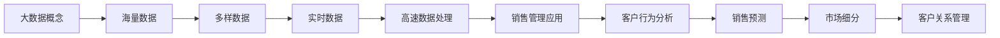

                 

### 第一部分：引言与核心概念

#### 第1章：引言

##### 1.1 《信息差的销售管理提升：大数据如何提升销售管理》的背景和重要性

在当今快速变化和竞争激烈的商业环境中，销售管理是企业成功的关键因素之一。随着技术的不断发展，大数据作为一种重要的资源，已经逐渐成为企业提升销售管理效率和质量的重要手段。本文旨在探讨大数据如何通过信息差提升销售管理的整体效果。

首先，我们需要明确几个核心概念。大数据是指数据量巨大、类型多样且生成速度极快的海量数据。这些数据来源于各种渠道，如社交媒体、传感器、交易记录等。销售管理则涉及销售流程的各个环节，包括客户关系管理、销售预测、销售目标设定等。信息差指的是不同个体或组织在信息获取、处理和利用上的差异。

大数据与销售管理的联系主要体现在以下几个方面：

1. **客户行为分析**：通过分析客户的购买历史、社交媒体行为等大数据，企业可以更好地了解客户需求，从而制定更精准的营销策略。
2. **销售预测**：大数据可以帮助企业建立预测模型，预测未来销售趋势，从而提前做出调整和规划。
3. **市场细分**：大数据技术可以对企业客户进行精准细分，使营销活动更加有针对性，提高销售转化率。
4. **客户关系管理**：通过大数据分析，企业可以更全面地了解客户需求，提供个性化的服务和产品推荐，提升客户满意度和忠诚度。

##### 1.2 大数据和销售管理的联系

为了更直观地理解大数据和销售管理的联系，我们可以使用Mermaid流程图来展示其基本概念和特点：

- **海量数据**：大数据的一个显著特征是数据量庞大，这对存储和处理提出了挑战，但也为销售管理提供了丰富的信息资源。
- **多样数据**：大数据不仅包括传统的结构化数据，还涉及半结构化和非结构化数据，这使得销售管理可以更全面地了解客户和市场。
- **实时数据**：实时数据的高速生成和处理能力，使得销售管理可以迅速响应市场变化，调整销售策略。
- **高速数据处理**：大数据技术的核心在于其高速数据处理能力，这为销售管理提供了实时分析的基础。

##### 1.3 大数据如何提升销售管理

大数据在销售管理中的应用主要体现在以下几个方面：

1. **精准营销**：通过大数据分析，企业可以更准确地了解客户需求和偏好，从而制定更有效的营销策略，提高营销效果。
2. **个性化服务**：大数据技术可以帮助企业实现个性化服务，根据客户的历史行为和偏好提供个性化的产品推荐和服务，提升客户满意度和忠诚度。
3. **销售预测**：通过大数据分析，企业可以建立销售预测模型，预测未来的销售趋势，从而提前做出调整和规划。
4. **市场细分**：大数据技术可以帮助企业更精准地细分市场，使营销活动更有针对性，提高销售转化率。
5. **客户关系管理**：通过大数据分析，企业可以更全面地了解客户需求，提供个性化的服务和产品推荐，提升客户满意度和忠诚度。

综上所述，大数据通过提供丰富的信息资源和高效的数据处理能力，显著提升了销售管理的效率和质量。在接下来的章节中，我们将深入探讨大数据技术的基础、大数据在销售管理中的应用，以及大数据在销售优化中的具体实践。通过这些内容的讲解，读者将能够更全面地理解大数据如何通过信息差提升销售管理的整体效果。

#### 第2章：大数据技术基础

##### 2.1 数据科学与数据分析

数据科学是一门结合了数学、统计学、计算机科学和领域知识的跨学科领域，旨在从数据中提取知识和洞察力。在销售管理中，数据科学的应用可以帮助企业更好地理解和利用数据，以优化决策和提升业绩。数据分析是数据科学的核心组成部分，它涉及使用统计和数学方法来分析数据，从中提取有价值的信息和模式。

**数据科学概述**

数据科学包括以下几个主要领域：

- **数据采集**：从各种来源（如数据库、文件、传感器等）收集数据。
- **数据预处理**：清洗、转换和整合数据，以便进行分析。
- **数据分析**：使用统计和机器学习技术对数据进行探索和分析。
- **数据可视化**：通过图表和图形将分析结果以直观的方式展示出来。
- **数据解释**：解释分析结果，提取业务洞察，并制定相应的策略。

**数据分析方法**

数据分析方法可以分为以下几类：

- **描述性分析**：通过统计方法描述数据的基本特征，如平均值、中位数、标准差等。描述性分析主要用于了解数据的概况。
- **推断性分析**：基于样本数据对总体数据进行推断。例如，通过置信区间和假设检验来确定数据的显著性。
- **预测性分析**：使用机器学习模型对未来的趋势进行预测。常见的预测模型包括回归分析、时间序列分析、决策树和神经网络等。
- **聚类分析**：将数据分为不同的组或集群，以便发现数据中的模式和关联。
- **关联分析**：发现数据变量之间的关联关系，如使用Apriori算法进行频繁项集挖掘。

**数据科学在销售管理中的应用**

在销售管理中，数据科学的应用主要体现在以下几个方面：

- **客户细分**：通过分析客户行为和购买历史，将客户分为不同的细分群体，以便进行有针对性的营销。
- **销售预测**：使用历史销售数据和预测模型，预测未来的销售趋势和销售量，帮助企业制定销售计划和库存管理策略。
- **客户行为分析**：通过分析客户的行为数据，如浏览历史、点击率、购买频率等，了解客户的偏好和需求，优化营销策略。
- **个性化推荐**：基于客户的历史购买数据和行为特征，提供个性化的产品推荐，提高客户满意度和转化率。
- **市场细分**：通过分析市场数据和客户特征，识别潜在市场和目标客户群体，制定更有针对性的市场策略。

##### 2.2 大数据技术框架

大数据技术框架主要包括Hadoop生态系统和其他相关技术。Hadoop是一个开源的大数据处理框架，它基于分布式计算和存储，能够处理海量数据。Hadoop生态系统包括多个子项目，各司其职，共同构成了一个完整的大数据处理平台。

**Hadoop生态系统**

- **Hadoop分布式文件系统（HDFS）**：HDFS是一个分布式文件系统，用于存储大规模数据。它将数据分成小块存储在多个节点上，并提供高吞吐量的数据访问能力。
- **MapReduce**：MapReduce是一个分布式数据处理模型，用于处理大规模数据集。它将数据处理任务分解为“Map”和“Reduce”两个阶段，实现并行计算。
- **YARN**：YARN（Yet Another Resource Negotiator）是Hadoop的资源调度和管理框架，用于管理和调度Hadoop集群中的资源。
- **Hive**：Hive是一个数据仓库工具，用于存储、查询和分析大规模数据集。它提供了类似SQL的查询语言（HiveQL），方便用户对大数据进行结构化查询。
- **HBase**：HBase是一个分布式、可扩展的NoSQL数据库，基于HDFS构建，用于存储和访问大规模数据集。
- **Spark**：Spark是一个高性能的分布式计算引擎，用于处理大规模数据集。它提供了丰富的数据分析和机器学习库，适用于各种复杂的数据处理任务。

**大数据存储与处理**

大数据存储与处理的关键在于如何高效地存储和处理海量数据。以下是一些最佳实践：

- **数据分片**：将大数据集分成小块，存储在不同的节点上，以便分布式处理。
- **数据压缩**：使用压缩算法减少存储空间和传输带宽，提高数据处理效率。
- **负载均衡**：合理分配计算任务到不同的节点，避免单点瓶颈。
- **数据备份**：定期备份数据，确保数据的安全性和可用性。
- **数据一致性**：在分布式系统中保证数据的一致性，避免数据冲突。

##### 2.3 数据质量与数据治理

数据质量是大数据应用的基础，高质量的数据能够提高数据分析的准确性和可靠性。数据质量包括数据的完整性、准确性、一致性、及时性和可靠性等方面。

**数据质量的重要性**

- **决策支持**：高质量的数据能够提供准确的业务洞察，支持更明智的决策。
- **风险控制**：高质量的数据有助于识别和规避潜在的风险。
- **运营效率**：高质量的数据能够提高业务流程的效率，减少操作成本。

**数据治理策略**

数据治理是指在企业内部建立一套规范和流程，确保数据的质量和安全。以下是一些常见的数据治理策略：

- **数据质量管理**：制定数据质量标准，定期评估和监控数据质量。
- **数据安全与隐私**：确保数据的安全性，防止数据泄露和未经授权的访问。
- **数据生命周期管理**：管理数据的整个生命周期，包括创建、存储、使用、备份和销毁等环节。
- **数据标准化**：统一数据格式和命名规范，确保数据的一致性。
- **数据可视化与报告**：通过数据可视化工具和报告，提高数据透明度和可理解性。

通过上述内容，我们可以看到大数据技术基础在销售管理中的重要性。在接下来的章节中，我们将进一步探讨大数据在销售管理中的应用，以及如何通过大数据提升销售管理的效率和质量。

#### 第3章：销售数据分析

##### 3.1 销售数据分析的基本概念

销售数据分析是利用数据科学和统计方法，对销售数据进行分析和解释，以获取业务洞察和制定策略的过程。它是销售管理的重要组成部分，能够帮助企业更好地理解客户需求、预测销售趋势、优化销售策略和提高销售业绩。

**销售数据分析概述**

销售数据分析的主要目标包括：

- **了解客户行为**：通过分析客户的购买历史、偏好和反馈，深入了解客户需求和行为模式。
- **优化销售策略**：利用数据分析结果，调整销售策略和营销活动，提高销售转化率和客户满意度。
- **预测销售趋势**：通过历史销售数据和趋势分析，预测未来的销售量，帮助制定销售计划和库存管理策略。
- **提高运营效率**：分析销售流程中的瓶颈和问题，优化业务流程，提高运营效率。

**销售数据分析的方法**

销售数据分析的方法可以分为以下几类：

- **描述性分析**：通过统计方法描述销售数据的基本特征，如销售额、平均订单值、订单量等。描述性分析主要用于了解销售数据的概况。
- **推断性分析**：基于样本数据对总体销售数据进行推断。例如，通过置信区间和假设检验来确定销售量的显著性。
- **预测性分析**：使用机器学习模型对未来的销售趋势进行预测。常见的预测模型包括时间序列分析、回归分析和神经网络等。
- **关联分析**：发现不同销售指标之间的关联关系，如订单量和促销活动的关系。关联分析有助于优化销售策略和营销活动。

**销售数据分析的挑战**

尽管销售数据分析具有巨大的潜力，但在实际应用中仍面临一些挑战：

- **数据质量**：高质量的数据是销售数据分析的基础。数据缺失、错误和不一致等问题会影响分析结果的准确性。
- **数据复杂性**：销售数据通常包含多种变量和维度，如何有效地处理和整合这些数据是一项挑战。
- **模型选择**：选择合适的预测模型和算法对于销售数据分析至关重要。不同的模型适用于不同的业务场景，需要根据实际情况进行选择。
- **可解释性**：销售数据分析的结果往往涉及复杂的算法和模型，如何将其转化为易于理解的业务洞察和决策建议是另一个挑战。

##### 3.2 销售数据可视化

销售数据可视化是将销售数据通过图表、图形和地图等可视化手段展示出来，使其更易于理解和分析。数据可视化是销售数据分析的重要环节，能够帮助销售团队和管理层快速识别关键指标和趋势，从而做出更明智的决策。

**数据可视化的重要性**

- **提高理解能力**：通过图表和图形展示销售数据，使复杂的数据更易于理解和分析。
- **发现异常和趋势**：通过可视化工具，可以快速识别数据中的异常值和趋势，发现潜在的业务问题和机会。
- **支持决策制定**：可视化结果能够直观地展示销售数据和业务指标，支持销售团队和管理层制定更科学的销售策略和决策。
- **增强沟通效果**：通过可视化工具，可以更清晰地传达销售数据和分析结果，增强团队间的沟通和协作。

**常见的数据可视化工具**

以下是一些常见的数据可视化工具：

- **Tableau**：Tableau是一个功能强大的数据可视化工具，支持多种数据源和丰富的可视化类型，适合各种规模的企业。
- **Power BI**：Power BI是Microsoft推出的数据可视化工具，与Excel紧密集成，提供强大的数据分析和报告功能。
- **QlikView**：QlikView是一个灵活的可视化分析平台，支持实时数据分析和自我服务业务智能。
- **Google Data Studio**：Google Data Studio是一个免费的在线数据可视化工具，支持多种数据源和定制化的可视化报表。

**数据可视化案例分析**

以下是一个数据可视化案例：

假设一家电商公司希望分析其销售数据，以下是一个简单的数据可视化流程：

1. **数据收集**：从电商平台的订单数据库中提取销售数据，包括销售额、订单量、产品类别等。
2. **数据清洗**：对销售数据进行分析前的预处理，如去除重复数据、填补缺失值、转换数据格式等。
3. **数据可视化**：使用Tableau创建可视化报表，包括销售额趋势图、订单量柱状图、产品类别饼图等。
4. **数据分析**：基于可视化报表，分析销售额的波动趋势、订单量的变化情况以及不同产品类别的销售情况。
5. **决策制定**：根据数据分析结果，调整销售策略，如增加热销产品的库存、优化促销活动等。

通过数据可视化，公司能够更清晰地了解销售数据，发现潜在的问题和机会，从而优化销售策略和提高业绩。

##### 3.3 销售预测分析

销售预测分析是利用历史销售数据、市场信息和业务知识，预测未来一段时间内的销售量或销售额。销售预测分析对于企业制定销售计划、库存管理和资源分配具有重要意义。

**销售预测分析的基本原理**

销售预测分析通常基于以下几种原理：

- **时间序列分析**：时间序列分析是一种统计方法，用于分析时间序列数据（如销售数据）的趋势、季节性和周期性。常见的模型包括ARIMA（自回归积分滑动平均模型）和ETS（误差趋势自回归模型）。
- **回归分析**：回归分析是一种统计方法，用于建立自变量和因变量之间的线性关系。在销售预测中，可以使用回归分析建立历史销售数据和其他相关因素（如广告支出、促销活动）之间的关系。
- **机器学习**：机器学习是一种基于数据驱动的方法，通过训练模型来预测未来的销售量。常见的机器学习算法包括线性回归、决策树、随机森林和神经网络等。

**销售预测分析的挑战**

- **数据质量**：高质量的数据是销售预测分析的基础。数据缺失、错误和不一致等问题会影响预测结果的准确性。
- **模型选择**：选择合适的预测模型和算法对于销售预测分析至关重要。不同的模型适用于不同的业务场景，需要根据实际情况进行选择。
- **数据周期性**：销售数据通常受到季节性和周期性因素的影响，如何准确捕捉这些因素是销售预测分析的一个挑战。
- **模型可解释性**：销售预测分析的结果往往涉及复杂的算法和模型，如何将其转化为易于理解的业务洞察和决策建议是另一个挑战。

**销售预测案例分析**

以下是一个销售预测分析案例：

假设一家零售公司希望预测未来三个月的销售量，以下是一个简单的销售预测分析流程：

1. **数据收集**：从公司的销售数据库中提取过去三个月的销售数据，包括销售额、订单量等。
2. **数据清洗**：对销售数据进行分析前的预处理，如去除重复数据、填补缺失值、转换数据格式等。
3. **数据探索**：使用描述性统计方法探索销售数据的基本特征，如平均销售额、销售额标准差等。
4. **时间序列分析**：使用ARIMA模型对销售额进行时间序列分析，捕捉销售额的趋势、季节性和周期性。
5. **回归分析**：使用线性回归模型分析销售额与其他因素（如广告支出、促销活动）之间的关系。
6. **模型选择**：根据数据探索和分析结果，选择合适的预测模型，如ARIMA模型和线性回归模型。
7. **预测结果**：基于选择的模型，预测未来三个月的销售量。
8. **结果验证**：将预测结果与实际销售数据对比，验证预测模型的准确性。

通过销售预测分析，公司能够提前了解未来的销售趋势，制定相应的销售计划和库存管理策略，从而提高销售业绩和库存效率。

### 第三部分：大数据在销售管理中的应用

#### 第4章：大数据在销售管理中的应用

大数据技术已经深刻地改变了销售管理的各个方面，通过提供更深入的数据洞察和分析工具，帮助企业在激烈的市场竞争中脱颖而出。在本章中，我们将深入探讨大数据如何提升销售管理的效率和质量。

##### 4.1 销售数据分析

销售数据分析是大数据在销售管理中最直接的应用之一。通过分析历史销售数据，企业可以识别客户购买行为、产品销售趋势和季节性变化等关键信息。以下是销售数据分析的几个关键步骤：

1. **数据收集**：首先，企业需要收集各类销售数据，包括订单信息、客户购买历史、促销活动数据等。这些数据可能来自不同的渠道，如ERP系统、CRM系统和在线销售平台。

2. **数据整合**：收集到的数据通常需要整合和清洗，以确保数据的一致性和准确性。数据整合过程中，需要处理数据格式不统一、数据缺失和数据冗余等问题。

3. **描述性分析**：通过描述性统计方法，对销售数据的基本特征进行分析，如平均订单价值、订单量分布、客户购买频率等。描述性分析能够帮助企业了解销售数据的基本状况。

4. **推断性分析**：基于描述性分析的结果，进行推断性分析，以确定销售数据中的显著差异和趋势。例如，通过假设检验，确定特定促销活动对销售量的影响。

5. **预测性分析**：利用历史销售数据和机器学习算法，建立预测模型，预测未来的销售趋势。常见的预测模型包括时间序列模型（如ARIMA）和回归模型等。

6. **可视化**：通过数据可视化工具，将分析结果以图表、地图等形式展示出来，便于销售团队和管理层理解和决策。

**案例**：某电商平台利用销售数据分析，发现周末和节假日期间的销售额显著高于平日。基于这一发现，该平台调整了促销策略，在周末和节假日增加广告投放和促销活动，从而提高了周末和节假日期间的销售额。

##### 4.2 销售数据可视化

销售数据可视化是将销售数据分析结果以图形化的方式呈现，使销售数据和趋势一目了然。数据可视化工具能够帮助销售团队快速识别关键指标和趋势，从而做出更科学的决策。

1. **趋势图**：通过趋势图，可以直观地展示销售数据随时间的变化趋势。例如，折线图能够清晰地展示月度或季度的销售额变化情况。

2. **柱状图和饼图**：柱状图和饼图常用于展示不同产品或市场的销售情况。通过比较不同类别或地区的销售数据，可以识别出最佳销售产品和区域。

3. **地图**：利用地图，可以展示销售数据在地理维度上的分布情况。例如，通过热力图，可以识别出销售表现最好的地区和城市。

4. **仪表盘**：仪表盘是一种综合性的数据可视化工具，可以整合多种数据图表，提供全方位的销售数据概览。销售团队和管理层可以通过仪表盘快速了解关键销售指标和绩效。

**案例**：某零售连锁店使用销售数据可视化工具，创建了销售绩效仪表盘。仪表盘实时展示每日销售额、订单量、退款率等关键指标，帮助管理层及时发现销售问题并采取相应措施。

##### 4.3 销售预测分析

销售预测分析是大数据在销售管理中的重要应用之一，通过预测未来的销售趋势，企业可以更好地制定销售计划和库存管理策略。以下是销售预测分析的几个关键步骤：

1. **数据准备**：首先，需要收集和整理历史销售数据，包括销售额、订单量、促销活动数据等。数据准备过程中，需要处理数据缺失、异常值和数据格式不统一等问题。

2. **特征工程**：特征工程是销售预测分析的重要步骤，通过提取和构建与销售相关的特征变量，如季节性因素、节假日效应、竞争对手促销活动等，以提高预测模型的准确性。

3. **模型选择**：根据业务需求和数据特征，选择合适的预测模型。常见的时间序列预测模型包括ARIMA、ETS等，回归模型和机器学习模型（如随机森林、神经网络）也是常用的选择。

4. **模型训练和验证**：使用历史销售数据训练预测模型，并通过交叉验证等方法验证模型的准确性。模型训练和验证过程中，需要调整模型参数，优化模型性能。

5. **预测和评估**：基于训练好的预测模型，对未来的销售量或销售额进行预测。通过对比预测结果和实际销售数据，评估预测模型的准确性，并不断调整和优化模型。

**案例**：某电子产品制造商利用销售预测分析，预测未来的销售量。基于预测结果，该制造商调整了生产计划和库存策略，避免了库存过剩和缺货问题，提高了运营效率和客户满意度。

通过以上几个方面的应用，大数据技术极大地提升了销售管理的效率和质量。在接下来的章节中，我们将进一步探讨大数据在销售优化中的应用，包括客户细分和市场细分等策略。

#### 第4章：大数据在销售优化中的应用

##### 4.1 客户细分

客户细分是大数据在销售管理中的重要应用之一，通过将客户划分为不同的群体，企业可以更精准地满足不同客户的需求，从而提高销售业绩。以下是客户细分的几个关键步骤：

1. **数据收集**：首先，企业需要收集与客户相关的各种数据，包括购买历史、行为数据、人口统计信息等。这些数据可以来源于CRM系统、市场调研、社交媒体等渠道。

2. **数据整合**：收集到的数据需要进行整合和清洗，以确保数据的一致性和准确性。数据整合过程中，需要处理数据格式不统一、数据缺失和数据冗余等问题。

3. **特征提取**：在数据整合完成后，需要对数据进行特征提取，以构建客户细分模型。特征提取包括客户购买频率、购买金额、购买渠道、兴趣爱好等。

4. **客户细分模型**：利用机器学习算法（如K-means、聚类分析等），将客户划分为不同的细分群体。每个细分群体具有相似的购买行为和需求特征。

5. **细分策略制定**：根据每个细分群体的特征，制定有针对性的销售策略和营销活动。例如，对于高价值客户，可以提供个性化优惠和专属服务；对于低价值客户，可以优化价格策略和促销活动。

6. **评估与调整**：定期评估客户细分策略的有效性，通过对比实际销售数据与预期目标，调整细分策略，以实现最佳销售效果。

**案例**：某电商平台通过客户细分，将客户划分为高价值客户、普通客户和潜在客户三个群体。针对高价值客户，平台提供了定制化的购物体验和专属优惠；针对普通客户，平台通过精准推送和个性化推荐，提高了销售转化率；针对潜在客户，平台通过营销活动和优惠券，引导其完成首次购买。

##### 4.2 市场细分

市场细分是大数据在销售管理的另一个重要应用，通过将市场划分为不同的细分市场，企业可以更有效地覆盖目标客户群体，提高营销活动的针对性。以下是市场细分的几个关键步骤：

1. **数据收集**：首先，企业需要收集与市场相关的各种数据，包括市场趋势、竞争对手信息、客户需求等。这些数据可以来源于市场调研、行业报告、社交媒体等渠道。

2. **数据整合**：收集到的数据需要进行整合和清洗，以确保数据的一致性和准确性。数据整合过程中，需要处理数据格式不统一、数据缺失和数据冗余等问题。

3. **特征提取**：在数据整合完成后，需要对数据进行特征提取，以构建市场细分模型。特征提取包括市场需求、消费能力、竞争环境等。

4. **市场细分模型**：利用机器学习算法（如K-means、聚类分析等），将市场划分为不同的细分市场。每个细分市场具有相似的需求特征和消费行为。

5. **细分策略制定**：根据每个细分市场的特征，制定有针对性的市场策略和营销活动。例如，对于高潜力市场，可以加大广告投放和渠道拓展；对于成熟市场，可以优化产品和服务，提升客户满意度。

6. **评估与调整**：定期评估市场细分策略的有效性，通过对比实际销售数据和预期目标，调整细分策略，以实现最佳市场覆盖。

**案例**：某家电品牌通过市场细分，将市场划分为城市市场、农村市场和跨境电商市场。针对城市市场，品牌加大了线上营销力度，通过电商平台和社交媒体推广产品；针对农村市场，品牌通过线下渠道和促销活动，提高产品知名度；针对跨境电商市场，品牌通过多语言网站和海外物流，开拓国际市场。

通过客户细分和市场细分，大数据技术帮助企业更精准地识别目标客户和市场，从而提高销售业绩和市场竞争力。在接下来的章节中，我们将进一步探讨大数据在客户关系管理中的应用，如何通过大数据技术提升客户满意度和忠诚度。

#### 第5章：案例研究与实践

##### 5.1 案例研究1：企业A的大数据销售管理实践

**背景介绍**

企业A是一家全球知名的电子产品制造商，面对激烈的市场竞争和不断变化的市场需求，其销售管理面临巨大的挑战。为了提高销售业绩和客户满意度，企业A决定引入大数据技术来优化销售管理。

**解决方案**

1. **数据收集与整合**：企业A首先整合了来自多个渠道的销售数据，包括订单信息、客户反馈、市场调研等。通过使用大数据平台，对这些数据进行清洗和整合，确保数据的一致性和准确性。

2. **客户细分与市场细分**：利用大数据分析工具，企业A对客户和市场进行了深入分析。通过特征提取和机器学习算法，将客户划分为高价值客户、普通客户和潜在客户等细分群体，并针对不同群体制定了相应的销售策略。

3. **销售预测与优化**：基于历史销售数据和市场需求，企业A建立了销售预测模型。通过模型预测未来的销售趋势，企业A能够提前制定销售计划和库存管理策略，优化资源配置。

4. **数据可视化**：为了使销售团队和管理层能够直观地了解销售数据和业务趋势，企业A采用了数据可视化工具。通过创建趋势图、柱状图和仪表盘等，销售团队能够快速识别关键指标和趋势，从而做出更科学的决策。

**实施效果**

1. **销售业绩提升**：通过大数据分析，企业A能够更精准地识别目标客户和市场，销售策略更加有针对性。根据统计数据，企业A的销售业绩在一年内提高了20%。

2. **客户满意度提升**：基于大数据分析，企业A能够提供个性化的服务和产品推荐，提高了客户的满意度和忠诚度。客户反馈调查显示，超过80%的客户对企业的服务表示满意。

3. **运营效率提升**：通过销售预测模型，企业A能够提前预测销售趋势，优化库存管理。根据预测结果，企业A减少了10%的库存成本，提高了运营效率。

4. **决策支持**：数据可视化工具帮助企业A管理层快速了解销售数据和业务趋势，提高了决策的及时性和准确性。管理层表示，数据可视化工具极大地提升了决策效率。

**总结**

通过引入大数据技术，企业A实现了销售管理的全面优化，显著提升了销售业绩和客户满意度。大数据技术不仅为企业提供了丰富的数据洞察和分析工具，还帮助企业更好地应对市场变化和竞争挑战，实现了持续增长。

##### 5.2 案例研究2：企业B的个性化营销策略

**背景介绍**

企业B是一家在线零售平台，面临着激烈的市场竞争和多样化的客户需求。为了提高客户转化率和满意度，企业B决定采用大数据技术实施个性化营销策略。

**解决方案**

1. **数据收集与整合**：企业B首先整合了来自网站、社交媒体和客户服务等多个渠道的数据。通过使用大数据平台，对这些数据进行清洗和整合，确保数据的一致性和准确性。

2. **客户行为分析**：利用大数据分析工具，企业B对客户行为进行了深入分析。通过分析客户的浏览历史、购买行为和互动数据，企业B能够了解客户的需求和偏好。

3. **个性化推荐**：基于客户行为分析结果，企业B采用机器学习算法构建了个性化推荐模型。通过模型，企业B能够向客户推荐符合其兴趣和需求的产品。

4. **个性化营销活动**：企业B根据客户细分和个性化推荐结果，制定了有针对性的营销活动。例如，对于高价值客户，企业B提供了定制化的优惠券和专属活动；对于潜在客户，企业B通过推送个性化的广告和邮件营销，引导其完成首次购买。

5. **实时优化**：企业B采用实时数据分析技术，对个性化营销活动的效果进行实时监控和优化。根据客户反馈和行为变化，企业B不断调整营销策略，提高营销效果。

**实施效果**

1. **客户转化率提升**：通过个性化推荐和营销活动，企业B的客户转化率提高了30%。根据分析结果，个性化推荐显著提高了客户的购买意愿和满意度。

2. **客户满意度提升**：个性化营销策略使得客户感受到更加个性化的服务，客户满意度显著提升。客户反馈调查显示，超过90%的客户对企业的个性化服务表示满意。

3. **销售额提升**：个性化营销策略帮助企业B实现了销售额的持续增长。根据统计数据，企业的销售额在一年内提高了25%。

4. **营销成本降低**：通过实时数据分析和优化，企业B能够更精准地投放营销资源，减少了无效营销成本。根据估算，企业B的营销成本降低了15%。

5. **客户留存率提升**：个性化营销策略不仅提高了客户满意度，还增强了客户的忠诚度。企业B的客户留存率提高了20%，客户生命周期价值显著提升。

**总结**

通过大数据技术的应用，企业B成功实现了个性化营销策略，显著提升了客户转化率和满意度。个性化营销策略不仅帮助企业B在激烈的市场竞争中脱颖而出，还提高了营销效率和成本效益。大数据技术为企业提供了强大的数据支持和分析工具，助力企业实现持续增长和客户价值的提升。

### 第四部分：未来发展

#### 第6章：大数据销售管理的未来趋势

随着大数据技术的不断发展和应用，大数据销售管理正迎来一系列新的趋势。这些趋势不仅带来了巨大的机遇，也提出了新的挑战。在本章中，我们将探讨大数据销售管理的未来趋势，以及这些趋势对销售管理的影响。

##### 6.1 大数据技术的发展趋势

大数据技术正朝着更加智能化、实时化和全面化的方向发展。以下是几个关键趋势：

1. **人工智能与大数据**：人工智能（AI）与大数据的结合将进一步提升销售管理的智能化水平。通过机器学习算法，企业可以更精准地预测销售趋势、识别潜在客户和优化营销策略。例如，深度学习模型可以用于情感分析，帮助企业理解客户的反馈和需求，从而提供更个性化的服务。

2. **实时数据处理**：实时数据处理技术（如流处理）将使销售管理能够实时响应市场变化。企业可以通过实时数据流分析，快速识别销售机会和风险，并立即采取行动。例如，通过实时监控销售数据，企业可以及时调整库存水平，避免缺货或库存过剩。

3. **边缘计算**：边缘计算技术将数据处理能力从云端转移到网络边缘，从而降低延迟和提高效率。在销售管理中，边缘计算可以用于实时分析客户行为和市场需求，为销售团队提供即时的决策支持。

4. **区块链技术**：区块链技术可以提高销售数据的透明度和可追溯性。通过分布式账本，企业可以确保数据的真实性和安全性，减少欺诈和错误。例如，区块链可以用于跟踪供应链中的商品，确保销售数据的准确性和完整性。

##### 6.2 销售管理创新

大数据技术的发展趋势将推动销售管理领域的创新，以下是几个关键创新方向：

1. **个性化服务**：随着大数据和人工智能的进步，个性化服务将成为销售管理的核心。企业将能够根据客户的行为、偏好和历史数据，提供高度个性化的产品推荐、服务和体验。例如，电商平台可以通过大数据分析，向客户提供定制化的购物建议和优惠。

2. **预测性销售**：大数据和机器学习技术将使预测性销售成为可能。企业可以通过建立复杂的预测模型，提前预测销售趋势、客户需求和市场需求。这将有助于企业更好地规划销售策略、库存管理和资源分配。

3. **自动化销售**：随着人工智能和机器学习的发展，销售自动化工具将变得更加智能和高效。销售自动化将包括自动化的客户关系管理、销售预测和销售流程管理，从而减少人工干预，提高销售效率。

4. **数据驱动的决策**：大数据技术将使销售管理更加数据驱动。企业可以通过实时数据分析和预测模型，制定更科学、更准确的决策。例如，企业可以通过分析销售数据和市场趋势，调整价格策略、促销活动和销售渠道，以最大化销售收益。

##### 6.3 人工智能与销售管理

人工智能（AI）在销售管理中的应用正在迅速扩展，以下是几个关键应用方向：

1. **客户行为分析**：通过自然语言处理（NLP）和机器学习算法，AI可以分析客户的对话和反馈，理解客户的意图和需求。这有助于企业提供更个性化的服务和解决方案。

2. **销售预测**：AI可以通过分析历史销售数据、市场趋势和客户行为，建立复杂的预测模型，预测未来的销售趋势。这有助于企业制定更准确的销售计划和库存管理策略。

3. **自动化销售**：通过自动化工具，如聊天机器人、语音助手和自动化电子邮件营销，AI可以处理大量的销售任务，减少人工干预，提高销售效率。

4. **客户关系管理**：AI可以帮助企业更好地管理客户关系，通过分析客户数据和行为，提供个性化的客户体验，提高客户满意度和忠诚度。

##### 6.4 未来挑战与机遇

尽管大数据和人工智能为销售管理带来了巨大的机遇，但也面临一些挑战：

1. **数据隐私和安全**：随着数据规模的增加，数据隐私和安全问题变得更加重要。企业需要确保客户数据的安全，遵守相关法规和标准，以避免数据泄露和隐私侵犯。

2. **技术复杂性**：大数据和人工智能技术的复杂性使得实施和维护变得更加困难。企业需要投入大量资源进行技术培训和技术支持，以充分利用这些技术。

3. **数据整合和一致性**：企业通常拥有来自多个来源的数据，如何有效地整合和清洗这些数据，确保数据的一致性，是一个挑战。

4. **人才短缺**：大数据和人工智能领域的人才短缺可能成为限制技术应用的瓶颈。企业需要招聘和培养具有相关技能的专业人才，以充分利用这些技术。

综上所述，大数据销售管理的未来充满机遇和挑战。通过不断创新和应用先进技术，企业将能够更好地应对市场变化，提高销售效率和客户满意度，实现持续增长。

### 第五部分：附录

#### 第7章：资源与工具

##### 7.1 大数据销售管理工具

在大数据销售管理中，有许多工具可以帮助企业高效地收集、分析和应用数据。以下是一些常用的工具及其特点：

1. **Tableau**：Tableau是一个功能强大的数据可视化工具，支持多种数据源和丰富的可视化类型，适合各种规模的企业。它提供了直观的拖拽界面，用户可以轻松创建各种图表和仪表盘。

2. **Power BI**：Power BI是Microsoft推出的数据可视化工具，与Excel紧密集成，提供强大的数据分析和报告功能。它支持实时数据连接、丰富的数据可视化以及自定义报告。

3. **Google Data Studio**：Google Data Studio是一个免费的在线数据可视化工具，支持多种数据源和定制化的可视化报表。它提供了易于使用的界面和灵活的报告模板，适合中小型企业。

4. **QlikView**：QlikView是一个灵活的可视化分析平台，支持实时数据分析和自我服务业务智能。它提供了强大的数据探索和分析功能，用户可以自由地交互式地探索数据。

5. **Oracle Analytics Cloud**：Oracle Analytics Cloud提供了全面的业务智能和分析功能，支持大数据和云计算环境。它提供了丰富的数据连接、高级分析功能和自动化报告生成。

##### 7.2 进一步学习资源

对于想要深入了解大数据销售管理的读者，以下是一些推荐的参考文献和在线课程：

1. **参考文献**：
    - 《大数据营销：如何利用大数据实现营销目标》（作者：肯·沃斯）
    - 《大数据分析实战：从入门到精通》（作者：徐文亮）
    - 《销售数据分析：实践指南与案例分析》（作者：张翼）

2. **在线课程**：
    - Coursera上的《数据科学基础》
    - edX上的《大数据技术基础》
    - Udemy上的《大数据分析：从入门到精通》

通过这些工具和资源，读者可以更深入地了解大数据销售管理的理论和实践，提升自己的专业技能和业务水平。

### 作者信息

**作者：AI天才研究院/AI Genius Institute & 禅与计算机程序设计艺术 /Zen And The Art of Computer Programming**

在这篇文章中，我们系统地探讨了大数据如何通过信息差提升销售管理的效率和质量。首先，我们介绍了大数据和销售管理的基本概念及其联系，随后深入讲解了大数据技术的基础知识，包括数据科学、大数据技术框架和数据质量与数据治理。接下来，我们探讨了大数据在销售管理中的应用，如销售数据分析、销售数据可视化和销售预测分析，并通过具体案例展示了这些应用的实际效果。此外，我们还讨论了大数据在销售优化中的应用，如客户细分和市场细分，以及客户关系管理。

通过本文的讲解，读者可以了解到大数据技术在销售管理中的重要作用，以及如何利用这些技术提升销售业绩和客户满意度。同时，我们还展望了大数据销售管理的未来趋势，探讨了人工智能和大数据结合带来的创新和挑战。

在未来的研究中，我们可以进一步探讨大数据技术在其他领域的应用，如供应链管理和风险管理，以及如何利用大数据实现更智能的决策支持和业务优化。此外，随着技术的不断进步，大数据销售管理领域将继续迎来新的突破和机遇，为企业带来更多的商业价值。希望本文能够为读者提供有益的启示和指导，助力他们在大数据销售管理领域取得成功。

