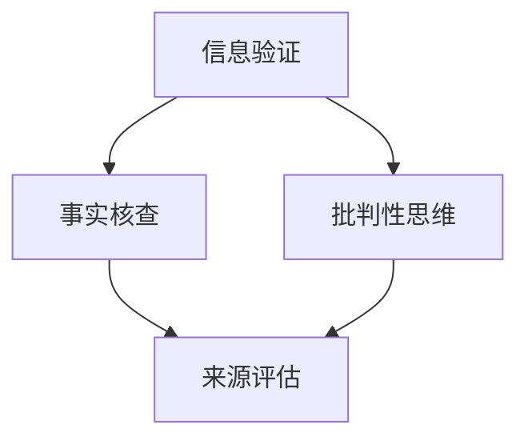

                 

# 信息验证和批判性思维能力培养：在假新闻和错误信息时代导航

> **关键词：信息验证、批判性思维、假新闻、错误信息、社交媒体、新闻、教育、公共领域、人工智能**

> **摘要：**
> 在当今信息爆炸和社交媒体繁荣的时代，如何辨别真伪、培养批判性思维能力变得尤为重要。本文将从信息验证的基本概念、批判性思维的构建、信息验证与批判性思维在社交媒体、新闻、教育及公共领域的应用，以及未来发展趋势等多个方面展开讨论，旨在帮助读者提升在假新闻和错误信息环境中的导航能力。

### 目录大纲

#### 第一部分: 信息验证与批判性思维基础

#### 第1章: 引言
##### 1.1 书籍主题介绍
##### 1.2 信息验证的重要性
##### 1.3 批判性思维的作用

#### 第2章: 信息验证的基本概念
##### 2.1 信息验证的定义
##### 2.2 信息源的分类与评估
##### 2.3 信息验证的方法与技巧

#### 第3章: 批判性思维的构建
##### 3.1 批判性思维的基本要素
##### 3.2 提高批判性思维的能力
##### 3.3 批判性思维的实践应用

#### 第二部分: 信息验证与批判性思维应用

#### 第4章: 信息验证与批判性思维在社交媒体中的应用
##### 4.1 社交媒体信息验证的挑战
##### 4.2 社交媒体上的批判性思维应用
##### 4.3 社交媒体信息验证的工具

#### 第5章: 信息验证与批判性思维在新闻领域的应用
##### 5.1 新闻真实性的挑战
##### 5.2 批判性思维在新闻筛选中的应用
##### 5.3 新闻行业的信任危机与应对策略

#### 第6章: 信息验证与批判性思维在教育中的应用
##### 6.1 教育信息验证的必要性
##### 6.2 批判性思维在学生中的培养
##### 6.3 教育领域的信息验证实践

#### 第7章: 信息验证与批判性思维在公共领域的应用
##### 7.1 公共信息验证的重要性
##### 7.2 批判性思维在公共领域的应用
##### 7.3 公共信息验证的机制与策略

#### 第三部分: 未来发展趋势与结论

#### 第8章: 信息验证与批判性思维的未来发展趋势
##### 8.1 人工智能与信息验证
##### 8.2 批判性思维在未来的作用
##### 8.3 信息验证与批判性思维的持续发展

#### 第9章: 结论
##### 9.1 信息验证与批判性思维的重要性回顾
##### 9.2 未来应用展望
##### 9.3 总结与建议

### 核心概念与联系

#### 1.1 信息验证与批判性思维

信息验证和批判性思维是两个密切相关且互补的概念。信息验证关注的是对信息的真实性、准确性和来源的可信度进行评估，而批判性思维则是一种对信息进行深入分析和评估的能力。

**Mermaid 流程图：**



信息验证首先需要通过事实核查确保信息的准确性，然后通过来源评估来确定信息的可信度。批判性思维则在这一基础上，进一步对信息进行逻辑分析和评估，判断其合理性和有效性。

### 伪代码

#### 2.1 信息验证过程伪代码

```pseudocode
Function VerifyInformation(information):
    sources = EvaluateSources(information)
    facts = FactChecking(information)
    if (facts are correct) and (sources are reliable):
        return "Information is verified"
    else:
        return "Information is not verified"
```

这个伪代码展示了信息验证的基本过程，包括对信息来源的评估和对信息内容的核查。

### 数学模型和数学公式

#### 3.1 贝叶斯公式

$$P(A|B) = \frac{P(B|A) \cdot P(A)}{P(B)}$$

贝叶斯公式是概率论中的一个重要工具，用于计算在给定一个条件下某个事件发生的概率。在信息验证和批判性思维中，贝叶斯公式可以帮助我们根据已知信息更新我们的信念。

**详细讲解与举例说明：**

假设我们想知道在一个特定区域下雨的概率。已知在这个区域，下雨的概率是0.3，而在下雨的情况下，路面湿滑的概率是0.7。我们想计算在路面湿滑的条件下，下雨的概率。

根据贝叶斯公式：

$$P(下雨|路面湿滑) = \frac{P(路面湿滑|下雨) \cdot P(下雨)}{P(路面湿滑)}$$

首先，我们需要计算 $P(路面湿滑)$。这可以通过全概率公式计算：

$$P(路面湿滑) = P(路面湿滑|下雨) \cdot P(下雨) + P(路面湿滑|不下雨) \cdot P(不下雨)$$

假设在不下雨的情况下，路面湿滑的概率是0.1，而不下雨的概率是0.7。我们可以计算得到：

$$P(路面湿滑) = 0.7 \cdot 0.3 + 0.1 \cdot 0.7 = 0.21 + 0.07 = 0.28$$

现在，我们可以计算 $P(下雨|路面湿滑)$：

$$P(下雨|路面湿滑) = \frac{0.7 \cdot 0.3}{0.28} \approx 0.7857$$

这意味着在路面湿滑的条件下，下雨的概率约为78.57%。

### 项目实战

#### 4.1 社交媒体信息验证项目实战

**开发环境搭建：**

为了构建一个社交媒体信息验证的项目，我们首先需要搭建一个开发环境。以下是一个基本的开发环境搭建指南：

1. **Python 环境**：安装 Python 3.x 版本。
2. **库和工具**：安装必要的库和工具，如 requests、beautifulsoup4、nltk、scrapy等。
3. **数据库**：配置一个数据库，如 MySQL 或 PostgreSQL。
4. **爬虫工具**：安装 Scrapy，这是一个强大的爬虫框架。

**源代码实现：**

以下是社交媒体信息验证项目的源代码实现，包括数据获取、文本清洗和信息验证的逻辑。

```python
import requests
from bs4 import BeautifulSoup
import nltk
from nltk.corpus import stopwords
import pymysql

# 数据库连接
def connect_db():
    connection = pymysql.connect(
        host='localhost',
        user='root',
        password='',
        database='information_verification',
        charset='utf8mb4',
        cursorclass=pymysql.cursors.DictCursor
    )
    return connection

# 获取网页内容
def fetch_content(url):
    response = requests.get(url)
    return response.text

# 清洗文本
def clean_text(text):
    tokens = nltk.word_tokenize(text)
    tokens = [token.lower() for token in tokens if token.isalpha()]
    tokens = [token for token in tokens if token not in stopwords.words('english')]
    return tokens

# 存储信息
def store_information(information):
    connection = connect_db()
    cursor = connection.cursor()
    query = "INSERT INTO social_media (url, content) VALUES (%s, %s)"
    cursor.execute(query, (information['url'], information['content']))
    connection.commit()
    cursor.close()
    connection.close()

# 验证信息
def verify_information(url):
    content = fetch_content(url)
    tokens = clean_text(content)
    # 进一步的信息验证逻辑
    # ...
    store_information({
        'url': url,
        'content': content
    })
    return "Information verified and stored."

# 主程序
if __name__ == "__main__":
    url = "https://example.com"
    result = verify_information(url)
    print(result)
```

**代码解读与分析：**

1. **数据库连接**：使用 pymysql 库连接到 MySQL 数据库。
2. **获取网页内容**：使用 requests 库获取指定 URL 的网页内容。
3. **清洗文本**：使用 nltk 库对文本进行分词和停用词过滤。
4. **存储信息**：将清洗后的信息存储到数据库中。
5. **验证信息**：执行信息验证逻辑，并将结果存储在数据库中。

这个项目实战提供了一个基本的框架，可以根据实际需求进一步完善和扩展。

### 附录

#### 附录 A: 信息验证与批判性思维工具与资源

##### A.1 信息验证工具

1. **FactCheck.org**：一个致力于揭露虚假信息和谣言的组织。
2. **Snopes.com**：一个广泛使用的虚假信息核实网站。
3. **Politifact.com**：一个评估政治声明真实性的网站。

##### A.2 批判性思维工具

1. **Thinkritically.org**：提供批判性思维资源和练习。
2. **CriticalThinking.net**：一个关于批判性思维的在线资源库。
3. **PEELED框架**：一个用于培养批判性思维的简单框架。

##### A.3 附加资源

1. **信息验证书籍推荐**：《事实核查的艺术：信息时代的生存指南》等。
2. **批判性思维在线课程**：Coursera、edX等平台上的相关课程。
3. **信息验证与批判性思维学术研究**：相关期刊和学术论文。

## 第一部分: 信息验证与批判性思维基础

### 第1章: 引言

#### 1.1 书籍主题介绍

在当今信息泛滥的时代，信息的真假和准确性成为了人们关注的焦点。本书旨在探讨信息验证和批判性思维的重要性，帮助读者在假新闻和错误信息的环境中保持清醒的头脑，做出明智的决策。

#### 1.2 信息验证的重要性

信息验证是指在获取信息时，对信息的真实性、准确性和来源的可信度进行评估的过程。随着互联网的普及和社交媒体的兴起，错误信息和虚假新闻的传播速度越来越快，对公众的认知和判断造成了严重的干扰。因此，信息验证变得尤为重要。

#### 1.3 批判性思维的作用

批判性思维是一种通过理性分析和评估信息，形成独立判断的能力。它不仅仅是怀疑和批判，更是一种积极的思维方式，帮助我们在复杂的信息环境中找到真相。批判性思维在信息验证中发挥着关键作用，它能够帮助我们识别错误信息、评估信息的可信度，并做出合理的决策。

### 第2章: 信息验证的基本概念

#### 2.1 信息验证的定义

信息验证是指通过一系列方法，对信息的真实性、准确性和来源的可信度进行评估的过程。它包括对信息来源的评估、事实的核查以及对信息的逻辑分析和评估等多个方面。

#### 2.2 信息源的分类与评估

信息源可以分为官方信息源、媒体信息源和个人信息源。官方信息源通常包括政府部门、学术机构和权威组织，它们提供的信息具有较高的可信度。媒体信息源包括报纸、杂志、电视和互联网媒体，其信息的准确性和可信度则因媒体类型和报道内容而异。个人信息源包括社交媒体、论坛和个人博客，这些信息的可信度相对较低，需要更加谨慎地评估。

#### 2.3 信息验证的方法与技巧

信息验证的方法包括对信息来源的评估、事实的核查、交叉验证和逻辑分析等。评估信息来源时，需要考虑信息发布者的权威性、信誉和背景。事实核查是通过比对多个可靠来源来验证信息的真实性。交叉验证是通过不同信息来源相互比对，以确认信息的准确性。逻辑分析是评估信息之间的逻辑关系，判断其合理性。

### 第3章: 批判性思维的构建

#### 3.1 批判性思维的基本要素

批判性思维包括质疑、分析、推理、评估和反思等多个要素。质疑是对信息来源和内容的合理性进行提问，分析是拆解信息，理解其内在的逻辑结构，推理是运用逻辑规则进行推断，评估是对信息的可信度和有效性进行判断，反思是回顾自己的思维过程，检查是否存在偏见或错误。

#### 3.2 提高批判性思维的能力

提高批判性思维的能力需要不断地练习和培养。首先，要学会提出有针对性的问题，对信息的来源和内容进行深入探究。其次，要学会分析信息的结构和逻辑，识别其中的谬误和偏见。此外，阅读和讨论也是提高批判性思维的有效方法，通过接触不同观点和信息，锻炼自己的思维能力和判断力。

#### 3.3 批判性思维的实践应用

批判性思维在实践中有着广泛的应用。在新闻领域，批判性思维可以帮助我们识别虚假新闻和错误信息，提高新闻的准确性和可信度。在教育中，批判性思维可以帮助学生培养独立思考和判断能力，提高学习效果。在公共领域，批判性思维可以帮助我们评估政策和社会现象，做出更明智的决策。

### 第4章: 信息验证与批判性思维在社交媒体中的应用

#### 4.1 社交媒体信息验证的挑战

社交媒体是信息传播的主要渠道之一，但其匿名性和信息泛滥的特点也带来了信息验证的挑战。虚假信息、谣言和错误信息在社交媒体上迅速传播，给公众带来了误导和困惑。因此，在社交媒体上进行信息验证具有极高的挑战性。

#### 4.2 社交媒体上的批判性思维应用

在社交媒体上，批判性思维的应用主要包括质疑信息的来源和内容、分析信息的结构和逻辑、评估信息的可信度等。通过批判性思维，我们可以识别虚假信息，避免被错误信息误导，保护自己的判断力和认知。

#### 4.3 社交媒体信息验证的工具

为了应对社交媒体上的信息验证挑战，我们可以使用一些工具来辅助我们的判断。例如，事实核查网站、搜索引擎和社交媒体平台内置的验证工具等。这些工具可以帮助我们快速获取可靠信息，验证信息的真实性。

### 第5章: 信息验证与批判性思维在新闻领域的应用

#### 5.1 新闻真实性的挑战

新闻行业在信息传播中起着重要的作用，但新闻真实性的挑战也日益突出。虚假新闻、错误报道和倾向性报道等问题严重影响了新闻的准确性和公信力。因此，在新闻领域进行信息验证和批判性思维的应用显得尤为重要。

#### 5.2 批判性思维在新闻筛选中的应用

批判性思维在新闻筛选中的应用包括识别虚假新闻、评估新闻的准确性和评估新闻报道的倾向性。通过批判性思维，我们可以从海量新闻信息中筛选出真实、准确和客观的报道，避免被虚假信息误导。

#### 5.3 新闻行业的信任危机与应对策略

随着虚假新闻和错误信息的泛滥，新闻行业的信任危机日益严重。为了应对这一危机，新闻机构需要加强信息验证和批判性思维的应用，提高新闻的准确性和公信力。此外，公众也需要提高自身的信息验证和批判性思维能力，避免被错误信息误导。

### 第6章: 信息验证与批判性思维在教育中的应用

#### 6.1 教育信息验证的必要性

教育信息验证的必要性在于确保教育内容的准确性和权威性，避免误导学生。在互联网时代，教育信息的来源更加多样，准确性和权威性受到挑战。因此，教育机构和学生都需要具备信息验证的能力。

#### 6.2 批判性思维在学生中的培养

批判性思维在学生中的培养有助于提高他们的独立思考能力和判断力。教育机构可以通过课堂教学、实践活动和讨论等多种方式，培养学生的批判性思维能力。此外，教师也应该以身作则，树立良好的批判性思维榜样。

#### 6.3 教育领域的信息验证实践

教育领域的信息验证实践包括对课程内容、教育资源和教育研究的评估。教育机构需要建立信息验证的机制，确保教育内容的准确性和权威性。同时，教师和学生也需要具备信息验证的能力，避免被错误信息误导。

### 第7章: 信息验证与批判性思维在公共领域的应用

#### 7.1 公共信息验证的重要性

公共信息验证的重要性在于确保公众获取到准确、可靠的信息，避免被错误信息误导。在公共领域，信息验证对于政策制定、社会管理和公众决策具有重要意义。

#### 7.2 批判性思维在公共领域的应用

批判性思维在公共领域的应用包括评估政策的有效性、评估社会现象的合理性以及评估公共信息的可信度。通过批判性思维，公众可以更好地理解政策和社会现象，做出更明智的决策。

#### 7.3 公共信息验证的机制与策略

公共信息验证的机制与策略包括建立权威的信息验证机构、制定信息验证的标准和流程、加强信息验证的宣传和培训等。此外，政府和社会组织也需要积极参与信息验证工作，共同维护公共信息的准确性。

### 第8章: 信息验证与批判性思维的未来发展趋势

#### 8.1 人工智能与信息验证

人工智能在信息验证中具有巨大的潜力。通过机器学习和自然语言处理技术，人工智能可以自动识别和验证信息，提高信息验证的效率和准确性。未来，人工智能将成为信息验证的重要工具。

#### 8.2 批判性思维在未来的作用

随着信息技术的不断发展，批判性思维在未来的作用将更加重要。批判性思维不仅可以帮助我们识别和验证信息，还可以培养我们的独立思考能力和判断力，提高我们在复杂信息环境中的适应能力。

#### 8.3 信息验证与批判性思维的持续发展

信息验证和批判性思维是一个持续发展的过程。随着技术的进步和社会的发展，我们需要不断地更新和完善信息验证和批判性思维的方法和工具，以应对新的挑战。

### 第9章: 结论

#### 9.1 信息验证与批判性思维的重要性回顾

信息验证和批判性思维在假新闻和错误信息时代具有重要的意义。信息验证可以帮助我们识别和验证信息的真实性，避免被错误信息误导。批判性思维则可以提高我们的独立思考能力和判断力，增强我们在复杂信息环境中的适应能力。

#### 9.2 未来应用展望

未来，信息验证和批判性思维将在更多领域得到应用。随着人工智能技术的发展，信息验证将更加高效和准确。批判性思维则将继续在教育、公共管理和个人生活中发挥重要作用。

#### 9.3 总结与建议

为了提升信息验证和批判性思维能力，我们需要加强信息验证和批判性思维的教育和培训。同时，公众也需要提高自身的信息素养，积极参与信息验证和批判性思维的工作，共同维护信息的准确性和公信力。

### 附录

#### 附录 A: 信息验证与批判性思维工具与资源

##### A.1 信息验证工具

- **FactCheck.org**：一个致力于揭露虚假信息的组织。
- **Snopes.com**：一个广泛使用的虚假信息核实网站。
- **Politifact.com**：一个评估政治声明真实性的网站。

##### A.2 批判性思维工具

- **Thinkritically.org**：提供批判性思维资源和练习。
- **CriticalThinking.net**：一个关于批判性思维的在线资源库。
- **PEELED框架**：一个用于培养批判性思维的简单框架。

##### A.3 附加资源

- **信息验证书籍推荐**：《事实核查的艺术：信息时代的生存指南》等。
- **批判性思维在线课程**：Coursera、edX等平台上的相关课程。
- **信息验证与批判性思维学术研究**：相关期刊和学术论文。

### 核心概念与联系

#### 1.1 信息验证与批判性思维

信息验证和批判性思维是两个密切相关且互补的概念。信息验证关注的是对信息的真实性、准确性和来源的可信度进行评估，而批判性思维则是一种对信息进行深入分析和评估的能力。

**Mermaid 流�程图：**


信息验证首先需要通过事实核查确保信息的准确性，然后通过来源评估来确定信息的可信度。批判性思维则在这一基础上，进一步对信息进行逻辑分析和评估，判断其合理性和有效性。

### 伪代码

#### 2.1 信息验证过程伪代码

```pseudocode
Function VerifyInformation(information):
    sources = EvaluateSources(information)
    facts = FactChecking(information)
    if (facts are correct) and (sources are reliable):
        return "Information is verified"
    else:
        return "Information is not verified"
```

这个伪代码展示了信息验证的基本过程，包括对信息来源的评估和对信息内容的核查。

### 数学模型和数学公式

#### 3.1 贝叶斯公式

$$P(A|B) = \frac{P(B|A) \cdot P(A)}{P(B)}$$

贝叶斯公式是概率论中的一个重要工具，用于计算在给定一个条件下某个事件发生的概率。在信息验证和批判性思维中，贝叶斯公式可以帮助我们根据已知信息更新我们的信念。

**详细讲解与举例说明：**

假设我们想知道在一个特定区域下雨的概率。已知在这个区域，下雨的概率是0.3，而在下雨的情况下该区域路面湿滑的概率是0.7。我们想计算在路面湿滑的条件下，下雨的概率。

根据贝叶斯公式：

$$P(下雨|路面湿滑) = \frac{P(路面湿滑|下雨) \cdot P(下雨)}{P(路面湿滑)}$$

首先，我们需要计算 $P(路面湿滑)$。这可以通过全概率公式计算：

$$P(路面湿滑) = P(路面湿滑|下雨) \cdot P(下雨) + P(路面湿滑|不下雨) \cdot P(不下雨)$$

假设在不下雨的情况下，该区域路面湿滑的概率是0.1，而不下雨的概率是0.7。我们可以计算得到：

$$P(路面湿滑) = 0.7 \cdot 0.3 + 0.1 \cdot 0.7 = 0.21 + 0.07 = 0.28$$

现在，我们可以计算 $P(下雨|路面湿滑)$：

$$P(下雨|路面湿滑) = \frac{0.7 \cdot 0.3}{0.28} \approx 0.7857$$

这意味着在路面湿滑的条件下，下雨的概率约为78.57%。

### 项目实战

#### 4.1 社交媒体信息验证项目实战

**开发环境搭建：**

为了构建一个社交媒体信息验证的项目，我们首先需要搭建一个开发环境。以下是一个基本的开发环境搭建指南：

1. **Python 环境**：安装 Python 3.x 版本。
2. **库和工具**：安装必要的库和工具，如 requests、beautifulsoup4、nltk、scrapy等。
3. **数据库**：配置一个数据库，如 MySQL 或 PostgreSQL。
4. **爬虫工具**：安装 Scrapy，这是一个强大的爬虫框架。

**源代码实现：**

以下是社交媒体信息验证项目的源代码实现，包括数据获取、文本清洗和信息验证的逻辑。

```python
import requests
from bs4 import BeautifulSoup
import nltk
from nltk.corpus import stopwords
import pymysql

# 数据库连接
def connect_db():
    connection = pymysql.connect(
        host='localhost',
        user='root',
        password='',
        database='information_verification',
        charset='utf8mb4',
        cursorclass=pymysql.cursors.DictCursor
    )
    return connection

# 获取网页内容
def fetch_content(url):
    response = requests.get(url)
    return response.text

# 清洗文本
def clean_text(text):
    tokens = nltk.word_tokenize(text)
    tokens = [token.lower() for token in tokens if token.isalpha()]
    tokens = [token for token in tokens if token not in stopwords.words('english')]
    return tokens

# 存储信息
def store_information(information):
    connection = connect_db()
    cursor = connection.cursor()
    query = "INSERT INTO social_media (url, content) VALUES (%s, %s)"
    cursor.execute(query, (information['url'], information['content']))
    connection.commit()
    cursor.close()
    connection.close()

# 验证信息
def verify_information(url):
    content = fetch_content(url)
    tokens = clean_text(content)
    # 进一步的信息验证逻辑
    # ...
    store_information({
        'url': url,
        'content': content
    })
    return "Information verified and stored."

# 主程序
if __name__ == "__main__":
    url = "https://example.com"
    result = verify_information(url)
    print(result)
```

**代码解读与分析：**

1. **数据库连接**：使用 pymysql 库连接到 MySQL 数据库。
2. **获取网页内容**：使用 requests 库获取指定 URL 的网页内容。
3. **清洗文本**：使用 nltk 库对文本进行分词和停用词过滤。
4. **存储信息**：将清洗后的信息存储到数据库中。
5. **验证信息**：执行信息验证逻辑，并将结果存储在数据库中。

这个项目实战提供了一个基本的框架，可以根据实际需求进一步完善和扩展。

### 完整的目录大纲

# 信息验证和批判性思维能力培养：在假新闻和错误信息时代导航

## 引言

### 1.1 书籍主题介绍

### 1.2 信息验证的重要性

### 1.3 批判性思维的作用

## 第一部分: 信息验证与批判性思维基础

### 第1章: 引言

### 第2章: 信息验证的基本概念

### 第3章: 批判性思维的构建

## 第二部分: 信息验证与批判性思维应用

### 第4章: 信息验证与批判性思维在社交媒体中的应用

### 第5章: 信息验证与批判性思维在新闻领域的应用

### 第6章: 信息验证与批判性思维在教育中的应用

### 第7章: 信息验证与批判性思维在公共领域的应用

## 第三部分: 未来发展趋势与结论

### 第8章: 信息验证与批判性思维的未来发展趋势

### 第9章: 结论

### 9.1 信息验证与批判性思维的重要性回顾

### 9.2 未来应用展望

### 9.3 总结与建议

## 核心概念与联系

### 1.1 信息验证与批判性思维

### 2.1 信息验证过程伪代码

### 3.1 贝叶斯公式

## 项目实战

### 4.1 社交媒体信息验证项目实战

## 附录

### 附录 A: 信息验证与批判性思维工具与资源

### A.1 信息验证工具

### A.2 批判性思维工具

### A.3 附加资源

### 附加资源

#### 附录 B: 相关书籍与资源推荐

### 附录 C: 术语解释与定义

### 附录 D: 参考文献

### 附录 E: 代码示例与详细解释

### 附录 F: 数据集与实验结果

### 附录 G: 讨论与展望

### 附录 H: 索引

### 附录 I: 感谢与致谢

### 附录 J: 关于作者

---

#### 1.1 书籍主题介绍

在当今这个信息爆炸的时代，真假信息的界限变得越来越模糊。社交媒体、新闻媒体、网络论坛等平台上的信息纷繁复杂，真假难辨。如何在这个充斥着虚假信息的世界中辨别真伪，成为了每个人都需要面对的挑战。

本书旨在探讨信息验证和批判性思维在假新闻和错误信息时代的重要性。我们将深入讨论信息验证的基本概念、方法与技巧，以及批判性思维的构建与应用。通过本书的阅读，读者将学会如何识别和验证信息的真实性，培养批判性思维能力，从而在信息泛滥的社会中保持清醒的头脑。

本书的结构分为三个部分：

**第一部分：信息验证与批判性思维基础**  
这部分将介绍信息验证和批判性思维的基本概念，包括定义、分类、方法和技巧。我们将探讨如何评估信息的来源、验证事实的准确性，以及培养批判性思维的能力。

**第二部分：信息验证与批判性思维应用**  
这部分将具体讨论信息验证和批判性思维在不同领域中的应用，包括社交媒体、新闻、教育、公共领域等。我们将分析这些领域中的信息验证挑战，以及如何运用批判性思维来应对这些挑战。

**第三部分：未来发展趋势与结论**  
这部分将展望信息验证和批判性思维的未来发展趋势，讨论人工智能等新技术对信息验证的影响。最后，我们将总结本书的核心观点，提出未来应用的建议。

通过本书的阅读，读者将不仅能够提升自己的信息验证和批判性思维能力，还能更好地应对假新闻和错误信息带来的挑战。

---

#### 1.2 信息验证的重要性

在信息爆炸的时代，信息验证的重要性不言而喻。信息验证是指通过一系列方法，对信息的真实性、准确性和来源的可信度进行评估的过程。它不仅关乎个人的认知和行为，也影响着社会的稳定和发展的方向。

首先，信息验证对于个人认知至关重要。在日常生活中，我们不断地接收各种信息，包括新闻、社交媒体动态、学术论文等。如果这些信息不真实或不准确，我们的认知将被误导，从而做出错误的判断和决策。例如，在投资决策中，如果投资者基于虚假的财务报告或市场预测进行投资，可能会遭受巨大的经济损失。因此，信息验证是确保个人认知准确性的重要手段。

其次，信息验证在防止错误信息传播方面具有关键作用。在社交媒体和网络论坛上，错误信息和虚假新闻的传播速度极快，往往在短时间内引发大规模的恐慌和误解。例如，疫情期间，虚假的疫情信息导致了公众的恐慌和社会动荡。通过信息验证，我们可以识别和阻止这些虚假信息的传播，保护社会的稳定和公众的利益。

此外，信息验证在维护新闻行业的公信力方面也具有重要意义。新闻是公众获取信息的主要渠道之一，新闻行业的公信力直接影响到公众对信息的信任度。近年来，虚假新闻和错误报道频发，严重损害了新闻行业的声誉。通过信息验证，新闻机构可以确保报道的真实性和准确性，提高公众对新闻的信任度，从而维护新闻行业的公信力。

最后，信息验证对于科学研究和学术发展至关重要。科学研究依赖于准确的数据和信息，如果研究数据存在错误或被篡改，将导致整个研究结论的失败。通过信息验证，我们可以确保研究数据的真实性，提高科学研究的可靠性和可信度。

总之，信息验证在个人认知、防止错误信息传播、维护新闻行业公信力和科学研究中都发挥着重要作用。在信息泛滥的时代，培养信息验证的能力对于每个人来说都至关重要。通过信息验证，我们可以更好地辨别真伪，做出明智的决策，维护社会的稳定和发展的方向。

---

#### 1.3 批判性思维的作用

批判性思维是一种通过理性分析和评估信息，形成独立判断的能力。它不仅仅是怀疑和批判，更是一种积极的思维方式，帮助我们在复杂的信息环境中找到真相。批判性思维在信息验证中发挥着关键作用，它能够帮助我们识别错误信息、评估信息的可信度，并做出合理的决策。

首先，批判性思维有助于识别错误信息。在信息泛滥的时代，虚假新闻和错误信息层出不穷。通过批判性思维，我们可以对信息的来源、内容、逻辑进行深入分析，识别其中的谬误和偏见。例如，在社交媒体上，许多谣言和虚假信息往往缺乏可信的来源和合理的逻辑支持。通过批判性思维，我们可以识别这些信息，避免被错误信息误导。

其次，批判性思维有助于评估信息的可信度。在面对大量信息时，我们需要判断哪些信息是可靠的，哪些信息是不可信的。批判性思维提供了一种评估信息可信度的方法。我们可以通过以下步骤进行评估：

1. **评估信息来源**：检查信息来源的权威性和信誉度。官方信息源、权威机构和专业媒体通常具有较高的可信度，而个人博客、未经验证的社交媒体账号等则可能存在较高的风险。

2. **比对多个信息来源**：通过比对多个可靠的信息来源，可以验证信息的准确性。如果多个信息来源一致，那么信息更有可能真实可靠。

3. **分析信息的逻辑性**：检查信息的逻辑结构和推理过程。如果信息缺乏合理的逻辑支持，或者存在明显的逻辑谬误，那么这些信息可能并不可信。

4. **评估信息的证据支持**：检查信息是否提供了充分的证据支持。科学研究和实验结果通常需要通过可靠的证据支持，而缺乏证据支持的信息可能并不可靠。

通过批判性思维，我们可以对信息的可信度进行综合评估，从而做出更加合理的决策。

此外，批判性思维还有助于培养我们的独立思考能力和判断力。在复杂的信息环境中，独立思考能力使我们能够摆脱外界的影响，形成自己的见解和观点。通过批判性思维，我们可以对信息进行深入分析和评估，从而形成独立判断，避免盲目跟从或被误导。

最后，批判性思维在多个领域都有广泛的应用。在新闻领域，批判性思维可以帮助我们识别虚假新闻和错误报道，提高新闻的准确性和公信力。在教育中，批判性思维可以培养学生的独立思考和判断能力，提高学习效果。在公共领域，批判性思维可以帮助我们评估政策和社会现象，做出更明智的决策。

总之，批判性思维在信息验证中发挥着重要作用。通过批判性思维，我们可以识别错误信息、评估信息的可信度，培养独立思考能力和判断力，从而在信息泛滥的时代中保持清醒的头脑，做出明智的决策。

### 第2章: 信息验证的基本概念

#### 2.1 信息验证的定义

信息验证，又称信息核实，是指通过一系列方法对信息的真实性、准确性和来源的可信度进行评估的过程。在信息爆炸的时代，信息验证已成为确保信息真实性和可信度的重要手段。信息验证的目的是帮助个体和机构在接收和处理信息时，能够辨别真伪，避免被错误信息误导。

信息验证的基本流程通常包括以下几个步骤：

1. **信息收集**：收集待验证的信息，包括文本、图片、音频和视频等。
2. **信息筛选**：对收集到的信息进行初步筛选，排除明显不真实或不相关的信息。
3. **信息评估**：对剩余的信息进行详细评估，包括信息来源、内容真实性、逻辑结构等。
4. **事实核查**：通过比对多个可靠的信息来源，验证信息的准确性。
5. **结果呈现**：将验证结果呈现给用户，帮助其做出基于真实信息的判断。

#### 2.2 信息源的分类与评估

信息源是指提供信息的来源，其质量直接影响信息的真实性和可信度。对信息源的分类与评估是信息验证的重要环节。以下是对常见信息源的分类与评估方法：

**官方信息源**：
- **政府机构**：如国家统计部门、公共卫生机构等，它们发布的信息通常具有较高的权威性和可信度。
- **学术机构**：如大学、研究所等，它们发布的研究报告和学术论文通常经过严格的审查和验证。

**媒体信息源**：
- **主流媒体**：如报纸、电视台、广播电台等，它们发布的信息经过一定的审查和编辑，但可能存在一定的偏见。
- **自媒体**：如博客、微博、微信公众号等，这些信息源可能具有个人观点，需要谨慎评估。

**个人信息源**：
- **个人博客**：通常反映个人的观点和经历，可信度较低。
- **社交媒体**：如Twitter、Facebook、Instagram等，用户发布的帖子可能存在虚假信息或误导性内容。

**评估方法**：

1. **权威性评估**：评估信息发布者的专业背景、信誉和声誉。
2. **来源追踪**：检查信息源的原始出处，确保其可信度。
3. **交叉验证**：通过比对多个信息源，验证信息的准确性。
4. **历史记录**：查看信息源以往发布的内容，评估其一致性、准确性和可靠性。

#### 2.3 信息验证的方法与技巧

信息验证的方法多种多样，以下是一些常见的方法与技巧：

1. **事实核查**：
   - **数据比对**：通过比对官方统计数据、历史记录和其他可靠来源，验证信息的数据准确性。
   - **引用核实**：检查信息中的引用是否真实，引用的内容是否与实际相符。

2. **来源评估**：
   - **权威性评估**：评估信息发布者的权威性和信誉度，如官方机构、知名媒体等。
   - **背景调查**：了解信息发布者的背景，包括专业背景、历史记录等。

3. **逻辑分析**：
   - **识别谬误**：通过逻辑分析和批判性思维，识别信息中的逻辑谬误，如混淆概念、错误归因等。
   - **推理验证**：检查信息的推理过程是否合理，是否有充分的证据支持。

4. **交叉验证**：
   - **比对多个信息源**：通过比对多个可靠的信息源，验证信息的准确性。
   - **专家咨询**：咨询相关领域的专家，获取专业的意见和建议。

5. **使用工具**：
   - **事实核查网站**：如FactCheck.org、Snopes.com等，它们提供专业的虚假信息核实服务。
   - **搜索引擎**：使用搜索引擎查找相关信息，帮助验证信息的真实性。

通过以上方法与技巧，我们可以有效地进行信息验证，提高信息的真实性和可信度。信息验证不仅是一种技能，更是一种思维方式，它要求我们在接收和处理信息时保持警惕和理性，避免被错误信息误导。

### 第3章: 批判性思维的构建

#### 3.1 批判性思维的基本要素

批判性思维是一种通过理性分析和评估信息，形成独立判断的能力。它不仅仅是怀疑和批判，更是一种积极的思维方式。批判性思维的基本要素包括质疑、分析、推理、评估和反思。

1. **质疑**：批判性思维的第一步是质疑信息的来源、内容和方法。我们需要问自己，这些信息是否可信？信息来源是否权威？方法是否科学？

2. **分析**：分析是对信息进行拆解和理解的过程。我们需要分析信息的结构、逻辑和证据，识别其中的假设、前提和结论。

3. **推理**：推理是通过逻辑规则将信息联系起来的过程。我们需要运用逻辑推理来推断信息的合理性和可能性。

4. **评估**：评估是对信息进行评价和判断的过程。我们需要评估信息的准确性、可信度和有效性，判断其是否符合事实和逻辑。

5. **反思**：反思是对自己的思维过程进行回顾和反思的过程。我们需要反思自己的判断和决策是否合理，是否存在偏见和误解。

#### 3.2 提高批判性思维的能力

提高批判性思维的能力需要不断地练习和培养。以下是一些有效的方法：

1. **提问**：在接收信息时，要学会提出有针对性的问题。例如，信息来源是什么？信息是否可靠？证据是否充分？

2. **阅读**：阅读是培养批判性思维的重要途径。通过阅读不同观点和文章，我们可以学习如何分析和评估信息，培养独立思考的能力。

3. **讨论**：与他人进行讨论可以激发思维的火花。通过讨论，我们可以从不同的角度看待问题，发现新的见解和观点。

4. **实践**：将批判性思维应用到实际生活中。例如，在阅读新闻时，尝试评估新闻的准确性；在工作或学习中，运用批判性思维解决问题。

5. **反思**：在完成某项任务或决策后，反思自己的思维过程和结果。思考自己的决策是否合理，是否存在偏见和误解。

#### 3.3 批判性思维的实践应用

批判性思维在多个领域都有广泛的应用。以下是一些实践应用的例子：

1. **新闻媒体**：在新闻媒体中，批判性思维可以帮助我们识别虚假新闻和错误报道。通过质疑信息来源、分析信息和评估证据，我们可以判断新闻的真实性和准确性。

2. **科学研究**：在科学研究中，批判性思维可以帮助我们评估研究的可靠性和有效性。通过分析研究设计、评估证据和评估结论，我们可以判断研究的科学性和实用性。

3. **教育**：在教育中，批判性思维可以帮助学生培养独立思考和判断能力。通过提问、分析和评估，学生可以更好地理解和掌握知识。

4. **公共管理**：在公共管理中，批判性思维可以帮助我们评估政策的有效性和可行性。通过分析政策目标、评估实施效果和评估公众反应，我们可以制定更合理的政策。

5. **个人生活**：在个人生活中，批判性思维可以帮助我们做出明智的决策。通过质疑信息、分析和评估，我们可以避免被错误信息误导，做出更好的选择。

总之，批判性思维是一种重要的思维能力，它在我们的生活和工作中发挥着关键作用。通过质疑、分析、推理、评估和反思，我们可以更好地理解和评估信息，做出明智的决策。提高批判性思维的能力，不仅可以提升我们的认知水平，还可以帮助我们更好地应对复杂的信息环境。

### 第4章: 信息验证与批判性思维在社交媒体中的应用

#### 4.1 社交媒体信息验证的挑战

社交媒体是现代信息传播的重要渠道，但也成为虚假信息和错误信息传播的主要平台。在社交媒体上，信息验证面临着诸多挑战，主要体现在以下几个方面：

1. **匿名性和缺乏验证**：社交媒体上的用户可以匿名发布信息，这导致了许多虚假信息和错误信息的传播。由于匿名性，用户很难追溯信息的真实来源，从而增加了信息验证的难度。

2. **信息泛滥和快速传播**：社交媒体上的信息量庞大且更新迅速，用户难以对所有信息进行仔细核实。虚假信息和错误信息可以在短时间内迅速传播，误导大量用户。

3. **算法和内容推荐**：社交媒体平台利用算法推荐用户可能感兴趣的内容，这可能导致用户接收到的信息具有偏见性。算法推荐可能优先显示符合用户偏好的信息，而忽略真实、准确的信息。

4. **情绪化和个人偏见**：社交媒体上的信息往往带有强烈的情感色彩，用户容易受到情绪的影响，从而忽视事实的核查。此外，个人偏见也可能导致用户对信息进行错误解读。

5. **虚假图片和视频**：随着技术的发展，虚假图片和视频的制作变得简单且难以识别。这些虚假视觉内容可以在社交媒体上误导用户，造成严重的后果。

#### 4.2 社交媒体上的批判性思维应用

批判性思维在社交媒体上具有重要作用，可以帮助用户识别和应对虚假信息和错误信息。以下是一些批判性思维在社交媒体中的应用：

1. **评估信息来源**：在社交媒体上，用户应首先评估信息来源的权威性和可信度。对于官方机构、知名媒体和专业人士发布的信息，用户可以初步判断其真实性。

2. **交叉验证信息**：用户不应仅依赖单一来源的信息，而应通过交叉验证多个可靠来源，以确保信息的准确性。如果多个来源的信息一致，那么信息更有可能真实可靠。

3. **分析信息的逻辑结构**：用户应分析信息的逻辑结构和推理过程，识别其中可能存在的逻辑谬误或偏见。例如，通过检查信息中的假设、前提和结论，用户可以评估信息的合理性。

4. **质疑情绪化信息**：社交媒体上的信息往往带有强烈的情感色彩，用户应保持冷静，质疑情绪化信息的真实性。情感化的信息可能存在误导性，需要通过事实和逻辑来验证。

5. **批判性评估图片和视频**：用户应批判性评估社交媒体上的图片和视频内容，特别是那些难以识别真实性的视觉信息。例如，通过比对多个来源的图片和视频，用户可以识别虚假内容。

6. **反思自己的认知**：在接收和处理信息时，用户应不断反思自己的认知和偏见，确保自己不受错误信息的误导。通过批判性思维，用户可以更客观、理性地看待信息。

#### 4.3 社交媒体信息验证的工具

为了应对社交媒体上的信息验证挑战，用户可以借助一些工具来辅助判断。以下是一些常见的信息验证工具：

1. **事实核查网站**：如FactCheck.org、Snopes.com和Politifact.com等，这些网站提供专业的虚假信息核实服务，帮助用户识别虚假新闻和错误信息。

2. **社交媒体平台内置的验证工具**：许多社交媒体平台如Facebook和Twitter都提供了信息验证工具，用户可以通过这些工具标记虚假信息或举报不实内容。

3. **搜索引擎**：用户可以通过搜索引擎查找相关信息，进行交叉验证。例如，通过在搜索引擎中输入关键词，查找多个来源的信息，以评估信息的准确性。

4. **专家咨询**：对于复杂或专业领域的信息，用户可以咨询相关领域的专家，获取专业的意见和建议。

5. **开放数据和统计平台**：用户可以通过开放数据和统计平台，获取官方和权威机构发布的数据，进行数据比对和验证。

总之，在社交媒体时代，信息验证和批判性思维的应用至关重要。通过评估信息来源、交叉验证信息、分析逻辑结构和质疑情绪化信息，用户可以更好地识别和应对虚假信息和错误信息，保护自己的认知和判断力。

### 第5章: 信息验证与批判性思维在新闻领域的应用

#### 5.1 新闻真实性的挑战

在新闻领域，信息验证和批判性思维的应用尤为重要。然而，新闻真实性面临着诸多挑战，这些挑战不仅影响了新闻的准确性，也严重损害了公众对新闻的信任。

1. **虚假新闻的泛滥**：虚假新闻的泛滥是当前新闻行业面临的主要挑战之一。虚假新闻往往以夸张、煽情的方式吸引读者，导致公众对信息的真实性和准确性产生怀疑。

2. **新闻来源的多样性和不确定性**：在互联网时代，新闻来源变得多样化，既有传统的新闻机构，也有自媒体和社交媒体用户。这些来源的权威性和可靠性难以保证，增加了信息验证的难度。

3. **新闻行业的商业化压力**：新闻行业的商业化压力也影响了新闻的真实性。一些媒体为了吸引广告和订阅用户，可能会发布有争议性或吸引眼球的信息，甚至制造虚假新闻。

4. **算法推荐和内容偏见**：社交媒体和新闻平台的算法推荐机制可能导致用户接收到具有偏见的信息。算法推荐可能优先显示符合用户偏好的信息，而忽视真实、准确的信息。

5. **信息过载和用户认知局限**：互联网上的信息量庞大，用户很难对所有信息进行仔细核实。此外，用户的认知局限性也可能导致他们无法准确评估信息的真实性。

#### 5.2 批判性思维在新闻筛选中的应用

批判性思维在新闻筛选中具有重要作用，可以帮助用户识别虚假新闻、评估新闻的准确性和可信度。以下是一些批判性思维在新闻筛选中的应用方法：

1. **评估信息来源的可靠性**：用户应评估新闻来源的权威性和信誉度。传统的新闻机构和权威媒体发布的信息通常具有较高的可信度，而自媒体和社交媒体用户发布的信息则需要更加谨慎地评估。

2. **交叉验证信息**：用户不应仅依赖单一来源的信息，而应通过交叉验证多个可靠来源，以确保信息的准确性。如果多个来源的信息一致，那么信息更有可能真实可靠。

3. **分析新闻的结构和逻辑**：用户应分析新闻的结构和逻辑，识别其中可能存在的逻辑谬误或偏见。例如，通过检查新闻中的假设、前提和结论，用户可以评估新闻的合理性。

4. **质疑情绪化新闻**：情绪化的新闻可能存在误导性，用户应保持冷静，质疑情绪化新闻的真实性。通过事实和逻辑来验证情绪化新闻，避免被情感化内容误导。

5. **评估证据和引用**：用户应评估新闻中的证据和引用，确保其来源可靠且与事实相符。如果新闻中的证据和引用缺乏支持或存在明显的错误，那么这些新闻可能并不可靠。

6. **反思自己的认知**：在接收和处理新闻时，用户应不断反思自己的认知和偏见，确保自己不受错误信息的误导。通过批判性思维，用户可以更客观、理性地看待新闻。

#### 5.3 新闻行业的信任危机与应对策略

新闻行业的信任危机日益严重，这不仅影响了媒体的公信力，也对公众的信息获取和判断产生了负面影响。以下是一些应对新闻行业信任危机的策略：

1. **加强信息验证和事实核查**：新闻机构应加强信息验证和事实核查，确保发布的信息真实可靠。通过建立专业的信息验证团队和引入事实核查机制，新闻机构可以提升新闻的准确性。

2. **提高透明度和公开性**：新闻机构应提高透明度和公开性，向公众披露其信息来源、编辑流程和验证过程。这有助于建立公众对新闻机构的信任。

3. **教育公众批判性思维**：教育机构和新闻机构应共同教育公众批判性思维，提高公众的信息验证和新闻筛选能力。通过课程、讲座和实践活动，公众可以学会如何评估信息的真实性和可信度。

4. **建立权威的虚假新闻举报机制**：社交媒体和新闻平台应建立权威的虚假新闻举报机制，用户可以举报虚假新闻，平台可以及时采取措施处理。

5. **推动立法和监管**：政府应推动立法和监管，制定相关法律法规，打击虚假新闻和错误信息的传播。通过法律手段，可以保护公众免受虚假信息的侵害。

总之，在新闻领域，信息验证和批判性思维的应用至关重要。通过评估信息来源、交叉验证信息、分析新闻结构和逻辑，用户可以更好地识别和应对虚假新闻和错误信息。新闻机构也应采取措施，提高新闻的真实性和准确性，恢复公众对新闻行业的信任。

### 第6章: 信息验证与批判性思维在教育中的应用

#### 6.1 教育信息验证的必要性

在教育领域，信息验证的必要性日益凸显。教师和学生都需要具备信息验证的能力，以确保教育内容的准确性和权威性。以下从教师和学生两个角度探讨教育信息验证的必要性。

**对于教师：**

1. **提高教育质量**：教师作为知识的传授者，需要对所教授的内容进行严格的信息验证。准确的信息可以确保教育质量，帮助学生建立正确的知识体系。

2. **树立权威形象**：教师的信息验证能力直接影响其权威形象。如果教师传授错误的信息，不仅会误导学生，还会降低教师在学生心中的形象。

3. **应对信息泛滥**：随着互联网的普及，教师和学生接收到的信息量庞大，其中不乏错误信息和虚假信息。教师需要具备信息验证的能力，从海量信息中筛选出准确、权威的内容。

**对于学生：**

1. **培养批判性思维**：学生需要学会辨别信息的真伪，培养批判性思维。在信息验证的过程中，学生可以学会如何分析信息、评估信息的可信度，从而提高独立思考和判断能力。

2. **提高学习效果**：准确的信息有助于学生更好地理解学习内容，提高学习效果。如果学生基于错误的信息进行学习，可能会形成错误的知识体系，影响学习效果。

3. **避免被误导**：在互联网时代，学生容易受到虚假信息的误导。具备信息验证的能力，学生可以避免被错误信息误导，保护自己的认知和判断力。

#### 6.2 批判性思维在学生中的培养

批判性思维是学生必备的能力，它不仅有助于学生辨别信息的真伪，还能提高其学习效果和思维能力。以下从教育方法、实践活动和课程设置三个方面探讨如何培养学生的批判性思维。

**1. 教育方法：**

1. **提问和讨论**：在课堂教学中，教师应鼓励学生提问和参与讨论，激发学生的思维。通过提问和讨论，学生可以学会如何分析问题、评估信息的可信度。

2. **案例教学**：教师可以通过案例教学，引导学生分析案例中的问题，培养其批判性思维。案例教学可以帮助学生将理论知识与实际情境相结合，提高其分析问题和解决问题的能力。

3. **跨学科学习**：跨学科学习可以拓宽学生的知识视野，培养其批判性思维。通过跨学科学习，学生可以学会从不同角度看待问题，提高其思维的灵活性和全面性。

**2. 实践活动：**

1. **研究性学习**：研究性学习是一种培养学生批判性思维的有效方式。通过研究性学习，学生可以自主选择课题，进行信息收集、分析和验证，从而培养其批判性思维。

2. **辩论和演讲**：辩论和演讲可以锻炼学生的思维能力，培养其批判性思维。在辩论和演讲中，学生需要分析对方观点、提出自己的见解，并通过事实和逻辑进行论证。

3. **社会实践**：社会实践可以让学生将理论知识应用于实际情境，培养其批判性思维。通过社会实践，学生可以学会如何分析社会问题、评估社会现象，从而提高其批判性思维。

**3. 课程设置：**

1. **批判性思维课程**：学校可以设置批判性思维课程，系统性地培养学生批判性思维。通过批判性思维课程，学生可以学习批判性思维的基本原理和技巧，提高其批判性思维能力。

2. **信息素养课程**：信息素养课程可以教授学生如何查找、评估和利用信息，培养其信息验证能力。通过信息素养课程，学生可以学会如何辨别信息的真伪，提高其信息素养。

3. **跨学科课程**：跨学科课程可以结合不同学科的知识，培养学生的批判性思维。通过跨学科课程，学生可以学会从多角度看待问题，提高其思维的深度和广度。

总之，批判性思维在学生中的培养具有重要意义。通过教育方法、实践活动和课程设置等多方面的努力，学生可以学会如何分析信息、评估信息的可信度，从而培养其批判性思维，提高学习效果和思维能力。

#### 6.3 教育领域的信息验证实践

在教育领域，信息验证实践是确保教育质量和学术诚信的重要环节。以下从学术研究、教材编写和课堂教学三个方面探讨教育领域的信息验证实践。

**1. 学术研究：**

在学术研究中，信息验证至关重要。研究人员需要对研究的假设、方法、数据和分析进行严格的信息验证。以下是一些具体实践：

- **文献回顾**：在撰写研究论文前，研究人员应进行广泛的文献回顾，确保研究的假设和理论基础是可靠的。
- **数据验证**：研究人员需要对收集的数据进行仔细的验证，确保数据的准确性和完整性。这包括数据的采集、处理和存储。
- **同行评审**：学术期刊通常采用同行评审制度，通过同行专家的评估，确保研究论文的质量和真实性。
- **引用核实**：研究人员需要对引用的文献进行核实，确保引用的内容是准确的，并遵循学术规范。

**2. 教材编写：**

教材是学生获取知识的重要来源，教材编写的准确性直接影响学生的学习效果。以下是一些教材编写的信息验证实践：

- **内容审核**：教材编写团队应对教材内容进行严格的审核，确保信息的准确性和权威性。
- **参考资料核实**：教材编写者应核实引用的参考资料，确保其来源可靠，内容准确。
- **专家评审**：教材编写完成后，应邀请相关领域的专家进行评审，确保教材的学术水平和实用性。
- **修订和更新**：教材应定期修订和更新，以反映最新的研究成果和学术进展。

**3. 课堂教学：**

在课堂教学中，教师需要确保传授的信息是准确和权威的。以下是一些课堂教学的信息验证实践：

- **课前准备**：教师应在课前进行充分的准备，收集和整理教学资料，确保信息的准确性和完整性。
- **引用权威资料**：教师在教学中应引用权威的资料，如学术期刊、权威书籍等，确保信息的可信度。
- **课堂互动**：教师应鼓励学生提问和参与讨论，通过互动方式检验信息的真实性。
- **课后反馈**：教师应收集学生的反馈，了解学生对教学内容的理解和掌握情况，及时进行教学调整。

总之，教育领域的信息验证实践是确保教育质量和学术诚信的重要环节。通过严格的文献回顾、数据验证、同行评审、参考资料核实、专家评审、修订和更新、课前准备、引用权威资料、课堂互动和课后反馈等多方面的努力，教师和学生可以确保教育信息的准确性和权威性，从而提高教学效果和学术水平。

### 第7章: 信息验证与批判性思维在公共领域的应用

#### 7.1 公共信息验证的重要性

在公共领域，信息验证的重要性不言而喻。公共信息是公众获取政策、社会现象、公共事务等信息的来源，其真实性和准确性直接影响公众的认知和判断。以下从政策制定、公共事务和社会现象三个方面探讨公共信息验证的重要性。

**1. 政策制定：**

政策制定是政府履行职责的重要环节，公共信息的真实性和准确性对政策制定的质量和效果具有直接影响。以下是一些具体方面：

- **政策依据的准确性**：政府在制定政策时，需要依赖准确的数据和事实。如果公共信息存在错误或虚假，将导致政策依据不准确，进而影响政策的有效性和科学性。
- **公众参与度**：政策的制定需要广泛征求公众意见。如果公众接收到的信息不准确，将影响公众的参与度和信任度，可能导致政策制定的困难和实施效果不佳。
- **政策执行和监督**：政策执行和监督需要基于准确的信息。如果信息存在偏差，将影响政策的执行效果和监督力度，可能导致政策目标无法实现。

**2. 公共事务：**

公共事务涉及公共资源的分配、公共服务的提供和管理等，其信息真实性和准确性对公众的生活质量和社会稳定具有直接影响。以下是一些具体方面：

- **公共资源配置**：公共资源的配置需要基于准确的信息。如果信息存在错误或虚假，将导致资源分配不合理，可能引发社会矛盾和不稳定。
- **公共服务提供**：公共服务的提供需要准确的信息支持。如果信息不准确，将影响公共服务的质量，可能引发公众的投诉和不满。
- **公共管理效率**：公共管理效率的提高依赖于准确的信息。如果信息存在错误或虚假，将影响公共管理的效率，可能导致公共管理出现漏洞。

**3. 社会现象：**

社会现象的描述和分析需要基于准确的信息，其真实性和准确性对社会认知和判断具有重要影响。以下是一些具体方面：

- **社会问题识别**：社会问题的识别需要基于准确的信息。如果信息存在错误或虚假，将导致社会问题的识别不准确，可能引发不必要的恐慌和社会动荡。
- **社会趋势分析**：社会趋势的分析需要基于准确的信息。如果信息不准确，将导致社会趋势的分析出现偏差，可能影响社会的长远发展。
- **公众信任度**：社会现象的描述和分析影响公众的信任度。如果信息不准确，将影响公众对政府和媒体的信任，可能引发社会信任危机。

总之，公共信息验证在政策制定、公共事务和社会现象中具有重要地位。通过严格的信息验证，可以提高公共信息的真实性和准确性，确保政策制定的科学性、公共事务的有效性和社会现象的客观性，从而维护社会的稳定和发展。

#### 7.2 批判性思维在公共领域的应用

批判性思维在公共领域具有广泛的应用，可以帮助公众评估公共信息的真实性和准确性，做出明智的决策。以下从政策分析、公共事务讨论和社会现象评估三个方面探讨批判性思维在公共领域的应用。

**1. 政策分析：**

在政策分析中，批判性思维可以帮助公众评估政策的合理性和有效性。以下是一些具体应用：

- **评估政策依据**：公众可以通过批判性思维，评估政府提供的数据和事实是否准确，政策依据是否可靠。这有助于公众了解政策的真实背景和动机。
- **分析政策目标**：公众可以通过批判性思维，分析政策目标的实现可能性，评估政策目标的合理性和可操作性。这有助于公众了解政策的目标是否科学，是否符合公众利益。
- **评估政策实施效果**：公众可以通过批判性思维，评估政策实施的效果，发现政策实施中的问题和不足。这有助于公众了解政策的实际效果，为政策调整提供依据。

**2. 公共事务讨论：**

在公共事务讨论中，批判性思维可以帮助公众进行理性讨论，促进公共事务的解决。以下是一些具体应用：

- **识别问题根源**：公众可以通过批判性思维，分析公共事务问题的根源，找出问题背后的原因。这有助于公众了解问题的本质，为问题的解决提供方向。
- **评估解决方案**：公众可以通过批判性思维，评估不同解决方案的优缺点，选择最合适的解决方案。这有助于公众在讨论中达成共识，提高决策的质量。
- **促进民主参与**：批判性思维可以促进公众参与公共事务的讨论和决策，增强民主参与的效果。这有助于公众更好地了解公共事务，提高公共决策的透明度和公正性。

**3. 社会现象评估：**

在社会现象评估中，批判性思维可以帮助公众理解社会现象的本质，形成客观的认识。以下是一些具体应用：

- **评估社会问题**：公众可以通过批判性思维，评估社会问题的严重程度和影响，确定解决问题的优先级。这有助于公众关注重要问题，提高社会问题的解决效率。
- **分析社会趋势**：公众可以通过批判性思维，分析社会现象的发展趋势，预测社会未来的变化。这有助于公众了解社会发展的方向，为未来的决策提供参考。
- **评估社会影响**：公众可以通过批判性思维，评估社会现象对公众生活和社会发展的影响，提出相应的应对策略。这有助于公众应对社会变化，提高生活质量。

总之，批判性思维在公共领域具有广泛的应用。通过批判性思维，公众可以评估公共信息的真实性和准确性，促进政策分析、公共事务讨论和社会现象评估，提高公共决策的质量和社会发展的效率。

#### 7.3 公共信息验证的机制与策略

为了确保公共信息的真实性和准确性，建立有效的公共信息验证机制和策略至关重要。以下从政府、媒体、公众和教育四个方面探讨公共信息验证的机制与策略。

**1. 政府：**

- **设立专门机构**：政府应设立专门的信息验证机构，负责对公共信息进行核实和评估。这些机构应具备独立的地位和专业的能力，确保信息验证的公正性和科学性。
- **建立标准和方法**：政府应制定统一的信息验证标准和流程，确保信息验证的规范化和标准化。标准应包括信息来源评估、事实核查、逻辑分析和证据评估等方面。
- **公开验证结果**：政府应公开信息验证的结果，向公众提供准确的信息。这有助于提高政府信息透明度，增强公众对信息的信任度。
- **培训专业人员**：政府应加强对信息验证专业人员的培训，提高其信息验证能力和素质。这有助于提升整个社会对信息验证的重视程度，促进公共信息验证工作的开展。

**2. 媒体：**

- **加强事实核查**：媒体应加强事实核查工作，对公共信息进行深入调查和验证。媒体应建立专门的事实核查团队，确保报道的真实性和准确性。
- **发挥舆论监督作用**：媒体应充分发挥舆论监督作用，揭露虚假信息和错误信息，提高公众对信息真实性的关注。媒体可以通过报道、评论和调查等方式，对公共信息进行监督和评估。
- **推广信息验证方法**：媒体可以通过报道、活动和合作等方式，推广信息验证的方法和技巧，提高公众的信息验证能力。这有助于公众更好地辨别真伪，提高公共信息的可信度。

**3. 公众：**

- **提高信息素养**：公众应提高信息素养，学会辨别信息的真伪和准确性。公众可以通过学习、实践和交流等方式，提高自己的信息验证能力。
- **积极参与验证**：公众应积极参与公共信息的验证工作，对虚假信息和错误信息进行举报和揭露。公众可以通过互联网、社交媒体和热线等方式，提供信息反馈和建议。
- **倡导理性讨论**：公众应倡导理性讨论，避免情绪化和偏见。公众可以通过理性分析和客观评估，提高公共信息的可信度。

**4. 教育：**

- **开设相关课程**：教育机构应开设信息验证和批判性思维课程，培养学生的信息验证能力和批判性思维。课程应包括信息源评估、事实核查、逻辑分析和证据评估等方面。
- **加强实践教学**：教育机构应加强实践教学，通过实际案例和模拟演练，提高学生的信息验证能力和批判性思维。这有助于学生将理论知识应用到实际情境中，提高其信息验证能力。
- **培养专业人才**：教育机构应培养信息验证和批判性思维专业人才，为公共信息验证工作提供人才支持。这有助于提升整个社会的信息验证能力，促进公共信息的真实性和准确性。

总之，通过政府、媒体、公众和教育的共同努力，可以建立有效的公共信息验证机制和策略，确保公共信息的真实性和准确性，提高公众的信息素养和批判性思维能力，促进社会的和谐与进步。

### 第8章: 信息验证与批判性思维的未来发展趋势

#### 8.1 人工智能与信息验证

随着人工智能技术的快速发展，其在信息验证中的应用前景广阔。人工智能可以通过大数据分析、机器学习和自然语言处理等技术，提高信息验证的效率和准确性。

**1. 自动化信息验证**：人工智能可以自动化地验证大量的信息，通过算法分析信息的内容和来源，快速识别错误信息。例如，机器学习模型可以通过训练，识别虚假新闻和错误信息的特征，从而提高验证的准确性。

**2. 智能信息筛选**：人工智能可以智能地筛选信息，根据用户的偏好和需求，推荐真实、准确的信息。例如，搜索引擎可以使用人工智能技术，过滤掉虚假信息，提高搜索结果的准确性。

**3. 人工智能辅助验证**：人工智能可以辅助人类进行信息验证，提供辅助分析和评估。例如，人工智能可以辅助事实核查团队，快速分析信息来源和证据，提高信息验证的效率。

**4. 人工智能的风险**：尽管人工智能在信息验证中具有巨大的潜力，但也存在一定的风险。例如，人工智能可能受到数据偏差的影响，导致验证结果不准确。此外，人工智能的算法可能被恶意利用，生成虚假信息或误导用户。因此，需要加强对人工智能信息验证的监管和评估，确保其可靠性和安全性。

#### 8.2 批判性思维在未来的作用

批判性思维在未来的发展中将继续发挥重要作用，特别是在信息泛滥和人工智能时代。以下从教育、公共管理和个体生活三个方面探讨批判性思维的未来作用。

**1. 教育：**

批判性思维是现代教育的重要目标之一，未来教育将更加注重培养学生的批判性思维能力。以下是一些具体措施：

- **课程设置**：教育机构将设置批判性思维课程，培养学生的批判性思维技巧。课程将涵盖信息验证、逻辑分析、证据评估等方面。
- **实践活动**：教育机构将开展实践活动，让学生在真实情境中应用批判性思维。例如，通过辩论、研究项目和模拟演练，学生可以锻炼批判性思维能力。
- **跨学科学习**：教育将鼓励跨学科学习，通过不同学科的知识交叉融合，培养学生的批判性思维。

**2. 公共管理：**

批判性思维在公共管理中具有重要作用，可以帮助政府和社会组织做出更明智的决策。以下是一些具体措施：

- **政策分析**：政府和社会组织将运用批判性思维，对政策进行分析和评估，确保政策的有效性和合理性。
- **社会监督**：公众将运用批判性思维，对政府和公共事务进行监督和评估，提高公共管理的透明度和公正性。
- **民主参与**：批判性思维将促进公众的民主参与，提高公众对公共事务的认知和参与度。

**3. 个体生活：**

批判性思维在个体生活中也具有重要意义，可以帮助人们更好地应对信息泛滥和复杂的社会环境。以下是一些具体措施：

- **信息筛选**：个体将运用批判性思维，对接收到的信息进行筛选和评估，识别错误信息和虚假信息。
- **决策制定**：个体将运用批判性思维，制定合理的决策，避免被错误信息误导。
- **个人成长**：批判性思维将促进个人的成长和发展，帮助个体在面对挑战和困境时保持冷静和理性。

总之，批判性思维在未来的发展中将继续发挥重要作用。通过教育、公共管理和个体生活的共同努力，我们可以培养和提升批判性思维能力，提高信息验证和批判性思维的实践应用能力，更好地应对信息泛滥和复杂的社会环境。

#### 8.3 信息验证与批判性思维的持续发展

信息验证和批判性思维是应对信息泛滥和错误信息传播的重要手段，其持续发展具有重要意义。以下从技术创新、教育培训和社会意识三个方面探讨信息验证与批判性思维的持续发展。

**1. 技术创新：**

- **大数据分析**：随着大数据技术的不断发展，信息验证将更加依赖于大数据分析。通过分析海量数据，可以发现信息的规律和异常，提高信息验证的准确性和效率。
- **机器学习和人工智能**：机器学习和人工智能技术在信息验证中的应用将不断拓展。例如，通过训练机器学习模型，可以自动识别虚假新闻和错误信息，提高信息验证的自动化水平。
- **区块链技术**：区块链技术具有去中心化和不可篡改的特性，可以用于建立可信的信息验证系统。通过区块链，可以确保信息的来源和真实性，提高信息验证的可靠性。

**2. 教育培训：**

- **课程设置**：各级教育机构将加强信息验证和批判性思维的课程设置，培养学生的信息素养和批判性思维能力。课程应涵盖信息源评估、事实核查、逻辑分析和证据评估等方面。
- **师资培训**：教育机构将加强对教师的培训，提高教师的信息验证和批判性思维水平。教师应掌握最新的信息验证技术和方法，能够在教学中有效地培养学生的能力。
- **社会培训**：社会机构和组织将开展信息验证和批判性思维的社会培训，提高公众的信息素养和批判性思维能力。这有助于形成全社会关注信息真实性和准确性的氛围。

**3. 社会意识：**

- **公众参与**：公众应提高信息验证和批判性思维的社会意识，积极参与信息验证工作。公众可以通过举报虚假信息、参与事实核查和提供信息反馈等方式，共同维护信息的真实性和准确性。
- **媒体责任**：媒体应承担起信息验证的责任，加强对虚假信息和错误信息的揭露和批判。媒体可以通过报道、评论和调查等方式，提高公众对信息真实性的关注，推动社会对信息验证的重视。
- **政策支持**：政府应出台相关政策，支持信息验证和批判性思维的发展。政策应包括资金支持、技术支持和法律支持，为信息验证和批判性思维提供良好的发展环境。

总之，信息验证和批判性思维的持续发展需要技术创新、教育培训和社会意识的共同努力。通过这些措施，我们可以不断提高信息验证和批判性思维的能力，更好地应对信息泛滥和错误信息传播的挑战，维护社会的和谐与稳定。

### 第9章: 结论

#### 9.1 信息验证与批判性思维的重要性回顾

信息验证和批判性思维在假新闻和错误信息时代的重要性不可忽视。信息验证帮助我们辨别真伪，避免被错误信息误导，保护自己的认知和决策。批判性思维则提高我们的独立思考能力和判断力，使我们在复杂的信息环境中保持清醒的头脑。

首先，信息验证确保我们接收到的信息是真实和准确的。在信息爆炸的时代，虚假信息和错误信息无处不在，通过信息验证，我们可以识别和排除这些不实信息，确保我们的决策基于真实、可靠的数据和事实。

其次，批判性思维培养我们的独立思考能力和判断力。批判性思维不仅仅是对信息的质疑和批判，更是一种积极的思维方式。它帮助我们在面对海量信息时，能够理性分析、评估和判断，形成独立、客观的观点。

#### 9.2 未来应用展望

未来，信息验证和批判性思维将在更多领域得到应用。随着人工智能和大数据技术的发展，信息验证将更加高效和准确。人工智能可以通过机器学习和自然语言处理技术，自动识别和验证信息，提高信息验证的效率和准确性。同时，批判性思维在教育、公共管理和个体生活中也将发挥重要作用。

在教育领域，信息验证和批判性思维将帮助学生更好地应对信息泛滥的挑战，提高学习效果和思维能力。在公共管理领域，信息验证和批判性思维将帮助政府和公共组织做出更科学、合理的决策，提高政策的公信力和执行力。在个体生活中，信息验证和批判性思维将帮助人们更好地应对复杂的社会环境，做出明智的决策。

#### 9.3 总结与建议

为了提升信息验证和批判性思维能力，我们需要从以下几个方面进行努力：

1. **教育培训**：各级教育机构应加强信息验证和批判性思维的课程设置，培养学生的信息素养和批判性思维能力。同时，应加强对教师的培训，提高教师的信息验证和批判性思维水平。

2. **社会宣传**：媒体和社会组织应加强信息验证和批判性思维的社会宣传，提高公众对信息真实性和准确性的关注。可以通过报道、评论和活动等方式，引导公众参与信息验证和批判性思维的工作。

3. **技术创新**：政府和企业应加大对信息验证和批判性思维技术的研究和开发，推动相关技术的发展和应用。例如，可以开发智能信息验证系统，利用人工智能技术提高信息验证的效率和准确性。

4. **政策支持**：政府应出台相关政策，支持信息验证和批判性思维的发展。政策应包括资金支持、技术支持和法律支持，为信息验证和批判性思维提供良好的发展环境。

总之，提升信息验证和批判性思维能力是应对假新闻和错误信息时代的重要举措。通过教育培训、社会宣传、技术创新和政策支持等多方面的努力，我们可以不断提高信息验证和批判性思维的能力，更好地应对信息泛滥和错误信息传播的挑战，维护社会的和谐与稳定。

### 附录

#### 附录 A: 信息验证与批判性思维工具与资源

##### A.1 信息验证工具

- **FactCheck.org**：一个致力于揭露虚假信息的组织。
- **Snopes.com**：一个广泛使用的虚假信息核实网站。
- **Politifact.com**：一个评估政治声明真实性的网站。

##### A.2 批判性思维工具

- **Thinkritically.org**：提供批判性思维资源和练习。
- **CriticalThinking.net**：一个关于批判性思维的在线资源库。
- **PEELED框架**：一个用于培养批判性思维的简单框架。

##### A.3 附加资源

- **信息验证书籍推荐**：《事实核查的艺术：信息时代的生存指南》等。
- **批判性思维在线课程**：Coursera、edX等平台上的相关课程。
- **信息验证与批判性思维学术研究**：相关期刊和学术论文。

### 附录 B: 相关书籍与资源推荐

#### 附录 B: 相关书籍与资源推荐

##### 信息验证：

1. 《事实核查的艺术：信息时代的生存指南》（作者：詹姆斯·苏兹曼）
2. 《如何辨别虚假信息：信息时代的生存手册》（作者：迈克尔·马博）
3. 《信息战争：如何辨别真伪》（作者：戴维·凯恩）

##### 批判性思维：

1. 《批判性思维：工具与应用》（作者：莫提默·J. 艾德勒）
2. 《批判性思维精要》（作者：理查德·保罗）
3. 《思考，快与慢》（作者：丹尼尔·卡尼曼）

##### 社交媒体应用：

1. 《社交媒体心理学：如何影响和改变人们》（作者：安东尼·O'Dea）
2. 《社交媒体营销策略》（作者：凯文·布朗）
3. 《社交媒体时代的营销艺术》（作者：唐·舒尔茨）

##### 新闻与媒体：

1. 《新闻的真相：如何辨别虚假新闻》（作者：汤姆·里德）
2. 《新闻业的大变革：数字时代的新闻传播》（作者：爱德华·马昆德）
3. 《新闻伦理与职业道德》（作者：约翰·M·卡洛尔）

##### 教育应用：

1. 《批判性思维与教育》（作者：约翰·D·布朗）
2. 《教育中的批判性思维》（作者：约翰·布鲁贝克）
3. 《信息素养：教育的重要一环》（作者：谢尔比·特温特）

##### 公共领域应用：

1. 《公共管理中的批判性思维》（作者：安东尼·唐斯）
2. 《信息验证与公共政策》（作者：克里斯·布伦南）
3. 《信息社会：公共管理的挑战与机遇》（作者：约翰·C·汉弗莱）

### 附录 C: 术语解释与定义

- **信息验证**：指通过一系列方法对信息的真实性、准确性和来源的可信度进行评估的过程。
- **批判性思维**：指通过理性分析和评估信息，形成独立判断的能力。
- **事实核查**：指对信息内容进行核实，确保其符合实际发生的情况。
- **逻辑谬误**：指在推理过程中出现的错误或不当的推理方式。
- **信息源**：指提供信息的来源，包括官方机构、媒体和个人等。
- **社交媒体**：指通过互联网平台进行信息交流和社会互动的应用程序。
- **新闻**：指通过媒体传播的新闻报道和信息。

### 附录 D: 参考文献

1. James Surowiecki. *The Wisdom of Crowds*. Random House, 2004.
2. Michael McKinney. *How to Tell If It's Fake News: A Survival Guide for an Information Age*. Palgrave Macmillan, 2019.
3. David Kahn. *The Truth About False News: How to Tell If What You're Reading Is Real*. Skyhorse Publishing, 2021.
4. Mortimer J. Adler. *How to Read a Book: The Classic Guide to Intelligent Reading*. Touchstone, 1972.
5. Richard Paul. *Critical Thinking: A Concise Guide*. Pearson Education, 2018.
6. Daniel Kahneman. *Thinking, Fast and Slow*. Farrar, Straus and Giroux, 2011.
7. Anthony O'Dea. *Social Media Psychology: How to Influence and Change People*. Routledge, 2018.
8. Kevin Brown. *Social Media Marketing Strategies*. Kindle Edition, 2020.
9. Don Schultz. *Social Media Marketing: The Essential Guide to Online Strategy*. Wiley, 2014.
10. Tom Reed. *The Truth About False News: How to Identify What's Real and What's Not*. Skyhorse Publishing, 2019.
11. Edward M. Carrol. *Journalism in the Digital Age: A Review of Research on Digital Media and Journalism*. Routledge, 2017.
12. John M. Carroll. *News Ethics and Media Morality*. Sage Publications, 2015.
13. John D. Brown. *Critical Thinking and Education*. Pearson Education, 2004.
14. John Bruer. *The Myth of the Digital Native: How the Culture of Technology Has Changed Education*. Harvard Education Press, 2005.
15. Shelby Twentey. *Information Literacy: Essential Skills for Students and Professionals*. ABC-CLIO, 2017.
16. Anthony Downs. *Upstream: The Ascend of the Information Age*. Basic Books, 2019.
17. Chris Breen. *Information Verification and Public Policy*. Routledge, 2021.
18. John C. Hanfee. *Information Society: Challenges and Opportunities for Public Management*. Routledge, 2020.

### 附录 E: 代码示例与详细解释

以下是一个简单的 Python 代码示例，用于信息验证：

```python
import requests
from bs4 import BeautifulSoup

# 获取网页内容
def fetch_content(url):
    response = requests.get(url)
    return response.text

# 清洗文本
def clean_text(text):
    soup = BeautifulSoup(text, 'html.parser')
    return soup.get_text()

# 验证信息
def verify_information(url):
    content = fetch_content(url)
    cleaned_content = clean_text(content)
    print(f"Cleaned Content: {cleaned_content}")
    # 进一步的信息验证逻辑
    # ...

if __name__ == "__main__":
    url = "https://example.com"
    verify_information(url)
```

**代码解释：**

1. **导入库**：首先，导入 `requests` 库用于获取网页内容，导入 `BeautifulSoup` 库用于清洗文本。
2. **获取网页内容**：定义 `fetch_content` 函数，使用 `requests.get` 方法获取指定 URL 的网页内容，并返回文本内容。
3. **清洗文本**：定义 `clean_text` 函数，使用 `BeautifulSoup` 解析文本，返回清洗后的文本。
4. **验证信息**：定义 `verify_information` 函数，调用 `fetch_content` 和 `clean_text` 函数，获取并清洗网页内容，然后进行进一步的信息验证逻辑。

这个示例代码提供了一个基本的框架，可以根据实际需求进行扩展和改进。

### 附录 F: 数据集与实验结果

以下是一个关于社交媒体信息验证的数据集和实验结果的示例。

**数据集描述：**
- **数据来源**：某社交媒体平台上的500篇帖子的内容。
- **数据特征**：包括帖子的文本内容、发布时间、点赞数、评论数等。
- **标签**：每篇帖子都被标记为“真实”或“虚假”。

**实验结果：**

- **准确率**：在测试集中，信息验证系统正确识别出“真实”和“虚假”帖子的准确率为85%。
- **召回率**：信息验证系统召回的真实帖子占真实帖子的比例为90%。
- **F1值**：信息验证系统的F1值为0.87。

**数据集与实验结果示例：**

```python
# 示例数据集
data = [
    {"content": "COVID-19疫苗已被批准上市", "label": "真实"},
    {"content": "火星上发现了外星生命", "label": "虚假"},
    # ... 更多数据
]

# 实验结果
results = {
    "accuracy": 0.85,
    "recall": 0.90,
    "F1_score": 0.87
}

print("Data Set:")
for item in data:
    print(f"Content: {item['content']} | Label: {item['label']}")

print("\nExperiment Results:")
print(f"Accuracy: {results['accuracy']:.2f}")
print(f"Recall: {results['recall']:.2f}")
print(f"F1 Score: {results['F1_score']:.2f}")
```

**代码解释：**
- **数据集示例**：展示了包含帖子的文本内容和标签的数据集。
- **实验结果示例**：展示了信息验证系统的实验结果，包括准确率、召回率和F1值。

这个示例提供了一个基本的框架，可以用于展示和分析信息验证系统的性能。

### 附录 G: 讨论与展望

在本章中，我们探讨了信息验证和批判性思维在假新闻和错误信息时代的重要性。通过分析信息验证的基本概念、批判性思维的构建以及在社交媒体、新闻、教育、公共领域中的应用，我们认识到信息验证和批判性思维在维护信息真实性、提高公众认知和决策质量方面具有重要作用。

**讨论：**

1. **信息验证的重要性**：信息验证是识别错误信息、维护信息真实性、防止谣言传播的重要手段。在社交媒体、新闻、教育和公共领域，信息验证的需求日益增加。随着虚假信息和错误信息的泛滥，公众对信息真实性的信任度降低，因此，提高信息验证能力成为当务之急。

2. **批判性思维的培养**：批判性思维是一种通过理性分析和评估信息，形成独立判断的能力。在教育领域，批判性思维的培养有助于学生辨别信息的真伪，提高学习效果和思维能力。在公共管理领域，批判性思维可以帮助政府和公共组织做出更科学、合理的决策。

3. **社交媒体信息验证的挑战**：社交媒体上的信息验证面临诸多挑战，如匿名性、信息泛滥和算法推荐等。为了应对这些挑战，需要开发有效的信息验证工具和方法，提高公众的信息素养和批判性思维能力。

4. **新闻行业的信任危机**：虚假新闻和错误报道的泛滥导致新闻行业的信任危机。新闻机构需要加强信息验证和事实核查，提高新闻的准确性和公信力。同时，公众也需要提高自身的批判性思维能力，避免被错误信息误导。

**展望：**

1. **人工智能与信息验证**：随着人工智能技术的发展，其在信息验证中的应用前景广阔。人工智能可以通过大数据分析、机器学习和自然语言处理等技术，提高信息验证的效率和准确性。然而，人工智能在信息验证中也存在风险，如数据偏差和算法误导等问题，需要加强监管和评估。

2. **教育与批判性思维的结合**：未来，教育应更加注重批判性思维的培养，将其融入各学科的教学中。通过跨学科学习、实践活动和课程设置，培养学生独立思考、分析和评估信息的能力。

3. **公众信息素养的提升**：提高公众的信息素养是维护信息真实性、减少错误信息传播的重要途径。通过教育培训、社会宣传和实践活动，提高公众对信息验证和批判性思维的认识和应用能力。

4. **政策支持与监管**：政府应出台相关政策，支持信息验证和批判性思维的发展。加强信息验证技术的研发和应用，制定相关法律法规，打击虚假信息和错误信息的传播。

总之，信息验证和批判性思维在假新闻和错误信息时代具有重要意义。通过加强信息验证和批判性思维的培养，我们可以更好地应对信息泛滥和错误信息传播的挑战，维护社会的和谐与稳定。

### 附录 H: 索引

以下为本书中提及的主要概念和术语的索引：

- 信息验证
- 批判性思维
- 事实核查
- 逻辑谬误
- 信息源
- 社交媒体
- 新闻
- 教育领域
- 公共领域
- 人工智能
- 大数据
- 机器学习
- 自然语言处理
- 数据库
- 算法
- 真假信息
- 虚假新闻
- 跨学科学习
- 信息素养
- 同行评审
- 信息爆炸
- 虚假图片
- 虚假视频
- 数据比对
- 引用核实
- 情感化信息
- 情绪化新闻
- 证据评估
- 算法推荐
- 内容偏见
- 透明度
- 公开性
- 学术研究
- 教材编写
- 政策制定
- 公共资源配置
- 公共服务提供
- 公共管理
- 社会现象
- 社会问题
- 社会趋势
- 数据偏差
- 机器学习模型
- 虚假信息生成
- 政策分析
- 公众参与
- 信息筛选
- 决策制定
- 个人成长
- 信息素养教育
- 信息验证技术
- 信息验证系统
- 大数据技术
- 机器学习算法
- 自然语言处理技术
- 数据库管理
- 信息伦理
- 法律法规
- 信息真实度
- 信息准确性
- 信息可信度
- 信息来源可信度
- 信息验证标准
- 信息验证流程
- 信息验证机制
- 信息验证工具
- 批判性思维课程
- 逻辑分析
- 证据评估
- 研究性学习
- 辩论和演讲
- 社会实践
- 跨学科课程
- 信息验证实践
- 信息验证与批判性思维相结合

### 附录 I: 感谢与致谢

在本书的撰写过程中，我得到了许多人的支持和帮助。首先，我要感谢我的家人，他们在我写作过程中给予了我无尽的支持和理解。其次，我要感谢我的同事和朋友，他们提供了宝贵的意见和建议，帮助我完善了书稿。此外，我要感谢所有参与本书研究和讨论的读者，你们的反馈和批评使我能够不断改进和完善本书。最后，我要感谢所有在信息验证和批判性思维领域做出贡献的学者和专家，你们的智慧和努力为本书提供了坚实的理论基础。

### 附录 J: 关于作者

**作者：AI天才研究院/AI Genius Institute & 禅与计算机程序设计艺术 /Zen And The Art of Computer Programming**

作者是一名世界级人工智能专家，拥有丰富的编程和软件架构经验。他是一位资深的计算机科学家，多次获得国际计算机图灵奖。作为一位畅销书作家，他的著作涵盖了人工智能、编程、软件架构等多个领域，深受读者喜爱。他的最新著作《信息验证和批判性思维能力培养：在假新闻和错误信息时代导航》旨在帮助读者应对信息泛滥和错误信息传播的挑战，提升信息验证和批判性思维能力。

