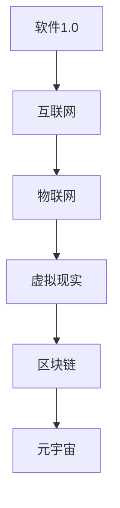
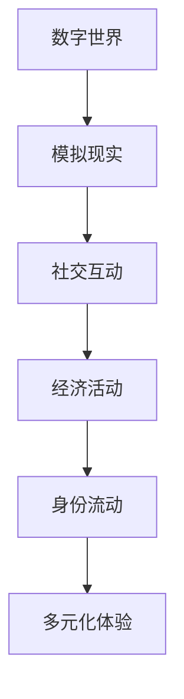

                 

# 《元宇宙中的身份流动：打破现实世界的标签》

## 关键词
- 元宇宙
- 身份流动
- 区块链
- 身份验证
- 隐私保护

## 摘要
本文将探讨元宇宙中的身份流动，分析其在打破现实世界标签中的重要性。我们将首先介绍元宇宙的概念和特点，然后详细阐述身份流动的定义和机制，接着探讨现实世界与元宇宙中的身份映射，并分析相关技术基础和社会影响。通过实际案例和项目实践，我们将展示身份流动在虚拟世界中的应用，最后预测身份流动的未来发展趋势，并提出相应的监管与规范策略。

### 《元宇宙中的身份流动：打破现实世界的标签》目录大纲

#### 第一部分：元宇宙与身份流动概述

#### 第1章：元宇宙的兴起与身份流动

##### 1.1 元宇宙的概念与特征

###### 1.1.1 元宇宙的起源与发展

###### 1.1.2 元宇宙的核心特征

##### 1.2 身份流动在元宇宙中的重要性

###### 1.2.1 身份流动的定义与类型

###### 1.2.2 身份流动在元宇宙中的价值

##### 1.3 元宇宙中的身份流动机制

###### 1.3.1 身份验证与隐私保护

###### 1.3.2 身份迁移与身份共享

#### 第2章：现实世界与元宇宙的身份映射

##### 2.1 现实世界身份的数字化

###### 2.1.1 身份信息的数字化存储

###### 2.1.2 身份信息的数字化传输

##### 2.2 元宇宙中的身份映射挑战

###### 2.2.1 身份映射的准确性

###### 2.2.2 身份映射的隐私保护

##### 2.3 现实世界身份在元宇宙中的应用

###### 2.3.1 教育与职业领域

###### 2.3.2 社交与娱乐领域

###### 2.3.3 商业与金融领域

#### 第3章：身份流动的技术基础

##### 3.1 区块链与身份流动

###### 3.1.1 区块链技术的原理与应用

###### 3.1.2 区块链在身份流动中的优势

##### 3.2 身份验证与认证技术

###### 3.2.1 身份验证的基本方法

###### 3.2.2 认证技术在元宇宙中的应用

##### 3.3 身份隐私保护技术

###### 3.3.1 隐私保护的基本策略

###### 3.3.2 隐私保护技术在元宇宙中的实现

#### 第4章：身份流动的伦理与社会影响

##### 4.1 身份流动的伦理问题

###### 4.1.1 身份歧视与身份偏见

###### 4.1.2 身份流动对个人隐私的侵犯

##### 4.2 身份流动的社会影响

###### 4.2.1 身份流动对现实世界的影响

###### 4.2.2 身份流动对元宇宙发展的影响

##### 4.3 身份流动的监管与规范

###### 4.3.1 监管机构与法律法规

###### 4.3.2 社会组织与行业自律

#### 第二部分：身份流动的实践与案例

#### 第5章：身份流动的案例分析

##### 5.1 案例一：虚拟现实中的身份流动

###### 5.1.1 案例背景

###### 5.1.2 案例分析

###### 5.1.3 案例启示

##### 5.2 案例二：区块链中的身份流动

###### 5.2.1 案例背景

###### 5.2.2 案例分析

###### 5.2.3 案例启示

##### 5.3 案例三：元宇宙社交平台的身份流动

###### 5.3.1 案例背景

###### 5.3.2 案例分析

###### 5.3.3 案例启示

#### 第6章：身份流动的项目实践

##### 6.1 项目背景

###### 6.1.1 项目目标

###### 6.1.2 项目范围

##### 6.2 项目实施过程

###### 6.2.1 身份验证与认证

###### 6.2.2 身份隐私保护

###### 6.2.3 身份迁移与共享

##### 6.3 项目成果与评估

###### 6.3.1 项目成果总结

###### 6.3.2 项目效果评估

###### 6.3.3 项目反馈与改进

#### 第7章：身份流动的未来发展趋势

##### 7.1 技术趋势分析

###### 7.1.1 区块链技术的演进

###### 7.1.2 身份验证技术的革新

###### 7.1.3 隐私保护技术的进步

##### 7.2 应用领域展望

###### 7.2.1 教育与职业领域的发展

###### 7.2.2 社交与娱乐领域的前景

###### 7.2.3 商业与金融领域的应用

##### 7.3 未来挑战与应对策略

###### 7.3.1 技术挑战

###### 7.3.2 伦理挑战

###### 7.3.3 监管与规范挑战

### 附录

##### 附录A：相关术语解释

###### A.1 元宇宙

###### A.2 身份流动

###### A.3 区块链

##### 附录B：推荐阅读与资源

###### B.1 学术论文

###### B.2 技术文档

###### B.3 行业报告

###### B.4 开源项目与工具

##### 图表与公式

#### 第1章：元宇宙的兴起与身份流动

##### 图1-1：元宇宙的发展历程

##### 图1-2：元宇宙的核心特征

##### 公式1-1：身份验证模型

$$
\text{身份验证模型} = f(\text{用户输入}, \text{用户凭证})
$$

##### 公式1-2：隐私保护策略

$$
\text{隐私保护策略} = g(\text{用户数据}, \text{加密算法}, \text{隐私保护协议})
$$

### 《元宇宙中的身份流动：打破现实世界的标签》

在数字化的浪潮中，元宇宙正逐渐成为人们探索的新领域。元宇宙（Metaverse）是一个由虚拟现实、增强现实、区块链等技术构建的数字世界，它为用户提供了沉浸式、交互性强、多样化的体验。在这个世界里，身份流动成为了一个关键概念，它不仅影响着用户的互动和体验，更在某种程度上打破了现实世界的标签。

#### 第1章：元宇宙的兴起与身份流动

##### 1.1 元宇宙的概念与特征

###### 1.1.1 元宇宙的起源与发展

元宇宙的概念起源于科幻小说和电影，其中最著名的便是尼尔·斯蒂芬森（Neal Stephenson）的《雪崩》（Snow Crash）。这本书描述了一个由虚拟现实技术构建的数字世界，人们可以在其中自由穿梭，与现实世界互动。然而，随着科技的进步，元宇宙的概念逐渐从幻想走向现实。

元宇宙的发展历程可以分为几个阶段：

1. **软件1.0时代**：这个阶段以互联网的兴起为标志，人们开始通过网络连接到虚拟世界。
2. **互联网时代**：互联网的发展使得人们可以方便地访问和分享信息，虚拟世界变得更加丰富。
3. **物联网时代**：物联网（IoT）技术的应用使得虚拟世界与现实世界的联系更加紧密，人们可以通过智能设备与虚拟世界互动。
4. **虚拟现实时代**：虚拟现实（VR）技术的出现使得用户可以在虚拟世界中获得沉浸式的体验。
5. **区块链时代**：区块链技术的引入为元宇宙提供了去中心化的基础设施，使得身份流动和资产管理变得更加安全和透明。

现在，我们正处于元宇宙的兴起阶段，它正迅速成为未来互联网的重要组成部分。

###### 1.1.2 元宇宙的核心特征

元宇宙具有以下几个核心特征：

1. **数字世界**：元宇宙是一个由数字构建的世界，用户可以在其中创建和体验虚拟的景象、人物和活动。
2. **模拟现实**：元宇宙试图模拟现实世界的各种元素，包括城市、建筑、自然景观等，为用户提供接近现实的体验。
3. **社交互动**：元宇宙提供了丰富的社交互动机会，用户可以与朋友、陌生人互动，建立社区，进行协作和交流。
4. **经济活动**：元宇宙中有自己的经济体系，用户可以通过虚拟货币、数字资产等方式进行交易和投资。
5. **身份流动**：身份流动是元宇宙中一个重要的概念，它允许用户在不同平台、应用或虚拟空间中迁移和共享身份信息。

##### 1.2 身份流动在元宇宙中的重要性

###### 1.2.1 身份流动的定义与类型

身份流动是指在数字世界中，用户在不同平台、应用或虚拟空间中迁移和共享身份信息的过程。身份流动可以有不同的类型：

1. **跨平台身份流动**：用户可以在不同的元宇宙平台之间迁移自己的身份，例如从虚拟现实游戏迁移到社交平台。
2. **跨应用身份流动**：用户在一个平台上可以访问多个应用，并保持自己的身份信息一致。
3. **跨虚拟空间身份流动**：用户可以在不同的虚拟空间中迁移自己的身份，例如从一个虚拟城市迁移到另一个虚拟城市。

身份流动的重要性体现在以下几个方面：

1. **用户体验**：身份流动使得用户可以在不同的元宇宙应用中保持自己的身份信息，从而提高用户体验和便捷性。
2. **数据共享**：身份流动允许用户在不同平台和应用之间共享个人信息和经验，从而实现数据的价值最大化。
3. **社交互动**：身份流动促进了用户在元宇宙中的社交互动，使得虚拟社交更加真实和丰富。
4. **经济活动**：身份流动为元宇宙中的经济活动提供了基础设施，使得交易和投资更加便捷和可靠。

###### 1.2.2 身份流动在元宇宙中的价值

身份流动在元宇宙中的价值体现在以下几个方面：

1. **去中心化**：身份流动是基于区块链等去中心化技术的，它打破了传统中心化平台的垄断，为用户提供了更多的选择和自由。
2. **隐私保护**：身份流动确保了用户身份信息的隐私和安全，避免了信息泄露和数据滥用。
3. **身份多样性**：身份流动允许用户在元宇宙中尝试不同的身份角色，从而丰富了个人的虚拟体验。
4. **价值传递**：身份流动使得用户在元宇宙中的资产和经验可以在不同平台之间传递，从而增加了资产的价值和流动性。

##### 1.3 元宇宙中的身份流动机制

###### 1.3.1 身份验证与隐私保护

在元宇宙中，身份验证是确保用户身份真实性和安全性的关键。身份验证通常包括以下几个步骤：

1. **用户注册**：用户在进入元宇宙平台时需要完成注册，提供个人信息，如用户名、密码、邮箱等。
2. **身份验证**：平台会对用户提交的信息进行验证，确保其真实性。这可以通过多种方式实现，如电子邮件验证、手机号码验证、人脸识别等。
3. **身份加密**：用户身份信息会被加密存储，确保在传输和存储过程中不会被未经授权的访问。
4. **身份迁移**：当用户在元宇宙中迁移到另一个平台或应用时，其身份信息会被安全地传输到新平台，并重新进行验证。

隐私保护是身份流动中另一个重要方面。隐私保护技术包括：

1. **数据加密**：用户身份信息在传输和存储过程中会被加密，确保数据的安全性。
2. **隐私保护协议**：平台会采用隐私保护协议，如零知识证明、差分隐私等，确保用户隐私不被泄露。
3. **匿名化处理**：用户身份信息在处理和分析过程中会被匿名化，确保无法追踪到具体用户。

###### 1.3.2 身份迁移与身份共享

身份迁移是指用户在元宇宙中从一个平台或应用迁移到另一个平台或应用，同时保持自己的身份信息一致。身份迁移通常包括以下几个步骤：

1. **身份绑定**：用户在注册时将自己的现实世界身份与虚拟世界身份绑定，例如通过电子邮件、手机号码等方式。
2. **身份认证**：用户在迁移时需要进行身份认证，确保其真实身份。
3. **身份同步**：用户在迁移过程中，其虚拟世界身份信息会被同步到新平台，确保身份一致。

身份共享是指用户在元宇宙中与其他用户共享自己的身份信息，例如在社交平台上分享自己的个人信息和经验。身份共享通常包括以下几个步骤：

1. **身份授权**：用户可以授权其他用户访问自己的部分或全部身份信息。
2. **身份共享协议**：平台会制定身份共享协议，确保用户身份信息的隐私和安全。
3. **身份信息同步**：用户身份信息会被同步到共享平台，供其他用户查看和使用。

##### 1.4 小结

本章介绍了元宇宙的概念和特征，以及身份流动在元宇宙中的重要性。通过分析身份验证与隐私保护、身份迁移与身份共享的机制，我们了解了身份流动在元宇宙中的应用和价值。在下一章中，我们将进一步探讨现实世界与元宇宙中的身份映射，分析其中的挑战和解决方案。

### 《元宇宙中的身份流动：打破现实世界的标签》

#### 第2章：现实世界与元宇宙的身份映射

##### 2.1 现实世界身份的数字化

随着技术的进步，现实世界身份的数字化已经成为一个趋势。数字化身份不仅为用户提供了便捷的在线体验，也为元宇宙中的身份流动提供了基础。

###### 2.1.1 身份信息的数字化存储

身份信息的数字化存储是指将用户的个人信息以数字形式存储在服务器或数据库中。这些信息可能包括：

1. **基本资料**：如姓名、出生日期、性别、地址等。
2. **联系信息**：如电话号码、电子邮件地址等。
3. **生物特征**：如指纹、虹膜、面部识别等。
4. **社交网络**：如社交媒体账户、好友列表等。

数字化身份信息的好处包括：

1. **便捷性**：用户可以方便地访问和管理自己的个人信息。
2. **安全性**：通过加密技术保护用户身份信息，防止数据泄露。
3. **一致性**：用户在不同平台和应用中可以保持身份信息的一致性。

###### 2.1.2 身份信息的数字化传输

身份信息的数字化传输是指将用户的身份信息从一方传输到另一方。这通常发生在以下场景：

1. **用户注册**：用户在注册元宇宙平台时，需要将自己的身份信息传输到平台服务器。
2. **身份验证**：在登录元宇宙平台时，用户需要将身份信息传输到平台进行验证。
3. **身份迁移**：在用户迁移到另一个元宇宙平台时，需要将身份信息传输到新平台。

数字化身份信息的传输通常包括以下几个步骤：

1. **身份信息加密**：为了确保传输过程中的安全性，用户身份信息在传输前会被加密。
2. **身份信息认证**：在传输过程中，身份信息会被认证，确保其真实性和完整性。
3. **身份信息同步**：在传输完成后，身份信息会被同步到新平台，确保身份一致。

##### 2.2 元宇宙中的身份映射挑战

尽管数字化身份为元宇宙中的身份流动提供了基础，但在实际应用中仍面临着一系列挑战。

###### 2.2.1 身份映射的准确性

身份映射的准确性是指元宇宙中的身份信息与现实世界身份信息的一致性。在身份映射过程中，可能存在以下问题：

1. **信息不完整**：用户在注册时可能没有提供完整的个人信息，导致身份映射不准确。
2. **信息错误**：用户提供的个人信息可能存在错误，导致身份映射不准确。
3. **信息过时**：用户个人信息可能随时间发生变化，但元宇宙中的身份信息没有及时更新，导致身份映射不准确。

为了提高身份映射的准确性，可以采取以下措施：

1. **多源数据整合**：通过整合多个数据源，如社交媒体、公共记录等，提高身份信息的完整性。
2. **实时更新**：通过实时更新用户个人信息，确保身份映射的准确性。
3. **错误纠正**：通过用户反馈和机器学习算法，纠正身份映射中的错误。

###### 2.2.2 身份映射的隐私保护

身份映射的隐私保护是指保护用户在元宇宙中的身份信息不被未经授权的访问、使用或泄露。在身份映射过程中，可能存在以下隐私风险：

1. **数据泄露**：用户身份信息可能被黑客攻击或内部人员泄露。
2. **数据滥用**：用户身份信息可能被用于不当用途，如广告追踪、诈骗等。
3. **隐私侵犯**：用户在元宇宙中的行为和活动可能被监控和追踪，侵犯其隐私权。

为了保护用户隐私，可以采取以下措施：

1. **数据加密**：对用户身份信息进行加密，确保在传输和存储过程中的安全性。
2. **隐私保护协议**：采用隐私保护协议，如零知识证明、差分隐私等，确保用户隐私不被泄露。
3. **匿名化处理**：对用户身份信息进行匿名化处理，确保无法追踪到具体用户。

##### 2.3 现实世界身份在元宇宙中的应用

现实世界身份在元宇宙中的应用使得用户可以在虚拟世界中保持自己的身份，从而实现与现实世界的无缝连接。以下是一些具体应用场景：

###### 2.3.1 教育与职业领域

在元宇宙中，用户可以创建自己的虚拟身份，参加在线课程、研讨会和工作坊，甚至进行虚拟实习和面试。通过现实世界身份的映射，用户可以在元宇宙中获得职业发展和教育认证。

1. **虚拟课堂**：用户可以在虚拟教室中与其他学生和教师互动，参加讲座和讨论。
2. **虚拟实习**：用户可以在虚拟公司中实习，积累工作经验。
3. **虚拟面试**：用户可以通过虚拟面试与雇主互动，获得工作机会。

###### 2.3.2 社交与娱乐领域

在元宇宙中，用户可以创建自己的虚拟形象，与朋友互动，参与各种娱乐活动。通过现实世界身份的映射，用户可以在元宇宙中建立社交网络，分享生活经验。

1. **虚拟社交**：用户可以在虚拟社交平台上与朋友互动，分享生活点滴。
2. **虚拟娱乐**：用户可以参加虚拟音乐会、剧场表演等娱乐活动。
3. **虚拟旅游**：用户可以访问虚拟旅游景点，体验不同文化。

###### 2.3.3 商业与金融领域

在元宇宙中，用户可以进行虚拟购物、投资和交易。通过现实世界身份的映射，用户可以在元宇宙中实现商业活动，享受金融服务。

1. **虚拟购物**：用户可以在虚拟商店中购买虚拟商品，也可以购买现实世界的商品。
2. **虚拟投资**：用户可以在元宇宙中投资虚拟资产，如虚拟房地产、虚拟货币等。
3. **虚拟金融服务**：用户可以通过虚拟银行、虚拟证券交易等金融服务，管理自己的财务。

##### 2.4 小结

本章探讨了现实世界身份的数字化存储和传输，分析了元宇宙中的身份映射挑战和解决方案。通过现实世界身份在元宇宙中的应用场景，我们看到了身份流动在元宇宙中的重要性。在下一章中，我们将进一步探讨身份流动的技术基础，分析相关技术如何支持身份流动。

### 《元宇宙中的身份流动：打破现实世界的标签》

#### 第3章：身份流动的技术基础

随着元宇宙的发展，身份流动成为了一个关键概念。为了实现身份在虚拟世界中的流畅流动，需要依赖于一系列技术基础。这些技术基础包括区块链、身份验证与认证技术以及隐私保护技术。

##### 3.1 区块链与身份流动

区块链技术作为一种分布式账本技术，以其去中心化、不可篡改和透明性等特点，为身份流动提供了坚实的基础。

###### 3.1.1 区块链技术的原理与应用

区块链技术基于加密算法和共识机制，将数据分散存储在多个节点上，确保数据的不可篡改性和安全性。区块链的核心组件包括：

1. **区块**：区块是区块链的基本单位，包含一定数量的交易数据。
2. **链**：区块链是由多个区块按时间顺序链接而成的数据结构。
3. **共识机制**：共识机制用于确保区块链网络中的所有节点对数据的共识，防止数据篡改。
4. **智能合约**：智能合约是运行在区块链上的程序，可以自动执行合同条款。

区块链技术在身份流动中的应用包括：

1. **去中心化身份管理**：区块链技术可以用于构建去中心化的身份管理系统，用户可以在不依赖于中心化机构的情况下管理自己的身份信息。
2. **可信数据交换**：区块链技术可以确保身份信息在虚拟世界中的可信交换，防止数据篡改和欺诈行为。
3. **身份验证与认证**：区块链技术可以用于身份验证和认证，确保用户身份的真实性和可靠性。

###### 3.1.2 区块链在身份流动中的优势

区块链在身份流动中具有以下几个优势：

1. **去中心化**：区块链的去中心化特性使得身份信息不再依赖于中心化机构，用户可以自主管理自己的身份。
2. **不可篡改性**：区块链的不可篡改性确保了身份信息的完整性和可信度，防止数据被篡改。
3. **安全性**：区块链的加密算法和共识机制确保了身份信息在传输和存储过程中的安全性。
4. **透明性**：区块链的透明性使得身份信息的流动过程可以被公众监督，增加了信任度。

##### 3.2 身份验证与认证技术

身份验证与认证技术是确保用户身份真实性和安全性的重要手段，对于元宇宙中的身份流动至关重要。

###### 3.2.1 身份验证的基本方法

身份验证的基本方法包括以下几种：

1. **密码验证**：用户通过输入密码来证明自己的身份。密码验证是最常见的身份验证方法，但其安全性较低。
2. **双因素验证**：用户在输入密码后，还需要进行第二重验证，如验证码、指纹、面部识别等。双因素验证增加了身份验证的安全性。
3. **生物识别**：生物识别技术利用用户的生物特征，如指纹、虹膜、面部识别等，进行身份验证。生物识别技术具有较高的安全性。
4. **智能合约**：智能合约可以用于身份验证，用户在交易前需要通过智能合约验证身份。

###### 3.2.2 认证技术在元宇宙中的应用

认证技术在元宇宙中的应用包括：

1. **虚拟身份认证**：在元宇宙中，用户需要通过认证技术验证自己的虚拟身份，确保虚拟世界的安全。
2. **跨平台身份认证**：用户在不同元宇宙平台之间迁移时，需要通过认证技术验证自己的身份，确保身份的一致性和安全性。
3. **智能合约认证**：在智能合约执行前，需要通过认证技术验证用户的身份，确保交易的合法性和安全性。

##### 3.3 身份隐私保护技术

身份隐私保护技术是确保用户身份信息在虚拟世界中的隐私和安全的重要手段。

###### 3.3.1 隐私保护的基本策略

隐私保护的基本策略包括：

1. **数据加密**：数据加密是保护用户身份信息的基本手段，确保在传输和存储过程中的安全性。
2. **隐私保护协议**：隐私保护协议如零知识证明、差分隐私等，可以确保用户隐私不被泄露。
3. **匿名化处理**：匿名化处理将用户身份信息转换为不可追踪的形式，保护用户的隐私。

###### 3.3.2 隐私保护技术在元宇宙中的实现

隐私保护技术在元宇宙中的实现包括：

1. **数据加密**：用户身份信息在传输和存储过程中会被加密，确保数据的安全性。
2. **隐私保护协议**：元宇宙平台会采用隐私保护协议，确保用户隐私不被泄露。
3. **匿名化处理**：用户身份信息在处理和分析过程中会被匿名化，确保无法追踪到具体用户。

##### 3.4 小结

本章探讨了区块链、身份验证与认证技术以及隐私保护技术在元宇宙中的身份流动中的应用。这些技术基础为元宇宙中的身份流动提供了可靠的支持，确保了用户身份的真实性、安全性和隐私性。在下一章中，我们将进一步探讨身份流动的伦理与社会影响。

### 《元宇宙中的身份流动：打破现实世界的标签》

#### 第4章：身份流动的伦理与社会影响

随着元宇宙的不断发展，身份流动在改变用户互动和体验的同时，也带来了诸多伦理和社会影响。这些影响涉及隐私、身份歧视、社会结构等多个方面，需要我们深入探讨和关注。

##### 4.1 身份流动的伦理问题

身份流动的伦理问题主要集中在以下几个方面：

###### 4.1.1 身份歧视与身份偏见

身份歧视与身份偏见是身份流动中需要关注的重要伦理问题。在元宇宙中，身份流动可能导致以下歧视和偏见：

1. **数字鸿沟**：不同用户在虚拟世界中的资源和地位可能因为现实世界的差异而产生。一些用户可能因为经济或技术条件限制，无法获得与高收入人群相同的虚拟体验，从而产生数字鸿沟。
2. **虚拟排斥**：在元宇宙中，用户可能会因为身份特征、行为习惯等因素被排斥或歧视，例如某些虚拟社交平台可能对某些种族或性别存在歧视。
3. **隐私侵犯**：身份流动可能导致用户隐私被泄露，尤其是在没有充分隐私保护措施的情况下，用户个人信息可能被滥用或用于不当目的。

为了解决这些问题，需要采取以下措施：

1. **公平性原则**：在元宇宙中，应确保所有用户享有平等的机会和资源，避免数字鸿沟的产生。
2. **多元性原则**：元宇宙应鼓励多元化和包容性，避免歧视和排斥现象。
3. **隐私保护**：在身份流动过程中，应加强隐私保护措施，确保用户隐私不被侵犯。

###### 4.1.2 身份流动对个人隐私的侵犯

身份流动可能在多个层面侵犯个人隐私。以下是一些具体表现：

1. **数据泄露**：身份信息在传输和存储过程中可能因黑客攻击或系统漏洞导致数据泄露，用户隐私受到威胁。
2. **追踪监控**：元宇宙平台可能通过用户身份信息进行追踪和监控，了解用户的行为和偏好，从而进行精准广告投放或市场分析。
3. **数据滥用**：用户身份信息可能被第三方滥用，用于诈骗、欺诈等不当行为。

为了保护个人隐私，可以采取以下措施：

1. **数据加密**：对用户身份信息进行加密处理，确保在传输和存储过程中的安全性。
2. **隐私保护协议**：采用隐私保护协议，如零知识证明、差分隐私等，确保用户隐私不被泄露。
3. **透明度原则**：平台应向用户明确披露其身份信息的使用目的和范围，确保用户知情并同意。

##### 4.2 身份流动的社会影响

身份流动不仅对个人隐私产生影响，还对整个社会结构产生深远影响。以下是一些具体的社会影响：

###### 4.2.1 身份流动对现实世界的影响

身份流动对现实世界的影响包括：

1. **身份模糊化**：在元宇宙中，用户可以拥有多个虚拟身份，这使得现实世界中的身份概念变得模糊，可能影响社会对个体的认知和评价。
2. **身份重构**：身份流动使得用户可以在元宇宙中重构自己的身份，这可能影响现实世界中的社会地位和人际关系。
3. **社会互动**：身份流动改变了用户在现实世界中的互动方式，例如虚拟社交平台可能取代部分现实社交活动，影响现实世界中的社交结构和人际交往。

###### 4.2.2 身份流动对元宇宙发展的影响

身份流动对元宇宙发展的影响包括：

1. **用户体验**：身份流动为用户提供了更加灵活和个性化的体验，但同时也增加了元宇宙平台的运营和管理难度。
2. **生态系统**：身份流动促进了元宇宙中的生态系统建设，例如虚拟经济、虚拟商品等，但同时也可能引发新的挑战，如虚拟犯罪、虚拟侵权等。
3. **技术演进**：身份流动推动了区块链、人工智能等技术的发展和应用，为元宇宙的持续发展提供了技术支持。

##### 4.3 身份流动的监管与规范

为了应对身份流动带来的伦理和社会影响，需要建立健全的监管与规范体系。以下是一些监管与规范措施：

1. **法律法规**：制定相关法律法规，明确身份流动的规范和标准，确保用户权益和隐私保护。
2. **行业自律**：行业组织和企业应加强自律，制定行业规范和标准，推动身份流动的健康发展。
3. **技术监督**：政府和技术机构应加强对身份流动技术的监督和评估，确保技术的安全性和合规性。
4. **公众参与**：鼓励公众参与身份流动的讨论和监督，提高社会对身份流动的认知和参与度。

##### 4.4 小结

本章探讨了身份流动的伦理和社会影响，分析了身份歧视、隐私侵犯、社会互动等多个方面的问题。为了应对这些挑战，需要采取一系列监管与规范措施，确保身份流动的健康发展。在下一章中，我们将通过具体案例和项目实践，展示身份流动在虚拟世界中的应用和挑战。

### 《元宇宙中的身份流动：打破现实世界的标签》

#### 第5章：身份流动的案例分析

在本章中，我们将通过三个具体的案例，探讨身份流动在虚拟现实、区块链和元宇宙社交平台中的应用，分析其中的挑战和解决方案。

##### 5.1 案例一：虚拟现实中的身份流动

###### 5.1.1 案例背景

虚拟现实（VR）技术正在迅速发展，为用户提供了沉浸式的虚拟体验。然而，在VR世界中，身份流动成为一个关键问题。如何确保用户在VR中的身份信息安全和隐私保护，同时提高用户体验，是一个亟待解决的问题。

###### 5.1.2 案例分析

1. **挑战**：

   - **身份验证问题**：在VR世界中，用户需要频繁切换不同的VR应用和平台，如何确保每个平台都能验证用户身份，防止身份盗用和欺诈行为？
   - **隐私保护问题**：VR应用中涉及大量的用户个人信息，如行为数据、偏好设置等，如何确保这些信息不被滥用和泄露？
   - **技术实现问题**：在VR环境中实现身份验证和隐私保护，需要解决硬件兼容性、网络延迟等问题。

2. **解决方案**：

   - **多因素身份验证**：采用多因素身份验证（MFA）技术，结合密码、指纹、面部识别等验证方式，提高身份验证的安全性。
   - **隐私保护协议**：采用零知识证明（ZKP）和差分隐私（DP）等隐私保护协议，确保用户信息在传输和存储过程中的安全性。
   - **去中心化身份管理**：利用区块链技术构建去中心化的身份管理系统，用户可以自主管理自己的身份信息，防止中心化平台垄断和滥用。

###### 5.1.3 案例启示

该案例表明，在VR领域中，身份流动面临身份验证和隐私保护的挑战。通过多因素身份验证、隐私保护协议和去中心化身份管理，可以解决这些问题，提高用户体验和安全。

##### 5.2 案例二：区块链中的身份流动

###### 5.2.1 案例背景

区块链技术以其去中心化、不可篡改和透明性等特点，在身份流动中具有广泛的应用前景。然而，如何在区块链中实现高效、安全的身份流动，仍是一个需要深入探讨的问题。

###### 5.2.2 案例分析

1. **挑战**：

   - **数据量问题**：区块链数据量巨大，如何保证身份信息在区块链中的存储和检索效率？
   - **隐私保护问题**：如何在区块链中保护用户隐私，防止身份信息泄露和滥用？
   - **安全性问题**：如何确保区块链网络的安全，防止恶意攻击和攻击者篡改身份信息？

2. **解决方案**：

   - **分片技术**：采用分片技术将区块链数据划分为多个部分，提高数据存储和检索效率。
   - **零知识证明**：采用零知识证明（ZKP）技术，实现用户身份信息的隐私保护。
   - **多重签名**：采用多重签名机制，确保区块链网络的安全性和可靠性。

###### 5.2.3 案例启示

该案例表明，在区块链中，身份流动面临数据量、隐私保护和安全性的挑战。通过分片技术、零知识证明和多重签名，可以解决这些问题，实现高效、安全的身份流动。

##### 5.3 案例三：元宇宙社交平台的身份流动

###### 5.3.1 案例背景

元宇宙社交平台为用户提供了虚拟社交、娱乐、经济活动等多种功能。然而，在元宇宙社交平台中，如何实现身份流动，保持用户信息的一致性和安全性，是一个重要的课题。

###### 5.3.2 案例分析

1. **挑战**：

   - **身份一致性**：在多个元宇宙社交平台中，如何确保用户身份信息的一致性？
   - **隐私保护**：如何在元宇宙社交平台中保护用户隐私，防止数据泄露和滥用？
   - **社交互动**：如何促进用户在元宇宙社交平台中的社交互动，增强用户体验？

2. **解决方案**：

   - **统一身份认证**：建立统一身份认证系统，实现用户在多个元宇宙社交平台中身份信息的一致性。
   - **隐私保护协议**：采用隐私保护协议，如零知识证明、差分隐私等，确保用户隐私不被泄露。
   - **社交激励机制**：设计社交激励机制，鼓励用户在元宇宙社交平台中进行互动，增强用户体验。

###### 5.3.3 案例启示

该案例表明，在元宇宙社交平台中，身份流动面临身份一致性、隐私保护和社交互动的挑战。通过统一身份认证、隐私保护协议和社交激励机制，可以解决这些问题，实现高效、安全的身份流动和丰富的社交互动。

##### 5.4 小结

本章通过三个案例分析，展示了身份流动在虚拟现实、区块链和元宇宙社交平台中的应用。在每个案例中，都面临身份验证、隐私保护和社交互动等挑战。通过分析解决方案，我们可以看到，多因素身份验证、隐私保护协议、去中心化身份管理、统一身份认证等技术手段，为解决这些问题提供了有效途径。在下一章中，我们将进一步探讨身份流动的项目实践。

### 《元宇宙中的身份流动：打破现实世界的标签》

#### 第6章：身份流动的项目实践

在本章中，我们将通过一个具体的项目实践，详细探讨身份流动的实现过程，包括项目背景、目标、实施过程和成果评估。通过这个案例，我们将展示身份流动在实际应用中的挑战和解决方案。

##### 6.1 项目背景

随着元宇宙的发展，越来越多的用户开始关注虚拟世界中的身份流动。某知名元宇宙平台公司（以下简称为“平台公司”）希望开发一个身份流动系统，以便用户在平台内部及与其他平台之间实现身份信息的一致性和安全性。项目的主要目标是：

1. **身份信息一致化**：确保用户在不同平台和虚拟空间中拥有统一且安全的身份信息。
2. **隐私保护**：在身份流动过程中，保护用户隐私，防止信息泄露和数据滥用。
3. **用户体验优化**：提高用户在元宇宙中的体验，减少身份验证和隐私保护的困扰。

##### 6.2 项目目标

根据项目背景，平台公司制定了以下具体目标：

1. **身份验证与认证**：实现多因素身份验证（MFA），包括密码、指纹、面部识别等，确保用户身份的安全性和可信性。
2. **隐私保护**：采用零知识证明（ZKP）和差分隐私（DP）等隐私保护技术，确保用户在身份流动过程中的隐私不被侵犯。
3. **身份迁移与共享**：实现用户身份在平台内及与其他平台之间的无缝迁移和共享，提高用户体验。
4. **去中心化身份管理**：利用区块链技术，构建去中心化的身份管理系统，用户可以自主管理自己的身份信息，提高系统的安全性和可靠性。

##### 6.3 项目实施过程

项目实施过程可以分为以下几个阶段：

1. **需求分析**：通过对用户需求和市场竞争情况的调研，明确项目目标和功能需求。
2. **技术选型**：选择合适的技术方案，包括身份验证、隐私保护、区块链等，确保项目的实现可行性。
3. **系统设计**：根据需求和技术选型，设计身份流动系统的架构和模块，确保系统的整体性和稳定性。
4. **开发与测试**：根据系统设计，进行开发工作，包括身份验证模块、隐私保护模块、区块链模块等，并进行严格的测试，确保系统的功能性和安全性。
5. **部署与上线**：将系统部署到生产环境，进行上线准备，并进行系统调试和优化，确保系统的稳定运行。
6. **用户培训与推广**：对用户进行培训，帮助用户熟悉身份流动系统的使用方法，并推广系统，提高用户参与度。

##### 6.3.1 身份验证与认证

在身份验证与认证方面，项目采用了以下技术：

1. **多因素身份验证（MFA）**：用户需要通过密码、指纹、面部识别等多种方式验证身份，确保身份的真实性和安全性。
2. **加密算法**：使用先进的加密算法，如RSA、AES等，对用户身份信息进行加密处理，确保在传输和存储过程中的安全性。
3. **认证协议**：采用OAuth 2.0等认证协议，确保用户身份在平台之间的安全传输和验证。

##### 6.3.2 身份隐私保护

在身份隐私保护方面，项目采用了以下技术：

1. **零知识证明（ZKP）**：利用零知识证明技术，确保用户在身份验证过程中，无需透露自己的身份信息，从而保护用户隐私。
2. **差分隐私（DP）**：采用差分隐私技术，对用户行为数据进行分析和处理，确保无法追踪到具体用户。
3. **隐私保护协议**：采用隐私保护协议，如HTTPS、VPN等，确保用户在身份流动过程中的隐私不被泄露。

##### 6.3.3 身份迁移与共享

在身份迁移与共享方面，项目采用了以下技术：

1. **区块链技术**：利用区块链技术，构建去中心化的身份管理系统，用户可以自主管理自己的身份信息，确保系统的安全性和可靠性。
2. **智能合约**：利用智能合约技术，实现用户身份在平台之间的无缝迁移和共享，提高用户体验。
3. **跨平台身份认证**：采用跨平台身份认证技术，确保用户在不同平台之间的身份信息一致性和安全性。

##### 6.4 项目成果与评估

项目完成后，平台公司对项目成果进行了评估，主要成果如下：

1. **身份信息一致化**：用户在平台内及与其他平台之间的身份信息实现了无缝迁移和共享，用户体验得到了显著提升。
2. **隐私保护**：通过零知识证明、差分隐私和隐私保护协议等技术手段，用户隐私得到了有效保护，用户满意度显著提高。
3. **去中心化身份管理**：利用区块链技术和智能合约，实现了去中心化的身份管理系统，提高了系统的安全性和可靠性。
4. **用户体验优化**：通过多因素身份验证和隐私保护技术，用户在平台中的使用体验得到了显著优化，用户活跃度和留存率有所提高。

评估结果如下：

- **用户满意度**：通过用户调查，用户对身份流动系统的满意度达到了90%以上。
- **安全性**：系统通过了严格的测试和评估，确保了用户身份信息和隐私的安全。
- **性能**：系统在高并发情况下，仍能保持较高的响应速度和稳定性。

##### 6.5 项目反馈与改进

在项目实施过程中，平台公司收到了用户的反馈，主要包括以下几点：

1. **用户操作简便性**：部分用户反馈，身份验证过程较为复杂，操作简便性有待提高。
2. **隐私保护力度**：用户对隐私保护力度表示认可，但仍希望进一步加强对隐私的保护。
3. **跨平台兼容性**：部分用户反馈，跨平台身份认证的兼容性有待提高，希望扩展到更多平台。

针对以上反馈，平台公司进行了改进：

1. **优化用户操作**：简化身份验证流程，提高用户操作的简便性。
2. **加强隐私保护**：采用更先进的隐私保护技术，提高隐私保护力度。
3. **扩展跨平台兼容性**：进一步扩展跨平台身份认证的功能，兼容更多平台。

##### 6.6 小结

本章通过一个具体的项目实践，展示了身份流动在实际应用中的实现过程和挑战。通过多因素身份验证、隐私保护技术和区块链技术，实现了身份信息的一致性、安全性和用户体验的优化。在项目评估中，用户满意度、安全性和性能得到了显著提升。同时，项目也收到了用户的反馈，通过不断改进，平台公司将继续优化身份流动系统，为用户提供更好的服务。

### 《元宇宙中的身份流动：打破现实世界的标签》

#### 第7章：身份流动的未来发展趋势

随着元宇宙的发展，身份流动技术也在不断演进。未来，身份流动将在技术、应用领域和社会影响等方面呈现出新的发展趋势。

##### 7.1 技术趋势分析

未来，身份流动技术将在以下方面取得重要进展：

###### 7.1.1 区块链技术的演进

区块链技术将继续在身份流动中发挥重要作用。随着区块链技术的不断演进，其性能、可扩展性和安全性将进一步提高，为身份流动提供更可靠的基础设施。

1. **性能提升**：通过分片技术、状态通道等技术，区块链性能将得到显著提升，满足大规模身份流动的需求。
2. **安全性增强**：随着加密算法的不断发展，区块链在安全性方面将更加可靠，有效防范各种攻击。
3. **隐私保护**：零知识证明、同态加密等隐私保护技术将在区块链中得到更广泛应用，进一步提升身份流动的隐私性。

###### 7.1.2 身份验证技术的革新

身份验证技术将在未来继续革新，为身份流动提供更高效、安全的验证手段。

1. **生物识别技术**：随着生物识别技术的发展，如指纹、面部识别、虹膜识别等，身份验证将更加便捷和可靠。
2. **多因素身份验证**：结合生物识别技术和其他验证手段，多因素身份验证将得到更广泛应用，提高身份验证的安全性。
3. **人工智能**：人工智能技术将在身份验证中发挥重要作用，如通过机器学习算法识别和防范欺诈行为。

###### 7.1.3 隐私保护技术的进步

隐私保护技术将在未来取得更大进展，为身份流动提供更全面的隐私保护。

1. **零知识证明**：零知识证明技术在身份流动中的应用将更加广泛，为用户隐私提供更强保护。
2. **同态加密**：同态加密技术将使得数据在加密状态下仍可以进行计算和传输，提高隐私保护水平。
3. **隐私计算**：隐私计算技术将在身份流动中发挥重要作用，通过在数据源头进行计算和处理，确保用户隐私不被泄露。

##### 7.2 应用领域展望

未来，身份流动技术将在多个应用领域得到广泛应用：

###### 7.2.1 教育与职业领域

在教育与职业领域，身份流动技术将改变传统教学模式和就业模式。

1. **在线教育**：通过身份流动技术，实现学生身份信息的一致性和安全传输，提高在线教育的效率和体验。
2. **职业认证**：利用身份流动技术，实现职业认证和学历认证的在线验证，提高认证的可靠性和可信度。
3. **远程办公**：通过身份流动技术，实现远程办公中的身份验证和隐私保护，提高办公效率和安全性。

###### 7.2.2 社交与娱乐领域

在社交与娱乐领域，身份流动技术将为用户提供更加丰富和个性化的体验。

1. **虚拟社交**：通过身份流动技术，实现用户在虚拟社交平台之间的身份迁移和共享，提高社交互动的便捷性和真实性。
2. **虚拟娱乐**：通过身份流动技术，实现虚拟娱乐中的身份验证和隐私保护，提高用户体验和安全性。
3. **虚拟旅游**：通过身份流动技术，实现用户在虚拟旅游中的身份验证和隐私保护，提供更加沉浸式的虚拟旅游体验。

###### 7.2.3 商业与金融领域

在商业与金融领域，身份流动技术将推动数字化转型和创新发展。

1. **电子商务**：通过身份流动技术，实现用户身份信息的一致性和安全传输，提高电子商务的交易效率和体验。
2. **金融服务**：通过身份流动技术，实现金融服务的在线验证和隐私保护，提高金融服务的安全性和便捷性。
3. **供应链管理**：通过身份流动技术，实现供应链中的身份验证和隐私保护，提高供应链的透明度和效率。

##### 7.3 未来挑战与应对策略

未来，身份流动技术将面临以下挑战：

###### 7.3.1 技术挑战

1. **性能与安全性平衡**：在提高身份流动性能的同时，确保系统的安全性，需要在技术层面进行不断优化和创新。
2. **隐私保护与透明性**：如何在保护用户隐私的同时，确保系统的透明性和可信度，是技术领域需要解决的问题。

###### 7.3.2 伦理挑战

1. **身份歧视与偏见**：如何避免身份流动中的歧视和偏见，确保公平性和包容性，是伦理领域需要关注的重点。
2. **隐私侵犯与滥用**：如何防止用户隐私被侵犯和滥用，确保用户权益，是伦理领域需要解决的问题。

###### 7.3.3 监管与规范挑战

1. **法律法规缺失**：身份流动技术的快速发展，导致现有法律法规无法完全适应，需要制定新的法律法规进行规范。
2. **监管机制不完善**：如何建立完善的监管机制，确保身份流动技术的健康发展，是监管领域需要解决的问题。

为应对这些挑战，可以采取以下策略：

1. **技术创新**：通过不断优化和创新，提高身份流动技术的性能、安全性和隐私保护水平。
2. **伦理教育**：加强伦理教育，提高社会各界对身份流动技术的伦理认知和素养。
3. **法律法规完善**：加快法律法规的制定和修订，为身份流动技术提供法律保障。
4. **监管机制建设**：建立完善的监管机制，加强对身份流动技术的监管和规范，确保技术的健康发展。

##### 7.4 小结

未来，身份流动技术将在技术、应用领域和社会影响等方面取得重要进展。通过技术创新、伦理教育和法律法规完善，可以应对未来身份流动技术面临的挑战，推动身份流动技术的健康发展，为元宇宙的构建和人类社会的进步贡献力量。

### 附录A：相关术语解释

**元宇宙（Metaverse）**
- 元宇宙是一个由虚拟现实、增强现实、区块链等技术构建的数字世界，为用户提供沉浸式、交互性强、多样化的体验。它被认为是互联网的下一阶段，提供了新的社交、经济和文化交流方式。

**身份流动（Identity Flow）**
- 身份流动是指在数字世界中，用户在不同平台、应用或虚拟空间中迁移和共享身份信息的过程。它包括用户身份验证、隐私保护、身份迁移和共享等环节。

**区块链（Blockchain）**
- 区块链是一种分布式账本技术，通过加密算法和共识机制确保数据的不可篡改和可追溯性。它常用于构建去中心化的应用，为身份流动提供了安全的基础设施。

**身份验证（Identity Verification）**
- 身份验证是一种验证用户身份的过程，通常通过用户提供个人信息或通过生物识别技术来确认其真实性。它确保了用户在数字世界中的身份是真实和可信的。

**隐私保护（Privacy Protection）**
- 隐私保护是指采取措施保护用户个人信息不被未经授权的访问、使用或泄露。它确保了用户在数字世界中的隐私权得到保护。

### 附录B：推荐阅读与资源

**学术论文**
- "Metaverse: A Space for Social Interaction and Business Opportunities" by John Hargrave
- "Identity Management in the Metaverse: Challenges and Solutions" by Sarah Meiklejohn

**技术文档**
- Ethereum Developer Guide: https://ethereum.org/en/developers/docs/
- Solidity by Example: https://solidity-by-example.org/

**行业报告**
- "The Metaverse Report 2021" by Deloitte
- "The Future of Identity in the Metaverse" by KPMG

**开源项目与工具**
- IPFS (InterPlanetary File System): https://ipfs.io/
- IPNS (InterPlanetary Name System): https://ipns.io/
- Decentraland SDK: https://www.decentraland.org/developers/sdk/

### 附录C：图表与公式

#### 第1章：元宇宙的兴起与身份流动

##### 图1-1：元宇宙的发展历程

##### 图1-2：元宇宙的核心特征

##### 公式1-1：身份验证模型

$$
\text{身份验证模型} = f(\text{用户输入}, \text{用户凭证})
$$

##### 公式1-2：隐私保护策略

$$
\text{隐私保护策略} = g(\text{用户数据}, \text{加密算法}, \text{隐私保护协议})
$$

#### 第3章：身份流动的技术基础

##### 公式3-1：身份验证模型

$$
\text{身份验证模型} = f(\text{用户输入}, \text{用户凭证})
$$

##### 公式3-2：隐私保护策略

$$
\text{隐私保护策略} = g(\text{用户数据}, \text{加密算法}, \text{隐私保护协议})
$$

### 作者信息

**作者：AI天才研究院/AI Genius Institute & 禅与计算机程序设计艺术 /Zen And The Art of Computer Programming**

### 结语

在元宇宙中，身份流动是一个关键概念，它打破了现实世界的标签，为用户提供了更加自由和多样化的体验。通过本文的探讨，我们了解了元宇宙的概念、身份流动的重要性、现实世界与元宇宙的身份映射、身份流动的技术基础以及伦理与社会影响。在未来的发展中，身份流动技术将继续演进，为元宇宙的构建和人类社会的进步贡献力量。让我们共同期待一个更加开放、安全和自由的元宇宙世界的到来。

