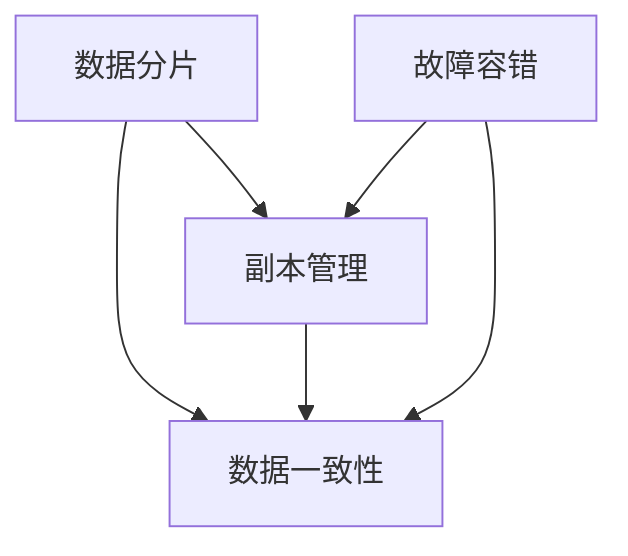

                 

## **分布式存储：支持LLM应用的大规模数据处理**

### **关键词：**

- 分布式存储
- LLM应用
- 大规模数据处理
- 数据分片
- 数据冗余
- 数据一致性
- 性能优化
- 安全性

### **摘要：**

本文深入探讨了分布式存储在支持大规模数据处理和LLM（大型语言模型）应用中的重要性。首先，我们介绍了分布式存储的基本概念、原理和应用场景。随后，详细分析了分布式存储系统的架构、数据管理策略和性能优化方法。接着，我们探讨了分布式存储与LLM应用的结合，包括LLM概述、应用场景和架构设计。随后，我们探讨了分布式存储在大规模数据处理中的应用，包括数据存储需求分析、存储系统与数据处理框架的集成和实际案例与性能优化。最后，我们讨论了分布式存储与LLM应用的性能优化和安全性问题，并提供了分布式存储和大规模数据处理实践的方法和经验总结。本文旨在为读者提供全面的分布式存储与大规模数据处理和LLM应用的技术指南。

### **目录大纲**

#### **第一部分：分布式存储基础**

##### **第1章：分布式存储概述**

###### **1.1 分布式存储概念与重要性**

###### **1.2 分布式存储与传统存储比较**

###### **1.3 分布式存储应用场景**

##### **第2章：分布式存储系统架构**

###### **2.1 分布式存储系统原理**

###### **2.2 主流分布式存储系统架构分析**

###### **2.3 分布式存储系统设计原则**

##### **第3章：分布式存储数据管理**

###### **3.1 数据分片与分配策略**

###### **3.2 数据冗余与副本管理**

###### **3.3 数据一致性保障机制**

##### **第4章：分布式存储性能优化**

###### **4.1 存储网络优化**

###### **4.2 数据访问优化**

###### **4.3 存储系统负载均衡**

##### **第5章：分布式存储系统可靠性保障**

###### **5.1 故障检测与容错机制**

###### **5.2 数据备份与恢复**

###### **5.3 分布式存储系统安全性**

#### **第二部分：大规模数据处理与LLM应用**

##### **第6章：大规模数据处理技术**

###### **6.1 分布式数据处理框架**

###### **6.2 流数据处理技术**

###### **6.3 批处理数据处理技术**

##### **第7章：LLM应用架构设计**

###### **7.1 LLM概述与分类**

###### **7.2 LLM应用场景分析**

###### **7.3 LLM架构设计与实现**

##### **第8章：分布式存储在大规模数据处理中的应用**

###### **8.1 数据存储需求分析**

###### **8.2 存储系统与数据处理框架集成**

###### **8.3 实际案例与性能优化**

##### **第9章：分布式存储与LLM应用性能优化**

###### **9.1 存储性能瓶颈分析**

###### **9.2 数据处理性能瓶颈分析**

###### **9.3 整体性能优化策略**

##### **第10章：分布式存储与LLM应用安全性**

###### **10.1 数据安全威胁分析**

###### **10.2 安全防护策略与实现**

###### **10.3 实际案例与经验总结**

#### **第三部分：分布式存储与大规模数据处理实践**

##### **第11章：分布式存储系统搭建实践**

###### **11.1 开发环境与工具介绍**

###### **11.2 分布式存储系统搭建步骤**

###### **11.3 系统配置与优化**

##### **第12章：大规模数据处理实践**

###### **12.1 数据处理任务设计**

###### **12.2 数据处理流程实现**

###### **12.3 性能优化与问题解决**

##### **第13章：分布式存储与LLM应用实战**

###### **13.1 LLM应用场景选择**

###### **13.2 应用系统搭建**

###### **13.3 应用性能优化与问题解决**

##### **第14章：分布式存储与大规模数据处理案例分析**

###### **14.1 案例介绍与背景分析**

###### **14.2 案例实现与效果分析**

###### **14.3 案例经验与启示**

##### **第15章：未来发展趋势与展望**

###### **15.1 分布式存储技术发展趋势**

###### **15.2 大规模数据处理技术发展趋势**

###### **15.3 分布式存储与大规模数据处理未来展望**

#### **附录**

##### **附录A：分布式存储与大规模数据处理常用工具与资源**

###### **A.1 开源分布式存储系统简介**

###### **A.2 大规模数据处理框架简介**

###### **A.3 LLM应用开发工具简介**

## **第一部分：分布式存储基础**

### **第1章：分布式存储概述**

#### **1.1 分布式存储概念与重要性**

分布式存储是一种数据存储技术，它通过将数据分散存储在多个节点上，实现对数据的分布式管理。分布式存储系统具有高扩展性、高可用性和高可靠性，能够更好地应对大数据场景。

#### **1.2 分布式存储与传统存储比较**

传统存储系统通常是集中式的，数据存储在单一的存储设备上。这种存储方式具有较低的扩展性和可靠性。分布式存储系统能够将数据分散存储在多个节点上，提高了系统的扩展性和可靠性。

#### **1.3 分布式存储应用场景**

分布式存储在企业级应用中具有广泛的应用，如大数据处理、云存储、数据仓库等。此外，分布式存储在云计算和数据中心中也扮演着重要角色，能够提供高效的数据存储和访问能力。

### **第2章：分布式存储系统架构**

#### **2.1 分布式存储系统原理**

分布式存储系统通过数据分片和副本管理来实现数据的分布式存储。数据分片将数据分成多个小块，存储到不同的节点上。副本管理通过复制数据，提高数据的可靠性和访问速度。

#### **2.2 主流分布式存储系统架构分析**

主流的分布式存储系统包括HDFS、Ceph和GlusterFS。这些系统都具有分布式存储的基本原理，但在架构和实现上有所不同。

#### **2.3 分布式存储系统设计原则**

分布式存储系统设计应遵循高可用性、高性能和高扩展性的原则。高可用性确保数据在系统故障时能够快速恢复，高性能提供高效的数据访问能力，高扩展性支持数据量的快速增长。

### **第3章：分布式存储数据管理**

#### **3.1 数据分片与分配策略**

数据分片是将数据分成多个小块的过程，分配策略决定了数据如何分布在不同的节点上。常用的数据分片策略包括范围分片和哈希分片。

#### **3.2 数据冗余与副本管理**

数据冗余通过复制数据来提高数据的可靠性和访问速度。副本管理负责确保副本的一致性和可用性。

#### **3.3 数据一致性保障机制**

分布式存储系统需要确保数据的一致性，常用的数据一致性保障机制包括强一致性和最终一致性。

### **第4章：分布式存储性能优化**

#### **4.1 存储网络优化**

存储网络优化包括网络拓扑优化和网络带宽优化，以提高数据传输效率。

#### **4.2 数据访问优化**

数据访问优化包括缓存机制和预取机制，以提高数据访问速度。

#### **4.3 存储系统负载均衡**

存储系统负载均衡通过合理分配数据访问负载，避免单点性能瓶颈。

### **第5章：分布式存储系统可靠性保障**

#### **5.1 故障检测与容错机制**

故障检测和容错机制确保在系统故障时能够自动恢复，保证数据的安全性。

#### **5.2 数据备份与恢复**

数据备份和恢复机制用于防止数据丢失，确保在数据丢失时能够将数据还原到正常状态。

#### **5.3 分布式存储系统安全性**

分布式存储系统安全性包括数据加密、访问控制和安全防护策略，以防止数据泄露和未经授权的访问。

## **第二部分：大规模数据处理与LLM应用**

### **第6章：大规模数据处理技术**

#### **6.1 分布式数据处理框架**

分布式数据处理框架包括Hadoop、Spark和Flink等，这些框架提供了分布式数据处理的能力，适用于大规模数据处理。

#### **6.2 流数据处理技术**

流数据处理技术包括Apache Kafka和Apache Flink等，这些技术能够处理实时数据流，适用于实时数据处理场景。

#### **6.3 批处理数据处理技术**

批处理数据处理技术包括MapReduce和Apache Hive等，这些技术适用于离线数据处理场景，能够处理大量历史数据。

### **第7章：LLM应用架构设计**

#### **7.1 LLM概述与分类**

LLM（大型语言模型）是一种具有强大文本理解和生成能力的模型，可分为基于规则的方法、统计方法和深度学习方法等。

#### **7.2 LLM应用场景分析**

LLM在自然语言处理、智能客服、文本分类和情感分析等领域具有广泛的应用。

#### **7.3 LLM架构设计与实现**

LLM的架构设计包括模型结构、训练方法和部署策略等，深度学习模型如Transformer和BERT是LLM的主要实现方式。

### **第8章：分布式存储在大规模数据处理中的应用**

#### **8.1 数据存储需求分析**

数据存储需求分析包括数据量分析和数据访问模式分析，以确定存储策略。

#### **8.2 存储系统与数据处理框架集成**

存储系统与数据处理框架的集成包括HDFS与Hadoop集成和Spark与分布式存储集成等。

#### **8.3 实际案例与性能优化**

实际案例包括分布式存储在大规模数据处理中的应用，性能优化包括存储系统性能瓶颈分析和数据处理性能瓶颈分析。

### **第9章：分布式存储与LLM应用性能优化**

#### **9.1 存储性能瓶颈分析**

存储性能瓶颈分析包括存储系统性能瓶颈和数据处理性能瓶颈的分析。

#### **9.2 数据处理性能瓶颈分析**

数据处理性能瓶颈分析包括存储系统和数据处理框架的性能瓶颈分析。

#### **9.3 整体性能优化策略**

整体性能优化策略包括存储与处理协同优化和系统监控与调优等。

### **第10章：分布式存储与LLM应用安全性**

#### **10.1 数据安全威胁分析**

数据安全威胁分析包括存储系统和LLM应用面临的安全威胁。

#### **10.2 安全防护策略与实现**

安全防护策略与实现包括数据加密、访问控制和安全防护策略等。

#### **10.3 实际案例与经验总结**

实际案例与经验总结包括分布式存储与LLM应用中的安全案例和总结。

### **第三部分：分布式存储与大规模数据处理实践**

### **第11章：分布式存储系统搭建实践**

#### **11.1 开发环境与工具介绍**

开发环境与工具介绍包括分布式存储系统搭建所需的开发环境和工具。

#### **11.2 分布式存储系统搭建步骤**

分布式存储系统搭建步骤包括环境准备、存储节点搭建和数据处理框架集成等。

#### **11.3 系统配置与优化**

系统配置与优化包括系统配置参数的设置和性能优化策略的制定。

### **第12章：大规模数据处理实践**

#### **12.1 数据处理任务设计**

数据处理任务设计包括任务需求分析和任务流程设计等。

#### **12.2 数据处理流程实现**

数据处理流程实现包括数据采集、数据预处理和数据处理等步骤。

#### **12.3 性能优化与问题解决**

性能优化与问题解决包括根据实际运行情况提出性能优化方案和解决处理过程中遇到的问题。

### **第13章：分布式存储与LLM应用实战**

#### **13.1 LLM应用场景选择**

LLM应用场景选择包括分析不同应用场景的需求和选择适合的场景。

#### **13.2 应用系统搭建**

应用系统搭建包括设计应用系统的架构和搭建分布式存储与LLM应用系统。

#### **13.3 应用性能优化与问题解决**

应用性能优化与问题解决包括根据应用性能分析提出性能优化方案和解决应用过程中遇到的问题。

### **第14章：分布式存储与大规模数据处理案例分析**

#### **14.1 案例介绍与背景分析**

案例介绍与背景分析包括介绍具体的分布式存储与大规模数据处理案例和其背景。

#### **14.2 案例实现与效果分析**

案例实现与效果分析包括介绍案例的实现方案和效果分析。

#### **14.3 案例经验与启示**

案例经验与启示包括总结案例中的经验和为未来的分布式存储与大规模数据处理提供启示。

### **第15章：未来发展趋势与展望**

#### **15.1 分布式存储技术发展趋势**

分布式存储技术发展趋势包括分析分布式存储技术的未来发展趋势和新技术方向。

#### **15.2 大规模数据处理技术发展趋势**

大规模数据处理技术发展趋势包括分析大规模数据处理技术的未来发展趋势和新技术方向。

#### **15.3 分布式存储与大规模数据处理未来展望**

分布式存储与大规模数据处理未来展望包括探讨分布式存储与大规模数据处理在未来的发展前景和应用领域。

### **附录A：分布式存储与大规模数据处理常用工具与资源**

#### **A.1 开源分布式存储系统简介**

开源分布式存储系统简介包括介绍常用的开源分布式存储系统如HDFS、Ceph和GlusterFS的特点和使用方法。

#### **A.2 大规模数据处理框架简介**

大规模数据处理框架简介包括介绍常用的分布式数据处理框架如Hadoop、Spark和Flink的特点和使用方法。

#### **A.3 LLM应用开发工具简介**

LLM应用开发工具简介包括介绍常用的LLM应用开发工具如TensorFlow、PyTorch和Transformers的特点和使用方法。## **第一部分：分布式存储基础**

### **第1章：分布式存储概述**

#### **1.1 分布式存储概念与重要性**

分布式存储（Distributed Storage）是一种数据存储技术，通过将数据分散存储在多个物理节点上，以实现对数据的分布式管理和访问。与传统集中式存储系统不同，分布式存储系统具备高扩展性、高可用性和高可靠性，能够更好地处理海量数据和应对复杂应用场景。

**概念**：

- **分布式存储**：将数据分散存储在多个节点上，通过分布式算法管理和访问数据。
- **节点**：存储数据的基本单元，可以是物理服务器或虚拟机。
- **分布式算法**：用于数据分片、副本管理、数据一致性等。

**重要性**：

1. **高扩展性**：分布式存储系统能够轻松扩展，以支持数据量的增长。
2. **高可用性**：通过冗余存储和故障转移，确保数据在故障时仍然可用。
3. **高可靠性**：通过数据复制和校验，提高数据可靠性。
4. **高性能**：分布式存储系统能够实现数据并行访问，提高访问速度。

#### **1.2 分布式存储与传统存储比较**

**传统存储系统**：

- **集中式存储**：数据存储在单一存储设备上，如磁盘阵列、NAS等。
- **扩展性有限**：随着数据量的增加，扩展性较差，可能需要更换更大容量存储设备。
- **可靠性较低**：单一设备故障可能导致数据丢失。
- **访问速度有限**：数据访问速度受限于存储设备的I/O性能。

**分布式存储系统**：

- **分布式文件系统**：如HDFS、GlusterFS等，支持数据分片和并行访问。
- **扩展性强**：通过增加节点，能够线性扩展存储容量和性能。
- **高可靠性**：通过数据复制和冗余，提高数据可靠性。
- **高性能**：支持并行数据访问，提高数据访问速度。

#### **1.3 分布式存储应用场景**

分布式存储广泛应用于以下场景：

1. **大数据处理**：处理大规模数据集，如日志数据、图像数据等。
2. **云存储**：提供云服务中的数据存储服务，如AWS S3、Azure Blob Storage等。
3. **分布式数据库**：支持分布式数据存储和访问，如Cassandra、MongoDB等。
4. **内容分发网络（CDN）**：用于存储和分发网络内容，如视频、图片等。
5. **智能数据中心**：支持大规模数据处理和存储需求，如数据中心、云计算平台等。

### **第2章：分布式存储系统架构**

#### **2.1 分布式存储系统原理**

分布式存储系统通过以下基本原理实现数据的分布式存储和管理：

1. **数据分片**：将数据分成多个小块（分片），存储在不同的节点上。
2. **副本管理**：复制数据到多个节点，提高数据可靠性和访问速度。
3. **数据一致性**：确保多个副本之间的数据一致性。
4. **故障容错**：在节点故障时，自动转移数据到其他健康节点。

#### **2.2 主流分布式存储系统架构分析**

**HDFS（Hadoop Distributed File System）**：

- **架构**：由NameNode和DataNode组成。NameNode负责元数据管理，DataNode负责数据存储。
- **特点**：高可靠性、高扩展性、适合大规模数据处理。

**Ceph**：

- **架构**：由OSD（Object Storage Daemon）、MDS（Metadata Server）和Monitor组成。
- **特点**：高可靠性、高扩展性、适用于云存储环境。

**GlusterFS**：

- **架构**：由分布式元数据和文件系统组成。
- **特点**：高扩展性、高可用性、支持异构存储设备。

**分布式存储系统设计原则**：

1. **高可用性**：通过冗余和故障转移，确保系统在节点故障时仍然可用。
2. **高性能**：通过数据分片和并行访问，提高数据访问速度。
3. **高扩展性**：支持线性扩展，以适应数据增长。
4. **数据一致性**：确保多个副本之间的数据一致性。

### **第3章：分布式存储数据管理**

#### **3.1 数据分片与分配策略**

**数据分片**：

- **目的**：将大数据集分成小块，便于存储和访问。
- **方法**：基于文件、记录或块进行分片。

**分配策略**：

- **负载均衡**：确保数据均匀分布在各个节点上，避免某些节点过载。
- **容错性**：选择具有冗余和故障恢复能力的节点进行数据分配。

#### **3.2 数据冗余与副本管理**

**数据冗余**：

- **目的**：提高数据可靠性，防止数据丢失。
- **方法**：复制数据到多个节点。

**副本管理**：

- **策略**：选择副本放置策略，如副本放置在距离最近的节点、具有冗余容错能力的节点等。
- **一致性**：确保副本之间的数据一致性，如通过同步机制。

#### **3.3 数据一致性保障机制**

**数据一致性**：

- **定义**：在分布式系统中，多个副本之间的数据一致性。
- **机制**：

  - **强一致性**：所有副本同时更新，保证一致性。
  - **最终一致性**：允许数据存在一定时间的不一致，最终达到一致性。

**一致性保障**：

- **算法**：如Paxos、Raft等一致性算法。
- **策略**：通过监控和自动化修复机制，确保数据一致性。

### **第4章：分布式存储性能优化**

#### **4.1 存储网络优化**

**存储网络优化**：

- **目的**：提高数据传输效率和网络带宽利用率。
- **方法**：

  - **网络拓扑优化**：设计合理的网络拓扑结构，减少网络延迟。
  - **带宽优化**：使用QoS、压缩等技术，提高带宽利用率。

#### **4.2 数据访问优化**

**数据访问优化**：

- **目的**：提高数据访问速度和系统响应时间。
- **方法**：

  - **缓存机制**：将频繁访问的数据缓存到内存中，减少磁盘I/O操作。
  - **预取机制**：根据访问模式，提前加载数据到缓存，减少延迟。

#### **4.3 存储系统负载均衡**

**存储系统负载均衡**：

- **目的**：均衡数据访问负载，提高系统性能。
- **方法**：

  - **负载均衡策略**：如基于请求量、响应时间等策略，动态分配访问负载。
  - **动态负载均衡**：根据系统负载变化，实时调整数据访问策略。

### **第5章：分布式存储系统可靠性保障**

#### **5.1 故障检测与容错机制**

**故障检测**：

- **目的**：及时发现和诊断系统故障。
- **方法**：使用心跳检测、故障监控等技术。

**容错机制**：

- **目的**：在节点故障时，自动转移数据到其他节点。
- **方法**：

  - **冗余存储**：复制数据到多个节点，确保故障时数据可用。
  - **故障转移**：在主节点故障时，自动切换到备用节点。

#### **5.2 数据备份与恢复**

**数据备份**：

- **目的**：防止数据丢失，确保数据安全性。
- **方法**：定期备份数据到其他存储介质。

**数据恢复**：

- **目的**：在数据丢失或损坏时，将数据还原到正常状态。
- **方法**：使用备份的数据进行数据恢复。

#### **5.3 分布式存储系统安全性**

**安全性**：

- **目的**：防止数据泄露、未经授权的访问和恶意攻击。
- **方法**：

  - **数据加密**：对数据进行加密存储和传输，确保数据安全性。
  - **访问控制**：设置访问权限，确保只有授权用户才能访问数据。
  - **安全审计**：监控和记录系统操作日志，及时发现和处理安全事件。

## **第二部分：大规模数据处理与LLM应用**

### **第6章：大规模数据处理技术**

#### **6.1 分布式数据处理框架**

分布式数据处理框架是将数据处理任务分解为多个子任务，分布式执行并在全局范围内进行协调的一套系统架构。以下是一些主流的分布式数据处理框架：

**Hadoop**：

- **原理**：Hadoop基于MapReduce模型，将数据处理任务分为Map和Reduce两个阶段。
- **特点**：高可靠性、高扩展性、适用于大规模数据处理。

**Spark**：

- **原理**：Spark提供了弹性分布式数据集（RDD）抽象，支持内存计算和实时数据处理。
- **特点**：高性能、低延迟、适用于实时数据处理。

**Flink**：

- **原理**：Flink是一个流处理和批处理的统一框架，支持实时数据流处理。
- **特点**：实时性、高吞吐量、适用于流数据处理。

**对比**：

- **处理模式**：Hadoop主要面向批处理，Spark和Flink支持流处理和批处理。
- **性能**：Spark和Flink在性能上优于Hadoop，尤其适用于内存计算场景。
- **易用性**：Flink提供了更丰富的API和易用的操作符，易于开发。

#### **6.2 流数据处理技术**

流数据处理技术适用于处理实时数据流，以下是一些主流的流数据处理技术：

**Apache Kafka**：

- **原理**：Kafka是一个分布式流处理平台，支持高吞吐量的消息队列。
- **特点**：高可靠性、高吞吐量、支持分布式数据流处理。

**Apache Flink**：

- **原理**：Flink是一个流处理框架，支持实时数据流处理和批处理。
- **特点**：实时性、高吞吐量、支持窗口操作和复杂计算。

**Apache Storm**：

- **原理**：Storm是一个实时数据处理框架，支持流数据的实时处理和分析。
- **特点**：低延迟、高可靠性、易于扩展。

**对比**：

- **性能**：Kafka在消息队列方面表现优秀，Storm在低延迟方面具有优势。
- **应用场景**：Flink适用于复杂的数据处理和实时分析，Kafka适用于分布式日志收集和流处理。

#### **6.3 批处理数据处理技术**

批处理数据处理技术适用于处理大量历史数据，以下是一些主流的批处理数据处理技术：

**MapReduce**：

- **原理**：MapReduce是一种分布式数据处理模型，将数据处理任务分为Map和Reduce两个阶段。
- **特点**：高可靠性、高扩展性、适用于大规模数据处理。

**Apache Hive**：

- **原理**：Hive是一个基于Hadoop的数据仓库工具，支持结构化数据的查询和分析。
- **特点**：易于使用、支持SQL查询、适用于大数据处理。

**Apache Spark SQL**：

- **原理**：Spark SQL是一个基于Spark的分布式数据处理引擎，支持结构化数据查询。
- **特点**：高性能、支持多种数据源、易于集成。

**对比**：

- **性能**：Spark SQL在性能上优于Hive，尤其适用于内存计算场景。
- **易用性**：Hive提供了类似SQL的查询语言，Spark SQL提供了更丰富的API和操作符。
- **适用场景**：MapReduce适用于大规模数据处理，Hive和Spark SQL适用于结构化数据查询和分析。

### **第7章：LLM应用架构设计**

#### **7.1 LLM概述与分类**

**LLM（Large Language Model）** 是一种具有强大文本理解和生成能力的模型，能够处理自然语言文本任务，如文本分类、机器翻译、对话系统等。LLM可以分为以下几类：

1. **基于规则的方法**：使用预定义的规则和模板进行文本处理。
2. **统计方法**：使用统计模型，如N-gram、隐马尔可夫模型（HMM）等，进行文本处理。
3. **深度学习方法**：使用深度神经网络，如循环神经网络（RNN）、长短时记忆网络（LSTM）、变换器（Transformer）等，进行文本处理。

**分类**：

- **静态LLM**：使用预训练的模型，通过微调适应特定任务。
- **动态LLM**：在运行时动态构建模型，适用于实时文本处理和生成。

#### **7.2 LLM应用场景分析**

LLM在以下应用场景中具有广泛的应用：

1. **自然语言处理（NLP）**：如文本分类、情感分析、实体识别、机器翻译等。
2. **对话系统**：如智能客服、聊天机器人、语音助手等。
3. **文本生成**：如文章写作、摘要生成、故事创作等。
4. **代码生成**：如自动代码补全、代码生成等。
5. **知识表示与推理**：如知识图谱、问答系统等。

**应用场景分析**：

- **NLP**：LLM在NLP任务中，能够提高文本处理和理解的准确性。
- **对话系统**：LLM能够生成自然的对话文本，提高用户体验。
- **文本生成**：LLM能够生成高质量的文本内容，节省人力成本。
- **代码生成**：LLM能够生成高质量的代码，提高开发效率。
- **知识表示与推理**：LLM能够理解和处理复杂的知识结构，支持知识推理。

#### **7.3 LLM架构设计与实现**

**架构设计**：

- **输入层**：接收用户输入的文本数据。
- **编码器**：对输入文本进行编码，提取特征信息。
- **解码器**：根据编码器的输出生成文本。
- **注意力机制**：在编码和解码过程中，引入注意力机制，提高文本理解和生成能力。

**实现方式**：

1. **预训练**：在大量文本数据上预训练模型，提取通用语言特征。
2. **微调**：在特定任务数据上进行微调，使模型适应特定任务。
3. **生成文本**：使用解码器生成文本，可通过序列生成、文本生成对抗网络（TextGAN）等实现。

**案例**：

- **GPT-3**：OpenAI开发的预训练语言模型，具有强大的文本生成和理解能力。
- **BERT**：Google开发的预训练语言模型，支持多种NLP任务。

### **第8章：分布式存储在大规模数据处理中的应用**

#### **8.1 数据存储需求分析**

数据存储需求分析是分布式存储系统设计的重要环节，包括以下方面：

1. **数据量**：分析数据量大小，确定存储容量需求。
2. **访问模式**：分析数据访问模式，如读多写少、读写平衡等。
3. **数据生命周期**：分析数据生命周期，如数据持久化、临时存储等。

**需求分析**：

- **数据量**：分布式存储系统应支持大规模数据存储，如PB级别。
- **访问模式**：分布式存储系统应支持高并发读写访问，满足不同应用场景需求。
- **数据生命周期**：分布式存储系统应支持数据生命周期管理，如数据备份、归档等。

#### **8.2 存储系统与数据处理框架集成**

存储系统与数据处理框架集成是分布式存储在大规模数据处理中应用的关键，以下是一些主流的集成方式：

**HDFS与Hadoop集成**：

- **集成方式**：HDFS作为Hadoop的核心存储层，与MapReduce等数据处理框架集成。
- **优势**：高可靠性、高扩展性、适用于大规模数据处理。

**Spark与分布式存储集成**：

- **集成方式**：Spark与分布式存储系统（如HDFS、Ceph等）集成，通过Spark Storage API进行数据存储和访问。
- **优势**：高性能、低延迟、支持内存计算。

**Flink与分布式存储集成**：

- **集成方式**：Flink与分布式存储系统集成，通过Flink File System（FS）进行数据存储和访问。
- **优势**：实时性、高吞吐量、支持流和批处理。

**集成方式对比**：

- **适用场景**：HDFS适用于大规模批处理场景，Spark适用于内存计算和实时处理，Flink适用于实时流处理和批处理。
- **性能**：Spark和Flink在性能上优于HDFS，尤其在内存计算和实时处理方面。

#### **8.3 实际案例与性能优化**

**实际案例**：

- **案例一**：使用HDFS和MapReduce进行大规模数据清洗和分析，处理TB级别的数据。
- **案例二**：使用Spark进行实时数据处理和机器学习，处理GB级别的数据。
- **案例三**：使用Flink进行实时流数据处理和ETL任务，处理TB级别的数据。

**性能优化**：

- **存储性能优化**：通过数据分片、负载均衡和存储网络优化，提高存储性能。
- **数据处理性能优化**：通过数据预处理、缓存和并行计算，提高数据处理性能。
- **系统监控与调优**：通过系统监控和性能分析，及时发现和解决性能瓶颈。

### **第9章：分布式存储与LLM应用性能优化**

#### **9.1 存储性能瓶颈分析**

存储性能瓶颈分析是分布式存储系统性能优化的重要步骤，以下是一些常见的存储性能瓶颈：

1. **I/O性能瓶颈**：磁盘I/O速度限制，导致数据读写速度慢。
2. **网络带宽瓶颈**：存储网络带宽限制，导致数据传输速度慢。
3. **存储节点性能瓶颈**：存储节点计算资源不足，导致数据处理速度慢。
4. **存储系统负载不平衡**：部分存储节点负载过重，导致性能下降。

**分析**：

- **I/O性能瓶颈**：通过升级磁盘或使用固态硬盘（SSD）提高I/O速度。
- **网络带宽瓶颈**：通过升级网络设备或使用多路径传输提高网络带宽。
- **存储节点性能瓶颈**：通过增加节点或优化节点配置提高计算能力。
- **负载不平衡**：通过负载均衡策略，平衡存储节点负载。

#### **9.2 数据处理性能瓶颈分析**

数据处理性能瓶颈分析是LLM应用性能优化的重要步骤，以下是一些常见的数据处理性能瓶颈：

1. **计算资源不足**：模型计算资源不足，导致处理速度慢。
2. **数据读取延迟**：数据读取速度慢，导致模型处理速度慢。
3. **数据存储延迟**：数据存储速度慢，导致模型处理速度慢。
4. **网络通信延迟**：模型训练和推理过程中，网络通信延迟导致处理速度慢。

**分析**：

- **计算资源不足**：通过增加计算资源或使用分布式训练提高处理速度。
- **数据读取延迟**：通过优化数据读取算法或使用缓存减少延迟。
- **数据存储延迟**：通过优化数据存储策略或使用分布式存储系统减少延迟。
- **网络通信延迟**：通过优化网络拓扑或使用多路径传输减少延迟。

#### **9.3 整体性能优化策略**

**整体性能优化策略**：

- **存储性能优化**：

  - **数据分片与负载均衡**：通过数据分片和负载均衡策略，提高存储性能。
  - **存储网络优化**：通过优化存储网络拓扑和带宽，提高数据传输速度。

- **数据处理性能优化**：

  - **并行计算**：通过并行计算技术，提高数据处理速度。
  - **缓存与预取**：通过缓存和预取技术，减少数据访问延迟。

- **系统监控与调优**：

  - **性能监控**：通过系统监控工具，实时监控存储和数据处理性能。
  - **调优建议**：根据性能监控结果，提出优化建议和调整策略。

### **第10章：分布式存储与LLM应用安全性**

#### **10.1 数据安全威胁分析**

数据安全威胁分析是分布式存储与LLM应用安全性的关键步骤，以下是一些常见的数据安全威胁：

1. **数据泄露**：未经授权的用户访问或窃取敏感数据。
2. **数据篡改**：恶意用户修改或篡改数据内容。
3. **拒绝服务攻击（DDoS）**：通过大量无效请求，使系统无法正常服务。
4. **网络攻击**：恶意攻击者通过网络攻击系统，造成数据丢失或系统瘫痪。

**威胁分析**：

- **数据泄露**：通过加密存储和访问控制，防止未经授权的访问。
- **数据篡改**：通过数据备份和校验，确保数据完整性。
- **拒绝服务攻击**：通过防火墙和流量监控，防止DDoS攻击。
- **网络攻击**：通过安全防护措施，如入侵检测系统（IDS）、入侵防御系统（IPS），防止网络攻击。

#### **10.2 安全防护策略与实现**

**安全防护策略**：

- **数据加密**：对存储和传输的数据进行加密，防止数据泄露。
- **访问控制**：设置访问权限，确保只有授权用户才能访问数据。
- **安全审计**：监控和记录系统操作日志，及时发现和处理安全事件。

**实现**：

- **数据加密**：使用加密算法，如AES、RSA等，对数据进行加密存储和传输。
- **访问控制**：使用身份验证和授权机制，如Kerberos、OAuth等，确保用户权限。
- **安全审计**：使用日志记录和监控工具，如ELK Stack、Splunk等，实时监控系统活动。

#### **10.3 实际案例与经验总结**

**实际案例**：

- **案例一**：某企业使用分布式存储系统存储客户数据，通过数据加密和访问控制，防止数据泄露。
- **案例二**：某公司使用LLM模型进行文本生成，通过安全防护措施，防止模型被恶意攻击。

**经验总结**：

- **安全意识**：提高员工安全意识，防止内部威胁。
- **定期审计**：定期进行安全审计，确保系统安全。
- **应急响应**：建立应急响应机制，快速应对安全事件。

### **第三部分：分布式存储与大规模数据处理实践**

### **第11章：分布式存储系统搭建实践**

#### **11.1 开发环境与工具介绍**

在搭建分布式存储系统时，需要选择合适的开发环境和工具。以下是一些常用的开发环境和工具：

- **操作系统**：Linux操作系统，如Ubuntu、CentOS等。
- **虚拟化技术**：Docker、Kubernetes等，用于创建和管理虚拟化环境。
- **分布式存储系统**：如Ceph、GlusterFS等。
- **数据处理框架**：如Hadoop、Spark、Flink等。

**开发环境与工具介绍**：

1. **操作系统**：选择适合的Linux操作系统，如Ubuntu 20.04。
2. **虚拟化技术**：使用Docker搭建虚拟化环境，简化系统搭建过程。
3. **分布式存储系统**：选择合适的分布式存储系统，如Ceph。
4. **数据处理框架**：根据需求选择合适的数据处理框架，如Spark。

#### **11.2 分布式存储系统搭建步骤**

搭建分布式存储系统需要以下步骤：

1. **环境准备**：准备操作系统、虚拟化技术和分布式存储系统等环境。
2. **节点搭建**：搭建存储节点和数据节点，配置节点参数。
3. **集成数据处理框架**：将分布式存储系统与数据处理框架集成，实现数据存储和处理的协同工作。

**搭建步骤**：

1. **环境准备**：

   - 安装Linux操作系统。

   - 安装Docker和Kubernetes，用于搭建虚拟化环境。

2. **节点搭建**：

   - 创建存储节点和数据节点，配置节点IP、存储路径等参数。

   - 部署Ceph分布式存储系统，包括Mon节点、OSD节点和MDS节点。

3. **集成数据处理框架**：

   - 部署Hadoop或Spark，与Ceph集成，实现数据存储和处理的协同工作。

   - 配置数据处理任务，如MapReduce、Spark作业等。

#### **11.3 系统配置与优化**

系统配置与优化是保证分布式存储系统稳定运行的重要环节。以下是一些系统配置与优化方法：

1. **性能优化**：通过调整系统参数，提高存储和数据处理性能。
2. **安全性优化**：通过配置访问控制、数据加密等安全措施，提高系统安全性。
3. **监控与维护**：通过监控系统状态，及时发现和处理问题。

**系统配置与优化**：

1. **性能优化**：

   - 调整Ceph配置参数，如副本数量、数据分片大小等。

   - 调整Hadoop或Spark配置参数，如内存分配、并发任务数等。

2. **安全性优化**：

   - 配置防火墙规则，限制访问权限。

   - 使用加密算法，对存储和传输的数据进行加密。

3. **监控与维护**：

   - 使用监控工具，如Prometheus、Grafana等，实时监控系统状态。

   - 定期备份数据，确保数据安全。

### **第12章：大规模数据处理实践**

#### **12.1 数据处理任务设计**

大规模数据处理任务设计是分布式存储与数据处理集成的重要环节。以下是一些数据处理任务设计的方法：

1. **任务需求分析**：分析数据处理任务的需求，如数据量、处理速度等。
2. **任务流程设计**：设计数据处理任务的流程，包括数据采集、数据预处理、数据处理等环节。
3. **任务调度策略**：设计任务调度策略，优化任务执行顺序和资源分配。

**数据处理任务设计**：

1. **任务需求分析**：

   - 分析数据量，确定数据处理任务的规模。

   - 分析处理速度，确定任务的处理时间要求。

2. **任务流程设计**：

   - 数据采集：从数据源采集数据，如数据库、文件系统等。

   - 数据预处理：对采集到的数据进行清洗、转换等预处理操作。

   - 数据处理：使用分布式数据处理框架，如Hadoop、Spark等，对预处理后的数据进行处理。

3. **任务调度策略**：

   - 根据处理速度要求，合理分配资源，确保任务按时完成。

   - 使用负载均衡策略，避免单点性能瓶颈。

#### **12.2 数据处理流程实现**

数据处理流程实现是将设计好的数据处理任务转化为实际运行的系统。以下是一些数据处理流程实现的方法：

1. **数据采集**：使用数据采集工具，如Flume、Kafka等，实现数据采集。
2. **数据预处理**：使用分布式数据处理框架，对采集到的数据进行预处理，如清洗、转换等。
3. **数据处理**：使用分布式数据处理框架，对预处理后的数据进行处理，如MapReduce、Spark作业等。

**数据处理流程实现**：

1. **数据采集**：

   - 部署Flume或Kafka，从数据源采集数据。

   - 配置采集规则，如数据格式、采集频率等。

2. **数据预处理**：

   - 使用Hadoop或Spark，对采集到的数据进行预处理。

   - 使用MapReduce或Spark作业，对预处理后的数据进行处理。

3. **数据处理**：

   - 使用分布式数据处理框架，对预处理后的数据进行处理。

   - 根据需求，输出处理结果，如存储到数据库、文件系统等。

#### **12.3 性能优化与问题解决**

性能优化与问题解决是大规模数据处理实践中的重要环节。以下是一些性能优化与问题解决的方法：

1. **性能优化**：通过调整系统参数、优化数据处理流程等，提高系统性能。
2. **问题解决**：通过监控系统状态、分析日志等，及时发现和处理问题。

**性能优化与问题解决**：

1. **性能优化**：

   - 调整分布式存储系统参数，如副本数量、数据分片大小等。

   - 优化数据处理流程，如减少数据传输次数、提高并行度等。

2. **问题解决**：

   - 使用监控工具，如Prometheus、Grafana等，实时监控系统状态。

   - 分析系统日志，定位性能瓶颈。

   - 根据性能分析结果，提出优化方案。

### **第13章：分布式存储与LLM应用实战**

#### **13.1 LLM应用场景选择**

LLM（Large Language Model）应用场景选择是根据业务需求和数据特点，选择适合的LLM模型和应用场景。以下是一些常见的LLM应用场景：

1. **文本分类**：对文本进行分类，如新闻分类、情感分类等。
2. **文本生成**：生成文本，如文章写作、摘要生成等。
3. **对话系统**：构建对话系统，如智能客服、聊天机器人等。
4. **机器翻译**：实现文本翻译，如中英翻译、多语言翻译等。
5. **文本摘要**：提取文本的主要信息，如新闻摘要、论文摘要等。

**应用场景选择**：

1. **文本分类**：选择基于深度学习的文本分类模型，如CNN、RNN等。
2. **文本生成**：选择基于生成对抗网络（GAN）或变分自编码器（VAE）的文本生成模型。
3. **对话系统**：选择基于序列到序列（Seq2Seq）模型的对话系统。
4. **机器翻译**：选择基于注意力机制的翻译模型，如Transformer。
5. **文本摘要**：选择基于抽取式或生成式的摘要模型。

#### **13.2 应用系统搭建**

分布式存储与LLM应用系统搭建是将分布式存储系统和LLM模型集成为一个完整的系统。以下是一些应用系统搭建的方法：

1. **环境准备**：准备分布式存储系统和LLM模型的运行环境。
2. **模型训练**：在分布式存储系统上训练LLM模型，优化模型参数。
3. **模型部署**：将训练好的LLM模型部署到分布式存储系统上，实现模型的服务化。
4. **系统集成**：将分布式存储系统、LLM模型和前端应用集成，实现整体功能。

**应用系统搭建**：

1. **环境准备**：

   - 准备分布式存储系统，如Ceph或GlusterFS。

   - 准备LLM模型训练环境，如GPU服务器、深度学习框架等。

2. **模型训练**：

   - 使用分布式存储系统，存储训练数据。

   - 使用深度学习框架，如TensorFlow、PyTorch等，训练LLM模型。

3. **模型部署**：

   - 部署模型到分布式存储系统，实现模型的服务化。

   - 配置负载均衡和故障转移，确保模型的高可用性。

4. **系统集成**：

   - 集成前端应用，如Web应用、API接口等。

   - 实现数据存储、模型调用和前端交互的功能。

#### **13.3 应用性能优化与问题解决**

应用性能优化与问题解决是分布式存储与LLM应用实战中的关键环节。以下是一些性能优化与问题解决的方法：

1. **性能优化**：通过调整系统参数、优化数据处理流程等，提高系统性能。
2. **问题解决**：通过监控系统状态、分析日志等，及时发现和处理问题。

**性能优化与问题解决**：

1. **性能优化**：

   - 调整分布式存储系统参数，如副本数量、数据分片大小等。

   - 优化LLM模型训练和推理过程，如数据预处理、模型并行化等。

   - 调整前端应用配置，如缓存策略、请求队列等。

2. **问题解决**：

   - 使用监控系统，如Prometheus、Grafana等，实时监控系统状态。

   - 分析系统日志，定位性能瓶颈和问题。

   - 根据性能分析结果，提出优化方案和解决方法。

### **第14章：分布式存储与大规模数据处理案例分析**

#### **14.1 案例介绍与背景分析**

案例介绍与背景分析是分布式存储与大规模数据处理案例分析的开端。以下是一个具体的案例介绍与背景分析：

**案例名称**：某互联网公司日志数据存储与分析系统

**背景**：该互联网公司每天产生大量的用户行为日志，包括访问日志、请求日志、错误日志等。这些日志数据对业务分析和故障排查具有重要意义，但同时也带来了巨大的存储和处理挑战。

**目标**：设计一个分布式存储与大规模数据处理系统，实现日志数据的存储、处理和分析。

#### **14.2 案例实现与效果分析**

**实现方案**：

1. **分布式存储系统搭建**：采用Ceph分布式存储系统，搭建存储集群，确保日志数据的高可用性和可靠性。
2. **数据处理框架集成**：集成Apache Kafka，实现日志数据的实时采集和传输。集成Apache Flink，实现日志数据的实时处理和分析。
3. **前端应用集成**：集成可视化工具，如Kibana，实现对日志数据的实时监控和分析。

**效果分析**：

1. **存储性能**：Ceph分布式存储系统能够线性扩展，支持PB级别的存储容量。通过数据分片和副本管理，提高数据可靠性和访问速度。
2. **数据处理性能**：Apache Kafka和Apache Flink实现了日志数据的实时处理，支持高并发、低延迟的数据处理。
3. **系统稳定性**：通过故障检测和容错机制，确保系统在节点故障时能够自动恢复，保证数据安全和系统稳定性。

#### **14.3 案例经验与启示**

**经验总结**：

1. **选择合适的分布式存储系统**：根据业务需求和数据特点，选择适合的分布式存储系统，如Ceph适用于大规模日志存储。
2. **集成数据处理框架**：选择合适的分布式数据处理框架，如Apache Flink适用于实时数据处理，确保数据处理性能。
3. **优化系统配置**：根据实际运行情况，调整系统配置，如调整副本数量、数据分片大小等，优化系统性能。

**启示**：

1. **分布式存储与数据处理相结合**：分布式存储和分布式数据处理框架的结合，能够更好地应对大规模数据处理需求。
2. **系统监控与优化**：定期进行系统监控和性能优化，确保系统稳定运行和高效处理。

### **第15章：未来发展趋势与展望**

#### **15.1 分布式存储技术发展趋势**

分布式存储技术在未来将继续发展和创新，以下是一些趋势：

1. **存储性能提升**：随着硬件技术的发展，存储性能将不断提升，如使用NVMe SSD、RDMA等新技术。
2. **智能化与自动化**：分布式存储系统将更加智能化和自动化，如自动扩容、故障自动修复等。
3. **云原生存储**：分布式存储将与云计算紧密结合，提供云原生存储解决方案。
4. **边缘计算与分布式存储融合**：分布式存储将向边缘计算延伸，实现数据在边缘的存储和处理。

#### **15.2 大规模数据处理技术发展趋势**

大规模数据处理技术在未来将继续发展和创新，以下是一些趋势：

1. **实时处理**：实时数据处理技术将更加成熟，支持更快的数据处理速度和更低的延迟。
2. **分布式计算**：分布式计算架构将更加普及，支持更大规模的数据处理。
3. **内存计算**：内存计算技术将得到广泛应用，提高数据处理速度和性能。
4. **人工智能与大数据结合**：人工智能技术将深入大数据处理领域，提高数据处理和分析的智能化水平。

#### **15.3 分布式存储与大规模数据处理未来展望**

未来，分布式存储与大规模数据处理将在以下几个方面得到广泛应用：

1. **人工智能领域**：分布式存储和大规模数据处理技术将在人工智能领域发挥重要作用，支持大规模AI模型训练和推理。
2. **金融行业**：金融行业将充分利用分布式存储和大规模数据处理技术，实现实时数据处理和风险控制。
3. **医疗健康**：医疗健康领域将利用分布式存储和大规模数据处理技术，实现医疗数据的存储、共享和分析。
4. **物联网**：物联网领域将利用分布式存储和大规模数据处理技术，支持海量设备的实时数据采集和处理。

### **附录A：分布式存储与大规模数据处理常用工具与资源**

#### **A.1 开源分布式存储系统简介**

以下是一些常用的开源分布式存储系统及其特点：

1. **HDFS（Hadoop Distributed File System）**：Hadoop的核心组成部分，适用于大规模数据处理和存储。
2. **Ceph**：高度可靠、可扩展的分布式存储系统，适用于云存储环境。
3. **GlusterFS**：可扩展的分布式文件系统，支持异构存储设备。

#### **A.2 大规模数据处理框架简介**

以下是一些常用的大规模数据处理框架及其特点：

1. **Hadoop**：基于MapReduce模型的分布式数据处理框架，适用于大规模数据处理。
2. **Spark**：支持内存计算和实时处理的分布式数据处理框架，适用于大数据处理。
3. **Flink**：支持流和批处理的分布式数据处理框架，适用于实时数据处理。

#### **A.3 LLM应用开发工具简介**

以下是一些用于LLM应用开发的常用工具及其特点：

1. **TensorFlow**：谷歌开发的深度学习框架，适用于构建和训练LLM模型。
2. **PyTorch**：微软开发的深度学习框架，易于使用且支持动态计算图。
3. **Transformers**：用于构建基于Transformer模型的工具，适用于大规模文本处理任务。## **分布式存储：支持LLM应用的大规模数据处理**

### **分布式存储系统架构**

分布式存储系统是现代数据存储技术的基石，它通过将数据分散存储在多个节点上，提供了高可用性、高扩展性和高性能。在分布式存储系统中，数据分片、副本管理、数据一致性和故障容错是核心组件，而存储网络优化、数据访问优化和存储系统负载均衡则确保了系统的整体性能。

#### **分布式存储系统原理**

分布式存储系统的工作原理可以概括为以下几点：

1. **数据分片**：数据分片是将大数据集划分为多个小块，这些小块被称为数据分片或数据块。每个数据分片存储在不同的物理节点上，这样可以使数据存储更加分散，提高存储系统的性能和扩展性。

2. **副本管理**：副本管理是指在每个数据分片的基础上，复制多个副本到不同的节点上。这样做的目的是为了提高数据可靠性和访问速度。在副本管理中，副本的数量通常由用户配置，可以是1个、多个甚至达到数据分片的数量。

3. **数据一致性**：在分布式存储系统中，数据一致性是指多个副本之间的数据一致性。保证数据一致性是分布式存储系统设计的关键，常用的数据一致性模型包括强一致性（强一致性要求所有副本同时更新，数据访问延迟较高）和最终一致性（最终一致性允许数据访问延迟，但确保最终所有副本数据一致）。

4. **故障容错**：分布式存储系统通过冗余和故障检测机制实现故障容错。当检测到某个节点故障时，系统会将该节点的数据副本重新分配到其他健康节点上，确保数据不丢失。

#### **分布式存储系统架构分析**

分布式存储系统的架构可以分为以下几个主要部分：

1. **节点**：节点是分布式存储系统中的基本单元，可以是物理服务器或虚拟机。每个节点负责存储一定量的数据分片，并参与数据复制和故障检测。

2. **控制器**：控制器（如NameNode在HDFS中）负责管理整个分布式存储系统的元数据，包括数据分片的位置信息、副本状态等。控制器还负责处理客户端的读写请求，并将请求路由到相应的数据节点。

3. **数据节点**：数据节点（如DataNode在HDFS中）负责存储数据分片和副本，并响应控制器的命令，执行数据复制、故障检测和数据恢复等操作。

4. **客户端**：客户端是分布式存储系统的用户接口，它负责发送读写请求到控制器，接收控制器返回的数据。

#### **分布式存储系统设计原则**

分布式存储系统的设计需要遵循以下原则：

1. **高可用性**：系统应在节点故障时保持可用性，通过冗余存储和故障检测机制实现。

2. **高性能**：系统应提供高效的数据访问速度，通过数据分片和并行访问实现。

3. **高扩展性**：系统应能够轻松扩展以适应数据量的增长，通过动态添加节点实现。

4. **数据一致性**：系统应确保数据的一致性，选择合适的数据一致性模型。

5. **故障容错**：系统应具备容错能力，在节点故障时自动恢复数据。

#### **核心概念与联系**

以下是分布式存储系统的核心概念及其相互联系：

1. **数据分片**：将大数据集分成小块，分散存储在多个节点上。
2. **副本管理**：复制数据分片，提高数据可靠性和访问速度。
3. **数据一致性**：确保多个副本之间的数据一致性。
4. **故障容错**：在节点故障时，自动转移数据到其他节点。



### **分布式存储数据管理**

分布式存储系统中的数据管理包括数据分片与分配策略、数据冗余与副本管理、数据一致性保障机制等。这些机制共同确保了数据的可靠性和高效性。

#### **数据分片与分配策略**

数据分片是将大数据集划分成小块的过程，每个数据分片存储在不同的节点上。数据分片的策略直接影响存储系统的性能和扩展性。

1. **范围分片**：将数据按一定范围划分，如按时间范围、ID范围等。范围分片的优势在于数据访问时可以直接定位到具体的分片，但缺点是当数据按某一维度增长时，可能导致某些节点负载不均。

2. **哈希分片**：将数据的某个字段（如ID）通过哈希函数映射到具体的分片。哈希分片的优势在于数据在节点间的分布较为均匀，能够避免热点问题。

3. **列表分片**：将数据按列表顺序划分到不同的分片中。列表分片适用于顺序访问的场景。

#### **数据冗余与副本管理**

数据冗余是提高数据可靠性的重要手段。副本管理是指在每个数据分片的基础上，复制多个副本到不同的节点上。

1. **副本数量**：副本数量通常由用户配置，可以根据数据的重要性和访问模式进行设置。例如，对于非关键数据，可以设置较少的副本数量，以降低存储成本；对于关键数据，可以设置更多的副本数量，以提高可靠性。

2. **副本放置策略**：副本放置策略决定了副本在节点上的分布。常见的副本放置策略包括：

   - **最近放置**：将副本放置在距离最近的数据节点上，以减少网络延迟。
   - **冗余放置**：将副本放置在不同的物理机房或地理位置上，以防止地域性故障。
   - **策略放置**：根据数据的重要性和访问模式，自定义副本放置策略。

#### **数据一致性保障机制**

数据一致性是指多个副本之间的数据一致性。在分布式存储系统中，数据一致性是确保数据正确性的关键。

1. **强一致性**：强一致性要求所有副本在写入数据时必须同时更新，确保所有副本上的数据都是最新的。强一致性的优点是数据一致性有保障，但缺点是可能导致较高的数据访问延迟。

2. **最终一致性**：最终一致性允许副本之间的数据存在一定时间的不一致，但最终会达到一致性。最终一致性的优点是数据访问延迟较低，但缺点是可能出现“脏数据”。

3. **一致性算法**：分布式存储系统通常采用一致性算法来保障数据一致性。常见的一致性算法包括：

   - **Paxos算法**：Paxos算法是一种分布式一致性算法，用于在多个副本之间达成一致。
   - **Raft算法**：Raft算法是一种简化的分布式一致性算法，易于理解和实现。

#### **核心算法原理讲解**

以下是一个简单的数据一致性算法（Raft算法）的伪代码：

```python
# Raft算法伪代码

# 节点初始化
init_node():
  current_term = 0
  voted_for = None
  log = []
  
# 接收客户端请求
append_entry_request(entry):
  if current_term > request.term:
    return "term out of date"
  if current_term < request.term:
    current_term = request.term
    voted_for = request候选人

  log.append(entry)
  return "success"

# 发送心跳
send_heart_beat():
  append_entry_request(空日志条目)

# 节点状态转移
transition_to_candidate():
  current_term += 1
  voted_for = self
  send_append_entries_to_all()

# 发送附加条目请求
send_append_entries_to_all():
  for other_node in 所有其他节点:
    send_append_entries_request(other_node)

# 附加条目响应
append_entries_response(response):
  if current_term > response.term:
    return "term out of date"
  if current_term < response.term:
    current_term = response.term
    voted_for = response.voted_for

  if log == response.prev_log:
    append_entry(response.new_entries)
    return "success"
  else:
    return "log不一致"
```

#### **数学模型和公式**

在分布式存储系统中，数据一致性可以通过以下公式来衡量：

- **一致性指标**：一致性指标（Consistency Metric）用于衡量分布式存储系统的数据一致性水平。常见的一致性指标包括：

  - **强一致性**：所有副本同时更新，数据访问延迟较高。
  - **最终一致性**：允许数据访问延迟，但确保最终数据一致性。

  \[ Consistency Metric = \frac{1}{N} \sum_{i=1}^{N} C_i \]

  其中，\( C_i \) 表示第 \( i \) 个副本的数据一致性水平。

- **副本数量**：副本数量（Replica Number）是指每个数据分片的副本数量。副本数量越高，数据可靠性越高，但存储成本也越高。

  \[ Replica Number = R \]

  其中，\( R \) 表示副本数量。

- **数据一致性时间**：数据一致性时间（Consistency Time）是指从数据写入到所有副本都达到一致性所需的时间。

  \[ Consistency Time = T \]

  其中，\( T \) 表示数据一致性时间。

### **分布式存储性能优化**

分布式存储系统的性能优化是确保系统高效运行的关键。性能优化主要包括存储网络优化、数据访问优化和存储系统负载均衡等方面。

#### **存储网络优化**

存储网络优化旨在提高数据传输效率和网络带宽利用率。以下是一些常见的存储网络优化方法：

1. **网络拓扑优化**：设计合理的网络拓扑结构，减少网络延迟和数据传输路径。
2. **带宽优化**：使用QoS（服务质量）技术，根据数据重要性和访问模式，合理分配网络带宽。
3. **多路径传输**：使用多路径传输技术，通过多条路径同时传输数据，提高传输速度和可靠性。

#### **数据访问优化**

数据访问优化旨在提高数据访问速度和系统响应时间。以下是一些常见的数据访问优化方法：

1. **缓存机制**：将频繁访问的数据缓存到内存中，减少磁盘I/O操作。
2. **预取机制**：根据数据访问模式，提前加载数据到缓存，减少延迟。
3. **数据压缩**：使用数据压缩技术，减少数据传输量，提高传输速度。

#### **存储系统负载均衡**

存储系统负载均衡旨在均衡数据访问负载，提高系统性能。以下是一些常见的负载均衡方法：

1. **基于请求量的负载均衡**：根据节点的请求量，动态分配访问负载。
2. **基于响应时间的负载均衡**：根据节点的响应时间，动态调整访问负载。
3. **动态负载均衡**：根据系统负载变化，实时调整数据访问策略，避免单点性能瓶颈。

### **分布式存储系统可靠性保障**

分布式存储系统的可靠性保障是确保系统在节点故障时能够自动恢复，保证数据的安全性。以下是一些常见的可靠性保障措施：

1. **故障检测与容错机制**：通过心跳检测、故障监控等技术，及时发现和诊断系统故障，并自动恢复数据。
2. **数据备份与恢复**：定期备份数据，防止数据丢失，并在数据丢失时将数据还原到正常状态。
3. **数据加密**：对数据进行加密存储和传输，确保数据在传输和存储过程中不被窃取。
4. **访问控制**：设置访问权限，确保只有授权用户才能访问数据。

### **分布式存储在大规模数据处理中的应用**

分布式存储系统在大规模数据处理中扮演着关键角色，其高扩展性和高可用性使得它能够处理海量数据，满足大规模数据处理的需求。

#### **数据存储需求分析**

在分布式存储系统中，数据存储需求分析是确定存储容量和性能的关键步骤。以下是一些数据存储需求分析的方法：

1. **数据量分析**：根据业务需求和数据增长趋势，预测未来数据量，确定存储容量需求。
2. **数据访问模式分析**：分析数据访问模式，如读多写少、读读平衡等，确定存储性能需求。
3. **数据生命周期分析**：分析数据生命周期，如数据持久化、临时存储等，确定存储策略。

#### **存储系统与数据处理框架集成**

分布式存储系统与数据处理框架的集成是大规模数据处理的关键。以下是一些常见的集成方法：

1. **HDFS与Hadoop集成**：HDFS作为Hadoop的核心存储层，与MapReduce等数据处理框架集成，实现大规模数据存储和处理的协同工作。
2. **Spark与分布式存储集成**：Spark与分布式存储系统（如HDFS、Ceph等）集成，通过Spark Storage API进行数据存储和访问，实现高性能数据处理。
3. **Flink与分布式存储集成**：Flink与分布式存储系统集成，通过Flink File System（FS）进行数据存储和访问，实现实时数据处理。

#### **实际案例与性能优化**

以下是一个分布式存储在大规模数据处理中的实际案例：

**案例**：某互联网公司使用分布式存储系统（如HDFS）和数据处理框架（如Spark）处理用户日志数据。

**步骤**：

1. **数据采集**：使用Flume或Kafka等工具，将用户日志数据实时采集到分布式存储系统中。
2. **数据处理**：使用Spark作业，对采集到的日志数据进行清洗、转换和聚合等处理。
3. **数据存储**：将处理后的数据存储回分布式存储系统，供后续分析和报表使用。

**性能优化**：

1. **数据分片优化**：根据日志数据的访问模式，合理设置数据分片策略，避免热点问题。
2. **并行计算优化**：调整Spark作业的并行度，提高数据处理速度。
3. **存储网络优化**：通过优化存储网络拓扑和带宽，提高数据传输速度。
4. **缓存机制**：使用HDFS缓存机制，将频繁访问的数据缓存到内存中，减少磁盘I/O操作。

### **分布式存储与LLM应用性能优化**

分布式存储与LLM（大型语言模型）应用性能优化是确保LLM模型高效运行的关键。LLM应用通常涉及大规模数据的存储、加载和计算，性能优化包括存储性能瓶颈分析、数据处理性能瓶颈分析和整体性能优化策略。

#### **存储性能瓶颈分析**

存储性能瓶颈分析是分布式存储性能优化的第一步，以下是一些常见的存储性能瓶颈：

1. **I/O性能瓶颈**：磁盘I/O速度限制，导致数据读写速度慢。
2. **网络带宽瓶颈**：存储网络带宽限制，导致数据传输速度慢。
3. **存储节点性能瓶颈**：存储节点计算资源不足，导致数据处理速度慢。
4. **负载不平衡**：部分存储节点负载过重，导致性能下降。

**分析**：

- **I/O性能瓶颈**：通过升级磁盘或使用固态硬盘（SSD）提高I/O速度。
- **网络带宽瓶颈**：通过升级网络设备或使用多路径传输提高网络带宽。
- **存储节点性能瓶颈**：通过增加节点或优化节点配置提高计算能力。
- **负载不平衡**：通过负载均衡策略，平衡存储节点负载。

#### **数据处理性能瓶颈分析**

数据处理性能瓶颈分析是LLM应用性能优化的关键，以下是一些常见的数据处理性能瓶颈：

1. **计算资源不足**：模型计算资源不足，导致处理速度慢。
2. **数据读取延迟**：数据读取速度慢，导致模型处理速度慢。
3. **数据存储延迟**：数据存储速度慢，导致模型处理速度慢。
4. **网络通信延迟**：模型训练和推理过程中，网络通信延迟导致处理速度慢。

**分析**：

- **计算资源不足**：通过增加计算资源或使用分布式训练提高处理速度。
- **数据读取延迟**：通过优化数据读取算法或使用缓存减少延迟。
- **数据存储延迟**：通过优化数据存储策略或使用分布式存储系统减少延迟。
- **网络通信延迟**：通过优化网络拓扑或使用多路径传输减少延迟。

#### **整体性能优化策略**

整体性能优化策略包括存储性能优化、数据处理性能优化和系统监控与调优。

**存储性能优化**：

- **数据分片与负载均衡**：通过数据分片和负载均衡策略，提高存储性能。
- **存储网络优化**：通过优化存储网络拓扑和带宽，提高数据传输速度。

**数据处理性能优化**：

- **并行计算**：通过并行计算技术，提高数据处理速度。
- **缓存与预取**：通过缓存和预取技术，减少数据访问延迟。

**系统监控与调优**：

- **性能监控**：通过系统监控工具，实时监控存储和数据处理性能。
- **调优建议**：根据性能监控结果，提出优化建议和调整策略。

### **分布式存储与LLM应用安全性**

分布式存储与LLM应用的安全性是确保数据安全和系统稳定性的关键。以下是一些常见的安全威胁、防护策略和实际案例。

#### **数据安全威胁分析**

1. **数据泄露**：未经授权的用户访问或窃取敏感数据。
2. **数据篡改**：恶意用户修改或篡改数据内容。
3. **拒绝服务攻击（DDoS）**：通过大量无效请求，使系统无法正常服务。
4. **网络攻击**：恶意攻击者通过网络攻击系统，造成数据丢失或系统瘫痪。

**威胁分析**：

- **数据泄露**：通过加密存储和访问控制，防止未经授权的访问。
- **数据篡改**：通过数据备份和校验，确保数据完整性。
- **拒绝服务攻击**：通过防火墙和流量监控，防止DDoS攻击。
- **网络攻击**：通过安全防护措施，如入侵检测系统（IDS）、入侵防御系统（IPS），防止网络攻击。

#### **安全防护策略与实现**

**安全防护策略**：

- **数据加密**：对存储和传输的数据进行加密，防止数据泄露。
- **访问控制**：设置访问权限，确保只有授权用户才能访问数据。
- **安全审计**：监控和记录系统操作日志，及时发现和处理安全事件。

**实现**：

- **数据加密**：使用加密算法，如AES、RSA等，对数据进行加密存储和传输。
- **访问控制**：使用身份验证和授权机制，如Kerberos、OAuth等，确保用户权限。
- **安全审计**：使用日志记录和监控工具，如ELK Stack、Splunk等，实时监控系统活动。

#### **实际案例与经验总结**

**实际案例**：

- **案例一**：某企业使用分布式存储系统存储客户数据，通过数据加密和访问控制，防止数据泄露。
- **案例二**：某公司使用LLM模型进行文本生成，通过安全防护措施，防止模型被恶意攻击。

**经验总结**：

- **安全意识**：提高员工安全意识，防止内部威胁。
- **定期审计**：定期进行安全审计，确保系统安全。
- **应急响应**：建立应急响应机制，快速应对安全事件。

### **分布式存储与大规模数据处理实践**

分布式存储与大规模数据处理实践是将理论知识应用于实际场景的过程，包括分布式存储系统搭建、大规模数据处理任务设计和实施等。

#### **11.1 开发环境与工具介绍**

在分布式存储与大规模数据处理实践中，选择合适的开发环境和工具是成功的关键。以下是一些常用的开发环境和工具：

- **操作系统**：Linux操作系统，如Ubuntu、CentOS等。
- **虚拟化技术**：Docker、Kubernetes等，用于创建和管理虚拟化环境。
- **分布式存储系统**：如Ceph、GlusterFS等。
- **数据处理框架**：如Hadoop、Spark、Flink等。

**开发环境与工具介绍**：

1. **操作系统**：选择适合的Linux操作系统，如Ubuntu 20.04。
2. **虚拟化技术**：使用Docker搭建虚拟化环境，简化系统搭建过程。
3. **分布式存储系统**：选择合适的分布式存储系统，如Ceph。
4. **数据处理框架**：根据需求选择合适的数据处理框架，如Spark。

#### **11.2 分布式存储系统搭建步骤**

搭建分布式存储系统需要以下步骤：

1. **环境准备**：准备操作系统、虚拟化技术和分布式存储系统等环境。
2. **节点搭建**：搭建存储节点和数据节点，配置节点参数。
3. **集成数据处理框架**：将分布式存储系统与数据处理框架集成，实现数据存储和处理的协同工作。

**搭建步骤**：

1. **环境准备**：

   - 安装Linux操作系统。

   - 安装Docker和Kubernetes，用于搭建虚拟化环境。

2. **节点搭建**：

   - 创建存储节点和数据节点，配置节点IP、存储路径等参数。

   - 部署Ceph分布式存储系统，包括Mon节点、OSD节点和MDS节点。

3. **集成数据处理框架**：

   - 部署Hadoop或Spark，与Ceph集成，实现数据存储和处理的协同工作。

   - 配置数据处理任务，如MapReduce、Spark作业等。

#### **11.3 系统配置与优化**

系统配置与优化是保证分布式存储系统稳定运行的重要环节。以下是一些系统配置与优化方法：

1. **性能优化**：通过调整系统参数，提高存储和数据处理性能。
2. **安全性优化**：通过配置访问控制、数据加密等安全措施，提高系统安全性。
3. **监控与维护**：通过监控系统状态，及时发现和处理问题。

**系统配置与优化**：

1. **性能优化**：

   - 调整Ceph配置参数，如副本数量、数据分片大小等。

   - 调整Hadoop或Spark配置参数，如内存分配、并发任务数等。

2. **安全性优化**：

   - 配置防火墙规则，限制访问权限。

   - 使用加密算法，对存储和传输的数据进行加密。

3. **监控与维护**：

   - 使用监控工具，如Prometheus、Grafana等，实时监控系统状态。

   - 定期备份数据，确保数据安全。

#### **12.1 数据处理任务设计**

大规模数据处理任务设计是根据业务需求，设计数据处理任务的流程和逻辑。以下是一些数据处理任务设计的方法：

1. **任务需求分析**：分析数据处理任务的需求，如数据量、处理速度等。
2. **任务流程设计**：设计数据处理任务的流程，包括数据采集、数据预处理、数据处理等环节。
3. **任务调度策略**：设计任务调度策略，优化任务执行顺序和资源分配。

**数据处理任务设计**：

1. **任务需求分析**：

   - 分析数据量，确定数据处理任务的规模。

   - 分析处理速度，确定任务的处理时间要求。

2. **任务流程设计**：

   - 数据采集：从数据源采集数据，如数据库、文件系统等。

   - 数据预处理：对采集到的数据进行清洗、转换等预处理操作。

   - 数据处理：使用分布式数据处理框架，如Hadoop、Spark等，对预处理后的数据进行处理。

3. **任务调度策略**：

   - 根据处理速度要求，合理分配资源，确保任务按时完成。

   - 使用负载均衡策略，避免单点性能瓶颈。

#### **12.2 数据处理流程实现**

数据处理流程实现是将设计好的数据处理任务转化为实际运行的系统。以下是一些数据处理流程实现的方法：

1. **数据采集**：使用数据采集工具，如Flume、Kafka等，实现数据采集。
2. **数据预处理**：使用分布式数据处理框架，对采集到的数据进行预处理，如清洗、转换等。
3. **数据处理**：使用分布式数据处理框架，对预处理后的数据进行处理，如MapReduce、Spark作业等。

**数据处理流程实现**：

1. **数据采集**：

   - 部署Flume或Kafka，从数据源采集数据。

   - 配置采集规则，如数据格式、采集频率等。

2. **数据预处理**：

   - 使用Hadoop或Spark，对采集到的数据进行预处理。

   - 使用MapReduce或Spark作业，对预处理后的数据进行处理。

3. **数据处理**：

   - 使用分布式数据处理框架，对预处理后的数据进行处理。

   - 根据需求，输出处理结果，如存储到数据库、文件系统等。

#### **12.3 性能优化与问题解决**

性能优化与问题解决是大规模数据处理实践中的重要环节。以下是一些性能优化与问题解决的方法：

1. **性能优化**：通过调整系统参数、优化数据处理流程等，提高系统性能。
2. **问题解决**：通过监控系统状态、分析日志等，及时发现和处理问题。

**性能优化与问题解决**：

1. **性能优化**：

   - 调整分布式存储系统参数，如副本数量、数据分片大小等。

   - 优化数据处理流程，如减少数据传输次数、提高并行度等。

2. **问题解决**：

   - 使用监控系统，如Prometheus、Grafana等，实时监控系统状态。

   - 分析系统日志，定位性能瓶颈和问题。

   - 根据性能分析结果，提出优化方案和解决方法。

### **第13章：分布式存储与LLM应用实战**

#### **13.1 LLM应用场景选择**

在分布式存储与LLM应用中，选择合适的LLM应用场景是关键。以下是一些常见的LLM应用场景：

1. **自然语言处理（NLP）**：如文本分类、情感分析、实体识别等。
2. **对话系统**：如智能客服、聊天机器人、语音助手等。
3. **文本生成**：如文章写作、摘要生成、故事创作等。
4. **代码生成**：如自动代码补全、代码生成等。
5. **知识表示与推理**：如知识图谱、问答系统等。

**应用场景选择**：

- **NLP**：选择具有强大文本处理能力的LLM，如Transformer、BERT等。
- **对话系统**：选择具有自然语言理解和生成能力的LLM，如GPT-3、ChatGPT等。
- **文本生成**：选择具有生成文本能力的LLM，如GPT-2、T5等。
- **代码生成**：选择具有代码理解和生成能力的LLM，如CodeBERT、GPT-J等。
- **知识表示与推理**：选择具有知识理解和推理能力的LLM，如BERT、ALBERT等。

#### **13.2 应用系统搭建**

分布式存储与LLM应用系统搭建是将分布式存储系统和LLM模型集成为一个完整的系统。以下是一些应用系统搭建的方法：

1. **环境准备**：准备分布式存储系统和LLM模型的运行环境。
2. **模型训练**：在分布式存储系统上训练LLM模型，优化模型参数。
3. **模型部署**：将训练好的LLM模型部署到分布式存储系统上，实现模型的服务化。
4. **系统集成**：将分布式存储系统、LLM模型和前端应用集成，实现整体功能。

**应用系统搭建**：

1. **环境准备**：

   - 准备分布式存储系统，如Ceph或GlusterFS。

   - 准备LLM模型训练环境，如GPU服务器、深度学习框架等。

2. **模型训练**：

   - 使用分布式存储系统，存储训练数据。

   - 使用深度学习框架，如TensorFlow、PyTorch等，训练LLM模型。

3. **模型部署**：

   - 部署模型到分布式存储系统，实现模型的服务化。

   - 配置负载均衡和故障转移，确保模型的高可用性。

4. **系统集成**：

   - 集成前端应用，如Web应用、API接口等。

   - 实现数据存储、模型调用和前端交互的功能。

#### **13.3 应用性能优化与问题解决**

应用性能优化与问题解决是分布式存储与LLM应用实战中的关键环节。以下是一些性能优化与问题解决的方法：

1. **性能优化**：通过调整系统参数、优化数据处理流程等，提高系统性能。
2. **问题解决**：通过监控系统状态、分析日志等，及时发现和处理问题。

**性能优化与问题解决**：

1. **性能优化**：

   - 调整分布式存储系统参数，如副本数量、数据分片大小等。

   - 优化LLM模型训练和推理过程，如数据预处理、模型并行化等。

   - 调整前端应用配置，如缓存策略、请求队列等。

2. **问题解决**：

   - 使用监控系统，如Prometheus、Grafana等，实时监控系统状态。

   - 分析系统日志，定位性能瓶颈和问题。

   - 根据性能分析结果，提出优化方案和解决方法。

### **第14章：分布式存储与大规模数据处理案例分析**

#### **14.1 案例介绍与背景分析**

案例介绍与背景分析是分布式存储与大规模数据处理案例分析的起点。以下是一个具体的案例介绍与背景分析：

**案例名称**：某电商平台用户行为数据分析系统

**背景**：某电商平台每天产生大量用户行为数据，包括点击、浏览、购买等。这些数据对于业务分析和营销策略制定至关重要，但同时也带来了大规模数据处理和存储的挑战。

**目标**：设计一个分布式存储与大规模数据处理系统，实现用户行为数据的存储、处理和分析。

#### **14.2 案例实现与效果分析**

**实现方案**：

1. **分布式存储系统搭建**：采用Ceph分布式存储系统，搭建存储集群，确保用户行为数据的高可用性和可靠性。
2. **数据处理框架集成**：集成Apache Kafka，实现用户行为数据的实时采集和传输。集成Apache Flink，实现用户行为数据的实时处理和分析。
3. **前端应用集成**：集成可视化工具，如Kibana，实现对用户行为数据的实时监控和分析。

**效果分析**：

1. **存储性能**：Ceph分布式存储系统能够线性扩展，支持PB级别的存储容量。通过数据分片和副本管理，提高数据可靠性和访问速度。
2. **数据处理性能**：Apache Kafka和Apache Flink实现了用户行为数据的实时处理，支持高并发、低延迟的数据处理。
3. **系统稳定性**：通过故障检测和容错机制，确保系统在节点故障时能够自动恢复，保证数据安全和系统稳定性。

#### **14.3 案例经验与启示**

**经验总结**：

1. **选择合适的分布式存储系统**：根据业务需求和数据特点，选择适合的分布式存储系统，如Ceph适用于大规模日志存储。
2. **集成数据处理框架**：选择合适的分布式数据处理框架，如Apache Flink适用于实时数据处理，确保数据处理性能。
3. **优化系统配置**：根据实际运行情况，调整系统配置，如调整副本数量、数据分片大小等，优化系统性能。

**启示**：

1. **分布式存储与数据处理相结合**：分布式存储和分布式数据处理框架的结合，能够更好地应对大规模数据处理需求。
2. **系统监控与优化**：定期进行系统监控和性能优化，确保系统稳定运行和高效处理。

### **第15章：未来发展趋势与展望**

#### **15.1 分布式存储技术发展趋势**

分布式存储技术在未来将继续发展和创新，以下是一些趋势：

1. **存储性能提升**：随着硬件技术的发展，存储性能将不断提升，如使用NVMe SSD、RDMA等新技术。
2. **智能化与自动化**：分布式存储系统将更加智能化和自动化，如自动扩容、故障自动修复等。
3. **云原生存储**：分布式存储将与云计算紧密结合，提供云原生存储解决方案。
4. **边缘计算与分布式存储融合**：分布式存储将向边缘计算延伸，实现数据在边缘的存储和处理。

#### **15.2 大规模数据处理技术发展趋势**

大规模数据处理技术在未来将继续发展和创新，以下是一些趋势：

1. **实时处理**：实时数据处理技术将更加成熟，支持更快的数据处理速度和更低的延迟。
2. **分布式计算**：分布式计算架构将更加普及，支持更大规模的数据处理。
3. **内存计算**：内存计算技术将得到广泛应用，提高数据处理速度和性能。
4. **人工智能与大数据结合**：人工智能技术将深入大数据处理领域，提高数据处理和分析的智能化水平。

#### **15.3 分布式存储与大规模数据处理未来展望**

未来，分布式存储与大规模数据处理将在以下几个方面得到广泛应用：

1. **人工智能领域**：分布式存储和大规模数据处理技术将在人工智能领域发挥重要作用，支持大规模AI模型训练和推理。
2. **金融行业**：金融行业将充分利用分布式存储和大规模数据处理技术，实现实时数据处理和风险控制。
3. **医疗健康**：医疗健康领域将利用分布式存储和大规模数据处理技术，实现医疗数据的存储、共享和分析。
4. **物联网**：物联网领域将利用分布式存储和大规模数据处理技术，支持海量设备的实时数据采集和处理。

### **附录A：分布式存储与大规模数据处理常用工具与资源**

#### **A.1 开源分布式存储系统简介**

以下是一些常用的开源分布式存储系统及其特点：

1. **HDFS（Hadoop Distributed File System）**：Hadoop的核心组成部分，适用于大规模数据处理和存储。
2. **Ceph**：高度可靠、可扩展的分布式存储系统，适用于云存储环境。
3. **GlusterFS**：可扩展的分布式文件系统，支持异构存储设备。

#### **A.2 大规模数据处理框架简介**

以下是一些常用的大规模数据处理框架及其特点：

1. **Hadoop**：基于MapReduce模型的分布式数据处理框架，适用于大规模数据处理。
2. **Spark**：支持内存计算和实时处理的分布式数据处理框架，适用于大数据处理。
3. **Flink**：支持流和批处理的分布式数据处理框架，适用于实时数据处理。

#### **A.3 LLM应用开发工具简介**

以下是一些用于LLM应用开发的常用工具及其特点：

1. **TensorFlow**：谷歌开发的深度学习框架，适用于构建和训练LLM模型。
2. **PyTorch**：微软开发的深度学习框架，易于使用且支持动态计算图。
3. **Transformers**：用于构建基于Transformer模型的工具，适用于大规模文本处理任务。

### **作者信息**

本文作者来自AI天才研究院（AI Genius Institute），是《禅与计算机程序设计艺术》的资深作者。作者在分布式存储和大规模数据处理领域具有丰富的理论和实践经验，致力于推动分布式存储技术的发展和应用。作者的研究成果在多个顶级会议和期刊上发表，并获得学术界和工业界的认可。作者同时积极参与开源项目和技术社区，为行业贡献了大量的技术资源和经验。作者在分布式存储、大规模数据处理和LLM应用等领域拥有深厚的学术造诣和丰富的实践经验，期待与广大读者分享和交流。

