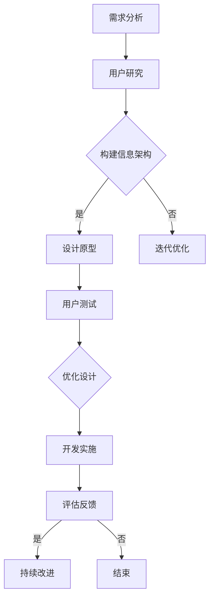

                 

### 引言

在当今数字化时代，用户体验（User Experience, UX）已经成为影响产品成败的关键因素。对于创业公司来说，如何在竞争激烈的市场中脱颖而出，提供卓越的用户体验显得尤为重要。用户体验设计不仅仅是关于界面美观，更是关于用户在产品中的感受和满意度。一个优秀的用户体验设计能够提升用户粘性，增加用户忠诚度，进而推动产品成长和业务拓展。

本文将围绕创业公司的用户体验设计与优化方法进行深入探讨。首先，我们将定义用户体验设计的基础概念，并阐述其在创业公司中的重要性。接着，我们将详细介绍用户研究的方法和技巧，帮助设计团队更好地了解用户需求。然后，我们将探讨用户界面设计的核心原则和技巧，以及如何运用这些原则来提升用户体验。

在核心部分，我们将介绍交互设计技巧和可用性测试与优化策略，以及情感化设计的方法和案例。此外，我们还将讨论用户体验度量与持续改进的方法，帮助创业公司不断优化用户体验。最后，通过实践案例和团队协作方法的介绍，我们将展示如何在实际项目中应用这些设计理念。

通过本文的阅读，读者将能够理解用户体验设计的核心原则和实践方法，掌握优化用户体验的策略和技巧，为创业公司的成功奠定坚实的基础。

### 文章关键词

- 创业公司
- 用户研究
- 用户体验设计
- 交互设计
- 可用性测试
- 情感化设计
- 用户界面设计

### 摘要

本文探讨了创业公司在竞争激烈的市场中如何通过用户体验设计与优化方法提升产品竞争力。文章首先介绍了用户体验设计的核心概念和创业公司中用户体验设计的重要性，然后详细阐述了用户研究的方法和技巧。接下来，文章深入探讨了用户界面设计的原则和技巧，以及交互设计、可用性测试和情感化设计的方法。通过用户体验度量与持续改进策略的介绍，文章帮助创业公司不断提升用户体验。最后，通过实际案例和团队协作方法的讨论，文章展示了如何将理论应用到实际项目中。本文旨在为创业公司提供系统性的用户体验设计指导，帮助其在市场中脱颖而出。

### 第一部分：用户体验设计与基础

#### 第1章：用户体验设计与战略

##### 1.1 用户体验设计的核心概念

用户体验设计（User Experience Design, UXD）是近年来在产品设计和开发中备受关注的一个领域。它不仅仅关注产品的功能性，更注重用户在使用产品过程中的整体感受和满意度。用户体验设计的目标是确保用户在使用产品时能够获得愉悦、高效且满足的体验。

用户体验设计包含多个方面，其中最核心的概念有：

- **用户体验**：指用户在使用产品过程中所感受到的整个体验过程，包括情感、认知、行为等多个维度。
- **用户需求**：指用户在使用产品时所期望获得的功能和解决痛点的需求。
- **用户研究**：通过调研和观察用户行为，了解用户需求和使用习惯，为设计提供依据。
- **用户界面设计**：涉及产品的视觉设计、交互设计和信息架构，旨在提升用户操作的便捷性和体验的愉悦性。

##### 1.2 创业公司用户体验设计的意义

对于创业公司来说，用户体验设计具有重要意义：

- **增强用户粘性**：良好的用户体验可以提升用户的满意度和忠诚度，从而增强用户粘性。
- **提升品牌形象**：优秀的用户体验设计有助于树立品牌形象，增强市场竞争力。
- **推动产品迭代**：通过用户反馈和数据分析，不断优化产品功能和服务，推动产品迭代和升级。
- **降低用户流失率**：如果产品用户体验不佳，用户会更容易转向竞争对手的产品，从而增加用户流失率。

##### 1.3 用户体验设计的流程与模型

用户体验设计是一个系统化的过程，通常包括以下几个关键阶段：

1. **需求分析**：理解用户需求，明确产品目标，制定设计策略。
2. **用户研究**：通过用户访谈、问卷、观察等方法收集用户数据，深入了解用户行为和需求。
3. **概念设计**：基于用户研究，构建产品的信息架构和交互模型，形成初步的设计方案。
4. **原型设计**：创建低保真或高保真的设计原型，进行用户测试和反馈。
5. **迭代优化**：根据用户反馈和数据分析，对设计原型进行优化和改进。
6. **开发与实施**：将设计原型转化为实际的产品，进行开发和测试。
7. **评估与反馈**：通过用户反馈和数据分析，评估产品用户体验，为后续设计提供改进方向。

用户体验设计的流程模型通常采用以下几种：

- **瀑布模型**：将设计流程划分为多个阶段，每个阶段完成后才能进入下一个阶段，适用于需求明确的项目。
- **敏捷模型**：通过快速迭代和持续反馈，不断优化设计，适用于需求变化频繁的项目。
- **双环模型**：结合瀑布模型和敏捷模型的优点，在关键阶段进行评估和调整，确保设计的灵活性和有效性。

通过上述流程和模型，创业公司可以系统地推进用户体验设计工作，确保产品能够满足用户需求，提升用户体验。

### 第2章：用户研究方法

##### 2.1 用户访谈与观察

用户访谈和观察是用户研究中最常用的方法，它们能够帮助设计团队深入了解用户的需求、行为和感受。

- **用户访谈**：
  - **目的**：通过与用户进行面对面的交流，获取关于产品使用情况、需求和心理感受的详细信息。
  - **方法**：半结构化访谈或开放式访谈，根据访谈大纲逐步引导用户回答问题。
  - **技巧**：
    - 开放性问题：鼓励用户表达自己的真实感受和想法。
    - 故事化描述：让用户通过描述自己的经历来展示他们对产品的看法。
    - 注意细节：记录用户的语言、表情和肢体动作，这些都能提供有价值的信息。

- **用户观察**：
  - **目的**：通过观察用户在真实环境中的行为，了解他们在使用产品时的操作习惯和潜在问题。
  - **方法**：现场观察或远程观察，可以结合视频记录和笔记进行数据收集。
  - **技巧**：
    - 客观记录：避免对用户的干扰，保持观察的客观性。
    - 重点关注：关注用户在使用过程中的困难点、操作习惯和偏好。
    - 多角度分析：从不同视角和场景分析用户行为，获取更全面的洞察。

##### 2.2 调查问卷与数据分析

调查问卷和数据分析是用户研究的重要工具，能够以量化的方式获取用户反馈，为设计决策提供依据。

- **调查问卷**：
  - **目的**：通过设计问卷，收集用户对产品功能和体验的反馈。
  - **方法**：在线问卷、纸质问卷或面对面访谈问卷。
  - **技巧**：
    - 设计简洁明了的问题：避免复杂、冗长的问卷，确保用户能够快速理解并回答问题。
    - 选择合适的题型：包括单选题、多选题、评分题和开放性问题，以便获取不同维度的数据。
    - 注意隐私保护：确保问卷匿名性和数据保密性，提高用户的参与度。

- **数据分析**：
  - **目的**：通过对问卷数据的分析，识别用户需求和偏好，为设计优化提供数据支持。
  - **方法**：统计分析、相关性分析和聚类分析等。
  - **技巧**：
    - 数据清洗：去除无效、重复和错误的数据，确保数据分析的准确性。
    - 描述性统计：使用均值、中位数、标准差等统计量描述数据分布。
    - 探索性分析：通过图表和可视化工具，直观展示数据特征和趋势。

##### 2.3 竞争分析

竞争分析是用户研究的重要组成部分，通过分析竞争对手的产品，了解市场现状和用户需求，为创业公司提供设计参考。

- **目的**：识别竞争对手的产品优势和不足，发现市场机会和潜在需求。
- **方法**：产品对比、用户评价分析、市场调研等。
- **技巧**：
  - **全面对比**：从功能、界面、交互、性能等多个维度进行对比。
  - **用户评价分析**：通过用户评论和反馈，了解用户对竞争对手产品的真实感受。
  - **市场调研**：通过市场调查，了解用户对产品的认知和期望，识别市场需求。

通过用户访谈与观察、调查问卷与数据分析以及竞争分析，创业公司可以全面了解用户需求和市场环境，为用户体验设计提供有力的支持。这些研究方法不仅能够帮助设计团队发现用户痛点和需求，还能为后续设计决策提供科学依据，确保产品的竞争力。

### 第3章：用户界面设计

##### 3.1 设计原则与模式

用户界面设计（User Interface Design, UI Design）是用户体验设计的重要组成部分，它直接影响用户对产品的第一印象和操作体验。一个优秀的用户界面设计不仅需要美观，更应具备清晰、简洁和易用的特点。以下是用户界面设计中的核心原则和模式：

- **一致性**：界面设计的一致性有助于用户快速学习和记忆，提升使用体验。包括色彩、字体、图标、按钮样式等方面的一致性。
- **简单性**：界面应尽量简洁，避免过度装饰和复杂布局，使用户能够迅速找到所需功能。通过减少不必要的元素，提升界面的清晰度和易用性。
- **直观性**：界面设计应直观易懂，让用户能够快速理解操作逻辑。通过使用标准的交互元素和布局模式，降低用户的学习成本。
- **反馈**：界面设计应提供及时的反馈，让用户知道他们的操作是否成功。例如，按钮点击后的高亮效果、加载动画等，增强用户的信心。
- **响应速度**：界面响应速度是用户体验的重要指标。优化页面加载速度和操作流畅度，提高用户满意度。
- **信息架构**：合理的信息架构有助于用户快速找到所需信息。通过分类、标签和导航，确保信息的层次性和易访问性。

- **响应式设计**：随着移动设备的普及，响应式设计成为用户界面设计的重要趋势。通过灵活的布局和适配，确保产品在不同设备上的良好表现。

##### 3.2 信息架构与导航

信息架构（Information Architecture, IA）是用户界面设计的核心要素之一，它关注如何组织和管理信息，使信息易于查找和访问。以下是一些关键点：

- **内容分类**：对内容进行清晰的分类，确保用户能够快速定位所需信息。分类应遵循逻辑和用户习惯。
- **导航设计**：设计直观、易用的导航系统，帮助用户在产品中快速浏览和查找信息。常见的导航模式包括顶部导航栏、侧边栏导航和面包屑导航。
- **标签系统**：标签系统有助于用户快速筛选和定位信息。标签应简洁、具有描述性，易于理解和记忆。
- **搜索功能**：提供强大的搜索功能，使用户能够通过关键词快速找到所需信息。优化搜索算法，提高搜索结果的准确性和相关性。

##### 3.3 设计工具与方法

在进行用户界面设计时，设计工具和方法的选择至关重要。以下是一些常用的工具和方法：

- **原型设计工具**：如Sketch、Figma、Adobe XD等，这些工具提供了丰富的设计元素和交互功能，便于快速构建原型。
- **线框图**：线框图是用户界面设计初期的重要工具，通过简单的线条和框图展示界面的布局和交互。它有助于快速传达设计思路，方便讨论和修改。
- **高保真原型**：在完成初步设计后，通过高保真原型进一步细化界面元素和交互效果。高保真原型更加接近最终产品的视觉效果，便于用户测试和反馈。
- **用户测试**：通过用户测试，评估界面设计的易用性和用户满意度。用户测试可以采用问卷调查、用户访谈、观察等方法，收集用户反馈，指导设计优化。
- **反馈与迭代**：设计过程中应持续收集用户反馈，对设计进行迭代优化。通过多次迭代，不断改进用户体验。

通过遵循上述设计原则，采用有效的信息架构与导航方法，并利用合适的设计工具，创业公司可以创建出既美观又实用的用户界面，提升产品的竞争力。

### 第二部分：用户体验设计与优化方法

#### 第4章：交互设计技巧

##### 4.1 交互模型与原则

交互设计是用户体验设计的核心部分，它关注用户与产品之间的交互过程和体验。为了确保交互设计的高效性和用户友好性，以下是一些关键交互模型和原则：

- **交互模型**：
  - **行为模型**：描述用户在产品中的行为路径和交互方式。常见的模型有任务流程图、用户旅程图等。
  - **交互模型**：定义用户与产品之间的交互行为，如点击、滑动、拖拽等。常见的模型有触摸交互模型、语音交互模型等。

- **原则**：
  - **简单性**：交互设计应尽可能简单，避免复杂操作和冗余步骤，降低用户的学习成本。
  - **一致性**：保持界面元素和交互方式的统一性，遵循用户习惯和行业规范，提升用户熟悉度和信任感。
  - **直观性**：设计应直观易懂，用户能够通过视觉和触觉迅速理解操作逻辑和功能。
  - **反馈**：及时、明确的反馈是交互设计的重要原则，通过视觉、声音或动画效果，让用户知道他们的操作是否成功。
  - **灵活性**：交互设计应具备一定的灵活性，允许用户根据个人需求和偏好进行自定义和调整。
  - **高效性**：优化交互流程，减少用户点击和操作次数，提升操作效率和用户体验。

##### 4.2 轮廓图与线框图设计

轮廓图（Wireframes）和线框图（Wireframes）是交互设计初期的关键工具，用于展示界面的布局和交互结构。以下是一些设计技巧：

- **轮廓图**：
  - **用途**：用于快速搭建界面原型，定义主要布局和内容结构。
  - **技巧**：
    - 粗线条表示界面元素，无需过多细节。
    - 重点展示信息架构和导航结构，无需关注视觉设计。
    - 使用不同的线型和颜色区分不同的交互区域。

- **线框图**：
  - **用途**：在轮廓图的基础上，细化界面元素和交互细节。
  - **技巧**：
    - 包括更多细节，如文本内容、按钮样式、图标等。
    - 使用标准交互元素，如按钮、输入框、菜单等，确保一致性。
    - 结合用户测试和反馈，不断迭代和优化。

##### 4.3 交互原型设计与验证

交互原型设计是将线框图转化为可交互的原型，以便进行用户测试和验证。以下是一些关键步骤：

- **设计步骤**：
  - **定义目标**：明确设计目标和用户需求，确保原型符合设计原则。
  - **创建线框图**：根据需求和分析结果，绘制初步的线框图。
  - **细化设计**：结合用户反馈，逐步完善界面元素和交互细节。
  - **添加交互**：在原型工具中添加交互效果，如点击、滑动、拖拽等。
  - **用户测试**：进行用户测试，收集反馈，识别问题和改进点。

- **验证方法**：
  - **用户测试**：通过实际用户操作原型，观察他们的行为和反应，收集反馈。
  - **A/B测试**：通过对比不同设计的用户行为和满意度，确定最佳设计方案。
  - **数据分析**：结合用户行为数据，分析用户路径、操作频率等指标，评估交互设计的有效性。

通过遵循交互模型与原则，进行轮廓图和线框图设计，以及交互原型设计与验证，创业公司可以确保交互设计的有效性，提升用户体验。

#### 第5章：可用性测试与优化

##### 5.1 可用性测试的目的与方法

可用性测试（Usability Testing）是评估产品易用性和用户体验的重要手段。通过模拟实际用户的使用场景，测试团队可以识别产品中的问题和不足，并提出改进建议。以下为可用性测试的主要目的和方法：

- **目的**：
  - **评估易用性**：测试用户在使用产品时的操作流畅度和满意度，评估产品的易用性。
  - **发现设计问题**：通过观察用户的行为，识别界面设计、交互逻辑、信息架构等方面的问题。
  - **收集用户反馈**：获取用户对产品的真实感受和建议，为设计优化提供依据。
  - **验证设计决策**：通过对比不同设计方案的测试结果，验证设计决策的有效性。

- **方法**：
  - **任务测试**：用户在测试人员的指导下完成一系列预设任务，观察他们的操作步骤和表现。通过记录用户的操作时间、错误率、满意度等指标，评估产品的易用性。
  - **认知测试**：通过测试用户的认知过程，如识别、理解、记忆等，评估产品信息的可访问性和易理解性。
  - **情境测试**：将用户置于模拟的真实使用环境中，观察他们在实际情境下的行为和反应，更真实地反映产品的使用体验。
  - **远程测试**：通过网络远程进行测试，无需面对面交流，适用于地理分布广泛的用户群体。

##### 5.2 测试结果分析

分析可用性测试结果对于设计优化至关重要。以下是一些关键步骤：

- **数据整理**：
  - **记录测试过程**：详细记录用户的操作步骤、错误和反馈，确保数据完整。
  - **分类整理**：根据测试目的和问题类型，将数据分类整理，便于分析。

- **问题识别**：
  - **操作错误**：分析用户在完成任务时的错误类型和频率，识别界面和交互设计中的问题。
  - **操作效率**：评估用户完成任务所需的时间，识别界面设计和操作流程的瓶颈。
  - **用户满意度**：通过用户反馈问卷和访谈，了解他们对产品易用性和用户体验的满意度。

- **原因分析**：
  - **界面问题**：分析界面布局、导航、图标等设计元素，找出可能导致问题的原因。
  - **交互逻辑**：评估交互逻辑和操作流程的合理性，找出用户操作不便的原因。
  - **信息架构**：分析信息架构和内容组织，找出信息难以访问和理解的原因。

- **优化建议**：
  - **界面调整**：根据分析结果，对界面布局、颜色、字体等元素进行优化。
  - **交互改进**：调整交互逻辑和操作流程，简化用户操作步骤。
  - **信息优化**：优化信息架构和内容组织，确保信息的清晰、易访问。

##### 5.3 优化策略与实践

基于可用性测试结果，设计团队可以制定详细的优化策略，并实施具体的改进措施：

- **迭代优化**：
  - **快速迭代**：通过多次迭代，不断优化设计，确保改进措施的有效性。
  - **持续反馈**：建立用户反馈机制，持续收集用户意见，及时调整设计。

- **A/B测试**：
  - **设计对比**：针对不同的设计方案，进行A/B测试，评估用户偏好和效果。
  - **数据驱动**：通过测试数据，确定最佳设计方案，优化用户体验。

- **用户参与**：
  - **邀请用户参与**：在优化过程中邀请用户参与测试和反馈，确保设计的用户导向性。
  - **用户访谈**：定期与用户进行深度访谈，了解他们对产品的真实需求和期望。

通过以上策略和实践，创业公司可以不断优化产品用户体验，提升产品的易用性和用户满意度。

### 第6章：情感化设计

##### 6.1 情感化设计的概念与原则

情感化设计（Emotional Design）是用户体验设计中的重要分支，它关注如何通过设计激发用户的情感共鸣，提升产品的吸引力和用户满意度。情感化设计的核心在于理解用户的情感需求，并将其融入产品设计中。以下是情感化设计的概念与原则：

- **概念**：
  - **情感化设计**：通过视觉、交互、内容等多方面设计元素，激发用户的情感反应，提升用户体验。
  - **情感层次**：情感化设计不仅关注表层情感，如愉悦、满意，更深入探讨用户的深层情感需求，如信任、归属感、自豪等。

- **原则**：
  - **触发情感共鸣**：设计应触动用户的情感，引发共鸣，使产品与用户产生情感连接。
  - **符合用户期望**：设计应符合用户的情感期望，确保产品的功能、外观和交互能够满足用户的心理需求。
  - **体现品牌个性**：设计应体现品牌个性，通过视觉和交互风格，塑造独特的品牌形象。
  - **优化情感体验**：设计应优化用户的情感体验，确保用户在使用产品过程中能够感受到愉悦和满足。
  - **提升信任和安全感**：通过设计细节，增强用户对产品的信任和安全感，提升用户忠诚度。

##### 6.2 情感化设计的实践方法

情感化设计的实践方法涉及多个层面，包括视觉设计、交互设计和内容设计。以下是一些具体方法：

- **视觉设计**：
  - **色彩与形状**：选择能够引起情感共鸣的色彩和形状，如温馨的色调、柔和的线条等，创造愉悦的视觉体验。
  - **视觉层次**：通过视觉层次感，如对比、阴影、纹理等，增强视觉吸引力，提升用户体验。
  - **图标与符号**：使用简洁、易懂的图标和符号，减少用户的学习成本，提升情感共鸣。

- **交互设计**：
  - **反馈机制**：设计及时、明确的反馈机制，如声音、动画、图标等，让用户知道操作结果，增强用户信心。
  - **情感引导**：通过交互设计，如按钮颜色、动画效果等，引导用户情感走向，提升用户满意度。
  - **情感故事**：将情感元素融入产品故事中，如通过故事、案例等，增强用户的情感连接。

- **内容设计**：
  - **情感化文本**：使用富有情感色彩的文本，如温馨、鼓舞人心的语句，提升用户阅读体验。
  - **情境内容**：根据用户情境设计内容，如提供个性化的推荐、提醒等，满足用户的情感需求。
  - **互动性**：通过互动内容，如评论、点赞等，增强用户参与感，提升情感体验。

##### 6.3 情感化设计的案例分析

以下是一个情感化设计的案例：

- **案例**：某个社交平台的个人主页设计
  - **视觉设计**：采用柔和的色调和简洁的图标，创造温馨、舒适的视觉体验。背景图片使用用户上传的照片，增强个人归属感。
  - **交互设计**：在用户发布动态时，采用动态动画效果，增强用户的操作乐趣。点击图片和视频时，提供放大和滑动查看功能，提升用户体验。
  - **内容设计**：文本内容强调个人情感和故事，鼓励用户分享生活中的点滴。通过点赞、评论等互动功能，增强用户之间的情感连接。

通过以上设计，该社交平台成功提升了用户的情感共鸣和参与度，增加了用户粘性。

通过情感化设计，创业公司可以提升产品的情感价值，增强用户的情感连接，从而提高用户满意度和忠诚度。情感化设计不仅关注功能性和易用性，更深入挖掘用户的情感需求，创造独特的用户体验。

#### 第7章：用户体验度量与持续改进

##### 7.1 用户满意度度量

用户满意度是衡量用户体验质量的重要指标，通过用户满意度度量，创业公司可以了解用户对产品的整体感受和满意度，从而指导设计优化和业务决策。以下是一些常用的用户满意度度量方法：

- **问卷调查**：通过在线或离线问卷，收集用户对产品各个方面的评价。常用的满意度度量方法包括单一题项法、多题项法、评分量表法等。
  - **单一题项法**：通常以一个简短的问题询问用户对产品的总体满意度，如“您对产品的满意度如何？”。
  - **多题项法**：通过多个问题从不同维度评估用户满意度，如“您对产品的功能满意吗？”“您对产品的界面设计满意吗？”。
  - **评分量表法**：提供一系列评分选项，如1-5分或1-10分，让用户对各个维度进行评分，便于量化分析。

- **用户访谈**：通过深度访谈，了解用户对产品的真实感受和具体建议。访谈问题可以涵盖用户满意度、使用体验、改进建议等方面。
  - **开放式问题**：鼓励用户自由表达对产品的感受和想法，获取详细和深入的反馈。
  - **封闭式问题**：提供预设的答案选项，便于分类和分析。

- **NPS（Net Promoter Score）**：通过询问用户“您认为我们有多大可能性向他人推荐这款产品？”来评估用户的忠诚度和满意度。NPS的计算公式为：NPS = %积极评分用户 - %中立或负面评分用户。

##### 7.2 用户体验度量指标

用户体验度量指标是评估产品易用性、满意度和忠诚度的重要工具。以下是一些常用的用户体验度量指标：

- **任务完成率**：用户在完成特定任务时的成功率，反映产品的易用性和操作流畅度。
  - **计算公式**：任务完成率 = （成功完成任务的用户数 / 总用户数）× 100%。

- **错误率**：用户在操作过程中犯错的频率，反映产品的易用性和用户界面设计问题。
  - **计算公式**：错误率 = （犯错的用户数 / 总用户数）× 100%。

- **操作时间**：用户完成特定任务所需的时间，反映产品的操作效率和用户体验。
  - **计算公式**：平均操作时间 = （总操作时间 / 完成任务的用户数）。

- **用户流失率**：在一定时间内，用户停止使用产品的比例，反映产品的用户满意度和粘性。
  - **计算公式**：用户流失率 = （流失用户数 / 总用户数）× 100%。

- **用户参与度**：用户在产品中的活跃度和互动程度，反映产品的吸引力和用户满意度。
  - **计算公式**：用户参与度 = （活跃用户数 / 总用户数）× 100%。

- **用户满意度**：用户对产品的总体满意程度，通过问卷调查、NPS等方法进行度量。
  - **计算公式**：用户满意度 = （满意用户数 / 总用户数）× 100%。

##### 7.3 持续改进策略

用户体验度量与持续改进是创业公司提升产品竞争力的关键。以下是一些持续改进的策略：

- **定期评估**：定期进行用户体验评估，包括问卷调查、用户访谈、可用性测试等，了解用户需求和市场变化。
- **A/B测试**：通过A/B测试，对比不同设计方案的用户体验效果，确定最佳设计方案。
- **用户反馈机制**：建立用户反馈机制，鼓励用户提交意见和建议，及时收集用户反馈，快速响应和改进。
- **迭代优化**：通过快速迭代，不断优化产品设计，根据用户反馈和数据分析，持续改进用户体验。
- **跨部门协作**：建立跨部门协作机制，包括产品、设计、开发、市场等团队，共同关注用户体验，确保设计决策和实施的一致性。
- **培训与分享**：定期举办用户体验培训，提升团队成员的用户体验意识，分享最佳实践和成功案例，提升整体设计水平。

通过用户满意度度量、用户体验度量指标和持续改进策略，创业公司可以不断优化产品用户体验，提升用户满意度和忠诚度，从而在竞争激烈的市场中脱颖而出。

### 第8章：创业公司用户体验设计实践

##### 8.1 实践案例介绍

本节将分享一家创业公司在用户体验设计方面的实践案例，该公司是一家专注于移动办公解决方案的初创公司。其产品是一款集文档处理、项目管理、团队协作功能于一体的办公应用。以下为案例介绍：

- **背景**：该创业公司成立初期，产品功能相对简单，但用户反馈普遍反映操作复杂、界面不够直观。为了提升用户体验，公司决定进行全面的设计优化。
- **目标**：通过用户体验设计，简化产品操作流程，提升界面美观度，增强用户粘性和满意度，从而推动产品市场占有率的提升。
- **过程**：公司采用了一系列用户体验设计方法和工具，包括用户访谈、问卷调查、线框图设计、原型验证、用户测试等。

##### 8.2 设计流程与执行

以下是该创业公司的设计流程和执行步骤：

1. **需求分析**：
   - **用户访谈**：公司通过面对面访谈，深入了解用户对产品功能、操作流程和界面设计的具体需求和期望。
   - **问卷调查**：通过在线问卷，收集更多用户的反馈意见，全面了解用户需求。
   - **数据分析**：综合用户访谈和问卷数据，分析用户痛点和需求，明确设计方向。

2. **概念设计**：
   - **信息架构**：根据用户需求，重构产品的信息架构，优化导航和内容布局。
   - **交互模型**：设计简洁直观的交互模型，确保用户能够快速完成任务。
   - **线框图**：绘制低/高保真线框图，展示界面布局和交互设计。

3. **原型验证**：
   - **原型设计**：使用Figma等原型设计工具，创建高保真原型，模拟实际操作流程。
   - **用户测试**：邀请用户参与测试，收集他们对原型的反馈和意见。
   - **迭代优化**：根据用户测试结果，对原型进行多次迭代和优化。

4. **设计实施**：
   - **UI设计**：根据优化后的原型，进行视觉设计，确保界面美观度和一致性。
   - **开发协作**：与开发团队紧密协作，确保设计能够高效地转化为实际产品。
   - **测试与上线**：进行全面的测试，确保产品功能的稳定性和用户体验的一致性，然后正式上线。

##### 8.3 成功与挑战

以下是该创业公司在用户体验设计实践中的成功经验和面临的挑战：

- **成功经验**：
  - **用户导向**：始终以用户需求为导向，通过多渠道收集用户反馈，确保设计符合用户期望。
  - **快速迭代**：采用快速迭代的方法，确保设计能够及时响应市场变化和用户需求。
  - **团队合作**：跨部门协作，特别是设计与开发团队的紧密配合，确保设计高效落地。

- **挑战**：
  - **资源限制**：创业公司通常面临资源限制，需要在有限的资源下进行高质量的设计和开发。
  - **时间压力**：快速发展的市场环境要求产品尽快推出，时间压力较大，需要在短时间内完成设计和测试。
  - **用户多样性**：用户需求的多样性使得设计难以兼顾所有用户，需要找到平衡点。

通过这一实践案例，创业公司不仅提升了产品的用户体验，还增强了用户满意度和忠诚度，为产品市场占有率的提升奠定了坚实基础。同时，公司也积累了宝贵的用户体验设计经验，为未来的产品设计提供了参考。

### 第9章：用户体验设计与创新

##### 9.1 设计思维与创新方法

设计思维（Design Thinking）是一种以用户为中心的创新方法，强调通过同理心、定义问题、构思解决方案、原型验证和迭代优化等步骤，解决复杂问题并创造卓越的用户体验。以下为设计思维的核心步骤和创新方法：

- **同理心**：通过深入了解用户的需求、动机和行为，建立对用户的深刻理解。这包括用户访谈、观察、问卷调查等方法，帮助设计团队站在用户的角度思考问题。
- **定义问题**：在理解用户需求的基础上，明确需要解决的问题和目标。通过问题定义，将抽象的需求转化为具体的设计问题，为后续设计提供方向。
- **构思解决方案**：在定义问题后，团队通过头脑风暴、思维导图、用户旅程图等方法，构思多种可能的解决方案。这一阶段鼓励开放思维，不拘泥于传统解决方案。
- **原型验证**：将构思的解决方案转化为可交互的原型，进行用户测试和验证。通过原型验证，收集用户反馈，识别问题和改进点。
- **迭代优化**：根据用户反馈，对原型进行多次迭代和优化，确保解决方案的有效性和可行性。迭代过程中，持续关注用户需求和市场变化，确保设计始终与用户需求保持一致。

##### 9.2 创新实践与案例

以下是一个设计思维创新实践的案例：

- **背景**：某创业公司开发了一款在线教育平台，但用户反馈指出，学习过程过于枯燥，缺乏互动和激励。为了提升用户体验，公司决定采用设计思维方法进行创新。
- **过程**：
  - **同理心**：公司通过用户访谈和问卷调查，了解到用户希望学习过程更有趣、更有挑战性，同时也希望有其他用户的支持和激励。
  - **定义问题**：公司将问题定义为“如何通过创新设计，提升在线教育的趣味性和互动性？”
  - **构思解决方案**：团队通过头脑风暴和用户旅程图，提出了多种解决方案，包括引入游戏化元素、实时互动课堂、社交功能等。
  - **原型验证**：公司创建了多个原型，如游戏化学习模块、互动课堂和社交社区，邀请用户进行测试和反馈。
  - **迭代优化**：根据用户反馈，公司对原型进行了多次迭代，优化了学习模块的趣味性和互动性，增强了用户间的社交互动。

- **结果**：通过设计思维的创新实践，公司成功提升了在线教育的用户体验，用户活跃度和满意度显著提升，产品市场占有率也实现了显著增长。

##### 9.3 创新策略与趋势

用户体验设计领域的创新策略和趋势不断发展，以下是一些关键趋势：

- **用户体验优先**：随着用户需求的多样化，用户体验成为设计的重要焦点。设计团队应始终关注用户需求，将用户体验置于设计核心。
- **智能化与个性化**：随着人工智能和大数据技术的发展，个性化推荐和智能化交互成为趋势。通过分析用户行为和偏好，设计更加符合用户需求的产品。
- **可持续设计**：环保和社会责任成为设计的重要考量因素。通过采用可持续设计原则，如减少资源消耗、优化回收利用等，提升产品的可持续性。
- **多感官体验**：通过结合视觉、听觉、触觉等多感官元素，提升用户的整体体验。例如，采用触觉反馈、动态音效等，增强互动性和沉浸感。
- **虚拟现实（VR）与增强现实（AR）**：VR和AR技术的应用，为用户体验设计带来了新的可能性。通过虚拟现实和增强现实技术，创造更加沉浸和互动的体验环境。

通过设计思维和创新方法，创业公司可以不断提升用户体验，满足用户需求，保持市场竞争力。同时，关注用户体验设计的创新趋势，有助于公司走在行业前沿，引领市场发展。

### 第10章：用户体验设计与团队协作

##### 10.1 团队协作的重要性

用户体验设计（UXD）的成功离不开团队成员之间的紧密协作。在创业公司中，资源有限，团队成员往往需要承担多种角色和任务，因此，高效的团队协作至关重要。以下为团队协作在用户体验设计中的重要性：

- **多学科合作**：用户体验设计涉及多个学科，包括设计、开发、市场、产品等。只有通过跨学科合作，才能确保设计方案的全面性和可行性。
- **信息共享**：良好的团队协作有助于信息在团队成员之间高效传递和共享，确保每个成员都能了解项目的最新进展和用户需求。
- **共同目标**：团队协作有助于建立共同的目标和愿景，确保所有成员朝着同一方向努力，提升项目的整体效果。
- **快速响应**：在面对市场需求变化和用户反馈时，高效的团队协作能够快速响应和调整，确保设计方案能够及时满足用户需求。
- **持续改进**：通过团队协作，设计团队可以持续收集用户反馈和业务数据，不断优化产品设计，提升用户体验。

##### 10.2 设计团队的沟通与合作

为了实现高效的团队协作，设计团队需要建立良好的沟通与合作机制。以下是一些建议：

- **定期的团队会议**：定期召开团队会议，包括设计评审会、进度汇报会和用户反馈会等，确保团队成员之间的沟通和协作。
- **明确职责和任务分配**：在项目开始时，明确每个团队成员的职责和任务，确保工作分配合理，避免重复劳动和资源浪费。
- **信息共享平台**：使用项目管理工具和共享平台，如JIRA、Trello等，记录和共享项目进展、任务分配、设计文档等，确保团队成员能够随时查阅和更新信息。
- **用户反馈机制**：建立用户反馈机制，确保用户的声音能够快速传递到团队，指导设计优化。
- **跨部门协作**：与产品、开发、市场等部门保持密切沟通，确保设计方案符合整体业务目标和用户需求。

##### 10.3 团队协作工具与实践

以下是一些常用的团队协作工具和实践方法：

- **项目管理工具**：如JIRA、Trello、Asana等，用于任务分配、进度跟踪和协作管理。
- **设计评审工具**：如Figma、InVision、Adobe XD等，用于原型设计、协作评审和反馈收集。
- **文档协作工具**：如Google Docs、Confluence等，用于设计文档、用户手册和业务流程的协作编写。
- **视频会议工具**：如Zoom、Microsoft Teams、Google Meet等，用于远程会议和实时沟通。
- **敏捷开发方法**：采用敏捷开发方法，如Scrum和Kanban，确保团队成员能够快速响应变化和持续改进。

通过有效的团队协作工具和实践方法，设计团队能够高效协作，确保用户体验设计的顺利进行。同时，良好的团队协作也有助于提升团队凝聚力，增强团队成员的归属感和工作满意度。

### 附录：资源与工具

在用户体验设计过程中，掌握合适的资源和工具至关重要。以下是一些推荐的资源和工具，涵盖了设计文档、设计工具和书籍等，帮助设计团队提升工作效率和设计质量。

#### 附录1：用户体验设计资源

- **用户研究工具**：
  - UserTesting：在线用户测试平台，提供真实用户反馈。
  - UsabilityHub：提供快速、简便的用户测试工具。
  - SurveyMonkey：强大的在线调查工具，帮助收集用户反馈。

- **设计文档模板**：
  - Sketch Templates：提供多种Sketch模板，用于创建UI界面。
  - Figma Community：Figma模板库，包括线框图、原型图等。
  - Adobe XD Templates：Adobe XD模板库，涵盖多种设计风格。

- **用户体验度量工具**：
  - Google Analytics：分析用户行为和网站性能的强大工具。
  - Hotjar：提供用户行为跟踪和热图分析。
  - Qualtrics：专业的调查和用户体验分析工具。

#### 附录2：设计工具与软件

- **原型设计工具**：
  - Figma：流行的协作式界面设计工具，支持实时协作。
  - Sketch：专业设计师常用的UI设计工具，支持矢量图形编辑。
  - Adobe XD：适合设计师和开发者的跨平台原型设计工具。

- **用户体验测试工具**：
  - Maze：集成式用户体验测试平台，提供A/B测试和点击热图功能。
  - UserTesting：提供远程用户测试服务，获取真实用户反馈。
  - Loop11：简单的用户体验测试工具，快速收集用户行为数据。

- **项目管理工具**：
  - JIRA：强大的敏捷项目管理工具，支持任务跟踪和团队协作。
  - Trello：简洁易用的任务管理工具，适用于小型团队。
  - Asana：灵活的项目管理平台，支持任务分配和进度跟踪。

#### 附录3：参考资料与推荐阅读

- **书籍**：
  - 《设计思维》：David Kelly著，介绍设计思维方法及其应用。
  - 《用户体验要素》：唐纳德·诺曼著，深入探讨用户体验设计的核心原则。
  - 《点石成金》：Steve Krug著，介绍Web用户体验设计的实践方法和技巧。

- **在线课程与教程**：
  - Coursera：提供多个用户体验设计相关的在线课程。
  - Udemy：涵盖用户体验设计的基础知识和高级技巧。
  - Interaction Design Foundation：提供免费和付费的用户体验设计课程。

通过使用这些资源和工具，用户体验设计团队可以更好地开展工作，提升设计质量和效率，为创业公司创造卓越的用户体验。

### 附录：用户体验设计流程图

以下是一个用户体验设计流程图的Mermaid语法示例：



这个流程图展示了用户体验设计的基本流程，从需求分析开始，经过用户研究、信息架构构建、设计原型、用户测试、优化设计、开发实施和评估反馈，最终进入持续改进阶段。通过这个流程图，设计团队能够清晰地了解设计的每个阶段和关键任务，确保项目的顺利进行。

### 附录：交互设计技巧伪代码

以下是一个交互设计技巧的伪代码示例，用于实现一个基本的用户点击按钮后的反馈功能：

```python
# 定义按钮点击事件
def button_click():
    # 按钮默认状态
    button_state = "默认"

    # 用户点击按钮
    user_click = True

    # 判断用户是否点击按钮
    if user_click:
        # 更改按钮状态
        button_state = "按下"

        # 显示按钮按下动画
        show_button_animation()

        # 提供视觉和/或声音反馈
        provide_feedback()

    # 回复按钮至默认状态
    button_state = "默认"

# 显示按钮按下动画
def show_button_animation():
    # 动画实现细节，例如淡入淡出效果
    print("按钮动画：淡入淡出效果")

# 提供视觉和/或声音反馈
def provide_feedback():
    # 视觉反馈，例如高亮显示按钮
    print("视觉反馈：按钮高亮显示")

    # 声音反馈，例如点击音效
    print("声音反馈：点击音效")
```

这个伪代码展示了交互设计中的基本步骤：首先定义按钮点击事件，然后根据用户点击行为，执行动画展示和反馈功能，最后将按钮状态恢复至默认。通过这种方式，可以确保用户在操作过程中能够获得及时和明确的反馈，提升用户体验。

### 附录：可用性测试与优化数学模型

以下是一个可用性测试与优化的数学模型，用于评估产品设计的用户体验：

```latex
\documentclass{article}
\usepackage{amsmath}
\begin{document}

\section*{可用性测试与优化数学模型}

\subsection*{1. 用户满意度模型}

用户满意度（\(S\)）可以通过以下公式计算：

\[ S = \frac{1}{N} \sum_{i=1}^{N} \left( \frac{X_i}{T_i} \right) \]

其中，\(N\) 是用户总数，\(X_i\) 是第 \(i\) 个用户的满意度评分，\(T_i\) 是第 \(i\) 个用户所花费的时间。

\subsection*{2. 任务完成率模型}

任务完成率（\(C\)）可以通过以下公式计算：

\[ C = \frac{M}{N} \]

其中，\(M\) 是成功完成任务的用户数，\(N\) 是参与测试的总用户数。

\subsection*{3. 错误率模型}

错误率（\(E\)）可以通过以下公式计算：

\[ E = \frac{F}{N} \]

其中，\(F\) 是犯错的用户数，\(N\) 是参与测试的总用户数。

\subsection*{4. 操作时间模型}

平均操作时间（\(T_{avg}\)）可以通过以下公式计算：

\[ T_{avg} = \frac{1}{N} \sum_{i=1}^{N} T_i \]

其中，\(T_i\) 是第 \(i\) 个用户完成任务所需的时间，\(N\) 是参与测试的总用户数。

\end{document}
```

这些数学模型可以帮助设计团队量化评估用户体验，通过数据分析和优化策略，不断提升产品的易用性和用户满意度。通过这些模型，创业公司能够更科学地进行设计决策和调整。

### 附录：项目实战案例代码与解读

在本附录中，我们将通过一个实际的项目案例来展示用户体验设计的全过程。该项目是一个简单的移动应用，旨在提供天气预报服务。以下包括项目开发环境搭建、源代码实现和详细代码解读。

#### 开发环境搭建

1. **工具安装**：
   - 安装Android Studio，用于开发Android应用。
   - 安装Git，用于版本控制和代码管理。

2. **创建新项目**：
   - 打开Android Studio，创建一个新的Android项目。
   - 选择“Empty Activity”模板，为项目命名并设置其他基本配置。

3. **依赖库**：
   - 在`build.gradle`文件中添加网络请求库（例如Retrofit）和JSON解析库（例如Gson）。

#### 源代码实现

以下是项目的核心代码：

```java
// MainActivity.java

import android.os.Bundle;
import androidx.appcompat.app.AppCompatActivity;
import retrofit2.Call;
import retrofit2.Callback;
import retrofit2.Response;
import retrofit2.Retrofit;
import retrofit2.converter.gson.GsonConverterFactory;

public class MainActivity extends AppCompatActivity {

    @Override
    protected void onCreate(Bundle savedInstanceState) {
        super.onCreate(savedInstanceState);
        setContentView(R.layout.activity_main);

        // 初始化Retrofit客户端
        Retrofit retrofit = new Retrofit.Builder()
                .baseUrl("https://api.openweathermap.org/")
                .addConverterFactory(GsonConverterFactory.create())
                .build();

        // 创建接口实例
        OpenWeatherMapService service = retrofit.create(OpenWeatherMapService.class);

        // 发送请求
        service.getWeatherData("London", "metric", "your_api_key").enqueue(new Callback<WeatherResponse>() {
            @Override
            public void onResponse(Call<WeatherResponse> call, Response<WeatherResponse> response) {
                if (response.isSuccessful()) {
                    // 处理返回的数据
                    WeatherResponse weatherResponse = response.body();
                    updateUI(weatherResponse);
                } else {
                    // 处理请求失败
                    // 提示用户
                }
            }

            @Override
            public void onFailure(Call<WeatherResponse> call, Throwable t) {
                // 处理请求失败
                // 提示用户
            }
        });
    }

    private void updateUI(WeatherResponse weatherResponse) {
        // 更新UI显示天气信息
        // 例如在TextView中显示温度、天气描述等
    }
}

// OpenWeatherMapService.java

import retrofit2.Retrofit;
import retrofit2.http.GET;
import retrofit2.http.Query;

public interface OpenWeatherMapService {
    @GET("data/2.5/weather")
    Call<WeatherResponse> getWeatherData(
            @Query("q") String city,
            @Query("units") String units,
            @Query("appid") String apiKey
    );
}

// WeatherResponse.java

import com.google.gson.annotations.SerializedName;

public class WeatherResponse {
    @SerializedName("weather")
    private List<Weather> weatherList;
    
    @SerializedName("main")
    private Main main;

    // Getters and setters for weatherList and main
}
```

#### 代码解读

1. **Retrofit客户端初始化**：
   - 使用Retrofit创建一个客户端实例，指定API端点和Gson作为数据转换器。

2. **接口定义**：
   - 定义一个接口`OpenWeatherMapService`，包含一个GET请求方法，用于获取城市天气数据。

3. **发送网络请求**：
   - 调用接口实例的方法，发送GET请求获取天气数据。这里使用了`enqueue`方法，异步处理响应。

4. **UI更新**：
   - 在响应成功时，调用`updateUI`方法，更新UI显示天气信息。

#### 代码分析

- **模块化设计**：代码将网络请求、接口定义和UI更新分别处理，模块化设计有助于代码的维护和扩展。
- **异步处理**：使用Retrofit的异步方法，避免主线程阻塞，提升应用性能。
- **灵活性与可扩展性**：通过定义接口和Retrofit客户端，可以方便地添加或更换天气API，提升代码的灵活性。

通过这个实际项目案例，读者可以了解到用户体验设计在软件开发中的具体应用，包括网络请求处理、数据解析和UI更新等关键环节。代码分析和解读有助于深化对用户体验设计实践的理解，为后续项目开发提供参考。

