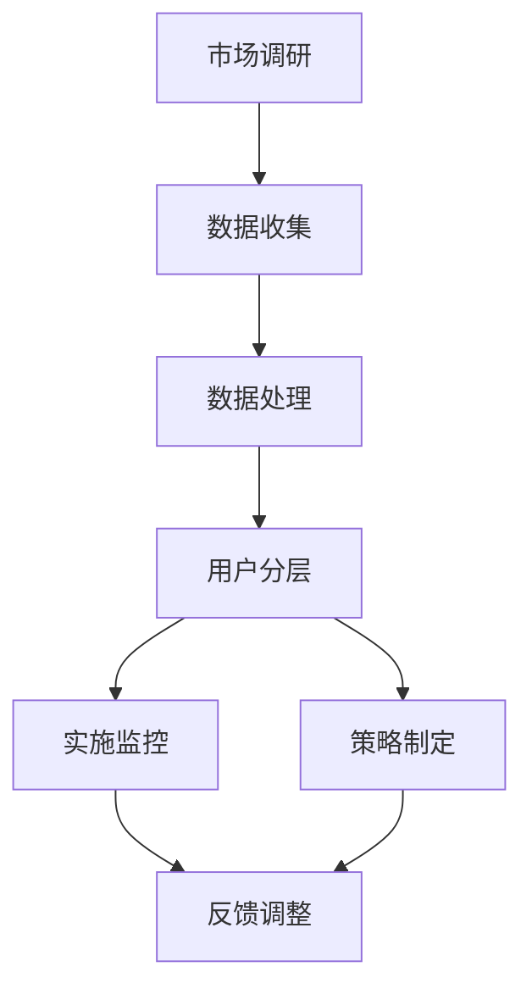
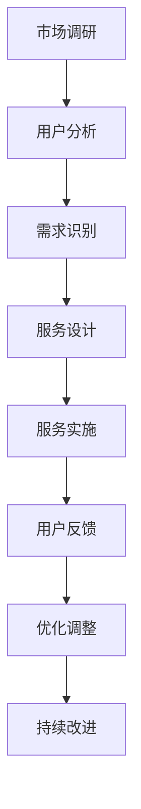

                 

### 《创业公司的用户分层策略与差异化服务》

#### 关键词：
- 创业公司
- 用户分层策略
- 差异化服务
- 市场细分
- 数据驱动决策
- 客户体验优化

#### 摘要：
本文深入探讨了创业公司在竞争激烈的市场环境中，如何通过用户分层策略和差异化服务来提升市场竞争力和客户满意度。文章首先分析了创业公司的市场环境，接着介绍了用户分层策略和差异化服务的理论基础、方法及其实施策略。通过案例研究和实践，文章详细阐述了如何运营和管理差异化服务，以及未来创业公司用户分层与差异化服务的发展趋势。本文旨在为创业公司提供一套系统性、可操作的实践指南，助力其实现可持续发展。

## 引言与背景

创业公司在面对市场环境的挑战时，必须寻找有效的策略来提升竞争力。其中，用户分层策略和差异化服务是两大关键策略，能够帮助创业公司更好地理解客户需求，优化资源配置，提升客户满意度，从而在激烈的市场竞争中脱颖而出。

### 1.1 创业公司的市场环境分析

创业公司的市场环境具有高度的不确定性和竞争性。新兴技术和市场需求的快速变化，要求创业公司具备快速响应市场变化的能力。此外，市场竞争日益激烈，创业公司需要找到独特的市场定位和竞争优势。在这个背景下，用户分层策略和差异化服务显得尤为重要。

用户分层策略可以帮助创业公司识别不同类型的用户，根据用户的需求和行为特点，提供个性化的产品和服务。差异化服务则能够使创业公司提供独特的价值，满足不同层次用户的需求，从而提高客户满意度和忠诚度。

### 1.2 用户分层策略的重要性

用户分层策略是一种基于数据分析和市场细分的方法，它能够将用户划分为不同的群体，以便于创业公司有针对性地进行产品和服务的设计与推广。用户分层策略的重要性主要体现在以下几个方面：

1. **精准定位用户需求**：通过用户分层，创业公司可以深入了解不同类型用户的需求和行为特点，从而制定更加精准的市场营销策略。
2. **优化资源配置**：用户分层有助于创业公司根据用户价值进行资源分配，确保有限的资源能够得到最有效的利用。
3. **提升客户满意度**：通过提供个性化的产品和服务，创业公司能够满足不同层次用户的需求，从而提高客户满意度和忠诚度。
4. **增强市场竞争力**：用户分层和差异化服务使得创业公司能够提供独特的价值，从而在激烈的市场竞争中脱颖而出。

### 1.3 差异化服务的价值与挑战

差异化服务是一种通过提供独特的产品和服务来满足不同用户需求的方法。其价值在于：

1. **提高客户忠诚度**：差异化服务能够满足客户的特定需求，从而提高客户的满意度和忠诚度。
2. **增加产品附加值**：通过提供独特的服务，创业公司可以增加产品的附加值，从而提高产品的竞争力。
3. **扩大市场份额**：差异化服务能够吸引更多的用户，从而扩大市场份额。

然而，差异化服务也面临着一些挑战：

1. **高成本**：提供差异化服务通常需要较高的投入，包括资源、人力和资金。
2. **市场竞争**：市场上已经存在许多提供差异化服务的企业，创业公司需要找到独特的差异化点。
3. **客户满意度**：差异化服务需要确保客户满意度，否则可能导致客户流失。

### 1.4 书籍概述与结构

本书将从以下五个部分深入探讨创业公司的用户分层策略与差异化服务：

- **第一部分：引言与背景**：介绍创业公司的市场环境，用户分层策略和差异化服务的必要性。
- **第二部分：用户分层的理论基础**：讨论用户分层的定义、分类、理论基础、市场细分与用户画像、用户行为分析与数据收集。
- **第三部分：用户分层策略**：介绍用户分层的方法、实施策略以及案例分析。
- **第四部分：差异化服务策略**：讨论差异化服务的定义、设计方法、实施步骤以及案例分析。
- **第五部分：差异化服务的实践与优化**：探讨差异化服务的运营管理、案例研究以及未来发展。

通过这本书，读者将了解到如何通过用户分层策略和差异化服务来提升创业公司的市场竞争力和客户满意度，从而实现可持续发展。

### 用户分层的理论基础

用户分层策略是创业公司制定有效市场营销策略的重要工具。它通过将用户划分为不同的群体，使企业能够更好地理解用户需求，进行资源优化和市场营销。在这一部分，我们将深入探讨用户分层的定义、分类、理论基础，以及市场细分与用户画像的相关概念。

#### 2.1 用户分层的定义与分类

**用户分层**是一种基于数据分析的方法，它通过将用户群体划分为不同的层级，以便于企业针对每个层级制定个性化的产品和服务策略。用户分层可以基于多种维度，如人口统计学、行为特征、价值贡献等。

- **人口统计学分层**：基于用户的年龄、性别、地理位置、教育水平、职业等人口统计学特征进行分层。这种方法有助于企业识别不同类型的用户群体，以便进行有针对性的市场营销。
- **行为特征分层**：基于用户的行为特征，如购买行为、使用频率、停留时间、互动行为等。这种方法能够帮助企业了解用户的消费习惯和偏好，从而提供更加个性化的服务。
- **价值贡献分层**：基于用户对企业价值的贡献，如ARPU（每用户收益）、LTV（生命周期价值）、转化率等。这种方法有助于企业识别高价值用户，进行精准的营销和资源分配。

#### 2.2 用户分层的理论基础

用户分层的理论基础主要包括市场细分、用户画像和用户行为分析。

- **市场细分**：市场细分是一种将市场划分为具有相似需求的子市场的方法。通过市场细分，企业可以更准确地识别目标用户群体，从而制定更加有效的营销策略。市场细分的理论基础包括地理细分、心理细分、行为细分和人口细分。

  - **地理细分**：根据用户的地理位置进行细分，如城市、国家等。
  - **心理细分**：根据用户的心理特征、生活方式和价值观念进行细分。
  - **行为细分**：根据用户的行为特征、购买习惯和使用场景进行细分。
  - **人口细分**：根据用户的人口统计学特征进行细分。

- **用户画像**：用户画像是基于用户数据构建的一个虚拟角色，它能够代表一个或多个用户群体的特征和行为模式。用户画像的构建有助于企业深入了解用户需求，从而提供更加个性化的产品和服务。用户画像的构建通常包括以下几个方面：

  - **基础信息**：用户的年龄、性别、职业、教育程度等基本信息。
  - **行为特征**：用户的消费行为、使用习惯、互动行为等。
  - **兴趣偏好**：用户对产品、品牌、内容的兴趣和偏好。
  - **社会关系**：用户的社交网络、关系类型和互动频率。

- **用户行为分析**：用户行为分析是一种通过收集和分析用户数据，以了解用户行为模式、需求和行为偏好的方法。用户行为分析可以帮助企业发现用户痛点和需求，从而优化产品和服务。用户行为分析的主要方法包括：

  - **数据分析**：通过对用户行为数据的统计分析，发现用户行为模式。
  - **机器学习**：利用机器学习算法，对用户行为数据进行模式识别和预测。
  - **用户调研**：通过问卷调查、用户访谈等方式，获取用户的直接反馈。

#### 2.3 市场细分与用户画像

市场细分与用户画像密切相关。市场细分为企业提供了不同用户群体的细分方法，而用户画像是基于市场细分对用户进行进一步描述和识别的工具。

- **市场细分的作用**：市场细分有助于企业明确目标用户群体，从而制定更加精准的市场营销策略。通过市场细分，企业可以更有效地分配资源，提高营销效率。

- **用户画像的作用**：用户画像是企业了解用户需求和行为的重要工具。通过用户画像，企业可以更深入地了解用户的偏好和需求，从而提供更加个性化的产品和服务。

- **市场细分与用户画像的关系**：市场细分是构建用户画像的基础。通过市场细分，企业可以识别出不同的用户群体，进而构建每个群体的用户画像。用户画像则是对市场细分结果的进一步细化和深化，为企业提供更具体的用户描述和需求分析。

#### 2.4 用户行为分析与数据收集

用户行为分析是用户分层策略的核心组成部分。通过分析用户行为数据，企业可以深入了解用户需求和行为模式，从而优化产品和服务。

- **数据收集方法**：用户行为数据的收集可以通过以下几种方法：

  - **日志分析**：通过分析用户在网站或应用上的行为日志，如点击流、浏览页面、操作顺序等，了解用户的行为模式。
  - **问卷调查**：通过问卷调查获取用户的直接反馈，了解用户对产品或服务的评价和需求。
  - **用户访谈**：通过用户访谈深入了解用户的使用体验和需求，获取更详细的用户数据。
  - **社交媒体分析**：通过分析用户在社交媒体上的行为和言论，了解用户的兴趣和需求。

- **数据分析方法**：用户行为分析可以通过以下几种方法进行分析：

  - **统计分析**：通过对用户行为数据的基本统计分析，如用户数量、点击率、转化率等，了解用户的基本行为模式。
  - **机器学习**：利用机器学习算法，对用户行为数据进行模式识别和预测，发现用户行为背后的潜在规律。
  - **聚类分析**：通过聚类分析，将具有相似行为特征的用户划分为不同的群体，便于企业进行用户分层。

通过用户行为分析和数据收集，企业可以不断优化用户分层策略，提供更加个性化的产品和服务，从而提升客户满意度和忠诚度。

### 用户分层方法

用户分层是创业公司制定精准市场营销策略的关键步骤。正确的方法可以帮助公司深入了解不同类型的用户，从而提供个性化的产品和服务。在这一部分，我们将介绍几种常见的用户分层方法，包括基于人口统计学的分层方法、基于行为分析的分层方法和基于价值贡献的分层方法，并探讨这些方法的优缺点及适用场景。

#### 3.1 基于人口统计学的分层方法

**人口统计学分层方法**是最常见的用户分层方法之一，它通过用户的年龄、性别、地理位置、教育水平、收入、职业等人口统计学特征来划分用户群体。这种方法的主要优点是简单易行，数据获取成本低，便于初步了解用户群体。

- **优点**：
  - **易于实施**：人口统计学数据通常容易获取，企业可以通过第三方数据平台或公开数据获取用户的基本信息。
  - **直观明确**：人口统计学特征直接反映了用户的某些基本需求和行为习惯，便于企业制定初步的市场营销策略。

- **缺点**：
  - **过于简化**：人口统计学分层方法可能忽视了用户之间的差异性，无法反映用户的个性化需求。
  - **数据质量**：人口统计学数据的准确性可能受到限制，特别是在数据来源多样、数据质量不一致的情况下。

- **适用场景**：适用于市场调研的初步阶段，可以帮助企业快速了解市场概况，为进一步的用户分层提供参考。

#### 3.2 基于行为分析的分层方法

**行为分析分层方法**是基于用户在网站、应用或其他平台上的行为数据来划分用户群体。这种方法通过用户的浏览行为、购买行为、互动行为等行为数据，深入挖掘用户的行为模式和偏好。

- **优点**：
  - **深度洞察**：行为分析能够提供关于用户行为的具体细节，帮助企业更准确地理解用户需求和行为习惯。
  - **个性化定制**：基于用户行为的分层方法可以为企业提供个性化的产品和服务推荐，提高用户体验和满意度。

- **缺点**：
  - **数据获取复杂**：行为数据的获取和处理需要较多的技术和资源投入，特别是涉及大数据分析和机器学习算法时。
  - **隐私问题**：行为分析可能导致用户的隐私泄露，需要企业在数据收集和使用过程中严格遵守相关法律法规。

- **适用场景**：适用于已经拥有大量用户数据的成熟企业，有助于实现精准营销和个性化服务。

#### 3.3 基于价值贡献的分层方法

**价值贡献分层方法**是基于用户对企业价值的贡献来划分用户群体。价值贡献可以通过多个指标来衡量，如生命周期价值（LTV）、年化收益（ARPU）、转化率、活跃度等。这种方法能够帮助企业识别高价值用户，优先进行资源分配和市场营销。

- **优点**：
  - **资源优化**：基于价值贡献的分层方法有助于企业将有限的资源分配给高价值用户，提高资源利用效率。
  - **精准营销**：高价值用户通常对产品有更高的忠诚度和付费意愿，通过针对这些用户进行精准营销，可以提高转化率和销售额。

- **缺点**：
  - **数据依赖性**：价值贡献分层方法依赖于准确的数据分析，特别是涉及复杂的数学模型和算法时。
  - **动态变化**：用户价值可能会随着时间和市场环境的变化而变化，需要企业持续进行价值评估和调整。

- **适用场景**：适用于已经具备一定规模和数据的创业公司，有助于提升用户管理和市场营销的效果。

#### 3.4 用户分层策略组合与应用

在实际应用中，创业公司通常会结合多种分层方法，以获得更全面的用户洞察和更高的营销效果。例如，可以将人口统计学分层作为基础，结合行为分析和价值贡献分层进行综合评估。

- **组合策略的优点**：
  - **全面性**：通过多种分层方法的组合，企业可以更全面地了解用户，从而制定更加精准的市场营销策略。
  - **灵活性**：组合策略可以根据企业的需求和资源，灵活调整分层方法和指标，以适应不断变化的市场环境。

- **组合策略的挑战**：
  - **数据整合**：多种分层方法需要处理不同类型的数据，可能涉及复杂的数据整合和分析过程。
  - **资源分配**：组合策略可能需要更多的资源投入，包括技术和人力。

通过合理选择和应用用户分层策略，创业公司可以更有效地了解用户需求，优化产品和服务，提升市场竞争力和客户满意度。

### 用户分层实施策略

用户分层策略的有效实施是创业公司实现精准营销和资源优化的重要保障。在这一部分，我们将探讨用户分层策略的制定原则、实施流程、评估与优化方法，并通过具体案例来展示这些策略的实际应用。

#### 4.1 用户分层策略的制定原则

制定用户分层策略时，需要遵循以下原则：

1. **目标导向**：分层策略的制定应以企业目标和用户需求为导向，确保策略能够实现预期的商业价值。
2. **数据驱动**：基于准确的数据分析进行分层，避免主观判断，确保策略的科学性和有效性。
3. **可操作性和可行性**：策略应具备可操作性和可行性，确保在实际操作中能够顺利执行。
4. **持续优化**：分层策略应是一个持续优化的过程，根据市场变化和用户反馈不断调整和改进。

#### 4.2 用户分层策略的实施流程

用户分层策略的实施通常包括以下步骤：

1. **需求分析**：明确企业目标，了解用户需求和市场趋势，为分层策略提供基础。
2. **数据收集**：收集用户数据，包括人口统计学数据、行为数据和价值贡献数据等。
3. **数据处理**：清洗和整理数据，确保数据的准确性和一致性。
4. **用户分层**：根据数据分析和企业目标，将用户划分为不同的层次。
5. **策略制定**：针对不同层次的用户，制定个性化的产品和服务策略。
6. **执行与监控**：实施分层策略，并进行持续监控和评估。
7. **优化调整**：根据执行结果和用户反馈，不断优化和调整分层策略。

#### 4.3 用户分层策略的评估与优化

用户分层策略的评估与优化是确保策略持续有效的重要环节。以下是一些关键的评估与优化方法：

1. **关键指标评估**：设定关键指标（KPI），如用户满意度、转化率、用户留存率等，定期评估分层策略的效果。
2. **用户反馈**：通过用户调研、用户访谈等方式，收集用户对分层策略的反馈，了解用户的实际体验和需求。
3. **数据对比分析**：比较不同层次用户的数据，分析策略对用户行为和满意度的影响，识别策略的优缺点。
4. **A/B测试**：通过A/B测试等方法，对比不同分层策略的效果，确定最优策略。
5. **持续优化**：根据评估结果和用户反馈，不断调整和优化分层策略，确保其持续有效性。

#### 4.4 案例研究：用户分层策略的实战应用

以下是一个创业公司如何实施用户分层策略的案例：

**案例背景**：某创业公司开发了一款面向职场人士的在线学习平台，目标用户为大学生和在职人员。

**需求分析**：公司明确了以下目标：
- 提高用户留存率和活跃度。
- 增加付费用户数量。
- 优化课程推荐，提升用户满意度。

**数据收集**：公司通过以下渠道收集用户数据：
- 登录注册信息（人口统计学数据）。
- 使用行为数据（浏览课程、观看时长、互动行为等）。
- 付费行为数据（购买课程、消费金额等）。

**数据处理**：公司对收集到的数据进行了清洗和整理，确保数据的准确性和一致性。

**用户分层**：根据数据分析和企业目标，公司将用户分为以下层次：
- **核心用户**：高频活跃用户，具有较高的付费意愿。
- **活跃用户**：中等活跃度用户，有较高的学习意愿。
- **沉默用户**：低活跃度用户，有潜在的学习需求。
- **潜在用户**：从未活跃用户，有潜在的学习需求。

**策略制定**：
- **核心用户**：提供定制化课程、学习指导和付费增值服务。
- **活跃用户**：提供个性化推荐、优惠券和积分奖励。
- **沉默用户**：发送学习提醒、推荐热门课程和优惠活动。
- **潜在用户**：开展市场推广活动、提供免费课程体验。

**执行与监控**：公司实施了分层策略，并通过以下方式监控效果：
- 设定关键指标（如用户留存率、付费转化率等）。
- 定期分析用户数据，调整策略。
- 收集用户反馈，优化课程和服务。

**优化调整**：根据执行结果和用户反馈，公司不断优化分层策略：
- 调整课程内容，增加用户感兴趣的主题。
- 改进推荐算法，提高课程推荐的准确性。
- 提供更多的互动环节，增强用户参与感。

通过这个案例，我们可以看到，用户分层策略的制定和实施需要结合企业的目标、用户需求和实际数据，通过持续优化和调整，实现用户分层策略的最大价值。

### 差异化服务的定义与原则

差异化服务是创业公司提升市场竞争力和客户满意度的关键策略之一。它通过提供独特的、有区别的产品和服务，满足不同层次用户的需求，从而在竞争激烈的市场中脱颖而出。在这一部分，我们将深入探讨差异化服务的定义、原则以及设计方法。

#### 5.1 差异化服务的定义

**差异化服务**是指在产品和服务的设计、提供过程中，通过独特的特性或优势，使自身在市场上与其他竞争对手产生明显区别，从而满足不同用户群体的需求。差异化服务不仅体现在产品本身，还包括服务流程、客户支持、用户体验等方面。

- **差异化服务的核心要素**：
  - **独特性**：提供独特的服务特性，如优质的产品功能、独特的用户体验、卓越的客户服务。
  - **差异化**：通过差异化策略，区分不同用户群体，提供有针对性的服务。
  - **价值传递**：确保差异化服务能够为用户带来实际的价值和满足感。

- **差异化服务的特点**：
  - **可感知性**：用户能够明显感受到服务的独特性和优势。
  - **可对比性**：用户可以与其他竞争对手的产品和服务进行对比，评估差异化服务的价值。
  - **可持续性**：通过持续优化和创新，保持差异化服务的竞争优势。

#### 5.2 差异化服务的设计原则

为了设计出成功的差异化服务，创业公司需要遵循以下原则：

1. **以用户为中心**：差异化服务的设计应以满足用户需求为核心，深入了解用户痛点、需求和偏好，从而提供有针对性的解决方案。
2. **创新性**：差异化服务应具备创新性，通过独特的产品功能、服务模式或用户体验，使自身在市场上脱颖而出。
3. **可盈利性**：差异化服务不仅要满足用户需求，还应该具备商业可行性，确保企业能够从中获得收益。
4. **可扩展性**：差异化服务的设计应考虑未来的扩展性，能够根据市场变化和用户需求进行调整和优化。
5. **一致性**：差异化服务的提供应保持一致性，确保用户在不同时间、不同渠道获得相同的服务体验。
6. **可持续性**：差异化服务的设计应考虑长远发展，通过持续优化和创新，保持竞争优势。

#### 5.3 差异化服务的设计方法

设计差异化服务通常需要以下步骤：

1. **市场调研与用户研究**：深入了解市场需求和用户行为，了解用户的需求、偏好和痛点。
2. **定位与目标确定**：明确差异化服务的市场定位和目标用户群体，确保差异化服务能够满足特定用户的需求。
3. **价值分析**：分析不同用户群体对差异化服务的价值，确定服务的关键要素和独特卖点。
4. **服务设计**：根据市场调研和价值分析结果，设计差异化服务的产品功能和流程，确保其能够满足用户需求并具备独特性。
5. **用户体验设计**：优化用户体验，确保用户能够直观、便捷地享受到差异化服务，提升用户满意度和忠诚度。
6. **测试与优化**：通过用户测试和反馈，不断优化服务设计和流程，确保差异化服务的有效性和用户满意度。

通过遵循以上设计原则和方法，创业公司可以设计出成功的差异化服务，提升市场竞争力和客户满意度，实现可持续发展。

### 差异化服务的实施步骤

成功实施差异化服务是创业公司提升市场竞争力和客户满意度的重要手段。为了确保差异化服务的有效落地，企业需要遵循一系列明确的实施步骤。以下将详细阐述差异化服务的实施步骤，包括前期准备、具体实施过程、用户反馈与调整以及关键成功因素。

#### 6.1 前期准备

在实施差异化服务之前，企业需要进行充分的准备工作，以确保项目能够顺利启动和执行。

- **目标明确**：明确差异化服务的目标，包括提升客户满意度、增加市场份额、提高用户留存率等。
- **资源规划**：根据差异化服务的目标，规划所需的资源，包括人力、资金、技术和时间等。
- **团队组建**：组建一个跨部门团队，负责差异化服务的实施和监督，确保各方利益的一致性。
- **沟通协调**：确保团队成员之间的有效沟通和协调，明确各自的职责和任务。

#### 6.2 具体实施过程

差异化服务的实施过程可以分为以下几个阶段：

1. **规划与设计**：
   - **服务规划**：根据市场调研和用户需求，制定差异化服务方案，包括服务内容、服务流程和服务标准。
   - **设计服务模型**：设计差异化服务的模型和框架，确保服务具备独特性和可操作性。

2. **试运行与调整**：
   - **试运行**：在真实环境中进行差异化服务的试运行，收集用户反馈和实际运营数据。
   - **调整优化**：根据试运行的结果，对差异化服务进行调整和优化，确保服务满足用户需求并具备竞争力。

3. **全面推广与落地**：
   - **推广策略**：制定差异化服务的推广策略，包括市场营销、渠道建设、用户教育等。
   - **落地实施**：按照推广策略，将差异化服务全面推向市场，确保用户能够方便地享受到服务。

4. **持续优化与改进**：
   - **监控评估**：对差异化服务的实施效果进行持续监控和评估，包括用户满意度、市场反馈和服务绩效等。
   - **反馈调整**：根据用户反馈和市场变化，不断优化和改进差异化服务，确保其持续满足用户需求。

#### 6.3 用户反馈与调整

用户反馈是差异化服务实施过程中的重要环节，它能够帮助企业了解服务的实际效果，发现存在的问题和改进机会。

- **用户反馈机制**：建立完善的用户反馈机制，包括用户调研、用户访谈、用户满意度调查等，确保用户的声音能够被听到。
- **数据分析**：对用户反馈进行数据分析，识别用户的主要需求和痛点，为服务的调整和优化提供依据。
- **及时调整**：根据用户反馈，及时调整服务内容和流程，确保服务能够持续满足用户需求。

#### 6.4 关键成功因素

成功实施差异化服务需要关注以下几个关键因素：

- **用户洞察**：深入了解用户需求和行为，确保差异化服务能够真正满足用户需求。
- **创新能力**：保持创新思维，不断推出具有独特性和前瞻性的服务，提升企业的竞争力。
- **执行力**：确保差异化服务的规划和实施能够得到有效执行，避免资源浪费和执行力不足。
- **持续优化**：持续关注市场变化和用户反馈，不断优化和改进差异化服务，保持服务的活力和竞争力。
- **团队协作**：跨部门团队的紧密协作和有效沟通，确保差异化服务能够顺利实施和持续优化。

通过遵循以上实施步骤和关键成功因素，创业公司可以成功实施差异化服务，提升市场竞争力和客户满意度，实现可持续发展。

### 案例研究：差异化服务的成功案例

#### 7.1 案例一：某电商平台的用户分层与差异化服务

**背景**：某知名电商平台在竞争激烈的市场中，通过用户分层和差异化服务，成功提升了用户满意度和市场份额。

**用户分层**：
- **核心用户**：高消费频次、高忠诚度用户，购买力强。
- **活跃用户**：频繁购买、互动活跃，有较高的品牌忠诚度。
- **潜力用户**：偶尔购买、有一定互动，有潜力转化为核心用户。
- **沉默用户**：长时间未购买、互动低，有留存风险。

**差异化服务**：
- **核心用户**：
  - **个性化推荐**：根据用户购买历史和偏好，提供个性化的商品推荐。
  - **专属优惠**：提供专属优惠券、会员折扣，增强用户忠诚度。
  - **会员活动**：定期举办会员专属活动，提升用户粘性。

- **活跃用户**：
  - **购物优惠**：定期发放购物优惠券、满减活动。
  - **积分奖励**：通过积分系统，激励用户增加互动和购买。
  - **购物指南**：提供商品选购指南，提升购物体验。

- **潜力用户**：
  - **新品体验**：推出新品体验活动，吸引用户尝试购买。
  - **优惠券**：提供入门优惠券，降低用户购买门槛。
  - **购物顾问**：提供在线购物顾问服务，解答用户疑问。

- **沉默用户**：
  - **唤醒活动**：通过短信、邮件等方式，提醒用户访问平台。
  - **专属优惠**：提供专属唤醒优惠券，激励用户回归。
  - **社区互动**：建立用户社区，增加用户互动，提升用户参与度。

**结果**：
- **用户满意度**：通过个性化服务和专属优惠，用户满意度显著提升。
- **市场份额**：差异化服务吸引了更多用户，市场份额稳步增长。
- **用户留存率**：通过持续的差异化服务，用户留存率显著提高。

#### 7.2 案例二：某在线教育平台的用户分层与差异化服务

**背景**：某在线教育平台通过用户分层和差异化服务，成功提升了用户满意度和课程转化率。

**用户分层**：
- **付费用户**：已购买课程的用户，有较高的学习需求。
- **免费用户**：尚未购买课程的用户，有试用课程的需求。
- **潜在用户**：有学习意愿但尚未注册的用户。

**差异化服务**：
- **付费用户**：
  - **课程推荐**：根据用户购买历史和学习偏好，提供个性化课程推荐。
  - **学习进度跟踪**：提供学习进度跟踪和反馈，帮助用户制定学习计划。
  - **专属服务**：提供一对一辅导、作业批改等增值服务，提升学习效果。

- **免费用户**：
  - **免费课程**：提供免费入门课程，吸引用户试用。
  - **学习资源**：提供丰富的学习资源，如教学视频、文档资料，提升用户学习体验。
  - **用户互动**：建立学习社区，鼓励用户互动和分享学习心得。

- **潜在用户**：
  - **试听课程**：提供试听课程，吸引用户注册和购买。
  - **优惠活动**：通过优惠券、限时折扣等优惠活动，降低用户购买门槛。
  - **营销推广**：通过社交媒体、广告投放等渠道，提升品牌知名度，吸引潜在用户。

**结果**：
- **用户满意度**：通过个性化课程推荐和学习资源，用户满意度显著提升。
- **课程转化率**：差异化服务吸引了更多用户购买课程，课程转化率显著提高。
- **用户留存率**：通过持续提供优质服务和互动体验，用户留存率显著提升。

#### 7.3 案例三：某本地生活服务公司的用户分层与差异化服务

**背景**：某本地生活服务公司通过用户分层和差异化服务，成功提升了用户满意度和复购率。

**用户分层**：
- **高频用户**：经常使用平台购买服务的用户，有较高的消费能力。
- **活跃用户**：偶尔使用平台购买服务的用户，有较高的品牌忠诚度。
- **潜在用户**：有消费意愿但尚未注册的用户。

**差异化服务**：
- **高频用户**：
  - **专属优惠**：提供高频用户专属优惠，如满减、折扣等，增强用户忠诚度。
  - **会员服务**：提供会员服务，如专享权益、会员日等，提升用户粘性。
  - **个性化推荐**：根据用户消费记录和偏好，提供个性化服务推荐，提高用户满意度。

- **活跃用户**：
  - **优惠券**：定期发放优惠券，激励用户增加消费。
  - **会员积分**：通过会员积分系统，激励用户增加互动和消费。
  - **用户评价**：鼓励用户评价服务，提升服务质量和用户满意度。

- **潜在用户**：
  - **新用户优惠**：提供新用户优惠，如首次下单优惠、体验套餐等，降低用户购买门槛。
  - **营销推广**：通过线上广告、社交媒体推广等渠道，提升品牌知名度和用户注册率。
  - **用户导流**：通过合作伙伴、线下活动等方式，引导潜在用户注册和使用平台。

**结果**：
- **用户满意度**：通过个性化服务和专属优惠，用户满意度显著提升。
- **复购率**：差异化服务吸引了更多用户进行复购，复购率显著提高。
- **用户留存率**：通过持续提供优质服务和互动体验，用户留存率显著提升。

#### 7.4 案例总结与启示

以上三个案例展示了不同类型的企业如何通过用户分层和差异化服务成功提升市场竞争力和用户满意度。以下是案例总结与启示：

- **用户分层是关键**：通过用户分层，企业可以更精准地识别不同类型的用户，提供个性化的产品和服务，满足用户需求。
- **差异化服务是策略**：差异化服务能够为企业提供独特的竞争优势，提升用户体验和忠诚度，从而实现可持续发展。
- **数据驱动是核心**：数据驱动是用户分层和差异化服务的核心，通过数据分析和用户反馈，企业可以不断优化服务，提高效果。
- **持续优化是关键**：用户需求和市场环境不断变化，企业需要持续关注市场变化和用户反馈，不断优化和调整差异化服务策略。

通过以上案例，创业公司可以借鉴成功经验，结合自身实际情况，制定和实施有效的用户分层和差异化服务策略，提升市场竞争力和客户满意度。

### 创业公司用户分层与差异化服务的未来发展

随着科技的不断进步和市场环境的快速变化，创业公司在用户分层与差异化服务方面将面临新的机遇和挑战。在这一部分，我们将探讨新技术对用户分层与差异化服务的影响、未来发展趋势以及企业如何应对未来的挑战与机遇。

#### 8.1 新技术对用户分层与差异化服务的影响

**人工智能与大数据分析**：人工智能和大数据分析技术的进步，使得企业能够更加深入地了解用户行为和需求。通过机器学习算法，企业可以自动化地分析和预测用户行为，从而实现更精准的用户分层和个性化服务。大数据分析技术还可以帮助企业挖掘潜在的用户需求，优化差异化服务的设计和实施。

**物联网（IoT）**：物联网技术的广泛应用，使得设备与设备之间可以无缝连接，收集和传输大量数据。这些数据可以为用户分层提供更多维度的信息，如用户的生活习惯、健康状态等，从而提升个性化服务的水平。

**区块链技术**：区块链技术具有去中心化、不可篡改和数据透明的特点，可以用于构建可信的用户数据和交易记录。这将有助于保护用户隐私，提高用户数据的可信度和安全性，从而增强用户对差异化服务的信任。

**虚拟现实（VR）和增强现实（AR）**：VR和AR技术为用户提供了更加沉浸式的体验，使得企业可以设计出更具吸引力的差异化服务。例如，通过VR技术，用户可以在线上体验到真实的购物环境，提高购买决策的准确性。

**5G网络**：5G网络的快速部署，使得数据传输速度大大提升，降低了延迟。这将有助于企业实时分析和响应用户需求，提供更加及时和个性化的服务。

#### 8.2 未来创业公司用户分层与差异化服务的发展趋势

**更加个性化和智能化**：未来，创业公司将会更加注重用户的个性化需求，通过人工智能和大数据分析技术，实现更加智能的用户分层和个性化服务。个性化服务将不仅仅局限于产品推荐，还将涵盖用户互动、体验设计等各个方面。

**跨平台和跨渠道整合**：随着用户行为的多样化和渠道的多元化，创业公司将需要整合线上线下渠道，提供无缝的用户体验。例如，用户在PC端的数据可以与移动端的数据进行整合，实现跨平台的个性化服务。

**数据驱动与实时反馈**：未来，数据将成为企业决策的核心依据。通过实时数据分析，企业可以快速了解用户行为和市场变化，从而及时调整用户分层策略和差异化服务。

**注重用户隐私和安全性**：随着用户对隐私和数据安全的关注不断提升，创业公司将需要采取更加严格的隐私保护措施，确保用户数据的透明和安全。

**持续创新与迭代**：面对快速变化的市场环境，创业公司需要具备持续创新的能力，不断推出新的用户分层和差异化服务，以满足不断变化的市场需求。

#### 8.3 企业如何应对未来的挑战与机遇

**技术投入与创新**：企业需要加大对新技术和创新的投入，积极应用人工智能、大数据分析、物联网等先进技术，提升用户分层和差异化服务的水平。

**数据管理和隐私保护**：企业需要建立完善的数据管理和隐私保护体系，确保用户数据的安全和透明，赢得用户的信任。

**用户参与和反馈**：企业应积极与用户互动，收集用户反馈，了解用户需求，不断优化用户分层策略和差异化服务。

**跨界合作与整合**：企业可以通过跨界合作和整合，获取更多的资源和能力，实现优势互补，提升用户体验和差异化服务的质量。

**持续学习和适应能力**：企业需要具备持续学习和适应能力，快速响应市场变化和用户需求，保持竞争优势。

通过积极应对未来的挑战与机遇，创业公司可以不断提升用户分层和差异化服务的水平，实现可持续发展。

### 附录A：用户分层与差异化服务工具与资源

为了帮助创业公司更好地实施用户分层与差异化服务策略，以下是一些推荐的工具与资源。

#### A.1 用户行为分析工具推荐

- **Google Analytics**：提供丰富的用户行为数据，包括访问量、用户留存率、转化率等。
- **Mixpanel**：专注于用户行为分析，提供实时数据跟踪和用户细分功能。
- **Heap**：自动化的用户行为跟踪和分析工具，无需编码。
- **Hotjar**：提供用户热图、行为录制和反馈功能，帮助理解用户行为。

#### A.2 用户画像构建方法

- **用户调研**：通过问卷调查、用户访谈等方法，收集用户的基本信息和偏好。
- **数据挖掘**：使用数据挖掘技术，分析用户行为数据，提取用户特征。
- **机器学习**：利用机器学习算法，如聚类分析、分类算法等，构建用户画像。

#### A.3 差异化服务策略制定工具

- **Tableau**：数据可视化工具，帮助分析用户数据，制定差异化服务策略。
- **Microsoft Excel**：数据处理和分析工具，适用于数据管理和用户分层分析。
- **Power BI**：企业级数据分析和商业智能工具，支持复杂的数据可视化。

#### A.4 开源数据集与案例资源

- **UCI Machine Learning Repository**：提供各种领域的开源数据集，用于用户行为分析和模型训练。
- **Kaggle**：数据科学竞赛平台，包含丰富的用户行为数据和案例分析。
- **GitHub**：开源代码库，可以找到用户分层与差异化服务的相关开源项目和实践案例。

通过使用这些工具与资源，创业公司可以更好地实施用户分层与差异化服务策略，提升市场竞争力和客户满意度。

### 附录B：用户分层与差异化服务 Mermaid 流程图

以下展示用户分层与差异化服务的 Mermaid 流程图，帮助读者更直观地理解相关流程和步骤。

#### B.1 用户分层流程图



#### B.2 差异化服务流程图



通过这些流程图，读者可以更好地理解用户分层与差异化服务的整体流程和关键步骤。

### 附录C：核心算法原理讲解

为了深入理解用户分层与差异化服务的算法原理，我们将详细讲解用户行为分析算法和用户价值评估算法，并使用伪代码进行说明。

#### C.1 用户行为分析算法伪代码

```python
# 用户行为分析算法伪代码

# 输入：用户行为数据集 Data
# 输出：用户行为特征向量 Features

# 步骤1：数据预处理
Data_Preprocessed = Data_Processing(Data)

# 步骤2：特征提取
Features = Feature_Extraction(Data_Preprocessed)

# 步骤3：行为模式识别
Behavior_Models = Behavior_Recognition(Features)

# 步骤4：行为聚类
User_Groups = Behavior_Clustering(Behavior_Models)

# 步骤5：行为分析结果输出
return User_Groups
```

#### C.2 用户价值评估算法伪代码

```python
# 用户价值评估算法伪代码

# 输入：用户交易数据集 Transactions
# 输出：用户价值评分 Score

# 步骤1：数据预处理
Transactions_Preprocessed = Transaction_Processing(Transactions)

# 步骤2：特征提取
Transaction_Features = Feature_Extraction(Transactions_Preprocessed)

# 步骤3：用户价值评估
User_Score = Value_Evaluation(Transaction_Features)

# 步骤4：用户价值评分输出
return User_Score
```

通过这些伪代码，读者可以初步了解用户行为分析和用户价值评估的核心算法原理。在实际应用中，这些算法可以根据具体业务需求进行优化和调整。

### 附录D：数学模型与数学公式

在用户分层与差异化服务策略中，数学模型和公式是分析和评估用户行为和价值的重要工具。以下将介绍用户行为分析数学模型和用户价值评估数学模型，并使用 LaTeX 格式进行表达。

#### D.1 用户行为分析数学模型

用户行为分析通常涉及用户点击流、浏览时长、购买频率等行为数据。以下是一个简单的用户行为分析数学模型，用于预测用户的行为概率。

$$
P(Behavior|Model) = \frac{e^{\theta_0 + \theta_1 * X_1 + \theta_2 * X_2 + ... + \theta_n * X_n}}{1 + e^{\theta_0 + \theta_1 * X_1 + \theta_2 * X_2 + ... + \theta_n * X_n}}
$$

其中，\(P(Behavior|Model)\) 表示在特定模型下用户发生某种行为的概率，\(\theta_0\) 为偏置项，\(\theta_1, \theta_2, ..., \theta_n\) 为模型参数，\(X_1, X_2, ..., X_n\) 为用户行为特征。

#### D.2 用户价值评估数学模型

用户价值评估通常基于用户的生命周期价值（LTV）进行计算，以下是一个简单的 LTV 数学模型：

$$
LTV = \sum_{t=1}^{n} \frac{R_t}{(1 + r)^t}
$$

其中，\(LTV\) 表示用户的生命周期价值，\(R_t\) 为用户在时间 \(t\) 产生的收益，\(r\) 为折现率。

在实际应用中，可以根据具体的业务需求和数据情况，调整和优化这些数学模型和公式，以提高预测和评估的准确性。

### 附录E：案例代码与解析

在本附录中，我们将提供三个实际案例的代码实现，并对代码进行详细解析，帮助读者理解用户分层与差异化服务的具体实施过程。

#### E.1 案例一：电商平台用户分层与差异化服务代码实现

**代码实现**：

```python
# 电商平台用户分层与差异化服务代码实现

# 导入必要的库
import pandas as pd
from sklearn.cluster import KMeans

# 加载用户数据
user_data = pd.read_csv('user_data.csv')

# 数据预处理
# （此处省略数据清洗和处理步骤）

# 用户行为特征提取
user_features = user_data[['purchase_frequency', 'average_session_duration', 'click_through_rate']]

# 使用 KMeans 算法进行用户聚类
kmeans = KMeans(n_clusters=4, random_state=0)
user_clusters = kmeans.fit_predict(user_features)

# 根据聚类结果，进行差异化服务设计
# （此处省略服务设计步骤）

# 输出用户聚类结果
print(user_clusters)
```

**代码解析**：

1. **数据导入与预处理**：首先，从 CSV 文件中加载用户数据，并进行必要的预处理，如数据清洗、缺失值填充等。
2. **用户行为特征提取**：选择与用户行为相关的特征，如购买频率、平均会话时长、点击通过率等。
3. **用户聚类**：使用 KMeans 算法对用户行为特征进行聚类，将用户分为不同的层次。
4. **差异化服务设计**：根据用户聚类结果，设计相应的差异化服务策略。
5. **输出结果**：输出用户聚类结果，用于后续服务实施和监控。

#### E.2 案例二：在线教育平台用户分层与差异化服务代码实现

**代码实现**：

```python
# 在线教育平台用户分层与差异化服务代码实现

# 导入必要的库
import pandas as pd
from sklearn.model_selection import train_test_split
from sklearn.linear_model import LogisticRegression

# 加载用户数据
user_data = pd.read_csv('user_data.csv')

# 数据预处理
# （此处省略数据清洗和处理步骤）

# 用户行为特征与标签划分
X = user_data[['learning_frequency', 'completion_rate', 'feedback_score']]
y = user_data['subscription_status']

# 划分训练集和测试集
X_train, X_test, y_train, y_test = train_test_split(X, y, test_size=0.2, random_state=0)

# 训练逻辑回归模型
model = LogisticRegression()
model.fit(X_train, y_train)

# 测试模型性能
accuracy = model.score(X_test, y_test)
print(f'Model accuracy: {accuracy:.2f}')

# 根据模型预测，进行差异化服务设计
# （此处省略服务设计步骤）
```

**代码解析**：

1. **数据导入与预处理**：与案例一类似，从 CSV 文件中加载用户数据，并进行必要的预处理。
2. **用户行为特征与标签划分**：将用户行为特征划分为特征矩阵 \(X\) 和标签向量 \(y\)。
3. **数据集划分**：将数据集划分为训练集和测试集，用于训练和评估模型。
4. **模型训练**：使用逻辑回归模型对训练数据进行训练。
5. **模型评估**：使用测试集评估模型性能，计算准确率。
6. **差异化服务设计**：根据模型预测结果，设计相应的差异化服务策略。

#### E.3 案例三：本地生活服务公司用户分层与差异化服务代码实现

**代码实现**：

```python
# 本地生活服务公司用户分层与差异化服务代码实现

# 导入必要的库
import pandas as pd
from sklearn.cluster import DBSCAN

# 加载用户数据
user_data = pd.read_csv('user_data.csv')

# 数据预处理
# （此处省略数据清洗和处理步骤）

# 用户行为特征提取
user_features = user_data[['order_frequency', 'average_order_value', 'user_rating']]

# 使用 DBSCAN 算法进行用户聚类
dbscan = DBSCAN(eps=0.05, min_samples=10)
user_clusters = dbscan.fit_predict(user_features)

# 根据聚类结果，进行差异化服务设计
# （此处省略服务设计步骤）

# 输出用户聚类结果
print(user_clusters)
```

**代码解析**：

1. **数据导入与预处理**：从 CSV 文件中加载用户数据，并进行必要的预处理。
2. **用户行为特征提取**：选择与用户行为相关的特征，如订单频率、平均订单价值、用户评分等。
3. **用户聚类**：使用 DBSCAN 算法对用户行为特征进行聚类，将用户分为不同的层次。
4. **差异化服务设计**：根据用户聚类结果，设计相应的差异化服务策略。
5. **输出结果**：输出用户聚类结果，用于后续服务实施和监控。

通过以上三个实际案例的代码实现和解析，读者可以更好地理解用户分层与差异化服务的具体实施过程，为实际业务提供参考和指导。

