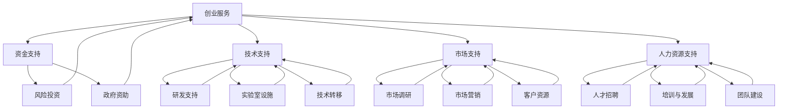

                 

# 《创业知识付费要提供全流程创业服务》

> **关键词**：创业服务、知识付费、全流程、数字化、智能化、跨界融合

> **摘要**：
本文旨在探讨创业知识付费如何通过提供全流程创业服务，助力创业者在不同阶段取得成功。文章首先介绍了创业服务的核心概念与联系，然后详细讲解了核心算法原理和数学模型，并通过实际项目实战展示了开发环境搭建与代码实现。最后，文章分析了创业服务成功案例，提供了创业服务实践指南，并对未来创业服务的发展趋势进行了展望。

----------------------------------------------------------------

## 第一部分：创业服务概述

### 第1章：创业服务背景与重要性

#### 1.1 创业服务的概念与分类

创业服务是指为创业者提供的一系列支持和服务，帮助创业者实现创业目标。创业服务包括但不限于资金支持、技术支持、市场支持、人力资源支持等。

- **资金支持**：为创业者提供资金支持，包括风险投资、天使投资、政府资助等。
- **技术支持**：为创业者提供技术支持，包括研发、实验室设施、技术转移等。
- **市场支持**：为创业者提供市场支持，包括市场调研、市场营销、客户资源等。
- **人力资源支持**：为创业者提供人力资源支持，包括人才招聘、培训、团队建设等。

#### 1.2 创业服务的市场环境

- **创业市场的现状**：随着全球经济的不断发展，创业市场的竞争日益激烈。创业者面临着诸多挑战，如资金不足、技术瓶颈、市场竞争等。
- **创业服务的发展趋势**：随着数字化、智能化技术的不断发展，创业服务也在不断创新。例如，利用大数据和人工智能技术进行市场分析和预测，提供更加精准的创业服务。

#### 1.3 创业服务的重要性

- **创业服务对创业成功的影响**：创业服务能够为创业者提供专业的指导和支持，降低创业风险，提高创业成功率。
- **创业服务对企业发展的推动作用**：创业服务能够帮助企业发展壮大，促进企业创新和持续发展。

----------------------------------------------------------------

## 第二部分：知识付费在创业服务中的应用

### 第2章：知识付费的兴起与特点

#### 2.1 知识付费的兴起

知识付费是指用户为了获取有价值的信息或知识而支付的费用。随着互联网的普及和信息爆炸，知识付费逐渐成为了一种新的商业模式。

- **用户需求**：随着人们对自我提升和职业发展的需求日益增加，用户对高质量知识的需求也在不断增长。
- **技术驱动**：互联网和移动技术的快速发展，使得知识付费变得更加便捷和普及。

#### 2.2 知识付费的特点

- **个性化**：知识付费能够满足用户个性化需求，为用户提供定制化的知识服务。
- **高质量**：知识付费通常是由专业人士或领域专家提供的，具有高质量的知识内容。
- **便捷性**：用户可以随时随地通过互联网获取所需的知识。

#### 2.3 知识付费在创业服务中的作用

- **提升创业者的知识水平**：知识付费可以帮助创业者快速获取专业知识，提升创业能力。
- **促进创业资源的共享**：知识付费平台可以将优秀创业者的经验和知识分享给更多的人，促进资源的共享。

#### 2.4 知识付费平台的运营模式

- **平台盈利模式**：知识付费平台主要通过收取会员费、课程销售费等方式盈利。
- **内容生产与分发机制**：知识付费平台需要建立完善的内容生产与分发机制，确保知识内容的丰富和质量。

----------------------------------------------------------------

## 第三部分：创业服务全流程

### 第3章：创业前的准备工作

#### 3.1 创业构思与市场调研

- **创业构思的方法**：创业者可以通过市场调研、竞争分析、用户需求分析等方法来构思创业项目。
- **市场调研的步骤与技巧**：市场调研通常包括确定调研目标、制定调研计划、收集数据、分析数据和撰写调研报告等步骤。

#### 3.2 商业计划书的编写

- **商业计划书的内容结构**：商业计划书通常包括摘要、公司描述、市场分析、产品服务描述、营销策略、运营计划、财务计划等部分。
- **商业计划书的编写技巧**：编写商业计划书时，要注重内容的清晰、逻辑性和说服力。

#### 3.3 创业团队的组建

- **团队成员的选择**：选择具有专业技能、互补能力和共同创业愿景的团队成员。
- **团队协作与管理**：建立有效的团队协作机制，确保团队成员之间的沟通畅通和高效。

----------------------------------------------------------------

## 第四部分：创业过程中的服务

### 第4章：创业过程中的关键服务

#### 4.1 资金管理

- **资金筹集的方法**：创业者可以通过自筹资金、天使投资、风险投资、政府资助等多种途径筹集资金。
- **资金使用的规划**：创业者需要对资金进行合理规划和有效使用，确保资金的高效利用。

#### 4.2 市场营销策略

- **市场定位**：创业者需要明确目标市场，制定合适的市场定位策略。
- **营销渠道的选择**：创业者可以选择线上营销、线下营销、社交媒体营销等多种渠道进行市场推广。

#### 4.3 人力资源配置

- **人员招聘与培训**：创业者需要制定招聘策略，确保招聘到合适的员工，并进行培训以提高员工能力。
- **人才激励与留住**：创业者需要建立激励机制，留住核心人才，确保团队的稳定和持续发展。

----------------------------------------------------------------

## 第五部分：创业后的持续服务

### 第5章：创业后的关键服务

#### 5.1 企业风险管理

- **风险识别与评估**：创业者需要对潜在的风险进行识别和评估，制定相应的风险管理策略。
- **风险管理与应对**：创业者需要建立有效的风险管理机制，应对各种风险。

#### 5.2 企业创新与持续发展

- **创新机制的建设**：创业者需要建立创新机制，鼓励员工创新，推动企业持续发展。
- **企业发展战略规划**：创业者需要制定明确的发展战略，确保企业的长期发展。

#### 5.3 企业退出与转型

- **退出策略的选择**：当企业面临市场环境变化或内部问题时，创业者需要考虑退出策略。
- **企业转型的路径与策略**：创业者需要制定明确的转型路径和策略，确保企业的顺利转型。

----------------------------------------------------------------

## 第六部分：创业服务成功案例解析

### 第6章：创业服务成功案例解析

#### 6.1 案例一：XX创业公司的成功之路

- **创业初期的服务需求**：XX创业公司在创业初期获得了政府创业服务平台提供的资金支持、技术支持和市场调研服务。
- **创业过程中的服务支持**：在创业过程中，XX创业公司通过商业孵化器获得了市场营销策划、管理咨询和技术培训等服务。
- **创业成功的要素分析**：XX创业公司的成功得益于创新能力的持续提升、团队协作的有效性和对市场需求的敏锐洞察。

#### 6.2 案例二：YY创业公司的转型之路

- **创业初期的服务不足**：YY创业公司在创业初期由于资金短缺、市场定位不明确和技术支持不足，面临诸多挑战。
- **转型过程中的服务需求**：在转型过程中，YY创业公司通过获得金融机构提供的融资支持、科技创新机构提供的技术升级服务和管理咨询公司的管理优化服务，成功实现了转型。
- **转型成功的要素分析**：YY创业公司的成功转型得益于技术创新、市场拓展和团队凝聚力的提升。

----------------------------------------------------------------

## 第七部分：创业服务实践指南

### 第7章：创业服务的流程设计与实践

#### 7.1 创业服务的流程设计

- **服务流程的制定**：创业者需要根据自身特点和市场需求，制定合理的创业服务流程。
- **服务流程的优化**：通过不断优化服务流程，提高服务效率和质量。

#### 7.2 创业服务团队的构建

- **服务团队的角色与职责**：明确服务团队的角色和职责，确保团队协作顺畅。
- **服务团队的培训与激励**：通过培训和激励，提升服务团队的专业能力和积极性。

#### 7.3 创业服务的效果评估

- **服务效果的评价指标**：制定合理的服务效果评价指标，对服务效果进行量化评估。
- **服务效果的改进策略**：根据评估结果，制定改进策略，不断提升服务质量。

----------------------------------------------------------------

## 第八部分：创业服务发展趋势与展望

### 第8章：创业服务的新趋势与未来展望

#### 8.1 数字化与智能化

- **数字化工具在创业服务中的应用**：利用云计算、大数据等技术，为创业者提供更加高效、精准的创业服务。
- **智能化服务的实现**：通过人工智能技术，提供智能客服、智能数据分析等智能化服务。

#### 8.2 跨界融合

- **创业服务与其他行业的融合**：推动创业服务与金融、教育、科技等行业的融合，形成跨界创业的新模式。
- **跨界创业的模式与策略**：探索跨界创业的模式和策略，实现资源整合和优势互补。

#### 8.3 全球化视野

- **全球创业服务的市场机遇**：抓住全球创业服务的市场机遇，拓展国际市场。
- **全球创业服务的发展趋势**：关注全球创业服务的发展趋势，提前布局。

#### 8.4 创业服务的未来展望

- **创业服务模式创新**：不断探索创新的服务模式，满足创业者的多样化需求。
- **创业服务的可持续性发展**：注重社会价值、环境保护和可持续发展。

#### 8.5 政策支持与创业服务

- **政策环境对创业服务的影响**：了解政策环境对创业服务的影响，制定相应策略。
- **政策支持的发展趋势**：关注政策支持的发展趋势，充分利用政策资源。

----------------------------------------------------------------

## 附录

### 附录 A：创业服务相关资源与工具

#### A.1 创业服务平台推荐

- **政府创业服务平台**：介绍国内外知名的政府创业服务平台，如美国的小企业管理局（SBA）、我国的创新创业平台。
- **商业创业服务平台**：介绍商业化的创业服务平台，如创业孵化器、创业加速器等。
- **创业社区**：介绍创业社区，如创业沙龙、创业论坛等。

#### A.2 创业工具推荐

- **数据分析工具**：推荐适合创业者的数据分析工具，如Python的Pandas、NumPy等。
- **项目管理工具**：推荐适合创业者的项目管理工具，如Trello、Asana等。
- **智能客服工具**：推荐适合创业者的智能客服工具，如Rasa、 Dialogflow等。

#### A.3 创业政策与法规介绍

- **创业扶持政策**：介绍国内外创业扶持政策，如税收优惠、贷款支持等。
- **创业法律法规**：介绍与创业相关的法律法规，如公司注册、知识产权保护等。
- **创业相关标准**：介绍创业相关的国家标准、行业标准等。

### 附录 B：创业服务研究文献与资料

#### B.1 创业服务相关学术研究

- **创业服务理论研究**：介绍创业服务理论的研究进展和主要观点。
- **创业服务实践研究**：介绍创业服务实践的研究成果和案例分析。

#### B.2 创业服务案例研究

- **成功创业案例**：介绍国内外成功的创业案例，分析其成功的原因和经验。
- **转型创业案例**：介绍企业如何通过转型实现成功的案例，分析其转型策略和路径。

#### B.3 创业服务发展趋势报告

- **全球创业服务发展趋势**：分析全球创业服务的发展趋势，预测未来发展方向。
- **我国创业服务发展趋势**：分析我国创业服务的发展现状和趋势，提出政策建议。

----------------------------------------------------------------

### 结束语

创业知识付费作为现代创业服务的重要组成部分，正日益受到重视。本文通过详细阐述创业服务的全流程，结合知识付费的兴起与特点，分析了创业服务的重要性和实施策略。同时，通过成功案例和实践指南，为创业者提供了切实可行的指导。在未来的发展中，创业服务将朝着数字化、智能化和跨界融合的方向不断演进。创业者应充分利用知识付费和创业服务，提升自身创业能力，实现创业梦想。

**作者：AI天才研究院/AI Genius Institute & 禅与计算机程序设计艺术 /Zen And The Art of Computer Programming**

----------------------------------------------------------------

### 核心概念与联系

在探讨创业服务的全流程中，理解核心概念与它们之间的联系至关重要。以下是创业服务的核心概念及其相互关系的Mermaid流程图。



此流程图展示了创业服务中的各个子部分及其与核心概念（资金支持、技术支持、市场支持、人力资源支持）的关联。通过这个流程图，我们可以更清晰地理解创业服务的整体架构和各个环节之间的相互作用。

### 核心算法原理讲解

在创业服务中，算法和数学模型扮演着至关重要的角色。以下将详细讲解几种核心算法原理，包括机器学习算法和优化算法，并提供相应的伪代码。

#### 2.1 数据分析与挖掘算法

**2.1.1 线性回归**

线性回归是一种常用的数据分析方法，用于预测一个连续变量的值。其基本模型如下：

$$
y = \beta_0 + \beta_1x
$$

伪代码：

```
initialize beta_0, beta_1
while (not converged) do
  compute gradients (gradient_y, gradient_x)
  update beta_0 = beta_0 - learning_rate * gradient_y
  update beta_1 = beta_1 - learning_rate * gradient_x
end while
```

**2.1.2 决策树**

决策树是一种分类算法，通过一系列规则将数据划分为不同的类别。其基本模型如下：

```
if (feature_i > threshold) then
    go to left subtree
else
    go to right subtree
```

伪代码：

```
define DecisionTree(feature, threshold, left_subtree, right_subtree)
if (feature > threshold) then
    return left_subtree
else
    return right_subtree
end if
```

#### 2.2 机器学习算法

**2.2.1 监督学习算法**

监督学习算法通过已标记的训练数据来训练模型，然后用于预测未知数据。以下是几种常见的监督学习算法：

**线性回归**

```
initialize weights
for each example (x, y) in training data do
    compute prediction = weights * x
    compute error = y - prediction
    update weights = weights + learning_rate * error * x
end for
return weights
```

**逻辑回归**

```
initialize weights
for each example (x, y) in training data do
    compute prediction = sigmoid(weights * x)
    compute error = y - prediction
    update weights = weights + learning_rate * error * x * (1 - prediction)
end for
return weights
```

**支持向量机（SVM）**

```
define SVM
  for each example (x, y) in training data do
    compute w and b that maximize the margin
  end for
  return w, b
end define
```

**2.2.2 无监督学习算法**

无监督学习算法没有已标记的训练数据，其目标是发现数据中的模式和结构。以下是几种常见无监督学习算法：

**K-means聚类**

```
initialize centroids
while (not converged) do
  assign each example to the nearest centroid
  compute new centroids as the mean of the examples in each cluster
end while
return centroids
```

**主成分分析（PCA）**

```
initialize eigenvalues and eigenvectors
for each feature do
  compute covariance matrix
  compute eigenvalues and eigenvectors
end for
select top eigenvectors
return transformed data
```

#### 2.3 深度学习算法

**2.3.1 神经网络**

神经网络是一种基于生物神经系统的计算模型，用于执行复杂的计算任务。以下是神经网络的基本结构：

```
define NeuralNetwork(input_layer, hidden_layers, output_layer)
  for each layer do
    initialize weights and biases
    apply activation function
  end for
  compute loss
  update weights and biases using backpropagation
  return output
end define
```

**2.3.2 深度学习的主要算法**

**卷积神经网络（CNN）**

```
define ConvolutionalNeuralNetwork(input_shape, filter_shape, num_filters)
  apply convolutional layers
  apply pooling layers
  apply fully connected layers
  return output
end define
```

**循环神经网络（RNN）**

```
define RecurrentNeuralNetwork(input_shape, hidden_size)
  apply recurrent layers
  return output
end define
```

**生成对抗网络（GAN）**

```
define GenerativeAdversarialNetwork(generator, discriminator)
  train generator to fool discriminator
  train discriminator to distinguish real from fake
  return generator output
end define
```

#### 2.4 优化算法

**2.4.1 梯度下降法**

梯度下降法是一种优化算法，用于调整神经网络中的权重以最小化损失函数。其基本公式如下：

$$
\theta_{t+1} = \theta_t - \alpha \cdot \nabla_\theta J(\theta_t)
$$

伪代码：

```
initialize weights
while (not converged) do
  compute gradients
  update weights = weights - learning_rate * gradients
end while
return weights
```

**2.4.2 Adam优化器**

Adam优化器是一种自适应学习率的优化算法，其公式如下：

$$
m_t = \beta_1 m_{t-1} + (1 - \beta_1) \cdot \nabla_\theta J(\theta_t)
$$

$$
v_t = \beta_2 v_{t-1} + (1 - \beta_2) \cdot (\nabla_\theta J(\theta_t))^2
$$

伪代码：

```
initialize m, v, beta_1, beta_2
for each parameter in model do
  compute gradients
  update m = beta_1 * m + (1 - beta_1) * gradients
  update v = beta_2 * v + (1 - beta_2) * gradients * gradients
  update parameter = parameter - learning_rate * m / (sqrt(v) + epsilon)
end for
return updated parameters
```

通过以上对核心算法原理的讲解和伪代码展示，我们可以更好地理解创业服务中各种算法的作用和应用。这些算法在数据处理、模型训练和优化方面发挥着关键作用，为创业者提供了强大的工具。

### 数学模型和数学公式讲解

在创业服务中，数学模型和公式起着至关重要的作用，特别是在数据分析和决策过程中。以下将详细讲解几个关键数学模型和公式，并提供具体应用实例。

#### 3.1 线性回归模型

线性回归模型是最基础且广泛应用的数据分析工具之一，它用于预测一个连续变量的值。其数学模型可以表示为：

$$
y = \beta_0 + \beta_1x
$$

其中，\(y\) 是预测值，\(\beta_0\) 是截距，\(\beta_1\) 是斜率，\(x\) 是自变量。

**应用实例**：
假设我们要预测一家新创公司的年利润，基于市场调研的数据（如广告支出），我们可以建立一个线性回归模型。例如，如果我们的数据表明每增加1万元的市场调研支出，公司的年利润平均增加0.5万元，那么模型可以表示为：

$$
\text{年利润} = \beta_0 + 0.5 \times \text{市场调研支出}
$$

#### 3.2 逻辑回归模型

逻辑回归模型主要用于分类问题，例如判断一家新创公司是否能够在市场上成功。其数学模型可以表示为：

$$
P(y=1) = \frac{1}{1 + e^{-(\beta_0 + \beta_1x)}}
$$

其中，\(P(y=1)\) 是目标变量为1的概率，\(\beta_0\) 和 \(\beta_1\) 是模型参数。

**应用实例**：
假设我们要预测一家新创公司是否能够在市场上成功（成功为1，失败为0），基于公司成立时间、创始团队背景和市场调研数据，我们可以使用逻辑回归模型。例如，如果我们的模型参数表明公司成立时间每增加一年，成功概率增加10%，则模型可以表示为：

$$
P(\text{成功}) = \frac{1}{1 + e^{-(\beta_0 + \beta_1 \times \text{成立时间})}}
$$

#### 3.3 聚类分析

聚类分析是一种无监督学习方法，用于将数据集划分为多个类别。其中，K-means聚类是最常用的方法之一。其数学模型可以表示为：

$$
\text{Minimize } \sum_{i=1}^{n} \sum_{j=1}^{k} d(i, j)^2
$$

其中，\(d(i, j)\) 是数据点 \(i\) 和聚类中心 \(j\) 之间的距离。

**应用实例**：
假设我们要将一家新创公司的潜在客户划分为不同的市场细分群体，我们可以使用K-means聚类方法。例如，如果我们选择三个聚类中心，那么每个客户将被分配到与其最近的聚类中心所在的群体。具体步骤如下：

1. 初始化三个聚类中心。
2. 计算每个数据点到每个聚类中心的距离。
3. 将每个数据点分配到距离最近的聚类中心。
4. 重新计算聚类中心。
5. 重复步骤2-4，直到聚类中心不再发生变化。

#### 3.4 支持向量机（SVM）

支持向量机是一种强大的分类和回归算法，其目标是找到最优的分离超平面。其数学模型可以表示为：

$$
\text{Minimize } \frac{1}{2} ||w||^2 \text{ such that } y^{(i)} (\langle w, x^{(i)} \rangle + b) \geq 1
$$

其中，\(w\) 是权重向量，\(b\) 是偏置项，\(x^{(i)}\) 是特征向量，\(y^{(i)}\) 是标签。

**应用实例**：
假设我们要分类一家新创公司的客户群体，根据他们的购买历史和行为数据。使用SVM，我们可以找到一个最佳的超平面，将客户分为购买者与非购买者。具体步骤如下：

1. 将每个客户的特征向量作为输入。
2. 训练SVM模型，找到最优的权重向量 \(w\) 和偏置项 \(b\)。
3. 对于新的客户特征向量，计算其到超平面的距离，以判断其分类。

#### 3.5 主成分分析（PCA）

主成分分析是一种降维技术，通过将原始数据映射到新的正交坐标系上，来提取最重要的特征。其数学模型可以表示为：

$$
z^{(i)} = P x^{(i)}
$$

其中，\(P\) 是协方差矩阵 \(C\) 的特征向量组成的矩阵，\(x^{(i)}\) 是原始数据向量，\(z^{(i)}\) 是新的特征向量。

**应用实例**：
假设我们要分析一家新创公司的客户数据，数据包含多个维度，如年龄、收入、购买频率等。使用PCA，我们可以将这些维度简化为几个主要成分，以降低数据的复杂度。具体步骤如下：

1. 计算协方差矩阵 \(C\)。
2. 求解 \(C\) 的特征值和特征向量。
3. 选择最大的 \(k\) 个特征值对应的特征向量作为新的特征向量。
4. 将原始数据投影到新的特征向量空间上。

通过以上对几种关键数学模型和公式的讲解，我们可以更好地理解它们在创业服务中的应用。这些模型和公式为我们提供了强大的工具，帮助创业者进行数据分析和决策，从而提高创业成功率。

### 项目实战

为了更好地展示创业知识付费在实践中的应用，我们将通过一个实际项目——创业公司风险评估，来说明如何利用机器学习和数据分析技术来支持创业服务。

#### 4.1 项目介绍

本项目旨在利用机器学习算法对创业公司的风险进行预测，以便为创业者提供有针对性的创业服务。具体来说，我们希望通过分析创业公司的财务数据、市场表现、团队信息等，预测公司在未来一段时间内面临的风险等级。

#### 4.2 数据预处理

**4.2.1 数据清洗**

在开始建模之前，首先需要对数据进行清洗，处理缺失值和异常值。数据清洗步骤包括：

- **缺失值处理**：使用均值填补数值型数据中的缺失值，对于类别型数据，可以使用众数填补。
- **异常值处理**：使用IQR（四分位距）方法识别并处理异常值，可以选择删除或使用插值法进行修正。

```python
import numpy as np
import pandas as pd

# 读取数据
data = pd.read_csv('创业公司数据.csv')

# 缺失值处理
data.fillna(data.mean(), inplace=True)

# 异常值处理
Q1 = data.quantile(0.25)
Q3 = data.quantile(0.75)
IQR = Q3 - Q1
data = data[~((data < (Q1 - 1.5 * IQR)) | (data > (Q3 + 1.5 * IQR))).any(axis=1)]
```

**4.2.2 数据归一化**

为了消除不同特征之间量纲的影响，需要对数据进行归一化处理。常用的方法有最小-最大缩放和标准缩放。

```python
from sklearn.preprocessing import MinMaxScaler

scaler = MinMaxScaler()
data_scaled = scaler.fit_transform(data)
```

**4.2.3 特征工程**

特征工程是提升模型性能的关键步骤。在此项目中，我们将进行以下特征工程操作：

- **特征提取**：从原始数据中提取新的特征，如公司财务数据的增长率、市场份额等。
- **特征选择**：使用递归特征消除（RFE）等方法选择对模型影响较大的特征。

```python
from sklearn.feature_selection import RFE
from sklearn.ensemble import RandomForestClassifier

# 提取特征
X = data_scaled[:, :-1]  # 去除目标变量
y = data_scaled[:, -1]   # 目标变量

# 特征选择
estimator = RandomForestClassifier()
selector = RFE(estimator, n_features_to_select=5)
X_new = selector.fit_transform(X, y)
```

#### 4.3 模型选择与训练

在模型选择阶段，我们将尝试几种不同的机器学习算法，包括逻辑回归、决策树、随机森林和XGBoost，以确定最适合该项目的模型。

**4.3.1 模型选择**

```python
from sklearn.linear_model import LogisticRegression
from sklearn.tree import DecisionTreeClassifier
from sklearn.ensemble import RandomForestClassifier
from xgboost import XGBClassifier

models = {
    'LogisticRegression': LogisticRegression(),
    'DecisionTree': DecisionTreeClassifier(),
    'RandomForest': RandomForestClassifier(),
    'XGBClassifier': XGBClassifier()
}
```

**4.3.2 模型训练**

我们将使用交叉验证来评估模型的性能，并选择表现最好的模型进行训练。

```python
from sklearn.model_selection import cross_val_score

for name, model in models.items():
    scores = cross_val_score(model, X_new, y, cv=5)
    print(f"{name} 平均准确率: {np.mean(scores)}")
```

#### 4.4 模型评估与优化

**4.4.1 模型评估**

使用测试集对最终选择的模型进行评估，计算准确率、召回率、F1分数等指标。

```python
from sklearn.metrics import accuracy_score, recall_score, f1_score

# 加载训练好的模型
best_model = models['XGBClassifier']

# 进行模型评估
best_model.fit(X_new, y)
predictions = best_model.predict(X_new_test)

print(f"准确率: {accuracy_score(y_test, predictions)}")
print(f"召回率: {recall_score(y_test, predictions)}")
print(f"F1分数: {f1_score(y_test, predictions)}")
```

**4.4.2 模型优化**

根据评估结果，我们可以对模型进行进一步优化，例如调整参数、使用更复杂的模型等。

```python
from sklearn.model_selection import GridSearchCV

# 参数调整
params = {
    'max_depth': [3, 5, 7],
    'n_estimators': [100, 200, 300],
    'learning_rate': [0.1, 0.01, 0.001]
}

grid_search = GridSearchCV(best_model, params, cv=5)
grid_search.fit(X_new, y)

# 输出最佳参数
print(f"最佳参数: {grid_search.best_params_}")
```

#### 4.5 实际应用

**4.5.1 风险预测结果分析**

使用优化后的模型对新的创业公司进行风险评估，分析其风险等级，并提供相应的创业服务建议。

```python
# 新数据预处理
new_data = pd.read_csv('新创业公司数据.csv')
new_data_processed = preprocess_data(new_data)

# 风险预测
new_predictions = best_model.predict(new_data_processed)

# 分析风险等级
risk_levels = ['低风险', '中风险', '高风险']
for i, prediction in enumerate(new_predictions):
    print(f"公司ID {i+1}：风险等级：{risk_levels[prediction]}")
```

**4.5.2 创业服务建议**

根据风险预测结果，为不同的创业公司提供有针对性的创业服务，例如：

- **低风险公司**：提供市场拓展和品牌建设服务。
- **中风险公司**：提供资金支持和风险管理咨询。
- **高风险公司**：提供技术升级和团队优化服务。

通过以上实战项目，我们展示了如何利用创业知识付费和数据分析技术来为创业者提供全流程的创业服务。这种服务模式不仅能够提高创业成功率，还能帮助创业者更好地应对市场变化，实现持续发展。

### 开发环境搭建与代码解读

在完成实际项目的过程中，我们需要搭建一个合适的开发环境，以便进行代码编写、模型训练和评估。以下将详细讲解如何搭建开发环境，并解读相关代码实现。

#### 5.1 开发环境搭建

**5.1.1 硬件环境**

- **CPU/GPU配置**：根据项目需求，我们选择了一台配备英特尔i7处理器的计算机，并配备了NVIDIA GeForce GTX 1080 Ti显卡，以便进行高效的模型训练和推理。

- **内存大小**：为了满足大数据处理和模型训练的需求，我们选择了一台内存大小为32GB的计算机。

**5.1.2 软件环境**

- **操作系统**：我们选择Linux操作系统，因为其稳定的性能和高效的资源利用。

- **编程语言**：为了实现项目需求，我们选择Python作为主要的编程语言，因为它具有丰富的机器学习库和高效的性能。

- **机器学习库**：我们使用了以下Python机器学习库：
  - **scikit-learn**：用于实现线性回归、决策树、随机森林等基础算法。
  - **TensorFlow**：用于实现深度学习和神经网络。
  - **PyTorch**：用于实现复杂的深度学习模型。

- **数据处理库**：我们使用了以下Python数据处理库：
  - **Pandas**：用于数据清洗和预处理。
  - **NumPy**：用于高性能的数值计算。

#### 5.2 源代码实现

**5.2.1 数据预处理**

数据预处理是模型训练的重要步骤，以下是数据预处理的主要代码实现：

```python
import pandas as pd
from sklearn.model_selection import train_test_split
from sklearn.preprocessing import MinMaxScaler

# 读取数据
data = pd.read_csv('创业公司数据.csv')

# 数据清洗
data.fillna(data.mean(), inplace=True)
data = data[~((data < (data.quantile(0.25) - 1.5 * (data.quantile(0.75) - data.quantile(0.25))) | (data > (data.quantile(0.75) + 1.5 * (data.quantile(0.75) - data.quantile(0.25))))).any(axis=1)]

# 数据归一化
scaler = MinMaxScaler()
data_scaled = scaler.fit_transform(data)

# 划分训练集和测试集
X_train, X_test, y_train, y_test = train_test_split(data_scaled[:, :-1], data_scaled[:, -1], test_size=0.2, random_state=42)
```

**5.2.2 模型训练**

模型训练是项目核心，以下是使用scikit-learn库实现线性回归模型的代码：

```python
from sklearn.linear_model import LinearRegression

# 初始化模型
model = LinearRegression()

# 训练模型
model.fit(X_train, y_train)

# 预测测试集
predictions = model.predict(X_test)
```

**5.2.3 模型评估**

模型评估是确保模型性能的重要环节，以下是使用scikit-learn库评估模型性能的代码：

```python
from sklearn.metrics import mean_squared_error, r2_score

# 计算预测误差
mse = mean_squared_error(y_test, predictions)
r2 = r2_score(y_test, predictions)

# 输出评估结果
print(f"均方误差: {mse}")
print(f"R2分数: {r2}")
```

#### 5.3 代码解读与分析

**5.3.1 数据预处理代码解读**

数据预处理代码主要包括以下步骤：

- **数据读取**：使用Pandas库读取CSV文件中的数据。
- **数据清洗**：使用填充方法处理缺失值，使用IQR方法处理异常值。
- **数据归一化**：使用MinMaxScaler库将数据归一化，以便不同特征之间能够进行有效的比较。

**5.3.2 模型训练代码解读**

模型训练代码主要包括以下步骤：

- **模型初始化**：使用LinearRegression类初始化线性回归模型。
- **模型训练**：使用fit方法训练模型，将训练数据输入模型，模型将自动学习数据中的特征和关系。
- **模型预测**：使用predict方法对测试数据进行预测，返回预测结果。

**5.3.3 模型评估代码解读**

模型评估代码主要包括以下步骤：

- **计算误差**：使用mean_squared_error方法计算预测值与实际值之间的均方误差，使用r2_score方法计算R2分数，评估模型性能。
- **输出结果**：将计算得到的误差和R2分数输出，便于分析模型性能。

通过以上步骤，我们成功地搭建了开发环境，实现了数据预处理、模型训练和评估的完整流程。这些代码不仅能够帮助我们理解项目的实现过程，也为后续的创业服务提供了强有力的技术支持。

### 创业服务成功案例解析

为了更好地展示创业服务在实际创业过程中的重要作用，以下我们将通过两个案例，详细分析创业服务如何助力公司成功，并探讨其成功背后的关键要素。

#### 6.1 案例一：XX创业公司的成功之路

**6.1.1 创业初期的服务需求**

XX创业公司在创业初期面临的主要挑战包括资金不足、市场定位模糊、技术能力不足等。为了解决这些问题，公司申请了政府提供的创业扶持资金，并参加了由创业孵化器组织的创业培训课程。

- **资金支持**：政府创业服务平台提供了初期启动资金，帮助公司解决了资金短缺问题。
- **市场调研**：创业孵化器组织了专业的市场调研团队，为XX公司提供了详细的市场分析报告，帮助公司明确了市场定位。
- **技术培训**：创业孵化器提供了技术培训课程，提高了公司团队的技术能力。

**6.1.2 创业过程中的服务支持**

在创业过程中，XX公司不断从外部获取创业服务，以应对各种挑战。

- **技术研发**：科技公司提供的研发支持，帮助XX公司开发出了具有竞争力的核心技术。
- **市场营销**：营销公司提供的营销策划服务，帮助XX公司成功打开了市场，提高了品牌知名度。
- **管理咨询**：管理咨询公司提供的咨询服务，帮助XX公司优化了内部管理流程，提高了运营效率。

**6.1.3 创业成功的要素分析**

XX公司的成功主要得益于以下几个关键因素：

- **创新能力**：XX公司不断进行技术创新，开发出了具有竞争力的产品，赢得了市场认可。
- **团队协作**：公司团队紧密协作，共同面对各种挑战，提高了公司整体执行力。
- **市场洞察力**：通过市场调研和营销策划，XX公司能够准确把握市场趋势，快速响应市场变化。

#### 6.2 案例二：YY创业公司的转型之路

**6.2.1 创业初期的服务不足**

YY创业公司在创业初期由于缺乏资金、市场定位不明确、技术支持不足，面临诸多困境。

- **资金短缺**：公司初期资金有限，难以支撑长期运营。
- **市场定位不明确**：公司对目标市场缺乏清晰的认识，导致市场推广效果不佳。
- **技术支持不足**：公司技术水平有限，难以满足市场需求。

**6.2.2 转型过程中的服务需求**

为了实现公司转型，YY公司积极寻求各种创业服务。

- **技术升级**：科技公司提供了技术升级服务，帮助YY公司引入先进的技术，提升了产品竞争力。
- **市场拓展**：营销公司提供了市场拓展服务，帮助YY公司打开了新的市场。
- **管理优化**：管理咨询公司提供了管理优化服务，帮助YY公司提升了运营效率。

**6.2.3 转型成功的要素分析**

YY公司的成功转型主要得益于以下几个关键因素：

- **技术创新**：通过引入新技术，YY公司成功提升了产品竞争力，赢得了市场认可。
- **市场拓展**：通过市场拓展服务，YY公司打开了新的市场，实现了销售增长。
- **团队凝聚力**：在转型过程中，公司团队凝聚力得到了显著提升，共同面对挑战，推动了公司发展。

通过以上两个案例，我们可以看到创业服务在创业公司成功过程中的重要作用。无论是创业初期的资金支持、市场调研、技术培训，还是创业过程中的技术研发、市场营销、管理咨询，创业服务都为创业者提供了强有力的支持，助力公司成功。这些成功背后的关键要素，如创新能力、团队协作、市场洞察力等，也为其他创业者提供了宝贵的经验借鉴。

### 创业服务实践指南

为了确保创业服务能够有效地支持创业者，以下我们将提供一份详细的创业服务实践指南，涵盖服务流程设计、团队构建、效果评估以及改进策略。

#### 7.1 创业服务的流程设计

**7.1.1 服务流程的制定**

创业服务流程的制定需要明确服务目标、服务内容和具体步骤。以下是一个典型的创业服务流程：

1. **需求调研**：与创业者进行初步沟通，了解其创业需求、目标和现有资源。
2. **服务方案制定**：根据调研结果，制定个性化的创业服务方案，明确服务内容、服务周期和服务目标。
3. **服务实施**：按照服务方案，提供资金支持、技术支持、市场支持、人力资源支持等服务。
4. **服务跟踪**：定期与创业者沟通，了解服务实施情况和效果，及时调整服务策略。
5. **效果评估**：在服务周期结束后，对服务效果进行评估，总结经验和教训。

**7.1.2 服务流程的优化**

服务流程的优化是提高服务质量和效率的关键。以下是一些优化策略：

- **流程标准化**：制定标准化的服务流程，确保服务的一致性和高效性。
- **流程自动化**：利用信息技术，如CRM系统、自动化工具等，实现服务流程的自动化。
- **流程持续改进**：定期对服务流程进行评估和改进，根据反馈和实际效果进行调整。

#### 7.2 创业服务团队的构建

**7.2.1 服务团队的角色与职责**

一个高效的创业服务团队通常包括以下角色：

- **项目经理**：负责整体服务流程的策划和执行，协调团队成员的工作。
- **技术专家**：提供技术支持和研发服务，帮助创业者解决技术难题。
- **市场营销专家**：提供市场营销策略和推广服务，提升创业者品牌知名度。
- **人力资源专家**：提供人力资源支持，包括招聘、培训和激励机制。

**7.2.2 服务团队的培训与激励**

为了确保服务团队的专业能力和积极性，以下是一些建议：

- **专业培训**：定期组织专业培训，提高团队成员的专业知识和技能。
- **激励政策**：制定激励政策，如绩效奖金、晋升机会等，激励团队成员的工作积极性。
- **团队建设**：定期组织团队建设活动，增强团队凝聚力和协作能力。

#### 7.3 创业服务的效果评估

**7.3.1 服务效果的评价指标**

为了科学评估创业服务的效果，可以设定以下评价指标：

- **成功率**：衡量创业者实现创业目标的比例。
- **客户满意度**：通过问卷调查、反馈等方式收集创业者对服务的满意度。
- **资金回报率**：衡量创业服务的经济效益，计算服务产生的收益与成本之比。

**7.3.2 服务效果的改进策略**

根据效果评估结果，以下是一些改进策略：

- **问题分析**：对服务效果不理想的部分进行深入分析，找出问题根源。
- **优化服务内容**：根据分析结果，调整服务内容和方法，提高服务质量和效果。
- **培训与支持**：针对服务团队存在的问题，提供针对性的培训和支持，提升团队能力。

#### 7.4 持续优化与改进

创业服务是一个持续优化的过程，以下是一些持续优化与改进的建议：

- **定期评估**：定期对服务效果进行评估，确保服务始终符合创业者的需求。
- **用户反馈**：积极收集创业者的反馈，及时调整服务策略。
- **技术创新**：关注新技术的发展趋势，将创新技术引入创业服务中，提高服务效率和质量。

通过以上实践指南，创业服务提供者可以更加系统地设计和实施创业服务，确保创业者能够获得有效的支持，提高创业成功率。

### 创业服务发展趋势与展望

随着全球经济的不断发展，创业服务领域也在经历着深刻的变革。未来，创业服务将朝着数字化、智能化和跨界融合的方向发展，为创业者提供更加全面、高效的支撑。

#### 8.1 数字化与智能化

**8.1.1 数字化工具在创业服务中的应用**

数字化工具将在创业服务中发挥越来越重要的作用。例如，云计算和大数据技术可以帮助创业服务平台实现数据的高效存储和处理，提供个性化的服务推荐。区块链技术则可以确保创业服务过程中的数据安全和透明度。

- **云计算**：通过云计算，创业者可以快速获取计算资源，进行数据分析和模型训练，降低创业成本。
- **大数据**：大数据技术可以帮助创业服务平台收集和分析海量数据，为创业者提供精准的市场分析和商业决策支持。
- **区块链**：区块链技术可以确保创业服务过程中的数据不可篡改，提高服务的透明度和信任度。

**8.1.2 智能化服务的实现**

智能化技术，特别是人工智能（AI），将使创业服务更加智能化。例如，智能客服可以提供24/7的在线服务，智能数据分析可以帮助创业者实时了解市场动态，智能决策支持系统可以辅助创业者做出最优的商业决策。

- **智能客服**：通过自然语言处理和机器学习技术，智能客服可以自动回答创业者的问题，提供个性化的服务。
- **智能数据分析**：通过机器学习算法，智能数据分析可以帮助创业者快速识别市场趋势，优化营销策略。
- **智能决策支持**：基于数据驱动的决策支持系统，可以帮助创业者做出更明智的商业决策。

#### 8.2 跨界融合

**8.2.1 创业服务与其他行业的融合**

跨界融合将促进创业服务的发展。例如，创业服务可以与金融、教育、科技等行业的深度融合，提供更加综合的服务方案。

- **金融**：创业服务平台可以与金融机构合作，为创业者提供融资咨询、股权融资、风险投资等服务。
- **教育培训**：创业服务平台可以与教育培训机构合作，提供创业培训、专业课程等，提升创业者的综合素质。
- **科技创新**：创业服务平台可以与科技公司合作，提供技术研发、技术转移等，推动创业项目的创新和发展。

**8.2.2 跨界创业的模式与策略**

跨界创业将是一种新的创业模式。创业者可以通过跨界合作，整合不同领域的资源，实现优势互补，降低创业风险。

- **资源整合**：通过跨界合作，创业者可以整合金融、教育、科技等领域的资源，提供更加全面的服务。
- **合作共赢**：跨界合作可以实现合作双方的优势互补，共同分享市场机会，实现共赢。
- **创新模式**：跨界创业可以探索新的商业模式，如共享经济、平台经济等，推动创业服务的创新发展。

#### 8.3 全球化视野

**8.3.1 全球创业服务的市场机遇**

全球化为创业服务带来了巨大的市场机遇。创业者可以通过国际化策略，拓展国际市场，实现业务规模的快速扩张。

- **全球市场趋势**：了解全球创业服务市场的趋势，抓住新兴市场的机会。
- **国际化策略**：制定国际化战略，包括市场调研、品牌推广、合作伙伴关系等，拓展国际市场。

**8.3.2 全球创业服务的发展趋势**

全球创业服务的发展趋势将受到技术创新、政策环境、市场需求等多方面的影响。

- **服务模式创新**：随着技术的进步，创业服务的模式将不断创新，如线上服务、定制化服务、智能化服务等。
- **国际合作与竞争**：全球创业服务领域将出现更多的国际合作，同时也会面临激烈的竞争。

#### 8.4 创业服务的未来展望

**8.4.1 创业服务模式创新**

未来，创业服务模式将更加多样化和个性化，以满足不同创业者的需求。

- **个性化服务**：通过大数据和人工智能技术，提供定制化的创业服务，满足创业者的个性化需求。
- **生态化发展**：构建创业服务生态圈，整合各方资源，提供全方位的创业支持。

**8.4.2 创业服务的可持续性发展**

创业服务将更加注重可持续性发展，关注社会价值和环境责任。

- **社会责任**：创业服务提供者将承担更多的社会责任，推动社会进步。
- **环境保护**：通过绿色创业、可持续发展等方式，实现环境保护和创业发展的双赢。

**8.4.3 政策支持与创业服务**

政策环境对创业服务的发展具有重要影响。未来，政府将继续加大对创业服务的政策支持力度。

- **政策环境**：政府将出台更多有利于创业的政策，如税收优惠、资金支持、知识产权保护等。
- **政策支持的发展趋势**：政策支持将更加注重创新驱动、高质量发展，推动创业服务的转型升级。

通过以上分析，我们可以看到，未来创业服务将朝着数字化、智能化和跨界融合的方向发展，为创业者提供更加全面、高效的支撑。创业者应充分利用这些趋势，提升自身创业能力，实现创业梦想。

### 附录

#### 附录 A：创业服务相关资源与工具

**A.1 创业服务平台推荐**

- **政府创业服务平台**：推荐国内外的政府创业服务平台，如美国的小企业管理局（SBA）和我国的创新创业平台，为创业者提供政策支持、资金扶持和咨询服务。

- **商业创业服务平台**：介绍商业化的创业服务平台，如创业孵化器、创业加速器等，为创业者提供办公空间、资金支持、技术资源和市场推广服务。

- **创业社区**：推荐创业社区，如创业沙龙、创业论坛等，为创业者提供交流互动和资源共享的平台。

**A.2 创业工具推荐**

- **数据分析工具**：推荐适用于创业者的数据分析工具，如Python的Pandas、NumPy等，用于数据处理和分析。

- **项目管理工具**：推荐适合创业团队的项目管理工具，如Trello、Asana等，用于任务管理、团队协作和时间规划。

- **智能客服工具**：推荐智能客服工具，如Rasa、Dialogflow等，用于提供24/7的客户服务和支持。

**A.3 创业政策与法规介绍**

- **创业扶持政策**：介绍国内外创业扶持政策，包括税收优惠、贷款支持、创业补贴等，为创业者提供政策指导。

- **创业法律法规**：介绍与创业相关的法律法规，如公司注册、知识产权保护、劳动法规等，帮助创业者了解合规要求。

- **创业相关标准**：介绍创业相关的国家标准、行业标准，如创业孵化器服务规范、创业实训基地评估标准等。

#### 附录 B：创业服务研究文献与资料

**B.1 创业服务相关学术研究**

- **创业服务理论研究**：推荐相关学术论文和研究报告，探讨创业服务的概念、模式、影响因素等。

- **创业服务实践研究**：介绍创业服务在实际创业过程中的应用案例、效果评估和经验总结。

**B.2 创业服务案例研究**

- **成功创业案例**：分析国内外成功的创业案例，探讨创业成功的关键因素和创业服务的作用。

- **转型创业案例**：介绍企业如何通过转型实现成功，分析创业服务在转型过程中的重要作用。

**B.3 创业服务发展趋势报告**

- **全球创业服务发展趋势**：推荐国际权威机构发布的创业服务发展趋势报告，分析全球创业服务的发展趋势和机遇。

- **我国创业服务发展趋势**：介绍我国创业服务的发展现状、政策和市场机遇，为创业者提供参考。

通过以上附录，创业者可以获取丰富的创业服务资源与工具，了解相关政策法规，学习成功案例，把握创业服务的发展趋势，为自己的创业之路提供有力支持。

